# 第十二章：Angular Material 简介

在开发 Web 应用程序时，您必须决定如何创建您的**用户界面**（**UI**）。它理想上应使用适当的对比色，具有一致的外观和感觉，响应式，并在不同的设备和浏览器上运行良好。简而言之，关于 UI 和 UX 有很多事情要考虑。许多开发者认为创建 UI/UX 是一项艰巨的任务，并转向 UI 框架来承担大部分繁重的工作。有些框架比其他框架使用得更多，即**Bootstrap**和**Tailwind CSS**。然而，基于 Google 的**Material Design**技术的**Angular Material**框架已经获得了流行。在本章中，我们将解释 Material Design 是什么，以及 Angular Material 如何使用它为 Angular 框架提供一个组件 UI 库。我们还将通过在我们的 e-shop 应用程序中应用它们来学习使用各种 Angular Material 组件。

在本章中，我们将进行以下操作：

+   介绍 Material Design

+   介绍 Angular Material

+   集成 UI 组件

# 技术要求

本章包含各种代码示例，以向您介绍 Angular Material 的概念。您可以在以下 GitHub 仓库的`ch12`文件夹中找到相关的源代码：

[`www.github.com/PacktPublishing/Learning-Angular-Fifth-Edition`](https://www.github.com/PacktPublishing/Learning-Angular-Fifth-Edition)

# 介绍 Material Design

Material Design 是由 Google 开发的一种设计语言，其目标是：

+   开发一个单一的基础系统，允许在各个平台和设备尺寸上提供统一的使用体验。

+   移动原则是基本的，但触摸、语音、鼠标和键盘都是一等输入方法。

设计语言的目的在于让用户处理 UI 和用户交互在各个设备上的外观和感觉。Material Design 基于以下三个主要原则：

+   **材料是隐喻**：它受到物理世界中的不同纹理和介质（如纸张和墨水）的启发。

+   **粗体、图形化和有意图的**：它受到不同的印刷设计方法（如排版、网格和颜色）的指导，为用户提供沉浸式的体验。

+   **运动赋予意义**：通过创建动画和交互来重新组织环境，元素在屏幕上显示。

Material Design 背后有许多理论，如果您想深入了解，可以查阅相关的适当文档。您可以在官方文档网站上找到更多信息：[`material.io`](https://material.io)

如果你不是设计师，设计语言本身可能并不那么有趣。在下一节中，我们将学习 Angular 开发者如何通过 Angular Material 库从 Material Design 中受益。

# 介绍 Angular Material

Angular Material 库是为了实现 Angular 框架的 Material Design 而开发的。它基于以下概念：

+   **从零开始构建应用**：目的是让作为应用开发者的您能够迅速上手。设置所需的工作量应尽可能小。

+   **快速且一致**：性能一直是重点，Angular Material 保证在所有主要浏览器上都能良好工作。

+   **通用性**：许多主题应该很容易自定义，并且还有对本地化和国际化的强大支持。

+   **针对 Angular 优化**：Angular 团队构建了它的事实意味着对 Angular 的支持是一个重要优先事项。

该库分为以下主要部分：

+   **组件**：许多 UI 组件，如不同类型的输入、按钮、布局、导航、模态以及其他展示表格数据的方式，都已准备好以帮助您成功。

+   **主题**：该库附带预安装的主题，但如果您想创建自己的主题，也可以参考[`material.angular.io/guide/theming`](https://material.angular.io/guide/theming)中的主题指南。

Angular Material 库的每个部分和组件都封装了开箱即用的 Web 无障碍最佳实践。

Angular Material 库的核心是**Angular CDK**，它是一组实现与任何展示风格无关的类似交互模式的工具集合。Angular Material 组件的行为是使用 Angular CDK 设计的。Angular CDK 如此抽象，以至于您可以用它来创建自定义组件。如果您是 UI 库的作者，您应该认真考虑它。

我们已经涵盖了关于 Angular Material 的所有基本理论，所以让我们在以下部分通过将其与 Angular 应用集成来将其付诸实践。

## 安装 Angular Material

Angular Material 库是一个 npm 包。为了安装它，我们需要手动执行`npm install`命令并将几个 Angular 工件导入到我们的 Angular 应用中。Angular 团队通过创建必要的 schematics 来自动化这些交互，以便使用 Angular CLI 安装它。

您需要我们在*第十一章*，*处理应用错误*中创建的 Angular 应用的源代码，以跟随本章的其余部分。

我们可以使用 Angular CLI 的`ng add`命令将 Angular Material 安装到我们的电子商务应用中：

1.  在当前 Angular CLI 工作区中运行以下命令：

    ```js
    ng add @angular/material 
    ```

Angular CLI 将找到 Angular Material 库的最新稳定版本，并提示我们下载它。

在这本书中，我们使用 Angular Material 19，它与 Angular 19 兼容。如果提示的版本不同，您应该运行命令`ng add @angular/material@19`将最新的 Angular Material 19 安装到您的系统中。

1.  下载完成后，它将询问我们是否想为我们的 Angular 应用使用预构建的主题或自定义主题：

    ```js
    Choose a prebuilt theme name, or "custom" for a custom theme: (Use arrow keys) 
    ```

通过按*Enter*键接受默认值**Azure/Blue**。

1.  选择主题后，Angular CLI 将询问我们是否想在应用程序中设置全局排版样式。排版指的是文本在我们应用程序中的排列方式：

    ```js
    Set up global Angular Material typography styles? (y/N) 
    ```

我们希望尽可能保持应用程序的简单性，因此通过按 *Enter* 键接受默认值，`No`。

Angular Material 排版基于 Material 设计指南，并使用 Roboto Google 字体进行样式设计。

1.  接下来的问题是关于动画。动画不是严格必需的，但我们希望当点击按钮或打开模态对话框时，我们的应用程序能够显示一个漂亮的动画：

    ```js
    Include the Angular animations module? (Use arrow keys) 
    ```

通过按 *Enter* 键接受默认值，`Include and enable animations`。

Angular CLI 将开始安装和配置 Angular Material 到我们的应用程序中。它将构建和导入所有必要的组件，以便我们立即开始使用 Angular Material：

+   `angular.json` : 它在 Angular CLI 工作区的配置文件中添加了主题样式表文件：

    ```js
    "styles": [
      **"@angular/material/prebuilt-themes/azure-blue.css",**
      "src/styles.css"
    ] 
    ```

+   `package.json` : 它添加了 `@angular/cdk` 和 `@angular/material` npm 包。

+   `index.html` : 它在主 HTML 文件中添加了 Roboto 字体和 Material 图标的样式表文件。

+   `styles.css` : 它为 `<html>` 和 `<body>` 标签添加必要的全局 CSS 样式：

    ```js
    html, body { height: 100%; }
    body { margin: 0; font-family: Roboto, "Helvetica Neue", sans-serif; } 
    ```

+   `app.config.ts` : 它在应用程序配置文件中启用动画：

    ```js
    import { provideHttpClient } from '@angular/common/http';
    import { ApplicationConfig, ErrorHandler, provideZoneChangeDetection } from '@angular/core';
    import { provideRouter } from '@angular/router';
    import { routes } from './app.routes';
    import { APP_SETTINGS, appSettings } from './app.settings';
    import { AppErrorHandler } from './app-error-handler';
    **import { provideAnimationsAsync } from '@angular/platform-browser/animations/async';**
    export const appConfig: ApplicationConfig = {
      providers: [
        provideZoneChangeDetection({ eventCoalescing: true }),
        provideRouter(routes),
        provideHttpClient(),
        { provide: APP_SETTINGS, useValue: appSettings },
        { provide: ErrorHandler, useClass: AppErrorHandler },
        **provideAnimationsAsync()**
      ]
    }; 
    ```

在过程完成后，我们可以开始将 Angular Material 库中的 UI 组件添加到我们的应用程序中。

## 添加 UI 组件

按钮组件是 Angular Material 库中最常用的组件之一。例如，我们将学习如何轻松地将按钮组件添加到我们的电子商务应用程序中。在我们可以在 Angular 应用程序中使用它之前，我们必须删除我们迄今为止使用的所有原生 `<button>` 标签的 CSS 样式：

1.  打开 `styles.css` 文件，并删除 `button`、`button:hover` 和 `button:disabled` CSS 样式。

1.  打开 `product-detail.component.css` 文件，并从 `button.secondary` 和 `button.delete` 样式中删除 `--button-accent` 变量。

1.  完全删除 `.button-group` CSS 样式。

1.  在 `button.delete` 样式中添加一个 `color`：

    ```js
    button.delete {
      display: inline;
      margin-left: 5px;
      **color: brown;**
    } 
    ```

要开始使用 Angular Material 库中的 UI 组件，我们必须导入其相应的 Angular 组件。让我们通过在 Angular 应用程序的认证组件中添加按钮组件来查看这是如何完成的：

1.  打开 `auth.component.ts` 文件，并添加以下 `import` 语句以使用 Angular Material 按钮：

    ```js
    import { MatButton } from '@angular/material/button'; 
    ```

我们不直接从 `@angular/material` 包中导入，因为每个组件都有一个专门的命名空间。按钮组件可以在 `@angular/material/button` 命名空间中找到。

Angular Material 组件也可以通过导入它们各自的模块来使用，例如 `MatButtonModule` 用于按钮。然而，我们建议直接导入组件，因为这有助于我们保持与现代 Angular 模式的一致性。但是，我们将看到一些功能需要导入太多的组件。在这些情况下，直接导入模块是可以接受的。

1.  在 `@Component` 装饰器的 `imports` 数组中添加 `MatButton` 类：

    ```js
    @Component({
      selector: 'app-auth',
      imports: [**MatButton**],
      templateUrl: './auth.component.html',
      styleUrl: './auth.component.css'
    }) 
    ```

1.  打开 `auth.component.html` 文件，并在 `<button>` HTML 元素中添加 `mat-button` 指令：

    ```js
    @if (!authService.isLoggedIn()) {
      <button **mat-button** (click)="login()">Login</button>
    } @else {
      <button **mat-button** (click)="logout()">Logout</button>
    } 
    ```

在前面的模板中，`mat-button` 指令本质上修改了 `<button>` 元素，使其看起来并表现得像一个 Material Design 按钮。

如果我们运行 `ng serve` 命令并导航到 `http://localhost:4200`，我们会注意到按钮的样式与之前不同。它看起来更像是一个链接，这是 Material 按钮的默认外观。在下一节中，我们将学习关于主题化和按钮组件的变化。

## 主题化 UI 组件

Angular Material 库自带四个内置主题：

+   **Azure/蓝色**

+   **Rose/红色**

+   **Magenta/紫色**

+   **青色/橙色**

当我们将 Angular Material 添加到 Angular 应用程序中时，我们可以选择应用前面提到的哪个主题。我们总是可以通过修改 `angular.json` 配置文件中包含的 CSS 样式表文件来更改它。以下是一个示例：

```js
"styles": [
  **"/@angular/material/prebuilt-themes/azure-blue.css",**
  "src/styles.css"
] 
```

正如我们在前面的章节中看到的，按钮组件被显示为一个链接。当我们将鼠标悬停在按钮上时，`mat-button` 指令会显示背景颜色。要永久设置背景颜色，我们必须使用 `mat-flat-button` 指令，如下所示：

```js
@if (!authService.isLoggedIn()) {
  <button **mat-flat-button** (click)="login()">
    Login
  </button>
} @else {
  <button **mat-flat-button** (click)="logout()">
    Logout
  </button>
} 
```

现在我们已经知道了如何在 Angular 应用程序中与按钮组件交互，让我们学习一些它的变化：

1.  打开 `product-create.component.ts` 文件，并添加以下 `import` 语句：

    ```js
    import { MatButton } from '@angular/material/button'; 
    ```

1.  在 `@Component` 装饰器的 `imports` 数组中添加 `MatButton` 类：

    ```js
    @Component({
      selector: 'app-product-create',
      imports: [ReactiveFormsModule, **MatButton**],
      templateUrl: './product-create.component.html',
      styleUrl: './product-create.component.css'
    }) 
    ```

1.  打开 `product-create.component.html` 文件，并在 `<button>` HTML 元素中添加 `mat-raised-button` 指令：

    ```js
    <button
      **mat-raised-button**
      type="submit"
      [disabled]="productForm.invalid">
      Create
    </button> 
    ```

`mat-raised-button` 指令将为按钮元素添加阴影：

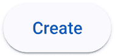

图 12.1：提升按钮

1.  打开 `product-detail.component.ts` 文件并重复 *步骤 1* 和 *步骤 2*。

1.  打开 `product-detail.component.html` 文件，并在 `Change` 按钮中添加 `mat-stroked-button` 指令：

    ```js
    <button
      **mat-stroked-button**
      class="secondary"
      type="submit"
      [disabled]="priceForm.invalid">
      Change
    </button> 
    ```

`mat-stroked-button` 指令在按钮元素周围添加一个边框：

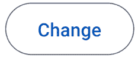

图 12.2：描边按钮

1.  移除具有 `button-group` 类的 `<div>` HTML 元素，并在两个 `<button>` HTML 元素中添加 `mat-raised-button` 指令：

    ```js
    @if (authService.isLoggedIn()) {  
      <button
        **mat-raised-button**
        (click)="addToCart(product.id)">
        Add to cart
      </button>
    }
    <button
      **mat-raised-button**
      class="delete"
      (click)="remove(product)">
      Delete
    </button> 
    ```

当我们运行应用程序时，两个按钮将如下所示：

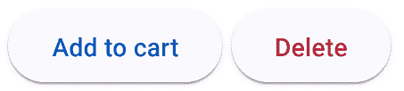

图 12.3：产品详情操作按钮

1.  打开`product-list.component.ts`文件，并添加以下`import`语句：

    ```js
    import { MatMiniFabButton } from '@angular/material/button';
    import { MatIcon } from '@angular/material/icon'; 
    ```

1.  在`@Component`装饰器的`imports`数组中添加前面导入的类：

    ```js
    @Component({
      selector: 'app-product-list',
      imports: [
        SortPipe,
        AsyncPipe,
        RouterLink,
        **MatMiniFabButton,**
        **MatIcon**
      ],
      templateUrl: './product-list.component.html',
      styleUrl: './product-list.component.css'
    }) 
    ```

1.  打开`product-list.component.html`文件，并用以下 HTML 片段替换导航到产品创建组件的锚元素：

    ```js
    <button mat-mini-fab routerLink="new">
      <mat-icon>add</mat-icon>
    </button> 
    ```

`mat-mini-fab`指令显示一个带圆角的方形按钮和一个由`<mat-icon>`HTML 元素指示的图标。`<mat-icon>`元素的文本对应于 Material Design 图标集合中的`add`图标名称：

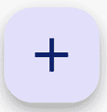

图 12.4：FAB 按钮

Angular Material 的主题非常广泛，我们可以使用现有的 CSS 变量来创建自定义主题，但这本书的范围不包括这个话题。

为了继续我们的 Angular Material 风格之旅，我们将在下一节学习如何集成各种 UI 组件。

# 集成 UI 组件

Angular Material 包含许多组织在类别中的 UI 组件，可以在[`material.angular.io/components/categories`](https://material.angular.io/components/categories)找到。在本章中，我们将探索前面集合的子集，可以归纳为以下类别：

+   **表单控件**：这些可以在 Angular 表单内部使用，例如自动完成、输入和下拉列表。

+   **导航**：这些提供导航功能，例如页眉和页脚。

+   **布局**：这些定义了数据如何表示，例如卡片或表格。

+   **弹出窗口和覆盖层**：这些是显示信息并可以阻止用户交互的覆盖窗口，直到以任何方式关闭。

在接下来的章节中，我们将更详细地探讨每个类别。

## 表单控件

在第十章*使用表单收集用户数据*中，我们了解到表单控件是关于以不同方式收集输入数据并采取进一步行动的，例如通过 HTTP 将数据发送到后端 API。

在 Angular Material 库中有很多不同类型的表单控件，具体如下：

+   **自动完成**：允许用户在输入字段中开始输入，并在输入时提供建议。这有助于缩小输入可以接受的值。

+   **复选框**：一个经典的复选框，表示已选中或未选中的状态。

+   **日期选择器**：允许用户在日历中选择一个日期。

+   **输入**：一个经典的输入控件，在输入时增强了有意义的动画。

+   **单选按钮**：一个经典的单选按钮，在编辑时增强了动画和过渡，以创造更好的用户体验。

+   **选择**：一个下拉控件，提示用户从列表中选择一个或多个项目。

+   **滑块**：允许用户通过拉动滑块按钮向右或向左增加或减少一个值。

+   **滑动开关**：用户可以滑动来设置开或关的开关。

+   **芯片**：一个显示、选择和过滤项目的列表。

在以下章节中，我们将更详细地检查这些表单控件中的几个。让我们从输入组件开始。

### 输入

输入组件通常附加到`<input>` HTML 元素上。我们还可以添加在输入字段中显示错误的能力。

在我们可以在我们的 Angular 应用程序中使用输入组件之前，我们必须移除我们迄今为止使用的所有原生`<input>`标签的 CSS 样式：

1.  打开`styles.css`文件，移除任何引用`input`标签的 CSS 样式。

1.  从`product-create.component.css`和`cart.component.css`文件中移除`input` CSS 样式。

要了解如何使用输入组件，我们将将其集成到我们的应用程序组件中：

1.  打开`product-create.component.ts`文件，并添加以下`import`语句：

    ```js
    import { MatInput } from '@angular/material/input';
    import { MatFormField, MatError, MatLabel } from '@angular/material/form-field'; 
    ```

1.  在`@Component`装饰器的`imports`数组中添加前面导入的类：

    ```js
    @Component({
      selector: 'app-product-create',
      imports: [
        ReactiveFormsModule,
        MatButton,
        **MatInput,**
        **MatFormField,**
        **MatError,**
        **MatLabel**
      ],
      templateUrl: './product-create.component.html',
      styleUrl: './product-create.component.css'
    }) 
    ```

1.  打开`product-create.component.html`文件，并按以下方式替换`<input>` HTML 元素的`<div>`标签：

    ```js
    <mat-form-field>
      <mat-label>Title</mat-label>
      <input formControlName="title" matInput required />
      <mat-error>Title is required</mat-error>
    </mat-form-field>
    <mat-form-field>
      <mat-label>Price</mat-label>
      <input formControlName="price" matInput type="number" required />
      @if (productForm.controls.price.touched && productForm.controls.price.hasError('required')) {
        <mat-error>Price is required</mat-error>
      }
      @if (productForm.controls.price.touched && productForm.controls.price.hasError('min')) {
        <mat-error>Price should be greater than 0</mat-error>
      }
      @if (productForm.controls.price.touched && productForm.controls.price.hasError('priceMaximum')) {
        <mat-error>Price must be smaller or equal to 1000</mat-error>
      }
    </mat-form-field> 
    ```

在前面的 HTML 代码片段中，我们使用`matInput`指令来指示`<input>` HTML 元素是 Angular Material 输入组件。在 Angular Material 中，表单控件必须被包含在`<mat-form-field>`元素中。

我们已将所有`<label>` HTML 元素替换为`<mat-label>`元素。一个`<mat-label>` HTML 元素是一个针对特定 Angular Material 表单控件的标签。

当 Angular 触发验证错误时，`<mat-error>`元素会在表单控件中显示错误消息。当表单控件的状态无效时，它默认显示。在其他所有情况下，我们可以使用`@if`块来控制`<mat-error>`元素何时显示。

1.  打开全局`styles.css`文件，并添加以下 CSS 样式：

    ```js
    mat-form-field {
      width: 100%;
    } 
    ```

在前面的代码片段中，我们配置了`mat-form-field`元素以占用所有可用宽度。

1.  运行`ng serve`命令以启动应用程序，并导航到`http://localhost:4200/products/new`。关注输入字段的显示：

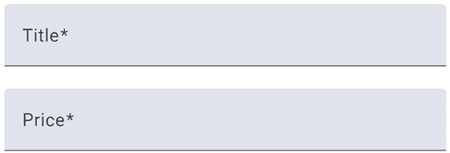

图 12.5：输入组件

在前面的图中，每个表单控件的标签后面都跟着一个星号。星号是表示表单控件必须具有值的常见指示。Angular Material 会自动添加它，因为它识别了`<input>` HTML 元素上的`required`属性。

1.  打开`cart.component.ts`文件，重复步骤 1 和 2，但不要包含`MatError`类。

1.  打开`cart.component.html`文件，并按以下方式修改`@for`块的内容：

    ```js
    @for(product of cartForm.controls.products.controls; track $index) {
      **<mat-form-field>**
        **<mat-label>{{products[$index].title}}</mat-label>**
        **<input**
          **[formControlName]="$index"**
          **placeholder="{{products[$index].title}}"**
          **type="number"**
          **matInput />**
      **</mat-form-field>**
    } 
    ```

我们应用程序中包含`<input>` HTML 元素的其余组件是产品详情组件。产品详情组件是 Angular Material 输入的特殊情况，因为我们必须将其与更改产品价格的按钮组合在一起：

1.  打开`product-detail.component.ts`文件，并按照以下方式修改从 Angular Material npm 包的`import`语句：

    ```js
    import { MatButton, **MatIconButton** } from '@angular/material/button';
    **import { MatInput } from '@angular/material/input';**
    **import { MatFormField, MatError, MatSuffix } from '@angular/material/form-field';**
    **import { MatIcon } from '@angular/material/icon';** 
    ```

1.  在`@Component`装饰器的`imports`数组中添加前面导入的类：

    ```js
    @Component({
      selector: 'app-product-detail',
      imports: [
        CommonModule,
        FormsModule,
        PriceMaximumDirective,
        MatButton,
        **MatInput,**
        **MatFormField,**
        **MatError,**
        **MatIcon,**
        **MatSuffix,**
        **MatIconButton**
      ],
      templateUrl: './product-detail.component.html',
      styleUrl: './product-detail.component.css'
    }) 
    ```

1.  打开`product-detail.component.html`文件，并按照以下方式修改`<form>` HTML 元素：

    ```js
    <form (ngSubmit)="changePrice(product)" #priceForm="ngForm">
      **<mat-form-field>**
        <input
          placeholder="New price"
          type="number"
          name="price"
          required min="1"
          appPriceMaximum threshold="500"
          **matInput**
          #priceCtrl="ngModel"
          [(ngModel)]="price" />
        <button
          **mat-icon-button**
          **matSuffix**
          type="submit"
          [disabled]="priceForm.invalid">
          **<mat-icon>edit</mat-icon>**
        </button>    
        @if (priceCtrl.dirty && (priceCtrl.invalid || priceCtrl.hasError('min'))) {
          **<mat-error>****</mat-error>**Please enter a valid price
        }
        @if (priceCtrl.dirty && priceCtrl.hasError('priceMaximum')) {
          **<mat-error>****</mat-error>**Price must be smaller or equal to 500
        }
      **</mat-form-field>**
    </form> 
    ```

在前面的片段中，我们修改了更改价格的按钮，使其显示铅笔图标，并且它与`<input>` HTML 元素对齐。

`mat-icon-button`指令表示按钮将没有任何文本。相反，它将显示由`<mat-icon>` HTML 元素定义的图标。`matSuffix`指令将按钮放置在`<input>` HTML 元素的行内和末尾。

1.  在浏览器中导航到产品列表并选择一个产品。更改产品价格输入应该是以下内容：

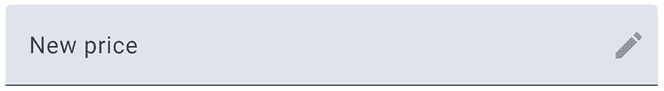

图 12.6：带有行内按钮的输入组件

在下一节中，我们将学习如何使用 Angular Material 选择组件在产品创建组件中选择一个类别。

### 选择

选择组件的工作方式与原生的`<select>` HTML 元素类似。它显示一个下拉元素，其中包含用户可以选择的选项列表。

我们将在产品创建组件中添加一个来选择新产品的类别：

1.  打开`product-create.component.ts`文件并添加以下`import`语句：

    ```js
    import { MatSelect, MatOption } from '@angular/material/select'; 
    ```

1.  在`@Component`装饰器的`imports`数组中添加前面导入的类：

    ```js
    @Component({
      selector: 'app-product-create',
      imports: [
        ReactiveFormsModule,
        MatButton,
        MatInput,
        MatFormField,
        MatError,
        MatLabel,
        **MatSelect,**
        **MatOption**
      ],
      templateUrl: './product-create.component.html',
      styleUrl: './product-create.component.css'
    }) 
    ```

1.  打开`product-create.component.html`文件，并用以下 HTML 片段替换包围`<select>`元素的`<div>` HTML 元素：

    ```js
    <mat-form-field>
      <mat-label>Category</mat-label>
      <mat-select formControlName="category">
        <mat-option value="electronics">Electronics</mat-option>
        <mat-option value="jewelery">Jewelery</mat-option>
        <mat-option>Other</mat-option>
      </mat-select>
    </mat-form-field> 
    ```

在前面的片段中，我们将`<select>`和`<option>` HTML 元素分别替换为`<mat-select>`和`<mat-option>`元素。

1.  导航到`http://localhost:4200/products/new`并点击**类别**下拉列表：

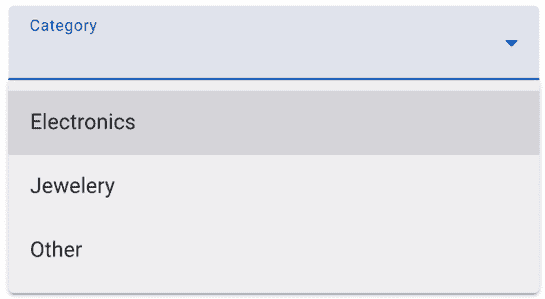

图 12.7：选择组件

产品详情组件将产品类别显示为具有特定 CSS 类的段落元素。在下一节中，我们将学习如何使用 Angular Material 芯片组件表示产品类别。

### 芯片

芯片组件通常用于按特定属性分组显示信息。它还可以提供数据过滤和选择功能。我们可以在我们的应用程序中使用芯片来在产品详情组件中显示类别。

我们的产品只有一个类别，但如果我们的产品有额外的类别分配，那么芯片会更有意义。

让我们开始吧：

1.  打开`product-detail.component.ts`文件，添加以下`import`语句：

    ```js
    import { MatChipSet, MatChip } from '@angular/material/chips'; 
    ```

1.  在`@Component`装饰器的`imports`数组中添加前面导入的类：

    ```js
    @Component({
      selector: 'app-product-detail',
      imports: [
        CommonModule,
        FormsModule,
        PriceMaximumDirective,
        MatButton,
        MatInput,
        MatFormField,
        MatError,
        MatIcon,
        MatSuffix,
        MatIconButton,
        **MatChipSet,**
        **MatChip**
      ],
      templateUrl: './product-detail.component.html',
      styleUrl: './product-detail.component.css'
    }) 
    ```

1.  打开`product-detail.component.html`文件，将包含`pill-group`类的`<div>` HTML 元素替换为以下内容：

    ```js
    <mat-chip-set>
      <mat-chip>{{ product.category }}</mat-chip>
    </mat-chip-set> 
    ```

`<mat-chip>` HTML 元素表示一个芯片组件。芯片必须始终使用容器元素封装。芯片容器最简单的形式是`<mat-chip-set>`元素。

1.  打开`product-detail.component.css`文件，添加以下 CSS 样式：

    ```js
    mat-chip-set {
      margin-bottom: 1.375rem;
    } 
    ```

1.  运行`ng serve`命令以启动应用程序，并从列表中选择一个产品。例如，类别应该看起来像以下这样：

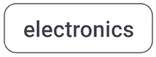

图 12.8：芯片组件

芯片组件完成了我们对 Angular Material 表单控件的探索。在下一节中，我们将通过为应用程序的导航布局添加样式来获得实际操作经验。

## 导航

在 Angular 应用程序中导航有不同的方式，例如点击链接或菜单项。Angular Material 为此类交互提供了以下组件：

+   **菜单**：一个弹出列表，您可以从预定义的选项集中进行选择。

+   **侧边栏**：一个作为菜单固定在页面左侧或右侧的组件。它可以作为覆盖在应用程序上的叠加层，同时变暗应用程序内容。

+   **工具栏**：一个标准工具栏，允许用户访问常用操作。

在本节中，我们将演示如何使用工具栏组件。我们将把主应用程序组件的`<header>`和`<footer>` HTML 元素转换为 Angular Material 工具栏。

要创建工具栏，我们将按照以下步骤进行：

1.  打开`app.component.ts`文件，添加以下`import`语句：

    ```js
    import { MatToolbarRow, MatToolbar } from '@angular/material/toolbar';
    import { MatButton } from '@angular/material/button'; 
    ```

1.  在`@Component`装饰器的`imports`数组中添加前面导入的类，并删除`RouterLinkActive`类：

    ```js
    @Component({
      selector: 'app-root',
      imports: [
        RouterOutlet,
        RouterLink,
        CopyrightDirective,
        AuthComponent,
        MatToolbarRow,
        MatToolbar,
        MatButton
      ],
      templateUrl: './app.component.html',
      styleUrl: './app.component.css'
    }) 
    ```

1.  打开`app.component.html`文件，按照以下方式修改`<header>` HTML 元素：

    ```js
    <header>
      **<mat-toolbar>**
        **<mat-toolbar-row>**
          <h2>{{ settings.title }}</h2>
          <span class="spacer"></span>
          **<button mat-button routerLink="/products">Products</button>**
          **<button mat-button routerLink="/cart">My Cart</button>**
          **<button mat-button routerLink="/user">My Profile</button>**
          <app-auth></app-auth>
        **</mat-toolbar-row>**
      **</mat-toolbar>**
    </header> 
    ```

在前面的模板中，我们在`<mat-toolbar>`元素内添加了主应用程序链接和身份验证组件。工具栏组件由一个由`<mat-toolbar-row>` HTML 元素表示的单行组成。

1.  打开`app.component.css`文件，删除`header`标签和`menu-links`的 CSS 样式。

1.  如果我们使用`ng serve`命令运行应用程序，我们将在页面顶部看到我们应用程序的新工具栏：

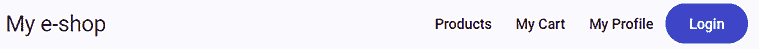

图 12.9：应用程序标题

1.  现在，修改`<footer>` HTML 元素，将其转换为 Angular Material 工具栏组件：

    ```js
    <footer>
      **<mat-toolbar>**
        **<mat-toolbar-row>**
          **<span appCopyright> - v{{ settings.version }}</span>** 
        **</mat-toolbar-row>**
      **</mat-toolbar>**
    </footer> 
    ```

1.  保存更改，等待应用程序刷新，并观察应用程序底部的工具栏：

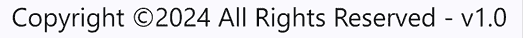

图 12.10：应用页脚

工具栏组件是完全可定制的，我们可以根据应用程序的需求进行调整。我们可以添加图标，甚至创建多行的工具栏。现在你已经了解了创建简单工具栏的基础，你可以探索更多的可能性。

在下一节中，我们将学习如何在应用程序内部以不同的方式布局内容。

## 布局

当我们提到布局时，我们讨论如何在模板中放置内容。Angular Material 为我们提供了不同的组件来完成这个目的：

+   **列表**：将内容以项目列表的形式可视化。它可以添加链接、图标，甚至多行内容。

+   **网格列表**：帮助我们以块的形式排列内容。我们只需要定义列数；组件将填充视觉空间。

+   **卡片**：包装内容并添加阴影。我们还可以为它定义一个标题。

+   **标签页**：将内容分割成不同的标签页。

+   **步骤条**：将内容分割成类似向导的步骤。

+   **展开面板**：允许我们将内容以类似列表的方式放置，并为每个项目添加标题。项目一次只能展开一个。

+   **表格**：以行和列的表格格式表示数据。

在这本书中，我们将介绍卡片和表格组件。

### 卡片

我们将学习如何将列表中的每个产品显示为卡片：

1.  打开`product.ts`文件，并在`Product`接口中添加一个`image`属性：

    ```js
    export interface Product {
      id: number;
      title: string;
      price: number;
      category: string;
      **image: string;**
    } 
    ```

`image`属性是一个指向 Fake Store API 中产品图片文件的 URL。

1.  打开`product-list.component.ts`文件，并添加以下`import`语句：

    ```js
    import { MatCardModule } from '@angular/material/card'; 
    ```

1.  在`@Component`装饰器的`imports`数组中添加`MatCardModule`类：

    ```js
    @Component({
      selector: 'app-product-list',
      imports: [
        SortPipe,
        AsyncPipe,
        RouterLink,
        MatMiniFabButton,
        MatIcon,
        **MatCardModule**
      ],
      templateUrl: './product-list.component.html',
      styleUrl: './product-list.component.css'
    }) 
    ```

Angular Material 卡片组件由许多其他组件和指令组成。我们选择导入整个 Angular 模块，因为单独导入它们不太方便。

1.  打开`product-list.component.html`文件，将无序列表元素替换为以下 HTML 片段：

    ```js
    @for (product of products | sort; track product.id) {
      <mat-card [routerLink]="[product.id]">
        <mat-card-header>
          <mat-card-title-group>
            <mat-card-title>{{ product.title }}</mat-card-title>
            <mat-card-subtitle>{{ product.category }}</mat-card-subtitle>
            
          </mat-card-title-group>
        </mat-card-header>
      </mat-card>
    } @empty {
      <p>No products found!</p>
    } 
    ```

Angular Material 卡片组件由一个标题组成，由`<mat-card-header>`HTML 元素表示。标题组件包含一个`<mat-card-title-group>`HTML 元素，该元素将卡片标题、副标题和图像排列成一个单独的部分。由`<mat-card-title>`HTML 元素表示的卡片标题显示产品标题。由`<mat-card-subtitle>`HTML 元素表示的卡片副标题显示产品类别。最后，通过将`mat-card-sm-image`指令附加到``HTML 元素上，显示产品图片。指令中的`sm`关键字表示我们想要渲染图像的小尺寸。

Angular Material 还支持`md`和`lg`，分别代表中等和大型尺寸。

1.  打开`product-list.component.css`文件，并添加以下 CSS 样式：

    ```js
    mat-card {
      margin: 1.375rem;
      cursor: pointer;
    } 
    ```

1.  使用`ng serve`命令运行应用程序，并导航到`http://localhost:4200`：

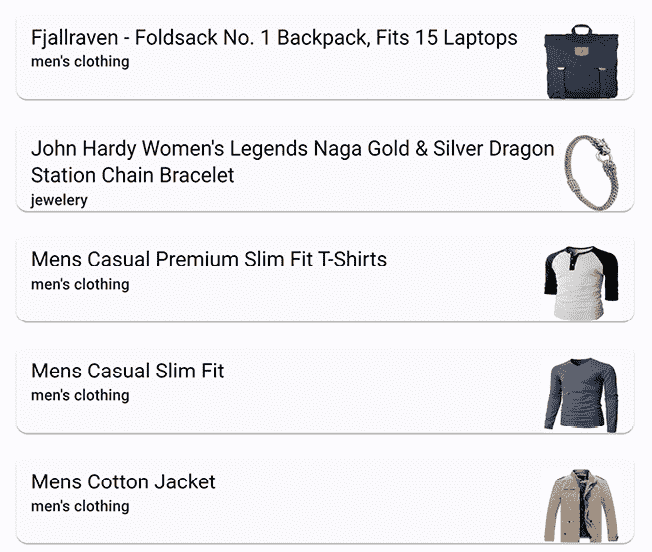

图 12.11：产品列表卡片表示

您可以通过导航到[`material.angular.io/components/card/overview`](https://material.angular.io/components/card/overview)来探索更多卡片组件的选项。

在下一节中，我们将学习如何将产品列表切换到表格视图。

### 数据表

Angular Material 库中的表格组件使我们能够以列和行的形式显示我们的数据。要创建表格，我们必须从`@angular/material/table`命名空间导入`MatTableModule`类。

Angular Material 数据表由许多其他组件和指令组成。我们选择导入整个 Angular 模块，因为单独导入它们将不方便。

让我们开始吧：

1.  打开`product-list.component.ts`文件，并导入`CurrencyPipe`和`MatTableModule`组件：

    ```js
    import { AsyncPipe, **CurrencyPipe** } from '@angular/common';
    **import { MatTableModule } from '@angular/material/table';** 
    ```

1.  将之前导入的类添加到`@Component`装饰器的`imports`数组中：

    ```js
    @Component({
      selector: 'app-product-list',
      imports: [
        SortPipe,
        AsyncPipe,
        **CurrencyPipe**,
        RouterLink,
        MatMiniFabButton,
        MatIcon,
        MatCardModule,
        **MatTableModule**
      ],
      templateUrl: './product-list.component.html',
      styleUrl: './product-list.component.css'
    }) 
    ```

1.  在`ProductListComponent`类中创建以下属性来定义表格列名：

    ```js
    columnNames = ['title', 'price']; 
    ```

每个列的名称都与`Product`接口中的一个属性匹配。

1.  打开`product-list.component.html`文件，在`@for`块之后添加以下代码片段：

    ```js
    <table mat-table [dataSource]="products"></table> 
    ```

Angular Material 表格是一个带有`mat-table`指令的标准`<table>` HTML 元素。

`mat-table`指令的`dataSource`属性定义了我们想在表格上显示的数据。它可以是指任何可枚举的数据，例如数组。在我们的例子中，我们将其绑定到`products`模板引用变量。

1.  为我们想要显示的每个列添加一个`<ng-container>`元素：

    ```js
    <table mat-table [dataSource]="products">
      **<ng-container matColumnDef="title">**
        **<th mat-header-cell *matHeaderCellDef>Title</th>**
        **<td mat-cell *matCellDef="let product">**
          **<a [routerLink]="[product.id]">{{ product.title }}</a>**
        **</td>**
      **</ng-container>**
      **<ng-container matColumnDef="price">**
        **<th mat-header-cell *matHeaderCellDef>Price</th>**
        **<td mat-cell *matCellDef="let product">{{ product.price |****currency }}</td>** 
      **</ng-container>**
    </table> 
    ```

    `<ng-container>`元素是一个具有独特用途的元素，它将具有相似功能的元素分组在一起。它不会干扰子元素的样式，也不会在屏幕上渲染。

`<ng-container>`元素使用`matColumnDef`指令设置特定列的名称。

`matColumnDef`指令的值必须与`columnNames`组件属性的值匹配；否则，应用程序将抛出一个错误，表明它找不到定义的列的名称。

它包含一个带有`mat-header-cell`指令的`<th>` HTML 元素，表示单元格的标题，以及一个带有`mat-cell`指令的`<td>` HTML 元素，用于单元格的数据。`<td>` HTML 元素使用`matCellDef`指令创建一个用于当前行数据的本地模板变量，我们可以在以后使用它。

1.  在`<ng-container>`元素之后添加以下代码片段：

    ```js
    <tr mat-header-row *matHeaderRowDef="columnNames"></tr>
    <tr mat-row *matRowDef="let row; columns: columnNames;"></tr> 
    ```

在前面的代码片段中，我们定义了表格的标题行，显示列名和包含数据的实际行。

如果我们运行应用程序，输出应该是以下内容：

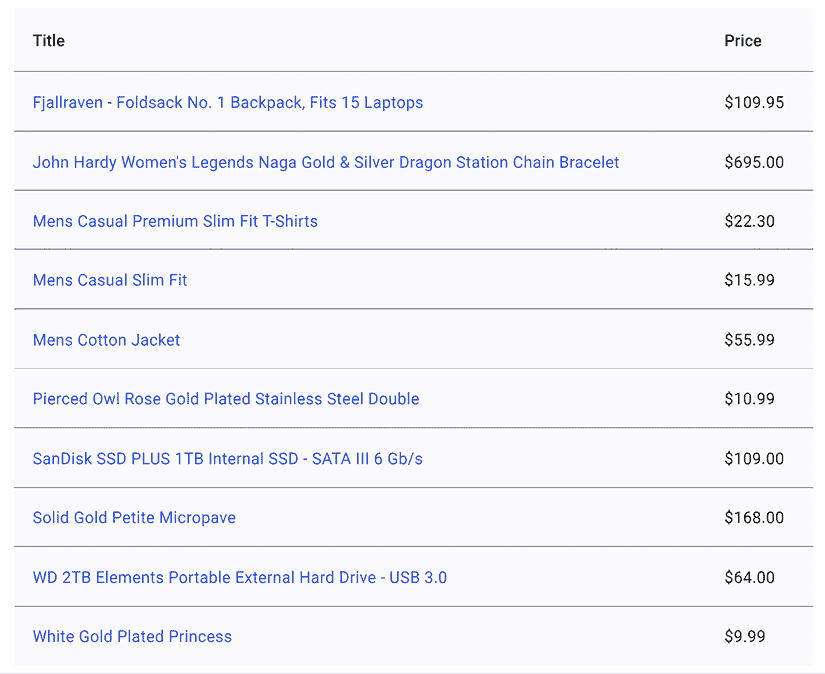

图 12.12：表格组件

产品列表组件同时显示数据的卡片表示和表格表示。我们将使用 Angular Material 的按钮切换组件来区分它们。按钮切换组件根据特定条件切换按钮的开启或关闭：

1.  打开`product-list.component.ts`文件并添加以下`import`语句：

    ```js
    import { MatButtonToggle, MatButtonToggleGroup } from '@angular/material/button-toggle'; 
    ```

1.  在`@Component`装饰器的`imports`数组中添加前面导入的类：

    ```js
    @Component({
      selector: 'app-product-list',
      imports: [
        SortPipe,
        AsyncPipe,
        CurrencyPipe,
        RouterLink,
        MatMiniFabButton,
        MatIcon,
        MatCardModule,
        MatTableModule,
        **MatButtonToggle,**
        **MatButtonToggleGroup**
      ],
      templateUrl: './product-list.component.html',
      styleUrl: './product-list.component.css'
    }) 
    ```

1.  打开`product-list.component.html`文件，并在具有`caption`类的`<div>`HTML 元素内添加以下 HTML 片段：

    ```js
    <span class="spacer"></span>
    <mat-button-toggle-group #group="matButtonToggleGroup">
      <mat-button-toggle value="card" checked>
        <mat-icon>list</mat-icon>
      </mat-button-toggle>
      <mat-button-toggle value="table">
        <mat-icon>grid_on</mat-icon>
      </mat-button-toggle>
    </mat-button-toggle-group> 
    ```

在前面的代码片段中，我们使用`<mat-button-toggle-group>`元素创建两个并排的切换按钮。按钮切换组的实例被分配给`group`模板引用变量，这样我们可以在以后访问它。

我们使用`<mat-button-toggle>`元素声明切换按钮，并设置适当的`value`。当点击任一按钮时，将设置`value`属性。我们还为每个切换按钮添加了一个图标，以增强用户体验，当用户与产品列表交互时。

1.  在具有`caption`类的`<div>`HTML 元素之后创建一个新的`@if`块，并将`@for`块移动到其中：

    ```js
    @if (group.value === 'card') {
      @for (product of products | sort; track product.id) {
        <mat-card [routerLink]="[product.id]">
          <mat-card-header>
            <mat-card-title-group>
              <mat-card-title>{{ product.title }}</mat-card-title>
              <mat-card-subtitle>{{ product.category }}</mat-card-subtitle>
              
            </mat-card-title-group>
          </mat-card-header>
        </mat-card>
      } @empty {
        <p>No products found!</p>
      }
    } 
    ```

根据前面的代码片段，当按钮切换组的`value`属性设置为`card`时，将显示产品的卡片表示。

1.  添加以下`@else`块，并将数据表组件移动到其中，以便在点击第二个切换按钮时以表格格式显示产品列表：

    ```js
    @else {
      <table mat-table [dataSource]="products">
        <ng-container matColumnDef="title">
          <th mat-header-cell *matHeaderCellDef>Title</th>
          <td mat-cell *matCellDef="let product">
            <a [routerLink]="[product.id]">{{ product.title }}</a>
          </td>
        </ng-container>
        <ng-container matColumnDef="price">
          <th mat-header-cell *matHeaderCellDef>Price</th>
          <td mat-cell *matCellDef="let product">{{ product.price | currency }}</td>
        </ng-container>
        <tr mat-header-row *matHeaderRowDef="columnNames"></tr>
        <tr mat-row *matRowDef="let row; columns: columnNames;"></tr>
      </table>
    } 
    ```

1.  运行`ng serve`命令以启动应用程序并验证卡片表示最初显示。

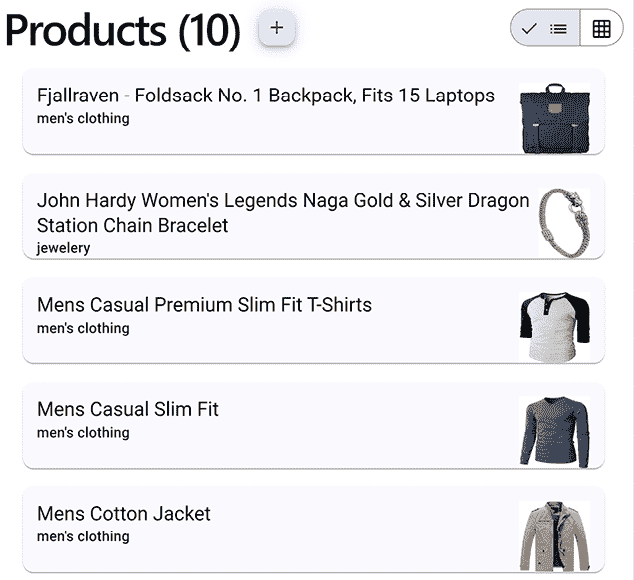

图 12.13：产品列表

1.  点击第二个切换按钮并验证产品现在以表格格式显示。

在本节中，我们学习了如何以表格格式显示产品列表。我们还使用了切换按钮在卡片视图和表格视图之间切换。

在以下部分，我们将学习如何使用弹出窗口和覆盖层向用户提供额外信息。

## 弹出窗口和覆盖层

在 Web 应用程序中，有不同方式来吸引用户的注意力。其中一种是在页面内容上显示弹出对话框，并提示用户相应地采取行动。另一种方式是在页面的不同部分显示信息作为通知。

Angular Material 提供三个不同的组件来处理此类情况：

+   **对话框**：一个模态弹出对话框，它显示在页面内容之上。

+   **徽章**：一个小圆形指示，用于更新 UI 元素的状态。

+   **Snackbar**：在页面底部显示的信息消息，短暂可见。其目的是通知用户操作的结果，例如保存表单。

我们将学习如何在我们的电子商务应用程序中使用前面的组件，从如何创建一个简单的模态对话框开始。

### 创建确认对话框

对话框组件功能强大，可以轻松地进行自定义和配置。它是一个普通的 Angular 组件，带有自定义指令，强制其表现出对话框的行为。为了探索 Angular Material 对话框的功能，我们将在结账守卫中使用确认对话框来通知用户他们购物车中剩余的商品：

1.  运行以下 Angular CLI 命令以创建一个新的 Angular 组件：

    ```js
    ng generate component checkout 
    ```

上述命令将创建一个 Angular 组件，该组件将托管我们的对话框。

1.  打开 `checkout.component.ts` 文件并添加以下 `import` 语句：

    ```js
    import { MatButton } from '@angular/material/button';
    import { MatDialogModule } from '@angular/material/dialog'; 
    ```

Angular Material 对话框组件由许多其他组件和指令组成。我们选择导入整个 Angular 模块，因为单独导入它们将不太方便。

1.  在 `@Component` 装饰器的 `imports` 数组中添加前面导入的类：

    ```js
    @Component({
      selector: 'app-checkout',
      imports: [**MatButton, MatDialogModule**],
      templateUrl: './checkout.component.html',
      styleUrl: './checkout.component.css'
    }) 
    ```

1.  打开 `checkout.component.html` 文件并将其内容替换为以下 HTML 模板：

    ```js
    <h1 mat-dialog-title>Cart Checkout</h1>
    <mat-dialog-content>
      <span>You have pending items in your cart. Do you want to continue?</span>
    </mat-dialog-content>
    <mat-dialog-actions>
      <button mat-raised-button>Yes</button>
      <button mat-button>No</button>
    </mat-dialog-actions> 
    ```

组件模板包含属于 Angular Material 对话框组件的各种指令和元素。`mat-dialog-title` 指令定义对话框的标题，`<mat-dialog-content>` 是实际内容。`<mat-dialog-actions>` 元素定义对话框可以执行的操作，通常包含按钮元素。

1.  对话框必须被触发才能在页面上显示。打开 `checkout.guard.ts` 文件并添加以下 `import` 语句：

    ```js
    import { MatDialog } from '@angular/material/dialog';
    import { CheckoutComponent } from './checkout/checkout.component'; 
    ```

1.  在 `checkoutGuard` 函数的主体中注入 `MatDialog` 服务：

    ```js
    const dialog = inject(MatDialog); 
    ```

1.  按如下方式修改 `confirmation` 变量的赋值：

    ```js
    if (cartService.cart) {
      const confirmation = **dialog.open(CheckoutComponent).afterClosed();**
      return confirmation;
    } 
    ```

在前面的代码片段中，我们使用 `MatDialog` 服务来显示结账组件。`MatDialog` 服务接受一个参数，该参数是表示对话框的组件类类型。

`MatDialog` 服务的 `open` 方法返回一个 `afterClosed` 可观察属性，它将在对话框关闭时通知我们。该可观察对象会发出从对话框发送回的任何值。

在本章的后面部分，我们将学习如何从对话框组件返回一个布尔值，该值与 `CanDeactivateFn` 函数返回的类型相匹配。

我们现在可以通过执行以下步骤来验证对话框组件是否按预期工作：

1.  使用 `ng serve` 命令运行应用程序并导航到 `http://localhost:4200` 。

1.  登录应用程序。

1.  从列表中选择一个产品并将其添加到购物车。

1.  重复上述步骤以向购物车添加更多产品。

1.  导航到购物车，然后点击浏览器的后退按钮或任何应用程序链接以离开购物车。屏幕上将会显示以下对话框：

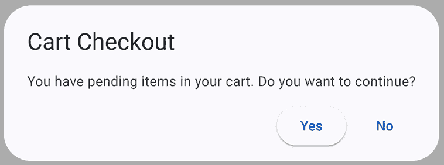

图 12.14：结账对话框组件

我们可以通过在对话框中显示我们添加到购物车中的项目数量来进一步改善应用程序的 UX。在下一节中，我们将学习如何在对话框中传递数据并显示购物车项目数量。

### 配置对话框

在实际场景中，你可能会需要创建一个可重用的组件来在 Angular 项目中显示对话框。该组件最终可能成为 Angular 库中的一个包。因此，你应该配置对话框组件以动态接受数据。

在当前的 Angular 项目中，我们希望显示我们添加到购物车中的产品数量：

1.  打开 `checkout.component.ts` 文件，并按如下方式修改 `import` 语句：

    ```js
    import { Component, **inject** } from '@angular/core';
    import { MatButton } from '@angular/material/button';
    import { MatDialogModule, **MAT_DIALOG_DATA** } from '@angular/material/dialog'; 
    ```

1.  以以下方式在 `CheckoutComponent` 类中注入 `MAT_DIALOG_DATA`：

    ```js
    export class CheckoutComponent {
      **data = inject(MAT_DIALOG_DATA);**
    } 
    ```

`MAT_DIALOG_DATA` 是一个注入令牌，它使我们能够将任意数据传递给对话框组件。当调用其 `open` 方法时，`data` 变量将包含我们传递给对话框的任何数据。

1.  打开 `checkout.component.html` 文件，并将 `data` 属性添加到 `<span>` HTML 元素的内部文本：

    ```js
    <span>
      You have **{{ data }}** pending items in your cart.
      Do you want to continue?
    </span> 
    ```

1.  打开 `checkout.guard.ts` 文件，并在对话框配置对象中设置 `data` 属性，这是 `open` 方法的第二个参数：

    ```js
    const confirmation = dialog.open(
      CheckoutComponent,
      **{ data: cartService.cart.products.length }**
    ).afterClosed(); 
    ```

1.  如果我们在运行应用程序时尝试离开购物车页面，我们将得到一个类似于以下对话框：

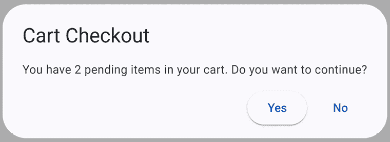

图 12.15：带有自定义数据的结账对话框组件

对话框组件的按钮目前还没有做任何特定的事情。在下一节中，我们将学习如何配置它们并将数据返回给守卫。

### 从对话框获取数据

Angular Material 对话框模块公开了 `mat-dialog-close` 指令，我们可以使用它来配置哪个按钮将关闭对话框。打开 `checkout.component.html` 文件，并将 `mat-dialog-close` 指令添加到两个按钮：

```js
<mat-dialog-actions>
  <button mat-raised-button **mat-dialog-close**>Yes</button>
  <button mat-button **[mat-dialog-close]="false"**>No</button>
   </mat-dialog-actions> 
```

在前面的代码片段中，我们以两种方式使用 `mat-dialog-close` 指令：

+   如果在 `Yes` 按钮中不传递值，对话框将默认返回 `true`，允许守卫从购物车页面导航离开。

+   在 `No` 按钮的属性绑定中，我们传递 `false` 作为值以取消从守卫处的导航。

执行以下步骤以验证对话框行为是否正确：

1.  运行 `ng serve` 命令以启动应用程序并导航到 `http://localhost:4200` 。

1.  登录到应用程序。

1.  从列表中选择一个产品并将其添加到购物车。

1.  单击**My Cart**链接以导航到购物车。

1.  在结账对话框中选择**No**，然后单击**Products**链接，并验证应用程序是否停留在购物车页面上。

1.  再次单击**Products**链接，在对话框中选择**Yes**，你应该会导航到产品列表。

对话框是 Angular Material 的一个优秀功能，可以为您的应用程序提供强大的功能。在下一节中，我们将探讨徽章和 Snackbar 组件，以便在产品添加到购物车时通知用户。

### 显示用户通知

Angular Material 库强制执行提高应用程序 UX 的模式和行为。应用程序 UX 的一个方面是，在特定操作后向用户提供通知。Angular Material 为我们提供了在这种情况下可以使用的徽章和 Snackbar 组件。

#### 应用徽章

徽章组件是一个位于另一个元素顶部的圆形，通常显示一个数字。我们将学习如何通过在**My Cart**应用程序链接中显示购物车项目数量来应用徽章：

1.  打开`app.component.ts`文件并添加以下`import`语句：

    ```js
    import { MatBadge } from '@angular/material/badge';
    import { CartService } from './cart.service'; 
    ```

`MatBadge`类导出徽章组件。`CartService`类将为我们提供购物车中的项目数量。

1.  在`@Component`装饰器的`imports`数组中添加`MatBadge`类：

    ```js
    @Component({
      selector: 'app-root',
      imports: [
        RouterOutlet,
        RouterLink,
        CopyrightDirective,
        AuthComponent,
        MatToolbarRow,
        MatToolbar,
        MatButton,
        **MatBadge**
      ],
      templateUrl: './app.component.html',
      styleUrl: './app.component.css'
    }) 
    ```

1.  在`AppComponent`类中注入`CartService`类：

    ```js
    cartService = inject(CartService); 
    ```

1.  打开`app.component.html`文件并将`matBadge`指令添加到`My Cart`按钮：

    ```js
    <button
      mat-button
      routerLink="/cart"
      **[matBadge]="cartService.cart?.products?.length">**
      My Cart
    </button> 
    ```

在前面的代码片段中，`matBadge`指令指示徽章中显示的数字。在这种情况下，我们将其绑定到当前购物车中存在的`products`数组的`length`。

1.  打开`app.component.css`文件并添加以下 CSS 样式：

    ```js
    button {
      margin: 5px;
    } 
    ```

上述样式将为每个应用程序链接周围添加空间，以便按钮不会与徽章组件重叠。

1.  运行`ng serve`命令以启动应用程序并向购物车添加一些产品。注意，当产品添加到购物车时，徽章图标会更新其值；以下是一个示例：

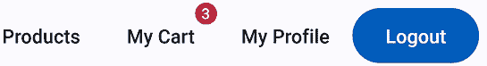

图 12.16：徽章组件

#### 应用 Snackbar

当我们与 CRUD 应用程序一起工作时，另一个好的 UX 模式是在操作完成后显示通知。我们可以通过在产品添加到购物车时显示通知来应用这种模式。我们将使用 Angular Material 的 Snackbar 组件来显示通知：

1.  打开`product-detail.component.ts`文件并添加以下`import`语句：

    ```js
    import { MatSnackBarModule, MatSnackBar } from '@angular/material/snack-bar'; 
    ```

Snackbar 不是一个像我们之前看到的所有 Angular Material 组件的实际 Angular 组件。它是一个名为`MatSnackBar`的 Angular 服务，可以通过将`MatSnackBarModule`类导入我们的组件来使用。

1.  在`@Component`装饰器的`imports`数组中添加`MatSnackBarModule`类：

    ```js
    @Component({
      selector: 'app-product-detail',
      imports: [
        CommonModule,
        FormsModule,
        PriceMaximumDirective,
        MatButton,
        MatInput,
        MatFormField,
        MatError,
        MatIcon,
        MatSuffix,
        MatIconButton,
        MatChipSet,
        MatChip,
        **MatSnackBarModule**
      ],
      templateUrl: './product-detail.component.html',
      styleUrl: './product-detail.component.css'
    }) 
    ```

1.  将`MatSnackBar`服务注入到`ProductDetailComponent`类的`constructor`中：

    ```js
    constructor(
      private productService: ProductsService,
      public authService: AuthService,
      private route: ActivatedRoute,
      private router: Router,
      private cartService: CartService,
      **private snackbar: MatSnackBar**
    ) { } 
    ```

1.  修改`addToCart`方法，当产品添加到购物车时显示一个通知栏：

    ```js
    addToCart(id: number) {
      this.cartService.addProduct(id).subscribe(() => {
        **this.snackbar.open('Product added to cart!', undefined, {**
          **duration: 1000**
        **});**
      **}**);
    } 
    ```

在前面的方法中，我们使用`MatSnackBar`服务的`open`方法来显示一个通知栏。`open`方法接受三个参数：我们想要显示的消息，当通知栏被关闭时我们想要采取的操作，以及一个配置对象。配置对象使我们能够设置各种选项，例如通知栏在毫秒数内的可见`duration`。

我们没有传递操作参数，因为我们不希望在通知栏被关闭时做出反应。

1.  运行`ng serve`命令以启动应用程序并从列表中选择一个产品。

1.  确保您已登录并点击**添加到购物车**按钮。以下通知信息将在页面底部显示：

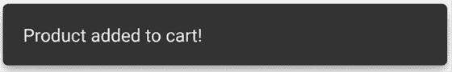

图 12.17：Snackbar 组件

可以通过配置选项更改通知栏的位置。更多信息请参阅[`material.angular.io/components/snack-bar/overview`](https://material.angular.io/components/snack-bar/overview)。

在本节中，我们学习了如何使用弹出模型和通知覆盖来增强应用程序的用户体验，并为用户提供一个出色的工作流程。

# 摘要

在本章中，我们探讨了 Material Design 系统的基本知识。我们主要关注 Angular Material，这是为 Angular 设计的 Material Design 实现，以及它由不同的组件组成。我们查看了一个关于如何安装它、设置它以及使用其核心组件和主题的动手说明。

希望您已经阅读了这一章，并发现您现在已经掌握了 Material Design 的一般知识，特别是 Angular Material，并且可以确定它是否适合您的下一个 Angular 应用程序。

网络应用程序必须是可测试的，以确保它们的功能性和符合应用程序要求。在下一章中，我们将学习如何在 Angular 应用程序中应用不同的测试技术。
