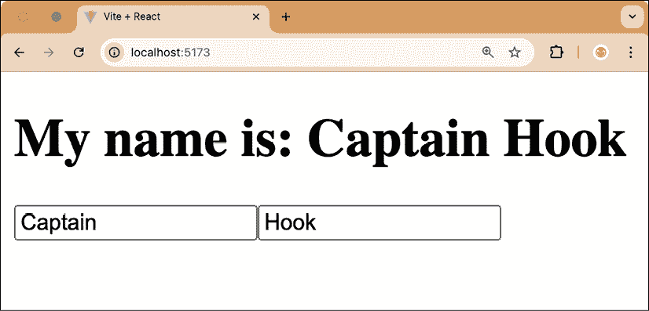
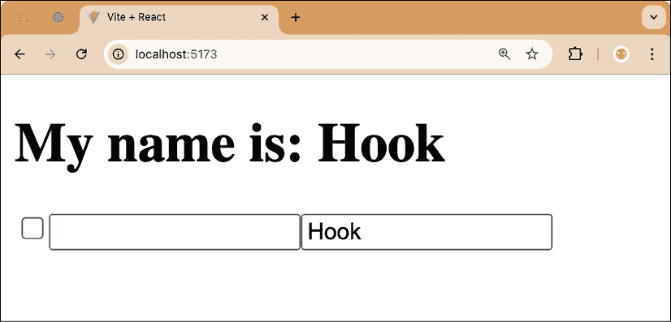
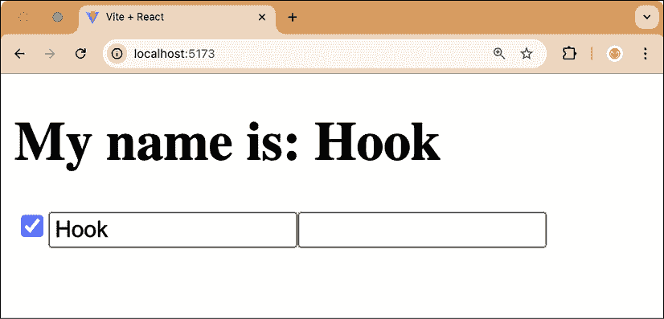

# 第二章：使用 State Hook

在了解了 React 的原则并对 Hooks 进行了介绍之后，我们现在将深入学习 State Hook。我们将从通过自己重新实现 State Hook 来了解其内部工作方式开始。这样做将使我们了解 Hooks 的限制以及它们存在的原因。然后，我们将学习可能的替代 Hook API 及其相关问题。最后，我们将学习如何解决由 Hooks 限制引起的常见问题。到本章结束时，您将知道如何使用 State Hook 在 React 中实现有状态的函数组件。

在本章中，我们将涵盖以下主要主题：

+   重新实现 State Hook

+   可能的替代 Hook API

+   使用 Hooks 解决常见问题

# 技术要求

Node.js 的相当新版本应该已经安装。**Node 包管理器**（`npm`）也需要安装（它应该包含在 Node.js 中）。有关如何安装 Node.js 的更多信息，请查看官方网站：[`nodejs.org/`](https://nodejs.org/)。

在这本书的指南中，我们将使用**Visual Studio Code**（**VS Code**），但任何其他编辑器都应该以类似的方式工作。有关如何安装 VS Code 的更多信息，请参阅官方网站：[`code.visualstudio.com`](https://code.visualstudio.com)。

在这本书中，我们使用以下版本：

+   Node.js v22.14.0

+   `npm` v10.9.2

+   VS Code v1.97.2

虽然安装新版本不应该有问题，但请注意，某些步骤在新版本上可能会有不同的工作方式。如果您在这本书提供的代码和步骤中遇到问题，请尝试使用提到的版本。

您可以在 GitHub 上找到本章的代码：[`github.com/PacktPublishing/Learn-React-Hooks-Second-Edition/tree/main/Chapter02`](https://github.com/PacktPublishing/Learn-React-Hooks-Second-Edition/tree/main/Chapter02)。

强烈建议您自己编写代码。不要简单地运行书中提供的代码示例。自己编写代码对于正确学习和理解代码非常重要。然而，如果您遇到任何问题，您始终可以参考代码示例。

# 重新实现 State Hook

为了更好地理解 Hooks 在 React 内部的工作方式，我们将从头开始重新实现`useState`函数。然而，我们不会将其实现为一个实际的 React Hook，而是一个简单的 JavaScript 函数——只是为了了解 Hooks 实际上在做什么。

这次的重构实现并不完全等同于 React Hooks 在内部的工作方式。实际的实现方式相似，因此具有相似的约束。然而，实际的实现比我们在这里要实现的内容更为广泛。

我们现在将开始重新实现 State Hook：

1.  通过执行以下命令将`Chapter01_3`文件夹复制到新的`Chapter02_1`文件夹：

    ```js
    $ cp -R Chapter01_3 Chapter02_1 
    ```

1.  在 VS Code 中打开新的`Chapter02_1`文件夹。

首先，我们需要定义一个函数来（重新）渲染应用，我们可以使用它来模拟当 Hook 状态变化时的 React 重新渲染。如果我们使用实际的 React Hooks，这将在内部处理。

1.  打开`src/main.jsx`并*删除*以下代码：

    ```js
    createRoot(document.getElementById('root')).render(
      <StrictMode>
    <App />
    </StrictMode>,
    ) 
    ```

*替换*为以下内容：

```js
const root = createRoot(document.getElementById('root'))
export function renderApp() {
  root.render(
    <StrictMode>
<App />
</StrictMode>,
  )
}
renderApp() 
root for our React application to be rendered in. Then, we define a function to render the app into the root. Finally, we call the renderApp() function to initially render the app.
```

1.  现在，打开`src/App.jsx`文件并*删除*以下行：

    ```js
    import { useState } from 'react' 
    ```

将其替换为以下行：

```js
import { renderApp } from './main.jsx' 
```

1.  现在，我们定义我们自己的`useState`函数。正如我们已经知道的，`useState`函数接受`initialState`作为参数：

    ```js
    function useState(initialState) { 
    ```

1.  然后，我们定义一个值，我们将在这里存储我们的状态。最初，这个值将被设置为`initialState`：

    ```js
     let value = initialState 
    ```

1.  接下来，我们定义`setState`函数，我们将在这里设置新值，并强制重新渲染我们的应用：

    ```js
     function setState(nextValue) {
        value = nextValue
        renderApp()
      } 
    ```

1.  最后，我们将`value`和`setState`函数作为一个数组返回：

    ```js
     return [value, setState]
    } 
    ```

1.  启动`dev`服务器（保持运行）然后在浏览器中打开链接：

    ```js
    $ npm run dev 
    ```

如果你现在尝试在输入字段中输入文本，你会注意到当组件重新渲染时，状态被重置，因此无法在字段中输入任何文本。我们将在下一节中解决这个问题。

我们使用数组而不是对象的原因是我们通常想要重命名`value`和`setState`变量。使用数组可以通过解构轻松地重命名变量。例如，如果我们想要为`username`设置状态，我们可以这样做：

```js
const [username, setUsername] = useState('') 
```

虽然在对象中也可以通过解构进行重命名，但这会更冗长：

```js
const { state: username, setState: setUsername } = useState('') 
```

如我们所见，Hooks 是处理副作用（如设置有状态值）的简单 JavaScript 函数。

我们的 Hook 函数使用**闭包**来存储当前值。闭包是一个变量存在和存储的环境。在我们的情况下，函数提供了闭包，而`value`变量存储在这个闭包中。`setState`函数也是在同一个闭包中定义的，这就是为什么我们可以在该函数中访问`value`变量。在`useState`函数外部，除非我们从函数中返回它，否则我们无法直接访问`value`变量。

## 解决简单 Hook 实现中的问题

无法输入任何文本到输入字段的问题是由于每次组件渲染时都会重新初始化`value`变量，因为我们每次渲染组件时都会调用`useState`。

在接下来的部分，我们将通过使用全局变量然后将简单值转换为数组来解决此问题，这样我们就可以定义多个 Hook。

### 使用全局变量

正如我们所学的，`value`存储在由`useState`函数定义的闭包中。每当组件重新渲染时，闭包都会重新初始化，这意味着`value`变量将再次设置为`initialState`。为了解决这个问题，我们需要将`value`存储在函数之外的全局变量中。这样，`value`变量就会在函数的外部闭包中，这意味着当函数再次被调用时，`value`不会重新初始化。

我们可以定义全局变量如下：

1.  首先，编辑`src/App.jsx`并在`useState`函数定义上方添加以下行：

    ```js
    **let** **value**
    function useState(initialState) { 
    ```

1.  然后，*删除*函数定义中的以下第一行：

    ```js
     let value = initialState 
    ```

用以下代码片段替换它：

```js
 if (value === undefined) {
    value = initialState
  } 
```

1.  再次尝试在输入字段中输入一些文本；你会看到我们的 Hook 函数现在可以正常工作了！

现在，我们的`useState`函数使用全局的`value`变量而不是在其闭包内定义`value`变量，因此当函数再次被调用时，它不会重新初始化。虽然我们的 Hook 函数目前运行良好，但如果我们要添加另一个 Hook，我们会遇到另一个问题：所有 Hook 都写入同一个全局`value`变量！让我们通过向我们的组件添加第二个 Hook 来更详细地看看这个问题。

### 定义多个 Hook

假设我们想要为用户的姓氏创建第二个字段。我们可以通过以下步骤实现：

1.  编辑`src/App.jsx`并从在`App`组件开始，在当前 Hook 之后定义一个新的 Hook：

    ```js
    export function App() {
      const [name, setName] = useState('')
    **const** **[lastName, setLastName] =** **useState****(****''****)** 
    ```

1.  然后，定义一个函数来处理姓氏的变化：

    ```js
     function handleLastNameChange(evt) {
        setLastName(evt.target.value)
      } 
    ```

1.  然后，在第一个名字之后显示`lastName`值：

    ```js
     return (
        <div>
          <h1>My name is: {name} **{lastName}**</h1> 
    ```

1.  最后，添加另一个用于姓氏的`input`字段：

    ```js
     <input type='text' value={name} onChange={handleChange} />
          **<****input****type****=****'text'****value****=****{lastName}****onChange****=****{handleLastNameChange}** **/>** 
    ```

1.  现在尝试输入第一个名字和姓氏。

你会注意到我们重新实现的 Hook 函数使用相同的值来更新两个状态，所以我们总是同时更改两个字段。现在让我们尝试修复这个问题。

### 添加对多个 Hook 的支持

为了支持多个 Hook，我们需要存储一个 Hook 值的数组而不是单个全局变量。我们现在将按照以下步骤重构`value`变量：

1.  编辑`src/App.jsx`并*删除*以下代码行：

    ```js
    let value 
    ```

用以下代码片段替换它：

```js
let values = []
let currentHook = 0 
```

1.  然后，编辑`useState`函数的第一行，我们现在在`values`数组的`currentHook`索引处初始化值：

    ```js
    function useState(initialState) {
      if (**values[currentHook]** === undefined) {
        **values[currentHook]** = initialState
      } 
    ```

1.  我们还需要更新 setter 函数，以便只更新相应的状态值。在这里，我们需要首先将`currentHook`值存储在一个单独的`hookIndex`变量中，因为`currentHook`值稍后会发生变化。这确保了在`useState`函数的闭包内创建了一个`currentHook`变量的副本。否则，`useState`函数将访问外层闭包中的`currentHook`变量，该变量会在每次调用`useState`时被修改：

    ```js
    **let** **hookIndex = currentHook**
    function setState(nextValue) {
        **values[hookIndex]** = nextValue
        renderApp()
      } 
    ```

1.  按如下方式编辑 `useState` 函数的 `return` 语句：

    ```js
     **const** **value = values[currentHook++]**
    return [**value**, setState]
    } 
    ```

使用 `values[currentHook++]`，我们将 `currentHook` 的当前值作为索引传递给 `values` 数组，然后增加 `currentHook` 的值。这意味着 `currentHook` 将在函数返回后增加。

如果我们想要首先增加一个值然后使用它，我们可以使用 `arr[++indexToBeIncremented]` 语法，它首先增加然后传递结果到数组。

1.  当我们开始渲染我们的组件时，我们仍然需要重置 `currentHook` 计数器。在组件定义后立即添加以下行：

    ```js
    export function App() {
     **currentHook =** **0** 
    ```

1.  再次尝试输入第一个名字和最后一个名字。

最后，我们简单重新实现的 `useState` Hook 成功了！以下截图突出了这一点：



图 2.1 – 我们自定义的 Hook 重新实现成功了

如我们所见，使用全局数组来存储我们的 Hook 值解决了我们在定义多个 Hook 时遇到的问题。

**示例代码**

本节的示例代码可以在 `Chapter02/Chapter02_1` 文件夹中找到。请检查文件夹内的 `README.md` 文件，以获取设置和运行示例的说明。

在解决我们自定义 Hook 实现中遇到的问题之后，让我们更多地了解 Hooks 的一般限制。

## 我们能否定义条件 Hook？

如果我们想要添加一个复选框来切换第一个名字字段的用法，让我们通过实现这样的复选框来找出答案：

1.  将 `Chapter02_1` 文件夹复制到一个新的 `Chapter02_2` 文件夹中，如下所示：

    ```js
    $ cp -R Chapter02_1 Chapter02_2 
    ```

1.  在 VS Code 中打开新的 `Chapter02_2` 文件夹。

1.  编辑 `src/App.jsx` 并向 `App` 组件添加一个新的 Hook，该 Hook 将存储复选框的状态：

    ```js
    export function App() {
      currentHook = 0
    **const** **[enableFirstName, setEnableFirstName] =** **useState****(****false****)** 
    ```

1.  然后，调整 `name` 状态的 Hook，使其仅在第一个名字被启用时使用：

    ```js
    **// eslint-disable-next-line react-hooks/rules-of-hooks**
    const [name, setName] = **enableFirstName ?** useState('') **: [****''****,** **() =>** **{}]**
    const [lastName, setLastName] = useState('') 
    ```

我们需要禁用 ESLint 这一行；否则，它会大声告诉我们不能有条件地使用 Hooks。出于演示目的，我想展示当你忽略这个警告时会发生什么。

我们还定义了一个回退到空字符串 (`''`) 和一个不执行任何操作的函数 (`() => {}`)，当 Hook 未定义时。

1.  接下来，定义一个用于更改复选框状态的处理器函数：

    ```js
     function handleEnableChange(evt) {
        setEnableFirstName(evt.target.checked)
      } 
    ```

1.  最后，渲染复选框：

    ```js
     return (
        <div>
          <h1>
            My name is: {name} {lastName}
          </h1>
    **<****input**
    **type****=****'checkbox'**
    **value****=****{enableFirstName}**
    **onChange****=****{handleEnableChange}**
     **/>** 
    ```

1.  启动 `dev` 服务器，然后在浏览器中打开链接：

    ```js
    $ npm run dev 
    ```

在这里，我们要么使用 Hook，要么如果第一个名字被禁用，则返回初始状态和一个空设置函数，这样编辑输入字段将不起作用。

如果我们现在尝试这段代码，我们会注意到编辑最后一个名字仍然可以工作，但编辑第一个名字则不行，这正是我们想要的。正如以下截图所示，现在只有编辑最后一个名字可以工作：



图 2.2 – 在勾选复选框之前的应用程序状态

当我们点击复选框时，会发生一些奇怪的事情：

+   复选框被勾选

+   名字输入字段被启用

+   现在姓氏字段的值是名字字段的值

我们可以在以下屏幕截图看到点击复选框的结果：



图 2.3 – 点击复选框后应用的状态

我们可以看到，现在姓氏状态在名字字段中。值被交换，因为 Hooks 的顺序很重要。正如我们从我们的实现中知道的那样，我们使用`currentHook`索引来找出每个 Hook 的状态存储位置。然而，当我们插入一个额外的 Hook 在两个现有 Hooks 之间时，顺序就会混乱。

在勾选复选框之前，`values`数组如下：

+   `[false, '']`

+   Hook 顺序：`enableFirstName`，`lastName`

然后，我们在姓氏字段中输入了一些文本：

+   `[false, 'Hook']`

+   Hook 顺序：`enableFirstName`，`lastName`

然后，我们点击了复选框，这激活了另一个 Hook：

+   `[true, 'Hook', '']`

+   Hook 顺序：`enableFirstName`，`name`，`lastName`

如我们所见，在两个现有 Hooks 之间插入一个新的 Hook 会使`name` Hook 从下一个 Hook（`lastName`）中“窃取”状态，因为它现在具有`lastName` Hook 之前拥有的相同索引。现在，`lastName` Hook 没有值，这导致它设置初始值（一个空字符串）。

因此，切换复选框将姓氏字段的值放入名字字段，并使姓氏字段为空。

**示例代码**

本节示例代码位于`Chapter02/Chapter02_2`文件夹中。请检查文件夹内的`README.md`文件，以获取设置和运行示例的说明。

在了解到 Hooks 总是需要以相同的顺序调用之后，让我们将我们的自定义 Hook 实现与真正的 React Hooks 进行比较。

## 将我们的重新实现与真正的 Hooks 进行比较

我们简单的 Hook 实现已经让我们对 Hooks 的内部工作方式有了了解。然而，在现实中，Hooks 并不使用全局变量。相反，它们在 React 组件中存储状态。它们还内部处理 Hook 计数器，因此我们不需要在函数组件中手动重置计数。此外，真正的 Hooks 在状态变化时自动触发组件的重新渲染。然而，为了能够做到这一点，Hooks 需要从 React 函数组件中调用。React Hooks 不能在 React 外部或 React 类组件内部调用。

通过重新实现`useState` Hook，我们学到了以下内容：

+   Hooks 是访问 React 功能的函数

+   Hooks 处理跨渲染持续存在的副作用

+   Hook 定义的顺序很重要

最后一点尤为重要，因为它意味着我们不能有条件地定义 Hooks。我们应该始终在函数组件的开始处定义所有 Hook，并且永远不要将它们嵌套在`if`语句、三元运算符或类似的结构中。

因此，我们也学到了以下内容：

+   React Hooks 必须在 React 函数组件或其他 Hook 内部调用

+   React Hooks 不能在条件或循环中定义

由于我们学到了一些限制，React Hooks 还有一些额外的限制：

+   React Hooks 不能在条件`return`语句之后定义

+   React Hooks 不能在事件处理程序中定义

+   React Hooks 不能在`try`/`catch`/`finally`块内定义

+   React Hooks 不能在传递给`useMemo`、`useReducer`和`useEffect`的函数中定义（我们将在本书中学习更多关于这三个 Hook 的内容，但请现在记住这个限制）

现在，我们将探讨一些替代的 Hook API，它们将允许条件性 Hook，但它们也有自己的缺点。

# 潜在的替代 Hook API

有时，定义条件性 Hook 或在循环中定义 Hook 会很好，但为什么 React 团队决定以这种方式实现 Hooks？有哪些替代方案？让我们通过探讨其中的一些方案来了解做出这一决策所涉及的权衡。

## 命名 Hook

我们可以给每个 Hook 起一个名字，然后将 Hook 存储在对象中而不是数组中。然而，这不会使 API 变得如此优雅，我们还需要始终为 Hook 考虑独特的名称：

```js
// NOTE: Not the actual React Hook API
const [name, setName] = useState('nameHook', '') 
```

此外，还有一些未解决的问题：当条件设置为`false`或从循环中移除一个项目时会发生什么？我们会清除 Hook 状态吗？如果我们不清除 Hook 状态，我们可能会造成内存泄漏。如果我们清除它，我们可能会无意中丢弃用户输入。

即使解决了这些问题，仍然存在名称冲突的问题。例如，如果我们创建了一个名为`nameHook`的 Hook，那么我们不能再在组件中调用任何其他名为`nameHook`的 Hook，否则将导致名称冲突。这种情况也适用于库中的 Hook 名称，因此我们需要确保避免与库定义的 Hook 发生名称冲突！

## Hook 工厂

或者，我们可以创建一个 Hook 工厂函数，它内部使用`Symbol`来为每个 Hook 提供一个独特的键名：

```js
function createUseState() {
  const keyName = Symbol()
  return function useState() {
    // …use unique key name to handle hook state…
  }
} 
```

然后，我们可以这样使用工厂函数：

```js
// NOTE: Not the actual React Hook API
const useNameState = createUseState()
export function App () {
  const [name, setName] = useNameState('')
  // …
} 
```

然而，这意味着我们需要为每个 Hook 实例化两次：一次在组件外部，一次在函数组件内部。这增加了出错的可能性。例如，如果我们创建了两个 Hook 并复制粘贴样板代码，那么我们可能会在 Hook 的名称上犯错误，或者在使用组件内的 Hook 时犯错误。

这种方法也使得创建自定义 Hook 变得更加困难，迫使我们编写包装函数。此外，与调试简单函数相比，调试这些包装函数更加困难。

## 其他替代方案

对于 React Hooks，提出了许多替代的 API，但每个都存在类似的问题：要么使 API 更难使用，灵活性降低，更难调试，或者引入名称冲突的可能性。

最后，React 团队决定最简单的 API 是通过记录 Hook 被调用的顺序来跟踪 Hook。这种方法有其自身的缺点，例如无法有条件地调用 Hook 或在循环中调用。然而，这种方法使得创建自定义 Hook 非常容易，并且使用和调试都很简单。我们也不必担心 Hook 的命名、名称冲突或编写包装函数。最终的 Hook 方法让我们可以使用 Hook 就像使用任何其他函数一样！

现在我们已经了解了各种提案和最终的 Hook 实现，让我们学习如何解决由于选择官方 API 的限制而导致的常见问题。

# 解决 Hook 的常见问题

如我们所发现的，使用官方 API 实现 Hooks 也有其自身的权衡和限制。我们现在将学习如何克服这些常见问题，这些问题源于 React Hooks 的限制。

我们将探讨可以用来克服这两个问题的解决方案：

+   解决条件 Hook

+   在循环中解决 Hook

## 解决条件 Hook

那么，我们如何实现条件 Hook？我们不必使 Hook 有条件，我们只需总是定义 Hook 并在我们需要时使用它。如果这不是一个选项，我们需要拆分我们的组件，这通常总是更好的选择！

### 总是定义 Hook

对于简单的情况，例如我们之前遇到的第一个和最后一个名称示例，我们只需总是保持 Hook 定义，如下所示：

1.  将 `Chapter02_2` 文件夹复制到新的 `Chapter02_3` 文件夹中，如下所示：

    ```js
    $ cp -R Chapter02_2 Chapter02_3 
    ```

1.  在 VS Code 中打开新的 `Chapter02_3` 文件夹。

1.  编辑 `src/App.jsx` 并 *删除* 以下两行：

    ```js
     // eslint-disable-next-line react-hooks/rules-of-hooks
    const [name, setName] = enableFirstName ? useState('') : ['', () => {}] 
    ```

*替换* 如下：

```js
 const [name, setName] = useState('') 
```

1.  现在，我们需要将条件移动到第一个名称被渲染的地方：

    ```js
     return (
        <div>
          <h1>
            My name is: **{enableFirstName ? name : ''}** {lastName}
          </h1> 
    ```

如果你想重新添加第一个名称字段在未启用时甚至不能编辑的功能，只需向 `<input>` 字段添加以下属性：`disabled={!enableFirstName}`。

1.  运行 `dev` 服务器，然后在浏览器中打开链接：

    ```js
    $ npm run dev 
    ```

现在，我们的示例运行正常！总是定义 Hook 对于简单情况通常是一个好的解决方案。在更复杂的情况下，可能无法始终定义 Hook。在这种情况下，我们需要创建一个新的组件，在那里定义 Hook，然后有条件地渲染组件。

**示例代码**

本节的示例代码可以在 `Chapter02/Chapter02_3` 文件夹中找到。请检查文件夹内的 `README.md` 文件，了解如何设置和运行示例。

### 分离组件

解决条件 Hooks 的另一种方法是拆分一个组件成多个组件，然后有条件地渲染这些组件。例如，假设我们在用户登录后想要从数据库中获取用户信息。

我们不能这样做，因为使用 `if` 条件可能会改变 Hooks 的顺序：

```js
function UserInfo({ username }) {
  // NOTE: Do NOT do this
if (username) {
    const info = useFetchUserInfo(username)
    return <div>{info}</div>
  }
  return <div>Not logged in</div>
} 
```

相反，我们必须为用户登录时创建一个单独的组件，如下所示：

```js
// NOTE: Do this instead
function LoggedInUserInfo({ username }) {
  const info = useFetchUserInfo(username)
  return <div>{info}</div>
}
function UserInfo({ username }) {
  if (username) {
    return <LoggedInUserInfo username={username} />
  }
  return <div>Not logged in</div>
} 
```

使用两个独立的组件来处理非登录和登录状态是有意义的，因为我们想坚持一个组件一个功能的原理。通常，如果我们坚持最佳实践，不能有条件 Hooks 并不是很大的限制。

## 解决循环中的 Hooks

有时候，你可能需要在循环中定义 Hooks – 例如，如果你有动态添加新输入字段的方法，并且需要为每个字段提供一个 State Hook。

要解决我们希望在循环中使用 Hooks 的问题，我们可以使用包含数组的单个 State Hook，或者再次拆分我们的组件。例如，假设我们想要显示所有在线的用户。

### 使用数组

我们可以简单地使用包含所有用户的数组，如下所示：

```js
function OnlineUsers({ users }) {
  const [userInfos, setUserInfos] = useState([])
  // ... fetch & keep userInfos up to date ...
return (
    <div>
      {users.map((username) => {
        const user = userInfos.find((u) => u.username === username)
        return <UserInfo key={username} {...user} />
      })}
    </div>
  )
} 
```

然而，这并不总是有意义的。例如，我们可能不希望通过 `OnlineUsers` 组件来更新用户状态，因为我们必须从数组中选择正确的用户状态，然后修改数组。这可能可行，但相当繁琐。

### 拆分组件

一个更好的解决方案是使用 `UserInfo` 组件中的 Hook。这样，我们可以保持每个用户状态的最新，而无需处理数组逻辑：

```js
function OnlineUsers({ users }) {
  return (
    <div>
      {users.map((username) => (
        <UserInfo key={username} username={username} />
      ))}
    </div>
  )
}
function UserInfo({ username }) {
  const info = useFetchUserInfo(username)
  // ... keep user info up to date ...
return <div>{info}</div>
} 
```

如我们所见，使用一个组件来处理每个功能使我们的代码简单且简洁，同时也避免了 React Hooks 的限制。

# 摘要

在本章中，我们首先重新实现了 `useState` 函数，利用全局状态和闭包。然后我们了解到，为了支持多个 Hooks，我们需要使用数组来跟踪它们。然而，通过使用状态数组，我们被迫在函数调用之间保持 Hooks 的顺序一致。这种限制使得条件 Hooks 和循环中的 Hooks 变得不可能。然后我们学习了 Hook API 的潜在替代方案，它们的权衡以及为什么选择了最终的 API。最后，我们学习了如何解决由 Hooks 的限制引起的常见问题。现在我们对 Hooks 的内部工作和限制有了坚实的理解。在这个过程中，我们还深入了解了 State Hook。

在下一章中，我们将创建一个使用 State Hook 的博客应用程序，并学习如何组合多个 Hooks。

# 问题

为了回顾本章所学的内容，尝试回答以下问题：

1.  在开发我们自己的 `useState` Hook 重新实现过程中，我们遇到了哪些问题？我们是如何解决这些问题的？

1.  为什么在 React 的钩子实现中不能使用条件钩子？

1.  使用钩子时我们需要注意什么？

1.  钩子替代 API 想法的常见问题有哪些？

1.  我们如何实现条件钩子？

1.  我们如何在循环中实现钩子？

# 进一步阅读

如果你对本章学到的概念感兴趣，想了解更多信息，请查看以下链接：

+   关于替代钩子 API 缺陷的更多信息：[`overreacted.io/why-do-hooks-rely-on-call-order/`](https://overreacted.io/why-do-hooks-rely-on-call-order/)

+   对替代钩子 API 的官方评论：[`github.com/reactjs/rfcs/pull/68#issuecomment-439314884`](https://github.com/reactjs/rfcs/pull/68#issuecomment-439314884)

+   关于钩子限制和规则的官方文档：[`react.dev/reference/rules/rules-of-hooks`](https://react.dev/reference/rules/rules-of-hooks)

+   关于`Symbol`如何工作的更多信息：[`developer.mozilla.org/en-US/docs/Web/JavaScript/Reference/Global_Objects/Symbol`](https://developer.mozilla.org/en-US/docs/Web/JavaScript/Reference/Global_Objects/Symbol)

# 在 Discord 上了解更多

要加入本书的 Discord 社区——在那里你可以分享反馈，向作者提问，了解新版本——请扫描下面的二维码：

`packt.link/wnXT0`


