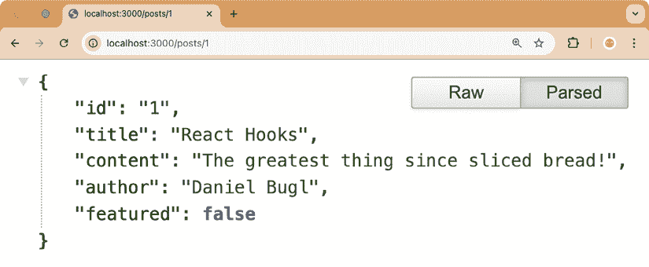
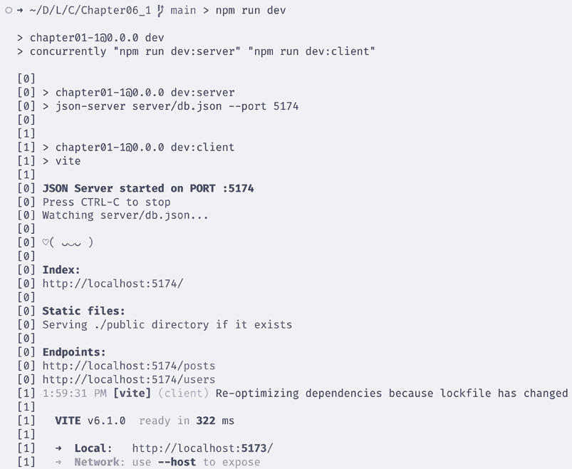
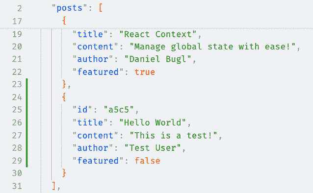
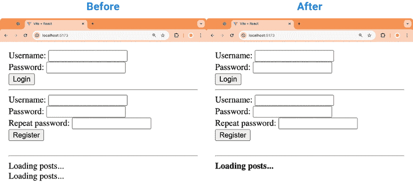
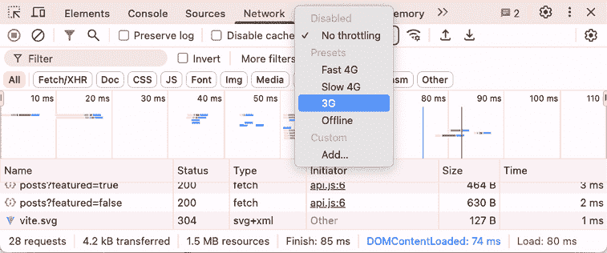
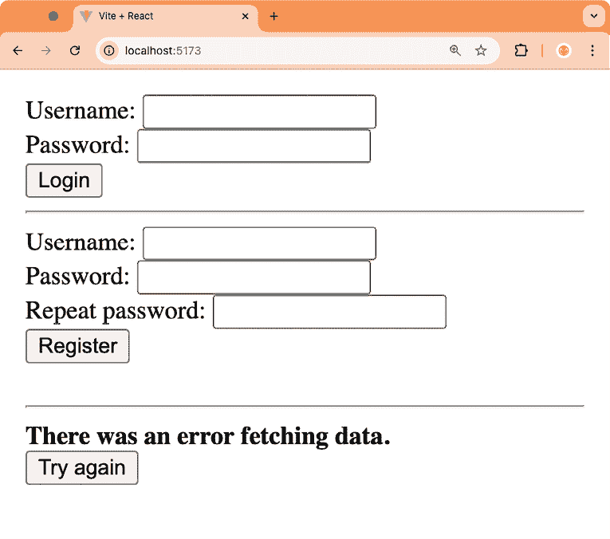

# 第六章：使用 Hooks 和 React Suspense 进行数据获取

在上一章中，我们学习了如何使用 React Context 作为手动传递 props 的替代方案。我们学习了 context providers、consumers 和 Context Hook。

在本章中，我们将首先使用 `json-server` 工具从 JSON 文件设置一个简单的后端服务器。然后，我们将结合使用 Effect Hook 和 State Hook 从我们的服务器获取数据。接下来，我们将使用 TanStack Query，这是一个流行的 React 数据获取库，它利用 Hooks，以同样的方式完成。最后，我们将了解 React Suspense，它可以用来延迟渲染，直到内容加载完成。

本章将涵盖以下主题：

+   设置一个简单的后端服务器

+   使用 Effect 和 State Hook 请求资源

+   使用 TanStack Query 请求资源并做出更改

+   介绍 React Suspense 和错误边界

# 技术要求

应该已经安装了相当新的 Node.js 版本。Node 包管理器 (`npm`) 也需要安装（它应该与 Node.js 一起提供）。有关如何安装 Node.js 的更多信息，请查看他们的官方网站：[`nodejs.org/`](https://nodejs.org/)

本书中的指南将使用 **Visual Studio Code** （**VS Code**），但任何其他编辑器中都应该有类似的工作方式。有关如何安装 VS Code 的更多信息，请参阅他们的官方网站：[`code.visualstudio.com`](https://code.visualstudio.com)

在本书中，我们使用以下版本：

+   Node.js v22.14.0

+   `npm` v10.9.2

+   Visual Studio Code v1.97.2

上列出的版本是本书中使用的版本。虽然安装较新版本通常不会有问题，但请注意，某些步骤在较新版本上可能会有所不同。如果您在这本书提供的代码和步骤中遇到问题，请尝试使用提到的版本。

您可以在 GitHub 上找到本章的代码：[`github.com/PacktPublishing/Learn-React-Hooks-Second-Edition/tree/main/Chapter06`](https://github.com/PacktPublishing/Learn-React-Hooks-Second-Edition/tree/main/Chapter06)

强烈建议您自己编写代码。不要简单地运行书中提供的代码示例。自己编写代码对于正确学习和理解代码非常重要。然而，如果您遇到任何问题，您始终可以参考代码示例。

# 设置一个简单的后端服务器

在我们可以实现请求之前，我们需要实现一个服务器。由于我们在这本书中专注于用户界面，我们将设置一个模拟服务器，这将使我们能够测试请求。我们将使用 `json-server` 工具从 JSON 文件创建一个模拟的 **表示状态传输** （**REST**） **应用程序编程接口** （**API**）。

## 创建 db.json 文件

要能够使用 `json-server` 工具，我们首先需要创建一个 `db.json` 文件，它将包含服务器的数据库。然后，`json-server` 工具将创建一个 REST API，允许我们访问和修改 `db.json` 文件，如下所示：

+   `GET` 请求，用于从文件中查看数据

+   `POST` 请求，用于将新数据插入文件

+   `PUT` 和 `PATCH` 请求，用于调整文件中的现有数据

+   `DELETE` 请求，用于从文件中删除数据

REST API 的结构是从 `db.json` 文件中的 JSON 对象推断出来的。对于所有修改操作（`POST`、`PUT`、`PATCH` 和 `DELETE`），工具将自动保存更新后的文件。

我们可以使用我们现有的帖子结构，我们在 App 组件中将其定义为 `defaultPosts`，但我们需要提供一个额外的 `id` 值，这样我们就可以稍后从数据库中查询帖子。此外，我们给每个帖子一个 `featured` 值。这将在我们实现请求时区分特色帖子和平常帖子变得很重要。

```js
[
  {
    "id": "1",
    "title": "React Hooks",
    "content": "The greatest thing since sliced bread!",
    "author": "Daniel Bugl",
    "featured": false
  },
  {
    "id": "2",
    "title": "Using React Fragments",
    "content": "Keeping the DOM tree clean!",
    "author": "Daniel Bugl",
    "featured": false
  },
  {
    "id": "3",
    "title": "React Context",
    "content": "Manage global state with ease!",
    "author": "Daniel Bugl",
    "featured": true
  }
] 
```

对于用户，我们需要想出一个方法来存储用户名和密码。为了简单起见，我们只以纯文本形式存储密码（**永远不要在生产环境中这样做！**）：

```js
[
  {
    "id": "1",
    "username": "Daniel Bugl",
    "password": "hunter2"
  }
] 
```

现在剩下的任务是将这两个数组合并成一个 JSON 对象，通过将帖子数组存储在 `posts` 键下，将用户数组存储在 `users` 键下。

让我们现在开始创建后端服务器的 JSON 文件：

1.  通过执行以下命令，将 `Chapter05_2` 文件夹复制到新的 `Chapter06_1` 文件夹：

    ```js
    $ cp -R Chapter05_2 Chapter06_1 
    ```

1.  在 VS Code 中打开新的 `Chapter06_1` 文件夹。

1.  在 `Chapter06_1` 文件夹内直接创建一个新的 `server/` 文件夹。

1.  创建一个包含以下内容的 `server/db.json` 文件：

    ```js
    {
      "posts": [
        {
          "id": "1",
          "title": "React Hooks",
          "content": "The greatest thing since sliced bread!",
          "author": "Daniel Bugl",
          "featured": false
        },
        {
          "id": "2",
          "title": "Using React Fragments",
          "content": "Keeping the DOM tree clean!",
          "author": "Daniel Bugl",
          "featured": false
        },
        {
          "id": "3",
          "title": "React Context",
          "content": "Manage global state with ease!",
          "author": "Daniel Bugl",
          "featured": true
        }
      ],
      "users": [
        {
          "id": "1",
          "username": "Daniel Bugl",
          "password": "hunter2"
        }
      ]
    } 
    ```

这就是我们使用 `json-server` 工具自动创建简单后端和 REST API 所需要的一切。让我们继续设置工具。

## 安装 json-server 工具

现在，我们将使用 `json-server` 工具安装并启动我们的后端服务器：

1.  首先，按照以下步骤安装 `json-server` 工具：

    ```js
    $ npm install --save-exact json-server@1.0.0-beta.3 
    ```

1.  现在，通过执行以下命令启动后端服务器：

    ```js
    $ npx json-server server/db.json 
    ```

    `npx` 命令执行在项目中本地安装的命令。我们需要在这里使用 `npx`，因为我们没有全局安装 `json-server` 工具（通过 `npm install -g json-server`）。

我们执行了 `json-server` 工具，它正在监视我们之前创建的 `server/db.json` 文件。

默认情况下，`json-server` 工具为 JSON 对象中的每个 `key` 定义了以下路由：

```js
GET    /posts
GET    /posts/:id
POST   /posts
PUT    /posts/:id
PATCH  /posts/:id
DELETE /posts/:id 
```

现在，我们可以访问 `http://localhost:3000/posts/1` 来查看我们的帖子对象：



图 6.1 – json-server 工具通过其 REST API 提供帖子！

如我们所见，该工具已为我们从数据库 JSON 文件创建了一个完整的 REST API！现在，让我们继续配置 `package.json` 脚本，以便 `json-server` 工具与我们的前端一起启动。

## 配置 package.json 脚本

让我们开始调整`package.json`文件：

1.  编辑`package.json`文件，并在`scripts`部分插入一个新的脚本名为`dev:server`。我们还要确保将端口改为与 Vite 默认端口（`5173`）相邻：

    ```js
     "scripts": {
    **"dev:server"****:** **"json-server server/db.json --port 5174"****,** 
    ```

1.  然后，我们将`dev`脚本重命名为`dev:client`：

    ```js
     "scripts": {
        "dev:server": "json-server server/db.json --port 5174",
        "dev**:client**": "vite", 
    ```

1.  保存`package.json`文件，否则稍后运行`npm install`将覆盖我们的更改。

1.  如果它仍在运行，请按*Ctrl+C*退出`json-server`工具。

1.  接下来，我们安装一个名为`concurrently`的工具，它允许我们同时启动服务器和客户端：

    ```js
    $ npm install --save-dev --save-exact concurrently@9.1.2 
    ```

1.  现在，我们再次编辑`package.json`并定义一个新的`dev`脚本，使用`concurrently`命令，然后将其作为参数传递给该命令：

    ```js
     "scripts": {
    **"dev"****:** **"concurrently \"npm run dev:server\" \"npm run dev:client\""****,** 
    ```

1.  现在尝试执行以下命令：

    ```js
    $ npm run dev 
    ```

你会看到这个命令正在启动服务器和客户端：



图 6.2 – concurrently 工具并行运行我们的服务器和客户端

现在我们已经同时运行了客户端和服务器，让我们继续配置代理以避免处理跨站请求。

## 配置代理

由于安全原因，浏览器对向不同域发起请求有限制。这种限制称为**跨源资源共享（CORS）**，它阻止我们从具有不同源（域名和端口）的 URL 发起请求。在我们的例子中，域名是相同的（`localhost`），但端口不同（`5173`与`5174`）。因此，最好保持相同的域名和端口，以便从前端向后端发起请求。所以，我们需要配置一个代理，将`http://localhost:5173/api/`的请求转发到`http://localhost:5174/`。

现在，让我们开始配置代理：

1.  编辑`vite.config.js`并定义一个绑定到`/api`路径的`proxy`配置：

    ```js
    export default defineConfig({
      plugins: [react()],
      resolve: {
        alias: [
          { find: '@', replacement: path.resolve(import.meta.dirname, 'src') },
        ],
      },
    **server****: {**
    **proxy****: {**
    **'/api'****: {** 
    ```

1.  将目标设置为运行在`http://localhost:5174`的后端服务器，并在将请求转发到我们的服务器之前，重写路径以从其中删除`/api`：

    ```js
    **target****:** **'http://localhost:5174'****,**
    **rewrite****:** **(****path****) =>** **path.****replace****(****/^\/api/****,** **''****),**
     **},**
     **},**
     **},**
    }) 
    ```

此代理配置将`/api`链接到我们的后端服务器。

1.  如果服务器和客户端已经在运行，请退出。然后，使用以下命令重新启动它们：

    ```js
    $ npm run dev 
    ```

1.  现在，通过浏览器打开`http://localhost:5173/api/posts/1`来访问 API。

如我们所见，POST 对象仍然被正确地提供服务，但现在是通过 Vite 中定义的代理从`/api`路径提供的！

**示例代码**

本节的示例代码可以在`Chapter06/Chapter06_1`文件夹中找到。请检查文件夹内的`README.md`文件，了解如何设置和运行示例。

现在，让我们继续使用 Effect 和 State/Reducer Hook 来请求资源。

# 使用 Effect 和 State/Reducer Hook 请求资源

在学习如何使用库通过 Hooks 实现请求之前，我们将手动实现它们，使用 Effect Hook 触发请求，以及使用 State/Reducer Hook 存储结果。

## 从服务器获取帖子

我们现在将实现一种使用 Effect Hook 获取帖子的方法。然后，我们将通过扩展已定义的 Reducer Hook 来存储它。让我们开始吧：

1.  通过执行以下命令将 `Chapter06_1` 文件夹复制到新的 `Chapter06_2` 文件夹：

    ```js
    $ cp -R Chapter06_1 Chapter06_2 
    ```

1.  在 VS Code 中打开新的 `Chapter06_2` 文件夹。

1.  首先，编辑 `src/reducers.js` 并定义一个新的 `FETCH_POSTS` 动作，它将简单地从动作返回新的帖子列表：

    ```js
    export function postsReducer(state, action) {
      switch (action.type) {
        case 'CREATE_POST':
          return [action.post, ...state]
    **case****'FETCH_POSTS'****:**
    **return** **action.****posts**
    default:
          throw new Error('Unknown action type')
      }
    } 
    ```

1.  现在，编辑 `src/App.jsx` 并导入 `useEffect` 函数：

    ```js
    import { useState, useReducer**, useEffect** } from 'react' 
    ```

1.  *删除* `featuredPosts` 和 `defaultPosts` 数组。

1.  调整 Reducer Hook 的默认值为一个空数组：

    ```js
    export function App() {
      const [posts, dispatch] = useReducer(postsReducer, **[]**)
      const [username, setUsername] = useState('') 
    ```

1.  然后，在 App 组件中定义一个 Effect Hook，如下所示：

    ```js
     useEffect(() => { 
    ```

1.  在 Hook 内部，我们调用 `fetch` 向 `/api/posts` 端点发起请求：

    ```js
     fetch('/api/posts') 
    ```

1.  解析 JSON 响应以获取 `posts` 数组：

    ```js
     .then((response) => response.json()) 
    ```

1.  现在，使用从服务器返回的 `posts` 数组分发 `FETCH_POSTS` 动作：

    ```js
     .then((posts) => dispatch({ type: 'FETCH_POSTS', posts })) 
    ```

1.  将空数组传递给 Effect Hook 依赖数组，以确保它仅在组件挂载时触发：

    ```js
     }, []) 
    ```

1.  我们仍然需要将特色帖子与非特色帖子分开，所以让我们使用 `filter` 将数组拆分为两个数组，如下所示：

    ```js
     const featuredPosts = posts.filter((post) => post.featured).reverse()
      const regularPosts = posts.filter((post) => !post.featured).reverse() 
    ```

我们在这里反转顺序以确保显示最新的帖子。如果我们有一个 `createdAt` 属性，我们可以用它来正确地排序帖子。

1.  将 `regularPosts` 而不是 `posts` 传递给 `PostList` 组件，以确保特色帖子不会渲染两次：

    ```js
     <PostList posts={**regularPosts**} /> 
    ```

1.  按照以下方式启动客户端和服务器：

    ```js
    $ npm run dev 
    ```

1.  现在，在浏览器中转到 `http://localhost:5173/`。

如我们所见，应用程序仍然以之前相同的方式工作！为了验证帖子确实来自我们的数据库，对 `db.json` 进行更改，然后刷新页面。您将看到更改在应用程序中可见！

在开发模式下，您将看到两个 `GET` 请求。这是由于 React 在严格模式下渲染组件两次，以帮助您发现可能在组件重新渲染时发生的副作用（例如，忘记清理超时/间隔）。

在生产模式下，组件只会渲染一次，因此只会发送一个 `GET` 请求。

## 快速转换：async/await 构造

**常规函数**定义如下：

```js
function doSomething() {
  // ...
} 
```

**常规匿名函数**定义如下：

```js
() => {
  // ...
} 
```

**异步函数**通过添加 `async` 关键字来定义：

```js
async function doSomething() {
  // ...
} 
```

**异步匿名函数**也是可能的：

```js
async () => {
  // ...
} 
```

在 `async` 函数中，我们可以使用 `await` 关键字等待承诺解决后再继续。而不是必须做以下操作：

```js
function fetchPosts() {
  return fetch('/api/posts')
    .then((response) => response.json())
} 
```

我们现在可以使用 `async`/`await` 以这种方式编写相同的函数：

```js
async function fetchPosts() {
  const response = await fetch('/api/posts')
  const posts = await response.json()
  return posts
} 
```

在上一节中，我们使用了 Promise API 通过在 Effect Hook 内部使用 `.then()` 函数来处理异步函数的结果。Effect Hooks 不支持将异步函数传递给它们，以防止竞态条件。然而，在 Hook 内部定义一个异步函数并在之后立即调用它是可能的。因此，我们也可以将 Hook 定义如下：

```js
 useEffect(() => {
    async function fetchPosts() {
      const response = await fetch('/api/posts')
      const posts = await response.json()
      dispatch({ type: 'FETCH_POSTS', posts })
    }
    void fetchPosts()
  }, []) 
```

`void` 运算符表明我们并非无意中调用了一个没有 `await` 的 `async` 函数。在这种情况下，我们想要调用异步函数，但并不关心它何时完成。

如您所见，`async`/`await` 构造在某些情况下可以使我们的代码更容易阅读。您可以选择任一模式（`then` 或 `async`/`await`），取决于哪一个使代码更易读。然而，在同一个函数中混合两者并不是最佳实践。当然，如果我们有一个 State Hook 而不是 `dispatch` 和 Reducer Hook，我们也可以在这里调用 `setPosts`。

现在帖子已成功从数据库中加载，让我们实现一种通过后端服务器创建帖子的方法。

## 在服务器上创建新帖子

对于创建帖子，我们只需调整提交处理函数以使用 `fetch` 执行 POST 请求。现在让我们开始做这件事：

1.  编辑 `src/components/post/CreatePost.jsx` 并将 `handleSubmit` 函数定义为 `async`：

    ```js
     **async** function handleSubmit(e) { 
    ```

1.  在函数内部，在收集值之后，创建一个到 `/api/posts` 的 fetch 请求：

    ```js
     e.preventDefault()
        const form = e.target
    const title = form.elements.title.value
    const content = form.elements.content.value
    const newPost = { title, content, author: username**,** **featured****:** **false** }
    **const** **response =** **await****fetch****(****'/api/posts'****, {** 
    ```

1.  确保这是一个 POST 请求，并设置头信息，以便我们的后端服务器知道我们将发送一个 JSON 对象：

    ```js
     method: 'POST',
          headers: { 'Content-Type': 'application/json' }, 
    ```

1.  现在，我们可以将我们的 `post` 对象作为请求体传递，通过将其转换为 JSON 字符串：

    ```js
     body: JSON.stringify(newPost),
        }) 
    ```

1.  如果响应不是成功的，抛出一个错误：

    ```js
     if (!response.ok) {
          throw new Error('Unable to create post')
        } 
    ```

1.  否则，我们派发 `CREATE_POST` 动作以在客户端显示新帖子并重置表单：

    ```js
     dispatch({ type: 'CREATE_POST', post: newPost })
        form.reset()
      } 
    ```

1.  使用前端创建一个新的帖子，然后检查 `server/db.json` 文件。

如我们所见，新帖子已成功插入到数据库中：



图 6.3 – 我们成功地将一个新帖子插入到数据库中

**示例代码**

本节的示例代码可以在 `Chapter06/Chapter06_2` 文件夹中找到。请检查文件夹内的 `README.md` 文件，以获取设置和运行示例的说明。

现在我们已经成功实现了通过直接使用 Fetch API 和 Effect Hook 来获取和创建帖子，我们可以继续学习如何使用库来请求资源并做出更改。

# 使用 TanStack Query 请求资源并做出更改

在前面的章节中，我们使用 Effect 钩子来触发请求，并使用 Reducer 钩子来更新状态，使用请求的结果。我们不必手动实现这样的请求，而是可以使用 TanStack Query 库。这个库不仅允许我们轻松获取资源，还为我们缓存结果并提供使状态无效的方法。使状态无效允许我们在创建新帖子后从服务器重新获取帖子，而不是必须手动分发一个动作。

## 设置库

在我们开始使用它之前，我们需要安装和设置库。TanStack Query 是一个用于管理服务器数据状态的库。它由 3 部分组成：

+   一个 **查询客户端**，它管理缓存和使状态无效。

+   一个 **查询客户端提供者**，它将应用程序包裹起来，为所有组件提供查询客户端。

+   一系列钩子，如查询和突变钩子。**查询钩子**用于获取和订阅数据，而**突变钩子**用于您需要修改服务器上的数据时使用。

现在让我们开始设置 TanStack Query：

1.  通过执行以下命令将`Chapter06_2`文件夹复制到新的`Chapter06_3`文件夹：

    ```js
    $ cp -R Chapter06_2 Chapter06_3 
    ```

1.  在 VS Code 中打开新的`Chapter06_3`文件夹。

1.  按照以下步骤安装 TanStack Query 库：

    ```js
    $ npm install --save-exact @tanstack/react-query@5.66.7 
    ```

1.  此外，将 ESLint 插件作为开发依赖项安装：

    ```js
    $ npm install --save-dev --save-exact @tanstack/eslint-plugin-query@5.66.1 
    ```

1.  编辑`eslint.config.js`并在其中导入插件：

    ```js
    import pluginQuery from '@tanstack/eslint-plugin-query' 
    ```

1.  然后，按照以下步骤添加插件：

    ```js
    export default [
     **...pluginQuery.****configs****[****'flat/recommended'****],**
      { ignores: ['dist'] }, 
    ```

1.  现在，我们可以开始设置 TanStack Query 本身了。首先，创建一个新的`src/api.js`文件，其中将包含查询客户端。

1.  编辑`src/api.js`并导入和创建查询客户端：

    ```js
    import { QueryClient } from '@tanstack/react-query'
    export const queryClient = new QueryClient() 
    ```

我们在这里创建查询客户端的单例实例，以确保我们应用程序的所有部分都使用相同的查询客户端（以及相同的缓存）。

1.  现在，编辑`src/App.jsx`，*移除* `useReducer`、`useEffect` 和 `postsReducer` 的导入：

    ```js
    import { useState**, useReducer, useEffect** } from 'react'
    **import** **{ postsReducer }** **from****'./reducers.js'** 
    ```

*替换*它们为`queryClient`和`QueryClientProvider`的导入：

```js
import { QueryClientProvider } from '@tanstack/react-query'
import { queryClient } from './api.js' 
```

1.  在 App 组件内部，*移除*与获取帖子相关的钩子：

    ```js
    export function App() {
    **const** **[posts, dispatch] =** **useReducer****(postsReducer, [])**
    const [username, setUsername] = useState('')
    **useEffect****(****() =>** **{**
    **fetch****(****'/api/posts'****)**
     **.****then****(****(****response****) =>** **response.****json****())**
     **.****then****(****(****posts****) =>****dispatch****({** **type****:** **'FETCH_POSTS'****, posts }))**
     **}, [])**
    **const** **featuredPosts = posts.****filter****(****(****post****) =>** **post.****featured****).****reverse****()**
    **const** **regularPosts = posts.****filter****(****(****post****)****=>** **!post.****featured****).****reverse****()** 
    ```

1.  按照以下步骤将应用程序包裹在`QueryClientProvider`中：

    ```js
     return (
    **<****QueryClientProvider****client****=****{queryClient}****>**
    <UserContext.Provider value={[username, setUsername]}>
           …
          </UserContext.Provider>
    **</****QueryClientProvider****>**
      )
    } 
    ```

1.  *移除* `CreatePost` 组件的 `dispatch` 属性：

    ```js
     {username && **<****CreatePost** **/>**} 
    ```

到目前为止，章节中的`featuredPosts`和`regularPosts`数组不再定义，导致 ESLint 错误。现在忽略这些错误，我们很快就会修复它们。

现在，我们已经准备好使用 TanStack Query 了！

## 使用查询钩子获取帖子

现在库已经设置好了，我们可以开始使用它了。我们将首先使用查询钩子来获取帖子。为此，我们将创建一个新的`PostFeed`组件，该组件将处理获取逻辑，同时将`PostList`作为一个渲染组件列表的 UI 组件。我们还将定义一个函数，在`src/api.js`文件中为我们获取帖子。

现在让我们开始使用查询钩子获取帖子：

1.  编辑`src/api.js`并定义一个新的函数，该函数接受一个`featured`属性然后为我们获取帖子：

    ```js
    export async function fetchPosts({ featured }) { 
    ```

1.  我们调用 API，将 `featured` 属性作为查询参数传递。这将导致 `json-server` 根据其 `featured` 值为我们过滤帖子：

    ```js
     const res = await fetch(`/api/posts?featured=${featured}`) 
    ```

1.  将响应解析为 JSON 并返回：

    ```js
     return await res.json()
    } 
    ```

1.  创建一个新的 `src/components/post/PostFeed.jsx` 文件。

1.  在其中，导入 `useQuery` 函数、`PostList` 组件和 `fetchPosts` 函数：

    ```js
    import { useQuery } from '@tanstack/react-query'
    import { fetchPosts } from '@/api.js'
    import { PostList } from './PostList.jsx' 
    ```

1.  然后，定义组件，它接受一个 `featured` 属性来切换是否渲染特色组件或常规组件：

    ```js
    export function PostFeed({ featured = false }) { 
    ```

1.  定义一个 Query Hook，从中使用 `data` 和 `isLoading` 值：

    ```js
     const { data, isLoading } = useQuery({ 
    ```

1.  对于每个 Query Hook，我们需要定义一个 `queryKey`。`queryKey` 用于缓存查询的结果：

    ```js
     queryKey: ['posts', featured], 
    ```

例如，如果我们使用相同的 `queryKey` 在另一个组件中获取，我们将得到缓存的而不是另一个请求的结果。React Query 总是会首先尝试从缓存（如果给定 `queryKey` 存在）中获取结果，如果它尚未存在于缓存中，它将为我们后台发送请求并缓存它。

这非常有用，因为它允许我们在组件树中更深入地获取数据，直接在我们需要的地方 – 避免了属性钻取而不影响性能。

`queryKey` 也可能成为错误的原因，当它意外地用于不同的请求时。例如，我们需要在这里将 `featured` 属性添加到 `queryKey` 中，否则只会获取并返回一次特色帖子或常规帖子。如果你从 Query Hooks 获取到奇怪的结果或过时的数据，请确保检查你的查询键，并确保每个请求都有一个唯一的键，并且传递给查询函数的所有参数也都添加到了查询键中。

1.  接下来，我们定义 `queryFn` – 当查询执行时将被调用的函数。在这种情况下，我们简单地使用 `featured` 属性调用 `fetchPosts` 函数：

    ```js
     queryFn: () => fetchPosts({ featured }),
      }) 
    ```

1.  如果 Query Hook 处于加载状态，我们显示一个加载消息：

    ```js
     if (isLoading) {
        return <div>Loading posts...</div>
      } 
    ```

1.  同样，如果获取数据失败，我们显示一个错误消息：

    ```js
     if (!data) {
        return <div>Could not load posts!</div>
      } 
    ```

1.  否则，一切正常，我们可以渲染 `PostList`：

    ```js
     return <PostList posts={data} />
    } 
    ```

1.  编辑 `src/App.jsx` 并 *删除* 以下 `PostList` 导入：

    ```js
    import { PostList } from './components/post/PostList.jsx' 
    ```

*替换* 为 `PostFeed` 组件的导入：

```js
import { PostFeed } from './components/post/PostFeed.jsx' 
```

1.  在 `App` 组件内部，将 `PostList` 组件替换为 `PostFeed` 组件，如下所示：

    ```js
     <hr />
                <ThemeContext.Provider value={{ primaryColor: 'salmon' }}>
    **<****PostFeed****featured** **/>**
    </ThemeContext.Provider>
    **<****PostFeed** **/>** 
    ```

在实现获取帖子方法后，让我们继续使用 Mutation Hook 来创建一个新的帖子。

## 使用 Mutation Hook 创建帖子

获取帖子需要我们在组件挂载时向服务器发送请求以获取数据。然而，为了创建帖子，我们希望在用户按下按钮时向服务器发送请求。为了实现这种行为，我们需要一个 Mutation Hook 而不是 Query Hook。

现在让我们开始使用 Mutation Hook 实现帖子创建：

1.  编辑 `src/api.js` 并定义一个新的创建帖子的函数：

    ```js
    export async function createPost(post) { 
    ```

1.  在其中，我们发送一个 POST 请求，类似于我们之前所做的那样：

    ```js
     const res = await fetch('/api/posts', {
        method: 'POST',
        headers: { 'Content-Type': 'application/json' },
        body: JSON.stringify(post),
      }) 
    ```

1.  如果请求过程中出现问题，我们抛出一个错误：

    ```js
     if (!res.ok) {
        throw new Error('Unable to create post')
      } 
    ```

1.  否则，如果请求成功，我们返回结果：

    ```js
     return await res.json()
    } 
    ```

1.  编辑 `src/components/post/CreatePost.jsx` 并导入 `useMutation` 和 `createPost` 函数，以及 `queryClient`：

    ```js
    import { useMutation } from '@tanstack/react-query'
    import { createPost, queryClient } from '@/api.js' 
    ```

1.  *移除* 组件中的 `dispatch` 属性，因为我们不再需要它：

    ```js
    export function CreatePost(**{ dispatch }**) { 
    ```

1.  在组件内部，添加一个新的突变钩子，将 `createPost` 函数作为 `mutationFn` 传递：

    ```js
     const createPostMutation = useMutation({
        mutationFn: createPost, 
    ```

1.  添加一个 `onSuccess` 处理程序，该程序将使所有以 `'posts'` 查询键开始的查询无效：

    ```js
     onSuccess: () => {
          queryClient.invalidateQueries(['posts'])
        },
      }) 
    ```

当查询键无效时，所有使用它的查询钩子会自动重新执行以获取新数据，并且组件会重新渲染以显示它。在这种情况下，我们将使所有以 `'posts'` 开头的查询键无效，因此我们将使特色帖子源中的 `['posts', true]` 和常规帖子源中的 `['posts', false]` 都无效。

1.  *替换* 整个 `handleSubmit` 函数，如下所示：

    ```js
     async function handleSubmit(e) {
        e.preventDefault()
        const form = e.target
    const title = form.elements.title.value
    const content = form.elements.content.value
    const newPost = { title, content, author: username, featured: false } 
    ```

1.  然后，从突变钩子中调用 `mutate` 函数，并在成功执行突变后重置表单：

    ```js
     createPostMutation.mutate(newPost, {
          onSuccess: () => form.reset()
        })
      } 
    ```

1.  此外，我们现在可以改进组件的用户体验。例如，我们可以使用 `isPending` 状态在突变挂起时禁用提交按钮：

    ```js
     <input
            type='submit'
            value='Create'
     **disabled={createPostMutation.****isPending****}**
          /> 
    ```

1.  如果突变过程中出现错误，我们还可以在表单末尾用红色显示错误消息：

    ```js
     **{createPostMutation.****isError** **&& (**
    **<****div****style****=****{{****color:** **'****red****' }}>**
     **{createPostMutation.error.toString()}**
    **</****div****>**
     **)}**
        </form> 
    ```

1.  尝试运行应用程序，你会发现它仍然像以前一样工作，但现在使用 TanStack Query！

当插入新帖子时，你可能注意到它现在被添加到了末尾。不幸的是，我们无法控制 `json-server` 如何将新帖子插入数组中。如果你想再次添加这种行为，我建议给所有帖子添加一个 `createdAt` 时间戳，然后使用 `json-server` 工具提供的 `_sort` 查询参数按此时间戳对帖子进行排序。这样做将作为一个练习留给你。

使用我们应用程序的新结构，我们可以通过使用 React Suspense 和错误边界来进一步改进它！

**示例代码**

本节的示例代码可以在 `Chapter06/Chapter06_3` 文件夹中找到。请检查文件夹内的 `README.md` 文件，了解如何设置和运行示例。

# 介绍 React Suspense 和错误边界

在前面的部分中，我们使用了 TanStack Query 的 `isLoading` 状态来显示正在获取帖子时的加载消息。虽然这没问题，但处理这样的加载状态可能会有些混乱。更好地建模加载状态的方法是使用 React Suspense。React Suspense 是一个特殊组件，可以在其子组件完成加载之前显示回退内容。要使用 React Suspense，数据获取框架和库需要支持它。幸运的是，TanStack Query 支持 Suspense。像 Relay 和 Next.js 这样的框架也支持它。

## 设置 Suspense 边界

要使用 Suspense，我们需要定义一个带有回退的 Suspense 边界。如果边界内的任何子组件正在获取数据，回退将替换边界，并替换其所有子组件。当所有数据成功获取后，所有子组件将被渲染。这允许我们编写假设数据始终存在的代码，并在树的上层进一步处理边缘情况。

让我们现在开始为帖子源设置 Suspense 边界：

1.  通过执行以下命令将`Chapter06_3`文件夹复制到新的`Chapter06_4`文件夹：

    ```js
    $ cp -R Chapter06_3 Chapter06_4 
    ```

1.  在 VS Code 中打开新的`Chapter06_4`文件夹。

1.  编辑`src/App.jsx`并导入`Suspense`：

    ```js
    import { useState**,** **Suspense** } from 'react' 
    ```

1.  调整`App`组件，使其在 Suspense 边界内渲染帖子源，提供加载消息作为回退：

    ```js
     **<****Suspense** **fallback={****<****strong****>****Loading posts...****</****strong****>****}>**
    <ThemeContext.Provider value={{ primaryColor: 'salmon' }}>
    <PostFeed featured />
    </ThemeContext.Provider>
    <PostFeed />
     **</****Suspense****>** 
    ```

1.  现在，我们需要调整`PostFeed`组件以使用 Suspense 查询 Hook。编辑`src/components/post/PostFeed.jsx`并按照以下方式调整导入：

    ```js
    import { use**Suspense**Query } from '@tanstack/react-query' 
    ```

1.  然后，按照以下方式调整 Hook：

    ```js
    export function PostFeed({ featured = false }) {
      const **{ data }** = use**Suspense**Query({ 
    ```

1.  我们现在可以从组件中*删除*以下代码：

    ```js
     if (isLoading) {
        return <div>Loading posts...</div>
      }
      if (!data) {
        return <div>Could not load posts!</div>
      } 
    ```

1.  按照以下方式启动应用：

    ```js
    $ npm run dev 
    ```

你会发现，我们不再看到两个加载消息（一个用于特色帖子，一个用于常规帖子），现在我们只看到一个来自 Suspense 边界的加载消息！



图 6.4 – 使用 React Suspense 前后加载消息的对比

加载消息可能消失得太快，以至于你看不见，因为我们正在本地运行后端，所以没有网络延迟。这不是一个现实场景。在生产中，我们会对每个请求都有延迟。我们可以使用 DevTools 来模拟更慢的网络连接；让我们现在就做：

1.  在 Google Chrome 中，通过右键点击网站并按**Inspect**来打开检查器。

1.  检查器将打开，在其内部，转到**网络**标签页。

1.  在网络标签页的顶部，点击**无限制**下拉菜单。

1.  选择**3G**预设。参见以下截图以供参考：



图 6.5 – 在 Google Chrome DevTools 中模拟慢速网络

1.  刷新页面。你现在会看到应用正在缓慢加载帖子。

1.  不要忘记将其设置回**无限制**，以避免请求需要等待很长时间。

接下来，让我们继续设置错误边界。

## 设置错误边界

正如我们所学的，Suspense 边界可以在组件获取数据时提供回退。然而，你可能已经注意到我们还删除了错误处理代码。当子组件发生错误时，我们可以使用错误边界来提供回退。错误边界的工作方式与 Suspense 边界类似，但它们对错误状态而不是加载状态做出反应。

让我们现在开始设置错误边界：

1.  首先，安装`react-error-boundary`包：

    ```js
    $ npm install --save-exact react-error-boundary@5.0.0 
    ```

1.  然后，我们创建一个组件，当发生错误时将作为回退渲染。

1.  创建一个新的 `src/FetchErrorNotice.jsx` 文件。在文件内部，定义一个组件，它接受一个 `resetErrorBoundary` 函数：

    ```js
    export function FetchErrorNotice({ resetErrorBoundary }) { 
    ```

`resetErrorBoundary` 函数可以用来重置导致错误的操作。在我们的例子中，它将重试获取帖子的请求。

1.  渲染一个错误信息和触发重置函数的按钮：

    ```js
     return (
        <div>
    <strong>There was an error fetching data.</strong>
    <br />
    <button onClick={resetErrorBoundary}>Try again</button>
    </div>
      )
    } 
    ```

1.  现在，编辑 `src/App.jsx` 并导入 `ErrorBoundary`、`QueryErrorResetBoundary` 和 `FetchErrorNotice`：

    ```js
    **import** **{** **ErrorBoundary** **}** **from****'react-error-boundary'**
    import {
      QueryClientProvider,
    **QueryErrorResetBoundary****,**
    } from '@tanstack/react-query'
    **import** **{** **FetchErrorNotice** **}** **from****'./FetchErrorNotice.jsx'** 
    ```

1.  在 `App` 组件内部，将 Suspense Boundary 包裹在错误边界中，该错误边界反过来又包裹在 `QueryErrorResetBoundary` 中，它提供了 `reset` 函数来重试查询：

    ```js
     **<****QueryErrorResetBoundary****>**
     **{****(****{ reset }****) =>** **(**
    **<****ErrorBoundary**
    **onReset****=****{reset}**
    **fallbackRender****=****{FetchErrorNotice}**
     **>**
    <Suspense fallback={<strong>Loading posts...</strong>}>
                        <ThemeContext.Provider value={{ primaryColor: 'salmon' }}>
    <PostFeed featured />
    </ThemeContext.Provider>
    <PostFeed />
    </Suspense>
    **</****ErrorBoundary****>**
     **)}**
     **</****QueryErrorResetBoundary****>** 
    ```

1.  如果它目前正在运行，停止应用。

1.  然后，只启动客户端，如下所示：

    ```js
    $ npm run dev:client 
    ```

1.  在浏览器中打开应用，你会看到加载信息。等待一段时间直到请求超时。然后，你会看到错误信息和重试按钮：



图 6.6 – 由请求超时触发的错误边界

1.  现在，不退出客户端，另外启动服务器，如下所示：

    ```js
    $ npm run dev:server 
    ```

1.  点击 **重试** 按钮。你会再次看到加载信息，然后是帖子的列表！

如我们所见，错误边界允许我们通过显示回退组件和重置导致错误的操作的功能来管理错误状态。

**示例代码**

本节的示例代码可以在 `Chapter06/Chapter06_4` 文件夹中找到。检查文件夹内的 `README.md` 文件以获取设置和运行示例的说明。

# 摘要

在本章中，我们首先学习了如何从 JSON 文件设置一个简单的 API 服务器。然后，我们学习了如何使用 Effect 和 State/Reducer Hooks 来获取和创建帖子。接下来，我们使用 TanStack Query 库实现了相同的功能，这简化了我们的代码并使我们能够利用其缓存能力。最后，我们学习了如何使用 React Suspense 处理加载状态和使用错误边界处理错误状态。

在下一章中，我们将通过使用表单操作和 Hooks（例如 `useActionState` Hooks 来处理表单状态和 `useOptimistic` Hooks 来实现乐观更新）来深入学习表单处理。

# 问题

为了回顾本章所学内容，尝试回答以下问题：

1.  我们如何轻松地从 JSON 文件创建一个完整的 REST API 以进行模拟？

1.  使用代理访问我们的后端服务器有哪些优势？

1.  哪些 Hooks 的组合可以用来实现数据获取？

1.  TanStack Query 相比我们简单的数据获取实现有哪些优势？

1.  TanStack Query 中哪个 Hooks 用于获取数据？

1.  TanStack Query 中哪个 Hooks 用于对服务器进行更改？

1.  查询键在 TanStack Query 库中扮演什么角色？

1.  Suspense Boundary 用于什么？

1.  Error Boundaries 是用来做什么的？

# 进一步阅读

如果你对本章学到的概念有更多兴趣，请查看以下链接：

+   `json-server` 工具的官方文档：[`github.com/typicode/json-server`](https://github.com/typicode/json-server)

+   `concurrently` 工具的官方文档：[`github.com/open-cli-tools/concurrently`](https://github.com/open-cli-tools/concurrently)

+   TanStack Query for React 的官方文档：[`tanstack.com/query/latest/docs/framework/react/overview`](https://tanstack.com/query/latest/docs/framework/react/overview)

+   关于 **跨源资源共享**（**CORS**）的更多信息：[`developer.mozilla.org/en-US/docs/Web/HTTP/CORS`](https://developer.mozilla.org/en-US/docs/Web/HTTP/CORS)

+   关于 Vite 配置中代理设置的更多信息：[`vite.dev/config/server-options#server-proxy`](https://vite.dev/config/server-options#server-proxy)

+   关于 React 严格模式的更多信息：[`react.dev/reference/react/StrictMode`](https://react.dev/reference/react/StrictMode)

+   关于使用 React Hooks 获取数据的博客文章，无需库：[`www.robinwieruch.de/react-hooks-fetch-data/`](https://www.robinwieruch.de/react-hooks-fetch-data/)

+   关于 Suspense 的更多信息：[`react.dev/reference/react/Suspense`](https://react.dev/reference/react/Suspense)

+   关于 Error Boundaries 的更多信息：[`github.com/bvaughn/react-error-boundary`](https://github.com/bvaughn/react-error-boundary)

# 在 Discord 上了解更多

要加入本书的 Discord 社区——在那里你可以分享反馈，向作者提问，并了解新版本——请扫描下面的二维码：

`packt.link/wnXT0`


