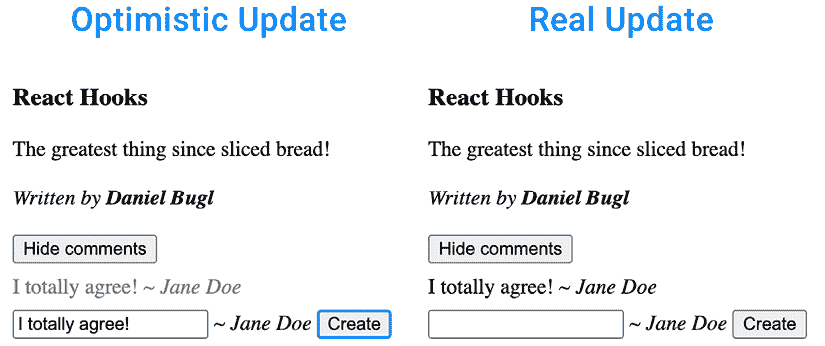

# 第七章：使用 Hooks 处理表单

在上一章中，我们学习了如何使用 Hooks 进行数据获取和 React Suspense 在等待数据加载完成时显示回退。

在本章中，我们将学习如何使用 Hooks 来处理 React 中的表单和表单状态。我们之前已经为 `CreatePost` 组件实现了一个表单。然而，我们不是手动处理表单提交，而是可以使用 **React 表单操作**，这不仅使处理表单提交变得更容易，还允许我们使用访问表单状态的 Hooks。此外，我们还将学习如何使用 **乐观钩子** 来实现乐观更新，即在服务器端完成处理之前，在客户端显示初步结果。

本章将涵盖以下主题：

+   使用 **Action 状态 Hook** 处理表单提交

+   模拟 **阻塞 UI**

+   使用 **过渡钩子** 避免阻塞 UI

+   使用 **乐观钩子** 实现乐观更新

# 技术要求

应已安装一个相当新的 Node.js 版本。Node 包管理器 (`npm`) 也需要安装（它应该随 Node.js 一起安装）。有关如何安装 Node.js 的更多信息，请查看他们的官方网站：[`nodejs.org/`](https://nodejs.org/).

在本书的指南中，我们将使用 **Visual Studio Code** （**VS Code**）进行编写，但任何其他编辑器也应该以类似的方式工作。有关如何安装 VS Code 的更多信息，请参阅他们的官方网站：[`code.visualstudio.com`](https://code.visualstudio.com)

在本书中，我们使用以下版本：

+   Node.js v22.14.0

+   `npm` v10.9.2

+   Visual Studio Code v1.97.2

上列出的版本是本书中使用的版本。虽然安装较新版本不应有问题，但请注意，某些步骤在较新版本上可能有所不同。如果您在本书提供的代码和步骤中遇到问题，请尝试使用提到的版本。

您可以在 GitHub 上找到本章的代码：[`github.com/PacktPublishing/Learn-React-Hooks-Second-Edition/tree/main/Chapter07`](https://github.com/PacktPublishing/Learn-React-Hooks-Second-Edition/tree/main/Chapter07)

强烈建议您自己编写代码。不要简单地运行书中提供的代码示例。自己编写代码对于正确学习和理解代码非常重要。然而，如果您遇到任何问题，您始终可以参考代码示例。

# 使用 Action 状态 Hook 处理表单提交

React 19 引入了一个名为 **Form Actions** 的新功能。正如我们在前面的章节中看到的，在 Web 应用程序中，对用户操作进行数据变更是一个常见的用例。通常，这些数据变更需要发起 API 请求并处理响应，这意味着要处理加载和错误状态。例如，当我们创建 `CreatePost` 组件时，我们创建了一个表单，在提交时将新帖子插入到数据库中。在这种情况下，**React Query** 已经帮助我们很多，通过简化加载和错误状态。然而，使用 React Form Actions 现在有一个原生的方法来处理这些状态，通过使用 Action State Hook。

## 介绍 Action State Hook

Action State Hook 定义如下：

```js
const [state, action, isPending] = useActionState(actionFn, initialState) 
```

让我们稍微分解一下，以便更好地理解它。要定义一个 Action State Hook，我们需要至少提供一个函数作为参数。这个函数将在表单提交时被调用，并且具有以下签名：

```js
function actionFn(currentState, formData) { 
```

动作函数将动作的当前状态作为第一个参数，将表单数据（作为一个 `FormData` 对象）作为第二个参数。动作函数返回的任何内容都将成为 Action State Hook 的新状态。

`FormData` API 是一个用于表示表单字段及其值的 Web 标准。它可以用来处理表单提交并通过网络发送，例如使用 `fetch()`。它是一个可迭代的对象（可以使用 `for … of` 循环迭代）并提供 getter 和 setter 函数来访问值。更多信息可以在这里找到：[`developer.mozilla.org/en-US/docs/Web/API/FormData`](https://developer.mozilla.org/en-US/docs/Web/API/FormData)。

此外，还可以为 Action State Hook 提供一个 `initialState`。

该 Hook 然后返回动作的当前状态，动作本身（将被传递到 `<form>` 元素），以及 `isPending` 状态，以检查动作是否当前正在挂起（当 `actionFn` 正在执行时）。

## 使用 Action State Hook

现在，让我们开始重构 `CreatePost` 组件以使用 Action State Hook：

1.  通过执行以下命令将 `Chapter06_4` 文件夹复制到新的 `Chapter07_1` 文件夹：

    ```js
    $ cp -R Chapter06_4 Chapter07_1 
    ```

1.  在 VS Code 中打开新的 `Chapter07_1` 文件夹。

1.  编辑 `src/components/post/CreatePost.jsx` 并导入 `useActionState` 函数：

    ```js
    import { useContext, **useActionState** } from 'react' 
    ```

1.  在 *CreatePost* 组件内部，*删除* 整个 `handleSubmit` 函数。

1.  *替换* 为以下 Action State Hook：

    ```js
     const [error, submitAction, isPending] = useActionState( 
    ```

在这种情况下，我们将使用动作的 `state` 来存储错误状态。如果有错误，我们将从动作函数中返回它。否则，我们返回 nothing，因此错误状态是 `undefined`。

1.  定义动作函数，如下所示：

    ```js
     async (currentState, formData) => { 
    ```

在这种情况下，我们不会使用传递给函数的 `currentState`，但我们仍然需要定义它，因为我们需要第二个参数来获取 `formData`。

1.  现在，通过使用 `FormData` API 从表单中获取标题和内容：

    ```js
     const title = formData.get('title')
          const content = formData.get('content') 
    ```

`FormData` API 使用 `name` 属性来识别输入字段。

1.  接下来，创建帖子对象并调用突变：

    ```js
     const newPost = { title, content, author: username, featured: false }
          try {
            await createPostMutation.mutateAsync(newPost) 
    ```

由于我们现在有一个 `async` 函数，我们可以使用 mutation 中的 `mutateAsync` 方法来能够 `await` 响应。

1.  如果发生错误，则返回它：

    ```js
     } catch (err) {
            return err
          }
        },
      ) 
    ```

我们不再需要手动重置表单。当使用表单操作时，一旦表单操作函数成功完成，表单中的所有未受控字段将自动重置。

1.  调整 `<form>` 元素以将 `action` 传递给它而不是 `onSubmit` 处理程序：

    ```js
     return (
        <form **action****=****{submitAction}**> 
    ```

1.  调整提交按钮和错误信息，如下所示：

    ```js
     <input type='submit' value='Create' **disabled****=****{isPending}** />
          {**error** && <div style={{ color: 'red' }}>{**error**.toString()}</div>} 
    ```

1.  按照以下方式启动应用：

    ```js
    $ npm run dev 
    ```

1.  在博客应用中登录并创建一篇新文章，你会看到它和之前一样工作，但现在我们正在使用 Action State Hook 来处理表单提交！

在学习如何使用 Action State Hook 处理表单提交之后，让我们继续学习关于阻塞 UI 的内容。

**示例代码**

本节示例代码可在 `Chapter07/Chapter07_1` 文件夹中找到。请检查文件夹内的 `README.md` 文件，了解如何设置和运行示例。

# 模拟阻塞 UI

在我们学习关于 Transition Hook 之前，让我们首先介绍它试图解决的问题：阻塞 UI。当某些组件计算密集时，渲染它们可能会导致整个用户界面无响应。这可能会导致糟糕的用户体验，因为用户在组件渲染时无法做任何事情。

我们现在将在我们的博客中实现一个评论部分来模拟阻塞 UI。

## 实现一个（故意慢的）Comment 组件

我们首先实现一个 Comment 组件，我们故意让它变慢以模拟计算密集型组件。

让我们开始实现 Comment 组件：

1.  通过执行以下命令将 `Chapter07_1` 文件夹复制到新的 `Chapter07_2` 文件夹：

    ```js
    $ cp -R Chapter07_1 Chapter07_2 
    ```

1.  在 VS Code 中打开新的 `Chapter07_2` 文件夹。

1.  创建一个新的 `src/components/comment/` 文件夹。

1.  创建一个新的 `src/components/comment/Comment.jsx` 文件。在其中，定义并导出一个 `Comment` 组件，该组件接受 `content` 和 `author` 属性：

    ```js
    export function Comment({ content, author }) { 
    ```

1.  在组件中，我们通过延迟渲染 1ms 来模拟计算密集型操作：

    ```js
     let startTime = performance.now()
      while (performance.now() - startTime < 1) {
        // do nothing for 1 ms
      } 
    ```

1.  现在，按照以下方式渲染评论：

    ```js
     return (
        <div style={{ padding: '0.5em 0' }}>
    <span>{content}</span>
    <i> ~ {author}</i>
    </div>
      )
    } 
    ```

## 实现一个 CommentList 组件

现在，我们将实现一个 CommentList 组件，它将渲染 1000 条评论：

1.  创建一个新的 `src/components/comment/CommentList.jsx` 文件。

1.  在其中，导入 `Comment` 组件：

    ```js
    import { Comment } from './Comment.jsx' 
    ```

1.  然后，定义并导出一个 `CommentList` 组件，它将生成 1000 条评论：

    ```js
    export function CommentList() {
      const comments = Array.from({ length: 1000 }, (_, i) => ({
        id: i,
        content: `Comment #${i}`,
        author: 'test',
      })) 
    ```

1.  渲染评论：

    ```js
     return (
        <div>
          {comments.map((comment) => (
            <Comment {...comment} key={comment.id} />
          ))}
        </div>
      )
    } 
    ```

## 实现 CommentSection 组件

最后，我们将实现一个 `CommentSection` 组件，它将允许我们通过按按钮来显示/隐藏帖子的评论。

让我们开始实现 `CommentSection` 组件：

1.  创建一个新的 `src/components/comment/CommentSection.jsx` 文件

1.  在其中，从 React 导入 `useState` 函数和 `CommentList` 组件：

    ```js
    import { useState } from 'react'
    import { CommentList } from './CommentList.jsx' 
    ```

1.  接下来，定义并导出 `CommentSection` 组件，在其中我们定义一个 State Hook 来切换评论列表的开启和关闭：

    ```js
    export function CommentSection() {
      const [showComments, setShowComments] = useState(false) 
    ```

1.  然后，定义一个 `handleClick` 函数，该函数将切换评论列表：

    ```js
     function handleClick() {
        setShowComments((prev) => !prev)
      } 
    ```

1.  渲染一个按钮，并条件性地渲染 `CommentList` 组件：

    ```js
     return (
        <div>
    <button onClick={handleClick}>
            {showComments ? 'Hide' : 'Show'} comments
          </button>
          {showComments && <CommentList />}
        </div>
      )
    } 
    ```

1.  最后，编辑 `src/components/post/Post.jsx` 并在那里导入 `CommentSection` 组件：

    ```js
    import { CommentSection } from '@/components/comment/CommentSection.jsx' 
    ```

1.  在帖子的末尾渲染它，如下所示：

    ```js
     <i>
            Written by <b>{author}</b>
          </i>
    **<****br** **/>**
    **<****br** **/>**
    **<****CommentSection** **/>**
        </div>
      )
    } 
    ```

## 测试模拟的阻塞 UI

现在，我们可以测试评论部分，看看它如何导致 UI 堵塞。请按照以下步骤操作：

1.  按照以下方式运行项目：

    ```js
    $ npm run dev 
    ```

1.  通过访问 `http://localhost:5173/` 在浏览器中打开前端。

1.  点击其中一个 **显示评论** 按钮。

1.  你会看到在按下按钮后，整个 UI 变得无响应。尝试按下其他 **显示评论** 按钮之一——它不起作用。

如我们所见，渲染计算密集型的组件可能会导致整个 UI 变得无响应。为了解决这个问题，我们需要使用过渡——我们将在下一节中学习。

**示例代码**

本节的示例代码可以在 `Chapter07/Chapter07_2` 文件夹中找到。请检查文件夹内的 `README.md` 文件，以获取设置和运行示例的说明。

# 使用 Transition Hook 避免阻塞 UI

Transition Hook 允许你在不阻塞 UI 的情况下通过更新状态来处理异步操作。这对于渲染计算密集型的组件树特别有用，例如渲染标签及其（可能复杂的）内容，或者当制作客户端路由器时。Transition Hook 具有以下签名：

```js
const [isPending, startTransition] = useTransition() 
```

可以使用 `isPending` 状态来处理加载状态。`startTransition` 函数允许我们传递一个函数来启动过渡。这个函数需要是同步的。当函数内部触发的更新（例如，设置状态）正在执行并且它们对组件的影响正在评估时，`isPending` 将被设置为 `true`。这不会以任何方式阻塞 UI，因此其他组件在过渡执行期间仍然可以正常工作。

## 使用 Transition Hook

我们现在将使用 Transition Hook 来避免在显示大量评论时阻塞 UI。让我们开始吧：

1.  通过执行以下命令将 `Chapter07_2` 文件夹复制到一个新的 `Chapter07_3` 文件夹：

    ```js
    $ cp -R Chapter07_2 Chapter07_3 
    ```

1.  在 VS Code 中打开新的 `Chapter07_3` 文件夹。

1.  编辑 `src/components/comment/CommentSection.jsx` 并导入 `useTransition` 函数：

    ```js
    import { useState, **useTransition** } from 'react' 
    ```

1.  定义一个 Transition Hook，如下所示：

    ```js
    export function CommentSection() {
      const [showComments, setShowComments] = useState(false)
    **const** **[isPending, startTransition] =** **useTransition****()** 
    ```

1.  在 `handleClick` 函数中，开始一个过渡：

    ```js
     function handleClick() {
    **startTransition****(****() =>** **{**
    setShowComments((prev) => !prev)
        **})**
      } 
    ```

转换有特定的用途和限制。例如，不要使用转换来处理受控输入状态，因为转换是非阻塞的，但我们实际上希望输入状态立即更新。此外，在转换内部，所有更新都需要立即调用。虽然通常可以在转换中等待异步函数，但在转换内部等待异步请求完成以更新状态是不可能的。如果您需要在更新状态之前等待异步请求，最好在处理函数中`await`它，然后启动转换。有关更多信息，请参阅 React 文档上的故障排除指南：[`react.dev/reference/react/useTransition#troubleshooting`](https://react.dev/reference/react/useTransition#troubleshooting)

1.  我们现在可以在转换挂起时禁用按钮：

    ```js
     <button onClick={handleClick} **disabled****=****{isPending}**> 
    ```

## 测试非阻塞转换

现在我们可以测试评论部分，看看它是否不再阻塞 UI。按照以下步骤操作：

1.  按照以下步骤运行项目：

    ```js
    $ npm run dev 
    ```

1.  通过访问`http://localhost:5173/`在浏览器中打开前端。

1.  点击一个**显示评论**按钮。

1.  您会发现按下按钮后，UI 的其余部分仍然保持响应。尝试按下其他**显示评论**按钮之一——现在它工作了，并触发了另一个转换！

如我们所见，通过使用转换，我们可以在造成渲染计算密集型组件的状态更新时保持 UI 的响应性！

**示例代码**

本节的示例代码可以在`Chapter07/Chapter07_3`文件夹中找到。请检查文件夹内的`README.md`文件，以获取设置和运行示例的说明。

# 使用乐观钩子实现乐观更新

处理更新/变异有两种方式：

+   显示加载状态并在加载期间禁用某些操作

+   进行乐观更新，这立即在客户端显示了操作的成果，而变异仍在进行中。然后，在变异完成后，从服务器状态更新本地状态。

根据您的使用场景，一个或另一个选项可能更适合。通常，乐观更新非常适合*快节奏*的操作，例如聊天应用。而如果没有乐观更新的加载状态，则更适合关键操作，例如银行转账。

乐观钩子的签名如下：

```js
const [optimisticState, addOptimistic] = useOptimistic(state, updateFn) 
```

如我们所见，它接受一个`state`（通常这是一个服务器状态）和一个用于处理更新的`updateFn`函数。然后，它返回一个`optimisticState`和一个`addOptimistic`函数，可以用来乐观地添加一个新项目到状态中。

`updateFn`接受两个参数，即传递给`addOptimistic`函数的`currentState`和`optimisticValue`。然后，它返回一个新的乐观状态。

## 实现乐观评论创建

在我们的案例中，我们将实现一种使用乐观更新创建新评论的方法。让我们开始做这件事：

1.  通过执行以下命令将 `Chapter07_3` 文件夹复制到新的 `Chapter07_4` 文件夹：

    ```js
    $ cp -R Chapter07_3 Chapter07_4 
    ```

1.  在 VS Code 中打开新的 `Chapter07_4` 文件夹。

1.  创建一个新的 `src/components/comment/CreateComment.jsx` 文件并导入 `useContext` 函数和 `UserContext`：

    ```js
    import { useContext } from 'react'
    import { UserContext } from '@/contexts/UserContext.js' 
    ```

1.  定义 `CreateComment` 组件，它接受一个 `addComment` 函数：

    ```js
    export function CreateComment({ addComment }) { 
    ```

1.  从上下文中获取当前登录用户的 `username`：

    ```js
     const [username] = useContext(UserContext) 
    ```

1.  定义一个 `submitAction`，它调用 `addComment` 函数：

    ```js
     async function submitAction(formData) {
        const content = formData.get('content')
        const comment = {
          author: username,
          content,
        }
        await addComment(comment)
      } 
    ```

1.  定义一个 `<form>` 并将其 `submitAction` 传递给它：

    ```js
     return (
        <form action={submitAction}>
    <input type='text' name='content' />
    <i> ~ {username}</i>
    <input type='submit' value='Create' />
    </form>
      )
    } 
    ```

如我们所见，也可以在不使用 Action 状态钩子的情况下定义表单操作。然而，那样我们只能得到一个简单的处理表单提交的函数，而没有任何表单状态处理功能（例如挂起和错误状态）。

1.  编辑 `src/components/comment/CommentList.jsx` 并导入以下内容：

    ```js
    import { useContext, useState, useOptimistic } from 'react'
    import { UserContext } from '@/contexts/UserContext.js'
    import { CreateComment } from './CreateComment.jsx' 
    ```

1.  *删除* 以下代码：

    ```js
     const comments = Array.from({ length: 1000 }, (_, i) => ({
        id: i,
        content: `Comment #${i}`,
        author: 'test',
      })) 
    ```

1.  然后，定义一个上下文钩子来获取当前登录用户的 `username`：

    ```js
     const [username] = useContext(UserContext) 
    ```

1.  接下来，定义一个状态钩子来存储评论：

    ```js
     const [comments, setComments] = useState([]) 
    ```

为了使本节简短并切中要点，我们只关注乐观更新，你可以在这里自行实现将评论存储在数据库中的方法。

1.  现在，定义乐观钩子：

    ```js
     const [optimisticComments, addOptimisticComment] = useOptimistic(
        comments, 
    ```

1.  在更新函数中，我们将评论添加到数组中，并将 `sending` 属性设置为 `true`。我们稍后会使用这个属性来在视觉上区分乐观创建的评论和真实评论：

    ```js
     (state, comment) => [
          ...state,
          {
            ...comment,
            sending: true,
            id: Date.now(),
          },
        ],
      ) 
    ```

我们在这里还定义了一个乐观评论的临时 ID，我们稍后可以用它来作为 `key` 属性。

1.  现在，定义 `addComment` 函数，它首先乐观地添加评论，然后等待一秒钟，然后将它添加到“数据库”中：

    ```js
     async function addComment(comment) {
        addOptimisticComment(comment)
        await new Promise((resolve) => setTimeout(resolve, 1000))
        setComments((prev) => [...prev, comment])
      } 
    ```

1.  按照以下方式渲染乐观评论：

    ```js
     return (
        <div>
          {**optimisticComments**.map((comment) => (
            <Comment {...comment} key={comment.id} />
          ))} 
    ```

1.  如果还没有评论，我们可以显示一个空状态：

    ```js
     {optimisticComments.length === 0 && <i>No comments</i>} 
    ```

1.  如果用户已登录，我们允许他们创建新的评论：

    ```js
     **{username &&** **<****CreateComment****addComment****=****{addComment}** **/>****}**
    </div>
      )
    } 
    ```

1.  最后，编辑 `src/components/comment/Comment.jsx` 并向其中添加 `sending` 属性：

    ```js
    export function Comment({ content, author, **sending** }) { 
    ```

1.  然后，从其中 *删除* 以下代码：

    ```js
     let startTime = performance.now()
      while (performance.now() - startTime < 1) {
        // do nothing for 1 ms
      } 
    ```

1.  现在，根据发送属性更改颜色，以灰色显示乐观插入的评论：

    ```js
     return (
        <div style={{ padding: '0.5em 0', **color:****sending** **? '****gray****'** **:** **'****black****' }}>** 
    ```

1.  按照以下步骤运行项目：

    ```js
    $ npm run dev 
    ```

1.  通过访问 `http://localhost:5173/` 在浏览器中打开前端。

1.  使用顶部的表单登录，然后按下一个 **显示评论** 按钮。它应该显示 **没有评论** 的消息。

1.  输入一条新的评论并按 **创建**。

你会看到评论最初以灰色颜色乐观地插入，然后一秒钟后它将以黑色出现，表示评论已成功存储在“数据库”中：



图 7.1 – 乐观地插入新评论

**示例代码**

本节示例代码可在`Chapter07/Chapter07_4`文件夹中找到。请检查文件夹内的`README.md`文件，了解如何设置和运行示例。

如您所见，乐观 Hook 是实现乐观更新并保持应用程序快速响应的绝佳方式！

# 摘要

在本章中，我们首先学习了如何使用表单动作和动作状态 Hook 处理表单提交和状态。然后，我们模拟了处理渲染计算密集型组件时可能出现的潜在问题：阻塞 UI。接下来，我们通过引入转换 Hook 以非阻塞方式更改状态来解决此问题，允许 UI 在计算密集型组件渲染时保持响应。最后，我们学习了如何实现乐观更新，以便在等待异步操作完成的同时立即显示结果。

在下一章中，我们将学习如何使用 Hooks 在我们的博客应用程序中实现客户端路由。

# 问题

为了回顾本章学到的内容，尝试回答以下问题：

1.  我们可以使用哪个特性来处理 React 19 中的表单提交？

1.  在 React 19 中处理表单数据使用的网络标准是什么？

1.  哪个 Hook 用于处理不同的表单状态？

1.  在渲染计算密集型组件时可能出现的潜在问题是什么？

1.  我们如何避免这个问题？

1.  转换的限制是什么？

1.  我们可以使用哪个 Hook 在状态完成持久化到服务器之前在客户端显示状态？

# 进一步阅读

如果你对本章学到的概念感兴趣，想了解更多信息，请查看以下链接：

+   `FormData` API：[`developer.mozilla.org/en-US/docs/Web/API/FormData`](https://developer.mozilla.org/en-US/docs/Web/API/FormData)

+   使用 React 进行表单提交：[`react.dev/reference/react-dom/components/form`](https://react.dev/reference/react-dom/components/form)

+   动作状态 Hook：[`react.dev/reference/react/useActionState`](https://react.dev/reference/react/useActionState)

+   转换 Hook：[`react.dev/reference/react/useTransition`](https://react.dev/reference/react/useTransition)

+   乐观 Hook：[`react.dev/reference/react/useOptimistic`](https://react.dev/reference/react/useOptimistic)

+   关于乐观更新的更多信息：[`dev.to/_jhohannes/why-your-applications-need-optimistic-updates-3h62`](https://dev.to/_jhohannes/why-your-applications-need-optimistic-updates-3h62)

# 在 Discord 上了解更多

要加入本书的 Discord 社区——在那里你可以分享反馈，向作者提问，了解新版本——请扫描下面的二维码：

[第七章](https://packt.link/wnXT0)


