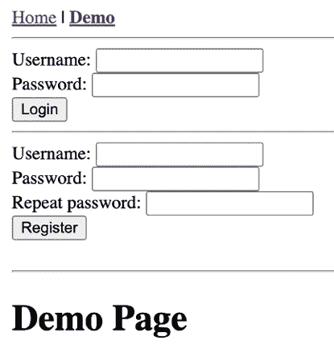
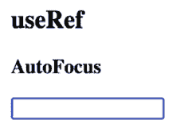
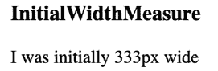
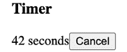
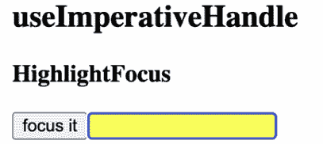
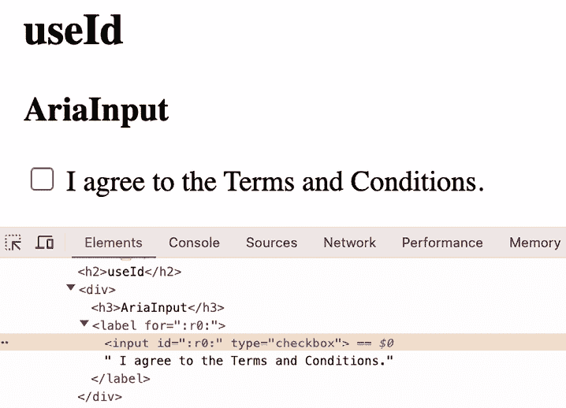
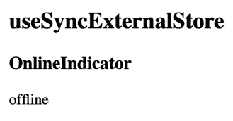
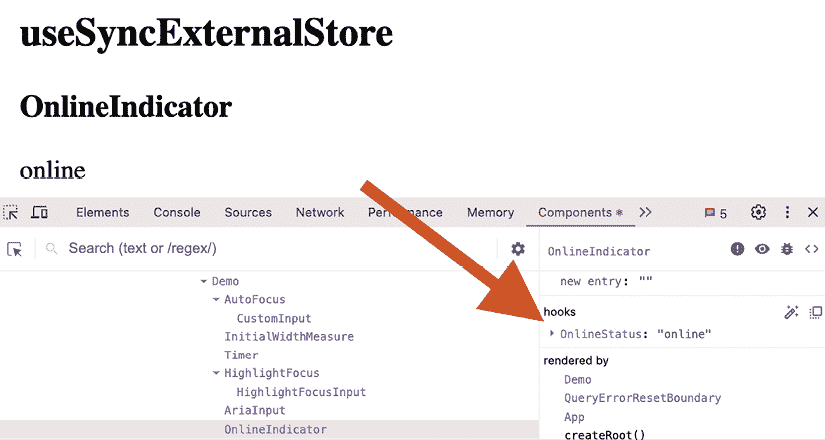
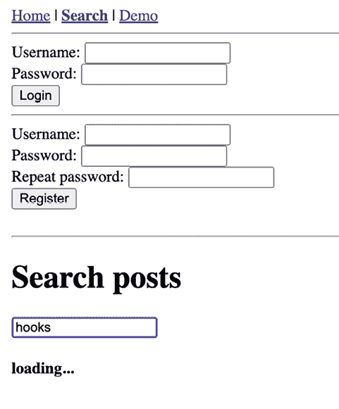
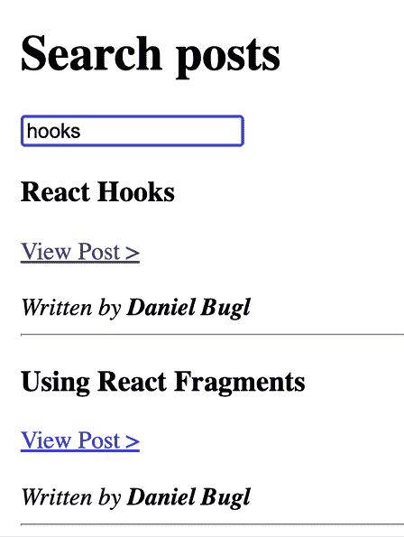

# 第九章：React 提供的高级 Hooks

在上一章中，我们学习了如何使用 React Router 实现路由。然后，我们学习了如何使用 Params Hook 实现动态路由。接下来，我们学习了如何使用 Link 组件提供不同路由的链接。最后，我们学习了如何使用 Navigation Hook 进行编程式重定向。

在本章中，我们将学习 React 提供的各种内置 Hooks。我们将首先概述内置 React Hooks，然后学习各种实用 Hooks。接下来，我们将学习如何使用 Hooks 来优化您应用程序的性能。最后，我们将学习关于高级 Effect Hooks 的内容。

到本章结束时，您将对 React 提供的所有内置 Hooks 有一个全面的了解。

本章将涵盖以下主题：

+   内置 React Hooks 概述

+   使用实用 Hooks

+   使用 Hooks 进行性能优化

+   使用 Hooks 实现高级效果

# 技术要求

应该已经安装了一个相当新的 Node.js 版本。Node 包管理器（`npm`）也需要安装（它应该与 Node.js 一起安装）。有关如何安装 Node.js 的更多信息，请查看官方网站：[`nodejs.org/`](https://nodejs.org/)。

在这本书的指南中，我们将使用**Visual Studio Code**（**VS Code**），但在任何其他编辑器中都应该以类似的方式工作。有关如何安装 VS Code 的更多信息，请参阅官方网站：[`code.visualstudio.com`](https://code.visualstudio.com)。

在这本书中，我们使用以下版本：

+   Node.js v22.14.0

+   `npm` v10.9.2

+   VS Code v1.97.2

虽然安装新版本不应该有问题，但请注意，某些步骤在新版本上可能会有所不同。如果您在这本书提供的代码和步骤中遇到问题，请尝试使用提到的版本。

您可以在 GitHub 上找到本章的代码：[`github.com/PacktPublishing/Learn-React-Hooks-Second-Edition/tree/main/Chapter09`](https://github.com/PacktPublishing/Learn-React-Hooks-Second-Edition/tree/main/Chapter09)。

强烈建议您亲自编写代码。不要简单地运行书中提供的代码示例。自己编写代码对于正确学习和理解代码非常重要。然而，如果您遇到任何问题，您始终可以参考代码示例。

# 内置 React Hooks 概述

React 提供了一些内置 Hooks。我们已经学习了 React 提供的基本 Hooks：

+   在*第二章**，使用 State Hook*中，使用`useState`

+   在*第四章**，使用 Reducer 和 Effect Hooks*中，使用`useEffect`

+   在*第五章**，实现 React Contexts*中，使用`useContext`

此外，React 还提供了更多高级 Hooks，在某些用例中非常有用。我们已经介绍了以下高级 Hooks：

+   `useReducer` 在 *第四章**，使用 Reducer 和 Effect Hooks* 中。

+   `useActionState` 在 *第七章**，使用 Hooks 处理表单* 中。

+   `useFormStatus`（尚未介绍，但类似于 `useActionState`）

+   `useOptimistic` 在 *第七章**，使用 Hooks 处理表单* 中。

+   `useTransition` 在 *第七章**，使用 Hooks 处理表单* 中。

然而，React 还提供了更多的高级 Hooks：

+   `useRef`

+   `useImperativeHandle`

+   `useId`

+   `useSyncExternalStore`

+   `useDebugValue`

+   `useDeferredValue`

+   `useMemo`

+   `useCallback`

+   `useLayoutEffect`

+   `useInsertionEffect`

首先，让我们回顾和总结一下我们已经学过的 Hooks。然后，我们将简要介绍 React 提供的所有这些高级 Hooks，并学习为什么以及如何使用它们。

## `useState`

**状态 Hook** 返回一个值，该值将在重新渲染之间持续存在，以及一个用于更新它的函数。可以将 `initialState` 的值作为参数传递给它：

```js
const [state, setState] = useState(initialState) 
```

调用 `setState` 更新值并使用更新后的值重新渲染组件。如果值没有变化，React 不会重新渲染组件。

可以将一个函数传递给 `setState` 函数，第一个参数是当前值。例如，考虑以下代码：

```js
setState(val => val + 1) 
```

此外，如果初始状态是复杂计算的结果，可以将一个函数传递给 Hook 的第一个参数。在这种情况下，该函数将在 Hook 初始化期间只调用一次：

```js
const [state, setState] = useState(() => {
  return computeInitialState()
}) 
```

状态 Hook 是 React 提供的最普遍的 Hook。

我们在 *第二章**，使用状态 Hook* 中使用了这个 Hook。

## `useEffect`

**Effect Hook** 接受一个包含具有副作用（如计时器和订阅）的代码的函数。传递给 Hook 的函数将在渲染完成后、组件在屏幕上时运行：

```js
useEffect(() => {
  // do something
}) 
```

Hook 可以返回一个清理函数，当组件卸载时将被调用，例如，用于清理计时器或订阅：

```js
useEffect(() => {
  const interval = setInterval(() => {}, 100)
  return () => {
    clearInterval(interval)
  }
}) 
```

如果组件在 effect 再次激活之前多次渲染，清理函数也将被调用。

为了避免在每次重新渲染时触发 effect，我们可以将值数组作为 Hook 的第二个参数。当这些值中的任何一个发生变化时，effect 将再次被触发：

```js
useEffect(() => {
  // do something when state changes
}, [state]) 
```

作为第二个参数传递的数组称为 effect 的依赖数组。如果你想使 effect 只在挂载时触发，并在卸载时清理，你可以将一个空数组作为第二个参数传递。

我们在 *第四章**，使用 Reducer 和 Effect Hooks* 中使用了这个 Hook。

## `useContext`

**上下文钩子**接受一个上下文对象，并返回上下文的当前值。当上下文提供者更新其值时，钩子将触发重新渲染，并带有最新的值：

```js
const value = useContext(NameOfTheContext) 
```

我们在 *第五章**，实现 React 上下文* 中使用了这个钩子。

## useReducer

**Reducer 钩子**是 `useState` 钩子的高级版本。它接受一个 `reducer` 作为第一个参数，它是一个具有两个参数的函数：`state` 和 `action`。然后，`reducer` 函数返回从当前状态和动作计算出的更新后的状态。如果 `reducer` 返回与上一个状态相同的值，React 不会重新渲染组件或触发效果：

```js
const [state, dispatch] = useReducer(reducer, initialState, initFn) 
```

在处理复杂状态变化时，我们应该使用 `useReducer` 钩子而不是 `useState` 钩子。处理全局状态也更容易，因为我们只需简单地传递 `dispatch` 函数而不是多个设置函数。

`dispatch` 函数是稳定的，在重新渲染时不会改变，因此可以从 `useEffect` 或 `useCallback` 依赖数组中省略它。

我们可以通过设置 `initialState` 值或指定一个 `initFn` 函数作为第三个参数来指定初始状态。当计算初始状态需要很长时间或我们想要通过动作重置状态时，指定此类函数是有意义的。

我们在 *第四章**，使用 Reducer 和 Effect 钩子* 中使用了这个钩子。

## useActionState

**动作状态钩子**的定义如下：

```js
const [state, action, isPending] = useActionState(actionFn, initialState) 
```

要定义一个动作状态钩子，我们需要提供一个 `action` 函数作为第一个参数，它具有以下签名：

```js
function actionFn(currentState, formData) { 
```

然后我们需要将 `action` 属性传递给一个 `<form>` 元素。当这个表单被提交时，动作函数会使用钩子的当前状态和表单内提交的 `FormData` 被调用。

此外，还可以为钩子提供一个 `initialState`，并使用 `isPending` 值在动作处理期间显示加载状态。

我们在 *第七章**，使用钩子处理表单* 中使用了这个钩子。

## useFormStatus

**表单状态钩子**的定义如下：

```js
const { pending, data, method, action } = useFormStatus() 
```

它用于我们未处理表单提交的情况。例如，如果我们有一个后端为我们处理表单提交，或者如果我们正在使用服务器操作来处理表单状态（在执行全栈 React 开发时相关）。

它返回一个具有以下属性的 `status` 对象：

+   `pending`：如果父 `<form>` 正在提交，则设置为 `true`

+   `data`：包含父表单提交的 `FormData`

+   `method`：设置为 `'get'` 或 `'post'`，取决于父 `<form>` 中定义了哪种方法。

+   `action`：如果向父 `<form>` 传递了动作函数，这将包含对该函数的引用。否则，它将是 `null`。

例如，它可以用来实现一个在表单提交到服务器端时禁用的提交按钮：

```js
import { useFormStatus } from 'react-dom'
function SubmitButton() {
  const { pending } = useFormStatus()
  return <button disabled={pending}>Submit</button>
}
function ExampleForm() {
  return (
    <form>
<SubmitButton />
</form>
  )
} 
```

表单状态钩子只能用于在 `<form>` 内部渲染的组件中。与其他钩子不同，在撰写本文时，这是唯一从 `react-dom` 而不是 `react` 导出的钩子。

## useOptimistic

**乐观钩子**具有以下签名：

```js
const [optimisticState, addOptimistic] = useOptimistic(state, updateFn) 
```

它可以在我们等待从服务器获取远程状态更新完成时乐观地更新状态。它接受一个状态（通常来自 API 请求，例如一个**查询钩子**）和一个 `update` 函数。然后钩子返回一个乐观状态和一个添加乐观状态的功能。

例如，乐观钩子可以在我们等待服务器完成添加操作时将新对象插入数组中。在这种情况下，更新函数看起来如下：

```js
function updateFn(state, newObject) {
  return state.concat(
    { ...newObject, pending: true }
  )
} 
```

这个更新函数乐观地插入一个新对象，但给它添加一个 `pending: true` 标志，这样我们就可以稍后以不同的方式渲染挂起对象（例如，稍微变灰）。

我们在*第七章**，使用钩子处理表单*中使用了这个钩子。

## useTransition

**过渡钩子**允许你通过更新状态而不阻塞用户界面来处理异步操作。这对于渲染计算密集型的组件树特别有用，例如渲染标签及其（可能复杂的）内容，或者当制作客户端路由器时。过渡钩子具有以下签名：

```js
const [isPending, startTransition] = useTransition() 
```

可以使用 `isPending` 状态来处理加载状态。`startTransition` 函数允许我们传递一个函数来启动过渡。这个函数需要是同步的。当函数内部触发更新（例如，设置状态）并评估其对组件的影响时，`isPending` 将被设置为 `true`。

这不会阻塞用户界面，因此在过渡执行期间，其他组件仍然可以正常工作。

我们在*第七章**，使用钩子处理表单*中使用了这个钩子。

在回顾我们已经学过的内置钩子之后，现在让我们继续学习其他高级内置钩子，这些钩子我们尚未使用，从 React 提供的内置实用钩子开始。

# 使用实用钩子

我们首先学习关于**实用钩子**的内容。这些钩子允许我们模拟某些用例或在我们开发自己的钩子时帮助我们，如在*第十二章**，构建自己的钩子*中所述。

我们现在将在我们的博客应用中设置一个演示页面，以便能够测试各种实用钩子。

让我们开始设置演示页面来测试这些钩子：

1.  通过执行以下命令将 `Chapter08_2` 文件夹复制到新的 `Chapter09_1` 文件夹：

    ```js
    $ cp -R Chapter08_2 Chapter09_1 
    ```

1.  在 VS Code 中打开新的 `Chapter09_1` 文件夹。

1.  创建一个新的`src/components/demo/`文件夹。这是我们稍后放置演示组件以尝试我们将要学习的各种 Hooks 的地方。

1.  创建一个新的`src/pages/Demo.jsx`文件，内容如下：

    ```js
    export function Demo() {
      return <h1>Demo Page</h1>
    } 
    ```

1.  编辑`src/App.jsx`并导入`Demo`页面：

    ```js
    import { Demo } from './pages/Demo.jsx' 
    ```

1.  然后，为它定义一个新的`NavBarLink`：

    ```js
     <BrowserRouter>
                <div style={{ padding: 8 }}>
    <NavBarLink to='/'>Home</NavBarLink>
     **{' | '}**
    **<****NavBarLink****to****=****'/demo'****>****Demo****</****NavBarLink****>** 
    ```

1.  最后，为它定义一个路由：

    ```js
     <Routes>
                          <Route index element={<Home />} />
                          <Route path='post/:id' element={<ViewPost />} />
    **<****Route****path****=****'demo'****element****=****{****<****Demo** **/>****} />** 
    ```

1.  启动`dev`服务器并在整章中保持其运行，如下所示：

    ```js
    $ npm run dev 
    ```

1.  点击导航栏中的**Demo**链接以打开演示页面。

现在我们有一个演示页面，我们可以开始学习 React 提供的其他内置高级 Hooks 了！



图 9.1 – 我们博客应用中的 Demo 页面

## useRef

**Ref Hook**返回一个`ref`对象，可以通过`ref`属性将其分配给组件或元素：

```js
const refContainer = useRef(initialValue) 
```

在将 ref 对象分配给元素或组件后，可以通过`refContainer.current`访问 ref 对象。如果设置了`initialValue`，则在分配之前`refContainer.current`将被设置为这个值。

ref 对象可用于各种用例，但主要有两个：

+   获取一个元素的引用以在**文档对象模型**（**DOM**）中访问它

+   保持可变值，这些值不应受 React 生命周期的影响（例如，当值被突变时不会触发重新渲染）

### 使用 Ref Hook 自动聚焦输入字段

我们可以使用 Ref Hook 获取输入字段元素的引用，然后通过 DOM 访问其`focus()`函数来实现渲染时自动聚焦的输入字段。虽然也可以通过 HTML 为元素提供`autofocus`属性，但有时需要程序化地完成它——例如，如果我们想在用户完成其他操作后聚焦一个字段。

让我们现在开始使用 Ref Hook 实现自动聚焦输入字段的实现：

1.  创建一个新的`src/components/demo/useRef/`文件夹。

1.  创建一个新的`src/components/demo/useRef/AutoFocus.jsx`文件。在其内部，导入`useRef`和`useEffect`：

    ```js
    import { useRef, useEffect } from 'react' 
    ```

1.  然后，定义组件和一个 Ref Hook：

    ```js
    export function AutoFocus() {
      const inputRef = useRef(null) 
    ```

1.  接下来，定义一个在渲染时被调用并导致输入字段聚焦的 Effect Hook：

    ```js
     useEffect(() => inputRef.current.focus(), []) 
    ```

1.  渲染输入字段并将 Ref 传递给它：

    ```js
     return (
        <div>
    <h3>AutoFocus</h3>
    <input ref={inputRef} type='text' />
    </div>
      )
    } 
    ```

1.  现在，编辑`src/pages/Demo.jsx`并导入`AutoFocus`组件：

    ```js
    import { AutoFocus } from '@/components/demo/useRef/AutoFocus.jsx' 
    ```

1.  通过调整组件如下，在`Demo`页面上渲染它：

    ```js
    export function Demo() {
    **return** **(**
    **<****div****>**
    **<****h1****>****Demo Page****</****h1****>**
    **<****h2****>****useRef****</****h2****>**
    **<****AutoFocus** **/>**
    **</****div****>**
     **)**
    } 
    ```

刷新页面；你应该看到输入字段正在自动聚焦。



图 9.2 – 输入字段正在自动聚焦

### 在一个 ref 中更改状态

重要的是要注意，修改 ref 的当前值不会导致重新渲染。如果需要这样做，我们可以使用一个 `ref` 回调函数。这个函数将在元素加载时被调用。例如，我们可以使用这个函数来获取 DOM 中元素的初始大小。然后，我们可以在回调函数内部设置 State Hook 的状态来触发重新渲染。

如果我们不仅想要获取组件的初始宽度，还想要获取当前宽度（即使组件后来被调整大小），我们需要使用 **布局 Effect Hook**。我们将在本章的 *使用 Hooks 进行高级效果* 部分稍后介绍这个用例。

现在我们尝试在 refs 中使用回调函数来获取组件的初始宽度：

1.  创建一个新的 `src/components/demo/useRef/InitialWidthMeasure.jsx` 文件。在其中，导入 `useState` 函数：

    ```js
    import { useState } from 'react' 
    ```

1.  然后，定义组件和一个 State Hook 来存储组件的宽度：

    ```js
    export function InitialWidthMeasure() {
      const [width, setWidth] = useState(0) 
    ```

1.  现在，定义一个用于 `ref` 的回调函数，该函数接受 DOM `node` 作为参数：

    ```js
     function measureRef(node) { 
    ```

1.  检查我们是否成功获取了 DOM 节点的引用，然后使用 DOM API 获取元素的当前宽度：

    ```js
     if (node !== null) {
          setWidth(node.getBoundingClientRect().width)
        }
      } 
    ```

1.  渲染组件并通过 `ref` 属性添加回调函数：

    ```js
     return (
        <div>
    <h3>InitialWidthMeasure</h3>
    <div ref={measureRef}>I was initially {Math.round(width)}px wide</div>
    </div>
      )
    } 
    ```

1.  编辑 `src/pages/Demo.jsx` 并在那里导入 `InitialWidthMeasure` 组件：

    ```js
    import { InitialWidthMeasure } from '@/components/demo/useRef/InitialWidthMeasure.jsx' 
    ```

1.  最后，在 **Demo** 页面上渲染组件：

    ```js
    export function Demo() {
      return (
        <div>
          <h1>Demo Page</h1>
    <h2>useRef</h2>
    <AutoFocus />
    **<****InitialWidthMeasure** **/>** 
    ```

现在，Demo 页面应该会在您的浏览器中自动刷新并显示组件及其初始宽度！



图 9.3 – 显示组件初始宽度的组件

### 使用 refs 在重新渲染之间持久化可变值

Refs 可以用来访问 DOM，但也可以在组件重新渲染时保持可变值，例如存储间隔的引用。

让我们通过实现一个计算经过秒数的计时器来尝试一下：

1.  创建一个新的 `src/components/demo/useRef/Timer.jsx` 文件。在其中，导入 `useRef`、`useState` 和 `useEffect` 函数：

    ```js
    import { useRef, useState, useEffect } from 'react' 
    ```

1.  然后，定义并导出 `Timer` 组件：

    ```js
    export function Timer() { 
    ```

1.  在其中，定义一个用于存储间隔的 Ref Hook 和一个用于存储当前计数的 State Hook：

    ```js
     const intervalRef = useRef(null)
      const [seconds, setSeconds] = useState(0) 
    ```

1.  定义一个将增加计数的函数：

    ```js
     function increaseSeconds() {
        setSeconds((prevSeconds) => prevSeconds + 1)
      } 
    ```

1.  现在，定义一个 Effect Hook 来定义一个新的间隔并将其存储在 ref 中：

    ```js
     useEffect(() => {
        intervalRef.current = setInterval(increaseSeconds, 1000) 
    ```

1.  我们现在可以使用这个 ref 在组件卸载时清除间隔：

    ```js
     return () => clearInterval(intervalRef.current)
      }, []) 
    ```

1.  渲染计时器的当前计数：

    ```js
     return (
        <div>
          <h3>Timer</h3>
          {seconds} seconds 
    ```

1.  最后，渲染一个按钮来取消计时器：

    ```js
     <button type='button' onClick={() => clearInterval(intervalRef.current)}>
            Cancel
    </button>
    </div>
      )
    } 
    ```

如果我们不需要在 Effect Hook 之外访问间隔 ID，我们可以在 effect 中简单地使用一个 `const` 而不是定义一个 Ref。虽然我们可以使用 State Hook 来存储间隔 ID，但这会导致组件重新渲染。正如我们所见，Refs 对于存储需要改变但又不用于渲染的值是理想的。

1.  编辑 `src/pages/Demo.jsx` 并在那里导入 `Timer` 组件：

    ```js
    import { Timer } from '@/components/demo/useRef/Timer.jsx' 
    ```

1.  最后，在 Demo 页面上渲染组件：

    ```js
    export function Demo() {
      return (
        <div>
          <h1>Demo Page</h1>
    <h2>useRef</h2>
    <AutoFocus />
    <InitialWidthMeasure />
    **<****Timer** **/>** 
    ```

现在 Demo 页面应该会在你的浏览器中自动刷新并显示计数秒数的组件！按下**取消**按钮停止计时器。

使用 refs 的方式与前面的例子相似，这使得它们类似于类中的实例变量，例如`this.intervalRef`。

以下截图显示了在页面打开后 42 秒，Demo 页面上的`Timer`组件的外观：



图 9.4 – 显示自打开页面以来经过的秒数的计时器组件

### 将引用作为属性传递

有时候，你可能想要获取另一个组件内部输入字段的引用（例如，当处理自定义输入字段时）。在过去，这需要`forwardRef`辅助函数。然而，自从 React 19 以来，我们可以简单地通过属性传递 refs。

让我们试试看：

1.  创建一个新的`src/components/demo/useRef/CustomInput.jsx`文件。

1.  在其中定义以下自定义输入组件，接受一个引用作为属性：

    ```js
    export function CustomInput({ ref }) { 
    ```

1.  我们现在可以像往常一样使用 refs：

    ```js
     return <input ref={ref} type='text' />
    } 
    ```

1.  现在，编辑`src/components/demo/useRef/AutoFocus.jsx`文件并导入`CustomInput`组件：

    ```js
    import { CustomInput } from './CustomInput.jsx' 
    ```

1.  将输入字段替换为我们的`CustomInput`组件，并将引用传递给它：

    ```js
     return (
        <div>
          <h3>AutoFocus</h3>
    **<****CustomInput****ref****=****{inputRef}** **/>** 
    ```

刷新 Demo 页面，你会看到输入字段仍然在自动聚焦！

### 只创建一次 refs 内容

如果你有一个需要初始化的复杂算法，例如路径查找算法，你可以将其存储在 refs 中，以避免在每次渲染时创建它。这应该这样做：

```js
function Map() {
  const pathfinderRef = useRef(null)
  if (pathfinderRef.current === null) {
    pathfinderRef.current = createPathfinder()
  }
} 
```

通常，在渲染中像那样写入或读取`ref.current`在 React 中是不允许的。然而，在这种情况下，这是可以的，因为条件使得它只在一开始初始化组件时执行一次。

虽然 React 总是只保存 refs 的初始值一次，但直接在 Ref Hook 内部调用函数，如`useRef(createPathfinder())`，会在每次渲染时无谓地执行昂贵的函数。

正如我们所见，refs 有很多用例。通常，refs 对于以下操作很有用：

+   **在重新渲染之间存储信息**，因为——与常规变量不同——refs 在重新渲染时不会重置

+   **在不触发重新渲染的情况下更改信息**，因为——与 State Hooks 不同——refs 不会触发重新渲染

+   **存储每个组件副本本地的信息**，因为——与组件外部的常规变量不同——refs 在组件的不同实例之间没有共享值

## useImperativeHandle

**强制处理 Hook**可以用来自定义当将`ref`指向它时暴露给其他组件的实例值。然而，应该尽可能避免这样做，因为它紧密耦合了组件，这会损害可重用性。

`useImperativeHandle`函数具有以下签名：

```js
useImperativeHandle(ref, createHandle, [dependencies]) 
```

我们可以使用这个 Hook，例如，来公开一个特殊的 `focus` 函数，该函数不仅聚焦输入字段，还突出显示它。然后，其他组件可以通过对组件的 `ref` 调用此函数。现在让我们试试看：

1.  创建一个新的 `src/components/demo/useImperativeHandle/` 文件夹。

1.  在其中，创建一个新的 `src/components/demo/useImperativeHandle/HighlightFocusInput.jsx` 文件。

1.  导入 `useImperativeHandle`、`useRef` 和 `useState` 函数：

    ```js
    import { useImperativeHandle, useRef, useState } from 'react' 
    ```

1.  然后，定义一个接受 `ref` 的组件：

    ```js
    export function HighlightFocusInput({ ref }) { 
    ```

1.  在组件内部，我们为输入字段定义一个 Ref Hook 和一个用于存储 `highlight` 状态的状态 Hook：

    ```js
     const inputRef = useRef(null)
      const [highlight, setHighlight] = useState(false) 
    ```

1.  现在，定义一个 Imperative Handle Hook，将其 `ref` 传递给它，并传递一个返回对象的函数：

    ```js
     useImperativeHandle(ref, () => ({ 
    ```

1.  此对象包含一个 `focus` 函数，它将在 `input` 元素上触发 `focus` 函数，并将 `highlight` 状态设置为 `true` 一秒钟：

    ```js
     focus: () => {
          inputRef.current.focus()
          setHighlight(true)
          setTimeout(() => setHighlight(false), 1000)
        },
      })) 
    ```

1.  最后，渲染一个输入字段并将 `inputRef` 传递给它：

    ```js
     return (
        <input
     ref={inputRef}
     type='text' 
    ```

1.  如果 `highlight` 设置为 `true`，则以 `yellow` 颜色渲染背景：

    ```js
     style={{ backgroundColor: highlight ? 'yellow' : undefined }}
        />
      )
    } 
    ```

1.  创建一个新的 `src/components/demo/useImperativeHandle/HighlightFocus.jsx` 文件。

1.  在其中，导入 `useRef` 函数和 `HighlightFocusInput` 组件：

    ```js
    import { useRef } from 'react'
    import { HighlightFocusInput } from './HighlightFocusInput.jsx' 
    ```

1.  现在，定义一个组件和一个 Ref Hook：

    ```js
    export function HighlightFocus() {
      const inputRef = useRef(null) 
    ```

1.  渲染一个按钮以触发组件中的 `focus` 函数，然后渲染组件并将 `ref` 传递给它：

    ```js
     return (
        <div>
    <h3>HighlightFocus</h3>
    <button onClick={() => inputRef.current.focus()}>focus it</button>
    <HighlightFocusInput ref={inputRef} />
    </div>
      )
    } 
    ```

1.  编辑 `src/pages/Demo.jsx` 并导入 `HighlightFocus` 组件：

    ```js
    import { HighlightFocus } from '@/components/demo/useImperativeHandle/HighlightFocus.jsx' 
    ```

1.  渲染 `HighlightFocus` 组件，如下所示：

    ```js
     <InitialWidthMeasure />
          <Timer />
    **<****h2****>****useImperativeHandle****</****h2****>**
    **<****HighlightFocus** **/>**
        </div>
      )
    } 
    ```

现在，转到 **Demo** 页面并点击 **focus it** 按钮。你会看到输入字段被聚焦并高亮显示！



图 9.5 – 组件聚焦并突出显示输入字段

如我们所见，通过使用 refs 和 Imperative Handle Hook，我们可以访问其他组件中的函数。然而，这应该谨慎使用，因为它紧密耦合了组件，当我们的应用增长并且我们想在其他地方重用组件时，可能会成为一个问题。

## useId

**Id Hook** 用于生成唯一的 ID。这可以很有用，例如，为元素提供 IDs 以提供无障碍属性（如 `aria-labelledby` 或 `aria-describedby`）。Id Hook 具有以下签名：

```js
const uniqueId = useId() 
```

让我们通过为复选框字段提供一个标签来尝试它：

1.  创建一个新的 `src/components/demo/useId/` 文件夹。

1.  在其中，创建一个新的 `src/components/demo/useId/AriaInput.jsx` 文件。

1.  导入 `useId` 函数：

    ```js
    import { useId } from 'react' 
    ```

1.  然后，定义一个使用 Id Hook 为标签生成 ID 的组件：

    ```js
    export function AriaInput() {
      const inputId = useId() 
    ```

1.  渲染一个带有 `htmlFor` 标签指向 `inputId` 的标签：

    ```js
     return (
        <div>
          <h3>AriaInput</h3>
    <label htmlFor={inputId}> 
    ```

1.  使用生成的 ID 渲染一个 `checkbox` 字段：

    ```js
     <input id={inputId} type='checkbox' /> I agree to the Terms
            and Conditions.
          </label>
    </div>
      )
    } 
    ```

1.  编辑 `src/pages/Demo.jsx` 并导入 `AriaInput` 组件：

    ```js
    import { AriaInput } from '@/components/demo/useId/AriaInput.jsx' 
    ```

1.  然后，在 Demo 页面上渲染该组件：

    ```js
     <Timer />
          <h2>useImperativeHandle</h2>
    <HighlightFocus />
    **<****h2****>****useId****</****h2****>**
    **<****AriaInput** **/>**
        </div>
      )
    } 
    ```

现在，转到 **Demo** 页面并打开输入字段的检查器；你会看到 React 为我们生成了一个 `:r0:` ID：



图 9.6 – React 自动生成的唯一 ID

在 React 19.1 中，ID 的格式从 `:r123:` 更改为 `<<r123>>`，以确保它们是有效的 CSS 选择器。

除了将标签连接到屏幕阅读器的输入字段（提高可访问性）外，使用 `<label>` 元素还有一个额外的优势，即允许我们点击标签来检查/取消选中复选框。

尽管在这种情况下我们可以手动设置一个 ID，例如，`tos-check`，但 ID 需要在整个页面上是唯一的。因此，如果我们想再次渲染相同的输入字段，ID 已经无效，因为它被重用了。为了防止这个问题，在这些情况下始终优先使用 Id Hook，以便组件可以在同一页面上多次重用。如果你在单个组件中有多个输入字段，最佳实践是在组件中只使用一个 Id Hook，然后通过添加标签到生成的 ID 来扩展 ID – 例如：`` `${id}-tos-check` `` 和 `` `${id}-username` ``。

## useSyncExternalStore

**Sync External Store Hook** 用于订阅外部存储，例如状态管理库或浏览器 API。它的签名如下：

```js
const snapshot = useSyncExternalStore(subscribe, getSnapshot, getServerSnapshot) 
```

如我们所见，Sync External Store Hook 接受三个参数，并返回存储的当前快照，可以用来渲染其中的信息。参数如下：

+   第一个参数，`subscribe`，是一个函数，它接受一个 `callback` 函数作为参数并将其订阅到存储中。当存储发生变化时，提供的函数应该被调用。`subscribe` 函数还应该返回一个函数来清理订阅。

+   第二个参数，`getSnapshot`，是一个函数，它返回存储中当前数据状态的快照。如果存储发生变化（`subscribe` 函数中的 `callback` 函数被调用），React 会调用 `getSnapshot` 函数并检查返回的值是否不同。如果是，组件将重新渲染。

+   第三个参数，`getServerSnapshot`，是一个可选的函数，它返回存储中当前数据状态的初始快照。这个函数仅在服务器渲染期间被调用，并用于在客户端恢复服务器渲染的内容。

在大多数情况下，使用 State 和 Reducer Hooks 而不是这个 Hook 会更好。大多数状态管理库也提供了它们自己的 Hooks。这个 Hook 主要在集成现有的非 React 代码时有用，但在与某些浏览器 API 交互时也有用，这正是我们现在要尝试的。

让我们通过使用 Sync External Store Hook 订阅浏览器 API 来实现一个检查网络连接是否可用的指示器：

1.  创建一个新的 `src/components/demo/useSyncExternalStore/` 文件夹。

1.  在其中，创建一个新的 `src/components/demo/useSyncExternalStore/OnlineIndicator.jsx` 文件。

1.  导入 `useSyncExternalStore` 函数：

    ```js
    import { useSyncExternalStore } from 'react' 
    ```

1.  定义一个接受 `callback` 函数作为参数的 `subscribe` 函数：

    ```js
    function subscribe(callback) { 
    ```

1.  添加来自浏览器的 `online` 和 `offline` 事件的监听器：

    ```js
     window.addEventListener('online', callback)
      window.addEventListener('offline', callback) 
    ```

1.  返回一个将清理那些事件监听器的函数：

    ```js
     return () => {
        window.removeEventListener('online', callback)
        window.removeEventListener('offline', callback)
      }
    } 
    ```

1.  现在，定义一个 `getSnapshot` 函数，该函数返回当前的在线状态：

    ```js
    function getSnapshot() {
      return navigator.onLine
    } 
    ```

1.  然后，定义组件和一个同步外部存储 Hook：

    ```js
    export function OnlineIndicator() {
      const isOnline = useSyncExternalStore(subscribe, getSnapshot) 
    ```

1.  根据浏览器 API 的结果定义状态：

    ```js
     const status = isOnline ? 'online' : 'offline' 
    ```

1.  渲染状态：

    ```js
     return (
        <div>
    <h3>OnlineIndicator</h3>
          {status}
        </div>
      )
    } 
    ```

1.  编辑 `src/pages/Demo.jsx` 并导入 `OnlineIndicator` 组件：

    ```js
    import { OnlineIndicator } from '@/components/demo/useSyncExternalStore/OnlineIndicator.jsx' 
    ```

1.  在 Demo 页面上渲染组件：

    ```js
     <h2>useId</h2>
          <AriaInput />
    **<****h2****>****useSyncExternalStore****</****h2****>**
    **<****OnlineIndicator** **/>**
        </div>
      )
    } 
    ```

现在，转到 **Demo** 页面，如果你在线的话，它应该显示 **在线**。关闭所有网络连接以查看它变为 **离线**。



图 9.7 – 通过外部存储（浏览器 API）检测用户已离线

## useDebugValue

调试值 Hook 对于开发作为共享库一部分的自定义 Hook 非常有用。它可以用于在 React DevTools 中显示某些值以进行调试。其签名如下：

```js
useDebugValue(value, format) 
```

第一个参数 `value` 是应该记录的值或消息。第二个可选的 `format` 参数用于提供一个格式化函数，该函数将在显示之前格式化值。

让我们通过定义一个用于 `OnlineIndicator` 组件的自定义 Hook 简单尝试一下：

1.  编辑 `src/components/demo/useSyncExternalStore/OnlineIndicator.jsx` 并导入 `useDebugValue` 函数：

    ```js
    import { useSyncExternalStore**, useDebugValue** } from 'react' 
    ```

1.  然后，在定义组件之前定义一个新的 Hook 函数：

    ```js
    function useOnlineStatus() {
      const isOnline = useSyncExternalStore(subscribe, getSnapshot)
      const status = isOnline ? 'online' : 'offline' 
    ```

1.  添加调试值 Hook，如下所示：

    ```js
     useDebugValue(status) 
    ```

1.  从 Hook 返回状态：

    ```js
     return status
    } 
    ```

1.  调整组件以使用自定义 Hook：

    ```js
    export function OnlineIndicator() {
    **const** **status =** **useOnlineStatus****()**
    return (
        <div>
    <h3>OnlineIndicator</h3>
          {status}
        </div>
      )
    } 
    ```

现在，转到 **Demo** 页面。如果你还没有安装 **React 开发者工具** 扩展，请为你的浏览器安装它（遵循 [`react.dev/learn/react-developer-tools`](https://react.dev/learn/react-developer-tools) 上的说明）。转到浏览器检查器的 **Components** 选项卡并选择 `OnlineIndicator` 组件。

你将看到自定义 Hook 的调试值在那里显示：



图 9.8 – 在 React 开发者工具中显示我们自定义 Hook 的状态

在了解了 React 提供的各种内置实用 Hook 之后，让我们继续学习如何使用内置 Hooks 进行性能优化。

# 使用 Hooks 进行性能优化

某些钩子可以用来优化你应用程序的性能。一般来说，一个经验法则是不要过早优化。这在 React 19 中引入的 React 编译器中尤其如此。如今，React 编译器自动为我们优化了大多数情况。所以，请记住，只有在你已经确定了应用程序中特定的性能问题时才使用这些钩子。一般来说，一个经验法则是除非你知道它将是一个昂贵的计算，否则不要过早优化。

React 编译器是一个可以手动安装的 Babel 插件，它也包含在某些框架中，如 Next.js。有关 React 编译器的更多信息，请阅读 React 文档中的以下页面：[`react.dev/learn/react-compiler`](https://react.dev/learn/react-compiler)。

## useDeferredValue

**延迟值钩子**可以用来延迟低优先级的更新（例如过滤列表），以便先处理高优先级的更新（例如更新输入字段中输入的文本）。

例如，如果你有一个可以输入文本以过滤项目的搜索，延迟值钩子可以用来延迟过滤的更新。与设置固定时间后更新持久化的防抖不同，延迟是动态的，并且依赖于 UI 渲染的速度。在较快的机器上，它将更频繁地更新，而在较慢的机器上，更新不会减慢 UI 的其他部分。

`useDeferredValue`函数的签名如下所示：

```js
const deferredValue = useDeferredValue(value, initialValue) 
```

第一个参数是要延迟的值。例如，这个值可以来自处理用户输入的状态钩子。

第二个参数是一个可选的初始值，用于组件的初始渲染。如果没有定义初始值，钩子将在初始渲染期间不进行延迟，因为没有值可以渲染，直到`value`被设置（例如，用户在输入字段中键入）。

### 实现无延迟值的搜索

让我们先实现一个搜索页面，其中包含博客文章的搜索，不使用延迟值：

1.  编辑`src/api.js`并定义一个函数来产生人工延迟，以便我们可以模拟搜索操作缓慢：

    ```js
    function sleep(ms) {
      return new Promise((resolve) => setTimeout(resolve, ms))
    } 
    ```

1.  接下来，定义一个`searchPosts` API 函数，该函数获取所有帖子（特色和非特色）：

    ```js
    export async function searchPosts(query) {
      const res = await fetch('/api/posts')
      const posts = await res.json() 
    ```

1.  然后，使用简单的搜索过滤帖子（将标题和查询转换为小写，然后检查查询是否包含在标题中）：

    ```js
     const filteredPosts = posts.filter((post) => {
        const title = post.title.toLowerCase()
        return title.includes(query.toLowerCase())
      }) 
    ```

1.  添加一个一秒的延迟：

    ```js
     await sleep(1000) 
    ```

1.  然后，返回过滤后的帖子：

    ```js
     return filteredPosts
    } 
    ```

1.  创建一个新的`src/components/post/PostSearchResults.jsx`文件。在其内部，导入以下内容：

    ```js
    import { useSuspenseQuery } from '@tanstack/react-query'
    import { searchPosts } from '@/api.js'
    import { PostList } from './PostList.jsx' 
    ```

1.  现在，定义一个组件，该组件将使用 Suspense 查询钩子、我们的 API 函数和`PostList`组件来显示给定查询的搜索结果：

    ```js
    export function PostSearchResults({ query }) {
      const { data } = useSuspenseQuery({
        queryKey: ['posts', query],
        queryFn: () => searchPosts(query),
      })
      return <PostList posts={data} />
    } 
    ```

1.  接下来，创建一个新的`src/components/post/PostSearch.jsx`文件。在其内部，导入以下内容：

    ```js
    import { useState, Suspense } from 'react'
    import { PostSearchResults } from './PostSearchResults.jsx' 
    ```

1.  定义一个`PostSearch`组件，该组件使用状态钩子和输入字段来处理查询：

    ```js
    export function PostSearch() {
      const [query, setQuery] = useState('')
      return (
        <div>
          <input value={query} onChange={(e) =>setQuery(e.target.value)} /> 
    ```

1.  定义一个 `Suspense` 边界，并在其中渲染 `PostSearchResults` 组件：

    ```js
     <Suspense fallback={<h4>loading...</h4>}>
            <PostSearchResults query={query} />
    </Suspense>
    </div>
      )
    } 
    ```

1.  创建一个新的 `src/pages/Search.jsx` 文件。在其内部，导入 `PostSearch` 组件：

    ```js
    import { PostSearch } from '@/components/post/PostSearch.jsx' 
    ```

1.  按如下方式渲染包含 `PostSearch` 组件的页面：

    ```js
    export function Search() {
      return (
        <div>
    <h1>Search posts</h1>
    <PostSearch />
    </div>
      )
    } 
    ```

1.  编辑 `src/App.jsx` 并导入 `Search` 页面：

    ```js
    import { Search } from './pages/Search.jsx' 
    ```

1.  添加如下链接到页面：

    ```js
     <BrowserRouter>
                <div style={{ padding: 8 }}>
    <NavBarLink to='/'>Home</NavBarLink>
     **{' | '}**
    **<****NavBarLink****to****=****'/search'****>****Search****</****NavBarLink****>**
                  {' | '}
                  <NavBarLink to='/demo'>Demo</NavBarLink> 
    ```

1.  最后，定义路由：

    ```js
     <Routes>
                          <Route index element={<Home />} />
                          <Route path='post/:id' element={<ViewPost />} />
                          <Route path='demo' element={<Demo />} />
    **<****Route****path****=****'search'****element****=****{****<****Search** **/>****} />**
                        </Routes> 
    ```

现在前往 **搜索** 页面并输入一个查询；你会看到在显示新结果之前，会显示 **加载中…** 一秒钟。



图 9.9 – 等待新结果加载

虽然这个搜索功能正常工作，但在用户输入查询时用 **加载中…** 消息替换所有结果并不是一个很好的用户体验。

### 引入延迟值

使用延迟值钩子，我们可以在新结果正在获取时显示旧查询结果，一旦它们准备好，就无缝地替换它们。

现在让我们开始使用延迟值钩子：

1.  编辑 `src/components/post/PostSearch.jsx` 并导入 `useDeferredValue` 函数：

    ```js
    import { useState, Suspense**, useDeferredValue** } from 'react' 
    ```

1.  在 `PostSearch` 组件内部定义延迟值钩子：

    ```js
    export function PostSearch() {
      const [query, setQuery] = useState('')
    **const** **deferredQuery =** **useDeferredValue****(query)** 
    ```

1.  现在，将 `SearchResults` 组件的 `query` 替换为 `deferredQuery`：

    ```js
     <Suspense fallback={<h4>loading...</h4>}>
            <SearchResults query={**deferredQuery**} />
    </Suspense>
    </div>
      )
    } 
    ```

前往 **搜索** 页面并在搜索输入字段中输入查询；你会看到在新的结果到来之前，会显示之前的结果。现在 **加载中…** 消息仅在首次输入查询之前显示！



图 9.10 – 显示新结果正在加载时的过时结果

## useMemo

**Memo 钩子**会捕获一个函数的结果并将其缓存。这意味着它不会每次都重新计算。这个钩子可以用于性能优化：

```js
const memoizedVal = useMemo(
  () => computeVal(a, b, c),
  [a, b, c]
) 
```

在上一个示例中，`computeVal` 是一个性能密集型函数，它从 `a`、`b` 和 `c` 计算出一个结果。

`useMemo` 在渲染期间运行，所以请确保计算函数不会引起任何副作用，例如资源请求。副作用应该放入 `useEffect` 钩子中。

作为第二个参数传递的数组指定了函数的依赖项。如果这些值中的任何一个发生变化，函数将被重新计算；否则，将使用存储的结果。如果没有提供数组，则每次渲染都会计算一个新的值。如果传递了一个空数组，则值只计算一次。

不要仅依赖 `useMemo` 来只计算一次。如果这些之前缓存的值长时间未被使用，例如为了释放内存，React 可能会忘记它们。仅将其用于性能优化。

自 React 19 以来，React 编译器尝试尽可能自动地记忆化值。在大多数情况下，不再需要手动使用`useMemo`包装值。只有当你发现 React 编译器没有以令人满意的方式记忆化性能问题时，才使用这个钩子。作为一个经验法则，尽量不要过早地优化你的组件，除非你有非常充分的理由这样做。

## useCallback

`useCallback`钩子与`useMemo`钩子的工作方式类似。然而，它返回一个记忆化的回调函数而不是一个值：

```js
const memoizedCallback = useCallback(
  () => doSomething(a, b, c),
  [a, b, c]
) 
```

之前的代码类似于以下`useMemo`钩子：

```js
const memoizedCallback = useMemo(
  () => () => doSomething(a, b, c),
  [a, b, c]
) 
```

返回的函数只有在依赖数组中传递的值之一发生变化时才会重新定义。

与记忆钩子类似，回调钩子只有在确定了 React 编译器没有以令人满意的方式处理的特定性能问题时才应使用，例如无限重渲染循环或渲染次数过多。

现在我们已经了解了如何使用内置钩子进行性能优化，让我们简要介绍一下 React 提供的最后几个内置钩子：效果钩子的高级版本。

# 使用钩子进行高级效果

效果钩子有两个特殊版本：**布局效果钩子**和**插入效果钩子**。这些钩子仅适用于非常特定的用例，所以我们在这里只简要介绍它们。

## useLayoutEffect

**布局效果钩子**与效果钩子相同，但它会在所有 DOM 突变完成后、组件在浏览器中渲染之前同步触发。它可以用来在渲染前从 DOM 中读取信息并调整组件的外观。在这个钩子内部进行的更新将在浏览器渲染组件之前同步处理。

除非真的需要，否则不要使用这个钩子，这通常只出现在某些边缘情况下。`useLayoutEffect`会阻塞浏览器中的视觉更新，因此比`useEffect`慢。

这里的规则是首先使用`useEffect`。如果你的突变改变了 DOM 节点的外观，这可能导致它闪烁，你应该使用`useLayoutEffect`。

## useInsertionEffect

**插入效果钩子**与效果钩子类似，但它会在任何布局效果触发之前触发。这个钩子仅适用于 CSS-in-JS 库的作者，所以你很可能不需要它。

**示例代码**

本章的示例代码可以在`Chapter09/Chapter09_1`文件夹中找到。请检查文件夹内的`README.md`文件，以获取设置和运行示例的说明。

# **总结**

在这一章中，我们学习了 React 19.1 版本提供的所有钩子。我们首先概述了内置钩子，然后学习了各种实用钩子。接下来，我们转向学习用于性能优化的钩子。最后，我们学习了高级效果钩子。

我们现在对所有不同的内置 Hooks 有了概述。

在下一章，我们将学习关于使用 React 社区开发的各类 Hooks，以及如何找到更多这样的 Hooks。

# 问题

为了回顾本章所学内容，尝试回答以下问题：

1.  Ref Hook 的不同用例有哪些？

1.  Imperative Handle Hook 增加了哪些功能？

1.  我们应该在什么时候使用 Id Hook？

1.  Sync External Store Hook 覆盖了哪些用例？

1.  我们如何使用 Debug Value Hook？

1.  使用 Deferred Value Hook 给我们带来了哪些优势？

1.  我们应该在什么时候使用 Memo 和 Callback Hooks？

1.  在大多数情况下，是否仍然有必要使用 Memo 和 Callback Hooks？

# 进一步阅读

如果你对本章所学概念有更多信息的兴趣，请查看以下链接：

+   React 文档中的内置 React Hooks 部分：[`react.dev/reference/react/hooks`](https://react.dev/reference/react/hooks)

+   关于 React 编译器的更多信息：[`react.dev/learn/react-compiler`](https://react.dev/learn/react-compiler)

# 在 Discord 上了解更多

要加入这本书的 Discord 社区——在那里你可以分享反馈，向作者提问，并了解新版本——请扫描下面的二维码：

`packt.link/wnXT0`


