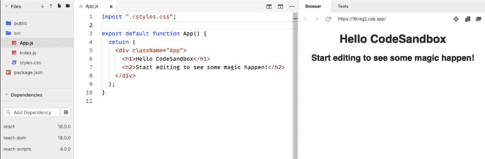
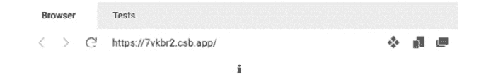
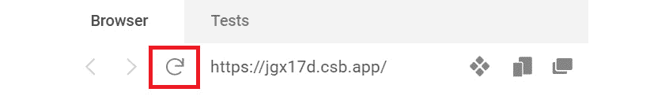

# 第一章：介绍 React

Facebook 已经成为一款非常流行的应用。随着其知名度的增长，对新增功能的需求也在增加。**React** 是 Facebook 为帮助更多人参与代码库并更快地交付功能而提供的解决方案。React 在 Facebook 的工作非常出色，以至于 Meta 最终将其开源。如今，React 是一个成熟的库，用于构建基于组件的前端，它非常受欢迎，拥有庞大的社区和生态系统。

**TypeScript** 也是一个由另一家大型公司，微软，维护的流行、成熟的库。它允许用户向他们的 JavaScript 代码添加丰富的类型系统，帮助他们提高生产力，尤其是在大型代码库中。

本书将教会你如何使用这两个出色的库来构建易于维护的健壮前端。本书的前两章将分别介绍 React 和 TypeScript。然后，你将学习如何将 React 和 TypeScript 结合起来，使用强类型来构建健壮的组件。本书涵盖了构建网络前端所需的关键主题，例如样式、表单和数据获取。

在本章中，我们将介绍 React 并了解它带来的好处。然后，我们将构建一个简单的 React 组件，学习 JSX 语法和组件属性。之后，我们将学习如何使用组件状态和事件使组件交互。在这个过程中，我们还将学习如何在 JavaScript 模块中组织代码。

在本章结束时，你将能够创建简单的 React 组件，并准备好学习如何使用 TypeScript 强类型化它们。

在本章中，我们将涵盖以下主题：

+   理解 React 的好处

+   理解 JSX

+   创建一个组件

+   理解导入和导出

+   使用属性

+   使用状态

+   使用事件

# 技术要求

在本章中，我们使用以下工具：

+   **浏览器**：一个现代浏览器，如 Google Chrome。

+   **Babel REPL**：我们将使用这个在线工具简要探索 JSX。它可以在 [`babeljs.io/repl`](https://babeljs.io/repl) 找到。

+   **CodeSandbox**：我们将使用这个在线工具来构建一个 React 组件。它可以在 [`codesandbox.io/`](https://codesandbox.io/) 找到。

本章中所有的代码片段都可以在 [`github.com/PacktPublishing/Learn-React-with-TypeScript-2nd-Edition/tree/main/Chapter1/`](https://github.com/PacktPublishing/Learn-React-with-TypeScript-2nd-Edition/tree/main/Chapter1/) 在线找到。

# 理解 React 的好处

在我们开始创建第一个 React 组件之前，在本节中，我们将了解 React 是什么以及探索其一些好处。

React 非常受欢迎。我们之前提到 Meta 使用 React 为 Facebook 开发，但许多其他知名公司也在使用它，例如 Netflix、Uber 和 Airbnb。React 的流行导致了一个围绕它的大生态系统，其中包括优秀的工具、流行的库和许多经验丰富的开发者。

React 流行的一个原因是它很简单。这是因为它专注于做好一件事 – 提供一个强大的机制来构建 UI 组件。组件是 UI 的组成部分，可以组合在一起来创建前端。此外，组件可以重用，因此可以在不同的屏幕上甚至在其他应用程序中使用。

React 的窄焦点意味着它可以集成到现有的应用程序中，即使它使用不同的框架。这是因为它不需要接管整个应用程序来运行；它乐意作为应用程序前端的一部分运行。

React 组件通过使用 **虚拟 DOM**（**文档对象模型**）来高效地显示。你可能熟悉真实的 DOM – 它提供了网页的结构。然而，对真实 DOM 的更改可能会带来高昂的成本，导致交互式应用程序的性能问题。React 通过使用真实 DOM 的内存表示形式，即虚拟 DOM，来解决这个性能问题。在 React 更改真实 DOM 之前，它会生成一个新的虚拟 DOM，并将其与当前的虚拟 DOM 进行比较，以计算对真实 DOM 所需的最小更改量。然后，真实 DOM 使用这些最小更改进行更新。

Meta 使用 React 为 Facebook 开发是一个重大优势，因为它确保了其最高质量 – React 导致 Facebook 出问题对 Meta 来说可不是什么好事！这也意味着在确保新版本的 React 容易采用，从而有助于降低应用程序的维护成本方面投入了大量的思考和关注。

React 的简单性意味着它容易且快速学习。有许多优秀的资源，例如这本书。还有一系列工具，使构建 React 应用程序变得非常容易 – 其中一个工具叫做 **Create React App**，我们将在 *第三章* 中学习，*设置 React* 和 *TypeScript*。

现在我们开始理解 React 了，让我们在下一节深入探讨，了解 React 组件是如何定义显示内容的。

# 理解 JSX

**JSX** 是我们在 React 组件中用来定义组件应显示内容的语法。JSX 代表 **JavaScript XML**，这开始让我们对它有了些了解。我们将从本节开始学习 JSX，并在在线沙盒中编写一些 JSX 代码。

以下代码片段是一个带有高亮 JSX 的 React 组件：

```js
function App() {
  return (
    <div className="App">
      <Alert type="information" heading="Success">
        Everything is really good!
      </Alert>
    </div>
  );
}
```

你可以看到 JSX 看起来有点像 HTML。然而，它并不是 HTML，因为 HTML 的 `div` 元素不包含 `className` 属性，也没有名为 `Alert` 的元素。JSX 还直接嵌入在 JavaScript 函数中，这有点奇怪，因为 `script` 元素通常用于在 HTML 中放置 JavaScript。

JSX 是一种 JavaScript 语法扩展。这意味着它不能直接在浏览器中执行 – 首先需要将其转换为 JavaScript。一个可以将 JSX 转换为 JavaScript 的流行工具叫做 Babel。

执行以下步骤来在 Babel 操场中编写你的第一个 JSX：

1.  打开浏览器，转到 [`babeljs.io/repl`](https://babeljs.io/repl)，并在左侧面板中输入以下 JSX：

    ```js
    <span>Oh no!</span>
    ```

以下内容出现在右侧面板中，这是我们的 JSX 编译后的结果：

```js
React.createElement("span", null, "Oh no!");
```

我们可以看到它编译成了一个 `React.createElement` 函数调用，该调用有三个参数：

+   元素类型可以是 HTML 元素名称（例如 `span`），React 组件类型或 React 片段类型。

+   包含要应用于元素的属性的对象。在这里，`null` 被传递，因为没有属性。

+   元素的内容。请注意，在 React 中，元素的内容通常被称为 **children**。

注意

右侧面板的顶部可能还包含一个 `"use strict"` 声明，用于指定 JavaScript 将在 **严格模式** 下运行。严格模式是 JavaScript 引擎在遇到有问题的代码时抛出错误，而不是忽略它。有关 JavaScript 中严格模式的更多信息，请参阅以下链接：[`developer.mozilla.org/en-US/docs/Web/JavaScript/Reference/Strict_mode`](https://developer.mozilla.org/en-US/docs/Web/JavaScript/Reference/Strict_mode)。

你也可能在右侧面板中看到 `/*#__PURE__*/` 注释。这些注释有助于打包器（如 webpack）在打包过程中删除冗余代码。我们将在 *第三章* *设置 React 和 TypeScript* 中学习关于 webpack 的内容。

1.  让我们通过将 `div` 元素放在 `span` 元素周围来扩展我们的示例，如下代码片段所示：

    ```js
    <div className="title">
    ```

    ```js
      <span>Oh no!</span>
    ```

    ```js
    </div>
    ```

这现在编译成了两个对 `React.createElement` 的函数调用，其中 `span` 被传递为 `div` 的子元素：

```js
React.createElement("div", {
  className: "title"
}, React.createElement("span", null, "Oh no!"));
```

我们还可以看到一个 `className` 属性，通过 `div` 元素传递了 `"title"` 值。

注意

我们已经看到，React 使用 `className` 属性而不是 `class` 来引用 CSS 类。这是因为 `class` 是 JavaScript 中的一个关键字，使用它会导致错误。

1.  现在我们来做一些真正有趣的事情。让我们在 JSX 中嵌入一些 JavaScript。所以，进行以下高亮更改：

    ```js
    const title = "Oh no!";
    ```

    ```js
    <div className="title">
    ```

    ```js
      <span>{title}</span>
    ```

    ```js
    </div>
    ```

我们声明了一个 `title` JavaScript 变量，将其赋值为 `"Oh no!"`，并将其嵌入到 `span` 元素中。

注意，`title` 变量被放置在元素内部的括号中。任何 JavaScript 代码都可以通过括号包围的方式嵌入到 JSX 中。

我们现在的代码编译成了以下内容：

```js
const title = "Oh no!";
React.createElement("div", {
  className: "title"
}, React.createElement("span", null, title));
```

1.  为了进一步说明 JavaScript 在 JSX 中的使用，让我们在 `span` 元素内部使用一个 JavaScript 三元表达式。添加以下三元表达式：

    ```js
    const title = "Oh no!";
    ```

    ```js
    <div className="title">
    ```

    ```js
      <span>{title ? title : "Something important"}</span>
    ```

    ```js
    </div>
    ```

三元表达式是 JavaScript 中的一个内联条件语句。表达式从条件开始，后跟`?`，然后是条件为真时返回的内容，接着是`:`，最后是条件为假时返回的内容。有关三元表达式的更多信息，请参阅以下链接：[`developer.mozilla.org/en-US/docs/Web/JavaScript/Reference/Operators/Conditional_Operator`](https://developer.mozilla.org/en-US/docs/Web/JavaScript/Reference/Operators/Conditional_Operator)。

我们看到嵌套调用`React.createElement`使用三元表达式作为`span`的子元素：

```js
React.createElement(
  "span",
  null,
  title ? title : "Something important"
);
```

这完成了我们在 Babel playground 中对 JSX 的探索。

总结来说，JSX 可以被视为 HTML 和 JavaScript 的混合，用于指定 React 组件的输出。JSX 需要使用像 Babel 这样的工具将其转换为 JavaScript。有关 JSX 的更多信息，请参阅以下链接：[`reactjs.org/docs/introducing-jsx.html`](https://reactjs.org/docs/introducing-jsx.html)。

现在我们对 JSX 有了更深入的了解，我们将在下一节创建我们的第一个 React 组件。

# 创建组件

在本节中，我们将使用一个名为 CodeSandbox 的在线工具来创建一个 React 项目。在创建一个基本的 React 组件之前，我们将花时间了解 React 应用的入口点和组件在项目中的结构。

## 创建 CodeSandbox 项目

CodeSandbox 的伟大之处在于我们可以在网页浏览器中点击一下按钮就创建一个 React 项目，然后专注于如何创建 React 组件。请注意，我们将在*第三章*“设置 React 和 TypeScript”中学习如何在本地计算机上的代码编辑器中创建 React 项目。我们本章的重点是学习 React 基础知识。

现在，让我们执行以下步骤在 CodeSandbox 中创建一个 React 组件：

1.  在浏览器中转到[`codesandbox.io/`](https://codesandbox.io/)并点击页面右侧的**Create Sandbox**按钮。

注意

如果你想，可以创建一个 CodeSandbox 账户，但你也可以作为一个匿名用户创建一个 React 项目。

1.  出现了一个项目模板列表。点击**React**模板（不要选择**React TypeScript**模板，因为我们本章将专注于 React）。

几秒钟后，将创建一个 React 项目：



图 1.1 – CodeSandbox 中的 React 项目

CodeSandbox 编辑器中有三个主要面板：

+   **文件**面板：这通常在左侧，包含项目中的所有文件。

+   **代码编辑器**面板：这通常是中间面板，包含代码。这是我们编写 React 组件代码的地方。在**文件**面板中点击一个文件，它将在代码编辑器面板中打开。

+   **浏览器**面板：这显示正在运行的应用的预览，通常在右侧。

现在我们已经创建了一个 React 项目，我们将花一些时间来了解应用的入口点。

## 理解 React 入口点

这个 React 应用的入口点在 `index.js` 文件中。通过在 **文件** 面板中单击它来打开此文件并检查其内容：

```js
import { StrictMode } from 'react';
import { createRoot } from 'react-dom/client';
import App from './App';
const rootElement = document.getElementById('root');
const root = createRoot(rootElement);
root.render(
  <StrictMode>
    <App />
  </StrictMode>
);
```

这段代码中有很多内容。以下是每行代码的解释（如果你在本书的这一部分还没有完全理解，不要担心，你很快就会明白）：

+   第一条语句从 React 中导入了一个 `StrictMode` 组件。这意味着在文件中的代码将使用来自 `react` 库的 `StrictMode` 组件。我们将在下一节详细讲解导入语句。

+   第二条语句从 React 中导入了一个 `createRoot` 函数。

+   第三条导入语句从我们项目的 `App.js` 文件中导入了一个 `App` 组件。

+   然后将一个 `rootElement` 变量赋值给一个具有 `id` 为 `"root"` 的 DOM 元素。

+   React 的 `createRoot` 函数接收一个 DOM 元素并返回一个变量，该变量可以用来显示 React 组件树。然后将 `rootElement` 变量传递给 `createRoot`，并将结果赋值给 `root` 变量。

+   在 `root` 变量上调用 `render` 函数，传递包含嵌套 `App` 组件的 `StrictMode` 组件的 JSX。`render` 函数在页面上显示 React 组件。这个过程通常被称为 **渲染**。

注意

`StrictMode` 组件将检查其内部的内容以查找潜在的问题，并在浏览器控制台中报告它们。这通常被称为 React 的严格模式。React 中的严格模式与 JavaScript 中的严格模式不同，但它们消除坏代码的目的相同。

总结来说，`index.js` 中的代码在具有 `id` 为 `"root"` 的 DOM 元素中以 React 的严格模式渲染了 `App` 组件。

接下来，我们将花一些时间来了解 React 组件树以及 `index.js` 中引用的 `App` 组件。

## 理解 React 组件树

一个 React 应用由组件和 DOM 元素的树状结构组成。树的根组件是树顶部的组件。在我们的 CodeSandbox 项目中，根组件是 `StrictMode` 组件。

React 组件可以嵌套在另一个 React 组件内部。在 CodeSandbox 项目中，`App` 组件嵌套在 `StrictMode` 组件内部。这是一种强大的组件组合方式，因为任何组件都可以放在 `StrictMode` 内部——它不一定是 `App`。

React 组件可以在它们的 JSX 中引用一个或多个其他组件，甚至 DOM 元素。打开 `App.js` 文件并观察它引用了 DOM 元素 `div`、`h1` 和 `h2`：

```js
<div className="App">
  <h1>Hello CodeSandbox</h1>
  <h2>Start editing to see some magic happen!</h2>
</div>
```

CodeSandbox 项目的组件树构建如下：

```js
StrictMode
└── App
    └── div
         └── h1
           └── h2
```

总结来说，一个 React 应用由 React 组件和 DOM 元素的树状结构组成。

接下来，是时候创建一个 React 组件了。

## 创建一个基本的 alert 组件

现在，我们将创建一个显示警告的组件，我们将其简单地称为`Alert`。它将包括一个图标、一个标题和一条消息。

重要提示

React 组件名称必须以大写字母开头。如果组件名称以小写字母开头，它将被视为 DOM 元素，并且无法正确渲染。有关更多信息，请参阅 React 文档中的以下链接：[`reactjs.org/docs/jsx-in-depth.html#user-defined-components-must-be-capitalized`](https://reactjs.org/docs/jsx-in-depth.html#user-defined-components-must-be-capitalized)。

执行以下步骤以在 CodeSandbox 项目中创建组件：

1.  在`src`文件夹中，并在出现的菜单中选择**创建文件**。

1.  光标放置在一个新文件中，准备您输入组件文件名。将文件名输入为`Alert.js`并按*Enter*键。

注意

组件文件的文件名对 React 或 React 转译器来说并不重要。通常的做法是将文件名与组件同名，无论是 Pascal 大小写还是 snake 大小写。然而，文件扩展名必须是`.js`或`.jsx`，以便 React 转译器能够识别这些为 React 组件。

1.  `Alert.js`文件将在代码编辑器面板中自动打开。将以下代码输入到该文件中：

    ```js
    function Alert() {
    ```

    ```js
      return (
    ```

    ```js
        <div>
    ```

    ```js
          <div>
    ```

    ```js
            <span role="img" aria-label="Warning">⚠</span>
    ```

    ```js
            <span>Oh no!</span>
    ```

    ```js
          </div>
    ```

    ```js
          <div>Something isn't quite right ...</div>
    ```

    ```js
        </div>
    ```

    ```js
      );
    ```

    ```js
    }
    ```

请记住，代码片段可在网上找到以供复制。上一个代码片段的链接可在[`github.com/PacktPublishing/Learn-React-with-TypeScript-2nd-Edition/blob/main/Chapter1/Section3-Creating-a-component/Alert.js`](https://github.com/PacktPublishing/Learn-React-with-TypeScript-2nd-Edition/blob/main/Chapter1/Section3-Creating-a-component/Alert.js)找到。

该组件渲染以下项目：

+   一个警告图标（请注意，这是一个警告表情符号）。

+   一个标题，*哦不！*。

+   一条消息，*有些地方不太对…*。

注意

`role`和`aria-label`属性已添加到包含警告图标的`span`元素中，以帮助屏幕阅读器理解这是一个具有警告标题的图像。

有关`img`角色的更多信息，请参阅[`developer.mozilla.org/en-US/docs/Web/Accessibility/ARIA/Roles/img_role`](https://developer.mozilla.org/en-US/docs/Web/Accessibility/ARIA/Roles/img_role)。

有关`aria-label`属性的更多信息，请参阅[`developer.mozilla.org/en-US/docs/Web/Accessibility/ARIA/Attributes/aria-label`](https://developer.mozilla.org/en-US/docs/Web/Accessibility/ARIA/Attributes/aria-label)。

或者，可以使用箭头函数语法实现 React 组件。以下代码片段是`Alert`组件的箭头函数语法版本：

```js
const Alert = () => {
  return (
    <div>
      <div>
        <span role="img" aria-label="Warning">
          ⚠
        </span>
        <span>Oh no!</span>
      </div>
      <div>Something isn't quite right ...</div>
    </div>
  );
};
```

注意

在 React 函数组件的上下文中，箭头函数和普通函数之间没有显著的区别。所以，选择哪一个取决于个人喜好。本书通常使用常规函数语法，因为它需要输入更少的字符，然而，如果你愿意，你可以在以下链接中找到有关 JavaScript 箭头函数的更多信息：[`developer.mozilla.org/en-US/docs/Web/JavaScript/Reference/Functions/Arrow_functions`](https://developer.mozilla.org/en-US/docs/Web/JavaScript/Reference/Functions/Arrow_functions)。

恭喜你，你已经创建了你的第一个 React 组件。让我们快速回顾本节的关键点：

+   在 React 应用中的入口点通常是 `index.js`。

+   React 的 `createRoot` 函数允许 React 组件树在 DOM 元素内渲染。

+   一个 React 组件是一个以大写字母开头的 JavaScript 函数。该函数使用 JSX 语法返回应显示的内容。

你可能已经注意到 alert 组件没有出现在 `import` 和 `export` 语句中。

# 理解导入和导出

`import` 和 `export` 语句允许 JavaScript 被结构化为模块。

本节将首先介绍为什么 JavaScript 模块很重要，然后如何使用 `import` 和 `export` 语句定义和使用它们。然后我们将利用这些知识将 alert 组件添加到 CodeSandbox 项目的 React 组件树中。

## 理解模块的重要性

默认情况下，JavaScript 代码在所谓的**全局作用域**中执行。这意味着一个文件中的代码会自动在另一个文件中可用。不幸的是，这意味着我们实现的函数可能会覆盖其他文件中具有相同名称的函数。你可以想象这种结构很快就会变得具有挑战性和风险，难以维护。

幸运的是，JavaScript 有一个模块功能。模块的函数和变量是隔离的，因此不同模块中具有相同名称的函数不会冲突。这是一种更安全的代码结构方式，并且在构建 React 应用时是一种常见的做法。

接下来，我们将学习如何定义模块。

## 使用导出语句

模块是一个至少包含一个 `export` 语句的文件。`export` 语句引用了可供其他模块使用的成员。可以将此视为使成员公开可用。成员可以是文件中的函数、类或变量。未包含在 `export` 语句中的成员是私有的，且在模块外部不可用。

以下代码语句是一个带有其 `export` 语句高亮的模块示例。这被称为**命名导出语句**，因为公开成员被明确命名：

```js
function myFunc1() {
  ...
}
function myFunc2() {
  ...
}
function myFunc3() {
  ...
}
export { myFunc1, myFunc3 };
```

在示例中，`myFunc1` 和 `myFunc3` 函数是公开的，而 `myFunc2` 是私有的。

或者，可以在公共函数之前添加 `export` 关键字：

```js
export function myFunc1() {
  ...
}
function myFunc2() {
  ...
}
export function myFunc3() {
  ...
}
```

本书将使用 `export` 关键字方法，因为这样可以立即清楚地知道哪个函数是公开的。在文件底部有一个单独的 `export` 语句，你必须继续滚动到文件底部才能找出一个函数是否是公开的。

`export` 语句定义在模块的底部：

```js
export default myFunc1;
```

`default` 关键字表示导出是一个默认 `export` 语句。

第二种变体是在成员前添加了 `export` 和 `default` 关键字：

```js
export default function myFunc1() {
  ...
}
```

本书通常使用命名导出而不是默认导出。

接下来，我们将学习关于 `import` 语句的内容。

## 使用 import 语句

使用 `import` 语句允许使用模块的公共成员。与 `export` 语句一样，有 `import` 语句。默认 `import` 语句只能用于引用默认 `export` 语句。

这里是一个默认 `import` 语句的例子：

```js
import myFunc1 from './myModule';
```

从 `myModule.js` 文件中导入了默认导出成员，并命名为 `myFunc1`。

注意

导入的默认成员的名称不一定需要与默认导出成员的名称匹配，但这样做是一种常见的做法。

这里是一个命名 `import` 语句的例子：

```js
import { myFunc1, myFunc3 } from './myModule';
```

在这里，从 `myModule.js` 文件中导入了名为 `myFunc1` 和 `myFunc3` 的命名导出成员。

注意

与默认导入不同，导入成员的名称必须与导出成员的名称匹配。

现在我们已经了解了如何将 JavaScript 代码结构化为模块，我们将使用这些知识将 alert 组件添加到 CodeSandbox 项目的 React 组件树中。

## 将 Alert 添加到 App 组件中

回到我们的 CodeSandbox 项目中的 `Alert` 组件，我们将在 `App` 组件中引用 `Alert`。为此，执行以下步骤：

1.  首先，我们需要导出 `Alert` 组件。打开 `Alert.js` 并在 `Alert` 函数之前添加 `export` 关键字：

    ```js
    export function Alert() {
    ```

    ```js
      ...
    ```

    ```js
    }
    ```

注意

将每个 React 组件放在单独的文件中，并因此有一个单独的模块，这是一种常见的做法。这可以防止文件变得过大，并有助于代码库的可读性。

1.  现在我们可以将 `Alert` 导入到 `App.js` 文件中。打开 `App.js` 并在文件顶部添加高亮的 `import` 语句：

    ```js
    import { Alert } from './Alert';
    ```

    ```js
    import "./styles.css";
    ```

    ```js
    export default function App() {
    ```

    ```js
      ...
    ```

    ```js
    }
    ```

1.  我们现在可以在 `App` 组件的 JSX 中引用 `Alert`。在 `div` 元素内部添加高亮行，替换其现有内容：

    ```js
    export default function App() {
    ```

    ```js
      return (
    ```

    ```js
        <div className="App">
    ```

    ```js
          <Alert />
    ```

    ```js
        </div>
    ```

    ```js
      );
    ```

    ```js
    }
    ```

该组件将在 **浏览器** 面板中显示以下内容：


图 1.2 – 浏览器面板中的 alert 组件

很好！如果你注意到 alert 组件的样式并不美观，不要担心——我们将在 *第四章* *React 前端样式方法* 中学习如何对其进行样式化。

这里是对本节中几个关键点的回顾：

+   React 应用程序使用 JavaScript 模块结构化，以帮助代码库可维护。

+   通常，一个 React 组件在其自己的模块中结构化，因此在使用之前需要导出和导入到另一个 React 组件中。

接下来，我们将学习如何使警告组件更加灵活。

# 使用属性

目前，警告组件相当不灵活。例如，警告消费者不能更改标题或消息。目前，标题或消息需要在 `Alert` 本身内进行更改。**属性** 解决了这个问题，我们将在本节中学习它们。

注意

Props 是 *属性* 的缩写。React 社区通常将它们称为 props，因此我们将在本书中这样做。

## 理解属性

`props` 是一个可选参数，它被传递到一个 React 组件中。该参数是一个包含我们选择的属性的对象。以下代码片段显示了 `ContactDetails` 组件中的 `props` 参数：

```js
function ContactDetails(props) {
  console.log(props.name);
  console.log(props.email);
  ...
}
```

在前面的代码片段中，`props` 参数包含 `name` 和 `email` 属性。

注意

参数不必命名为 `props`，但这是常见的做法。

属性作为属性在 JSX 中传递给组件。属性名称必须与组件中定义的名称匹配。以下是一个将属性传递给前面的 `ContactDetails` 组件的示例：

```js
<ContactDetails name="Fred" email="fred@somewhere.com" />
```

因此，属性使组件输出更加灵活。组件的消费者可以将适当的属性传递到组件中，以获得所需输出。

接下来，我们将向我们所工作的警告组件添加一些属性。

## 向警告组件添加属性

在 CodeSandbox 项目中，按照以下步骤向警告组件添加属性以使其更加灵活：

1.  打开 `alert.js` 并向函数添加一个 `props` 参数：

    ```js
    export function Alert(props) {
    ```

    ```js
      ...
    ```

    ```js
    }
    ```

1.  我们将为警告定义以下属性：

    +   `type`: 这将是 `"information"` 或 `"warning"`，并确定警告中的图标。

    +   `heading`: 这将确定警告的标题。

    +   `children`: 这将确定警告的内容。`children` 属性实际上是一个用于组件主要内容的特殊属性。

更新警告组件的 JSX 以使用属性如下：

```js
export function Alert(props) {
  return (
    <div>
      <div>
        <span
          role="img"
          aria-label={
            props.type === "warning"
              ? "Warning"
              : "Information"
          }
        >
          {props.type === "warning" ? "⚠" : "ℹ"}
        </span>
        <span>{props.heading}</span>
      </div>
      <div>{props.children}</div>
    </div>
  );
}
```

注意到 `App` 组件还没有向 `Alert` 传递任何属性：



图 1.3 – 只显示信息图标的警告组件

1.  打开 `App.js` 并更新 JSX 中的 `Alert` 组件，如下传递属性：

    ```js
    export default function App() {
    ```

    ```js
      return (
    ```

    ```js
        <div className="App">
    ```

    ```js
          <Alert type="information" heading="Success">
    ```

    ```js
            Everything is really good!
    ```

    ```js
          </Alert>
    ```

    ```js
        </div>
    ```

    ```js
      );
    ```

    ```js
    }
    ```

注意到 `Alert` 组件不再自动关闭，因此可以将 `Everything is really good!` 传递到其内容中。内容是通过 `children` 属性传递的。

**浏览器** 面板现在显示配置的警告组件：


图 1.4 – 浏览器面板中配置的警告组件

1.  我们可以通过解构 `props` 参数来稍微清理一下警告组件的代码。

注意

解构是 JavaScript 的一个特性，允许从对象中提取属性。更多信息，请参阅以下链接：[`developer.mozilla.org/en-US/docs/Web/JavaScript/Reference/Operators/Destructuring_assignment`](https://developer.mozilla.org/en-US/docs/Web/JavaScript/Reference/Operators/Destructuring_assignment)。

再次打开`Alert.js`，解构`function`参数，并如下使用解包的 props：

```js
export function Alert({ type, heading, children }) {
  return (
    <div>
      <div>
        <span
          role="img"
          aria-label={
            type === "warning" ? "Warning" :               "Information"
          }
        >
          {type === "warning" ? "⚠" : "ℹ"}
        </span>
        <span>{heading}</span>
      </div>
      <div>{children}</div>
    </div>
  );
}
```

这更简洁，因为我们直接使用解包的 props，而不是通过`props`参数引用它们。

1.  我们希望`type`属性默认为`"information"`。如下定义此默认值：

    ```js
    export function Alert({
    ```

    ```js
      type = "information",
    ```

    ```js
      heading,
    ```

    ```js
      children
    ```

    ```js
    }) {
    ```

    ```js
      ...
    ```

    ```js
    }
    ```

至此，警报组件的 props 实现已完成。以下是对 props 的快速回顾：

+   Props 允许通过消费 JSX 来配置组件，并作为 JSX 属性传递。

+   Props 作为对象参数在组件定义中接收，然后可以在其 JSX 中使用。

接下来，我们将继续改进警报组件，允许用户关闭它。

# 使用状态

组件**状态**是一个特殊的变量，包含有关组件当前情况的信息。例如，组件可能处于*加载*状态或*错误*状态。

在本节中，我们将学习状态，并在 CodeSandbox 项目中使用它来构建我们的警报组件。我们将使用状态来允许用户关闭警报。

## 理解状态

没有预定义的状态列表；我们为特定组件定义适当的状态。有些组件甚至不需要任何状态；例如，在我们 CodeSandbox 项目中的`App`和`Alert`组件到目前为止还没有需要状态的要求。

然而，状态是使组件交互的关键部分。当用户与组件交互时，组件的输出可能需要改变。例如，点击一个组件可能需要使组件中的某个元素不可见。组件状态的改变会导致组件刷新，这通常被称为**重新渲染**。因此，用户点击组件可能导致状态改变，从而使组件中的某个元素变得不可见。

状态是通过 React 的`useState`函数定义的。`useState`函数是 React 的**钩子**之一。React 钩子是在 React 的 16.8 版本中引入的，为函数组件提供了强大的功能，如状态。关于 React 钩子有一个专门的章节，即*第四章*，*使用 React Hooks*。

`useState`的语法如下：

```js
const [state, setState] = useState(initialState);
```

这里是关键点：

+   初始状态值传递给`useState`。如果没有传递值，它将初始化为`undefined`。

+   `useState`返回一个包含当前状态值和更新状态值函数的元组。在先前的代码片段中，该元组被解构。

+   在先前的代码片段中，状态变量名为`state`，但我们可以选择任何有意义的名称。

+   我们还可以选择状态设置函数的名称，但通常的做法是使用与状态变量相同的名称，并在其前面加上`set`。

+   可以通过定义多个`useState`实例来定义多个状态。例如，以下是加载和错误状态的定义：

    ```js
    const [loading, setLoading] = useState(true);
    ```

    ```js
    const [error, setError] = useState();
    ```

接下来，我们将在警报组件中实现状态以确定其是否可见。

## 在警报组件中实现可见状态

我们将首先在警报组件中实现一个功能，允许用户关闭它。该功能的关键部分是控制警报的可见性，我们将使用`visible`状态来实现。此状态将是`true`或`false`，并且最初将其设置为`true`。

按照以下步骤在`Alert`中实现`visible`状态：

1.  在 CodeSandbox 项目中打开`Alert.js`。

1.  在文件顶部添加以下`import`语句以从 React 导入`useState`钩子：

    ```js
    import { useState } from 'react';
    ```

1.  在组件定义中如下定义`visible`状态：

    ```js
    export function Alert(...) {
    ```

    ```js
      const [visible, setVisible] = useState(true);
    ```

    ```js
      return (
    ```

    ```js
        ...
    ```

    ```js
      );
    ```

    ```js
    }
    ```

1.  在状态声明之后，添加一个条件，如果`visible`状态为`false`，则返回`null`。这意味着将不会渲染任何内容：

    ```js
    export function Alert(...) {
    ```

    ```js
      const [visible, setVisible] = useState(true);
    ```

    ```js
      if (!visible) {
    ```

    ```js
        return null;
    ```

    ```js
      }
    ```

    ```js
      return (
    ```

    ```js
        ...
    ```

    ```js
      );
    ```

    ```js
    }
    ```

当`visible`状态为`true`时，组件将进行渲染。尝试将初始状态值更改为`false`，你将在**浏览器**面板中看到它消失。

目前，警报组件正在使用`visible`状态的值，如果它是`false`，则不渲染任何内容。然而，组件尚未更新`visible`状态——也就是说，`setVisible`目前未使用。我们将在实现关闭按钮后更新`visible`状态，我们将在下一部分实现。

## 向警报中添加关闭按钮

我们将在警报组件中添加一个关闭按钮，允许用户关闭它。我们将使其可配置，以便警报消费者可以选择是否渲染关闭按钮。

执行以下步骤：

1.  首先打开`Alert.js`并添加一个`closable`属性：

    ```js
    export function Alert({
    ```

    ```js
      type = "information",
    ```

    ```js
      heading,
    ```

    ```js
      children,
    ```

    ```js
      closable
    ```

    ```js
    }) {
    ```

    ```js
      ...
    ```

    ```js
    }
    ```

警报组件的消费者将使用`closable`属性来指定是否显示关闭按钮。

1.  按照以下方式在标题和内容之间添加一个关闭按钮：

    ```js
    export function Alert(...) {
    ```

    ```js
      ...
    ```

    ```js
      return (
    ```

    ```js
        <div>
    ```

    ```js
          <div>
    ```

    ```js
            ...
    ```

    ```js
            <span>{heading}</span>
    ```

    ```js
          </div>
    ```

    ```js
          <button aria-label="Close">
    ```

    ```js
            <span role="img" aria-label="Close">❌</span>
    ```

    ```js
          </button>
    ```

    ```js
          <div>{children}</div>
    ```

    ```js
        </div>
    ```

    ```js
      );
    ```

    ```js
    }
    ```

注意，包含关闭图标的`span`元素被赋予了`"img"`角色和`"Close"`标签，以帮助屏幕阅读器。同样，按钮也被赋予了`"Close"`标签以帮助屏幕阅读器。

关闭按钮在警报组件中的显示方式如下：


图 1.5 – 警报组件中的关闭按钮

1.  目前，关闭按钮总是渲染，而不仅仅是当`closable`属性为`true`时。我们可以使用 JavaScript 逻辑短路表达式（由`&&`字符表示）有条件地渲染`close`按钮。为此，进行以下突出显示的更改：

    ```js
    import { useState } from 'react';
    ```

    ```js
    export function Alert(...) {
    ```

    ```js
      ...
    ```

    ```js
      return (
    ```

    ```js
        <div>
    ```

    ```js
          <div>
    ```

    ```js
            ...
    ```

    ```js
            <span>{heading}</span>
    ```

    ```js
          </div>
    ```

    ```js
          {closable && (
    ```

    ```js
            <button aria-label="Close">
    ```

    ```js
              <span role="img" aria-label="Close">
    ```

    ```js
                ❌
    ```

    ```js
              </span>
    ```

    ```js
            </button>
    ```

    ```js
          )}
    ```

    ```js
          <div>{children}</div>
    ```

    ```js
        </div>
    ```

    ```js
      );
    ```

    ```js
    }
    ```

如果`closable`是**真值**，则按钮将被渲染。

注意

有关逻辑`AND`短路表达式的更多信息，请参阅以下链接：[`developer.mozilla.org/en-US/docs/Web/JavaScript/Reference/Operators/Logical_AND`](https://developer.mozilla.org/en-US/docs/Web/JavaScript/Reference/Operators/Logical_AND)。

有关 JavaScript 的假值，请参阅以下链接：[`developer.mozilla.org/en-US/docs/Glossary/Falsy`](https://developer.mozilla.org/en-US/docs/Glossary/Falsy)，有关真值，请参阅以下链接：[`developer.mozilla.org/en-US/docs/Glossary/Truthy`](https://developer.mozilla.org/en-US/docs/Glossary/Truthy)。

1.  打开`App.js`并将`closable`属性传递给`Alert`：

    ```js
    export default function App() {
    ```

    ```js
      return (
    ```

    ```js
        <div className="App">
    ```

    ```js
          <Alert type="information" heading="Success"         closable>
    ```

    ```js
            Everything is really good!
    ```

    ```js
          </Alert>
    ```

    ```js
        </div>
    ```

    ```js
      );
    ```

    ```js
    }
    ```

注意，`closable`属性上没有明确定义值。我们可以按照以下方式传递值：

```js
closable={true}
```

然而，没有必要在布尔属性上传递值。如果一个元素上存在布尔属性，其值将自动为`true`。

当指定了`closable`属性时，关闭按钮在警告组件中显示，就像在*图 1**.5*中之前那样。但是当没有指定`closable`属性时，关闭按钮不会显示：


图 1.6 – 当未指定 closable 时，关闭按钮不在警告组件中

优秀！

对我们迄今为止关于 React 状态的了解进行快速回顾：

+   使用 React 的`useState`钩子定义状态

+   状态的初始值可以通过`useState`钩子传递

+   `useState`返回一个状态变量，可以用来有条件地渲染元素

+   `useState`还返回一个函数，可以用来更新状态的值

你可能已经注意到，关闭按钮实际上并没有关闭警告。在下一节中，我们将通过学习 React 中的事件来纠正这一点。

# 使用事件

**事件**是允许组件具有交互性的另一个关键部分。在本节中，我们将了解 React 事件是什么以及如何在 DOM 元素上使用事件。我们还将学习如何创建我们自己的 React 事件。

随着我们学习事件，我们将继续扩展警告组件的功能。我们将先完成关闭按钮的实现，然后再创建一个当警告被关闭时的事件。

## 理解事件

浏览器事件发生在用户与 DOM 元素交互时。例如，点击按钮会从该按钮引发一个`click`事件。

当事件被引发时，可以执行逻辑。例如，当关闭按钮被点击时，警告可以关闭。可以注册一个名为**事件处理器**（有时称为**事件监听器**）的函数，用于包含在元素事件中，当该事件发生时执行逻辑。

注意

有关浏览器事件的更多信息，请参阅以下链接：[`developer.mozilla.org/en-US/docs/Learn/JavaScript/Building_blocks/Events`](https://developer.mozilla.org/en-US/docs/Learn/JavaScript/Building_blocks/Events)。

React 中的事件与浏览器原生事件非常相似。事实上，React 事件是浏览器原生事件的一个包装器。

React 中的事件处理程序通常使用属性在 JSX 中注册到元素上。以下代码片段在`button`元素上注册了一个名为`handleClick`的`click`事件处理程序：

```js
<button onClick={handleClick}>...</button>
```

接下来，我们将回到我们的警告组件，并在关闭按钮上实现一个`click`处理程序来关闭警告。

## 在警告中实现关闭按钮点击处理程序

目前，我们的警告组件包含一个关闭按钮，但点击时没有任何反应。警告还包含一个`visible`状态，它决定了警告是否显示。因此，为了完成关闭按钮的实现，我们需要在点击时添加一个事件处理程序来将`visible`状态设置为`false`。执行以下步骤来完成此操作：

1.  打开`Alert.js`并在关闭按钮上注册一个如下所示的`click`处理程序：

    ```js
    <button aria-label="Close" onClick={handleCloseClick}>
    ```

我们已经在关闭按钮上注册了一个名为`handleCloseClick`的`click`处理程序。

1.  然后，我们需要在组件中实现`handleCloseClick`函数。从创建一个位于`return`语句之上的空函数开始：

    ```js
    export function Alert(...) {
    ```

    ```js
      const [visible, setVisible] = useState(true);
    ```

    ```js
      if (!visible) {
    ```

    ```js
        return null;
    ```

    ```js
      }
    ```

    ```js
      function handleCloseClick() {}
    ```

    ```js
      return (
    ```

    ```js
        ...
    ```

    ```js
      );
    ```

    ```js
    }
    ```

这可能看起来有点奇怪，因为我们已经将`handleCloseClick`函数放在了另一个函数`Alert`内部。处理程序需要放在`Alert`函数内部；否则，警告组件将无法访问它。

如果喜欢，可以使用箭头函数语法来编写事件处理程序。处理程序的箭头函数版本如下：

```js
export function Alert(...) {
  const [visible, setVisible] = useState(true);
  if (!visible) {
    return null;
  }
  const handleCloseClick = () => {}
  return (
    ...
  );
}
```

事件处理程序也可以直接在 JSX 元素上添加，如下所示：

```js
<button aria-label="Close" onClick={() => {}}>
```

在警告组件中，我们将坚持使用命名的`handleCloseClick`事件处理程序函数。

1.  现在我们可以使用`visible`状态设置函数在事件处理程序中将`visible`状态设置为`false`：

    ```js
    function handleCloseClick() {
    ```

    ```js
      setVisible(false);
    ```

    ```js
    }
    ```

如果你点击**浏览器**面板中的关闭按钮，警告就会消失。太棒了！

刷新图标可以被点击，使组件在**浏览器**面板中重新出现：



图 1.7 – 浏览器面板刷新选项

接下来，我们将扩展关闭按钮，以便在警告关闭时触发一个事件。

## 实现警告关闭事件

现在，我们将在警告组件中创建一个自定义事件。当警告关闭时，将触发此事件，以便消费者可以在发生这种情况时执行逻辑。

组件中的自定义事件是通过实现一个属性来实现的。这个属性是一个在触发事件时被调用的函数。

要实现一个关闭警告事件，请按照以下步骤操作：

1.  首先打开`Alert.js`并为事件添加一个属性：

    ```js
    export function Alert({
    ```

    ```js
      type = "information",
    ```

    ```js
      heading,
    ```

    ```js
      children,
    ```

    ```js
      closable,
    ```

    ```js
      onClose
    ```

    ```js
    }) {}
    ```

我们将属性命名为`onClose`。

注意

通常，事件属性的名称以`on`开头。

1.  在`handleCloseClick`事件处理程序中，在将`visible`状态设置为`false`之后触发关闭事件：

    ```js
    function handleCloseClick() {
    ```

    ```js
      setVisible(false);
    ```

    ```js
      if (onClose) {
    ```

    ```js
        onClose();
    ```

    ```js
      }
    ```

    ```js
    }
    ```

注意，我们只有在`onClose`被定义并且由消费者作为属性传递时才调用它。这意味着我们并没有强迫消费者处理这个事件。

1.  我们现在可以在 `App` 组件中处理 alert 被关闭的情况。打开 `App.js` 并在 JSX 中的 `Alert` 上添加以下事件处理器：

    ```js
    <Alert
    ```

    ```js
      type="information"
    ```

    ```js
      heading="Success"
    ```

    ```js
      closable
    ```

    ```js
      onClose={() => console.log("closed")}
    ```

    ```js
    >
    ```

    ```js
      Everything is really good!
    ```

    ```js
    </Alert>;
    ```

我们这次使用了内联事件处理器。

在 **浏览器** 面板中，如果你点击关闭按钮并查看控制台，你会看到输出了 **closed**：


图 1.8 – 浏览器面板关闭控制台输出

这就完成了关闭事件和本章 alert 的实现。

这是关于 React 事件我们所学到的：

+   事件，连同状态，使组件具有交互性

+   事件处理器是在 JSX 元素上注册的函数

+   通过实现一个函数属性并调用它来引发事件，可以创建一个自定义事件

本章中我们创建的组件是一个函数组件。你还可以使用类来创建组件。例如，alert 组件的类组件版本在 [`github.com/PacktPublishing/Learn-React-with-TypeScript-2nd-Edition/blob/main/Chapter1/Class-component/Alert.js`](https://github.com/PacktPublishing/Learn-React-with-TypeScript-2nd-Edition/blob/main/Chapter1/Class-component/Alert.js)。然而，由于以下原因，函数组件在 React 社区中占主导地位：

+   通常，它们需要更少的代码来实现

+   组件内的逻辑可以更容易地重用

+   实现方式非常不同

由于这些原因，我们将专注于本书中的函数组件。

接下来，我们将总结本章所学的内容。

# 摘要

我们现在明白 React 是一个流行的库，用于创建基于组件的前端。在本章中，我们使用 React 创建了一个 alert 组件。

组件输出使用 HTML 和 JavaScript 的混合体 JSX 声明。JSX 需要被转换为 JavaScript 才能在浏览器中执行。

可以将属性作为 JSX 属性传递给组件。这允许组件的消费者控制其输出和行为。组件接收属性作为一个对象参数。JSX 属性名称形成对象参数属性名称。我们在本章的 alert 组件中实现了一系列属性。

事件可以被处理，以便在用户与组件交互时执行逻辑。我们在 alert 组件中创建了一个关闭按钮点击事件的处理器。

可以使用 `useState` 钩子来定义状态，以重新渲染组件并更新其输出。状态通常在事件处理器中更新。我们为 alert 是否可见创建了状态。

可以通过实现一个函数属性来创建自定义事件。这允许组件的消费者在用户与其交互时执行逻辑。我们在 alert 组件上实现了一个关闭事件。

在下一章，我们将介绍 TypeScript。

# 问题

回答以下问题以巩固你在本章中学到的内容：

1.  以下组件定义有什么问题？

    ```js
    export function important() {
    ```

    ```js
      return <div>This is really important!</div>;
    ```

    ```js
    }
    ```

1.  带有属性的组件如下定义：

    ```js
    export function Name({ name }) {
    ```

    ```js
      return <div>name</div>;
    ```

    ```js
    }
    ```

尽管属性值没有输出。问题是什么？

1.  组件属性如下传递给组件：

    ```js
    <ContactDetails name="Fred" email="fred@somewhere.com" />
    ```

然后将组件定义为以下内容：

```js
export function ContactDetails({ firstName, email }) {
  return (
    <div>
      <div>{firstName}</div>
      <div>{email}</div>
    </div>
  );
}
```

尽管没有输出名字`Fred`。问题是什么？

1.  以下 JSX 中处理`click`事件的方式有什么问题？

    ```js
    <button click={() => console.log("clicked")}>
    ```

    ```js
      Click me
    ```

    ```js
    </button>;
    ```

1.  这里定义的`loading`状态的初始值是什么？

    ```js
    const [loading, setLoading] = useState(true);
    ```

1.  以下组件中设置状态的方式有什么问题？

    ```js
    export function Agree() {
    ```

    ```js
      const [agree, setAgree] = useState();
    ```

    ```js
      return (
    ```

    ```js
        <button onClick={() => agree = true}>
    ```

    ```js
          Click to agree
    ```

    ```js
        </button>
    ```

    ```js
      );
    ```

    ```js
    }
    ```

1.  以下组件实现了一个可选的`Agree`事件。这个实现有什么问题？

    ```js
    export function Agree({ onAgree }) {
    ```

    ```js
      function handleClick() {
    ```

    ```js
        onAgree();
    ```

    ```js
      }
    ```

    ```js
      return (
    ```

    ```js
        <button onClick={handleClick}>
    ```

    ```js
          Click to agree
    ```

    ```js
        </button>
    ```

    ```js
      );
    ```

    ```js
    }
    ```

# 答案

这里是关于你在本章中学到的内容的问答：

1.  组件定义的问题在于其名称是小写的。React 函数必须以大写字母开头命名：

    ```js
    export function Important() {
    ```

    ```js
      ...
    ```

    ```js
    }
    ```

1.  问题在于`div`元素内部的`name`变量没有被大括号括起来。所以，将输出单词`name`而不是`name`属性的值。以下是组件的修正版本：

    ```js
    export function Name({ name }) {
    ```

    ```js
      return <div>{name}</div>;
    ```

    ```js
    }
    ```

1.  问题在于传递了一个`name`属性而不是`firstName`。以下是修正后的 JSX：

    ```js
    <ContactDetails firstName="Fred" email="fred@somewhere.com" />
    ```

1.  问题在于传递了一个`click`属性而不是`onClick`。以下是修正后的 JSX：

    ```js
    <button onClick={() => console.log("clicked")}>
    ```

    ```js
      Click me
    ```

    ```js
    </button>;
    ```

1.  `loading`状态初始值是`true`。

1.  状态没有使用状态设置函数进行更新。以下是设置状态的修正版本：

    ```js
    export function Agree() {
    ```

    ```js
      const [agree, setAgree] = useState();
    ```

    ```js
      return (
    ```

    ```js
        <button onClick={() => setAgree(true)}>
    ```

    ```js
          Click to agree
    ```

    ```js
        </button>
    ```

    ```js
      );
    ```

    ```js
    }
    ```

1.  问题在于如果`onAgree`没有被传递，点击按钮将导致错误，因为它将是`undefined`。以下是组件的修正版本：

    ```js
    export function Agree({ onAgree }) {
    ```

    ```js
      function handleClick() {
    ```

    ```js
        if (onAgree) {
    ```

    ```js
          onAgree();
    ```

    ```js
        }
    ```

    ```js
      }
    ```

    ```js
      return (
    ```

    ```js
        <button onClick={handleClick}>
    ```

    ```js
          Click to agree
    ```

    ```js
        </button>
    ```

    ```js
      );
    ```

    ```js
    }
    ```
