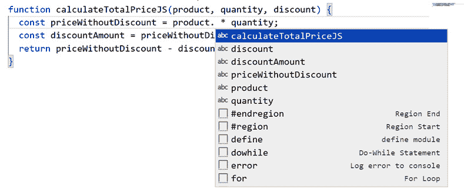
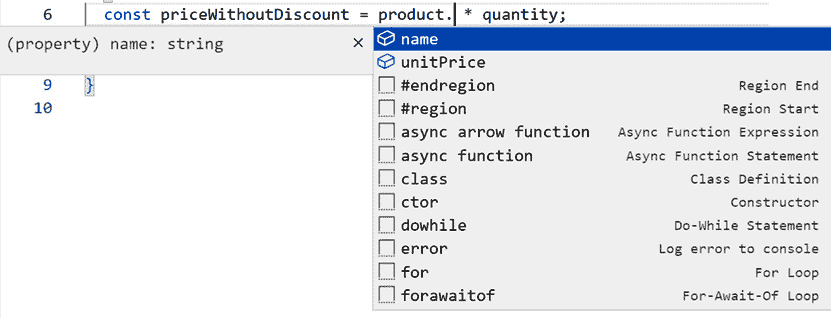
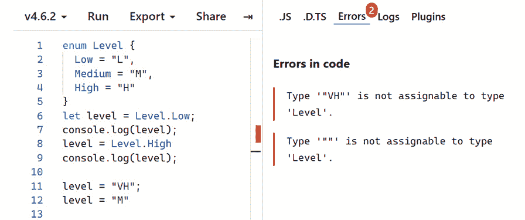

# 第二章：介绍 TypeScript

在本章中，我们将首先了解 TypeScript 是什么，以及它是如何在 JavaScript 之上提供更丰富的类型系统的。我们将学习 TypeScript 中的基本类型，如数字和字符串，然后学习如何使用不同的 TypeScript 功能创建自己的类型来表示对象和数组。最后，我们将通过理解 TypeScript 编译器及其在 React 应用程序中的关键选项来结束本章。

到本章结束时，你将准备好学习如何使用 TypeScript 来构建带有 React 的前端。

在本章中，我们将涵盖以下主题：

+   理解 TypeScript 的好处

+   理解 JavaScript 类型

+   使用基本的 TypeScript 类型

+   创建 TypeScript 类型

+   使用 TypeScript 编译器

# 技术要求

在本章中，我们将使用以下技术：

+   **浏览器**：一个现代浏览器，如 Google Chrome。

+   **TypeScript Playground**：这是一个位于 https://www.typescriptlang.org/play/ 的网站，允许您在不安装 TypeScript 的情况下探索其功能和理解其特性。

+   **CodeSandbox**：我们将简要使用这个在线工具来探索 JavaScript 的类型系统。这个工具可以在 [`codesandbox.io/`](https://codesandbox.io/) 找到。

+   **Visual Studio Code**：我们需要一个编辑器来体验 TypeScript 的好处并探索 TypeScript 编译器。这个编辑器可以从 [`code.visualstudio.com/`](https://code.visualstudio.com/) 安装。其他可用的编辑器可以在 [`github.com/Microsoft/TypeScript/wiki/TypeScript-Editor-Support`](https://github.com/Microsoft/TypeScript/wiki/TypeScript-Editor-Support) 找到。

+   **Node.js** 和 **npm**：TypeScript 依赖于这些软件组件。您可以从 [`nodejs.org/en/download/`](https://nodejs.org/en/download/) 安装它们。

本章中的所有代码片段都可以在以下网址找到：[`github.com/PacktPublishing/Learn-React-with-TypeScript-2nd-Edition/tree/main/Chapter2`](https://github.com/PacktPublishing/Learn-React-with-TypeScript-2nd-Edition/tree/main/Chapter2)。

# 理解 TypeScript 的好处

在本节中，我们将首先了解 TypeScript 是什么，它与 JavaScript 的关系，以及 TypeScript 如何使团队更高效。

## 理解 TypeScript

TypeScript 首次于 2012 年发布，并且仍在开发中，每隔几个月就会发布新版本。但 TypeScript 是什么，它有哪些好处？

TypeScript 通常被称为 JavaScript 的超集或扩展，因为 JavaScript 中的任何功能在 TypeScript 中都是可用的。与 JavaScript 不同，TypeScript 不能直接在浏览器中执行 - 它必须首先转换为 JavaScript。

注意

值得注意的是，有一个提案正在考虑中，该提案将允许 TypeScript 在不进行转换的情况下直接在浏览器中执行。有关更多信息，请参阅以下链接：[`github.com/tc39/proposal-type-annotations`](https://github.com/tc39/proposal-type-annotations)。

TypeScript 为 JavaScript 添加了一个丰富的类型系统。它通常与 Angular、Vue 和 React 等前端框架一起使用。TypeScript 还可用于使用 Node.js 构建后端。这展示了 TypeScript 类型系统的灵活性。

当 JavaScript 代码库增长时，它可能变得难以阅读和维护。TypeScript 的类型系统解决了这个问题。TypeScript 使用类型系统允许代码编辑器在开发者编写有问题的代码时捕获类型错误。代码编辑器还使用类型系统提供生产力功能，如强大的代码导航和代码重构。

接下来，我们将通过一个示例来了解 TypeScript 如何捕获 JavaScript 无法捕获的错误。

## 提前捕获类型错误

类型信息帮助 TypeScript 编译器捕获类型错误。在 Visual Studio Code 等代码编辑器中，类型错误在开发者犯下类型错误后立即用红色下划线标出。执行以下步骤以体验 TypeScript 捕获类型错误的示例：

1.  在您选择的文件夹中打开 Visual Studio Code。

1.  通过在 **EXPLORER** 面板中选择 **新建文件** 选项创建一个名为 `calculateTotalPrice.js` 的新文件。


图 2.1 – 在 Visual Studio Code 中创建新文件

1.  将以下代码输入到文件中：

    ```js
    function calculateTotalPriceJS(product, quantity, discount) {
    ```

    ```js
      const priceWithoutDiscount = product.price * quantity;
    ```

    ```js
      const discountAmount = priceWithoutDiscount * discount;
    ```

    ```js
      return priceWithoutDiscount - discountAmount;
    ```

    ```js
    }
    ```

记住，代码片段可在网上找到以供复制。上一个代码片段的链接可在 [`github.com/PacktPublishing/Learn-React-with-TypeScript-2nd-Edition/blob/main/Chapter2/Section1-Understanding-TypeScript/calculateTotalPrice.js`](https://github.com/PacktPublishing/Learn-React-with-TypeScript-2nd-Edition/blob/main/Chapter2/Section1-Understanding-TypeScript/calculateTotalPrice.js) 找到。

代码中可能存在一个难以发现的错误，并且 Visual Studio Code 不会突出显示该错误。

1.  现在创建一个文件的副本，但使用 `.ts` 扩展名而不是 `.js`。可以通过在 **EXPLORER** 面板中右键单击文件并选择 **复制** 选项来复制文件。然后再次右键单击 **EXPLORER** 面板并选择 **粘贴** 选项以创建复制的文件。

注意

`.ts` 文件扩展名表示 TypeScript 文件。这意味着 TypeScript 编译器将对这个文件执行类型检查。

1.  在 `calculateTotalPrice.ts` 文件中，从函数名称的末尾移除 `JS` 并对代码进行以下突出显示的更新：

    ```js
    function calculateTotalPrice(
    ```

    ```js
      product: { name: string; unitPrice: number },
    ```

    ```js
      quantity: number,
    ```

    ```js
      discount: number
    ```

    ```js
    ) {
    ```

    ```js
      const priceWithoutDiscount = product.price * quantity;
    ```

    ```js
      const discountAmount = priceWithoutDiscount * discount;
    ```

    ```js
      return priceWithoutDiscount - discountAmount;
    ```

    ```js
    }
    ```

在这里，我们添加了 TypeScript `function` 参数。我们将在下一节中详细介绍类型注解。

关键点是类型错误现在用红色波浪线突出显示：


图 2.2 – 高亮显示的类型错误

错误在于函数引用了产品对象中不存在的`price`属性。应该引用的属性是`unitPrice`。

在开发过程中早期捕捉这些问题可以提高团队的生产率，并且是质量保证需要捕捉的更少的一件事。情况可能会更糟——错误可能会进入实时应用程序，给用户带来不良体验。

请保持这些文件在 Visual Studio Code 中打开，因为我们将在下一个示例中运行 TypeScript 如何提高开发体验的示例。

## 使用 IntelliSense 提高开发体验和生产力

**IntelliSense**是代码编辑器中的一个功能，它提供了关于代码元素的有用信息，并允许快速完成代码。例如，IntelliSense 可以提供对象中可用的属性列表。

执行以下步骤以体验 TypeScript 与 IntelliSense 相比 JavaScript 如何工作得更好，以及这对生产力的积极影响。作为这项练习的一部分，我们将修复上一节中的价格错误：

1.  打开`calculateTotalPrice.js`文件，在第 2 行，即`product.price`被引用的地方，移除`price`。然后，将光标放在点(`.`)之后，点击*Ctrl* + 空格键。这会打开 Visual Studio Code 的 IntelliSense：



图 2.3 – JavaScript 文件中的 IntelliSense

Visual Studio Code 只能猜测潜在的属性名称，因此它列出了它在文件中看到的变量名称和函数名称。不幸的是，在这种情况下，IntelliSense 无法提供帮助，因为正确的属性名称`unitPrice`并未列出。

1.  现在打开`calculateTotalPrice.ts`文件，从`product.price`中移除`price`，然后按*Ctrl* + 空格键再次打开 IntelliSense：



图 2.4 – TypeScript 文件中的 IntelliSense

这次，Visual Studio Code 列出了正确的属性。

1.  从 IntelliSense 中选择**unitPrice**以解决类型错误。

IntelliSense 只是 TypeScript 提供的一个工具。它还可以提供强大的重构功能，例如重命名 React 组件，并帮助进行准确的代码导航，例如跳转到函数定义。

为了回顾我们在本节中学到的内容：

+   TypeScript 的类型检查功能有助于在开发过程中早期捕捉问题

+   TypeScript 使代码编辑器能够提供诸如 IntelliSense 之类的生产力功能

+   这些优势在处理大型代码库时提供了显著的好处

接下来，我们将学习 JavaScript 中的类型系统。这将进一步强调在大型代码库中使用 TypeScript 的必要性。

# 理解 JavaScript 类型

在理解 TypeScript 中的类型系统之前，让我们简要地探索 JavaScript 中的类型系统。为此，打开 CodeSandbox，访问[`codesandbox.io/`](https://codesandbox.io/)，并按照以下步骤操作：

1.  通过选择**Vanilla**选项创建一个新的纯 JavaScript 项目。

1.  打开`index.js`，删除其内容，并用以下代码替换：

    ```js
    let firstName = "Fred"
    ```

    ```js
    console.log("firstName", firstName, typeof firstName);
    ```

    ```js
    let score = 9
    ```

    ```js
    console.log("score", score, typeof score);
    ```

    ```js
    let date = new Date(2022, 10, 1);
    ```

    ```js
    console.log("date", date, typeof date);
    ```

代码将三个变量赋值为不同的值。代码还将变量值及其 JavaScript 类型输出到控制台。

这是控制台输出：


图 2.5 – 一些 JavaScript 类型

`firstName`是字符串，`score`是数字，这并不奇怪。然而，`date`是一个对象而不是更具体的日期类型，这有点令人惊讶。

1.  让我们在现有代码之后添加几行代码：

    ```js
    score = "ten"
    ```

    ```js
    console.log("score", score, typeof score);
    ```

再次，控制台输出有点令人惊讶：


图 2.6 – 变量类型变化

`score`变量已从`number`类型更改为`string`类型！这是因为 JavaScript 是松散类型的。

一个关键点是 JavaScript 只有一组最小的类型，如`string`、`number`和`boolean`。值得注意的是，所有的 JavaScript 类型都在 TypeScript 中可用，因为 TypeScript 是 JavaScript 的超集。

此外，JavaScript 允许变量改变其类型——这意味着如果变量被更改为完全不同的类型，JavaScript 引擎不会抛出错误。这种松散的类型使得代码编辑器无法捕获类型错误。

注意

关于 JavaScript 类型的更多信息，请参阅[`developer.mozilla.org/en-US/docs/Web/JavaScript/Data_structures`](https://developer.mozilla.org/en-US/docs/Web/JavaScript/Data_structures)。

现在我们已经了解了 JavaScript 类型系统的局限性，我们将学习 TypeScript 的类型系统，从基本类型开始。

# 使用基本 TypeScript 类型

在本节中，我们将首先了解 TypeScript 类型如何声明以及它们如何从赋值中推断出来。然后我们将学习 TypeScript 中常用的基本类型，这些类型在 JavaScript 中不可用，并了解它们的有用用例。

## 使用类型注解

TypeScript 类型注解允许变量以特定类型声明。这允许 TypeScript 编译器检查代码是否遵循这些类型。简而言之，类型注解允许 TypeScript 在代码使用错误类型的情况下比在 JavaScript 中更早地捕获错误。

打开 TypeScript Playground，访问[`www.typescriptlang.org/play`](https://www.typescriptlang.org/play)，并按照以下步骤进行操作以探索类型注解：

1.  删除左侧面板中的任何现有代码，并输入以下变量声明：

    ```js
    let unitPrice: number;
    ```

类型注解位于变量声明之后。它以冒号开头，后跟我们要分配给变量的类型。在这种情况下，`unitPrice`将被指定为`number`类型。请记住，`number`是 JavaScript 中的一个类型，这意味着它也适用于 TypeScript。

转译后的 JavaScript 如下所示：

```js
let unitPrice;
```

然而，请注意类型注解已经消失。这是因为 JavaScript 中没有类型注解。

注意

您还可能在转译后的 JavaScript 顶部看到`"use strict";`。这意味着 JavaScript 将在 JavaScript 严格模式下执行，这将捕获更多的编码错误。有关 JavaScript 严格模式的更多信息，请参阅[`developer.mozilla.org/en-US/docs/Web/JavaScript/Reference/Strict_mode`](https://developer.mozilla.org/en-US/docs/Web/JavaScript/Reference/Strict_mode)。

1.  在程序中添加第二行：

    ```js
    unitPrice = "Table";
    ```

注意，在这一行下方的`unitPrice`处出现了一条红色横线。如果您将鼠标悬停在下划线的`unitPrice`上，会描述一个类型错误：


图 2.7 – 捕获到的类型错误

1.  您还可以使用与变量注解相同的语法为函数参数和函数的返回值添加类型注解。例如，在 TypeScript Playground 中输入以下函数：

    ```js
    function getTotal(
    ```

    ```js
      unitPrice: number,
    ```

    ```js
      quantity: number,
    ```

    ```js
      discount: number
    ```

    ```js
    ): number {
    ```

    ```js
      const priceWithoutDiscount = unitPrice * quantity;
    ```

    ```js
      const discountAmount = priceWithoutDiscount * discount;
    ```

    ```js
      return priceWithoutDiscount - discountAmount;
    ```

    ```js
    }
    ```

我们已经声明了`unitPrice`、`quantity`和`discount`参数，它们都是`number`类型。函数的返回类型注解位于函数括号之后，在先前的例子中这也是一个`number`类型。

注意

我们在多个例子中使用了`const`和`let`来声明变量。`let`允许变量在声明后更改值，而`const`变量则不能更改。在先前的函数中，`priceWithoutDiscount`和`discountAmount`在初始赋值后永远不会更改值，所以我们使用了`const`。

1.  在代码中添加另一行以调用`getTotal`函数，并使用错误的`quantity`类型。将`getTotal`函数的调用结果赋值给一个具有错误类型的变量：

    ```js
    let total: string = getTotal(500, "one", 0.1);
    ```

两个错误都会立即被检测并突出显示：


图 2.8 – 捕获到的两个类型错误

这种强类型检查是我们从 JavaScript 中得不到的，它在大型代码库中非常有用，因为它可以帮助我们立即检测类型错误。

接下来，我们将学习 TypeScript 在类型检查代码时不总是需要类型注解。

## 使用类型推断

类型注解非常有价值，但它们需要编写额外的代码。这些额外的代码需要花费时间来编写。幸运的是，TypeScript 强大的**类型推断**系统意味着类型注解并不总是需要指定。当变量被赋予一个值时，TypeScript 会推断该变量的类型。

在 TypeScript Playground 中执行以下步骤以探索类型推断：

1.  首先，删除任何之前的代码，然后添加以下行：

    ```js
    let flag = false;
    ```

1.  悬停在`flag`变量上。会出现一个工具提示，显示`flag`被推断出的类型：


图 2.9 – 悬停在变量上显示其类型

1.  在此行下方添加另一行，错误地将`flag`设置为无效值：

    ```js
    flag = "table";
    ```

类型错误会立即被捕获，就像我们使用类型注解为变量分配类型时一样。

类型推断是 TypeScript 的一个优秀特性，它可以防止大量类型注解带来的代码膨胀。因此，使用类型推断并仅在推断不可行时回退到使用类型注解是一种常见的做法。

接下来，我们将查看 TypeScript 中的`Date`类型。

## 使用 Date 类型

我们已经知道 JavaScript 中不存在`Date`类型，但幸运的是，TypeScript 中存在`Date`类型。TypeScript 的`Date`类型是对 JavaScript `Date`对象的表示。

注意

有关 JavaScript `Date`对象的更多信息，请参阅以下链接：[`developer.mozilla.org/en-US/docs/Web/JavaScript/Reference/Global_Objects/Date`](https://developer.mozilla.org/en-US/docs/Web/JavaScript/Reference/Global_Objects/Date)。

要探索 TypeScript 的`Date`类型，请在 TypeScript Playground 中执行以下步骤：

1.  首先，删除任何之前的代码，然后添加以下行：

    ```js
    let today: Date;
    ```

    ```js
    today = new Date();
    ```

声明了一个名为`today`的变量，它被分配了`Date`类型并设置为今天的日期。

1.  将这两行重构为以下使用类型推断而不是类型注解的单行：

    ```js
    let today = new Date();
    ```

1.  检查`today`是否已被分配为`Date`类型，通过悬停在它上面并检查工具提示来完成：


图 2.10 – 确认 today 已推断出 Date 类型

1.  现在，通过在新的行上添加`today.`来检查 IntelliSense 是否正常工作：


图 2.11 – IntelliSense 在日期上工作得很好

1.  删除此行并添加一条略微不同的代码行：

    ```js
    today.addMonths(2);
    ```

`Date`对象中不存在`addMonths`函数，因此会引发类型错误：


图 2.12 – 在日期上捕获到的类型错误

总结来说，`Date`类型具有我们期望的所有功能——推断、IntelliSense 和类型检查——这对于处理日期来说非常有用。

接下来，我们将了解 TypeScript 类型系统中的一个逃生口。

## 使用 any 类型

如果我们声明一个没有类型注解和值的变量，TypeScript 会推断出什么类型？让我们通过在 TypeScript Playground 中输入以下代码来找出答案：

```js
let flag;
```

现在，将鼠标悬停在`flag`上：


图 2.13 – 被赋予 any 类型的变量

因此，TypeScript 给没有类型注解且没有立即赋值的变量赋予`any`类型。这是一种选择不执行特定变量的类型检查的方法，通常用于动态内容或第三方库中的值。然而，TypeScript 日益强大的类型系统意味着我们今天需要更少地使用`any`。

相反，有一个更好的选择：`unknown`类型。

## 使用`unknown`类型

当我们不确定类型但想以强类型方式与之交互时，我们可以使用`unknown`类型。执行以下步骤以探索这如何是`any`类型的更好替代方案：

1.  在 TypeScript Playground 中，删除任何之前的代码，并输入以下内容：

    ```js
    fetch("https://swapi.dev/api/people/1")
    ```

    ```js
      .then((response) => response.json())
    ```

    ```js
      .then((data) => {
    ```

    ```js
        console.log("firstName", data.firstName);
    ```

    ```js
      });
    ```

代码从网络 API 中获取一个《星球大战》角色。没有抛出类型错误，所以代码看起来是正常的。

1.  现在点击**运行**选项来执行代码：


图 2.14 – firstName 属性具有未定义的值

`firstName`属性似乎不在获取的数据中，因为它在输出到控制台时是`undefined`。

为什么在引用`firstName`的第四行没有抛出类型错误？嗯，`data`的类型是`any`，这意味着不会对其执行类型检查。你可以悬停在`data`上以确认它已被赋予`any`类型。

1.  给`data`添加`unknown`类型注解：

    ```js
     fetch("https://swapi.dev/api/people/1")
    ```

    ```js
      .then((response) => response.json())
    ```

    ```js
      .then((data: unknown) => {
    ```

    ```js
        console.log("firstName", data.firstName);
    ```

    ```js
      });
    ```

当在`firstName`处引用时，现在会抛出一个类型错误：


图 2.15 – 在未知数据参数上发生类型错误

`unknown`类型是`any`类型的对立面，因为它在其类型中不包含任何内容。一个不包含任何内容的类型可能看起来没有用。然而，如果进行了检查以允许 TypeScript 扩展它，变量的类型可以被扩展。

1.  在我们给 TypeScript 提供信息以扩展`data`之前，将其引用的属性从`firstName`更改为`name`：

    ```js
    fetch("https://swapi.dev/api/people/1")
    ```

    ```js
      .then((response) => response.json())
    ```

    ```js
      .then((data: unknown) => {
    ```

    ```js
        console.log("name", data.name);
    ```

    ```js
      });
    ```

`name`是一个有效的属性，但仍然发生类型错误。这是因为`data`仍然是`unknown`。

1.  现在将代码中的高亮部分更改以扩展`data`类型：

    ```js
    fetch("https://swapi.dev/api/people/1")
    ```

    ```js
      .then((response) => response.json())
    ```

    ```js
      .then((data: unknown) => {
    ```

    ```js
        if (isCharacter(data)) {
    ```

    ```js
          console.log("name", data.name);
    ```

    ```js
        }
    ```

    ```js
      });
    ```

    ```js
    function isCharacter(
    ```

    ```js
      character: any
    ```

    ```js
    ): character is { name: string } {
    ```

    ```js
      return "name" in character;
    ```

    ```js
    }
    ```

可以从[`github.com/PacktPublishing/Learn-React-with-TypeScript-2nd-Edition/blob/main/Chapter2/Section2-Basic-types/Using-the-unknown-type/code.ts`](https://github.com/PacktPublishing/Learn-React-with-TypeScript-2nd-Edition/blob/main/Chapter2/Section2-Basic-types/Using-the-unknown-type/code.ts)复制代码片段。

`if`语句使用一个名为`isCharacter`的函数来验证对象中是否包含`name`属性。在这个例子中，这个调用的结果是`true`，所以逻辑将流入`if`分支。

注意`isCharacter`的返回类型，它是：

```js
character is { name: string }
```

如果函数返回`true`，则这是一个`character`到`{ name: string }`的类型。在这个例子中，类型谓词是`true`，所以`character`被扩展为一个具有`name`字符串属性的对象。

1.  在引用`data`变量的每一行上悬停。`data`最初具有`unknown`类型，其中它被赋予了一个类型注解。然后，在`if`分支内部，它被扩展到`{name: string}`：


图 2.16 – 分配给数据的扩展类型

注意到类型错误也已经消失了。太好了！

1.  接下来，运行代码。你将在控制台看到`Luke Skywalker`输出。

总结来说，`unknown`类型是对于不确定数据类型的优秀选择。然而，你不能与`unknown`变量交互——变量必须在任何交互之前被扩展到其他类型。

接下来，我们将学习一个用于函数不返回值的类型。

## 使用 void 类型

`void`类型用于表示函数的返回类型，在这种情况下，函数不返回任何值。

例如，在 TypeScript Playground 中输入以下函数：

```js
function logText(text: string) {
  console.log(text);
}
```

悬停在函数名上可以确认函数的返回类型被赋予了一个`void`类型。


图 2.17 – 返回类型已确认为准 void

你可能认为你可以使用`undefined`作为前面示例的返回类型：

```js
function logText(text: string): undefined {
  console.log(text);
}
```

然而，这引发了一个类型错误，因为`undefined`类型的返回类型意味着函数预期会返回一个值（类型为`undefined`）。示例函数没有返回任何值，所以返回类型是`void`。

总结来说，`void`是一个特殊类型，用于函数的返回类型，在这种情况下，函数没有返回语句。

接下来，我们将学习`never`类型。

## 使用 never 类型

`never`类型表示永远不会发生的事情，通常用于指定不可达的代码区域。让我们在 TypeScript Playground 中探索一个例子：

1.  删除任何现有代码并输入以下代码：

    ```js
    function foreverTask(taskName: string): never {
    ```

    ```js
      while (true) {
    ```

    ```js
        console.log(`Doing ${taskName} over and over again       ...`);
    ```

    ```js
      }
    ```

    ```js
    }
    ```

函数调用了一个无限循环，这意味着函数永远不会退出。因此，我们给函数赋予了一个`never`类型的返回类型注解，因为我们不期望函数会退出。这与`void`不同，因为`void`意味着它*将会*退出，但没有返回值。

注意

在前面的例子中，我们使用 JavaScript 模板字符串来构建输出到控制台的字符串。模板字符串由反引号（`` ` ` ``）包围，并可以包含以美元符号（`$${expression}`）为前缀的花括号中的 JavaScript 表达式。当需要将静态文本与变量合并时，模板字符串非常出色。有关模板字符串的更多信息，请参阅此链接：[`developer.mozilla.org/en-US/docs/Web/JavaScript/Reference/Template_literals`](https://developer.mozilla.org/en-US/docs/Web/JavaScript/Reference/Template_literals)。

1.  将`foreverTask`函数更改为跳出循环：

    ```js
    function foreverTask(taskName: string): never {
    ```

    ```js
      while (true) {
    ```

    ```js
        console.log(`Doing ${taskName} over and over again       ...`);
    ```

    ```js
        break;
    ```

    ```js
      }
    ```

    ```js
    }
    ```

TypeScript 正确地抱怨：


图 2.18 – never 返回类型上的类型错误

1.  删除 `break` 语句并删除 `never` 返回类型注解：

    ```js
    function foreverTask(taskName: string) {
    ```

    ```js
      while (true) {
    ```

    ```js
        console.log(`Doing ${taskName} over and over again ...`);
    ```

    ```js
      }
    ```

    ```js
    }
    ```

1.  将鼠标悬停在 `foreverTask` 函数名称上。我们可以看到 TypeScript 推断的返回类型为 `void`：


图 2.19 – 返回类型推断为 void

因此，TypeScript 在这种情况下无法推断出 `never` 类型。相反，它推断出返回类型为 `void`，这意味着函数将不带任何值退出，但这在本例中并不适用。这是一个提醒，始终要检查推断的类型，并在适当的地方使用类型注解。

总结来说，`never` 类型用于代码永远不会到达的地方。

接下来，让我们来介绍数组。

## 使用数组

数组是 TypeScript 从 JavaScript 继承的结构。我们像往常一样向数组添加类型注解，但在末尾使用方括号 `[]` 来表示这是一个数组类型。

让我们在 TypeScript Playground 中探索一个示例：

1.  删除任何现有代码，并输入以下内容：

    ```js
    const numbers: number[] = [];
    ```

或者，可以使用 `Array` 泛型类型语法：

```js
const numbers: Array<number> = [];
```

我们将在 *第十一章* *可重用组件* 中学习 TypeScript 中的泛型。

1.  通过使用数组的 `push` 函数向数组中添加 `1`：

    ```js
    numbers.push(1);
    ```

1.  现在向数组中添加一个字符串：

    ```js
    numbers.push("two");
    ```

正如我们所预期的那样，会抛出一个类型错误：


图 2.20 – 向数字数组添加字符串类型时的类型错误

1.  现在将所有代码替换为以下内容：

    ```js
    const numbers = [1, 2, 3];
    ```

1.  将鼠标悬停在 `numbers` 上以验证 TypeScript 已经推断出它的类型为 `number[]`。


图 2.21 – 数组类型推断

极好 – 我们可以看到 TypeScript 的类型推断在数组上是如何工作的！

数组是用于结构化数据最常用的类型之一。在前面的示例中，我们只使用了一个具有 `number` 类型元素的数组，但可以使用任何类型作为元素，包括具有自己属性的对象。

在本节中，我们回顾了所有基本类型：

+   TypeScript 向 JavaScript 类型添加了许多有用的类型，例如 `Date`，并且能够表示数组。

+   TypeScript 可以从其分配的值推断出变量的类型。当类型推断无法给出所需类型时，可以使用类型注解。

+   具有类型 `any` 的变量不会进行类型检查，因此应避免使用此类型。

+   `unknown` 类型是 `any` 的强类型替代品，但 `unknown` 变量必须进行类型提升才能进行交互。

+   `void` 是一个不返回值的函数的返回类型。

+   `never` 类型可以用来标记代码中无法到达的区域。

+   可以在数组项目类型之后使用方括号来定义数组类型。

在下一节中，我们将学习如何创建自己的类型。

# 创建 TypeScript 类型

上一节展示了 TypeScript 拥有一套非常出色的标准类型。在本节中，我们将学习如何创建我们自己的类型。我们将从学习创建对象类型的三个不同方法开始。然后，我们将学习关于强类型 JavaScript 类的内容。最后，我们将学习两种创建用于存储一系列值变量的类型的方法。

## 使用对象类型

对象在 JavaScript 程序中非常常见，因此学习如何在 TypeScript 中表示它们非常重要。实际上，我们已经在本章前面使用对象类型为`calculateTotalPrice`函数中的`product`参数创建了一个对象类型。以下是`product`参数类型注解的提醒：

```js
function calculateTotalPrice(
  product: { name: string; unitPrice: number },
  ...
) {
  ...
}
```

TypeScript 中的对象类型表示得有点像 JavaScript 对象字面量。然而，与属性值不同，属性类型被指定。对象定义中的属性可以用分号或逗号分隔，但使用分号是常见做法。

清除 TypeScript Playground 中的任何现有代码，并按照以下示例来探索对象类型：

1.  将以下变量赋值给一个对象：

    ```js
    let table = {name: "Table", unitPrice: 450};
    ```

如果将鼠标悬停在`table`变量上，你会看到它被推断为以下类型：

```js
{
  name: string;
  unitPrice: number;
}
```

因此，类型推断在对象中工作得很好。

1.  现在，在下一行，尝试将`discount`属性设置为`10`：

    ```js
    table.discount = 10;
    ```

尽管类型中不存在`discount`属性，但只有`name`和`unitPrice`属性存在。因此，发生类型错误。

1.  假设我们想要表示一个包含`name`和`unitPrice`属性的`product`对象，但希望`unitPrice`是可选的。删除现有代码，并用以下代码替换：

    ```js
    const table: { name: string; unitPrice: number } = {
    ```

    ```js
      name: "Table",
    ```

    ```js
    };
    ```

1.  这会引发类型错误，因为`unitPrice`在类型注解中是一个必需的属性。我们可以使用以下`?`符号来使其可选而不是必需：

    ```js
    const table: { name: string; unitPrice?: number } = {
    ```

    ```js
      name: "Table",
    ```

    ```js
    };
    ```

类型错误消失了。

注意

在函数中可以使用`?`符号表示可选参数。例如，`myFunction(requiredParam: string, optionalParam: string)`。

现在，让我们学习一种简化对象类型定义的方法。

## 创建类型别名

我们在上一个示例中使用的类型注解相当长，对于更复杂的对象结构会更长。此外，必须为不同的变量写入相同的对象结构会有些令人沮丧：

```js
const table: { name: string; unitPrice?: number } = ...;
const chair: { name: string; unitPrice?: number } = ...;
```

**类型别名**解决了这些问题。正如其名所示，类型别名指的是另一个类型，其语法如下：

```js
type YourTypeAliasName = AnExistingType;
```

打开 TypeScript Playground 并跟随示例来探索类型别名：

1.  首先，为我们在上一个示例中使用的商品对象结构创建一个类型别名：

    ```js
    type Product = { name: string; unitPrice?: number };
    ```

1.  现在，将两个变量分配给这个`Product`类型：

    ```js
    let table: Product = { name: "Table" };
    ```

    ```js
    let chair: Product = { name: "Chair", unitPrice: 40 };
    ```

这样就干净多了！

1.  类型别名可以使用`&`符号扩展另一个对象。通过添加以下类型别名创建一个折扣产品的第二个类型：

    ```js
    type DiscountedProduct = Product & { discount: number };
    ```

`DiscountedProduct`表示一个包含`name`、`unitPrice`（可选）和`discount`属性的对象。

注意

使用`&`符号扩展另一个类型的类型被称为**交集类型**。

1.  按照以下方式添加以下变量，使用`DiscountedProduct`类型：

    ```js
    let chairOnSale: DiscountedProduct = {
    ```

    ```js
      name: "Chair on Sale",
    ```

    ```js
      unitPrice: 30,
    ```

    ```js
      discount: 5,
    ```

    ```js
    };
    ```

1.  类型别名也可以用来表示函数。添加以下类型别名来表示一个函数：

    ```js
    type Purchase = (quantity: number) => void;
    ```

前面的类型表示一个包含`number`参数的函数，并且不返回任何内容。

1.  使用`Purchase`类型在`Product`类型中创建`purchase`函数属性，如下所示：

    ```js
    type Purchase = (quantity: number) => void;
    ```

    ```js
    type Product = {
    ```

    ```js
      name: string;
    ```

    ```js
      unitPrice?: number;
    ```

    ```js
      purchase: Purchase;
    ```

    ```js
    };
    ```

因为需要`purchase`函数属性，`table`、`chair`和`chairOnSale`变量声明将引发类型错误。

1.  按照以下方式向`table`变量声明中添加`purchase`函数属性：

    ```js
    let table: Product = {
    ```

    ```js
      name: "Table",
    ```

    ```js
      purchase: (quantity) =>
    ```

    ```js
        console.log(`Purchased ${quantity} tables`),
    ```

    ```js
    };
    ```

    ```js
    table.purchase(4);
    ```

`table`变量声明上的类型错误已解决。

1.  可以以类似`chair`和`chairOnSale`变量声明的方式添加`purchase`属性来解决这个问题。然而，在这个探索中忽略这些类型错误，继续到下一步。

1.  点击**运行**选项来运行购买四张桌子的代码。**“已购买 4 张桌子”**输出到控制台。

总结来说，类型别名允许将现有类型组合在一起，并提高类型的可读性和可重用性。我们将在本书中广泛使用类型别名。

接下来，我们将探索创建类型的另一种方法。保持 TypeScript Playground 打开，代码保持不变——我们将在下一节中使用它。

## 创建接口

正如我们在上一个示例中使用类型别名创建的那样，可以使用 TypeScript 的`interface`关键字创建对象类型，后跟其名称，然后是括号中组成`interface`的部分：

```js
interface Product {
  ...
}
```

前往包含类型别名探索中代码的 TypeScript Playground，并跟随操作来探索接口：

1.  首先，将`Product`类型别名替换为以下`Product`接口：

    ```js
    interface Product {
    ```

    ```js
      name: string;
    ```

    ```js
      unitPrice?: number;
    ```

    ```js
    }
    ```

`table`变量赋值出现类型错误，因为`purchase`属性尚未存在——我们将在*第 4 步*中添加它。然而，`chair`变量赋值编译时没有错误。

1.  接口可以使用`extends`关键字扩展另一个接口。将`DiscountedProduct`类型别名替换为以下接口：

    ```js
    interface DiscountedProduct extends Product {
    ```

    ```js
      discount: number;
    ```

    ```js
    }
    ```

注意到`chairOnSale`变量赋值编译时没有错误。

1.  接口也可以用来表示函数。添加以下接口来表示一个函数，替换类型别名版本：

    ```js
    interface Purchase {(quantity: number): void}
    ```

创建函数的接口语法不如使用类型别名直观。

1.  按照以下方式将`Purchase`接口添加到`Product`接口中：

    ```js
    interface Product {
    ```

    ```js
      name: string;
    ```

    ```js
      unitPrice?: number;
    ```

    ```js
      purchase: Purchase;
    ```

    ```js
    }
    ```

`table`变量声明上的类型错误已解决，但现在在`chair`和`chairOnSale`变量声明上引发了类型错误。

1.  点击**运行**选项来运行购买四张桌子的代码。**“已购买 4 张桌子”**输出到控制台。

在前面的步骤中，我们使用接口和使用类型别名执行了相同的任务。因此，显而易见的问题是，*我应该何时使用类型别名而不是接口，反之亦然？* 类型别名和接口在创建对象类型方面的功能非常相似——所以简单的答案是，这取决于对对象类型的偏好。然而，类型别名可以创建接口无法创建的类型，例如联合类型，我们将在本章后面介绍。

注意

有关类型别名和接口之间差异的更多信息，请参阅以下链接：[`www.typescriptlang.org/docs/handbook/2/everyday-types.html#differences-between-type-aliases-and-interfaces`](https://www.typescriptlang.org/docs/handbook/2/everyday-types.html#differences-between-type-aliases-and-interfaces)。

本书其余部分使用类型别名而不是接口来定义类型。

接下来，我们将学习如何使用 TypeScript 与类一起使用。

## 创建类

**类**是标准的 JavaScript 功能，它作为创建对象的模板。在类中定义的属性和方法将自动包含在从该类创建的对象中。

打开 TypeScript Playground，删除任何现有代码，并按照以下步骤执行以探索 TypeScript 中的类：

1.  添加以下代码以创建一个表示产品并具有名称和单价属性的类的示例：

    ```js
    class Product {
    ```

    ```js
      name;
    ```

    ```js
      unitPrice;
    ```

    ```js
    }
    ```

如果你悬停在 `name` 和 `unitPrice` 属性上，你会看到它们具有 `any` 类型。正如我们所知，这意味着不会对它们进行类型检查。

1.  将以下类型注解添加到属性中：

    ```js
    class Product {
    ```

    ```js
      name: string;
    ```

    ```js
      unitPrice: number;
    ```

    ```js
    }
    ```

不幸的是，TypeScript 抛出了以下错误：


图 2.22 – 类属性上的类型错误

错误是因为当创建类的实例时，这些属性值将是 `undefined`，这不在 `string` 或 `number` 类型中。

1.  一种解决方案是使属性可选，以便它们可以接受 `undefined` 作为值。通过在类型注解的开始处添加 `?` 符号来尝试此解决方案：

    ```js
    class Product {
    ```

    ```js
      name?: string;
    ```

    ```js
      unitPrice?: number;
    ```

    ```js
    }
    ```

1.  如果我们不希望值最初是 `undefined`，我们可以像这样分配初始值：

    ```js
    class Product {
    ```

    ```js
      name = "";
    ```

    ```js
      unitPrice = 0;
    ```

    ```js
    }
    ```

如果你现在悬停在属性上，你会看到 `name` 已推断为 `string` 类型，而 `unitPrice` 已推断为 `number` 类型。

1.  向类属性添加类型的另一种方法是在构造函数中。移除分配给属性的值，并将构造函数添加到类中，如下所示：

    ```js
    class Product {
    ```

    ```js
      name;
    ```

    ```js
      unitPrice;
    ```

    ```js
      constructor(name: string, unitPrice: number) {
    ```

    ```js
        this.name = name;
    ```

    ```js
        this.unitPrice = unitPrice;
    ```

    ```js
      }
    ```

    ```js
    }
    ```

如果你悬停在属性上，你会看到已推断出正确的类型。

1.  实际上，如果构造函数参数被标记为 `public`，则不需要定义属性。

    ```js
    class Product {
    ```

    ```js
      constructor(public name: string, public unitPrice:     number) {
    ```

    ```js
        this.name = name;
    ```

    ```js
        this.unitPrice = unitPrice;
    ```

    ```js
      }
    ```

    ```js
    }
    ```

TypeScript 会自动为标记为 `public` 的构造函数参数创建属性。

1.  可以像我们之前为函数所做的那样，将类型注解添加到方法参数和返回值中：

    ```js
    class Product {
    ```

    ```js
      constructor(public name: string, public unitPrice:     number) {
    ```

    ```js
        this.name = name;
    ```

    ```js
        this.unitPrice = unitPrice;
    ```

    ```js
      }
    ```

    ```js
      getDiscountedPrice(discount: number): number {
    ```

    ```js
        return this.unitPrice - discount;
    ```

    ```js
      }
    ```

    ```js
    }
    ```

1.  现在创建类的实例并将它的折扣价格输出到控制台：

    ```js
    const table = new Product("Table", 45);
    ```

    ```js
    console.log(table.getDiscountedPrice(5));
    ```

如果运行代码，**40**会被输出到控制台。

总结一下，类属性可以在构造函数中或通过分配默认值来指定类型。类方法可以像常规 JavaScript 函数一样强类型化。

注意

更多关于类的信息，请参阅以下链接：[`developer.mozilla.org/en-US/docs/Web/JavaScript/Reference/Classes`](https://developer.mozilla.org/en-US/docs/Web/JavaScript/Reference/Classes)。

接下来，我们将学习如何创建一个表示一系列值的类型。

## 创建枚举

`enum`关键字，后面跟着我们想要给它的名字，然后是其可能的值，用大括号括起来。

让我们在 TypeScript Playground 中探索一个例子：

1.  首先，创建包含`Low`、`Medium`和`High`值的`Level`枚举：

    ```js
    enum Level {
    ```

    ```js
      Low,
    ```

    ```js
      Medium,
    ```

    ```js
      High
    ```

    ```js
    }
    ```

1.  现在，创建一个`level`变量，并将其赋值为`Level`枚举中的`Low`和`High`值。也将`level`值输出到控制台：

    ```js
    let level = Level.Low;
    ```

    ```js
    console.log(level);
    ```

    ```js
    level = Level.High
    ```

    ```js
    console.log(level);
    ```

注意，当你引用枚举时，你会得到智能感知。

1.  点击**运行**选项来执行代码并观察枚举值：


图 2.23 – 枚举值的输出

默认情况下，枚举是零基数字（这意味着第一个枚举值是 0，下一个是 1，再下一个是 2，依此类推）。在先前的例子中，`Level.Low`是`0`，`Level.Medium`是`1`，`Level.High`是`2`。

1.  而不是使用默认值，我们可以在等于（`=`）符号之后显式地为每个枚举项定义自定义值。显式地将值设置为`1`到`3`之间：

    ```js
    enum Level {
    ```

    ```js
      Low = 1,
    ```

    ```js
      Medium = 2,
    ```

    ```js
      High = 3
    ```

    ```js
    }
    ```

你可以重新运行代码来验证这一点。

1.  现在，让我们做一些有趣的事情。将`level`赋值为大于 3 的数字：

    ```js
    level = 10;
    ```

注意，这里没有发生类型错误。这有点令人惊讶——基于数字的枚举并不像我们希望的那样类型安全。

1.  而不是使用数字枚举值，让我们尝试使用字符串。将所有当前代码替换为以下内容：

    ```js
    enum Level {
    ```

    ```js
      Low = "L",
    ```

    ```js
      Medium = "M",
    ```

    ```js
      High = "H"
    ```

    ```js
    }
    ```

    ```js
    let level = Level.Low;
    ```

    ```js
    console.log(level);
    ```

    ```js
    level = Level.High
    ```

    ```js
    console.log(level);
    ```

如果运行此代码，我们会看到预期的**L**和**H**输出到控制台。

1.  添加另一行代码，将`level`赋值为以下字符串：

    ```js
    level = "VH";
    ```

    ```js
    level = "M"
    ```

我们立即在这些赋值上看到类型错误被抛出：



图 2.24 – 确认字符串枚举是类型安全的

总结一下，枚举是一种用用户友好的名称表示一系列值的方法。默认情况下，它们是零基数字，并不像我们希望的那样类型安全。然而，我们可以将枚举基于字符串，这更类型安全。

接下来，我们将学习 TypeScript 中的联合类型。

## 创建联合类型

**联合类型**是多个其他类型的数学并集，用于创建一个新类型。与枚举类似，联合类型可以表示一系列值。如前所述，可以使用类型别名来创建联合类型。

联合类型的一个例子如下：

```js
type Level = "H" | "M" | "L";
```

这个 `Level` 类型与我们之前创建的 `Level` 类型的枚举版本类似。区别在于，联合类型只包含值（`"H"`，`"M"`，`"L"`）而不是名称（`"High"`，`"Medium"`，`"Large"`）和值。

清除 TypeScript Playground 中的任何现有代码，让我们来玩一玩联合类型：

1.  首先创建一个表示 `"red"`，`"green"` 或 `"blue"` 的类型：

    ```js
    type RGB = "red" | "green" | "blue";
    ```

注意，这个类型是字符串的联合，但联合类型可以由任何类型组成——甚至可以是混合类型！

1.  创建一个具有 `RGB` 类型的变量并分配一个有效值：

    ```js
    let color: RGB = "red";
    ```

1.  现在尝试分配一个类型外的值：

    ```js
    color = "yellow";
    ```

如预期，发生类型错误：


图 2.25 – 联合类型上的类型错误

当一个类型只能持有特定的一组字符串时，如前例所示，由字符串组成的联合类型非常出色。

这里是对我们关于创建类型的了解的回顾：

+   对象和函数可以使用类型别名或接口来表示。它们具有非常相似的功能，但类型别名语法在表示函数时更为直观。

+   `?` 符号可以指定对象属性或函数参数是可选的。

+   可以将类型注解添加到类属性、构造函数和方法参数中，以使它们具有类型安全性。

+   与基于字符串的联合类型类似，基于字符串的枚举非常适合一组特定的字符串。如果字符串具有意义，那么字符串联合类型是最简单的方法。如果字符串没有意义，则可以使用字符串枚举来使它们可读。

现在我们已经涵盖了类型，接下来，我们将学习 TypeScript 编译器。

# 使用 TypeScript 编译器

在本节中，我们将学习如何使用 TypeScript 编译器进行代码类型检查并将其转换为 JavaScript。首先，我们将使用 Visual Studio Code 创建一个包含我们在上一节中编写的代码的简单 TypeScript 项目。然后，我们将使用 Visual Studio Code 内部的终端与 TypeScript 编译器进行交互。

在您选择的空白文件夹中打开 Visual Studio Code，并执行以下步骤：

1.  在包含以下内容的 `package.json` 中：

    ```js
    {
    ```

    ```js
      "name": "tsc-play",
    ```

    ```js
      "dependencies": {
    ```

    ```js
        "typescript": "⁴.6.4"
    ```

    ```js
      },
    ```

    ```js
      "scripts": {
    ```

    ```js
        "build": "tsc src/product.ts"
    ```

    ```js
      }
    ```

    ```js
    }
    ```

该文件定义了一个项目名称为 `tsc-play`，并将 TypeScript 设置为唯一的依赖项。该文件还定义了一个名为 `build` 的 npm 脚本，它将调用 TypeScript 编译器（`tsc`），并将 `src` 文件夹中的 `product.ts` 文件传递给它。不要担心 `product.ts` 文件不存在——我们将在 *步骤 3* 中创建它。

1.  现在，通过从 **终端** 菜单中选择 **New Terminal** 来打开 Visual Studio Code 终端，然后输入以下命令：

    ```js
    npm install
    ```

这将安装 `package.json` 的 `dependencies` 部分中列出的所有库。因此，这将安装 TypeScript。

1.  创建一个名为 `src` 的文件夹，然后在其中创建一个名为 `product.ts` 的文件。

1.  打开 `product.ts` 并添加以下内容：

    ```js
    class Product {
    ```

    ```js
      constructor(public name: string, public unitPrice:     number) {
    ```

    ```js
        this.name = name;
    ```

    ```js
        this.unitPrice = unitPrice;
    ```

    ```js
      }
    ```

    ```js
      getDiscountedPrice(discount: number): number {
    ```

    ```js
        return this.unitPrice - discount;
    ```

    ```js
      }
    ```

    ```js
    }
    ```

    ```js
    const table = new Product("Table", 45);
    ```

    ```js
    console.log(table.getDiscountedPrice(5));
    ```

这段代码可以在使用类的部分中找到。您可以从[`github.com/PacktPublishing/Learn-React-with-TypeScript-2nd-Edition/blob/main/Chapter2/Section4-Using-the-compiler/src/product.ts`](https://github.com/PacktPublishing/Learn-React-with-TypeScript-2nd-Edition/blob/main/Chapter2/Section4-Using-the-compiler/src/product.ts)复制此代码。

1.  在终端中输入以下命令：

    ```js
    npm run build
    ```

这将运行我们在第一步中定义的 npm `build` 脚本。

命令完成后，注意在`src`文件夹中`product.ts`旁边会出现一个`product.js`文件。

1.  打开转换后的`product.js`文件并阅读内容。它看起来如下所示：

    ```js
    var Product = /** @class */ (function () {
    ```

    ```js
      function Product(name, unitPrice) {
    ```

    ```js
        this.name = name;
    ```

    ```js
        this.unitPrice = unitPrice;
    ```

    ```js
        this.name = name;
    ```

    ```js
        this.unitPrice = unitPrice;
    ```

    ```js
      }
    ```

    ```js
      Product.prototype.getDiscountedPrice = function     (discount) {
    ```

    ```js
        return this.unitPrice - discount;
    ```

    ```js
      };
    ```

    ```js
      return Product;
    ```

    ```js
    })();
    ```

    ```js
    var table = new Product("Table", 45);
    ```

    ```js
    console.log(table.getDiscountedPrice(5));
    ```

注意到类型注解已被删除，因为它们不是有效的 JavaScript。同时注意，它已被转换为 JavaScript，能够在非常旧的浏览器中运行。

TypeScript 编译器使用的默认配置并不理想。例如，我们可能希望将转换后的 JavaScript 放在一个完全独立的文件夹中，并且可能希望针对更新的浏览器。

1.  可以使用名为`tsconfig.json`的文件来配置 TypeScript 编译器。在项目的根目录中添加一个`tsconfig.json`文件，包含以下代码：

    ```js
    {
    ```

    ```js
      "compilerOptions": {
    ```

    ```js
        "outDir": "build",
    ```

    ```js
        "target": "esnext",
    ```

    ```js
        "module": "esnext",
    ```

    ```js
        "lib": ["DOM", "esnext"],
    ```

    ```js
        "strict": true,
    ```

    ```js
        "jsx": "react",
    ```

    ```js
        "moduleResolution": "node",
    ```

    ```js
        "noEmitOnError": true
    ```

    ```js
      },
    ```

    ```js
      "include": ["src/**/*"],
    ```

    ```js
      "exclude": ["node_modules", "build"]
    ```

    ```js
    }
    ```

您可以从[`github.com/PacktPublishing/Learn-React-with-TypeScript-2nd-Edition/blob/main/Chapter2/Section4-Using-the-compiler/tsconfig.json`](https://github.com/PacktPublishing/Learn-React-with-TypeScript-2nd-Edition/blob/main/Chapter2/Section4-Using-the-compiler/tsconfig.json)复制此代码。

下面是`compilerOptions`字段中每个设置的说明：

+   `outDir`：这是放置转换后的 JavaScript 的文件夹。

+   `target`：这是我们想要转换到的 JavaScript 版本。`esnext`目标意味着下一个版本。

+   `Module`：这是代码中使用的模块类型。`esnext`模块意味着标准 JavaScript 模块。

+   `Lib`：在类型检查过程中包含的标准库类型。`DOM`提供浏览器 DOM API 类型，而`esnext`是 JavaScript 下一个版本 API 的类型。

+   `Strict`：当设置为`true`时，表示最严格的类型检查级别。

+   `Jsx`：当设置为`React`时，允许编译器转换 React 的 JSX。

+   `moduleResolution`：这是查找依赖项的方式。我们希望 TypeScript 在`node_modules`文件夹中查找，因此我们选择了`node`。

+   `noEmitOnError`：当设置为`true`时，表示如果发现类型错误，则不会发生转换。

`include`字段指定要编译的 TypeScript 文件，而`exclude`字段指定要排除的文件。

注意

关于 TypeScript 编译器选项的更多信息，请参阅以下链接：[`www.typescriptlang.org/tsconfig`](https://www.typescriptlang.org/tsconfig)。

1.  TypeScript 编译器配置现在指定了`src`文件夹中的所有文件都要进行编译。因此，从`package.json`中的`build`脚本中删除文件路径：

    ```js
    {
    ```

    ```js
      ...,
    ```

    ```js
      "scripts": {
    ```

    ```js
        "build": "tsc"
    ```

    ```js
      }
    ```

    ```js
    }
    ```

1.  删除`src`文件夹中之前的转换后的`product.js`文件。

1.  在终端中重新运行 `build` 命令：

    ```js
    npm run build
    ```

这次转换的文件被放置在 `build` 文件夹中。您还会注意到，现在转换的 JavaScript 使用了现代浏览器支持的类。

1.  我们将要尝试的最后一件事是类型错误。打开 `product.ts` 并更新构造函数以引用错误的属性名：

    ```js
    class Product {
    ```

    ```js
      constructor(public name: string, public unitPrice:     number) {
    ```

    ```js
        this.name = name;
    ```

    ```js
        this.price = unitPrice;
    ```

    ```js
      }
    ```

    ```js
      ...
    ```

    ```js
    }
    ```

1.  删除 `build` 文件夹以移除之前转换的 JavaScript 文件。

1.  在终端中重新运行 `build` 命令：

    ```js
    npm run build
    ```

类型错误在终端中报告。注意，JavaScript 文件没有被转换。

总结来说，TypeScript 有一个名为 `tsc` 的编译器，我们可以使用它来执行类型检查和转换，作为持续集成过程的一部分。编译器非常灵活，可以使用名为 `tsconfig.json` 的文件进行配置。值得注意的是，Babel 通常用于转换 TypeScript（以及 React），让 TypeScript 专注于类型检查。

接下来，我们将回顾本章所学的内容。

# 摘要

TypeScript 通过丰富的类型系统补充了 JavaScript，在本章中，我们通过使用 TypeScript 的类型检查来早期捕获错误。

我们还了解到，JavaScript 类型，如 `number` 和 `string`，可以在 TypeScript 中使用，以及仅存在于 TypeScript 中的类型，如 `Date` 和 `unknown`。

我们探讨了联合类型，并了解到这些类型非常适合表示一组特定的字符串。我们现在明白，如果字符串值不是非常有意义，字符串枚举是字符串联合类型的替代方案。

可以使用类型别名创建新类型。我们了解到类型别名可以基于对象、函数，甚至是联合类型。我们现在知道，类型注解中的 `?` 符号使对象属性或函数参数成为可选的。

我们还了解了很多关于 TypeScript 编译器及其如何在不同用例中良好工作的信息，因为它非常可配置。当我们开始在下一章中使用 TypeScript 与 React 一起工作时，这将是重要的。在那里，我们将在学习如何为 React 和 TypeScript 项目设置不同的方式之前，学习如何为 React props 和 state 设置强类型。

# 问题

回答以下问题以检查您对 TypeScript 的了解：

1.  在以下代码中，`flag` 变量的推断类型会是什么？

    ```js
    let flag = false;
    ```

1.  以下函数的返回类型是什么？

    ```js
    function log(message: string) {
    ```

    ```js
      return console.log(message);
    ```

    ```js
    }
    ```

1.  日期数组的类型注解是什么？

1.  在以下代码中会发生类型错误吗？

    ```js
    type Point = {x: number; y: number; z?: number};
    ```

    ```js
    const point: Point = { x: 24, y: 65 };
    ```

1.  使用类型别名创建一个只能持有介于 1 和 3 之间（包括 1 和 3）的整数值的数字。

1.  当发现类型错误时，可以使用哪个 TypeScript 编译器选项来防止转换过程？

1.  以下代码会引发类型错误，因为 `lastSale` 不能接受 `null` 值：

    ```js
    type Product = {
    ```

    ```js
      name: string;
    ```

    ```js
      lastSale: Date;
    ```

    ```js
    }
    ```

    ```js
    const table: Product = {name: "Table", lastSale: null}
    ```

如何更改 `Product` 类型以允许 `lastSale` 接受 `null` 值？

# 答案

1.  `flag` 变量会被推断为 `boolean` 类型。

1.  函数中的返回类型是 `void`。

1.  日期数组可以表示为`Date[]`或`Array<Date>`。

1.  在`point`变量上不会引发类型错误。因为它可选，所以不需要包含`z`属性。

1.  可以创建一个用于数字 1-3 的类型，如下所示：

    ```js
    type OneToThree = 1 | 2 | 3;
    ```

1.  当发现类型错误时，可以使用`noEmitOnError`编译器选项（设置为`true`）来防止编译过程。

1.  联合类型可用于`lastSale`属性，以便它接受`null`值：

    ```js
    type Product = {
    ```

    ```js
      name: string;
    ```

    ```js
      lastSale: Date | null;
    ```

    ```js
    }
    ```

    ```js
    const table: Product = {name: "Table", lastSale: null}
    ```
