# 第六章：使用 React Router 进行路由

在本章中，我们将构建一个简单的应用程序，实现以下页面：

+   欢迎用户的首页

+   列出所有产品的产品列表页面

+   一个提供特定产品详细信息的产品页面

+   专为特权用户设计的管理员页面

这一切都将使用名为 **React Router** 的库来管理。

通过这种方式，我们将学习如何从产品列表到产品页面实现静态链接，并在产品页面上实现产品 ID 的路由参数。我们还将了解在应用程序的搜索功能中关于表单导航和查询参数的内容。

最后，本章将介绍如何懒加载页面代码以提高性能。

因此，在本章中，我们将涵盖以下主题：

+   介绍 React Router

+   声明路由

+   创建导航

+   使用嵌套路由

+   使用路由参数

+   创建错误页面

+   使用索引路由

+   使用搜索参数

+   编程导航

+   使用表单导航

+   实现懒加载

# 技术要求

在本章中，我们将使用以下技术：

+   **浏览器**：一个现代浏览器，如 Google Chrome

+   **Node.js** 和 **npm**：您可以从 [`nodejs.org/en/download/`](https://nodejs.org/en/download/) 安装它们。

+   **Visual Studio Code**: 您可以从 [`code.visualstudio.com/`](https://code.visualstudio.com/) 安装它。

本章中所有的代码片段都可以在网上找到，地址为 [`github.com/PacktPublishing/Learn-React-with-TypeScript-2nd-Edition/tree/main/Chapter6`](https://github.com/PacktPublishing/Learn-React-with-TypeScript-2nd-Edition/tree/main/Chapter6)。

# 介绍 React Router

在本节中，我们在了解 React Router 是什么以及如何安装它之前，首先创建一个新的 React 项目用于应用程序。

## 创建项目

我们将使用 Visual Studio Code 在本地开发应用程序，这需要一个基于 Create React App 的新项目设置。我们已经多次介绍过这一点，所以在本章中我们将不介绍步骤——相反，请参阅 *第三章*，*设置 React 和 TypeScript*。创建一个具有您选择的名称的应用程序项目。

我们将使用 Tailwind CSS 来设计应用程序。我们已经在 *第五章*，*前端设计方法* 中介绍了如何安装和配置 Tailwind，因此您创建了 React 和 TypeScript 项目后，请安装并配置 Tailwind。

## 理解 React Router

如其名所示，React Router 是 React 应用程序的路由库。路由器负责选择在应用程序中显示的内容。例如，当请求 `/products/6` 路径时，React Router 负责确定要渲染哪些组件。对于包含多个页面的任何应用程序，路由器都是必不可少的，并且 React Router 已经是许多年 React 的流行路由库。

## 安装 React Router

React Router 包含在一个名为 `react-router-dom` 的包中。使用以下终端命令在项目中安装它：

```js
npm i react-router-dom
```

TypeScript 类型包含在 `react-router-dom` 中，因此不需要单独安装。

接下来，我们将在应用中创建一个页面并声明一个显示该页面的路由。

# 声明路由

我们将从这个部分开始创建一个列出应用产品的页面组件。然后我们将学习如何使用 React Router 的 `createBrowserRouter` 函数创建路由器并声明路由。

## 创建产品列表页面

产品列表页面组件将包含应用中所有 React 工具的列表。按照以下步骤创建：

1.  我们将首先创建页面的数据源。首先，在 `src` 文件夹中创建一个名为 `data` 的文件夹，然后在 `data` 文件夹中创建一个名为 `products.ts` 的文件。

1.  将以下内容添加到 `products.ts` 中（您可以从 GitHub 仓库 [`github.com/PacktPublishing/Learn-React-with-TypeScript-2nd-Edition/blob/main/Chapter6/src/data/products.ts`](https://github.com/PacktPublishing/Learn-React-with-TypeScript-2nd-Edition/blob/main/Chapter6/src/data/products.ts) 复制并粘贴）：

    ```js
    export type Product = {
    ```

    ```js
      id: number,
    ```

    ```js
      name: string,
    ```

    ```js
      description: string,
    ```

    ```js
      price: number,
    ```

    ```js
    };
    ```

    ```js
    export const products: Product[] = [
    ```

    ```js
      {
    ```

    ```js
        description:
    ```

    ```js
          'A collection of navigational components that         compose declaratively with your app',
    ```

    ```js
        id: 1,
    ```

    ```js
        name: 'React Router',
    ```

    ```js
        price: 8,
    ```

    ```js
      },
    ```

    ```js
      {
    ```

    ```js
        description: 'A library that helps manage state       across your app',
    ```

    ```js
        id: 2,
    ```

    ```js
        name: 'React Redux',
    ```

    ```js
        price: 12,
    ```

    ```js
      },
    ```

    ```js
      {
    ```

    ```js
        description: 'A library that helps you implement       robust forms',
    ```

    ```js
        id: 3,
    ```

    ```js
        name: 'React Hook Form',
    ```

    ```js
        price: 9,
    ```

    ```js
      },
    ```

    ```js
      {
    ```

    ```js
        description: 'A library that helps you interact with       a REST API',
    ```

    ```js
        id: 4,
    ```

    ```js
        name: 'React Apollo',
    ```

    ```js
        price: 10,
    ```

    ```js
      },
    ```

    ```js
      {
    ```

    ```js
        description: 'A library that provides utility CSS       classes',
    ```

    ```js
        id: 5,
    ```

    ```js
        name: 'Tailwind CSS',
    ```

    ```js
        price: 7,
    ```

    ```js
      },
    ```

    ```js
    ];
    ```

这是一个包含应用中所有 React 工具的 JavaScript 数组列表。

注意

通常，这类数据位于某个服务器上，但这超出了本章的范围。我们将在 *第九章*，*与 RESTful API 交互* 中详细介绍如何与服务器数据交互，包括如何使用 React Router 高效地完成此操作。

1.  现在我们将创建产品列表页面组件。首先，在 `src` 文件夹中创建一个名为 `pages` 的文件夹，用于存放所有页面组件。接下来，在 `pages` 文件夹中创建一个名为 `ProductsPage.tsx` 的文件，用于产品列表页面组件。

1.  将以下 `import` 语句添加到 `ProductsPage.tsx` 中以导入我们刚刚创建的产品：

    ```js
    import { products } from '../data/products';
    ```

1.  接下来，开始创建 `ProductsPage` 组件，输出页面的标题：

    ```js
    export function ProductsPage() {
    ```

    ```js
      return (
    ```

    ```js
        <div className="text-center p-5">
    ```

    ```js
          <h2 className="text-xl font-bold text-slate-600">
    ```

    ```js
            Here are some great tools for React
    ```

    ```js
          </h2>
    ```

    ```js
        </div>
    ```

    ```js
      );
    ```

    ```js
    }
    ```

这使用 Tailwind 类使标题变大、加粗、灰色并水平居中。

1.  接下来，在 JSX 中添加产品列表：

    ```js
    <div className="text-center p-5 text-xl">
    ```

    ```js
      <h2 className="text-base text-slate-600">
    ```

    ```js
        Here are some great tools for React
    ```

    ```js
      </h2>
    ```

    ```js
      <ul className="list-none m-0 p-0">
    ```

    ```js
        {products.map((product) => (
    ```

    ```js
          <li key={product.id} className="p-1 text-base text-        slate-800">
    ```

    ```js
            {product.name}
    ```

    ```js
          </li>
    ```

    ```js
        ))}
    ```

    ```js
      </ul>
    ```

    ```js
    </div>
    ```

Tailwind 类从无序列表元素中移除了项目符号、边距和填充，并将列表项设置为灰色。

注意，我们使用产品数组 `map` 函数遍历每个产品并返回一个 `li` 元素。使用 `Array.map` 是 JSX 循环逻辑的常见做法。

注意列表项元素上的 `key` 属性。React 需要在循环中的元素上使用此属性以有效地更新相应的 DOM 元素。`key` 属性的值必须在数组中是唯一的且稳定的，所以我们使用了产品 ID。

目前这完成了产品页面的创建。这个页面在应用中还没有显示，因为它不是其组件树的一部分——我们需要使用 React Router 声明它，我们将在下一步中这样做。

## 理解 React Router 的路由器

React Router 中的路由是一个跟踪浏览器 URL 并执行导航的组件。React Router 中有几个路由器可用，推荐用于 Web 应用程序的是名为 `createBrowserRouter` 的函数，它创建一个浏览器路由器。

`createBrowserRouter` 需要一个包含应用程序中所有 **路由** 的参数。一个路由包含一个路径和当应用程序的浏览器地址匹配该路径时要渲染的组件。以下代码片段创建了一个具有两个路由的路由器：

```js
const router = createBrowserRouter([
  {
    path: 'some-page',
    element: <SomePage />,
  },
  {
    path: 'another-page',
    element: <AnotherPage />,
  }
]);
```

当路径是 `/some-page` 时，将渲染 `SomePage` 组件。当路径是 `/another-page` 时，将渲染 `AnotherPage` 组件。

`createBrowserRouter` 返回的路由器被传递给一个 `RouterProvider` 组件，并放置在 React 组件树的较高位置，如下所示：

```js
const root = ReactDOM.createRoot(
  document.getElementById('root') as HTMLElement
);
root.render(
  <React.StrictMode>
    <RouterProvider router={router} />
  </React.StrictMode>
);
```

现在我们开始理解 React Router 的路由器，我们将在我们的项目中使用它。

## 声明产品路由

我们将在应用中使用 `createBrowserRouter` 和 `RouterProvider` 声明产品列表页面。执行以下步骤：

1.  我们将创建自己的组件来包含所有的路由定义。在 `src` 文件夹中创建一个名为 `Routes.tsx` 的文件，包含以下 `import` 语句：

    ```js
    import {
    ```

    ```js
      createBrowserRouter,
    ```

    ```js
      RouterProvider,
    ```

    ```js
    } from 'react-router-dom';
    ```

    ```js
    import { ProductsPage } from './pages/ProductsPage';
    ```

我们已从 React Router 中导入了 `createBrowserRouter` 和 `RouterProvider`。我们还导入了 `ProductsPage`，我们将在下一个 `products` 路由中渲染它。

1.  在 `import` 语句下方添加以下组件，以定义具有 `products` 路由的路由器：

    ```js
    const router = createBrowserRouter([
    ```

    ```js
      {
    ```

    ```js
        path: 'products',
    ```

    ```js
        element: <ProductsPage />,
    ```

    ```js
      },
    ```

    ```js
    ]);
    ```

因此，当路径是 `/products` 时，将渲染 `ProductsPage` 组件。

1.  仍然在 `Routes.tsx` 中，在路由器下创建一个名为 `Routes` 的组件，如下所示：

    ```js
    export function Routes() {
    ```

    ```js
      return <RouterProvider router={router} />;
    ```

    ```js
    }
    ```

此组件将 `RouterProvider` 包装起来，并将路由传递给它。

1.  打开 `index.tsx` 文件，在其他的 `import` 语句下方添加我们刚刚创建的 `Routes` 组件的 `import` 语句：

    ```js
    import { Routes } from './Routes';
    ```

1.  将 `Routes` 而不是 `App` 作为顶级组件渲染，如下所示：

    ```js
    root.render(
    ```

    ```js
      <React.StrictMode>
    ```

    ```js
        <Routes />
    ```

    ```js
      </React.StrictMode>
    ```

    ```js
    );
    ```

这使得我们定义的 `products` 路由成为组件树的一部分。这意味着当路径是 `/products` 时，产品列表页面将在应用中渲染。

1.  删除对 `App` 组件的 `import` 语句，因为目前不需要它。

1.  使用 `npm start` 运行应用。

出现一个错误屏幕，解释说当前路由未找到：

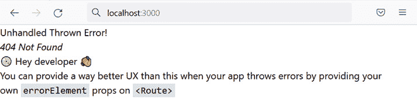

图 6.1 – React Router 的标准错误页面

错误页面来自 React Router。正如错误消息所建议的，我们可以提供自己的错误屏幕，我们将在本章的后面做到这一点。

1.  将浏览器 URL 更改为 `http://localhost:3000/products`。

你将看到产品列表页面组件按以下方式渲染：

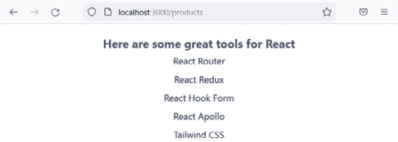

图 6.2 – 产品列表页面

这确认了 `products` 路由运行良好。在我们回顾并进入下一节之前，保持应用运行。

在本节中，我们回顾一下我们学到了什么：

+   在 Web 应用程序中，React Router 使用 `createBrowserRouter` 定义路由。

+   每个路由都有一个路径和一个组件，当浏览器的 URL 与该路径匹配时，将渲染该组件。

+   从 `createBrowserRouter` 返回的路由器被传递给一个 `RouterProvider` 组件，该组件应放置在组件树的高层。

关于 `createBrowserRouter` 的更多信息，请参阅 React Router 文档中的以下链接：[`reactrouter.com/en/main/routers/create-browser-router`](https://reactrouter.com/en/main/routers/create-browser-router)。关于 `RouterProvider` 的更多信息，请参阅 React Router 文档中的以下链接：[`reactrouter.com/en/main/routers/router-provider`](https://reactrouter.com/en/main/routers/router-provider)。

接下来，我们将学习关于可以执行导航的 React Router 组件。

# 创建导航

React Router 附带名为 `Link` 和 `NavLink` 的组件，它们提供导航。在本节中，我们将在应用程序顶部创建一个包含 React Router 的 `Link` 组件的导航栏。然后我们将用 `NavLink` 组件替换 `Link`，并了解两个组件之间的区别。

## 使用 Link 组件

执行以下步骤以创建包含 React Router 的 `Link` 组件的应用程序头部：

1.  首先，在 `src` 文件夹中创建一个名为 `Header.tsx` 的应用程序头部文件，包含以下 `import` 语句：

    ```js
    import { Link } from 'react-router-dom';
    ```

    ```js
    import logo from './logo.svg';
    ```

我们已从 React Router 中导入了 `Link` 组件。

我们还导入了 React 标志，因为我们将在应用程序头部包含导航选项。

1.  创建 `Header` 组件如下所示：

    ```js
    export function Header() {
    ```

    ```js
      return (
    ```

    ```js
        <header className="text-center text-slate-50       bg-slate-900 h-40 p-5">
    ```

    ```js
          
    ```

    ```js
          <h1 className="text-2xl">React Tools</h1>
    ```

    ```js
          <nav></nav>
    ```

    ```js
        </header>
    ```

    ```js
      );
    ```

    ```js
    }
    ```

该组件包含一个包含 React 标志、应用程序标题和一个空 `nav` 元素的 `header` 元素。我们使用了 Tailwind 类来使头部灰色，并将标志和标题水平居中。

1.  现在，在 `nav` 元素内部创建一个链接：

    ```js
    <nav>
    ```

    ```js
      <Link
    ```

    ```js
        to="products"
    ```

    ```js
        className="text-white no-underline p-1"
    ```

    ```js
      >
    ```

    ```js
        Products
    ```

    ```js
      </Link>
    ```

    ```js
    </nav>
    ```

`Link` 组件有一个 `to` 属性，它定义了要导航到的路径。要显示的文本可以在 `Link` 内容中指定。

1.  打开 `Routes.tsx` 并为刚刚创建的 `Header` 组件添加一个导入语句：

    ```js
    import { Header } from './Header';
    ```

1.  在 `router` 定义中，添加一个渲染 `Header` 组件的根路径，如下所示：

    ```js
    const router = createBrowserRouter([
    ```

    ```js
      {
    ```

    ```js
        path: '/',
    ```

    ```js
        element: <Header />,
    ```

    ```js
      },
    ```

    ```js
      {
    ```

    ```js
        path: 'products',
    ```

    ```js
        element: <ProductsPage />,
    ```

    ```js
      },
    ```

    ```js
    ]);
    ```

我们刚刚所做的不太理想，因为 `Header` 组件需要在所有路由上显示，而不仅仅是根路由。然而，它将允许我们探索 React Router 的 `Link` 组件。我们将在 *使用嵌套* *路由* 部分中整理这个问题。

1.  在运行中的应用程序中，将浏览器地址更改为应用程序的根目录。新的应用程序头部出现，包含 **产品** 链接：


图 6.3 – 应用程序头部

1.  现在，使用浏览器的 DevTools 检查应用程序头部元素：

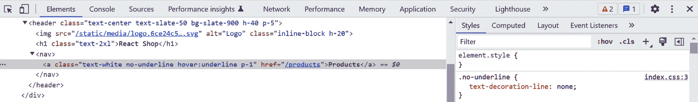

图 6.4 – 头部组件检查

我们可以看到 `Link` 组件被渲染为一个 HTML 锚元素。

1.  在 DevTools 中选择 **网络** 选项卡并清除任何显示的现有请求。点击应用头部中的 **产品** 链接。浏览器将导航到产品列表页面。

注意，没有为产品列表页面发起网络请求。这是因为 React Router 使用客户端导航覆盖了锚元素的默认行为：

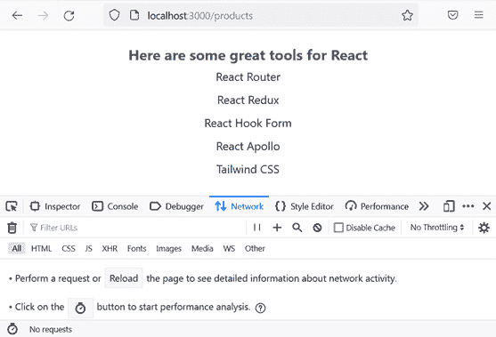

图 6.5 – 客户端导航

最后，请注意，在产品列表页面上应用头部消失了，这不是我们想要的效果。我们将在 *使用嵌套* *路由* 部分解决这个问题。

在我们进入下一个部分之前，保持应用运行。

导航工作得很好，但如果在产品列表页面活动时，**产品**链接有不同的样式会更好。我们将在下一个改进中实现这一点。

## 使用 NavLink 组件

React Router 的 `NavLink` 类似于 `Link` 元素，但允许它在活动时以不同的方式样式化。这对于导航栏来说非常方便。

执行以下步骤以在应用头部将 `Link` 替换为 `NavLink`：

1.  打开 `Header.tsx` 并将 `Link` 引用更改为 `NavLink`：

    ```js
    import { NavLink } from 'react-router-dom';
    ```

    ```js
    ...
    ```

    ```js
    export function Header() {
    ```

    ```js
      return (
    ```

    ```js
        <header ...>
    ```

    ```js
          ...
    ```

    ```js
          <nav>
    ```

    ```js
            <NavLink
    ```

    ```js
              to="products"
    ```

    ```js
              className="..."
    ```

    ```js
            >
    ```

    ```js
              Products
    ```

    ```js
            </NavLink>
    ```

    ```js
          </nav>
    ```

    ```js
        </header>
    ```

    ```js
      );
    ```

    ```js
    }
    ```

目前，应用头部看起来和表现完全相同。

1.  `NavLink` 组件上的 `className` 属性接受一个函数，可以根据页面是否处于活动状态有条件地样式化它。将 `className` 属性更新为以下内容：

    ```js
    <NavLink
    ```

    ```js
      to="products"
    ```

    ```js
      className={({ isActive }) =>
    ```

    ```js
        `text-white no-underline p-1 pb-0.5 border-solid        border-b-2 ${
    ```

    ```js
          isActive ? "border-white" : "border-transparent"
    ```

    ```js
        }`
    ```

    ```js
      }
    ```

    ```js
    >
    ```

    ```js
      Products
    ```

    ```js
    </NavLink>
    ```

该函数接受一个参数 `isActive`，用于定义链接的页面是否处于活动状态。如果链接处于活动状态，我们已为其添加了底部边框。

我们目前还看不到这个更改的影响，因为 **产品** 链接还没有出现在产品列表页面上。我们将在下一个部分解决这个问题。

这样就完成了应用头部以及我们对 `NavLink` 组件的探索。

总结一下，`NavLink` 在我们想要突出显示活动链接时非常适合用于主应用导航，而 `Link` 则非常适合我们应用中的其他所有链接。

有关 `Link` 组件的更多信息，请参阅以下链接：[`reactrouter.com/en/main/components/link`](https://reactrouter.com/en/main/components/link)。有关 `NavLink` 组件的更多信息，请参阅以下链接：[`reactrouter.com/en/main/components/nav-link`](https://reactrouter.com/en/main/components/nav-link)。

接下来，我们将学习嵌套路由。

# 使用嵌套路由

在本节中，我们将介绍 **嵌套路由** 以及它们有用的场景，然后在我们的应用中使用嵌套路由。嵌套路由还将解决我们在前几节中遇到的应用头部消失的问题。

## 理解嵌套路由

嵌套路由允许路由的一部分渲染组件。例如，以下模拟通常使用嵌套路由实现：

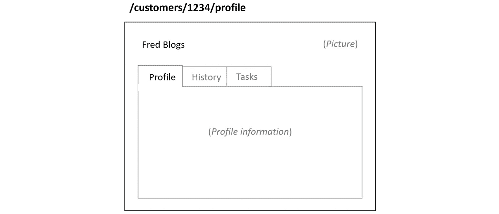

图 6.6 – 嵌套路由的使用案例

模拟显示有关客户的信息。路径确定活动标签页 – 在模拟中，`/customers/1234/history`。

一个`Customer`组件可以渲染这个屏幕的壳体，包括客户的姓名、图片和标签页标题。渲染标签页内容的组件可以与`Customer`组件解耦，并与路径耦合。

这个特性被称为*嵌套路由*，因为`Route`组件嵌套在彼此内部。以下是模拟路由的示例：

```js
const router = createBrowserRouter([
  {
    path: 'customer/:id',
    element: <Customer />,
    children: [
      {
        path: 'profile',
        element: <CustomerProfile />,
      },
      {
        path: 'history',
        element: <CustomerHistory />,
      },
      {
        path: 'tasks',
        element: <CustomerTasks />,
      },
    ],
  },
]);
```

这种定义路由的嵌套方法使得它们易于阅读和理解，正如您在前面的代码片段中所看到的。

嵌套路由的一个关键部分是子组件在父组件中的渲染位置。在前面的代码片段中，`CustomerProfile`组件将在`Customer`组件中渲染在哪里？解决方案是 React Router 的`Outlet`组件。以下是从模拟中`Customer`组件的`Outlet`组件示例：

```js
export function Customer() {
  ...
  return (
    <div>
      <Name ... />
      <Picture ... />
      <nav>
        <NavLink to="profile" ... >Profile</NavLink>
        <NavLink to="history" ... >History</NavLink>
        <NavLink to="tasks" ... >Tasks</NavLink>
      </nav>
      <Outlet />
    </div>
  );
}
```

因此，在这个例子中，`CustomerProfile`组件将在`Customer`组件的导航选项之后渲染。请注意，`Customer`组件与嵌套内容解耦。这意味着可以在不更改`Customer`组件的情况下向客户页面添加新标签页。这是嵌套路由的另一个好处。

接下来，我们将在我们的应用中使用嵌套路由。

## 在应用中使用嵌套路由

在我们的应用中，我们将使用`App`组件作为应用的壳体，它渲染根路径。然后我们将产品列表页面嵌套在这个组件中：

1.  打开`App.tsx`，将所有现有内容替换为以下内容：

    ```js
    import { Outlet } from 'react-router-dom';
    ```

    ```js
    import { Header } from './Header';
    ```

    ```js
    export default function App() {
    ```

    ```js
      return (
    ```

    ```js
        <>
    ```

    ```js
          <Header />
    ```

    ```js
          <Outlet />
    ```

    ```js
        </>
    ```

    ```js
      );
    ```

    ```js
    }
    ```

该组件渲染应用头部，并在其下方渲染嵌套内容。

注意

空的 JSX 元素`<>`和`</>`是**React 片段**。React 片段不会添加到 DOM 中，并且作为 React 组件只能返回单个元素的解决方案，因此它们是在 React 组件中返回多个元素的一种方式，同时保持 React 的愉悦。

1.  打开`Routes.tsx`，导入我们刚刚修改的`App`组件，并移除对`Header`组件的`import`：

    ```js
    import {
    ```

    ```js
      createBrowserRouter,
    ```

    ```js
      RouterProvider,
    ```

    ```js
    } from 'react-router-dom';
    ```

    ```js
    import { ProductsPage } from './pages/ProductsPage5';
    ```

    ```js
    import App from './App';
    ```

1.  更新`router`定义如下：

    ```js
    const router = createBrowserRouter([
    ```

    ```js
      {
    ```

    ```js
        path: '/',
    ```

    ```js
        element: <App />,
    ```

    ```js
        children: [
    ```

    ```js
          {
    ```

    ```js
            path: 'products',
    ```

    ```js
            element: <ProductsPage />,
    ```

    ```js
          }
    ```

    ```js
        ]
    ```

    ```js
      }
    ```

    ```js
    ]);
    ```

产品列表页面现在嵌套在`App`组件内部。

1.  如果您回到运行中的应用，您将看到应用头部现在出现在产品列表页面上。您还会看到下划线的**产品**链接，因为它是一个活动链接：


图 6.7 – 产品列表页面的应用头部

总结一下，嵌套路由允许为不同的路径段渲染组件。`Outlet`组件用于在父组件内渲染嵌套内容。

更多关于`Outlet`组件的信息，请参阅以下链接：[`reactrouter.com/en/main/components/outlet`](https://reactrouter.com/en/main/components/outlet)。

接下来，我们将学习路由参数。

# 使用路由参数

在本节中，我们将了解**路由参数**及其在应用中使用路由参数之前如何有用。

## 理解路由参数

路由参数是路径中的一个可变段。变量段的值对组件可用，以便它们可以条件性地渲染某些内容。

在以下路径中，`1234` 是一个客户的 ID：`/customers/1234/`。

这可以如下定义为一个路由参数：

```js
{ path: '/customer/:id', element: <Customer /> }
```

一个冒号 (`:`) 后跟一个名称定义了一个路由参数。选择一个有意义的参数名称取决于我们，所以路径中的 `:id` 段是前面路由中的路由参数定义。

可以在路径中使用多个路由参数，如下所示：

```js
{
  path: '/customer/:customerId/tasks/:taskId',
  element: <CustomerTask />,
}
```

路由参数名称显然必须在路径中是唯一的。

路由参数通过 React Router 的 `useParams` 钩子对组件可用。以下代码片段是一个示例，说明了如何获取 `customerId` 和 `taskId` 路由参数的值：

```js
const params = useParams<Params>();
console.log('Customer id', params.customerId);
console.log('Task id', params.taskId);
```

从代码片段中我们可以看到，`useParams` 有一个泛型参数，它定义了参数的类型。前面代码片段的 `type` 定义如下：

```js
type Params = {
  customerId: string;
  taskId: string;
};
```

需要注意的是，路由参数的值始终是字符串，因为它们是从路径中提取的，而路径是字符串。

现在我们已经了解了路由参数，我们将在我们的应用中使用一个路由参数。

## 在应用中使用路由参数

我们将在我们的应用中添加一个产品页面来显示每个产品的描述和价格。页面的路径将包含一个用于产品 ID 的路由参数。执行以下步骤以实现产品页面：

1.  我们将首先创建产品页面。在 `src/pages` 文件夹中，创建一个名为 `ProductPage.tsx` 的文件，并包含以下 `import` 语句：

    ```js
    import { useParams } from 'react-router-dom';
    ```

    ```js
    import { products } from '../data/products';
    ```

我们已从 React Router 中导入了 `useParams` 钩子，这将允许我们获取 `id` 路由参数的值——即产品的 ID。我们还导入了 `products` 数组。

1.  按照以下方式开始创建 `ProductPage` 组件：

    ```js
    type Params = {
    ```

    ```js
      id: string;
    ```

    ```js
    };
    ```

    ```js
    export function ProductPage() {
    ```

    ```js
      const params = useParams<Params>();
    ```

    ```js
      const id =
    ```

    ```js
        params.id === undefined ? undefined :       parseInt(params.id);
    ```

    ```js
    }
    ```

我们使用 `useParams` 钩子获取 `id` 路由参数，如果它有值，则将其转换为整数。

1.  现在，添加一个变量，将其分配给具有路由参数中 ID 的产品：

    ```js
    export function ProductPage() {
    ```

    ```js
      const params = useParams<Params>();
    ```

    ```js
      const id =
    ```

    ```js
        params.id === undefined ? undefined :       parseInt(params.id);
    ```

    ```js
      const product = products.find(
    ```

    ```js
        (product) => product.id === id
    ```

    ```js
      );
    ```

    ```js
    }
    ```

1.  在 JSX 中从 `product` 变量返回产品信息：

    ```js
    export function ProductPage() {
    ```

    ```js
      ...
    ```

    ```js
      return (
    ```

    ```js
        <div className="text-center p-5 text-xl">
    ```

    ```js
          {product === undefined ? (
    ```

    ```js
            <h1 className="text-xl text-slate-900">
    ```

    ```js
              Unknown product
    ```

    ```js
            </h1>
    ```

    ```js
          ) : (
    ```

    ```js
            <>
    ```

    ```js
              <h1 className="text-xl text-slate-900">
    ```

    ```js
                {product.name}
    ```

    ```js
              </h1>
    ```

    ```js
              <p className="text-base text-slate-800">
    ```

    ```js
                {product.description}
    ```

    ```js
              </p>
    ```

    ```js
              <p className="text-base text-slate-800">
    ```

    ```js
                {new Intl.NumberFormat('en-US', {
    ```

    ```js
                  currency: 'USD',
    ```

    ```js
                  style: 'currency',
    ```

    ```js
                }).format(product.price)}
    ```

    ```js
              </p>
    ```

    ```js
            </>
    ```

    ```js
          )}
    ```

    ```js
        </div>
    ```

    ```js
      );
    ```

    ```js
    }
    ```

如果找不到产品，将返回 `Unknown product`。如果找到产品，将返回其名称、描述和价格。我们使用 JavaScript 的 `Intl.NumberFormat` 函数来格式化价格。

这样就完成了产品页面的创建。

1.  下一个任务是添加产品页面的路由。打开 `Routes.tsx` 并为产品页面添加一个 `import` 语句：

    ```js
    import { ProductPage } from './pages/ProductPage';
    ```

1.  为产品页面添加以下突出显示的路由：

    ```js
    const router = createBrowserRouter([
    ```

    ```js
      {
    ```

    ```js
        path: '/',
    ```

    ```js
        element: <App />,
    ```

    ```js
        children: [
    ```

    ```js
          {
    ```

    ```js
            path: 'products',
    ```

    ```js
            element: <ProductsPage />,
    ```

    ```js
          },
    ```

    ```js
          {
    ```

    ```js
            path: 'products/:id',
    ```

    ```js
            element: <ProductPage />,
    ```

    ```js
          }
    ```

    ```js
        ]
    ```

    ```js
      }
    ```

    ```js
    ]);
    ```

因此，`/products/2` 路径应该返回一个 React Redux 的产品页面。

1.  在运行的应用中，将浏览器 URL 更改为 [`localhost:3000/products/2`](http://localhost:3000/products/2)。React Redux 产品应该显示出来：

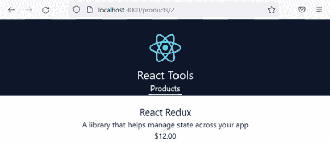

图 6.8 – 产品页面

1.  本节的最后一个任务是将在产品列表页面上的产品列表转换为打开相关产品页面的链接。打开 `ProductsPage.tsx` 并从 React Router 中导入 `Link` 组件：

    ```js
    import { Link } from 'react-router-dom';
    ```

1.  在 JSX 中的产品名称周围添加一个 `Link` 组件：

    ```js
    <ul className="list-none m-0 p-0">
    ```

    ```js
      {products.map((product) => (
    ```

    ```js
        <li key={product.id}>
    ```

    ```js
          <Link
    ```

    ```js
            to={`${product.id}`}
    ```

    ```js
            className="p-1 text-base text-slate-800           hover:underline"
    ```

    ```js
          >
    ```

    ```js
            {product.name}
    ```

    ```js
          </Link>
    ```

    ```js
        </li>
    ```

    ```js
      ))}
    ```

    ```js
    </ul>
    ```

链接路径相对于组件的路径。鉴于组件路径是 `/products`，我们将链接路径设置为产品 ID，它应该与 `product` 路由匹配。

1.  返回正在运行的应用程序并转到产品列表页面。将鼠标悬停在产品上，你现在会看到它们是链接：

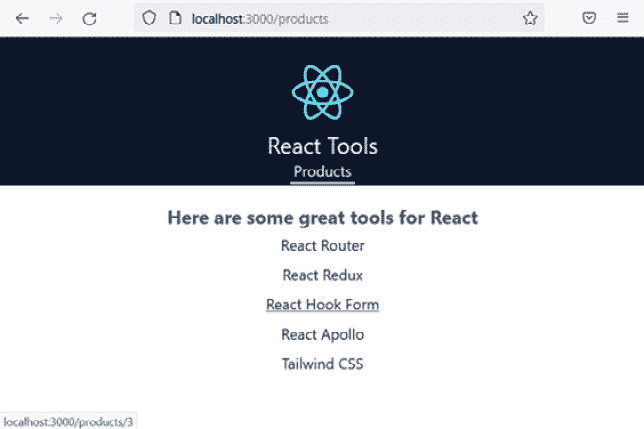

图 6.9 – 产品列表链接

1.  点击其中一个产品，将显示相关产品页面。

这完成了关于路由参数的这一部分。以下是一个快速回顾：

+   路由参数是在路径中定义的可变段，使用冒号后跟参数名称表示

+   可以使用 React Router 的 `useParams` 钩子访问路由参数

关于 `useParams` 钩子的更多信息，请参阅 React Router 文档中的以下链接：[`reactrouter.com/en/main/hooks/use-params`](https://reactrouter.com/en/main/hooks/use-params)。

记得我们在*声明路由*部分遇到的 React Router 的错误页面吗？接下来，我们将学习如何自定义该错误页面。

# 创建错误页面

在本节中，我们将了解 React Router 中的错误页面是如何工作的，然后再在我们的应用程序中实现一个。

## 理解错误页面

目前，当发生错误时，会显示一个 React Router 内置的错误页面。我们可以通过在运行的应用程序中输入一个无效路径来检查这一点：

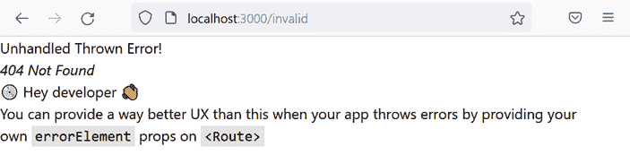

图 6.10 – 标准的 React Router 错误页面

由于在路由器中找不到匹配的路由，因此引发了一个错误。错误页面上的 *404 未找到* 消息证实了这一点。

这个标准的错误页面并不理想，因为信息是针对开发者而不是真实用户。此外，应用头部没有显示，因此用户无法轻松导航到确实存在的页面。

正如错误消息所暗示的，可以在路由上使用 `errorElement` 属性来覆盖标准错误页面。以下是一个为客户的路由定义的自定义错误页面的示例；如果此路由上发生任何错误，将渲染 `CustomersErrorPage` 组件：

```js
const router = createBrowserRouter([
  ...,
  {
    path: 'customers',
    element: <CustomersPage />,
    errorElement: <CustomersErrorPage />
  },
  ...
]);
```

现在我们已经开始了解 React Router 中的错误页面，我们将在我们的应用程序中实现一个。

## 添加错误页面

执行以下步骤以在应用程序中创建一个错误页面：

1.  首先，在 `src/pages` 文件夹中创建一个名为 `ErrorPage.tsx` 的新页面，内容如下：

    ```js
    import { Header } from '../Header';
    ```

    ```js
    export function ErrorPage() {
    ```

    ```js
      return (
    ```

    ```js
        <>
    ```

    ```js
          <Header />
    ```

    ```js
          <div className="text-center p-5 text-xl">
    ```

    ```js
            <h1 className="text-xl text-slate-900">
    ```

    ```js
              Sorry, an error has occurred
    ```

    ```js
            </h1>
    ```

    ```js
          </div>
    ```

    ```js
        </>
    ```

    ```js
      );
    ```

    ```js
    }
    ```

该组件简单地返回应用头部，并在下面显示一个 *抱歉，发生了错误* 的消息。

1.  打开 `Routes.tsx` 并为错误页面添加一个 `import` 语句：

    ```js
    import { ErrorPage } from './pages/ErrorPage';
    ```

1.  按如下方式在根路由上指定错误页面：

    ```js
    const router = createBrowserRouter([
    ```

    ```js
      {
    ```

    ```js
        path: '/',
    ```

    ```js
        element: <App />,
    ```

    ```js
        errorElement: <ErrorPage />,
    ```

    ```js
        children: ...
    ```

    ```js
      },
    ```

    ```js
    ]);
    ```

在根路由上指定错误页面意味着如果有任何路由有错误，它将会显示。

1.  切换回运行中的应用，并将浏览器 URL 更改为 [`localhost:3000/invalid`](http://localhost:3000/invalid)。将显示错误页面：

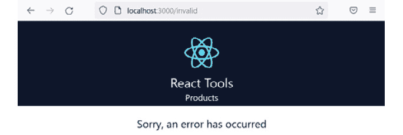

图 6.11 – 错误页面

1.  这是一个好的开始，但我们可以通过提供用户更多从 React Router 的 `useRouteError` 钩子中获取的信息来改进它。再次打开 `ErrorPage.tsx` 并添加 `useRouteError` 的 `import` 语句：

    ```js
    import { useRouteError } from 'react-router-dom';
    ```

1.  在组件的 `return` 语句之前使用 `useRouteError` 将错误分配给 `error` 变量：

    ```js
    export function ErrorPage() {
    ```

    ```js
      const error = useRouteError();
    ```

    ```js
      return ...
    ```

    ```js
    }
    ```

1.  `error` 变量是 `unknown` 类型 – 你可以通过悬停在其上验证这一点。我们可以使用类型谓词函数来允许 TypeScript 将其缩小到我们可以处理的内容。在组件下方添加以下类型谓词函数：

    ```js
    function isError(error: any): error is { statusText: string } {
    ```

    ```js
      return "statusText" in error;
    ```

    ```js
    }
    ```

该函数检查错误对象是否有 `statusText` 属性，如果有，则给它赋予具有此属性的类型。

1.  我们现在可以使用这个函数来渲染 `statusText` 属性中的信息：

    ```js
    return (
    ```

    ```js
      <>
    ```

    ```js
        <Header />
    ```

    ```js
        <div className="text-center p-5 text-xl">
    ```

    ```js
          <h1 className="text-xl text-slate-900">
    ```

    ```js
            Sorry, an error has occurred
    ```

    ```js
          </h1>
    ```

    ```js
          {isError(error) && (
    ```

    ```js
            <p className="text-base text-slate-700">
    ```

    ```js
              {error.statusText}
    ```

    ```js
            </p>
    ```

    ```js
          )}
    ```

    ```js
        </div>
    ```

    ```js
      </>
    ```

    ```js
    );
    ```

1.  在运行中的应用中，错误信息以无效路径的形式显示在错误页面上：

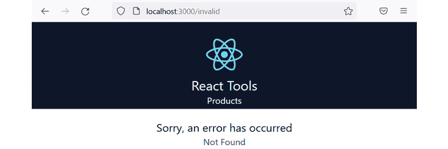


这就完成了关于错误页面的本节内容。关键点是使用路由上的 `errorElement` 属性来捕获和显示错误。可以通过 `useRouteError` 钩子获取特定的错误信息。

更多关于 `errorElement` 的信息，请参阅以下链接：[`reactrouter.com/en/main/route/error-element`](https://reactrouter.com/en/main/route/error-element)。更多关于 `useRouteError` 钩子的信息，请参阅以下链接：[`reactrouter.com/en/main/hooks/use-route-error`](https://reactrouter.com/en/main/hooks/use-route-error)。

接下来，我们将学习关于索引路由的内容。

# 使用索引路由

目前，应用的根路径除了标题外不显示任何内容。在本节中，我们将学习索引路由，以便在根路径上显示一个友好的欢迎信息。

## 理解索引路由

一个 `index` 布尔属性，如下例所示：

```js
{
  path: "/",
  element: <App />,
  children: [
    {
      index: true,
      element: <HomePage />,
    },
    ...,
  ]
}
```

接下来，我们将使用索引路由在我们的应用中添加一个首页。

## 在应用中使用索引路由

执行以下步骤，在我们的应用中使用索引路由添加一个首页：

1.  在 `src/pages` 文件夹中创建一个名为 `HomePage.tsx` 的新文件，内容如下：

    ```js
    export function HomePage() {
    ```

    ```js
      return (
    ```

    ```js
        <div className="text-center p-5 text-xl">
    ```

    ```js
          <h1 className="text-xl text-slate-900">Welcome to         React Tools!</h1>
    ```

    ```js
        </div>
    ```

    ```js
      );
    ```

    ```js
    }
    ```

页面显示一个欢迎信息。

1.  打开 `Routes.tsx` 并导入我们刚刚创建的首页：

    ```js
    import { HomePage } from './pages/HomePage';
    ```

1.  按如下方式将首页作为根路径的索引页面添加：

    ```js
    const router = createBrowserRouter([
    ```

    ```js
      {
    ```

    ```js
        path: '/',
    ```

    ```js
        element: <App />,
    ```

    ```js
        errorElement: <ErrorPage />,
    ```

    ```js
        children: [
    ```

    ```js
          {
    ```

    ```js
            index: true,
    ```

    ```js
            element: <HomePage />,
    ```

    ```js
          },
    ```

    ```js
          ...
    ```

    ```js
        ]
    ```

    ```js
      }
    ```

    ```js
    ]);
    ```

1.  我们将在标题中添加到标志和应用程序标题的链接，以便跳转到首页。打开 `Header.tsx` 并从 React Router 导入 `Link` 组件：

    ```js
    import { NavLink, Link } from 'react-router-dom';
    ```

1.  按如下方式将根页面的链接包裹在标志和标题周围：

    ```js
    <header ...>
    ```

    ```js
      <Link to="">
    ```

    ```js
        
    ```

    ```js
      </Link>
    ```

    ```js
      <Link to="">
    ```

    ```js
        <h1 ...>React Tools</h1>
    ```

    ```js
      </Link>
    ```

    ```js
      <nav>
    ```

    ```js
        ...
    ```

    ```js
      </nav>
    ```

    ```js
    </header>
    ```

1.  在运行的应用程序中，点击应用程序标题将转到根页面，您将看到显示的欢迎信息：


图 6.13 – 欢迎页面

这完成了关于索引路由本节的介绍。

回顾一下，索引路由是一个默认子路由，它使用一个 `index` 布尔属性定义。

更多关于索引路由的信息，请参阅以下链接：[`reactrouter.com/en/main/route/route#index`](https://reactrouter.com/en/main/route/route#index)。

接下来，我们将学习搜索参数。

# 使用搜索参数

在本节中，我们将学习 React Router 中的搜索参数，并使用它们在应用程序中实现搜索功能。

## 理解搜索参数

`?` 字符和 `&` 字符分隔。搜索参数有时被称为 `type` 和 `when`，它们是搜索参数：`https://somewhere.com/?type=sometype&when=recent`。

React Router 有一个钩子，它返回用于获取和设置搜索参数的函数，称为 `useSearchParams`：

```js
const [searchParams, setSearchParams] = useSearchParams();
```

`searchParams` 是一个 JavaScript 的 `URLSearchParams` 对象。在 `URLSearchParams` 上有一个 `get` 方法，可以用来获取搜索参数的值。以下示例获取了一个名为 `type` 的搜索参数的值：

```js
const type = searchParams.get('type');
```

`setSearchParams` 是一个用于设置搜索参数值的函数。函数参数是一个对象，如下例所示：

```js
setSearchParams({ type: 'sometype', when: 'recent' });
```

接下来，我们将向我们的应用程序添加搜索功能。

## 向应用程序添加搜索功能

我们将在应用程序的页眉中添加一个搜索框。提交搜索将用户带到产品列表页面，并列出符合搜索条件的产品集合。执行以下步骤：

1.  打开 `Header.tsx` 文件，并将 `useSearchParams` 添加到 React Router 的导入中。同时，添加一个从 React 导入 `FormEvent` 类型的 `import` 语句：

    ```js
    import { FormEvent } from 'react';
    ```

    ```js
    import {
    ```

    ```js
      NavLink,
    ```

    ```js
      Link,
    ```

    ```js
      useSearchParams
    ```

    ```js
    } from 'react-router-dom';
    ```

1.  使用 `useSearchParams` 钩子解构函数以在 `return` 语句之前获取和设置搜索参数：

    ```js
    export function Header() {
    ```

    ```js
      const [searchParams, setSearchParams] = useSearchParams();
    ```

    ```js
      return ...
    ```

    ```js
    }
    ```

1.  在标志上方添加以下搜索表单：

    ```js
    <header ...>
    ```

    ```js
      <form
    ```

    ```js
        className="relative text-right"
    ```

    ```js
        onSubmit={handleSearchSubmit}
    ```

    ```js
      >
    ```

    ```js
        <input
    ```

    ```js
          type="search"
    ```

    ```js
          name="search"
    ```

    ```js
          placeholder="Search"
    ```

    ```js
          defaultValue={searchParams.get('search') ?? ''}
    ```

    ```js
          className="absolute right-0 top-0 rounded py-2 px-3         text-gray-700"
    ```

    ```js
        />
    ```

    ```js
      </form>
    ```

    ```js
      <Link to="">
    ```

    ```js
        
    ```

    ```js
      </Link>
    ```

    ```js
      ...
    ```

    ```js
    </header>
    ```

表单包含一个搜索框，其默认值是 `search` 参数的值。`searchParams.get` 如果参数不存在，则返回 `null`，因此在这种情况下使用 `??` 将搜索框的默认值设置为空字符串。

注意

`??` 运算符如果左操作数是 `null` 或 `undefined`，则返回右操作数；否则，返回左操作数。更多信息，请参阅以下链接：[`developer.mozilla.org/en-US/docs/Web/JavaScript/Reference/Operators/Nullish_coalescing`](https://developer.mozilla.org/en-US/docs/Web/JavaScript/Reference/Operators/Nullish_coalescing)。

表单提交会调用一个 `handleSearchSubmit` 函数，我们将在下一步实现它。

1.  在 `return` 语句上方添加一个 `handleSearchSubmit` 函数，如下所示：

    ```js
    export function Header() {
    ```

    ```js
      const [searchParams, setSearchParams] =     useSearchParams();
    ```

    ```js
      function handleSearchSubmit(e:     FormEvent<HTMLFormElement>) {
    ```

    ```js
        e.preventDefault();
    ```

    ```js
        const formData = new FormData(e.currentTarget);
    ```

    ```js
        const search = formData.get('search') as string;
    ```

    ```js
        setSearchParams({ search });
    ```

    ```js
      }
    ```

    ```js
      return ...
    ```

    ```js
    }
    ```

提交处理程序参数使用 `FormEvent` 类型进行类型化。`FormEvent` 是一个泛型类型，它接受元素的类型，对于表单提交处理程序，这个类型是 `HTMLFormElement`。

我们在提交处理器的参数上使用 `preventDefault` 方法来防止表单被提交到服务器，因为我们在这个函数中处理所有逻辑。

我们使用 JavaScript `FormData` 接口获取搜索字段的值。然后，我们使用类型断言将搜索字段值的类型设置为字符串。

提交处理器的最后一行代码设置了搜索参数的值。这将更新浏览器的 URL 以包含此搜索参数。

注意

我们将在 *第七章* *与表单一起工作* 中学习更多关于 React 中表单的知识。

1.  现在，我们需要根据搜索参数的值过滤产品列表。打开 `ProductsPage.tsx` 并将 `useSearchParams` 添加到 `import` 语句中：

    ```js
    import { Link, useSearchParams } from 'react-router-dom';
    ```

1.  在 `ProductsPage` 组件的顶部，按照以下方式从 `useSearchParams` 中解构 `searchParams`：

    ```js
    export function ProductsPage() {
    ```

    ```js
      const [searchParams] = useSearchParams();
    ```

    ```js
      return ...
    ```

    ```js
    }
    ```

1.  在 `return` 语句之前添加以下函数以通过搜索值过滤产品列表：

    ```js
    const [searchParams] = useSearchParams();
    ```

    ```js
    function getFilteredProducts() {
    ```

    ```js
      const search = searchParams.get('search');
    ```

    ```js
      if (search === null || search === "") {
    ```

    ```js
        return products;
    ```

    ```js
      } else {
    ```

    ```js
        return products.filter(
    ```

    ```js
          (product) =>
    ```

    ```js
            product.name
    ```

    ```js
              .toLowerCase()
    ```

    ```js
              .indexOf(search.toLowerCase()) > -1
    ```

    ```js
        );
    ```

    ```js
      }
    ```

    ```js
    }
    ```

    ```js
    return ...
    ```

函数首先获取 `search` 参数的值。如果没有搜索参数或值为空字符串，则返回完整的产品列表。否则，使用数组的 `filter` 函数过滤产品列表，检查搜索值是否包含在产品名称中，不考虑大小写。

1.  在 JSX 中使用我们刚刚创建的函数来输出过滤后的产品。将 `products` 的引用替换为对 `getFilteredProducts` 的调用，如下所示：

    ```js
    <ul className="list-none m-0 p-0">
    ```

    ```js
      {getFilteredProducts().map((product) => (
    ```

    ```js
        <li
    ```

    ```js
          key={product.id}
    ```

    ```js
          className="p-1 text-base text-slate-800"
    ```

    ```js
        >
    ```

    ```js
          <Link
    ```

    ```js
            to={`${product.id}`}
    ```

    ```js
            className="p-1 text-base text-slate-800           hover:underline"
    ```

    ```js
          >
    ```

    ```js
            {product.name}
    ```

    ```js
          </Link>
    ```

    ```js
        </li>
    ```

    ```js
      ))}
    ```

    ```js
    </ul>
    ```

1.  在运行中的应用程序中，当在主页上时，在搜索框中输入一些搜索条件，然后按 *Enter* 键提交搜索。

搜索参数已添加到浏览器中的 URL。然而，它并没有导航到产品列表页面。不用担心这个问题，因为我们在下一节中会解决这个问题：

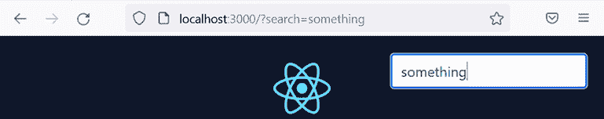

图 6.14 – 添加到 URL 中的搜索参数

本节的关键点是，React Router 的 `useSearchParams` 钩子允许你设置和获取 URL 搜索参数。这些参数也以 JavaScript `URLSearchParams` 对象的结构进行组织。

关于 `useSearchParams` 钩子的更多信息，请参阅 React Router 文档中的以下链接：[`reactrouter.com/en/main/hooks/use-search-params`](https://reactrouter.com/en/main/hooks/use-search-params)。有关 `URLSearchParams` 的更多信息，请参阅 [`developer.mozilla.org/en-US/docs/Web/API/URLSearchParams`](https://developer.mozilla.org/en-US/docs/Web/API/URLSearchParams)。

接下来，我们将探索另一个允许程序化导航的 React Router 钩子。

# 程序化导航

React Router 的 `Link` 和 `NavLink` 组件允许声明式导航。然而，有时我们必须强制导航 – 实际上，这对于我们应用程序中的搜索功能导航到产品列表页面非常有用。在本节中，我们将学习如何使用 React Router 进行编程式导航，并使用它来完成应用程序的搜索功能。执行以下步骤：

1.  打开 `Header.tsx` 并从 React Router 中导入 `useNavigate` 钩子：

    ```js
    import {
    ```

    ```js
      NavLink,
    ```

    ```js
      Link,
    ```

    ```js
      useSearchParams,
    ```

    ```js
      useNavigate
    ```

    ```js
    } from 'react-router-dom';
    ```

`useNavigate` 钩子返回一个我们可以用来执行编程式导航的函数。

1.  在调用 `useSearchParams` 钩子之后调用 `useNavigate`。将结果分配给名为 `navigate` 的变量：

    ```js
    export function Header() {
    ```

    ```js
      const [searchParams, setSearchParams] =     useSearchParams();
    ```

    ```js
      const navigate = useNavigate();
    ```

    ```js
      ...
    ```

    ```js
    }
    ```

`navigate` 变量是一个可以用于导航的函数。它接受一个参数，用于指定要导航到的路径。

1.  在 `handleSearchSubmit` 中，将 `setSearchParams` 调用替换为 `navigate` 调用，以便使用相关搜索参数跳转到产品列表页面：

    ```js
    function handleSearchSubmit(e: FormEvent<HTMLFormElement>) {
    ```

    ```js
      e.preventDefault();
    ```

    ```js
      const formData = new FormData(e.currentTarget);
    ```

    ```js
      const search = formData.get('search') as string;
    ```

    ```js
      navigate(`/products/?search=${search}`);
    ```

    ```js
    }
    ```

1.  我们不再需要 `setSearchParams`，因为搜索参数的设置已包含在导航路径中，因此从 `useSearchParams` 调用中删除此部分：

    ```js
    const [searchParams] = useSearchParams();
    ```

1.  在运行的应用程序中，在搜索框中输入一些搜索条件，然后按 *Enter* 键提交搜索。

搜索参数用于跳转到产品列表页面。当产品列表页面出现时，将显示正确筛选的产品：

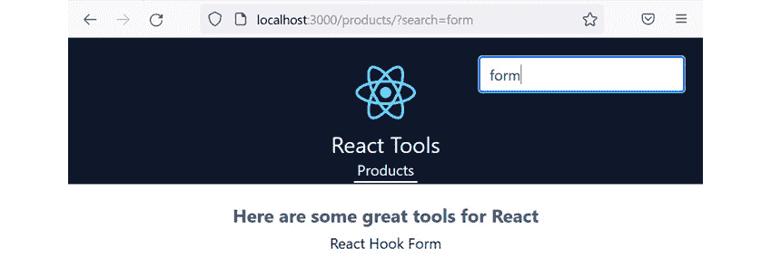

图 6.15 – 带筛选产品的产品列表页面

因此，编程式导航是通过使用 `useNavigate` 钩子实现的。这返回一个函数，可以导航到传递给它的路径。

关于 `useNavigate` 钩子的更多信息，请参阅 React Router 文档中的以下链接：[`reactrouter.com/en/main/hooks/use-navigate`](https://reactrouter.com/en/main/hooks/use-navigate)。

接下来，我们将重构搜索表单的导航，以使用 React Router 的 `Form` 组件。

# 使用表单导航

在本节中，我们将使用 React Router 的 `Form` 组件在提交搜索条件时导航到产品列表页面。`Form` 是 HTML `form` 元素的包装器，它处理客户端的表单提交。这将取代 `useNavigate` 的使用并简化代码。执行以下步骤：

1.  在 `Header.tsx` 中，首先从 React Router 的 `import` 中删除 `useNavigate`，并用 `Form` 组件替换它：

    ```js
    import {
    ```

    ```js
      NavLink,
    ```

    ```js
      Link,
    ```

    ```js
      useSearchParams,
    ```

    ```js
      Form
    ```

    ```js
    } from 'react-router-dom';
    ```

1.  在 JSX 中，将 `form` 元素替换为 React Router 的 `Form` 组件：

    ```js
    <Form
    ```

    ```js
      className="relative text-right"
    ```

    ```js
      onSubmit={handleSearchSubmit}
    ```

    ```js
    >
    ```

    ```js
      <input ... />
    ```

    ```js
    </Form>
    ```

1.  在 JSX 中的 `Form` 元素中，删除 `onSubmit` 处理程序。用以下 `action` 属性替换，以便将表单发送到 `products` 路由：

    ```js
    <Form
    ```

    ```js
      className="relative text-right"
    ```

    ```js
      action="/products"
    ```

    ```js
    >
    ```

    ```js
      ...
    ```

    ```js
    </Form>
    ```

React Router 的表单提交模仿了原生 `form` 元素提交到服务器路径的方式。然而，React Router 将表单提交到客户端路由。此外，`Form` 默认模仿 HTTP `GET` 请求，因此 URL 将自动添加 `search` 参数。

1.  剩余的任务是删除以下代码：

    +   删除 React 导入语句，因为`FormEvent`现在是多余的

    +   删除对`useNavigate`的调用，因为现在不再需要它了

    +   删除`handleSearchSubmit`函数，因为现在不再需要它了

1.  在运行中的应用中，在搜索框中输入一些搜索条件，然后按*Enter*键提交搜索。这将像之前一样工作。

这大大简化了代码！

我们将在*第七章*和*第九章*中学习更多关于 React Router 的`Form`组件。本节的关键要点是`Form`包装了 HTML 的`form`元素，并在客户端处理表单提交。

关于`Form`的更多信息，请参阅 React Router 文档中的以下链接：[`reactrouter.com/en/main/components/form`](https://reactrouter.com/en/main/components/form)。

接下来，我们将学习一种可以应用于应用中大型页面的性能优化类型。

# 实现懒加载

目前，我们应用中的所有 JavaScript 代码都是在应用首次加载时一起加载的。这在大型应用中可能会出现问题。在本节中，我们将学习如何在组件的路由变为活动状态时才加载其 JavaScript 代码。这种模式通常被称为**懒加载**。在我们的应用中，我们将创建一个懒加载的管理员页面。

## 理解 React 懒加载

默认情况下，所有 React 组件都会被打包在一起，并在应用首次加载时一起加载。这对大型应用来说效率不高——尤其是当用户不使用很多组件时。懒加载 React 组件解决了这个问题，因为懒加载组件不包括在初始加载的包中；相反，它们的 JavaScript 代码在渲染时才会被获取和加载。

懒加载 React 组件主要有两个步骤。首先，组件必须按照以下方式动态导入：

```js
const LazyPage = lazy(() => import('./LazyPage'));
```

在代码块中，`lazy`是 React 中的一个函数，它使得导入的组件可以懒加载。请注意，懒加载的页面必须是默认导出——懒加载不适用于命名导出。

Webpack 可以将`LazyPage`的 JavaScript 代码分割成单独的包。请注意，这个单独的包将包括`LazyPage`的任何子组件。

第二步是在 React 的`Suspense`组件内部按照以下方式渲染懒加载组件：

```js
<Route
  path="lazy"
  element={
    <Suspense fallback={<div>Loading…</div>}>
      <LazyPage />
    </Suspense>
  }
/>
```

`Suspense`组件的`fallback`属性可以被设置为在懒加载页面正在获取时渲染的元素。

接下来，我们将在我们的应用中创建一个懒加载管理员页面。

## 将懒加载管理员页面添加到应用中

执行以下步骤以将懒加载管理员页面添加到我们的应用中：

1.  在`src/pages`文件夹中创建一个名为`AdminPage.tsx`的文件，并包含以下内容：

    ```js
    export default function AdminPage() {
    ```

    ```js
      return (
    ```

    ```js
        <div classNa"e="text-center p-5 text"xl">
    ```

    ```js
          <h1 classNa"e="text-xl text-slate-"00">Admin         Panel</h1>
    ```

    ```js
          <p classNa"e="text-base text-slate-"00">
    ```

    ```js
            You shou'dn't come here often becaus' I'm lazy
    ```

    ```js
          </p>
    ```

    ```js
        </div>
    ```

    ```js
      );
    ```

    ```js
    }
    ```

该页面非常小，因此它不是懒加载的一个很好的用例。然而，它的简单性将使我们能够专注于如何实现懒加载。

1.  打开`Routes.tsx`并从 React 中导入`lazy`和`Suspense`：

    ```js
    import { lazy, Suspense } fr'm 're'ct';
    ```

1.  按如下方式导入管理员页面（这一点很重要，即它必须出现在所有其他`import`语句之后）：

    ```js
    const AdminPage = lazy(() => impo't('./pages/AdminP'ge'));
    ```

1.  按如下方式添加`admin`路由：

    ```js
    const router = createBrowserRouter([
    ```

    ```js
      {
    ```

    ```js
        pat':''/',
    ```

    ```js
        element: <App />,
    ```

    ```js
        errorElement: <ErrorPage />,
    ```

    ```js
        children: [
    ```

    ```js
          ...,
    ```

    ```js
          {
    ```

    ```js
            pat': 'ad'in',
    ```

    ```js
            element: (
    ```

    ```js
              <Suspense
    ```

    ```js
                fallback={
    ```

    ```js
                  <div classNa"e="text-center p-5 text-xl                 text-slate-"00">
    ```

    ```js
                    Loading...
    ```

    ```js
                  </div>
    ```

    ```js
                }
    ```

    ```js
              >
    ```

    ```js
                <AdminPage />
    ```

    ```js
              </Suspense>
    ```

    ```js
            )
    ```

    ```js
          }
    ```

    ```js
        ]
    ```

    ```js
      }
    ```

    ```js
    ]);
    ```

管理员页面的路径是`/admin`。当管理员页面的 JavaScript 被获取时，将渲染一个加载指示器。

1.  打开`Header.tsx`并在`Products`链接之后添加管理员页面的链接，如下所示：

    ```js
    <nav>
    ```

    ```js
      <NavLink ... >
    ```

    ```js
        Products
    ```

    ```js
      </NavLink>
    ```

    ```js
      <NavLink
    ```

    ```js
        "o="ad"in"
    ```

    ```js
        className={({ isActive }) =>
    ```

    ```js
          `text-white no-underline p-1 pb-0.5 border-solid          border-b-2 ${
    ```

    ```js
            isActive"? "border-wh"te"": "border-transpar"nt"
    ```

    ```js
          }`
    ```

    ```js
        }
    ```

    ```js
      >
    ```

    ```js
        Admin
    ```

    ```js
      </NavLink>
    ```

    ```js
    </nav>
    ```

1.  在跑步应用中，打开浏览器开发者工具并转到**网络**标签，清除任何现有请求。通过从**无** **限制**菜单中选择**慢 3G**来降低连接速度：

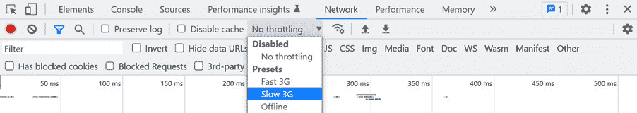

图 6.16 – 设置慢速连接

1.  现在，点击页眉中的**管理员**链接。加载指示器出现，因为管理员页面的 JavaScript 正在下载：


图 6.17 – 加载指示器

在管理员页面下载完成后，它将在浏览器中渲染。如果你查看 DevTools 中的**网络**标签，你会看到管理员页面包正在懒加载的确认信息：

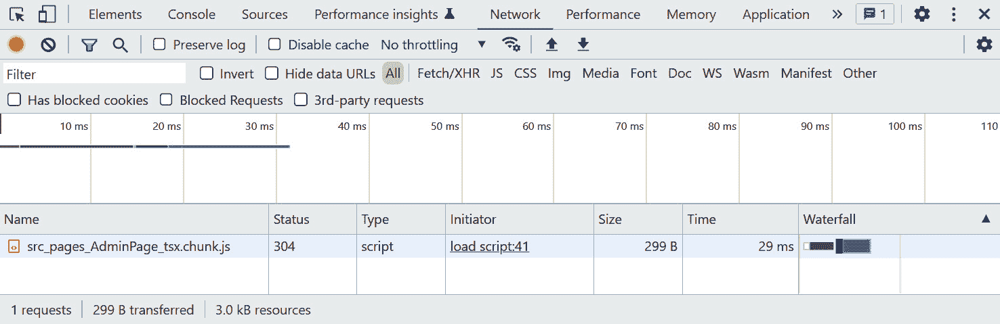

图 6.18 – 管理员页面下载

这完成了关于懒加载 React 组件的部分。总之，通过动态导入组件文件并在`Suspense`组件内渲染组件来实现 React 组件的懒加载。

关于懒加载 React 组件的更多信息，请参阅 React 文档中的以下链接：[`reactjs.org/docs/code-splitting.html`](https://reactjs.org/docs/code-splitting.html)。

这也完成了本章的内容。接下来，我们将回顾我们关于 React Router 所学的知识。

# 摘要

React Router 为我们提供了一套全面的组件和钩子，用于管理我们应用中页面之间的导航。我们使用`createBrowserRouter`来定义我们所有 Web 应用的路线。一个路由包含一个路径和一个组件，当路径与浏览器 URL 匹配时，将渲染该组件。我们使用`errorElement`属性为路由渲染一个自定义错误页面。

我们使用嵌套路由允许`App`组件渲染应用外壳和其中的页面组件。我们在`App`组件内部使用 React Router 的`Outlet`组件来渲染页面内容。我们还使用根路由上的索引路由来渲染欢迎信息。

我们使用 React Router 的`NavLink`组件来渲染导航链接，当它们的路由处于活动状态时会被突出显示。`Link`组件非常适合具有静态样式要求的其他链接 – 我们将其用于产品列表上的产品链接。我们使用 React Router 的`Form`组件在提交搜索表单时导航到产品列表页面。

路由参数和查询参数允许将参数传递到组件中，以便它们可以渲染动态内容。`useParams`提供了访问路由参数的权限，而`useSearchParams`提供了访问查询参数的权限。

React 组件可以懒加载以提高启动性能。这是通过动态导入组件文件并在 `Suspense` 组件内部渲染组件来实现的。

在下一章中，我们将学习所有关于 React 中的表单知识。

# 问题

让我们通过以下问题来测试我们对 React Router 的知识：

1.  我们在应用中声明了以下路由：

    ```js
    const router = createBrowserRouter([
    ```

    ```js
      {
    ```

    ```js
        path: "/",
    ```

    ```js
        element: <App />,
    ```

    ```js
        errorElement: <ErrorPage />,
    ```

    ```js
        children: [
    ```

    ```js
          { path: "customers", element: <CustomersPage /> }
    ```

    ```js
        ]
    ```

    ```js
      }
    ```

    ```js
    ]);
    ```

当路径是 `/customers` 时，哪个组件将会渲染？

当路径是 `/products` 时，哪个组件将会渲染？

1.  在一个可以处理 `/customers/37` 路径的路由中，路径会是什么？`37` 是一个客户 ID，可能会变化。

1.  一个 `settings` 页面的路由如下定义：

    ```js
    {
    ```

    ```js
      path: "/settings",
    ```

    ```js
      element: <SettingsPage />,
    ```

    ```js
      children: [
    ```

    ```js
        { path: "general", element: <GeneralSettingsTab /> },
    ```

    ```js
        { path: "dangerous", element: <DangerousSettingsTab       /> }
    ```

    ```js
      ]
    ```

    ```js
    }
    ```

设置页面有 `/settings/general` 和 `/settings/dangerous`，分别。然而，当请求这些路径时，设置页面没有显示任何标签内容——那么，我们在 `SettingsPage` 组件中可能遗漏了什么？

1.  我们正在实现一个应用中的导航栏。当点击导航项时，应用应该导航到相关页面。我们应该使用哪个 React Router 组件来渲染导航项？`Link` 还是 `NavLink`？

1.  路由如下定义：

    ```js
    { path: "/user/:userId", element: <UserPage /> }
    ```

在 `UserPage` 组件内部，以下代码用于从浏览器 URL 获取用户 `id` 信息：

```js
const params = useParams<{id: string}>();
const id = params.id;
```

然而，`id` 总是 `undefined`。问题是什么？

1.  以下 URL 包含一个在 `customers` 页面上的搜索参数示例：

`/``customers/?search=cool company`

然而，以下实现中出现了错误：

```js
function getFilteredCustomers() {
  const criteria = useSearchParams.get('search');
  if (criteria === null || criteria === "") {
    return customers;
  } else {
    return customers.filter(
      (customer) =>
        customer.name.toLowerCase().indexOf(criteria.          toLowerCase()) > -1
    );
  }
}
```

问题是什么？

1.  一个 React 组件如下所示进行懒加载：

    ```js
    const SpecialPage = lazy(() => import('./pages/SpecialPage'));
    ```

    ```js
    const router = createBrowserRouter([
    ```

    ```js
      ...,
    ```

    ```js
      {
    ```

    ```js
        path: '/special',
    ```

    ```js
        element: <SpecialPage />,
    ```

    ```js
      },
    ```

    ```js
      ...
    ```

    ```js
    ]);
    ```

然而，React 抛出了一个错误。问题是什么？

# 答案

1.  当路径是 `/customers` 时，`CustomersPage` 将会渲染。

当路径是 `/products` 时，`ErrorPage` 将会渲染。

1.  路径可以是 `path="customers/:customerId"`。

1.  很可能是因为 `Outlet` 组件没有被添加到 `SettingsPage` 中。

1.  这两个都可以工作，但 `NavLink` 更好，因为它允许在活动状态下对项目进行样式化。

1.  引用的路由参数应该是 `userId`：

    ```js
    const params = useParams<{userId: string}>();
    ```

    ```js
    const id = params.userId;
    ```

1.  钩子必须在函数组件的最顶层调用。此外，`useSearchParams` 钩子没有直接的 `get` 方法。以下是修正后的代码：

    ```js
    const [searchParams] = useSearchParams();
    ```

    ```js
    function getFilteredCustomers() {
    ```

    ```js
      const criteria = searchParams.get('search');
    ```

    ```js
      ...
    ```

    ```js
    }
    ```

1.  懒加载的组件必须嵌套在 `Suspense` 组件内部，如下所示：

    ```js
    {
    ```

    ```js
      path: '/special',
    ```

    ```js
      element: (
    ```

    ```js
        <Suspense fallback={<Loading />}>
    ```

    ```js
          <SpecialPage />
    ```

    ```js
        </Suspense>
    ```

    ```js
      )
    ```

    ```js
    }
    ```
