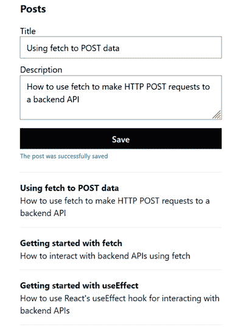

# 第九章：与 RESTful API 交互

在本章中，我们将构建一个页面，该页面列出从 REST API 获取的博客文章，以及一个表单，用于将博客文章提交到 REST API。通过这种方式，我们将了解从 React 组件与 REST API 交互的各种方法。

第一种方法将是使用 React 的 `useEffect` 钩子和浏览器的 `fetch` 函数。作为此过程的一部分，我们将学习如何使用类型断言函数来为来自 REST API 的数据提供强类型。然后，我们将使用 **React Router** 的数据加载功能并体验其优势。之后，我们将转向使用一个流行的库，即 **React Query**，并体验其优势，最后我们将结合使用 React Query 和 React Router 以获得这两个库的最佳效果。

因此，在本章中，我们将涵盖以下主题：

+   设置环境

+   使用 effect 钩子与 fetch 结合使用

+   使用 fetch 发送数据

+   使用 React Router

+   使用 React Query

+   使用 React Router 和 React Query 结合

# 技术要求

本章我们将使用以下技术：

+   **Node.js** 和 **npm**：您可以从 [`nodejs.org/en/download/`](https://nodejs.org/en/download/) 安装它们。

+   **Visual Studio Code**：您可以从 [`code.visualstudio.com/`](https://code.visualstudio.com/) 安装它。

本章中所有的代码片段都可以在以下网址找到：[`github.com/PacktPublishing/Learn-React-with-TypeScript-2nd-Edition/tree/main/Chapter9`](https://github.com/PacktPublishing/Learn-React-with-TypeScript-2nd-Edition/tree/main/Chapter9).

# 创建项目

在本节中，我们将首先创建我们将要构建的应用程序项目。然后，我们将为应用程序创建一个 REST API 以供其消费。

## 设置项目

我们将使用 Visual Studio Code 开发应用程序，并需要一个基于 Create React App 的新项目设置。我们之前已经多次介绍过这一点，因此在本章中我们将不介绍这些步骤——相反，请参阅 *第三章*，*设置 React 和 TypeScript*。

我们将使用 Tailwind CSS 来设计应用程序的样式。我们之前在 *第五章*，*前端样式方法* 中介绍了如何安装和配置 Tailwind。因此，在您创建了 React 和 TypeScript 项目之后，请安装并配置 Tailwind。

我们将使用 React Router 来加载数据，因此请参阅*第六章*，*使用 React Router 进行路由*，了解如何进行此操作。

我们将使用 `@tailwindcss/forms` 插件来设计表单。请参阅 *第七章*，*与表单一起工作*，以回顾如何实现这些。

## 理解组件结构

应用程序将是一个单页应用程序，其中包含一个位于现有文章列表上方的添加新文章的表单。应用程序将分为以下组件：


图 9.1 – 应用组件结构

这里是这些组件的描述：

+   `PostsPage` 将通过引用 `NewPostForm` 和 `PostsLists` 组件来渲染整个页面。它还将与 REST API 交互。

+   `NewPostForm` 将渲染一个表单，允许用户输入新的博客文章。这将使用 `ValidationError` 组件来渲染验证错误消息。`ValidationError` 组件将与在 *第七章* 中创建的相同。

+   `PostsList` 将渲染博客文章列表。

好的，现在我们知道了组件结构，让我们创建 REST API。

## 创建 REST API

我们将使用一个名为 **JSON Server** 的工具创建 REST API，它允许快速创建 REST API。通过运行以下命令安装 JSON Server：

```js
npm i -D json-server
```

然后，我们在 JSON 文件中定义 API 后面的数据。在项目的根目录中创建一个名为 `db.json` 的文件，包含以下内容：

```js
{
  "posts": [
    {
      "title": "Getting started with fetch",
      "description": "How to interact with backend APIs using         fetch",
      "id": 1
    },
    {
      "title": "Getting started with useEffect",
      "description": "How to use React's useEffect hook for         interacting with backend APIs",
      "id": 2
    }
  ]
}
```

前面的 JSON 表示 API 后面的数据最初将包含两篇博客文章（此代码片段可以从 [`github.com/PacktPublishing/Learn-React-with-TypeScript-2nd-Edition/blob/main/Chapter9/useEffect-fetch/db.json`](https://github.com/PacktPublishing/Learn-React-with-TypeScript-2nd-Edition/blob/main/Chapter9/useEffect-fetch/db.json) 复制）。

现在我们需要定义一个 npm 脚本来启动 JSON 服务器并处理请求。打开 `package.json` 并添加一个名为 `server` 的脚本，如下所示：

```js
{
  ...,
  "scripts": {
    ...,
    "server": "json-server --watch db.json --port 3001 --delay       2000"
  },
  ...
}
```

该脚本启动 JSON 服务器并监视我们刚刚创建的 JSON 文件。我们指定 API 在端口 `3001` 上运行，以免与在端口 `3000` 上运行的 app 冲突。我们还通过添加 2 秒的延迟来减缓 API 响应，这将帮助我们看到数据何时从 React 应用程序中获取。

在终端中，通过运行我们刚刚创建的脚本启动 API，如下所示：

```js
npm run server
```

几秒钟后，API 启动。为了检查 API 是否正常工作，打开浏览器并输入以下地址：`http://localhost:3001/posts`。博客文章数据应如下显示在浏览器中：


图 9.2 – 博客文章 REST API

更多关于 JSON Server 的信息，请参阅以下链接：[`github.com/typicode/json-server`](https://github.com/typicode/json-server)。

现在项目已经设置好了 REST API，保持 API 运行，接下来，我们将学习如何使用 `useEffect` 与 REST API 交互。

# 使用 effect 钩子与 fetch 一起使用

在本节中，我们将创建一个页面，列出我们从刚刚创建的 REST API 返回的博客文章。我们将使用浏览器的 `fetch` 函数和 React 的 `useEffect` 钩子与 REST API 交互。

## 使用 fetch 获取博客文章

我们将首先创建一个函数，使用浏览器的 `fetch` 函数从 REST API 获取博客文章；我们将 API URL 存储在一个环境变量中。为此，执行以下步骤：

1.  将使用相同的 URL 来获取以及保存新的博客文章到 REST API。我们将把这个 URL 存储在一个环境变量中。因此，在项目的根目录中创建一个名为 `.env` 的文件，包含以下变量：

    ```js
    REACT_APP_API_URL = http://localhost:3001/posts/
    ```

这个环境变量在构建时注入到代码中，可以通过 `process.env.REACT_APP_API_URL` 被代码访问。Create React App 项目的环境变量必须以 `React_APP_` 为前缀。有关环境变量的更多信息，请参阅以下链接：[`create-react-app.dev/docs/adding-custom-environment-variables/`](https://create-react-app.dev/docs/adding-custom-environment-variables/)。

1.  现在，在 `src` 文件夹中创建一个名为 `posts` 的文件夹，用于存放所有博客文章功能的文件。

1.  在 `posts` 文件夹中创建一个名为 `getPosts.ts` 的文件。在这个文件中，添加以下获取博客文章的函数：

    ```js
    export async function getPosts() {
    ```

    ```js
      const response = await fetch(
    ```

    ```js
        process.env.REACT_APP_API_URL!
    ```

    ```js
      );
    ```

    ```js
      const body = await response.json()
    ```

    ```js
      return body;
    ```

    ```js
    }
    ```

`fetch` 函数有一个用于 REST API URL 的参数。我们使用了 `REACT_APP_API_URL` 环境变量来指定这个 URL。环境变量值可以是 `undefined`，但我们知道这不是情况，所以我们在其后添加了一个 `!`)。

注意

非空断言操作符是 TypeScript 中的一个特殊操作符。它用于通知 TypeScript 编译器它前面的表达式不能是 `null` 或 `undefined`。

`fetch` 返回一个 `Response` 对象，我们调用它的 `json` 方法来获取以 JSON 格式的响应体。`json` 方法是异步的，因此我们需要 `await` 它。

关于 `fetch` 的更多信息，请参阅以下链接：[`developer.mozilla.org/en-US/docs/Web/API/Fetch_API`](https://developer.mozilla.org/en-US/docs/Web/API/Fetch_API)。

这完成了 `getPosts` 的初始版本。然而，`getPosts` 的返回值类型目前是 `any`，这意味着不会对其进行类型检查。我们将在下一步改进这一点。

## 强类型响应数据

在 *第二章* *介绍 TypeScript* 中，我们学习了如何使用 `unknown` 类型和使用类型谓词来对未知数据进行强类型化。我们将使用 `unknown` 类型与一个名为 `getPosts` 的 TypeScript 特性一起使用。执行以下步骤：

1.  向 JSON 响应添加类型断言，以便 `body` 变量具有 `unknown` 类型：

    ```js
    export async function getPosts() {
    ```

    ```js
      const response = await fetch(postsUrl);
    ```

    ```js
      const body = (await response.json()) as unknown;
    ```

    ```js
      return body;
    ```

    ```js
    }
    ```

1.  接下来，在 `getPosts` 下方添加以下类型断言函数：

    ```js
    export function assertIsPosts(
    ```

    ```js
      postsData: unknown
    ```

    ```js
        ): asserts postsData is PostData[] {
    ```

    ```js
    }
    ```

注意返回类型注解：`asserts postsData is PostData[]`。如果没有错误发生，这意味着 `postsData` 参数是 `PostData[]` 类型。

不要担心 `PostData` 被引用时的编译错误 - 我们将在第 8 步创建 `PostData` 类型。

1.  让我们继续实现 `assertIsPosts`。它将对 `postsData` 参数进行一系列检查，如果检查失败，它将抛出异常。通过检查 `postsData` 是否为数组来开始实现：

    ```js
    export function assertIsPosts(
    ```

    ```js
      postsData: unknown
    ```

    ```js
    ): asserts postsData is PostData[] {
    ```

    ```js
      if (!Array.isArray(postsData)) {
    ```

    ```js
        throw new Error("posts isn't an array");
    ```

    ```js
      }
    ```

    ```js
      if (postsData.length === 0) {
    ```

    ```js
        return;
    ```

    ```js
      }
    ```

    ```js
    }
    ```

1.  现在，让我们检查数组项是否具有 `id` 属性：

    ```js
    export function assertIsPosts(
    ```

    ```js
      postsData: unknown
    ```

    ```js
    ): asserts postsData is PostData[] {
    ```

    ```js
      ...
    ```

    ```js
      postsData.forEach((post) => {
    ```

    ```js
        if (!('id' in post)) {
    ```

    ```js
          throw new Error("post doesn't contain id");
    ```

    ```js
        }
    ```

    ```js
        if (typeof post.id !== 'number') {
    ```

    ```js
          throw new Error('id is not a number');
    ```

    ```js
        }
    ```

    ```js
      });
    ```

    ```js
    }
    ```

我们使用数组的 `forEach` 方法遍历所有文章。在循环内部，我们使用 `in` 操作符检查 `id` 属性是否存在。我们还使用 `typeof` 操作符检查 `id` 值是否为 `number` 类型。

1.  我们可以对 `title` 和 `description` 属性执行类似的检查：

    ```js
    export function assertIsPosts(
    ```

    ```js
      postsData: unknown
    ```

    ```js
    ): asserts postsData is PostData[] {
    ```

    ```js
      …
    ```

    ```js
      postsData.forEach((post) => {
    ```

    ```js
        ...
    ```

    ```js
        if '!('ti'le' in post)) {
    ```

    ```js
          throw new Err"r("post do'sn't contain ti"le");
    ```

    ```js
        }
    ```

    ```js
        if (typeof post.title !'= 'str'ng') {
    ```

    ```js
          throw new Err'r('title is not a str'ng');
    ```

    ```js
        }
    ```

    ```js
        if '!('descript'on' in post)) {
    ```

    ```js
          throw new Err"r("post do'sn't contain         descript"on");
    ```

    ```js
        }
    ```

    ```js
        if (typeof post.description !'= 'str'ng') {
    ```

    ```js
          throw new Err'r('description is not a str'ng');
    ```

    ```js
        }
    ```

    ```js
      });
    ```

    ```js
    }
    ```

这完成了类型断言函数的实现。

1.  返回到 `getPosts`，添加对 `assert` 函数的调用：

    ```js
    export async function getPosts() {
    ```

    ```js
      const response = await fetch(postsUrl);
    ```

    ```js
      const body = (await response.json()) as unknown;
    ```

    ```js
      assertIsPosts(body);
    ```

    ```js
      return body;
    ```

    ```js
    }
    ```

在成功调用 `assertIsPosts` 之后，`body` 变量现在将是 `PostData[]` 类型。您可以在返回语句中悬停在 `body` 变量上以确认这一点。

1.  最终步骤是添加 `PostData` 类型。在 `getPosts.ts` 的顶部添加以下导入语句以导入 `PostData`：

    ```js
    import { PostData } from './types';
    ```

由于 `types` 文件尚不存在，文件仍将存在编译错误 - 我们将在下一步中完成此操作。

1.  在 `posts` 文件夹中添加一个名为 `types.ts` 的文件，并包含以下 `PostData` 类型的定义：

    ```js
    export type PostData = {
    ```

    ```js
      id: number;
    ```

    ```js
      title: string;
    ```

    ```js
      description: string;
    ```

    ```js
    };
    ```

这种类型表示来自 REST API 的博客文章。

现在，我们有一个强类型函数，可以从 REST API 获取博客文章。接下来，我们将创建一个 React 组件来列出博客文章。

## 创建博客文章列表组件

我们将创建一个 React 组件，它接受博客文章数据并将其以列表形式渲染。执行以下步骤：

1.  在 `posts` 文件夹中创建一个名为 `PostsList.tsx` 的文件，并包含以下导入语句：

    ```js
    import { PostData } from './types';
    ```

1.  接下来，开始实现组件，如下所示：

    ```js
    type Props = {
    ```

    ```js
      posts: PostData[];
    ```

    ```js
    };
    ```

    ```js
    export function PostsList({ posts }: Props) {
    ```

    ```js
    }
    ```

组件有一个名为 `posts` 的属性，它将包含博客文章。

1.  现在，按照以下方式在无序列表中渲染博客文章：

    ```js
    export function PostsList({ posts }: Props) {
    ```

    ```js
      return (
    ```

    ```js
        <ul className="list-none">
    ```

    ```js
          {posts.map((post) => (
    ```

    ```js
            <li key={post.id} className="border-b py-4">
    ```

    ```js
              <h3 className="text-slate-900 font-bold">
    ```

    ```js
                {post.title}
    ```

    ```js
              </h3>
    ```

    ```js
              <p className=" text-slate-900 ">{post.description}</p>
    ```

    ```js
            </li>
    ```

    ```js
          ))}
    ```

    ```js
        </ul>
    ```

    ```js
      );
    ```

    ```js
    }
    ```

Tailwind CSS 类在具有粗体标题的博客文章之间添加灰色线条。

这完成了 `PostsList` 组件。接下来，我们将创建一个引用 `PostsList` 组件的页面组件。

## 创建博客文章页面组件

我们将创建一个博客文章页面组件，该组件使用 `getPosts` 函数获取博客文章数据，并使用我们刚刚创建的 `PostsList` 组件进行渲染。执行以下步骤：

1.  在 `posts` 文件夹的组件中创建一个名为 `PostsPage.tsx` 的文件，并包含以下导入语句：

    ```js
    import { useEffect, useState } from 'react';
    ```

    ```js
    import { getPosts } from './getPosts';
    ```

    ```js
    import { PostData } from './types';
    ```

    ```js
    import { PostsList } from './PostsList';
    ```

我们已导入 `getPosts` 函数、`PostList` 组件以及我们在上一节中创建的 `PostData` 类型。我们还导入了来自 React 的 `useState` 和 `useEffect` 钩子。我们将使用 React 状态来存储博客文章，并使用 `useEffect` 在页面组件挂载时调用 `getPosts`。

1.  通过定义博客文章的状态以及它们是否正在被获取来开始实现页面组件。

    ```js
    export function PostsPage() {
    ```

    ```js
      const [isLoading, setIsLoading] = useState(true);
    ```

    ```js
      const [posts, setPosts] = useState<PostData[]>([]);
    ```

    ```js
    }
    ```

1.  接下来，使用 `useEffect` 钩子调用 `getPosts` 函数，如下所示：

    ```js
    export function PostsPage() {
    ```

    ```js
      …
    ```

    ```js
      useEffect(() => {
    ```

    ```js
        let cancel = false;
    ```

    ```js
        getPosts().then((data) => {
    ```

    ```js
          if (!cancel) {
    ```

    ```js
            setPosts(data);
    ```

    ```js
            setIsLoading(false);
    ```

    ```js
          }
    ```

    ```js
        });
    ```

    ```js
        return () => {
    ```

    ```js
          cancel = true;
    ```

    ```js
        };
    ```

    ```js
      }, []);
    ```

    ```js
    }
    ```

我们在调用 `getPosts` 时使用较旧的 promise 语法，因为较新的 `async`/`await` 语法不能直接在 `useEffect` 中使用。

如果在 `getPosts` 调用仍在进行时卸载 `PostsPage` 组件，设置 `data` 和 `isLoading` 状态变量将导致错误。因此，我们使用了一个 `cancel` 标志来确保在设置 `data` 和 `isLoading` 状态变量时组件仍然挂载。

我们还指定了一个空数组作为效果依赖项，以便效果仅在组件挂载时运行。

1.  在 `useEffect` 调用之后，在数据获取期间添加一个加载指示器：

    ```js
    export function PostsPage() {
    ```

    ```js
      ...
    ```

    ```js
      useEffect(...);
    ```

    ```js
      if (isLoading) {
    ```

    ```js
        return (
    ```

    ```js
          <div className="w-96 mx-auto mt-6">
    ```

    ```js
            Loading ...
    ```

    ```js
          </div>
    ```

    ```js
        );
    ```

    ```js
      }
    ```

    ```js
    }
    ```

Tailwind CSS 类将加载指示器水平放置在页面中心，并在其上方留有一点边距。

1.  最后，在条件加载指示器之后渲染页面标题和帖子列表：

    ```js
    export function PostsPage() {
    ```

    ```js
      ...
    ```

    ```js
      if (isLoading) {
    ```

    ```js
        return (
    ```

    ```js
          <div className="w-96 mx-auto mt-6">
    ```

    ```js
            Loading ...
    ```

    ```js
          </div>
    ```

    ```js
        );
    ```

    ```js
      }
    ```

    ```js
      return (
    ```

    ```js
        <div className="w-96 mx-auto mt-6">
    ```

    ```js
          <h2 className="text-xl text-slate-900 font-bold">Posts</h2>
    ```

    ```js
          <PostsList posts={posts} />
    ```

    ```js
        </div>
    ```

    ```js
      );
    ```

    ```js
    }
    ```

Tailwind CSS 类将列表放置在页面中心，并在其上方留有一点边距。一个大的 **帖子** 标题也以深灰色渲染在列表上方。

1.  现在，打开 `App.tsx` 并将其内容替换为以下内容，以便渲染我们刚刚创建的页面组件：

    ```js
    import { PostsPage } from './posts/PostsPage';
    ```

    ```js
    function App() {
    ```

    ```js
      return <PostsPage />;
    ```

    ```js
    }
    ```

    ```js
    export default App;
    ```

1.  通过在新的终端中运行 `npm start` 来运行应用程序，该终端与运行 REST API 的终端分开。在数据被获取时，加载指示器将短暂出现：


图 9.3 – 加载指示器

博客帖子列表将如下显示：


图 9.4 – 博客帖子列表

这就完成了 `PostsPage` 组件的这个版本。

在本节中，我们学习了如何使用 `fetch` 和 `useEffect` 在 REST API 中与 HTTP `GET` 请求交互的关键点：

+   `fetch` 将执行实际的 HTTP 请求，该请求将 REST API 的 URL 作为参数

+   可以使用类型断言函数来为响应数据添加强类型

+   `useEffect` 可以在包含状态数据的组件挂载时触发 `fetch` 调用

+   可以在 `useEffect` 内部使用一个标志来检查在设置数据状态之前组件是否在 HTTP 请求期间被卸载

在保持应用程序和 REST API 运行的情况下，在下一节中，我们将学习如何使用 `fetch` 将数据发布到 REST API。

# 使用 fetch 发送数据

在本节中，我们将创建一个表单，该表单将新的博客帖子提交到我们的 REST API。我们将创建一个使用 `fetch` 向 REST API 发送数据的函数。该函数将在表单的提交处理程序中被调用。

## 使用 fetch 创建新的博客帖子

我们将首先创建一个函数，该函数将新的博客帖子发送到 REST API。这将使用浏览器的 `fetch` 函数，但这次使用 HTTP `POST` 请求。执行以下步骤：

1.  我们将首先在`posts`文件夹中的 `types.ts` 文件中打开，并添加以下两个类型：

    ```js
    export type NewPostData = {
    ```

    ```js
      title: string;
    ```

    ```js
      description: string;
    ```

    ```js
    };
    ```

    ```js
    export type SavedPostData = {
    ```

    ```js
      id: number;
    ```

    ```js
    };
    ```

第一个类型代表一个新的博客帖子，第二个类型代表当博客帖子成功保存时从 API 获取的数据。

1.  在 `posts` 文件夹中创建一个名为 `savePost.ts` 的新文件，并添加以下导入语句：

    ```js
    import { NewPostData, SavedPostData } from './types';
    ```

我们还导入了我们刚刚创建的类型。

1.  开始实现`savePost`函数如下：

    ```js
    export async function savePost(
    ```

    ```js
      newPostData: NewPostData
    ```

    ```js
    ) {
    ```

    ```js
      const response = await fetch(
    ```

    ```js
        process.env.REACT_APP_API_URL!,
    ```

    ```js
        {
    ```

    ```js
          method: 'POST',
    ```

    ```js
          body: JSON.stringify(newPostData),
    ```

    ```js
          headers: {
    ```

    ```js
            'Content-Type': 'application/json',
    ```

    ```js
          },
    ```

    ```js
        }
    ```

    ```js
      );
    ```

    ```js
    }
    ```

`savePost`函数有一个参数`newPostData`，包含新博客帖子的标题和描述，并使用`fetch`将其发送到 REST API。在`fetch`调用中已指定第二个参数，指定应使用 HTTP `POST`请求，并将新博客帖子数据包含在请求体中。请求体还声明为 JSON 格式。

1.  接下来，将响应体强类型化如下：

    ```js
    export async function savePost(newPostData: NewPostData) {
    ```

    ```js
      const response = await fetch( ... );
    ```

    ```js
      const body = (await response.json()) as unknown;
    ```

    ```js
      assertIsSavedPost(body);
    ```

    ```js
    }
    ```

我们将响应体设置为具有`unknown`类型，然后使用类型断言函数给它一个特定的类型。这将引发编译错误，直到我们在*第 6 步*中实现`assertIsSavedPost`。

1.  通过合并响应中的博客帖子 ID 与函数提供的博客帖子标题和描述来完成`savePost`的实现：

    ```js
    export async function savePost(newPostData: NewPostData) {
    ```

    ```js
      ...
    ```

    ```js
      return { ...newPostData, ...body };
    ```

    ```js
    }
    ```

因此，该函数返回的对象将是一个带有 REST API ID 的新博客帖子。

1.  最后一步是实现类型断言函数：

    ```js
    function assertIsSavedPost(
    ```

    ```js
      post: any
    ```

    ```js
    ): asserts post is SavedPostData {
    ```

    ```js
      if (!('id' in post)) {
    ```

    ```js
        throw new Error("post doesn't contain id");
    ```

    ```js
      }
    ```

    ```js
      if (typeof post.id !== 'number') {
    ```

    ```js
        throw new Error('id is not a number');
    ```

    ```js
      }
    ```

    ```js
    }
    ```

该函数检查响应数据是否包含一个数字`id`属性，如果包含，则断言数据是`SavedPostData`类型。

这样就完成了`savePost`函数的实现。接下来，我们将添加一个表单组件，允许用户输入新的博客帖子。

## 创建博客帖子表单组件

我们将创建一个包含表单的组件，该表单用于捕获新的博客帖子。当表单提交时，它将调用我们刚刚创建的`savePost`函数。

我们将使用 React Hook Form 实现表单，以及一个`ValidationError`组件。我们在*第七章*中详细介绍了 React Hook Form 和`ValidationError`组件，因此实现步骤不会详细说明。

执行以下步骤：

1.  我们将首先创建一个`ValidationError`组件，该组件将渲染表单验证错误。在`posts`文件夹中创建一个名为`ValidationError.tsx`的文件，内容如下：

    ```js
    import { FieldError } from 'react-hook-form';
    ```

    ```js
    type Props = {
    ```

    ```js
      fieldError: FieldError | undefined,
    ```

    ```js
    };
    ```

    ```js
    export function ValidationError({ fieldError }: Props) {
    ```

    ```js
      if (!fieldError) {
    ```

    ```js
        return null;
    ```

    ```js
      }
    ```

    ```js
      return (
    ```

    ```js
        <div role="alert" className="text-red-500 text-xs       mt-1">
    ```

    ```js
          {fieldError.message}
    ```

    ```js
        </div>
    ```

    ```js
      );
    ```

    ```js
    }
    ```

1.  在`posts`文件夹中创建一个名为`NewPostForm.tsx`的新文件。这个文件将包含一个用于捕获新博客帖子标题和描述的表单。将该文件中的以下导入语句添加到文件中：

    ```js
    import { FieldError, useForm } from 'react-hook-form';
    ```

    ```js
    import { ValidationError } from './ValidationError';
    ```

    ```js
    import { NewPostData } from './types';
    ```

1.  开始实现表单组件如下：

    ```js
    type Props = {
    ```

    ```js
      onSave: (newPost: NewPostData) => void;
    ```

    ```js
    };
    ```

    ```js
    export function NewPostForm({ onSave }: Props) {
    ```

    ```js
    }
    ```

该组件有一个用于保存新博客帖子的 prop，以便可以在表单组件之外处理与 REST API 的交互。

1.  现在，从 React Hook Form 的`useForm`钩子中解构`register`和`handleSubmit`函数以及有用的状态变量：

    ```js
    type Props = {
    ```

    ```js
      onSave: (newPost: NewPostData) => void;
    ```

    ```js
    };
    ```

    ```js
    export function NewPostForm({ onSave }: Props) {
    ```

    ```js
      const {
    ```

    ```js
        register,
    ```

    ```js
        handleSubmit,
    ```

    ```js
        formState: { errors, isSubmitting, isSubmitSuccessful },
    ```

    ```js
      } = useForm<NewPostData>();
    ```

    ```js
    }
    ```

我们将新帖数据的类型传递给`useForm`钩子，以便它知道要捕获的数据的形状。

1.  为字段容器样式创建一个变量，为编辑器样式创建一个函数：

    ```js
    export function NewPostForm({ onSave }: Props) {
    ```

    ```js
      ...
    ```

    ```js
      const fieldStyle = 'flex flex-col mb-2';
    ```

    ```js
      function getEditorStyle(
    ```

    ```js
        fieldError: FieldError | undefined
    ```

    ```js
      ) {
    ```

    ```js
        return fieldError ? 'border-red-500' : '';
    ```

    ```js
      }
    ```

    ```js
    }
    ```

1.  在`form`元素中按如下方式渲染`title`和`description`字段：

    ```js
    export function NewPostForm({ onSave }: Props) {
    ```

    ```js
      ...
    ```

    ```js
      return (
    ```

    ```js
        <form
    ```

    ```js
          noValidate
    ```

    ```js
          className="border-b py-4"
    ```

    ```js
          onSubmit={handleSubmit(onSave)}
    ```

    ```js
        >
    ```

    ```js
          <div className={fieldStyle}>
    ```

    ```js
            <label htmlFor="title">Title</label>
    ```

    ```js
            <input
    ```

    ```js
              type="text"
    ```

    ```js
              id="title"
    ```

    ```js
              {...register('title', {
    ```

    ```js
                required: 'You must enter a title',
    ```

    ```js
              })}
    ```

    ```js
              className={getEditorStyle(errors.title)}
    ```

    ```js
            />
    ```

    ```js
            <ValidationError fieldError={errors.title} />
    ```

    ```js
          </div>
    ```

    ```js
          <div className={fieldStyle}>
    ```

    ```js
            <label htmlFor="description">Description</label>
    ```

    ```js
            <textarea
    ```

    ```js
              id="description"
    ```

    ```js
              {...register('description', {
    ```

    ```js
                required: 'You must enter the description',
    ```

    ```js
              })}
    ```

    ```js
              className={getEditorStyle(errors.description)}
    ```

    ```js
            />
    ```

    ```js
            <ValidationError fieldError={errors.description}           />
    ```

    ```js
          </div>
    ```

    ```js
        </form>
    ```

    ```js
      );
    ```

    ```js
    }
    ```

1.  最后，渲染一个`保存`按钮和成功消息：

    ```js
    <form
    ```

    ```js
      noValidate
    ```

    ```js
      className="border-b py-4"
    ```

    ```js
      onSubmit={handleSubmit(onSave)}
    ```

    ```js
    >
    ```

    ```js
      <div className={fieldStyle}> ... </div>
    ```

    ```js
      <div className={fieldStyle}> ... </div>
    ```

    ```js
      <div className={fieldStyle}>
    ```

    ```js
        <button
    ```

    ```js
          type="submit"
    ```

    ```js
          disabled={isSubmitting}
    ```

    ```js
          className="mt-2 h-10 px-6 font-semibold bg-black         text-white"
    ```

    ```js
        >
    ```

    ```js
          Save
    ```

    ```js
       </button>
    ```

    ```js
        {isSubmitSuccessful && (
    ```

    ```js
          <div
    ```

    ```js
            role="alert"
    ```

    ```js
            className="text-green-500 text-xs mt-1"
    ```

    ```js
          >
    ```

    ```js
            The post was successfully saved
    ```

    ```js
         </div>
    ```

    ```js
        )}
    ```

    ```js
      </div>
    ```

    ```js
    </form>
    ```

这样就完成了`NewPostForm`组件的实现。

1.  现在打开 `PostPage.tsx` 文件并导入我们之前创建的 `NewPostForm` 组件和 `savePost` 函数。同时，导入 `NewPostData` 类型：

    ```js
    import { useEffect, useState } from 'react';
    ```

    ```js
    import { getPosts } from './getPosts';
    ```

    ```js
    import { PostData, NewPostData } from './types';
    ```

    ```js
    import { PostsList } from './PostsList';
    ```

    ```js
    import { savePost } from './savePost';
    ```

    ```js
    import { NewPostForm } from './NewPostForm';
    ```

1.  在 `PostPage` JSX 中，将 `NewPostForm` 表单添加到 `PostsList` 之上：

    ```js
    <div className="w-96 mx-auto mt-6">
    ```

    ```js
      <h2 className="text-xl text-slate-900 font-    bold">Posts</h2>
    ```

    ```js
      <NewPostForm onSave={handleSave} />
    ```

    ```js
      <PostsList posts={posts} />
    ```

    ```js
    </div>;
    ```

1.  在获取博客文章的效果下方添加保存处理函数：

    ```js
    useEffect(() => {
    ```

    ```js
      ...
    ```

    ```js
    }, []);
    ```

    ```js
    async function handleSave(newPostData: NewPostData) {
    ```

    ```js
      const newPost = await savePost(newPostData);
    ```

    ```js
      setPosts([newPost, ...posts]);
    ```

    ```js
    }
    ```

1.  处理函数调用 `savePost` 并传入表单中的数据。文章保存后，它将被添加到 `posts` 数组的开头。

1.  在运行的应用程序中，新的博客文章表单将出现在博客文章列表上方，如下所示：


图 9.5 – 新博客文章表单位于文章列表上方

1.  用一篇新的博客文章填写表单并按下 **保存** 按钮。几秒钟后，新文章应该出现在列表的顶部。



图 9.6 – 新博客文章添加到文章列表中

这样就完成了表单的实现及其与博客文章页面的集成。

在本节关于使用 `fetch` 发送数据的几个关键点如下：

+   `fetch` 函数的第二个参数允许指定 HTTP 方法。在本节中，我们使用此参数进行 HTTP `POST` 请求。

+   `fetch` 函数的第二个参数还允许提供请求体。

再次保持应用程序和 REST API 运行，在下一节中，我们将使用 React Router 的数据获取功能来简化我们的数据获取代码。

# 使用 React Router

在本节中，我们将了解 React Router 如何与数据获取过程集成。我们将使用这些知识来简化我们应用程序中获取博客文章的代码。

## 理解 React Router 数据加载

React Router 的数据加载与 React Router 表单类似，我们在 *第七章* 中学习过。我们不是定义一个处理表单提交的动作，而是定义一个 `some-page` 路由：

```js
const router = createBrowserRouter([
  ...,
  {
    path: '/some-page',
    element: <SomePage />,
    loader: async () => {
      const response = fetch('https://somewhere');
      return await response.json();
    }
  },
  ...
]);
```

React Router 在渲染路由上定义的组件之前调用加载器以获取数据。然后，数据通过 `useLoaderData` 钩子可用在组件中：

```js
export function SomePage() {
  const data = useLoaderData();
  ...
}
```

这种方法效率很高，因为路由组件只渲染一次，因为数据在第一次渲染时就已经可用。

更多关于 React Router 加载器的信息，请参阅以下链接：[`reactrouter.com/en/main/route/loader`](https://reactrouter.com/en/main/route/loader)。更多关于 `useLoaderData` 钩子的信息，请参阅以下链接：[`reactrouter.com/en/main/hooks/use-loader-data`](https://reactrouter.com/en/main/hooks/use-loader-data)。

现在我们开始理解 React Router 中的数据加载，我们将在我们的应用程序中使用它。

## 使用 React Router 进行数据加载

执行以下步骤以在我们的应用程序中使用 React Router 数据加载器：

1.  打开 `App.tsx` 文件并添加以下导入语句：

    ```js
    import {
    ```

    ```js
      createBrowserRouter,
    ```

    ```js
      RouterProvider
    ```

    ```js
    } from 'react-router-dom';
    ```

1.  此外，导入 `getPosts` 函数：

    ```js
    import { getPosts } from './posts/getPosts';
    ```

`getPosts` 将是加载函数。

1.  在 `App` 组件上方添加以下路由定义：

    ```js
    const router = createBrowserRouter([
    ```

    ```js
      {
    ```

    ```js
        path: "/",
    ```

    ```js
        element: <PostsPage />,
    ```

    ```js
        loader: getPosts
    ```

    ```js
      }
    ```

    ```js
    ]);
    ```

1.  在 `App` 组件中，将 `PostsPage` 替换为 `RouterProvider`：

    ```js
    function App() {
    ```

    ```js
      return <RouterProvider router={router} />;
    ```

    ```js
    }
    ```

1.  打开 `PostsPage.tsx` 并移除 React 导入语句，因为在这个组件中不再需要它。

1.  此外，将 `assertIsPosts` 添加到 `getPosts` 导入语句中，并移除 `getPosts`：

    ```js
    import { assertIsPosts } from './getPosts';
    ```

我们最终需要 `assertIsPosts` 来类型化数据。

1.  仍然在 `PostsPage.tsx` 中，添加以下导入语句，以便使用 React Router 中的一个钩子，该钩子允许我们访问加载器数据：

    ```js
    import { useLoaderData } from 'react-router-dom';
    ```

1.  在 `PostsPage` 组件内部，移除 `isLoading` 和 `posts` 状态定义。这些将不再需要，因为我们将从 React Router 获取数据，而无需等待。

1.  移除当前获取数据的 `useEffect` 调用。

1.  移除 `handleSave` 函数的第二行，该行设置 `posts` 状态。`handleSave` 现在应如下所示：

    ```js
    async function handleSave(newPostData: NewPostData) {
    ```

    ```js
      await savePost(newPostData);
    ```

    ```js
    }
    ```

1.  同时移除加载指示器。

1.  现在，在 `PostsPage` 组件的顶部，调用 `useLoaderData` 并将结果分配给 `posts` 变量：

    ```js
    export function PostsPage() {
    ```

    ```js
      const posts = useLoaderData();
    ```

    ```js
      …
    ```

    ```js
    }
    ```

1.  很不幸，`posts` 是 `unknown` 类型，因此在传递给 `PostsLists` 组件时存在类型错误。使用 `assertsIsPosts` 函数将数据类型化为 `PostData[]`：

    ```js
    const posts = useLoaderData();
    ```

    ```js
    assertIsPosts(posts);
    ```

类型错误现在已解决。

注意，从 `types` 导入语句中导入的 `PostData` 未使用。保持其完整性，因为我们将在下一节再次使用它。

1.  运行的应用程序应该看起来和表现与之前相似。你可能注意到的一点是，当使用表单添加新的博客文章时，它不会出现在列表中——你必须手动刷新页面才能看到它。当我们在本章后面使用 React Query 时，这将被解决。

注意我们刚刚移除了多少代码——这表明代码现在变得更加简单。使用 React Router 加载数据的另一个好处是，在数据获取后，`PostsPage` 不会重新渲染——数据是在 `PostsPage` 渲染之前获取的。

接下来，我们将改进数据获取过程的用户体验。

## 延迟 React Router 数据获取

如果数据获取过程缓慢，React Router 渲染组件之前会有明显的延迟。幸运的是，我们可以通过使用 React Router 的 `defer` 函数和 `Await` 组件，以及 React 的 `Suspense` 组件来解决这个问题。执行以下步骤将它们添加到我们的应用程序中：

1.  首先打开 `App.tsx` 并将 `defer` 函数添加到 React Router 导入语句中：

    ```js
    import {
    ```

    ```js
      createBrowserRouter,
    ```

    ```js
      RouterProvider,
    ```

    ```js
      defer
    ```

    ```js
    } from 'react-router-dom';
    ```

1.  在路由定义中按照以下方式更新 `loader` 函数：

    ```js
    const router = createBrowserRouter([
    ```

    ```js
      {
    ```

    ```js
        path: "/",
    ```

    ```js
        element: ...,
    ```

    ```js
        loader: async () => defer({ posts: getPosts() })
    ```

    ```js
      }
    ```

    ```js
    ]);
    ```

React Router 的 `defer` 函数接收一个包含承诺数据的对象。对象中的属性名是数据的唯一键，在我们的例子中是 `posts`。值是获取数据的函数，在我们的例子中是 `getPosts`。

注意，我们没有等待 `getPosts`，因为我们希望加载器完成，并且 `PostsPage` 立即渲染。

1.  打开 `PostsPage.tsx` 并为 React 的 `Suspense` 组件添加一个导入语句：

    ```js
    import { Suspense } from 'react';
    ```

1.  将 `Await` 组件添加到 React Router 的导入语句中：

    ```js
    import { useLoaderData, Await } from 'react-router-dom';
    ```

1.  在组件中，将 `useLoaderData` 的调用更新为将结果分配给 `data` 变量而不是 `posts`：

    ```js
    const data = useLoaderData();
    ```

加载器数据的形式现在略有不同——它将是一个包含 `posts` 属性的对象，其中包含博客文章。博客文章也不会立即出现，就像之前那样——`data.posts` 属性将包含博客文章的承诺。

1.  此外，删除对 `assertIsPosts` 的调用——我们将在 *步骤 9* 中使用它。

1.  `data` 变量是 `unknown` 类型，因此请在组件下方添加一个类型断言函数，以便可以将其强类型化：

    ```js
    type Data = {
    ```

    ```js
      posts: PostData[];
    ```

    ```js
    };
    ```

    ```js
    export function assertIsData(
    ```

    ```js
      data: unknown
    ```

    ```js
    ): asserts data is Data {
    ```

    ```js
      if (typeof data !== 'object') {
    ```

    ```js
        throw new Error("Data isn't an object");
    ```

    ```js
      }
    ```

    ```js
      if (data === null) {
    ```

    ```js
        throw new Error('Data is null');
    ```

    ```js
      }
    ```

    ```js
      if (!('posts' in data)) {
    ```

    ```js
        throw new Error("data doesn't contain posts");
    ```

    ```js
      }
    ```

    ```js
    }
    ```

类型断言函数检查 `data` 参数是否是一个包含 `posts` 属性的对象。

1.  我们现在可以使用断言函数来为组件中的 `data` 变量指定类型：

    ```js
    const data = useLoaderData();
    ```

    ```js
    assertIsData(data);
    ```

1.  在 JSX 中，将 `Suspense` 和 `Await` 包裹在 `PostsList` 旁边，如下所示：

    ```js
    <Suspense fallback={<div>Fetching...</div>}>
    ```

    ```js
      <Await resolve={data.posts}>
    ```

    ```js
        {(posts) => {
    ```

    ```js
          assertIsPosts(posts);
    ```

    ```js
          return <PostsList posts={posts} />;
    ```

    ```js
        }}
    ```

    ```js
      </Await>
    ```

    ```js
    </Suspense>
    ```

`Suspense` 和 `Await` 一起工作，仅在数据已被获取时渲染 `PostsLists`。我们使用 `Suspense` 来渲染 `assertIsPosts` 以确保 `posts` 被正确类型化。

1.  在运行的应用程序中，你现在将注意到当页面加载时会出现 **Fetching…** 消息：


图 9.7 – 数据获取期间的数据获取消息

1.  通过在运行应用程序的终端中按 *Ctrl* + *C* 来停止应用程序的运行，但保持 API 运行。

这个解决方案的伟大之处在于，由于使用了 `Suspense` 和 `Await`，当 `PostsPage` 被渲染时，仍然不会发生重新渲染。

我们现在将快速回顾一下我们使用 React Router 的数据获取功能所学到的东西：

+   React Router 的 `loader` 允许我们高效地将获取的数据加载到路由组件中

+   React Router 的 `defer` 允许路由组件在数据获取时不会被阻止渲染组件

+   React Router 的 `useLoaderData` 钩子允许组件访问路由的加载数据

+   React 的 `Suspense` 和 React Router 的 `Await` 允许组件在数据仍在获取时进行渲染

有关 React Router 中延迟数据的更多信息，请参阅以下链接：[`reactrouter.com/en/main/guides/deferred`](https://reactrouter.com/en/main/guides/deferred)。

在下一节中，我们将使用另一个流行的库来管理服务器数据，以进一步提高用户体验。

# 使用 React Query

React Query 是一个用于与 REST API 交互的流行库。它所做的关键事情是管理围绕 REST API 调用的状态。它所做的另一件事是 React Router 不做的是维护获取数据的缓存，这提高了应用程序的感知性能。

在本节中，我们将重构应用程序以使用 React Query 而不是 React Router 的加载器功能。然后，我们将再次重构应用程序以同时使用 React Query 和 React Router 的加载器，以获得这两个世界的最佳效果。

## 安装 React Query

我们的第一项任务是安装 React Query，我们可以在终端中运行以下命令来完成：

```js
npm i @tanstack/react-query
```

此库包括 TypeScript 类型，因此不需要安装任何额外的包。

## 添加 React Query 提供者

React Query 需要在需要访问其管理的数据的组件树上的一个提供者组件。最终，React Query 将在我们的应用程序中保存博客文章数据。执行以下步骤以将 React Query 提供者组件添加到 `App` 组件中：

1.  打开 `App.tsx` 并添加以下导入语句：

    ```js
    import {
    ```

    ```js
      QueryClient,
    ```

    ```js
      QueryClientProvider,
    ```

    ```js
    } from '@tanstack/react-query';
    ```

`QueryClient` 提供对数据的访问。`QueryClientProvider` 是我们需要放置在组件树中的提供者组件。

1.  按照以下方式将 `QueryClientProvider` 包裹在 `RouterProvider` 之外：

    ```js
    const queryClient = new QueryClient();
    ```

    ```js
    const router = createBrowserRouter( ... );
    ```

    ```js
    function App() {
    ```

    ```js
      return (
    ```

    ```js
        <QueryClientProvider client={queryClient}>
    ```

    ```js
          <RouterProvider router={router} />
    ```

    ```js
        </QueryClientProvider>
    ```

    ```js
      );
    ```

    ```js
    }
    ```

`QueryClientProvider` 需要一个 `QueryClient` 实例来传递给它，因此我们在 `App` 组件外部创建此实例。我们将 `queryClient` 变量放置在路由定义之上，因为我们最终会在路由定义中使用它。

`PostsPage` 组件现在可以访问 React Query。接下来，我们将在 `PostsPage` 中使用 React Query。

## 使用 React Query 获取数据

React Query 将获取数据的请求称为 `useQuery` 钩子以执行此操作。我们将在 `PostsPage` 组件中使用 React Query 的 `useQuery` 钩子来调用 `getPosts` 函数并存储它返回的数据。这将暂时替代 React Router 的加载器功能。执行以下步骤：

1.  从 React Query 中导入 `useQuery`：

    ```js
    import { useQuery } from '@tanstack/react-query';
    ```

1.  将 `getPosts` 添加到 `getPosts` 导入语句中：

    ```js
    import { assertIsPosts, getPosts } from './getPosts';
    ```

我们最终将使用 `getPosts` 来获取数据并将其存储在 React Query 中。

1.  在 `PostPage` 组件中，注释掉 `data` 变量：

    ```js
    // const data = useLoaderData();
    ```

    ```js
    // assertIsData(data);
    ```

我们将这些行注释掉而不是删除，因为我们将在下一节中使用 React Router 和 React Query 一起时再次使用它们。

1.  现在，按照以下方式添加对 `useQuery` 的调用：

    ```js
    export function PostsPage() {
    ```

    ```js
      const {
    ```

    ```js
        isLoading,
    ```

    ```js
        isFetching,
    ```

    ```js
        data: posts,
    ```

    ```js
      } = useQuery(['postsData'], getPosts);
    ```

    ```js
      // const data = useLoaderData();
    ```

    ```js
      // assertIsData(data);
    ```

    ```js
      ...
    ```

    ```js
    }
    ```

传递给 `useQuery` 的第一个参数是数据的唯一键。这是因为 React Query 可以存储许多数据集，并使用键来标识每个数据集。在这种情况下，键是一个包含数据名称的数组。然而，键数组可以包括我们想要获取的特定记录的 ID 或如果我们只想获取一页记录的页码。

传递给 `useQuery` 的第二个参数是获取函数，即我们现有的 `getPosts` 函数。

我们已经解构了以下状态变量：

+   `isLoading` – 组件是否正在首次加载。

+   `isFetching` – 获取函数是否正在被调用。当 React Query 认为数据已过时，它将重新获取数据。我们将在稍后与应用程序一起玩耍时体验重新获取数据。

+   `data` – 已获取的数据。我们将此 `posts` 变量别名为 `posts` 以匹配之前的 `posts` 状态值。保持相同的名称可以最小化对组件其余部分的更改。

注意

从 `useQuery` 中可以解构出其他有用的状态变量。一个例子是 `isError`，它表示 `fetch` 函数是否出错。有关更多信息，请参阅以下链接：[`tanstack.com/query/v4/docs/reference/useQuery`](https://tanstack.com/query/v4/docs/reference/useQuery)。

1.  在返回语句上方添加一个加载指示器：

    ```js
    if (isLoading || posts === undefined) {
    ```

    ```js
      return (
    ```

    ```js
        <div className="w-96 mx-auto mt-6">
    ```

    ```js
          Loading ...
    ```

    ```js
        </div>
    ```

    ```js
      );
    ```

    ```js
    }
    ```

    ```js
    return ...
    ```

检查 `posts` 状态是否为 `undefined` 表示 TypeScript 编译器知道在 JSX 中引用 `posts` 时它不是 `undefined`。

1.  在 JSX 中，注释掉 `Suspense` 及其子元素：

    ```js
    return (
    ```

    ```js
      <div className="w-96 mx-auto mt-6">
    ```

    ```js
        <h2 className="text-xl text-slate-900 font-      bold">Posts</h2>
    ```

    ```js
        <NewPostForm onSave={mutate} />
    ```

    ```js
        {/* <Suspense fallback={<div>Fetching ...</div>}>
    ```

    ```js
            <Await resolve={data.posts}           errorElement={<p>Error!</p>}>
    ```

    ```js
              {(posts) => {
    ```

    ```js
                assertIsPosts(posts);
    ```

    ```js
                return <PostsList posts={posts} />;
    ```

    ```js
              }}
    ```

    ```js
            </Await>
    ```

    ```js
          </Suspense> */}
    ```

    ```js
      </div>
    ```

    ```js
    );
    ```

我们将此代码块注释掉而不是删除它，因为我们将在下一节中使用 React Router 和 React Query 一起使用时恢复它。

1.  当数据正在获取时，显示一个获取指示器，并在数据获取后渲染博客文章：

    ```js
    <div className="w-96 mx-auto mt-6">
    ```

    ```js
      <h2 className="text-xl text-slate-900 font-    bold">Posts</h2>
    ```

    ```js
      <NewPostForm onSave={handleSave} />
    ```

    ```js
      {isFetching ? (
    ```

    ```js
        <div>Fetching ...</div>
    ```

    ```js
      ) : (
    ```

    ```js
        <PostsList posts={posts} />
    ```

    ```js
      )}
    ```

    ```js
      ...
    ```

    ```js
    </div>
    ```

1.  通过在终端中运行 `npm start` 来运行应用。博客文章页面将显示与之前相同。一个技术差异是 `PostsPage` 在数据获取后会被重新渲染。

1.  离开浏览器窗口并将焦点设置到不同的窗口，例如您的代码编辑器。现在，将焦点重新设置到浏览器窗口，注意获取指示器会短暂出现：


图 9.8 – 数据重新获取时的获取指示器

这是因为 React Query 默认假设当浏览器恢复焦点时数据已过时。有关此行为的更多信息，请参阅 React Query 文档中的以下链接：[`tanstack.com/query/v4/docs/guides/window-focus-refetching`](https://tanstack.com/query/v4/docs/guides/window-focus-refetching)。

1.  React Query 的一个伟大特性是它维护数据缓存。这允许我们在获取新鲜数据的同时渲染带有缓存数据的组件。为了体验这一点，在 `PostsPage` JSX 中，移除 `PostsList` 渲染时的 `isFetching` 条件：

    ```js
    <PostsList posts={posts} />
    ```

因此，即使数据已过时，`PostsList` 也会渲染。

1.  在运行的应用中，按 *F5* 刷新页面。然后，离开浏览器窗口并将焦点设置到不同的窗口。将焦点重新设置到浏览器窗口并注意没有获取指示器出现，博客文章列表保持完整。

1.  重复前面的步骤，但这次，观察浏览器 DevTools 中的 **网络** 选项卡。注意当应用重新聚焦时，会发起第二个网络请求：


图 9.9 – 两个博客文章的 API 请求

因此，React Query 无缝地允许组件渲染旧数据，并在数据被获取后用新数据重新渲染。

接下来，我们将继续重构帖子页面，以便在将新的博客文章发送到 API 时使用 React Query。

## 使用 React Query 更新数据

React Query 可以使用名为`useMutation`钩子的功能来更新数据。在`PostsPage.tsx`中执行以下步骤，将保存新博客文章的保存更改为使用 React Query 突变：

1.  按照以下方式更新 React Query 的导入：

    ```js
    import {
    ```

    ```js
      useQuery,
    ```

    ```js
      useMutation,
    ```

    ```js
      useQueryClient,
    ```

    ```js
    } from '@tanstack/react-query';
    ```

`useMutation`钩子允许我们执行一个突变。`useQueryClient`钩子将使我们能够获取组件正在使用的`queryClient`实例，并访问和更新缓存的数据。

1.  在调用`useQuery`之后添加对`useMutation`的调用，如下所示：

    ```js
    const {
    ```

    ```js
      isLoading,
    ```

    ```js
      data: posts,
    ```

    ```js
      isFetching,
    ```

    ```js
    } = useQuery(['postsData'], getPosts);
    ```

    ```js
    const { mutate } = useMutation(savePost);
    ```

我们将执行 REST API HTTP `POST`请求的函数传递给`useMutation`。我们从`useMutation`的返回值中解构出`mutate`函数，我们将在*第 4 步*中使用它来触发突变。

注意

还可以从`useMutation`解构出其他有用的状态变量。一个例子是`isError`，它指示`fetch`函数是否出错。有关更多信息，请参阅以下链接：[`tanstack.com/query/v4/docs/reference/useMutation`](https://tanstack.com/query/v4/docs/reference/useMutation)。

1.  当突变成功完成后，我们希望更新`posts`缓存以包含新的博客文章。进行以下突出显示的更改以实现此目的：

    ```js
    const queryClient = useQueryClient();
    ```

    ```js
    const { mutate } = useMutation(savePost, {
    ```

    ```js
      onSuccess: (savedPost) => {
    ```

    ```js
        queryClient.setQueryData<PostData[]>(
    ```

    ```js
          ['postsData'],
    ```

    ```js
          (oldPosts) => {
    ```

    ```js
            if (oldPosts === undefined) {
    ```

    ```js
              return [savedPost];
    ```

    ```js
            } else {
    ```

    ```js
              return [savedPost, ...oldPosts];
    ```

    ```js
            }
    ```

    ```js
          }
    ```

    ```js
        );
    ```

    ```js
      },
    ```

    ```js
    });
    ```

`useMutation`的第二个参数允许配置突变。`onSuccess`配置选项是一个在突变成功完成后被调用的函数。

`useQueryClient`返回组件正在使用的查询客户端。这个查询客户端有一个名为`setQueryData`的方法，它允许更新缓存数据。`setQueryData`有缓存数据的键和要缓存的新数据副本的参数。

1.  我们可以通过在`NewPostForm` JSX 元素的`onSave`属性上调用解构的`mutate`函数来在新文章保存时触发突变：

    ```js
    <NewPostForm onSave={mutate} />
    ```

1.  现在，我们可以移除`handleSave`函数，因为现在它是多余的。

1.  导入的`NewPostData`类型也可以移除。现在，此类型的导入语句应如下所示：

    ```js
    import { PostData } from './types';
    ```

1.  在运行的应用程序中，如果您输入并保存一篇新的博客文章，它将像之前的实现一样出现在列表中：


图 9.10 – 新博客文章添加到帖子列表

这样就完成了将保存新博客文章重构为使用 React Query 突变的过程。这也完成了关于 React Query 的这一部分 – 这里是对关键点的回顾：

+   React Query 是一个流行的库，它通过缓存管理来自后端 API 的数据，有助于提高性能

+   React Query 实际上并不执行 HTTP 请求 – 可以使用浏览器的`fetch`函数来完成此操作

+   React Query 的`QueryClientProvider`组件需要放置在组件树的高端，在需要后端数据的地方之上

+   React Query 的`useQuery`钩子允许数据在状态中被检索和缓存

+   React Query 的`useMutation`钩子允许更新数据

想了解更多关于 React Query 的信息，请访问库的文档网站：[`tanstack.com/query`](https://tanstack.com/query)。

接下来，我们将学习如何将 React Query 集成到 React Router 的数据获取能力中。

# 使用 React Router 与 React Query

到目前为止，我们已经体验到了 React Router 和 React Query 数据获取的好处。React Router 减少了重新渲染的次数，而 React Query 提供了数据的客户端缓存。在本节中，我们将将这些库结合到我们的应用程序中，以便它具有这两个好处。

执行以下步骤：

1.  首先，打开`App.tsx`并将路由定义上的 loader 函数更改为以下内容：

    ```js
    const router = createBrowserRouter([
    ```

    ```js
      {
    ```

    ```js
        path: '/',
    ```

    ```js
        element: ...,
    ```

    ```js
        loader: async () => {
    ```

    ```js
          const existingData = queryClient.getQueryData([
    ```

    ```js
            'postsData',
    ```

    ```js
          ]);
    ```

    ```js
          if (existingData) {
    ```

    ```js
            return defer({ posts: existingData });
    ```

    ```js
          }
    ```

    ```js
          return defer({
    ```

    ```js
            posts: queryClient.fetchQuery(
    ```

    ```js
              ['postsData'],
    ```

    ```js
              getPosts
    ```

    ```js
            )
    ```

    ```js
          });
    ```

    ```js
        }
    ```

    ```js
      }
    ```

    ```js
    ])
    ```

在 loader 内部，我们使用查询客户端上的 React Query 的`getQueryData`函数从其缓存中获取现有数据。如果有缓存数据，则返回；否则，数据将被检索、延迟并添加到缓存中。

1.  打开`PostsPage.tsx`并移除 React Query 的`useQuery`的使用，因为现在 React Router 的 loader 管理数据加载过程。

1.  从`getPosts`导入语句中移除`getPosts`函数，因为现在这个函数在 React Router 的 loader 中使用了。

1.  此外，移除加载指示器，因为我们将在*第 6 步*中恢复使用 React Suspense。

1.  数据将再次使用 React Router 的`useLoaderData`钩子检索，因此取消注释这两行代码：

    ```js
    export function PostsPage() {
    ```

    ```js
      const queryClient = useQueryClient();
    ```

    ```js
      const { mutate } = useMutation( ... );
    ```

    ```js
      const data = useLoaderData();
    ```

    ```js
      assertIsData(data);
    ```

    ```js
      return ...
    ```

    ```js
    }
    ```

1.  此外，恢复在 JSX 中使用`Suspense`和`Await`。JSX 现在应该是这样的：

    ```js
    <div className="w-96 max-w-xl mx-auto mt-6">
    ```

    ```js
      <h2 className="text-xl text-slate-900 font-bold">
    ```

    ```js
        Posts
    ```

    ```js
      </h2>
    ```

    ```js
      <NewPostForm onSave={mutate} />
    ```

    ```js
      <Suspense fallback={<div>Fetching ...</div>}>
    ```

    ```js
        <Await resolve={data.posts}>
    ```

    ```js
          {(posts) => {
    ```

    ```js
            assertIsPosts(posts);
    ```

    ```js
            return <PostsList posts={posts} />;
    ```

    ```js
          }}
    ```

    ```js
        </Await>
    ```

    ```js
      </Suspense>
    ```

    ```js
    </div>
    ```

1.  运行中的应用程序将像以前一样显示博客文章，但首次加载应用程序时，`PostsPage`将不再发生第二次渲染。然而，在通过表单添加新的博客文章后，它不会出现在列表中。我们将在下一步中解决这个问题。

1.  在保存新的博客文章后，我们需要使路由组件重新渲染以获取最新数据。我们可以通过使路由导航到我们当前所在的页面来实现，如下所示：

    ```js
    import {
    ```

    ```js
      useLoaderData,
    ```

    ```js
      Await,
    ```

    ```js
      useNavigate
    ```

    ```js
    } from 'react-router-dom';
    ```

    ```js
    ...
    ```

    ```js
    export function PostsPage() {
    ```

    ```js
      const navigate = useNavigate();
    ```

    ```js
      const queryClient = useQueryClient();
    ```

    ```js
      const { mutate } = useMutation(savePost, {
    ```

    ```js
        onSuccess: (savedPost) => {
    ```

    ```js
          queryClient.setQueryData<PostData[]>(
    ```

    ```js
            ['postsData'],
    ```

    ```js
            (oldPosts) => {
    ```

    ```js
              if (oldPosts === undefined) {
    ```

    ```js
                return [savedPost];
    ```

    ```js
              } else {
    ```

    ```js
                return [savedPost, ...oldPosts];
    ```

    ```js
              }
    ```

    ```js
            }
    ```

    ```js
          );
    ```

    ```js
          navigate('/');
    ```

    ```js
        },
    ```

    ```js
      });
    ```

    ```js
      ...
    ```

    ```js
    }
    ```

在博客文章保存并添加到缓存后执行导航。这意味着路由的 loader 将执行并从缓存中填充其数据。然后`PostsPage`将使用`useLoaderData`返回的最新数据渲染。

这完成了应用程序的最终修订和本节关于使用 React Router 与 React Query 的内容。通过集成这两个库，我们获得了每个库的关键好处：

+   React Router 的数据加载器防止在页面加载数据时发生不必要的重新渲染

+   React Query 的缓存防止了对 REST API 的不必要调用

这两个库的集成方式是在 React Router 的 loader 中获取和设置数据，在 React Query 缓存中。

# 摘要

在本章中，我们使用了浏览器的`fetch`函数来发起 HTTP `GET`和`POST`请求。请求的 URL 是`fetch`函数的第一个参数。`fetch`函数的第二个参数允许指定请求选项，例如 HTTP 方法和正文。

可以使用类型断言函数来为 HTTP 请求响应体中的数据强类型。该函数接收具有`unknown`类型的数据。然后，该函数执行检查以验证数据的类型，如果数据无效，则抛出错误。如果没有错误发生，则在函数的类型断言签名中指定数据断言的类型。

React 的`useEffect`钩子可以用来在组件挂载时执行从后端 API 获取数据并存储到状态的调用。可以在`useEffect`内部使用一个标志来确保在设置数据状态之前，组件在 HTTP 请求后仍然挂载。

React Query 和 React Router 替换了数据获取过程中的`useEffect`和`useState`的使用，并简化了我们的代码。React Router 的 loader 函数允许数据被获取并传递到组件路由中，从而消除了不必要的重新渲染。React Query 包含一个可以在组件中使用的缓存，可以在获取最新数据的同时乐观地渲染数据。React Query 还包含一个`useMutation`钩子，用于启用数据的更新。

在下一章中，我们将介绍如何与 GraphQL API 交互。

# 问题

回答以下问题以检查你在本章中学到了什么：

1.  以下效果尝试从 REST API 获取数据并将其存储在状态中：

    ```js
    useEffect(async () => {
    ```

    ```js
      const response = await fetch('https://some-rest-api/');
    ```

    ```js
      const data = await response.json();
    ```

    ```js
      setData(data);
    ```

    ```js
    }, []);
    ```

这种实现有什么问题？

1.  以下获取函数返回一个包含首字母的数组：

    ```js
    export async function getFirstNames() {
    ```

    ```js
      const response = await fetch('https://some-    firstnames/');
    ```

    ```js
      const body = await response.json();
    ```

    ```js
      return body;
    ```

    ```js
    }
    ```

然而，该函数的返回类型是`any`。那么，我们如何改进实现，使其返回类型为`string[]`？

1.  在`fetch`函数参数中，应该指定什么`method`选项才能使其发起 HTTP `PUT`请求？

    ```js
    fetch(url, {
    ```

    ```js
      method: ???,
    ```

    ```js
      body: JSON.stringify(data),
    ```

    ```js
    });
    ```

1.  当使用`fetch`向受保护的资源发起 HTTP 请求时，如何在 HTTP `Authorization`头中指定 bearer 令牌？

1.  一个组件使用 React Query 的`useQuery`来获取数据，但组件出现以下错误：

**未捕获错误：未设置 QueryClient，请使用 QueryClientProvider 设置一个**

你认为问题是什么？

1.  可以从 React Query 的`useMutation`中解构哪个状态变量来确定 HTTP 请求是否返回了错误？

# 答案

1.  实现有两个问题：

    +   `useEffect`不支持顶层`async`/`await`

    +   如果在 HTTP 请求期间组件卸载，则在设置`data`状态时将发生错误

这里是一个解决了这些问题的实现：

```js
useEffect(() => {
  let cancel = false;
  fetch('https://some-rest-api/')
    .then((response) => data.json())
    .then((data) => {
      if (!cancel) {
        setData(data);
      }
    });
  return () => {
    cancel = true;
  };
}, []);
```

1.  可以在响应体对象上使用`assert`函数如下：

    ```js
    export async function getFirstNames() {
    ```

    ```js
      const response = await fetch('https://some-    firstnames/');
    ```

    ```js
      const body = await response.json();
    ```

    ```js
      assertIsFirstNames(body);
    ```

    ```js
      return body;
    ```

    ```js
    }
    ```

    ```js
    function assertIsFirstNames(
    ```

    ```js
      firstNames: unknown
    ```

    ```js
    ): asserts firstNames is string[] {
    ```

    ```js
      if (!Array.isArray(firstNames)) {
    ```

    ```js
        throw new Error('firstNames isn't an array');
    ```

    ```js
      }
    ```

    ```js
      if (firstNames.length === 0) {
    ```

    ```js
        return;
    ```

    ```js
      }
    ```

    ```js
      firstNames.forEach((firstName) => {
    ```

    ```js
        if (typeof firstName !== 'string') {
    ```

    ```js
          throw new Error('firstName is not a string');
    ```

    ```js
        }
    ```

    ```js
      });
    ```

    ```js
    }
    ```

1.  方法选项应该是`'PUT'`：

    ```js
    fetch(url, {
    ```

    ```js
      method: 'PUT',
    ```

    ```js
      body: JSON.stringify(data),
    ```

    ```js
    });
    ```

1.  当使用`fetch`向受保护的资源发起 HTTP 请求时，可以使用`headers.Authorization`选项来指定 bearer 令牌：

    ```js
    fetch(url, {
    ```

    ```js
      headers: {
    ```

    ```js
        Authorization: 'Bearer some-bearer-token',
    ```

    ```js
        'Content-Type': 'application/json',
    ```

    ```js
      },
    ```

    ```js
    });
    ```

1.  问题在于 React Query 的 `QueryClientProvider` 没有放置在 `useQuery` 所使用的组件之上，即在组件树中。

1.  可以从 React Query 的 `useMutation` 中解构出 `isError` 状态变量，以确定 HTTP 请求是否返回了错误。或者，可以检查 `status` 状态变量是否为 `'error'` 值。
