# 第十章：与 GraphQL API 交互

GraphQL API 是具有与它们交互的特殊语言的 Web API。这些 API 是 React 前端中非常流行的 REST API 的替代品。

在本章中，我们将首先了解特殊的 GraphQL 语言，在 GitHub GraphQL API 上执行一些基本查询。然后我们将构建一个 React 应用程序，允许用户搜索 GitHub 仓库并为其加星，体验 GraphQL 相对于 REST 的优势。

应用程序将使用带有 React Query 的浏览器 `fetch` 函数与 GitHub GraphQL API 交互。然后我们将重构应用程序的实现，使用一个称为 **Apollo 客户端** 的专用 GraphQL 客户端。

我们将涵盖以下主题：

+   理解 GraphQL 语法

+   准备工作

+   使用 React Query 和 fetch

+   使用 Apollo 客户端

# 技术要求

在本章中，我们将使用以下技术：

+   **Node.js** 和 **npm**：您可以在 [`nodejs.org/en/download/`](https://nodejs.org/en/download/) 安装它们。

+   **Visual Studio Code**：您可以在 [`code.visualstudio.com/`](https://code.visualstudio.com/) 安装它。

+   **GitHub**：您需要一个 GitHub 账户。如果您还没有账户，您可以在以下链接注册：[`github.com/join`](https://github.com/join)。

+   **GitHub GraphQL API 探索器**：我们将使用这个工具来玩 GraphQL 查询和变异的语法。该工具可在 [`docs.github.com/en/graphql/overview/explorer`](https://docs.github.com/en/graphql/overview/explorer) 找到。

本章中所有代码片段都可以在以下网址找到：[`github.com/PacktPublishing/Learn-React-with-TypeScript-2nd-Edition/tree/main/Chapter10`](https://github.com/PacktPublishing/Learn-React-with-TypeScript-2nd-Edition/tree/main/Chapter10)。

# 理解 GraphQL 语法

与 React Query 类似，GraphQL 将获取数据的请求称为 **查询**。在以下子节中，我们将学习如何编写一个基本的 GraphQL 查询，从几个字段返回数据。这些字段将具有原始值，因此结果将是扁平的。然后我们将学习如何编写一个更高级的查询，包含基于对象的字段值，这些值有自己的属性。最后，我们将学习如何使用参数使查询更具可重用性。

## 返回扁平数据

执行以下步骤以使用 GitHub GraphQL API 探索器获取您的 GitHub 用户账户信息：

1.  在浏览器中打开以下 URL 以打开 GitHub GraphQL API 探索器：[`docs.github.com/en/graphql/overview/explorer`](https://docs.github.com/en/graphql/overview/explorer)。

1.  如果您尚未登录，请使用 **Sign in with GitHub** 按钮登录。将出现一个 GraphQL API 探索器页面，如下所示：

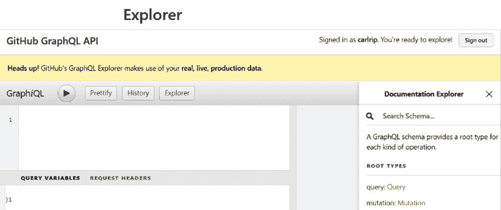

图 10.1 – GitHub GraphQL API 探索器

1.  在 GraphQL API 探索器的右上角面板中，输入以下查询：

    ```js
    query {
    ```

    ```js
      viewer {
    ```

    ```js
        name
    ```

    ```js
      }
    ```

    ```js
    }
    ```

查询以`query`关键字开头，以指定操作是一个用于获取数据（而不是更新数据）的查询。值得注意的是，`query`关键字是可选的，因为操作默认为查询。

在操作之后，通过指定所需的对象和字段来指定要返回的数据。在我们的例子中，我们指定返回`viewer`对象中的`name`字段。

1.  点击**执行查询**按钮，这是一个包含黑色三角形的圆形按钮。

查询结果如下显示在查询的右侧：

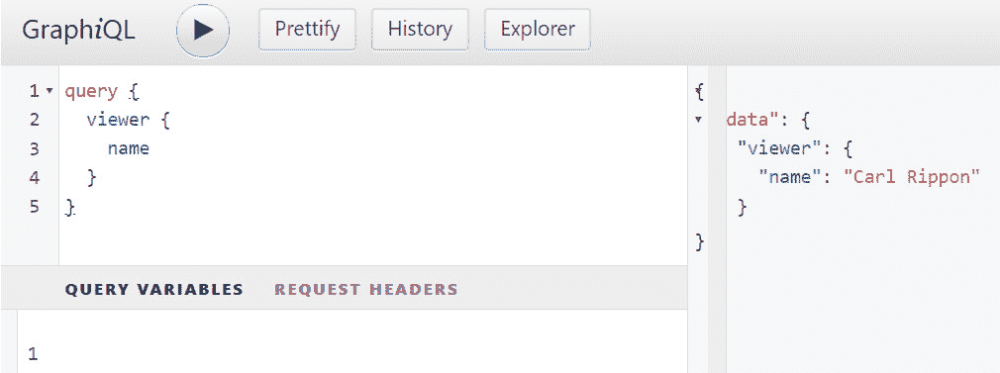

图 10.2 – GitHub GraphQL

我们请求的数据以 JSON 对象的形式返回。`name`字段值应该是你存储在 GitHub 账户中的名字。

1.  在查询结果的右侧是**文档浏览器**。如果尚未展开，请展开此面板：

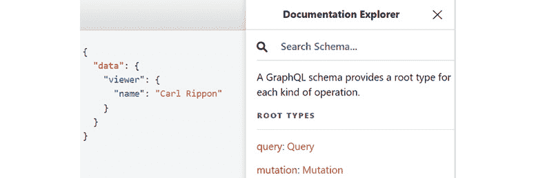

图 10.3 – 文档浏览器

1.  点击`viewer`，这是我们刚刚查询的对象。对象类型出现在对象名称的右侧，对象描述出现在下方。

注意

与许多语言一样，GraphQL 的字段有类型 – 有内置类型如`String`、`Int`和`Boolean`，以及创建自定义类型的能力。有关更多信息，请参阅以下链接：[`graphql.org/learn/schema/#type-language`](https://graphql.org/learn/schema/#type-language)。

1.  滚动到**文档浏览器**中的`viewer`对象（它应该在底部）：


图 10.4 – 文档浏览器中的 viewer 对象

1.  点击`viewer`对象旁边的`User`类型，在`User`类型中列出：

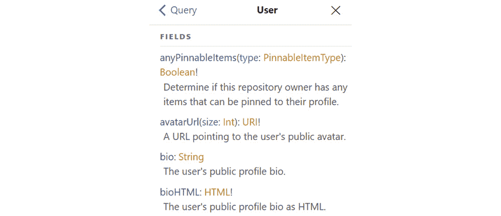

图 10.5 – User 类型中的字段

1.  让我们在查询中添加`avatarUrl`字段，因为这个字段是我们可用的附加字段：

    ```js
    query {
    ```

    ```js
      viewer {
    ```

    ```js
        name
    ```

    ```js
        avatarUrl
    ```

    ```js
      }
    ```

    ```js
    }
    ```

我们只需在`viewer`对象内部添加`avatarUrl`字段，并在`name`字段和`avatarUrl`字段之间添加一个换行符。

1.  如果你执行查询，`avatarUrl`字段将被添加到 JSON 结果中。这应该是一个指向你照片的路径：

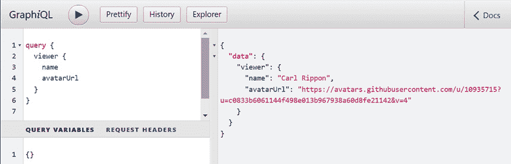

图 10.6 – 包含 avatarUrl 的更新查询结果

这就完成了我们的第一个 graphQL 查询。

1.  我们已经看到了 GraphQL 如何灵活，能够指定我们希望在响应中返回哪些字段。接下来，我们将创建另一个返回层次结构的查询。

## 返回层次化数据

现在，我们将通过返回基于对象的字段而不是只有原始值字段来创建一个更复杂的查询。这意味着结果将具有层次结构而不是扁平的。我们将查询 GitHub 仓库，返回其名称、描述和星级数。所以，执行以下步骤：

1.  首先，将以下查询输入到 GitHub GraphQL API 探索器的查询面板中：

    ```js
    query {
    ```

    ```js
      repository (owner:"facebook", name:"react") {
    ```

    ```js
        id
    ```

    ```js
        name
    ```

    ```js
        description
    ```

    ```js
      }
    ```

    ```js
    }
    ```

查询请求 `repository` 对象中的 `id`、`name` 和 `description` 字段。在指定 `repository` 对象之后，指定了两个参数，用于仓库的 `owner` 和 `name`。

1.  现在，让我们请求仓库的星标数量。为此，在 `stargazers` 对象中添加 `totalCount` 字段，如下所示：

    ```js
    query {
    ```

    ```js
      repository (owner:"facebook", name:"react") {
    ```

    ```js
        id
    ```

    ```js
        name
    ```

    ```js
        description
    ```

    ```js
        stargazers {
    ```

    ```js
          totalCount
    ```

    ```js
        }
    ```

    ```js
      }
    ```

    ```js
    }
    ```

1.  如果你执行查询，结果将类似于以下截图：

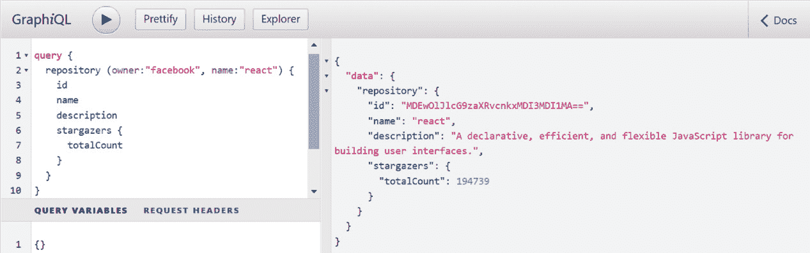

图 10.7 – 查询特定仓库

这就完成了我们的第二个 GraphQL 查询。

因此，GraphQL 允许我们为不同的数据片段发出单个网络请求，只返回我们需要的字段。使用 REST API 做类似的事情可能需要多个请求，并且我们会得到比需要返回的更多数据。在这些类型的查询中，GraphQL 在 REST 上表现得更加出色。

接下来，我们将学习如何允许查询参数值的变化。

## 指定查询参数

我们刚刚做出的查询已经包含了仓库名称和所有者的参数。然而，`owner` 参数被硬编码为 `"facebook"` 的值，而 `name` 参数被设置为 `"react"`。

您可能已经注意到了查询面板下的 **查询变量** 面板。这允许指定查询参数值。然后查询参数引用变量名称而不是硬编码的值。

执行以下步骤以调整仓库查询，以便查询参数可以变化：

1.  在 **查询** **变量** 面板中添加以下查询变量：

    ```js
    {
    ```

    ```js
      "owner": "facebook",
    ```

    ```js
      "name": "react"
    ```

    ```js
    }
    ```

如您所见，变量使用 JSON 语法指定。我们为仓库所有者命名变量为 `owner`，为仓库名称命名变量为 `name`。

1.  更新查询以如下引用查询变量：

    ```js
    query ($owner: String!, $name: String!) {
    ```

    ```js
      repository (owner:$owner, name:$name) {
    ```

    ```js
        ...
    ```

    ```js
      }
    ```

    ```js
    }
    ```

查询参数在 `query` 关键字之后用括号指定。参数名称必须以美元符号（`$`）为前缀。每个参数的类型在冒号（`:`）之后指定——在我们的例子中，两个参数都是 `String`。类型后面的感叹号（`!`）表示它是一个必需的查询参数。然后可以在查询中引用这些参数，在我们的例子中，这是请求仓库对象的地方。

1.  如果我们执行查询，JSON 结果将与具有硬编码的仓库所有者和名称标准的查询相同。

1.  现在，更改变量值以针对不同的仓库重新运行查询。JSON 结果将包含相同的字段，但包含请求的仓库的值。以下是对 TypeScript 仓库的查询和结果：

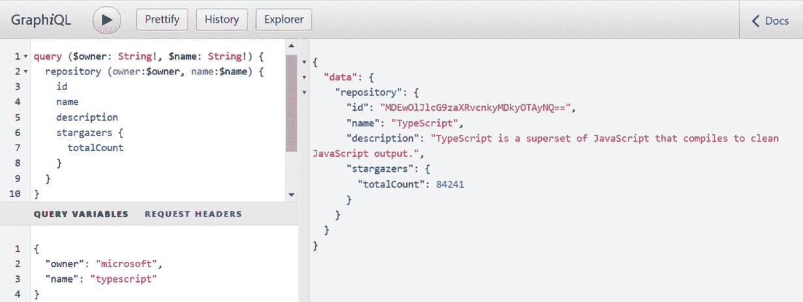

图 10.8 – TypeScript 仓库的参数查询

1.  现在，我们已经熟悉了从 GraphQL 服务器读取数据。接下来，我们将学习如何请求更改 GraphQL 数据。

## GraphQL 变更

在 GraphQL 中对数据进行更改被称为**变更**。星标仓库是对底层数据的更改，因此我们可以将其视为变更的一个示例。

执行以下步骤以创建一个星标 GitHub 仓库的变更：

1.  为了星标一个仓库，我们需要仓库 ID。因此，将最后查询结果的仓库 ID 复制到您的剪贴板。以下 TypeScript 仓库的 ID：

    ```js
    "MDEwOlJlcG9zaXRvcnkyMDkyOTAyNQ=="
    ```

1.  将查询变量替换为我们想要星标的仓库 ID 的变量：

    ```js
    {
    ```

    ```js
      "repoId": "MDEwOlJlcG9zaXRvcnkyMDkyOTAyNQ=="
    ```

    ```js
    }
    ```

1.  将查询面板中的内容替换为以下变更：

    ```js
    mutation ($repoId: ID!) {
    ```

    ```js
      addStar(input: { starrableId: $repoId }) {
    ```

    ```js
        starrable {
    ```

    ```js
          stargazers {
    ```

    ```js
            totalCount
    ```

    ```js
          }
    ```

    ```js
        }
    ```

    ```js
      }
    ```

    ```js
    }
    ```

让我们分解这段代码：

+   我们在`mutation`之前加上`mutation`关键字。

+   我们在括号中的`mutation`关键字之后放置要传递给`mutation`的参数。在我们的例子中，我们有一个用于我们想要星标的仓库 ID 的单个参数。

+   `addStar`是我们调用的`mutation`函数，它有一个名为`input`的参数，我们需要传递。

+   `input`实际上是一个包含一个名为`starrableId`的字段的对象，我们需要包含这个字段。这个值是我们想要星标的仓库 ID，所以我们将其设置为我们的`$repoId`仓库 ID 变量。

+   在`mutation`参数之后，我们指定响应中我们想要返回的内容。在我们的例子中，我们想要返回仓库上的星标数量。

1.  如果我们执行`mutation`，星标将被添加到仓库中，并返回新的总星标数量：

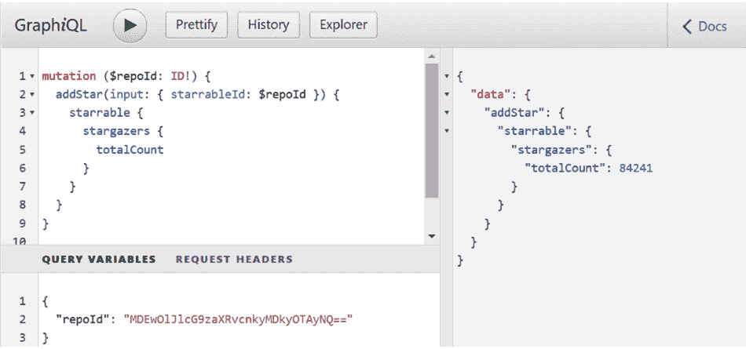

图 10.9 – 将仓库设置为星标

这就完成了本节关于熟悉 GraphQL 语法的介绍。为了回顾，以下是一些关键点：

+   GraphQL 查询获取数据，而变更则更改数据。这些操作分别使用`query`和`mutation`关键字指定。

+   响应中所需的数据可以在查询/变更中指定，这有助于后端交互更高效。

+   查询参数变量可以被指定，以允许查询/变更可重用。

接下来，我们将设置一个 React 项目，该项目最终将与 GitHub GraphQL API 交互。

# 设置项目

在本节中，我们将首先创建我们将要构建的应用程序的项目。我们将构建一个 React 应用程序，允许用户搜索 GitHub 仓库并为其星标。它将使用 GitHub GraphQL API，因此我们将为这个生成一个**个人访问令牌**（**PAT**），并将其存储在环境变量中。

## 创建项目

我们将使用 Visual Studio Code 和一个基于 Create React App 的新项目设置来开发应用程序。我们之前已经多次介绍过这一点，所以在本章中我们将不会介绍这些步骤——相反，请参阅*第三章*，*设置 React* *和 TypeScript*。

我们将使用 Tailwind CSS 来设置应用程序的样式。我们之前在*第五章*，*前端样式方法*中介绍了如何安装和配置 Tailwind 在 Create React App 中。因此，在创建 React 和 TypeScript 项目后，安装并配置 Tailwind。

我们将使用 React Hook Form 来实现创建博客文章的表单，并使用`@tailwindcss/forms`插件来设置表单样式。因此，安装`@tailwindcss/forms`插件和 React Hook Form（如果您忘记如何做，请参阅*第七章*，*与表单一起工作*）。

现在项目已经设置好了，接下来，我们将获取访问 GitHub GraphQL API 的权限。

## 为 GitHub GraphQL API 创建个人访问令牌（PAT）

GitHub GraphQL API 受个人访问令牌（PAT）保护，它是一串字符，是保护 Web API 的常用机制。按照以下步骤生成 PAT：

1.  在浏览器中，访问 GitHub：[`github.com/`](https://github.com/)。

1.  如果您尚未登录，请登录您的 GitHub 账户。如果您还没有 GitHub 账户，可以通过**注册** **账户**按钮创建一个。

1.  现在，打开您的头像下的菜单并点击**设置**。

1.  接下来，访问左侧栏底部的**开发者设置**选项。

1.  前往左侧栏上的**个人访问令牌**页面。

1.  点击**生成新令牌**按钮开始创建 PAT。点击按钮后，您可能需要输入密码。

1.  在生成令牌之前，您将被要求指定作用域。输入令牌描述，勾选仓库和用户作用域，然后点击**生成** **令牌**按钮。

然后在页面上生成并显示令牌。请复制此令牌，因为我们将在下一节构建我们的应用程序时需要它。

## 创建环境变量

在编写与 GitHub GraphQL API 交互的代码之前，我们将为 API URL 和 PAT 创建环境变量：

1.  让我们从创建一个环境文件开始，用于存储 GitHub GraphQL API 的 URL。在项目的根目录中创建一个名为`.env`的文件，包含以下变量：

    ```js
    REACT_APP_GITHUB_URL = https://api.github.com/graphql
    ```

此环境变量在构建时注入到代码中，可以通过`process.env.REACT_APP_GITHUB_URL`由代码访问。Create React App 项目中的环境变量必须以`React_APP_`为前缀。

关于环境变量的更多信息，请参阅以下链接：[`create-react-app.dev/docs/adding-custom-environment-variables/`](https://create-react-app.dev/docs/adding-custom-environment-variables/)。

1.  现在，我们将为 GitHub PAT 令牌创建第二个环境变量。但是，我们不想将此文件提交到源代码控制，所以将其放置在项目根目录下的`.env.local`文件中：

    ```js
    REACT_APP_GITHUB_PAT = your-token
    ```

`.env.local` 在 `.gitignore` 文件中，因此此文件不会提交到源代码控制，从而降低了您的 PAT 被盗的风险。在上面的代码片段中将 `your-token` 替换为您的 PAT 令牌。

这样就完成了环境变量的创建。

在下一节中，我们将开始构建一个将与 GitHub GraphQL API 交互的应用程序。

# 使用 React Query 和 fetch

在本节中，我们将构建一个包含表单的应用程序，允许用户搜索和星标 GitHub 仓库。该应用程序还将包含包含我们从 GitHub 的名字的头部。我们将使用带有 React Query 的浏览器 `fetch` 函数与 GitHub GraphQL API 交互。让我们开始吧。

## 创建头部

我们将创建包含我们的 GitHub 名字的头部。我们将创建一个 `Header` 组件，其中包含此内容，它将从 `App` 组件中引用。`Header` 组件将使用 React Query 执行一个函数，该函数调用 GitHub GraphQL API 获取我们的 GitHub 名字。

### 创建一个获取查看者信息的函数

执行以下步骤以创建一个函数，该函数向 GitHub GraphQL API 发送请求以获取有关已登录查看者的详细信息：

1.  我们将首先创建一个用于 API 调用的文件夹。在 `src` 文件夹中创建一个名为 `api` 的文件夹。

1.  现在，我们将创建一个函数将使用的类型。在 `src/api` 文件夹中创建一个名为 `types.ts` 的文件，内容如下：

    ```js
    export type ViewerData = {
    ```

    ```js
      name: string;
    ```

    ```js
      avatarUrl: string;
    ```

    ```js
    };
    ```

此类型表示已登录的查看者。

1.  在 `api` 文件夹中创建一个名为 `getViewer.ts` 的文件，该文件将包含我们需要实现的函数。为刚刚创建的类型添加一个导入语句：

    ```js
    import { ViewerData } from './types';
    ```

1.  在导入语句下，添加一个常量，并将其分配给下面的 GraphQL 查询：

    ```js
    export const GET_VIEWER_QUERY = `
    ```

    ```js
      query {
    ```

    ```js
        viewer {
    ```

    ```js
          name
    ```

    ```js
          avatarUrl
    ```

    ```js
        }
    ```

    ```js
      }
    ```

    ```js
    `;
    ```

这是我们之前在章节中用来获取当前查看者姓名和头像 URL 的相同查询。

1.  在此文件中添加以下类型，它表示 GraphQL API 调用的响应：

    ```js
    type GetViewerResponse = {
    ```

    ```js
      data: {
    ```

    ```js
        viewer: ViewerData;
    ```

    ```js
      };
    ```

    ```js
    };
    ```

1.  按照以下方式开始实现函数：

    ```js
    export async function getViewer() {
    ```

    ```js
      const response = await fetch(
    ```

    ```js
        process.env.REACT_APP_GITHUB_URL!
    ```

    ```js
      );
    ```

    ```js
    }
    ```

我们使用 `fetch` 函数向 GraphQL API 发送请求。我们使用了 `REACT_APP_GITHUB_URL` 环境变量来指定 GraphQL API URL。环境变量值可以是 `undefined`，但我们知道这不是情况，所以我们在此之后添加了一个非空断言 (`!`)。

1.  按照以下方式在请求体中指定 GraphQL 查询：

    ```js
    export async function getViewer() {
    ```

    ```js
      const response = await fetch(
    ```

    ```js
        process.env.REACT_APP_GITHUB_URL!,
    ```

    ```js
        {
    ```

    ```js
          body: JSON.stringify({
    ```

    ```js
            query: GET_VIEWER_QUERY
    ```

    ```js
          }),
    ```

    ```js
          headers: {
    ```

    ```js
            'Content-Type': 'application/json'
    ```

    ```js
          }
    ```

    ```js
        }
    ```

    ```js
      );
    ```

    ```js
    }
    ```

GraphQL 查询在请求体中以对象结构指定，包含一个 `query` 属性，该属性包含 GraphQL 查询字符串，在我们的例子中是 `GET_VIEWER_QUERY`。我们还指定请求以 JSON 格式使用 `Content-Type` HTTP 头。

1.  对于 GraphQL API 请求必须使用 HTTP `POST` 方法。因此，让我们在请求中指定这一点：

    ```js
    export async function getViewer() {
    ```

    ```js
      const response = await fetch(
    ```

    ```js
        process.env.REACT_APP_GITHUB_URL!,
    ```

    ```js
        {
    ```

    ```js
          method: 'POST',
    ```

    ```js
          body: ...,
    ```

    ```js
          headers: ...,
    ```

    ```js
        }
    ```

    ```js
      );
    ```

    ```js
    }
    ```

1.  PAT 保护 GitHub GraphQL API，因此让我们将其添加到请求中：

    ```js
    export async function getViewer() {
    ```

    ```js
      const response = await fetch(
    ```

    ```js
        process.env.REACT_APP_GITHUB_URL!,
    ```

    ```js
        {
    ```

    ```js
          ...,
    ```

    ```js
          headers: {
    ```

    ```js
            'Content-Type': 'application/json',
    ```

    ```js
            Authorization: `bearer ${process.env.REACT_APP_          GITHUB_PAT}`
    ```

    ```js
          },
    ```

    ```js
        }
    ```

    ```js
      );
    ```

    ```js
    }
    ```

1.  函数的最后几个步骤是获取 JSON 响应体，并适当地对其进行类型化，然后再返回：

    ```js
    export async function getViewer() {
    ```

    ```js
      const response = await fetch(
    ```

    ```js
        ...
    ```

    ```js
      );
    ```

    ```js
      const body = (await response.json()) as unknown;
    ```

    ```js
      assertIsGetViewerResponse(body);
    ```

    ```js
      return body.data;
    ```

    ```js
    }
    ```

1.  我们使用名为`assertIsGetViewerResponse`的类型断言函数来缩小`body`的类型。该函数的实现较长，与我们在*第九章*，“与 RESTful API 交互”中实现的模式相同，因此我们在此步骤中不列出它，但请参阅[`github.com/PacktPublishing/Learn-React-with-TypeScript-2nd-Edition/blob/main/Chapter10/Using-React-Query/src/api/getViewer.ts`](https://github.com/PacktPublishing/Learn-React-with-TypeScript-2nd-Edition/blob/main/Chapter10/Using-React-Query/src/api/getViewer.ts)以了解该函数的实现。

一个不同之处在于，该函数的参数类型为`any`而不是`unknown`。这是由于 TypeScript 的一个已知问题，即当`unknown`类型是对象时，无法缩小其类型。有关更多信息，请参阅以下链接：[`github.com/microsoft/TypeScript/issues/25720`](https://github.com/microsoft/TypeScript/issues/25720)。在这种情况下使用`any`类型是可以的——`assertIsGetViewerResponse`函数将完美地工作。

这样就完成了获取已登录 GitHub 观看者详细信息的函数实现。

接下来，我们将创建页眉组件。

### 创建页眉组件

我们将创建一个应用程序页眉组件，该组件将调用我们刚刚实现的`getViewer`函数并显示观看者的姓名和头像：

1.  我们将使用 React Query 调用`getViewer`并管理它返回的数据。因此，让我们通过在终端中运行以下命令来安装此包：

    ```js
    npm i @tanstack/react-query
    ```

1.  在`src`文件夹中创建一个名为`Header.tsx`的组件文件。

1.  在`Header.tsx`中添加以下导入语句，以导入 React Query 的`useQuery`钩子和我们的`getViewer`函数：

    ```js
    import { useQuery } from '@tanstack/react-query';
    ```

    ```js
    import { getViewer } from './api/getViewer';
    ```

1.  按照以下步骤开始实现`Header`组件：

    ```js
    export function Header() {
    ```

    ```js
      const { isLoading, data } = useQuery(['viewer'],     getViewer);
    ```

    ```js
    }
    ```

我们使用`useQuery`钩子调用`getViewer`。`getViewer`返回的数据将位于解构的`data`变量中。我们还解构了一个`isLoading`变量，以便在下一步实现加载指示器。

1.  添加如下加载指示器：

    ```js
    export function Header() {
    ```

    ```js
      const { isLoading, data } = useQuery(['viewer'],     getViewer);
    ```

    ```js
      if (isLoading || data === undefined) {
    ```

    ```js
        return <div>...</div>;
    ```

    ```js
      }
    ```

    ```js
    }
    ```

1.  使用以下 JSX 完成组件实现：

    ```js
    export function Header() {
    ```

    ```js
      ...
    ```

    ```js
      return (
    ```

    ```js
        <header className="flex flex-col items-center text-      slate-50 bg-slate-900 h-40 p-5">
    ```

    ```js
          
    ```

    ```js
          <div>{data.viewer.name}</div>
    ```

    ```js
          <h1 className="text-xl font-bold">GitHub Search</        h1>
    ```

    ```js
        </header>
    ```

    ```js
      );
    ```

    ```js
    }
    ```

渲染一个背景为非常深灰色的`header`元素。该`header`元素包含观看者的头像、姓名和**GitHub 搜索**的标题，所有内容水平居中。

这样就完成了页眉的实现。接下来，我们将将其添加到组件树中。

### 将 Header 组件添加到应用程序中

执行以下步骤将`Header`组件添加到`App`组件中：

1.  打开`App.tsx`并删除所有现有内容。

1.  添加导入语句，用于 React Query 的提供者组件和客户端以及我们的`Header`组件：

    ```js
    import {
    ```

    ```js
      QueryClient,
    ```

    ```js
      QueryClientProvider,
    ```

    ```js
    } from '@tanstack/react-query';
    ```

    ```js
    import { Header } from './Header';
    ```

1.  通过将 React Query 的提供者组件包裹在`Header`组件周围来实现组件：

    ```js
    const queryClient = new QueryClient();
    ```

    ```js
    function App() {
    ```

    ```js
      return (
    ```

    ```js
        <QueryClientProvider client={queryClient}>
    ```

    ```js
          <Header />
    ```

    ```js
        </QueryClientProvider>
    ```

    ```js
      );
    ```

    ```js
    }
    ```

    ```js
    export default App;
    ```

1.  现在，让我们在终端中运行`npm start`来尝试应用程序。应该会显示包含你的头像和姓名的页眉：


图 10.10 – 包含查看者头像和名称的头部

这完成了应用头部。接下来，我们将开始实现应用的主要部分。

## 创建仓库页面

应用程序的主要部分将是一个允许用户搜索 GitHub 仓库并为其加星的页面。页面组件将被命名为 `RepoPage`，并将引用其他三个组件，如下所示：

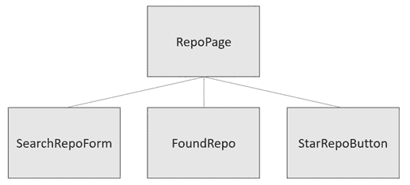


这里是对组件的解释：

+   允许用户输入搜索条件的表单将包含在 `SearchRepoForm` 组件中

+   `FoundRepo` 组件将在搜索后渲染匹配的仓库

+   `StarRepoButton` 组件将渲染用户可以点击以加星仓库的按钮

+   `RepoPage` 组件将使用 React Query 来管理对 GitHub GraphQL API 的调用并存储返回的数据

接下来，我们将通过实现一个用于执行仓库搜索的函数来开始构建仓库页面。

### 创建搜索函数

我们将首先实现一个调用 GitHub GraphQL API 以查找仓库的函数。执行以下步骤：

1.  我们将首先创建几个函数将使用的类型。打开 `src/api/types.ts` 并添加以下类型：

    ```js
    export type SearchCriteria = {
    ```

    ```js
      org: string,
    ```

    ```js
      repo: string,
    ```

    ```js
    };
    ```

    ```js
    export type RepoData = {
    ```

    ```js
      repository: {
    ```

    ```js
        id: string,
    ```

    ```js
        name: string,
    ```

    ```js
        description: string,
    ```

    ```js
        viewerHasStarred: boolean,
    ```

    ```js
        stargazers: {
    ```

    ```js
          totalCount: number,
    ```

    ```js
        },
    ```

    ```js
      },
    ```

    ```js
    };
    ```

`SearchCriteria` 类型表示我们在 GraphQL 查询参数中需要的信息，以找到 GitHub 仓库。`RepoData` 类型表示从仓库搜索返回的数据。

1.  在 `src/api` 文件夹中创建一个名为 `getRepo.ts` 的函数文件。

1.  打开 `getRepo.ts` 并首先导入刚刚创建的类型：

    ```js
    import { RepoData, SearchCriteria } from './types';
    ```

1.  为以下 GraphQL 查询添加一个常量：

    ```js
    export const GET_REPO = `
    ```

    ```js
      query GetRepo($org: String!, $repo: String!) {
    ```

    ```js
        repository(owner: $org, name: $repo) {
    ```

    ```js
          id
    ```

    ```js
          name
    ```

    ```js
          description
    ```

    ```js
          viewerHasStarred
    ```

    ```js
          stargazers {
    ```

    ```js
            totalCount
    ```

    ```js
          }
    ```

    ```js
        }
    ```

    ```js
      }
    ```

    ```js
    `;
    ```

这是我们在本章 GitHub GraphQL API 探索器中创建的相同查询。

1.  在常量下方添加以下类型：

    ```js
    type GetRepoResponse = {
    ```

    ```js
      data: RepoData;
    ```

    ```js
    };
    ```

`GetRepoResponse` 类型表示从 GraphQL 查询返回的数据 – 它引用我们在 *步骤 1* 中创建的 `RepoData` 类型。

1.  按以下方式实现函数：

    ```js
    export async function getRepo(searchCriteria: SearchCriteria) {
    ```

    ```js
      const response = await fetch(process.env.REACT_APP_    GITHUB_URL!, {
    ```

    ```js
        method: 'POST',
    ```

    ```js
        body: JSON.stringify({
    ```

    ```js
          query: GET_REPO,
    ```

    ```js
          variables: {
    ```

    ```js
            org: searchCriteria.org,
    ```

    ```js
            repo: searchCriteria.repo,
    ```

    ```js
          },
    ```

    ```js
        }),
    ```

    ```js
        headers: {
    ```

    ```js
          'Content-Type': 'application/json',
    ```

    ```js
          Authorization: `bearer ${process.env.REACT_APP_        GITHUB_PAT}`,
    ```

    ```js
        },
    ```

    ```js
      });
    ```

    ```js
      const body = (await response.json()) as unknown;
    ```

    ```js
      assertIsGetRepoResponse(body);
    ```

    ```js
      return body.data;
    ```

    ```js
    }
    ```

这与我们在之前创建的获取查看者信息的函数遵循相同的模式。一个区别是我们已经指定了 GraphQL 查询 `org` 和 `repo` 参数，它们被设置为 `searchCriteria` 函数参数中的属性。

1.  `assertIsGetRepoResponse` 类型断言函数遵循与之前类型断言函数相同的模式。实现较为冗长，因此在此未列出。您可以在以下位置找到实现：[`github.com/PacktPublishing/Learn-React-with-TypeScript-2nd-Edition/blob/main/Chapter10/Using-React-Query/src/api/getRepo.ts`](https://github.com/PacktPublishing/Learn-React-with-TypeScript-2nd-Edition/blob/main/Chapter10/Using-React-Query/src/api/getRepo.ts)。

这完成了查找 GitHub 仓库的函数实现。

接下来，我们将创建仓库搜索表单组件。

### 创建搜索表单组件

我们将实现一个表单组件，允许用户搜索仓库。表单将包含组织和仓库名称字段。组件在表单提交时不会调用 GitHub GraphQL API；相反，它将提交的搜索条件传递回页面组件以执行此操作。

我们将使用 React Hook Form 进行实现，它应该已经安装。实现模式与之前我们实现的表单非常相似，因此这里没有详细列出执行此实现的步骤。`SearchRepoForm` 组件的实现可以从书的 GitHub 仓库中复制如下：

1.  在 `src` 文件夹中创建一个名为 `repoPage` 的新文件夹，然后在此文件夹中创建一个名为 `SearchRepoForm.tsx` 的新文件。

1.  打开 `SearchRepoForm.tsx` 并将其内容从 [`github.com/PacktPublishing/Learn-React-with-TypeScript-2nd-Edition/blob/main/Chapter10/Using-React-Query/src/repoPage/SearchRepoForm.tsx`](https://github.com/PacktPublishing/Learn-React-with-TypeScript-2nd-Edition/blob/main/Chapter10/Using-React-Query/src/repoPage/SearchRepoForm.tsx) 复制到其中。

`SearchRepoForm` 组件的实现现在已经在我们的项目中就绪。

接下来，我们将实现一个渲染找到的仓库的组件。

### 创建 FoundRepo 组件

`FoundRepo` 组件将显示仓库名称、描述和星级数。执行以下步骤来实现此组件：

1.  在 `src/repoPage` 文件夹中创建一个名为 `FoundRepo.tsx` 的文件。

1.  通过添加以下组件属性类型来开始实现：

    ```js
    type Props = {
    ```

    ```js
      name: string;
    ```

    ```js
      description: string;
    ```

    ```js
      stars: number;
    ```

    ```js
    };
    ```

因此，仓库名称、描述和星级数将被传递到组件中。

1.  添加以下组件实现：

    ```js
    export function FoundRepo({ name, description, stars }: Props) {
    ```

    ```js
      return (
    ```

    ```js
        <div className="py-4">
    ```

    ```js
          <div className="flex flex-row items-center justify-        between mb-2">
    ```

    ```js
            <h2 className="text-xl font-bold">{name}</h2>
    ```

    ```js
            <div className="px-4 py-2 rounded-xl text-          gray-800 bg-gray-200 font-semibold text-sm flex           align-center w-max">
    ```

    ```js
              {stars} Stars
    ```

    ```js
            </div>
    ```

    ```js
          </div>
    ```

    ```js
          <p>{description}</p>
    ```

    ```js
        </div>
    ```

    ```js
      );
    ```

    ```js
    }
    ```

仓库名称被渲染为粗体标题。星级数在仓库名称右侧的灰色圆角背景中渲染。描述在名称下方渲染。

这样就完成了找到的仓库组件的实现。

接下来，我们将实现调用 GitHub GraphQL API 来标记仓库的函数。

### 创建标记仓库的函数

我们将使用本章前面用于标记 GitHub 仓库的相同 GraphQL 查询。函数中使用的模式将与之前我们创建的 `getViewer` 函数相似。执行以下步骤：

1.  在 `src/api` 文件夹中创建一个名为 `starRepo.ts` 的文件，包含以下 GraphQL 查询：

    ```js
    export const STAR_REPO = `
    ```

    ```js
      mutation ($repoId: ID!) {
    ```

    ```js
        addStar(input: { starrableId: $repoId }) {
    ```

    ```js
          starrable {
    ```

    ```js
            stargazers {
    ```

    ```js
              totalCount
    ```

    ```js
            }
    ```

    ```js
          }
    ```

    ```js
        }
    ```

    ```js
      }
    ```

    ```js
    `;
    ```

这是我们在 GitHub GraphQL API 探索器中之前创建的相同查询。

1.  添加以下函数实现：

    ```js
    export async function starRepo(repoId: string) {
    ```

    ```js
      const response = await fetch(process.env.REACT_APP_    GITHUB_URL!, {
    ```

    ```js
        method: 'POST',
    ```

    ```js
        body: JSON.stringify({
    ```

    ```js
          query: STAR_REPO,
    ```

    ```js
          variables: {
    ```

    ```js
            repoId,
    ```

    ```js
          },
    ```

    ```js
        }),
    ```

    ```js
        headers: {
    ```

    ```js
          'Content-Type': 'application/json',
    ```

    ```js
          Authorization: `bearer ${process.env.REACT_APP_        GITHUB_PAT}`,
    ```

    ```js
        },
    ```

    ```js
      });
    ```

    ```js
      await response.json();
    ```

    ```js
    }
    ```

这与其他调用 GitHub GraphQL API 的函数遵循相同的模式。

这样就完成了调用 GitHub GraphQL API 来标记仓库的功能。

接下来，我们将实现星号按钮组件。

### 创建星号按钮

星号按钮是一个被样式化为黑色文字的普通按钮。

在 `src/repoPage` 文件夹中创建一个名为 `StarRepoButton.tsx` 的文件，并将以下实现添加到其中：

```js
type Props = {
  onClick: () => void;
};
export function StarRepoButton({ onClick }: Props) {
  return (
    <button
      type="button"
      className="mt-2 h-10 px-6 font-semibold bg-black text-        white"
      onClick={onClick}
    >
      Star
    </button>
  );
}
```

这样就完成了星号按钮的实现。

接下来，我们将创建应用的主页组件。

### 创建仓库页面

仓库页面组件将引用我们刚刚创建的 `SearchRepoForm`、`FoundRepo` 和 `StarRepoButton` 组件。此组件还将调用我们使用 React Query 创建的 `getRepo` 和 `starRepo` 函数。为此，执行以下步骤：

1.  在 `src/repoPage` 文件夹中创建一个名为 `RepoPage.tsx` 的文件，并添加以下导入语句：

    ```js
    import { useState } from 'react';
    ```

    ```js
    import {
    ```

    ```js
      useQuery,
    ```

    ```js
      useMutation,
    ```

    ```js
      useQueryClient,
    ```

    ```js
    } from '@tanstack/react-query';
    ```

    ```js
    import { getRepo } from '../api/getRepo';
    ```

    ```js
    import { starRepo } from '../api/starRepo';
    ```

    ```js
    import { RepoData, SearchCriteria } from '../api/types';
    ```

    ```js
    import { SearchRepoForm } from './SearchRepoForm';
    ```

    ```js
    import { FoundRepo } from './FoundRepo';
    ```

    ```js
    import { StarRepoButton } from './StarRepoButton';
    ```

我们已经导入了我们之前创建的组件和数据函数，以及 React Query 的钩子和客户端。我们还导入了 React 的状态钩子，因为我们需要在 React Query 之外存储一些状态。

1.  按照以下方式开始组件实现：

    ```js
    export function RepoPage() {
    ```

    ```js
      const [searchCriteria, setSearchCriteria] = useState<
    ```

    ```js
        SearchCriteria | undefined
    ```

    ```js
      >();
    ```

    ```js
    }
    ```

我们将搜索标准存储在状态中，以便在下一步中将它输入到 `useQuery` 中。我们将在搜索仓库表单提交的 *第 6 步* 中设置此状态。

1.  接下来，调用 `useQuery` 钩子以获取给定搜索标准对应的仓库，如下所示：

    ```js
    export function RepoPage() {
    ```

    ```js
      const [searchCriteria, setSearchCriteria] = ...
    ```

    ```js
      const { data } = useQuery(
    ```

    ```js
        ['repo', searchCriteria],
    ```

    ```js
        () => getRepo(searchCriteria as SearchCriteria),
    ```

    ```js
        {
    ```

    ```js
          enabled: searchCriteria !== undefined,
    ```

    ```js
        }
    ```

    ```js
      );
    ```

    ```js
    }
    ```

我们不希望在组件挂载时执行查询，因此我们使用 `enabled` 选项仅在 `searchCriteria` 设置时运行查询，这将在搜索仓库表单提交时发生。

我们在查询键中使用搜索标准，并将其传递给 `getRepo` 函数。我们对 `getRepo` 参数使用类型断言以从其中移除 `undefined`。这是安全的，因为我们知道在调用 `getRepo` 时由于 `enabled` 选项表达式，它不能是 `undefined`。

1.  按照以下方式定义星号变异：

    ```js
    export function RepoPage() {
    ```

    ```js
      const [searchCriteria, setSearchCriteria] = ...
    ```

    ```js
      const { data } = useQuery(...);
    ```

    ```js
      const queryClient = useQueryClient();
    ```

    ```js
      const { mutate } = useMutation(starRepo, {
    ```

    ```js
        onSuccess: () => {
    ```

    ```js
          queryClient.setQueryData<RepoData>(
    ```

    ```js
            ['repo', searchCriteria],
    ```

    ```js
            (repo) => {
    ```

    ```js
              if (repo === undefined) {
    ```

    ```js
                return undefined;
    ```

    ```js
              }
    ```

    ```js
              return {
    ```

    ```js
                ...repo,
    ```

    ```js
                viewerHasStarred: true,
    ```

    ```js
              };
    ```

    ```js
            }
    ```

    ```js
          );
    ```

    ```js
        }
    ```

    ```js
      });
    ```

    ```js
    }
    ```

变异调用我们之前创建的 `getRepo` 函数。我们使用变异的 `onSuccess` 选项来更新 React Query 的缓存仓库数据，并将 `viewerHasStarred` 属性设置为 `true`。

1.  从组件返回以下 JSX：

    ```js
    export function RepoPage() {
    ```

    ```js
      ...
    ```

    ```js
      return (
    ```

    ```js
        <main className="max-w-xs ml-auto mr-auto">
    ```

    ```js
          <SearchRepoForm onSearch={handleSearch} />
    ```

    ```js
          {data && (
    ```

    ```js
            <>
    ```

    ```js
              <FoundRepo
    ```

    ```js
                name={data.repository.name}
    ```

    ```js
                description={data.repository.description}
    ```

    ```js
                stars={data.repository.stargazers.totalCount}
    ```

    ```js
              />
    ```

    ```js
              {!data.repository.viewerHasStarred && (
    ```

    ```js
                <StarRepoButton onClick={handleStarClick} />
    ```

    ```js
              )}
    ```

    ```js
            </>
    ```

    ```js
          )}
    ```

    ```js
        </main>
    ```

    ```js
      );
    ```

    ```js
    }
    ```

组件被包裹在一个 `main` 元素中，它使内容居中。仓库搜索表单放置在 `main` 元素内部。如果找到了仓库，则会渲染找到的仓库（如果找到了仓库）以及星号按钮（如果仓库尚未被收藏）。

我们将在以下步骤中实现 `handleSearch` 和 `handleStarClick` 处理器。

1.  按照以下方式创建 `handleSearch` 处理器：

    ```js
    export function RepoPage() {
    ```

    ```js
      ...
    ```

    ```js
      function handleSearch(search: SearchCriteria) {
    ```

    ```js
        setSearchCriteria(search);
    ```

    ```js
      }
    ```

    ```js
      return ...
    ```

    ```js
    }
    ```

处理器设置 `searchCriteria` 状态，这会触发重新渲染以及 `useQuery` 钩子调用 `getRepo` 并传入搜索标准。

1.  按照以下方式创建 `handleStarClick` 处理器：

    ```js
    export function RepoPage() {
    ```

    ```js
      ...
    ```

    ```js
      function handleStarClick() {
    ```

    ```js
        if (data) {
    ```

    ```js
          mutate(data.repository.id);
    ```

    ```js
        }
    ```

    ```js
      }
    ```

    ```js
      return ...
    ```

    ```js
    }
    ```

处理器调用变异并传入找到的仓库的 ID，这将调用 `starRepo` 函数。

这样就完成了仓库页面组件的实现。

1.  打开 `App.tsx` 并在应用标题下添加我们刚刚创建的 `RepoPage` 组件：

    ```js
    ...
    ```

    ```js
    import { RepoPage } from './repoPage/RepoPage';
    ```

    ```js
    ...
    ```

    ```js
    function App() {
    ```

    ```js
      return (
    ```

    ```js
        <QueryClientProvider client={queryClient}>
    ```

    ```js
          <Header />
    ```

    ```js
          <RepoPage />
    ```

    ```js
        </QueryClientProvider>
    ```

    ```js
      );
    ```

    ```js
    }
    ```

1.  现在，让我们在终端中运行 `npm start` 来尝试这个应用。应该会显示仓库搜索表单，如下所示：

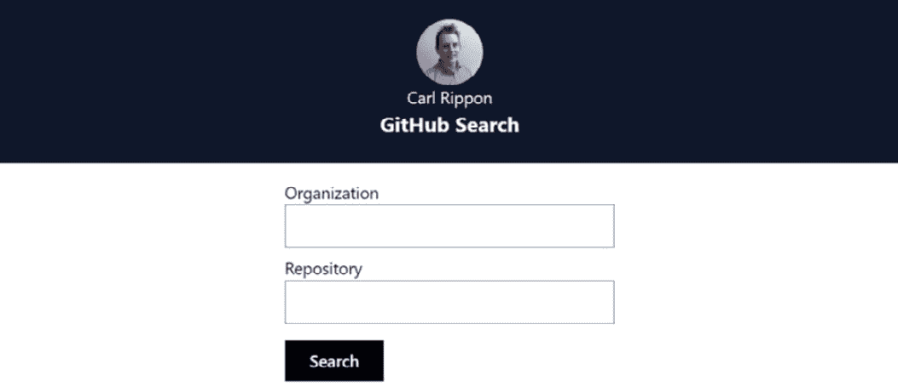

图 10.12 – 仓库搜索表单

1.  输入一个你还没有收藏的 GitHub 组织和仓库，然后按 **Search**。找到的仓库将显示一个 **Star** 按钮：

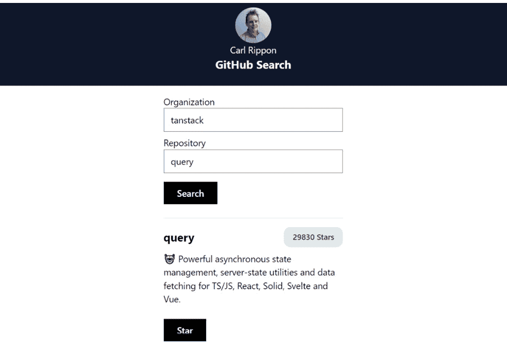

图 10.13 – 带有 Star 按钮的找到的仓库

1.  点击 **Star** 按钮来收藏仓库。然后 **Star** 按钮将消失。

1.  在继续之前，通过在终端中按 *Ctrl* + *C* 停止应用运行。

这完成了应用的第一次迭代。以下是使用 `fetch` 和 React Query 与 GraphQL API 交互的关键点的总结：

+   `fetch` 函数可以通过将查询或突变放在请求体中并使用 HTTP `POST` 方法来调用 GraphQL API。

+   React Query 可以执行包含 `fetch` 的函数并管理响应数据。

+   `useQuery` 和 `useMutation` 上的 `enabled` 选项可以在用户与应用交互时执行包含 `fetch` 的函数。我们使用了这个功能在提交仓库搜索表单时执行查询。

在下一节中，我们将重构代码以使用专门的 GraphQL 客户端。

# 使用 Apollo Client

在本节中，我们将了解 Apollo Client 并在我们构建的应用中使用它，以替换 React Query 和 `fetch` 的使用。

## 理解 Apollo Client

Apollo Client 是一个用于与 GraphQL 服务器交互的客户端库。它拥有名为 `useQuery` 和 `useMutation` 的查询和突变钩子，类似于 React Query。Apollo Client 还像 React Query 一样在客户端缓存中存储数据，并需要一个放置在需要 GraphQL 数据的组件之上的提供者组件。

Apollo Client 做的一件事是，它直接与 GraphQL API 交互，而不是要求一个函数来做这件事，这是 React Query 所不具备的。

## 安装 Apollo Client

我们的第一项任务是安装 Apollo Client，我们可以在终端中运行以下命令来完成：

```js
npm i @apollo/client graphql
```

这个库包含了 TypeScript 类型，因此不需要安装额外的包。

## 重构 App 组件

我们将要重构的第一个组件是 `App` 组件。执行以下步骤：

1.  打开 `App.tsx` 并将 React Query 的导入替换为以下 Apollo Client 的导入语句：

    ```js
    import {
    ```

    ```js
      ApolloClient,
    ```

    ```js
      InMemoryCache,
    ```

    ```js
      ApolloProvider,
    ```

    ```js
    } from '@apollo/client';
    ```

1.  更新 `queryClient` 变量的赋值如下：

    ```js
    const queryClient = new ApolloClient({
    ```

    ```js
      uri: process.env.REACT_APP_GITHUB_URL!,
    ```

    ```js
      cache: new InMemoryCache(),
    ```

    ```js
      headers: {
    ```

    ```js
        Authorization: `bearer ${process.env.REACT_APP_GITHUB_PAT}`,
    ```

    ```js
      }
    ```

    ```js
    });
    ```

我们现在正在使用 Apollo Client。我们已经指定了 API 的 URL 和 PAT，因为 Apollo Client 将直接调用 API。

1.  最后一步是将 JSX 中的 `QueryClientProvider` 替换为 `ApolloProvider`。

    ```js
    <ApolloProvider client={queryClient}>
    ```

    ```js
      <Header />
    ```

    ```js
      <RepoPage />
    ```

    ```js
    </ApolloProvider>
    ```

`App` 组件现在正在使用 Apollo Client。

接下来，我们将重构 `Header` 组件。

## 重构 Header 组件

现在，我们将重构 `Header` 组件以使用 Apollo Client。执行以下步骤：

1.  打开`getViewer.ts`文件。由于 Apollo Client 不需要这些，可以删除`getViewer`和`assertIsGetViewerResponse`函数以及`GetViewerResponse`类型。还可以删除`ViewerData`的导入语句。

1.  将以下导入语句添加到`getViewer.tsx`文件中：

    ```js
    import { gql } from '@apollo/client';
    ```

`gql`是一个函数，我们将在下一步中使用它来包装 GraphQL 查询字符串常量。

1.  将`gql`函数添加到 GraphQL 查询字符串常量之前，如下所示：

    ```js
    export const GET_VIEWER_QUERY = gql`
    ```

    ```js
      query {
    ```

    ```js
        viewer {
    ```

    ```js
          name
    ```

    ```js
          avatarUrl
    ```

    ```js
        }
    ```

    ```js
      }
    ```

    ```js
    `;
    ```

因此，`GET_VIEWER_QUERY`现在被分配给一个标签模板字面量，而不是一个普通字符串。我们在*第五章*中介绍了标签模板字面量，当时我们使用了 Emotion 的`css`属性。`gql`函数将查询字符串转换为 Apollo Client 可以使用的查询对象。

1.  打开`Header.tsx`文件并更新`useQuery`的导入语句，使其来自 Apollo Client。同时导入从`getViewer.ts`导出的常量。我们不再需要导入`getViewer`。

    ```js
    import { useQuery } from '@apollo/client';
    ```

    ```js
    import { GET_VIEWER_QUERY } from './api/getViewer';
    ```

1.  现在更新`useQuery`钩子如下：

    ```js
    const { loading: isLoading, data } = useQuery(
    ```

    ```js
      GET_VIEWER_QUERY
    ```

    ```js
    );
    ```

Apollo Client 的`useQuery`钩子接受一个查询定义对象的参数，并返回类似于 React Query 的有用状态变量。我们将`loading`状态变量别名为`isLoading`，以便加载指示器的渲染保持不变。

关于 Apollo Client 查询的更多信息，请参阅以下链接：[`www.apollographql.com/docs/react/data/queries/`](https://www.apollographql.com/docs/react/data/queries/).

这样就完成了`Header`组件。

接下来，我们将重构仓库页面。

## 重构仓库页面

重构仓库页面将是一个类似的过程。执行以下步骤：

1.  打开`getRepo.ts`文件，删除`getRepo`和`assertIsGetResponse`函数以及`GetRepoReponse`类型。同时删除导入的`RepoData`和`SearchCriteria`类型。

1.  导入`gql`函数并将其添加到查询字符串之前：

    ```js
    import { gql } from '@apollo/client';
    ```

    ```js
    export const GET_REPO = gql`
    ```

    ```js
      query ...
    ```

    ```js
    `;
    ```

1.  打开`starRepo.ts`文件并删除`starRepo`函数。

1.  导入`gql`函数并将其添加到查询字符串之前：

    ```js
    import { gql } from '@apollo/client';
    ```

    ```js
    export const STAR_REPO = gql`
    ```

    ```js
      mutation ...
    ```

    ```js
    `;
    ```

1.  打开`RepoPage.tsx`文件并将 React Query 的导入语句替换为 Apollo Client 的导入语句。同时导入我们在前两个步骤中更改的 GraphQL 查询常量：

    ```js
    import {
    ```

    ```js
      useLazyQuery,
    ```

    ```js
      useMutation,
    ```

    ```js
      useApolloClient,
    ```

    ```js
    } from '@apollo/client';
    ```

    ```js
    import { GET_REPO } from '../api/getRepo';
    ```

    ```js
    import { STAR_REPO } from '../api/starRepo';
    ```

我们将使用`useLazyQuery`钩子而不是`useQuery`，因为我们希望在表单提交时触发查询，而不是在组件挂载时。

1.  将对`useQuery`的调用替换为以下对`useLazyQuery`的调用：

    ```js
    const [getRepo, { data }] = useLazyQuery(GET_REPO);
    ```

`useLazyQuery`返回一个元组，其中第一个元素是一个可以调用来触发查询的函数。我们称这个触发函数为`getRepo`。第二个元组元素是一个包含有用状态变量的对象，例如 API 响应中的数据，我们已对其进行解构。

有关 `useLazyQuery` 的更多信息，请参阅以下链接：[`www.apollographql.com/docs/react/data/queries/#manual-execution-with-uselazyquery`](https://www.apollographql.com/docs/react/data/queries/#manual-execution-with-uselazyquery)。

1.  接下来，将 `queryClient` 变量赋值和 `useMutation` 调用替换为以下内容：

    ```js
    const queryClient = useApolloClient();
    ```

    ```js
    const [starRepo] = useMutation(STAR_REPO, {
    ```

    ```js
      onCompleted: () => {
    ```

    ```js
        queryClient.cache.writeQuery({
    ```

    ```js
          query: GET_REPO,
    ```

    ```js
          data: {
    ```

    ```js
            repository: {
    ```

    ```js
              ...data.repository,
    ```

    ```js
              viewerHasStarred: true,
    ```

    ```js
            },
    ```

    ```js
          },
    ```

    ```js
          variables: searchCriteria,
    ```

    ```js
        });
    ```

    ```js
      },
    ```

    ```js
    });
    ```

Apollo Client 的 `useMutation` 钩子的第一个参数是突变定义对象，在我们的例子中是 `STAR_REPO`。第二个参数包含突变选项。我们指定了 `onCompleted` 选项，这是一个在突变完成后调用的函数。我们使用此选项来更新数据缓存，以指示查看者现在已将仓库加星标。

有关 Apollo Client 突变的更多信息，请参阅以下链接：[`www.apollographql.com/docs/react/data/mutations`](https://www.apollographql.com/docs/react/data/mutations)。

1.  更新 `handleSearch` 函数以调用 `useLazyQuery` 触发函数：

    ```js
    function handleSearch(search: SearchCriteria) {
    ```

    ```js
      getRepo({
    ```

    ```js
        variables: { ...search },
    ```

    ```js
      });
    ```

    ```js
      setSearchCriteria(search);
    ```

    ```js
    }
    ```

1.  更新 `handleStarClick` 函数以调用 `useMutation` 触发函数：

    ```js
    async function handleStarClick() {
    ```

    ```js
      if (data) {
    ```

    ```js
        starRepo({ variables: { repoId: data.repository.id } });
    ```

    ```js
      }
    ```

    ```js
    }
    ```

这完成了仓库页面的重构。

1.  现在，在终端中运行 `npm start` 来尝试应用程序。尝试搜索一个仓库并给它加星标——它应该像之前一样工作。

这完成了应用程序的第二轮迭代以及我们对 Apollo Client 的使用。以下是使用 Apollo Client 的关键点：

+   Apollo Client 是一个用于与 GraphQL API 交互的专用库

+   与 React Query 不同，Apollo Client 直接与 GraphQL API 交互，因此不需要使用 `fetch` 的单独函数

+   Apollo Client 的 `ApolloProvider` 组件需要放置在组件树中，位于需要后端数据的地方之上

+   Apollo Client 的 `useQuery` 钩子允许在状态中获取和缓存数据

+   Apollo Client 的 `useMutation` 钩子允许更新数据

接下来，我们将总结本章内容。

# 摘要

在本章中，我们首先学习了查询和突变的 GraphQL 语法。GraphQL 的一个伟大功能是能够请求和接收所需的仅有的对象和字段。这真的可以帮助我们应用程序的性能。

我们使用了 React Query 和 `fetch` 来与 GraphQL API 进行交互。这与与 REST API 交互非常相似，但 HTTP 方法需要是 `POST`，并且查询或突变需要放在请求体中。我们在 React Query 中了解到的一个新功能是，可以使用 `enabled` 选项在用户通过交互与应用程序进行交互时触发查询。

我们重构了应用程序以使用 Apollo Client，这是一个专门的 GraphQL 客户端。它与 React Query 非常相似，因为它有 `useQuery` 和 `useMutation` 钩子以及一个提供者组件。与 React Query 相比的一个优点是 Apollo Client 直接与 GraphQL API 交互，这意味着我们编写的代码更少。

在下一章中，我们将介绍有助于我们构建可重用组件的模式。

# 问题

回答以下问题以检查你在本章中学到了什么：

1.  以下是一个尝试使用 GraphQL 查询获取 GitHub 观众的姓名和电子邮件地址的示例：

    ```js
    viewer: {
    ```

    ```js
      name,
    ```

    ```js
      email
    ```

    ```js
    }
    ```

查询出错 - 问题是什么？

1.  取消 GitHub 仓库星标的突变是什么？该突变应包含一个用于仓库 ID 的参数。

1.  以下 `fetch` 的使用是尝试调用 GraphQL API：

    ```js
    const response = await fetch(process.env.REACT_APP_API_URL!, {
    ```

    ```js
      body: JSON.stringify({
    ```

    ```js
        query: GET_DATA_QUERY,
    ```

    ```js
      }),
    ```

    ```js
    });
    ```

这不起作用 - 问题是什么？

1.  当使用 Apollo Client 时，受保护的 GraphQL API 中的授权访问令牌在哪里指定？

1.  一个组件使用 Apollo Client 的 `useQuery` 钩子从 GraphQL API 获取数据，但组件出现以下错误：

**无法在上下文或作为选项传递中找到“client”。将根组件包裹在 <ApolloProvider> 中，或者通过选项传递 ApolloClient 实例** **via options**

你认为问题是什么？

1.  以下尝试使用 Apollo Client 的 `useQuery` 钩子从 GraphQL API 获取数据：

    ```js
    const { loading, data } = useQuery(`query {
    ```

    ```js
      contact {
    ```

    ```js
        name
    ```

    ```js
        email
    ```

    ```js
      }
    ```

    ```js
    }
    ```

    ```js
    `);
    ```

调用出错，你认为问题是什么？

1.  可以从 Apollo Client 的 `useMutation` 钩子中解构哪个状态变量来确定请求是否返回了错误？

# 答案

1.  查询语法不正确 - 语法类似于 JSON，但没有冒号和逗号。此外，可以省略 `query` 关键字，但最佳实践是包含它。以下是修正后的查询：

    ```js
    query {
    ```

    ```js
      viewer {
    ```

    ```js
        name
    ```

    ```js
        email
    ```

    ```js
      }
    ```

    ```js
    }
    ```

1.  以下突变将取消 GitHub 仓库的星标：

    ```js
    mutation ($repoId: ID!) {
    ```

    ```js
      removeStar(input: { starrableId: $repoId }) {
    ```

    ```js
        starrable {
    ```

    ```js
          stargazers {
    ```

    ```js
            totalCount
    ```

    ```js
          }
    ```

    ```js
        }
    ```

    ```js
      }
    ```

    ```js
    }
    ```

1.  请求缺少 HTTP `POST` 方法：

    ```js
    const response = await fetch(process.env.REACT_APP_API_URL!, {
    ```

    ```js
      method: 'POST',
    ```

    ```js
      body: JSON.stringify({
    ```

    ```js
        query: GET_DATA_QUERY,
    ```

    ```js
      }),
    ```

    ```js
    });
    ```

1.  当创建 Apollo Client 时，授权访问令牌被指定，并将其传递给提供者组件：

    ```js
    const queryClient = new ApolloClient({
    ```

    ```js
      ...,
    ```

    ```js
      headers: {
    ```

    ```js
        Authorization: `bearer ${process.env.REACT_APP_ACCESS_TOKEN}`,
    ```

    ```js
      },
    ```

    ```js
    });
    ```

    ```js
    function App() {
    ```

    ```js
      return (
    ```

    ```js
        <ApolloProvider
    ```

    ```js
          client={queryClient}
    ```

    ```js
        >
    ```

    ```js
          ...
    ```

    ```js
        </ApolloProvider>
    ```

    ```js
      );
    ```

    ```js
    }
    ```

1.  问题在于 Apollo Client 的 `ApolloProvider` 组件没有被放置在组件树中使用 `useQuery` 的组件之上。

1.  `gql` 函数必须应用于查询字符串，以将其转换为 Apollo Client 所期望的对象格式：

    ```js
    const { loading, data } = useQuery(gql`
    ```

    ```js
      query {
    ```

    ```js
        viewer {
    ```

    ```js
          name
    ```

    ```js
          email
    ```

    ```js
        }
    ```

    ```js
      }
    ```

    ```js
    `);
    ```

1.  可以从 React Query 的 `useMutation` 钩子中解构 `error` 状态变量来确定 HTTP 请求是否返回了错误。

# 第四部分：高级 React

在本部分中，我们将学习多种不同的模式，使我们能够复用大量的 React 和 TypeScript 代码。我们还将介绍如何在 React 组件上实施自动化测试，这使我们能够快速发布应用程序的新功能。

本部分包括以下章节：

+   *第十一章*，*可复用组件*

+   *第十二章*，*使用 Jest 和 React Testing Library 进行单元测试*
