# 第一章. 介绍网页组件

在本章中，我们将详细了解网页组件规范。网页组件正在改变网络应用程序的开发过程。它带来了标准和技术特性，如模板、自定义元素、Shadow DOM 和 HTML 导入。

本章我们将涵盖的关于网页组件规范的主要主题如下：

+   什么是网页组件？

+   网页组件的优缺点

+   网页组件架构

+   模板元素

+   HTML 导入

+   Shadow DOM

+   自定义元素

+   构建数字时钟组件

+   X-Tag 库

+   网页组件库

# 什么是网页组件？

网页组件是 W3C 规范，用于构建用于网络应用程序的独立组件。它帮助开发者利用开发过程来构建可重用和可靠的控件。网络应用程序可以通过多种方式开发，例如页面焦点开发和基于导航的开发，其中开发者根据需求编写代码。所有这些方法都满足了当前应用程序的需求，但在可重用性方面可能会失败。这个问题导致了基于组件的开发。

# 网页组件的优缺点

网页组件有许多好处：

+   网页组件可以在多个应用程序中使用。它提供了框架之间的互操作性，发展了网页组件生态系统。这使得它*可重用*。

+   网页组件有一个模板，可以用来将整个标记分开，使其更*易于维护*。

+   由于网页组件是使用 HTML、CSS 和 JavaScript 开发的，因此它可以在不同的浏览器上运行。这使得它*平台无关*。

+   Shadow DOM 提供了*封装机制*来样式化、脚本化和 HTML 标记。这种封装机制提供了**私有作用域**，并防止组件内容受到外部文档的影响。

同样，网页组件的一些挑战包括：

+   **实现**：W3C 网页组件规范对浏览器技术来说非常新，并且浏览器尚未完全实现。

+   **共享资源**：网页组件有其自己的作用域资源。可能存在一些资源在组件之间是共有的。

+   **性能**：增加的网页组件数量需要更多时间才能在 DOM 中使用。

+   **Polyfill 大小**：polyfill 是针对浏览器尚未实现的功能的解决方案。这些 polyfill 文件有较大的内存占用。

+   **SEO**：由于模板中存在的 HTML 标记是静态的，这给搜索引擎索引网页带来了问题。

# 网页组件架构

W3C Web 组件规范为组件开发提供了四个主要构建块。模板、HTML 导入、Shadow DOM 和自定义元素及装饰器使得 Web 组件开发成为可能。然而，装饰器目前还没有合适的规范，这导致了 Web 组件范式四个支柱的出现。以下图表显示了 Web 组件的构建块：

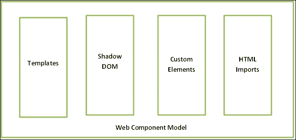

这四项技术为可以跨应用重用的 Web 组件提供了动力。在接下来的部分中，我们将详细探讨这些功能，并了解它们如何帮助我们进行 Web 组件开发。

# 模板元素

HTML `<template>`元素包含 HTML 标记、样式和脚本，可以多次使用。对于 Web 开发者来说，模板过程并不陌生。Handlebars、Mustache 和 Dust 是已经存在并且被广泛用于 Web 应用开发的模板库。为了简化模板使用的过程，W3C Web 组件规范包括了`<template>`元素。

这个模板元素在 Web 开发中非常新，所以与市场上现有的模板库（如 Handlebars.js）相比，它缺少一些功能。在不久的将来，它将配备新功能，但就目前而言，让我们来探索当前的模板规范。

## 模板元素详情

HTML `<template>`元素是一个`HTMLTemplateElement`接口。模板元素的**接口定义语言**（**IDL**）定义如下代码所示：

```js
interface HTMLTemplateElement : HTMLElement {
  readonly attribute DocumentFragment content;
};
```

上述代码是用 IDL 语言编写的。这种 IDL 语言被 W3C 用于编写规范。支持 HTML 导入的浏览器必须实现上述 IDL。上述代码的详细信息如下：

+   `HTMLTemplateElement`：这是一个模板接口，它扩展了`HTMLElement`类。

+   `content`：这是 HTML 模板元素的唯一属性。它返回模板的内容，并且本质上是只读的。

+   `DocumentFragment`：这是`content`属性的返回类型。`DocumentFragment`是文档的一个轻量级版本，并且没有父元素。

    ### 注意

    要了解更多关于`DocumentFragment`的信息，请使用以下链接：

    [`developer.mozilla.org/en/docs/Web/API/DocumentFragment`](https://developer.mozilla.org/en/docs/Web/API/DocumentFragment)

## 模板功能检测

HTML `<template>`元素在 Web 应用开发中非常新，并且并非所有浏览器都完全实现了它。在实现模板元素之前，我们需要检查浏览器支持。以下是在浏览器中支持模板的 JavaScript 代码：

```js
<!DOCTYPE html>
<html>
<head lang="en">
    <meta charset="UTF-8">
    <title>
        Web Component: template support
    </title>
</head>
<body>
<h1 id="message"></h1>
<script>
 var isTemplateSupported = function () {
 var template = document.createElement("template");
 return 'content' in template;
 };
 var isSupported = isTemplateSupported(),
 message = document.getElementById("message");
 if (isSupported) {
 message.innerHTML = "Template element is supported by the browser.";
 } else {
 message.innerHTML = "Template element is not supported by the browser.";
 }
</script>
</body>
</html>
```

在前面的代码中，`isTemplateSupported` 方法检查模板元素内部是否存在 `content` 属性。如果模板元素内部存在 `content` 属性，此方法将返回 `true` 或 `false`。如果浏览器支持模板元素，则 `h1` 元素将显示支持信息。运行前面代码所使用的浏览器是 Chrome 39 版本。前面代码的输出在以下屏幕截图中显示：

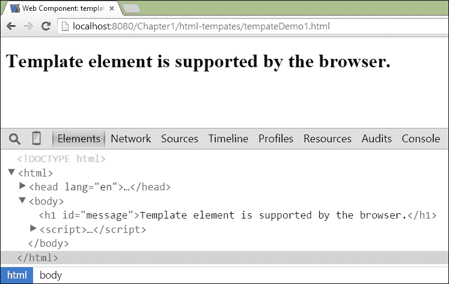

以下屏幕截图显示，用于开发的浏览器支持 HTML 模板元素。

### 小贴士

此外，还有一个名为 **Can I Use** 的优秀在线工具，用于检查当前浏览器对模板元素的支持情况。要检查浏览器中的模板支持，请使用以下链接：

[`caniuse.com/#feat=template`](http://caniuse.com/#feat=template)

以下屏幕截图显示了使用 **Can I Use** 在线工具的浏览器对模板元素支持的当前状态。

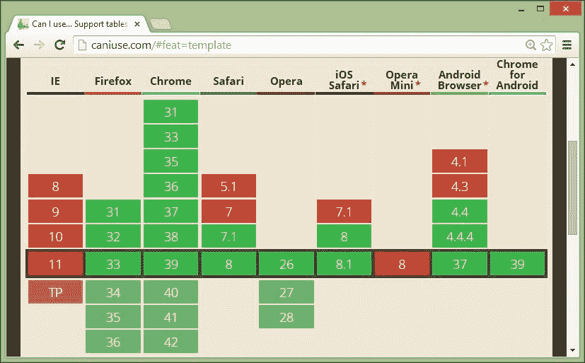

## 惰性模板

模板元素内的 HTML 内容在激活之前是惰性的。模板内容的惰性有助于提高 Web 应用程序的性能。以下代码演示了模板内容的惰性：

```js
<!DOCTYPE html>
<html>
<head lang="en">
    <meta charset="UTF-8">
    <title>
        Web Component: A inert template content example.
    </title>
</head>
<body>
<div id="message"></div>
<template id="aTemplate">
 
 <script>
 alert("This is a script.");
 </script>
</template>
<script>
    (function(){
        var imageElement = document.getElementById("profileImage"),
            messageElement = document.getElementById("message");
        messageElement.innerHTML = "IMG element "+imageElement;
    })();
</script>
</body>
</html>
```

在前面的代码中，一个模板包含一个具有 `src` 属性的图像元素，指向 Gravatar 个人资料图像，以及一个内联 JavaScript `alert` 方法。在页面加载时，`document.getElementById` 方法正在寻找具有 `#profileImage` ID 的 HTML 元素。前面代码的输出在以下屏幕截图中显示：

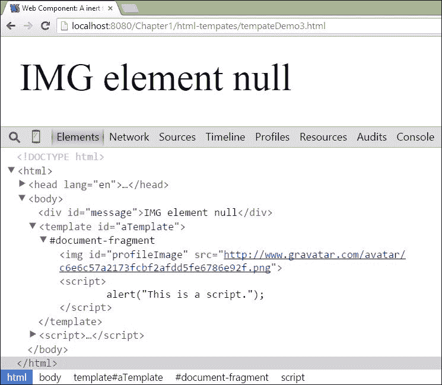

以下屏幕截图显示，脚本无法找到具有 `profileImage` ID 的 HTML 元素，并在浏览器中渲染 `null`。从前面屏幕截图可以看出，模板的内容本质上是惰性的。

## 激活模板

默认情况下，`<template>` 元素的内容是惰性的，并且不属于 DOM 的一部分。可以用来激活节点的方法有两种如下：

+   克隆节点

+   导入节点

### 克隆节点

`cloneNode` 方法可以用来复制一个节点。`cloneNode` 方法的语法如下所示：

```js
<Node> <target node>.cloneNode(<Boolean parameter>)

```

之前代码的语法细节如下所示：

+   此方法可以应用于需要克隆的节点。

+   此方法的返回类型是 `Node`。

+   此方法的输入参数是 `Boolean` 类型，表示克隆的类型。有两种不同的克隆类型，如下所示：

    +   **深度克隆**：在深度克隆中，目标节点的子节点也会被复制。要实现深度克隆，`cloneNode` 方法的 `Boolean` 输入参数需要设置为 `true`。

    +   **浅克隆**：在浅克隆中，仅复制目标节点而不包括其子节点。要实现浅克隆，`cloneNode` 方法的布尔输入参数需要设置为 `false`。

以下代码展示了使用 `cloneNode` 方法复制包含具有一些文本的 `h1` 元素的模板内容：

```js
<!DOCTYPE html>
<html>
<head lang="en">
    <meta charset="UTF-8">
    <title>
        Web Component: Activating template using cloneNode method
    </title>
</head>
<body>
<div id="container"></div>
<template id="aTemplate">
 <h1>Template is activated using cloneNode method.</h1>
</template>
<script>
 var aTemplate = document.querySelector("#aTemplate"),
        container = document.getElementById("container"),
        templateContent = aTemplate.content,
        activeContent = templateContent.cloneNode(true);
    container.appendChild(activeContent);
</script>
</body>
</html>
```

在前面的代码中，模板元素具有 `aTemplate` ID，并使用 `querySelector` 方法进行引用。然后使用 `content` 属性检索模板内的 HTML 标记内容，并将其保存到 `templateContent` 变量中。接着使用 `cloneNode` 方法进行深度克隆，以获取后来附加到 `div` 元素上的激活节点。以下截图显示了上述代码的输出：

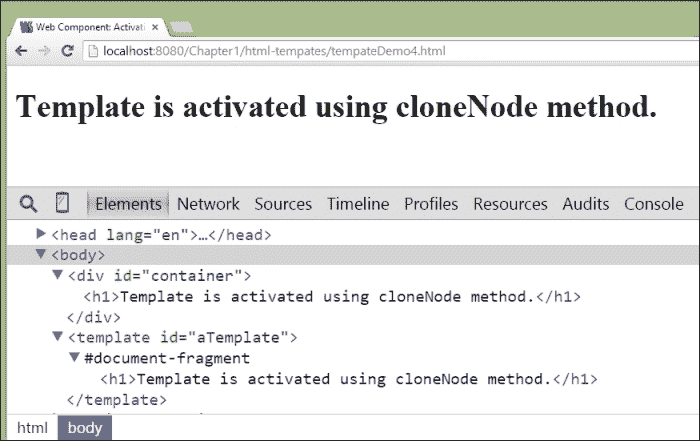

### 注意

要了解更多关于 `cloneNode` 方法的细节，请访问：

[`developer.mozilla.org/en-US/docs/Web/API/Node.cloneNode`](https://developer.mozilla.org/en-US/docs/Web/API/Node.cloneNode)

### 导入一个节点

`importNode` 方法是激活模板内容的另一种方式。上述方法的语法如下所示：

```js
<Node> document.importNode(<target node>,<Boolean parameter>)

```

上述代码的语法细节如下所示：

+   此方法返回从外部文档中获取的节点副本。

+   此方法接受两个输入参数。第一个参数是需要复制的目标节点。第二个参数是一个布尔标志，表示目标节点的克隆方式。如果布尔标志为 `false`，则 `importNode` 方法进行浅复制；如果为 `true`，则进行深度复制。

以下代码展示了使用 `importNode` 方法复制包含具有一些文本的 `h1` 元素的模板内容：

```js
<!DOCTYPE html>
<html>
<head lang="en">
    <meta charset="UTF-8">
    <title>
        Web Component: Activating template using importNode method
    </title>
</head>
<body>
<div id="container"></div>
<template id="aTemplate">
 <h1>Template is activated using importNode method.</h1>
</template>
<script>
    var aTemplate = document.querySelector("#aTemplate"),
        container = document.getElementById("container"),
        templateContent = aTemplate.content,
        activeContent = document.importNode(templateContent, true);
    container.appendChild(activeContent);
</script>
</body>
</html>
```

在前面的代码中，模板元素具有 `aTemplate` ID，并使用 `querySelector` 方法进行引用。然后使用 `content` 属性检索模板内的 HTML 标记内容，并将其保存到 `templateContent` 变量中。接着使用 `importNode` 方法进行深度克隆，以获取后来附加到 `div` 元素上的激活节点。以下截图显示了上述代码的输出：

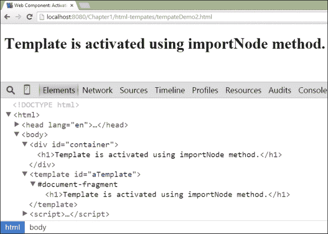

### 注意

要了解更多关于 `importNode` 方法的细节，请访问：

[`mdn.io/importNode`](http://mdn.io/importNode)

# HTML 导入

HTML 导入是 W3C 网络组件规范的重要技术之一。它提供了一种将当前文档中文件中存在的另一个 HTML 文档包含进来的方法。HTML 导入为 `Iframe` 元素提供了一个替代方案，并且对于资源打包也非常有用。HTML 导入的语法如下所示：

```js
<link rel="import" href="fileName.html">

```

上述语法的细节如下所示：

+   可以使用 `<link>` 标签和 `rel` 属性（值为 import）来导入 HTML 文件。

+   `href` 字符串指向需要包含在当前文档中的外部 HTML 文件。

HTML `import`元素由`HTMLElementLink`类实现。HTML 导入的 IDL 定义如下代码所示：

```js
partial interface LinkImport {
    readonly attribute Document? import;
};
HTMLLinkElement implements LinkImport;
```

上述代码显示了 HTML 导入的 IDL，其中父接口是`LinkImport`，它具有只读属性`import`。`HTMLLinkElement`类实现了`LinkImport`父接口。支持 HTML 导入的浏览器必须实现上述 IDL。

## HTML 导入功能检测

HTML 导入是浏览器的新功能，可能不是所有浏览器都支持。为了检查浏览器中 HTML 导入的支持情况，我们需要检查`<link>`元素内部是否存在`import`属性。检查 HTML `import`支持的代码如下：

```js
<!DOCTYPE html>
<html>
<head lang="en">
    <meta charset="UTF-8">
    <title>
        Web Component: HTML import support
    </title>
</head>
<body>
<h1 id="message"></h1>
<script>
 var isImportSupported = function () {
 var link = document.createElement("link");
 return 'import' in link;
 };
    var isSupported = isImportSupported(),
            message = document.getElementById("message");
    if (isSupported) {
        message.innerHTML = "Import is supported by the browser.";
    } else {
        message.innerHTML = "Import is not supported by the browser.";
    }
</script>
</body>
</html>
```

上述代码有一个`isImportSupported`函数，该函数返回当前浏览器对 HTML `import`支持的`Boolean`值。该函数创建一个`<link>`元素，然后使用`in`运算符检查是否存在`import`属性。以下截图显示了上述代码的输出：

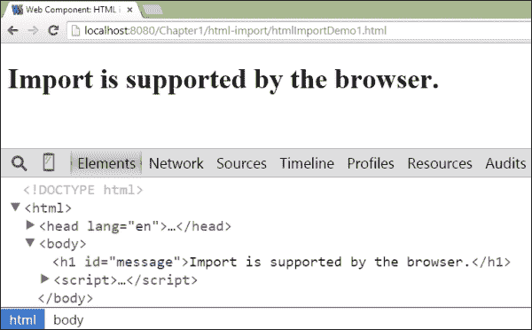

上述截图显示，当前浏览器支持导入功能，因为`isImportSupported`方法返回`true`。

### 小贴士

**Can I Use**工具也可以用来检查当前浏览器对 HTML 导入的支持情况。要检查浏览器中的模板支持情况，请使用以下链接：

[`caniuse.com/#feat=imports`](http://caniuse.com/#feat=imports)

以下截图显示了使用**Can I Use**在线工具在浏览器中对 HTML 导入功能支持的当前状态：

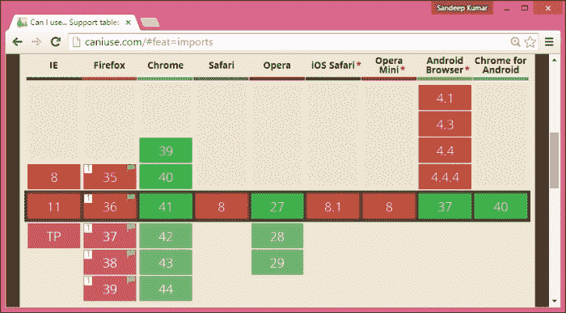

## 访问 HTML 导入文档

HTML 导入功能将外部文档包含到当前页面中。我们可以通过链接元素的`import`属性来访问外部文档的内容。在本节中，我们将学习如何使用`import`属性来引用外部文档。`message.html`文件是一个需要导入的外部 HTML 文件文档。`message.html`文件的内容如下：

```js
<h1>
      This is from another HTML file document.
</h1>
```

以下代码显示了加载并使用`import`属性引用`message.html`文件的 HTML 文档：

```js
<!DOCTYPE html>
<html>
<head lang="en">
    <link rel="import" href="message.html">
</head>
<body>
<script>
    (function(){
        var externalDocument = document.querySelector('link[rel="import"]').import;
            headerElement = externalDocument.querySelector('h1')
 document.body.appendChild(headerElement.cloneNode(true));
    })();
</script>
</body>
</html>
```

上述代码的详细信息如下：

+   在标题部分，`<link>`元素正在导入`message.html`文件中存在的 HTML 文档。

+   在主体部分，使用`document.querySelector`方法的内联`<script>`元素引用具有`rel`属性且值为`import`的链接元素。一旦找到链接元素，就使用`import`属性将外部文档的内容复制到`externalDocument`变量中。

+   使用`querySelector`方法在外部文档中定位`h1`元素，并将其保存到`headerElement`变量中。

+   然后使用`cloneNode`方法将标题元素深度复制，并将其附加到当前文档的`body`元素中。

以下截图显示了前面代码的输出：

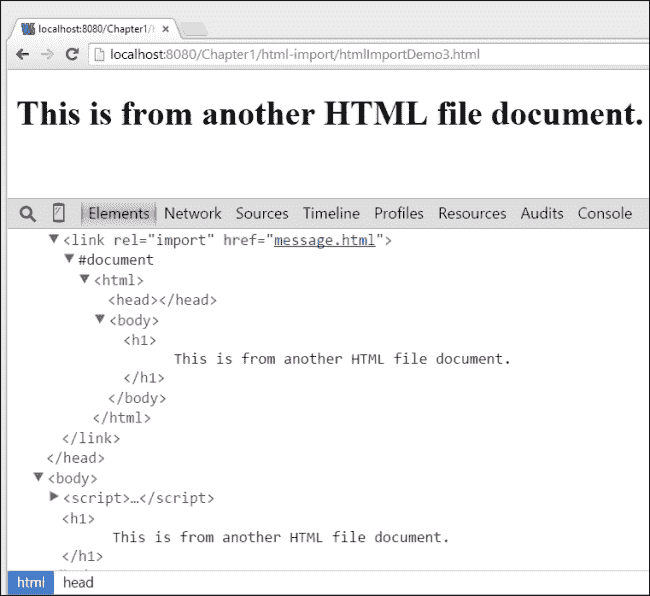

## HTML 导入事件

具有具有 `import` 属性的 HTML `<link>` 元素支持两个事件处理器。这两个事件如下列出：

+   `load`：当外部 HTML 文件成功导入到当前页面时，会触发此事件。可以将 JavaScript 函数附加到 `onload` 属性，以便在成功加载外部 HTML 文件时执行。

+   `error`：当外部 HTML 文件未加载或找不到时（HTTP 状态码 404 未找到），会触发此事件。可以将 JavaScript 函数附加到 `onerror` 属性，以便在导入外部 HTML 文件出错时执行。

以下代码展示了在将 `message.html` 文件导入当前页面时使用这两种事件类型：

```js
<!DOCTYPE html>
<html>
<head lang="en">
    <script async>
        function handleSuccess(e) {
            //import load Successful
 var targetLink = e.target,
 externalDocument = targetLink.import;
 headerElement = externalDocument.querySelector('h1'),
 clonedHeaderElement = headerElement.cloneNode(true);
 document.body.appendChild(clonedHeaderElement);
        }
        function handleError(e) {
            //Error in load
            alert("error in import");
        }
    </script>
    <link rel="import" href="message.html" 
          onload="handleSuccess(event)"
          onerror="handleError(event)">
</head>
<body>
</body>
</html>
```

前面代码的详细信息如下：

+   `handleSuccess`：此方法附加到 `onload` 属性，在当前文档中成功加载 `message.html` 时执行。`handleSuccess` 方法导入 `message.html` 文件中的文档，然后找到 `h1` 元素，并对其进行深度复制。然后，复制的 `h1` 元素被附加到 body 元素中。

+   `handleError`：此方法附加到 `<link>` 元素的 `onerror` 属性。如果找不到 `message.html` 文件，则将执行此方法。

由于 `message.html` 文件导入成功，`handleSuccess` 方法被调用，并在浏览器中渲染了标题元素 `h1`。以下截图显示了前面代码的输出：

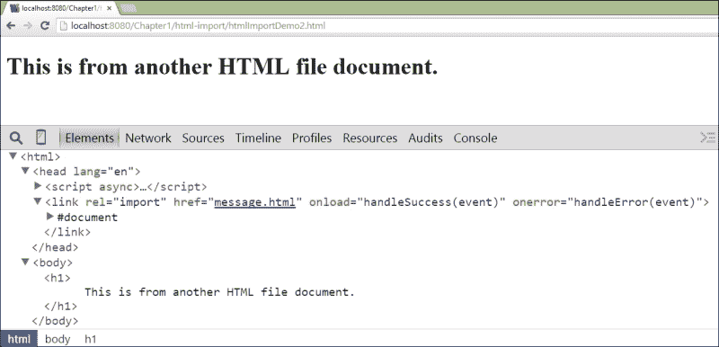

# Shadow DOM

在网页组件规范之前，使用 HTML、CSS 和 JavaScript 构建网页应用存在许多问题。以下列出了一些问题：

+   **样式覆盖**：文档样式表可能会更改网页组件的样式。

+   **脚本修改**：文档中的 JavaScript 可能会修改网页组件的某些部分。

+   **ID 冲突**：文档中可能存在重复的 ID，这可能导致许多错误情况。

从上述问题列表中，很明显存在一个**作用域**问题。Shadow DOM 是网页组件规范中另一个重要的部分，通过封装机制解决了作用域问题。Shadow DOM 为网页组件提供了打包 HTML、CSS 和 JavaScript 的方法。

大多数 HTML5 元素，例如进度条，都由 Chrome 浏览器实现为 Shadow DOM。我们可以通过 Chrome 开发者控制台检查这个 Shadow DOM。默认情况下，Chrome 开发者控制台不会显示 Shadow DOM。我们需要在开发者控制台的设置中启用“**显示用户代理 Shadow DOM**”复选框。以下截图显示了启用 Shadow DOM 检查的 Chrome 开发者控制台设置：

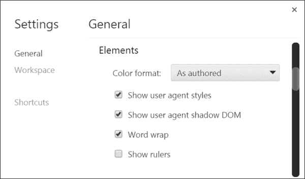

启用 Shadow DOM 检查设置后，我们可以检查 `<progress>` HTML5 元素。以下截图显示了包含 Shadow DOM 节点的进度条元素的 Chrome 开发者检查：

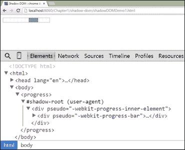

在上述截图中，我们可以看到一个新元素 `#shadow-root`。这个节点是进度条元素的 Shadow DOM。由于进度条是在浏览器元素中构建的，我们可以看到括号中的用户代理文本。

## Shadow DOM feature detection

要检查浏览器的 Shadow DOM 支持，可以在元素内部启用 `createShadowRoot` 属性。以下代码演示了检测当前浏览器中 Shadow DOM 支持的方法：

```js
<!DOCTYPE html>
<html>
<head lang="en">
    <meta charset="UTF-8">
    <title>
        Web Component: Shadow DOM Feature detection
    </title>
</head>
<body>
<h1 id="message"></h1>
<script>
    var isShadowDOMSupported = function () {
 return "createShadowRoot" in document.body;
 };
    var isSupported = isShadowDOMSupported(),
        message = document.getElementById("message");
    if (isSupported) {
        message.innerHTML = "Shadow DOM is supported by the browser.";
    } else {
        message.innerHTML = "Shadow DOM is not supported by the browser.";
    }
</script>
</body>
</html>
```

在上述代码中，`isShadowDOMSupported` 方法通过检查 `document.body` 元素中是否存在 `createShadowRoot` 属性来检查当前浏览器中 Shadow DOM 的支持情况。以下截图显示了上述代码在当前浏览器中的输出：

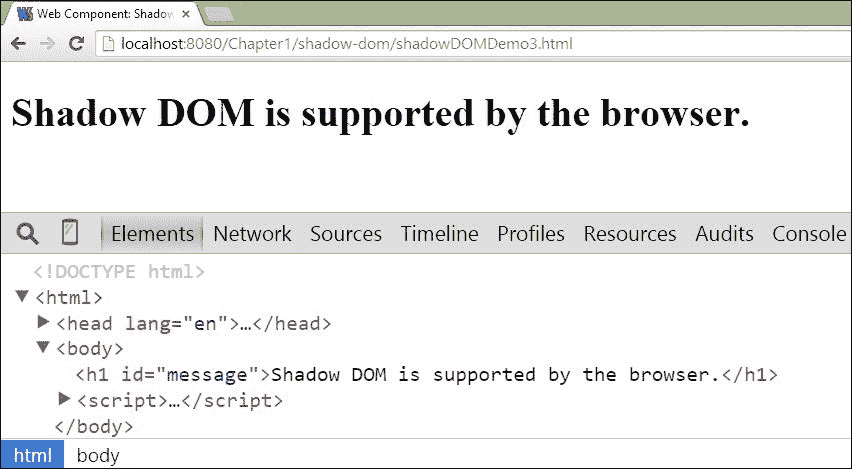

上述截图显示当前浏览器支持 Shadow DOM，因为 `isShadowDOMSupport` 方法返回 `true`。我们还可以使用 **Can I Use** 在线工具检查 Shadow DOM 的支持情况。以下截图显示了不同浏览器中 Shadow DOM 支持的状态：

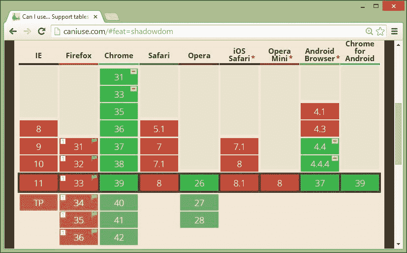

## Shadow tree

Shadow DOM 带来了在渲染时在文档中包含 DOM 元素子树的能力。DOM 内部的节点组织成树状结构。DOM 树内的一个节点可以有自己的 Shadow DOM 树。这使得 DOM 成为了树的树。我们可以将 DOM 树分为三种不同类型：

+   **文档树**：这代表了一个正常的 DOM 树，其根节点是一个文档。

+   **Shadow tree**：这代表使用存在于 shadow host 内的 HTML 元素形成的内部 DOM 子树。这个树的根节点被称为 **shadow root**。

+   **组合树**：这代表文档树的更扩展版本，包括 Shadow DOM 树，并由浏览器用于渲染。

具有一个或多个 Shadow DOM 子树的 DOM 元素被称为 **宿主元素** 或 **shadow host**。以下图显示了示例 DOM 树：


在上述图中，我们发现 DOM 元素内部的节点代表另一个子树，这使得 DOM 成为了树的树。支持 Shadow DOM 实现的浏览器应遵循 IDL 定义来声明 shadow root 元素。以下代码列出了 shadow root 元素的 IDL：

```js
interface ShadowRoot : DocumentFragment {
    HTMLElement getElementById(DOMString elementId);
    NodeList getElementsByClassName(DOMString className);
    NodeList getElementsByTagName(DOMString tagName);
    NodeList getElementsByTagNameNS(DOMString? namespace, DOMString localName);
    Selection? getSelection();
    Element? elementFromPoint(double x, double y);
    readonly attribute Element? activeElement;
    readonly attribute Element host;
    readonly attribute ShadowRoot? olderShadowRoot;
    attribute DOMString innerHTML;
    readonly attribute StyleSheetList styleSheets;
};
```

上述 IDL 的详细信息如下：

+   `getElementById`: 此方法查找具有给定 ID 的 Shadow DOM 树内存在的元素

+   `getElementsByClassName`: 此方法查找具有给定类名的 Shadow DOM 树内存在的元素

+   `getElementsByTagName`: 这个方法查找阴影 DOM 树中具有给定标签名的元素

+   `getElementsByTagNameNS`: 这个方法查找阴影 DOM 树中具有给定命名空间和标签名的元素

+   `getSelection`: 这个方法返回当前在阴影 DOM 树中选中的元素的选中对象

+   `elementFromPoint`: 这个方法返回给定 *x* 和 *y* 坐标的元素

+   `activeElement`: 这个属性返回当前在阴影 DOM 树中聚焦的元素

+   `host`: 这个属性返回阴影宿主元素

+   `olderShadowRoot`: 如果元素有多个阴影树，则此属性返回创建较早的阴影根

+   `innerHTML`: 这个属性返回阴影根的 HTML 内容作为字符串

+   `styleSheets`: 如果阴影树包含 `<style>` 元素，则此属性返回样式表对象的列表

现在，让我们看看一个示例，该示例演示了这些属性和阴影根的方法的使用。示例代码如下所示：

```js
<!DOCTYPE html>
<html>
<head lang="en">
    <meta charset="UTF-8">
    <title>Shadow Root: Method & Properties example</title>
</head>
<body>
    <div id="aShadowHost"></div>
    <template id="selectorTemplate">
        <style>
            :host input{
                background: lightyellow;
            }
            :host .labelClass{
                color: blue;
            }
        </style>
        <form>
            <label for="nameElement" class="labelClass">Name</label>
            <input type="text" id="nameElement"
                   placeholder="Enter your name"
                   value="Sandeep" autofocus>
        </form>
 </template>
    <script>
     (function(){
         var aShadowHost = document.getElementById("aShadowHost"),
             shadowRoot1 = aShadowHost.createShadowRoot(),
             shadowRoot2 = aShadowHost.createShadowRoot(),
             templateContent = document.querySelector('#selectorTemplate').content,
             templateNodes = document.importNode(templateContent, true);
         shadowRoot1.innerText ="inside shadowRoot1";
         shadowRoot2.appendChild(templateNodes);
         shadowRoot2.getElementById("nameElement").select();
         //Shadow Root Methods
         console.log("getElementById: ",shadowRoot2.getElementById("nameElement"));
         console.log("getElementsByClassName: ",shadowRoot2.getElementsByClassName("labelClass"));
         console.log("getElementsByTagName: ",shadowRoot2.getElementsByTagName("label"));
         console.log("getElementsByTagNameNS: ",shadowRoot2.getElementsByTagNameNS("*","label"));
         console.log("getSelection() Method: ",shadowRoot2.getSelection());
         console.log("elementFromPoint: ",shadowRoot2.elementFromPoint(8,9));
    //Shadow Root Properties
         console.log("activeElement: ",shadowRoot2.activeElement);
         console.log("host: ",shadowRoot2.host);
         console.log("olderShadowRoot: ",shadowRoot2.olderShadowRoot);
console.log("styleSheets: ",shadowRoot2.styleSheets);
         console.log("innerHTML: ",shadowRoot2.innerHTML);
    })();
    </script>
</body>
</html>
```

在前面的代码中，宿主元素存在两个阴影 DOM 子树 `shadowRoot1` 和 `shadowRoot2`。`shadowRoot1` 子树首先创建，然后 `shadowRoot2` 创建。因此，`shadowRoot1` 子树是一个较旧的阴影根。`shadowRoot2` 子树包含具有 `selectorTemplate` ID 的模板的 HTML 标记。`shadowRoot2` 子树包含一个 `<form>` 元素，该元素包含一个 `<label>` 和 `<input>` 元素。它还包含 `<style>` 元素内的某些 CSS 样式。前面代码的输出在以下截图中展示：


以下截图显示了控制台日志消息，这些消息展示了如何使用前面的方法来演示阴影树的使用：

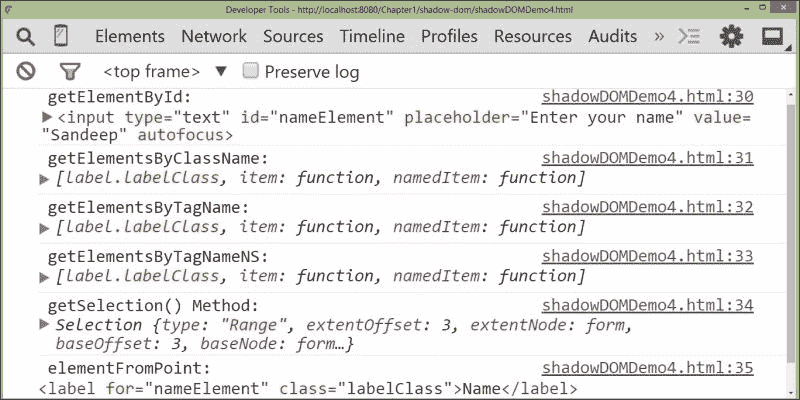

以下截图显示了控制台日志消息，这些消息展示了如何使用前面的属性来演示阴影树的使用：

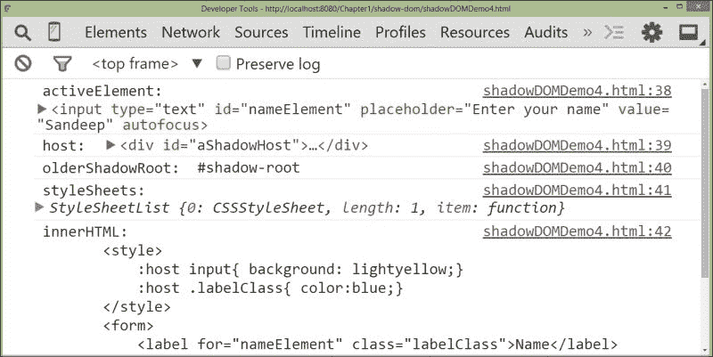

# 自定义元素

Web 组件规范具有为 DOM 创建新元素的能力。自定义元素可以有自己的属性和方法。创建自定义元素的原因从开发者的角度来看，代码更少，创建更语义化的标签库，减少 `div` 标签的数量等等。一旦开发了一个 Web 组件，它就可以被任何应用程序使用。

## 自定义元素功能检测

可以使用 `registerElement` 方法将新元素注册到 DOM 中。我们可以通过检查文档中是否存在 `registerElement` 函数来检测当前浏览器对自定义元素的支持。以下 JavaScript 代码展示了一种检测自定义元素支持的方法：

```js
<!DOCTYPE html>
<html>
<head lang="en">
    <meta charset="UTF-8">
    <title>Web Component: custom element support</title>
</head>
<body>
<h1 id="message"></h1>
<script>
    var isCustomElementSupported = function () {
 return 'registerElement' in document;
 };
    var isSupported = isCustomElementSupported(),
            message = document.getElementById("message");
    if (isSupported) {
        message.innerHTML = "Custom element is supported by the browser.";
    } else {
        message.innerHTML = "Custom element is not supported by the browser.";
    }
</script>
</body>
</html>
```

在前面的代码中，`isCustomElementSupported` 方法包含检查自定义元素支持的代码。它使用 `in` 操作符检查 `registerElement` 函数是否存在于文档对象内部。如果自定义元素受支持，该方法返回 true，并在浏览器中渲染成功消息。以下截图显示了浏览器中前面代码的输出：


我们还可以使用 **Can I Use** 在线工具来检查自定义元素的支持情况。以下截图显示了浏览器对自定义元素支持的现状：

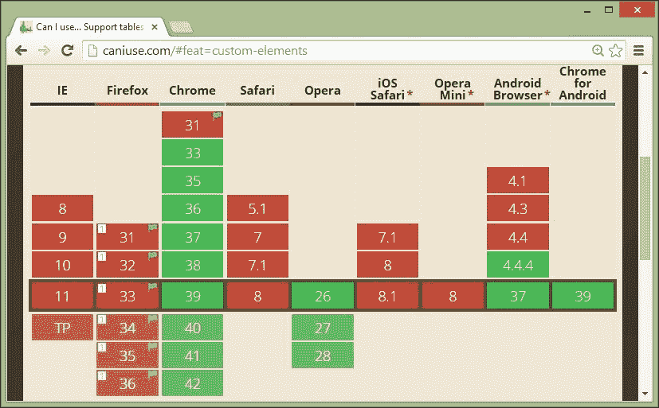

## 开发自定义元素

在本节中，我们将开发一个自定义元素，并详细了解每个步骤。开发自定义元素涉及的步骤如下所示：

+   创建新对象

+   定义对象属性

+   定义生命周期方法

+   注册新元素

+   扩展元素

### 创建新对象

可以使用 `Object.create` 方法创建一个新对象。此方法的语法如下所示：

```js
Object.create(<target prototype> [, propertiesObject]);
```

`Object.create` 方法接受两个参数。第一个参数是新建对象的目标原型。第二个参数包含新建对象的属性。第二个参数是可选的。以下代码定义了一个新对象：

```js
var objectPrototype = Object.create(HTMLElement.prototype);
```

在前面的代码中，创建了一个具有 `HTMLElement.prototype` 参数的新对象，并将其保存在 `objectPrototype` 变量中。

### 注意

要了解更多关于 `Object.create` 方法的信息，请使用以下链接：

[`developer.mozilla.org/en-US/docs/Web/JavaScript/Reference/Global_Objects/Object/create`](https://developer.mozilla.org/en-US/docs/Web/JavaScript/Reference/Global_Objects/Object/create)

### 定义对象属性

我们可以使用两种不同的方法 `defineProperty` 和 `defineProperties` 来定义对象的属性。`defineProperty` 方法用于创建单个属性，而 `defineProperties` 方法用于创建多个属性。这些方法的语法如下所示：

```js
Object.defineProperty(<targetObject>, <propertyName>, <propertySettings>);
Object.defineProperties(<targetObject>, <properties>);
```

上述语法的详细信息如下所示：

+   `targetObject`: 这代表需要定义属性的的目标对象。

+   `propertyName`: 这代表属性的键。

+   `propertySettings`: 这代表属性的配置选项。可能的设置选项如下所示：

    +   `configurable`: 这是一个布尔值。对于 `true` 值，属性的类型可以被更改或删除。对于 `false` 值，属性类型不能被更改和删除。

    +   `enumerable`: 这是一个布尔值。对于 `true` 值，属性将被枚举为其自己的属性。

    +   `value`: 这可以接受任何 JavaScript 值。它代表与属性关联的值。

    +   `writable`：这接受一个布尔值。对于 `true` 值，可以使用赋值运算符更新属性的关联值。

    +   `get`：这接受一个函数。它返回属性的值。

    +   `set`：这接受一个函数。它将输入值设置为属性。

以下代码示例展示了为 `newObject` 定义一个名为 `title` 的可写属性：

```js
var newObject = Object.create(HTMLElement.prototype);
Object.defineProperty(newObject, 'title', {
 writable : true
});

```

### 注意

要了解更多关于 `Object.defineProperty` 方法的详情，请使用以下链接：

[`developer.mozilla.org/en-US/docs/Web/JavaScript/Reference/Global_Objects/Object/defineProperty`](https://developer.mozilla.org/en-US/docs/Web/JavaScript/Reference/Global_Objects/Object/defineProperty)

以下代码示例展示了为 `newObject` 变量定义多个属性，如 `title` 和 `country`。`title` 属性是可写的，而 `country` 属性不可写，其固定值为 `India`：

```js
var newObject = Object.create(HTMLElement.prototype);
Object.defineProperties(newObject,  {
 title:{
 writable: true
 },
 country:{
 writable: false,
 value: "India"
 }
});

```

### 注意

要了解更多关于 `Object.defineProperties` 方法的详情，请使用以下链接：

[`developer.mozilla.org/en-US/docs/Web/JavaScript/Reference/Global_Objects/Object/defineProperties`](https://developer.mozilla.org/en-US/docs/Web/JavaScript/Reference/Global_Objects/Object/defineProperties)

### 定义生命周期方法

在 JavaScript 的生命周期中，对象会经历不同的状态。对象生命周期的不同状态如下所示：

+   `created`：当对象初始化时，它处于 `created` 状态。此状态的事件处理方法是 `createdCallback` 方法。

+   `attached`：当对象被插入到 DOM 中时，它处于 `attached` 状态。此状态的事件处理方法是 `attachedCallback` 方法。

+   `detached`：当对象从 DOM 中移除时，它处于 `detached` 状态。此状态的事件处理方法是 `detachedCallback` 方法。

+   `attributeChanged`：当对象的一个属性值被更新时，对象处于 `attaributeChanged` 状态。此状态的事件处理方法是 `attributeChangedCallback` 方法。

以下代码示例展示了如何使用 `Object.create` 方法创建一个对象，并为创建的状态附加一个回调方法：

```js
var objectPrototype = Object.create(HTMLElement.prototype);
objectPrototype.createdCallback=function(){
 console.log("Instance is created");
};
```

### 注册新元素

可以使用 `document.registerElement` 方法将新元素注册到 DOM 中。此方法的语法如下：

```js
var constructor = document.registerElement(<tag-name>,settings);
```

以下列出了先前语法的详细信息：

+   `tag-name`：这代表自定义元素的名字。名字必须用连字符分隔。

+   `settings`：这用于指定自定义元素的配置选项。

+   `constructor`：`registerElement` 方法返回新元素的构造函数。

以下代码示例展示了如何将名为 `welcome-message` 的新元素注册到 DOM 中。`welcome-message` 元素的原型是 `objectPrototype`，它是通过 `Object.create` 方法创建的：

```js
var objectPrototype = Object.create(HTMLElement.prototype),
    welcomeElement = document.registerElement("welcome-message",{
        prototype: objectPrototype
});

```

### 注意

要了解更多关于 `document.registerElement` 方法的详情，请使用以下链接：

[`developer.mozilla.org/en-US/docs/Web/API/document.registerElement`](https://developer.mozilla.org/en-US/docs/Web/API/document.registerElement)

### 扩展元素

一个元素可以继承原生或另一个自定义元素。使用 `extend` 属性来继承另一个元素。以下代码显示了扩展 `<i>` 元素的示例：

```js
var objectPrototype = Object.create(HTMLElement.prototype),
    italicElement = document.registerElement("italic-message",{
        prototype: objectPrototype,
        extends:'i'
});
```

使用 `is` 操作符来定义 HTML 元素的类型。以下代码显示了如果元素是斜体类型：

```js
<welcome-message is="i">
    Hello world
</welcome-message>
```

## 自定义元素的示例

在本节中，我们将创建一个简单的自定义元素 `<my-message>`。`<my-message>` 元素的代码如下：

```js
<!DOCTYPE html>
<html>
<head lang="en">
    <meta charset="UTF-8">
    <title>Web Component: custom element example</title>
    <script>
        var objectPrototype = Object.create(HTMLElement.prototype);
 Object.defineProperty(objectPrototype, 'title', {
 writable : true
 });
 objectPrototype.createdCallback=function(){
 this.innerText=this.title;
 };
 var  myNameElement = document.registerElement("my-name",{
 prototype:objectPrototype
 });
 </script>
</head>
<body>
    <my-name title="Welcome to custom element 1"></my-name>
 <br>
 <my-name title="Welcome to custom element 2"></my-name>
</body>
</html>
```

### 小贴士

**下载示例代码**

您可以从您在 [`www.packtpub.com`](http://www.packtpub.com) 的账户下载示例代码文件，以获取您购买的所有 Packt 出版物的代码。如果您在其他地方购买了这本书，您可以访问 [`www.packtpub.com/support`](http://www.packtpub.com/support) 并注册，以便将文件直接通过电子邮件发送给您。

在前面的代码中，使用 `registerElement` 方法定义了一个自定义的 `my-name` 元素。它有一个 `title` 属性，该属性已使用 `Object.defineProperty` 方法定义。添加了一个 `createdCallback` 方法，该方法接受 `title` 属性的输入字符串并使用 `innerText` 属性插入它。以下截图显示了前面代码的输出：


# 节点分布

组合树参与在浏览器内部渲染 DOM。节点的阴影 DOM 子树被安排进行显示。节点的安排是通过一个具有特定插入点的分配机制完成的。这些插入点有两种类型：

+   内容插入点

+   阴影插入点

## 内容插入点

内容插入点是一个**占位符**，用于阴影宿主分布的子节点。它就像一个标记，重新投影阴影宿主的子节点。可以使用 `<content>` 元素定义内容插入点。`<content>` 元素有一个 `select` 属性，通过它可以过滤掉**重新投影**。

以下代码给出了使用 `<content>` 元素和 `select` 属性的示例：

```js
<!DOCTYPE html>
<html>
<head lang="en">
    <meta charset="UTF-8">
    <title>Web Component: content insertion point with select attribute example</title>
    <template id="selectorTemplate">
        <style>
            :host b{
                margin: 0px 10px;
            }
            :host ::content b.fruit{
                color:green;
            }
            :host ::content b.flower{
                color:orange;
            }
        </style>
        <h1>
 Fruits <content select="b.fruit"></content>.
 </h1>
 <h1>
 Flowers <content select="b.flower"></content>.
 </h1>
    </template>
    <script>
        var objectPrototype = Object.create(HTMLElement.prototype);
        objectPrototype.createdCallback=function(){
            var shadow = this.createShadowRoot(),
                templateContent = document.querySelector('#selectorTemplate').content,
                templateNodes = document.importNode(templateContent, true);
            shadow.appendChild(templateNodes);
        };
        var myNameElement = document.registerElement("selector- component",{
            prototype: objectPrototype
        });
    </script>
</head>
<body>
 <selector-component>
 <b class="fruit">Apple </b>
 <b class="flower">Rose </b>
 <b class="fruit">Orange </b>
 <b class="fruit">Banana </b>
 <b class="flower">Lotus </b>
 <b class="fruit">Grapes </b>
 <b class="flower">Jasmine </b>
 </selector-component>
</body>
</html>
```

以下是前面代码的详细解释：

+   创建了一个名为 `<selector-component>` 的自定义元素，其中包含水果和花卉的列表。

+   自定义元素的 HTML 模板有两个 `<content>` 元素。一个内容元素使用具有 `b.flower` 值的 `select` 属性过滤掉所有花卉，另一个 `<content>` 元素使用具有 `b.fruit` 值的 `select` 属性过滤掉所有水果。

以下截图显示了前面代码过滤水果和花卉在单独组中的输出：

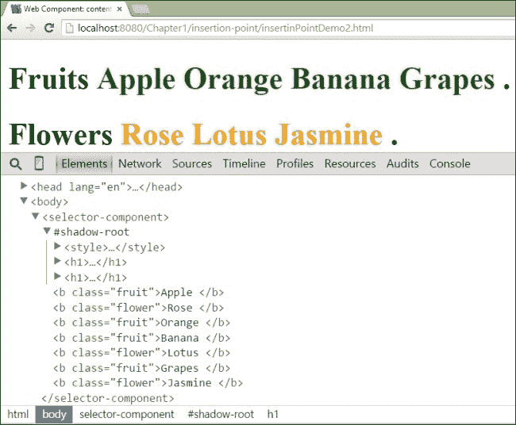

## 阴影插入点

影子插入点是其他影子树的占位符。此插入点重新投影其他影子树的元素。可以使用 `<shadow>` 元素创建影子插入点。以下代码给出了使用影子插入点的示例：

```js
<!DOCTYPE html>
<html>
<head lang="en">
    <meta charset="UTF-8">
    <title>>Web Component: shadow insertion point example</title>
</head>
<body>
    <div id="aShadowHost"></div>
    <template id="shadow1Template">
        <button>Shadow Root 1 Button</button>
    </template>
    <template id="shadow2Template">
 <fieldset>
 <legend>Shadow Root 2</legend>
 <shadow></shadow>
 </fieldset>
    </template>
    <script>
        //Old shadow root
        var aShadowHost = document.getElementById("aShadowHost"),
            aShadowRoot1 = aShadowHost.createShadowRoot();
            templateContent = document.querySelector('#shadow1Template').content,
            templateNodes = document.importNode(templateContent, true);
        aShadowRoot1.appendChild(templateNodes);
        //new shadow root with insertion point for older shadow root
        var aShadowRoot2 = aShadowHost.createShadowRoot();
        templateContent = document.querySelector('#shadow2Template').content,
        templateNodes = document.importNode(templateContent, true);
        aShadowRoot2.appendChild(templateNodes);
    </script>
</body>
</html>
```

以下列出了前面代码的详细信息：

+   为具有 `aShadowHost` ID 的 `<div>` 元素创建了两个影子根，分别是 `shadowRoot1(old)` 和 `shadowRoot2(new)`。

+   `shadow1Template` 是 `shadowRoot1` 的 HTML 模板，而 `shadow2Template` 是 `shadow2Root` 的 HTML 模板。

+   `shadow1Template` 包含一个 `<button>` 元素，而 `shadow2Template` 包含一个 `<fieldset>` 和 `<legend>` 元素。`<fieldset>` 元素还有一个 `<shadow>` 插入点。

+   在页面渲染过程中，影子插入点将取较老的影子根内容并将其插入到影子插入点中。

以下截图显示了前面代码的输出，其中较老的影子根元素被重新投影并渲染在属于较年轻影子根的 `<fieldset>` 元素内部，即 `shadowRoot1`。

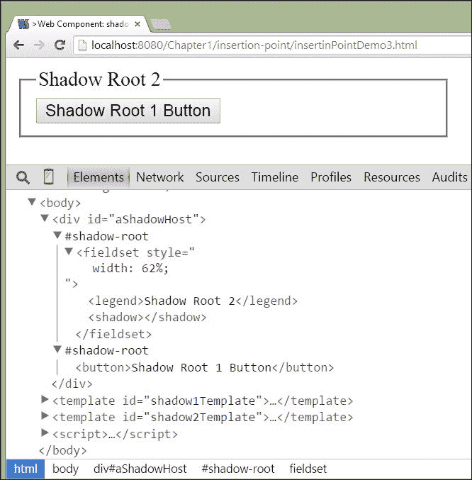

# 样式化网页组件

随着网页组件规范的出台，我们之前用于样式化 HTML DOM 元素的方法需要改变。在本节中，我们将探讨在编写 CSS 时需要更多关注的几个关键领域。我们需要了解一些新的伪元素选择器来样式化网页组件。这些伪选择器在此列出：

+   **未解析伪选择器**：当自定义元素被加载并注册到 DOM 中时，浏览器会选择匹配的元素并根据定义的生命周期进行升级。在此升级过程中，元素会暴露给浏览器，并在几秒钟内看起来没有样式。我们可以使用 `:unresolved` 伪类来避免未样式化内容的闪烁。以下列出了一个 `<header-message>` 自定义元素的 `unresolved` 伪选择器的示例：

    ```js
    header-message:unresolved:after {
       content: 'Registering Element...';
       color: red;
    }
    ```

+   **宿主伪选择器**：可以使用 `:host` 伪选择器来引用自定义元素本身，并应用 `style` 属性。以下代码列出了一个 `host` 选择器的示例：

    ```js
    :host{
       text-transform: uppercase;
    }
    ```

+   **影子伪选择器**：可以使用 `::shadow` 伪选择器来引用自定义元素的影子 DOM 子树，并应用 `style` 属性。以下列出了一个 `shadow` 选择器的示例：

    ```js
    :host ::shadow h1{
       color: orange;
    }
    ```

+   **内容伪选择器**：可以使用 `::content` 伪选择器来引用较老插入点元素的内容，并应用 `style` 属性。以下代码列出了一个 `content` 选择器的示例：

    ```js
    :host ::content b{
        color: blue;
    }
    ```

让我们通过一个简单的示例来演示上述伪选择器。以下代码创建了一个名为 `<header-element>` 的自定义元素。为了展示 `:unresolved` 伪选择器的使用，我们使用 `window.setTimeOut` 方法延迟了 3 秒注册自定义元素。

```js
<!DOCTYPE html>
<html>
<head lang="en">
    <meta charset="UTF-8">
    <title>Web Component: Unresolved pseudo selector</title>
    <style>
        header-element:unresolved{
 visibility: hidden;
 }
 header-element:unresolved:after {
 content: 'Registering Element...';
 color: red;
 visibility: visible;
 }
    </style>
    <template id="headerTemplate">
        <style>
            :host {
 text-transform: uppercase;
 }
 :host::shadow h1{
 color:orange;
 }
 :host ::content b{
 font-style: italic;
 color:blue;
 }
        </style>
        <h1>Hello <content></content></h1>
    </template>
    <script>
        (function(){
            var objectPrototype = Object.create(HTMLElement.prototype);
            objectPrototype.createdCallback=function(){
                var shadow = this.createShadowRoot(),
                    templateContent = document.querySelector('#headerTemplate').content,
                    templateNodes = document.importNode(templateContent, true);
                shadow.appendChild(templateNodes);
            };
            window.setTimeout(function(){
 document.registerElement("header-element",{
 prototype:objectPrototype
 });
 }, 3000);
        })();
    </script>
</head>
<body>
    <header-element>
 <b>Web Component</b>
 </header-element>
</body>
</html>
```

上一段代码的详细信息如下：

+   自定义元素的注册过程故意延迟了 3 秒。在这段时间内，元素变为`HTMLUnknownElement`。我们使用了`:unresolved`伪选择器，在这段时间内以红色显示“**注册元素…**”消息。

+   一旦元素注册，自定义元素就会解析为`HTMLElement`。在`createdCallback`生命周期方法中，我们创建了一个作为子元素的 shadow root。

+   `<header-element>`的模板位于具有`headerTemplate` ID 的`<template>`元素内。然后使用`document.importNode`方法激活模板，将其作为前一个 shadow root 的子元素添加。

+   使用`:host`伪选择器引用宿主 DOM 树，该选择器有一个`style`属性，用于将文本转换为大写字母。

+   使用`::shadow`伪选择器引用 Shadow DOM 树，该选择器有一个`style`属性，用于将文本颜色更改为橙色。

+   模板还有一个`<content>`元素，它选择`<header-element>`的原生子元素并将其放入此位置。在我们的示例中，子元素被包裹在`<b>`标签中。我们使用内容选择器引用此`<b>`元素，以便应用`style`属性，使文本颜色为蓝色，文本类型为斜体。

以下截图显示了在第一个 3 秒内，使用`:unresolved`伪选择器样式生效的上一段代码的输出。我们可以看到红色的消息。

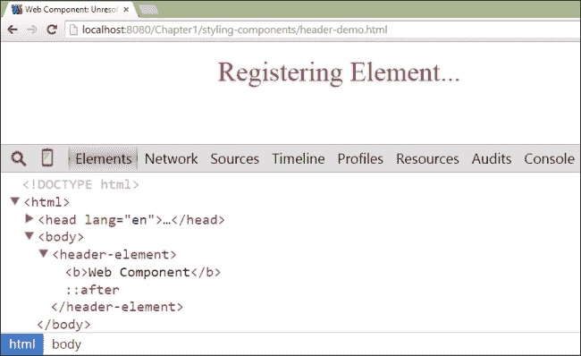

一旦元素注册到 DOM 中，生命周期方法就会被执行，并且`<header-element>`会升级并使用其 Shadow DOM。以下截图显示了上一段代码的最终输出：

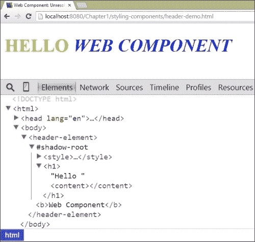

# 构建数字时钟组件

在本节中，我们将构建一个简单的数字时钟元素。构建自定义组件的目的是将模板、HTML 导入、Shadow DOM 和自定义元素应用到实时示例中。数字时钟组件的定义在`clock-element.html`文件中，而数字时钟组件的使用在`clock-demo.html`文件中。`clock-element.html`文件包含两个部分，具体如下：

+   时钟模板

+   时钟元素注册脚本

## 时钟模板

数字时钟模板包含在浏览器激活时渲染的 HTML 标记和 CSS 样式。时钟组件的 HTML 模板代码和 CSS 样式如下所示：

```js
<template id="clockTemplate">
    <style>
        :host::shadow .clock {
            display: inline-flex;
            justify-content: space-around;
            background: white;
            font-size: 8rem;
            box-shadow: 2px 2px 4px -1px grey;
            border: 1px solid green;
            font-family: Helvetica, sans-serif;
            width: 100%;
        }
        :host::shadow .clock .hour,
 :host::shadow .clock .minute,
 :host::shadow .clock .second {
            color: orange;
            padding: 1.5rem;
            text-shadow: 0px 2px black;
        }
    </style>
    <div class="clock">
 <div class="hour">HH</div>
 <div class="minute">MM</div>
 <div class="second">SS</div>
 </div>
</template>

```

上一段代码的详细解释如下：

+   时钟元素的内容位于`<template>`元素内。该模板元素的 ID 为`clockTemplate`。

+   此模板包含两个部分样式和 HTML 标记。

+   所有 CSS 样式类都围绕在`<style>`元素周围。使用`:host`伪选择器针对宿主时钟元素，使用`::shadow`伪属性和样式针对宿主的阴影树子元素，并应用样式。

+   时钟元素的 HTML 标记围绕在`div`元素周围。父`div`元素具有`.clock`类。父`div`元素有三个子`div`元素，分别代表小时、分钟和秒。

## 时钟元素注册脚本

时钟组件注册脚本位于`clock-element.html`文件中，并围绕一个自调用的匿名函数。创建和注册时钟组件的 JavaScript 代码如下：

```js
<script>
    (function() {
        var selfDocument = document.currentScript.ownerDocument,
            objectPrototype = Object.create(HTMLElement.prototype);
        objectPrototype.createdCallback = function() {
            var shadow = this.createShadowRoot(),
                templateContent = selfDocument.querySelector('#clockTemplate').content,
                templateNodes = document.importNode(templateContent, true),
                hourElement = null,
                minuteElement = null,
                secondElement = null;
            shadow.appendChild(templateNodes);
            hourElement = shadow.querySelector('.hour'),
                    minuteElement = shadow.querySelector('.minute'),
                    secondElement = shadow.querySelector('.second');
            window.setInterval(function() {
                var date = new Date();
                hourElement.innerText = date.getHours();
                minuteElement.innerText = date.getMinutes();
                secondElement.innerText = date.getSeconds();
            }, 1000);
        };
        var digitalClockElement = document.registerElement("digital-clock", {
 prototype: objectPrototype
 });
    })();
</script>
```

上述代码的详细信息如下：

+   注册时钟元素的脚本嵌入在一个自调用的函数中，该函数使用`document.currentScript.ownerDocument`将当前所有者文档的引用保存到`selfDocument`变量中。

+   使用`Object.create`方法创建一个新的对象。此新对象的原型是`HTMLElement.prototype`。将此新对象的引用保存到`objectPrototype`变量中。

+   宿主元素的`createdCallback`生命周期方法被以下步骤重载：

    +   使用`createShadowRoot`方法为宿主元素创建一个新的`shadowRoot`对象。然后将对此`shadowRoot`的引用保存到`shadow`变量中。

    +   然后使用`selfDocument`引用变量检索时钟元素的模板内容。

    +   然后使用`document.importNode`方法激活时钟模板的惰性内容。

    +   然后将激活的模板内容添加为主元素的子元素。

    +   使用`window.setInterval()`，每秒调用一个代码块。此代码块的目的在于获取当前时间的时、分、秒，并每秒重复更新 DOM。

+   然后使用`document.registerElement`方法将时钟元素注册到 DOM 中。注册后，时钟组件现在可以使用了。

# 使用时钟组件

在上一节中，我们开发了存在于`clock-element.html`文件中的时钟组件。在本节中，我们将导入时钟元素并在标记中使用它以在浏览器中渲染。使用时钟组件的代码位于`clock-demo.html`文件中，并在此列出：

```js
<!DOCTYPE html>
<html>
<head lang="en">
    <meta charset="UTF-8">
    <title>Web Component : digital clock element</title>
    <link rel="import" href="clock-element.html">
</head>
<body>
    <digital-clock></digital-clock>
</body>
</html>
```

在前面的代码中，时钟组件是通过具有`import`值的`rel`属性的`link`元素导入的。可以使用`<digital-clock></digital-clock>`自定义元素实现数字时钟组件。上述代码的输出如下所示（截图）：

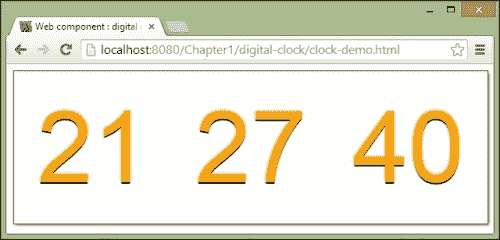

前面的截图显示了数字时钟组件。截图中的数字显示的是*小时*（HH）、*分钟*（MM）和*秒*（SS）。下面的截图显示了时钟组件的开发者控制台：

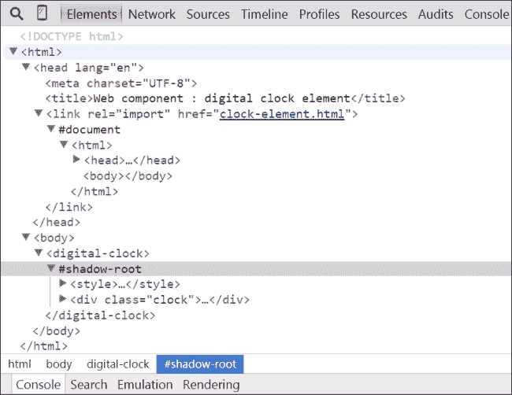

前面截图的详细信息如下：

+   时钟元素被导入到当前页面，并拥有自己的`#document`根。

+   数字时钟元素有其 Shadow DOM 树，它被渲染为一个时钟。

# X-Tag

X-Tag 是 Mozilla 为 Web 组件开发的一个小型 JavaScript 库。这个库建立在 Polymer 团队提供的 Web 组件 polyfill 之上。Mozilla Bricks 框架建立在 X-Tag 库之上。我们可以通过[`www.x-tags.org/download`](http://www.x-tags.org/download)下载 X-Tag 库。

## X-Tag 元素生命周期

每个 X-Tag 元素都有一个生命周期。元素状态是根据状态转换期间触发的事件来决定的。元素在其生命周期中会经历以下状态（触发事件）：

+   `created`: 当元素最初创建时，会触发此事件。

+   `inserted`: 当元素首次被插入 DOM 时，会触发此事件。

+   `removed`: 当元素从 DOM 中移除时，会触发此事件。

+   `attributeChanged`: 当元素的任何属性值发生变化时，会触发此事件。

元素的生命周期可以在`lifecycle`属性中定义。以下代码显示了`lifecycle`属性的语法：

```js
lifecycle:{
  created: function(){
    // code for created state
  },
  inserted: function(){
    // code for inserted state
  },
  removed: function(){
    // code for removed state
  },
  attributeChanged: function(){
    // code for attributeChanged state
  }
}
```

## X-Tag 自定义元素开发

可以使用`xtag.register`方法创建一个自定义 X-Tag 元素。X-Tag 核心库代码位于`x-tag-components.js`文件中。

### 注意

可以通过访问以下链接下载 X-Tag 核心库源代码：

[`github.com/x-tag/core`](https://github.com/x-tag/core)

`xtag.register`方法有以下语法：

```js
xtag.register('<element-name>', {
    lifecycle: {
        created: function() {
            // code for created state
        },
        inserted: function() {
            // code for inserted state
        },
        removed: function() {
            // code for removed state
        },
        attributeChanged: function() {
            // code for attributeChanged state
        }
    },
    accessors: { 
<property name> : {
            attribute: {
                //type and value of the property
            }
        }
    },
    methods: { 
<method name> : function() {
            //Code for the method
        }
    },
    events: {
        '<event type>:delegate(<element>)': function(e) {
            //Code for event handler
        }
    }
});
```

上述语法的详细信息如下：

+   `lifecycle`: 这个属性可以包含元素生命周期中所有状态的代码。因此，我们可以通过实现`created`、`inserted`、`removed`和`attributeChanged`状态来定义自定义元素的逻辑。

+   `methods`: 这个属性可以包含所有需要作为公共 API 公开的方法，以便外部使用。

+   `events`: 这个属性可以包含所有基于用户操作触发自定义元素事件的元素事件绑定监听器。

+   `accessors`: 这个属性可以包含所有需要 getter 和 setter 方法的属性。

现在，是时候使用这个 X-Tag 库创建一个自定义组件了。创建 X-Tag 基础自定义元素的代码如下：

```js
<!DOCTYPE html>
<html>
<head lang="en">
  <meta charset="UTF-8">
  <title>Web Component: xTag custom element support</title>
  <script src="x-tag-components.js"></script>
  <script>
 (function() {
 xtag.register('italic-string', {
 lifecycle: {
 created: function() {
 this.innerHTML = "<i style='color:" + this.textColor + "'>" + this.innerHTML + "</i>";
 }
 },
 accessors: {
 textColor: {
 attribute: {object: this.textColor}
 }
 },
 methods: {
 changeToRed: function() {
 var italicElement = this.querySelector("i");
 italicElement.style.color = "red";
 }
 },
 events: {
 'click:delegate(i)': function(e) {
 console.log("click event is fired.");
 }
 }
 });})();
  </script>
</head>
<body>
  <italic-string id="iStringComponent" textColor="blue">
 Click Me
 </italic-string><br>
 <button onclick="doColorRed()">Make Red</button>
  <script>
 var doColorRed = function() {
 var italicStringElement = document.getElementById("iStringComponent");
 italicStringElement.changeToRed();
 }
  </script>
</body>
</html>
```

上述代码的详细信息如下：

+   通过`xtag.register`方法创建了一个名为`italic-string`的基于 X-Tag 的自定义元素。

+   这个自定义元素将`innerHTML`内容包裹在一个`<i>`元素中，使其具有斜体样式字体。

+   这个自定义元素有一个名为`textColor`的属性，可以提供一个颜色字符串。然后，`textColor`属性的值应用于`<i>`元素的`style`属性。

+   使用`accessors`属性创建`textColor`属性。这个`accessors`属性接受需要配置到`italic-string`元素的属性。

+   使用`events`属性创建事件监听器。在前面的代码中，一个`click`事件类型监听器被附加到`<i>`元素上。当点击`<i>`元素时，它将在控制台显示一条消息。

+   可以使用`methods`属性定义一个方法。有一个名为`changedToRed()`的方法回调，可以作为 API 访问。这个回调方法使用了`document.getElementById()`来定位具有`iStringComponent`（即`italic-string`组件）的 X-Tag 自定义元素。然后，它找到并更改`<i>`元素的`color`样式属性为`Red`。一个按钮的`onclick`方法与`doColorRed`JavaScript 函数相关联，该函数反过来调用`changeToRed`方法。

前面代码的输出如下截图所示。它显示了在浏览器中渲染的**点击我**文本和**使红色**按钮：

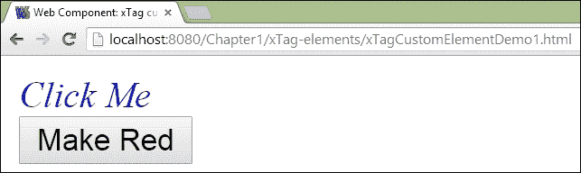

当用户点击**使红色**按钮时，**点击我**文本将变为红色。以下截图显示了**点击我**文本变为红色的情况：

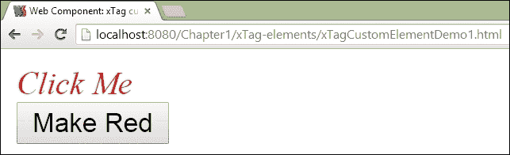

如果用户点击**点击我**文本，则与其相关联的事件处理程序将被执行并打印消息。以下截图显示了用户点击 X-Tag 元素时的控制台日志消息：

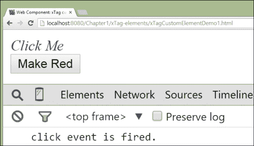

### 注意

要了解更多关于 X-Tag 库的信息，请使用以下链接：

[`www.x-tags.org/docs`](http://www.x-tags.org/docs)

浏览器并未完全实现 Web 组件规范。然而，存在许多支持 Web 组件 polyfill 的库。在本节中，我们将列出这些库，并对它们进行简要介绍。以下是一些最受欢迎的库：

## Polymer

Polymer 是来自 Google Inc.的 Web 组件库。这个库允许 Web 开发者组合 CSS、HTML 和 JavaScript 来构建丰富、强大且可重用的 Web 组件。在第二章 *介绍 Polymer* 和 第三章 中，我们将了解更多关于这个库的信息。

### 注意

要了解更多关于 Polymer 库的信息，请使用以下链接：

[`www.polymer-project.org`](https://www.polymer-project.org)

## Mozilla Brick

Mozilla Brick 是来自 Mozilla 的另一个网页组件库。它包含了一系列可重用的 UI 组件，可用于网页应用。这个库的当前版本是 2.0。在第五章，*使用 Mozilla Brick 开发 Web 组件*中，我们将了解更多关于这个库的内容。

### 注意

要了解更多关于 Mozilla Brick 库的信息，请使用以下链接：

[`brick.readme.io/v2.0`](http://brick.readme.io/v2.0)

## ReactJS

ReactJS 是由 Facebook 开发的一个用于网页组件开发的库。这个库在构建网页应用时采用了不同的方法。在第六章，*使用 ReactJS 构建 Web 组件*中，我们将了解更多关于 ReactJS 库的内容。

### 注意

要了解更多关于 ReactJS 库的信息，请使用以下链接：

[`facebook.github.io/react`](http://facebook.github.io/react)

## Bosonic

Bosonic 是另一个用于网页组件开发的库。它在核心部分使用了部分 PolymerJS polyfill。在第四章，*探索用于 Web 组件开发的 Bosonic 工具*中，我们将更深入地了解 Bosonic。

### 注意

要了解更多关于 Bosonic 库的信息，请使用以下链接：

[`bosonic.github.io/index.html`](http://bosonic.github.io/index.html)

# 摘要

在本章中，我们学习了关于网页组件规范的内容。我们还探讨了网页组件的构建块，如 Shadow DOM、自定义元素、HTML Imports 和模板。在下一章中，我们将详细了解 PolymerJS 库。 
