# 第二章. 介绍聚合库

在本章中，您将了解聚合库。您将学习如何将聚合库安装到应用程序中，随后将介绍核心元素和纸张元素。在本章的后续部分，您将探索聚合库设计工具。

# 什么是聚合库？

聚合库是由 Google 开发者开发的库，用于支持 Web 组件开发。基本上，它是基于 W3C Web 组件规范制定的。在所有浏览器实现之前，它还在 Web 组件标准之上添加了一些语法糖。聚合库的目标是尝试让浏览器完全实现 Web 组件规范。

聚合库遵循基于元素的库应用开发，我们可以构建类似于 HTML 元素的自己的元素。基于元素的库应用开发增加了在不同应用程序中开发代码的可重用性。

# 安装和配置聚合库

聚合库可以通过以下三种不同的方式获得：

+   下载 ZIP 文件

+   使用 GIT 克隆

+   使用 Bower

## 下载 ZIP 文件

可以使用[`www.polymer-project.org/0.5/docs/start/getting-the-code.html#using-zip`](https://www.polymer-project.org/0.5/docs/start/getting-the-code.html#using-zip)上的链接将聚合库下载为压缩文件。解压目录后，可以从其中提取聚合库。以下截图显示了包含聚合库的解压目录：

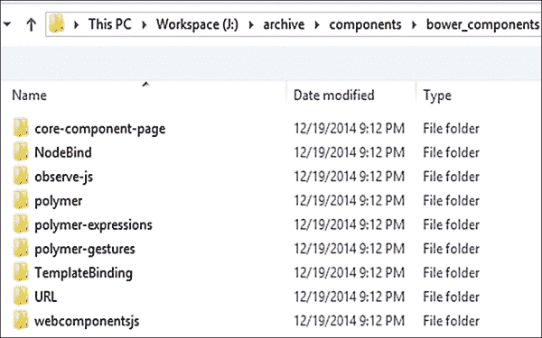

聚合库位于`polymer`目录中。HTML 文件`polymer.html`也位于`polymer`目录中。可以通过使用*HTML 导入*将此`polymer.html`文件包含到应用程序中。以下代码显示了聚合文件的语法：

```js
<link rel="import" href="bower_components/polymer/polymer.html">
```

## 使用 GIT 克隆

聚合库也可以使用 GIT 工具进行克隆。在项目中克隆 GIT 的命令如下：

```js
git clone https://github.com/Polymer/polymer.git components/polymer

```

下面的截图显示了在 Windows 命令提示符中克隆聚合库的过程：


一旦完成上述的 GIT 克隆，它将在当前目录内创建一个目录结构，如下面的截图所示。我们可以找到包含`polymer.html`和一些其他文件的`components`文件夹中的`polymer`目录。

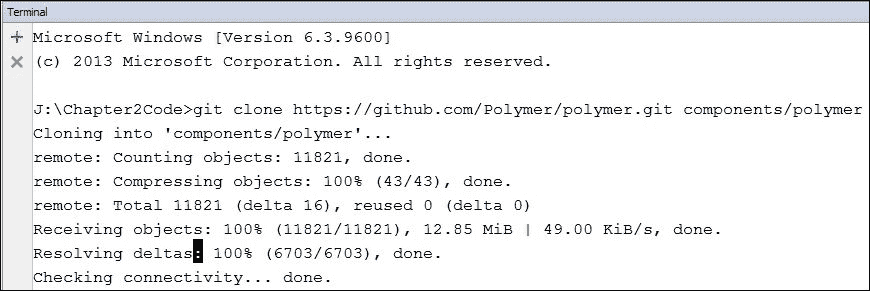

## 使用 Bower

Bower 是一个用于 Web 应用程序开发的包管理器。包管理器是一组软件工具，它以一致的方式自动化计算机操作系统的软件包的安装、升级、配置和删除过程。要在系统中安装 Bower，需要**node 包管理器**（**npm**）。有关 Bower 安装的更多详细信息，请参阅[`bower.io/#install-bower`](http://bower.io/#install-bower)。

假设 Bower 已安装在系统中，我们将继续安装 Polymer 库。首次安装时，可以使用以下命令将 Bower 初始化为 Web 应用程序项目：

```js
Bower init

```

当执行前面的命令时，它会询问一系列关于 Web 应用程序配置属性的问题。以下截图显示了带有上述命令的命令提示符：

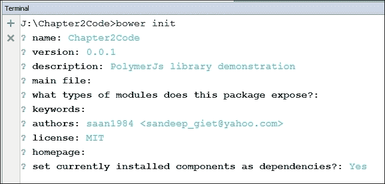

执行前面的命令后，它会在应用程序目录内创建一个`bower.json`文件。以下代码显示了包含应用程序所有默认设置的`bower.json`文件内容：

```js
{
  "name": "Chapter2Code",
  "version": "0.0.1",
  "authors": [
    "saan1984 <sandeep_giet@yahoo.com>"
  ],
  "description": "Polymer.js library Demonstration",
  "license": "MIT",
  "ignore": [
    "**/.*","node_modules","bower_components","test", "tests"
  ]
}
```

一旦创建了`bower.json`文件，现在我们可以安装 Polymer 库。使用以下命令安装 Polymer 库：

```js
bower install –save Polymer/polymer

```

以下截图显示了在应用程序内安装 Polymer 库时的命令提示符：

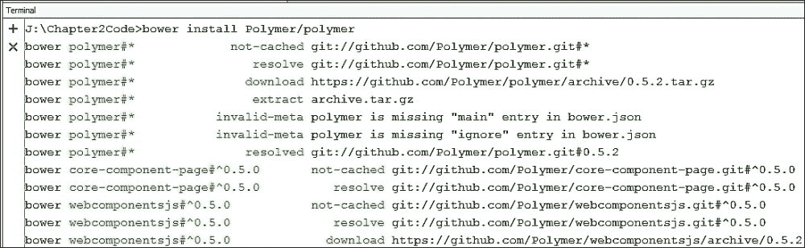

一旦安装了 Polymer 库，`bower.json`文件就会更新依赖属性。以下代码显示了`bower.json`文件的更新内容：

```js
{
  "name": "Chapter2Code",
  "version": "0.0.1",
  "authors": ["saan1984 <sandeep_giet@yahoo.com>"],
  "description": "Polymer.js library Demonstration",
  "license": "MIT",
  "ignore": [
    "**/.*","node_modules","bower_components","test","tests"],
 "dependencies": {
 "webcomponentsjs": "Polymer/webcomponentsjs#⁰.5.0",
 "core-component-page": "Polymer/core-component-page#⁰.5.0"
 }
}
```

# PolymerJS 的架构

Polymer 库建立在多层技术之上，每一层都有其特定的用途。以下图表显示了 Polymer 库的技术堆栈：

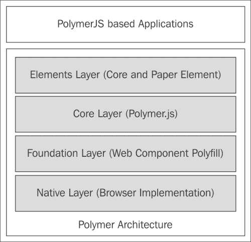

以下列表显示了 Polymer 的四个重要层：

+   **原生层**：这一层代表 Web 组件规范在浏览器中的支持状态和实现情况。

+   **基础层**：这一层包含 Web 组件规范的 polyfill 库。polyfill 是一段代码，当浏览器原生不支持时，它可以模拟这种行为。要了解更多关于 polyfill 的信息，请参阅[`en.wikipedia.org/wiki/Polyfill`](http://en.wikipedia.org/wiki/Polyfill)。

+   **核心层**：这一层包含 Polymer 库代码。Polymer 库可以在`polymer.html`文件中找到。

+   **元素层**：这一层包含核心和 paper 元素。

在 Polymer 架构的顶部，还有一个应用层。这一层代表使用 Polymer 库开发的程序。因此，我们可以得出结论，Polymer 技术建立在以下三个不同的构建块之上：

+   带有 polyfill 的 Web 组件

+   The Polymer library

+   元素

## 带有 polyfill 的 Web 组件

Web 组件规范对浏览器来说是新的。浏览器并没有完全实现它，因此为了填补这一差距，Polymer 在`webcomponent.js`文件中提供了一个 polyfill。

在 Polymer 库的早期版本中，polyfill 被命名为`platform.js`。`webcomponent.js`脚本为以下技术提供了 polyfill：

+   **Shadow DOM**：这提供了一个私有作用域，将内容与表现分离。您可以参考第一章，*介绍 Web 组件*来复习 Shadow DOM 的概念。

+   **HTML 导入**：这包括将外部 HTML 文档包含在当前页面中。您可以参考第一章，*介绍 Web 组件*来复习 HTML 导入的概念。

+   **自定义元素**：可以使用自定义元素创建新元素。您可以参考第一章，*介绍 Web 组件*来复习自定义元素的概念。

+   **WeakMap**：WeakMap 对象是一个键/值对的集合，其中键用于获取关联的值。要了解更多关于 WeakMap 对象的信息，请参阅[`developer.mozilla.org/en/docs/Web/JavaScript/Reference/Global_Objects/WeakMap`](https://developer.mozilla.org/en/docs/Web/JavaScript/Reference/Global_Objects/WeakMap)。

+   **Mutation observer**：这提供了一种通过监听 DOM 变化来执行回调方法的方式。要了解更多关于 mutation observer 的信息，请参阅[`developer.mozilla.org/en/docs/Web/API/MutationObserver`](https://developer.mozilla.org/en/docs/Web/API/MutationObserver)。

在使用 Bower 安装 Polymer 期间，web 组件 polyfill 会自动下载到项目目录。要作为独立下载安装 web 组件 polyfill，请使用以下 Bower 命令：

```js
bower install webcomponentsjs

```

我们也可以使用 npm 安装 web 组件 polyfill。要使用 npm 安装 web 组件 polyfill，请使用以下命令：

```js
npm install webcomponents.js

```

一旦成功执行上述命令，就会在项目组件目录中添加一个 `webcomponentsjs` 目录。此目录包含以下 polyfill 文件：

+   `ShadowDOM.js`：此 JavaScript 文件包含 Shadow DOM 的 polyfill 代码

+   `ShadowDOM.min.js`：此文件是 `shadowDOM.js` 的压缩版本。

+   `HTMLImports.js`：此 JavaScript 文件包含 HTML 导入的 polyfill 代码

+   `HTMLImports.min.js`：此文件是 `HTMLImports.js` 的压缩版本

+   `CustomElements.js`：此 JavaScript 文件包含自定义元素的 polyfill 代码

+   `CustomElements.min.js`：此文件是 `CustomElements.js` 的压缩版本

+   `webcomponents.js`：此 JavaScript 文件包含整个 web 组件规范的 polyfill 代码

+   `webcomponents.min.js`：此文件是 `webcomponents.js` 的压缩版本

+   `webcomponents-lite.js`：这是 `webcomponent.js` 的轻量版本，包含 HTML 导入和自定义元素的 polyfill 代码

+   `webcomponents-lite.min.js`：此文件是 `webcomponents-lite.js` 的压缩版本

要了解更多关于 web 组件 polyfill 的信息，请参阅[`webcomponents.org/polyfills`](http://webcomponents.org/polyfills)。

## Polymer 库

Polymer 库是这个框架的核心文件，它建立在 Web 组件 polyfill 之上。当使用 Bower 工具安装 Polymer 库时，会在项目文件夹中安装一个 `polymer` 目录。这个 `polymer` 目录主要包含以下文件：

+   `polymer.js`：这是核心 JavaScript 文件，其中包含 Polymer 库提供的所有“魔法特性”的代码。我们将在下一节中探讨这些魔法特性。

+   `polymer-min.js`：这是 `polymer.js` 文件的压缩版本。

+   `layout.html`：这个文件包含用于在页面内创建元素布局位置的 CSS 属性。

+   `polymer.html`：这个文件包含通过链接到 `polymer.js` 和 `layout.html` 文件组合的代码，并且可以通过 HTML Import 包含到当前页面中。

## 元素

在 Polymer 世界中，一切都是一个元素。Polymer 团队提供了一套元素来构建 Web 应用程序。这些元素可以分为以下两个类别：

+   核心元素

+   Paper 元素

### 核心元素

Polymer 核心元素是一组通用 UI 和非 UI 元素，用于构建网页。它们包括图标、布局、工具栏、AJAX、信号和存储元素。Polymer 库中包含许多核心元素。我们可以直接从 [`bowerarchiver.appspot.com/archive?core-elements=Polymer/core-elements`](https://bowerarchiver.appspot.com/archive?core-elements=Polymer/core-elements) 下载整个核心元素集作为一个单独的 ZIP 文件。此外，我们还可以使用以下 Bower 命令包含整个核心元素集：

```js
bower install Polymer/core-elements

```

以下截图显示了使用 Bower 在命令提示符中安装核心元素：


一旦前面的命令成功执行，我们就可以通过 HTML Imports 将核心元素集包含到我们的网页中。以下代码展示了网页内核心元素的 HTML Import：

```js
<link rel="import" href="components/core-elements/core- elements.html">
```

我们可以在 [`www.polymer-project.org/docs/elements/core-elements.html`](https://www.polymer-project.org/docs/elements/core-elements.html) 找到核心元素的完整列表。然而，我们将探索其中的一些。

#### `core-input` 元素

`core-input` 元素是一个单行输入字段，它扩展了原生的 HTML 输入元素。要将 `core-input` 字段作为独立组件安装，我们可以使用以下 Bower 命令：

```js
bower install Polymer/core-input

```

以下截图显示了命令提示符中 `core-input` 字段安装正在进行：

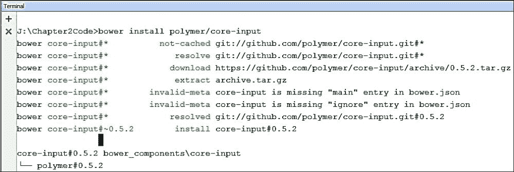

在安装 `core-input` 元素后，可以使用 HTML Import 导入它。将 `core-input` 包含到当前页面的代码如下：

```js
<link rel="import" href="bower_components/core-input/core-input.html">
```

通过使用 `is` 属性，可以将一个普通输入元素转换为核心输入。`core-input` 元素的代码如下：

```js
<input is="core-input">
```

`core-input` 元素具有以下属性和方法：

+   `value`：此属性从`<input>`元素继承，表示当前值

+   `committedValue`：此属性包含用户按下*Enter*键或更改值后失去焦点时的最终值

+   `commit`：此方法用于将`value`属性中现有的内容传输到`committedValue`属性

+   `preventInvalidInput`：这是一个布尔属性，当其值为 true 时，用于防止无效输入

现在，让我们看看如何使用`core-input`值和前面的属性/方法。以下代码展示了`core-input`元素的使用：

```js
<!DOCTYPE html>
<html>
<head lang="en">
<meta charset="UTF-8">
<title>Core Input Demo</title>
<script src="img/strong>">
</script>
<link rel="import" href="bower_components/polymer/polymer.html">
<link rel="import" href="bower_components/core-input/core-input.html">
</head>
<body>
    <section>
        <input is="core-input" id="coreInput1"
 type="number" placeholder="Enter a Number"
 preventInvalidInput onchange="changeHandler()">
    </section>
<script>
 var changeHandler = function(){
 var coreInput1 = document.getElementById("coreInput1");
 console.log("Value "+coreInput1.value);
 console.log("Before commit committedValue "+coreInput1.committedValue);
 //Committing the value
 coreInput1.commit();
 console.log("After Commit committedValue "+coreInput1.committedValue);
    }
</script>
</body>
</html>
```

前面代码的详细信息如下：

+   代码中包含了一个具有`coreInput1` ID 的`core-input`元素。`coreInput1`元素的数据类型为数字。

+   这个`coreInput1`元素将`preventInvalidInput`属性设置为`true`，这有助于防止用户输入任何无效数据。

+   `changeHandler`方法被附加到`coreInput1`元素的更改事件上，并在检测到核心元素中的任何更改时被调用。

+   让我们在核心元素中输入一个有效的数字`1`，然后点击页面的主体。这个用户动作将触发`changeHandler`方法的执行。以下截图显示了前面代码的输出，其中**1**被输入到核心输入元素中：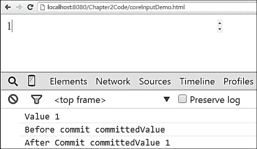

+   让我们输入另一个数字`2`，这将再次触发`changeHandler`方法的执行。以下截图显示了前面代码的输出，其中**2**被输入到核心输入元素中：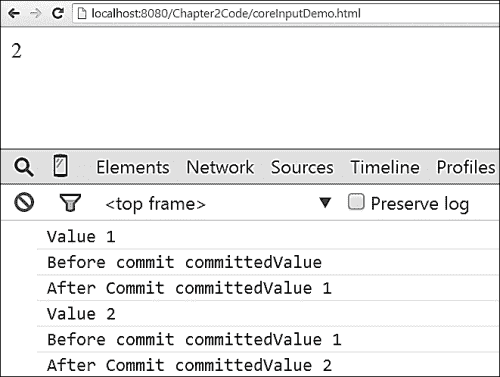

要了解更多关于 Polymer 核心输入元素的信息，请参阅[`www.polymer-project.org/docs/elements/core-elements.html#core-input`](https://www.polymer-project.org/docs/elements/core-elements.html#core-input)。

#### `core-label`元素

`core-label`元素提供了`<label>`元素的一个功能，用于定位特定元素。要将`core-label`作为一个独立的组件安装，我们可以使用以下 Bower 命令：

```js
bower install Polymer/core-label

```

以下截图显示了带有`core-label`元素安装过程的命令提示符：

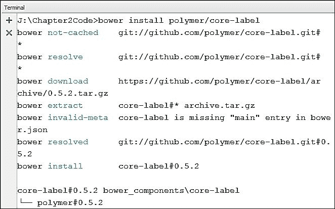

安装`core-label`元素后，可以使用 HTML 导入来导入它。将核心输入包含到当前页面的代码如下：

```js
<link rel="import" href="bower_components/core-label/core- label.html">
```

`core-label`元素的代码如下：

```js
<core-label></core-label>
```

`core-label`元素具有`for`属性。`for`属性的作用类似于查询选择器，用于定位元素。

现在，让我们看看如何使用`core-label`元素的一个示例。以下代码展示了`core-label`元素的不同用法：

```js
<!DOCTYPE html>
<html>
<head lang="en">
    <meta charset="UTF-8">
    <title>Core Label Demo</title>
    <script src="img/webcomponents.min.js">
    </script>
    <link rel="import" href="bower_components/polymer/polymer.html">
    <link rel="import" href="bower_components/core-input/core-input.html">
 <link rel="import" href="bower_components/core-label/core- label.html">
</head>
<body>
    <section>
 <core-label for="#coreInput1">Student Name :</core-label>
 <input is="core-input" id="coreInput1"
 type="text" placeholder="Enter Your Name">
 <br/>
 <core-label>
 Student Subject :
 <input is="core-input" type="text"
 placeholder="Enter Your Subject">
 </core-label>
    </section>
</body>
</html>
```

在前面的代码中，`core-label`元素被用来定位核心输入元素。这种定位是通过两种不同的方式完成的：

+   **使用`for`属性**：**学生姓名**文本被用作标签来定位`coreInput1`元素

+   **包装目标元素**：使用 `core-label` 元素将 `Student Subject` 文本包装起来，用作 `core-input` 元素的标签

以下截图显示了前面代码的输出，展示了 `core-label` 元素的两种不同用法：

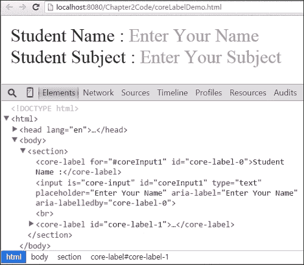

#### 核心提示元素

`core-tooltip` 元素通过针对特定元素提供在提示中显示支持信息的功能。要将 `core-tooltip` 作为独立组件安装，我们可以使用以下 Bower 命令：

```js
bower install Polymer/core-tooltip

```

以下截图显示了正在安装 `core-tooltip` 元素的命令提示符：

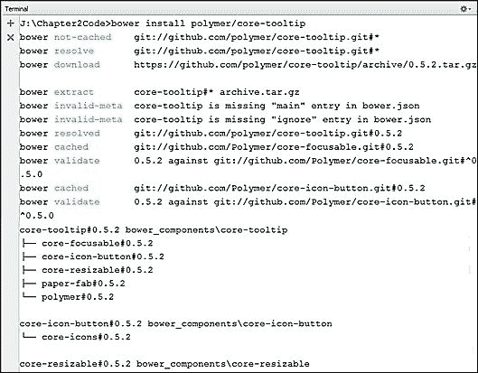

安装 `core-tooltip` 元素后，可以使用 HTML 导入功能导入。将 `core-tooltip` 包含到当前页面的代码如下：

```js
<link rel="import" href="bower_components/core-tooltip/core- tooltip.html">
```

`core-tooltip` 元素的代码如下：

```js
<core-tooltip></core-tooltip>
```

`core-tooltip` 元素具有以下属性：

+   `Label`: 此属性接受一个字符串，用作当前目标元素的提示

+   `Position`: 此属性接受 `right`、`left`、`top` 和 `bottom` 作为值，以围绕目标元素对齐提示

+   `Show`: 此属性接受布尔值，对于 `true` 值，提示将默认显示

+   `tip/tipAttribute`: `tip` 属性指定了丰富提示的 HTML 内容，并通过 `tipAttribute` 属性自定义此属性

+   `noArrow`: 此属性接受布尔值，对于 `true` 输入，提示的箭头将不会显示

现在，让我们看看 `core-tooltip` 元素的一个使用示例。以下代码显示了 `core-tooltip` 元素的多种用法：

```js
<!DOCTYPE html>
<html>
<head lang="en">
    <meta charset="UTF-8">
    <title>Core ToolTip Demo</title>
    <script src="img/webcomponents.min.js">
    </script>
    <link rel="import" href="bower_components/polymer/polymer.html">
    <link rel="import" href="bower_components/core-tooltip/core- tooltip.html">
</head>
<body>
    <section>
        <core-tooltip position="right" show>
 <h2>Polymer.js Icon Tooltip</h2>
 <div tip >
 
 </div>
 </core-tooltip>
        <br/>
        <core-tooltip label="Polymer.js core-tooltip element" position="right" noarrow >
 
 </core-tooltip>
        <br/>
    </section>
</body>
</html>
```

以下截图显示了前面代码的输出，展示了 `core-tooltip` 元素及其不同属性的使用：

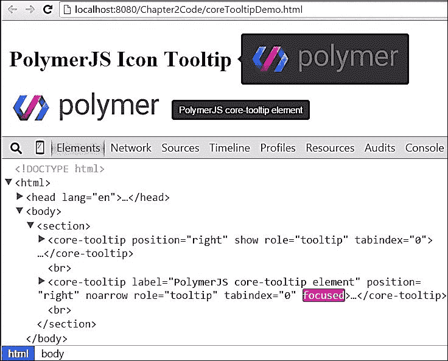

### 纸元素

纸元素建立在 Polymer 核心元素之上。与核心元素相比，这些元素在 UI 方面更加丰富。基本上，纸元素是按照 *Google Material Design* 指南构建的。以下图表显示了这些元素之间的图形关系：

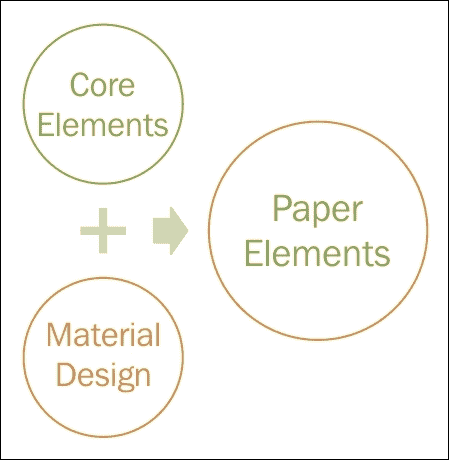

### 提示

要了解更多关于 *Google Material Design* 的信息，请参阅 [`www.google.com/design/spec/material-design/introduction.html`](http://www.google.com/design/spec/material-design/introduction.html)。

Polymer 库中存在许多纸元素。我们可以直接下载整个纸元素集作为一个单独的 ZIP 文件，从 [`bowerarchiver.appspot.com/archive?paper-elements=Polymer/paper-elements`](https://bowerarchiver.appspot.com/archive?paper-elements=Polymer/paper-elements)。此外，我们还可以使用以下 Bower 命令包含整个纸元素集：

```js
bower install Polymer/paper-elements

```

以下截图显示了使用 Bower 在命令提示符中安装纸张元素：

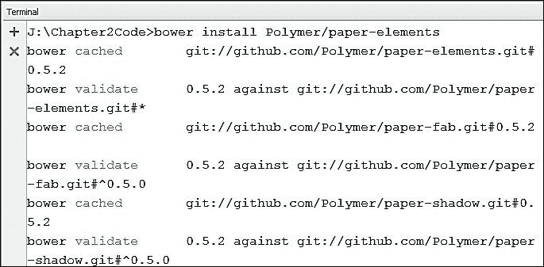

一旦前面的命令成功执行，我们就可以通过 HTML 导入将纸张元素集包含到我们的网页中。以下代码显示了网页内`paper-element`的 HTML 导入：

```js
<link rel="import" href="components/paper-elements/paper- elements.html">
```

我们可以在[`www.polymer-project.org/docs/elements/paper-elements.html`](https://www.polymer-project.org/docs/elements/paper-elements.html)找到纸张元素的完整列表。然而，在这里我们将探讨其中的一些。

#### 材料设计

这是一个跨不同设备开发用户界面的常见设计指南。这些指南受到现实世界材料的影响，如纸张和墨水。以下图显示了三个构建块——**视觉**、**运动**和**交互**：

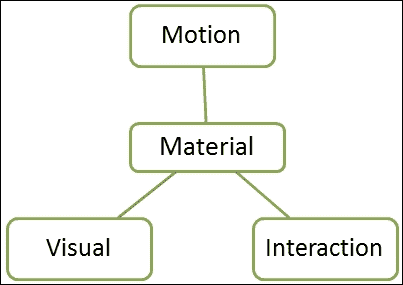

要了解更多关于*材料设计*规范的信息，请参阅[`www.google.com/design/spec/material-design/introduction.html`](http://www.google.com/design/spec/material-design/introduction.html)。

#### 纸张滑块元素

`paper-checkbox`元素提供了普通复选框元素的特性，但通过动画提供了更好的可视化。要将`paper-checkbox`作为独立组件安装，我们可以使用以下 Bower 命令：

```js
bower install Polymer/paper-checkbox

```

以下截图显示了带有`paper-checkbox`元素安装过程中的命令提示符：

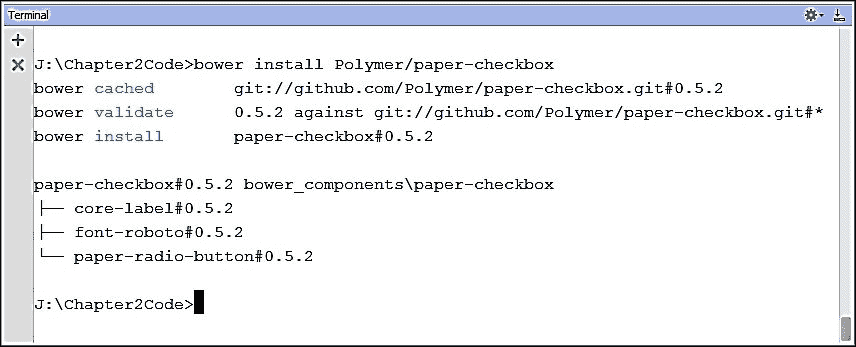

在`paper-checkbox`元素安装完成后，可以使用 HTML 导入来导入。将`paper-checkbox`包含到当前页面的代码如下：

```js
<link rel="import" href="bower_components/paper-checkbox/paper- checkbox.html">
```

`paper-checkbox`元素的代码如下：

```js
<paper-checkbox></paper-checkbox>
```

`paper-checkbox`元素有以下事件可以附加到回调方法：

+   `change`：当用户交互导致复选框的选中状态改变时触发此事件

+   `core-change`：当复选框的选中状态改变时触发此事件

现在，让我们看看使用`paper-checkbox`元素的示例。以下代码显示了`paper-checkbox`元素的不同用法：

```js
<!DOCTYPE html>
<html>
<head lang="en">
    <meta charset="UTF-8">
    <title>Paper CheckBox Demo</title>
    <meta name="viewport" content="width=device-width, minimum- scale=1.0, initial-scale=1, user-scalable=yes">
    <script src="img/webcomponents.min.js">
    </script>
    <link rel="import" href="bower_components/polymer/polymer.html">
 <link rel="import" href="bower_components/paper- checkbox/paper-checkbox.html">
</head>
<body unresolved>
    <section>
        <core-label horizontal layout center>
 <paper-checkbox for id="mathCheckbox"></paper- checkbox>
 <h1>Mathematics</h1>
        </core-label>
        <core-label horizontal layout center>
 <paper-checkbox for checked id="compCheckbox"></paper- checkbox>
 <h1>Computer</h1>
        </core-label>
    </section>
 <script>
 (function(){
 var mathCheckbox = document.getElementById("mathCheckbox"),
 compCheckbox = document.getElementById("compCheckbox");
 //checked state changes due to user interaction
 mathCheckbox.addEventListener("change", function (e) {
 console.log("change event fired");
 }),
 //when the checked state changes by any mean
 compCheckbox.addEventListener("core-change", function (e) {
 console.log("core-change event fired");
 });
 }());
 </script>
</body>
</html>
```

以下截图显示了前面代码的输出，展示了`paper-checkbox`的使用：

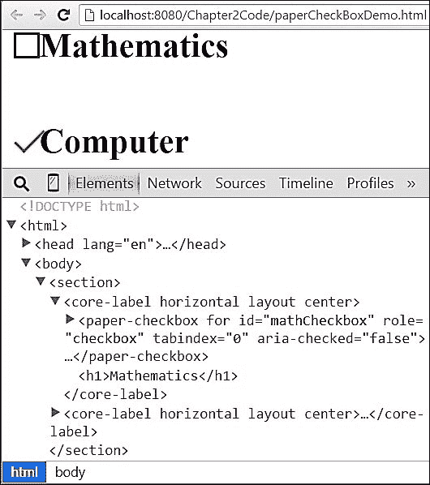

#### 纸张滑块元素

`paper-slider`元素提供了范围元素的特性，但通过动画提供了更好的可视化。要将`paper-slider`作为独立组件安装，我们可以使用以下 Bower 命令：

```js
bower install Polymer/paper-slider

```

以下截图显示了带有`paper-slider`元素安装过程中的命令提示符：


在`paper-slider`元素安装完成后，可以使用 HTML 导入来包含。将纸张滑块包含到当前页面的代码如下：

```js
<link rel="import" href="bower_components/paper-slider/paper- slider.html">
```

`paper-slider`元素的代码如下：

```js
<paper-slider></paper-slider>
```

`paper-slider`元素有以下属性可以用来自定义纸元素：

+   **最小值、最大值和值**：这些是从核心范围元素继承的属性，分别代表滑块的最小值、最大值和当前值。要了解核心范围元素的属性，请参阅[`www.polymer-project.org/docs/elements/core-elements.html#core-range`](https://www.polymer-project.org/docs/elements/core-elements.html#core-range)。

+   **Snaps**：这是基于步进值，滑块将刻度均匀地与滑块的拇指对齐。

+   **Pin**：此属性显示一个视觉上的固定点，当滑块拇指被按下时，会显示一个数值标签。

`paper-slider`元素内部还有一些其他属性，可以在[`www.polymer-project.org/docs/elements/paper-elements.html#paper-slider`](https://www.polymer-project.org/docs/elements/paper-elements.html#paper-slider)找到。

现在，让我们看看如何使用`paper-slider`元素的一个示例。以下代码展示了`paper-slider`元素的不同用法：

```js
<!DOCTYPE html>
<html>
<head lang="en">
    <meta charset="UTF-8">
    <title>Paper Slider Demo</title>
    <script src="img/webcomponents.min.js">
    </script>
    <link rel="import" href="bower_components/polymer/polymer.html">
 <link rel="import" href="bower_components/paper-slider/paper- slider.html">
</head>
<body>
    <section>
 <paper-slider min="10" max="200"
 value="110" pin="true"
 snaps="true">
 </paper-slider>
    </section>
</body>
</html>
```

以下截图显示了前面代码的输出，展示了`paper-slider`属性的使用：

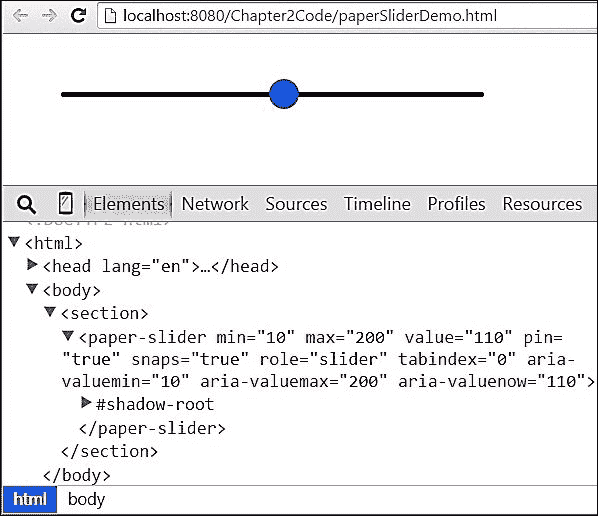

#### `paper-button`元素

`paper-button`元素提供了范围元素的特性，但通过动画提供了更好的可视化。要将`paper-button`作为独立组件安装，我们可以使用以下 Bower 命令：

```js
bower install Polymer/paper-button

```

以下截图显示了带有`paper-button`元素安装过程的命令提示符：

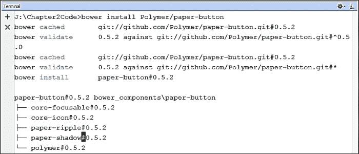

在安装了`paper-button`元素之后，可以使用 HTML 导入将其包含进来。将`paper-button`包含到当前页面的代码如下：

```js
<link rel="import" href="bower_components/paper-button/paper- button.html">
```

`paper-button`元素的代码如下：

```js
<paper-button></paper-button>
```

`paper-button`元素有以下属性可以用来自定义元素：

+   `raised`：此属性为纸按钮创建阴影效果。

+   `recenteringTouch`：可以通过此属性自定义按钮按下时产生的涟漪效果。

+   `fill`：此属性将按钮按下时产生的涟漪效果限制在按钮内的圆形区域内。

现在，让我们看看如何使用`paper-button`元素的一个示例。以下代码展示了`paper-button`元素的不同用法：

```js
<!DOCTYPE html>
<html>
<head lang="en">
    <meta charset="UTF-8">
    <title>Paper Button Demo</title>
    <script src="img/webcomponents.min.js">
    </script>
    <link rel="import" href="bower_components/polymer/polymer.html">
 <link rel="import" href="bower_components/paper-button/paper- button.html">
</head>
<body>
    <section>
 <paper-button>Button</paper-button>
 <paper-button raised>Button1</paper-button>
 <paper-button nolink>Button2</paper-button>
 <paper-button fill="false">Button3</paper-button>
 <paper-button recenteringTouch="true">Button4</paper- button>
    </section>
</body>
</html>
```

以下截图显示了前面代码的输出，展示了`paper-button`属性的使用：

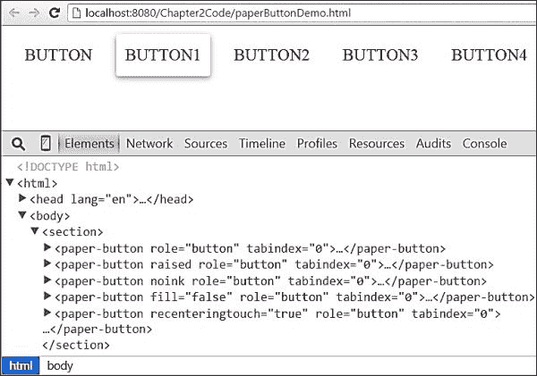

# 聚合物设计工具

Polymer 设计工具是一个用于可视创建 Polymer 元素的在线工具。它为开发者提供了一个拖放环境来创建 Web 应用页面。你可以在[`www.polymer-project.org/tools/designer/`](https://www.polymer-project.org/tools/designer/)找到此工具。设计工具的源代码可以在[`github.com/polymer/designer`](https://github.com/polymer/designer)找到。

以下截图显示了设计工具的主页：

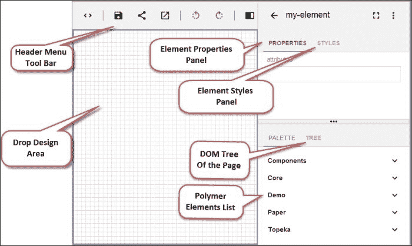

设计工具有以下三个不同的主要部分：

+   **标题菜单工具栏**：此工具栏位于设计工具的顶部。它包含以下七个不同的选项供开发者使用：

    +   **切换代码/设计**—使用此选项，我们可以在设计和代码视图之间切换。

    +   **保存**—使用此选项，我们可以保存开发进度。

    +   **分享 Gist**—使用此选项，我们可以通过 GitHub gist 分享代码。

    +   **启动预览**—使用此选项，我们可以在新窗口中预览开发中的页面。

    +   **撤销**—使用此选项，我们可以恢复到最后更改的状态。

    +   **重做**—使用此选项，我们可以恢复到下一个更改的状态。

    +   **切换全宽**—使用此选项，我们可以将设计区域设置为全宽窗口。

+   **主要设计区域**：这是元素的拖放目标。在这个区域中，我们可以拖放任何需要出现在页面上的元素。设计区域填充了水平和垂直的网格线。

+   **右菜单栏**：此栏用于显示设计中选择元素的详细信息。它再次分为两个子部分：

    +   **属性和样式**：此子部分显示了设计区域中当前选中元素的属性和样式属性。我们可以更改选中元素的任何属性或样式值。

    +   **调色板和树**：调色板视图包含可以拖放到设计区域的整个可拖动元素集。树部分显示了页面当前文档树，以父子关系展示。

## 使用设计工具进行开发

在本节中，我们将使用 Polymer 设计工具开发一个电子邮件订阅表单。我们必须遵循以下步骤来使用设计工具：

+   获取 GitHub 令牌

+   开发电子邮件订阅表单

+   预览设计

### 获取 GitHub 令牌

我们需要获取一个 GitHub 令牌来将设计工具的工作保存为 gist。当你点击**保存**选项时，它会请求一个 GitHub 令牌。你可以从[`github.com/settings/tokens/new`](https://github.com/settings/tokens/new)获取一个新的 GitHub 令牌。以下截图显示了创建 GitHub 令牌的表单：


为此示例创建的 GitHub 令牌是`designerapp`。现在我们可以在设计工具中使用此令牌。以下截图显示了在点击**保存**选项时请求 GitHub 令牌的弹出窗口：

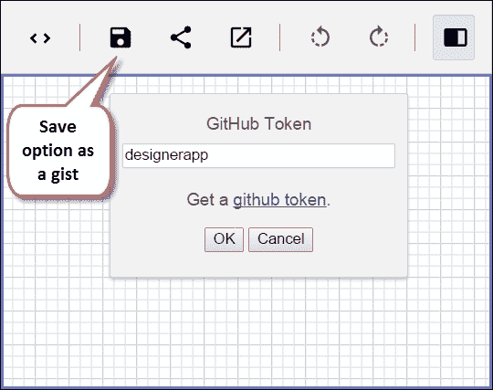

在弹出窗口中，我们可以输入创建的 GitHub 令牌，我们就可以进行下一步——开发电子邮件订阅表单。

#### 开发电子邮件订阅表单

要开发一个电子邮件订阅表单，我们已经从 **调色板** 部分拖拽以下项目到设计器拖拽区域：

+   核心卡片元素

+   核心项目元素

+   paper-input 元素

+   纸按钮元素

在将这些元素拖拽到卡片内部并调整对齐后，我们对这些元素的样式和属性进行了修改。以下截图仅显示了 paper-button 的样式和属性部分。同样，我们可以更改其他元素：

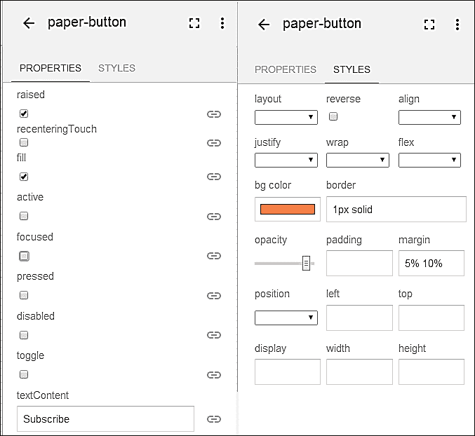

在修改样式和属性后，我们可以通过使用 **切换代码/设计** 选项来查看生成的代码。生成的代码如下截图所示：

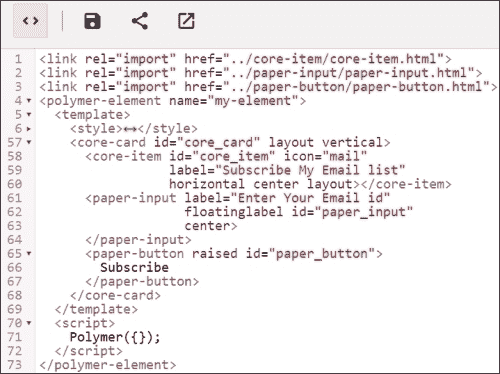

可以通过使用 **启动预览** 选项来查看设计的预览。以下截图显示了在新窗口中开发的设计的实时预览：

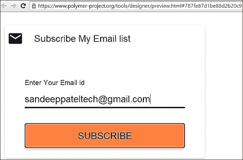

# Yeoman Polymer 生成器

Yeoman 工具为网络开发者提供生成器生态系统，以减少配置工作并专注于网络应用程序逻辑。Yeoman 通过快速启动项目和实施最佳实践以及所需的基本代码来提高开发者的生产力。

Yeoman 可以使用 npm 进行安装。以下代码展示了在系统中安装 Yeoman 的命令：

```js
npm install -g yo

```

以下截图显示了带有 Yeoman 安装过程中的命令提示符：

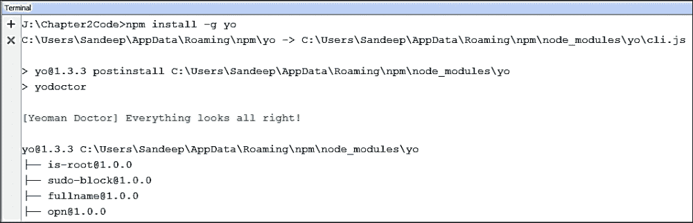

Yeoman 为不同类型的应用程序提供不同的生成器。每个生成器都有特定的工作流程来完成应用程序的部分或完整配置。这些生成器通过 `yo` 命令运行。一旦 Yeoman 在系统中安装，可以使用以下命令安装 Polymer 生成器：

```js
npm install -g generator-polymer

```

以下截图显示了带有 polymer-generator 安装过程中的命令提示符：

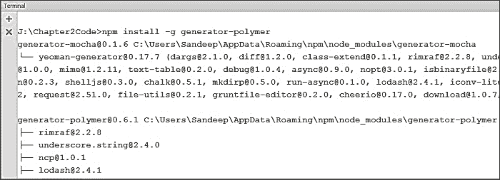

## polymer-generator 命令

polymer-generator 为基于 Polymer 的应用程序开发提供以下实用工具：

+   Polymer 应用程序生成器

+   Polymer 元素生成器

+   Polymer 种子生成器

+   Polymer GitHub 页面生成器

### Polymer 应用程序生成器

可以使用 Polymer 应用程序生成器创建新的 Polymer 应用程序。创建新 Polymer 应用程序的步骤如下：

1.  我们需要创建一个新的项目目录。以下命令可以用来创建一个新的项目目录：

    ```js
    J:\>mkdir PolymerAppDemo

    ```

    使用以下命令将目录更改为 `PolymerAppDemo`：

    ```js
    J:\>cd PolymerAppDemo

    ```

1.  在更改目录后，我们可以运行命令来生成聚合物应用程序设置。设置过程会提出一系列问题，这些问题需要开发者回答。一旦这些问题得到回答，它就会创建一个包含所有必需库和依赖项的聚合物应用程序。生成聚合物应用程序的命令如下：

    ```js
    J:\PolymerAppDemo>yo polymer

    ```

以下截图显示了正在进行的聚合物应用程序生成器的命令提示符：

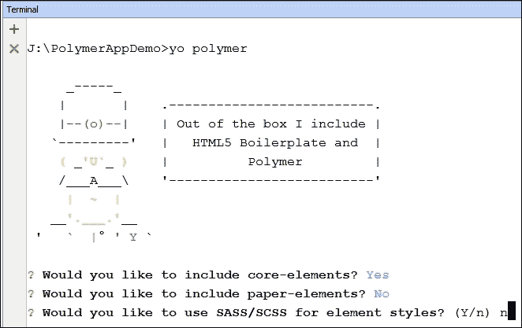

### 聚合物元素生成器

聚合物元素生成器可用于创建自定义元素的样板代码。我们将在下一章中学习这个用于创建自定义元素的生成器。

如果你现在想了解更多关于聚合物元素生成器的信息，请参阅[`github.com/yeoman/generator-polymer#element-alias-el`](https://github.com/yeoman/generator-polymer#element-alias-el)。

### 聚合物种子生成器

这个生成器可用于创建一个自定义的独立元素，该元素旨在通过 Bower 与他人共享。你将在下一章中了解更多关于这个生成器的信息。

如果你现在想了解更多关于聚合物种子生成器的信息，请参阅[`github.com/yeoman/generator-polymer#seedc`](https://github.com/yeoman/generator-polymer#seedc)。

### 聚合物 GitHub 页面生成器

这个生成器可用于为独立的种子元素创建 GitHub 页面，以便与开发者社区分享其详细信息。我们将在下一章中学习这个 GitHub 页面生成器。

如果你现在想了解更多关于聚合物 GitHub 页面生成器的信息，请参阅[`github.com/yeoman/generator-polymer#gh`](https://github.com/yeoman/generator-polymer#gh)。

# 摘要

在本章中，你学习了聚合物库的安装。我们探讨了聚合物库的架构，随后是关于核心和纸张元素的章节。在本章的最后部分，你被介绍了聚合物设计工具。在下一章中，你将学习如何使用聚合物库开发自定义元素。
