# 第三章. 使用聚合体开发 Web 组件

在上一章中，你学习了如何在网页中安装和配置聚合体库。现在，是时候探索一些更有用的功能，并学习如何开发自定义元素。

# 聚合体 JS 就绪事件

可以通过导入`polymer.html`文件将聚合体库包含到页面中。聚合体会异步检查每个注册的元素定义。如果我们尝试在此时渲染元素，它将创建**无样式内容闪烁**（**FOUC**）问题。为了解决这个问题，我们需要捕获`polymer-ready`事件。我们可以在聚合体准备好之前隐藏页面元素，一旦聚合体准备好，我们就可以使它们可见。以下代码显示了`polymer-ready`事件的使用：

```js
<!DOCTYPE html>
<html>
<head>
    <link rel="import" href="../bower_components/polymer/polymer.html">
    <title>Polymer ready event listener example</title>
</head>
<body>
<script>
 document.addEventListener("DOMContentLoaded", function(event) {
 console.log("DOMContentLoaded is fired at",new Date().getTime());
 });
 window.addEventListener('polymer-ready', function(e) {
 console.log("polymer-ready is fired.",new Date().getTime());;
 });
</script>
</body>
</html>
```

在前面的代码中，我们有两个回调方法监听`DOMContentLoaded`和`polymer-ready`事件。在回调代码中，控制台记录了事件触发的时间。以下截图显示了前面代码的输出，显示了`DOMContentLoaded`和`polymer-event`触发的时间：

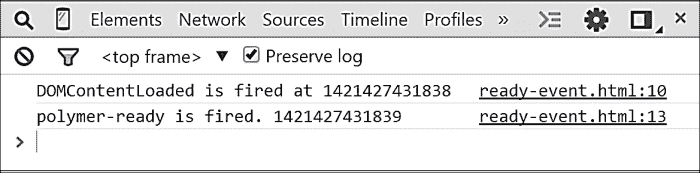

从前面的截图可以看出，一旦 DOM 加载完成，聚合体开始注册元素，一旦完成，它就会触发`polymer-ready`事件。

# 聚合体表达式

开发过程中的关注点分离是一个古老的讨论话题。关注点分离的目标是将渲染逻辑与标记分离。这降低了代码维护成本并提高了生产力。聚合体提供了可以与 HTML 代码内联使用的表达式功能，而计算逻辑则存在于另一个 JavaScript 文件中。聚合体表达式的语法如下：

```js
{{Expression}}
```

在前面的语法中，聚合体表达式被包裹在两个大括号中。关于聚合体表达式有以下几点需要注意：

+   聚合体表达式用于与 HTML 代码内联，用于简单的文本值

+   聚合表达式不应用于 HTML 值

+   `Eval`方法不能在表达式中使用

聚合体支持许多用于处理表达式的操作。这些操作如下：

+   **标识符和路径**：这代表当前页面作用域中存在的对象和属性。通常，路径用点（`.`）运算符表示。以下代码展示了标识符和路径的示例：

    ```js
    {{student.name}}
    {{student.subject.mark}}
    ```

+   **数组访问**：这代表数组对象中存在的成员。通常，数组访问可以用方括号（`[]`）表示。以下代码展示了数组访问的示例：

    ```js
    {{student[0].name}}
    ```

+   **逻辑非运算符**：这代表否定真值的布尔运算符。以下代码展示了非运算符的示例：

    ```js
    {{!flag}}
    ```

+   **一元运算符**：这代表像`+`和`–`这样的单一操作数运算符。以下代码展示了一元运算符的示例：

    ```js
    {{-number}}
    ```

+   **二元运算符**: 这表示用于两个操作数的二元运算符。以下代码展示了二元运算符的一个示例：

    ```js
    {{number1*number2}}
    ```

+   **比较运算符**: 这表示 `<, >`, `<=, >=`, `==`, `!=`, `===`, `!==`，并返回一个布尔值。以下代码展示了比较运算符的一个示例：

    ```js
    {{number1 < number2}}
    ```

+   **逻辑比较运算符**: 这表示逻辑运算符，如 AND (`&&`) 和 OR (`||`)，并返回一个布尔值。以下代码展示了逻辑比较运算符的一个示例：

    ```js
    {{variable1 && variable2}}
    ```

+   **三元运算符**: 这表示类似于 `if` 条件的三元运算符。以下代码展示了三元运算符的一个示例：

    ```js
    {{number1 > number2 ? "number1 is greater" :  "number2 is greater"}}
    ```

+   **括号**: 这有助于将需要评估的表达式分组。以下代码展示了括号的一个示例：

    ```js
    {{(number1 + number2)*number3}}
    ```

+   **字面量值**: 这表示字面量标识符，如 null 和 undefined。以下代码展示了字面量值的一个示例：

    ```js
    {{null}}
    ```

+   **数组和对象初始化器**: 这表示匿名数组和对象的声明。以下代码展示了数组初始化器的一个示例：

    ```js
    {{["Apple", "Orange"]}}
    ```

+   **函数**: 函数可以使用聚合物表达式来调用。以下代码展示了函数的一个示例：

    ```js
    {{someFunction()}}
    ```

    ### 注意

    要了解更多关于聚合物表达式的信息，请参阅[`www.polymer-project.org/docs/polymer/expressions.html`](https://www.polymer-project.org/docs/polymer/expressions.html)。

我们还可以在聚合物表达式中使用过滤器。在深入了解过滤器表达式之前，让我们先了解带有自动绑定的聚合物模板。首先查看自动绑定的原因是因为接下来章节中的示例是独立的，并在当前页面范围内运行。

## 带有自动绑定的聚合物模板

在第一章中，我们学习了 W3C Web 组件规范中定义的 `<template>` 元素。聚合物添加了一些额外的功能，例如表达式和模板绑定。这意味着我们可以在模板中使用表达式，并将其渲染到浏览器中。

聚合物模板的工作方式与传统模板不同。模板实例的 DOM 模型在浏览器中保持不变，只要相应的数据在使用中。如果数据有任何变化，那么聚合物会比较并修改 DOM 的特定部分。这导致对 DOM 树的最小更改。

聚合物模板可以通过使用自动绑定功能在页面级别上使用。正如我们所知，`<template>` 内容在未被激活时是惰性的。聚合物模板提供了一个名为自动绑定的解决方案，其中模板通过考虑模板和数据模型本身来激活。可以使用 `is` 属性的自动绑定值将模板用作自动绑定。模板自动绑定的语法如下：

```js
<template is="auto-binding">
</template>
```

让我们看看自动绑定模板的一个简单示例。使用自动绑定功能的代码如下：

```js
<!DOCTYPE html>
<html>
<head>
    <script src="img/webcomponents.min.js"></s cript>
    <link rel="import" href="../bower_components/polymer/polymer.html">
    <title>Polymer template auto binding example</title>
</head>
<body>
    <template is="auto-binding">
        <h1>This is an auto binding example</h1>
    </template>
</body>
</html>
```

在前面的代码中，模板具有自动绑定属性，并在`h1`元素内有一些内容。如果我们在这个浏览器中运行此代码，`<template>`元素会由于自动绑定功能而被激活，然后渲染内容。以下屏幕截图显示了前面代码的输出和 HTML 检查：

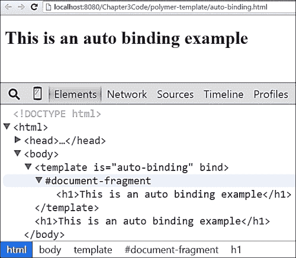

在前面的屏幕截图中，我们可以看到由模板生成的 HTML 实例标记被附加在其后。这是具有自动绑定的模板的独特功能。`<template>`元素具有绑定属性附加到自身，因为模板是自动绑定的。

### 注意

要了解更多关于 Polymer 模板自动绑定功能的信息，请参阅[`www.polymer-project.org/docs/polymer/databinding-advanced.html#autobinding`](https://www.polymer-project.org/docs/polymer/databinding-advanced.html#autobinding)。

### Polymer 模板属性

Polymer 为`<template>`元素提供了额外的功能，使其更有用。Polymer 从`TemplateBinding`库中获取其模板机制。您可以在[`github.com/polymer/TemplateBinding`](https://github.com/polymer/TemplateBinding)找到更多关于此库的详细信息。它提供了许多有用的属性来帮助数据绑定。这些属性如下：

+   `bind`: 此属性可以用于将模板绑定到 JavaScript 对象。

+   `repeat`: 此属性可以通过将模板绑定到列表来迭代模板。

+   `if`: 此属性可以通过比较绑定 JavaScript 对象的属性来检查逻辑条件。

+   `ref`: 此属性可以用于在当前模板中包含另一个模板。`ref`属性接受其他模板的 ID 以将其包含到当前模板中。

让我们通过一个示例来了解这些属性在模板元素中的使用。以下代码显示了这些属性的使用：

```js
<!DOCTYPE html>
<html>
<head>
    <script src="img/webcomponents.min.js"></s cript>
    <link rel="import" href="../bower_components/polymer/polymer.html">
    <title>Polymer template attributes example</title>
</head>
<body>

<template id="template1" is="auto-binding"
          if="{{myData.myFlag}}">
    <h1>The value of myFlag is {{myData.myFlag}}</h1>
</template>
<template id="template2" is="auto-binding"
          repeat="{{studentName in students}}">
    <h1>{{studentName}}</h1>
</template>
<template id="template3" is="auto-binding"
          repeat="{{sub in subjects}}">
    <template bind="{{sub}}">
        <h1>Subject name is {{name}} and country is {{country}}</h1>
    </template>
</template>
<template id="template4">
    <h1>Hello world !!!</h1>
</template>
<template id="template5" is="auto-binding"
          ref="template4">
</template>

<script>
 (function () {
 var template1 = document.querySelector("#template1"),
 template2 = document.querySelector("#template2"),
 template3 = document.querySelector("#template3");
 template1.myData = {
 "myFlag": true
 };
 template2.students = ["Sandeep", "Sangeeta", "Surabhi", "Sumanta"];
 template3.subjects = [{"name": "Computer", "country": "India"}]
 })();
</script>
</body>
</html>
```

前面代码的详细信息如下：

+   具有 ID 为`template1`的模板元素具有`myData`模型，该模型具有具有 true 布尔值的`myFlag`属性。模板具有`if`属性，该属性检查`myFlag`值并显示`template1`的 HTML 内容。

+   具有 ID 为`template2`的模板元素包含一个包含名称的数组。`template2`元素具有`repeat`属性，用于迭代在浏览器中渲染的名称数组。

+   具有 ID 为`template3`的模板元素与包含具有`name`和`country`属性的`subjects`模型绑定。`template3` ID 包含另一个嵌套模板，该模板绑定到主题的`sub`实例以显示其内部的`name`和`country`值。

+   具有 ID 为`template5`的模板元素具有指向`template4`的`ref`属性。`template4` ID 包含在`h1`元素内的文本消息。当激活`template5`元素时，`template4`的内容将被包含并渲染在浏览器中。

前面代码的输出列在以下截图，展示了所提及属性的用法：

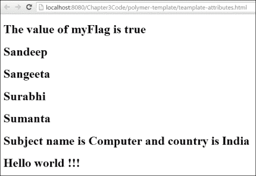

以下截图显示了 Chrome 开发者控制台，显示了模板属性的实际应用，生成的 HTML 实例被插入到模板之后：

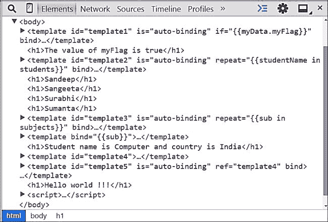

## 过滤表达式

Polymer 提供了过滤器支持以处理表达式。过滤器对于修改表达式输出非常有用。使用过滤器与表达式的语法如下：

```js
{{Expression | filterName}}

```

在前面的代码中，表达式和过滤器通过竖线（`|`）符号结合使用。过滤器函数接受给定表达式的值，并根据过滤器逻辑对其进行修改，然后在浏览器中渲染。

## 内置过滤表达式

Polymer 有两个内置过滤器用于处理表达式。这两个预定义过滤器是`tokenList`和`styleObject`。让我们更详细地探索这些内置过滤器。

### TokenList 过滤器

`tokenList`过滤器可用于根据提供的对象添加和删除字符串。它非常适合用于程序化修改类名。然而，为了演示，我们使用了字符串。以下代码展示了如何使用`tokenList`过滤器与表达式结合：

```js
<!DOCTYPE html>
<html>
<head>
    <script src="img/webcomponents.min.js"></s cript>
    <link rel="importhref="../bower_components/polymer/polymer.html">
    <title>PolymerJS tokenList Builtin Filter Expression</title>
</head>
<body>
    <template id="template1" is="auto-binding">
        <h1>Name : {{student.name}}</h1>
        <h1>Score : {{student.score}}</h1>
        <h1>Result : {{ {"Passed": student.score > 60} | tokenList}}</h1>
    </template>
    <script>
        (function(){
            var template1 = document.querySelector("#template1");
 template1.student= {
 "name":"Sandeep",
 "score":70
 }
        })();
    </script>
</body>
</html>
```

前面代码的详细情况如下：

+   在前面的代码中，`template1`被附加到具有两个属性`name`和`score`的学生对象上。

+   在`template1`内部，学生的分数通过与内置过滤器`tokenList`比较及格分数`60`来判定。如果分数超过`60`，则将`Passed`字符串渲染在表达式位置上。

以下截图显示了前面代码的输出，其中包含学生的姓名、分数和他们的结果。学生的分数是`70`，与及格分数`60`相比，返回值为真，并在浏览器中渲染`Passed`字符串。

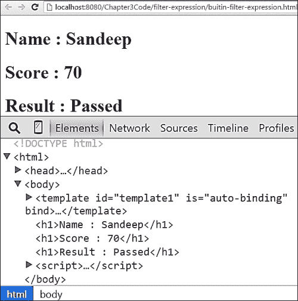

### `styleObject`过滤器

`styleObject`过滤器用于将 JSON 对象转换为键值对字符串。这个过滤器非常适合用于处理元素的`style`属性。以下代码展示了如何使用`styleObject`过滤器与表达式结合：

```js
<!DOCTYPE html>
<html>
<head>
    <script src="img/webcomponents.min.js"> </script>
    <link rel="import" href="../bower_components/polymer/polymer.html">
    <title>PolymerJS styleObject Builtin Filter Expression</title>
</head>
<body>
    <template id="template1" is="auto-binding">
 <div style="{{myStyle | styleObject}}">Name : {{student.name}}</div>
    </template>
    <script>
        (function(){
            var template1 = document.querySelector("#template1");
            template1.student= {
                "name":"Sandeep"
            };
 template1.myStyle= {
 "color": "tomato",
 "font-size":"30px",
 "height":"40px",
 "width":"200px",
 "border":"1px solid green",
 "padding":"20px"
 };
        })();
    </script>
</body>
</html>
```

前面代码的详细情况如下：

+   学生对象的`myStyle`属性包含一组键值对，包含 CSS 属性

+   模板表达式与`styleObject`过滤器结合使用，将键值对转换为完整的 CSS 字符串

前面代码的输出列在以下屏幕截图中，我们可以看到 `myStyle` 对象的键/值对被转换为 CSS 字符串并应用于 `div` 元素的 `style` 属性：

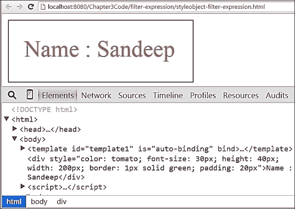

## 自定义过滤表达式

Polymer 支持开发我们自己的自定义过滤器，以便在表达式中使用。让我们看看创建自定义过滤器的示例。创建自定义过滤器及其使用的代码如下：

```js
<!DOCTYPE html>
<html>
<head>
    <script src="img/webcomponents.min.js"> </script>
    <link rel="import" href="../bower_components/polymer/polymer.html">
    <title>PolymerJS Custom Filter Expression</title>
</head>
<body>
    <template id="template1" is="auto-binding">
        <h1>{{student.name | sayHello}}</h1>
    </template>
    <script>
        (function(){
            var template1 = document.querySelector("#template1");
            template1.student= {
                "name":"Sandeep"
            };
            template1.sayHello= function(inputString){
 return "Hello " + inputString;
 };
        })();
    </script>
</body>
</html>
```

前面代码的详细信息如下：

+   `template1` 变量有一个表达式，用于显示带有自定义过滤器 `sayHello` 的学生名字

+   `sayHello` 过滤方法的定义作为 `sayHello` 属性的值

+   `sayHello` 过滤方法接收一个表达式值，并在学生的名字前添加 `Hello` 文本

以下屏幕截图显示了前面代码的输出，其中由于 `sayHello` 过滤器，**Hello** 字符串被添加到 **Sandeep** 的名字前：

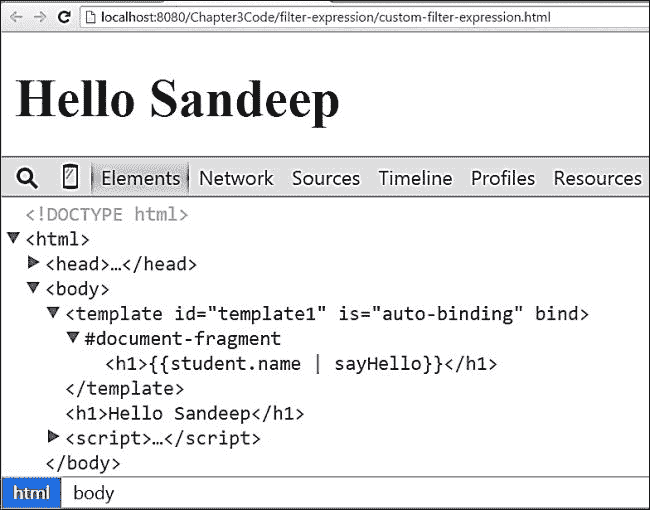

## 全局过滤表达式

Polymer 支持定义全局过滤器以增加其可重用性。全局过滤器作为 API 对应用程序开发者可用。全局过滤器可以通过使用 `PolymerExpression` 对象创建。可以通过使用 `prototype` 属性创建 `PolymerExpression` 对象的新属性来向 Polymer 添加新的过滤器。创建全局过滤器的代码如下：

```js
<!DOCTYPE html>
<html>
<head>
    <script src="img/webcomponents.min.js"> </script>
    <link rel="import" href="../bower_components/polymer/polymer.html">
    <title>PolymerJS Global Custom Filter Expression</title>
</head>
<body>
    <template id="template1" is="auto-binding">
        <h1>{{student.name | sayBye}}</h1>
    </template>
    <script>
        (function(){
            var template1 = document.querySelector("#template1");
            template1.student= {
                "name":"Sandeep"
            };
 PolymerExpressions.prototype.sayBye = function(inputString) {
 return "Bye " + inputString;
 };
        })();
    </script>
</body>
</html>
```

在前面的代码中，通过在 `PolymerExpression.prototype` 中定义新属性创建了一个名为 `sayBye` 的全局过滤器。前面代码的输出列在以下屏幕截图：

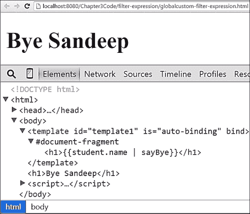

# 开发 Polymer 自定义元素

Polymer 有内置元素——core 和 paper。Polymer 还支持开发我们自己的自定义元素。开发自定义元素的一些好处如下：

+   它们是可重用的

+   它们减少了应用程序的代码大小

+   它们提高了开发者的生产力

+   它们通过隐藏元素的定义来帮助实现封装

    ### 注意

    在 Polymer 中，一切都是一个元素。

在以下部分，我们将学习如何开发自定义元素。开发自定义元素的步骤如下：

1.  定义自定义元素

1.  定义元素属性

1.  定义默认属性

1.  定义公共属性和方法

1.  发布属性

1.  定义生命周期方法

1.  注册自定义元素

## 定义自定义元素

自定义元素可以使用 `<polymer-element>` 标签定义。开发自定义元素的代码语法如下：

```js
<polymer-element name="tag-name" constructor="TagName">
  <template>
    <!-- shadow DOM here -->
  </template>
  <script>
    Polymer({
 // properties and methods here
 });
  </script>
</polymer-element>
```

前面语法的详细信息如下：

+   在前面的代码中，自定义元素定义被 `<polymer-element>` 标签包裹

+   定义包含自定义元素 HTML 标记的 `<template>` 元素

+   定义还包含包含自定义元素属性和方法的 `<script>` 元素。

+   在定义新自定义元素时，`<polymer-element>` 标签接受以下属性：

    +   `Name`：这是一个必填字段，表示自定义元素的名称。名称必须用连字符（`-`）分隔。

    +   `Attributes`：这是一个可选字段，可以用来定义自定义元素可以拥有的属性。

    +   `Extends`：这是一个可选字段，可以用来通过继承扩展另一个元素。

    +   `Noscript`：这是一个可选属性，可以在定义属性时由自定义元素使用，当它不需要任何属性和方法时。更简单地说，它创建了一个只有名称和构造函数的简单元素。

    +   `Constructor`：这是一个可选属性，表示可以由程序员使用 `new` 关键字创建自定义元素新实例的构造函数名称。

## 定义元素属性

可以使用 `<polymer-element>` 的属性属性来定义自定义属性。这可以接受多个由空格分隔的属性名称。在属性属性内部定义的属性默认是公开的。属性声明的语法如下：

```js
<polymer-element name="tag-name" 
                 attributes="property1 property2...">
</polymer-element>
```

## 定义默认属性

我们可以为自定义元素定义默认属性。默认属性在渲染时直接附加到自定义元素上。定义默认属性的语法如下：

```js
<polymer-element name="tag-name" myDefaultProperty1>
</polymer-element>
```

在前面的代码中定义了一个名为 `myDefaultProperty1` 的默认属性。要定义任何默认属性，只需将名称添加到 `<polymer-element>` 元素作为属性即可。

## 定义公共属性和方法

我们可以在定义自定义元素的同时定义其公共属性和方法。以下代码显示了声明公共属性和方法的语法：

```js
<polymer-element name="tag-name">
  <script>
    Polymer({
      message: "Hi!",
      get greeting() {
        return this.message + ' You are welcome.';
      },
      sayBye : function(){
        return ' Bye.';
      }
    });
  </script>
</polymer-element>
```

前面代码的详细信息如下：

+   在提到的定义中，`message` 是一个具有 `get` 方法 `greeting` 函数的属性。`get` 方法可以使用 `this` 关键字访问消息属性。`this` 关键字指的是自定义元素 `<tag-name>`。

+   在前面的定义中，`sayBye` 方法是一个公共函数，并返回一个 `Bye` 字符串。

## 公开属性

在属性内部定义的属性默认是公开的。还有另一种方法可以公开自定义元素的属性——使用 `publish` 属性。公开属性的语法如下：

```js
<polymer-element name="tag-name">
  <script>
    Polymer({
 publish: {
 property1: "value1",
 property2: "value2",
 }
    });
  </script>
</polymer-element>
```

在前面的代码中，`property1` 和 `property2` 使用 `publish` 关键字进行了公开。使用属性方法公开属性是首选方法，因为它遵循声明性方法。然而，如果以下陈述为真，可以选择使用 `publish` 关键字方法：

+   如果需要为自定义元素公开大量属性

+   如果我们需要为属性定义默认值

+   如果我们需要双向声明性绑定到一个公开属性

## 定义生命周期方法

Polymer 元素在其生命周期中会经历不同的状态。以下图表显示了自定义元素的可能状态：


自定义元素的不同状态如下：

+   **创建**：这是创建自定义元素实例的状态

+   **就绪**：这是当 shadow DOM 就绪、事件监听器附加和属性观察器设置好的状态

+   **附加**：这是自定义元素附加到 DOM 的状态

+   **DOM 就绪**：这是初始的自定义元素子元素集合存在于 DOM 中的状态

+   **属性已更改**：这是其中一个属性值发生更改的状态

+   **已从 DOM 中移除**：这是自定义元素从 DOM 中移除的状态

定义我们自己的自定义逻辑的生命周期状态的回调方法的语法如下：

```js
Polymer('tag-name', {
  created: function() {
    //Code for created state callback
  },
  ready: function() {
     //Code for ready state callback
  },
  attached: function () {
    //Code for attached state callback
  },
  domReady: function() {
    //Code for domReady state callback
  },
  detached: function() {
    //Code for detached state callback
  },
  attributeChanged: function(attrName, oldVal, newVal) {
    // code for attribute changed state callback
  }
});
```

在上述语法中，我们可以看到代表自定义元素每个生命周期状态的回调方法。

## 注册自定义元素

定义自定义元素的本地方式是使用 `<polymer-element>` 标签中的 `Polymer` 方法。注册元素的语法如下：

```js
Polymer([ tag-name, ] [prototype]);
```

# 开发一个示例自定义元素

现在，是时候开发一个简单的 `<say-hello>` 元素了，该元素具有 `mytext` 属性，默认文本为 `World!!!`，并在浏览器中渲染的模板。`<say-hello>` 元素的代码定义位于 `hello-component.html` 文件中，如下所示：

```js
<polymer-element name="say-hello" constructor="SayHello" attributes="mytext">
    <template>
       <h4>Hello {{mytext}} !!!</h4>
    </template>
    <script>
        Polymer({
 created: function() {
 this.mytext = "World"
 }
 });
    </script>
</polymer-element>
```

以下是对前述代码的详细说明：

+   使用 `<polymer-element>` 标签定义了一个新的自定义元素 `<say-hello>`。

+   自定义元素有一个 `mytext` 属性，它被公开发布，并使用 `created` 回调方法初始化为默认值 `world`。

+   自定义元素有一个名为 `SayHello` 的构造函数。通过使用此构造函数，我们可以使用 `new` 关键字程序化地创建 `SayHello` 元素的一个实例。使用 `new` 关键字的语法如下：

    ```js
    var sayHello1 = new SayHello();
    ```

以下代码显示了在 HTML 页面中使用 `<say-hello>` 元素的方法：

```js
<!DOCTYPE html>
<html>
<head>
    <script src="img/webcomponents.min.js"> </script>
    <link rel="import" href="../bower_components/polymer/polymer.html">
    <link rel="import" href="hello-component.html">
    <title>Polymer sayHello component demo</title>
</head>
<body>
    <say-hello>
 </say-hello>
 <say-hello mytext="John"></say-hello>
    <script>
        //Using SayHello Constructor
        window.addEventListener('polymer-ready', function(e) {
 var sayHello1 = new SayHello();
 sayHello1.mytext = "PolymerJS"";
 document.body.appendChild(sayHello1);
        });
    </script>
</body>
</html>
```

在前述代码中，我们以以下三种不同的方式调用了 `<say-hello>` 元素：

+   不使用 `mytext` 属性

+   当 `mytext` 属性值为 `John` 时

+   使用 JavaScript 构造函数 `new SayHello` 并将 `mytext` 属性赋值为 `Polymer` 字符串

以下截图显示了前述代码的输出，其中包含由 `<say-hello>` 元素生成的三个不同消息：

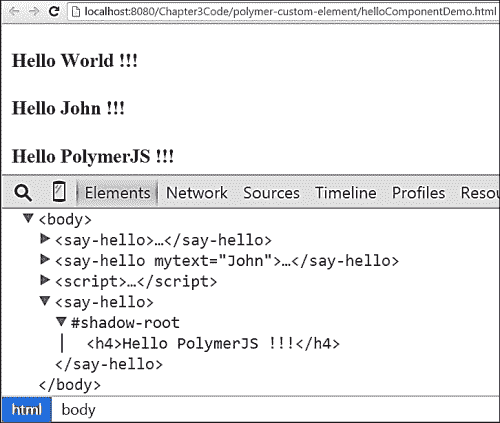

# 扩展自定义元素

可以使用 `extends` 属性从一个元素扩展自定义元素。我们一次只能从一个元素扩展。让我们开发一个名为 `<say-good>` 的元素，它从 `<say-hello>` 扩展而来。以下代码展示了 `good-component.html` 文件和 `<say-good>` 自定义元素的定义：

```js
<link rel="import" href="hello-component.html">
<polymer-element name="say-good" extends="say-hello"
                 constructor="SayGood" attributes="time">
    <template>
        <shadow></shadow>Good {{time}}
    </template>
    <script>
        Polymer({
 created:function(){
 this.time="Morning";
 }
        });
    </script>
</polymer-element>
```

前一段代码的详细信息如下：

+   通过扩展具有名为 `time` 的发布属性的自定义元素 `<say-hello>`，创建了一个名为 `<say-good>` 的新自定义元素。

+   使用 `created` 回调方法将 `time` 属性的默认值赋为 `Morning`。

+   `<say-good>` 元素的模板包含一个用于父元素标记的 **阴影插入点**，其中包含文本消息 `Good` 和表达式 `{{time}}`。

以下代码显示了 `<say-good>` 元素的用法：

```js
<!DOCTYPE html>
<html>
<head>
    <script src="img/webcomponents.min.js"> </script>
    <link rel="import" href="../bower_components/polymer/polymer.html">
    <link rel="import" href="good-component.html">
    <title>Polymer sayGood component demo</title>
</head>
<body>
 <say-good mytext="John" time="Night">
 </say-good>
    <script>
        //Using SayGood Constructor
        window.addEventListener('polymer-ready', function(e) {
 var sayGood1 = new SayGood();
 sayGood1.mytext = "Smith";
 sayGood1.time = "Afternoon";
 document.body.appendChild(sayGood1);
        });
    </script>
</body>
</html>
```

前一段代码的详细信息如下：

+   使用 `mytext` 和 `time` 属性分别带有值 `John` 和 `Night` 来调用 `<say-good>` 元素。

+   使用构造函数和 `new` 关键字初始化 `SayGood` 元素对象。然后，将 `mytext` 对象属性和时间分别赋值为 `Smith` 和 `Afternoon`。

前一段代码的输出显示在下面的屏幕截图中，其中显示了插入到阴影插入点中的父元素 `<say-hello>` 的消息：

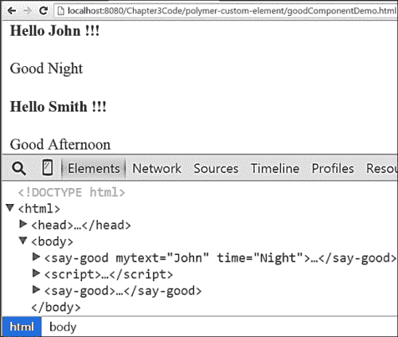

# Polymer 方法

PolymerJS 库有一些用于处理混合、导入和元素注册的实用方法。在下一节中，我们将学习如何使用这些方法。

## Polymer 混合方法

Polymer 提供了用于在自定义元素之间共享公共方法的混合。混合有助于减少重复代码。创建混合的语法如下：

```js
Polymer.mixin({ //Common methods });
```

让我们查看一个使用混合共享公共方法的示例。该示例的详细信息如下：

+   公共混合方法存在于 `common-mixin.html` 文件中。`window.commonMixins` 对象将包含共享的方法。`common-mixin.html` 文件的代码如下：

    ```js
    <script>
        window.commonMixins={
            //reusable method returning local name of element
            printMyName:function(){
                return this.localName;
            }
        };
    </script>
    ```

+   `commonMixins` 对象有一个 `printMyName` 方法，并将其共享给自定义组件，这些组件使用它。

+   在 `printHi-component.html` 文件中定义了一个新的自定义组件 `<print-hi>`。`<print-hi>` 元素使用了 `commonMixins` 对象。以下代码显示了 `<print-hi>` 组件的定义：

    ```js
    <polymer-element name="print-hi" constructor="PrintHi">
        <template>
            <h4>Hi!!!</h4>
        </template>
        <script>
            Polymer(Polymer.mixin({
                //local method
                printHi: function(){
                    return "Hi";
                }
            }, window.commonMixins));
        </script>
    </polymer-element>
    ```

+   另一个自定义元素 `<print-bye>` 已在 `printBye-component.html` 文件中定义。此组件也使用 `commonMixins` 对象来访问 `printMyName` 方法。`printMyName` 方法返回自定义元素的本地名称。《print-bye》元素的代码如下：

    ```js
    <polymer-element name="print-bye" constructor="PrintBye">
        <template>
            <h4>Bye!!!</h4>
        </template>
        <script>
            Polymer(Polymer.mixin({
                printBye:function(){
                    return "Bye";
                }
            }, window.commonMixins));
        </script>
    </polymer-element>
    ```

+   现在，是时候测试这些元素共享的混合方法了。测试代码位于 `mixin-demo.html` 文件中。在这段代码中，我们使用 `new` 关键字创建了两个对象——一个来自 `PrintHi` 构造函数，另一个来自 `PrintBye` 构造函数。然后，从每个对象中调用 `printMyName` 方法，并在控制台中记录。以下代码包含了检查混合方法的测试代码：

    ```js
    <!DOCTYPE html>
    <html>
    <head>
        <script src="img/webcomponents.m in.js"></script>
        <link rel="import" href="../../bower_components/polymer/polymer.html">
        <link rel="import" href="common-mixin.html">
     <link rel="import" href="printHi-component.html">
     <link rel="import" href="printBye-component.html">
        <title>Polymer Mixin Demo</title>
    </head>
    <body>
    <script>
        //Using SayGood Constructor
        window.addEventListener('polymer-ready', function(e) {
     var printBye1 = new PrintBye(),
     printHi1= new PrintHi(),
     myName1 = printBye1.printMyName(),
     myName2 = printHi1.printMyName();
     console.log(myName1);
     console.log(myName2);
        });
    </script>
    </body>
    </html>
    ```

+   完整的代码可以从 Packt 的网站上下载。以下截图显示了前面代码的输出：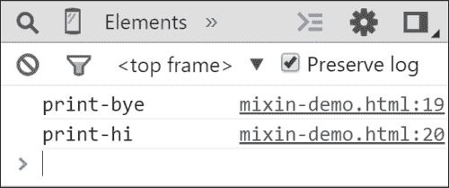

## 聚合体导入方法

聚合体提供了 `Polymer.import` 方法用于导入外部 HTML 文件。让我们看看使用 `import` 方法的示例。示例的详细信息如下：

+   `number-detail.html` 文件包含一个 JavaScript 文件，其中包含一个变量 `luckyNumber` 被赋予值 `7`。`number-detail.html` 文件中的代码如下：

    ```js
    <script>
     var luckyNumber = 7;
    </script>
    ```

+   `number-detail.html` 文件已被导入到 `import-method.html` 文件中。一旦导入 `number-detail.html` 文件，幸运数字就会在浏览器中显示，因为模板使用了自动绑定功能。以下代码显示了 `number-detail.html` 文件的导入：

    ```js
    <!DOCTYPE html>
    <html>
    <head>
        <script src="img/webcomponents.m in.js"></script>
        <link rel="import" href="../../bower_components/polymer/polymer.html">
        <title>Polymer Import Method Demo</title>
    </head>
    <body>
     <template is="auto-binding" id="myTemplate">
     <h1>Lucky number of the day is : {{myLuckyNumber}}</h1>
     </template>
    </body>
    <script>
        Polymer.import(['number-detail.html'], function () {
     var myTemplate = document.querySelector("#myTemplate");
     myTemplate.myLuckyNumber = luckyNumber;
        });
    </script>
    </html>
    ```

+   以下截图显示了前面代码的输出，其中在浏览器中渲染了幸运数字 7：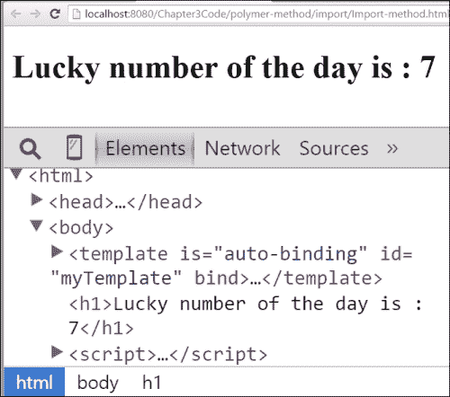

## 聚合体等待方法

聚合体提供了 `waitingFor` 方法来检测应用程序中的未注册元素。此方法返回一个尚未注册的元素列表。让我们看看一个演示 `waitingFor` 方法用法的示例。示例的详细信息如下：

+   创建了一个自定义组件 `<good-morning>`，并且故意使用 `setTimeout` 方法延迟了 3 秒的注册。`<good-morning>` 元素的代码位于 `morning-component.html` 文件中，如下所示：

    ```js
    <polymer-element name="good-morning">
        <template>
            <h4>Good Morning</h4>
        </template>
        <script>
     window.setTimeout(function(){
     Polymer("good-morning");
     },3000)
        </script>
    </polymer-element>
    ```

+   在另一个 HTML 文件中，我们使用了 `waitingFor` 方法来检查在最初的 3 秒内它是否包含数组中的 `<good-morning>` 元素。以下代码显示了 `waitingFor` 方法的使用：

    ```js
    <!DOCTYPE html>
    <html>
    <head>
        <script src="img/webcomponents.m in.js"></script>
        <link rel="import" href="../../bower_components/polymer/polymer.html">
        <link rel="import" href="morning-component.html">
        <title>Polymer waitFor Method Demo</title>
    </head>
    <body>
        <good-morning></good-morning>
    </body>
    </html>
    <script>
     var elementList= Polymer.waitingFor(),
            length = elementList.length;
        for(var i=0; i<length; i++){
            var aElement = elementList[0];
     console.log("Element names waiting registration  are: ",aElement.name);
        }
    </script>
    ```

+   以下截图显示了前面代码的输出，它将在控制台中记录未注册的元素：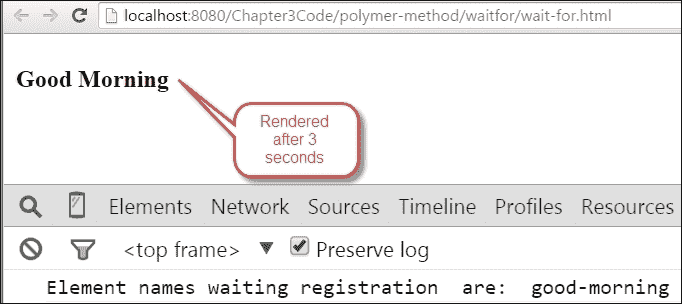

## 聚合体强制准备方法

聚合体提供了 `forceReady` 方法来通知聚合体将所有元素注册到 DOM 中。让我们看看一个演示 `forceReady` 方法用法的示例。示例的代码位于 `evening-component.html` 文件中，具体细节如下：

+   创建了一个新的自定义组件 `<good-evening>`，并且故意延迟了 3 秒的注册。以下代码包含了 `<good-evening>` 元素的定义：

    ```js
    <polymer-element name="good-evening">
        <template>
            <h4>Good Evening</h4>
        </template>
        <script>
     window.setTimeout(function(){
     Polymer("good-evening");
     },3000)
        </script>
    </polymer-element>
    ```

+   在另一个 HTML 文件中，我们使用了`forceReady`方法来注册所有自定义元素。然后调用回调方法`Polymer.whenReady`，尝试注册`<good-evening>`元素。以下代码包含了`forceReady`方法的使用：

    ```js
    <!DOCTYPE html>
    <html>
    <head>
        <script src="img/webcomponents.m in.js"></script>
        <link rel="import" href="../../bower_components/polymer/polymer.html">
        <link rel="import" href="evening-component.html">
        <title>Polymer forceReady Method Demo</title>
    </head>
    <body>
     <good-evening></good-evening>
    </body>
    </html>
    <script>
     Polymer.forceReady();
     Polymer.whenReady(function() {
     console.log("Polymer is ready now...");
     //Testing registration of good-evening element
     Polymer('good-evening');
     })
    </script>
    ```

+   由于使用了`forceReady`方法，`<good-evening>`元素方法已经注册，当我们再次使用`Polymer('good-evening')`调用注册过程时，它将抛出一个错误，表示它已经注册。以下屏幕截图显示了上述代码的输出，控制台记录了错误信息：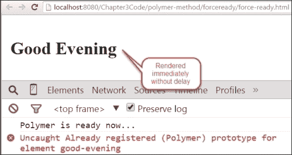

# 异步任务执行

Polymer 提供了一个名为`async`的方法，它有助于在一段时间后执行代码块。`async`方法的语法如下：

```js
async(method, arguments, timeout);
```

让我们看看一个演示`async`方法使用的例子。该例子的详细信息如下：

+   创建了一个新的自定义元素`<my-text>`，在`ready`块中将消息属性初始化为`Hello`。使用了一个`async`方法，该方法将在 2 秒后执行，并将另一个字符串附加到`message`属性。以下是这个例子的代码：

    ```js
    <!DOCTYPE html>
    <html>
    <head>
        <script src="img/webcomponents.min.js"></script>
        <link rel="import" href="../bower_components/polymer/polymer.html">
        <title>Polymer async method demo</title>
        <polymer-element name="my-text">
            <template>
                {{message}}
            </template>
            <script>
     Polymer({
     ready: function(){
     this.message= "Hello"
     this.async(function() {
     this.message += "--->(after 2 second)--->Bye";}, null, 2000);
     }
     });
            </script>
        </polymer-element>
    </head>
    <body>
    <my-text>
    </my-text>
    </body>
    </html>
    ```

+   上述代码的输出显示在以下屏幕截图，页面渲染 2 秒后附加了两个字符串：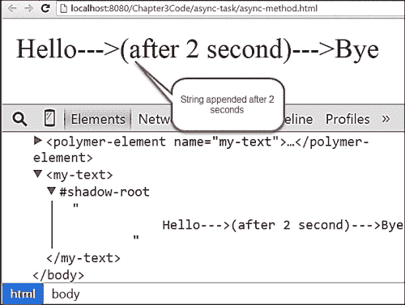

    ### 注意

    要了解更多关于`async`方法的信息，请参阅[`www.polymer-project.org/docs/polymer/polymer.html#asyncmethod`](https://www.polymer-project.org/docs/polymer/polymer.html#asyncmethod)。

# 开发数字时钟

在上一节中，我们学习了 Polymer 的许多概念。现在是时候开发一个自定义组件了。我们将开发一个在第一章，*介绍 Web 组件*中已经创建的数字时钟。在本节中，我们将使用 Polymer 开发相同的数字时钟。数字时钟的代码定义在`clock-component.html`文件中，如下所示：

```js
<polymer-element name="ts-clock">
    <template bind="{{clock}}">
        <style>
            :host .clock{
                display: inline-flex;
                justify-content: space-around;
                background: floralwhite;

                font-size: 2rem;
                font-family: serif;
            }
            :host .clock .hour,:host .clock .minute, :host .clock .second{
                color: tomato;
                padding: 1.5rem;
                text-shadow: 0px 1px grey;
            }
        </style>
 <div class="clock">
 <div class="hour">{{ clock.hour }}</div>
 <div class="minute">{{ clock.minute }}</div>
 <div class="second">{{ clock.second }}</div>
 </div>
    </template>
    <script>
        Polymer({
 ready:function(){
 this.updateClock()
 },
 updateClock: function(){
 var date = new Date();
 this.clock ={
 hour : date.getHours(),
 minute : date.getMinutes(),
 second : date.getSeconds()
 };
 this.async(this.updateClock, null, 1000);
 }
        });
    </script>
</polymer-element>
```

上述代码的详细信息如下：

+   数字时钟的名称是`<ts-clock>`。

+   HTML 标记与我们用于第一章，*介绍 Web 组件*中相同，其中包含三个`div`元素作为小时（HH）、分钟（MM）和秒（SS）的占位符。

+   模板使用`bind`属性绑定到`clock`对象。

+   数字时钟的定义包含一个`updateClock`方法，它创建一个包含三个属性——小时、分钟和秒的`clock`对象，这些属性从`new Date()`对象获取值。

+   使用`this.async`方法在 1 秒后递归和异步地调用`updateClock`方法。这意味着每秒，`clock`对象都会用新值更新，进而更新模板。

以下代码展示了在另一个 HTML 文件中使用`<ts-clock>`元素的方法：

```js
<!DOCTYPE html>
<html>
<head>
    <script src="img/webcomponents.min.js"> </script>
    <link rel="import" href="../bower_components/polymer/polymer.html">
 <link rel="import" href="clock-component.html">
    <title>Polymer clock component demo</title>
</head>
<body>
 <ts-clock>
 </ts-clock>
</body>
</html>
```

以下截图显示了带有当前时间（小时、分钟和秒格式）的上述代码输出：

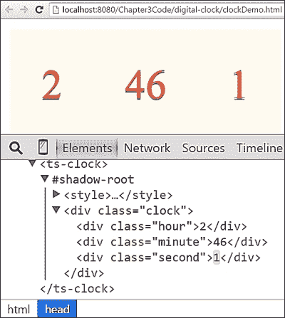

# 使用 Yeoman

在第二章中，我们安装了 Yeoman 并探索了 Polymer 的一些用法。在本节中，我们将进一步了解如何与 Polymer 一起工作。可以使用以下命令安装`generator-polymer`模块：

```js
npm install -g generator-polymer

```

考虑到我们已经安装了 Yeoman 和`generator-polymer`，让我们了解元素、种子和 GitHub 页面生成器。

## Yeoman 元素生成器

Yeoman 提供了一个元素生成器来创建自定义元素的骨架。生成自定义元素骨架的命令如下：

```js
yo polymer: element my-element

```

或者

```js
yo polymer: el my-element

```

上述命令的详细信息如下：

+   自定义元素的名称是`my-element`。我们可以提供自己的名称，该名称必须用连字符（`-`）分隔

+   此命令创建的目录结构是`app/elements/elements.html`

让我们使用 Yeoman 元素生成器创建一个自定义元素`<say-time>`。生成`<say-time>`元素骨架的命令如下：

```js
yo polymer:element say-time

```

以下截图显示了带有 Yeoman 元素生成器的终端：

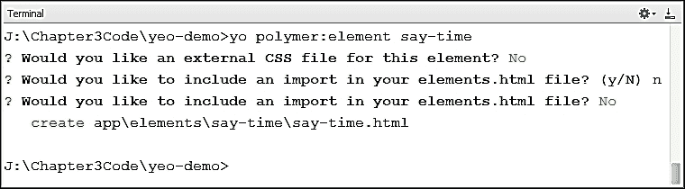

在成功执行上述命令后，它创建了一个目录结构`app/element/say-time.html`。为`<say-time>`元素生成的自定义元素骨架如下：

```js
<link rel="import" href="../../bower_components/polymer/polymer.html">
<polymer-element name="say-time" attributes="">
  <template>
    <style>
      :host {
        display: block;
      }
    </style>
  </template>
  <script>
    (function () {
      Polymer({
        // define element prototype here
      });
    })();
  </script>
</polymer-element>
```

我们需要做少量更改以调整库路径，以及一些用于我们章节演示所需的代码。我们通过将`currentTime`属性赋值为`new Date`对象来覆盖了创建的回调方法。修改后的`<say-time>`组件的代码如下：

```js
<link rel="import" href="/Chapter3Code/bower_components/polymer/polymer.html">
<polymer-element name="say-time">
  <template>
    <style>
      :host {
        display: block;
      }
    </style>
    {{currentTime}}
  </template>
  <script>
    (function () {
      Polymer({
 created: function(){
 this.currentTime = new Date();
        }
      });
    })();
  </script>
</polymer-element>
```

以下代码展示了在当前页面中使用`<say-time>`自定义元素的方法：

```js
<!DOCTYPE html>
<html>
<head>
    <script src="img/webcomponents.min.js">
    </script>
    <link rel="import" href="say-time.html">
    <title>Polymer sayTime component demo</title>
</head>
<body>
    <say-time>
 </say-time>
</body>
</html>
```

前述代码的输出结果如下所示，截图显示了当前时间，这是由于模板中的表达式`{{currentTime}}`：

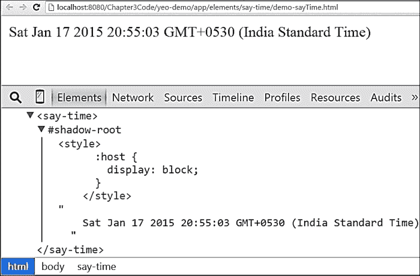

## Yeoman seed 生成器

Yeoman Seed 生成器用于开发可重用的元素。它创建了发布新自定义元素所需的所有必要的样板目录和文件。运行种子生成器的命令如下：

```js
yo polymer: seed tag-name

```

以下截图显示了带有种子生成器的终端：

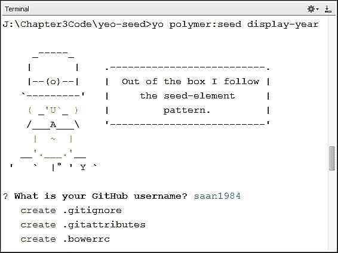

一旦执行上述命令成功，将创建一个用于开发可重用组件的目录结构，如下面的截图所示：

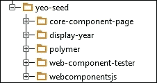

在目录结构生成后，我们可以在 `display-year.html` 文件中修改 `<display-year>` 自定义元素的定义。我们已用 `currentYear` 属性覆盖了 `created` 回调方法。修改后的代码如下：

```js
ready: function() {
   this.currentYear = new Date().getFullYear();
}
```

`<display-year>` 元素的修改模板如下，增加了表达式 `{{currentYear}}`：

```js
<template>
    <h1>{{currentYear}}</h1>
</template>
```

您可以在 Packt 的网站上找到包含所有目录结构和相关文件的完整源代码。

## Yeoman GitHub 页面生成器

此生成器用于为自定义元素创建 GitHub 页面。GitHub 页面生成器的命令语法如下：

```js
cd components/tag-name
yo polymer:gh

```

以下截图显示了执行 `<display-year>` 自定义元素的 GitHub 页面生成器的终端：

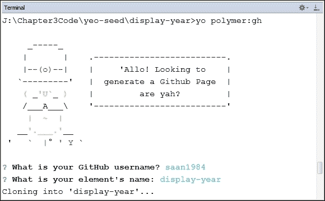

### 注意

要了解更多关于 GitHub 页面生成器的信息，请参阅 [`github.com/yeoman/generator-polymer#gh`](https://github.com/yeoman/generator-polymer#gh)。

# 使用 vulcanize 准备生产

在基于 Polymer 的 Web 应用程序开发中，我们可能会遇到需要为网页使用大量 HTML 导入的情况。每个 HTML 导入都是对服务器的 HTTP 调用。这可能会严重影响应用程序的性能，并且肯定不适合用于生产部署。这个问题可以通过 vulcanize 过程来解决，该过程使 Polymer 应用程序成为一个更耐用且适合生产部署的应用程序。

## vulcanize 安装

在安装 **vulcanize** 包之前需要 **Node 包管理器** (**npm**)。考虑到系统中已存在 npm，可以使用以下命令开始安装 vulcanize：

```js
npm install -g vulcanize

```

上述命令将全局安装 vulcanize。以下截图显示了 vulcanize 安装过程的终端：

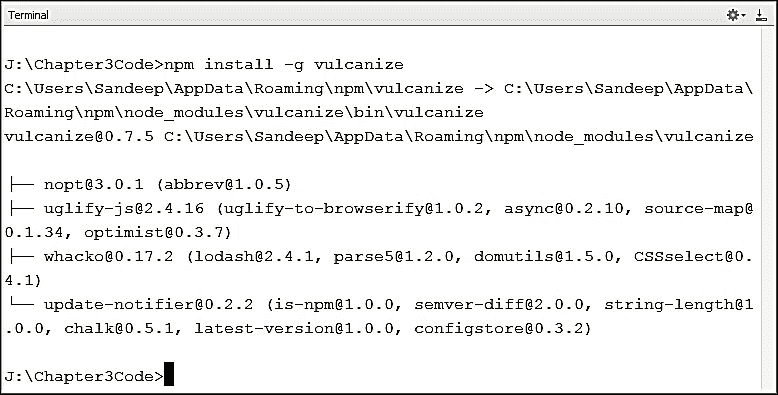

## 运行 vulcanize 过程

一旦在系统中安装了 vulcanize，我们可以运行该过程以优化文件，使它们适合生产。vulcanize 命令的语法如下：

```js
Vulcanize –o targetFile.html sourceFile.html

```

vulcanize 过程将文件连接成一个单一的文件以进行部署。以下截图显示了 `clockDemo.html` 文件的 vulcanize 过程：

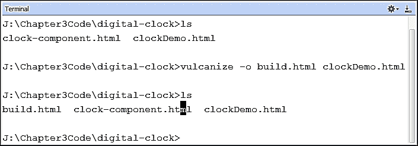

完成前面的命令后，将生成`build.html`文件，该文件将连接依赖文件。现在，`build.html`文件已优化，准备好投入生产。Vulcanize 也作为 Grunt 和 Gulp 任务可用。请查看[`www.npmjs.com/package/grunt-vulcanize`](https://www.npmjs.com/package/grunt-vulcanize)以获取`grunt-vulcanize`包的信息，以及[`www.npmjs.com/package/gulp-vulcanize`](https://www.npmjs.com/package/gulp-vulcanize)以获取`gulp-vulcanize`包的信息。

### 注意

要了解更多关于硫化过程的信息，请参考[`github.com/Polymer/vulcanize`](https://github.com/Polymer/vulcanize)。

# 摘要

在本章中，你学习了 Polymer 库的关键概念，如表达式、过滤器表达式和元素生命周期。你还探索了使用 Polymer 库进行自定义元素开发，并随后开发了一个示例数字时钟。在下一章中，你将学习 Bosonic 框架。
