# 第四章 探索 Bosonic 工具用于 Web 组件开发

Bosonic 提供了一套工具，帮助开发者构建 Web 组件开发。在本章中，我们将学习如何使用 Bosonic 工具进行配置、生命周期、内置元素和自定义元素开发。

# 什么是 Bosonic？

Bosonic 是基于 W3C 规范的 Web 组件开发库。Bosonic 库的诞生是为了支持不太现代的浏览器，例如 IE9。Bosonic 建立在 PolymerJS polyfill 及其自身 polyfill 之上。Bosonic 的作用类似于转换器。**转换器**是一个简单的编译器，它将源代码作为输入，并以另一种编程语言输出。以下图表显示了 Bosonic 作为转换器的行为：

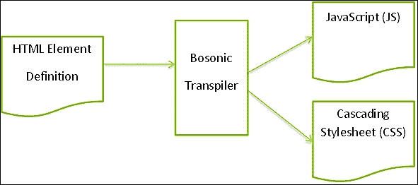

Bosonic 转换器将 HTML 格式的元素定义转换为相应的 JavaScript 和 CSS 文件。

# 浏览器支持

如第一章所述，Web 组件规范非常新，并非所有浏览器都实现了它。然而，Bosonic 通过使用 polyfill 来尝试支持更现代的浏览器。截至今天，Bosonic 支持以下列出的浏览器：

+   Mozilla Firefox 25+

+   Google Chrome 30+

+   Internet Explorer 9+

+   Safari 6+

+   Opera 12+

# 配置 Bosonic

Bosonic 库由 GitHub 托管。完整的库可以从以下链接下载：

[`github.com/bosonic/bosonic`](https://github.com/bosonic/bosonic)

# Bosonic 包

Bosonic 元素由四个包组成。我们可以将这些包视为支持 Bosonic 元素的技术堆栈的层。以下图表显示了 Bosonic 包：

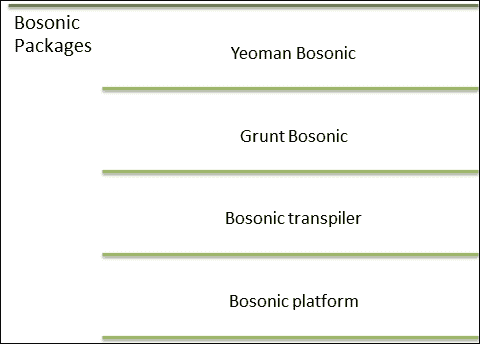

以下列出了提到的包的详细信息：

+   **Bosonic 平台**：此包包含所有 polyfill JavaScript 文件，以提供来自 Web 组件规范的缺失功能

+   **Grunt Bosonic**：这是一个使用转换器构建您元素的 Grunt 任务

+   **Bosonic 转换器**：这是一个将 Bosonic 元素定义转换为 CSS 和 JS 的**node 包管理器**（**npm**）模块

+   **Yeoman Bosonic**：这是一个创建新元素骨架的 Yeoman 生成器

# 内置元素

Bosonic 库附带了一套内置组件，开发者可以使用这些组件进行 Web 应用程序开发。完整的内置元素列表可以通过访问以下 URL 找到：

[`bosonic.github.io/elements.html`](http://bosonic.github.io/elements.html)

我们将在本章中探索其中的一些。

## `b-sortable`元素

可以使用`b-sortable`元素来分组和排序 DOM 元素。可以使用以下命令安装`<b-sortable>`元素：

```js
npm install --save b-sortable

```

使用`--save`开关将`b-sortable`元素代码包含在本地项目中。在成功执行前面的命令后，它将生成目录结构。

以下截图显示了前一个命令生成的目录和文件结构：

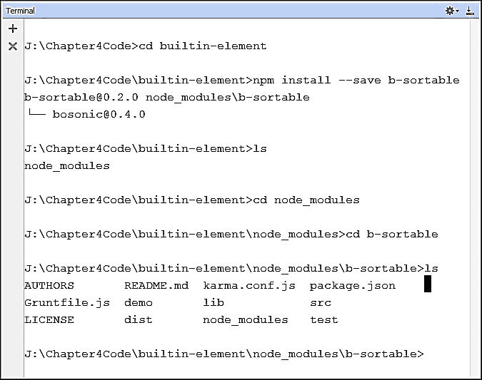

从前一个截图可以看出，创建了一个名为 `node_module` 的父目录，其中包含一个名为 `b-sortable` 的子目录，该子目录包含元素的真正 JavaScript 代码定义。

可以使用以下命令安装 `<b-sortable>` 元素的依赖文件：

```js
npm install

```

以下截图显示了使用前一个命令安装依赖文件时的终端，其中包含 `b-sortable` 元素：

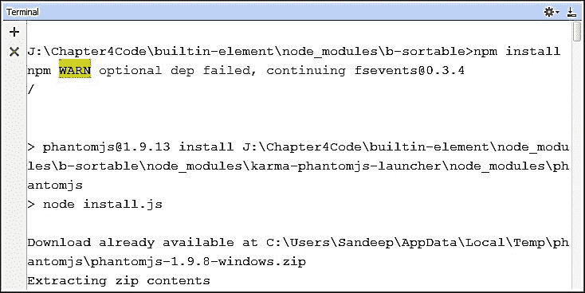

一旦使用 npm 生成所有依赖文件，我们就可以开始执行 Grunt 任务来转换 `b-sortable.html` 文件。要获取 `demo` 目录中的 `<b-sortable>` 元素副本，我们使用以下命令：

```js
grunt demo

```

以下截图显示了 Grunt 任务执行情况，它在 `demo` 目录中生成了相应的 CSS 和 JS 文件：

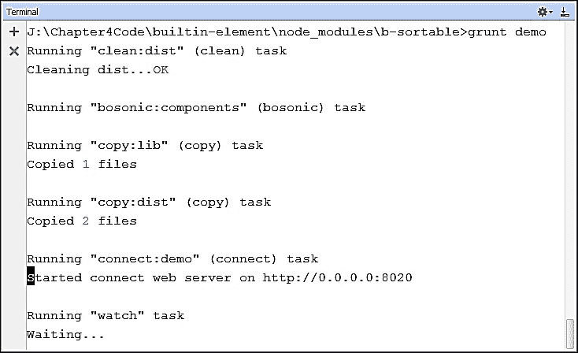

一旦 Grunt 任务成功执行，相应的 CSS 和 JS 文件将在 `demo` 目录中生成。以下截图显示了更新的目录结构：

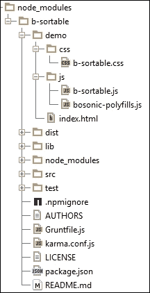

现在，我们可以通过运行 `demo` 子目录中的 `index.html` 文件来查看 `<b-sortable>` 元素的演示：


## b-toggle-button 元素

`b-toggle-button` 元素有两个不同的状态，*开启* 和 *关闭*，分别代表已选中和未选中的元素。可以使用以下命令安装 `<b-toggle-button>` 元素：

```js
npm install --save b-toggle-button

```

执行前一个命令后，它生成一个目录结构。以下截图显示了前一个命令生成的目录和文件结构：

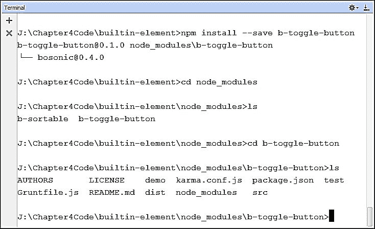

可以使用以下命令安装 `<b-toggle-button>` 元素的依赖文件：

```js
npm install

```

以下截图显示了使用前一个命令安装依赖文件时的终端，其中包含 `b-toggle-button` 元素：

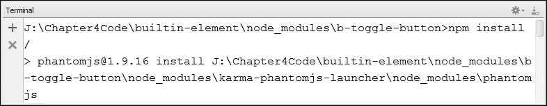

一旦使用 npm 生成所有依赖文件，我们就可以开始执行 Grunt 任务来转换 `b-toggle-button.html` 文件。要获取 `demo` 目录中的 `<b-toggle-button>` 元素副本，我们使用以下命令：

```js
grunt demo

```

以下截图显示了 Grunt 任务执行情况，它在 `demo` 目录中生成了相应的 CSS 和 JS 文件：

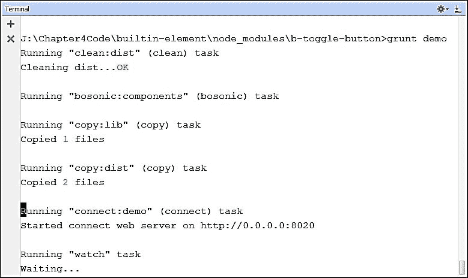

现在，我们可以通过运行 `demo` 子目录中的 `index.html` 文件来查看 `<b-toggle-button>` 元素的演示。以下是截图：

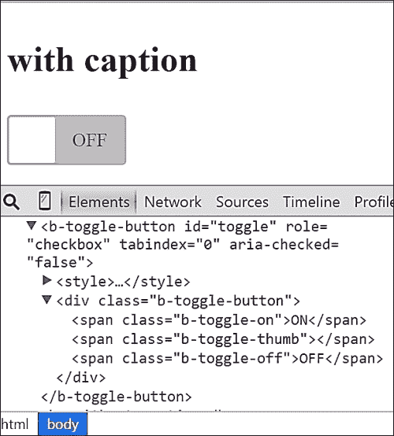

# 开发自定义组件

Bosonic 框架支持自定义元素的开发。在本节中，我们将逐步学习开发自定义元素的详细步骤。我们将构建一个名为 `<red-message>` 的自定义元素。详细步骤如下：

## 第 1 步 – 创建 red-message 元素目录

使用终端和 `mkdir` 命令创建一个名为 `red-message` 的目录。以下截图显示了创建名为 `red-message` 的目录的终端界面。我们可以使用终端中的 `dir` 或 `ls` 命令（根据开发者使用的操作系统而定）来验证目录的创建情况。

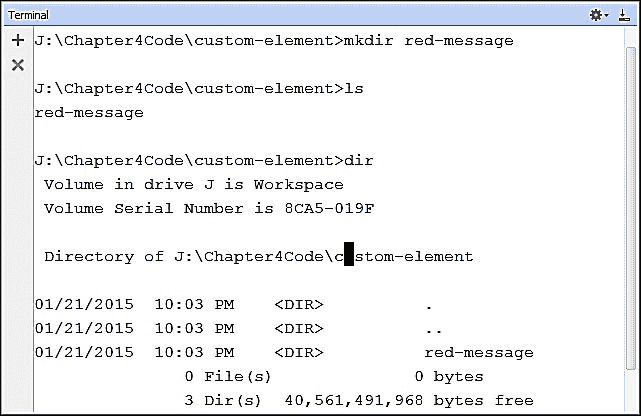

## 第 2 步 – 将当前目录更改为 red-message

使用终端中的 `cd` 命令将当前目录更改为 `red-message`。以下截图显示了执行 `cd` 命令的终端界面：

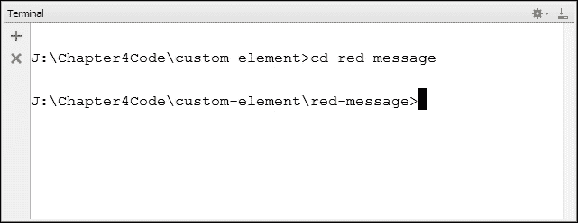

## 第 3 步 – 为 <red-message> 生成骨架

我们需要使用 Yeoman Bosonic 生成器生成玻色子自定义元素的骨架。Bosonic 生成器的包名为 `generator-bosonic`，可以使用 `npm install --save generator-bosonic` 命令进行安装。可以使用终端中的 `yo bosonic` 命令生成 `<red-message>` 元素的骨架。请参考以下截图：

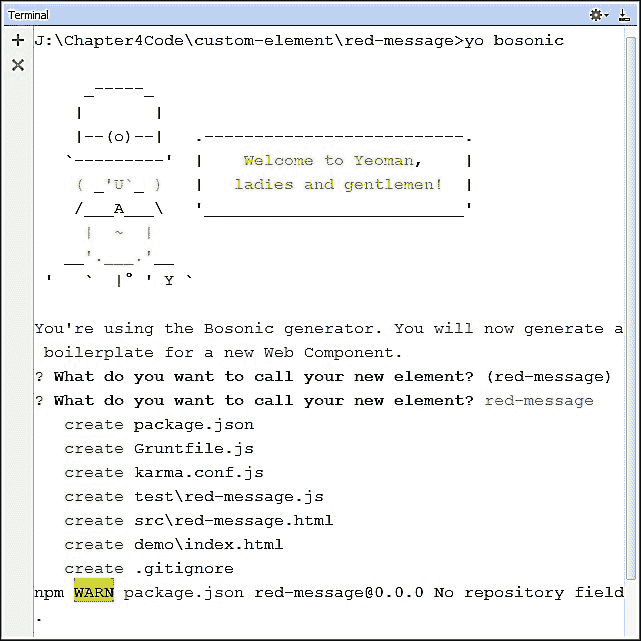

## 第 4 步 – 验证目录结构

使用 `ls` 命令验证由 Yeoman Bosonic 生成器生成的目录结构。以下截图显示了生成器生成的目录结构：

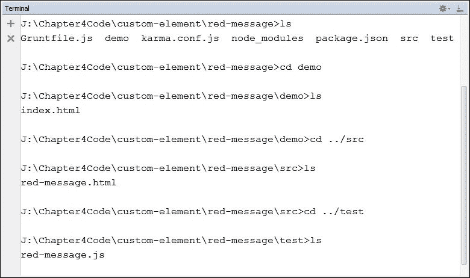

## 第 5 步 – 定义 <red-message> 元素的代码

现在，是时候在 `src` 目录中 `red-message.html` 文件中编写 `<red-message>` 元素的定义了。`red-message.html` 文件的修改内容如下：

```js
<element name="red-message">
    <style>
        h1{
            color: red;
        }
    </style>
 <template>
        <h1>Welcome to Bosonic framework.</h1>
 </template>
 <script>
        ({
            createdCallback: function() {
 this.appendChild(this.template.content.cloneNode(true));
 }
        });
    </script>
</element>
```

前述代码的详细信息如下：

+   `<template>` 元素包含一个将要渲染的消息的 `h1` 元素

+   `<style>` 元素包含了 `h1` 元素的 `color: red` 属性的样式

+   `<script>` 元素覆盖了 `createdCallback` 方法，该方法克隆模板内容并将其附加到 `<red-message>` 元素

## 第 6 步 – 修改 index.html 示例文件

要测试 `red-message` 元素，我们需要在 `index.html` 文件中包含 `red-message` 标签。以下代码显示了 `index.html` 文件的内容：

```js
<!DOCTYPE html>
<html>
<head>
    <title>Demo</title>
    <meta charset="utf-8">
    <script src="img/strong>"></script>
    <script src="img/strong>"></script>
    <link href="css/red-message.css" rel="stylesheet">
</head>
<body>
    <red-message> </red-message>
</body>
</html>
```

如前述代码所示，`red-message.js` 和 `red-message.css` 是由编译器生成的文件。这些文件将在下一步中使用。

## 第 7 步 – 使用 Grunt 生成分发文件

在这一步，我们需要调用转换器，它将从`red-message.html`文件生成 CSS 和 JS 文件。一个 Grunt 任务监视器可以监视`red-message.html`文件中的更改，并生成`red-message.css`和`red-message.js`文件。可以使用`grunt demo`命令执行 Grunt 任务监视器。以下截图显示了执行中的 Grunt 监视器终端：

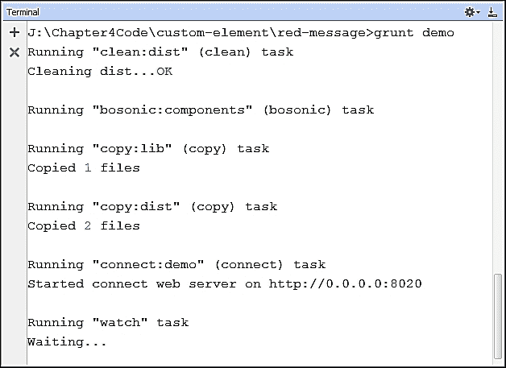

在 Grunt 编译器成功执行后，它将在`dist`目录中生成`red-message.js`和`red-message.css`文件，并将这些文件的一组复制到`demo`目录。以下截图显示了编译后生成的文件：

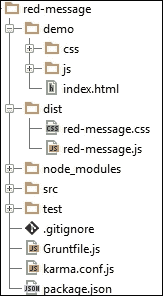

对`red-message.html`文件的任何更改都将被 Grunt 任务监视器捕获，并相应地更新 CSS 和 JS 文件。以下截图显示了终端中的 Grunt 任务监视器日志：

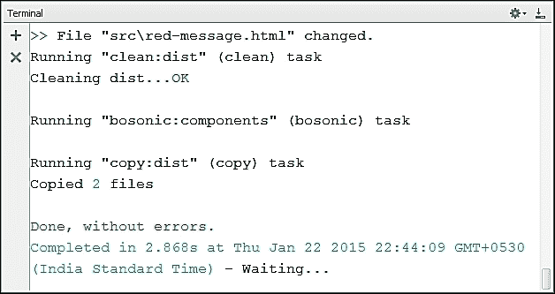

以下代码是 Grunt 转换器生成的`red-message.js`文件的内容：

```js
(function () {
    var RedMessagePrototype = Object.create(HTMLElement.prototype, {
            createdCallback: {
                enumerable: true,
                value: function () {
                    this.appendChild(this.template.content.cloneNode(true));
                }
            }
        });
    window.RedMessage = document.registerElement('red-message', { prototype: RedMessagePrototype });
    Object.defineProperty(RedMessagePrototype, 'template', {
        get: function () {
            var fragment = document.createDocumentFragment();
            var div = fragment.appendChild(document.createElement('div'));
            div.innerHTML = ' <h1>Welcome to Bosonic framework.</h1> ';
            while (child = div.firstChild) {
                fragment.insertBefore(child, div);
            }
            fragment.removeChild(div);
            return { content: fragment };
        }
    });
}());
```

上述代码的详细信息如下：

+   使用`Object.createElement`方法创建了一个新的对象原型`RedMessagePrototype`

+   它使用`Object.defineProperty`方法为`RedMessagePrototype`对象创建一个属性

+   它使用`document.registerElement`方法将元素注册为 DOM 中的`red-message`

## 步骤 8 – 运行 index.html 文件

通过运行`index.html`文件，我们可以看到`<red-message>`自定义元素的使用。以下截图显示了`index.html`的输出，其中文本信息以红色显示：

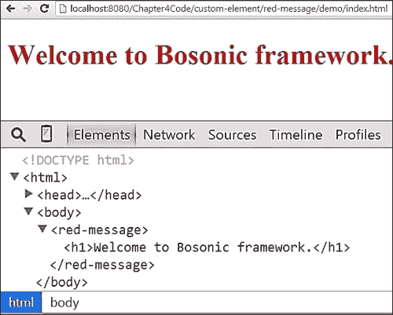

# 玻色子生命周期

一个玻色子元素在其生命周期中会经历不同的状态。玻色子为每个状态提供了回调方法，以便我们用自己的代码覆盖。生命周期回调方法如下所示：

+   `createdCallback`: 这个回调方法用于处理`created`状态。一个元素在首次实例化时处于`created`状态。

+   `attachedCallback`: 这个回调方法用于处理 DOM 的`attached`状态。`attached`状态表示元素被附加到 DOM 树时。

+   `detachedCallback`: 这个回调方法用于处理 DOM 的`detached`状态。`detached`状态表示元素从 DOM 中移除时。

+   `attributeChangedCallback`: 这个回调方法用于处理属性的变化。

## 生命周期示例

在本节中，我们将开发一个自定义元素`<say-hello>`，演示生命周期回调方法。可以使用之前解释的步骤生成创建自定义元素`<say-hello>`的骨架。以下截图显示了执行前步骤的终端：

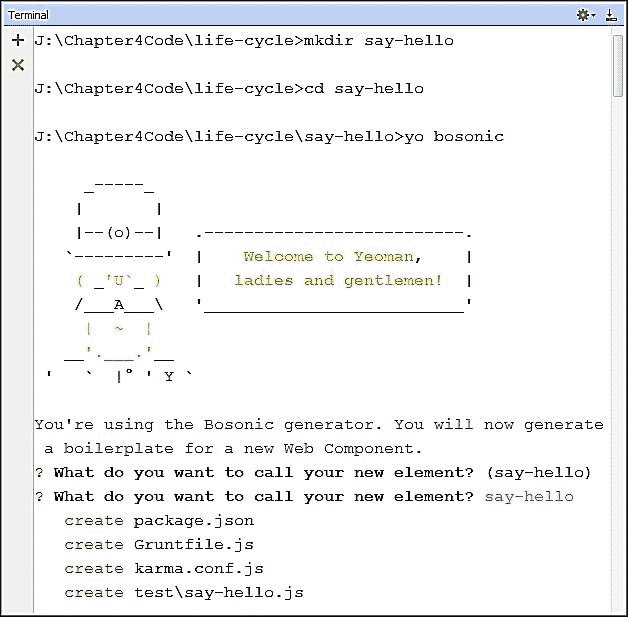

在生成目录和文件结构之后，我们可以开始执行 Grunt 任务，该任务将监视修改后的元素，并生成包含相应 CSS 和 JS 文件的 `dist` 目录。`src` 目录中存在的 `say-hello.html` 文件包含 `<say-hello>` 元素的代码定义。以下代码显示了 `<say-hello>` 元素的定义：

```js
<element name="say-hello" message="">
    <template>
        <h1>Hello <span></span></h1>
    </template>
    <script>
    ({
       createdCallback: function(){
         console.log(this.localName+" Element is created.");
         var shadowRootNode = this.createShadowRoot(),
 templateContent = this.template.content.cloneNode(true),
 spanPlaceHolder = templateContent.querySelector("span");
 spanPlaceHolder.innerText = this.getAttribute("message");
 shadowRootNode.appendChild(templateContent);
       },
attachedCallback: function(){
         console.log(this.localName+" is attached to DOM.");
       },
detachedCallback: function(){
        console.log(this.localName+" is removed from DOM.");
       },	
attributeChangedCallback: function(attributeName){
          var newMessageValue = this.getAttribute("message");
console.log(attributeName+" value is changed to "+ newMessageValue);  
         this.createdCallback();
       }
    });
    </script>
</element>
```

上述代码的详细信息如下：

+   自定义元素的名称是 `say-hello`，并且有一个无值的 `message` 属性。

+   `<template>` 元素包含包含标题 `<h1>` 和 `<span>` 标签的 HTML 标记。`<span>` 标签作为 `message` 属性值的占位符。

+   元素定义包含四个生命周期回调方法。这些回调方法的详细信息如下：

    +   `createdCallback` 方法克隆模板内容，读取 `message` 属性值，并将其作为文本节点插入到 `<span>` 元素中。它有一个控制台来记录创建事件。

    +   `attachedCallback` 方法仅在元素附加到 DOM 时打印消息的控制台日志。

    +   `detachedCallback` 方法在元素从 DOM 中移除时打印消息的控制台日志。

    +   `attributeChangesCallback` 方法在 `message` 属性值更改时调用 `createdCallback` 方法。它还包含控制台日志，在更改任何属性时打印消息。

`<say-hello>` 元素将在 `dist` 目录中生成 `say-hello.css` 和 `say-hello.js` 文件，并在 `demo` 目录中包含副本。`demo` 目录包含 `index.html` 文件，展示了 `<say-hello>` 元素的使用。以下列出了 `index.html` 文件的代码：

```js
<!DOCTYPE html>
<html>
<head>
    <title>Say-Hello Element Demo</title>
    <meta charset="utf-8">
    <script src="img/say-hello.js"></script>
</head>
<body>
    <div id="elementContainer">
 <say-hello message="Web Component">
 </say-hello>
    </div>

 <input type="text" id="messageElement" placeholder="Enter some message">
    <br><br>

 <button onclick="changeMessageHandler()">Change Message</button>
 <button onclick="deleteElementHandler()">Delete SayHello Element</button>
 <button onclick="createElementHandler()">Create SayHello Element</button>

    <script type="text/javascript">
        //changes the value of the message
       var changeMessageHandler = function(){
           var sayHelloElement = document.querySelector("say- hello"),messageText = document.getElementById("messageElement").value;
sayHelloElement.setAttribute("message",messageText);
       },
       //delete the say-hello element
       deleteElementHandler = function(){
           var sayHelloElement = document.querySelector("say- hello");
           sayHelloElement.remove();
       },
       //create new say-hello element
       createElementHandler = function(){
           var sayHelloElement = document.createElement("say- hello"),elementContainer = document.getElementById("elementContainer");
sayHelloElement.setAttribute("message","Developers");
elementContainer.appendChild(sayHelloElement);
       };
    </script>
</body>
</html>
```

在 `index.html` 文件中，代码包含一个具有 `messageElement` ID 值的 `<input>` 元素和三个按钮，用于修改 `<say-hello>` 元素。以下列出了这些元素的详细信息：

+   `<input>` 元素获取用户的值，这可以用作 `message` 属性的值。

+   第一个按钮 **更改消息** 值附带了一个 `onclick` 处理器，指向 `changeMessageHandler` 方法。此方法获取用户在 `<input>` 元素中输入的值，并更新 `message` 属性。`message` 属性的变化调用 `attributeChangedCallback` 方法，进而调用 `createdCallback` 方法，然后新的消息值在浏览器中渲染。

+   第二个按钮 **删除 SayHello 元素** 附带了一个 `onclick` 处理器，指向 `deleteElementHandler` 方法。此方法查找 `say-hello` 元素，并使用 `remove` 方法将其从 DOM 中删除。它触发 `detachedCallback` 生命周期方法。

+   第三个按钮 **创建 SayHello 元素** 连接到 `createElementHandler` 方法。此方法使用 `document.createElement` 方法创建一个新的 `say-hello` 元素，并将其附加到 `elementContainer`。此过程触发了 `createdCallback` 生命周期方法。

`index.html` 中演示代码的输出将渲染以下截图：

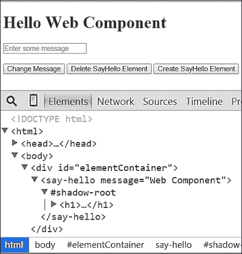

现在，在 `<input>` 元素中输入文本消息，例如 `Bosonic Framework`，然后点击 **更改消息** 按钮。以下截图显示了在 `<input>` 元素中输入文本后的输出：

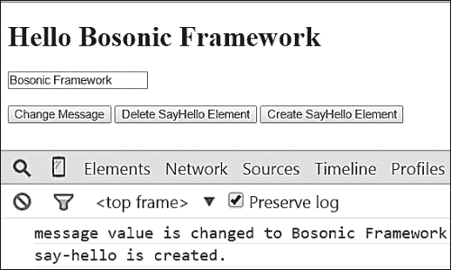

在前面的截图中，我们可以看到新的 **Hello Bosonic Framework** 消息在浏览器中渲染。在控制台中，我们可以找到由 `attributeChangedCallback` 和 `createdCallback` 方法生成的两个日志，因为 `message` 属性值随着用户输入的文本而更改，并且元素被重新初始化。

现在，按下 **删除 SayHello 元素** 按钮，这将从 DOM 树中删除该元素。以下截图显示了从 DOM 中删除 `<say-hello>` 元素后的输出：

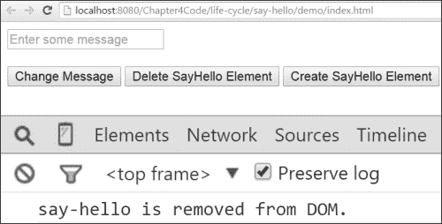

在前面的截图中，我们可以看到 `<say-hello>` 元素已被从 DOM 中移除。在控制台中，记录了一条由 `detachedCallback` 方法生成的消息。

现在，按下 **创建 SayHello 元素** 按钮，这将创建一个新的 `<say-hello>` 元素并将其附加到 `elementContainer`。以下截图显示了按下按钮后创建的新 `<say-hello>` 元素：

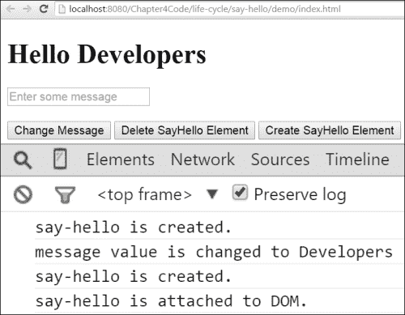

在前面的截图中，我们可以看到新的 `<say-hello>` 元素在浏览器中以 `message` 属性值设置为 `Developers` 的形式渲染。在控制台中，我们可以看到由 `createdCallback`、`attributeChangedCallback` 和 `attachedCallback` 方法生成的四个不同的日志消息。

# 数字时钟开发

在本节中，我们将使用 Bosonic 框架开发 `<ts-clock>` 自定义元素。以下截图显示了用于生成创建 `<ts-clock>` 元素默认目录和文件结构的命令的终端：


现在，我们可以运行 Grunt 任务运行器来监视 `ts-clock.html` 文件的更改。任务运行器将 `ts-clock.html` 文件转换为 `ts-clock.css` 和 `ts-clock.js` 文件，并生成 `dist` 目录中的副本以及 `demo` 目录中的副本。以下截图显示了正在执行 Grunt 任务运行器的终端：

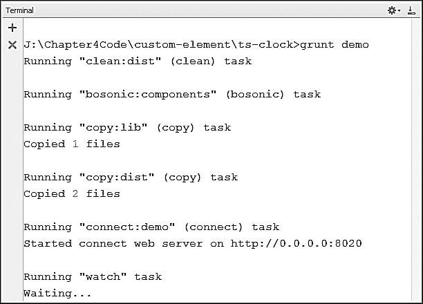

现在，平台已设置好用于编写 `<ts-clock>` 数字时钟元素的代码。`ts-clock.html` 文件包含数字时钟定义的代码。`ts-clock.html` 文件中代码的详细信息如下所示：

+   `<ts-clock>` 元素将具有三个属性 `hour`、`minute` 和 `second`。以下代码显示了 `<ts-clock>` 元素代码定义的语法：

    ```js
    <element name="ts-clock" hour="" minute="" second="">
        <template>
       	<!--HTML template content for ts-clock element -->
       <!--CSS style attributes for shadow DOM element-->
        </template>
        <script>
       // Lifecycle callback method for ts-clock element
        </script>
    </element>
    ```

+   `<template>` 元素包含 CSS 样式和 HTML 元素。我们用于模板的 CSS 样式和 HTML 元素是从上一章中使用的。HTML 元素有三个不同的 `div` 元素，它们分别具有 `hour`、`minute` 和 `second` 类，并被包裹在一个具有 `clock` 类的 `div` 元素中。以下代码显示了 `<template>` 元素中存在的 HTML 和 CSS 内容：

    ```js
    <template>
       <style>
         :host .clock{
            display: inline-flex;
            justify-content: space-around;
            background: floralwhite;
            font-size: 2rem;
            font-family: serif;
          }
         :host .clock .hour,
      :host .clock .minute, 
      :host .clock .second{
            color: tomato;
            padding: 1.5rem;
            text-shadow: 0px 1px grey;
          }
       </style>
     <div class="clock">
     <div class="hour"></div>
     <div class="minute"></div>
     <div class="second"></div>
     </div>
    </template>
    ```

+   `<script>` 元素包含 `<ts-clock>` 元素的实际代码定义。以下代码显示了 `<script>` 元素的内容：

    ```js
    <script>
        ({
            createdCallback: function() {
                var shadowRootNode = this.createShadowRoot(),
                    content = this.template.content.cloneNode(true);
                shadowRootNode.appendChild(content);
            },
            attachedCallback: function() {
                var clockElement = this;
                window.setInterval(function() {
     var date = new Date();
     clockElement.setAttribute("hour", date.getHours());
     clockElement.setAttribute("minute", date.getMinutes());
     clockElement.setAttribute("second", date.getSeconds());
     }, 1000);
     },
     attributeChangedCallback: function(attributeName) {
                var shadowRootNode = this.shadowRoot,
                    hourPlaceholder = shadowRootNode.querySelector('.hour'),
                    minutePlaceholder = shadowRootNode.querySelector('.minute'),
                    secondPlaceHolder = shadowRootNode.querySelector('.second');
                switch (attributeName) {
     case "hour":
     hourPlaceholder.innerText = this.getAttribute("hour");
     break;
     case "minute":
     minutePlaceholder.innerText = this.getAttribute("minute");
     break;
     case "second":
     secondPlaceHolder.innerText = this.getAttribute("second");
     break;
     }
            }
        });
    </script>
    ```

    前述代码的详细信息如下所示：

    +   `createdCallback` 方法为宿主元素创建 `shadowRoot`。它找到并克隆元素的内容以激活它。激活后，它将 HTML 内容追加到 `shadowRoot`。

    +   `attachedCallback` 方法包含一个 `setInterval` 方法，该方法使用 `date` 对象设置 `hour`、`minute` 和 `second` 属性的当前时间。代码块每秒执行一次，并更新 `hour`、`minute` 和 `second` 属性的值。

    +   当 `hour`、`minute` 和 `second` 属性的值发生变化时，`attributeChangedCallback` 方法会被调用。它包含 `hour`、`minute` 和 `second` 等情况的 `switch` 块。根据属性的变化，其中一个 `switch` 情况会被激活，从而更新 DOM 元素的文本内容。

`demo` 目录包含测试 `<ts-clock>` 元素的代码。`index.html` 文件包含具有默认值 `HH`、`MM` 和 `SS` 的 `hour`、`minute` 和 `second` 属性的 `<ts-clock>` 元素。`index.html` 文件的内容如下所示：

```js
<!DOCTYPE html>
<html>
<head>
    <title>Digital Clock Demo</title>
    <meta charset="utf-8">
    <script src="img/strong>"></script>
    <link href="css/ts-clock.css" rel="stylesheet">
</head>
<body>
   <ts-clock hour="HH" minute="MM" second="SS">
 </ts-clock>
</body>
</html>
```

前述代码的输出在以下屏幕截图中被渲染，显示了 24 小时格式的 `hour`（HH）、`minute`（MM）和 `second`（SS）：

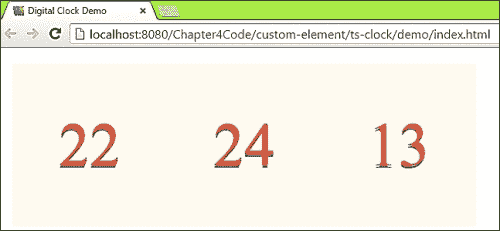

以下截图显示了 Chrome 开发者工具中前述代码的 HTML 检查结果。我们可以找到包含 CSS 样式和 HTML 元素的 `<ts-clock>` 元素的 Shadow DOM 子树。

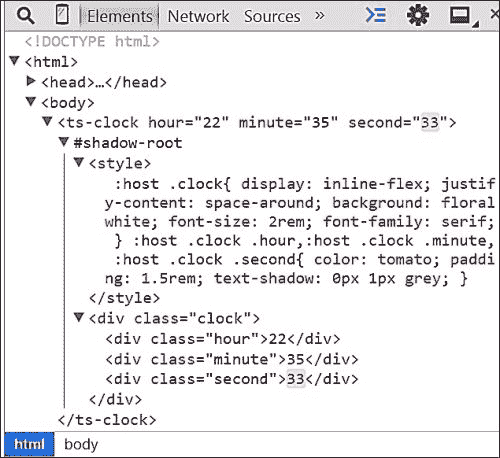

# 摘要

在本章中，我们学习了用于创建具有生命周期回调方法的自定义元素的 Bosonic 框架。在下一章中，我们将学习基于 X-Tag 的 Mozilla Brick 框架。
