# 第五章：使用 Mozilla Brick 开发 Web 组件

在本章中，我们将学习关于 Mozilla Brick UI 组件的内容。我们将介绍在应用程序中安装和配置 Brick 的方法。我们还将探讨 Mozilla Brick 2.0 即将推出什么新功能。

# Brick 库是什么？

Mozilla Brick 库提供了一组基于 Web 组件规范的元素。Brick 框架背后的座右铭是 *强烈的观点*，*紧密的范围*。这意味着 Brick 框架不专注于代码结构、数据绑定或任何其他问题。它提供了一个可以轻松与其他库集成的 Web 接口。Brick 元素是在自定义元素 API 之上开发的。这个自定义元素 API 包括阴影 DOM、HTML 导入、模板元素和自定义元素。Brick 提供了一个标准接口，可以轻松与其他应用程序框架进行交互。

Mozilla Brick 为 Web 开发者提供了一个 **UIKit**，可用于创建 Web 应用程序。Brick 组件是用纯 JavaScript 编写的，以便于开发。

### 注意

要了解更多关于 Mozilla Brick 框架的信息，请访问：

[`mozbrick.github.io/`](https://mozbrick.github.io/)

# Mozilla Brick 1.0

当前发布的 Mozilla Brick 版本是 1.0。以下图表显示了 Mozilla Brick 框架的构建块：

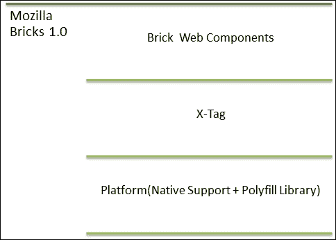

以下 Mozilla Brick 1.0 块图的详细信息在此列出：

+   **平台**：这代表了对 Web 组件规范的本地支持以及不支持功能的 polyfill 脚本文件。

+   **X-Tag**：这代表用于创建元素的 X-Tag 库。

+   **Brick Web 组件**：这代表开发人员在 Web 应用程序中使用的内置元素 UI 工具包。

# Mozilla Brick 2.0

Mozilla Brick 2.0 是 Brick 框架的新版本。这个库是为了应用开发而发布的。以下截图显示了 Mozilla Brick 2.0 的块图：

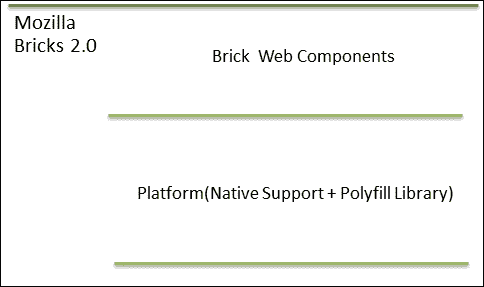

以下 Mozilla Brick 2.0 块图的详细信息在此列出：

+   **平台**：这代表了对 Web 组件规范的本地支持以及不支持功能的 polyfill 脚本文件。这个 polyfill 文件是 `platform.js`，它已被 PolymerJS 框架使用。在当前版本的 PolymerJS 中，`platform.js` 文件已被重命名为 `webcomponents.js`。

    ### 注意

    您可以通过以下链接找到有关 polyfill 的更多信息：

    [`webcomponents.org/polyfills`](http://webcomponents.org/polyfills)

+   **Brick Web 组件**：这代表了一组内置 UI 元素，开发人员可以在 Web 应用程序中使用。

# 安装 Mozilla Brick

Mozilla Brick 框架可以使用 Bower 软件包管理器进行安装。如果您的系统上没有安装 Bower，请使用以下链接进行安装：

[`bower.io/#install-bower`](http://bower.io/#install-bower)

假设 Bower 已安装在您的系统上，请使用以下命令安装 Mozilla Brick：

```js
bower install mozbrick/brick

```

以下截图显示了使用 Bower 软件包管理器安装 Mozilla Brick 的终端：

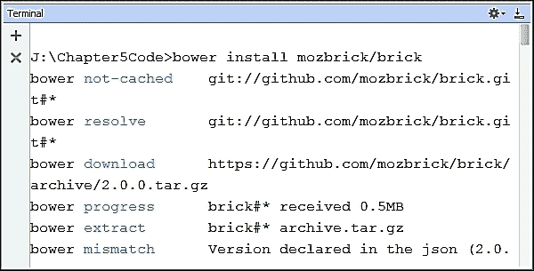

一旦 Mozilla Brick 安装成功，它会在 `bower_components` 目录下创建一个父目录，其他 Brick 组件会被复制到各自的子目录中。以下截图显示了创建的目录结构的终端：

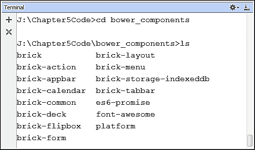

# 配置 Mozilla Brick

Mozilla Brick 库可以通过在 `<head>` 元素内包含两个文件来配置为 Web 应用程序。这两个文件如下所示：

+   `platform.js`：此文件包含所有支持 Web 组件规范的 polyfill 脚本。`platform.js` polyfill 库位于平台子目录中。以下截图显示了包含 `platform.js` 文件的终端：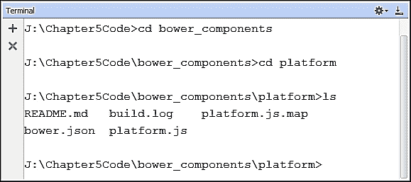

+   `Brick.html`：此文件将所有 Brick 元素合并到一个文件中，并将其放置在 `brick` 目录下的 `dist` 子目录中。以下截图显示了 `brick.html` 目录结构的终端：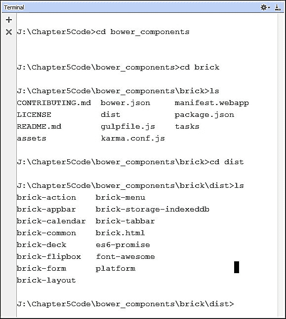

通过包含 `platform.js` polyfill 和 `brick.html` 文件，可以将 Brick 框架库添加到 Web 页面中。以下代码显示了将 Brick 框架包含在网页中的 HTML 代码：

```js
<script src="img/platform.js">
</script>
<link rel="import" href="bower_components/brick/dist/brick.html">

```

# 内置组件

Mozilla Brick 1.0 为 Web 应用程序开发提供了许多内置组件。在本节中，我们将探讨其中的一些。

## brick-calendar 元素

`brick-calendar` 元素代表一个日历组件，可以在 HTML 页面中通过调用以下自定义标签来使用：

```js
<brick-calendar></brick-calendar>

```

`brick-calendar` 元素可以通过在 Web 应用程序中包含 polyfill 和日历定义文件来使用。以下代码可以包含以使用 Brick 的日历组件：

```js
<script src="img/strong>"></script>
<link rel="import" href="bower_components/brick- calendar/dist/brick-calendar.html">
```

以下截图显示了在浏览器中渲染的 `brick-calendar` 组件，以及使用 Chrome 开发者控制台进行的 HTML 元素检查：

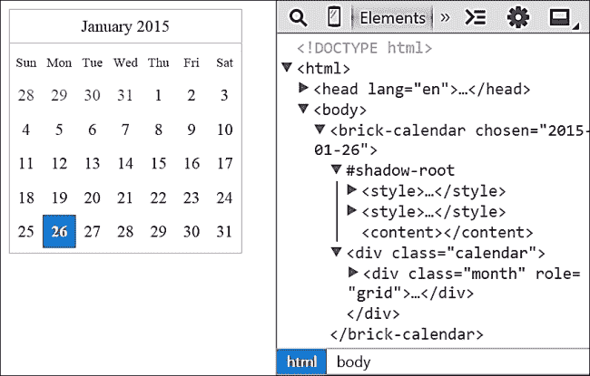

## brick-flipbox 元素

`brick-flipbox` 元素用于通过动画在内容之间切换，可以在 HTML 页面中通过调用以下自定义标签来使用：

```js
<brick-flipbox>
 <!--Content goes here -->
 </brick-flipbox>

```

`brick-flipbox` 元素可以通过在 Web 应用程序中包含 polyfill 和 flipbox 定义文件来使用。以下代码可以包含以使用 Brick 的 flipbox 组件：

```js
<script src="img/strong>"></script>
<link rel="import" href="bower_components/brick- flipbox/dist/brick-flipbox.html">
```

让我们看看在 Web 应用程序中使用 `brick-flipbox` 的一个示例。以下代码包含了 flipbox 的使用：

```js
<!doctype html>
<html>
<head>
    <meta charset="utf-8">
    <title>Brick FlipBox Element Demo</title>
    <script src="img/platform.js"></script>
    <link rel="import" href="../bower_components/brick- flipbox/dist/brick-flipbox.html">
    <style>
        .myBox {
            width: 100px;
            height: 80px;
            margin-bottom: 20px;
        }
        .myBox > div:first-child {
            background: red;
        }
        .myBox > div:last-child {
            background: blue;
        }
    </style>
</head>
<body>

<brick-flipbox class="myBox">
 <div>Front Side : 1</div>
 <div>Back Side : 2</div>
</brick-flipbox>
<button id="toggleButton">Flip</button>

<script>
 window.addEventListener('WebComponentsReady',function(){
 var flipbox = document.querySelector('brick-flipbox'),
 toggleButton = document.getElementById('toggleButton');
 flipbox.direction = 'left';
 toggleButton.addEventListener("click", function(){
 flipbox.toggle();
 console.log("flipped : "+flipbox.flipped);
 });
 });
</script>
</body>
</html>
```

上述代码的输出列在以下截图所示，显示了 flipbox 的内容和 **翻转** 按钮：

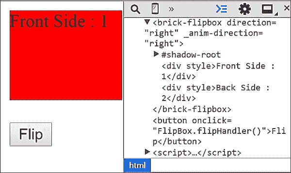

当按下**翻转**按钮时，回调方法被调用。回调方法获取翻转框实例并调用`toggle`方法。`toggle`方法根据`direction`属性翻转内容，该属性设置为`left`。此方法打印`flipped`属性的值，如果翻转框被翻转，则返回布尔值`true`。以下截图显示了按下**翻转**按钮时的控制台日志消息：

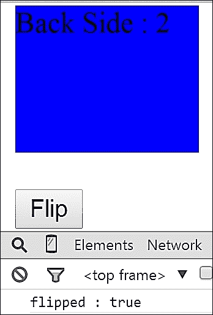

### 注意

您可以通过以下链接找到有关`brick-flipbox`元素的更多信息：

[`mozbrick.github.io/docs/brick-flipbox.html`](https://mozbrick.github.io/docs/brick-flipbox.html)

## 砖块式面板元素

`brick-deck`元素包含一组卡片。使用卡片元素，可以对卡片进行排序。面板内的卡片可以有自己的过渡效果。可以通过在页面中包含以下代码来使用`brick-deck`元素：

```js
<brick-deck>
 <brick-card></brick-card>
 <brick-card></brick-card>
 ...
</brick-deck>

```

上述代码片段的详细信息如下：

+   `<brick-deck>`元素是用于面板的父元素。

+   `<brick-card>`元素是面板的子元素。

`brick-deck`元素可以通过在 Web 应用程序中包含 polyfill 和面板定义文件来使用。以下代码可以包含以使用 Brick 的卡片组件：

```js
<script src="img/strong>"></script>
<link rel="import" href="bower_components/brick-deck/dist/brick- deck.html">
```

让我们检查一个使用`brick-deck`在 Web 应用程序中的示例。以下代码包含了一个包含不同水果名称的卡片组的用法：

```js
<!DOCTYPE html>
<html>
<head lang="en">
    <meta charset="UTF-8">
    <title>Brick Deck Element Demo</title>
    <script src="img/platform.js"></script>
    <link rel="import" href="../bower_components/brick- deck/dist/brick-deck.html">
    <style>
        brick-deck{
            width: 150px;
            height: 150px;
            margin-bottom: 20px;
        }
        brick-card:nth-child(even){
            background: darkgreen;
            color:#ffffff;
        }
        brick-card:nth-child(odd){
            background: blue;
            color:#ffffff;
        }
    </style>
</head>
<body>
 <brick-deck selected-index="0" transition-type="slide-up">
 <brick-card selected>Card 0 : Mango</brick-card>
 <brick-card>Card 1 : Apple</brick-card>
 <brick-card>Card 2 : Orange</brick-card>
 <brick-card>Card 3 : Grapes</brick-card>
 </brick-deck>
 <button id="prevButton">Previous Card</button>
 <button id="nextButton">Next Card</button>
    <script>
 window.addEventListener('WebComponentsReady',function(){
 var deck = document.querySelector('brick-deck'),
 nextButton = document.getElementById('nextButton'),
 prevButton = document.getElementById('prevButton');
 nextButton.addEventListener("click", function(){
 deck.nextCard();
 });
 prevButton.addEventListener("click", function(){
 deck.previousCard();
 });
 });
    </script>
</body>
</html>
```

上述代码的详细信息如下：

+   使用`<brick-deck>`元素创建了一个卡片组，以下属性被设置为一些预定义的值。这些属性的详细信息如下：

    +   `selected-index`：此属性表示面板内默认选中的卡片。在本例中，此属性设置为`0`。

    +   `transition-type`：此属性表示面板将对子卡片应用的动画方向。在本例中，此值设置为`slide-up`。

+   有两个按钮代表下一张和上一张卡片的导航。

+   具有 ID 为`nextCard`和`prevCard`的两个按钮与`click`事件相关联。此事件绑定是在`WebComponentsReady`事件回调中完成的。

+   当用户按下`nextCard`按钮时，面板移动到下一张卡片，当用户按下`prevCard`按钮时，面板移动到上一张卡片。

以下截图显示了上述代码的输出，其中默认选中的卡片索引为 0：

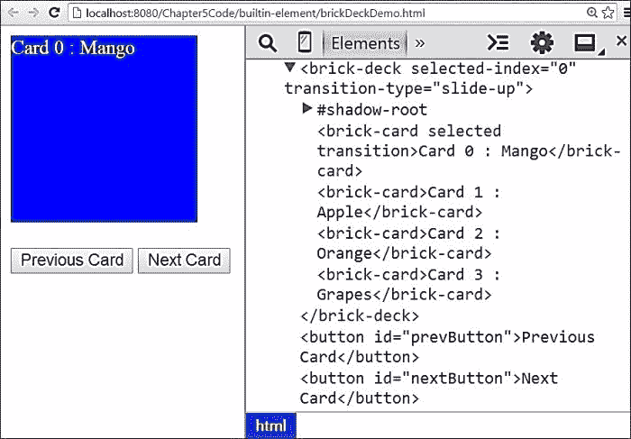

当用户按下`nextCard`按钮时，面板移动到索引为 1 的下一张卡片。`selected-index`属性的值现在是 1。以下截图显示了带有**苹果**水果的下一张卡片：

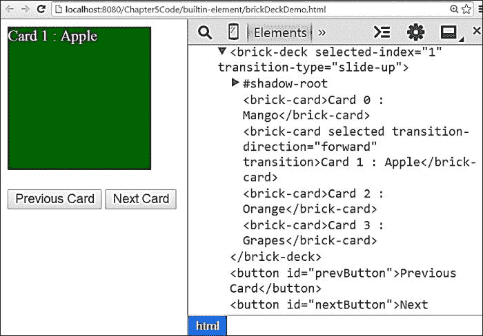

### 注意

您可以通过以下链接找到有关`brick-deck`卡片元素的更多信息：

[`mozbrick.github.io/docs/brick-deck.html`](http://mozbrick.github.io/docs/brick-deck.html)

## 砖形 tabbar 元素

`brick-tabbar` 元素代表一个标签。标签元素提供了一个包含多个面板的单个内容区域，每个面板都与列表中的一个标题相关联。可以通过在页面中包含以下代码来使用 `brick-tabbar` 元素：

```js
<brick-tabbar>
 <brick-tabbar-tab></brick-tabbar-tab>
 ...
</brick-tabbar>

```

上述代码的详细信息如下：

+   `<brick-tabbar>` 元素是用于一组标签的父元素。

+   `<brick-tabbar-tab>` 元素是子 tabbar，代表单个标签。

`brick-tabbar` 元素可以通过在 web 应用程序中包含 polyfill 和 tabbar 定义文件来使用。以下代码可以包含以使用 Brick 的 tabbar 组件：

```js
<script src="img/strong>"></script>
<link rel="import" href="bower_components/brick-tabbar/dist/brick- tabbar.html">
```

让我们通过一个使用 `brick-tabbar` 的网络应用示例来检查一下。以下代码包含了一个包含不同标签页的 tabbar 的用法：

```js
<!doctype html>
<html>
<head>
    <meta charset="utf-8">
    <title>Brick Tabbar Element Demo</title>
    <script src="img/platform.js"></script>
    <link rel="import" href="../bower_components/brick- tabbar/dist/brick-tabbar.html">
</head>
<body>
<brick-tabbar>
 <brick-tabbar-tab id="fruits" selected>
 Fruits
 </brick-tabbar-tab>
 <brick-tabbar-tab id="flowers">
 Flowers
 </brick-tabbar-tab>
 <brick-tabbar-tab id="vegetables">
 Vegetables
 </brick-tabbar-tab>
</brick-tabbar>

<button name="fruits">Select Fruits</button>
<button name="flowers">Select Flowers</button>
<button name="vegetables">Select Vegetables</button>

<script>
 window.addEventListener('WebComponentsReady',function(){
 var buttonList = document.querySelectorAll("button");
 for (var i = 0; i < buttonList.length; ++i) {
 var item = buttonList[i];
 item.addEventListener("click", function(e){
 var name = e.target.name,
 targetTabBar = document.getElementById(name);
 targetTabBar.select();
 });
 }
 });
</script>
</body>
</html>
```

上述代码的详细信息如下：

+   有三个不同的标签页：**水果**、**花卉**和**蔬菜**。它们是在 `<brick-tabbar>` 元素内部使用 `<brick-tabbar-tab>` 定义的。

+   定义了三个不同的按钮用于选择水果、花卉和蔬菜。附加到每个按钮的回调函数有一个 `select` 方法，用于动态选择标签元素。

以下截图显示了前面代码的输出，有三个不同的标签 **水果**、**花卉**和**蔬菜**。默认选择的是 **水果** 标签元素：

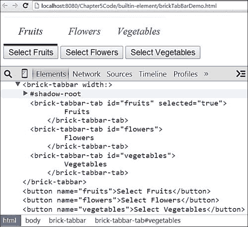

当用户按下 **选择蔬菜** 按钮时，标签选择会聚焦到 `select` 属性设置为 `true` 的 **蔬菜**。以下截图显示了程序化选择的 **蔬菜** 标签元素：

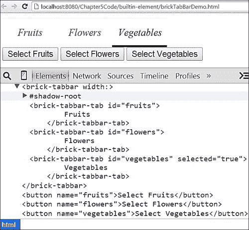

### 注意

您可以通过以下链接找到有关 `brick-tabbar` 元素的更多信息：

[`mozbrick.github.io/docs/brick-tabbar.html`](https://mozbrick.github.io/docs/brick-tabbar.html)

## 砖形 action 元素

`brick-action` 元素将一个事件与另一个元素的方法绑定。一个 `brick-action` 元素有一个监听器，它持续监听源元素以检测指定的事件，并调用目标元素的方法。可以通过在页面中包含以下代码来使用 `brick-action` 元素：

```js
<brick-action></brick-action>

```

`brick-action` 元素可以通过在 web 应用程序中包含 polyfill 和动作定义文件来使用。以下代码可以包含以使用 Brick 的动作组件：

```js
<script src="img/strong>"></script>
<link rel="import" href="bower_components/brick-action/dist/brick- action.html">
```

让我们通过一个使用 `brick-action` 的网络应用示例来检查一下。以下代码包含了一个带有 flipbox 的动作元素的用法：

```js
<!doctype html>
<html>
<head>
    <meta charset="utf-8">
    <title>Brick Action Element Demo</title>
    <script src="img/platform.js"></script>
    <link rel="import" href="../bower_components/brick-flipbox/dist/brick-flipbox.html">
    <link rel="import" href="../bower_components/brick-action/dist/brick-action.html">
    <style>
        brick-flipbox {
            width: 300px;
            height: 80px;
            margin-bottom: 20px;
            color: #fff;
        }
        brick-flipbox > div:first-child {
            background: red;
        }
        brick-flipbox > div:last-child {
            background: blue;
        }
    </style>
</head>
<body>
<brick-flipbox id="fruitFlowerbox">
 <div>
 Apple, Mango, Oranges
 </div>
 <div>
 Lotus, Rose, Lily
 </div>
</brick-flipbox>
<brick-action target="fruitFlowerbox" action="toggle">
 <button>Toggle Fruits & Flowers</button>
</brick-action>
</body>
</html>
```

上述代码的详细信息如下：

+   一个 `<brick-flipbox>` 元素有两个不同的水果和花卉列表，其 `id` 属性设置为 `fruitFlowerbox`。

+   一个`<brick-action>`元素通过`target`和`action`属性定义。`target`属性设置为`fruitFlowerbox`，而`action`属性设置为`toggle`方法。

+   当用户点击`<brick-action>`元素内的按钮时，它会找到`target`元素`fruitFlowerbox`并执行其`toggle`方法。

以下截图显示了上一段代码的输出，其中`brick-action`元素绑定到了一个 flipbox 上：

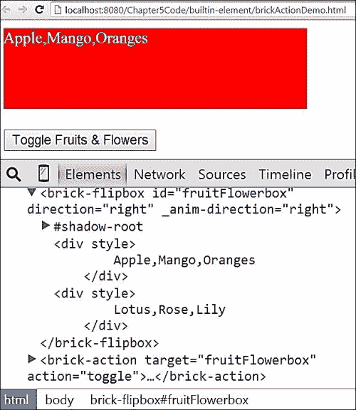

当用户按下**切换水果与花卉**按钮时，`toggle`方法在 flipbox 上被调用。以下截图显示了点击**切换水果与花卉**按钮后 flipbox 的输出：

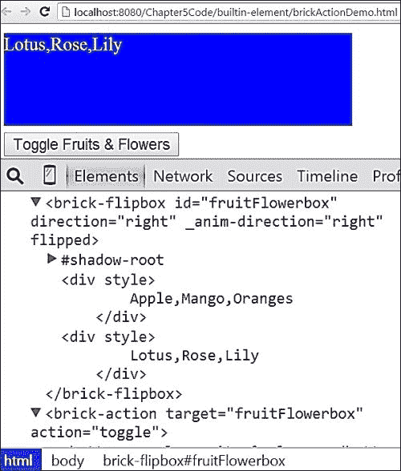

### 注意

您可以使用以下链接了解更多关于`brick-action`元素的信息：

[`mozbrick.github.io/docs/brick-action.html`](https://mozbrick.github.io/docs/brick-action.html)

## brick-menu 元素

`brick-menu`元素代表一个简单的菜单，其中包含用于选择的多个项。可以通过包含以下代码在页面中使用菜单元素：

```js
<brick-menu>
 <brick-item></brick-item>
...
</brick-menu>

```

可以通过在 Web 应用中包含 polyfill 和菜单定义文件来使用`brick-menu`元素。以下代码可以包含以使用 Brick 的菜单组件：

```js
<script src="img/strong>"></script>
<link rel="import" href="bower_components/brick-menu/dist/brick- menu.html">
```

让我们看看一个使用`brick-menu`的 Web 应用示例。以下代码包含了使用菜单元素和不同项的用法：

```js
<!doctype html>
<html>
<head>
    <meta charset="utf-8">
    <title>Brick Menu Element Demo</title>
    <script src="img/platform.js"></script>
    <link rel="import" href="../bower_components/brick- menu/dist/brick-menu.html">
</head>
<body>

<brick-menu>
 <brick-item selected>Fruits</brick-item>
 <brick-item>Flowers</brick-item>
 <brick-item>Vegetables</brick-item>
 <brick-item>Beverages</brick-item>
</brick-menu>

</body>
</html>
```

在前面的代码中，使用`<brick-menu>`元素定义了一个菜单。它包含`Fruits`、`Flowers`、`Vegetables`和`Beverages`作为`<brick-item>`元素。以下截图显示了前面代码渲染的菜单输出：

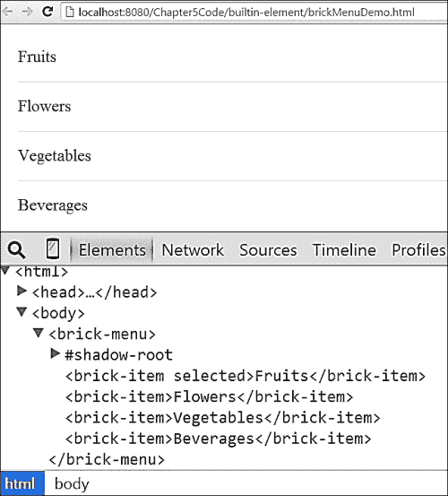

# X-Tag 库

Mozilla Brick 1.0 框架基于 X-Tag 库。您可以在第一章*介绍 Web 组件*中找到关于 X-Tag 的详细信息。以下章节将重点介绍使用 X-Tag 进行自定义 Web 组件开发。

您可以使用以下链接创建自己的包并下载 X-Tag 库：

[`www.x-tags.org/download`](http://www.x-tags.org/download)

以下截图显示了包含复选框的下载页面，以及可以选择的不同功能以创建自定义构建：

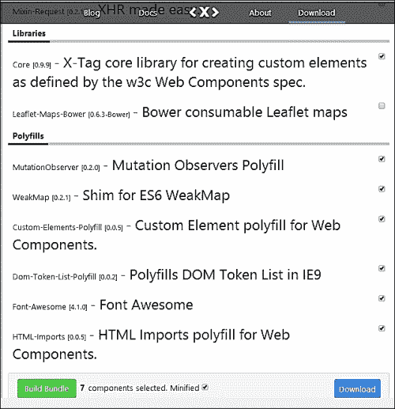

下载的构建目录包含两个文件。以下是这些文件的详细信息：

+   `x-tag-components.min.css`：这是一个包含下载内容样式属性的压缩 CSS 文件。

+   `x-tag-components.min.js`：这是一个包含核心 X-Tag 库和 polyfill 脚本文件的压缩 JS 文件。

    ### 注意

    如果你想了解更多关于 X-Tag 的信息，请使用以下链接：

    [`x-tag.readme.io/v1.0/docs/getting-started`](http://x-tag.readme.io/v1.0/docs/getting-started)

# 使用 X-Tag 开发数字时钟

在本节中，我们将使用 X-Tag 库和生命周期方法开发一个 `<ts-clock>` 元素。`<ts-clock>` 元素的定义代码分为以下三个不同的部分：

+   X-Tag 核心库和 polyfill 脚本捆绑为一个名为 `x-tag-components.min.js` 的单个压缩 JS 文件。此 JS 文件应包含在顶部 `ts-clock.html` 文件中，该文件定义了数字时钟并在 `<script>` 元素中。以下代码显示了 X-Tag 库的 `<script>` 元素：

    ```js
    <script src="img/x-tag-components.min.js"></script>

    ```

+   `<template>` 元素包含数字时钟的 HTML 标记和时钟模板元素的 CSS 样式属性。以下列出了数字时钟元素的模板代码：

    ```js
    <template id="clockTemplate">
     <style>
            :host .clock {
                display: inline-flex;
                justify-content: space-around;
                background: floralwhite;
                font-size: 2rem;
                font-family: serif;
            }
            :host .clock .hour,
            :host .clock .minute,
            :host .clock .second {
                color: tomato;
                padding: 1.5rem;
                text-shadow: 0px 1px grey;
            }
     </style>
     <div class="clock">
     <div class="hour"></div>
     <div class="minute"></div>
     <div class="second"></div>
     </div>
    </template>

    ```

+   `<script>` 元素包含使用 `xtag.register` 方法注册和定义 `<ts-clock>` 元素的代码。以下列出了 `<ts-clock>` 元素的注册脚本：

    ```js
    <script>
        (function() {
           var thisDoc = document._currentScript.ownerDocument;
     xtag.register('ts-clock', {
     lifecycle: {
     created: function() {
           var shadowRoot = this.createShadowRoot(),
              template=thisDoc.getElementById('clockTemplate'),
           templateContent = template.content,
           activeClockTemplate=templateContent.cloneNode(true);
                     shadowRoot.appendChild(activeClockTemplate);
       },
       accessors: {
          hour: {attribute: {}},
          minute: {attribute: {}},
          second: {attribute: {}}
        },
       inserted: function() {
          var clockElement = this;
          window.setInterval(function() {
            	var date = new Date();
            	clockElement.setAttribute("hour", date.getHours());
         clockElement.setAttribute("minute",date.getMinutes());
          clockElement.setAttribute("second",date.getSeconds());
                        }, 1000);
      },
       attributeChanged: function(attributeName, oldValue, newValue) {
         var shadowRootNode = this.shadowRoot,
             hourPlaceholder = shadowRootNode.querySelector('.hour'),
                            minutePlaceholder = shadowRootNode.querySelector('.minute'),
                            secondPlaceHolder = shadowRootNode.querySelector('.second');
                        switch (attributeName) {
                            case "hour":
                                hourPlaceholder.innerText = this.getAttribute("hour");
                                break;
                            case "minute":
                                minutePlaceholder.innerText = this.getAttribute("minute");
                                break;
                            case "second":
                                secondPlaceHolder.innerText = this.getAttribute("second");
                                break;
                        }
                    }
                }
            });
        })();
    </script>
    ```

以下列出了前面代码的详细信息：

+   `thisDoc` 变量包含在跳转到 `<ts-clock>` 元素注册之前 `_currentScript` 值的 `ownerDocument` 的引用。

+   `created` 回调方法使用 `createShadowRoot` 方法创建一个 `shadowRoot` 元素，并通过使用 `cloneNode` 方法克隆模板内容来附加模板内容。

+   `<ts-clock>` 元素在 `accessors` 块内部定义了三个属性 `hour`、`minute` 和 `second`。这些属性链接到 `{}`，将这些属性绑定为 `<ts-clock>` 元素的属性。

+   `inserted` 回调包含 `window.setTimeOut` 方法。它包含使用 `setAttribute` 方法设置 `hour`、`minute` 和 `second` 属性值的代码。此代码块每秒调用一次。

+   `attributeChanged` 回调包含基于更改的属性新值的 DOM 操作代码。

可以通过使用 `HTMLImport` 将定义导入到网页中来使用 `<ts-clock>` 元素。以下代码显示了通过将 `HTMLImport` 导入到页面中来使用 `<ts-clock>` 元素的示例：

```js
<!DOCTYPE html>
<html>
<head lang="en">
    <meta charset="UTF-8">
    <title>ts-clock element demo</title>
    <link rel="import" href="ts-clock.html">
</head>
<body>
    <ts-clock></ts-clock>
<script>
    window.addEventListener('WebComponentsReady',function(){
      var tsClock = document.querySelector("ts-clock");
      window.setTimeout(function(){
        console.log("Hour : ",tsClock.getAttribute('hour'));
        console.log("Minute : ",tsClock.getAttribute('minute'));
        console.log("Second : ",tsClock.getAttribute('second'));
      },1000)
    });
</script>
</body>
</html>
```

以下列出了前面代码的详细信息：

+   使用以下代码将 `<ts-clock>` 元素包含到页面中：

    ```js
    <link rel="import" href="ts-clock.html">
    ```

+   在 `<body>` 元素内部包含以下代码来调用 `<ts-clock>` 元素：

    ```js
    <ts-clock></ts-clock>
    ```

+   在 `WebComponentsReady` 事件回调函数内部，使用 `document.querySelector` 方法引用 `<ts-clock>` 元素

+   使用 `getAttribute` 方法访问 `hour`、`minute` 和 `second` 属性的值

以下截图显示了前面代码的输出，其中通过包含 `<ts-clock>` 自定义元素来渲染数字时钟：

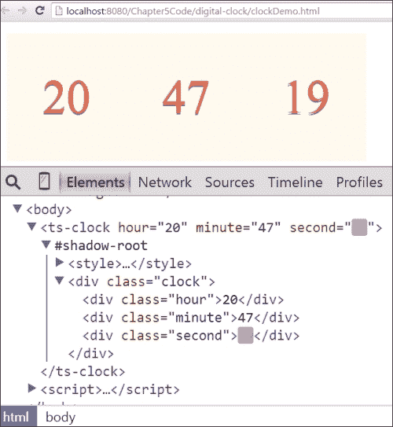

在前面的屏幕截图中，我们可以看到`hour`、`minute`和`second`属性被创建，因为`accessors`属性被设置为`{}`。下面的屏幕截图显示了包含由`getAttribute`方法打印的获取`hours`、`minutes`和`seconds`值的日志消息的 Chrome 开发者控制台：

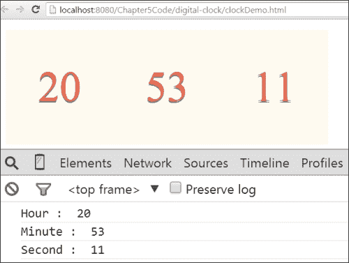

# 摘要

在本章中，我们学习了使用 Web 组件规范进行 Web 应用程序开发的 Mozilla Brick 库。在下一章中，我们将学习 ReactJS 框架。
