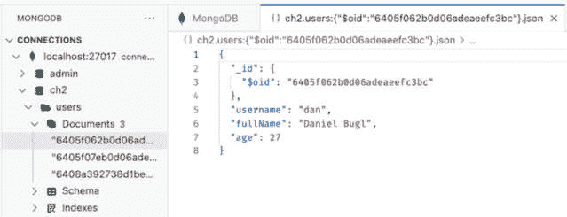

# 第二章：了解 Node.js 和 MongoDB

在上一章中，我们设置了我们的 IDE 和一个基本的前端开发项目。在本章中，我们将首先学习如何使用 Node.js 编写和运行脚本。然后，我们将介绍 Docker 作为设置数据库服务的一种方式。一旦我们设置了 Docker 和数据库的容器，我们将访问它以了解更多关于 MongoDB 的信息，这是我们接下来将要使用的文档数据库。最后，我们将通过通过 Node.js 脚本访问 MongoDB 来连接本章所学的一切。

到本章结束时，您将了解使用 JavaScript 进行后端开发中最重要工具和概念。本章为我们提供了一个良好的基础，以便在接下来的章节中为我们的第一个全栈应用创建后端服务。

在本章中，我们将涵盖以下主要主题：

+   使用 Node.js 编写和运行脚本

+   介绍 Docker，一个容器平台

+   介绍 MongoDB，一个文档数据库

+   通过 Node.js 访问 MongoDB 数据库

# 技术要求

在我们开始之前，请安装以下内容（除了来自 *第一章*，*为全栈开发做准备*）的所有技术要求，如果您还没有安装它们：

+   Docker v24.0.6

+   Docker Desktop v4.25.2

+   MongoDB Shell v2.1.0

列出的版本是本书中使用的版本。虽然安装较新版本不应有问题，但请注意，某些步骤在较新版本上可能有所不同。如果您在本书中提供的代码和步骤遇到问题，请尝试使用提到的版本。

您可以在 GitHub 上找到本章的代码：[`github.com/PacktPublishing/Modern-Full-Stack-React-Projects/tree/main/ch2`](https://github.com/PacktPublishing/Modern-Full-Stack-React-Projects/tree/main/ch2).

本章的 CiA 视频可以在：[`youtu.be/q_LHsdJEaPo`](https://youtu.be/q_LHsdJEaPo) 找到。

重要

如果您克隆了本书的完整仓库，当运行 **npm install** 时，Husky 可能找不到 **.git** 目录。在这种情况下，只需在相应章节文件夹的根目录下运行 **git init**。

# 使用 Node.js 编写和运行脚本

为了成为全栈开发者，熟悉后端技术非常重要。因为我们已经熟悉了从编写前端应用中使用的 JavaScript，我们可以使用 Node.js 来用 JavaScript 开发后端服务。在本节中，我们将创建第一个简单的 Node.js 脚本，以便熟悉后端脚本和前端代码之间的区别。

## 浏览器中的 JavaScript 和 Node.js 之间的相似之处和不同之处

Node.js 是基于 V8 构建的，这是基于 Chromium 的浏览器（Google Chrome、Brave、Opera、Vivaldi 和 Microsoft Edge）使用的 JavaScript 引擎。因此，JavaScript 代码在浏览器和 Node.js 中将以相同的方式运行。然而，有一些差异，特别是在环境方面。环境建立在引擎之上，并允许我们在浏览器中渲染某些内容（使用 `document` 和 `window` 对象）。在 Node.js 中，有一些模块提供与操作系统接口，用于创建文件和处理网络请求等任务。这些模块允许我们使用 Node.js 创建后端服务。

让我们来看看 Node.js 架构与浏览器中 JavaScript 的对比：


图 2.1 – Node.js 架构与浏览器中 JavaScript 的对比

从可视化中我们可以看出，Node.js 和浏览器 JavaScript 都运行在 JavaScript 引擎上，在 Node.js 中总是 V8，对于基于 Chromium 的浏览器可以是 V8，Firefox 中的 SpiderMonkey，或 Safari 中的 JavaScriptCore。 

现在我们知道我们可以在 Node.js 中运行 JavaScript 代码，让我们试试看！

## 创建我们的第一个 Node.js 脚本

在我们开始编写后端服务之前，我们需要熟悉 Node.js 环境。因此，让我们先写一个简单的“hello world”示例：

1.  将上一章的 **ch1** 文件夹复制到新的 **ch2** 文件夹中，如下所示：

    ```js
    $ cp -R ch1 ch2
    ```

注意

在 macOS 上，运行命令时需要使用大写的 **-R** 标志，而不是 **-r**。**-r** 标志对符号链接的处理方式不同，会导致 **node_modules/** 文件夹损坏。**-r** 标志仅出于历史原因存在，不应在 macOS 上使用。始终优先使用 **-R** 标志。

1.  在 VS Code 中打开新的 **ch2** 文件夹。

1.  在 **ch2** 文件夹中创建一个新的 **backend** 文件夹。这将包含我们的后端代码。

1.  在 **backend** 文件夹中创建一个 **helloworld.js** 文件，并输入以下代码：

    ```js
    console.log('hello node.js world!')
    ```

1.  在 **ch2** 文件夹中打开一个终端，并运行以下命令来执行 Node.js 脚本：

    ```js
    $ node backend/helloworld.js
    ```

你会看到控制台输出显示 `hello node.js world!`。在编写 Node.js 代码时，我们可以利用前端 JavaScript 世界中熟悉的函数，并在后端运行相同的 JavaScript 代码！

注意

虽然大多数前端 JavaScript 代码在 Node.js 中运行良好，但并非所有前端代码都能在 Node.js 环境中自动运行。有一些对象，如 **document** 和 **window**，是特定于浏览器环境的。这一点需要记住，尤其是在我们后面介绍服务器端渲染时。

现在我们已经对 Node.js 的工作原理有了基本的了解，让我们开始用 Node.js 处理文件。

## 在 Node.js 中处理文件

与浏览器环境不同，Node.js 通过 `node:fs`（文件系统）模块提供了处理我们计算机上文件的功能。例如，我们可以利用这个功能来读取和写入各种文件，甚至可以将文件用作简单的数据库。

按照以下步骤创建你的第一个处理文件的 Node.js 脚本：

1.  创建一个新的 **backend/files.js** 文件。

1.  从 **node:fs** 内部 Node.js 模块导入 **writeFileSync** 和 **readFileSync** 函数。这个模块不需要通过 npm 安装，因为它是由 Node.js 运行时提供的。

    ```js
    import { writeFileSync, readFileSync } from 'node:fs'
    ```

1.  创建一个包含用户信息的简单数组，包括姓名和电子邮件地址：

    ```js
    const users = [{ name: 'Adam Ondra', email: 'adam.ondra@climb.ing' }]
    ```

1.  在我们能够将这个数组保存到文件之前，我们首先需要使用 **JSON.stringify** 将它转换成一个字符串：

    ```js
    const usersJson = JSON.stringify(users)
    ```

1.  现在我们可以通过使用 **writeFileSync** 函数将我们的 JSON 字符串保存到文件中。这个函数接受两个参数——首先是要写入的文件名，然后是要写入文件中的字符串：

    ```js
    writeFileSync('backend/users.json', usersJson)
    ```

1.  在写入文件后，我们可以尝试再次使用 **readFileSync** 读取它，并使用 **JSON.parse** 解析 JSON 字符串：

    ```js
    const readUsersJson = readFileSync('backend/users.json')
    const readUsers = JSON.parse(readUsersJson)
    ```

1.  最后，我们打印出解析后的数组：

    ```js
    console.log(readUsers)
    ```

1.  现在我们可以运行我们的脚本了。你会看到数组被打印出来，并且在我们的 **backend/** 文件夹中创建了一个 **users.json** 文件：

    ```js
    $ node backend/files.js
    ```

你可能已经注意到，我们一直在使用 `writeFileSync`，而不是 `writeFile`。在 Node.js 中，默认的行为是异步运行所有操作，这意味着如果我们使用 `writeFile`，在调用 `readFile` 时文件可能还没有被创建，因为异步代码不是按顺序执行的。

当编写像我们这样的简单脚本时，这种行为可能会让人烦恼，但当处理例如网络请求时，它非常有用，我们不想在处理另一个请求时阻塞其他用户访问我们的服务。

在了解了如何使用 Node.js 处理文件之后，让我们再来了解一下在浏览器和 Node.js 中异步代码是如何执行的。

## 浏览器和 Node.js 中的 JavaScript 并发

JavaScript 的一个基本且特殊的特性是，大多数 API 函数默认都是异步的。这意味着代码不会简单地按照定义的顺序执行。具体来说，JavaScript 是事件驱动的。在浏览器中，这意味着 JavaScript 代码会因为用户交互而运行。例如，当按钮被点击时，我们定义一个 `onClick` 处理器来执行一些代码。

在服务器端，输入/输出操作，如读写文件和网络请求，是异步处理的。这意味着我们可以同时处理多个网络请求，而无需自己处理线程或多进程。具体来说，在 Node.js 中，`libuv`负责为 I/O 操作分配线程，同时给我们，作为程序员，提供一个单独的运行时线程来编写我们的代码。然而，这并不意味着每个连接到我们后端都会创建一个新的线程。当有利时，线程会动态创建。作为开发者，我们不需要处理多线程，可以专注于使用异步代码和回调进行开发。

如果代码是同步的，它将通过在浏览器中的`onClick`监听器上直接放置代码来执行 – 当用户点击相关元素时，回调函数也将放入任务队列，这意味着它将在栈上没有其他内容时执行。同样，在 Node.js 中，我们可以添加网络事件的监听器，并在收到请求时执行回调。

与多线程服务器相比，Node.js 服务器在一个包含事件循环的单线程中接受所有请求。多线程服务器的缺点是线程可以完全阻塞 I/O 并减慢服务器。然而，Node.js 默认情况下以细粒度方式动态地将操作委托给线程。这导致 I/O 操作阻塞更少。Node.js 的缺点是我们对多线程的控制较少，因此需要尽可能避免使用同步函数。否则，我们将阻塞主 Node.js 线程并减慢我们的服务器。为了简单起见，我们在这章中仍然使用同步函数。从现在开始，在下一章中，我们将避免使用这些函数，并完全依赖异步函数（在可能的情况下）以获得最佳性能。

以下图表展示了多线程服务器与 Node.js 服务器的区别：


图 2.2 – 多线程服务器与 Node.js 服务器的区别

我们可以通过使用`setTimeout`函数来观察这种异步行为，这是一个你可能从前端代码中熟悉的函数。它等待指定数量的毫秒，然后执行回调函数中指定的代码。例如，如果我们运行以下代码（无论是使用 Node.js 脚本还是在浏览器中，两者的结果都是相同的）：

```js
console.log('first')
setTimeout(() => {
  console.log('second')
}, 1000)
console.log('third')
```

我们可以看到它们按照以下顺序打印出来：

```js
first
third
second
```

这是有意义的，因为我们通过延迟“第二个”`console.log`一秒钟。然而，如果我们执行以下代码，也会得到相同的结果：

```js
console.log('first')
setTimeout(() => {
  console.log('second')
}, 0)
console.log('third')
```

现在我们等待零毫秒后执行代码，你可能会认为“第二个”会在“第一个”之后打印出来。然而，情况并非如此。相反，我们得到了与之前相同的输出：

```js
first
third
second
```

原因是当我们使用 `setTimeout` 时，JavaScript 引擎会调用 Web API（在浏览器上）或原生 API（在 Node.js 上）。这个 API 在引擎的本地代码中运行，内部跟踪超时，并将回调放入任务队列，因为计时器立即完成。当这个过程中发生时，JavaScript 引擎继续通过将其推入栈中并执行它来处理其他代码。当栈为空（没有更多的代码要执行）时，事件循环前进。它看到任务队列中有东西，因此执行那个代码，导致最后打印出“second”。

小贴士

您可以使用 Loupe 工具来可视化调用栈、Web API、事件循环和回调/任务队列的内部工作原理：[`latentflip.com/loupe/`](http://latentflip.com/loupe/)

现在我们已经了解了在浏览器和 Node.js 中如何处理异步代码，让我们使用 Node.js 创建我们的第一个 Web 服务器！

## 创建我们的第一个 Web 服务器

现在我们已经了解了 Node.js 的工作原理的基础，我们可以使用 `node:http` 库来创建一个简单的 Web 服务器。对于我们的第一个简单服务器，我们将只对任何请求返回一个 **200 OK** 响应和一些纯文本。让我们开始以下步骤：

1.  创建一个新的 **backend/simpleweb.js** 文件，打开它，并从 **node:http** 模块导入 **createServer** 函数：

    ```js
    import { createServer } from 'node:http'
    ```

1.  **createServer** 函数是异步的，因此我们需要向它传递一个回调函数。当服务器收到请求时，这个函数将被执行。它有两个参数，一个请求对象（**req**）和一个响应对象（**res**）。使用 **createServer** 函数定义一个新的服务器：

    ```js
    const server = createServer((req, res) => {
    ```

1.  现在，我们将忽略请求对象，只返回一个静态响应。首先，我们将状态码设置为 **200**：

    ```js
      res.statusCode = 200
    ```

1.  然后，我们将 **Content-Type** 标头设置为 **text/plain**，这样浏览器就知道它正在处理什么类型的响应数据：

    ```js
      res.setHeader('Content-Type', 'text/plain')
    ```

1.  最后，我们通过在响应中返回一个 **Hello HTTP world!** 字符串来结束请求：

    ```js
      res.end('Hello HTTP world!')
    })
    ```

1.  在定义服务器后，我们需要确保在特定的主机和端口上监听。这些将定义服务器将在哪里可用。现在，我们使用 localhost 的端口 **3000** 来确保我们的服务器可以通过 **http://localhost:3000/** 访问：

    ```js
    const host = 'localhost'
    const port = 3000
    ```

1.  **server.listen** 函数也是异步的，需要我们传递一个回调函数，该函数将在服务器启动并运行后立即执行。我们现在可以在这里简单地记录一些信息：

    ```js
    server.listen(port, host, () => {
      console.log(`Server listening on http://${host}:${port}`)
    })
    ```

1.  按以下方式运行 Node.js 脚本：

    ```js
    $ node backend/simpleweb.js
    ```

1.  您会注意到我们得到了 **Server listening on http://localhost:3000** 的日志消息，因此我们知道服务器已成功启动。这次，终端没有返回控制权；脚本继续运行。现在我们可以在浏览器中打开 **http://localhost:3000**：


图 2.3 – 来自我们第一个 Web 服务器的纯文本响应！

现在我们已经设置了一个简单的 Web 服务器，我们可以将其扩展以服务 JSON 文件而不是简单地返回纯文本。

## 扩展 Web 服务器以服务我们的 JSON 文件

我们现在可以尝试将我们对`node:fs`模块的了解与 HTTP 服务器结合起来，创建一个服务之前创建的`users.json`文件的服务器。让我们从以下步骤开始：

1.  将**backend/simpleweb.js**文件复制到新的**backend/webfiles.js**文件。

1.  在文件的开头添加对**readFileSync**的导入：

    ```js
    import { readFileSync } from 'node:fs'
    ```

1.  将**Content-Type**头更改为**application/json**：

    ```js
      res.setHeader('Content-Type', 'application/json')
    ```

1.  将**res.end()**中的字符串替换为文件中的 JSON 字符串。在这种情况下，我们不需要解析 JSON，因为**res.end()**无论如何都期望一个字符串：

    ```js
      res.end(readFileSync('backend/users.json'))
    ```

1.  如果它仍在运行，通过*Ctrl* + *C*停止先前的服务器脚本。我们必须这样做，因为我们不能在同一个端口上监听两次。

1.  运行服务器并刷新页面，以查看文件中的 JSON 被打印出来。尝试更改**users.json**文件，看看在下一个请求（刷新网站时）它又是如何被读取的：

    ```js
    $ node backend/webfiles.js
    ```

虽然作为练习很有用，但文件并不是用于生产的适当数据库。因此，我们稍后将介绍 MongoDB 作为数据库。我们将在 Docker 中运行 MongoDB 服务器，所以让我们先简要地看看 Docker。

# 介绍 Docker，一个容器平台

Docker 是一个允许我们在称为**容器**的松散隔离环境中打包、管理和运行应用程序的平台。容器轻量级，彼此隔离，并包含运行应用程序所需的所有依赖项。因此，我们可以使用容器轻松地设置各种服务和应用程序，而无需处理依赖项或它们之间的冲突。

注意

还有其他工具，例如 Podman（它甚至有一个与 Docker CLI 命令兼容的层），以及 Rancher Desktop，它也支持 Docker CLI 命令。

我们可以在本地使用 Docker 设置和运行隔离环境中的服务。这样做可以避免污染我们的主机环境，并确保有一个一致的状态可以在此基础上构建。这种一致性在大型开发团队中尤为重要，因为它确保每个人都在使用相同的状态。

此外，Docker 使得将容器部署到各种云服务并运行在**持续集成/持续交付**（**CI/CD**）工作流程中变得容易。

在本节中，我们将首先了解 Docker 平台的整体情况。然后，我们将学习如何创建容器以及如何从 VS Code 访问 Docker。最后，我们将了解 Docker 的工作原理以及如何用它来管理服务。

## Docker 平台

Docker 平台本质上由三个部分组成：

+   **Docker 客户端**：可以通过将命令发送到**Docker 守护进程**来运行命令，该守护进程要么在本地机器上运行，要么在远程环境中运行。

+   **Docker 主机**：包含 Docker 守护进程、镜像和容器。

+   **Docker 仓库**：托管和存储 Docker 镜像、扩展和插件。默认情况下，将使用公共仓库 **Docker Hub** 来搜索镜像。


图 2.4 – Docker 平台概览

包含 MongoDB 服务器的 `mongo` 镜像是基于 `ubuntu` 镜像的。

**Docker 容器**是镜像的实例。它们运行一个配置了服务的操作系统（例如在 Ubuntu 上的 MongoDB 服务器）。此外，它们可以被配置，例如，将容器内的某些端口转发到主机，或者将存储卷挂载到容器中，该卷在主机机器上存储数据。默认情况下，容器与主机机器隔离，因此如果我们想从主机访问端口或存储，我们需要告诉 Docker 允许这样做。

## 安装 Docker

设置 Docker 平台进行本地开发最简单的方法是使用 Docker Desktop。它可以从官方 Docker 网站下载（[`www.docker.com/products/docker-desktop/`](https://www.docker.com/products/docker-desktop/))。按照说明进行安装并启动 Docker 引擎。安装后，你应该在终端中有一个可用的 `docker` 命令。运行以下命令以验证其是否正常工作：

```js
$ docker -v
```

此命令应输出 Docker 版本，如下例所示：

```js
Docker version 24.0.6, build ed223bc
```

安装并启动 Docker 后，我们可以继续创建容器。

## 创建容器

Docker 客户端可以通过 `docker run` 命令从镜像实例化一个容器。现在让我们创建一个 `ubuntu` 容器并在其中运行一个 shell (`/bin/bash`)：

```js
$ docker run -i -t ubuntu:24.04 /bin/bash
```

注意

镜像名称后面的 **:24.04** 字符串被称为 **标签**，它可以用来将镜像固定到特定版本。在这本书中，我们使用标签来拉取特定版本的镜像，以便即使发布新版本，步骤也可以重复。默认情况下，如果没有指定标签，Docker 将尝试使用 **latest** 标签。

将打开一个新的 shell。我们可以通过执行以下命令来验证这个 shell 是否在容器中运行，以查看正在运行的操作系统的版本：

```js
$ uname -a
```

如果你得到一个以 `-linuxkit` 结尾的版本号，那么你已经在容器中成功运行了一个命令，因为 LinuxKit 是一个用于创建小型 Linux 虚拟机的工具包！

你现在可以输入以下命令来退出 shell 和容器：

```js
$ exit
```

下图显示了运行这些命令的结果：


图 2.5 – 运行我们的第一个 Docker 容器

`docker run` 命令执行以下操作：

+   如果你之前从未运行过基于 **ubuntu** 镜像的容器，Docker 将首先从 Docker 仓库拉取该镜像（这相当于执行 **docker pull ubuntu** 命令）。

+   下载镜像后，Docker 将创建一个新的容器（相当于执行 **docker container create** 命令）。

+   然后，Docker 为容器配置了一个读写文件系统并创建了一个默认的网络接口。

+   最后，Docker 启动容器并执行指定的命令。在我们的例子中，我们指定了 **/bin/bash** 命令。因为我们传递了 **-i**（保持 **STDIN** 打开）和 **-t**（分配伪终端）选项，Docker 将容器的 shell 连接到我们当前运行的终端，使我们能够像直接访问主机机器上的终端一样使用容器。

如我们所见，Docker 对于创建我们的应用程序和服务运行的自包含环境非常有用。在本书的后续章节中，我们将学习如何将我们的应用程序打包到 Docker 容器中。现在，我们只是使用 Docker 来运行服务，而无需在主机系统上安装它们。

## 通过 VS Code 访问 Docker

我们也可以通过我们在 *第一章* 中安装的 VS Code 扩展来访问 Docker，*为全栈开发做准备*。要做到这一点，请点击 VS Code 左侧边栏中的 Docker 图标。Docker 侧边栏将打开，显示容器、镜像、注册表、网络、卷、上下文和相关资源的列表：


图 2.6 – VS Code 中的 Docker 侧边栏

在这里，您可以查看哪些容器已停止，哪些正在运行。您可以在容器上右键单击以启动、停止、重启或删除它。您还可以查看其日志以调试容器内部发生的情况。此外，您还可以将 shell 连接到容器以获取对其操作系统的访问权限。

现在我们已经了解了 Docker 的基础知识，我们可以为我们的 MongoDB 数据库服务器创建一个容器。

# 介绍 MongoDB，一个文档数据库

截至撰写本文时，MongoDB 是最受欢迎的 NoSQL 数据库。与 **结构化查询语言**（**SQL**）数据库（如 MySQL 或 PostgreSQL）不同，NoSQL 表示数据库特别不使用 SQL 来查询数据库。相反，NoSQL 数据库有各种其他查询数据库的方式，并且通常数据存储和查询的结构大不相同。

存在以下主要类型的 NoSQL 数据库：

+   键值存储（例如，Valkey/Redis）

+   列式数据库（例如，Amazon Redshift）

+   基于图的数据库（例如，Neo4j）

+   文档数据库（例如，MongoDB）


图 2.7 – NoSQL 数据库概述

MongoDB 是一种基于文档的数据库，这意味着数据库中的每个条目都存储为文档。在 MongoDB 中，这些文档基本上是 JSON 对象（内部，它们以 BSON 格式存储，这是一种二进制 JSON 格式，可以节省空间并提高性能，以及其他优点）。相反，SQL 数据库将数据存储为表中的行。因此，MongoDB 提供了更多的灵活性。字段可以自由添加或省略在文档中。这种结构的缺点是我们没有文档的一致模式。然而，这可以通过使用库，如 Mongoose 来解决，我们将在 *第三章*，*使用 Express、Mongoose ODM 和 Jest 实现后端* 中了解。


图 2.8 – MongoDB 与 SQL 数据库的比较

MongoDB 也基于 JavaScript 引擎。从版本 3.2 开始，它使用 SpiderMonkey（Firefox 使用的 JavaScript 引擎）而不是 V8。尽管如此，这意味着我们仍然可以在 MongoDB 中执行 JavaScript 代码。例如，我们可以在 **MongoDB Shell** 中使用 JavaScript 来帮助进行管理任务。然而，我们必须对此保持谨慎，因为 MongoDB 环境与浏览器或 Node.js 环境大不相同。

在本节中，我们将首先学习如何使用 Docker 设置 MongoDB 服务器。然后，我们将更深入地了解 MongoDB 以及如何使用 MongoDB Shell 直接访问它来进行数据库和数据的管理。我们还将学习如何使用 VS Code 访问 MongoDB。在本节的最后，您将了解 MongoDB 中的 CRUD 操作是如何工作的。

注意

CRUD 是创建、读取、更新和删除的缩写，这是后端服务通常提供的常见操作。

## 设置 MongoDB 服务器

在我们开始使用 MongoDB 之前，我们需要设置一个服务器。由于我们已安装 Docker，我们可以通过在 Docker 容器中运行 MongoDB 来简化操作。这样做还可以通过创建单独的容器来为我们的应用程序拥有独立的、干净的 MongoDB 实例。让我们从以下步骤开始：

1.  确保 Docker Desktop 正在运行且 Docker 已启动。您可以通过运行以下命令来验证这一点，该命令列出了所有正在运行的容器：

    ```js
    $ docker ps
    CONTAINER ID   IMAGE     COMMAND   CREATED   STATUS    PORTS     NAMES
    ```

    如果您已经运行了一些容器，将随后列出已启动的容器列表。

1.  运行以下 Docker 命令以创建一个新的容器并包含 MongoDB 服务器：

    ```js
    docker run command creates and runs a new container. The arguments are as follows:*   **-d**: Runs the container in the background (daemon mode).*   **--name**: Specifies a name for the container. In our case, we named it **dbserver**.*   **-p**: Maps a port from the container to the host. In our case, we map the default MongoDB server port **27017** in the container to the same port on our host. This allows us to access the MongoDB server running within our container from outside of it. If you already have a MongoDB server running on that port, feel free to change the first number to some other port, but make sure to also adjust the port number from **27017** to your specified port in the following guides.*   **--restart unless-stopped**: Makes sure to automatically start (and restart) the container unless we manually stop it. This ensures that every time we start Docker, our MongoDB server will already be running.*   **mongo**: This is the image name. The **mongo** image contains a MongoDB server.
    ```

1.  按照 MongoDB 网站上的说明（[`www.mongodb.com/docs/mongodb-shell/install/`](https://www.mongodb.com/docs/mongodb-shell/install/））在您的宿主系统上安装 MongoDB Shell（不要在容器内安装）。

1.  在您的宿主系统上，运行以下命令以使用 MongoDB Shell（**mongosh**）连接到 MongoDB 服务器。在主机名和端口号之后，我们指定一个数据库名称。我们将把我们的数据库命名为**ch2**：

    ```js
    ch2> prompt. Here, we can enter commands to be executed on our database. Interestingly, MongoDB, like Node.js, also exposes a JavaScript engine, but with yet another different environment. So, we can run JavaScript code, such as the following:

    ```

    ch2> console.log("test")

    ```js

    ```

下图显示了在 MongoDB Shell 中执行的 JavaScript 代码：


图 2.9 – 连接到运行在 Docker 容器中的我们的 MongoDB 数据库服务器

现在我们已经连接到我们的 MongoDB 数据库服务器，我们可以开始练习直接在数据库上运行命令。

## 直接在数据库上运行命令

在我们开始创建一个与 MongoDB 交互的后端服务之前，让我们花些时间通过 MongoDB Shell 熟悉 MongoDB 本身。MongoDB Shell 对于数据库的调试和维护任务非常重要，因此深入了解它是明智的。

### 创建集合并插入和列出文档

**集合**在 MongoDB 中相当于关系数据库中的表。它们存储文档，类似于 JSON 对象。为了更容易理解，可以将集合视为一个非常大的包含 JSON 对象的 JSON 数组。与简单的数组不同，集合支持创建索引，这可以加快查找文档中某些字段的查找速度。在 MongoDB 中，当我们尝试向其中插入文档或为其创建索引时，集合会自动创建。

让我们使用 MongoDB Shell 将一个文档插入到我们的`users`集合中：

1.  要将新的用户文档插入到**users**集合中，请在 MongoDB Shell 中运行以下命令：

    ```js
    db, then the collection name follows, and finally comes the operation, all separated by periods.
    ```

注意

虽然**insertOne()**允许我们向集合中插入单个文档，但还有一个**insertMany()**方法，我们可以传递一个文档数组以添加到集合中。

1.  现在，我们可以通过运行以下命令列出**users**集合中的所有文档：

    ```js
    > db.users.find()
    ```

    这样做将返回一个包含我们之前插入的文档的数组：

    ```js
    [
      {
        _id: ObjectId("6405f062b0d06adeaeefc3bc"),
        username: 'dan',
        fullName: 'Daniel Bugl',
        age: 26
      }
    ]
    ```

如我们所见，MongoDB 自动为我们文档创建了一个唯一的 ID（`ObjectId`）。该 ID 由 12 个字节的十六进制格式组成（因此每个字节显示为两个字符）。字节定义如下：

+   前面的 4 个字节是一个时间戳，表示自 Unix 纪元以来的 ID 创建时间

+   接下来的 5 个字节是机器和当前运行的数据库进程的唯一随机值

+   最后 3 个字节是一个随机初始化的递增计数器

注意

MongoDB 中**ObjectId**标识符的生成方式确保了 ID 的唯一性，即使在同一时间从不同的实例生成两个 ID 时也能避免 ID 冲突，而不需要实例之间的通信形式，这会减慢数据库扩展时文档的创建速度。

### 查询和排序文档

现在我们已经插入了一些文档，我们可以通过访问对象的不同字段来查询它们。我们还可以对 MongoDB 返回的文档列表进行排序。按照以下步骤操作：

1.  在我们开始查询之前，让我们将另外两个文档插入到我们的**users**集合中：

    ```js
    > db.users.insertMany([
      { username: 'jane', fullName: 'Jane Doe', age: 32 },
      { username: 'john', fullName: 'John Doe', age: 30 }
    ])
    ```

1.  现在我们可以通过使用**findOne**并传递包含**username**字段的对象来开始查询特定的用户名。当使用**findOne**时，MongoDB 将返回第一个匹配的对象：

    ```js
    > db.users.findOne({ username: 'jane' })
    ```

1.  我们还可以查询全名，或者集合中任何其他字段的文档。当使用**find**时，MongoDB 将返回所有匹配项的数组：

    ```js
    > db.users.find({ fullName: 'Daniel Bugl' })
    ```

1.  需要注意的一个重要事项是，在查询**ObjectId**时，我们需要用**ObjectId()**构造函数将 ID 字符串括起来，如下所示：

    ```js
    ObjectId() constructor to a valid ObjectId returned from the previous commands.
    ```

1.  MongoDB 还提供了一些查询运算符，以**$**为前缀。例如，我们可以使用**$gt**运算符在我们的集合中找到所有 30 岁以上的所有人，如下所示：

    ```js
    John Doe does not get returned, because his age is exactly 30\. If we want to match ages greater than or equal to 30, we need to use the $gte operator.
    ```

1.  如果我们想对结果进行排序，我们可以在**.find()**之后使用**.sort()**方法。例如，我们可以返回**users**集合中所有按年龄升序排序的项（**1**表示升序，**-1**表示降序）：

    ```js
    > db.users.find().sort({ age: 1 })
    ```

### 更新文档

要在 MongoDB 中更新文档，我们将查询和插入操作的参数组合成一个单一的操作。我们可以使用与`find()`相同的标准来过滤文档。要更新文档中的单个字段，我们使用`$set`运算符：

1.  我们可以更新用户名为**dan**的用户的**age**字段，如下所示：

    ```js
    > db.users.updateOne({ username: 'dan' }, { $set: { age: 27 } })
    ```

注意

就像**findOne**一样，**updateOne**只更新第一个匹配的文档。如果我们想更新所有匹配的文档，我们可以使用**updateMany**。

MongoDB 将返回一个对象，其中包含有关匹配的文档数量（`matchedCount`）、修改的文档数量（`modifiedCount`）以及插入的文档数量（`upsertedCount`）的信息。

1.  **updateOne**方法接受第三个参数，这是一个**options**对象。这里一个有用的选项是**upsert**选项，如果设置为**true**，将在文档不存在时插入文档，如果已存在则更新它。让我们首先尝试使用**upsert: false**更新一个不存在的用户：

    ```js
    > db.users.updateOne({ username: 'new' }, { $set: { fullName: 'New User' } })
    ```

1.  现在我们将**upsert**设置为**true**，这将插入用户：

    ```js
    > db.users.updateOne({ username: 'new' }, { $set: { fullName: 'New User' } }, { upsert: true })
    ```

注意

如果你想从一个文档中删除一个字段，请使用**$unset**运算符。如果你想用新的文档替换整个文档，可以使用**replaceOne**方法并将新文档作为第二个参数传递给它。

### 删除文档

要从数据库中删除文档，MongoDB 提供了`deleteOne`和`deleteMany`方法，这些方法与`updateOne`和`updateMany`方法具有类似的 API。第一个参数再次用于匹配文档。

假设用户名为`new`的用户想要删除他们的账户。为了做到这一点，我们需要从`users`集合中删除他们。我们可以这样做：

```js
> db.users.deleteOne({ username: 'new' })
```

就这么简单！正如你所见，如果你已经知道如何处理 JSON 对象和 JavaScript，那么在 MongoDB 中执行 CRUD 操作非常简单，这使得它成为 Node.js 后端的完美数据库。

现在我们已经学会了如何使用 MongoDB Shell 访问 MongoDB，让我们学习如何在 VS Code 中访问它。

## 通过 VS Code 访问数据库

到目前为止，我们一直在使用终端来访问数据库。如果你还记得，在*第一章*，*准备全栈开发*中，我们为 VS Code 安装了一个 MongoDB 扩展。现在我们可以使用这个扩展以更直观的方式访问我们的数据库：

1.  点击左侧侧边栏上的 MongoDB 图标（它应该是一个叶子图标），然后点击 **Add Connection** 按钮：


图 2.10 – VS Code 中的 MongoDB 侧边栏

1.  将会打开一个新的 **MongoDB** 选项卡。在这个选项卡中，点击 **Connect with Connection String** 框中的 **Connect**：


图 2.11 – 在 VS Code 中添加新的 MongoDB 连接

1.  应该在顶部打开一个弹出窗口。在这个弹出窗口中，输入以下连接字符串以连接到你的本地数据库：

    ```js
    mongodb://localhost:27017/
    ```

1.  按 *Return/Enter* 确认。新的连接将列在 MongoDB 侧边栏中。你可以浏览树形结构来查看数据库、集合和文档。例如，点击第一个文档来查看它：



图 2.12 – 在 VS Code 的 MongoDB 扩展中查看文档

小贴士

你也可以通过在 VS Code 中编辑一个字段并保存文件来直接编辑一个文档。更新的文档将自动保存到数据库中。

MongoDB 扩展对于调试我们的数据库非常有用，因为它让我们可以直观地发现问题，并快速对文档进行编辑。此外，我们可以在 **Documents** 上右键单击并选择 **Search for documents…** 以打开一个新窗口，在那里我们可以运行 MongoDB 查询，就像我们在终端中做的那样。可以通过点击右上角的 **Play** 按钮在数据库上执行查询。你可能需要通过点击 **Yes** 确认一个对话框，然后结果将显示在一个新的面板中，如下面的截图所示：


图 2.13 – 在 VS Code 中查询 MongoDB

现在我们已经学会了使用和调试 MongoDB 数据库的基础知识，我们可以开始将数据库集成到 Node.js 后端服务中，而不仅仅是简单地从文件中存储和读取信息。

# 通过 Node.js 访问 MongoDB 数据库

现在我们将创建一个新的网络服务器，它将不再从 JSON 文件中返回用户，而是从我们之前创建的 `users` 集合中返回用户列表：

1.  在**ch2**文件夹中，打开终端。安装**mongodb**包，该包包含 Node.js 的官方 MongoDB 驱动程序：

    ```js
    $ npm install mongodb@6.3.0
    ```

1.  创建一个新的**backend/mongodbweb.js**文件并打开它。导入以下内容：

    ```js
    import { createServer } from 'node:http'
    import { MongoClient } from 'mongodb'
    ```

1.  定义连接 URL 和数据库名称，然后创建一个新的 MongoDB 客户端：

    ```js
    const url = 'mongodb://localhost:27017/'
    const dbName = 'ch2'
    const client = new MongoClient(url)
    ```

1.  连接到数据库，并在成功连接后或连接出错时记录一条消息：

    ```js
    try {
      await client.connect()
      console.log('Successfully connected to database!')
    } catch (err) {
      console.error('Error connecting to database:', err)
    }
    ```

1.  接下来，创建一个 HTTP 服务器，就像我们之前做的那样：

    ```js
    const server = createServer(async (req, res) => {
    ```

1.  然后，从客户端选择数据库，并选择数据库中的**users**集合：

    ```js
      const db = client.db(dbName)
      const users = db.collection('users')
    ```

1.  现在，在**users**集合上执行**find()**方法。在 MongoDB Node.js 驱动程序中，我们还需要调用**toArray()**方法将迭代器解析为数组：

    ```js
      const usersList = await users.find().toArray()
    ```

1.  最后，设置状态码和响应头，并返回用户列表：

    ```js
      res.statusCode = 200
      res.setHeader('Content-Type', 'application/json')
      res.end(JSON.stringify(usersList))
    })
    ```

1.  现在我们已经定义了我们的服务器，将之前的代码复制到监听**localhost**端口的**3000**端口的代码中：

    ```js
    const host = 'localhost'
    const port = 3000
    server.listen(port, host, () => {
      console.log(`Server listening on http://${host}:${port}`)
    })
    ```

1.  通过执行脚本启动服务器：

    ```js
    $ node backend/mongodbweb.js
    ```

1.  在浏览器中打开**http://localhost:3000**，你应该会看到从我们的数据库返回的用户列表：


图 2.14 – 我们第一个从 MongoDB 数据库检索数据的 Node.js 服务！

正如我们所见，我们可以在 Node.js 中使用与 MongoDB Shell 中类似的方法。然而，`node:http`模块和`mongodb`包的 API 非常底层，需要编写大量代码来创建 HTTP API 并与数据库通信。

在下一章中，我们将学习关于库的内容，这些库将这些过程抽象化，以便更容易地创建 HTTP API 和处理数据库。这些库是 Express 和 Mongoose。Express 是一个允许我们轻松定义 API 路由和处理请求的 Web 框架。Mongoose 允许我们在数据库中为文档创建模式，以便更容易地创建、读取、更新和删除对象。

# 摘要

在本章中，我们学习了如何使用 Node.js 开发可以在服务器上运行的脚本。我们还学习了如何使用 Docker 创建容器，以及 MongoDB 的工作原理及其接口。在本章末尾，我们甚至成功地使用 Node.js 和 MongoDB 创建了我们第一个简单的后端服务！

在下一章中，*第三章*，*使用 Express、Mongoose ODM 和 Jest 实现后端*，我们将学习如何将本章学到的内容结合起来，将我们的简单后端服务扩展为适用于博客应用的成品后端。
