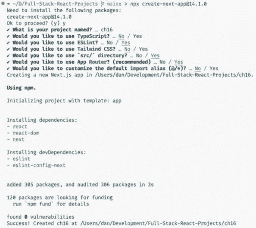
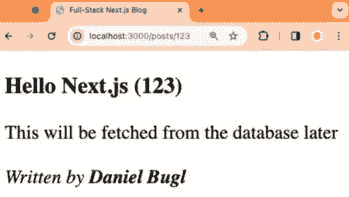

# 第十六章：开始使用 Next.js

到目前为止，我们一直在使用各种库和工具来开发全栈 Web 应用程序。现在，我们介绍 Next.js 作为一款企业级全栈 Web 应用程序框架，适用于 React。Next.js 将您需要的所有全栈 Web 开发功能和工具集成在一个包中。在这本书中，我们使用 Next.js，因为它是目前最受欢迎的框架，支持所有新的 React 特性，例如 React Server Components 和 Server Actions，这些是全栈 React 开发的未来。然而，还有其他全栈 React 框架，如 Remix，最近也开始支持新的 React 特性。

在本章中，我们将学习 Next.js 的工作原理及其优势。然后，我们将使用 Next.js 重新创建我们的博客项目，以突出使用简单的打包器（如 Vite）和全框架（如 Next.js）之间的差异。在这个过程中，我们将学习 Next.js App Router 的工作原理。最后，我们将通过创建组件和页面以及定义它们之间的链接来重新创建我们的（静态）博客应用程序。

在本章中，我们将涵盖以下主要主题：

+   什么是 Next.js？

+   设置 Next.js

+   介绍 App Router

+   创建静态组件和页面

# 技术要求

在我们开始之前，请安装从*第一章**，准备全栈开发*和*第二章**，了解 Node.js*和 MongoDB*中提到的所有要求。

那些章节中列出的版本是本书中使用的版本。虽然安装较新版本不应有问题，但请注意，某些步骤在较新版本上可能有所不同。如果您在使用本书中提供的代码和步骤时遇到问题，请尝试使用*第一章*和*第二章*中提到的版本。

您可以在 GitHub 上找到本章的代码：[`github.com/PacktPublishing/Modern-Full-Stack-React-Projects/tree/main/ch16`](https://github.com/PacktPublishing/Modern-Full-Stack-React-Projects/tree/main/ch16)。

本章的 CiA 视频可在以下链接找到：[`youtu.be/jQFCZqCspoc`](https://youtu.be/jQFCZqCspoc)。

# 什么是 Next.js？

Next.js 是一个 React 框架，它将您创建全栈 Web 应用程序所需的一切整合在一起。其主要特性如下：

+   原生提供良好的开发者体验，包括热模块重载、错误处理等。

+   基于文件的路由和嵌套布局，使用 Next.js 定义 API 端点的路由处理器。

+   在路由中支持**国际化**（**i18n**），允许我们创建国际化路由。

+   原生支持增强的服务端和客户端数据获取，带有缓存功能。

+   中间件，在请求完成前运行代码。

+   在无服务器运行时上运行 API 端点的选项。

+   原生支持页面静态生成。

+   当组件需要时动态流式传输组件，使我们能够快速显示初始页面，然后稍后加载其他组件。

+   高级客户端和服务器渲染，使我们不仅能够在服务器端渲染 React 组件（**服务器端渲染**（**SSR**）），还可以使用**React Server Components**，这允许我们在服务器端专门渲染 React 组件，而不需要向客户端发送额外的 JavaScript。

+   **服务器操作**用于逐步增强从客户端发送到服务器的表单和操作，使我们能够在客户端没有 JavaScript 的情况下提交表单。

+   内置对图像、字体和脚本的优化，以改善 Core Web Vitals。

+   此外，Next.js 提供了一个平台，使我们能够轻松地将我们的应用部署到 – Vercel。

总的来说，Next.js 将本书中学到的所有全栈开发知识整合在一起，对每个概念进行精炼，使其更加高级和可定制，并将所有这些内容封装在一个单独的包中。我们现在将从头开始使用 Next.js 重新创建之前章节中的博客应用。这样做将使我们能够看到使用和未使用全栈框架开发应用之间的差异。

# 设置 Next.js

现在我们将使用`create-next-app`工具设置一个新的项目，该工具会自动为我们设置一切。按照以下步骤开始：

1.  打开一个新的终端窗口。确保您不在任何项目文件夹中。运行以下命令以创建一个新的文件夹并在其中初始化一个 Next.js 项目：

    ```js
    $ npx create-next-app@14.1.0
    ```

1.  当被问及是否**可以继续**时，按**y**键并按*Return/Enter*键确认。

1.  给项目起一个名字，例如**ch16**。

1.  按照以下方式回答问题：

    +   **您想使用 TypeScript 吗？**：**否**

    +   **您想使用 ESLint 吗？**：**是**

    +   **您想使用 Tailwind CSS 吗？**：**否**

    +   **您想使用`src/`目录吗？**：**是**

    +   **您想使用 App Router 吗？**：**是**

    +   **您想自定义默认导入别名吗？**：**否**

1.  在回答完所有问题后，将在**ch16**文件夹中创建一个新的 Next.js 应用。输出结果应如下所示：



图 16.1 – 创建新的 Next.js 项目

1.  在 VS Code 中打开新创建的**ch16**文件夹。

1.  在新的 VS Code 窗口中，打开一个终端并使用以下命令运行项目：

    ```js
    $ npm run dev
    ```

1.  在浏览器中打开**http://localhost:3000**以查看运行的 Next.js 应用！应用应如下所示：


图 16.2 – 在浏览器中运行的我们新创建的 Next.js 应用

1.  不幸的是，**create-next-app**没有为我们设置 Prettier，所以让我们现在快速设置一下。通过运行以下命令安装 Prettier：

    ```js
    $ npm install --save-dev prettier@2.8.4 \
      eslint-config-prettier@8.6.0
    ```

1.  在项目的根目录中创建一个新的**.prettierrc.json**文件，内容如下：

    ```js
    {
      "trailingComma": "all",
      "tabWidth": 2,
      "printWidth": 80,
      "semi": false,
      "jsxSingleQuote": true,
      "singleQuote": true
    }
    ```

1.  编辑现有的 **.eslintrc.json** 文件，以便从 **prettier** 扩展，如下所示：

    ```js
    {
      "extends": ["next/core-web-vitals", "prettier"]
    }
    ```

1.  前往 VS Code 工作区设置，将 **Editor: Default Formatter** 设置更改为 **Prettier**，并勾选 **Editor: Format** **On Save** 复选框。

现在我们已经成功创建了一个新的 Next.js 项目，并集成了 ESLint 和 Prettier！我们仍然可以设置 Husky 和 lint-staged，就像我们之前做的那样，但现在我们将坚持这个简单的设置。接下来，我们将学习更多关于 Next.js 中应用程序结构的内容。

# 介绍 App Router

Next.js 携带一种特殊的结构化应用程序的范式，称为 App Router。App Router 利用 `src/app/` 文件夹中的文件夹结构来为我们的应用程序创建路由。根文件夹（`/` 路径）是 `src/app/`。如果我们想定义一个路径，例如 `/posts`，我们需要创建一个 `src/app/posts/` 文件夹。为了使这个文件夹成为一个有效的路由，我们需要在其中放置一个 `page.js` 文件，该文件包含在访问该路由时将被渲染的页面组件。

注意

或者，我们可以将一个 **route.js** 文件放入一个文件夹中，将其转换为 API 路由而不是渲染页面。我们将在 *第十八章* *高级 Next.js 概念和优化* 中了解更多关于 API 路由的内容。

此外，Next.js 允许我们定义一个 `layout.js` 文件，它将被用作特定路径的布局。布局组件接受子组件，可以包含其他布局或页面。这种灵活性允许我们定义带有子布局的嵌套路由。

在 App Router 范式中还有其他特殊文件，例如 `error.js` 文件，当页面发生错误时将被渲染，以及 `loading.js` 文件，在页面加载时（使用 React Suspense）将被渲染。

查看以下带有 App Router 的文件夹结构示例：


图 16.3 – 带有 App Router 的文件夹结构示例

在前面的示例中，我们有一个 `dashboard/settings/` 路由，由 `dashboard` 和 `settings` 文件夹定义。`dashboard` 文件夹没有 `page.js` 文件，所以访问 `dashboard/` 将导致 `404 Not Found` 错误。然而，`dashboard` 文件夹有一个 `layout.js` 文件，它定义了仪表板的主要布局。`settings` 文件夹有一个另一个 `layout.js` 文件，它定义了仪表板上的设置页面布局。它还有一个 `page.js` 文件，当访问 `dashboard/settings/` 路由时将被渲染。此外，它还有一个 `loading.js` 文件，在设置页面加载时在设置布局内部渲染。它还包含一个 `error.js` 文件，如果在加载设置页面时发生错误，它将在设置布局内部渲染。

如我们所见，App Router 使得实现常见用例变得容易，例如嵌套路由、布局、错误和加载组件。现在让我们开始定义博客应用程序的文件夹结构。

## 定义文件夹结构

让我们回顾并精炼博客应用程序从上一章中的路由结构：

+   **/** – 我们博客的首页，包含文章列表

+   **/login** – 登录现有账户的登录页面

+   **/signup** – 创建新账户的注册页面

+   **/create** – 创建新博客文章的页面（此路由为新）

+   **/posts/:id** – 查看单个博客文章的页面

所有这些页面都共享一个带有顶部导航栏的通用布局，使我们能够在应用程序的各个页面之间导航。

让我们现在创建这个路由结构作为 App Router 中的文件夹结构：

1.  *删除*现有的**src/app/**文件夹。

1.  创建一个新的**src/app/**文件夹。在其内部，创建一个**src/app/layout.js**文件，内容如下：

    ```js
    export const metadata = {
      title: 'Full-Stack Next.js Blog',
      description: 'A blog about React and Next.js',
    }
    export default function RootLayout({ children }) {
      return (
        <html lang="en">
          <body>
            <main>{children}</main>
          </body>
        </html>
      )
    }
    ```

    `metadata`对象是 Next.js 中一个特殊的导出对象，用于提供元标签，如`<title>`和`<meta name="description">`标签。

    App Router 中文件的默认导出需要是应该为相应布局/页面渲染的组件。

1.  创建一个新的**src/app/page.js**文件，内容如下：

    ```js
    export default function HomePage() {
      return <strong>Blog home page</strong>
    }
    ```

1.  创建一个新的**src/app/login/**文件夹。在其内部，创建一个**src/app/login/page.js**文件，内容如下：

    ```js
    export default function LoginPage() {
      return <strong>Login</strong>
    }
    ```

1.  创建一个新的**src/app/signup/**文件夹。在其内部，创建一个**src/app/signup/page.js**文件，内容如下：

    ```js
    export default function SignupPage() {
      return <strong>Signup</strong>
    }
    ```

1.  创建一个新的**src/app/create/**文件夹。在其内部，创建一个**src/app/create/page.js**文件，内容如下：

    ```js
    export default function CreatePostPage() {
      return <strong>CreatePost</strong>
    }
    ```

1.  创建一个新的**src/app/posts/**文件夹。在其内部，创建一个新的**src/app/posts/[id]/**文件夹。这是一个特殊的文件夹，包含一个路由参数**id**，我们可以在渲染页面时使用它。

1.  创建一个新的**src/app/posts/[id]/page.js**文件，内容如下：

    ```js
    export default function ViewPostPage({ params }) {
      return <strong>ViewPost {params.id}</strong>
    }
    ```

    如您所见，我们从 Next.js 提供的`params`对象中获取`id`。

1.  如果它已经停止运行，请使用以下命令启动 Next.js 开发服务器：

    ```js
    $ npm run dev
    ```

1.  然后在浏览器中转到**http://localhost:3000/**（或刷新页面）以查看主路由是否正常工作。转到不同的路由，如**/login**和**/posts/123**，以查看不同页面被渲染以及**路由**参数是否正常工作！

现在我们已经定义了项目的文件夹结构，让我们继续创建静态组件和页面。

# 创建静态组件和页面

对于我们博客的组件，我们可以重用前几章中编写的大部分代码，因为 Next.js 与纯 React 相比并没有太大的不同。只有特定的组件，如导航栏，会有所不同，因为 Next.js 有自己的路由器。我们将大多数组件创建在单独的`src/components/`文件夹中。这个文件夹将只包含可以在多个页面之间重用的 React 组件。所有页面和布局组件仍然在`src/app/`。

注意

在 Next.js 中，也可以将常规组件与页面和布局组件一起放置，对于仅在特定页面上使用的组件，在大规模项目中应该这样做。在小项目中，这并不是很重要，我们只需将所有常规组件放在一个单独的文件夹中，以便更容易地将它们与页面和布局组件区分开来。

## 定义组件

现在我们开始创建我们博客应用的组件：

1.  创建一个新的**src/components/**文件夹。

1.  创建一个新的**src/components/Login.jsx**文件。在其中，定义一个包含**用户名**字段、**密码**字段和提交按钮的**<form>**：

    ```js
    export function Login() {
      return (
        <form>
          <div>
            <label htmlFor='username'>Username: </label>
            <input type='text' name='username' id='username' />
          </div>
          <br />
          <div>
            <label htmlFor='password'>Password: </label>
            <input type='password' name='password' id='password' />
          </div>
          <br />
          <input type='submit' value='Log In' />
        </form>
      )
    }
    ```

注意

我们故意使用非受控输入字段（因此，没有**useState**钩子），因为在下一章将要学习的使用服务器操作的表单中，没有必要创建受控输入字段，我们将学习的内容是*第十七章**，介绍 React Server Components*。然而，正确定义输入字段的**name**属性很重要，因为当表单提交时，将使用该属性来识别字段。

1.  以类似的方式，创建一个新的**src/components/Signup.jsx**文件，并定义具有相同字段的表单：

    ```js
    export function Signup() {
      return (
        <form>
          <div>
            <label htmlFor='username'>Username: </label>
            <input type='text' name='username' id='username' />
          </div>
          <br />
          <div>
            <label htmlFor='password'>Password: </label>
            <input type='password' name='password' id='password' />
          </div>
          <br />
          <input type='submit' value='Sign Up' />
        </form>
      )
    }
    ```

1.  创建一个新的**src/components/CreatePost.jsx**文件，并定义一个包含必需的**标题**输入字段、用于定义**内容**的**textarea**和一个提交按钮的表单：

    ```js
    export function CreatePost() {
      return (
        <form>
          <div>
            <label htmlFor='title'>Title: </label>
            <input type='text' name='title' id='title' required />
          </div>
          <br />
          <textarea name='contents' id='contents' />
          <br />
          <br />
          <input type='submit' value='Create' />
        </form>
      )
    }
    ```

1.  创建一个新的**src/components/Post.jsx**文件。作为对前几章结构的改进，**Post**组件将在**PostList**中使用，并且只显示博客文章的**标题**和**作者**，以及一个链接到完整文章：

    ```js
    import PropTypes from 'prop-types'
    export function Post({ _id, title, author }) {
      return (
        <article>
          <h3>{title}</h3>
          <em>
            Written by <strong>{author.username}</strong>
          </em>
        </article>
      )
    }
    ```

1.  我们还需要定义**propTypes**。在这种情况下，我们将使用类似于数据库查询结果的架构，因为我们将在下一章介绍 React Server Components 时能够直接使用数据库结果：

    ```js
    Post.propTypes = {
      _id: PropTypes.string.isRequired,
      title: PropTypes.string.isRequired,
      author: PropTypes.shape({
        username: PropTypes.string.isRequired,
      }).isRequired,
      contents: PropTypes.string,
    }
    ```

1.  创建一个新的**src/components/PostList.jsx**文件。在这里，我们将重用**Post**组件的**propTypes**，所以让我们也导入**Post**组件：

    ```js
    import { Fragment } from 'react'
    import PropTypes from 'prop-types'
    import { Post } from './Post.jsx'
    ```

1.  然后，我们定义**PostList**组件，它使用**Post**组件渲染每个博客文章：

    ```js
    export function PostList({ posts = [] }) {
      return (
        <div>
          {posts.map((post) => (
            <Fragment key={`post-${post._id}`}>
              <Post _id={post._id} title={post.title} author={post.author} />
              <hr />
            </Fragment>
          ))}
        </div>
      )
    }
    ```

注意

使用唯一的 ID 作为**key**属性是一个最佳实践，例如数据库 ID，这样 React 可以跟踪列表中变化的项目。

1.  我们现在通过使用现有的**Post.propTypes**来定义**PostList**组件的**propTypes**：

    ```js
    PostList.propTypes = {
      posts: PropTypes.arrayOf(
        PropTypes.shape(Post.propTypes)
      ).isRequired,
    }
    ```

1.  最后，我们创建一个新的**src/components/FullPost.jsx**文件，在其中显示包含所有内容的完整帖子：

    ```js
    import PropTypes from 'prop-types'
    export function FullPost({ title, contents, author }) {
      return (
        <article>
          <h3>{title}</h3>
          <div>{contents}</div>
          <br />
          <em>
            Written by <strong>{author.username}</strong>
          </em>
        </article>
      )
    }
    ```

1.  我们不是从**Post**组件中重用**propTypes**，而是在这里重新定义它们，因为**FullPost**组件需要与**Post**组件不同的属性（它没有**_id**属性，而是有**contents**属性）：

    ```js
    FullPost.propTypes = {
      title: PropTypes.string.isRequired,
      author: PropTypes.shape({
        username: PropTypes.string.isRequired,
      }).isRequired,
      contents: PropTypes.string,
    }
    ```

现在我们已经定义了我们博客应用所需的全部组件，让我们继续正确地定义页面组件。

## 定义页面

在创建我们博客应用所需的各个组件后，现在让我们用适当的页面替换占位符页面组件，这些页面将渲染适当的组件。按照以下步骤开始：

1.  编辑**src/app/login/page.js**并导入**Login**组件，然后渲染它：

    ```js
    import { Login } from '@/components/Login'
    export default function LoginPage() {
      return <Login />
    }
    ```

注意

记得当我们设置 Next.js 时，是否被问及是否想要自定义默认导入别名吗？这个导入别名允许我们引用项目的**src/**文件夹，使我们的导入是绝对的而不是相对的。默认情况下，这是使用**@**别名完成的。因此，我们现在可以从**@/components/Login**导入，而不是必须从**../../components/Login.jsx**导入。在大型项目中，使用导入别名进行绝对导入变得特别有用，并且可以轻松地在以后重构项目。

1.  编辑**src/app/signup/page.js**，以类似的方式导入并渲染**Signup**组件：

    ```js
    import { Signup } from '@/components/Signup'
    export default function SignupPage() {
      return <Signup />
    }
    ```

1.  通过编辑**src/app/create/page.js**文件重复此过程：

    ```js
    import { CreatePost } from '@/components/CreatePost'
    export default function CreatePostPage() {
      return <CreatePost />
    }
    ```

1.  现在，编辑**src/app/posts/[id]/page.js**文件并导入**FullPost**组件：

    ```js
    import { FullPost } from '@/components/FullPost'
    ```

1.  然后，定义一个示例**post**对象：

    ```js
    export default function ViewPostPage({ params }) {
      const post = {
        title: `Hello Next.js (${params.id})`,
        contents: 'This will be fetched from the database later',
        author: { username: 'Daniel Bugl' },
    id into the title.
    ```

1.  按照以下方式渲染**FullPost**组件：

    ```js
      return (
        <FullPost
          title={post.title}
          contents={post.contents}
          author={post.author}
        />
      )
    }
    ```

1.  最后，通过导入**PostList**组件、创建一个示例**posts**数组并渲染**PostList**组件来编辑**src/app/page.js**：

    ```js
    import { PostList } from '@/components/PostList'
    export default function HomePage() {
      const posts = [
        { _id: '123', title: 'Hello Next.js', author: { username: 'Daniel Bugl' } },
      ]
      return <PostList posts={posts} />
    }
    ```

1.  前往**http://localhost:3000/posts/123**查看使用标题中的**id**参数渲染的**FullPost**组件。您可以随意更改 URL 中的**id**以查看标题如何变化。以下截图显示了在**/****posts/123**路径上渲染的**FullPost**组件：



图 16.4 – 使用 Next.js 路由参数在标题中渲染 FullPost 组件

在成功定义所有页面后，我们仍然需要一个在它们之间导航的方法，所以让我们继续通过在页面之间添加链接来继续：

## 在页面之间添加链接

如本章前面所述，Next.js 提供了自己的路由解决方案——App Router。路由由`src/app/`目录中的文件夹结构定义，并且它们都已经准备好了。现在我们唯一要做的就是添加它们之间的链接。为此，我们需要使用来自`next/link`的`Link`组件。按照以下步骤开始实现导航栏：

1.  创建一个新的**src/components/Navigation.jsx**文件，其中我们导入**Link**组件和**PropTypes**：

    ```js
    import Link from 'next/link'
    import PropTypes from 'prop-types'
    ```

1.  定义一个**UserBar**组件，当用户登录时将被渲染，并允许用户访问**创建帖子**页面和注销：

    ```js
    export function UserBar({ username }) {
      return (
        <form>
          <Link href='/create'>Create Post</Link> | Logged in as{' '}
          <strong>{username}</strong> <button>Logout</button>
        </form>
      )
    }
    UserBar.propTypes = {
      username: PropTypes.string.isRequired,
    }
    ```

1.  然后，定义一个**LoginSignupLinks**组件，当用户尚未登录时将被渲染。它提供了链接到**/login**和**/signup**页面，允许用户在我们的应用中注册和登录：

    ```js
    export function LoginSignupLinks() {
      return (
        <div>
          <Link href='/login'>Log In</Link> | <Link href='/signup'>Sign Up</Link>
        </div>
      )
    }
    ```

1.  接下来，定义一个**Navigation**组件，它添加了一个链接到主页，然后根据用户是否登录有条件地渲染**UserBar**组件或**LoginSignupLinks**组件：

    ```js
    export function Navigation({ username }) {
      return (
        <>
          <Link href='/'>Home</Link>
          {username ? <UserBar username={username} /> : <LoginSignupLinks />}
        </>
      )
    }
    Navigation.propTypes = {
      username: PropTypes.string,
    }
    ```

1.  现在，我们只需要渲染**Navigation**组件。为了确保它在博客应用的所有页面上显示，我们将它放在根布局中。编辑**src/app/layout.js**并导入**Navigation**组件：

    ```js
    import { Navigation } from '@/components/Navigation'
    ```

1.  然后，定义一个示例**user**对象来模拟用户登录：

    ```js
    export default function RootLayout({ children }) {
      const user = { username: 'dan' }
    ```

1.  按照以下方式渲染**Navigation**组件：

    ```js
      return (
        <html lang='en'>
          <body>
            <nav>
              <Navigation username={user?.username} />
            </nav>
            <br />
            <main>{children}</main>
          </body>
        </html>
      )
    }
    ```

1.  我们还需要从列表中的单个帖子添加一个链接到完整的帖子页面。编辑**src/components/Post.jsx**并导入**Link**组件：

    ```js
    import Link from 'next/link'
    ```

1.  然后，添加一个链接到标题，如下所示：

    ```js
    export function Post({ _id, title, author }) {
      return (
        <article>
          <h3>
            <Link href={`/posts/${_id}`}>{title}</Link>
          </h3>
    ```

1.  访问**http://localhost:3000/**，您将看到渲染了**UserBar**组件的导航栏。

1.  点击**创建帖子**链接进入相应的页面，然后使用**主页**链接返回。也可以尝试通过点击主页上的博客帖子标题来访问完整的帖子页面。

以下截图显示了在添加了导航栏后渲染的**主页**：


图 16.5 – 在 Next.js 中重新创建的我们的（静态）博客应用！

# 摘要

在本章中，我们首先学习了 Next.js 是什么以及它如何对全栈开发有用。然后，我们设置了一个新的 Next.js 项目，并了解了 App Router 范式。最后，我们通过创建组件、页面和导航栏，利用 Next.js 的`Link`组件在应用的不同页面间导航，重新创建了 Next.js 中的博客应用。

在下一章*第十七章**介绍 React 服务器组件*中，我们将学习如何通过创建 React 服务器组件来使我们的博客应用变得交互式，这些组件在服务器上运行，例如可以执行数据库查询。此外，我们还将学习关于服务器操作的知识，这些操作用于提交表单，例如登录、注册和创建帖子表单。
