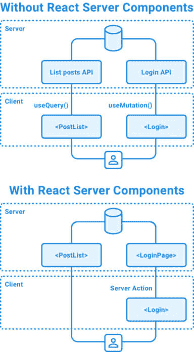
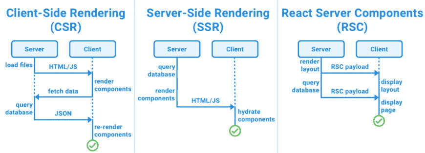
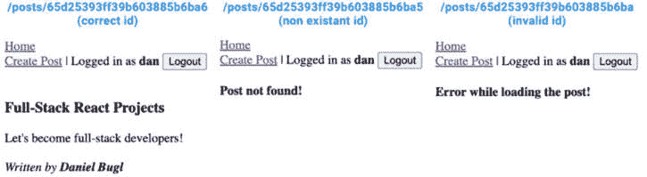
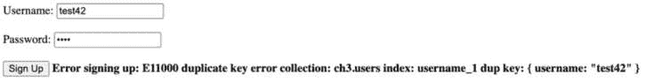

# 第十七章：介绍 React 服务器组件

在 Next.js 中实现我们的静态博客应用之后，是时候给它添加一些交互性了。我们不会使用传统的模式，即编写一个单独的后端服务器，前端从该服务器获取数据并发出请求，而是将使用一种名为**React 服务器组件**（**RSCs**）的新模式。这种新模式允许我们通过仅在某些 React 组件（所谓的服务器组件）上执行来直接从 React 组件访问数据库。结合服务器操作（一种从客户端调用服务器上函数的方法），这种新模式使我们能够轻松快速地开发全栈应用。在本章中，我们将学习 RSCs 和服务器操作是什么，为什么它们很重要，它们的优点是什么，以及如何正确且安全地实现它们。

在本章中，我们将涵盖以下主要主题：

+   什么是 RSCs？

+   为我们的 Next.js 应用添加数据层

+   使用 RSCs 从数据库获取数据

+   使用服务器操作进行注册、登录和创建新帖子

# 技术要求

在我们开始之前，请安装从*第一章*“为全栈开发做准备”和*第二章*“了解 Node.js 和 MongoDB”中提到的所有要求。

那些章节中列出的版本是本书中使用的版本。虽然安装较新版本不应成问题，但请注意，某些步骤可能会有所不同。如果你在使用本书中提供的代码和步骤时遇到问题，请尝试使用*第一章*和*第二章*中提到的版本。

你可以在 GitHub 上找到本章的代码：[`github.com/PacktPublishing/Modern-Full-Stack-React-Projects/tree/main/ch17`](https://github.com/PacktPublishing/Modern-Full-Stack-React-Projects/tree/main/ch17)。

本章的 CiA 视频可以在以下位置找到：[`youtu.be/4hGZJRmZW6E`](https://youtu.be/4hGZJRmZW6E)。

# 什么是 RSCs？

到目前为止，我们一直在使用传统的 React 架构，其中所有组件都是**客户端组件**。我们是从客户端渲染开始的。然而，客户端渲染有一些缺点：

+   在客户端开始渲染任何内容之前，必须从服务器下载 JavaScript 客户端包，这会延迟用户的**首次内容绘制**（**FCP**）。

+   必须从服务器获取数据（在下载并执行 JavaScript 之后）才能显示任何有意义的内容，这会延迟用户的**首次有意义的绘制**（**FMP**）。

+   大部分负载都在客户端，即使是那些非交互式的页面也是如此，这对处理器较慢的客户端来说尤其成问题，例如低端移动设备或旧笔记本电脑。它还需要更多的电池来加载重量级的客户端渲染页面。

+   在某些情况下，数据是顺序获取的（例如，首先加载帖子，然后解析每个帖子的作者），这对于具有高延迟的慢速连接来说尤其是一个问题。

为了解决这些问题，**服务器端渲染**（**SSR**）被引入，但它仍然有一个很大的缺点：由于所有内容都在服务器上渲染，初始页面加载可能会很慢。这种减速发生的原因如下：

+   在显示任何数据之前，必须从服务器获取数据。

+   在客户端使用它进行水合之前，必须从服务器下载 JavaScript 客户端包。水合意味着页面已准备好供用户交互。为了刷新你对水合工作原理的了解，请查看*第七章*。

+   水合作用必须在客户端完成，之后才能与任何内容进行交互。

即使客户端组件在服务器上进行了预渲染，其代码也会被打包并发送到客户端进行水合。这意味着客户端组件可以在服务器（用于 SSR）和客户端上运行，但它们至少需要在客户端上能够运行。

在仅包含客户端组件的传统全栈 React 架构中，如果我们需要访问服务器的文件系统或数据库，我们需要编写一个单独的后端使用 Node.js 并公开一个 API（例如 REST API）。然后，这个 API 在客户端组件中被查询，例如，使用 TanStack Query。这些查询也可以在服务器端进行（如我们在*第七章*，*使用服务器端渲染提高加载时间*）中看到），但它们至少需要在客户端可执行。这意味着我们无法直接从 React 组件中访问文件系统或数据库，即使该代码可以在服务器上运行；它会被打包并发送到客户端，在那里运行将不会工作（或者会将内部信息，如凭证，暴露给数据库）：



图 17.1 – 无 RSCs 和有 RSCs 的全栈应用架构

React 18 引入了一个名为 RSCs 的新功能，允许我们定义仅将在服务器上执行组件，只将输出发送到客户端。服务器组件可以，例如，从数据库或文件系统中获取数据，然后渲染交互式客户端组件，并将这些数据作为 props 传递给它们。这个新功能允许我们构建一个架构，我们可以更轻松地仅使用 React 编写全栈应用程序，而无需处理定义 REST API 的开销。

注意

对于某些应用程序，定义 REST API 可能仍然有意义，特别是如果后端是由更大规模项目中的另一个团队开发，或者如果它被其他服务和前端消费。

RSC 通过允许我们在服务器上独家执行代码（客户端无需水合！）和选择性地流式传输组件（这样我们就不必等待所有内容预渲染后再向客户端提供组件）来解决客户端渲染和 SSR 中的上述问题。

下图比较了 **客户端渲染 (CSR**) 与 SSR 和 RSC：



图 17.2 – CSR、SSR 和 RSC 的比较

正如你所见，RSC 不仅整体上更快（由于网络往返次数更少），而且可以在等待其他组件加载的同时立即显示应用程序的布局。

让我们总结一下 RSC 的最重要的特性：

+   它们可以在构建之前运行，并且不会被包含在 JavaScript 包中，从而减少包大小并提高性能。

+   它们可以在构建时运行（生成静态 HTML）或当请求到来时即时执行。有趣的是，服务器组件也可以在构建时独家执行，从而生成静态 HTML 包。这对于静态构建的 CMS 应用或个人博客可能很有用。RSC 还允许混合使用，其中初始缓存通过静态构建进行预填充，然后通过服务器操作或 Webhooks 进行后续验证。我们将在 *第十八章**，高级 Next.js 概念和优化* 中了解更多关于缓存的内容。

+   它们可以将（可序列化）数据传递给客户端组件。此外，客户端组件仍然可以被服务器端渲染，以进一步提高性能！

+   在服务器组件内部，其他服务器组件可以作为 props 传递给客户端组件，允许使用组合模式，其中服务器组件被“嵌入”到交互式客户端组件中。然而，所有在客户端组件内部导入的组件都将被视为客户端组件；它们不能再是服务器组件。

在像 Next.js 这样的框架中，默认情况下，React 组件被视为服务器组件。如果我们想将其转换为客户端组件，我们需要在文件开头写入 `"use client"` 指令。我们需要这样做是为了使其能够添加交互性（事件监听器）或使用状态/生命周期效果和仅浏览器 API。

注意

**"use client"** 指令定义了服务器组件和客户端组件之间的网络边界。所有从服务器组件发送到客户端组件的数据都将被序列化并通过网络发送。当在文件中使用 **"use client"** 指令时，所有导入到该文件的其他模块，包括子组件，都被视为客户端包的一部分。

下图概述了何时使用服务器组件或客户端组件：


图 17.3 – 何时使用服务器组件和客户端组件概述

通常，RSC 是对客户端组件的一种优化。你可以在每个文件的顶部简单地写上`"use client"`并完成，但你将放弃 RSC 的所有优势！所以，尽可能使用服务器组件，但如果你发现将其拆分为服务器端和客户端部分过于复杂，不要犹豫将其定义为客户端组件。它总是可以在以后进行优化。

这种编写全栈 React 应用的新方法在理论上可能难以理解，所以请随时在本章结束时再次回到这一节。现在，我们将继续前进，并在我们的 Next.js 应用中实现 RSC，这将帮助我们理解新概念在实际中的工作方式。首先，我们将从向我们的 Next.js 应用添加数据层开始，这将允许我们稍后从 RSC 中访问数据库。

# 向我们的 Next.js 应用添加数据层

在传统的后端结构中，我们有数据库层、服务层和路由层。在现代的全栈 Next.js 应用中，我们不需要后端的路由层，因为我们可以直接在 RSC 中与之交互。因此，我们只需要数据库层和一个数据层来提供访问数据库的功能。理论上，我们可以在 RSC 中直接访问数据库，但最佳实践是定义特定的函数以特定方式访问它。定义这样的函数使我们能够清楚地定义哪些数据是可访问的（从而避免意外泄露过多信息）。它们也更易于重用，并使得单元测试和发现数据层中的潜在漏洞（例如，通过渗透测试）更加容易。

总结一下，主要有三种数据处理方法：

+   **HTTP APIs**：我们在前几章中使用这些 API 来实现我们的博客应用。当后端和前端由不同的团队工作时，这些 API 非常有用。因此，这种方法推荐用于现有的大型项目和组织。

+   **数据访问层**：这是我们将在本节中使用的模式。对于使用 RSC 架构的新项目来说，这是一个推荐的选择，因为它通过分离处理数据（以及与之相关的所有安全挑战）和用户界面（在 React 组件中显示数据）的职责，使得实现全栈项目更加容易。单独处理每个问题比同时处理两者的复杂性更容易解决且错误率更低。

+   **组件级数据访问**：这是一种在 RSC 中直接查询数据库的模式。这种方法对于快速原型设计和学习很有用。然而，由于可扩展性问题以及可能引入的安全问题，它不应在生产应用中使用。

不建议混合这些方法，所以最好选择一个并坚持下去。在我们的情况下，我们选择“数据访问层”方法，因为它是对现代 RSC 架构最安全的做法。

## 设置数据库连接

让我们先设置必要的包和初始化数据库连接：

1.  将现有的 **ch16** 文件夹复制到一个新的 **ch17** 文件夹，如下所示：

    ```js
    $ cp -R ch16 ch17
    ```

1.  在 VS Code 中打开 **ch17** 文件夹并打开一个终端。

1.  我们将使用一个名为 **server-only** 的包来确保数据库和数据层的代码仅在服务器端执行，而不会意外地导入客户端。按照以下步骤安装它：

    ```js
    $ npm install server-only@0.0.1
    ```

1.  我们还需要 **mongoose** 包来连接到数据库并创建数据库模式和模型。运行以下命令来安装它：

    ```js
    $ npm install mongoose@8.0.2
    ```

1.  创建一个新的 **src/db/** 文件夹。

1.  在这个文件夹内，创建一个新的 **src/db/init.js** 文件，在其中我们首先导入 **server-only** 包以确保代码仅在服务器上执行：

    ```js
    import 'server-only'
    ```

1.  接下来，导入 **mongoose**：

    ```js
    import mongoose from 'mongoose'
    ```

1.  定义并导出一个 **async** 函数以初始化数据库：

    ```js
    export async function initDatabase() {
      const connection = await mongoose.connect(process.env.DATABASE_URL)
      return connection
    }
    ```

1.  现在，我们需要在 **.env** 文件中定义 **DATABASE_URL**。因此，在项目的根目录中创建一个新的 **.env** 文件并添加以下行：

    ```js
    DATABASE_URL=mongodb://localhost:27017/blog
    ```

现在数据库连接已经设置好，我们可以继续创建数据库模型。

## 创建数据库模型

现在，我们将为帖子用户创建数据库模型。这些模型将与我们之前章节中为我们的博客应用创建的模型非常相似。按照以下步骤开始创建数据库模型：

1.  创建一个新的 **src/db/models/** 文件夹。

1.  在其中，创建一个新的 **src/db/models/user.js** 文件，在其中我们首先导入 **server-only** 和 **mongoose** 包：

    ```js
    import 'server-only'
    import mongoose, { Schema } from 'mongoose'
    ```

1.  定义 **userSchema**，它由一个唯一的必需的 **username** 和一个必需的 **password** 组成：

    ```js
    const userSchema = new Schema({
      username: { type: String, required: true, unique: true },
      password: { type: String, required: true },
    })
    ```

1.  如果模型尚未创建，我们创建 Mongoose 模型：

    ```js
    export const User = mongoose.models.user ?? mongoose.model('user', userSchema)
    ```

注意

如果模型已经存在，则返回模型，如果不存在，则创建一个新的模型，这是必要的，以避免 **OverwriteModelError** 问题，该问题发生在模型被导入（因此重新定义）多次时。

1.  创建一个新的 **src/db/models/post.js** 文件，在其中我们首先导入 **server-only** 和 **mongoose** 包：

    ```js
    import 'server-only'
    import mongoose, { Schema } from 'mongoose'
    ```

1.  定义 **postSchema**，它由一个必需的 **title** 和 **author**（引用 **user** 模型）以及可选的 **contents** 组成：

    ```js
    const postSchema = new Schema(
      {
        title: { type: String, required: true },
        author: { type: Schema.Types.ObjectId, ref: 'user', required: true },
        contents: String,
      },
      { timestamps: true },
    )
    ```

1.  如果模型尚未创建，我们创建 Mongoose 模型：

    ```js
    export const Post = mongoose.models.post ?? mongoose.model('post', postSchema)
    ```

1.  创建一个新的 **src/db/models/index.js** 文件并重新导出模型：

    ```js
    import 'server-only'
    export * from './user'
    export * from './post'
    ```

    我们从这个文件夹重新导出模型，以确保我们可以，例如，通过查询相应的用户来加载一个帖子并解析 `author`。这需要定义 `user` 模型，尽管它不是直接使用的。为了避免这些问题，我们简单地从定义所有模型的文件中加载模型。

在定义数据库模型之后，我们可以定义数据层函数，这些函数将提供各种访问数据库的方式。

## 定义数据层函数

现在我们已经有了数据库连接和架构，让我们开始定义访问数据库的数据层函数。

### 定义帖子数据层

我们将首先定义帖子数据层。这允许我们访问我们应用中处理帖子的所有相关函数：

1.  创建一个新的 **src/data/** 文件夹。

1.  在其中，创建一个新的 **src/data/posts.js** 文件，我们将导入 **server-only** 包和 **Post** 模型：

    ```js
    import 'server-only'
    import { Post } from '@/db/models'
    ```

1.  定义一个 **createPost** 函数，它接受 **userId**、**title** 和 **contents** 并创建一个新的帖子：

    ```js
    export async function createPost(userId, { title, contents }) {
      const post = new Post({ author: userId, title, contents })
      return await post.save()
    }
    ```

1.  接下来，定义一个 **listAllPosts** 函数，该函数首先从数据库中获取所有帖子，按创建日期降序排序（首先显示最新帖子）：

    ```js
    export async function listAllPosts() {
      return await Post.find({})
        .sort({ createdAt: 'descending' })
    ```

1.  然后，我们必须通过解析 **user** 模型并从中获取 **username** 值来填充 **author** 字段：

    ```js
        .populate('author', 'username')
    ```

    在 Mongoose 中，`populate` 函数类似于 SQL 中的 `JOIN` 语句：它获取存储在 `author` 字段中的 ID，然后通过查看 `post` 架构来确定该 ID 引用了哪个模型。在 `post` 架构中，我们定义了 `author` 字段引用 `user` 架构，因此 Mongoose 将查询 `user` 模型以获取给定的 ID 并返回一个用户对象。通过提供第二个参数，我们指定我们只想从用户对象（ID 总是会返回）中获取 `username` 值。这样做是为了避免泄露内部信息，例如用户的（散列的）密码。

1.  在填充帖子对象后，我们使用 **.lean()** 将其转换为纯的、可序列化的 JavaScript 对象：

    ```js
        .lean()
    }
    ```

    拥有一个可序列化的对象是必要的，以便能够将数据从 RSC 传递到常规客户端组件，因为所有传递给客户端的数据都需要跨越网络边界，因此需要可序列化。

1.  最后，我们必须定义一个 **getPostById** 函数，该函数通过 ID 查找一个单独的帖子，填充 **author** 字段，并使用 **lean()** 将结果转换为纯 JavaScript 对象：

    ```js
    export async function getPostById(postId) {
      return await Post.findById(postId)
        .populate('author', 'username')
        .lean()
    }
    ```

### 定义用户数据层

我们现在将定义用户数据层。这将涉及创建 JWT 进行身份验证。再次强调，大部分代码将与我们在博客应用中之前实现的内容非常相似。按照以下步骤开始定义用户数据层：

1.  安装 **bcrypt**（用于散列用户密码）和 **jsonwebtoken**（用于处理 JWT）：

    ```js
    $ npm install bcrypt@5.1.1 jsonwebtoken@9.0.2
    ```

1.  创建一个新的 **src/data/users.js** 文件，我们将导入 **server-only**、**bcrypt**、**jwt** 和 **User** 模型：

    ```js
    import 'server-only'
    import bcrypt from 'bcrypt'
    import jwt from 'jsonwebtoken'
    import { User } from '@/db/models'
    ```

1.  定义一个 **createUser** 函数，其中我们散列给定的密码，然后创建一个新的 **User** 模型实例并将其保存：

    ```js
    export async function createUser({ username, password }) {
      const hashedPassword = await bcrypt.hash(password, 10)
      const user = new User({ username, password: hashedPassword })
      return await user.save()
    }
    ```

1.  接下来，定义一个 **loginUser** 函数，该函数首先尝试找到具有给定用户名的用户，如果没有找到用户则抛出错误：

    ```js
    export async function loginUser({ username, password }) {
      const user = await User.findOne({ username })
      if (!user) {
        throw new Error('invalid username!')
      }
    ```

备注

根据您的安全需求，您可能希望考虑不要告诉潜在的攻击者存在用户名，而是返回一个通用消息，例如“无效的用户名或密码”。然而，在我们的情况下，假设用户名是公开信息，因为每个用户都是博客的作者，并且他们的用户名与文章一起发布。

1.  然后，使用**bcrypt**将提供的密码与数据库中的哈希密码进行比较，如果密码无效则抛出一个错误：

    ```js
      const isPasswordCorrect = await bcrypt.compare(password, user.password)
      if (!isPasswordCorrect) {
        throw new Error('invalid password!')
      }
    ```

1.  最后，生成、签名并返回一个 JWT：

    ```js
      const token = jwt.sign({ sub: user._id }, process.env.JWT_SECRET, {
        expiresIn: '24h',
      })
      return token
    }
    ```

1.  现在，我们将定义一个函数从用户 ID 中获取用户信息（目前我们只获取用户名，但以后可以扩展这个功能）。如果用户 ID 不存在，我们抛出一个错误：

    ```js
    export async function getUserInfoById(userId) {
      const user = await User.findById(userId)
      if (!user) throw new Error('user not found!')
      return { username: user.username }
    }
    ```

1.  接下来，定义一个函数从令牌中获取用户 ID，确保在解码 JWT 的同时验证令牌签名，使用**jwt.verify**：

    ```js
    export function getUserIdByToken(token) {
      if (!token) return null
      const decodedToken = jwt.verify(token, process.env.JWT_SECRET)
      return decodedToken.sub
    }
    ```

1.  最后，定义一个函数通过组合**getUserIdByToken**和**getUserInfoById**函数从令牌中获取用户信息：

    ```js
    export async function getUserInfoByToken(token) {
      const userId = getUserIdByToken(token)
      if (!userId) return null
      const user = await getUserInfoById(userId)
      return user
    }
    ```

1.  我们仍然需要定义**JWT_SECRET**环境变量，以便我们的代码能够工作。编辑**.env**并添加它，如下所示：

    ```js
    JWT_SECRET=replace-with-random-secret
    ```

注意

这是非常基础的 Next.js 身份验证实现。对于大型项目，建议考虑一个完整的身份验证解决方案，如 Auth.js（以前称为 next-auth）、Auth0 或 Supabase。查看 Next.js 文档以获取有关 Next.js 身份验证的更多信息：[`nextjs.org/docs/app/building-your-application/authentication`](https://nextjs.org/docs/app/building-your-application/authentication)。

现在我们有了数据层来访问数据库，我们可以开始实现 RSCs 和 Server Actions，这些将调用数据层中的函数来访问数据库中的信息并渲染显示这些信息的 React 组件，将我们的静态博客应用转变为一个完全功能的博客。

# 使用 RSCs 从数据库中获取数据

正如我们所学的，在使用 Next.js 时，React 组件默认被认为是服务器组件，所以所有页面组件都已经执行并在服务器上渲染。只有当我们需要使用仅客户端函数，如 hooks 或输入字段时，我们才需要通过使用“`use client`”指令将我们的组件转换为客户端组件。对于所有不需要用户交互的组件，我们可以简单地保持它们作为服务器组件，并且它们将仅作为静态 HTML（编码在 RSC 有效载荷中）渲染和提供，不会在客户端进行激活。对于客户端（浏览器），这些 React 组件似乎根本不存在，因为浏览器只会看到静态 HTML 代码。这种模式大大提高了我们 Web 应用程序的性能，因为客户端不需要加载 JavaScript 来渲染这些组件。它还减少了包的大小，因为需要加载我们的 Web 应用程序的 JavaScript 代码更少。

现在，让我们实现 RSCs 以从数据库中获取数据。

## 获取帖子列表

我们将首先实现 `HomePage`，其中我们获取并渲染帖子列表：

1.  编辑 **src/app/page.js** 并导入 **initDatabase** 和 **listAllPosts** 函数：

    ```js
    import { initDatabase } from '@/db/init'
    import { listAllPosts } from '@/data/posts'
    ```

1.  将 **HomePage** 组件转换为 **async** 函数，这允许我们在渲染组件之前等待数据获取：

    ```js
    export default async function HomePage() {
    ```

1.  *替换* 样本的 **posts** 数组为以下代码：

    ```js
      await initDatabase()
      const posts = await listAllPosts()
    ```

## 获取单个帖子

现在，我们可以查看帖子列表，接下来让我们继续实现 `ViewPostPage` 的获取单个帖子的过程。按照以下步骤开始：

1.  编辑 **src/app/posts/[id]/page.js** 并导入 **notFound**、**getPostById** 和 **initDatabase** 函数：

    ```js
    import { notFound } from 'next/navigation'
    import { getPostById } from '@/data/posts'
    import { initDatabase } from '@/db/init'
    ```

1.  将页面组件转换为 **async** 函数：

    ```js
    export default async function ViewPostPage({ params }) {
    ```

1.  *替换* 样本的 **post** 对象为对 **initDatabase** 和 **getPostById** 的调用：

    ```js
      await initDatabase()
      const post = await getPostById(params.id)
      if (!post) notFound()
    ```

    现在，我们需要创建一个 `not-found.js` 文件来捕获错误并渲染不同的组件。

1.  创建一个新的 **src/app/posts/[id]/not-found.js** 文件，其中我们渲染“帖子未找到！”信息，如下所示：

    ```js
    export default function ViewPostError() {
      return <strong>Post not found!</strong>
    }
    ```

提示

我们还可以添加一个 **app/not-found.js** 文件来处理整个应用程序中不匹配的 URL。如果用户访问应用程序未定义的路径，该文件中定义的组件将被渲染。

1.  此外，我们还可以创建一个错误组件，用于渲染任何错误，例如无法连接到数据库。创建一个新的 **src/app/posts/[id]/error.js** 文件，其中我们渲染“加载帖子时出错！”信息，如下所示：

    ```js
    'use client'
    export default function ViewPostError() {
      return <strong>Error while loading the post!</strong>
    }
    ```

    错误页面需要是客户端组件，因此我们添加了 `'use` `client'` 指令。

信息

错误页面需要是客户端组件的原因是它们使用了 React **ErrorBoundary** 功能，该功能作为类组件实现（使用 **componentDidCatch**）。React 类组件不能是服务器组件，因此我们需要将错误页面作为客户端组件。

1.  我们仍然需要对 **Post** 组件进行小幅调整，因为 **_id** 现在实际上不再是字符串了；相反，它是一个 **ObjectId** 对象。编辑 **src/components/Post.jsx** 并更改类型，如下所示：

    ```js
    Post.propTypes = {
      _id: PropTypes.object.isRequired,
    ```

1.  确保 Docker 和 MongoDB 容器正常运行！

1.  按照以下步骤运行开发服务器：

    ```js
    $ npm run dev
    ```

1.  前往 **http://localhost:3000** 并点击列表中的任意帖子；您将看到帖子成功加载。如果帖子不存在（例如，如果您更改了 ID 中的单个数字），将显示“帖子未找到！”信息。如果发生任何其他错误（例如，无效的 ID），将显示“加载帖子时出错！”信息：



图 17.4 – 显示帖子以及未找到/错误组件

注意

如果您的数据库中还没有帖子，您可以通过使用前面章节中的博客应用创建一个新的帖子，或者等待我们在本章末尾使用 Next.js 实现创建帖子功能。

在实现用于获取帖子的 RSC（React Server Components）之后，我们的博客应用现在已连接到数据库。然而，目前它只能显示帖子；用户还无法与该应用进行交互。让我们继续通过添加服务器操作（Server Actions）来使我们的博客应用变得交互式。

# 使用服务器操作进行注册、登录和创建新帖子

到目前为止，我们只从服务器上的数据库获取数据并发送给客户端，但为了实现用户交互，我们需要能够从客户端将数据发送回服务器。为了能够做到这一点，React 引入了一种称为服务器操作的模式。

`"use server"`指令，然后要么将它们导入到客户端组件中，要么通过 props 将它们传递给客户端组件。虽然常规 JavaScript 函数不能传递给客户端组件（因为它们不可序列化），但服务器操作可以。

注意

您可以通过在文件开头添加**"use server"**指令来定义一个充满服务器操作的整个文件。这将告诉打包器该文件中的所有函数都是服务器操作；它**不**定义文件内的组件为服务器组件（为了强制在服务器上执行某些操作，请使用如上所述的**server-only**包，而不是使用服务器组件）。然后您可以从这样的文件中导入函数到客户端组件中。

在客户端组件中，我们可以使用`useFormState`钩子，它的签名与`useState`类似，但允许我们执行服务器操作（在服务器上）并在客户端获取结果。`useFormState`钩子的签名如下：

```js
const [state, formAction] = useFormState(fn, initialState)
```

注意

在 React 19 版本中，**useFormState**钩子将被重命名为**useActionState**。有关更多信息，请参阅[`react.dev/reference/react/useActionState`](https://react.dev/reference/react/useActionState)。

如我们所见，我们传递一个函数（服务器操作）和一个初始状态。钩子随后返回当前状态和一个`formAction`函数。状态最初设置为初始状态，并在调用`formAction`函数后更新为服务器操作的结果。在服务器端，服务器操作的签名如下：

```js
function exampleServerAction(previousState, formData) {
  "use server"
  // …do something…
}
```

如我们所见，服务器操作函数接受`previousState`（最初将从客户端设置为`initialState`）和一个`formData`对象（这是一个来自 XMLHttpRequest API 网络标准的常规`formData`对象）。`formData`对象包含表单字段中提交的所有信息。这使得我们能够轻松地提交表单以在服务器上执行操作并将结果返回给客户端。

现在，让我们开始使用服务器操作来实现我们博客应用中的注册页面。

## 实现注册页面

用户与博客应用交互需要采取的第一个操作是注册，因此让我们从实现这个功能开始。按照以下步骤开始：

1.  我们首先实现客户端组件。编辑**src/components/Signup.jsx**，将其标记为客户端组件，然后导入**useFormState**钩子和**PropTypes**：

    ```js
    'use client'
    import { useFormState } from 'react-dom'
    import PropTypes from 'prop-types'
    ```

1.  **注册**组件现在需要接受一个**注册操作**，我们将在稍后服务器端定义：

    ```js
    export function Signup({ signupAction }) {
    ```

1.  定义一个**useFormState**钩子，它接受一个服务器操作和一个初始状态（在我们的情况下，是一个空对象），并返回当前状态和一个操作：

    ```js
      const [state, formAction] = useFormState(signupAction, {})
    ```

1.  现在，我们可以在**<form>**标签中添加**action**，如下所示：

    ```js
      return (
        <form await formAction() inside an onClick handler function.
    ```

1.  此外，如果我们从服务器收到**state.error**消息，我们可以在“注册”按钮下方显示一个错误消息：

    ```js
          <input type='submit' value='Sign Up' />
          {state.error ? <strong> Error signing up: {state.error}</strong> : null}
        </form>
      )
    }
    ```

1.  我们不要忘记为**注册**组件定义**propTypes**。**注册操作**是一个函数：

    ```js
    Signup.propTypes = {
      signupAction: PropTypes.func.isRequired,
    }
    ```

1.  现在，我们可以开始实现实际的服务器操作。编辑**src/app/signup/page.js**，并从**next/navigation**导入**redirect**函数（在成功注册后导航到登录页面），以及**createUser**和**initDatabase**函数：

    ```js
    import { redirect } from 'next/navigation'
    import { createUser } from '@/data/users'
    import { initDatabase } from '@/db/init'
    import { Signup } from '@/components/Signup'
    ```

1.  然后，在**注册页面**组件外部，定义一个新的**async**函数，该函数接受前一个状态（在我们的情况下，这是我们定义的初始状态，即空对象，因此我们可以忽略它）和一个**formData**对象：

    ```js
    async function signupAction(prevState, formData) {
    ```

1.  我们需要给函数加上**'use server'**指令，将其转换为服务器操作：

    ```js
      'use server'
    ```

1.  然后，我们可以初始化数据库并尝试创建用户：

    ```js
      try {
        await initDatabase()
        await createUser({
          username: formData.get('username'),
          password: formData.get('password'),
        })
    ```

    如您所见，服务器操作建立在现有的 Web API 之上，并使用`FormData` API 进行表单提交。我们可以简单地使用`name`属性调用`.get()`，它将包含相应输入字段中提供的值。

1.  如果有错误，我们返回错误消息（然后将在**注册**客户端组件中显示）：

    ```js
      } catch (err) {
        return { error: err.message }
      }
    ```

1.  否则，如果一切顺利，我们重定向到登录页面：

    ```js
      redirect('/login')
    }
    ```

1.  在定义服务器操作后，我们可以将其传递给**注册**组件，如下所示：

    ```js
    export default function SignupPage() {
      return <Signup signupAction={signupAction} />
    }
    ```

    或者，客户端组件可以直接从文件中导入`signupAction`函数。只要函数有`'use server'`指令，它就会在服务器上执行。在这种情况下，我们只需要在这个特定页面上使用该函数，因此将其定义在页面上并传递给组件更有意义。

1.  运行开发服务器，如下所示：

    ```js
    $ npm run dev
    ```

1.  再次访问**http://localhost:3000/signup**并尝试输入用户名和密码。它应该成功并重定向到登录屏幕（变化微妙，但提交按钮从**注册**变为**登录**）。

1.  再次访问**http://localhost:3000/signup**并尝试输入相同的用户名。你会得到以下错误：



图 17.5 – 当用户名已存在时显示错误

当然，这个错误信息并不非常友好，所以我们可以做一些工作来改进这里的错误信息。但到目前为止，这已经足够作为一个示例来展示服务器操作是如何工作的。

如您所见，RSCs 和服务器操作使实现与数据库交互的功能变得简单。作为额外的奖励，通过`<form>`提交的所有服务器操作即使在禁用 JavaScript 的情况下也能正常工作——尝试通过禁用 JavaScript 重复*步骤 15*和*16*来试试！

## 实现登录页面和 JWT 处理

现在用户可以注册，我们需要一种方式让他们登录。这也意味着我们需要实现创建和存储 JWT 的功能。现在，由于我们对 Next.js 中的服务器-客户端交互有了更多的控制，我们可以将 JWT 存储在 cookie 中而不是内存中。这意味着用户会话将在他们刷新页面时持续存在。

让我们开始实现登录页面和 JWT 处理：

1.  我们首先实现客户端组件。编辑**src/components/Login.jsx**并将其转换为客户端组件：

    ```js
    'use client'
    ```

1.  然后，导入**useFormState**钩子和**PropTypes**：

    ```js
    import { useFormState } from 'react-dom'
    import PropTypes from 'prop-types'
    ```

1.  接受**loginAction**作为 props。我们将使用它来定义**useFormState**钩子：

    ```js
    export function Login({ loginAction }) {
      const [state, formAction] = useFormState(loginAction, {})
    ```

1.  将从钩子返回的**formAction**传递给`**<form>**`元素：

    ```js
      return (
        <form action={formAction}>
    ```

1.  现在，我们可以在组件末尾显示潜在的错误：

    ```js
          <input type='submit' value='Log In' />
          {state.error ? <strong> Error logging in: {state.error}</strong> : null}
        </form>
      )
    }
    ```

1.  最后，定义**propTypes**，如下所示：

    ```js
    Login.propTypes = {
      loginAction: PropTypes.func.isRequired,
    }
    ```

1.  现在，我们可以创建**loginAction**服务器操作。编辑**src/app/login/page.js**并从 Next.js 导入**cookies**和**redirect**函数，以及从我们的数据层导入**loginUser**和**initDatabase**函数：

    ```js
    import { cookies } from 'next/headers'
    import { redirect } from 'next/navigation'
    import { loginUser } from '@/data/users'
    import { initDatabase } from '@/db/init'
    import { Login } from '@/components/Login'
    ```

1.  在**LoginPage**组件外部定义一个新的**loginAction**，在其中我们尝试使用给定的用户名和密码进行登录：

    ```js
    async function loginAction(prevState, formData) {
      'use server'
      let token
      try {
        await initDatabase()
        token = await loginUser({
          username: formData.get('username'),
          password: formData.get('password'),
        })
    ```

1.  如果失败，我们返回错误信息：

    ```js
      } catch (err) {
        return { error: err.message }
      }
    ```

1.  否则，我们设置一个有效期 24 小时的**AUTH_TOKEN**cookie（与创建的 JWT 的有效期相同），并使其**安全**和**httpOnly**：

    ```js
      cookies().set({
        name: 'AUTH_TOKEN',
        value: token,
        path: '/',
        maxAge: 60 * 60 * 24,
        secure: true,
        httpOnly: true,
      })
    ```

注意

**httpOnly**属性确保 cookie 不能被客户端 JavaScript 访问，从而减少我们应用中跨站脚本攻击的可能性。**secure**属性确保 cookie 在网站的 HTTPS 版本上设置。为了提高开发体验，这不会应用于 localhost。

1.  在设置 cookie 后，我们重定向到主页：

    ```js
      redirect('/')
    }
    ```

1.  最后，我们将**loginAction**传递给**Login**组件：

    ```js
    export default function LoginPage() {
      return <Login loginAction={loginAction} />
    }
    ```

1.  前往**http://localhost:3000/login**并尝试输入一个不存在的用户名；你会得到一个错误。然后，尝试输入你之前注册时使用的相同用户名和密码。它应该可以成功并重定向你到主页。

## 检查用户是否已登录

你可能已经注意到，在用户登录后，导航栏没有改变。我们仍然需要检查用户是否已登录，然后相应地调整导航栏。现在让我们来做这件事：

1.  编辑**src/app/layout.js**并从 Next.js 导入**cookies**函数，从我们的数据层导入**getUserInfoByToken**函数：

    ```js
    import { cookies } from 'next/headers'
    import { getUserInfoByToken } from '@/data/users'
    import { Navigation } from '@/components/Navigation'
    ```

1.  将**RootLayout**转换为**async**函数：

    ```js
    export default async function RootLayout({ children }) {
    ```

1.  获取**AUTH_TOKEN**cookie 并将其值传递给**getUserInfoByToken**函数以获取**user**对象，*替换*我们之前定义的示例**user**对象：

    ```js
      const token = cookies().get('AUTH_TOKEN')
      const user = await getUserInfoByToken(token?.value)
    ```

1.  如果你之前还打开了主页，它应该会自动热重载并显示你的用户名和注销按钮。

我们已经将`user?.username`传递给`Navigation`组件，所以这就完成了！

## 实现注销

现在我们可以根据用户是否登录显示不同的导航栏，我们终于可以看到注销按钮了。然而，它现在还不工作。我们现在将实现注销按钮：

1.  编辑**src/app/layout.js**并在**RootLayout**组件外部定义一个**logoutAction**服务器操作：

    ```js
    async function logoutAction() {
      'use server'
    ```

1.  在这个操作中，我们简单地删除了**AUTH_TOKEN**cookie：

    ```js
      cookies().delete('AUTH_TOKEN')
    }
    ```

1.  按如下方式将**logoutAction**传递给**Navigation**组件：

    ```js
              <Navigation
                username={user?.username}
                logoutAction={logoutAction}
              />
    ```

1.  编辑**src/components/Navigation.jsx**并在**UserBar**和注销表单中添加**logoutAction**：

    ```js
    export function UserBar({ username, logoutAction }) {
      return (
        <form action={logoutAction}>
    ```

1.  将操作添加到**UserBar**组件的**propTypes**中，如下所示：

    ```js
    UserBar.propTypes = {
      username: PropTypes.string.isRequired,
      logoutAction: PropTypes.func.isRequired,
    }
    ```

1.  然后，将**logoutAction**作为 props 添加到**Navigation**组件，并传递给**UserBar**组件：

    ```js
    export function Navigation({ username, logoutAction }) {
      return (
        <>
          <Link href='/'>Home</Link>
          {username ? (
            <UserBar
              username={username}
              logoutAction={logoutAction}
            />
          ) : (
            <LoginSignupLinks />
          )}
        </>
      )
    }
    ```

1.  最后，更改**Navigation**组件的**propTypes**，如下所示：

    ```js
    Navigation.propTypes = {
      username: PropTypes.string,
      logoutAction: PropTypes.func.isRequired,
    }
    ```

1.  点击**Logout**按钮以看到导航栏变回显示**登录**和**注册**链接。

现在，我们的用户可以最终成功登录和注销。让我们继续实现帖子创建。

## 实现帖子创建

我们博客应用中缺少的最后一个功能是帖子创建。我们可以使用服务器操作和 JWT 来验证用户身份，并允许他们创建帖子。按照以下步骤实现帖子创建：

1.  这次，我们首先实现服务器操作。编辑**src/app/create/page.js**并导入**cookies**、**redirect**、**createPost**、**getUserIdByToken**和**initDatabase**函数：

    ```js
    import { cookies } from 'next/headers'
    import { redirect } from 'next/navigation'
    import { createPost } from '@/data/posts'
    import { getUserIdByToken } from '@/data/users'
    import { initDatabase } from '@/db/init'
    import { CreatePost } from '@/components/CreatePost'
    ```

1.  在**CreatePostPage**组件内部，从 cookie 中获取令牌：

    ```js
    export default function CreatePostPage() {
      const token = cookies().get('AUTH_TOKEN')
    ```

1.  仍然在**CreatePostPage**组件内部，定义一个服务器操作：

    ```js
      async function createPostAction(formData) {
        'use server'
    ```

    这次我们不会使用`useFormState`钩子，因为我们不需要在客户端处理操作的 state 或 result。因此，服务器操作没有`(prevState, formData)`签名，而是有`(``formData)`签名。

1.  在服务器操作中，我们从令牌中获取**userId**值，然后初始化数据库连接并创建一个新的帖子：

    ```js
        const userId = getUserIdByToken(token?.value)
        await initDatabase()
        const post = await createPost(userId, {
          title: formData.get('title'),
          contents: formData.get('contents'),
        })
    ```

1.  最后，我们将重定向到新创建的帖子的**ViewPost**页面：

    ```js
        redirect(`/posts/${post._id}`)
      }
    ```

1.  如果用户未登录，我们现在可以显示一个错误消息：

    ```js
      if (!token?.value) {
        return <strong>You need to be logged in to create posts!</strong>
      }
    ```

1.  否则，我们渲染**CreatePost**组件，并将**createPostAction**传递给它：

    ```js
      return <CreatePost createPostAction={createPostAction} />
    }
    ```

1.  现在，我们可以调整**CreatePost**组件。这次我们*不需要*将其转换为客户端组件，因为我们不会使用**useFormState**钩子。编辑**src/components/CreatePost.jsx**并导入**PropTypes**：

    ```js
    import PropTypes from 'prop-types'
    ```

1.  然后，将**createPostAction**作为属性传递给表单元素：

    ```js
    export function CreatePost({ createPostAction }) {
      return (
        <form action={createPostAction}>
    ```

1.  最后，定义**propTypes**，如下所示：

    ```js
    CreatePost.propTypes = {
      createPostAction: PropTypes.func.isRequired,
    }
    ```

1.  前往**http://localhost:3000**，再次登录，然后点击**创建帖子**链接。输入标题和一些内容，然后点击**创建**按钮；你应该会被重定向到新创建的博客帖子的**查看帖子**页面！

# 摘要

在本章中，我们学习了 RSCs（React Server Components），为什么引入它们，它们的优点是什么，以及它们如何融入我们的全栈架构。然后，我们通过在应用程序中引入数据层来安全地实现 RSCs。之后，我们使用 RSCs 从数据库中获取数据并渲染组件。最后，我们学习了服务器操作，并为我们博客应用程序添加了交互功能。现在，我们的博客应用程序再次完全功能正常！

在下一章，*第十八章*，*高级 Next.js 概念和优化*，我们将深入探讨 Next.js 的工作原理以及在使用它时如何进一步优化我们的应用程序。我们将学习关于缓存、图像和字体优化，以及如何定义 SEO 优化的元数据。
