# 第六章：AWS S3 用于图片上传和总结关键应用功能

目前我们有一个工作但缺少一些关键功能的 app。本章的重点将包括以下功能实现/改进：

+   打开一个新的 AWS 账户

+   为您的 AWS 账户创建**身份和访问管理**（**IAM**）

+   设置 AWS S3 存储桶

+   为文章添加上传照片的功能（添加和编辑文章封面）

+   添加设置标题、副标题和“叠加副标题”的功能（在添加/编辑文章视图中）

仪表板上的文章目前内容中包含 HTML；我们需要改进这一点：

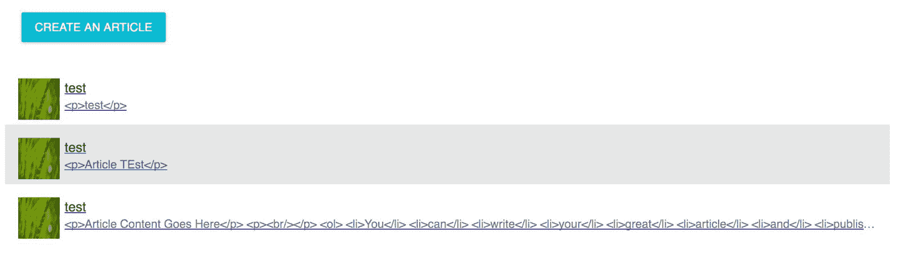

我们需要完成这些事情。在我们完成这些改进后，我们将进行一些重构。

# AWS S3 - 简介

亚马逊的 AWS S3 是亚马逊服务器上静态资产（如图片）的简单存储服务。它帮助您在云中托管安全、安全且高度可扩展的对象（如图片）。

在线存储静态资产的方法相当方便且简单--这就是为什么我们将在整本书中使用它。

我们将在我们的应用中使用它，因为它为我们提供了许多在托管图像资产时在自家的 Node.js 服务器上难以访问的可扩展性功能。

通常，Node.js 不应该用于托管比我们现在使用的更大的资产。甚至不要考虑在 Node.js 服务器上实现图像上传机制（根本不推荐）--我们将使用亚马逊的服务来处理。

# 生成密钥（访问密钥 ID 和秘密密钥）

在我们开始添加新的 S3 存储桶之前，我们需要为我们 AWS 账户生成密钥（`accessKeyId`和`secretAccessKey`）。

我们需要在 Node.js 应用中保留以下示例详细信息的集合：

```js
const awsConfig = { 
  accessKeyId: 'EXAMPLE_LB7XH_KEY_BGTCA', 
  secretAccessKey: 'ExAMpLe+KEY+FYliI9J1nvky5g2bInN26TCU+FiY', 
  region: 'us-west-2', 
  bucketKey: 'your-bucket-name-' 
};

```

亚马逊 S3 中的存储桶是什么？**存储桶**是您在亚马逊 S3 中拥有的文件的一种命名空间。您可以为不同的项目拥有几个存储桶。如您所见，我们的下一步将是创建与您的`accountDefine`和`bucketKey`（为我们文章的图片的命名空间）相关的`accessKeyId`和`secretAccessKey`。定义一个您希望物理存储文件的区域。如果您的项目指定了目标位置，这将加快图像的加载速度，并且通常可以减少延迟，因为图像将托管在离我们发布应用的客户端/用户更近的地方。

要创建 AWS 账户，请访问[`aws.amazon.com/`](https://aws.amazon.com/)：

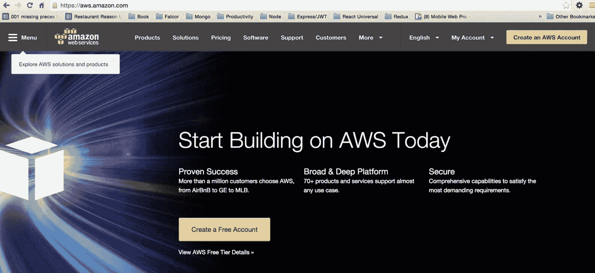

创建账户或登录您的账户：

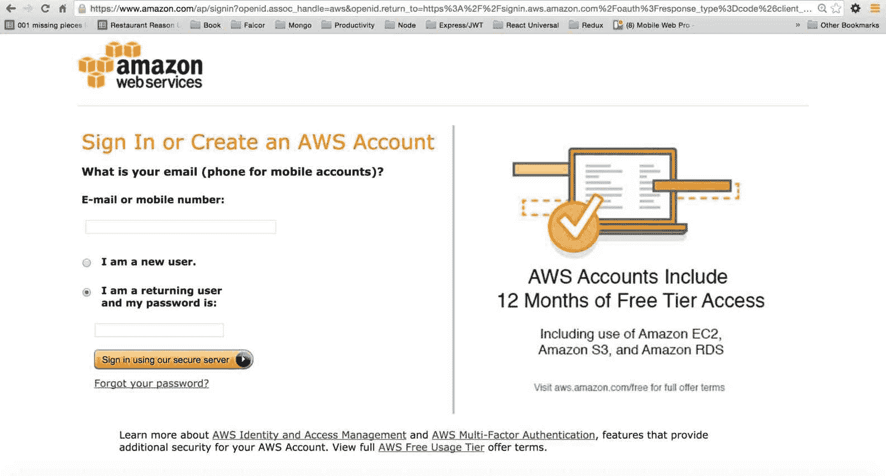

下一步是创建 IAM，将在下一节中详细介绍。

**关于 AWS 创建** 在您为某个区域创建账户后，如果您想创建一个 S3 存储桶，您需要选择与您的账户分配到相同区域的区域；否则，在以下页面设置 S3 时可能会遇到问题。

# IAM

让我们准备新的`accessKeyId`和`secretAccessKey`。你需要访问你的 Amazon 控制台中的 IAM 页面。你可以在服务列表中找到它：

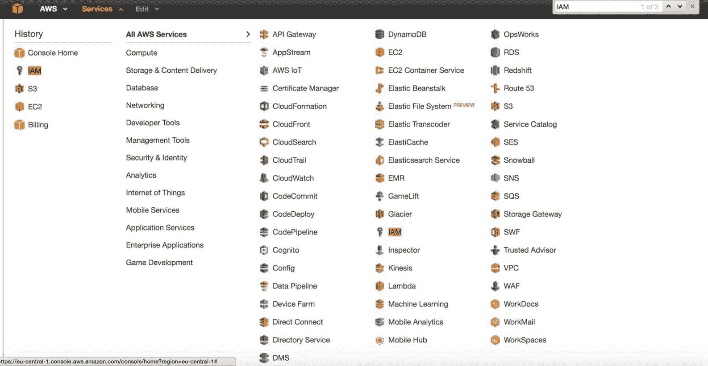

IAM 页面看起来像这样 ([`console.aws.amazon.com/iam/home?#home`](https://console.aws.amazon.com/iam/home?#home))：


前往 IAM 资源 | 用户：

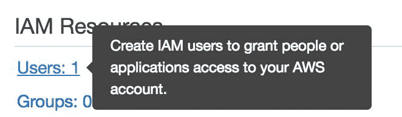

在下一页，你会看到一个按钮；点击它：


点击后，你会看到一个表单。至少填写一个用户，如截图所示（截图提供了你必须完成的精确步骤，即使在此期间 AWS 的用户体验已经改变）：

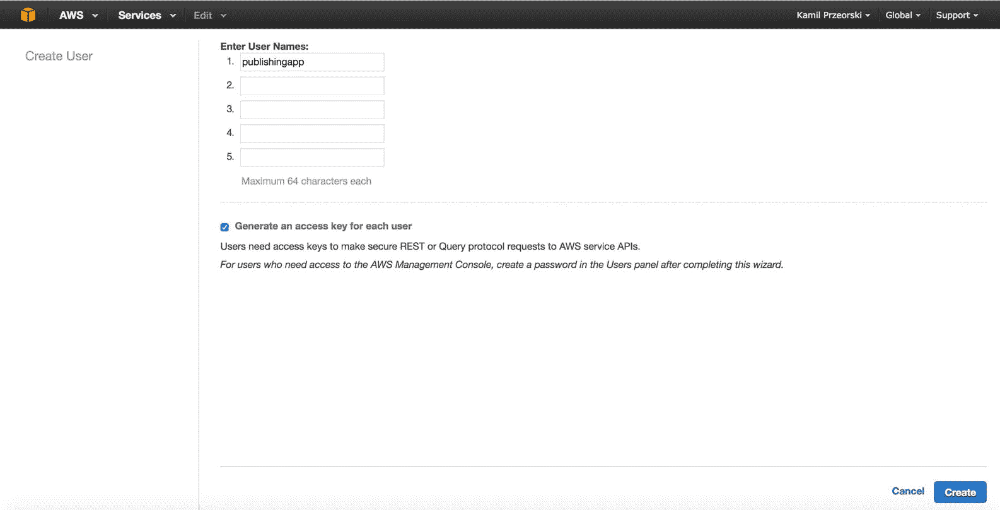

点击“创建”按钮后，将密钥复制到安全的地方（我们将在稍后使用它们）：

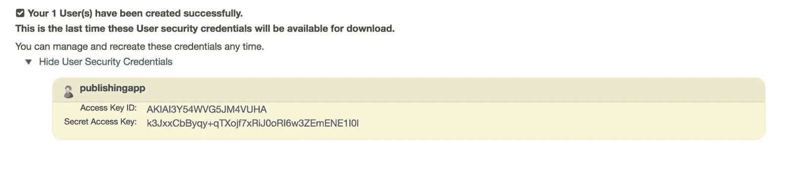

不要忘记复制密钥（访问密钥 ID 和秘密访问密钥）。你将在本书后面的代码中学习如何放置它们以使用 S3 服务。当然，截图中的密钥不是活动的；它们只是示例；你需要有自己的。

# 为用户设置 S3 权限

最后一步是按照以下步骤添加 AmazonS3FullAccess 权限：

1.  前往“权限”选项卡：

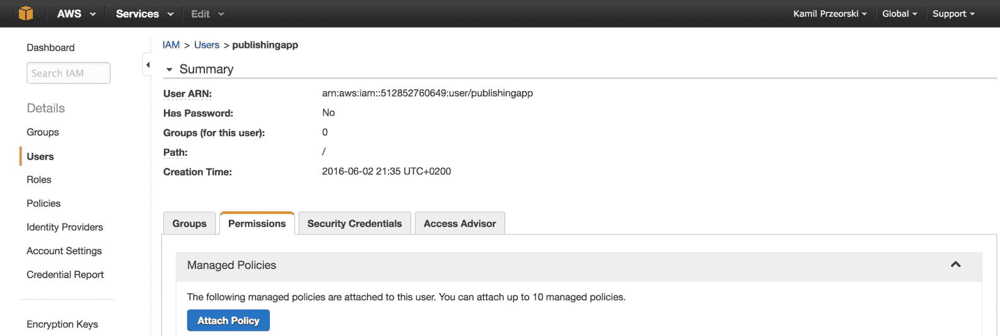

1.  点击“附加策略”并选择 AmazonS3FullAccessAfter。附加后，它将列在以下示例中：

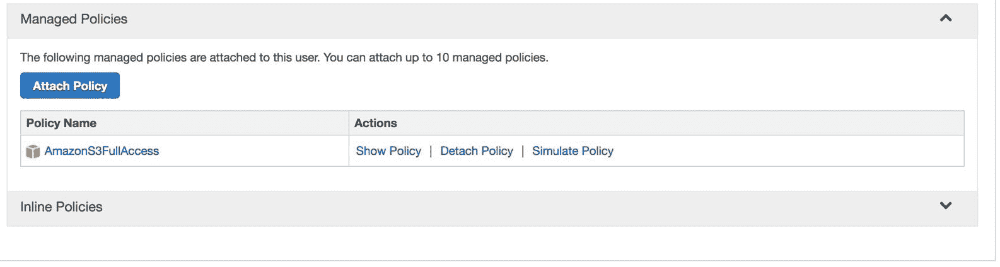

现在我们将进入创建用于图像文件的新存储桶。

1.  你已经完成了密钥的设置，并授予了密钥的 S3 策略；现在，我们需要准备将保存图像的存储桶。首先，你需要转到 AWS 控制台主页面，它看起来如下 ([`console.aws.amazon.com/console/home`](https://console.aws.amazon.com/console/home))：

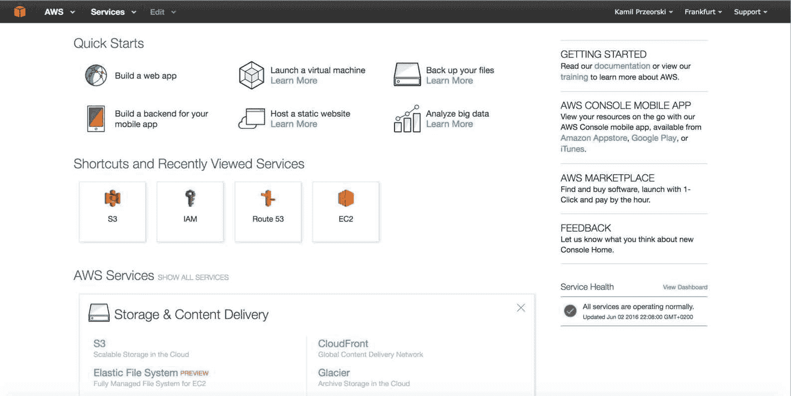

1.  你会看到类似 AWS 服务显示所有服务（或者，你可以像 IAM 一样从服务列表中找到它）的内容：

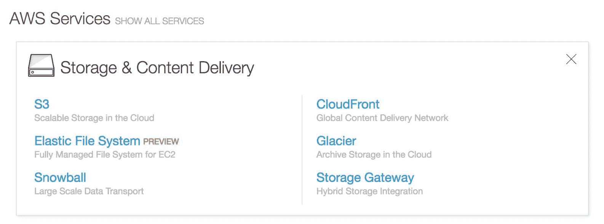

1.  在 S3 - 云可扩展存储（如前一张截图所示）上点击。之后，你会看到一个类似这样的视图（我这里有六个存储桶；当你有一个新账户时，你将有一个零）：

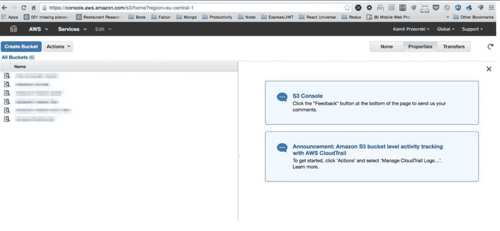

在该存储桶中，我们将保存我们文章的静态图像（你将在接下来的页面中了解具体方法）。

1.  通过点击“创建存储桶”按钮来创建一个存储桶：


1.  选择 publishing-app 名称（或者选择对你有效的其他名称）。

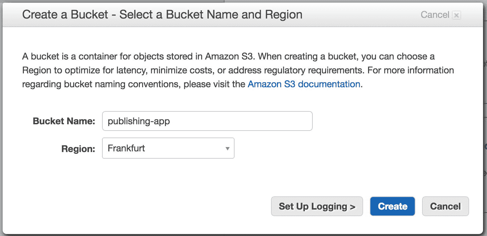

在截图中，我们选择了法兰克福。但是，例如，当你创建账户并且你的 URL 显示`"?region=us-west-2"`时，请选择俄勒冈州。在创建 S3 存储桶时，将账户分配到相应的区域是很重要的。

1.  存储桶创建完成后，从存储桶列表中点击它：


1.  以 publishing-app 名称命名的空存储桶看起来如下：

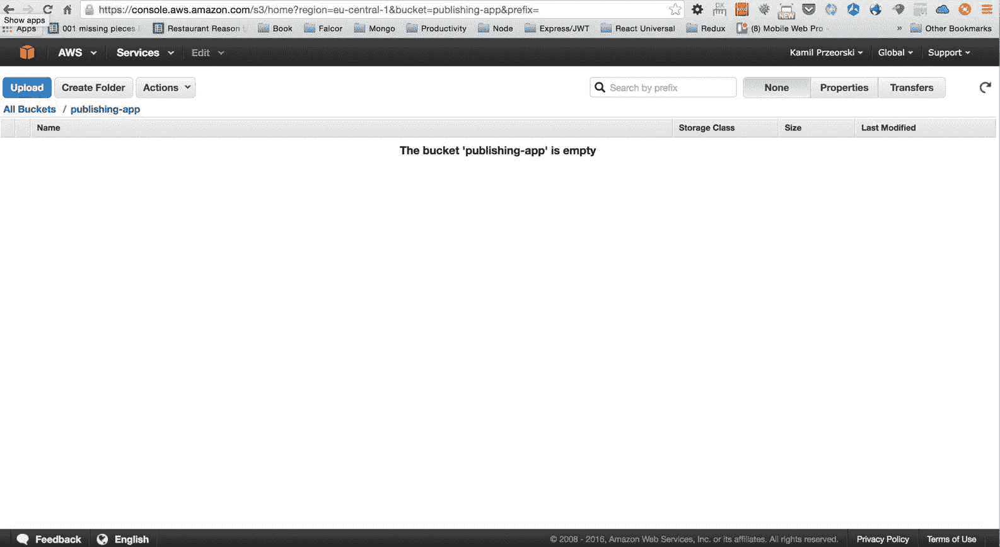

1.  当你在这个视图中时，浏览器中的 URL 会告诉你确切的区域和存储桶（这样你就可以在稍后进行后端配置时使用它）：

```js
        // just an example link to the bucket 
        https://console.aws.amazon.com/s3/home?region=eu-central-  
        1&bucket=publishing-app&prefix=

```

1.  最后，确保 publishing-app 存储桶的 CORS 配置正确。点击该视图中的“属性”选项卡，你将获得其详细视图：

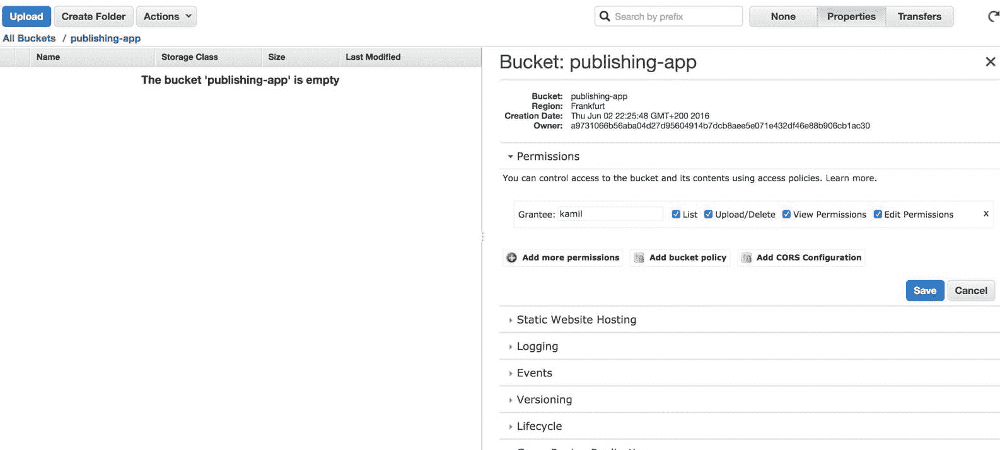

1.  然后，点击“添加 CORS”按钮：

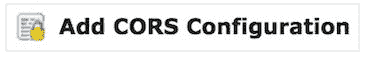

1.  之后，将以下内容粘贴到文本区域（以下为跨源资源共享定义；它定义了在同一个域中加载的 Pub 应用程序与 AWS 服务中不同域的资源交互的方式）：

```js
        <?xml version="1.0" encoding="UTF-8"?> 
        <CORSConfiguration title-page-name"/>         /doc/2006-03-01/"> 
            <CORSRule> 
                <AllowedOrigin>*</AllowedOrigin> 
                <AllowedMethod>GET</AllowedMethod> 
                <AllowedMethod>POST</AllowedMethod> 
                <AllowedMethod>PUT</AllowedMethod> 
                <MaxAgeSeconds>3000</MaxAgeSeconds> 
                <AllowedHeader>*</AllowedHeader> 
            </CORSRule> 
        </CORSConfiguration>

```

1.  它现在将看起来像以下示例：

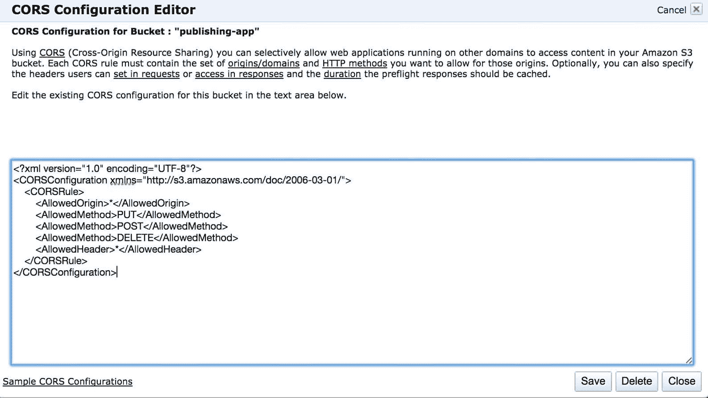

1.  点击“保存”按钮。完成所有步骤后，我们可以开始编写图像上传功能。

# 在 AddArticleView 中编写图像上传功能

在你能够继续之前，你需要有你在前几页创建的 S3 存储桶的访问详情。`AWS_ACCESS_KEY_ID`来自前一小节，我们在那个视图中创建了一个用户：

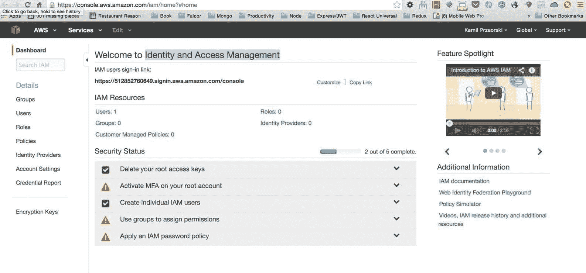

`AWS_SECRET_ACCESS_KEY`与 AWS 访问密钥相同（正如你从名称本身就可以猜到）。`AWS_BUCKET_NAME`是存储桶的名称（在我们的书中，我们称之为 publishing-app）。对于`AWS_REGION_NAME`，我们将使用`eu-central-1`。

要找到`AWS_BUCKET_NAME`和`AWS_REGION_NAME`的最简单方法是在你处于该视图（如前一小节所述）时查看 URL。


检查浏览器中的 URL：`https://console.aws.amazon.com/s3/home?region=eu-central-1#&bucket=publishing-app&prefix=`

区域和存储桶名称在 URL 中非常明显（我想强调这一点，因为你的区域和存储桶名称可能因你所在的位置而不同）。

此外，确保你的 CORS 设置正确，并且你的权限/附加策略与上述描述完全一致。否则，你可能会在以下子节中遇到问题。

# Node.js 中的环境变量

我们将通过 node 的环境变量传递所有四个参数（`AWS_ACCESS_KEY_ID`、`AWS_SECRET_ACCESS_KEY`、`AWS_BUCKET_NAME`和`AWS_REGION_NAME`）。

首先，让我们安装一个 node 库，它可以从文件中创建环境变量，这样我们就可以在本地主机中使用它们：

```js
npm i -save node-env-file@0.1.8

```

这些环境变量是什么？一般来说，我们将使用它们将一些敏感数据的变量传递给应用程序--我们在这里具体谈论的是当前环境设置（开发或生产）的 AWS 密钥和 MongoDB 的登录/密码信息。

你可以通过访问它们来读取这些环境变量，如下面的示例所示：

```js
// this is how we will access the variables in 
//the server.js for example: 
env.process.AWS_ACCESS_KEY_ID 
env.process.AWS_SECRET_ACCESS_KEY 
env.process.AWS_BUCKET_NAME 
env.process.AWS_REGION_NAME

```

在我们的本地开发环境中，我们将在服务器的目录中保留这些信息，所以从你的命令提示符执行此操作：

```js
$ [[you are in the server/ directory of your project]]
$ touch .env

```

你已经创建了一个`server/.env`文件；下一步是将内容放入其中（从该文件，`node-env-file`将在我们的应用程序运行时读取环境变量）：

```js
AWS_ACCESS_KEY_ID=_*_*_*_*_ACCESS_KEY_HERE_*_*_*_*_ 
AWS_SECRET_ACCESS_KEY=_*_*_*_*_SECRET_KEY_HERE_*_*_*_*_ 
AWS_BUCKET_NAME=publishing-app 
AWS_REGION_NAME=eu-central-1

```

在这里，你可以看到节点环境文件的结构。每一行新内容都包含一个键和值。在那里，你需要粘贴你在阅读本章时创建的键。将这些值替换为你自己的：`*_*_ACCESS_KEY_HERE_*_` 和 `_*_SECRET_KEY_HERE_**_`。

在你创建了 `server/.env` 文件后，安装所需的依赖项，该依赖项将抽象整个图像上传过程；在项目目录中使用 `npm` 进行此操作：

```js
npm i --save react-s3-uploader@3.0.3

```

`react-s3-uploader` 组件非常适合我们的用例，并且很好地抽象了 `aws-sdk` 的功能。这里的主要点是，我们需要正确配置 `.env` 文件（使用正确的变量），然后 `react-s3-uploader` 将为我们处理后端和前端的工作（正如你很快就会看到的）。

# 改进我们的 Mongoose 文章模式

我们需要改进模式，以便在我们的文章集合中有一个存储图片 URL 的位置。编辑旧的文章模式：

```js
// this is old codebase to improve: 
var articleSchema = new Schema({ 
    articleTitle: String, 
    articleContent: String, 
    articleContentJSON: Object 
  },  
  {  
    minimize: false  
  } 
);

```

更改为新的、改进的版本：

```js
var articleSchema = new Schema({ 
    articleTitle: String, 
    articleContent: String, 
    articleContentJSON: Object, 
    articlePicUrl: { type: String, default: 
     '/static/placeholder.png' } 
  },  
  {  
    minimize: false  
  } 
);

```

如你所见，我们引入了 `articlePicUrl`，默认值为 `/static/placeholder.png`。现在，我们将能够保存包含图片 URL 变量的文章对象。

如果你忘记更新 Mongoose 模型，那么它不会让你将此值保存到数据库中。

# 添加 S3 的上传路由

我们需要将一个新库导入到 `server/server.js` 文件中：

```js
import s3router from 'react-s3-uploader/s3router';

```

我们最终会得到以下内容：

```js
// don't write it, this is how your server/server.js 
 //file should look like: 
import http from 'http'; 
import express from 'express'; 
import cors from 'cors'; 
import bodyParser from 'body-parser'; 
import falcor from 'falcor'; 
import falcorExpress from 'falcor-express'; 
import FalcorRouter from 'falcor-router'; 
import routes from './routes.js'; 

import React from 'react' 
import { createStore } from 'redux' 
import { Provider } from 'react-redux' 
import { renderToStaticMarkup } from 'react-dom/server' 
import ReactRouter from 'react-router'; 
import { RoutingContext, match } from 'react-router'; 
import * as hist  from 'history'; 
import rootReducer from '../src/reducers'; 
import reactRoutes from '../src/routes'; 
import fetchServerSide from './fetchServerSide'; 

import s3router from 'react-s3-uploader/s3router'; 

var app = express(); 
app.server = http.createServer(app); 

// CORS - 3rd party middleware 
app.use(cors()); 

// This is required by falcor-express middleware 
// to work correctly with falcor-browser 
app.use(bodyParser.json({extended: false})); 
app.use(bodyParser.urlencoded({extended: false}));

```

我把所有这些都放在这里，这样你可以确保你的 `server/server.js` 文件与此匹配。

还有一件事要做，就是修改 `server/index.js` 文件。找到以下内容：

```js
require('babel-core/register'); 
require('babel-polyfill'); 
require('./server');

```

更改为以下改进版本：

```js
var env = require('node-env-file'); 
// Load any undefined ENV variables form a specified file. 
env(__dirname + '/.env'); 

require('babel-core/register'); 
require('babel-polyfill'); 
require('./server');

```

为了澄清，`env(__dirname + '/.env');` 告诉我们结构中 `.env` 文件的位置（你可以从 `console.log` 中找到，`__dirname` 变量是服务器文件的系统位置--这必须与真实的 `.env` 文件位置匹配，以便系统能够找到它）。

下一步是将以下内容添加到我们的 `server/server.js` 文件中：

```js
app.use('/s3', s3router({ 
  bucket: process.env.AWS_BUCKET_NAME, 
  region: process.env.AWS_REGION_NAME, 
  signatureVersion: 'v4', 
  headers: {'Access-Control-Allow-Origin': '*'},  
  ACL: 'public-read' 
}));

```

如你所见，我们已经开始使用在 `server/.env` 文件中定义的环境变量。对我来说，`process.env.AWS_BUCKET_NAME` 等于 `publishing-app`，但如果你定义了不同的值，那么它将从 `server/.env` 中检索另一个值（多亏了我们刚刚定义的 `env` express 中间件）。

基于那个后端配置（环境变量和通过 `import s3router from 'react-s3-uploader/s3router'` 设置 `s3router`），我们将能够使用 AWS S3 存储桶。我们需要准备前端，这首先将在添加文章视图上实现。

# 在前端创建 ImgUploader 组件

我们将创建一个名为 `ImgUploader` 的组件。这个组件将使用 `react-s3-uploader` 库，该库负责将上传抽象到 Amazon S3。在回调中，你将收到 `information:onProgress`，你可以通过那个回调找到百分比进度，所以用户可以看到上传的状态。当发生错误时，这个回调会被触发：这个回调会发送给我们已上传到 S3 的文件的位置。

你将在后续章节中了解更多细节；让我们先创建一个文件：

```js
    $ [[you are in the src/components/articles directory of your   
    project]]
$ touch ImgUploader.js

```

你已经创建了 `src/components/articles/ImgUploader.js` 文件，下一步是准备导入。所以，将以下内容添加到 `ImgUploader` 文件的顶部：

```js
import React from 'react'; 
import ReactS3Uploader from 'react-s3-uploader'; 
import {Paper} from 'material-ui'; 

class ImgUploader extends React.Component { 
  constructor(props) { 
    super(props); 
    this.uploadFinished = this.uploadFinished.bind(this); 

    this.state = { 
      uploadDetails: null, 
      uploadProgress: null, 
      uploadError: null, 
      articlePicUrl: props.articlePicUrl 
    }; 
  } 

  uploadFinished(uploadDetails) { 
    // here will be more code in a moment 
  } 

  render () { 
    return <div>S3 Image uploader placeholder</div>; 
  } 
} 

ImgUploader.propTypes = {  
  updateImgUrl: React.PropTypes.func.isRequired  
}; 
export default ImgUploader;

```

如您所见，我们在 `render` 函数中初始化了 `ImgUploader` 组件，使用 `div` 返回一个临时的占位符。

我们还准备了 `propTypes`，其中有一个名为 `updateImgUrl` 的必需属性。这将是一个回调函数，它将发送最终上传的图像的位置（必须保存在数据库中--我们将在稍后使用这个 `updateImgUrl` 属性）。

在那个 `ImgUploader` 组件的状态中，我们有以下内容：

```js
// this is already in your codebase: 
this.state = { 
  uploadDetails: null, 
  uploadProgress: null, 
  uploadError: null, 
  articlePicUrl: props.articlePicUrl 
};

```

在这些变量中，我们将存储我们组件的所有状态，根据当前状态和 `props.articlePicUrl`，并将 URL 细节发送到 `AddArticleView` 组件（我们将在本章稍后，在完成 `ImgUploader` 组件后完成）。

# 总结 `ImgUploader` 组件

下一步是改进 `ImgUploader` 中的 `uploadFinished` 函数，所以找到旧的空函数：

```js
 uploadFinished(uploadDetails) { 
    // here will be more code in a moment 
  }

```

用以下内容替换它：

```js
 uploadFinished(uploadDetails) { 
    let articlePicUrl = '/s3/img/'+uploadDetails.filename; 
    this.setState({  
      uploadProgress: null, 
      uploadDetails:  uploadDetails, 
      articlePicUrl: articlePicUrl 
    }); 
    this.props.updateImgUrl(articlePicUrl); 
  }

```

如您所见，`uploadDetails.filename` 变量来自我们导入到 `ImgUploader` 文件顶部的 `ReactS3Uploader` 组件。在上传成功后，我们将 `uploadProgress` 重置为 `null`，设置上传的详细信息，并通过回调使用 `this.props.updateImgUrl(articlePicUrl)` 发送详细信息。

下一步是改进 `ImgUploader` 中的 `render` 函数：

```js
 render () { 
    let imgUploadProgressJSX; 
    let uploadProgress = this.state.uploadProgress; 
    if(uploadProgress) { 
      imgUploadProgressJSX = ( 
          <div> 
            {uploadProgress.uploadStatusText} 
({uploadProgress.progressInPercent}%) 
          </div> 
        ); 
    } else if(this.state.articlePicUrl) { 
      let articlePicStyles = { 
        maxWidth: 200,  
        maxHeight: 200,  
        margin: 'auto' 
      }; 
      imgUploadProgressJSX = ; 
    } 

    return <div>S3 Image uploader placeholder</div>; 
  }

```

这个渲染过程还不完整，但让我们描述一下到目前为止我们已经添加了什么。代码主要是通过 `this.state`（第一个 `if` 语句）获取 `uploadProgress` 的信息。`else if(this.state.articlePicUrl)` 是关于在上传完成后渲染图像的内容。好吧，但我们从哪里获取这些信息呢？下面是其余部分：

```js
   let uploaderJSX = ( 
        <ReactS3Uploader 
        signingUrl='/s3/sign' 
        accept='image/*' 
          onProgress={(progressInPercent, uploadStatusText) => { 
            this.setState({  
              uploadProgress: { progressInPercent,  
              uploadStatusText },  
              uploadError: null 
            }); 
          }}  
          onError={(errorDetails) => { 
            this.setState({  
              uploadProgress: null, 
              uploadError: errorDetails 
            }); 
          }} 
          onFinish={(uploadDetails) => { 
            this.uploadFinished(uploadDetails); 
          }} /> 
      );

```

`uploaderJSX` 变量与我们的 `react-s3-uploader` 库完全相同。从代码中可以看出，对于进度，我们使用 `uploadProgress: { progressInPercent, uploadStatusText }` 来设置状态，并设置 `uploadError: null`（以防用户收到错误消息）。在出错时，我们设置状态，以便告知用户。在完成时，我们运行 `uploadFinished` 函数，该函数之前已经详细描述过。

`ImgUploader` 的完整 `render` 函数将如下所示：

```js
 render () { 
    let imgUploadProgressJSX; 
    let uploadProgress = this.state.uploadProgress; 
    if(uploadProgress) { 
      imgUploadProgressJSX = ( 
          <div> 
            {uploadProgress.uploadStatusText} 
             ({uploadProgress.progressInPercent}%) 
          </div> 
        ); 
    } else if(this.state.articlePicUrl) { 
      let articlePicStyles = { 
        maxWidth: 200,  
        maxHeight: 200,  
        margin: 'auto' 
      }; 
      imgUploadProgressJSX = ; 
    } 

    let uploaderJSX = ( 
        <ReactS3Uploader 
        signingUrl='/s3/sign' 
        accept='image/*' 
          onProgress={(progressInPercent, uploadStatusText) => { 
            this.setState({  
              uploadProgress: { progressInPercent, 
               uploadStatusText },  
              uploadError: null 
            }); 
          }}  
          onError={(errorDetails) => { 
            this.setState({  
              uploadProgress: null, 
              uploadError: errorDetails 
            }); 
          }} 
          onFinish={(uploadDetails) => { 
            this.uploadFinished(uploadDetails); 
          }} /> 
      ); 

    return ( 
      <Paper zDepth={1} style={{padding: 32, margin: 'auto', 
       width: 300}}> 
        {imgUploadProgressJSX} 
        {uploaderJSX} 
      </Paper> 
    ); 
  }

```

如您所见，这是`ImgUploader`的全部渲染。我们使用内联样式的`Paper`组件（来自`material-ui`），这样整个界面对于文章的最终用户/编辑来说会看起来更好。

# AddArticleView 改进

我们需要将`ImgUploader`组件添加到`AddArticleView`中；首先，我们需要将其导入到`src/views/articles/AddArticleView.js`文件中，如下所示：

```js
import ImgUploader from '../../components/articles/ImgUploader';

```

接下来，在`AddArticleView`的构造函数中找到以下旧代码：

```js
// this is old, don't write it: 
class AddArticleView extends React.Component { 
  constructor(props) { 
    super(props); 
    this._onDraftJSChange = this._onDraftJSChange.bind(this); 
    this._articleSubmit = this._articleSubmit.bind(this); 

    this.state = { 
      title: 'test', 
      contentJSON: {}, 
      htmlContent: '', 
      newArticleID: null 
    }; 
  }

```

更改为以下改进版本：

```js
class AddArticleView extends React.Component { 
  constructor(props) { 
    super(props); 
    this._onDraftJSChange = this._onDraftJSChange.bind(this); 
    this._articleSubmit = this._articleSubmit.bind(this); 
    this.updateImgUrl = this.updateImgUrl.bind(this); 

    this.state = { 
      title: 'test', 
      contentJSON: {}, 
      htmlContent: '', 
      newArticleID: null, 
      articlePicUrl: '/static/placeholder.png' 
    }; 
  }

```

如您所见，我们已经将其绑定到`updateImgUrl`函数，并添加了一个新的状态变量`articlePicUrl`（默认情况下，我们将指向`/static/placeholder.png`，以防用户没有选择封面）。

让我们改进这个组件的功能：

```js
// this is old codebase, just for your reference: 
  async _articleSubmit() { 
    let newArticle = { 
      articleTitle: this.state.title, 
      articleContent: this.state.htmlContent, 
      articleContentJSON: this.state.contentJSON 
    } 

    let newArticleID = await falcorModel 
      .call( 
            'articles.add', 
            [newArticle] 
          ). 
      then((result) => { 
        return falcorModel.getValue( 
            ['articles', 'newArticleID'] 
          ).then((articleID) => { 
            return articleID; 
          }); 
      }); 

    newArticle['_id'] = newArticleID; 
    this.props.articleActions.pushNewArticle(newArticle); 
    this.setState({ newArticleID: newArticleID}); 
  }

```

将此代码更改为以下内容：

```js
 async _articleSubmit() { 
    let newArticle = { 
      articleTitle: this.state.title, 
      articleContent: this.state.htmlContent, 
      articleContentJSON: this.state.contentJSON, 
      articlePicUrl: this.state.articlePicUrl 
    } 

    let newArticleID = await falcorModel 
      .call( 
            'articles.add', 
            [newArticle] 
          ). 
      then((result) => { 
        return falcorModel.getValue( 
            ['articles', 'newArticleID'] 
          ).then((articleID) => { 
            return articleID; 
          }); 
      }); 

    newArticle['_id'] = newArticleID; 
    this.props.articleActions.pushNewArticle(newArticle); 
    this.setState({ newArticleID: newArticleID }); 
  } 

  updateImgUrl(articlePicUrl) { 
    this.setState({  
      articlePicUrl: articlePicUrl 
    }); 
  }

```

如您所见，我们已经将`articlePicUrl: this.state.articlePicUrl`添加到`newArticle`对象中。我们还引入了一个名为`updateImgUrl`的新函数，它是一个简单的回调，用于设置一个新的状态，包含`articlePicUrl`变量（在`this.state.articlePicUrl`中，我们保留即将保存到数据库的当前文章的图片 URL）。

在`src/views/articles/AddArticleView.js`中需要改进的只有我们当前的渲染。以下是旧版本：

```js
// your current old codebase to improve: 
    return ( 
      <div style={{height: '100%', width: '75%', margin: 'auto'}}> 
        <h1>Add Article</h1> 
        <WYSIWYGeditor 
          name='addarticle' 
          title='Create an article' 
          onChangeTextJSON={this._onDraftJSChange} /> 
          <RaisedButton 
            onClick={this._articleSubmit} 
            secondary={true} 
            type='submit' 
            style={{margin: '10px auto', display: 'block', 
             width: 150}} 
            label={'Submit Article'} /> 
      </div> 
    ); 
  }

```

我们需要使用`ImgUploader`改进此代码：

```js
   return ( 
      <div style={{height: '100%', width: '75%', margin: 'auto'}}> 
        <h1>Add Article</h1> 
        <WYSIWYGeditor 
          name='addarticle' 
          title='Create an article' 
          onChangeTextJSON={this._onDraftJSChange} /> 

        <div style={{margin: '10px 10px 10px 10px'}}>  
          <ImgUploader  
              updateImgUrl={this.updateImgUrl}  
              articlePicUrl={this.state.articlePicUrl} /> 
        </div> 

        <RaisedButton 
          onClick={this._articleSubmit} 
          secondary={true} 
          type='submit' 
          style={{margin: '10px auto', display: 'block', 
           width: 150}} 
          label={'Submit Article'} /> 
      </div> 
    ); 
  }

```

您可以看到，我们使用属性发送当前的`articlePicUrl`（这将在以后很有用，并且也会给我们提供默认的`placeholder.png`位置）以及更新`img` URL 的回调，称为`updateImgUrl`。

如果您访问`http://localhost:3000/add-article`，您将在 WYSIWYG 框和提交文章按钮之间看到一个新图像选择器（查看截图）：

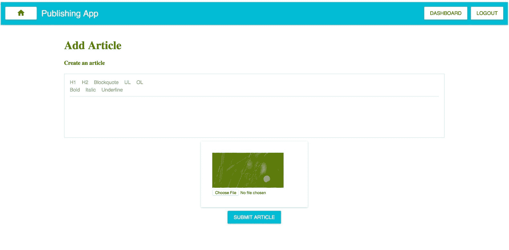

当然，如果您正确地遵循了所有指示，在点击选择文件后，您将能够上传新的图片到 S3 存储桶，缩略图中的图片将被替换，如下例所示：

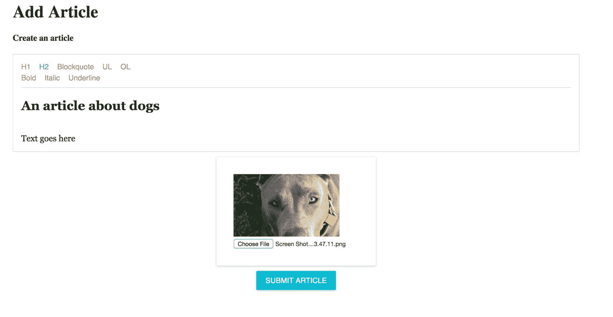

如您所见，我们可以上传图片。下一步是取消模拟查看，这样我们就可以看到我们的文章封面有一只狗（并且狗的图片来自数据库中的文章集合）。

# 对 PublishingApp、ArticleCard 和 DashboardView 的一些剩余调整

我们可以添加一篇文章。我们需要取消模拟视图中的图片 URL，这样我们就可以看到数据库中的真实 URL（而不是在`img src`属性中模拟）。

让我们从`src/layouts/PublishingApp.js`开始，改进旧版的`_fetch`函数：

```js
// old codebase to improve: 
  async _fetch() { 
    let articlesLength = await falcorModel. 
      getValue('articles.length'). 
      then((length) =>  length); 

    let articles = await falcorModel. 
      get(['articles', {from: 0, to: articlesLength-1}, 
      ['_id','articleTitle', 'articleContent', 
      'articleContentJSON']]).  
      then((articlesResponse) => {   
        return articlesResponse.json.articles; 
      }).catch(e => { 
        return 500; 
      }); 

    if(articles === 500) { 
      return; 
    } 

    this.props.articleActions.articlesList(articles); 
  }

```

将此代码替换为以下内容：

```js
 async _fetch() { 
    let articlesLength = await falcorModel. 
      getValue('articles.length'). 
      then((length) => length); 

    let articles = await falcorModel. 
      get(['articles', {from: 0, to: articlesLength-1}, 
       ['_id','articleTitle', 'articleContent', 
       'articleContentJSON', 'articlePicUrl']]).  
      then((articlesResponse) => {   
        return articlesResponse.json.articles; 
      }).catch(e => { 
        console.debug(e); 
        return 500; 
      }); 

    if(articles === 500) { 
      return; 
    } 

    this.props.articleActions.articlesList(articles); 
  }

```

如您所见，我们已经开始通过`falcorModel.get`方法获取`articlePicUrl`。

下一步，同样在`PublishingApp`文件中，是改进`render`函数，因此您需要改进以下代码：

```js
// old code: 
    this.props.article.forEach((articleDetails, articleKey) => { 
      let currentArticleJSX = ( 
        <div key={articleKey}> 
          <ArticleCard  
            title={articleDetails.articleTitle} 
            content={articleDetails.articleContent} /> 
        </div> 
      );

```

向其中添加一个新的属性，该属性将传递图片 URL：

```js
   this.props.article.forEach((articleDetails, articleKey) => { 
      let currentArticleJSX = ( 
        <div key={articleKey}> 
          <ArticleCard  
            title={articleDetails.articleTitle} 
            content={articleDetails.articleContent}  
            articlePicUrl={articleDetails.articlePicUrl} /> 
        </div> 
      );

```

如您所见，我们正在将获取的`articlePicUrl`传递给`ArticleCard`组件。

# 改进 ArticleCard 组件

在我们通过属性传递`articlePicUrl`变量之后，我们需要改进以下内容（`src/components/ArticleCard.js`）：

```js
// old code to improve: 
  render() { 
    let title = this.props.title || 'no title provided'; 
    let content = this.props.content || 'no content provided'; 

    let paperStyle = { 
      padding: 10,  
      width: '100%',  
      height: 300 
    }; 

    let leftDivStyle = { 
      width: '30%',  
      float: 'left' 
    } 

    let rightDivStyle = { 
      width: '60%',  
      float: 'left',  
      padding: '10px 10px 10px 10px' 
    } 

    return ( 
      <Paper style={paperStyle}> 
        <CardHeader 
          title={this.props.title} 
          subtitle='Subtitle' 
          avatar='/static/avatar.png' 
        /> 

        <div style={leftDivStyle}> 
          <Card > 
            <CardMedia 
              overlay={<CardTitle title={title} 
               subtitle='Overlay subtitle' />}> 
               
            </CardMedia> 
          </Card> 
        </div> 
        <div style={rightDivStyle}> 
          <div dangerouslySetInnerHTML={{__html: content}} /> 
        </div> 
      </Paper>); 
  }

```

改成以下内容：

```js
 render() { 
    let title = this.props.title || 'no title provided'; 
    let content = this.props.content || 'no content provided'; 
    let articlePicUrl = this.props.articlePicUrl || 
     '/static/placeholder.png'; 

    let paperStyle = { 
      padding: 10,  
      width: '100%',  
      height: 300 
    }; 

    let leftDivStyle = { 
      width: '30%',  
      float: 'left' 
    } 

    let rightDivStyle = { 
      width: '60%',  
      float: 'left',  
      padding: '10px 10px 10px 10px' 
    } 

    return ( 
      <Paper style={paperStyle}> 
        <CardHeader 
          title={this.props.title} 
          subtitle='Subtitle' 
          avatar='/static/avatar.png' 
        /> 

        <div style={leftDivStyle}> 
          <Card > 
            <CardMedia 
              overlay={<CardTitle title={title} 
               subtitle='Overlay subtitle' />}> 
               
            </CardMedia> 
          </Card> 
        </div> 
        <div style={rightDivStyle}> 
          <div dangerouslySetInnerHTML={{__html: content}} /> 
        </div> 
      </Paper>); 
  }

```

在`render`的开始处，我们使用`let articlePicUrl = this.props.articlePicUrl || '/static/placeholder.png';`，稍后，我们在我们的图像的 JSX 中使用它（`img src={articlePicUrl} height='190'`）。

在这两个更改之后，您可以看到带有真实封面的文章，如下所示：

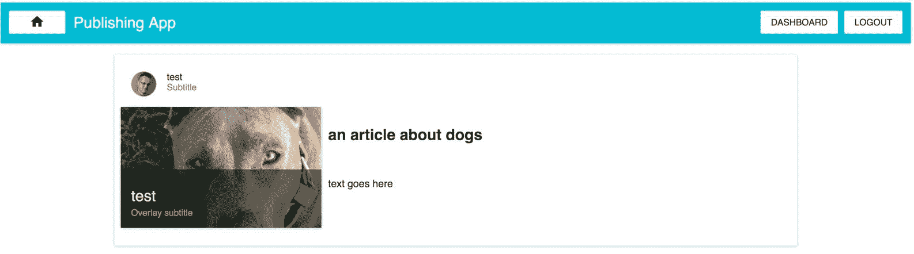

# 改进 DashboardView 组件

让我们通过封面改进仪表板，所以请在`src/views/DashboardView.js`中找到以下代码：

```js
// old code: 
  render () { 
    let articlesJSX = []; 
    this.props.article.forEach((articleDetails, articleKey) => { 
      let currentArticleJSX = ( 
        <Link  
          to={&grave;/edit-article/${articleDetails['_id']}&grave;}  
          key={articleKey}> 
          <ListItem 

            leftAvatar={} 
            primaryText={articleDetails.articleTitle} 
            secondaryText={articleDetails.articleContent} 
          /> 
        </Link> 
      ); 

      articlesJSX.push(currentArticleJSX); 
    }); 
    // below is rest of the render's function

```

用以下内容替换它：

```js
 render () { 
    let articlesJSX = []; 
    this.props.article.forEach((articleDetails, articleKey) => { 
      let articlePicUrl = articleDetails.articlePicUrl || 
       '/static/placeholder.png'; 
      let currentArticleJSX = ( 
        <Link  
                to={&grave;/edit-article/${articleDetails['_id']}&grave;}  
key={articleKey}> 
          <ListItem 

            leftAvatar={} 
            primaryText={articleDetails.articleTitle} 
            secondaryText={articleDetails.articleContent} 
          /> 
        </Link> 
      ); 

      articlesJSX.push(currentArticleJSX); 
    }); 
    // below is rest of the render's function

```

如您所见，我们已经将模拟占位符替换为真实的封面照片，因此在我们的文章仪表板（在登录后可用）中，我们将找到真实的缩略图。

# 编辑文章的封面照片

关于文章的照片，我们需要在`src/views/articles/EditArticleView.js`文件中做一些改进，例如导入`ImgUploader`：

```js
import ImgUploader from '../../components/articles/ImgUploader';

```

在您导入`ImgUploader`之后，改进`EditArticleView`的构造函数。找到以下代码：

```js
// old code to improve: 
class EditArticleView extends React.Component { 
  constructor(props) { 
    super(props); 
    this._onDraftJSChange = this._onDraftJSChange.bind(this); 
    this._articleEditSubmit = this._articleEditSubmit.bind(this); 
    this._fetchArticleData = this._fetchArticleData.bind(this); 
    this._handleDeleteTap = this._handleDeleteTap.bind(this); 
    this._handleDeletion = this._handleDeletion.bind(this); 
    this._handleClosePopover = 
     this._handleClosePopover.bind(this); 

    this.state = { 
      articleFetchError: null, 
      articleEditSuccess: null, 
      editedArticleID: null, 
      articleDetails: null, 
      title: 'test', 
      contentJSON: {}, 
      htmlContent: '', 
      openDelete: false, 
      deleteAnchorEl: null 
    }; 
  }

```

用以下改进的构造函数替换它：

```js
class EditArticleView extends React.Component { 
  constructor(props) { 
    super(props); 
    this._onDraftJSChange = this._onDraftJSChange.bind(this); 
    this._articleEditSubmit = this._articleEditSubmit.bind(this); 
    this._fetchArticleData = this._fetchArticleData.bind(this); 
    this._handleDeleteTap = this._handleDeleteTap.bind(this); 
    this._handleDeletion = this._handleDeletion.bind(this); 
    this._handleClosePopover = 
     this._handleClosePopover.bind(this); 
    this.updateImgUrl = this.updateImgUrl.bind(this); 

    this.state = { 
      articleFetchError: null, 
      articleEditSuccess: null, 
      editedArticleID: null, 
      articleDetails: null, 
      title: 'test', 
      contentJSON: {}, 
      htmlContent: '', 
      openDelete: false, 
      deleteAnchorEl: null, 
      articlePicUrl: '/static/placeholder.png' 
    }; 
  }

```

如您所见，我们已经将其绑定到新的`updateImgUrl`函数（它将是`ImgUploader`的回调），并为`articlePicUrl`创建了一个新的默认状态。

下一步是改进当前`_fetchArticleData`函数：

```js
// this is old already in your codebase: 
  _fetchArticleData() { 
    let articleID = this.props.params.articleID; 
    if(typeof window !== 'undefined' && articleID) { 
        let articleDetails = this.props.article.get(articleID); 
        if(articleDetails) { 
          this.setState({  
            editedArticleID: articleID,  
            articleDetails: articleDetails 
          }); 
        } else { 
          this.setState({ 
            articleFetchError: true 
          }) 
        } 
    } 
  }

```

用以下改进的代码替换它：

```js
 _fetchArticleData() { 
    let articleID = this.props.params.articleID; 
    if(typeof window !== 'undefined' && articleID) { 
        let articleDetails = this.props.article.get(articleID); 
        if(articleDetails) { 
          this.setState({  
            editedArticleID: articleID,  
            articleDetails: articleDetails, 
            articlePicUrl: articleDetails.articlePicUrl, 
            contentJSON: articleDetails.articleContentJSON, 
            htmlContent: articleDetails.articleContent 
          }); 
        } else { 
          this.setState({ 
            articleFetchError: true 
          }) 
        } 
    } 
  }

```

在这里，我们在初始获取中添加了一些新的`this.setState`变量，例如`articlePicUrl`、`contentJSON`和`htmlContent`。文章获取在这里是因为我们需要在`ImgUploader`中设置一个可能被更改的当前图像的封面。`contentJSON`和`htmlContent`在这里是为了以防用户在 WYSIWYG 编辑器中没有进行任何编辑，我们需要从数据库中获取默认值（否则，编辑按钮会将空值保存到数据库中，并破坏整个编辑体验）。

让我们改进`_articleEditSubmit`函数。这是旧代码：

```js
// old code to improve: 
  async _articleEditSubmit() { 
    let currentArticleID = this.state.editedArticleID; 
    let editedArticle = { 
      _id: currentArticleID, 
      articleTitle: this.state.title, 
      articleContent: this.state.htmlContent, 
      articleContentJSON: this.state.contentJSON 
    // striped code for our convience

```

改成以下改进版本：

```js
  async _articleEditSubmit() { 
    let currentArticleID = this.state.editedArticleID; 
    let editedArticle = { 
      _id: currentArticleID, 
      articleTitle: this.state.title, 
      articleContent: this.state.htmlContent, 
      articleContentJSON: this.state.contentJSON, 
      articlePicUrl: this.state.articlePicUrl 
    } 
    // striped code for our convenience

```

下一步是为`EditArticleView`组件添加一个新函数：

```js
 updateImgUrl(articlePicUrl) { 
    this.setState({  
      articlePicUrl: articlePicUrl 
    }); 
  }

```

为了完成文章编辑封面，最后一步是改进旧的渲染：

```js
// old code to improve: 
    let initialWYSIWYGValue = 
     this.state.articleDetails.articleContentJSON; 

    return ( 
      <div style={{height: '100%', width: '75%', margin: 'auto'}}> 
        <h1>Edit an existing article</h1> 
        <WYSIWYGeditor 
          initialValue={initialWYSIWYGValue} 
          name='editarticle' 
          title='Edit an article' 
          onChangeTextJSON={this._onDraftJSChange} /> 

        <RaisedButton 
          onClick={this._articleEditSubmit} 
          secondary={true} 
          type='submit' 
          style={{margin: '10px auto', 
           display: 'block', width: 150}} 
          label={'Submit Edition'} /> 
        <hr />

```

用以下内容替换它：

```js
   let initialWYSIWYGValue = 
    this.state.articleDetails.articleContentJSON; 

    return ( 
      <div style={{height: '100%', width: '75%', margin: 'auto'}}> 
        <h1>Edit an existing article</h1> 
        <WYSIWYGeditor 
          initialValue={initialWYSIWYGValue} 
          name='editarticle' 
          title='Edit an article' 
          onChangeTextJSON={this._onDraftJSChange} /> 

        <div style={{margin: '10px 10px 10px 10px'}}>  
          <ImgUploader updateImgUrl={this.updateImgUrl} 
           articlePicUrl={this.state.articlePicUrl} /> 
        </div> 

        <RaisedButton 
          onClick={this._articleEditSubmit} 
          secondary={true} 
          type='submit' 
          style={{margin: '10px auto', 
           display: 'block', width: 150}} 
          label={'Submit Edition'} /> 
        <hr/>

```

如您所见，我们已经添加了`ImgUploader`并将其样式设置为与`AddArticleView`中完全相同。`ImgUploader`的其余部分为我们完成工作，以便我们的用户可以编辑文章照片。

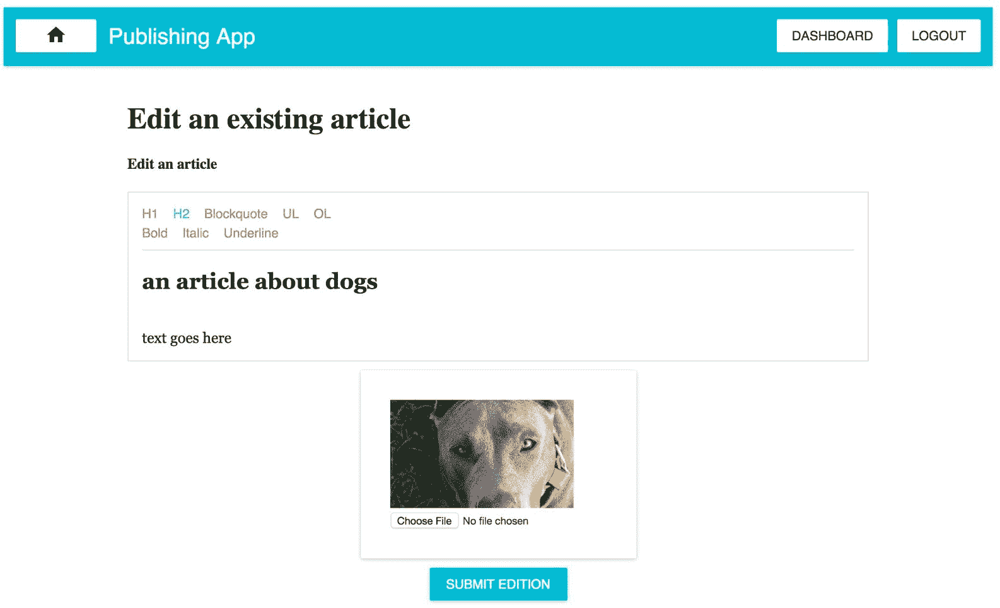

在这个屏幕截图中，您可以看到经过最近的所有改进后编辑视图应该是什么样子。

# 添加添加/编辑文章标题和副标题的功能

通常，我们应在`server/configMongoose.js`文件中改进文章模型。首先找到以下代码：

```js
// old codebase: 
var articleSchema = new Schema({ 
    articleTitle: String, 
    articleContent: String, 
    articleContentJSON: Object, 
    articlePicUrl: { type: String, default: 
     '/static/placeholder.png' } 
  },  
  {  
    minimize: false  
  } 
);

```

用以下改进的代码替换它，如下所示：

```js
var defaultDraftJSobject = { 
    'blocks' : [], 
    'entityMap' : {} 
} 

var articleSchema = new Schema({ 
    articleTitle: { type: String, required: true, default: 
     'default article title' }, 
    articleSubTitle: { type: String, required: true, default: 
     'default subtitle' }, 
    articleContent: { type: String, required: true, default: 
     'default content' }, 
    articleContentJSON: { type: Object, required: true, default: 
     defaultDraftJSobject }, 
    articlePicUrl: { type: String, required: true, default: 
     '/static/placeholder.png' } 
  },  
  {  
    minimize: false  
  } 
);

```

如您所见，我们在我们的模型中添加了许多必需的属性；这将影响保存不完整对象的能力，所以一般来说，我们的模型将在我们的发布应用的生命周期中保持一致性。

我们还在我们的模型中添加了一个新的属性，名为 `articleSubTitle`，我们将在本章的后面使用它。

# AddArticleView 的改进

通常，我们将添加两个 `DefaultInput` 组件（标题和副标题），整个表单将使用 `formsy-react`，所以请在 `src/views/articles/AddArticleView.js` 中添加新的导入：

```js
import DefaultInput from '../../components/DefaultInput'; 
import Formsy from 'formsy-react';

```

下一步是改进 `async _articleSubmit`，所以更改旧代码：

```js
// old code to improve: 
  async _articleSubmit() { 
    let newArticle = { 
      articleTitle: articleModel.title, 
      articleContent: this.state.htmlContent, 
      articleContentJSON: this.state.contentJSON, 
      articlePicUrl: this.state.articlePicUrl 
    } 

    let newArticleID = await falcorModel 
      .call( 
            'articles.add', 
            [newArticle] 
          ). 
          // rest code below is striped

```

用以下内容替换它：

```js
  async _articleSubmit(articleModel) { 
    let newArticle = { 
      articleTitle: articleModel.title, 
      articleSubTitle: articleModel.subTitle, 
      articleContent: this.state.htmlContent, 
      articleContentJSON: this.state.contentJSON, 
      articlePicUrl: this.state.articlePicUrl 
    } 

    let newArticleID = await falcorModel 
      .call( 
            'articles.add', 
            [newArticle] 
          ).

```

如您所见，我们在 `_articleSubmit` 参数中添加了 `articleModel`；这将从 `formsy-react` 中来，就像我们在 `LoginView` 和 `RegisterView` 中实现的那样。我们还向 `newArticle` 对象中添加了 `articleSubTitle` 属性。

旧的 `render` 函数返回值如下：

```js
// old code below: 
    return ( 
      <div style={{height: '100%', width: '75%', margin: 'auto'}}> 
        <h1>Add Article</h1> 
        <WYSIWYGeditor 
          name='addarticle' 
          title='Create an article' 
          onChangeTextJSON={this._onDraftJSChange} /> 

        <div style={{margin: '10px 10px 10px 10px'}}>  
          <ImgUploader updateImgUrl={this.updateImgUrl} 
           articlePicUrl={this.state.articlePicUrl} /> 
        </div> 

        <RaisedButton 
          onClick={this._articleSubmit} 
          secondary={true} 
          type='submit' 
          style={{margin: '10px auto', 
           display: 'block', width: 150}} 
          label={'Submit Article'} /> 
      </div> 
    );

```

更改为以下内容：

```js
   return ( 
      <div style={{height: '100%', width: '75%', margin: 'auto'}}> 
        <h1>Add Article</h1> 

        <Formsy.Form onSubmit={this._articleSubmit}> 
          <DefaultInput  
            onChange={(event) => {}}  
            name='title'  
            title='Article Title (required)' required /> 

          <DefaultInput  
            onChange={(event) => {}}  
            name='subTitle'  
            title='Article Subtitle' /> 

          <WYSIWYGeditor 
            name='addarticle' 
            title='Create an article' 
            onChangeTextJSON={this._onDraftJSChange} /> 

          <div style={{margin: '10px 10px 10px 10px'}}>  
            <ImgUploader updateImgUrl={this.updateImgUrl} 
             articlePicUrl={this.state.articlePicUrl} /> 
          </div> 

          <RaisedButton 
            secondary={true} 
            type='submit' 
            style={{margin: '10px auto', 
             display: 'block', width: 150}} 
            label={'Submit Article'} /> 
        </Formsy.Form> 
      </div> 
    );

Formsy.Form the same way as in the LoginView, so I won't describe it in detail. The most important thing to notice is that with onSubmit, we call the this._articleSubmit function. We have also added two DefaultInput components (title and subtitle): the data from those two inputs will be used in async _articleSubmit(articleModel) (as you already know based on previous implementations in this book).
```

根据 Mongoose 配置和 `AddArticleView` 组件的变化，你现在可以给新文章添加标题和副标题，如下截图所示：

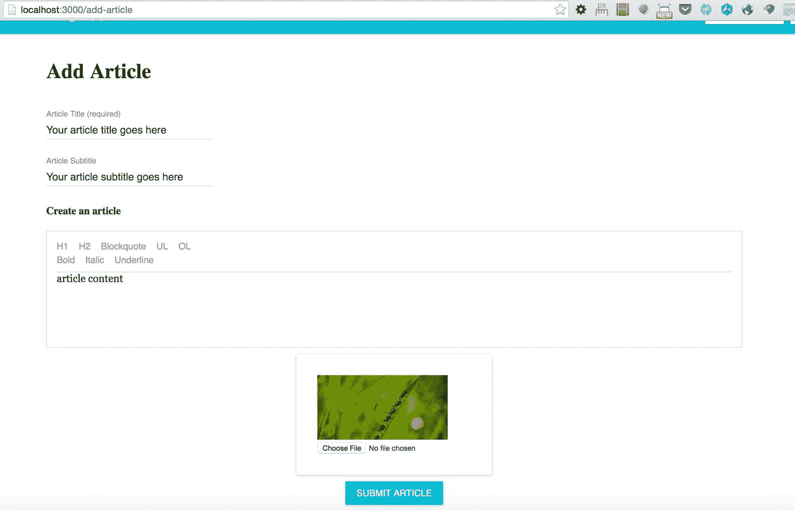

我们仍然缺少编辑标题和副标题的功能，所以现在让我们来实现它。

# 编辑文章标题和副标题的能力

前往 `src/views/articles/EditArticleView.js` 文件并添加新的导入（类似于 `add` 视图）：

```js
import DefaultInput from '../../components/DefaultInput'; 
import Formsy from 'formsy-react';

```

改进旧的 `_articleEditSubmit` 函数，从当前版本：

```js
// old code: 
  async _articleEditSubmit() { 
    let currentArticleID = this.state.editedArticleID; 
    let editedArticle = { 
      _id: currentArticleID, 
      articleTitle: this.state.title, 
      articleContent: this.state.htmlContent, 
      articleContentJSON: this.state.contentJSON, 
      articlePicUrl: this.state.articlePicUrl 
    } 
    // rest of the function has been striped below

```

更改为以下内容：

```js
 async _articleEditSubmit(articleModel) { 
    let currentArticleID = this.state.editedArticleID; 
    let editedArticle = { 
      _id: currentArticleID, 
      articleTitle: articleModel.title, 
      articleSubTitle: articleModel.subTitle, 
      articleContent: this.state.htmlContent, 
      articleContentJSON: this.state.contentJSON, 
      articlePicUrl: this.state.articlePicUrl 
    } 
    // rest of the function has been striped below

```

如您所见，我们和 `AddArticleView` 中做的是一样的事情，所以你应该熟悉它。最后要做的就是更新 `render`，以便我们能够输入将作为回调发送给 `_articleEditSubmit` 的标题和副标题，数据在 `articleModel` 中。`render` 函数中的旧返回值如下：

```js
// old code: 
    return ( 
      <div style={{height: '100%', width: '75%', margin: 'auto'}}> 
        <h1>Edit an existing article</h1> 
        <WYSIWYGeditor 
          initialValue={initialWYSIWYGValue} 
          name='editarticle' 
          title='Edit an article' 
          onChangeTextJSON={this._onDraftJSChange} /> 
        <div style={{margin: '10px 10px 10px 10px'}}>  
          <ImgUploader updateImgUrl={this.updateImgUrl} 
           articlePicUrl={this.state.articlePicUrl} /> 
        </div> 
        <RaisedButton 
          onClick={this._articleEditSubmit} 
          secondary={true} 
          type='submit' 
          style={{margin: '10px auto', 
           display: 'block', width: 150}} 
          label={'Submit Edition'} /> 
        <hr /> 
        {/* striped below */}

```

`render` 函数中的新改进返回值如下：

```js
   return ( 
      <div style={{height: '100%', width: '75%', margin: 'auto'}}> 
        <h1>Edit an existing article</h1> 
        <Formsy.Form onSubmit={this._articleEditSubmit}> 
          <DefaultInput  
            onChange={(event) => {}} 
            name='title'  
            value={this.state.articleDetails.articleTitle} 
            title='Article Title (required)' required /> 

          <DefaultInput  
            onChange={(event) => {}} 
            name='subTitle'  
            value={this.state.articleDetails.articleSubTitle} 
            title='Article Subtitle' /> 

          <WYSIWYGeditor 
            initialValue={initialWYSIWYGValue} 
            name='editarticle' 
            title='Edit an article' 
            onChangeTextJSON={this._onDraftJSChange} /> 

          <div style={{margin: '10px 10px 10px 10px'}}>  
            <ImgUploader updateImgUrl={this.updateImgUrl} 
             articlePicUrl={this.state.articlePicUrl} /> 
          </div> 

          <RaisedButton 
            onClick={this._articleEditSubmit} 
            secondary={true} 
            type='submit' 
            style={{margin: '10px auto', 
             display: 'block', width: 150}} 
            label={'Submit Edition'} /> 
        </Formsy.Form> 
        {/* striped below */}

```

我们在这里做的是和之前在 `AddArticleView` 中做的一样。我们引入了 `Formsy.Form`，当用户点击提交按钮（提交编辑）时，它会回调文章的标题和副标题。

这里是一个示例，展示它应该如何看起来：

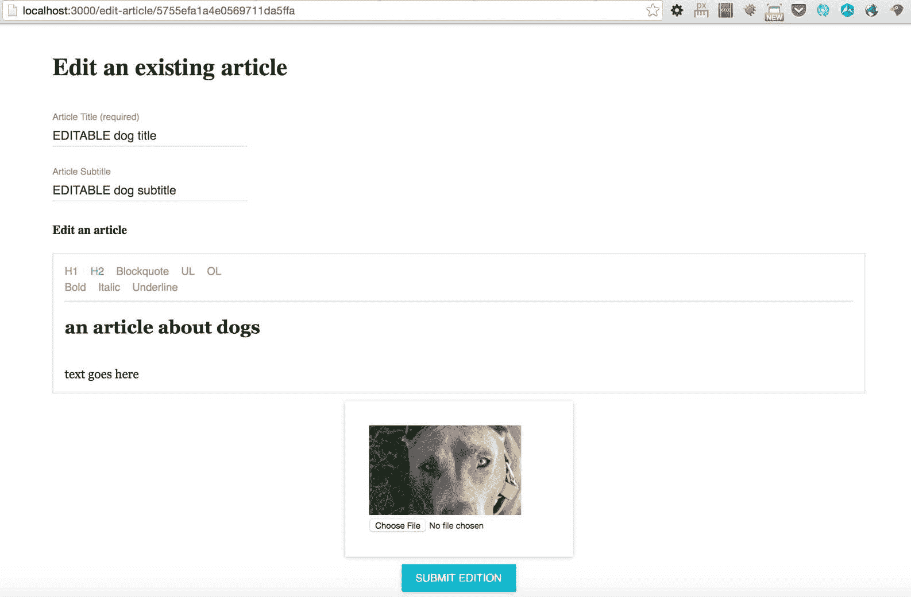

# ArticleCard 和 PublishingApp 的改进

改进 `ArticleCard` 中的 `render` 函数，使其也能显示副标题（目前是模拟的）。`src/components/ArticleCard.js` 文件中的旧内容如下：

```js
// old code: 
  render() { 
    let title = this.props.title || 'no title provided'; 
    let content = this.props.content || 'no content provided'; 
    let articlePicUrl = this.props.articlePicUrl || 
     '/static/placeholder.png'; 

    let paperStyle = { 
      padding: 10,  
      width: '100%',  
      height: 300 
    }; 

    let leftDivStyle = { 
      width: '30%',  
      float: 'left' 
    } 

    let rightDivStyle = { 
      width: '60%',  
      float: 'left',  
      padding: '10px 10px 10px 10px' 
    } 

    return ( 
      <Paper style={paperStyle}> 
        <CardHeader 
          title={this.props.title} 
          subtitle='Subtitle' 
          avatar='/static/avatar.png' 
        /> 

        <div style={leftDivStyle}> 
          <Card > 
            <CardMedia 
              overlay={<CardTitle title={title} 
               subtitle='Overlay subtitle' />}> 
               
            </CardMedia> 
          </Card> 
        </div> 
        <div style={rightDivStyle}> 
          <div dangerouslySetInnerHTML={{__html: content}} /> 
        </div> 
      </Paper>); 
  }

```

让我们将其更改为以下内容：

```js
 render() { 
    let title = this.props.title || 'no title provided'; 
    let subTitle = this.props.subTitle || ''; 
    let content = this.props.content || 'no content provided'; 
    let articlePicUrl = this.props.articlePicUrl || 
     '/static/placeholder.png'; 

    let paperStyle = { 
      padding: 10,  
      width: '100%',  
      height: 300 
    }; 

    let leftDivStyle = { 
      width: '30%',  
      float: 'left' 
    } 

    let rightDivStyle = { 
      width: '60%',  
      float: 'left',  
      padding: '10px 10px 10px 10px' 
    } 

    return ( 
      <Paper style={paperStyle}> 
        <CardHeader 
          title={this.props.title} 
          subtitle={subTitle} 
          avatar='/static/avatar.png' 
        /> 

        <div style={leftDivStyle}> 
          <Card > 
            <CardMedia 
              overlay={<CardTitle title={title} 
               subtitle={subTitle} />}> 
               
            </CardMedia> 
          </Card> 
        </div> 
        <div style={rightDivStyle}> 
          <div dangerouslySetInnerHTML={{__html: content}} /> 
        </div> 
      </Paper>); 
  }

```

如您所见，我们定义了一个新的 `subTitle` 变量，并在 `CardHeader` 和 `CardMedia` 组件中使用它，因此现在它也会显示副标题。

另一件事是要让 `PublishingApp` 也获取本章中引入的副标题，因此我们需要改进以下旧代码：

```js
// old code: 
  async _fetch() { 
    let articlesLength = await falcorModel. 
      getValue('articles.length'). 
      then((length) => length); 

    let articles = await falcorModel. 
      get(['articles', {from: 0, to: articlesLength-1}, 
       ['_id','articleTitle', 'articleContent', 
       'articleContentJSON', 'articlePicUrl']]).  
      then((articlesResponse) => {   
        return articlesResponse.json.articles; 
      }).catch(e => { 
        console.debug(e); 
        return 500; 
      }); 
    // no changes below, striped

```

用以下内容替换它：

```js
 async _fetch() { 
    let articlesLength = await falcorModel. 
      getValue('articles.length'). 
      then((length) => length); 

    let articles = await falcorModel. 
      get(['articles', {from: 0, to: articlesLength-1}, ['_id', 
       'articleTitle', 'articleSubTitle','articleContent', 
       'articleContentJSON', 'articlePicUrl']]).  
      then((articlesResponse) => {   
        return articlesResponse.json.articles; 
      }).catch(e => { 
        console.debug(e); 
        return 500; 
      });

```

如您所见，我们已经以 `articleSubTitle` 属性开始了 `falcorModel.get`。

当然，我们需要将这个`subTitle`属性传递给`PublishingApp`类中的`render`函数的`ArticleCard`组件：

```js
// old code: 
    this.props.article.forEach((articleDetails, articleKey) => { 
      let currentArticleJSX = ( 
        <div key={articleKey}> 
          <ArticleCard  
            title={articleDetails.articleTitle} 
            content={articleDetails.articleContent} 
      articlePicUrl={articleDetails.articlePicUrl} /> 
        </div> 
      );

```

最后，我们将得到以下结果：

```js
   this.props.article.forEach((articleDetails, articleKey) => { 
      let currentArticleJSX = ( 
        <div key={articleKey}> 
          <ArticleCard  
            title={articleDetails.articleTitle} 
            content={articleDetails.articleContent}  
            articlePicUrl={articleDetails.articlePicUrl} 
      subTitle={articleDetails.articleSubTitle} /> 
        </div> 
      );

```

在主页上所有这些更改之后，你可以找到一个带有标题、副标题、封面照片和内容（由我们的 WYSIWYG 编辑器创建）的编辑过的文章：

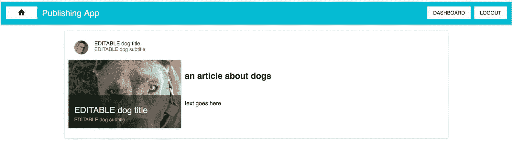

# 仪表板改进（现在我们可以去除剩余的 HTML）

本章的最后一步是改进仪表板。它将根据 props 中的 HTML 进行字符串连接，以便在用户浏览我们的应用时有一个更好的外观和感觉。找到以下代码：

```js
// old code: 
    this.props.article.forEach((articleDetails, articleKey) => { 
      let articlePicUrl = articleDetails.articlePicUrl || 
       '/static/placeholder.png'; 
      let currentArticleJSX = ( 
        <Link to={&grave;/edit-article/${articleDetails['_id']}&grave;} 
         key={articleKey}> 
          <ListItem 

            leftAvatar={} 
            primaryText={articleDetails.articleTitle} 
            secondaryText={articleDetails.articleContent} 
          /> 
        </Link> 
      );

```

用以下内容替换：

```js
   this.props.article.forEach((articleDetails, articleKey) => { 
      let articlePicUrl = articleDetails.articlePicUrl || 
       '/static/placeholder.png'; 
      let articleContentPlanText = 
       articleDetails.articleContent.replace(/</?[^>]+(>|$)/g, 
       ''); 
      let currentArticleJSX = ( 
        <Link to={&grave;/edit-article/${articleDetails['_id']}&grave;} 
         key={articleKey}> 
          <ListItem 

            leftAvatar={} 
            primaryText={articleDetails.articleTitle} 
            secondaryText={articleContentPlanText} 
          /> 
        </Link> 
      );

```

如你所见，我们只是从 HTML 中去除 HTML 标签，这样我们就会得到更好的`secondaryText`，没有 HTML 标记，就像这个例子一样：

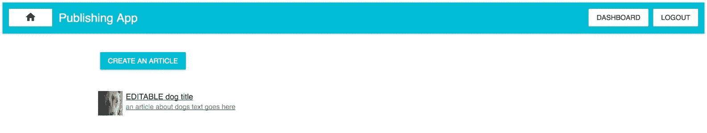

# 摘要

我们已经实现了书中涵盖的所有功能。下一步是开始部署这个应用。

如果你想提高你的编码技能，自己完全实现一些功能是个不错的主意。以下是我们发布应用中仍缺失的一些功能想法。

我们可以有一个指向特定文章的单独链接，这样你就可以与朋友分享。如果你想在数据库中创建一个与特定文章相关的人可读的唯一 slug，这可能很有用。所以，而不是链接到像[`reactjs.space/570b6e26ae357d391c6ebc1d`](http://reactjs.space/570b6e26ae357d391c6ebc1d)（`reactjs.space`是我们将在生产服务器上使用的域名）这样的东西，用户可以分享一个像[`reactjs.space/an-article-about-a-dog`](http://reactjs.space/an-article-about-a-dog)这样的链接。

可能有一种方法可以将文章与发布它的编辑器关联起来。目前它是模拟的。你可以取消模拟。

用户在登录时无法更改他们的用户详情--这可能是一个练习更多全栈开发的不错方式。

用户无法设置他们的头像图片--你可以以我们实现图片封面类似的方式添加这个功能。

创建一个更健壮的带有插件的 Draft.JS WYSIWYG 编辑器。对于提及、贴纸、表情符号、标签、撤销/重做等功能，健壮的插件易于实现。访问[`www.draft-js-plugins.com/`](https://www.draft-js-plugins.com/)获取更多关于它们的信息。实现一个或两个你最喜欢的。

在下一章中，我们将开始使用[www.mLab.com](http://www.mLab.com)在线部署我们的 MongoDB 实例，它是一个数据库即服务提供商，帮助我们轻松构建可扩展的 MongoDB 节点。

让我们从部署的乐趣开始吧！
