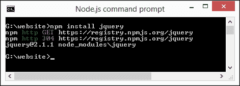
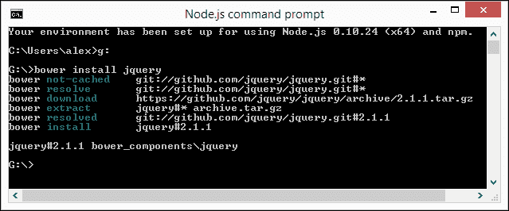
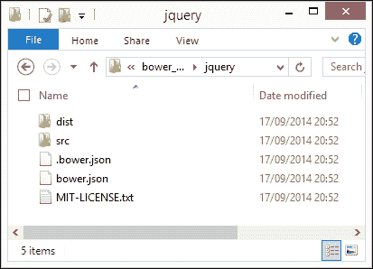
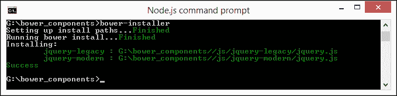
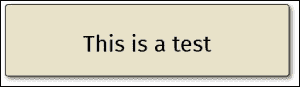
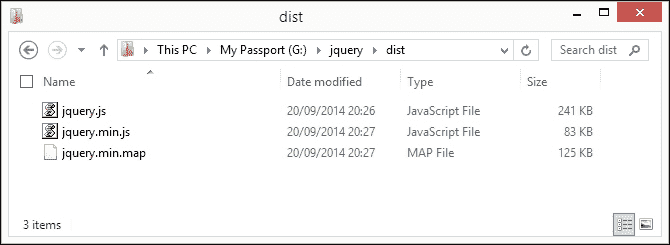
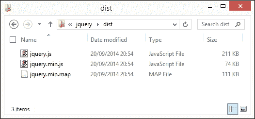
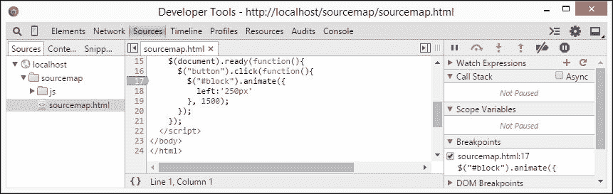
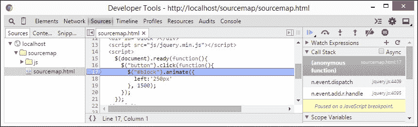
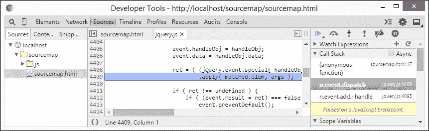

# 第一章：安装 jQuery

本地还是 CDN，我在想……？使用哪个版本……？要支持旧版 IE 吗……？

安装 jQuery 是一项无功的任务，任何开发者都不得不重复进行无数次——可以想象那个人问这个章节开头的一些问题。可以想象为什么大多数人选择使用 **内容传送网络**（**CDN**）链接，但安装 jQuery 不只是走捷径那么简单！

还有更多选项可供选择，我们可以非常具体地选择我们需要使用的内容——在本章中，我们将探讨一些可用的选项，以帮助进一步发展你的技能。我们将涵盖许多主题，其中包括：

+   下载并安装 jQuery

+   自定义 jQuery 下载

+   从 Git 构建

+   使用其他来源安装 jQuery

+   添加源映射支持

+   使用 Modernizr 作为备用方案

有兴趣吗？让我们开始吧。

# 下载并安装 jQuery

就像所有需要使用 jQuery 的项目一样，我们必须从某个地方开始——毫无疑问，你已经下载并安装了 jQuery 成千上万次了；让我们快速回顾一下，以使自己跟上进度。

如果我们浏览到[`www.jquery.com/download`](http://www.jquery.com/download)，我们可以通过两种方法下载 jQuery：下载压缩的生产版本或未压缩的开发版本。如果我们不需要支持旧版 IE（IE6、7 和 8），那么我们可以选择 2.x 分支。但是，如果你仍然有一些死忠粉丝无法（或不想）升级，那么必须使用 1.x 分支。

要包含 jQuery，我们只需要将这个链接添加到我们的页面中：

```js
<script src="img/jquery-X.X.X.js"></script>
```

### 提示

**下载示例代码**

你可以从[`www.packtpub.com`](http://www.packtpub.com)下载你购买的所有 Packt 图书的示例代码文件。如果你在其他地方购买了这本书，你可以访问[`www.packtpub.com/support`](http://www.packtpub.com/support)并注册，文件将直接通过电子邮件发送给你。

在这里，`X.X.X`表示页面中正在使用的 jQuery 或 Migrate 插件的版本号。

传统智慧认为 jQuery 插件（包括 Migrate 插件在内）应该添加到 `<head>` 标签中，尽管也有有效的理由将其添加到闭合的 `<body>` 标签之前的最后一个语句；将其放在这里可能有助于加快网站的加载速度。

这个论点并不是铁板一块；在某些情况下，将其放在 `<head>` 标签中可能是必要的，这个选择应该根据开发者的需求来决定。我个人偏好将其放在 `<head>` 标签中，因为它能够将脚本（以及 CSS）代码与页面主体中的主要标记分离开来，特别是在较轻的网站上。

我甚至看到一些开发人员争论说，如果在顶部而不是底部添加 jQuery，几乎没有*察觉到*的差异；一些系统，比如 WordPress，在`<head>`部分也包含 jQuery，所以两种方式都可以。关键在于，如果你感觉到速度变慢，那么将你的脚本移到`<body>`标签之前是一个更好的做法。

## 在开发中使用 jQuery

在这个阶段需要注意的一个有用的点是，最佳实践建议不要在开发阶段使用 CDN 链接；而应该下载未压缩的文件并在本地引用。一旦网站完成并准备上传，那么就可以使用 CDN 链接。

## 添加 jQuery Migrate 插件

如果你使用的是 jQuery 1.9 之前的任何版本，那么值得将 jQuery Migrate 插件添加到你的页面中。从这个版本开始，jQuery 核心团队对 jQuery 进行了一些重大更改；Migrate 插件将临时恢复功能，直到旧代码可以更新或替换为止。

该插件向 jQuery 对象添加了三个属性和一个方法，我们可以使用它们来控制其行为：

| 属性或方法 | 评论 |
| --- | --- |
| `jQuery.migrateWarnings` | 这是一个包含由页面上的代码生成的字符串警告消息的数组，按照生成的顺序排列。即使条件发生多次，消息也只会出现在数组中一次，除非调用了`jQuery.migrateReset()`。 |
| `jQuery.migrateMute` | 将此属性设置为`true`以防止在调试版本中生成控制台警告。如果设置了此属性，`jQuery.migrateWarnings`数组仍然会被维护，这允许在没有控制台输出的情况下进行程序化检查。 |
| `jQuery.migrateTrace` | 如果你想要警告但不想在控制台上显示跟踪信息，请将此属性设置为`false`。 |
| `jQuery.migrateReset()` | 此方法清除`jQuery.migrateWarnings`数组并“忘记”已经看到的消息列表。 |

添加插件同样很简单 —— 你只需要添加类似这样的链接，其中`X`表示所使用的插件版本号：

```js
<script src="img/jquery-migrate-X.X.X.js"></script>
```

如果你想了解更多关于插件并获取源代码，那么可以从[`github.com/jquery/jquery-migrate`](https://github.com/jquery/jquery-migrate)进行下载。

## 使用 CDN

我们同样可以使用 CDN 链接提供我们的 jQuery 库 —— jQuery 团队的主要链接由**MaxCDN**提供，当前版本可在[`code.jquery.com`](http://code.jquery.com)找到。当然，如果喜欢的话，我们也可以使用一些其他来源的 CDN 链接 —— 这些的提醒如下：

+   Google ([`developers.google.com/speed/libraries/devguide#jquery`](https://developers.google.com/speed/libraries/devguide#jquery))

+   Microsoft ([`www.asp.net/ajaxlibrary/cdn.ashx#jQuery_Releases_on_the_CDN_0`](http://www.asp.net/ajaxlibrary/cdn.ashx#jQuery_Releases_on_the_CDN_0))

+   CDNJS ([`cdnjs.com/libraries/jquery/`](http://cdnjs.com/libraries/jquery/))

+   jsDelivr (`http://www.jsdelivr.com/#%!jquery`)

但是不要忘记，如果需要的话，我们始终可以将 CDN 提供的文件保存在本地，并引用它。jQuery CDN 总是会有最新版本，尽管可能需要几天时间才能通过其他链接更新。

# 使用其他来源安装 jQuery

好的。好的，让我们继续编写一些代码吧！“接下来做什么？”我听到你在问。

啊哈！如果你认为从主要站点下载并安装 jQuery 是唯一的方法，那么你就错了！毕竟，这本书是关于精通 jQuery 的，所以你不会认为我只会谈论你已经熟悉的内容，对吧？

是的，我们有更多可供选择的选项来安装 jQuery，而不仅仅是使用 CDN 或主要下载页面。让我们开始看看如何使用 Node。

### 注意

每个演示都是基于 Windows 的，因为这是作者首选的平台；在可能的情况下，为其他平台提供了替代方案。

## 使用 NodeJS 安装 jQuery

到目前为止，我们已经看到了如何下载和引用 jQuery，即使用主要的 jQuery 站点下载或通过 CDN 使用。这种方法的缺点是需要手动更新我们的 jQuery 版本！相反，我们可以使用包管理器来帮助管理我们的资产。Node.js 就是这样一个系统。让我们来看一下安装 jQuery 需要执行的步骤：

1.  我们首先需要安装 Node.js —— 前往 [`www.nodejs.org`](http://www.nodejs.org) 以下载适用于你选择平台的软件包；在通过向导时接受所有默认设置（对于 Mac 和 PC）。

1.  接下来，打开一个 Node 命令提示符，然后切换到你的项目文件夹。

1.  在提示符中，输入以下命令：

    ```js
    npm install jquery

    ```

1.  Node 将会获取并安装 jQuery —— 当安装完成时，它会显示一条确认消息：

1.  然后，你可以通过这个链接引用 jQuery：

    ```js
    <name of drive>:\website\node_modules\jquery\dist\jquery.min.js.
    ```

Node 现在已经安装并且准备就绪 —— 虽然我们将其安装在本地文件夹中，但实际上，我们很可能会将其安装在本地 Web 服务器的子文件夹中。例如，如果我们正在运行 WampServer，我们可以安装它，然后将它复制到 `/wamp/www/js` 文件夹中，并使用 `http://localhost/js/jquery.min.js` 引用它。

### 注意

如果你想查看 jQuery **Node 包管理器** (**NPM**) 包的源代码，那么请查看 [`www.npmjs.org/package/jquery`](https://www.npmjs.org/package/jquery)。

使用 Node 安装 jQuery 使我们的工作更简单，但代价是高昂的。Node.js（及其包管理器 NPM）主要用于安装和管理 JavaScript 组件，并期望包遵循**CommonJS**标准。这样做的缺点是，没有范围来管理通常在网站中使用的任何其他资产，例如字体、图像、CSS 文件甚至 HTML 页面。

“为什么会成为一个问题呢？”我听到你问。简单，当我们可以自动管理所有这些资产并仍然使用 Node 时，为什么要让生活变得困难呢？

## 使用 Bower 安装 jQuery

图书馆的一个相对较新的增加是支持使用 Bower 进行安装——基于 Node，它是一个包管理器，负责从互联网上获取和安装包。它设计得更加灵活，可以管理多种类型的资产（如图像、字体和 CSS 文件），并且不会干扰这些组件在页面中的使用方式（不像 Node）。

为了演示目的，我假设您已经从前一节安装了它；如果没有，请在继续以下步骤之前重新查看它：

1.  打开 Node 命令提示符，切换到您想要安装 jQuery 的驱动器，并输入此命令：

    ```js
    bower install jquery

    ```

这将下载并安装脚本，在完成时显示已安装版本的确认，如下面的屏幕截图所示：



该库安装在您 PC 上的`bower_components`文件夹中。它看起来类似于这个例子，我已经导航到了`jquery`子文件夹下面：



默认情况下，Bower 将 jQuery 安装在其`bower_components`文件夹中。在`bower_components/jquery/dist/`中，我们会找到一个未压缩的版本、压缩的发布版本和源映射文件。然后，我们可以使用以下行引用 jQuery 在我们的脚本中：

```js
<script src="img/jquery.js"></script>
```

不过，我们可以进一步进行。如果我们不想安装 Bower 默认情况下附带的额外文件，我们可以在命令提示符中简单地输入以下内容，仅安装 jQuery 的压缩版本 2.1：

```js
bower install http://code.jquery.com/jquery-2.1.0.min.js
```

现在，我们可以在这一点上真正聪明了；因为 Bower 使用 Node 的 JSON 文件来控制应安装的内容，我们可以利用这一点进行选择，并设置 Bower 同时安装其他组件。让我们来看看这将如何工作——在以下示例中，我们将使用 Bower 来安装 jQuery 2.1 和 1.10（后者为 IE6-8 提供支持）：

1.  在 Node 命令提示符中，输入以下命令：

    ```js
    bower init

    ```

    这将提示您回答一系列问题，此时您可以填写信息或按*Enter*接受默认值。

1.  查看项目文件夹；您应该在其中找到一个`bower.json`文件。在您喜欢的文本编辑器中打开它，然后按照此处显示的代码进行更改：

    ```js
    {
      "ignore": [ "**/.*", "node_modules", "bower_components", "test", "tests" ] ,
     "dependencies": {
     "jquery-legacy": "jquery#1.11.1",
     "jquery-modern": "jquery#2.10"
     }
    }
    ```

此时，您有一个准备好供使用的 `bower.json` 文件。Bower 建立在 Git 之上，所以为了使用您的文件安装 jQuery，通常需要将其发布到 Bower 存储库中。

相反，您可以安装一个额外的 Bower 包，这样您就可以安装您的自定义包而无需将其发布到 Bower 存储库中：

1.  在 Node 命令提示符窗口中，在提示符处输入以下内容

    ```js
    npm install -g bower-installer

    ```

1.  安装完成后，切换到你的项目文件夹，然后输入以下命令行：

    ```js
    bower-installer

    ```

1.  `bower-installer` 命令现在将下载并安装 jQuery 的两个版本，如下所示：

此时，您已经使用 Bower 安装了 jQuery。在未来的某个时候，您可以自由升级或移除 jQuery，使用正常的 Bower 过程。

### 注意

如果您想了解更多关于如何使用 Bower 的信息，可以在网上找到大量参考资料；[`www.openshift.com/blogs/day-1-bower-manage-your-client-side-dependencies`](https://www.openshift.com/blogs/day-1-bower-manage-your-client-side-dependencies) 是一个帮助您熟悉使用 Bower 的好例子。此外，还有一篇有用的文章讨论了 Bower 和 Node，可以在 [`tech.pro/tutorial/1190/package-managers-an-introductory-guide-for-the-uninitiated-front-end-developer`](http://tech.pro/tutorial/1190/package-managers-an-introductory-guide-for-the-uninitiated-front-end-developer) 找到。

不过，安装 jQuery 的方式不止有 Bower 一种——例如，我们可以使用它来安装多个版本的 jQuery，但仍然受限于安装整个 jQuery 库。

我们可以通过仅引用库中所需的元素来改进这一点。感谢 jQuery 核心团队进行的大量工作，我们可以使用**异步模块定义**（**AMD**）方法来仅引用我们网站或在线应用程序中所需的模块。

## 使用 AMD 方法加载 jQuery。

在大多数情况下，当使用 jQuery 时，开发人员可能只会在其代码中包含对主要库的引用。这本身没有错，但它加载了很多我们不需要的额外代码。

一种更高效的方法，尽管需要一些时间来适应，是使用 AMD 方法。简而言之，jQuery 团队使库更加模块化；这使您可以使用诸如 require.js 的加载器在需要时加载单个模块。

对于每种方法并不都适用，特别是如果您是库的不同部分的重度用户。但是，对于您仅需要有限数量的模块的情况，则是一个完美的选择。让我们通过一个简单的示例来看看实际情况。

### 注意

在我们开始之前，我们需要一个额外的项目-代码使用 Fira Sans 常规自定义字体，该字体可以从 Font Squirrel 获取[`www.fontsquirrel.com/fonts/fira-sans`](http://www.fontsquirrel.com/fonts/fira-sans)。

让我们从以下步骤开始：

1.  Fira Sans 字体默认不带网络格式，因此我们需要将字体转换为网络字体格式。请上传`FiraSans-Regular.otf`文件到 Font Squirrel 的网络字体生成器[`www.fontsquirrel.com/tools/webfont-generator`](http://www.fontsquirrel.com/tools/webfont-generator)。当提示时，将转换后的文件保存到项目文件夹中的名为`fonts`的子文件夹中。

1.  我们需要将 jQuery 和 RequireJS 安装到我们的项目文件夹中，所以打开一个 Node.js 命令提示符并切换到项目文件夹。

1.  接下来，逐一输入以下命令，并在每个命令后按*Enter*：

    ```js
    bower install jquery
    bower install requirejs

    ```

1.  我们需要从附带本书的代码下载链接中提取`amd.html`和`amd.css`文件的副本-它包含一些简单的标记以及一个到`require.js`的链接；`amd.css`文件包含我们将在演示中使用的一些基本样式。

1.  现在，我们需要立即在`require.js`的链接下添加这个代码块-这处理了对 jQuery 和 RequireJS 的调用，我们同时调用了 jQuery 和 Sizzle，jQuery 的选择器引擎：

    ```js
      <script>
        require.config({
          paths: {
            "jquery": "bower_components/jquery/src",
            "sizzle": "bower_components/jquery/src/sizzle/dist/sizzle"
          }
        });
        require(["js/app"]);
      </script>
    ```

1.  现在 jQuery 已被定义，我们需要调用相关模块。在一个新文件中，继续添加以下代码，并将其保存为`app.js`，保存到我们项目文件夹内的一个名为`js`的子文件夹中：

    ```js
    define(["jquery/core/init", "jquery/attributes/classes"], function($) {
      $("div").addClass("decoration");
    });
    ```

    ### 注意

    我们使用`app.js`作为文件名，以与代码中的`require(["js/app"]);`引用相匹配。

1.  如果一切顺利，在浏览器中预览我们工作的结果时，我们将看到此消息：

尽管我们只在这里使用了一个简单的例子，但已足以演示仅调用我们代码中需要使用的模块比调用整个 jQuery 库要容易。的确，我们仍然必须提供一个指向库的链接，但这只是告诉我们的代码在哪里找到它；我们的模块代码重达 29 KB（在 gzip 后为 10 KB），而完整库的未压缩版本为 242 KB！

### 注意

我们的代码已在附带本书的代码下载链接中提供了完整版本的代码，找到并运行`amd-finished.html`文件以查看结果。

现在，可能会有一些情况下，仅使用这种方法引用模块并不是正确的方法；如果您需要经常引用许多不同的模块，这可能适用。

更好的选择是构建 jQuery 库的自定义版本，该版本仅包含我们需要使用的模块，其余模块在构建过程中被删除。这需要更多的工作，但是值得努力-让我们看看涉及的过程。

# 定制从 Git 下载 jQuery

如果我们有兴趣，我们可以真正地大展拳脚，使用 JavaScript 任务运行器 Grunt 构建一个自定义版本的 jQuery。这个过程相对直接，但涉及一些步骤；如果你之前对 Git 有一些了解，那肯定会有所帮助！

### 注意

该演示假定您已经安装了 Node.js——如果尚未安装，请在继续练习之前先执行此操作。

好的，让我们开始执行以下步骤：

1.  如果系统中尚未安装 Grunt，首先需要安装 Grunt——打开 Node.js 命令提示符并输入以下命令：

    ```js
    npm install -g grunt-cli

    ```

1.  接下来，安装 Git——为此，请浏览[`msysgit.github.io/`](http://msysgit.github.io/)以下载该软件包。

1.  双击安装文件启动向导，接受所有默认设置就足够满足我们的需求。

    ### 注意

    如果你想了解更多关于如何安装 Git 的信息，请前往[`github.com/msysgit/msysgit/wiki/InstallMSysGit`](https://github.com/msysgit/msysgit/wiki/InstallMSysGit)了解更多详情。

1.  安装了 Git 后，从命令提示符中切换到 `jquery` 文件夹，并输入以下命令下载并安装构建 jQuery 所需的依赖项：

    ```js
    npm install

    ```

1.  构建过程的最后阶段是将库构建到我们所熟悉和喜爱的文件中；从同一个命令提示符中，输入以下命令： 

    ```js
    grunt

    ```

1.  浏览至 `jquery` 文件夹——其中将有一个名为 `dist` 的文件夹，其中包含我们的自定义 jQuery 构建版本，准备就绪，如下面的截图所示：

## 移除冗余模块

如果库中有我们不需要的模块，我们可以运行自定义构建。我们可以设置 Grunt 任务，在构建库时移除这些模块，保留我们项目中需要的模块。

### 注意

要查看我们可以排除的所有模块的完整列表，请参阅[`github.com/jquery/jquery#modules`](https://github.com/jquery/jquery#modules)。

例如，要从我们的构建中移除 AJAX 支持，我们可以在第 5 步运行以下命令，如前所示：

```js
grunt custom:-ajax

```

这将导致文件在原始未经处理的版本上节省 30 KB，如下图所示：



JavaScript 和映射文件现在可以像往常一样并入我们的项目中。

### 注意

要详细了解构建过程，请阅读 Dan Wellman 撰写的这篇文章（[`www.packtpub.com/books/content/building-custom-version-jquery`](https://www.packtpub.com/books/content/building-custom-version-jquery)）。

## 使用 GUI 作为替代方案

有一个在线 GUI 可用，执行几乎相同的任务，而无需安装 Git 或 Grunt。它可在[`projects.jga.me/jquery-builder/`](http://projects.jga.me/jquery-builder/)找到，尽管值得注意的是，它已经有一段时间没有更新了！

好的，所以我们已经安装了 jQuery；让我们再看看另一个有用的函数，它将在调试代码中出现错误时帮助我们。自 jQuery 1.9 版本以来，已经提供了对源映射的支持。让我们看看它们是如何工作的，并看一个简单的示例。

# 添加源映射支持

请想象一种情景，假如你创建了一个非常棒的网站，在运行良好，直到你开始收到关于网站上某些基于 jQuery 的功能出现问题的投诉。听起来耳熟吗？

在生产网站上使用未压缩版本的 jQuery 是不可取的选择；相反，我们可以使用源映射。简单来说，这些映射了 jQuery 的压缩版本与原始源代码中的相关行。

从历史上看，当实现源映射时，开发人员曾经遇到过很多麻烦，以至于 jQuery 团队不得不禁用自动使用映射！

### 提示

为了达到最佳效果，建议您使用本地 Web 服务器，例如 WAMP（PC）或 MAMP（Mac），查看此演示，并使用 Chrome 作为您的浏览器。

实现源映射并不困难；让我们来看看如何实现它们：

1.  从本书附带的代码下载链接中提取一个 `sourcemap` 文件夹的副本，并将其保存到本地项目区域。

1.  按下 *Ctrl* + *Shift* + *I* 在 Chrome 中打开 **开发者工具**。

1.  点击 **Sources**，然后双击 `sourcemap.html` 文件—在代码窗口中，最后点击 **17**，如下面的截图所示：

1.  现在，在 Chrome 中运行演示—我们将看到它暂停；回到开发者工具栏，其中第 **17** 行被突出显示。屏幕右侧显示了对 jQuery 库的相关调用：

1.  如果我们在右侧双击 `n.event.dispatch` 条目，Chrome 将刷新工具栏并显示来自 jQuery 库的原始源代码行（突出显示），如下所示：

投入时间去了解源映射是非常值得的—所有最新版本的浏览器都支持它，包括 IE11。尽管我们在这里只使用了一个简单的示例，但原则上完全相同，无论网站使用了多少代码。

### 注意

对于一个更深入的涵盖所有浏览器的教程，值得访问 [`blogs.msdn.com/b/davrous/archive/2014/08/22/enhance-your-javascript-debugging-life-thanks-to-the-source-map-support-available-in-ie11-chrome-opera-amp-firefox.aspx`](http://blogs.msdn.com/b/davrous/archive/2014/08/22/enhance-your-javascript-debugging-life-thanks-to-the-source-map-support-available-in-ie11-chrome-opera-amp-firefox.aspx)—值得一读！

## 添加源映射支持

在前一节中，我们刚刚预览了源映射，源映射支持已经添加到了库中。值得注意的是，当前版本的 jQuery 默认情况下不包含源映射。如果你需要下载更新版本或者首次添加支持，请按照以下步骤操作：

1.  源映射可以从主站点使用 `http://code.jquery.com/jquery-X.X.X.min.map` 下载，其中 `X` 表示正在使用的 jQuery 版本号。

1.  打开压缩版本的库的副本，然后在文件末尾添加这一行：

    ```js
    //# sourceMappingURL=jquery.min.map
    ```

1.  保存并将其存储在项目的 JavaScript 文件夹中。确保在同一个文件夹中有压缩和未压缩版本的库的副本。

让我们继续并看看加载 jQuery 的另一个关键部分：如果由于某种未知原因，jQuery 完全不可用，那么我们可以为我们的站点添加一个后备位置，允许优雅地降级。这是任何站点的一个小但至关重要的部分，并且比你的站点简单崩溃提供了更好的用户体验！

# 使用 Modernizr 作为后备方案

在使用 jQuery 时的最佳实践是确保为库提供后备，以防主要版本不可用。（是的，当它发生时很烦人，但它确实会发生！）

通常情况下，我们可能会在最佳实践建议中使用一些 JavaScript，例如以下示例。这个方法完全有效，但不提供优雅的后备方案。相反，我们可以使用 Modernizr 来执行检查并在所有失败时提供优雅的降级。

### 注意

Modernizr 是一个用于 HTML5/CSS3 的特性检测库，可以在功能不可用的情况下提供标准化的后备机制。你可以在 [`www.modernizr.com`](http://www.modernizr.com) 了解更多信息。

举个例子，在我们网站页面的末尾，代码可能看起来像这样。我们首先尝试使用 CDN 链接加载 jQuery，如果没有成功，再退回到本地副本或者其他备用方案：

```js
<body>
  <script src="img/modernizr.js"></script>
  <script type="text/javascript">
    Modernizr.load([{
      load: 'http://code.jquery.com/jquery-2.1.1.min.js',
      complete: function () {
        // Confirm if jQuery was loaded using CDN link
        // if not, fall back to local version
        if ( !window.jQuery ) {
          Modernizr.load('js/jquery-latest.min.js');
        }
      }
    },
      // This script would wait until fallback is loaded, before loading
      { load: 'jquery-example.js' }
    ]);
  </script>
</body>
```

通过这种方式，我们可以确保 jQuery 要么从本地加载，要么从 CDN 链接加载 —— 如果一切都失败了，那么我们至少可以优雅地退出。

# 加载 jQuery 的最佳实践

到目前为止，我们已经探讨了几种加载 jQuery 到我们页面的方式，除了通常的本地下载库或者在代码中使用 CDN 链接。现在我们已经安装了它，这是一个很好的机会来介绍一些在加载 jQuery 时应该尽量纳入我们页面的最佳实践：

+   始终尝试使用 CDN 在生产站点上包含 jQuery。我们可以利用 CDN 服务提供的高可用性和低延迟；该库可能已经预缓存，避免了再次下载的需要。

+   尝试在本地托管相同版本的库上实现一个备用。如果 CDN 链接不可用（它们不是 100%无懈可击的），那么本地版本将自动启用，直到 CDN 链接再次可用：

    ```js
    <script type="text/javascript" src="img/"></script>
    <script>window.jQuery || document.write('<script src="img/jquery-1.11.1.min.js"><\/script>')</script>
    ```

+   请注意，虽然这同样适用于使用 Modernizr，但如果 jQuery 的版本都不可用，它不提供优雅的备用。虽然人们希望永远不会出现这种情况，但至少我们可以使用 CSS 来提供优雅的退出！

+   使用协议相对/协议独立的 URL；浏览器将自动确定使用哪种协议。如果 HTTPS 不可用，它将回退到 HTTP。如果你仔细观察上一点的代码，它展示了协议独立 URL 的完美例子，通过从主 jQuery Core 网站调用 jQuery。

+   如果可能的话，将所有的 JavaScript 和 jQuery 引用放在页面底部——脚本会阻塞页面的其余部分渲染，直到它们完全渲染完成。

+   使用 jQuery 2.x 分支，除非你需要支持 IE6-8；在这种情况下，使用 jQuery 1.x——不要加载多个 jQuery 版本。

+   如果你使用 CDN 链接加载 jQuery，始终指定你想要加载的完整版本号，比如`jquery-1.11.1.min.js`。

+   如果你正在使用其他库，比如 Prototype、MooTools、Zepto 等，它们也使用`$`符号，那么尽量不要用`$`来调用 jQuery 函数，而是简单地使用 jQuery。你可以通过调用`$.noConflict()`函数将`$`的控制权交还给其他库。

+   对于高级浏览器功能检测，使用 Modernizr。

值得注意的是，可能有一些情况并不总是能够遵循最佳实践；情况可能需要我们对需求做出让步，不能使用最佳实践。然而，尽量将这种情况降至最低，其中一个论点是，如果大部分代码都不遵循最佳实践，那么我们的设计可能存在缺陷！

# 摘要

如果你以为只有手动下载或使用 CDN 链接是包含 jQuery 的唯一方法，那么希望本章打开了你的眼界，让我们花点时间回顾一下我们学到了什么。

我们开始时习惯性地看了大多数开发者可能在快速移动到其他来源之前快速地加载 jQuery 的方式。

我们从如何使用 Node 开始，然后转向使用 Bower 包管理器。接下来，我们看了我们如何可以使用 AMD 方法引用 jQuery 中的个别模块。然后，我们转移到并把注意力转向使用 Git 创建库的自定义版本。然后我们涵盖了如何使用源映射调试我们的代码，看看如何在 Google 的 Chrome 浏览器中启用对它们的支持。

在完成加载 jQuery 的旅程时，我们看到如果完全无法加载 jQuery 会发生什么，并且如何通过使用 Modernizr 来优雅地处理这个问题。然后，我们在章节结束时介绍了一些在引用 jQuery 时可以遵循的最佳实践。

在下一章中，我们将通过了解如何定制 jQuery 来加速进展。这可以通过在运行时替换或修改函数，或者应用补丁来实现；你准备好开始了吗？
