# 第二章：自定义 jQuery

好的，我们已经下载了一个版本的 jQuery……接下来该怎么做呢，我在想？

这是一个非常好的问题——让我来揭开所有的秘密！

多年来，jQuery 已经成为一个技艺精湛的库，在世界各地的数百万个网站中被使用。虽然我们通常可以找到一种方法来使用该库来满足需求，但可能会有一些情况需要我们提供自己的补丁或修改，以满足我们的需求。

我们可以使用插件，但是这在一段时间后会变得很烦人——很快就会出现“这个插件，那个插件”综合症，我们变得过于依赖插件。相反，我们可以看一下 jQuery 本身的覆盖功能；是的，它有一些风险，但正如我们将看到的那样，它绝对值得。在本章中，我们将介绍覆盖 jQuery 的基础知识，一些这样做的利与弊，并通过一些替换功能的示例来逐步展示。我们将涵盖以下主题：

+   介绍鸭子打孔

+   替换或修改现有行为

+   创建一个基本的猴子补丁

+   考虑猴子补丁的利与弊

+   分发或应用补丁

准备开始你的冒险了吗……？让我们开始吧！

# 准备工作

在这一点上，我建议你在你的电脑上的某个地方创建一个项目文件夹——为了演示的目的，我假设它被称为`project`并位于你的主硬盘或`C:`驱动器的根目录下。

在文件夹中，继续创建几个子文件夹；这些文件夹需要被命名为`fonts`、`css`、`js`和`img`。

# 在运行时修补库

多年来，数百名开发人员花费了无数个小时为 jQuery 创建补丁，以修复某种描述的错误或在库中提供新功能。

通常的做法是针对核心 jQuery 库提交一个拉取请求供同行考虑。只要补丁按预期工作且不会在库的其他地方引起问题，那么它就会被提交到核心。

这种方法的缺点意味着我们受到 jQuery 的发布时间表的约束；虽然开发人员做得很出色，但在提交到核心之前可能需要一些时间。

## 介绍猴子补丁

该怎么办？我们是否等待，希望我们的补丁会被提交？

对于一些人来说，这可能不是问题——但对于其他人来说，耐心可能不是他们最强的美德，等待可能是他们最不想做的事情！幸运的是，我们可以通过使用一种称为猴子补丁的方法来解决这个问题。

现在——在你问之前——让我告诉你，我不主张任何形式的动物虐待！**猴子补丁**，或者另一种称为**鸭子打孔**的方式，是一种有效的技术，可以在运行时暂时覆盖 jQuery 核心库中现有的功能。猴子补丁也有其风险：主要的风险是冲突，如果更新在库中引入了同名的方法或函数。

### 注意

本章稍后，我们将研究一些需要考虑的风险。

话虽如此，如果小心和深思熟虑地使用猴子补丁，它可以被用来更新功能，直到一个更持久的修复方案被应用。我想，现在是时候进行演示了——我们将看看如何改进 jQuery 中的动画支持，但首先让我们看看如何在运行时替换或修改 jQuery 核心的基础知识。

# 替换或修改现有行为

那么，我们如何在 jQuery 的核心功能中进行（临时）更改？

一切都始于使用**立即调用的函数表达式**（**IIFE**）；然后我们简单地保存原始函数的一个版本，然后用我们的新函数覆盖它。

### 注意

你可能听过使用*自执行匿名函数*这个术语；这是一个误导性的短语，尽管它的含义与 IIFE 相同，但后者是一个更准确的描述。

让我们看看基本框架在实际中是什么样子的：

```js
(function($){
  // store original reference to the method
  var _old = $.fn.method;
  $.fn.method = function(arg1,arg2){
    if ( ... condition ... ) {
      return ....
    } 
    else { // do the default
      return _old.apply(this,arguments);
    }
  };
})(jQuery);
```

如果你期望有更复杂的东西，那么我很抱歉让你失望了；对于基本的猴子补丁，不需要太多的复杂性！补丁中需要加入的内容实际上取决于你试图修复或修改现有代码中的内容。

为了证明这确实是所需的全部内容，让我们看一个（虽然过于简化的）例子。在这个例子中，我们将使用一个标准的点击处理程序来展示狗对主人的反应……只是我们的狗似乎出现了个性问题。

# 创建一个基本的猴子补丁

“个性变化？”我听到你问。是的，没错；我们的狗似乎喜欢喵喵叫……（我想不出任何原因；我不知道有哪些原因！）

在我们的例子中，我们将使用一个简单的点击处理程序来证明（在某些情况下）我们的狗可以喵喵叫；然后我们将逐步了解如何说服它做它应该做的事情。

1.  让我们首先打开我们选择的文本编辑器，然后添加以下标记作为我们补丁的基础：

    ```js
    <!DOCTYPE html>
    <head>
      <title>Demo: Basic Duck Punching</title>
      <meta charset="utf-8">
      <script src="img/jquery.min.js"></script>
      <script src="img/duck.js"></script>
    </head>
    <body>
      <div>Hello World</div>
      <button>Make it a dog!</button>
    </body>
    </html>
    ```

1.  将其保存为`duck.html`文件。在另一个文件中，我们需要为我们的按钮添加动画效果，因此让我们首先添加一个简单的事件处理程序：

    ```js
    $(document).ready(function() {
      jQuery.fn.toBark = function() {
        this.text("The dog says: Miaow!")
        };
        $('button').on('click', function() {
          $('div').toBark();
        });
    })
    ```

    此时，如果我们在浏览器中运行演示，然后点击**让它成为狗！**，我们确实可以看到我们可怜的宠物有些问题，如下截图所示：

    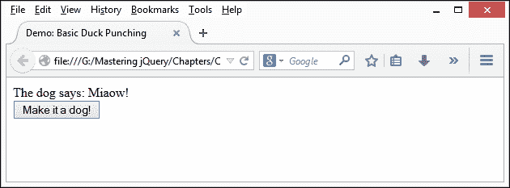

    我们明显需要让它看到自己行为的错误，所以现在让我们来修复它。

1.  要解决问题，我们需要覆盖原来的`toBark()`函数。使用我们新的修复替代品；这将采用猴子补丁的形式。将以下代码插入到`.on()`点击处理程序的下方，留出一行空白以提高清晰度：

    ```js
    (function($) {
      var orig = $.fn.toBark;
      $.fn.toBark = function() {
        orig.apply(this,arguments);
        if (this.text() === 'The dog says: Miaow!') {
          this.append(" *Punch* Miaow! *Punch* *Punch* 
          Woof?... *Gives Dog a chew*");
        }
      };
    }(jQuery));
    ```

1.  如果一切顺利，我们现在至少应该看到我们的狗已经恢复了理智，虽然是逐渐地，如下截图所示：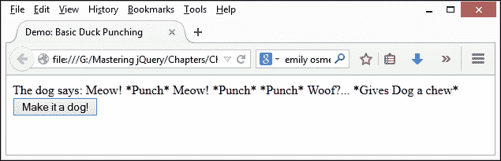

尽管这个小练习虽然极为简化，但它阐明了一些关键点——花点时间更详细地研究一下这一点是值得的，所以现在让我们来做一下。

## 解析我们的猴子补丁

对核心库进行补丁的过程应该谨慎和慎重；技术过程可能很简单，但首先需要回答一些问题。我们将在本章后面讨论其中的一些问题，但现在，让我们假设我们需要应用一个补丁。

基本补丁采用了 IIFE 的格式——我们将所有功能都包含在一个单独的模块中；其范围受到其所放置环境的保护。

### 注

要了解 IIFE 的更详细解释，请参考[`en.wikipedia.org/wiki/Immediately-invoked_function_expression`](http://en.wikipedia.org/wiki/Immediately-invoked_function_expression)。

在我们的例子中，我们首先将原始函数存储为一个对象`orig`的副本。然后我们启动我们的新替换`.toBark()`函数，在其中我们首先调用`.toBark()`函数，但紧随其后进行替换：

```js
(function($) {
  var orig = $.fn.toBark;
  $.fn.toBark = function() {
    orig.apply(this,arguments);
    if (this.text() === 'The dog says: Miaow!') {
      this.append(" *Punch* Miaow! *Punch* *Punch* 
      Woof?... *Gives Dog a chew*");
    }
  };
}(jQuery));
```

我们补丁的一个关键部分是使用`.apply()`函数——这将调用一个函数，并将上下文设置为应用函数的对象。在这种情况下，在函数内部引用`this`关键字将指向该对象。

在我们的演示中使用的 IIFE 的格式有许多优点，如下：

+   我们可以减少作用域的查找——IIFE 允许您将常用的对象传递给匿名函数，因此它们可以在 IIFE 中被引用为本地作用域的对象

    ### 注

    由于 JavaScript 首先在本地范围内查找属性，这消除了全局查找的需要，提供更快的查找速度和性能。使用 IIFE 可以防止局部变量被全局变量覆盖。

+   IIFE 可通过压缩来优化代码——我们可以将对象作为本地值传递给 IIFE；压缩器可以将每个全局对象的名称缩减为单个字母，前提是没有一个变量已经具有相同的名称

使用 IIFE 的缺点是可读性；如果我们的 IIFE 包含大量代码，那么必须滚动到顶部才能弄清楚正在传递哪些对象。在更复杂的示例中，我们可以考虑使用 Greg Franko 开发的模式以解决这个问题：

```js
(function (library) {
  // Call the second IIFE and locally pass in the global jQuery, 
  window, and document objects
  library(window, document, window.jQuery);
}
// Locally scoped parameters
(function (window, document, $) {
  // Library code goes here
}));
```

需要注意的是，这种模式是将变量分为两个部分，以便我们可以避免过度上下滚动页面的需要；它仍会产生相同的最终结果。

我们将更深入地讨论在 jQuery 中使用模式，第三章中的*整理你的代码*。现在我们已经看到了一个补丁的作用，让我们继续并花点时间考虑一下我们可以从使用猴子补丁过程中获得的一些好处。

# 考虑猴子补丁的好处

好了，所以我们已经看到了一个典型的补丁是什么样子；然而，问题是，为什么我们要使用这种方法来打补丁核心库功能呢？

这是一个非常好的问题-这是一个有风险的方法（正如我们将在本章稍后在*考虑 Monkey Patching 的缺陷*部分看到的）。使用这种方法的关键是要有所考虑的方法；考虑到这一点，让我们花一点时间考虑一下插入 jQuery 的好处：

+   我们可以在运行时替换方法、属性或函数，其中它们缺乏功能或包含需要修复而不能等待官方补丁的 bug。

+   Duck punching jQuery 允许你修改或扩展 jQuery 的现有行为，而无需维护源代码的私有副本。

+   我们有一个安全网，可以将补丁应用于运行在内存中的对象，而不是源代码；换句话说，如果完全出错，我们可以简单地从站点中撤回补丁，并保持原始源代码不变。

+   Monkey patching 是一种很好的方法，用于分发与原始源代码并存的安全或行为修复；如果对补丁的弹性有任何疑问，我们可以在提交到源代码之前进行压力测试。

言归正传，让我们开始编写一些演示代码！我们将逐步介绍一些示例补丁，这些补丁同样适用于 jQuery，从动画开始。

# 更新 jQuery 中的动画支持

如果你花了任何时间用 jQuery 开发，你很可能创建了一些形式的动画，其中包括以固定频率管理更改-这听起来熟悉吗？

当然，我们可以使用`setInterval()`函数来实现这一点，但它-像`setTimeOut()`函数一样-并不理想。这两个函数在启动之前都有一个延迟，这个延迟因浏览器而异；它们都同样占用资源！

相反，我们可以使用**requestAnimationFrame**（**rAF**）API，这个 API 现在由大多数现代浏览器支持，根据来自[caniuse.com](http://caniuse.com)的这个图表，绿色标签显示了哪些浏览器版本支持**requestAnimationFrame**：

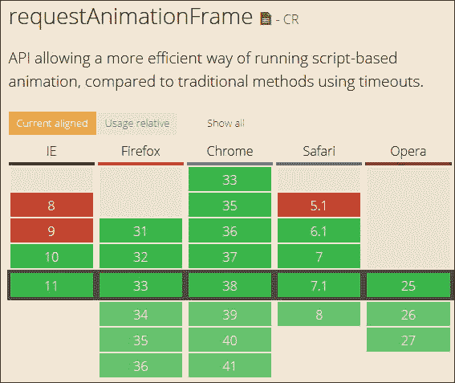

[requestAnimationFrame（rAF）API](http://caniuse.com)的伟大之处在于它占用的资源较少，不会影响页面上的其他元素，并且在失去焦点时被禁用（非常适合减少功耗！）。因此，你可能会认为默认情况下在 jQuery 中实现它是有道理的，对吗？

## 探索 requestAnimationFrame API 的过去

具有讽刺意味的是，jQuery 在 1.6.2 版本中使用了 rAF；在 1.6.3 中被取消了，主要是因为当窗口重新获得焦点时，动画会堆积起来。部分原因可以归因于 rAF 的（错误）使用方式，以及为了纠正这些问题需要进行重大更改。

### 注意

要查看一些与时序相关的问题，请访问[`xlo.co/requestanimationframe`](http://xlo.co/requestanimationframe)——该站点上有一些演示，完美地说明了为什么时序如此关键！

## 今天使用 requestAnimationFrame 方法

幸运的是，今天我们仍然可以使用 requestAnimationFrame 与 jQuery；jQuery 的开发者之一 Corey Frang 编写了一个插件，可以钩入并重写核心库中的`setInterval()`方法。

### 注意

该插件的原始版本可从 GitHub 下载，网址为[`github.com/gnarf/jquery-requestAnimationFrame/blob/master/src/jquery.requestAnimationFrame.js`](https://github.com/gnarf/jquery-requestAnimationFrame/blob/master/src/jquery.requestAnimationFrame.js)。

当我们使用 jQuery 时，这可能是我们可以做出的最简单的更改之一——在练习结束时，我们将探讨这个问题以及更多其他问题。现在，让我们继续编写一些代码吧！

## 创建我们的演示

对于我们的下一个演示，我们将使用开发者 Matt West 创建的 CodePen 示例的更新版本——原始演示可从[`codepen.io/matt-west/pen/bGdEC/`](http://codepen.io/matt-west/pen/bGdEC/)获取；我更新了外观并移除了 Corey 插件的供应商前缀元素，因为它们已不再需要。

为了让你对我们即将实现的内容有所了解，我们将重写主`setInterval`方法；尽管它可能看起来像是调用了 jQuery 方法，但实际上`setInterval`是一个纯 JavaScript 函数，如下所示：

```js
jQuery.fx.start = function() {
  if ( !timerId ) {
    timerId = setInterval( jQuery.fx.tick, jQuery.fx.interval );
  }
};
```

我还更改了字体——为了这个演示，我使用了 Noto Sans 字体，可以从[`www.fontsquirrel.com/fonts/noto-sans`](http://www.fontsquirrel.com/fonts/noto-sans)下载；如果您想使用其他字体，请随意相应地更改代码。

准备好了吗？让我们开始执行以下步骤：

1.  从随书附带的代码下载链接中提取`raf.css`、`raf.js`和`raf.html`文件，并将它们保存到项目文件夹中。

1.  在一个新文件中，添加以下代码——这是我们的猴子补丁或 Corey 原始插件的修改版本。我们首先初始化了一些变量，如下所示：

    ```js
    (function( jQuery ) {
      var animating,
          requestAnimationFrame = window.requestAnimationFrame,
          cancelAnimationFrame = window.cancelAnimationFrame;

          requestAnimationFrame = window["RequestAnimationFrame"];
          cancelAnimationFrame = window["CancelAnimationFrame"];
    ```

1.  接下来是动画函数，它从主`requestAnimationFrame`方法中调用：

    ```js
      function raf() {
        if ( animating ) {
          requestAnimationFrame( raf );
          jQuery.fx.tick();
        }
      }
    ```

1.  现在我们需要我们的主`requestAnimationFrame`方法；继续在`raf()`事件处理程序的下方直接添加以下代码行：

    ```js
    if ( requestAnimationFrame ) {
      // use rAF
      window.requestAnimationFrame = requestAnimationFrame;
      window.cancelAnimationFrame = cancelAnimationFrame;
      jQuery.fx.timer = function( timer ) {
        if ( timer() && jQuery.timers.push( timer ) && !animating ) {
          animating = true;
          raf();
        }
      };
      jQuery.fx.stop = function() {
        animating = false;
      };
    } ( jQuery ));
    ```

1.  将文件保存为`jquery.requestAnimationFrame.js`，放在主项目文件夹下名为`js`的子文件夹中。

1.  如果在浏览器中运行演示，当你按下**开始动画**时，你会看到进度条移动，如下图所示：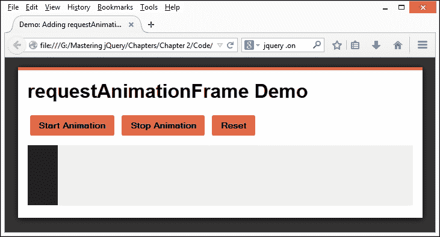

1.  为了证明插件正在被使用，我们可以使用谷歌浏览器的**Developer Tools**中的**Timeline**选项——点击红色的**Record**图标，然后运行演示，然后停止它产生以下内容：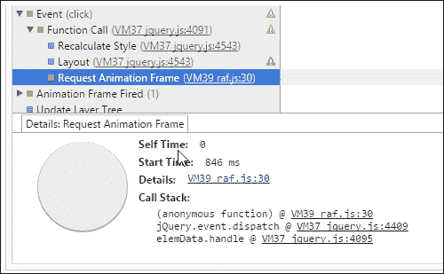

    ### 提示

    确保在**Timeline**下勾选了**JS Profiler**复选框——将会显示详细信息；可能需要向下滚动查看**Event**条目。

这可能是我们能在 jQuery 中最容易进行的覆盖功能的改变之一，但也可能是最具争议性的之一——后者是由我们如何使用它决定的。然而，关键点是，我们可以使用多种格式覆盖功能。

最安全的方法是使用插件；在我们的例子中，我们使用了一个修改过的插件——原始插件是从 jQuery 1.8 引入的，所以这里做的改动只是将它带入了现代化。我们当然也可以完全走向相反的方向，创建一个覆盖现有功能的函数——这更有风险，但如果小心操作，是值得的！让我们看一个简单的例子，通过覆盖`.hasClass()`来在适当时切换到 WebP 格式的图片。

# 添加 WebP 支持到 jQuery

在这一点上，我有一个小小的坦白：为 jQuery 添加全面的 WebP 支持可能会超出本书的范围，更别提填满大部分页面了！

### 注意

WebP 是谷歌创建的一种比标准 PNG 文件压缩更好的相对较新的图像格式，您可以在[`developers.google.com/speed/webp/`](https://developers.google.com/speed/webp/)上了解更多。目前，Chrome 和 Opera 原生支持这种格式；其他浏览器在添加支持后也将显示 WebP 图像。

下一个演示实际上是关于我们如何根据浏览器是否支持新格式来在屏幕上显示内容的两种不同方式之间进行切换的。一个很好的例子是，我们可以尽可能使用 CSS3 动画，并在那些不原生支持 CSS3 动画的浏览器上回退到使用 jQuery。

在我们的下一个演示中，我们将使用类似的原理创建一个 monkey patch，以覆盖`.hasClass()`方法，以便在支持的情况下自动切换到 WebP 格式的图片。

### 注意

如果你想了解更多，可以在[`blog.teamtreehouse.com/getting-started-webp-image-format`](http://blog.teamtreehouse.com/getting-started-webp-image-format)上找到一个有用的讨论，介绍了如何开始使用这种格式。

## 入门

为了展示这个演示，我们需要使用两种不同格式的图片；我先假设 JPEG 被用作我们的基本格式。另一张图片，当然，需要是 WebP 格式的！

如果您还没有准备好将图像转换为 WebP 格式的方法，那么您可以使用谷歌提供的工具来进行转换，这些工具可在[`developers.google.com/speed/webp/download`](https://developers.google.com/speed/webp/download)下载。这里提供了 Windows、Linux 和 Mac OS 的下载版本——在本练习中，我将假设您正在使用 Windows：

1.  在下载页面上，单击[`downloads.webmproject.org/releases/webp/index.html`](http://downloads.webmproject.org/releases/webp/index.html)，然后查找`libwebp-0.4.2-windows-x64.zip`（如果您仍在使用 32 位 Windows 平台，请选择`x86`版本）。

1.  下载后，将`libwebp-0.4.2-windows-x64`文件夹解压缩到项目文件夹中的一个安全文件夹中，然后导航到其中的`bin`文件夹。

1.  打开第二个资源管理器视图，然后导航到您存储图像的位置，并将其复制到`bin`文件夹中。

1.  打开命令提示符，然后导航到`C:\libwebp-0.4.2-windows-x64\bin`。

1.  在提示符下，输入此命令，将两个名称分别替换为您的 JPEG 和 WebP 图像的名称：

    ```js
    cwebp <name of JPG image> -o <name of WebP image>

    ```

1.  如果一切顺利，我们将会得到一个类似于以下屏幕截图的屏幕，并且我们的 WebP 格式图像将会出现在`bin`文件夹中：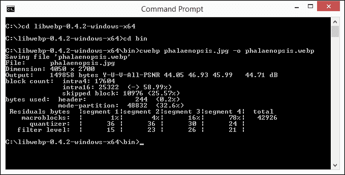

1.  最后一步是将图像复制到我们的项目文件夹中，以便在我们的演示的下一阶段中使用。

## 创建我们的补丁

现在我们准备好了图片，可以开始设置我们演示的标记了：

1.  现在，将以下代码复制到一个新文件中，并将其保存为`replacewebp.html`：

    ```js
    <!DOCTYPE html>
    <head>
      <title>Demo: supporting WebP images</title>
      <script src="img/jquery.js"></script>
      <script src="img/jquery.replacewebp.js"></script>
    </head>
    <body>
      
    </body>
    </html>
    ```

1.  接下来，我们需要添加我们的猴子补丁——在一个新文件中，添加以下代码并将其保存为`jquery.replacewebp.js`。这涉及到一些更复杂的内容，所以我们将分块介绍，从标准声明开始：

    ```js
    (function($){
      var hasClass = $.fn.hasClass;
      $.fn.hasClass = function(value) {
        var orig = hasClass.apply(this, arguments);
        var supported, callback;
    ```

1.  接下来是执行测试以查看我们的浏览器是否支持使用 WebP 图像格式的函数；将以下代码立即添加到变量分配的下方：

    ```js
    function testWebP(callback) {
      var webP = new Image();
      webP.src = "data:image/webp;   base64,UklGRi4AAABX"
      + "RUJQVlA4TCEAAAAvAUAAEB8wAiMw"
      + "AgSSNtse/cXjxyCCmrYNWPwmHRH9jwMA";
      webP.onload = webP.onerror = function () {
        callback(webP.height == 2);
      };
    };
    ```

1.  接下来，我们使用`testWebP`函数来确定我们的浏览器是否支持 WebP 图像格式——如果支持，我们将更改所使用的文件扩展名为`.webp`，如下所示：

    ```js
    window.onload = function() {
      testWebP(function(supported) {
        console.log("WebP 0.2.0 " + (supported ? "supported!" : "not 
        supported."));
        $('.webp').each(function() {
          if (supported) {
            src = $(this).attr('src');
            $(this).attr('src', src.substr(0, src.length-3) + 'webp');
            console.log("Image switched to WebP format");
          }
      })
    });
    }
    ```

1.  我们通过执行函数的原始版本来完成我们的函数，然后用与 IIFE 通常关联的关闭括号终止它：

    ```js
       return orig;
      };
    })(:jQuery);
    ```

1.  然后，我们需要再添加一个函数——这用于启动对`.hasClass()`的调用；继续添加以下代码行到猴子补丁函数的下方：

    ```js
    $(document).ready(function(){
      if ($("img").hasClass("webp")) {
        $("img").css("width", "80%");
      }
    });
    ```

1.  如果一切顺利，当我们运行我们的演示时，我们将看到一幅蝴蝶兰或蛾蝶兰的图像，如下面的屏幕截图所示：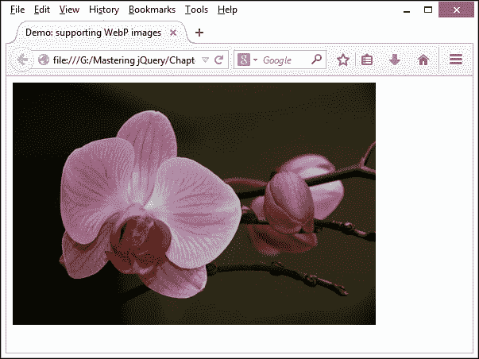

这一点并没有什么特别之处；实际上，你可能在想我们到底产生了什么，对吧？

啊哈！如果你使用 DOM 检查器（如 Firebug）检查源代码，就会看到这个问题的答案，如下所示：

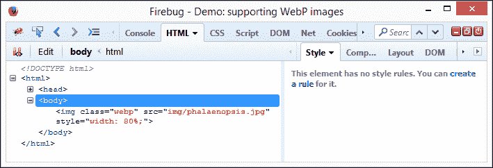

注意它正在显示 JPEG 格式的图像？那是因为 Firefox 在出厂时不支持这种格式；只有 Google Chrome 支持：

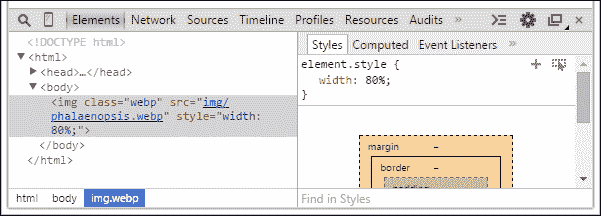

如果您切换到使用 Google Chrome，则可以通过按下*Ctrl* + *Shift* + *I*来查看源代码。您可以清楚地看到所使用格式的变化。如果您仍然怀疑，甚至可以查看 Google Chrome 的**控制台**选项卡。在这里，它清楚地显示了引用了补丁，因为它显示了您期望看到的两条消息：

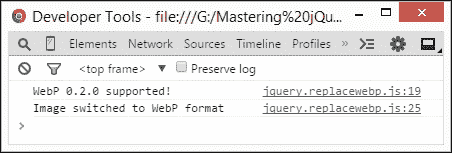

我们已经创建了我们的补丁，它似乎运行正常——这就是我们需要做的全部了，对吗？错，还有更多步骤我们应该考虑，其中一些甚至可能会阻止我们将补丁发布给更广泛的受众，至少暂时是这样。

有一些我们需要考虑的要点和可能需要采取的行动；让我们暂停一下，考虑一下我们需要从这里走向何方，就开发而言。

## 进一步的事情

在这个示例中，我们重写了一个现有方法来说明“鸭子打”——实际上，在发布之前，我们需要再花一些时间来完善我们的补丁！

这样做的主要原因是下载比我们实际需要的内容多；为了证明这一点，看一下在 Google Chrome 中运行演示时的**资源**选项卡：

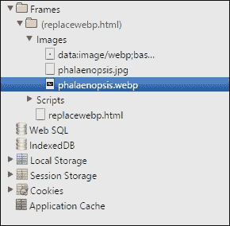

就像我们需要进一步确认一样，**时间轴**选项卡中的这段摘录也确认了 JPEG 和 WebP 图像的存在以及对下载时间的影响：

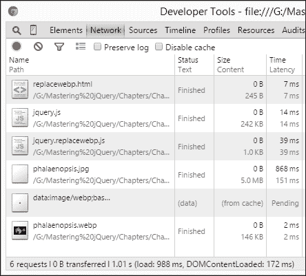

我们在这里创建了一个补丁，以说明*可以*做什么；实际上，我们很可能会包含代码来执行不同的操作在我们的内容上。首先，我们可以做以下操作：

+   包括支持更多的图像格式——这可以包括 JPEG，GIF 或 SVG。

+   将代码硬编码为接受一个图像格式；通过使其更通用，我们可以扩展我们补丁的可用性。

+   jQuery 正朝着基于插件的架构发展；我们真的应该考虑修补核心代码吗？在代码中创建一个钩子可能会更有用，这样可以使用新插件扩展现有功能。

+   我们使用了`.hasClass()`作为覆盖现有方法的基础；这真的是最合适的做法吗？虽然乍一看可能很有用，但实际上，其他人可能不同意我们覆盖`.hasClass`的选择，并认为其他方法更有用。

有很多问题可能会被提出并需要回答；只有经过仔细考虑，我们才能最大程度地使我们的补丁成功，并有可能考虑提交到核心中。

让我们改变方法，转而考虑猴子补丁的一个关键部分。这个过程有其风险，所以让我们花点时间考虑一下这些风险以及这些风险可能对我们的工作产生的影响。

# 考虑猴子补丁的缺陷

现在我们已经看到一些示例在实际中的应用，值得花点时间考虑一下对库进行猴子补丁的一些风险，比如 jQuery：

+   主要风险，也是最容易造成麻烦的风险是冲突。想象一下，您已经创建了一个包含一些函数的补丁——我们将这些函数称为 `1`、`2` 和 `3`。添加另一个补丁，重要的是我们不要使用相同的函数名称；否则，很难确定 `1`、`2` 或甚至 `3` 哪一个先执行？

+   另一个风险是安全性。如果 jQuery 等库可以进行猴子补丁，那么有什么能阻止任何人引入破坏现有代码的恶意构造？可以认为此风险在客户端脚本中始终存在；与标准插件相比，当您覆盖核心 jQuery 功能时，风险更大。

+   总会有一个风险，即对核心库的升级可能会引入更改，不仅会破坏您的补丁，而且会删除或修改否则可以为您的补丁提供基础的功能。这将阻止使用 jQuery 的网站升级，并最终使其容易受到攻击。

+   添加过多没有经过仔细考虑的补丁将使您的 API 庞大且缓慢；这将降低响应速度并使其更难管理，因为我们必须花更多时间剖析代码，然后才能找到问题的关键所在。

+   任何猴子补丁都应该真正保留在您的网站内部；它们将基于直接修改 jQuery 的代码，而不是使用标准 jQuery 插件提供的预定义机制。作者可能没有像他们为插件所做的那样广泛地测试他们的猴子补丁；如果您使用别人的补丁，这会带来更大的风险。

+   如果一个补丁包含大量函数，则更改核心功能的影响范围更广更大；进行这些更改可能会破坏其他人的补丁或插件。

哎呀！这里有严重的问题！如果我们面临这些风险，那么为什么还要使用这个过程呢？

这是一个很好的问题；适当使用时，猴子补丁是一种有用的技术，可以提供额外的功能或纠正问题。它甚至可以作为提交之前对代码进行压力测试的手段。还有一个论点认为功能应该包含在插件中，有充分的理由：

+   插件可以发布供他人使用；如果插件可用，他们可以通过 GitHub 等网站贡献修复或更新。

+   插件可能与 jQuery 的更多版本兼容，而不仅仅是简单的补丁；后者可能专门用于修复特定问题。

+   制作一个覆盖多个修复的补丁可能会导致文件大小较大或核心功能的许多更改；这在插件框架内更好地管理，可以包括其他功能，如国际化。

+   jQuery Core 正在朝着更精简、更快速的架构发展；添加大量补丁将增加冗余功能的水平，并使其对其他开发人员的使用不太吸引人。

猴子补丁的关键不是滥用它；这是一个有效的工具，但只有在耗尽所有其他可能的解决方案后才真正有效。如果您急需修复问题并且不能等待官方更新，那么考虑猴子补丁 jQuery—只是要小心如何操作！

# 分发或应用补丁。

一旦我们的补丁完成，我们需要分发它；诱人的是简单地更新 jQuery 版本并与我们的插件一起发布，或在我们的网站中使用它。然而，使用这种方法有一些缺点：

+   我们无法利用浏览器的缓存功能；如果我们使用缓存版本的 jQuery，则要么不包含我们的修补代码，要么从服务器拉取一个新副本。

+   对 jQuery 的副本进行补丁意味着我们被锁定在那个版本的 jQuery 上。这会阻止最终用户能够使用他们自己的 jQuery 版本、CDN 链接，甚至是更新的 jQuery 版本（假设补丁仍然有效！）。

+   允许补丁在运行时独立运行意味着它只会修补源代码中的对象；如果出现严重错误，那么我们可以放弃该补丁，仍然保留干净（未补丁）的 jQuery 版本。对源代码进行更改并不会给我们带来这种便利。

相反，我们可以使用一些替代方法来应用补丁：

+   我们可以简单地在插件或网站内的单独文件中包含我们的补丁—这样可以保持核心 jQuery 库的清洁，尽管这意味着从服务器请求补丁文件的轻微开销。用户然后可以简单地链接到运行时文件的副本，并在情况发生变化时丢弃。

+   补丁也可以作为 Gist 分发—这使其独立于我们的网站或插件，并允许其他人评论或提出建议，这些建议可以纳入我们的代码中。

    ### 注意

    例如，我为`replacewebp.js`补丁创建了以下 Gist—这可以在 [`gist.github.com/alibby251/89765d464e03ed6e0bc1`](https://gist.github.com/alibby251/89765d464e03ed6e0bc1) 上找到，并且可以链接到项目中作为分发代码的手段：

    ```js
    <script src="img/89765d464e03ed6e0bc1.js"></script>
    ```

+   如果补丁在 GitHub 存储库中可用—作为现有项目的一部分或独立存在。GitHub 将允许用户提交拉取请求以帮助改进现有补丁，然后再考虑提交到核心。

+   我们还有另一种选择：补丁可以通过前端包管理器（如 Bower ([`www.bower.io`](http://www.bower.io)) 或 Jam ([`www.jamjs.org`](http://www.jamjs.org))）进行打包和交付。

    ### 注意

    有关通过 Bower 下载包装内容的更多信息，请参阅 [`bower.io/docs/creating-packages/`](http://bower.io/docs/creating-packages/)。

这些是我们可以使用的分发补丁的一些选项；使用其中一些选项意味着我们可以让我们的补丁面向最广泛的受众，并希望从他们的测试和反馈中受益！

# 概要

在过去的几页中，我们涵盖了大量内容，其中一些可能会让你头晕，所以让我们喘口气，思考一下我们所学到的内容。

我们从介绍库的打补丁开始，比如 jQuery，并介绍了“鸭子补丁”（或者叫做猴子补丁）。我们看了如何使用这种方法替换或修改 jQuery 的现有行为，然后开始创建一个基本的猴子补丁，并详细解释了其在代码中的应用。

接下来，我们将看一下使用猴子补丁可以获得的一些好处；我们谈到了涉及的风险以及在创建和应用补丁时需要考虑的一些缺陷。

然后我们转而逐步完成了一些演示，探讨了一些我们可以暂时修改代码的方式，最后看了一下如何将我们的补丁用于生产环境。

开发任何形式的补丁或插件都需要保持良好的代码才能成功。在下一章中，我们将看到如何通过学习设计模式来改善我们在这个领域的技能，以更好地组织我们的代码。
