# 第三章：组织你的代码

是否组织代码，这是问题…

在我们迄今的旅程中，我们已经涵盖了下载 jQuery 的各种方式，以及如何用自定义代码覆盖核心功能，但是——误引用那位著名的侦探：我们应该如何组织我们的代码？

好吧，你可能会认为我在这里搞疯了，但请跟我坚持下去；精通 jQuery 这样的语言不仅仅是制作复杂的代码，而是编写结构良好、简洁、易于阅读的代码。

在这一章中，我们将回到基础，介绍 jQuery 中可用的一些设计模式。我们将看到本章讨论的一些技术如何帮助改善您的代码格式，并使您成为更好的编码人员。在本章中，我们将涵盖以下主题：

+   介绍设计模式以及为什么我们应该使用它们

+   分解设计模式的结构

+   探索不同设计模式的一些示例以及使用它们的好处

+   探索 jQuery 库中的模式使用

准备好开始了吗？让我们开始…

# 介绍设计模式

有多少次你看网站时对美丽的设计感到惊叹，只是发现代码看起来像传说中的一团糟？一个常见的误解是外观是设计师的领域；这并不正确，因为代码的设计同样重要。

我们如何绕过这个问题？很简单，我们可以使用**设计模式**或一组构造，帮助提供解决方案，并让我们更专注于项目中想要提供的功能。

最初是由建筑师克里斯托弗·亚历山大于 1977 年创立的，工程师们自那时以来一直使用这些早期原则，并发展成我们现在知道的设计模式。这项工作后来在 1995 年由**四人组**（GoF）在他们标志性的书籍*设计模式：可复用的面向对象软件元素*中进一步推广。

它们不仅推动了设计模式的应用范围，还提供了一些设计技巧和陷阱；它们还对提供今天经常使用的二十三种核心模式起到了重要作用（其中，我们将涵盖在 jQuery 开发中常用的模式）。我们将看看今天正在使用的一些模式，但首先，让我们回答一个简单的问题。设计模式真正意味着什么，它们如何帮助我们编写清晰简洁的代码，从而减少不必要的重复？

# 定义设计模式

在基本层面上，设计模式采用预定义模板或一组可重用原则的格式，帮助对不同方法进行分类，作为支持良好设计的一部分。

为什么使用它们？很简单，将设计模式纳入我们的项目有三大好处：

+   **设计模式是经过验证的解决方案**：它们基于解决软件开发中问题的坚实方法，并基于帮助创建所使用模式的开发人员的经验

+   **模式可重用**：尽管它们通常代表一个现成的解决方案，但它们可以根据我们的需求轻松适应。

+   **模式是表达性的**：它们包含一组结构和词汇，帮助您清晰而优雅地表达大型解决方案

此时，您可能会原谅以为模式必须是一门精确的科学，我们受到所使用模式框架的限制。事实并非如此；它们并不是一个确切的解决方案，而仅仅是一个帮助提供解决方案的方案。

更进一步地，我们应考虑在工作中使用设计模式的其他几个原因：

+   我们可以有效地编写或预防可能在开发过程中稍后造成重大问题的小问题——使用经过验证的技术消除了对我们代码结构的担忧，并使我们能够专注于我们解决方案的质量。

+   模式旨在提供通用解决方案，不将其限制在特定问题上，而是可应用于改善我们代码的结构。

+   一些模式，如果明智地选择，可以帮助减少代码量，避免重复；它们鼓励我们仔细查看我们的代码，减少重复，并坚持使用**不要重复自己**（**DRY**）原则，这是 jQuery 的基本原则之一。

+   模式不是一次性、一时半刻的解决方案；我们的工作可能有助于改善现有设计，甚至提供创造新模式的范围！这种持续改进有助于确保模式随着时间的推移变得更加健壮。

不论其目的如何，设计模式的一个关键原则是，除非它们经过模式社区的严格测试，否则它们并不总被视为设计模式。许多可能看起来像是模式；实际上，它们更可能是原型模式或者一个已经被创建但尚未被充分测试以被视为真正模式的模式。

任何设计模式的核心原则都基于亚历山大的信念，即它们应始终代表一个过程和一个产出。后一术语被故意地设定得模糊一些；它应该代表一些可视的东西，但具体的视觉输出内容将取决于所选模式的上下文。

所以，既然我们已经看到了设计模式是什么，让我们讨论一下它们是什么样子的。它们由特定的元素或结构组成吗？在我们查看一些示例之前，让我们首先考虑一下设计模式的组成和我们如何有效使用它。

# 解剖设计模式的结构

如果您仔细查看任何设计模式，您会发现它由一个规则组成，该规则建立了以下内容之间的关系：

+   一种上下文

+   在该上下文中产生的一系列力量

+   允许这些力量在上下文中自行解决的配置

这三个关键方面可以进一步分解为许多不同的元素，除了模式名称和描述之外：

| 元素 | 目的或功能 |
| --- | --- |
| 上下文概述 | 模式有效的上下文，以响应用户的需求。 |
| 问题陈述 | 解决的问题陈述，以便我们了解模式的意图。 |
| 解决方案 | 描述用户问题如何在易于理解的步骤和感知列表中解决。 |
| 设计 | 模式设计的描述，特别是用户与其交互时的行为。 |
| 实现 | 模式将如何实现的指南。 |
| 插图 | 模式中类的可视化表示，如 UML 图表。 |
| 示例 | 模式的最小形式实现。 |
| 先决条件 | 用于支持描述的模式使用的其他模式是什么？ |
| 关系 | 这种模式是否类似（或模仿）任何现有模式？ |
| 已知用法 | 这种模式是否已经在实际应用中使用？如果是，是在哪里以及如何使用？ |
| 讨论 | 团队或作者关于使用模式的好处的想法。 |

使用模式的美妙之处在于，虽然在规划和文档编制阶段可能需要一定的努力，但它们是有用的工具，有助于使团队中的所有开发人员保持一致。

在创建新模式之前，先看看现有模式是值得的——可能已经有人在使用，这样就减少了从头设计并经过漫长的测试过程的必要性，才能被其他开发人员接受。

# 模式分类

现在我们已经了解了典型设计模式的结构，让我们花点时间考虑一下可用的模式类型。模式通常分为以下三类，这是最重要的类别之一：

+   **创建型模式**：这些模式关注我们如何创建对象或类。虽然这听起来可能很简单（在某些方面，比如常识），但它们在需要控制对象创建过程的大型应用程序中可能非常有效。创建型模式的示例包括抽象、单例或建造者。

+   **结构设计模式**：这些模式关注如何管理对象之间的关系，以使您的应用程序以可扩展的方式构建架构。结构模式的一个关键方面是确保应用程序的一个部分的更改不会影响到所有其他部分。该组涵盖了诸如代理、适配器或外观等模式。

+   **行为模式**：这些模式关注对象之间的通信，包括观察者、迭代器和策略模式。

有了这个想法，让我们花点时间探索一些常用的设计，从**组合模式**开始。

## 组合模式

如果你花时间用 jQuery 开发，你有多频繁地编写类似于这样的代码：

```js
// Single elements
$("#mnuFile").addClass("active");
$("#btnSubmit").addClass("active");

// Collections of elements
$("div").addClass("active");
```

没有意识到的是，我们正在使用组合模式的两个实例——它是结构模式组中的一个成员；它允许您以相同的方式对单个对象或一组对象应用相同的处理，而不管我们要定位多少个项目。

简而言之，当我们对一个元素或一组元素应用方法时，会应用一个 jQuery 对象；这意味着我们可以以统一的方式处理任何一个集合。

那么，这意味着什么？让我们看看另外一些例子：

```js
// defining event handlers
$("#tablelist tbody tr").on("click", function(event) {
  alert($(this).text());
});
$('#btnDelete').on("click", function(event) {
  alert("This item was deleted.");
});
```

使用组合模式的优点在于，我们可以在每个实例中使用相同的方法，但对每个元素应用不同的值；它为最终用户提供了一个统一的界面，同时在后台无缝应用更改。

### 组合模式的优缺点

使用组合模式可以简单也可以复杂；使用这种模式有优点和缺点，我们应该考虑：

+   我们可以对顶级对象调用一个函数，并将其应用于结构中的任何一个或所有节点，产生相同的结果。

+   组合设计中的所有对象都是松散耦合的，因为它们都遵循相同的接口。

+   组合设计为对象提供了一个良好的结构，而不需要将它们保存在数组中或作为单独的变量。

使用组合模式也有一些缺点；以下是需要考虑的主要问题：

+   我们并不总是能够确定我们正在处理单个项还是多个项；API 对单个项和多个项使用相同的模式。

+   如果组合模式超出一定大小，您的站点的速度和性能将受到影响。

让我们继续看看更多的模式；接下来是**适配器模式**。

## 适配器模式

我们可以使用 jQuery 来切换分配给选择器的类；但在某些情况下，这可能会过于复杂，或者给选择器分配类可能会出现我们需要避免的问题。幸运的是，我们可以使用 `.css()` 函数直接将样式应用于我们的元素——这是在 jQuery 中使用适配器模式的一个很好的例子。

基于结构设计模式的一种模式，适配器模式将 jQuery 中元素的接口转换为与特定系统兼容的接口。在这种情况下，我们可以使用 `.css()` 形式的适配器为我们选择的元素分配 CSS 样式：

```js
// Setting opacity
$(".container").css({ opacity: 0.7 });

// Getting opacity
var currentOpacity = $(".container").css('opacity');
```

这样做的美妙之处在于一旦样式设置好了，我们可以使用相同的命令获取样式值。

### 适配器模式的优缺点

使用适配器设计模式有几个关键优点；其中一个关键优点是它能够链接两个不兼容的接口，否则这两个接口将必须保持独立。

另外，值得注意以下额外的好处：

+   适配器模式可用于在不影响其核心功能的情况下创建一个外壳，比如一个类，围绕现有的代码块。

+   这种模式有助于使代码可重用；如果情况需要，我们可以调整外壳以包含额外的功能或修改现有代码。

使用适配器模式会带来一些缺点，如果我们不小心的话：

+   使用关键字如 `.css()` 存在性能成本 —— 我们真的需要使用它们吗？或者，我们可以应用一个样式类或选择器，并将 CSS 样式移到样式表中吗？

+   使用关键字，比如 `.css()`，来操作 DOM，如果我们没有简化选择器，并且如果我们使用了像这样的东西，会导致性能受损：

    ```js
    $(".container input#elem").css("color", "red");
    ```

    这在小型站点或仅轻度使用此类操作的地方可能不明显；但在较大的站点上，它将是显而易见的！

+   适配器模式允许您链接 jQuery 命令；尽管这将有助于减少需要编写的代码量，但这将以可读性为代价。链式命令会使得在以后的日期更难调试代码，特别是如果涉及到开发人员的变更；保持代码简单和清晰是有意义的，即使只是为了保持理智！

让我们继续并再次看看另一种模式，即**外观模式**。

## 外观模式

起源于法语，"façade" 翻译为 *正面* 或 *面貌* ——这是对下一个模式的完美描述；它的外观可能非常具有迷惑性，就隐藏的代码量而言！

**外观模式**，结构模式组的另一个成员，为更大、更复杂的代码提供了一个简单的接口；在某种意义上，它抽象了一些复杂性，留下了我们可以随意操纵的简单定义。外观模式的显著示例包括 DOM 操作、动画，当然还有那个经典的 AJAX！

例如，简单的 AJAX 方法，比如 `$.get` 和 `$.post` 都调用相同的参数：

```js
$.get( url, data, callback, dataType );
$.post( url, data, callback, dataType );
```

这些在本身就是另外两个函数的外观：

```js
// $.get()
$.ajax({ 
  url: url,
  data: data,
  dataType: dataType
}).done( callback );

// $.post
$.ajax({
  type: "POST",
  url: url,
  data: data,
  dataType: dataType
}).done( callback );
```

这反过来是对大量复杂代码的伪装！这种情况下的复杂性源自于需要解决 XHR 的跨浏览器差异，并且使得使用 jQuery 中的 `get`、`post`、`deferred` 和 `promises` 等操作变得轻而易举。

### 创建一个简单的动画

在非常简单的层面上，`$.fn.animate` 函数是 jQuery 中的一个外观函数的例子，因为它使用多个内部函数来实现所需的结果。因此，这是一个使用动画代码的简单演示：

```js
$(document).ready(function() {
  $("#go1").click(function() {
    $("#block1")
      .animate({width: "85%"}, {queue: false, duration: 3000})
      .animate({fontSize: "24px"}, 1500)
      .animate({borderRightWidth: "15px"}, 1500);
  });

  $("#go2").click(function() {
    $("#block2")
      .animate({ width: "85%" }, 1000 )
      .animate({ fontSize: "24px" }, 1000 )
      .animate({ borderLeftWidth: "15px" }, 1000 );
  });

  $("#go3").click(function() {
    $("#go1").add( "#go2").click();
  });

  $("#go4").click(function() {
    $("div").css({width: "", fontSize: "", borderWidth: ""});
  });
})
```

上述代码将产生以下动画效果：

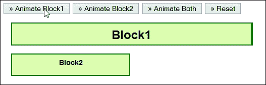

我们可以在核心库中使用下图中显示的函数：

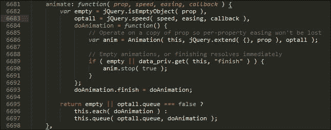

### 注意

本节演示的代码在本书附带的代码下载链接中作为 `animation.html` 文件提供；要使此演示工作正常，您需要解压整个代码文件夹。

现在您已经看到了外观模式的应用，请考虑一下在我们的代码中使用它的好处。

### 外观模式的优缺点

使用外观模式隐藏复杂代码是一种非常有用的技术；除了易于实现之外，使用这种模式还有其他优点，如下所示：

+   增强您的 Web 应用程序的安全性

+   与其他模式结合使用效果很好

+   使内部代码容易修补

+   为最终用户提供简单的公共接口

与其他模式相比，在使用这种模式时没有真正显著的缺点；它为我们作为最终用户提供了统一的接口集，因此我们不必做出任何妥协。 值得注意的是，在抽象代码时，实施中会有成本—在使用外观模式时，这是我们在心中始终要记住的事情。

## 观察者模式

由于它是行为模式组的一部分，我们将已经熟悉下一个模式——如果您花时间创建自定义事件，那么您已经在使用**观察者模式**。

使用 jQuery 开发的一个关键部分是使用其经过验证的发布/订阅系统来创建自定义事件—通过使用 `.trigger()`, `.on()`, 或 `.off()` 可以访问这些事件。 我们可以将观察者模式定义为当特定对象订阅其他对象并在特定事件发生时被通知时的模式：

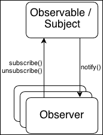

试想一下，我们有以下 HTML：

```js
<div id="div1">This is div 1</div>
<div id="div2">This is div 2</div>
```

我们希望内部的 `<div>` 元素触发一个名为 `customEvent` 的事件；当它们被点击时，就会发生这种情况：

```js
$('div').on('click', function(e) {
  $(this).trigger('customEvent');
});
```

现在，让我们使文档元素订阅 `customEvent`：

```js
$(document).on('custom', function(e) {
  console.log('document is handling custom event triggered by ' + 
  e.target.id);
});
```

当一个 `div` 元素之一触发自定义事件时，观察者/订阅者会收到通知，并且消息将记录到控制台中。

### 注：

对于纯粹主义者来说，你们可能更喜欢使用典型的发布/订阅模型——在 [`gist.github.com/cowboy/661855`](https://gist.github.com/cowboy/661855) 中提供了一个示例。

让我们考虑一下使用这种模式的好处以及在代码中可能需要做些让步来避免陷入与使用这种设计模式相关的一些陷阱。

### 观察者模式的优缺点

使用观察者模式强迫我们考虑应用程序各个部分之间的关系，远远超过我们可能习惯于考虑的水平。 它还非常擅长以下几点：

+   促进 jQuery 中的松耦合，其中每个组件都知道自己负责什么，不关心其他模块——这鼓励可重用代码。

+   让您遵循关注点分离原则；如果代码块是自包含的，它们可以在新项目中轻松重用。然后，我们可以订阅单个事件，而不必担心每个块中会发生什么。

+   帮助我们准确定位项目中的依赖关系所在，作为确定这些依赖关系是否可以通过一点努力来减少或完全消除的潜在依据。

使用观察者模式也有缺点；主要缺点是将一个订阅者从一个发布者转换到另一个发布者可能在代码方面代价高昂，并且难以维护我们代码的完整性。

为了说明这一点，让我们简要地看一下一个简单的例子，我们可以看到至少一个我们不得不为发布者的切换做出额外让步的实例。

### 创建一个基本示例

弄清楚观察者模式的工作原理至关重要；它是更深入的模式之一，并提供了比简单的协议集更多的机会，比如外观设计模式。考虑到这一点，让我们运行一个快速的演示来说明它的工作原理，如下所示：

+   让我们首先下载并提取本章的代码副本——我们需要`observer.html`文件，以及`css`和`js`文件夹。

+   如果您运行演示，您应该会看到两个标签变为红色，您可以单击它们；如果您尝试单击它们，您将看到计数增加，如此屏幕截图所示：

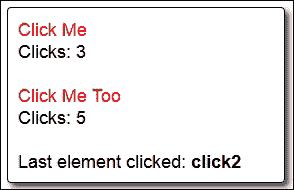

此时，让我们考虑一下代码——关键功能在`observer.js`文件中，我在此处完整复制了它：

```js
$(document).ready(function() {
  var clickCallbacks = $.Callbacks();
  clickCallbacks.add(function() {
    var count = parseInt(this.text(), 10);
    this.text(count + 1);
});
clickCallbacks.add(function(id) {
  $('span', '#last').text(id);
});
$('.click').click(function() {
  var $element = $(this).next('div') .find('[id^="clickCount"]');
  clickCallbacks.fireWith($element, [this.id]);
  });
});
```

注意一下，对于`.click`类，有一个单独的事件处理程序。我们在这里使用了一个回调函数，以允许 jQuery 执行下一个点击，即使它可能尚未完成前一个执行。在这种情况下，这不会是太大的问题，但如果我们必须更新多个不同的语句或应用更多的更改（通过使用额外的函数），那么回调将防止我们的代码产生错误。

在这里，我们订阅可观察对象，这在这种情况下是两个**点击我**语句；`.click`事件处理程序允许我们更新点击计数和**最后点击的元素**语句，而不会引发错误。

### 注意

要了解更多关于在 jQuery 中使用回调的复杂性，您可能需要浏览 API 文档，可以在[`api.jquery.com/jquery.callbacks/`](http://api.jquery.com/jquery.callbacks/)查看。

与此同时，让我们改变焦点，看看不同的模式。我们都知道 jQuery 以其 DOM 操作能力而闻名；接下来是迭代器模式，它基于 jQuery 的这一特定功能。

## 迭代器模式

现在，你听过或读过多少次 jQuery 以其 DOM 操作而闻名？我敢打赌，有相当多次，而且`.each()`关键字在这些示例中某个时候被使用过。

jQuery 中的 DOM 操作使用了行为组模式中的特殊变体——这就是它的用途；我们可以使用这种模式来遍历（或迭代）集合的所有元素，让 jQuery 处理内部工作。这种模式的一个简单示例可能是这样的：

```js
$.each(["richard","kieran","dave","alex"], function (index, value) {
  console.log(index + ": "" + value);
});

$("li a").each(function (index) {
  console.log(index + ": " + $(this).text());
});
```

在这两种情况下，我们都使用了`.each`函数来遍历数组或`li`选择器的每个实例；无需担心迭代器的内部工作原理。

我们的示例代码包含最少的代码，以便遍历页面中的每个选择器或类；值得一提的是，查看核心库中`jQuery.fn.each()`函数的代码量：

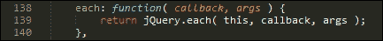

这反过来调用了`jQuery.each()`函数——第一个函数仅供内部使用，如下图所示：

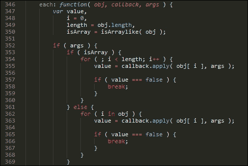

然后，这又得到了一个特殊的快速情况，即对`.each()`函数最常见用法的补充：

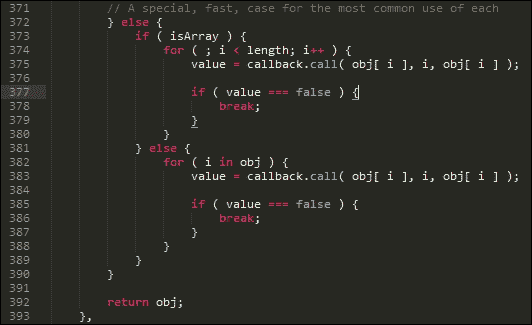

### 迭代器模式的优缺点

在 DOM 中遍历元素的能力是 jQuery 的关键要素之一——作为迭代器模式的关键部分；使用这种模式有以下一些好处：

+   迭代器模式隐藏了遍历集合所需的大部分功能，而无需理解提供此功能的代码的内部工作原理

+   我们可以使用相同的一致模式来遍历任何对象或一组值

+   使用迭代器过程还可以帮助减少或消除我们代码中典型的`for`循环语法，使代码更易读

与其他模式不同，使用这种模式几乎没有什么缺点。它是 jQuery 的一个关键方面，所以只要不被迭代过多的对象滥用，这个简单的模式将证明非常有用！

## 惰性初始化模式

呵呵，这听起来像是我周日早晨可能会遵循的东西！好吧，我知道那是一个糟糕的笑话，但是开玩笑归开玩笑，这种基于创建的模式允许您推迟昂贵的过程，直到它们被需要。

在其最简单的层面上，我们可能会使用多个不同选项来配置插件，比如要显示的图像数量，是否应该显示叠加层，或者每个图像如何显示。听起来很简单，对吧？那么，惰性初始化在哪里呢？啊哈！这比你想象的简单。以以下代码为例：

```js
$(document).ready(function(){
  $("#wowslider-container1").wowSlider();
});
```

我们的示例使用了 WOW Slider 的初始化命令（可在 [`www.wowslider.com`](http://www.wowslider.com) 上获取）—使用这种模式的关键在于初始化过程；直到第一次在我们的页面上需要时才触发它。

懒惰初始化模式的一个更复杂的示例是回调；这些不会在 DOM 准备好之前进行处理：

```js
$(document).ready( function () {
  var jqxhr = $.ajax({
    url: "http://domain.com/api/",
    data: "display=latest&order=ascending"
  })
  .done( function( data ) ){
  $(".status").html( "content loaded" );
  console.log( "Data output:" + data );
  });
});
```

我们可能会直接在我们的代码中使用这个示例；更可能的是我们会在懒加载插件中使用它，比如 Mika Tuupola 在 [`www.appelsiini.net/projects/lazyload`](http://www.appelsiini.net/projects/lazyload) 上的版本。

### 懒惰初始化模式的优缺点

使用这种设计模式的关键优势很简单：延迟加载昂贵资源的加载；这有助于加快对站点的访问速度，并减少带宽使用（至少最初是如此）。

但是，使用这种方法还存在一些缺点，包括以下：

+   它需要通过设置标志来进行仔细管理，以测试所召唤对象是否准备好使用；如果不是，那么在多线程代码中可以生成竞争条件

+   任何懒变量或对象的先前使用都将绕过首次访问时的初始化原则，并意味着我们失去了不加载这些大对象或变量的任何好处。

+   这种方法需要使用映射来存储实例，以便在下次以前使用相同参数向存储实例请求时得到相同的实例

+   使用这种模式涉及时间成本，如果需要加载大型对象；如果最初不加载这些对象，并且有很大的可能性它们不会被使用，那么这种模式才真正起作用

最终，使用这种模式需要一些考虑和仔细规划；只要我们选择了不加载正确的对象，它就能很好地工作！说到策略，让我们继续，看看帮助我们确定在对象或变量状态改变时会发生什么的另一个模式，即**策略模式**。

## 策略模式

回想一下几年前，使用 Flash 在网站上做动画内容是最新的设计潮流；有些设计得非常好，尽管经常情况下网站速度慢，并且并不总是像它们应该的那样有效！而现在，CSS 动画更受欢迎—它们不需要浏览器插件来运行，可以存储在样式表中，比 Flash 更节约资源。

"为什么我们在讨论动画？"，我听到你问道，当这一章是关于设计模式时。这是一个很好的问题；答案很简单：尽管有些人可能没有意识到，但动画是我们接下来的设计模式的一个完美示例。在基本层面上，动画都是关于从一个状态变化到另一个状态—这构成了行为模式组中的策略模式的基础。

也被称为策略或状态模式，策略模式允许您在运行时选择适当的行为。简而言之，这就是模式的作用：

+   定义一个用于确定运行时应发生什么的算法（或函数）族

+   将每个算法（或函数）封装到其自包含的单元中，并使每个算法在该族内可互换

策略模式可以应用的一个很好的例子是在表单条目的验证中——我们需要一些规则来确定什么是有效或无效的内容；在输入内容之前，我们显然不会知道结果会是什么！

关键点在于验证规则可以封装在自己的块中（可能作为自己的对象）；一旦我们知道用户想要我们验证什么，我们就可以拉入相关的块（或规则）。

在更基本的层面上，有一个策略模式的更简单的例子；它采用动画内容的形式，比如使用`.toggle()`，我们在不同状态之间或者回到原状态之间进行切换：

```js
$('div').toggle(function(){}, function(){});
```

每个生成的状态都可以设置为自己的类；一旦我们知道请求的操作应该是什么，它们将在适当的时间被调用。为了帮助设置上下文，让我们创建一个简单的演示来看看它的运作方式。

### 构建一个简单的切换效果

好吧，虽然这是 jQuery 101，但当它完美地展示了我们所需要的内容时，为什么要把事情复杂化呢？

在此演示中，我们执行一个简单的切换动作来显示或隐藏两个`<p>`语句——关键点在于在按下按钮之前我们不知道接下来会发生什么。

要查看此操作，请下载本章的`code`文件夹的副本；运行`strategy.html`演示，然后单击**切换它们**以查看`<p>`语句的显示或隐藏，如下所示：

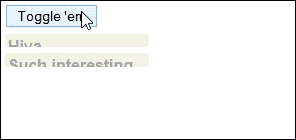

魔术发生在这个函数中；它是使用`.toggle()`命令来根据需要切换每个`<p>`语句的可见性的简单用法：

```js
$(document).ready(function(){
  $("button").click(function() {
    $("p").toggle("slow");
  });
});
```

但是，我们可以轻松地将点击事件处理程序中包含的函数抽象为一个单独的 IIFE，然后在我们的代码中简单地调用该函数，如下所示：

```js
$(document).ready(function(){
  var hideParagraphs = function() {
    $("p").toggle("slow");
  };

  $("button").click(hideParagraphs);
});
```

代码已经更容易阅读——我们已经将大部分原始操作从事件处理程序中移除；这消除了以后需要更改代码时编辑事件处理程序的需要。

### 注意

如果你对立即调用的函数表达式(IIFEs)感兴趣，那么你可能想要查看维基百科的条目以获取更多细节，该条目位于[`en.wikipedia.org/wiki/Immediately-invoked_function_expression`](https://en.wikipedia.org/wiki/Immediately-invoked_function_expression)。

### 在不同动作之间切换

尽管我们在示例中集中讨论了动画，但我们中敏锐的人可能想知道同样的技术是否也适用于诸如 `switch()` 等命令。答案是肯定的；我们没有在这里讨论它，因为它是一个纯粹的 JavaScript 命令，但是你可以将相同的原则应用作为它的替代方案。

### 策略模式的优缺点

定义一个明智的策略是成功编码的关键；通过使用策略模式，我们可以获得一些好处：

+   代码更易于阅读；如果我们将函数抽象成它们自己的类，我们可以将它们从决策过程中分离出来，要么作为同一文件中的独立代码块，要么甚至作为自己文件中的独立文件

+   代码更易于维护；我们只需要进入类来更改或重构代码，而且我们只需要对核心代码进行最小的更改，以便为新的类或对象事件处理程序添加链接

+   我们可以保持关注点的分离——我们抽象的每个独立类或对象都不会意识到其他组件，但是当提供了每个策略对象的责任和相同的接口时，它们可以与其他对象通信

+   使用策略模式可以让你利用开放/封闭原则；每个抽象类或对象的行为可以通过启动现有行为的新类或对象实例来改变

### 提示

关于开放/封闭原则的更多细节，请参阅 [`en.wikipedia.org/wiki/Open/closed_principle`](http://en.wikipedia.org/wiki/Open/closed_principle)。

这些是我们需要注意的一些缺点：

+   使用策略模式可以让你遵守开放/封闭原则，但同时，你可能会启动一个包含许多不必要函数或动作的新类或对象的代码，从而使你的代码变得更加繁琐

+   有些情况下使用策略模式可能不适合你的目的；如果你的代码只包含少量函数，那么将它们抽象化所需的工作量可能会超过所带来的好处

+   使用策略模式将增加代码中的对象数量，使其变得更加复杂，并且可能需要更多资源来管理

策略讨论够多了；让我们继续看一个不同的协议，以**代理**设计模式的形式

## 代理模式

在使用 jQuery 时，可能会有这样的情况，你可能想编写一个通用事件处理程序来管理某些元素上的样式——一个很好的例子可能是从活动状态切换到禁用状态，或者甚至是选定状态；然后我们可以使用普通的 CSS 来为这些样式编写样式。

使用这种方法，一个通用的事件处理程序可能如下所示：

```js
$(".myCheckbox").on( "click", function () {
  // Within this function, "this" refers to the clicked element 
  $(this).addClass("active");
});
```

乍一看，这样做完全可以正常运行，但是如果我们在更改样式类之前引入延迟会怎么样？我们通常会使用 `setTimeOut()` 函数来实现这一点：

```js
$(".myCheckbox").on( "click", function () {
  setTimeout(function () {
    // "this" doesn't refer to our element, but to the window!
    $(this).addClass("selected");
    });
});
```

有人发现这里有一个小但相当关键的问题吗？将任何函数传递给`setTimeout`都会给出错误的值—它将引用窗口对象，而不是传递的对象！

解决此问题的一种方法是使用 jQuery 的`proxy()`函数；我们可以使用此函数来实现代理模式或中间层，以确保正确的值通过到`.addClass()`方法的正确上下文中。我们可以调整我们之前的示例，如下代码片段所示：

```js
$(".myCheckbox").on( "click", function () {
  setTimeout( $.proxy( function () {
    // "this" now refers to our element as we wanted
    $( this ).addClass( "active" );
    }, this), 500);
});
```

我们传递的最后一个`this`参数告诉`$.proxy()`我们的 DOM 元素是我们想要`this`引用的值—在这种情况下，它是复选框，而不是窗口。

### 代理模式的优缺点

代理模式是来自结构组的有用设计，可以帮助优化和维护快速站点；在其核心，该模式基于不加载昂贵元素直到绝对必要的原则。（最好根本不加载，如果可以的话！）

使用这种设计模式可以获得一些好处，如下所示：

+   我们可以使用代理模式为尚未加载或可能永远不会加载的更昂贵的对象提供占位符；这包括可能从应用程序外部加载的对象

+   使用代理可以充当包装器，为真实对象提供委托，同时保护它免受不必要的复杂性

+   将代理模式纳入我们的页面中可以帮助减少代码繁重站点的感知速度慢或响应不足。

使用这种模式的缺点包括以下内容：

+   代理模式存在一个风险，即代理模式可能会将易变资源的生命周期和状态隐藏在其客户端之外；这意味着代码必须等待正确的资源再次可用，或者产生错误。它需要知道它正在与原始资源交互，而不是与可能与原始资源类似的另一个资源交互。

+   如果我们正在使用代理模式来表示远程资源，则这将掩盖两者之间的通信使用；与本地资源的通信应与远程资源的通信区别对待。

经过谨慎的使用，代理模式可以证明非常有用，只要我们对我们决定加载或不加载到我们的页面中的内容保持理性。让我们改变方向，看看另一种设计模式；这个模式基于我们可能需要动态构建一个或多个元素的方式；这个概念是**生成器模式**的核心。

## 生成器模式

在任何项目的开发过程中，都可能会出现需要动态创建新元素的情况；这可以是构建单个`<div>`元素，也可以是各种元素的复杂组合。

我们可能希望在代码中直接定义最终的标记，这可能会变得混乱，或者我们可以将元素分离成一个独立的机制，允许我们简单地构建这些元素，以便稍后在代码中使用。

后者，或者称为建造者模式的技术名称，更可取； 它更容易阅读，并允许您清晰区分变量和代码的其他部分。 此特定模式属于创建模式组，并且是您将看到此类模式的少数常见示例之一。

### 注意

您可能会在网上或书籍中看到对**抽象模式**的引用——它与建造者模式非常相似。

我们可以使用 jQuery 的美元符号来构建我们的对象； 我们可以传递完整的元素标记，部分标记和内容，或者简单地使用 jQuery 进行构造，如下所示：

```js
$('<div class="foo">bar</div>');

$('<p id="newText">foo <b>bar</b></p>').appendTo("body");

var newPara = $("<p />").text("Hello world");

$("<input />")
      .attr({ "type": "text", "id":"sample"})
      .appendTo("#container");
```

创建后，我们可以使用变量缓存这些对象，并减少对服务器的请求次数。

值得注意的是，设计模式不仅限于脚本代码； 它们可以应用于使用类似原则的插件。 我们将在第十一章 中介绍更多适用于 jQuery 插件的设计模式，*编写高级 jQuery 插件*。

### 建造者模式的优缺点

使用建造者模式并不适用于所有情况；值得注意的是，通过使用它可以获得的好处，以便查看这些是否符合您的要求。 这些好处包括：

+   我们可以在 jQuery 内动态构建创建对象所需的标记，而无需显式创建每个对象

+   我们可以缓存标记，然后将其与主要功能分离，这样可以更轻松地阅读代码并减少对服务器的请求

+   核心标记将保持不可变，但我们可以对其应用不同的功能以改变值或外观

+   我们可以进一步将我们的建造者模式转换为状态机或公开方法或事件的机制，同时仍保留私有构造函数或析构函数方法

使用建造者模式有一些缺点； 关键缺点是滥用链接的使用，但我们还应考虑以下方面：

+   有可能定义无法轻松重用的标记； 这意味着我们可能需要创建一些包含标记的变量，所有这些变量都将占用应该用于其他用途的资源。

+   以下是一个代码片段的示例：

    ```js
    var input = new TagBuilder("button")
      .Attribute("name", "property.name")
      .Attribute("id", "property_id")
      .Class("btn btn-primary")
      .Html("Click me!");
    ```

    使用建造者模式允许链接操作，提供一致的 API，并遵循建造者模式。 但是，这种模式的主要缺点是使代码更难阅读，因此更难调试。

我们已经在概念层面上探讨了许多不同的设计模式类型； 对于一些人来说，将其与我们所知的 jQuery 核心联系起来可能仍然会很困难。

然而，美妙之处在于 jQuery 在整个代码库中都使用这些模式——为了帮助您将所学的一些知识付诸实践，让我们花一点时间来检查核心库并看看这些模式是如何在内部使用的一些示例。

# 探索 jQuery 库中模式的使用

现在，你可能会想：我仍然不确定这些模式与我的工作有何关联。是吗？

我想是的。在本章中，我们花时间研究了一些常用的模式，作为回归基础的一种方式；毕竟，提高自己的秘诀不仅仅是通过编写代码！

关键点在于，如果你花时间用 jQuery 开发，那么你已经在使用设计模式；为了加强你所学的内容，让我们来看看 jQuery 库本身的一些示例：

### 注意

为了演示目的，我使用了 jQuery 2.1.1；如果你使用不同版本，那么你可能会发现一些行号已经改变了。

1.  首先，在你选择的文本编辑器中打开`jquery.js`的一个副本——我们将从经典的`document.ready()`函数开始，它使用 Façade 模式，并且在大约**3375**行附近运行此函数，如下面的屏幕截图所示：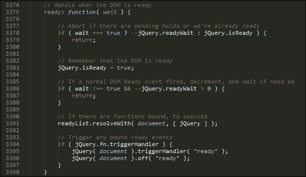

1.  你有多少次切换页面中元素的状态？我猜可能会有很多次；`toggle`命令是策略设计模式的一个典型例子，我们在这里决定一个元素的状态，如下所示：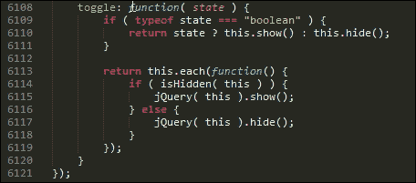

1.  现在，我确定你已经点击过无数个元素或使用过`click`事件处理程序，对吗？我希望是的，因为这是我们在学习 jQuery 时可能开始使用的第一个事件处理程序。它也是观察者模式的一个很好的例子。以下是 jQuery 中相关的代码，大约在**7453**行附近：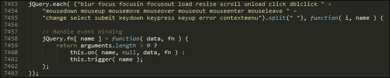

jQuery 核心库中有更多设计模式的使用示例；希望这能展示它们在你自己的代码中的好处，并且它们不应该局限于 jQuery 本身的源代码！

# 概要

哎呀！我们确实涵盖了很多关于设计模式的理论；让我们稍事休息，回顾一下你在本章学到的东西。

我们从介绍设计模式是什么以及它们是如何产生的开始；然后我们继续探讨了使用它们的好处以及为什么我们应该考虑在我们的项目中使用它们。

接下来，我们来看一下设计模式的结构，我们将一个典型的设计拆分成其不同的元素，并看到每个元素在设计方案中扮演的角色。我们还看到了如何将设计模式分类为不同类型，即创建型、结构型和行为型。

我们接着来看一些常见的设计模式，我们将了解每种类型的作用，并且检视一些我们将如何使用它们的示例。然后，我们将审视本章涵盖的每个设计模式的优缺点，最后看看其中一些模式在 jQuery 库内是如何实际运用的，而不仅仅是在我们自己的代码中。

我认为现在的理论已经足够了；让我们继续并且实践起来。在下一章中，我们将学习如何通过一些技巧来精通表单开发，将你的表单开发技能提升一个档次。
