# 第四章：与表单一起工作

你有多少次在网上购买产品，比如亚马逊之类的？我打赌多年来你已经做了相当多的次数——毕竟，你不能在深夜去书店，浏览书籍，然后选择一本，而不担心商店的关门时间或者不知道你是否会找到一本特定的书。

在线网站构建表单可能是您可能使用 jQuery 的关键领域之一；其成功的关键在于确保它正确验证，作为提供成功用户体验的一部分。

在本章节中，我们将回到基础知识，并深入探讨一些我们可以使用的技术，使用一些 HTML 和 jQuery 验证技巧来验证表单。您还将看到，创建成功的表单并不需要很多复杂的代码，而是同时确保我们考虑了表单的功能要求。

在接下来的几页中，我们将涵盖以下几个主题：

+   探讨验证的必要性

+   使用正则表达式添加表单验证

+   开发一个验证的插件架构

+   使用 jQuery/AJAX 创建一个高级联系表单

+   使用 jQuery 开发高级文件上传表单

准备好开始了吗？让我们开始吧……在我们开始之前，我建议你创建一个项目文件夹。为了本章的目的，我假设你已经这样做了，并且它被称为`forms`。

# 探讨表单验证的必要性

有不同的方法可以改进表单的可用性，但验证无疑是我们应该考虑的最重要的方面之一。你有多少次访问一个网站并填写你的详细信息，只是被告知出现了问题？听起来很熟悉，对吧？

验证表单对于维护信息的一致性至关重要；表单将处理已输入的信息，以确保其正确性。举个例子，以下是一些情况：

+   如果输入了电子邮件地址，让我们确保它具有有效的格式。电子邮件地址应包含一个句点，并在地址中的某个地方包含一个`@`符号。

+   打电话给某人？他们在哪个国家？如果我们已经设置表单以显示已选择国家的字段的特定格式，让我们确保电话号码遵循正确的格式。

我想你已经明白了。现在，这可能听起来好像我们在这里说的是显而易见的事情（不，我没有变疯！），但往往情况是，表单验证被留到了项目的最后阶段。最常见的错误通常是由以下原因造成的：

+   **格式化**：这是最终用户在字段中输入非法字符的地方，比如在电子邮件地址中输入空格。

+   **缺少必填字段**：你有多少次填写表单，然后发现你没有在必填字段中输入信息？

+   **匹配错误**：当两个字段需要匹配但却不匹配时，就会出现这种情况；一个经典的例子是密码或电子邮箱字段。

在这个阶段，你可能会认为我们将被大量的 jQuery 困住，以产生一个全方位的解决方案，对吧？

错了！很抱歉让你失望，但我一直坚持的口头禅是**KISS** 原则，或者**保持简单，蠢货**！这并不是对任何人的一种反映，而是为了让我们的设计生活变得更容易一些。正如我在前面的章节中提到的，我相信掌握 jQuery 这样的技术并不总是关于我们产生的代码！

这些是表单验证的关键元素：

+   告诉用户他们在表单上有问题

+   向用户显示问题所在的地方

+   向他们展示一个你期望看到的例子（比如一个电子邮箱地址）

在接下来的几页中，我们将看看如何向表单添加验证以及如何减少（或消除）最常见的错误。我们还将使用颜色和接近性来帮助加强我们的消息。然而，在我们能够进行验证之前，我们需要一些东西来验证，所以让我们快速创建一个表单作为我们练习的基础。

# 创建一个基本表单

与所有项目一样，我们需要从某个地方开始；在这种情况下，我们需要一个可以作为在本章节中给出的各种示例中添加验证的基础的表单。

在本书的代码下载中，查找并提取`basicform.html`和`basicform.css`文件到您的项目文件夹；当您运行`basicform.html`时，它将看起来类似于这个屏幕截图：

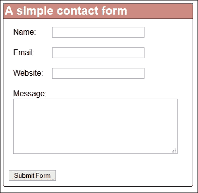

如果我们看一下使用的标记，我们会发现这并不是什么新鲜事；它包含了我们在创建联系表单时将使用的标准 HTML5 字段，比如文本字段或文本区域：

```js
<form class="contact_form" action="" method="post" name="contact_form">
  <ul>
  <li>
  <label for="name">Name:</label>
  <input type="text" name="username" required>
  </li>
  <li>
  <label for="name">Email:</label>
  <input type="email" name="email" required>
  </li>

  </ul>
  <button class="submit" type="submit">Submit Form</button>
</form>
```

这里的关键是，我们的例子没有包含任何形式的验证——它让我们完全暴露在垃圾之中，用户可以输入任何东西，我们收到的提交表单会—嗯—是垃圾！在这种情况下，当您点击**提交**时，您将只会看到这个屏幕截图：

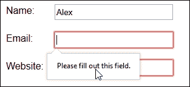

不是很好，是吗？大多数桌面浏览器将在使用必填标签时接受任何内容而不进行一些验证，只要有一些东西，表单就会被提交。这个规则的例外是 Safari，它不会显示我们屏幕截图中显示的弹出通知。

我相信我们能做得更好，但可能不是以你期待的方式…感到好奇吗？

# 从简单的 HTML5 验证开始

表单验证的好处在于它可以很容易或很复杂地修复—这完全取决于我们解决问题的路线。

这里的关键是我们*可以*使用 jQuery 来提供表单验证；这是一个完全足够的解决方案，可以正常工作。但是，对于字段的简单验证，比如姓名或电子邮件地址，有一种替代方案：HTML5 验证，它使用 HTML5 约束验证 API。

### 注意

约束验证 API 使用 HTML5 属性，如`min`、`step`、`pattern`和`required`；这些在大多数浏览器中都可以工作，除了 Safari。

在我解释这个疯狂背后的逻辑之前，让我们快速看看如何修改我们的演示，以使用这种形式的验证：

1.  在你常用的文本编辑器中打开`basicform.html`文件的一个副本，然后查找这一行：

    ```js
    <li>
    <label for="name">Name:</label>
    <input type="text" name="username" required>
    </li>
    ```

1.  我们需要添加将用作验证检查的模式，所以继续按照指示修改代码：

    ```js
    <li>
      <label for="name">Name:</label>
      <input id="name" name="username" value="" required="required" 
      pattern="[A-Za-z]+\s[A-Za-z]+" title="firstnamelastname">
    </li>
    ```

1.  我们可以对`email`字段进行类似的更改，以引入 HTML5 验证；首先，查找这些行：

    ```js
    <li>
      <label for="email">Email:</label>
      <input type="email" name="email" id="email" required= 
      "required">
    </li>
    ```

1.  按照指示修改代码，为`email`添加 HTML 验证：

    ```js
    <li>
      <label for="email">Email:</label>
      <input type="email" name="email" id="email" 
      required="required" pattern="[^ @]*@[^ @]*\.[a-zA-Z]{2,}" 
      title="test@test.com">
    </li>
    ```

1.  将文件保存为`basicvalidation.html`；如果你在浏览器中预览结果，你会立即看到一个变化：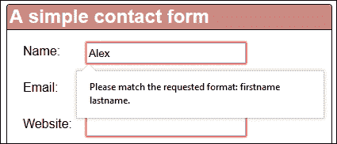

这已经是一个进步了；虽然文本不太用户友好，但至少你可以看到表单期望看到**名字 姓氏**的格式，而不仅仅是名字，如所示。类似的变化也将出现在**电子邮件**中，当你按下**提交**按钮验证表单时。

### 提示

如果你仔细查看代码，你可能会注意到我已经开始使用`required="required"`标签，代替`required`。任何格式都可以正常工作——如果在你的浏览器中只使用`required`时出现了任何不一致，你可能会发现使用前一种标签是必要的。

## 使用 HTML5 而不是 jQuery

现在我们有一个使用 HTML 验证`name`和`email`字段的表单，是时候兑现我的承诺并解释我疯狂背后的逻辑了。

在某些情况下，通常诱人的做法是简单地回归到使用 jQuery 来处理一切。毕竟，如果我们已经在使用 jQuery，为什么要引用另一个 JavaScript 库呢？

如果不是这两个小问题，这似乎是一个合理的方法：

+   使用 jQuery 会增加网站的负担；对于简单的验证，这可以被视为一种过度投入，收益甚微。

+   如果 JavaScript 被关闭，那么可能会导致验证无法操作或在屏幕上显示错误或在控制台日志中显示错误。这会影响用户体验，因为访问者将很难提交一个经过验证的表单，或者更糟的是，简单地离开网站，这可能会导致销售额损失。

更好的方法是考虑使用 HTML5 验证来验证标准文本字段，并将 jQuery 的使用保留给更复杂的验证，正如我们将在本章后面看到的那样。这种方法的好处在于，我们将能够完成一些有限的验证，减少对标准字段的 jQuery 依赖，并以更渐进的增强方式使用它。

考虑到这一点，让我们继续，开始查看使用 jQuery 来进一步增强我们的表单，并提供更复杂的验证检查。

# 使用 jQuery 验证我们的表单

在某些情况下，如果浏览器不支持所使用的输入类型，则使用 HTML5 验证将失败；这是我们需要回到使用 JavaScript 或在本例中使用 jQuery 的时候。例如，日期作为输入类型在 IE11 中不受支持，如下所示：

```js
<input type="date" name="dob"/>
```

这就是上述代码将如何呈现的方式：

```js
<input type="text" name="dob"/>
```

麻烦的是，由于类型回退为文本，浏览器将无法正确验证字段。为了解决这个问题，我们可以使用 jQuery 实现一个检查——然后我们可以开始使用 jQuery 添加一些基本的验证，这些验证将覆盖浏览器中进行的现有本地 HTML 检查。

让我们来看看如何在实践中实现其中一些，通过一个简单的演示，如下所示：

1.  打开本书附带的代码下载中的`basicform.html`的副本。

1.  在`<head>`部分，添加一个指向 jQuery 的链接以及一个指向您的验证脚本的链接：

    ```js
    <script src="img/jquery.js"></script>
    <script src="img/basicvalidation.js"></script>
    ```

1.  将文件保存为`basicvalidation.html`。在一个新文件中，添加以下代码——这将执行一个检查，以确保您只验证了`email`字段：

    ```js
    $(document).ready(function () {
       var emailField = $("#email");
        if (emailField.is("input") && emailField.prop("type") === "email") {
      }
    });
    ```

1.  在关闭`}`之前的位置，让我们加入两个函数中的第一个；第一个函数将添加一个 CSS 钩子，允许您在成功或失败的情况下进行样式设置：

    ```js
    emailField.on("change", function(e) {
      emailField[0].checkValidity();
        if (!e.target.validity.valid) {
          $(this).removeClass("success").addClass("error")
        } else {
          $(this).removeClass("error").addClass("success")
        }
    });
    ```

1.  你们中间敏锐的人会注意到添加了两个 CSS 样式类；我们需要在样式表中允许这个，所以继续添加这些代码行：

    ```js
    .error { color: #f00; }
    .success { color: #060; }
    ```

1.  现在我们可以添加部分函数，该函数将更改浏览器显示的默认消息以显示自定义文本：

    ```js
    emailField.on("invalid", function(e) {
      e.target.setCustomValidity("");
      if (!e.target.validity.valid) {
      e.target.setCustomValidity("I need to see an email address 
      here, not what you've typed!");
    }
    else {
      e.target.setCustomValidity("");
    }
    });
    ```

1.  将文件保存为`basicvalidation.js`。如果您现在在浏览器中运行演示，您将看到当您添加一个有效的电子邮件地址时，文本会变为绿色，如下图所示：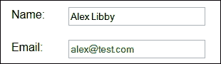

1.  如果您刷新浏览器会话，并且这次不添加电子邮件地址，您将收到一个定制的电子邮件地址错误，而不是浏览器提供的标准错误，如下面的屏幕截图所示：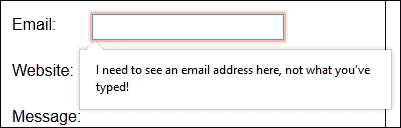

在这种情况下使用一点 jQuery 让我们能够自定义显示的消息——这是一个使用更友好的东西的好机会。请注意，默认消息与标准 HTML5 验证一起给出的消息可以很容易地……改进！

现在你已经看到了我们如何改变显示的消息，让我们专注于改进表单所进行的检查。标准的 HTML5 验证检查对于所有情况都不够；我们可以通过在我们的代码中引入正则表达式检查来改进它们。

# 使用正则表达式语句验证表单

到目前为止，你已经看到了可以使用 jQuery 来验证表单的一些命令，以及如何将你的检查限制在特定的字段类型（如电子邮件地址）上，或者覆盖屏幕上显示的错误消息。

但是，如果我们没有一种可以用来检查的验证模板，代码将失败——你们中的敏锐的人可能已经在我们的`basicvalidation.html`演示中注意到了这一点：

```js
pattern = "[^ @]*@[^ @]*\.[a-zA-Z]{2,}";
```

`pattern`变量用于定义正则表达式或**regex**语句。简单地说，这些是单行语句，指示我们应该如何验证表单中的任何条目。这些并不是专门用于查询的；它们同样适用于任何脚本语言，比如 PHP 或纯 JavaScript。让我们花一点时间看一些示例，以了解这个是如何工作的：

+   `[^ @]*`: 这个语句匹配任意数量的不是`@`符号或空格的字符。

+   `@`: 这是一个字面值

+   `\.`: 这是一个字面值

+   `[a-zA-Z]`: 这个语句表示任意字母，无论是大写还是小写

+   `[a-zA-Z]{2,}`: 这个语句表示两个或更多字母的任意组合。

如果我们把这些放在一起，模式正则表达式转换为一个电子邮件，其中包含任意一组字符，除了一个`@`符号，紧接着是一个`@`符号，然后是任意一组字符，除了一个`@`符号，一个句点，最后至少两个字母。

好了，理论已经够了；让我们开始编码吧！我们将通过一些示例进行工作，首先修改电子邮件验证，然后开发代码以覆盖网站地址的验证。

## 创建一个用于电子邮件的正则表达式验证函数

我们已经使用了一个正则表达式来验证我们的`email`地址字段；虽然这样做效果很好，但代码可以改进。我不喜欢在事件处理程序中包含验证检查；我更喜欢将其分离到一个独立的函数中。

幸运的是，这很容易纠正；让我们现在执行以下步骤来解决这个问题：

1.  我们将首先打开`basicvalidation.js`文件，并在`emailField.on()`事件处理程序之前立即添加一个辅助函数：

    ```js
    function checkEmail(email) {
      pattern = new RegExp("[^ @]*@[^ @]*\.[a-zA-Z]{2,}");
      return pattern.test(email);
    }
    ```

1.  此函数处理电子邮件地址的验证；为了使用它，我们需要修改`emailField.on()`处理程序，如下所示：

    ```js
    emailField.on("invalid", function(e) {
      e.target.setCustomValidity("");
     email = emailField.val();
     checkEmail(emailField);
      if (!e.target.validity.patternMismatch) {
        e.target.setCustomValidity("I need to see an email address 
        here, not what you've typed!");
    }
    ```

如果我们保存我们的工作然后在浏览器中预览它，我们应该在验证过程中看不到任何差异；我们可以放心地说，验证检查过程现在已经被分离为一个独立的函数。

## 进一步进行 URL 验证

使用与前面示例中使用的相同原理，我们可以为`urlField`字段开发一个类似的验证检查。只需复制两个`emailField.on()`事件处理程序和`checkEmail`函数，就可以产生类似下图所示的东西：

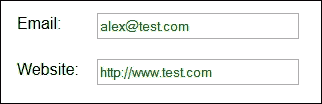

使用我们已经生成的代码，看看你是否能够创建一个使用这个正则表达式验证网站 URL 输入的东西：

```js
/^(https?:\/\/)?([\da-z\.-]+)\.([a-z\.]{2,6})([\/\w \.-]*)*\/?$/
```

如果你的代码工作，它应该产生一个类似于这个截图中显示的错误消息：

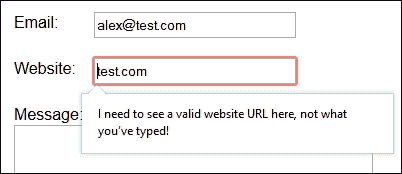

希望你已经成功使用了我们迄今为止产生的代码——如果你遇到了困难，在附带本书的代码下载中有一个可工作的示例。

因此，假设我们有一些可以工作的东西，有人发现我们的代码有问题吗？我们肯定有一些问题需要解决；让我们现在来看看它们：

+   注意，反馈并非百分之百动态？为了使我们的代码能够识别从错误到成功输入的更改，我们需要刷新我们的浏览器窗口——这一点根本不理想！

+   我们在 jQuery 文件中重复了很多代码——从架构上看，这是不好的做法，我们肯定可以改进已经编写的内容。

与其复制代码，不如彻底重写我们的 jQuery 为一个快速插件；从架构上来说，这将消除一些不必要的重复，并使我们能够以最小的更改扩展功能。它不会完美——这是我们将在本章稍后纠正的东西——但它会产生比我们现有代码更有效的结果。

# 构建一个简单的验证插件

到目前为止，我们的示例都是基于个别字段的，比如电子邮件地址或网站 URL。代码大量重复，这导致了冗余且效率低下的解决方案。

相反，让我们完全改变我们的方法，将我们的代码转换成一个通用插件。我们将使用相同的核心流程来验证我们的代码，这取决于插件中设置的正则表达式。

对于下一个练习，我们将使用 Cedric Ruiz 制作的一个插件。虽然它已经有几年了，但它说明了我们如何创建一个单一的核心验证过程，该过程使用一些过滤器来验证我们表单中输入的内容。让我们从执行以下步骤开始：

1.  从附带本书的代码下载中提取`quickvalidate.html`、`info.png`和`quickvalidate.css`文件的副本，并将它们保存在你的项目文件夹中。

1.  接下来，我们需要创建一个插件。在一个新文件中，添加以下代码，并将其保存为`jquery.quickvalidate.js`，保存在项目区域的`js`子文件夹中：

    ```js
    $.fn.quickValidate = function() {
      return this;
    };
    ```

1.  你需要开始给你的插件添加功能，从缓存表单和输入字段开始；在你的插件的`return this`语句之前立即添加这个功能：

    ```js
    var $form = this, $inputs = $form.find('input:text, input:password');
    ```

1.  接下来是规定每个字段应如何验证以及在验证失败时应显示的错误消息的过滤器，如下所示：

    ```js
    var filters = {
      required: {
        regex: /.+/,
        error: 'This field is required'
      },
      name: {
        regex: /^[A-Za-z]{3,}$/,
        error: 'Must be at least 3 characters long, and must only contain letters.'
      },
      pass: {
        regex: /(?=.*\d)(?=.*[a-z])(?=.*[A-Z]).{6,}/,
        error: 'Must be at least 6 characters long, and contain at least one number, one uppercase and one lowercase letter.'
      },
      email: {
        regex: /^[\w\-\.\+]+\@[a-zA-Z0-9\.\-]+\.[a-zA-z0-9]{2,4}$/,
        error: 'Must be a valid e-mail address (user@gmail.com)'
      },
      phone: {
        regex: /^[2-9]\d{2}-\d{3}-\d{4}$/,
        error: 'Must be a valid US phone number (999-999-9999)'
      }
    };
    ```

1.  现在我们来到验证过程，这是魔术发生的地方。继续添加以下代码，立即在过滤器下方：

    ```js
    var validate = function(klass, value) {

      var isValid = true, f, error = '';
      for (f in filters) {
        var regex = new RegExp(f);
        if (regex.test(klass)) {
          if (!filters[f].regex.test(value)) {
            error = filters[f].error;
            isValid = false;
            break;
          }
        }
      }
    return { isValid: isValid, error: error }
    };
    ```

1.  如果您的代码正确识别出错误，您需要通知用户；否则，他们将不知道为什么表单似乎未正确提交。现在让我们通过添加一个函数来确定如果验证测试失败会发生什么，如下所示：

    ```js
    var printError = function($input) {
      var klass = $input.attr('class'),
      value = $input.val(),
      test = validate(klass, value),
      $error = $('<span class="error">' + test.error + '</span>'),
      $icon = $('<i class="error-icon"></i>');
      $input.removeClass('invalid').siblings('.error, .erroricon').remove();
      if (!test.isValid) {
        $input.addClass('invalid');
        $error.add($icon).insertAfter($input);
        $icon.hover(function() {
          $(this).siblings('.error').toggle();
        });
      }
    };
    ```

1.  我们已经确定了当验证过程失败时会发生什么，但尚未采取任何措施调用函数。现在让我们通过根据字段是否标记为必填来添加适当的调用来解决此问题，如下所示：

    ```js
    $inputs.each(function() {
      if ($(this).is('.required')) {
        printError($(this));
      }
    });
    ```

1.  如果我们字段中的内容发生更改，我们需要确定它是有效还是无效；这需要在输入文本时进行，所以现在让我们做这个，使用`keyup`事件处理程序：

    ```js
    $inputs.keyup(function() {
    printError($(this));
    });
    ```

1.  最后，如果在我们的表单中发现错误，我们需要阻止提交：

    ```js
    $form.submit(function(e) {
      if ($form.find('input.invalid').length) {
        e.preventDefault();
        alert('There are errors on this form – please check...');
      }
    return false;
    });
    ```

1.  保存您的工作；如果一切正常，当在浏览器中预览工作结果时，您应该会看到表单验证：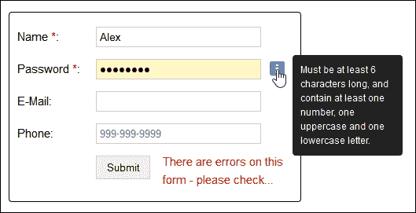

在这个阶段，我们有一个工作正常的插件，我们已经将核心验证代码重构为一组单一的流程，可以应用于每种字段类型（使用适当的过滤器）。

然而，我们可以做得更好；以下是一些问题，我们可以解决以进一步完善我们的代码：

+   虽然我们已经将代码重构为一组单一的核心验证流程，但过滤器仍然是核心代码的一部分。尽管可以轻松扩展不同类型的过滤器，但我们仍然仅限于文本或密码字段类型。添加任何标准的 HTML5 字段类型，例如`url`或`email`，都会导致错误，因为伪类型不受 jQuery 支持。

+   从架构的角度来看，最好将验证器过滤器保留在核心插件之外；这有助于保持验证器的简洁，并且不包含我们的目的不需要的代码。

+   我们的代码不允许任何功能，比如本地化、设置最大长度或验证表单对象，比如复选框。

我们可以花费大量时间开发我们的插件，使其采用更模块化的方法，但这值得吗？目前有数十个可供使用的表单验证插件；更明智的做法将是使用其中一个插件：

+   核心验证流程经过了反复测试，消除了担心我们的字段是否会正确验证的需要。开发任何形式的验证器插件，使其适用于超过几个字段，都是非常棘手的，要做到完全正确；毕竟，我们要验证还是不验证？不同的语言？例如邮政编码或邮政编码的不同格式？

+   大多数插件都会有某种架构，允许添加自定义验证器，这些验证器补充了作为标准包含的验证器，例如使用语言、特定的数字格式或奇偶数。在本章的后面，我们将充分利用这一点，以向我们的演示添加一些自定义验证器。

+   使用现有的插件可以让您专注于提供特定于您的环境的功能，并在您可以添加最大价值的地方添加功能——毕竟，尝试在其他人已经为我们完成工作的地方添加有效性是没有意义的，对吧？

有了这个想法，让我们继续看看如何使用现有的插件。现在大多数插件都具有某种模块化架构，允许您轻松定制它并添加额外的自定义验证器；毕竟，为什么要浪费时间重新发明轮子呢，对吧？

# 开发验证插件架构

在本章中，我们使用了各种 HTML5 和 jQuery 技术来验证我们的表单。总的来说，它们效果很好，但它们的简单性意味着我们会很快超越它们的有用性。

要充分利用表单验证的所有可能性，最好不要仅仅尝试验证字段，而是使用现有的插件来处理基本的验证过程，并允许您集中精力进行定制，并确保为您的表单提供正确的功能。

输入 jQuery Form Validator。这个插件是由 Victor Jonsson 创建的，已经存在多年，所以经过了测试；它还包含了我们需要定制的模块化架构，以在我们的表单中提供我们将提供的检查。让我们看看验证器的运作方式。

### 注意

原始插件及相关文档可在 [`formvalidator.net/`](http://formvalidator.net/) 上找到。

## 创建我们的基本表单

在我们开始向代码添加自定义验证器插件之前，我们需要一个要验证的基本表单。为此，我们将基于本章早期部分中创建的 `basicvalidation.html` 中的修改版本的表单的标记。

让我们先让我们的基本表单工作起来，确保标准验证生效。要做到这一点，请执行以下步骤：

1.  我们将从提取伴随本书的代码下载中的 `formvalidator.html` 和 `formvalidator.css` 文件的副本开始。将 HTML 文件保存在项目文件夹的根目录中，将 CSS 文件保存在 `css` 子文件夹中。

1.  在新文件中，添加以下代码行，并将其保存为 `formvalidator.js`，保存在项目区域的 `js` 子文件夹中：

    ```js
    $(document).ready(function() {
      $.validate();
    });
    ```

1.  这就是开始使用 Form Validator 插件所需的全部内容；如果您在浏览器中预览表单，您应该会看到以下截图——如果您输入了一个有效的名称和电子邮件地址但省略了网站 URL：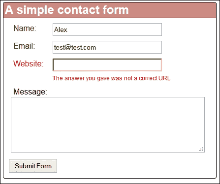

现在我们的表单已经准备好了，让我们真正开始开发表单内部使用的一些验证器，首先是`name`字段的新验证器。

## 创建自定义验证器

到目前为止，我们的表单依赖于使用标准的 HTML5 技术进行验证；这对大多数要求都适用，但它的能力是有限的。接下来是 jQuery；我们可以利用 FormValidator 的功能创建我们自己的自定义验证器，以满足我们自己的要求。

创建自定义验证器的关键部分是 `$.formutils.addValidator` 配置对象；FormValidator 处理了基本的插件架构，这样你就可以通过设计表单的正确检查来添加值。

在接下来的几页中，我们将通过两个基本示例进行工作：

1.  我们将从创建自定义验证器开始；在你选择的文本编辑器中，添加以下代码：

    ```js
    $.formUtils.addValidator({
      name : 'user_name',
      validatorFunction : function(value, $el, config, language, 
      $form) {
        return (value.indexOf(" ") !== -1)
      },
      errorMessage : 'Please enter your full name',
    });
    ```

1.  将文件保存为`user_name.js`，放在项目区域的`js`子文件夹内。打开之前创建的`formvalidator.js`文件，并根据下面的示例进行修改：

    ```js
    $(document).ready(function() {
     $.formUtils.loadModules('user_name');
      $.validate({
     modules: 'user_name'
      });
    });
    ```

1.  虽然你已经将验证规则添加到验证器中，但你需要在 HTML 标记内部激活它，如下所示：

    ```js
    <div class="form-group">
      <label class="control-name" for="name">Name: <span 
      class="asterisk">*</span></label>
      <input name="username" id="username" datavalidation="user_name">
    </div>
    ```

1.  如果一切正常，当你在浏览器中预览表单并点击 **提交** 按钮时，就会看到使用自定义验证器的效果，如下面的截图所示：

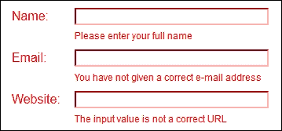

在这个阶段，你可以简单地将它留在这个自定义验证器的位置，但我认为有更多的空间——比如电子邮件地址？

标准的 HTML5 验证将会检查电子邮件地址是否符合合适的格式，例如确保它包含`@`符号，域名后有一个小数点，以及域名后缀是有效的。然而，它不能阻止用户提交具有某些类型地址的表单，比如[www.hotmail.com](http://www.hotmail.com)（或现在的[www.outlook.com](http://www.outlook.com)）。

此时值得注意的是使用正则表达式进行电子邮件验证可能会引发一系列问题，所以要谨慎行事并进行彻底的测试——比如如何对`mail+tag@hotmail.com`进行验证？这是一个完全有效的地址，但大多数正则表达式都会失败……

### 注意

关于为什么使用正则表达式实际上可能带来更多问题的讨论可以在[`davidcel.is/blog/2012/09/06/stop-validating-email-addresses-with-regex/`](http://davidcel.is/blog/2012/09/06/stop-validating-email-addresses-with-regex/)上找到。

在我们的示例中，我们将添加一个简单的检查来防止使用 Hotmail、Gmail 或 Yahoo! 的电子邮件地址；让我们看看我们如何做到这一点：

1.  在文本编辑器中，将以下代码添加到一个新文件中，并将其保存为 `free_email.js`，放在 `js` 子文件夹内：

    ```js
    $.formUtils.addValidator({
      name : 'free_email',
      validatorFunction : function(value, $el, config, language, 
      $form) {
        varemailName = /^([\w-\.]+@(?!gmail.com)(?!yahoo.com)(?!hotmail.com)([\w-]+\.)+[\w- 
        ]{2,4})?$/;
        return (emailName.test(value))
      },
      errorMessage : 'Sorry - we do not accept free email accounts 
      such as Hotmail.com'
    });
    ```

1.  现在你的 `free_email` 验证器已经就位，当验证表单时，你需要调用它；为此，请返回到你在前一个练习中打开的 `formvalidator.js` 文件，并按照以下示例修改代码：

    ```js
    $(document).ready(function() {
     $.formUtils.loadModules('free_email');
      $.validate({ modules: 'free_email'});
    });
    ```

1.  这个练习的最后一步是从 HTML 标记中激活自定义验证器——还记得我们在上一个练习中是如何改变它的吗？同样的原理在这里也适用：

    ```js
    <div class="form-group">
      <label class="control-name" for="email">Email: <span 
      class="asterisk">*</span></label>
      <input type="text" name="email" id="email" datavalidation="free_email">
    </div>
    ```

1.  保存 `formvalidator.js` 和 `formvalidator.html` 文件；如果你预览你的工作结果，你会清楚地看到，如果你输入了一个无效的电子邮件地址，你的自定义消息会出现，如下面的截图所示：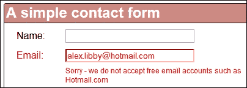

现在，你们中间敏锐的人可能会发现我们一次只加载一个验证器；我相信你们肯定想知道如何同时加载多个验证器，对吧？

没问题，我们已经就位了验证器文件，所以我们需要做的就是修改我们的验证器对象，使其加载这两个模块。让我们快速看看如何修改我们的验证器对象：

1.  打开 `formvalidator.js` 文件的副本，并按照这里显示的代码进行修改：

    ```js
    $.formUtils.loadModules('free_email, user_name');
    $.validate({
      modules: 'free_email, user_name',
    });
    ```

这就是你需要做的一切。如果你保存文件并在浏览器中预览结果，你会发现它会验证 `name` 和 `email` 字段，就像前两个练习中所示的那样。

这为我们打开了一扇机会之门；在我们的两个示例中，我们创建了相当简单的验证器，但原则是相同的，无论我们的验证器有多么复杂或简单。

### 注意

如果你想了解更多关于如何创建自定义验证器的信息，那么阅读[`formvalidator.net/index.html#custom-validators`](http://formvalidator.net/index.html#custom-validators)中的文档是值得的。然后我们可以结合创建模块的基本原理和正则表达式示例，例如[`www.sitepoint.com/jquery-basic-regex-selector-examples/`](http://www.sitepoint.com/jquery-basic-regex-selector-examples/)中显示的那些，来创建一些有用的验证器检查。

让我们继续看看 FormValidator 插件的另一个有用部分——我们毕竟不都说同样的语言，是吗？如果我们都说同样的语言，生活会很无聊；相反，你应该考虑本地化你的验证消息，这样国际访问者就可以理解何时出现验证问题以及如何解决它。

## 本地化我们的内容

在这个现代化的在线工作时代，可能会有一些情况需要以不同的语言显示消息——例如，如果你的大多数访问者说荷兰语，那么用荷兰语的等价物覆盖标准消息将是有价值的。

尽管需要一些仔细的思考和规划，但添加语言支持仍然非常容易；让我们看看如何操作：

1.  对于这个练习，你需要修改验证器对象。在 `formvalidator.js` 文件中，在 `document.ready()` 语句之后立即添加以下代码：

    ```js
    varmyLanguage = {
      badUrl: "De ingangswaarde is geencorrecte URL"
    };
    ```

1.  我们需要引用语言的变化，因此，请继续将此配置行添加到验证器对象中：

    ```js
    $.validate({
      modules: 'free_email, user_name',
     language: myLanguage
    });
    ```

1.  保存文件。如果在浏览器中预览结果，你可以看到错误消息现在以荷兰语显示，如下所示：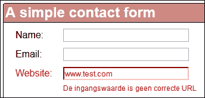

1.  我们不限于荷兰语；这里是相同的代码，但是错误消息是法语：

    ```js
    varmyLanguage = { badUrl: "La valeur d'entrée n'est pas une URL correcte" };
    ```

这是一个快速简单的方法，可以确保访问您网站的访客了解为什么您的表单未经验证以及他们如何修复它。值得注意的是，无论您的 PC 或移动设备的区域设置如何，设置的消息都会显示；建议您在更改表单消息中使用的语言之前检查任何分析日志以确认您的访问者来自哪个地区或国家。

## 集中我们的错误消息

在我们结束表单开发之前，还有一个功能可以添加到我们的表单中。

到目前为止，显示的任何验证错误消息都是针对每个单独字段的。这样做可以工作，但意味着我们没有一种立即知道哪些字段可能未通过验证的方法。当然，我们可以滚动浏览表单，但我懒得做这个；如果我们可以修改我们的代码以在顶部显示错误，那为什么还要滚动长表单呢？

绝对，使用 FormValidator 这样做非常简单；现在让我们来看看需要做什么：

1.  打开 `formvalidator.js` 文件的副本，并按照此处所示更改验证器对象；我们将 `errMessagePosition` 属性设置为 `top`，将 `validatorOnBlur` 属性设置为 `false`，以便在表单顶部显示消息：

    ```js
    $.validate({ modules: 'user_name, free_email', validateOnBlur: false, errorMessagePosition : 'top', language: myLanguage});
    ```

1.  如果现在运行表单，设置的任何错误消息都会显示在顶部，但它们看起来不太好看。现在，让我们通过对样式表进行一些微小的更改来修复这个问题：

    ```js
    div.form-error { 
      font-size: 14px; 
      background: none repeat scroll 0 0 #ffe5ed;
      border-radius: 4px; color: #8b0000;
      margin-bottom: 22px; padding: 6px 12px;
      width: 88%; margin-left: 0px; margin: 10px;
    }
    ```

1.  现在，让我们在浏览器中运行表单；如果一切顺利，你将看到顶部的错误已经正确格式化的表单。以下截图显示了如果你不填写网站 URL 会出现什么；请注意，我们的代码仍然显示了前一个示例中的荷兰语消息：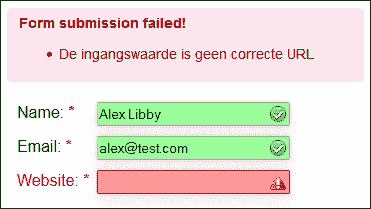

到目前为止，我们已经涵盖了一些与使用 jQuery 进行验证相关的主题。我们将继续并查看一下几个示例表单的操作。在我们这样做之前，我们需要完成一些最后的调整作为开发的结束部分。

## 结束开发

在预览最后一个练习时，更加细心的人会注意到一些样式似乎缺失了。这有一个很好的理由；让我解释一下。

作为最低要求，我们可以提供指示成功或失败的消息。这样做是有效的，但不是很好；更好的选择是提供一些额外的样式来真正突出我们的验证：

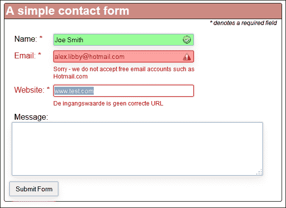

这很容易做到，所以让我们从执行以下步骤开始：

1.  打开`formvalidator.css`文件并添加以下代码行：

    ```js
    .has-error, .error { color: #f00; }
    .has-success, .valid { color: #060; }
    .error { background-image: url(../img/invalid.png); background-position: 98%; background-repeat: no-repeat; background-color: #ff9a9a; }
    .valid { background-image: url(../img/valid.png); background-position: 98%; background-repeat: no-repeat; background-color: #9aff9a; }
    ```

1.  我们需要将两个图标添加到项目区域的`img`子文件夹中——为此，我使用了位于[`www.iconfinder.com/icons/32520/accept_check_good_green_ok_success_tick_valid_validation_vote_yes_icon`](https://www.iconfinder.com/icons/32520/accept_check_good_green_ok_success_tick_valid_validation_vote_yes_icon)的红叉和绿勾图标。如果您想使用不同的图标，则可能需要相应调整样式规则。

1.  保存`formvalidator.css`。如果在浏览器中预览结果并在表单中输入详细信息，则在单击**提交表单**时，您应该看到与本练习开始时显示的屏幕截图类似的结果。

希望您会同意这看起来好多了！在伴随本书的代码下载中有一个`formvalidator.css`的副本；它包含了在表单中为其赋予非常精致外观的一些额外样式，正如我们在这个练习中所见。

### 提示

如果您想看到包含自定义内容的工作示例，请从代码下载中提取`formvalidatior-fullexample`JavaScript、CSS 和 HTML 文件，并将它们分别重命名为`formvalidator.js`、`formvalidator.css`和`formvalidator.html`。

## 注意最佳实践的使用

在我们的每个示例中，我们都将表单设置为一次显示所有字段——考虑到用户的目标和期望是一个关键点。他们试图实现什么？我们真的需要一次显示几十个字段吗？或者，我们可以使表单更简单吗？

尽管本书的重点自然是掌握 jQuery，但仅仅集中于编写代码是愚蠢的；我们还必须在构建表单及其相关验证时考虑一些外观和功能方面的问题。

举一个小例子，值得考虑的是，当字段可用时，我们是否可以使用 CSS 来模糊或聚焦字段。我们可以使用少量 CSS 来模糊或聚焦这些字段，类似于以下代码：

```js
input[type=email], input[type=text] { filter: blur(3px); opacity: .4; transition: all .4s; }

input[type=email]:focus, input[type=text]:focus { filter: none; opacity: 1; }
```

这里的想法是淡化我们已输入内容的字段，并将注意力集中在我们尚未完成或即将完成的字段上，如下面的屏幕截图所示：

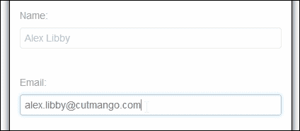

一个小警告：如果我们在使用此样式时不小心，可能会导致字段失效，这将破坏练习的整个意义！现在让我们改变焦点，转向表单设计的一个关键部分：如果某些浏览器不支持我们在本章中使用的 CSS 样式会发生什么？

## 提供后备支持

在本章中，我们在设计大多数现代浏览器中可用的表单方面进行了尝试。尽管如此，在某些情况下，这可能不起作用；如果我们仍然必须迎合不支持的浏览器（例如 iOS7），那么我们需要提供某种形式的后备方案。

幸运的是，如果我们使用类似 Modernizr 这样的工具，在`html`元素上应用`formvalidation`类，以提供一种优雅的降级，那么这不会成为太大的问题。然后，我们可以利用这一点，在浏览器不支持伪选择器（例如`:valid`或`:invalid`）的情况下提供优雅的后备方案。

### 小贴士

如果你想使用自定义版本的 Modernizr，该版本将测试表单验证支持，请访问[`modernizr.com/download/#-shiv-cssclasses-teststyles-testprop-testallprops-prefixes-domprefixes-forms_validation-load`](http://modernizr.com/download/#-shiv-cssclasses-teststyles-testprop-testallprops-prefixes-domprefixes-forms_validation-load)。

足够的理论了，让我们来点乐子吧！在接下来的几页中，我们将通过两个练习来看一个更复杂的例子。它将基于一个简单的联系表单，我们将在其中添加表单上传功能——尽管请注意，这里会有一个陷阱……！

# 使用 AJAX 创建一个高级联系表单

在我们复杂示例的第一部分中，我们将开发一个表单，允许我们提交一些基本详细信息，并且允许首先出现在表单消息面板上，然后通过电子邮件进行确认。

对于本练习，我们将需要使用一些工具，如下所示：

+   使用默认设置安装的本地 Web 服务器——选项包括 WAMP（适用于 PC；[`www.wampserver.de/en`](http://www.wampserver.de/en)）或 MAMP（适用于 Mac；[`www.mamp.info/en/`](http://www.mamp.info/en/)）。Linux 用户很可能已经有了作为发行版一部分的某些内容。

+   免费的 Test Mail Server 工具（仅适用于 Windows），可在[`www.toolheap.com/test-mail-server-tool/`](http://www.toolheap.com/test-mail-server-tool/)获取，因为从本地 Web 服务器发送电子邮件可能很难设置，所以这个出色的工具会监视端口 25 并提供本地邮件功能。对于 Mac，您可以尝试按照[`discussions.apple.com/docs/DOC-4161`](https://discussions.apple.com/docs/DOC-4161)提供的说明进行操作；Linux 用户可以尝试按照[`cnedelcu.blogspot.co.uk/2014/01/how-to-set-up-simple-mail-server-debian-linux.html`](http://cnedelcu.blogspot.co.uk/2014/01/how-to-set-up-simple-mail-server-debian-linux.html)中概述的步骤进行操作。

+   从正在使用的个人电脑或笔记本电脑上访问电子邮件包——这是接收我们演示发送的电子邮件所必需的。

### 小贴士

另一个可能的选项，如果你更喜欢走跨浏览器的路线，是 XAMPP ([`www.apachefriends.org/index.html`](https://www.apachefriends.org/index.html))；这包括 Mercury Mail Transport 选项，因此如果你在 Windows 上工作，则不需要 Test Mail Server 工具。

好的，工具就位了，让我们开始执行以下步骤：

1.  我们将从打开此书附带的代码下载的副本并提取 `ajaxform` 文件夹开始；这包含了我们演示的标记、样式和各种文件。我们需要将该文件夹保存到 Web 服务器的 `WWW` 文件夹中，对于 PC 来说，通常是 `C:\wamp\www`。

1.  标记相对简单，与本章中已经见过的内容非常相似。

1.  我们需要对 `mailer.php` 文件进行一个小修改；用你选择的文本编辑器打开它，然后找到这一行：

    ```js
            $recipient = "<ENTER EMAIL HERE>";
    ```

1.  将 `<ENTER EMAIL HERE>` 更改为你可以使用的有效电子邮件地址，以便检查之后是否出现了电子邮件。

1.  这个演示的魔法发生在 `ajax.js` 文件中，所以现在让我们看看这个文件，并开始设置一些变量：

    ```js
    $(function() {
      var form = $('#ajaxform');
      var formMessages = $('#messages');
    ```

1.  当提交按钮被按下时，我们开始真正的魔法；首先我们阻止表单提交（因为这是默认操作），然后将表单数据序列化为字符串以便提交：

    ```js
    $(form).submit(function(e) {
      e.preventDefault();
      var formData = $(form).serialize();
    ```

1.  接下来是这个表单的 AJAX 操作的核心；这个函数设置请求类型，发送内容的位置以及要发送的数据：

    ```js
    $.ajax({ 
      type: 'POST',
      url: $(form).attr('action'),
      data: formData
    })
    ```

1.  然后我们添加两个函数来确定应该发生什么；第一个函数处理我们表单的成功提交：

    ```js
    .done(function(response) {
      $(formMessages).removeClass('error');
      $(formMessages).addClass('success');
      $(formMessages).text(response);

      $('#name').val('');
      $('#email').val('');
      $('#message').val('');
    })
    ```

1.  失败提交表单后的处理函数如下：

    ```js
    .fail(function(data) {
          $(formMessages).removeClass('success');
          $(formMessages).addClass('error');

          if (data.responseText !== '') {
            $(formMessages).text(data.responseText);
          } else {
            $(formMessages).text('Oops! An error occurred and your message could not be sent.');
           }
         });
       });
     });
    ```

1.  启动电子邮件工具。如果你在浏览器中预览表单并填写一些有效的细节，当你提交它时，你应该会看到这个截图：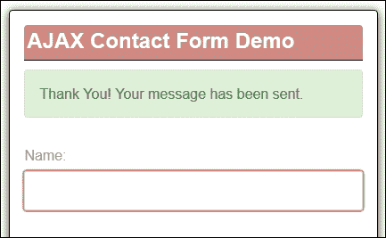

我们的表单现在已经就位，并且能够提交，在几秒钟内通过电子邮件确认。我们将在下一章中更深入地重新讨论在 jQuery 中使用 AJAX 的用法；现在，让我们继续开发我们的表单。

# 使用 jQuery 开发高级文件上传表单

正如一位善良的人不久前所说的那样，*"前进和上升！"*，现在是时候添加我们表单功能的第二部分了，以文件上传选项的形式。

不考虑这可能带来的风险（如上传病毒），添加文件上传功能相对简单；它需要客户端和服务器端组件才能正常工作。

在我们的示例中，我们将更多地关注客户端功能；为了演示目的，我们将文件上传到项目区域内的一个虚拟文件夹。为了让你了解我们将构建的内容，这是一个完成示例的截图：


有了这个想法，让我们开始执行以下步骤：

1.  在`ajaxform.html`文件的副本中，我们需要向各种 JavaScript 和 CSS 文件添加一些额外的链接；所有这些添加都在随书附带的代码下载中可用，如下所示：

    ```js
    <link rel="stylesheet" href="css/bootstrap.min.css">
    <link rel="stylesheet" href="css/styles.css">
    <link rel="stylesheet" href="css/fileupload.css">
    <script src="img/jquery.min.js"></script>
    <script src="img/ajax.js"></script>
    <script src="img/jquery.ui.widget.js"></script>
    <script src="img/jquery.iframe-transport.js"></script>
    <script src="img/jquery.fileupload.js"></script>
    <script src="img/uploadfiles.js"></script>

    ```

1.  接下来，我们需要在`index.html`中添加一些标记；所以，在`ajaxform.html`中，首先按照这里显示的更改标题：

    ```js
    <div id="formtitle">
      <h2>File Upload Demo</h1>
    </div>
    <div id="form-messages"></div>
    ```

1.  现在我们需要添加文件上传代码；所以，在消息字段的结束`</div>`标签之后，立即添加以下代码：

    ```js
    <div class="container">
      Click the button to select files to send:
      <span class="btnbtn-success fileinput-button">
      <span>Select files...</span>
      <input id="fileupload" type="file" name="files[]" multiple>
      </span>
      <p>Upload progress</p>
      <div id="progress" class="progress progress-success 
      progress-striped">
      <div class="bar"></div>
      </div>
      <p>Files uploaded:</p>
      <ul id="files"></ul>
    </div>
    ```

1.  我们需要对我们的一个 jQuery 文件进行一点小小的修改；在`uploadfiles.js`中，找到以下开头的行：

    ```js
    $('#files').append('<li>Now, amend the highlighted part to match the location of where you are hosting the files within your local web server. The `files` and `thumbnail` folders are created automatically by the scripts.
    ```

1.  要完成我们的演示，我们需要两个额外的文件：一个是`files.php`，另一个是`UploadHandler.php`；这些文件将处理文件的后端上传和电子邮件的发送。这些文件的副本都在随书附带的代码下载中。

1.  保存所有文件。如果使用本地 Web 服务器预览结果，则应该看到一个可用的表单，类似于此练习的第一部分；现在它还将显示您的上传表单。

### 注意

在随书附带的代码下载中的`combined`文件夹中有一个演示的工作版本。

此时，我们应该有一个可用的表单。但是等等……有没有人注意到什么？希望在这一点上，你应该已经注意到我们的表单中几乎没有验证了……！“嗯？”我听到你问。你完全正确，但是像所有好事一样，这也是有原因的。

我在这里故意没有添加任何验证，因为我想首先集中精力让表单功能正常运行，并最终从验证中小休一下，考虑到我们在过去几页中已经涵盖了很多内容。

然而，这确实为你提供了一个绝佳的机会（是的，这里有个陷阱）——要不要检查一下你是否能为示例添加验证？我在代码下载中没有提供答案——毕竟，并不存在绝对正确或错误的答案；验证取决于你表单的需求。不过，在本章中应该有足够的内容让你开始。我强烈建议你查看主网站[formvalidator.net](http://formvalidator.net)上的文档，因为它会提供更多答案！

# 摘要

哦！我们终于到达了本章的末尾，所以让我们花点时间回顾一下我们到目前为止所涵盖的内容。

我们从为什么表单验证很重要以及关键点是保持任何解决方案简单以确保表单成功开始。我们先看了简单的 HTML5 验证，然后讨论了何时使用 jQuery 代替标准 HTML5 验证的优点。

然后，我们开始了解使用 jQuery 进行简单验证，然后扩展到覆盖正则表达式语句的使用。接下来，我们看了一下开发一个快速而肮脏的验证插件，然后审查了保持更模块化架构以帮助通过使用自定义验证器来实现可扩展性的需求。

我们转而使用现有的插件来添加验证功能，因为这样可以让我们花更多时间确保我们满足我们的需求，而不仅仅是能够验证任何内容的简单优点。我们还研究了如何本地化我们的内容，并集中显示错误消息，然后在开发结束前进行了一些额外的样式调整。

然后，我们在章节结尾部分提出了最佳实践和提供备用支持的说明，然后以开发复杂表单的基础作为结束，文件上传功能作为使用本章提供的一些技术进行未来个人发展的基础。

在下一章中，我们将扩展一个我们在表单开发中简要介绍过的主题；是时候来看看那个经得起考验的技术，叫做 AJAX…
