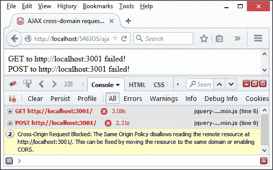
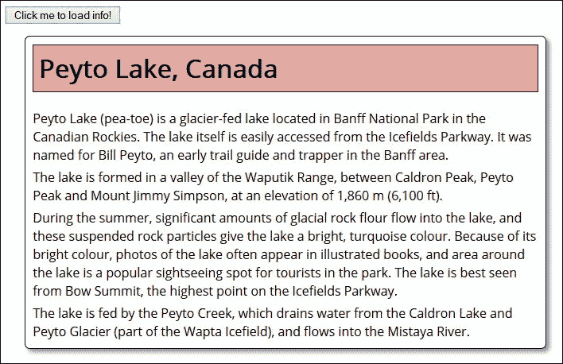
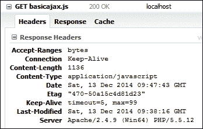
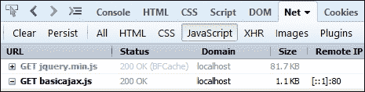
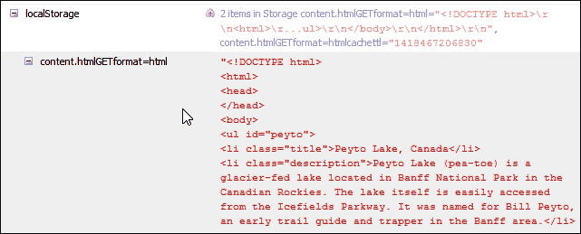
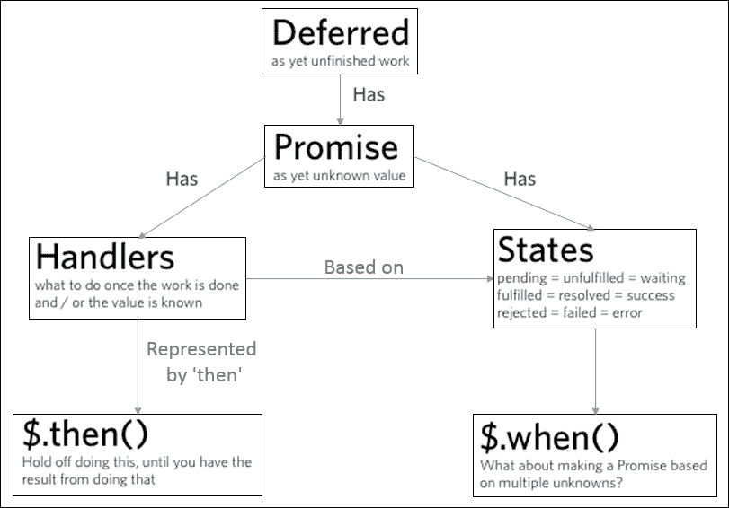
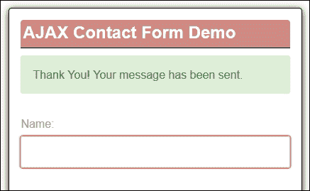
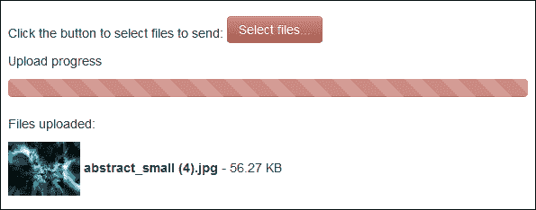

# 第五章：集成 AJAX

一个问题 - **Deferreds**、**Promises**和/**ˈeɪdʒæks**/有什么共同点？

答案很简单 - 至少其中两个是工作与 AJAX 的实用程序；第三个实际上是 AJAX 的国际音标拼写。

在互联网的历史上，我们作为最终用户被迫忍受页面刷新 - 您必须强制刷新页面才能显示新内容。现在不一样了 - 我们可以在不需要清除页面的情况下刷新内容，利用了 AJAX 的力量，但并非没有问题。进入延迟和承诺 - 不适合初学者，但一旦了解其工作原理就是有用的工具！

在接下来的几页中，我们将研究与使用 jQuery 进行 AJAX 相关的一些主题。这些主题包括：

+   详述 AJAX 最佳实践

+   通过静态站点提高数据加载速度

+   使用回调处理多个 AJAX 请求

+   使用 jQuery Deferreds 和 Promises 增强您的代码

+   看 Deferreds 和 Promises 的实际效果

让我们开始吧...！

# 重新审视 AJAX

有没有人还记得点击链接或按钮会强制刷新页面的日子，无论我们在哪个网站上？那些日子，当您知道要订购披萨外卖或从在线书店订购书籍时，意味着要点击许多页面...真无聊！

幸运的是，AJAX 在 2006 年作为一种标准的出现已经结束了这种需要。今天，我们不再受到完全刷新页面的限制；我们可以轻松地异步更新页面的内容。好吧 - 所以我们不需要刷新页面，但是...AJAX？那不是上个世纪的某种老技术，早就消亡了吗？

答案是否定的 - 尽管 jQuery 的魔力使我们能够异步更新页面，但 AJAX 仍然起着重要的作用。互联网的惊人崛起意味着我们会有需要从另一个站点获取页面的情况。众所周知，大多数浏览器中的安全设置将阻止对内容的访问，如果违反了**跨域资源共享**（**CORS**）策略，如下图所示：



为了规避与 CORS 相关的安全控制，我们可以使用 AJAX。在我们涉足更复杂的用法之前，让我们花点时间回顾一下 AJAX 是什么，以及我们如何在实践中使用它。

### 注意

要看到这种效果的实际情况，您可以运行本书附带的代码下载中提供的`ajaxblocked`演示。

## 定义 AJAX

如果您花费了一些时间使用 AJAX，毫无疑问您会遇到一种或多种变体，例如 AHAH、AJAH 或 AJAJ，它们使用相似的原理。但数据的交换有所不同；例如，AJAH 使用 HTML，AJAJ 使用 JSON，而 AHAH 是基于 HTML 的。

无论使用哪种变体，这组相互关联的技术可能已经成熟，但它仍然在向最终用户呈现数据方面发挥着重要作用。在本章的整个过程中，我们将与可以说是它们中的鼻祖的 AJAX 一起工作。作为提醒，它由以下各个技术组成：

+   用于演示的 HTML（或 XHTML）和 CSS

+   用于动态显示和与数据交互的**文档对象模型**（**DOM**）

+   用于数据的交换和操作的 XML 和**可扩展样式表语言转换**（**XSLT**）

+   用于异步通信的 `XMLHttpRequest` 对象

+   JavaScript 将这些技术结合起来

当在 jQuery 中使用时，我们可以使用 `$.ajax` 对象轻松配置 AJAX。有许多可用的选项，但我们可能经常使用的一些包括：

| 配置选项 | 目的 |
| --- | --- |
| `url` | 请求的内容的 URL。 |
| `data` | 要发送到服务器的数据。 |
| `error` | 在请求失败时调用此函数 - 函数将传递三个参数：`jqXHR` 对象，描述错误的字符串以及（如果生成了一个）可选异常对象。 |
| `dataType` | 这描述了您期望从服务器返回的数据类型。默认情况下，jQuery 将尝试自动解决此问题，但它可能是以下之一：XML、JSON、脚本或 HTML。 |
| `Success` | 如果请求成功，则调用的函数。 |
| `type` | 发送的请求类型，例如，'POST'，'GET' 或 'PUT' - 默认为 'GET'。 |

### 提示

还有许多其他选项可用。作为提醒，值得浏览 [`api.jquery.com/jQuery.ajax/`](http://api.jquery.com/jQuery.ajax/) 以获取更多详细信息。

足够的理论 - 至少暂时够了！让我们继续并看看如何使用 AJAX 和 jQuery 开发一个示例。

## 使用 AJAX 创建一个简单的示例

在我们开始编写代码并推动我们所能做的边界之前，让我们花一点时间了解典型的 AJAX 代码在实际中是什么样子的。

在依赖导入内容的典型应用程序中，我们可能会遇到类似以下摘录的内容：

```js
var jqxhr = $.ajax({
  url: url,
  type: "GET",
  cache: true,
  data: {},
  dataType: "json",
  jsonp: "callback",
  statusCode: {
    404: handler404,
    500: handler500
  }
});
jqxhr.done(successHandler);
jqxhr.fail(failureHandler);
```

这是一个用于 AJAX 启用代码的标准配置对象。让我们更详细地看看其中一些配置选项：

| 选项 | 注释 |
| --- | --- |
| `url` | URL 的 |
| `type` | 默认为 `GET`，但如果需要，可以使用其他动词代替 |
| `cache` | 默认为 `true`，但对于 `'script'` 和 `'jsonp'` 数据类型为 `false`，因此必须根据具体情况进行设置 |
| `data` | 任何请求参数都应设置在 `data` 对象中 |
| `datatype` | 应将 `datatype` 设置为将来参考 |
| `jsonp` | 只需指定此项以匹配你的 API 期望的 JSONP 请求的回调参数的名称，这些请求是对托管在不同域中的服务器发起的 |
| `statusCode` | 如果您想处理特定的错误代码，请使用状态代码映射设置 |

### 提示

jQuery Core 站点上有大量文档 - 值得一读！一个好的起点是主要的 `ajax()` 对象，位于 [`api.jquery.com/jQuery.ajax/`](http://api.jquery.com/jQuery.ajax/)。

我们可以将其用于生成一个简单的演示，比如从 XML 文件或者甚至是纯 HTML 中显示信息，如下一张截图所示：



让我们更详细地看看这个演示：

1.  从随书附带的代码下载中，提取 `basicajax.html`、`content.html` 和 `basicajax.css` 文件的副本 - 将 HTML 文件放入我们项目文件夹的根目录，样式表放入 `css` 子文件夹。

1.  接下来，将以下代码添加到一个新文件中，将其保存为 `basicajax.js`，并将其放入我们项目区域的 `js` 子文件夹中：

    ```js
    $(document).ready(function(){
    });
    ```

1.  在声明的 `$description` 变量的下方，添加以下辅助函数来控制我们在屏幕上提取的文本的呈现：

    ```js
       var displaytext = function(data) {
         var $response = $(data), $info = $("#info");
         var $title = $('<h1>').text($response.find(".title") .text());
         $info.append($title);
         $response.find(".description").each(function(){
           $(this).appendTo($info);
         });
       };
    ```

1.  接下来是我们的 jQuery 代码的核心部分 - 对 `$.ajax` 的调用。立即在辅助函数下面添加以下事件处理程序：

    ```js
    $('#action-button').click(function() {
      $.ajax({
        url: 'content.html',
        data: { format: 'html' },
        error: function() {
            $('#info').html('<p>An error has occurred</p>');
        },
        dataType: 'html',
        success: displaytext,
        type: 'GET'
      });
    });
    ```

1.  如果我们在浏览器中预览结果，我们可以看到点击按钮时内容出现，就像在这个演示开始时所示的截图中一样。

在这个实例中，我们创建了一个简单的演示。它首先引用了 `content.html` 文件，使用 HTML 格式将其导入到我们的页面中。我们的 jQuery 代码然后提取内容并将其分配给 `$response`，然后首先提取标题，然后每个段落，并将它们附加到 `#info` div 中。

此时值得注意的是，我们可以使用类似以下语句引用每个提取的段落：

```js
var $description1 = $('<p>').text($response.find(".description:eq(0)").text());
```

然而，这是提取文本的一种低效方式 - 我们必须多次运行代码来引用后续的值，这会给我们的服务器带来不必要的负载。

# 提高静态站点加载数据的速度

现在我们已经看到了一个 AJAX 示例的实际操作，也许让你惊讶的是，即使在我们在屏幕上显示的少量文本中，使用的代码并不 *技术上* 是尽可能高效的。

嗯？我听到你在问 - 我们真的不能改进这样一个简单的演示吗？好吧，尽管可能有些奇怪，但我们确实可以做出改进。让我们看看我们可以使用哪些技巧来减少代码中的任何缓慢 - 并不是所有的技巧都只是简单地改变我们的代码：

+   减少 AJAX 请求的数量 - 不，我没有疯掉；改善我们的代码并不总是意味着改变代码本身！如果我们考虑每次 AJAX 请求何时发出，可能会有机会减少数量，如果重新排序意味着我们可以达到相同的结果。例如，如果我们有一个基于定时器发出的 AJAX 请求，我们可以设置一个标志来指示仅在进行更改时才执行 AJAX 请求。

+   如果我们需要获取内容，那么简单地使用 GET 往往更有效，而不是 POST - 前者只是检索内容，而后者会导致服务器反应，例如更新数据库记录。如果我们不需要执行操作，则使用 GET 完全足够了。

+   当更新页面内容时，请确保只更新少量内容；如果我们的页面设置为更新大量内容而不是定义的部分，则会影响 AJAX 性能。

+   减少要传输的数据量 - 记得我说过我们的代码可以做出改变吗？这就是我们可以做出改变的地方 - 虽然我们不需要限制我们检索的内容，但我们可以从使用 HTML 格式更改为纯文本。这允许我们删除标记标签，从而减少我们的内容。当然，我们也可以完全反向，转而使用 XML，但这不会不增加数据大小！

+   我们还应该检查我们的服务器是否已正确配置 - 要检查的两个关键领域是使用 ETags（或实体标签），以及服务器是否设置为发送正确的过期或 Cache-Control 头用于提供的内容，如下例所示：

+   简而言之，如果服务器检测到某个 URL 的 ETags 没有更改，它将不会发送任何响应。

    ### 小贴士

    如果您想了解更多关于 ETags 及其在浏览器中的工作方式，请访问 [`en.wikipedia.org/wiki/HTTP_ETag`](http://en.wikipedia.org/wiki/HTTP_ETag)。

+   我们可以通过在正确的时间仅创建和销毁 `XMLHttpRequest` 来进一步限制 AJAX 请求的影响 - 如果它们只在某些情况下需要，那么这将对 AJAX 性能产生显著影响。例如，如果我们的代码没有活动类，我们可能只会启动 AJAX 请求：

    ```js
    if (!($this).hasClass("active")) {
    ...perform our ajax request here...
    }
    ```

+   确保您的回调函数设置正确 - 如果我们的代码已更新，那么我们需要告诉我们的用户，并且不要让他们等待；毕竟，我们最不想做的事情就是陷入回调地狱的陷阱！（本章后面我们将更详细地介绍这个问题。）

我们甚至可以进一步！我们可以通过缓存内容来减少对服务器的不必要调用。但是，在你说“我知道”的之前，我还没说在哪里呢！

是的——在这种情况下，*where* 是关键，而 *where* 是 - localStorage。这是内置在每个浏览器中的，可以用来消除不断击中服务器的需要。虽然您可以存储的量因浏览器而异（通常为 5 MB，但最高可达 20 MB），但对于每个浏览器，它使用相同的原则工作——内容必须存储为文本，但可以包括图像和文本（在合理范围内！）。

有兴趣吗？使用一个简单的插件并对代码进行一些小修改，我们可以快速实现一个可行的解决方案——让我们重新审视一下我们之前的基本 AJAX 演示，并立即进行这些更改。

# 使用 localStorage 缓存 AJAX 内容

使用 AJAX 需要仔细考虑——重要的是在适当的点获取正确数量的内容，而不是对服务器进行太多不必要的请求，这一点很重要。

我们已经看到了一些可以帮助减少 AJAX 请求影响的技巧。其中一种更为冒险的方式是将内容存储在每个浏览器的 **localStorage** 区域中——我们可以使用 AJAX 预过滤器来实现这一点。开发者 Paul Irish 已经将完成此操作所需的代码封装在一个插件中，该插件可在 [`github.com/paulirish/jquery-ajax-localstorage-cache`](https://github.com/paulirish/jquery-ajax-localstorage-cache) 获取。

我们将使用它来修改我们之前的 `basicajax` 演示。让我们看看我们将如何做到这一点：

1.  让我们从随附本书代码下载中提取 `basicajax` 演示文件夹的副本，并将其保存到我们的项目区域。

1.  接下来，我们需要下载插件——这可以在 [`github.com/paulirish/jquery-ajax-localstorage-cache/archive/master.zip`](https://github.com/paulirish/jquery-ajax-localstorage-cache/archive/master.zip) 获取。从 zip 文件中提取 `jquery-ajax-localstorage-cache.js`，并将其保存到 `basicajax` 中的 `js` 子文件夹中。

1.  我们需要对 JavaScript 和 HTML 标记进行一些更改。让我们首先更改 JavaScript。在 `basicajax.js` 中，按如下所示添加以下两行：

    ```js
     localCache: true,
       error: function() {
     cacheTTL: 1,

    ```

1.  在 `basicajax.html` 中，我们需要引用新的插件，因此继续修改脚本调用，如下所示：

    ```js
      <script src="img/basicajax.js"></script>
      <script src="img/jquery-ajax-localstorage-cache.js"></script>
    </head>
    ```

1.  如果我们重新运行演示并点击按钮加载内容，从视觉上不应该看到任何不同；如果我们启动 Firebug，切换到 **Net** 选项卡，然后点击 **JavaScript**，则更改将显而易见：

1.  如果我们进一步探索，现在我们可以看到我们的 AJAX 内容被存储在浏览器的 **localStorage** 区域中的迹象：

    ### 提示

    如果您想要查看所有 localStorage 设置，请尝试下载并安装 FireStorage Plus! 插件，该插件可以从 [`addons.mozilla.org/en-US/firefox/addon/firestorage-plus/`](https://addons.mozilla.org/en-US/firefox/addon/firestorage-plus/) 获取。

现在我们可以使用 jQuery 和`localStorage.getItem`或`localStorage.clearItem`方法来操纵该区域中的所有内容。如果你想了解更多，可以参考我的书*HTML5 Local Storage How-to*，该书可在 Packt Publishing 上获得。

### 注意

本书附带的代码下载中有这段代码的可运行版本，位于`basicajax-localstorage`文件夹中。

也许有时候你会发现你想将缓存 TTL 值减少到几分钟（甚至几秒钟？）。你可以通过修改`jquery-ajax-localstorage-cache.js`中的第 70 到 72 行，并删除一个乘数来实现，留下以下内容：

```js
if ( ! ttl || ttl === 'expired' ) {
  localStorage.setItem( cacheKey  + 'cachettl', +new Date() + 1000 * 60 * hourstl );
}
```

让我们改变方向。我们先前提到当处理 AJAX 时，提高性能的一种方法是确保我们尽量减少请求的数量。如果我们的代码包含多个请求，将对性能产生不利影响，特别是如果我们必须等待每个请求完成后才能开始下一个请求。

我们可能会使用 localStorage 来减少影响，通过在浏览器内请求内容，而不是从服务器请求；这样做是可行的，但可能不适用于每种类型的请求。相反，正如我们将在后面看到的，有更好的替代方法可以轻松处理多个请求。让我们更详细地探讨一下这个问题，首先从使用回调来处理多个请求的影响开始。

# 使用回调处理多个 AJAX 请求

当使用 AJAX 时，我们可以使用`$.Callbacks`对象来管理回调列表—可以使用`callbacks.add()`方法添加回调，使用`.fire()`触发，使用`.remove()`方法移除。

如果我们决定在需要的时候才出现内容，而不是一直存在的情况下，通常我们会启动一个单一的 AJAX 请求。这样做没有错—这是一种完全有效的工作方式，可以减少页面刷新的需求。

但是，如果我们决定必须同时执行多个请求，并且需要每个请求都完成后才能继续，那么情况将变得混乱。

```js
// Get the HTML, then get the CSS and JavaScript
$.get("/feature/", function(html) {
  $.get("/assets/feature.css", function(css) {
    $.getScript("/assets/feature.js", function() {

      // All is ready now, so...add CSS and HTML to the page
      $("<style />").html(css).appendTo("head");
      $("body").append(html);
    });
  });
});
```

我们可能需要等一会儿！

这里的问题是当处理多个请求时响应速度很慢，尤其是如果所有请求都必须在我们继续之前完成。我个人肯定不想等待一个响应速度慢的页面完成！

为了避免许多人喜欢称之为**回调地狱**的情况，我们可以使用另一种方法——jQuery 的 Deferreds 和 Promises。这可以被视为一种特殊形式的 AJAX。在接下来的几页中，我们将深入探讨这项技术的奥秘，并通过一个简单的示例来演示，你可以将其作为将来开发自己想法的基础。

### 提示

甚至有一个专门讨论回调地狱的网站—你可以在[`callbackhell.com/`](http://callbackhell.com/)上查看它—绝对值得一读！

让我们看看 Deferreds 和 Promises 如何在 jQuery 中工作，以及如何使用它来增强我们的代码。

# 用 jQuery Deferreds 和 Promises 增强你的代码

尽管 Deferreds 和 Promises 听起来像是一种相对新的技术，但它们早在 1976 年就已经可用了。简而言之：

+   Deferred 代表了一个尚未完成的任务

+   Promise 是一个尚未知晓的值

如果我们必须使用标准 AJAX，那么我们可能必须等待每个请求完成才能继续。这在使用 Deferreds / Promises 时是不必要的。当使用 Deferreds / Promises 时，我们不必等待每个请求被处理。我们可以通过`jQuery.Deferred()`对象排队多个请求以同时触发它们，并单独或一起管理它们，即使每个请求可能需要不同的时间来完成。

如果您的应用程序使用了 AJAX 启用的请求，或者可能受益于使用它们，那么花时间熟悉 Deferreds 和 Promises 是值得的。

在使用标准 AJAX 时，一个关键的缺陷是缺乏来自任何 AJAX 调用的 *标准* 反馈 - 很难判断何时完成了某事。jQuery AJAX 现在创建并返回一个 Promise 对象，该对象将在与之绑定的所有操作都完成时返回一个 promise。使用 jQuery，我们会使用`when()`、`then()`和`fail()`方法来实现以下方式：

```js
$.when($.get("content.txt"))
  .then(function(resp) {
    console.log("third code block, then() call");
    console.log(resp);
  })
  .fail(function(resp) { console.log(resp); });
```

我们可以使用以下图表来表示使用 Deferreds 和 Promises 的工作原理：



使用 Deferreds 的关键好处是我们可以开始链接多个函数，而不仅仅是一次调用一个函数（这是标准 AJAX 的情况）。然后，我们可以从`jQuery.Deferred`列表内部`.resolve()`或`.reject()`单个 Deferreds，并使用`.success()`、`.fail()` 或 `error()` 事件处理程序提供一致的机制来确定如果 Deferreds 成功或失败应该发生什么。

最后，我们可以调用`.done()`事件处理程序来确定在与我们的 Promise 绑定的操作完成后应该发生什么。

### 注意

如果您想了解更多关于 Deferreds 和 Promises 的内部工作原理的信息，请查阅 [`github.com/promises-aplus/promises-spec`](https://github.com/promises-aplus/promises-spec)，尽管它可能会让人感觉有些枯燥（无意冒犯！）。

现在我们已经了解了 Deferreds 和 Promises 的基础知识，让我们改变一下方向，看看如何在实际中使用这两者，并概述为什么值得花时间了解它们背后的概念。

# 使用 Deferreds 和 Promises

切换到使用 Deferreds 和 Promises 需要一些时间，但值得花费精力去理解它们的工作原理。为了感受使用 Deferreds 和 Promises 的好处，让我们来看看将它们融入我们的代码中的一些优势：

+   **更清晰的方法签名和统一的返回值**：我们可以将决定任何请求结果如何处理的代码分离出来，这样读起来更清晰，如果需要，还可以进行链式调用，如下所示：

    ```js
      $.ajax(url, settings);
      settings.success(data, status, xhr);
      settings.error(data, status, errorThrown);
      settings.always(xhr, status)
    ```

+   **容易组合在一起**：我们不需要在每个请求中加入复杂的函数来管理处理；这意味着启动每个请求所需的核心代码大大简化，如下面的示例所示：

    ```js
      function getEmail(userEmail, onSuccess, onError) {
         $.ajax("/email?" + userEmail, {
           success: onSuccess,
           error: onError
         });
       }
    ```

+   **容易链式调用语句**：Deferred / Promise 的架构允许我们将多个事件处理程序链接在一起，这样我们就可以通过单个操作触发多个方法，如下所示：

    ```js
      $("#button").clickDeferred()
         .then(promptUserforEmail)
         .then(emailValidate)
    ```

+   **Promises 总是异步执行**：它们甚至可以在我们不知道哪些回调函数将使用 Promises 生成的值之前就被触发，而不管任务是否完成。Promises 将存储生成的值，我们可以从现有的回调函数中调用该值，或者在生成 Promise 后添加任何回调函数时调用。

+   **异常式错误传递**：通常在 AJAX 中，我们需要使用一系列的 `if…then…else` 语句，这样做会使工作方式复杂（有时还会脆弱）。使用 Promises，我们只需链式连接一个或多个 `.then()` 语句来处理任何结果，如下所示：

    ```js
    getUser("Alex")
      .then(getFriend, ui.error)
      .then(ui.showFriend, ui.error)
    ```

    ### 提示

    关于 Promises，有很多内容我们无法在这里详细介绍。关于将 Promises 与标准 AJAX 请求进行比较的有用讨论，请查看[此处的讨论](http://stackoverflow.com/a/22562045)。

还记得我们之前审查的关于*使用回调函数处理多个 AJAX 请求*的代码吗？使用多个回调函数的主要缺点是结果混乱（最终影响了我们网站的性能）——显然我们需要一个更好的替代方案！

Deferreds 和 Promises 的美妙之处在于它允许我们重构代码，使其更易于阅读。这不仅包括我们需要作为请求的一部分运行的命令，还包括成功或失败时发生的情况。让我们重新审视一下之前的代码片段，并看看当重写为使用 Deferreds / Promises 时会是什么样子：

```js
$.when(
  // Get the HTML, CSS and JS
  $.get("/feature/", function(html) {
    globalStore.html = html;
  }),
  $.get("/assets/feature.css", function(css) {
    globalStore.css = css;
  }),
  $.getScript("/assets/feature.js")
).then(function() {
  // All is ready now, so...add the CSS and HTML to the page
  $("<style />").html(globalStore.css).appendTo("head");
  $("body").append(globalStore.html);
});
```

希望您会同意，它看起来明显更清晰了，现在我们可以从单个过程中运行多个请求，而不必等待每个请求完成后再进行下一个请求！

现在是编写一些代码的时候了，我认为——让我们利用 Deferreds 和 Promises，并构建一个使用 AJAX 的演示。我们将看到如何使用它来响应表单提交，而无需刷新页面。

# 修改我们的高级联系表单

在我们的实际示例的第一部分中，我们将重新使用并开发本章前面创建的基本 AJAX 表单，并从第四章中的 *使用 jQuery 开发高级文件上传表单* 演示中获取，*与表单一起工作*。我们将调整它以使用 AJAX 显示提交确认，并且确认也会显示为电子邮件。

对于这个练习，我们需要准备一些工具：

+   使用默认设置安装本地 Web 服务器 - 选项包括 WAMP（适用于 PC - [`www.wampserver.de`](http://www.wampserver.de) 或 [`www.wampserver.com/en/`](http://www.wampserver.com/en/)），或者 MAMP（适用于 Mac，[`www.mamp.info/en/`](http://www.mamp.info/en/)）。Linux 用户可能已经作为其发行版的一部分拥有可用的工具。您需要确保您的 PHP 版本为 5.4 或更高，因为代码依赖于如果使用较旧版本将会中断的功能。您也可以尝试跨平台解决方案 XAMPP，可从 [`www.apachefriends.org/index.html`](https://www.apachefriends.org/index.html) 获取（请注意，如果使用此选项则不需要测试邮件工具 - 电子邮件支持已包含在 XAMPP 中）。

+   免费的测试邮件服务器工具（仅限 Windows），可从 [`www.toolheap.com/test-mail-server-tool/`](http://www.toolheap.com/test-mail-server-tool/) 获取。从本地 Web 服务器发送电子邮件可能很难设置，因此这个出色的工具监视端口 25 并提供本地发送电子邮件的功能。对于 Mac，您可以尝试[`discussions.apple.com/docs/DOC-4161`](https://discussions.apple.com/docs/DOC-4161)中的说明；Linux 用户可以尝试遵循[`cnedelcu.blogspot.co.uk/2014/01/how-to-set-up-simple-mail-server-debian-linux.html`](http://cnedelcu.blogspot.co.uk/2014/01/how-to-set-up-simple-mail-server-debian-linux.html)中概述的步骤。

+   访问正在使用的个人电脑或笔记本电脑的电子邮件包 - 这是接收使用测试邮件服务器工具发送的电子邮件所必需的。

好的 - 工具已经准备就绪，让我们开始吧：

1.  我们将从打开附带本书的代码下载的副本开始，并提取`ajaxform`文件夹；这个文件夹包含我们演示的标记、样式和各种文件。我们需要将该文件夹保存到 Web 服务器的`WWW`文件夹中，对于 PC（通常为`C:\wamp\www`）。

1.  标记相对简单，并且与本章中我们已经看到的非常相似。

1.  我们需要对`mailer.php`文件进行一个小小的更改 - 在您选择的文本编辑器中打开它，然后查找以下行：

    ```js
            $recipient = "<ENTER EMAIL HERE>";
    ```

    将`<ENTER EMAIL HERE>`更改为您可以用来检查邮件是否出现的有效电子邮件地址。

1.  这个演示的魔法发生在`ajax.js`中，所以现在让我们来看一下，首先设置一些变量：

    ```js
      $(function() {
         var form = $('#ajaxform');
         var formMessages = $('#messages');
    ```

1.  当按下**发送**按钮时，我们开始了真正的魔术。我们首先阻止表单提交（因为它的默认操作），然后将表单数据序列化为一个字符串以进行提交：

    ```js
    $(form).submit(function(e) {
      e.preventDefault();
      var formData = $(form).serialize();
    ```

1.  接下来是此表单的 AJAX 操作的核心。此函数设置要执行的请求类型，内容将被发送到哪里，以及要发送的数据：

    ```js
    $.ajax({
      type: 'POST',
      url: $(form).attr('action'),
      data: formData
    })
    ```

1.  然后我们添加了两个函数来确定接下来该发生什么 - 第一个处理表单成功提交的情况：

    ```js
    .done(function(response) {
      $(formMessages).removeClass('error');
      $(formMessages).addClass('success');
      $(formMessages).text(response);
      $('#name').val('');
      $('#email').val('');
      $('#message').val('');
    })
    ```

1.  接下来是处理表单提交失败结果的函数：

    ```js
    .fail(function(data) {
      $(formMessages).removeClass('success');
      $(formMessages).addClass('error');
      if (data.responseText !== '') {
        $(formMessages).text(data.responseText);
      } 
      else {
        $(formMessages).text('Oops! An error occured and your 
        message could not be sent.');
      }
      });
      });
    });
    ```

1.  双击启动电子邮件测试服务器工具。如果我们在浏览器中预览表单，并填写一些有效的详细信息，当提交时我们应该会看到以下图片：

我们的表单现在已经就位，并且能够提交，确认邮件将在几分钟内出现。在下一章中，我们将更深入地讨论 jQuery 中的 AJAX 使用；现在让我们继续开发我们的表单。

## 使用 AJAX 添加文件上传功能

添加文件上传功能相对简单；它需要客户端和服务器端组件才能正常运行。

在我们的示例中，我们将更专注于客户端功能。为了演示目的，我们将上传文件到项目区域内的一个虚拟文件夹。以下是我们将构建的内容示例的屏幕截图：



为了帮助我们进行这个演示，我们将使用 BlueImp 文件上传插件；它超过 1300 行代码，是一个非常全面的插件！这个插件与 BlueImp 的基于 PHP 的文件处理插件以及一些额外的 jQuery UI 一起，将有助于创建一个可用的文件上传设施。

### 注意

插件文件的副本可在伴随本书的代码下载中找到，也可以在[`github.com/blueimp/jQuery-File-Upload`](https://github.com/blueimp/jQuery-File-Upload)上找到。

让我们开始吧：

1.  我们将首先提取伴随本书的代码下载中`ajaxform-files`文件夹的副本 - 这个文件夹中包含了 BlueImp 文件上传插件，以及一些额外的自定义 CSS 和 JavaScript 文件。

1.  将`ajaxform-files`文件夹中的文件添加到存储在 web 服务器文件夹内的`ajaxform`文件夹中；JavaScript 文件应放在`js`文件夹中，CSS 样式表应放在`css`文件夹中，而 2 个 PHP 文件可以放在我们的`ajaxform`文件夹的根目录中。

1.  接下来，我们需要打开上一个练习中的`ajaxform.html`文件的副本 - 我们首先需要添加一个链接到`fileupload.css`，其中包含了我们上传表单的一些额外样式：

    ```js
      <link rel="stylesheet" href="css/bootstrap.min.css">
      <link rel="stylesheet" href="css/styles.css">
     <link rel="stylesheet" href="css/fileupload.css">

    ```

1.  我们同样需要引用我们刚刚下载的额外 JavaScript 文件 - 将以下突出显示的链接添加到`ajax.js`的引用下面，如下所示：

    ```js
    <script src="img/ajax.js"></script>
    <script src="img/jquery.ui.widget.js"></script>
    <script src="img/jquery.iframe-transport.js"></script>
    <script src="img/jquery.fileupload.js"></script>
    <script src="img/uploadfiles.js"></script>

    ```

1.  接下来是对`index.html`的一些标记更改。因此，在`ajaxform.html`中，首先按照下面的步骤更改标题：

    ```js
    <div id="formtitle"><h2>AJAX File Upload Demo</h1></div>
    <div id="form-messages"></div>
    ```

1.  现在我们需要添加文件上传代码，所以在消息字段的`</div>`标签关闭后立即添加以下代码：

    ```js
    <div class="container">
      Click the button to select files to send:
      <span class="btn btn-success fileinput-button">
        <span>Select files...</span>
        <input id="fileupload" type="file" name="files[]" multiple>
      </span> 
      <p>Upload progress</p>
      <div id="progress" class="progress progress-success progress-striped">
       <div class="bar"></div>
      </div>
      <p>Files uploaded:</p>
      <ul id="files"></ul>
    </div>
    ```

1.  保存所有文件。—如果我们使用本地 Web 服务器预览结果，那么我们应该期望看到更新后的表单，现在在表单底部显示一个文件上传区域。

### 提示

如果您想看到已经进行了更改的版本，那么在随附本书的代码下载中的`ajaxform-completed`文件夹中有一个完成的代码版本。

## 检查演示中使用 Promises 和 Deferreds

尽管我们在此演示的第二部分中所做的更改相对简单，但它们隐藏了丰富的功能。要了解 AJAX 的使用方式，有必要详细查看`jquery.fileupload.js`插件的源代码。

如果我们打开`ajax.js`的副本，我们可以清楚地看到 jQuery 的 Deferred 对象的使用，形式为`.done()`，如下所示的摘录：

```js
.done(function(response) {
  $(formMessages).removeClass('error');
  ....
})
```

然而，如果我们的 AJAX 代码失败了，jQuery 将执行`.fail()`事件处理程序中概述的方法或函数：

```js
.fail(function(data) {
  $(formMessages).removeClass('success');
  ....
});
```

如果我们转而查看`uploadfiles.js`中的代码，我们可能会认为它根本没有使用 AJAX。相反，AJAX 被使用了，但是在`jquery.fileupload.js`插件中。

如果我们在文本编辑器中打开插件文件，我们可以看到很多 Deferreds 和 Promises 的实例。让我们看一些摘录作为示例：

+   从`upload`方法 - 第 762-766 行：

    ```js
      jqXHR = ((that._trigger('chunksend', null, o) !== false && $.ajax(o)) || that._getXHRPromise(false, o.context))
         .done(function (result, textStatus, jqXHR) {
    ```

+   在同一方法中，但这次是从第 794-804 行：

    ```js
          .fail(function (jqXHR, textStatus, errorThrown) {
            o.jqXHR = jqXHR;
            o.textStatus = textStatus;
    ```

+   这次，从私有的`_onSend`方法，在第 900-904 行：

    ```js
      ).done(function (result, textStatus, jqXHR) {
         that._onDone(result, textStatus, jqXHR, options);
       }).fail(function (jqXHR, textStatus, errorThrown) {
         that._onFail(jqXHR, textStatus, errorThrown, options);
       }).always(function (jqXHRorResult, textStatus, jqXHRorError) {
    ```

这些只是一些示例，说明了我们如何使用 Deferreds 和 Promises 来增强我们的代码。希望这给您留下了一些可能性的味道，以及我们如何显着改善代码的可读性以及项目的性能。

# 详细介绍 AJAX 最佳实践

在本章中，我们重新访问了基础知识，并探讨了一些可以用来提升 AJAX 知识的技巧 - 关键不仅仅是编码，还有一些提示和技巧，可以帮助我们成为更全面的开发人员。

在“使用 Deferreds 和 Promises”部分，我们探讨了使用 jQuery 的 Deferreds 和 Promises 的基础知识，以及在使用它们时架构的变化如何导致性能显著提高。在我们总结本章之前，有一些额外的最佳实践，我们应该尽可能遵循。以下列表解释了它们：

1.  没有必要直接调用`.getJson()`或`.get()`。这些在使用`$.ajax()`对象时默认调用。

1.  调用请求时不要混合协议。最好尽可能使用无模式请求。

1.  如果您只是进行 GET 请求，请尽量避免将请求参数放在 URL 中 - 而是使用 `data` 对象设置来发送它们，如下所示：

    ```js
    // Less readable
    $.ajax({
        url: "something.php?param1=test1&param2=test2",
        ....
    });

    // More readable
    $.ajax({
        url: "something.php",
     data: { param1: test1, param2: test2 }
    });
    ```

1.  尝试指定 `dataType` 设置，以便更容易知道您正在处理的数据类型。例如，请参考本章前一节中的 *使用 AJAX 创建简单示例*。

1.  使用委托事件处理程序将事件附加到使用 AJAX 加载的内容。委托事件可以处理稍后添加到文档中的后代元素的事件：

    ```js
    $("#parent-container").on("click", "a", delegatedClickHandler);
    ```

### 提示

要了解更多，请参阅[`api.jquery.com/on/#direct-and-delegated-events`](http://api.jquery.com/on/#direct-and-delegated-events)。

# 摘要

AJAX 作为一种技术已经存在多年。可以说它是一个改变游戏规则的技术，在这里，JavaScript 的使用消除了在浏览器中不断刷新页面内容的需求。jQuery 已经帮助增强了这一系列技术。在本章中，我们重新审视了一些基础知识，然后探讨了如何更好地提升我们的开发技能。让我们回顾一下我们学到的内容：

我们首先简要回顾了 AJAX 是什么，并提醒自己构建 jQuery 中 AJAX 请求的基础知识。

接下来，我们看了一些可以用来提高静态站点加载速度的技巧；我们学到了一项额外的技巧，即使用 localStorage 缓存内容。然后，我们讨论了如何实现回调可能会使代码混乱和缓慢，然后转而看到 Deferreds 和 Promises 如何改进我们的代码，最终改进了我们的站点的性能。

最后，我们看了一个演示，在这个演示中，我们借用了第四章中的一个表单，*与表单一起工作*，并通过首先添加基于 AJAX 的通知，然后利用 BlueImp 插件来扩展它，以实现一个文件上传功能，该功能利用了 Deferreds 和 Promises。

在下一章中，我们将深入研究我个人最喜欢的一个主题。是时候加入动画了，我们将看看如何使用 jQuery 为我们的网站元素赋予生命。
