# 第六章 在 jQuery 中进行动画

举手喜欢静态网站的人？想不到吧，为网站添加动画效果能赋予其生命；但过度使用可能会带来灾难性的后果！

我们经常用来为网站注入生命力的两个常见效果是 AJAX 和动画；我们在前一章节详细介绍了前者。在本章中，我们将探讨何时使用 jQuery 而不是 CSS（或反之），如何更好地管理队列，以及如何实现一些漂亮的自定义动画效果。您还将看到如何轻松创建一些有用的自定义缓动效果，作为将来转换为 CSS 等效的基础。在本章中，我们将涵盖以下主题：

+   何时使用 CSS 而不是 jQuery

+   管理或避免 jQuery 动画队列

+   设计自定义动画

+   实现一些自定义动画

+   在响应式网站中进行动画

准备好开始了吗？让我们开始吧……

# 选择 CSS 还是 jQuery

让我们从一个问题开始这个话题。

看一看 Dia do Baralho 网站，托管在 [`www.diadobaralho.com.br`](http://www.diadobaralho.com.br) - 你们中有多少人认为你在那里看到的动画是仅使用 jQuery 创建的？

如果您认为是的话，那么很抱歉让您失望了；实际上答案是不是！如果您仔细查看源代码，您会发现有些地方同时使用了 CSS3 动画和 jQuery。现在，您可能会想：为什么我们在谈论掌握 jQuery 的书籍时要讨论 CSS3 动画呢？

这是有道理的；还记得我之前在书中提到过的，拥有正确技能的任何个体都可以编写 jQuery 吗？普通编码人员和优秀开发人员的区别在于：为什么我会使用 jQuery？现在，这听起来可能让人觉得我疯了，但我没有。让我解释一下我的意思，如下所示：

+   CSS3 动画不依赖于外部库；考虑到 jQuery 仍然有一定的大小，少一个资源请求总是一件好事！

+   对于简单轻量的动画，如果 CSS3 动画足够，引用 jQuery 是没有好处的。尽管需要提供相同语句的供应商前缀版本（并且不使用 jQuery），但所需的代码量可能比使用 jQuery 少。

使用 jQuery 会有性能影响，这使得使用 CSS 动画更加诱人，原因有几个：

+   这个库从来没有被设计成一个高性能的动画引擎；它的代码库必须服务于许多目的，这可能导致布局抖动。

+   jQuery 的内存消耗通常意味着我们需要进行垃圾收集，这可能会导致动画短暂冻结

+   jQuery 使用 `setInterval` 而不是 `requestAnimationFrame` 来管理动画（尽管这是由于即将推出的 jQuery 版本的更改）

同样有许多理由支持我们使用 jQuery；尽管它作为一个库有其局限性，但在某些情况下，我们可能需要在原生 CSS3 动画的位置使用 jQuery，如下所述：

+   CSS 动画对 GPU 负荷较大，在浏览器负载较高时可能会导致卡顿和色带效应——这在移动设备上尤为普遍。

    ### 注意

    有关硬件加速和 CSS3 的影响的讨论，请访问[`css-tricks.com/myth-busting-css-animations-vs-javascript/`](http://css-tricks.com/myth-busting-css-animations-vs-javascript/)。

+   大多数浏览器都支持 CSS3 动画，但 IE9 或更低版本除外；对于这种情况，必须使用 jQuery。

+   CSS3 动画目前（还）不及 jQuery 的灵活——它们一直在不断发展，因此总会有一天两者变得非常相似。例如，在使用 CSS3 时，我们不能在关键帧中使用不同的缓动方式；整个关键帧必须应用相同的缓动方式。

这里的关键点是，我们有自由选择的权利；事实上，正如开发者 David Walsh 所指出的，当我们只需要简单的状态更改时，使用 CSS3 动画更为明智。他的论点是基于能够在样式表中保留动画逻辑，并从多个 JavaScript 库中减少页面的臃肿。

但要注意，如果您的需求更复杂，则 jQuery 是前进的道路；开发者 Julian Shapiro 认为，使用动画库可以保持每个动画的性能，并使我们的工作流程易于管理。

### 注意

要查看使用 JavaScript 或 CSS 对多个对象进行动画效果的效果，请转到[`css3.bradshawenterprises.com/blog/jquery-vs-css3-transitions/`](http://css3.bradshawenterprises.com/blog/jquery-vs-css3-transitions/)，该网站展示了一个非常启发性的演示！

只要我们在使用 CSS 方面小心谨慎，对于简单的、自包含的状态动画，更明智的做法是使用原生 CSS3，而不总是依赖 jQuery 来解决我们所有的需求。

顺便提一句，值得注意的是，有一个相对较新的 API 正在考虑中：Web Animations API。该 API 旨在使用 JavaScript 创建效率与原生 CSS3 动画相同的动画。鉴于我们在使用 jQuery 时存在的固有问题，这值得关注；截至撰写本文时，该 API 的支持仅限于 Chrome 和 Opera。

### 提示

要了解 Web Animations API 的支持细节，请查看 [Can I use 网站](http://caniuse.com/#search=Web%20animation)；[`updates.html5rocks.com/2014/05/Web-Animations---element-animate-is-now-in-Chrome-36`](http://updates.html5rocks.com/2014/05/Web-Animations---element-animate-is-now-in-Chrome-36) 上也发布了一篇有用的教程——不过这只适用于 Chrome！

足够的理论，让我们进行一些编码！假设我们需要使用 jQuery 来进行我们的动画项目，那么一个主要的问题很可能会困扰开发者：在任何使用动画的功能中设置了可以设置的排队动画的快速循环。让我们深入了解一下这意味着什么，以及我们可以采取什么措施来减少或消除这个问题。

# 控制 jQuery 动画队列

如果你花费了一些时间使用 jQuery 进行开发，毫无疑问，当你在处理动画时，你会遇到一个关键问题：当你切换到另一个浏览器窗口然后再切换回来时，你看到浏览器循环执行多个排队的动画多少次？

我敢打赌，答案是相当多次；这个问题的关键在于 jQuery 排队执行所有被要求执行的动画。如果发生了太多的初始化，那么 jQuery 的动画队列就会混乱，因此它似乎会变得疯狂！在解决问题之前，让我们先看看问题是如何出现的：

1.  从附带本书的代码下载中提取 `blockedqueue.html` 和 `blockedqueue.css` 文件，它们将提供一些简单的标记以说明我们的排队问题。

1.  在文本编辑器中，将以下内容添加到一个新文件中，并将其保存为我们项目区域的 `js` 子文件夹中的 `blockedqueue.js`：

    ```js
    $(document).ready(function() {
      $(".nostop li").hover(
        function () { $(this).animate({width:"100px"},500); },
        function () { $(this).animate({width:"80px"},500); } 
      );
    });
    ```

1.  如果我们现在运行我们的演示，那么当我们重复将鼠标移动到每个条形图上时，我们可以看到它们全部快速地增加或减少，下一个条形图在前一个动画完成之前就会改变，如下图所示：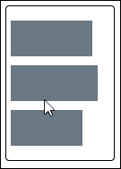

显然，这种行为是不希望出现的；如果这个演示被自动化并与 `requestAnimationFrame` 结合使用（我们稍后会在第九章中介绍，*使用 Web 性能 API*），那么当我们切换到一个标签并返回到原来的标签时，我们会看到一系列动画被完成。

## 解决问题

我们如何解决这个问题？很简单；我们只需要在语句链中添加 `.stop()` 方法；这将在开始下一个动画之前清除前面的动画。让我们看看这在实践中意味着什么，通过执行以下步骤：

1.  在 `blockedqueue.html` 文件的副本中，按照以下方式修改 `<head>` 部分：

    ```js
    <title>Demo: Clearing the animation queue</title>
      <link rel="stylesheet" href="css/blockedqueue.css">
      <script src="img/jquery.min.js"></script>
     <script src="img/unblockqueue.js"></script>
    </head>
    ```

1.  我们需要在演示的主体中稍微更改标记，所以按照以下代码进行修改：

    ```js
    <div id="container">
     <ul class="stop">
        <li></li>
    ```

1.  将其保存为 `unblockqueue.html`。在一个新文件中，添加以下代码，然后将其保存为我们项目区域的 `js` 子文件夹中的 `unblockedqueue.js`。这包含了修改后的标记，以及添加了 `.stop()`：

    ```js
    $(document).ready(function() {
      $(".stop li").hover(
        function () {
          $(this).stop().animate({width:"100px"},500);
        },
        function () {
          $(this).stop().animate({width:"80px"},500);
        }
      );
    });
    ```

1.  如果我们现在运行演示，然后快速地依次移动到每个条形图上，我们应该看到条形图会依次增加和减少，但是下一个条形图在前一个条形图返回到原始大小之前不会改变，如下所示：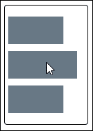

希望您同意添加`.stop()`已经显著改善了我们的代码——添加`.stop()`将终止前一个动画但排队下一个动画，准备就绪。

## 让过渡更加顺畅

我们还可以进一步。仔细查看`.stop()`可用的属性，我们可以使用`clearQueue`和`jumpToEnd`在匹配的元素上停止运行动画，从而产生更干净的过渡，如下图所示：

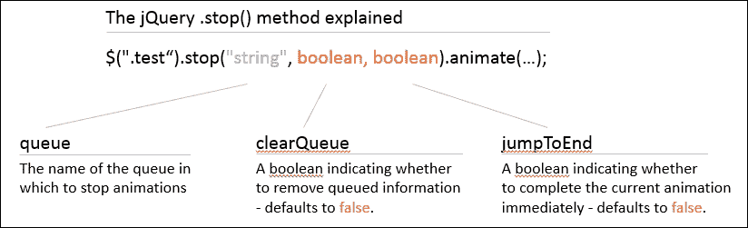

### 提示

有关使用`.stop()`的更多信息，请参阅主要的 jQuery 文档 [`api.jquery.com/stop/`](http://api.jquery.com/stop/)。

让我们修改我们的 jQuery 代码，看看这在实践中意味着什么，通过执行以下步骤：

1.  返回到`unblockedqueue.js`文件，然后按如下所示修改代码：

    ```js
      function () {
        $(this).stop(true, false).animate({width:"100px"},500);
      },
      function () {
        $(this).stop(true, false).animate({width:"80px"},500);
      }
    ```

1.  保存您的工作，然后在浏览器中预览演示的结果。如果一切顺利，您应该看不到条形图本身的任何变化，但当您将鼠标悬停在每个条形图上时，动画效果会更加顺畅。

在这个阶段，我们应该有一个仍然工作但过渡更加顺畅的动画——值得注意的是，这个技巧只适用于动画。如果您的项目使用其他函数队列，则需要使用`.clearQueue()`清除这些队列。

### 注意

为了比较使用`.stop()`的不同方式，值得看看 Chris Coyier 的演示，网址为 [`css-tricks.com/examples/jQueryStop/`](http://css-tricks.com/examples/jQueryStop/)——这产生了一些有趣的效果！类似的解释也可以在 [`www.2meter3.de/code/hoverFlow/`](http://www.2meter3.de/code/hoverFlow/) 找到。

## 使用纯 CSS 解决方案

好的，所以我们在 jQuery 中有我们的动画；对于一个简单的动画，如果我们改用纯 CSS 会是什么样子呢？虽然我们无法复制`.stop()`的相同效果，但我们可以非常接近。让我们看看这在实践中意味着什么，以`unblockedqueue.html`作为我们演示的基础：

1.  首先移除两个 JavaScript 链接，一个指向`unblockqueue.js`，另一个指向 jQuery 本身。

1.  在`blockedqueue.css`底部添加以下内容——这包含了我们演示所需的动画样式规则：

    ```js
    li { width: 50%; transition: width 1s ease-in, padding-left 1s ease-in, padding-right 1s ease-in; }
    li:hover { width: 100%; transition: width 1s ease-out, padding-left 1s ease-out, padding-right 1s ease-out; }
    ```

此时，如果我们在浏览器中预览结果，我们应该看不到动画列表元素的 *可见* 差异；真正的变化可以在使用 Google Chrome 的开发者工具栏监视时间线时看到。让我们看看这种变化是什么样子的。

1.  启动 Google Chrome。按 *Shift* + *Ctrl* + *I* 召唤**开发者工具栏**（或 *Option* + *Cmd* + *I* 适用于苹果 Mac）。

1.  单击 **Timeline** 标签，然后单击放大镜下方的灰色圆圈——圆圈将变为红色。

1.  依次将鼠标悬停在列表项上；Chrome 将监视并收集执行的操作的详细信息。

1.  几分钟后，单击红色圆圈以停止生成配置文件；您将得到类似这样的结果：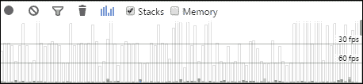

我们清楚地看到，仅 CSS 解决方案几乎不会影响浏览器的性能。相比之下，当我们运行 `unblockedqueue.html` 演示时，看一下相同的时间轴：

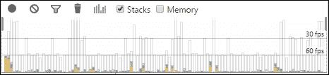

注意到区别了吗？虽然这只是一个快速的非科学性测试，但当我们查看详细数字时，我们可以清楚地看到差异。

在大约 3 秒的时间内，Google Chrome 在运行仅 CSS 解决方案时花费了 33 毫秒进行渲染和 48 毫秒进行绘制。运行 `unblockedqueue.html` 显示数字几乎翻了一番：脚本 107 毫秒，渲染 78 毫秒，绘制 76 毫秒！这绝对是需要考虑的事情...

# 改进 jQuery 动画

从前面的部分，我们可以很容易地看出，在浏览器中渲染 CSS 时具有明显的优势——尽管演示中使用了某种程度上不科学的方法！

但关键点在于，尽管在使用 jQuery 时我们在灵活性和全面的浏览器支持方面获得了一些好处，但我们在速度上失去了——jQuery 从未被设计为在渲染动画时性能良好。

为了帮助提高性能，您可以探索几个插件选项：

+   **Velocity.js**：这个插件对 `$.animate()` 进行了重新设计以提供更快的性能，并且可以与或无需 jQuery 一同使用；这包括 IE8。该插件可以从 [`julian.com/research/velocity/`](http://julian.com/research/velocity/) 下载。这还包含了一些预先注册的效果——我们将在本章稍后介绍更多关于创建自定义缓动效果的内容。

+   **jQuery-animate-enhanced**：这个插件会自动检测和重新设计动画，以使用原生的 CSS 过渡效果，适用于 WebKit、Mozilla 和 IE10 或更高版本。可以从这里下载 [`playground.benbarnett.net/jquery-animate-enhanced/`](http://playground.benbarnett.net/jquery-animate-enhanced/)。

我们还可以进一步探讨使用 jQuery 在动画完成时通知我们的方法，使用 `transitionend` 事件。虽然这可能无法解决动画队列积压的原始问题，但使用 jQuery 将允许您将动画效果与您的 jQuery 逻辑分开。

### 注意

对于一个有趣的文章和演示，关于使用 `transitionend`（及其供应商前缀版本），请查看 Treehouse 网站上的一篇文章，链接在这里 [`blog.teamtreehouse.com/using-jquery-to-detect-when-css3-animations-and-transitions-end`](http://blog.teamtreehouse.com/using-jquery-to-detect-when-css3-animations-and-transitions-end)。

现在我们已经看到了如何使我们的动画更流畅，让我们继续看看如何生成定制动画；理论是我们可以利用一些知识来创建更复杂和有趣的动画，同时减少我们在运行队列时看到的一些问题。

但是，在这样做之前，我想给你留下两个有用的建议，可以帮助您改善您的动画：

+   看看[`blog.teamtreehouse.com/create-smoother-animations-transitions-browser`](http://blog.teamtreehouse.com/create-smoother-animations-transitions-browser)；它探讨了我们在动画和过渡中遇到的一些问题，以及这些问题如何影响性能。

+   该文章在[`developer.telerik.com/featured/trimming-jquery-grunt/`](http://developer. example.org/jqtrim/)探讨了如何修剪我们的 jQuery 版本，以去除不需要的功能（因此在运行动画时减少了服务器的负荷）。

让我们开始设计这些定制动画，首先看一下如何使用缓动函数。

# 介绍缓动函数

在页面上动画化任何对象或元素时，我们可以简单地将其上下滑动或从一个地方移动到另一个地方。这些都是完全有效的效果，但缺乏实际感，例如在打开抽屉时可能得到的效果。

动画并不总是以恒定的速度运动；相反，如果我们弹跳一个球或者打开抽屉时会有一些反弹，或者会有一些减速。为了实现这种效果，我们需要使用缓动函数，它们控制变化的速率。在互联网上有很多例子——一个很好的起点是[`www.easings.net`](http://www.easings.net)——或者我们可以观看一些网站上的效果，比如[`matthewlein.com/ceaser/`](http://matthewlein.com/ceaser/)。在接下来的几页中，我们将更详细地探讨这些，并且看一些技巧，可以帮助我们将动画技能推向新的高度。

# 设计定制动画

如果您花费过任何时间开发 jQuery 代码来动画页面上的对象或元素，无疑您曾使用过 jQuery UI 或者可能是插件，比如由 George Smith 创建的 jQuery Easing（[`gsgd.co.uk/sandbox/jquery/easing/`](http://gsgd.co.uk/sandbox/jquery/easing/)）。

这两种方法都是在页面上动画化对象的绝佳方法，使用缓动方法如`easeIn()`或`easeOutShine()`。问题在于两者都需要使用插件，这为我们的代码增添了不必要的负担；它们也是实现我们需要的效果的一种非常安全的方法。如果我说我们两者都不需要，只需使用 jQuery 本身就可以产生相同的效果呢？

在我介绍如何做到这一点之前，让我们看一个展示这一点的工作演示：

1.  让我们开始吧，从附带本书的代码下载中提取相关文件——对于这个演示，我们将需要以下文件的副本：

    +   `customanimate.html`：将此文件保存在项目文件夹的根区域

    +   `customanimate.css`：将此文件保存在项目文件夹的`css`子文件夹中

    +   `customanimate.js`：将此文件保存在项目文件夹的`js`子文件夹中

    打开 Sans 字体；将其保存在项目文件夹的`font`文件夹中；或者，该字体可以在[`www.fontsquirrel.com/fonts/open-sans`](http://www.fontsquirrel.com/fonts/open-sans)获取。

1.  如果你在浏览器中预览`customanimate.html`文件，然后运行演示，你应该会看到类似于这个屏幕截图的东西，其中`<div>`标签正在运行动画的中途：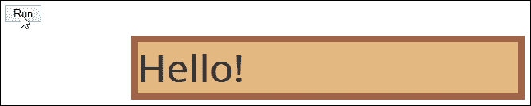

那么，这里发生了什么？嗯，我们所用的不过是一个标准的`.animate()`，用来增加`<div>`标签的大小并将其移动到新位置。

这里没有什么新鲜的，对吧？错了，这里的“新鲜”之处实际上在于我们如何构建缓动！如果你看一下`customanimate.js`，你会找到这段代码：

```js
$(document).ready(function() {
  $.extend(jQuery.easing, {
    easeInBackCustom: function(x,t,b,c,d) {
      var s;
      if (s == undefined) s = 2.70158;
      return c*(t/=d)*t*((s+1)*t - s) + b;
    }
  })
```

我们所做的就是取得实现相同效果所需的数学，并将其包装在一个扩展了`$.easing`的 jQuery 对象中。然后我们可以在我们的代码中引用新的缓动方法，如下所示：

```js
  $("#go").click(function() {
    $("#block").animate({
     ...
    }, 1500, 'easeInBackCustom');
  });
})
```

这打开了很多可能性；然后我们可以用我们自己的创意替换自定义的缓动函数。在互联网上搜罗了很多可能性，比如这两个例子：

```js
$.easing.easeOutBack = function(t) {
  return 1 - (1 - t) * (1 - t) * (1 - 3*t);
};

$.easing.speedInOut = function(x, t, b, c, d) {
  return (sinh((x - 0.5) * 5) + sinh(-(x - 0.5)) + (sinh(2.5) + Math.sin(-2.5))) / (sinh(2.5) * 1.82);
};
```

要真正深入了解缓动函数是如何工作的，超出了本书的范围——如果你对其背后的数学感兴趣，那么互联网上有几个网站可以更详细地解释这个问题。

### 注意

两个使用缓动函数的示例包括[`upshots.org/actionscript/jsas-understanding-easing`](http://upshots.org/actionscript/jsas-understanding-easing)和[`www.brianwald.com/journal/creating-custom-jquery-easing-animations`](http://www.brianwald.com/journal/creating-custom-jquery-easing-animations)—注意，它们看起来确实有点枯燥！

简而言之，获得缓动函数的最佳来源是 jQuery 的源代码，我们可以查看每个所需的计算，并将其用作创建自己的缓动效果的基础。

这一切都很好；这是一个很好的方式来实现良好的动画，而不会产生难以理解或调试的复杂代码。但是……你知道的，我认为我们仍然可以做得更好。怎么做？很简单，如果我们能够在 jQuery 中复制一些我们可能在 CSS 过渡中看到的缓动效果呢？

## 转换为与 jQuery 一起使用

在这一点上，你可能认为我现在真的疯了；CSS 过渡使用贝塞尔曲线，当与 jQuery 的`animate()`方法一起使用时不受支持。那么，我们如何实现相同的效果呢？

答案总是在一个插件之中—尽管这与我们在以前的演示中所讨论的有所不同！然而，存在一个区别：这个插件在压缩后的大小为 0.8 KB；这明显比使用 jQuery UI 或 Easing 插件要小得多。

我们打算使用的插件是 Robert Grey 开发的 Bez 插件，网址为[`github.com/rdallasgray/bez`](https://github.com/rdallasgray/bez)；这将使我们能够使用三次贝塞尔的值，比如`0.23, 1, 0.32, 1`，这相当于`easeOutQuint`。让我们看看它的效果：

1.  我们首先需要下载并安装 Bez 插件—可以从 GitHub 上下载，网址为[`github.com/rdallasgray/bez`](https://github.com/rdallasgray/bez)；然后将其引用于`customanimate.html`，就在对 jQuery 的引用下面。

1.  接下来，打开一份`customanimate.js`的副本；然后按照下面显示的方式更改这一行，替换我们之前使用的`easeInBackCustom`动作：

    ```js
      }, 1500, $.bez([0.23, 1, 0.32, 1]));
    ```

保存这两个文件；如果您在浏览器中预览结果，您将看到与前面示例中所见不同的操作。

那么，我们是如何做到这一点的呢？这背后的诀窍是结合插件和 easings.net 网站。以`easeOutQuint`作为我们的示例缓动效果，如果我们首先访问[`easings.net/#easeOutQuint`](http://easings.net/#easeOutQuint)，我们可以看到产生我们效果所需的三次贝塞尔值：`0.86, 0, 0.07, 1`。我们所需要做的就是将它们插入到对 Bez 插件的调用中，就完成了：

```js
}, 1500, $.bez([0.86, 0, 0.07, 1]));
```

如果我们想要创建自己的三次贝塞尔效果，我们可以使用[cubic-bezier.com](http://cubic-bezier.com)来创建我们的效果；这将给我们提供需要使用的数值，如下面的截图所示：

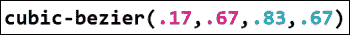

然后，我们可以像在上一个例子中那样将这些值插入到我们的对象调用中。使用这种方法的美妙之处在于，以后如果我们决定减少对 jQuery 的使用，我们可以轻松地将动画转换为 CSS3 的等效动画。

### 注意

要了解更多有关贝塞尔曲线背后理论的知识，请参阅维基百科上的文章，网址为[`en.wikipedia.org/wiki/B%C3%A9zier_curve`](http://en.wikipedia.org/wiki/B%C3%A9zier_curve)。

好的，所以我们已经学会了如何创建自己的动画缓动函数；如果我们想要使用现有库中可用的效果该怎么办？没问题，互联网上有一些很好的示例，包括以下内容：

+   [`daneden.github.io/animate.css/`](http://daneden.github.io/animate.css/)：这是 Animate.css 库的主页；我们可以使用[`github.com/jQueryKeyframes/jQuery.Keyframes`](https://github.com/jQueryKeyframes/jQuery.Keyframes)上提供的`jQuery.Keyframes`插件来复制此库中的效果。

+   [`github.com/yckart/jquery-custom-animations`](https://github.com/yckart/jquery-custom-animations)：这个库包含了许多不同的效果，以类似于 jQuery UI 的风格创建；可以轻松使用并以类似于本章前面 *设计自定义动画* 演示中的方式引用效果。

+   [`github.com/ThrivingKings/animo.js`](https://github.com/ThrivingKings/animo.js)：Animo.JS 采用了不同的方法；它不使用 jQuery 的 `animate()` 函数，而是使用自己的 `animo()` 方法来对对象进行动画处理。它使用了 `Animate.css` 库中的效果，该库由 Dan Eden 创建——虽然有人可能会争论是否值得额外开销，但它仍然值得一看，可能是你项目中动画的可能来源之一。

+   [`lvivski.com/anima/`](http://lvivski.com/anima/)：值得仔细查看这个库；源代码中包含了 `easings.js` 源文件中的许多三次贝塞尔值。如果需要的话，这些可以轻松地移植到你自己的代码项目中，或者可以为你自己的示例提供灵感。

是时候将我们所学到的动画概念投入到实践中了；让我们继续，看看如何在我们自己的项目中使用动画的一些例子。

# 实现一些自定义动画

在本章中，我们探讨了使用 jQuery 对对象进行动画处理，并看到了这与基于 CSS 的动画的比较；我们还看到了如何创建一些自定义的缓动模式，以控制元素在屏幕上的移动方式。

够了解理论，让我们深入一些实际应用吧！在接下来的几页中，我们将看一些元素动画的例子；我们将包括一些响应式网站的示例，因为这是一个热门话题，随着移动设备用于访问互联网内容的增加。

让我们开始吧，看看如何对一个简单的元素进行动画处理，以按钮的形式——注意演示结束时的转折！

## 对按钮进行动画处理

谦逊的按钮必须是任何网站上最重要的元素之一；按钮有各种形状和大小，并且可以通过标准的 `<button>` HTML 元素或使用 `<input>` 字段创建。

在这个演示中，我们将使用 jQuery 不仅来滑入和滑出按钮图标，还将同时旋转它们。但是等等——我们都知道 jQuery 不支持元素的旋转，对吗？

我们可以使用插件，例如 QTransform（[`github.com/puppybits/QTransform`](https://github.com/puppybits/QTransform)），甚至是 jQuery Animate Enhanced（[`playground.benbarnett.net/jquery-animate-enhanced/`](http://playground.benbarnett.net/jquery-animate-enhanced/)），但这样会增加负担，我们采用不同的方式。相反，我们将使用 Monkey Patch 直接改造支持；为了证明它有效，我们将更新**Codrops**演示，该演示在其网站上有原始版本的滚动按钮，现在将使用 jQuery 2.1。

### 注意

此演示的原始版本可在[`tympanus.net/codrops/2010/04/30/rocking-and-rolling-rounded-menu-with-jquery/`](http://tympanus.net/codrops/2010/04/30/rocking-and-rolling-rounded-menu-with-jquery/)找到。

让我们看看演示：

1.  从本书附带的代码下载中提取相关文件；对于此演示，我们需要以下文件：

    +   `rollingbuttons.html`：将此文件保存在项目区域的根子文件夹中

    +   `style.css`：将此文件保存在项目区域的`css`子文件夹中

    +   `jquery-animate-css-rotate-scale.js`：将此文件保存在项目区域的`js`子文件夹中

    +   `rollingbuttons.js`：将此文件保存在项目区域的`js`子文件夹中

    +   `img`：将此文件夹复制到项目区域

    ### 注意

    此 Monkey Patch 的原始版本可在[`www.zachstronaut.com/posts/2009/08/07/jquery-animate-css-rotate-scale.html`](http://www.zachstronaut.com/posts/2009/08/07/jquery-animate-css-rotate-scale.html)找到；它是为 jQuery 1.3.1+开发的，但是当我将其与 jQuery 2.1 一起使用时，我没有看到任何不良影响。

1.  在浏览器中运行演示，然后尝试悬停在一个或多个按钮上。如果一切运行正常，我们将看到绿色图标图像开始向左旋转，而灰色背景扩展形成一个长的药片，其中包含链接，如下图所示：

### 更详细地探索代码

此演示产生了一个巧妙的效果，同时还节省了空间；访问者只有在需要查看信息时才会暴露，而在其他时间都是隐藏的。

但是，如果我们更仔细地查看代码，就会发现一个有趣的概念：jQuery 在使用`.animate()`时不提供旋转元素的本地支持，就像在此演示开始时提到的那样。

那么，我们怎样才能解决这个问题呢？我们可以使用插件，但相反，我们使用一个 Monkey Patch（由开发者 Zachary Johnson 创建）来给 jQuery 添加支持。值得注意的是，使用补丁总是有风险的（如第二章所述，“自定义 jQuery”），但在这种情况下，尽管更新到了 jQuery 2.1，似乎没有明显的不良影响。

如果你想看到在使用补丁时的差异，请在运行演示之前激活 DOM 检查器，如 Firebug。将鼠标悬停在其中一个图标上，你应该会看到类似于这张截图的东西：

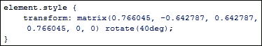

如果你想深入了解`matrix()`的工作原理，请访问 Mozilla 的笔记，网址为[`developer.mozilla.org/en-US/docs/Web/CSS/transform`](https://developer.mozilla.org/en-US/docs/Web/CSS/transform)。

让我们继续并查看我们的下一个动画示例。我相信你以某种形式使用过覆盖层，但我们将看一个采用全新方法且摒弃了大多数覆盖层中典型的灰色遮罩的覆盖层。

## 动画覆盖效果

如果你在互联网上浏览网站花费了一些时间，你肯定会遇到一些使用某种形式覆盖层的网站，对吧？

你知道这套流程：它们首先用半透明的覆盖层将屏幕变黑，然后开始显示图像或视频的放大版本。这是在全球数千个网站上找到的典型效果，如果使用得当，可以非常有效。

然而，你比这更了解我；我喜欢将事情推向更深层次！如果我们打破传统，做一个不显示图像但显示全屏展示的覆盖层，会怎么样？感兴趣吗？让我们看看我指的是什么：

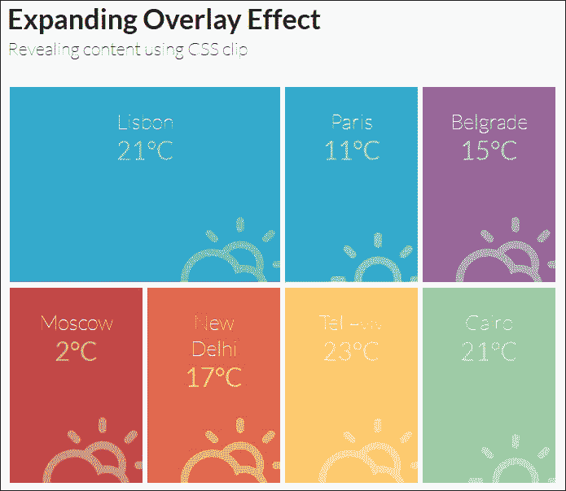

对于这个演示，我们将运行覆盖效果的一个版本，显示在[`tympanus.net/Tutorials/ExpandingOverlayEffect/`](http://tympanus.net/Tutorials/ExpandingOverlayEffect/)。

1.  让我们从与本书附带的代码下载中提取以下文件开始；将它们保存在项目区域内的相应文件夹中：

    +   `jquery.min.js`: 将此文件保存在项目区域的`js`子文件夹中

    +   `fittext.js`：将此文件保存在项目区域的`js`子文件夹中

    +   `boxgrid.js`：将此文件保存在项目区域的`js`子文件夹中

    +   `default.css`、`component.css`和`climacons.css`：将这些文件保存在项目区域的`css`子文件夹中

    +   `overlayeffect.html`：将此文件保存在项目区域的根目录中

1.  运行`overlayeffect.html`然后尝试点击其中一个彩色框。

注意发生了什么？它显示了一个覆盖效果，就像你期望的那样，但这个效果覆盖了整个浏览器窗口，并且没有常见的传统覆盖效果中经常显示的遮罩效果。

在这个演示中，我们使用了一些 HTML 来生成我们的初始网格；`fittext.js`插件用于帮助确保文本（因此是覆盖层）被调整大小以填充屏幕；覆盖效果是使用我们的代码内的`boxgrid.js`插件产生的。

魔法发生在`boxgrid.js`中——这包含了由 Louis Remi 开发的`jquery.debouncedresize.js`插件；尽管这已经有 2 年历史了；但在现代浏览器中仍然完美运行。您可以从[`github.com/louisremi/jquery-smartresize/blob/master/jquery.debouncedresize.js`](https://github.com/louisremi/jquery-smartresize/blob/master/jquery.debouncedresize.js)下载原始插件。

让我们改变焦点，继续看一看如何将 jQuery 动画应用于响应式网站。在两个演示中的第一个中，您将看到如何结合使用 CSS3、jQuery 和`history.pushState`来创建一些令人愉悦的转换效果，这些效果可以将一个多页面站点转变为一个看似是单页面应用程序。

# 在响应式网站中进行动画处理

您有多少次访问了一个站点，结果发现您必须在每个页面加载之间等待很长时间？听起来熟悉吗？

过去几年来，我们对页面转换的期望已经发生了变化——页面上元素重新排列的笨拙副作用已经不够了；我们对网站有了更多期望。基于 JavaScript 的**单页面应用程序**（**SPA**）框架通常被视为答案，但是要以使用冗长的代码为代价。

我们可以做得比这更好。我们可以介绍 smoothState.js，这是由 Miguel Ángel Pérez 创建的一个有用的插件，它允许我们添加转换效果，使整个体验对访问者更加平滑和愉快。在这个示例中，我们将使用插件作者提供的演示的修改版本；一些代码已经从原始代码中重新组织和清理。

让我们看看插件的实际效果，并看看它如何使体验更加流畅。要做到这一点，请执行以下步骤：

1.  从附带本书的代码下载中，提取以下文件的副本：

    +   `smoothstate.html`和`smoothstate.css`：将这些文件分别保存在您项目文件夹的根目录和`css`子文件夹中。

    +   `jquery.smoothstate.js`：将其保存在项目区域的`js`子文件夹中；最新版本可从[`github.com/miguel-perez/jquery.smoothState.js`](https://github.com/miguel-perez/jquery.smoothState.js)下载。

    +   `jquery.min.js`：将其保存在项目区域的`js`子文件夹中。

    +   `animate.css`：将其保存在项目区域的`css`子文件夹中；最新版本可在[`daneden.github.io/animate.css/`](http://daneden.github.io/animate.css/)下载。

    +   Roboto 字体：使用的两种字体的副本在附带本书的代码下载中。或者，它们可以从 Font Squirrel 网站下载，网址为[`www.fontsquirrel.com/fonts/roboto`](http://www.fontsquirrel.com/fonts/roboto)。我们只需要选择 WOFF 字体；我们将在演示中使用字体的轻和常规版本。

1.  在浏览器中运行`smoothstate.html`文件；尝试点击三个链接中的中间链接，看看会发生什么。注意它如何显示下一个页面，即`transitions.html`。smoothState.js 将网站视为单页面应用程序，而不是加载新页面时经常出现的暂停。您应该看到一个非常简单的页面显示，如下图所示：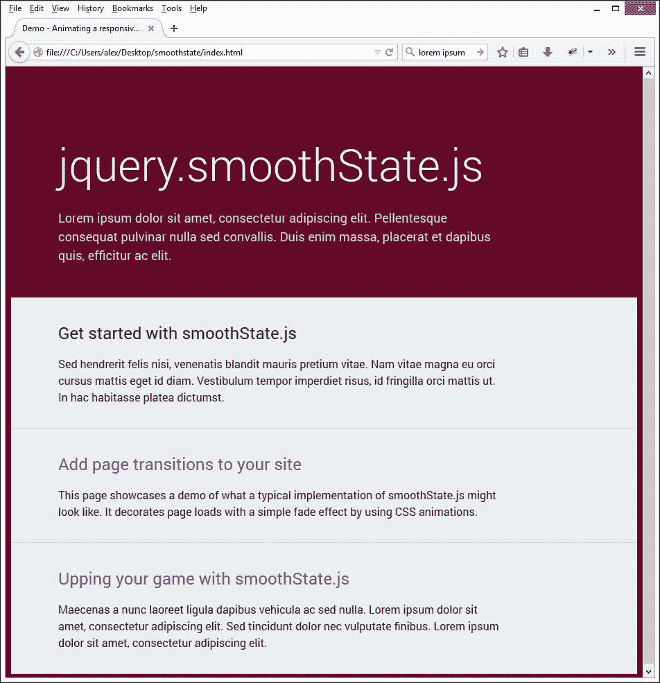

传统上，面对这个问题时，许多人可能会诉诸于 SPA 框架，以解决问题并改善过渡外观。采用这种方法确实有效，但会以使用不显眼代码获得的好处为代价。

相反，我们可以使用 jQuery、CSS3、`history.pushState()`和渐进增强的混合来实现相同的效果，从而为我们的最终用户带来更好的体验。

### 注意

值得一提的是，可以查看网站文档，位于[`weblinc.github.io/jquery.smoothState.js/index.html`](http://weblinc.github.io/jquery.smoothState.js/index.html)。在 CSS-Tricks 网站上有一个有用的教程，位于[`css-tricks.com/add-page-transitions-css-smoothstate-js/`](https://css-tricks.com/add-page-transitions-css-smoothstate-js/)。

维护良好的用户体验应始终是任何开发人员心中的首要任务——在处理响应式网站时，这更为重要。其中一个关键部分应该是监控我们动画的性能，以确保我们在用户体验和对服务器的需求之间取得良好的平衡。

在处理基于 jQuery 的动画在响应式网站上使用时，我们可以使用一些技巧来帮助提高性能。让我们来看看其中的一些问题以及我们如何缓解或解决它们。

## 考虑响应式网站上的动画性能

在这个可以从任何设备访问互联网的现代时代，对用户体验的重视比以往任何时候都更为关键——使用 jQuery 并不会帮助这一点。作为最低公共分母，它有助于简化处理内容（特别是复杂动画），但并不为其使用进行了优化。

在使用 jQuery 进行内容动画时，我们会遇到一些问题——我们在本章早些时候已经讨论过其中一些，在*选择 CSS 还是 jQuery*中介绍过；它们同样适用于响应式网站。此外，还有其他一些需要我们注意的问题，包括以下内容：

+   使用 jQuery 的动画将消耗大量资源；再加上可能不适合移动环境的内容（由于其量），将导致桌面体验缓慢。在笔记本电脑和移动设备上情况会更糟！

+   移动设备上的最终用户通常只对获取所需信息感兴趣；动画可能使网站看起来很好，但通常不针对移动设备进行优化，并且可能会减慢访问速度并导致浏览器崩溃。

+   jQuery 的垃圾收集进程经常会导致问题；它使用`setInterval()`而不是`requestAnimationFrame()`会导致高帧率，使得体验可能会出现卡顿和高帧丢失率。

    ### 提示

    在撰写本文时，有计划使用`requestAnimationFrame`（及`clearAnimationFrame`）替换 jQuery 中的`setInterval`（及`clearInterval`）。

+   如果我们使用动画——无论是 jQuery 还是纯 CSS——在一些平台上，我们经常需要启用硬件加速。虽然这可以提高移动设备的性能，但也可能导致闪烁，如果硬件加速的元素与不是硬件加速的其他元素重叠。在本章稍后的*改善动画外观*部分，我们将介绍如何启用 3D 渲染。

+   jQuery 的`.animate`在每帧动画都会增加元素的`style`属性；这会迫使浏览器重新计算布局，导致持续刷新。这在响应式网站上尤为严重，每个元素需要在屏幕调整大小时重新绘制；这会对服务器资源产生额外的需求并影响性能。如果需要的话，可以使用 jQuery Timer Tools ([`github.com/lolmaus/jquery.timer-tools`](https://github.com/lolmaus/jquery.timer-tools))等插件来限制或延迟操作，这样它们只会在必要时执行，或者多次重复调用能够被有效地合并成一次执行。

+   如果改变元素的显示状态（使用`display`...或`display: none`），那么这会导致向 DOM 添加或移除元素。如果您的 DOM 中有大量的元素，则这可能会对性能产生影响。

+   使用 jQuery 会在 DOM 中留下特异性很高的内联样式，这样会覆盖我们精心维护的 CSS。如果视口被调整大小并触发了不同的断点，这是一个大问题。

    ### 注意

    CSS 特异性是浏览器决定哪些属性值对元素最相关并作为结果应用的地方——查看[`css-tricks.com/specifics-on-css-specificity/`](https://css-tricks.com/specifics-on-css-specificity/)了解更多细节。

+   顺便说一句，在编写 JavaScript 文件时，我们丢失了关注点的分离（或者为我们的代码定义独立的部分）。

有可能减少或解决这些问题吗？有可能，但这可能需要一些牺牲；这将取决于您的需求是什么以及需要支持的目标设备。让我们花点时间考虑我们可以做出哪些改变：

+   在实际情况下，考虑在移动网站中使用 CSS 来取代 jQuery；大多数浏览器（除了 Opera Mini）支持 CSS 关键字，如`translate`或`transform`。由于它们是浏览器的本机支持，这消除了对引用额外代码的依赖，从而节省了资源和带宽的使用。

+   如果使用 jQuery 无法实现动画效果，或者所需的工作量超过了所获得的收益，则考虑使用插件，如 Velocity.js（可从[`github.com/julianshapiro/velocity`](https://github.com/julianshapiro/velocity)获取），因为该插件已经优化了对内容进行动画处理。

    ### 注意

    值得注意的是，正在讨论将 Velocity.js 集成到 jQuery 中——有关更多详细信息，请参阅[`github.com/jquery/jquery/issues/2053`](https://github.com/jquery/jquery/issues/2053)。也有一篇帖子值得阅读，详细讨论了 Velocity 的使用情况，请参见[`www.smashingmagazine.com/2014/09/04/animating-without-jquery/`](http://www.smashingmagazine.com/2014/09/04/animating-without-jquery/)。

+   更好的选择是使用 jQuery.Animate-Enhanced 插件或 jQuery++ 中的 animate 助手；两者都会默认将动画转换为使用 CSS3 等效果，在支持的情况下。

那么，在使用 jQuery 处理响应式网站上的动画请求时，我们该如何做呢？有几种方法可以做到这一点；让我们更详细地探讨这个关键问题。

# 处理响应式网站上的动画请求

在使用 jQuery 处理响应式网站内的内容动画时，最好的方法可能似乎有点反常：除非绝对必要，否则不要使用 jQuery！此时，您可能认为我完全疯了，但以下是一些很好的理由：

+   jQuery 不是为动画效果进行优化的；样式表、HTML 和 JavaScript 之间的分界线将开始模糊，这意味着我们失去了对内容样式的控制。

+   在移动设备上，使用 jQuery 进行动画效果不佳；为了提高性能，必须使用额外的 CSS 样式。

+   由于 CSS 的特异性，我们失去了对特定元素应用哪些规则的控制——将样式保持在 CSS 样式表中意味着我们可以保留控制。

+   默认情况下，jQuery 动画会消耗资源。在简单的网站上，这将产生很小的影响，但在较大的网站上，影响将显著更大。

+   使用纯 CSS 方法的一个额外好处是它允许您使用 CSS 预处理器，如**SASS**或 Less，来处理媒体查询。这种缩写 CSS 可以让您更有效地编写样式，同时仍保持最终期望的输出。

有了这个想法，让我们来看看我们可以用来处理响应式网站上动画请求的一些指针：

+   首先考虑移动端。如果你正在使用 CSS，那么首先基于最小的屏幕进行布局，然后添加额外的媒体查询来处理在越来越大的设备上查看时布局的变化。考虑使用 CSS 媒体查询样板，比如由开发者 Paul Lund 在[`www.paulund.co.uk/boilerplate-css-media-queries`](http://www.paulund.co.uk/boilerplate-css-media-queries)创建的样板；然后我们可以在适当的断点内插入动画规则。

+   避免在你的 jQuery 代码中使用`.css`语句，而是使用`.addClass()`或`.removeClass()`方法—这样可以保持内容和表现层之间的清晰分隔。如何使用这个的一个很好的例子（对于那些不确定的人）可以在 Justin Aguilar 的 Animation Cheat Sheet 网站上找到，网址为[`www.justinaguilar.com/animations/`](http://www.justinaguilar.com/animations/)。这会产生各种不同的动画，所有这些都可以使用`.addClass()`添加。

+   基于在代码中使用无前缀版本的属性，并使用自动添加任何供应商前缀的自动添加器。当使用 Grunt 和插件（例如 grunt-autoprefixer）时，这变得非常简单。

+   考虑尽可能使用 jQuery.Animate-Enhanced 插件（可在[`github.com/benbarnett/jQuery-Animate-Enhanced`](https://github.com/benbarnett/jQuery-Animate-Enhanced)获取）。虽然它有几年历史了，但仍然可以与当前版本的 jQuery 一起使用；它将`$.animate()`扩展为检测转换并用 CSS 等效项替换它们。

    ### 提示

    值得一看的另一个插件是 Animsition，可在[`git.blivesta.com/animsition`](http://git.blivesta.com/animsition)获取。

+   关键在于不要将其视为网站的永久部分，而是将其视为用 CSS 等效样式替换现有 jQuery 动画的工具。你能够转向使用 CSS 的越多，对页面的影响就越小，因为对服务器资源的需求将会减少。

+   时刻关注[`www.caniuse.com`](http://www.caniuse.com)。虽然浏览器对 CSS3 转换和过渡的支持非常好，但仍然有一些情况需要使用 WebKit 前缀，即适用于 Safari 和 iOS Safari（移动端）。

+   尽可能在你的动画中使用`requestAnimationFrame`（和`clearAnimationFrame`）。这将有助于在动画不可见时保护资源。这将需要使用 jQuery，但由于我们应该将其保留用于最复杂的动画，因此使用库的影响将会减小。

+   看一看诸如 [`cssanimate.com/`](http://cssanimate.com/) 这样的网站 —— 这些网站可以生成复杂的基于关键帧的动画，可以直接嵌入到您现有的代码中。如果您担心现有内容无法进行动画处理，那么这个网站可能会帮助您消除一些疑虑。

+   问问自己这个问题：“如果我的动画真的很复杂，它是否会有效？”如果动画做得好，它们可以视觉上令人惊叹，但这并不意味着它们必须复杂。通常，简单而经过深思熟虑的动画效果比它们的复杂、资源消耗大的等效效果更好。

这里需要考虑的重要一点是，使用 jQuery 来执行动画不应完全被排除在外；随着浏览器对 CSS 动画的支持不断发展，这更支持了以后大多数动画的基础是使用 CSS。

jQuery 团队意识到 jQuery 从未被设计用于高效地对内容进行动画处理。在撰写本书时，关于引入 Velocity.js 版本的讨论仍在进行中；原则上，这可能会改善使用 jQuery 来对内容进行动画处理的效果，但这距离成为现实还有很长的路要走！

与此同时，我们应该仔细考虑所使用的 jQuery 与 CSS 动画之间的平衡，并且如果可以使用 CSS 动画的话，就应该避免使用 jQuery 动画。

### 注意

为了证明一点，Chris Coyier 制作了一个 CodePen 示例，展示了一个相当简单的网站如何实现响应式并包含基于 CSS 的动画效果，您可以在 [`codepen.io/chriscoyier/pen/tynas`](http://codepen.io/chriscoyier/pen/tynas) 上查看。

好的，让我们继续。我们将继续讨论动画主题，但这次我们将看看如何在移动设备上实现动画效果。我们需要注意一些问题；让我们更详细地看看这些。

# 为移动设备创建动画内容

到目前为止，我们已经考虑了使用 jQuery 在响应式网站上对内容进行动画处理，但是移动平台呢？越来越多的非台式设备（如笔记本电脑和智能手机）用于查看内容。这带来了一些额外的考虑因素，我们需要考虑如何在移动设备上获得最佳性能。

在移动平台上进行动画处理与编写代码关系不大，更多的是关于决定使用哪些技术；在大多数情况下，简单地编写 jQuery 代码就可以工作，但效果可能不如预期的那么好。

获得最佳体验的秘诀在于使用智能手机的**GPU**或**图形处理单元**；为此，我们可以通过启用 3D 渲染来卸载标准的 jQuery 动画（速度较慢）。

### 提示

虽然此浏览器应该在所有台式机和移动设备上都能正常工作，但在基于 WebKit 的浏览器（例如 Google Chrome）中，您将获得最佳效果。

让我们通过一个启用了 3D 渲染的简单示例来更详细地探讨一下：

1.  对于这个演示，我们需要三个文件。从代码下载中提取`mobileanimate.html`、`mobileanimate.css`和`jquery.min.js`，并将它们保存在项目区域的相应文件夹中。

1.  在一个新文件中，添加以下代码。它处理我们的下拉框的动画。我们将逐步详细介绍它，首先是为我们的代码分配所需变量的数量：

    ```js
    var thisBody = document.body || document.documentElement,
        thisStyle = thisBody.style,
        transitionEndEvent = 'webkitTransitionEnd transitionend',
        cssTransitionsSupported = thisStyle.transition !== undefined,
        has3D = ('WebKitCSSMatrix' in window && 'm11' in new WebKitCSSMatrix());
    ```

1.  接下来是初始检查，如果浏览器支持 CSS3 变换，则在`ul`对象中添加`accordion_css3_support`类：

    ```js
    // Switch to CSS3 Transform 3D if supported & accordion element exist
    if(cssTransitionsSupported && has3D ) {
      if($('.children').length > 0) { 
        $('.children').addClass("accordion_css3_support");
      }
    }
    ```

1.  这个事件处理程序发生了神奇的事情。如果不支持 CSS3 过渡效果，则下拉框将使用`slideToggle`方法来打开或关闭；否则，它将使用 CSS3 变换：

    ```js
    $('.parent a').on('touchstart click', function(e) {
      e.preventDefault();
      // If transitions or 3D transforms are not supported
      if(!cssTransitionsSupported || !has3D ) {
        $(this).siblings('.children').slideToggle(500);
      }
      else {
        $(this).siblings('.children').toggleClass("animated");
      }
    });
    ```

1.  将文件保存为`mobileanimate.js`。如果一切顺利，你将看到一个样式化的下拉框准备好打开，如下所示：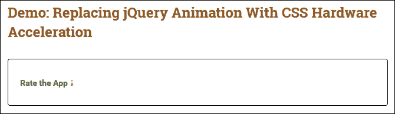

尝试点击下拉箭头。乍看之下，我们的下拉框似乎与其他任何下拉框没有区别；它以与任何其他下拉框相同的方式展开和收缩。实际上，我们的代码使用了两个重要的技巧来帮助管理动画；让我们花点时间来了解在使用 jQuery 时两者的重要性。

## 改善动画外观

如果我们仔细看代码，我们对两个地方感兴趣；第一个在 jQuery 代码中：

```js
if(!cssTransitionsSupported || !has3D ) {
  $(this).siblings('.children').slideToggle(500);
}
else {
  $(this).siblings('.children').toggleClass("animated");
}
```

第二个在 CSS 样式表中两个地方显示：

```js
.accordion_css3_support { display: block; max-height: 0;
  overflow: hidden; transform: translate3d(0,0,0);
  transition: all 0.5s linear; -webkit-backface-visibility: hidden; -webkit-perspective: 1000; }
.children.animated { max-height: 1000px; transform: translate3d(0,0,0); }
```

“为什么这些重要呢？”，我听到你问。答案很简单。在大多数情况下，我们可能会使用`slideToggle()`事件处理程序。这没有什么不对，除了动画不是硬件加速的（还需要你将其转换为 CSS），因此不会充分利用平台的功能。此外，它模糊了代码和样式之间的界线；如果我们既在代码中又在样式表中拥有它们，那么在调试样式时就更难了。

更好的选择是先弄清楚浏览器是否支持 CSS3 变换（或类似的功能），然后应用一个新的类，我们可以在样式表中进行样式设计。如果浏览器不支持变换，则我们简单地回退到在 jQuery 中使用`slideToggle()`方法。前者的好处是 CSS 样式将减少运行动画所需的资源，并有助于节省资源。

### 提示

如果还必须使用 jQuery，则值得测试设置给`jQuery.fx.interval`的值——尝试大约 12fps 左右，看看是否有助于提高性能；更多细节请参阅主文档[`api.jquery.com/jquery.fx.interval/`](http://api.jquery.com/jquery.fx.interval/)。

第二个值得关注的点可能显得不太明显；如果我们对包含动画的任何 CSS 规则应用变换`translate3d(0,0,0)`，那么这足以启用 3D 渲染，并允许浏览器通过将动画卸载到 GPU 上来提供流畅的体验。在某些浏览器（如 Google Chrome）中，我们可能会遇到闪烁的情况；我们可能需要添加以下代码来消除不需要的闪烁：

```js
-webkit-backface-visibility: hidden; -webkit-perspective: 1000;
```

也有可能`translate3d(x, y, z)`不能为某些平台（如 iOS 6）启用硬件加速；我们可以改用`–webkit-transform: translate (0)`。

最终，虽然可能有些情况下我们需要（或更喜欢）使用 jQuery 来动画内容，但应考虑是否它真的是正确的工具，以及是否可以使用 CSS 动画来替代它。

一个很好的例子是在 JSFiddle（[`jsfiddle.net/ezanker/Ry6rb/1/`](http://jsfiddle.net/ezanker/Ry6rb/1/)）上展示的，它使用了来自 Dan Eden 的 Animate.css 库来处理动画，将 jQuery 作为 jQuery Mobile 的依赖项留给了演示中使用的版本。诚然，jQuery 的版本有点旧，但原理仍然非常合理！

### 小贴士

Treehouse 团队发布了一篇探讨动画和过渡如何影响性能的好博文，值得一读；你可以在[`blog.teamtreehouse.com/create-smoother-animations-transitions-browser`](http://blog.teamtreehouse.com/create-smoother-animations-transitions-browser)找到它。

让我们转移焦点，继续前进吧。有多少人访问过具有视差滚动效果的网站？视差…滚动…不确定这到底是什么？没问题，在接下来的几页中，我们将看看这是如何成为网页设计中最热门的技术之一的，但如果在我们的项目中没有正确实现它，同样也可能适得其反。

# 实现响应式视差滚动

视差滚动到底是什么？简单来说，它涉及在向下滚动页面时，以比前景更慢的速度移动背景，以创建三维效果。

最初由 Ian Coyle 于 2011 年为耐克创建，视差滚动是一种流行的技术。它可以提供微妙的深度元素，但如果不正确使用，同样也可能会让人感到不知所措！

想要了解可能性的话，可以看看 Creative Bloq 网站上的文章，链接为[`www.creativebloq.com/web-design/parallax-scrolling-1131762`](http://www.creativebloq.com/web-design/parallax-scrolling-1131762)。

目前已经有数十款视差滚动插件可用，比如来自 PixelCog 的 parallax.js 插件（位于[`pixelcog.github.io/parallax.js/`](http://pixelcog.github.io/parallax.js/)）或 Mark Dalgleish 的 Stellar.js 可以在[`markdalgleish.com/projects/stellar.js/`](http://markdalgleish.com/projects/stellar.js/)找到。可以说，最著名的插件是 Skrollr，可以从[`github.com/Prinzhorn/skrollr`](https://github.com/Prinzhorn/skrollr)下载——这将构成我们下一个演示的基础。

## 构建一个视差滚动页面

如果你在网上花时间做一些研究，毫无疑问你会看到很多关于如何给网站添加视差滚动效果的教程。在接下来的几页中，我们将以澳大利亚前端开发者 Petr Tichy 的教程为基础，进行我们的下一个练习。毕竟，试图重复造轮子是没有意义的，对吧？

### 注意

这个原始教程可以查看：[`ihatetomatoes.net/how-to-create-a-parallax-scrolling-website/`](https://ihatetomatoes.net/how-to-create-a-parallax-scrolling-website/)。

我们的下一个演示将使用广为人知的 Skrollr 库（位于[`github.com/Prinzhorn/skrollr`](https://github.com/Prinzhorn/skrollr)）来构建一个简单的页面，其中可以滚动查看五张图片，同时还将使用一些效果来控制图片在页面上的滚动方式：

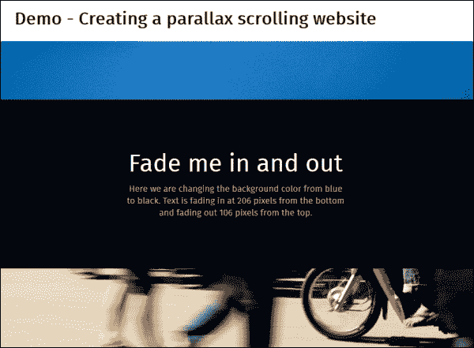

现在我们已经看到我们的演示将会产生的效果，接下来让我们按照以下步骤来实施：

1.  我们将从本书附带的代码下载中提取`parallax`文件夹，并将整个文件夹保存到你的项目区域。

1.  我们的演示需要一些额外的插件才能工作，所以去下载以下插件：

    +   **ImagesLoaded**：[`raw.githubusercontent.com/desandro/imagesloaded/master/imagesloaded.pkgd.js`](https://raw.githubusercontent.com/desandro/imagesloaded/master/imagesloaded.pkgd.js)；把文件保存为`imagesloaded.js`

    +   **Skrollr**：[`raw.githubusercontent.com/Prinzhorn/skrollr/master/src/skrollr.js`](https://raw.githubusercontent.com/Prinzhorn/skrollr/master/src/skrollr.js)

    +   **ViewPortSize**：[`github.com/tysonmatanich/viewportSize`](https://github.com/tysonmatanich/viewportSize)

    把全部这些插件都保存在 `parallax` 文件夹中的 `js` 子文件夹中。

1.  在一个新文件中，添加以下代码；这个代码处理 Skrollr 插件的初始化。让我们详细地介绍一下，从设置一系列变量以及使用 ImagesLoaded 插件预加载图像开始，然后调整它们的大小并在每个部分淡入：

    ```js
    $(document).ready(function($) {
      // Setup variables
      $window = $(window);
      $slide = $('.homeSlide');
      $slideTall = $('.homeSlideTall');
      $slideTall2 = $('.homeSlideTall2');
      $body = $('body');

      //FadeIn all sections
      $body.imagesLoaded( function() {
        setTimeout(function() {
          // Resize sections
          adjustWindow();

      // Fade in sections
      $body.removeClass('loading').addClass('loaded');
      }, 800);
    });
    ```

1.  在 DOM 函数下面、闭合括号前，添加以下代码。这个代码处理每个幻灯片的调整大小，使其适应窗口高度或至少`550px`的最小高度，以确保更佳的显示：

    ```js
    function adjustWindow(){
      var s = skrollr.init();  // Init Skrollr
      winH = $window.height(); // Get window size

      // Keep minimum height 550
      if(winH <= 550) { winH = 550; } 

      // Resize our slides
      $slide.height(winH);
      $slideTall.height(winH*2);
      $slideTall2.height(winH*3);

      // Refresh Skrollr after resizing our sections
      s.refresh($('.homeSlide'));
    }
    ```

1.  如果一切顺利，当您预览结果时，图像将在我们向上或向下滚动时从一个图像交叉到另一个图像，如此屏幕截图所示：

视差滚动作为一种技术，当使用得当时可以产生一些真正令人惊叹的效果。一些很好的例子，请参阅 Costa Coffee 的网站，网址为[`www.costa.co.uk`](http://www.costa.co.uk)，或 Sony 的 Be Moved 网站，网址为[`www.sony.com/be-moved/`](http://www.sony.com/be-moved/)。很难相信这样原创的设计是基于视差滚动的！

### 提示

查看彼得的一个关于如何使视差滚动响应式的教程，网址为[`ihatetomatoes.net/make-parallax-website-responsive/`](https://ihatetomatoes.net/make-parallax-website-responsive/)。

## 考虑视差滚动的影响

尽管很难相信使用视差滚动可以创建如此漂亮的网站，但必须提出警告：这种技术并不是没有问题的。当然，大多数（如果不是全部）问题都可以通过一些注意和关注来解决；然而，如果在设计和实施过程中不注意，这些问题可能会使任何设计师遇到困难。让我们更详细地探讨一些这些问题：

+   最大的问题是，视差滚动默认情况下不友好于 SEO。有一些可用的技术可以解决这个问题，例如 jQuery 或多个页面，但它们会影响分析或服务器资源。数字营销策略师卡拉·道森撰写了一篇关于这些解决方案的优点的优秀文章，可在[`moz.com/blog/parallax-scrolling-websites-and-seo-a-collection-of-solutions-and-examples`](http://moz.com/blog/parallax-scrolling-websites-and-seo-a-collection-of-solutions-and-examples)找到——值得一读！

+   视差滚动（自然地）需要访客滚动；关键在于确保我们不要创建滚动时间过长的单个页面。这可能会影响移动用户的性能并使访客失去兴趣。

+   使用 jQuery 来创建基于这种技术的效果本身就可能是一个缺点；jQuery 会影响页面加载时间，因为必须计算页面上每个元素的位置。我们可以通过使用我们在第一章中介绍的技术来自定义我们的 jQuery 的副本来在一定程度上减轻这种影响，但在使用库时性能总会有所降低。

+   视差滚动可能会揭示许多可用性问题。如果视觉吸引力与内容和易访问性的平衡不均匀，布局对最终用户可能显得杂乱无章。在某些情况下，视差滚动将是合适的选择，例如你可能希望访客仅浏览您的网站一次，或者为公司展示他们的能力。但在你为产品或业务做推介的情况下，这可能会产生负面影响。

+   在许多情况下，您会发现视差滚动在移动设备上无效；这主要是由于动画在最后执行时会破坏视差滚动。已经尝试解决此问题，但成功的程度各不相同。以下是一些成功尝试的例子：

    +   使用 Stellar.js jQuery 视差插件，可在[`markdalgleish.com/projects/stellar.js/`](http://markdalgleish.com/projects/stellar.js/)获取；搭配 Scrollability 插件，可在[`joehewitt.github.com/scrollability/`](http://joehewitt.github.com/scrollability/)获取，可实现触摸友好的视差滚动效果。该插件在桌面和移动浏览器中都适用，因此应该考虑检查触摸支持并根据情况切换方法。插件作者 Mark Dalgleish 通过[`markdalgleish.com/presentations/embracingtouch/`](http://markdalgleish.com/presentations/embracingtouch/)解释了如何使用 iScroll.js 来实现这一点。

    +   Keith Clark 提供了一个纯 CSS 版本，可在[`codepen.io/keithclark/pen/JycFw`](http://codepen.io/keithclark/pen/JycFw)获取——他在自己的网站上[`keithclark.co.uk/articles/pure-css-parallax-websites/`](http://keithclark.co.uk/articles/pure-css-parallax-websites/)详细解释了所使用的原理。

视差滚动的关键信息是不要仓促行事；的确有一些站点成功地创建了一些令人惊叹的视差滚动示例，但在构建示例时必须经过深思熟虑的规划和规划，以便性能好，满足 SEO 的要求，并为访问者呈现可用的体验。

# 总结

如果做得好，项目中的内容动画会非常令人满意；这不仅取决于我们使用正确的代码，还要决定 jQuery 是否是正确的工具，或者 CSS 动画是否更适合我们的需求。在过去的几页中，我们涵盖了很多内容，让我们花一点时间来回顾一下我们学到了什么。

我们以讨论使用 jQuery 或 CSS 的优点开始，并讨论了在何时使用其中一种而不是另一种以及使用 CSS 的好处，情况可能决定使用 jQuery。

然后，我们开始讨论了困扰 jQuery 开发人员的经典问题，即控制动画队列；我们看到了如何实施一个快速而简单的修复方法，并随后改进以减少或消除这个问题。

接下来讨论了使用缓动函数的问题；我们看到不仅可以依赖于诸如 jQuery UI 之类的经过验证的源，还可以开发扩展核心 jQuery 的简单动作。我们看了一下如何构建我们自己的自定义缓动函数，然后将我们可能在 CSS 中看到的函数转换为 jQuery 等效函数。

接着，我们通过一些动画示例来结束本章，例如对按钮进行动画处理，实现带有特效的覆盖效果以及在响应式网站上对内容进行动画处理。

在下一章中，我们将深入研究高级事件处理。在大多数情况下，人们使用`.on()`或`.off()`，但正如我们将看到的，这只是 jQuery 可能性的冰山一角。
