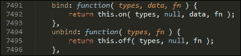
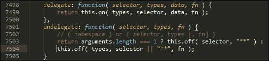
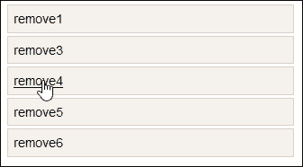
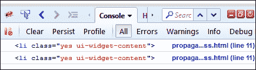
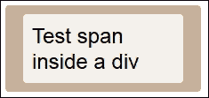
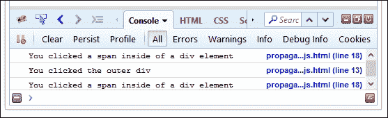
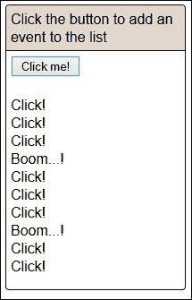
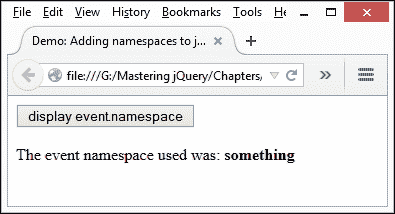
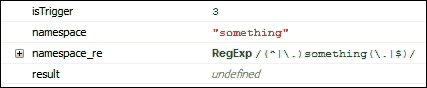

# 第七章：高级事件处理

你有多少次访问网站执行一个操作？它可能是在线银行业务，或者从亚马逊购买东西；在这两种情况下，网站将检测到正在发生的动作，并作出相应的反应。

使用 jQuery 的一部分是知道何时以及如何响应不同类型的事件。在大多数情况下，人们可能会使用`.on()`或`.off()`事件处理程序来处理它们。虽然这样做完全没问题，但它只是触及了事件处理的表面。在本章中，我们将探讨一些可以帮助我们扩展事件处理技能的技巧和窍门。我们将涵盖以下主题：

+   事件委托

+   使用`$.proxy`函数

+   创建和解耦自定义事件类型

+   事件命名空间

有兴趣吗？那我们就开始吧！

# 介绍事件处理

一个问题 - 你多久上线执行一项任务？我敢打赌这是每周都会发生的事情；它可能是任何事情，从在线银行业务到点击亚马逊购买最新的 DVD（DVD - 谁会下载它们，我想知道？）

话虽如此，我们无法避免必须点击链接或按钮来通过流程。在大多数情况下，事件背后的代码可能是普遍存在的点击处理程序，或者甚至可能是`.change()`或`.hover()`。所有这些都是`.on()`（甚至`.off()`）事件处理程序的简写形式，并且当然与以下内容的功能等效：

```js
$('a').on('click', function(){
  $(this).css('background-color','#f00');
});
```

这将使所选元素变成一个漂亮的红色。然而，事件处理不仅仅是在已知元素上定义一个操作。在接下来的几页中，我们将（引用一个航海术语）冒险一试，并查看一些可以帮助我们进一步发展技能的提示和技巧。我们将从事件委托开始。

# 事件委托

有人曾经说过，成为一名优秀的经理的艺术就是知道什么时候委派任务。我希望这不是他们把一个可怕的工作推卸给下属的借口，尽管愤世嫉俗的人可能会说另外一种看法！

撇开风险，事件委托遵循着 jQuery 中相同的原则。如果我们需要创建一个需要将某种形式的事件处理程序绑定到大量相同类型元素的应用程序，那么我们可以考虑编写事件处理程序来覆盖每个元素。

它在某种程度上是有效的，但非常浪费资源。如果列表很大，那么事件将绑定到其中所有的元素，这会比所需的内存更多。我们可以通过使用**事件委托**来解决这个问题，我们可以将一个事件处理程序绑定到一个祖先元素，该元素为多个后代服务，或者为新创建的元素启用事件处理。

有一些技巧可以帮助我们更好地使用委托来管理事件。在我们看看它们之前，让我们快速回顾一下事件委托的基本原理。

## 重新审视事件委托的基础

一个问题——你在使用 jQuery 编写事件处理程序时有多少次使用过`.on()`，甚至`.off()`？我敢打赌答案可能是无数次。如果你之前没有使用过事件委托，那么你已经无意中使用了一半！

事件委托依赖于使用**事件传播**，有时也称为事件冒泡。这是理解委托工作原理的关键。让我们通过一个快速的示例来说明。

想象一下，我们正在使用以下 HTML 代码作为列表的基础：

```js
<div id="container">
  <ul id="list">
    <li><a href="http://domain1.com">Item #1</a></li>
    <li><a href="/local/path/1">Item #2</a></li>
    <li><a href="/local/path/2">Item #3</a></li>
    <li><a href="http://domain4.com">Item #4</a></li>
  </ul>
</div>
```

这里没有什么特别的——这是一个简单的示例。每当我们的锚点标签之一被点击时，都会触发一个点击事件。事件在三个阶段之一中分派：**捕获**，**目标**和**冒泡**。

它将被捕获到文档根，在命中目标（`li`标签）之前向下工作，然后冒泡回文档根，如下所示：

+   文档根

+   `<html>`

+   `<body>`

+   `<div #container>`

+   `<ul #list>`

+   `<li>`

+   `<a>`

哎呀！这意味着每次点击链接时，实际上都在点击整个文档！不好！这会消耗资源，即使我们使用如下代码添加了额外的列表项：

```js
$("#list").append("<li><a href='http://newdomain.com'>Item #5</a></li>");
```

我们会发现上述的点击处理程序不适用于这些项目。

### 提示

这里使用的冒泡示例有些简化，并没有显示所有的各种阶段。要进行有用的讨论，请前往 Stack Overflow 上发布的评论 [`stackoverflow.com/questions/4616694/what-is-event-bubbling-and-capturing`](http://stackoverflow.com/questions/4616694/what-is-event-bubbling-and-capturing)。

### 重新调整我们的代码

我们可以利用事件传播来重新调整我们的处理程序，监听**后代**锚点，而不是仅绑定到现有锚点标签。这可以在以下代码中看到：

```js
$("#list").on("click", "a", function(event) {
  event.preventDefault();
  console.log($(this).text());
});
```

代码中唯一的区别是我们将`a`选择器移动到`.on()`方法的第二个参数位置。这将创建一个针对`#list`的单个事件处理程序，事件从`a`向上冒泡到`#list`。事件委托消除了创建多个事件处理程序的需要，这是一种浪费资源的做法——代码将同样适用于`#list`内现有的锚点标签，以及将来添加的任何锚点标签。

### 提示

如果您想了解更多关于事件委托的信息，建议查看 jQuery API 文档，网址是 [`learn.jquery.com/events/event-delegation/`](http://learn.jquery.com/events/event-delegation/)。jQuery 文档还有一个关于在委托事件中使用`.on()`的有用部分，网址是 [`api.jquery.com/on/`](http://api.jquery.com/on/)。

### 支持旧版浏览器

一个小提示 - 如果你需要重构旧代码，那么你可能会看到`.bind()`、`.live()`或`.delegate()`作为事件处理程序。在 jQuery 1.7 之前，所有这些都用于委托事件，但现在应该替换为`.on()`。事实上，第一个`.bind`是一个调用`.on`（及其伴侣`.off()`）的单行函数：



同样适用于`.delegate()`及其配对事件处理器`.undelegate()`：



应该注意`.on()`模仿了使用`.bind()`或`.delegate()`时发现的行为。前者非常耗资源，因为它会附加到每个可以匹配的元素；后者仍然需要确定要调用哪个事件处理程序。然而，与使用`.bind()`方法相比，这种情况的范围应该较小。

现在我们已经深入了解了`.on()`的内部工作原理，让我们将其付诸实践，并创建一个简单的演示来提醒自己 jQuery 中事件委托的工作方式。

## 探索一个简单的演示

现在是行动的时候了，让我们快速回顾一下在使用 jQuery 时事件委托是如何工作的：

1.  让我们从伴随本书的代码下载中提取我们需要的文件。对于这个演示，我们需要`simpledelegation.html`、`simpledelegation.css`和`jquery-ui.min.css`文件。

1.  将 CSS 文件保存在项目区域的`css`子文件夹中。HTML 标记需要存储在项目文件夹的根目录中。

1.  在一个新文件中，添加以下代码 - 将文件保存为`simpledelegation.js`，并将其存储在项目区域的`js`子文件夹中：

    ```js
    $(document).ready(function(event){
      var removeParent = function(event) {
        $('#list').parent('li').remove();
      }

      var removelistItem = function(event) {
        $(event.target).parent().remove();
      }

      $('li.ui-widget-content').children().on("click", removeParent);

      $('ul').on("click", "li", removelistItem);
    });
    ```

1.  如果一切正常，当在浏览器中预览结果时，我们应该看到以下项目列表：

1.  尝试点击一些链接 - 如果你点击任何一个移除链接，那么列表项将被移除；点击其中一个列表项将会移除列表中的所有项。

这个演示的关键在于以下一行：

```js
$('ul').on("click", "li", removelistItem);
```

尽管列表中有多个项目，但我们创建了一个单一的委托事件处理程序。它冒泡到我们点击的`<li>`项的父级，然后将其移除。在这种情况下，我们将触发事件时调用的函数分开了出来；这很容易可以合并到处理程序中。

现在我们重新审视了事件委托的基础知识，让我们看看事件委托为何可以在处理许多相似元素时提高性能。

## 探索使用事件委托的影响

在直接等效物代替委托事件的关键好处是减少内存使用量，避免代码中存在多个事件处理程序时的内存泄漏。通常，我们需要为需要发生某些事情的每个实例实现一个事件处理程序。

### 注意

使用事件委托的真正影响在于内部数据结构中存储事件处理程序定义所带来的内存使用量节约。

相反，减少事件处理程序的数量意味着我们可以减少内存泄漏，改善性能（通过减少需要解析的代码量）。只要我们小心绑定事件处理程序的位置，就有潜力显著减少对 DOM 的影响和由此产生的内存使用量，特别是在更大的应用程序中。好处是，如果已实施事件委托，它将同样适用于已定义的现有元素，以及尚未创建的元素。直接应用的事件处理程序将不起作用；它们只能应用于在代码中调用事件处理程序之前已经存在的元素。

处理已存在和尚未发生的事件的能力听起来是件好事。毕竟，如果一个事件处理程序可以处理多个事件，那么为什么要重复自己呢？绝对可以 - 只要我们小心管理！如果我们在特定元素上触发事件，例如一个锚点标签，那么这将被允许首先处理事件。事件会冒泡直到达到文档级别，或者更低级别的事件处理程序决定停止事件传播。这最后一部分很关键 - 没有控制，我们可能会得到意外的结果，其中事件处理程序的响应与预期相反，可能也没有被触发。

### 提示

要看详细的解释可以发生什么，可以看看[`css-tricks.com/capturing-all-events/`](http://css-tricks.com/capturing-all-events/)。它包含了指向 CodePen 上很好地说明了这个问题的示例的链接。

为了帮助减少事件冒泡引起事件处理程序无序触发的影响，我们使用诸如`event.stopPropagation()`之类的方法。这不是我们唯一能使用的技巧，因此让我们花点时间来探讨在使用事件委托时可用的一些选项。

## 控制委托

利用事件冒泡增加了我们在代码中实现的事件处理程序数量的减少的范围；缺点在于出现意外行为的实例，其中事件处理程序可能在期望的点上没有被触发。

要控制哪些元素可能触发委托事件处理程序，我们可以使用以下两种技巧之一：`event.stopPropagation()`，或者捕获事件目标并确定它是否符合给定的一组条件（例如特定类或`data-`名称）。

让我们首先来看看这第二个选项 - 一个代码块的例子可能如下所示：

```js
$("ul.my-list").click(function(event) {
  if ( $( event.target).hasClass("my-item") ) {
    handleListItemAction(event.target);
  }
else if ( $( event.target).hasClass("my-button") ) {
    handleButtonClickedAction(evt.target);
  }
});
```

那是一种笨拙的做事方式！相反，我们可以简单地对类名进行检查，使用下面显示的委托事件处理程序的变体：

```js
$("ul.my-list").on("click",".my-item", function(evt) {
  //do stuff
});
```

这是一个非常简单的技巧，我们可以使用它 - 它非常简单，可能不算是一个技巧！为了看到改变有多容易，让我们现在快速进行一个演示：

1.  从代码下载中，我们需要提取`propagation-css.html`和`propagation.html`文件。这些文件包含了一些简单的标记和样式，用于我们的基本列表。将 CSS 文件保存在我们项目区域的`css`子文件夹中，将 HTML 标记保存在同一区域的根目录中。

1.  接下来，我们需要创建事件处理程序，当条件匹配时将触发。继续添加以下内容到一个新文件中，并将其保存为`propagation-css.js`，保存在我们项目区域的`js`子文件夹中：

    ```js
        $(document).ready(function() {
          $('#list').on('click', '.yes', function eventHandler(e) {
            console.log(e.target);
          });
        });
    ```

此时，如果我们在浏览器中预览结果，我们将得到一个简单的列表，其中列表项在我们悬停在特定项上时会变暗。这没什么特别的 - 它只是从 jQuery UI 中借用了一些样式。

但是，如果我们启动一个 DOM 检查器，比如 Firebug，然后悬停在每个项目上，我们可以看到每次悬停在一个类为`.yes`的项目上时都会添加控制台输出：



因此，我们不像*探索一个简单的演示*中那样提供选择器，我们简单地使用了一个类名；只有当事件处理程序函数与指定的类名匹配时，事件处理程序函数才会被触发。

### 提示

我们甚至可以使用`data-`标签作为我们的检查：

```js
$(document).on('keypress', '[data-validation="email"]', function(e) {
  console.log('Keypress detected inside the element');
})
```

### 作为替代方法使用 stopPropagation()方法

作为替代方法，我们可以使用一个全 jQuery 的解决方案，形式为`stopPropagation()`。这可以防止事件冒泡到 DOM 树，并阻止任何父处理程序被通知事件。

这一行代码的实现非常简单，尽管使用它的关键在于确保我们将其添加到我们代码的正确位置。如果你以前没有使用过它，那么它需要放在事件处理程序内，在处理程序的最后一个命令之后立即添加（如下面的片段中所突出显示的那样）：

```js
document.ready(function ($) {
  $('div'). on("click", function (event) {
    console.log('You clicked the outer div');
  });
  $('span').on("click", function (event) {
    console.log('You clicked a span inside of a div element');
    event.stopPropagation();
  });
})
```

作为快速检查，尝试从附带本书的代码下载中提取`propagation-js`文件。将它们保存在我们项目区域内的相关文件夹中。如果我们在浏览器中预览它们，我们会看到一个简单的**span**包含在**div**内。参考下面的图片：



这个演示的关键在于 DOM 检查器。尝试点击灰褐色的外环，或其中的 span，我们将看到我们选择的结果出现在控制台日志中，如下所示：



如果你在代码中注释掉`event.stopPropagation()`行，那么附加到`div`的点击事件也将被调用。

### 提示

除非必要，否则不应该停止事件传播。有一篇有用的文章位于[`css-tricks.com/dangers-stopping-event-propagation/`](https://css-tricks.com/dangers-stopping-event-propagation/)，其中讨论了如果停止传播可能遇到的问题。

好的，让我们改变焦点，转到事件处理程序中的另一个关键概念。是时候看看使用 `$.proxy` 函数了，以及为什么需要它，如果事件委托不能满足我们的需要。

# 使用 `$.proxy` 函数

到目前为止，我们已经介绍了如何利用事件冒泡可以帮助我们减少大量事件处理程序的需求；只要我们仔细管理冒泡，委托就可以成为使用 jQuery 进行开发的非常有用的工具。

另一面的情况是，在某些情况下，我们可能需要帮助 jQuery；当它的传播不足够高！起初这可能不合理，所以让我解释一下我的意思。

假设我们有一个作为对象创建的事件处理程序，并且当点击链接时，我们想调用它：

```js
var evntHandlers = {
  myName : 'Homer Simpson',

  clickHandler : function(){
    console.log('Hello, ' + this.myName);
  }
};

$("a").on('click',evntHandlers.clickHandler);
```

如果我们在浏览器中运行这个代码，您期望在控制台日志区域看到什么？

### 提示

要找出答案，请尝试从随本书附带的代码下载中提取 `proxy-before.html` 文件。确保您安装了 DOM 检查器！

如果您期望看到 **你好，霍默·辛普森**，那我将让您失望；答案不会是您期望的，而是 **你好，未定义**，如下图所示：


好的，这是怎么回事？

原因是所使用的上下文位于 `clickHandler` 事件中，而不是 `evntHandler` 对象中；我们在 `clickHandler` 事件中没有 `myName` 属性。

幸运的是，这有一个简单的解决方法。我们可以使用 `$.proxy` 强制更改上下文，如下所示：

```js
var evntHandlers = {
  myName : 'Homer Simpson',
  clickHandler : function(){
    console.log('Hello, ' + this.myName);
  }
};

$("a").on('click',$.proxy(evntHandlers.clickHandler,evntHandlers));
```

要看到这种情况的效果，请从随本书附带的代码下载中提取 `proxy-before.html` 和 `proxy-after.html` 文件。如果在浏览器中运行它们，你将看到与下图中显示的相同的结果：


这是一个简单的改变，但它打开了各种可能性。这是一种设定闭包上下文的简易方法。当然，我们也可以使用纯 JavaScript 的`.bind()`方法。但是，使用 `$.proxy` 确保传入的函数是实际上是一个函数，并且向该函数传递了唯一的 ID。如果我们给我们的事件添加命名空间，我们可以确保解绑正确的事件。`$.proxy` 函数被视为 jQuery 中的单个函数，即使它被用来绑定不同的事件。使用命名空间而不是特定的代理函数将避免在代码中解绑错误的处理程序。

### 注意

如果您想了解更多关于使用 `$.proxy` 的内容，那么值得阅读主要 jQuery 网站上的文档，可以在[`api.jquery.com/jquery.proxy/`](http://api.jquery.com/jquery.proxy/)上找到。

为了让我们真正了解可能性，考虑一下这个问题：你有多少次最终以三到四层深度嵌套的函数结束了？考虑以下代码：

```js
MyClass = function () {
  this.setupEvents = function () {
    $('a').click(function (event) {
      console.log($(event.target));
    });
  }
}
```

而不是使用上述代码，我们可以通过使用`$.proxy`来重构代码以增加可读性，如下所示：

```js
MyClass = function () {
  this.setupEvents = function () {
    $('a').click( $.proxy(this, 'clickFunction'));
  }

  this.clickFunction = function (event) {
    console.log($(event.target));
  }
}
```

我认为你会同意这样更容易阅读，对吧？

好的 - 让我们继续吧。我相信我们都很熟悉在 jQuery 中创建事件处理程序。但是，很可能你正在使用标准事件处理程序。这些可以很好地工作，但我们仍然受限于我们所能做的事情。

那么，让我们改变这一点。使用 jQuery，我们可以创建打破我们知道可能性的常规的自定义事件，并且允许我们创建各种事件处理程序。让我们看看我们如何在实际操作中做到这一点。

# 创建和解耦自定义事件类型

如果你花了一些时间开发 jQuery，那么我相信你对我们可以使用的标准事件类型非常熟悉，比如`.click()`、`.hover()`或`.change()`等。

这些都有用途，但都有一个共同点 - 我们在使用它们时受到了一些限制！我们的代码将受到这些处理程序可以做到的程度的限制。如果我们能打破这种限制，创建*任何*类型的自定义事件处理程序会怎样呢？

当然，我们始终可以将多个事件组合在一起，由同一个函数来处理：

```js
$('input[type="text"]').on('focus blur', function() {
  console.log( 'The user focused or blurred the input' );
});
```

但这仍然局限于那些现成的事件处理程序。我们需要的是打破常规，在设计我们自己的处理程序时发挥创意。

没问题 - 我们可以使用 jQuery 的特殊事件功能构建几乎任何类型的事件以满足我们的需求。这打开了一个真正的可能性世界，可能需要一本专门的书来介绍。在接下来的几页中，我们将介绍一些概念，以帮助您开始创建事件。

### 小贴士

要深入了解创建自定义事件，请参阅 learn jQuery 网站上的一篇有用的文章，网址为[`learn.jquery.com/events/introduction-to-custom-events/`](http://learn.jquery.com/events/introduction-to-custom-events/)。

事件的好处是它们的行为就像它们的标准版本一样，包括在 DOM 中冒泡：

```js
$('p').bind('turnGreen', function() { 
  $(this).css('color', '#00ff00');
});

$('p:first').trigger('turnGreen');
```

那么，特殊事件的组成是什么？特殊事件通常采用插件的形式；格式可能类似，但我们经常会看到几个**fixHooks**中的任何一个，我们用它来控制 jQuery 中事件处理的行为。

### 注意

jQuery 特殊事件钩子是一组按事件名称分组的函数和属性，允许代码控制 jQuery 内部事件处理的行为。

让我们花一点时间来看一下特殊事件插件的典型组成，然后再深入介绍一个这样的插件的示例。

## 创建自定义事件

fixHooks 接口提供了规范或扩展将覆盖本机浏览器事件对象的路径。我们通常会看到类似以下格式的事件插件被使用：

```js
jQuery.event.special.myevent = {
  noBubble: false;
  bindType: "otherEventType",
  delegateType: "otherEventType",
  handle: function ($event, data { 
    // code
  },
  setup: function( data, namespaces, eventHandle ) {
    // code
  },
  teardown: function( namespaces ) {
    // code
  },
  add: function( handleObj ) {
    // code
  },
  remove: function( handleObj ) {
    // code
  },
  _default: function( event ) {
    // code
  }
};
```

值得注意的是，在创建特殊事件类型时，我们经常会使用两种方法 - `.on()`，用于绑定事件，以及`.trigger()`，用于在需要时手动触发特定事件。此外，特殊事件插件将公开许多有用的关键方法，值得学习。让我们来探索一下：

| 方法/属性名称 | 目的 |
| --- | --- |
| `noBubble: false` | 布尔类型，默认值为`false`。指示如果调用`.trigger()`方法，是否应用冒泡到此事件类型。 |
| `bindType` | 当定义时，这些字符串属性指定应该如何处理特殊事件类型，直到事件被传递。对于直接附加的事件，请使用`bindType`，对于已委托的事件，请使用`delegateType`。在这两种情况下，这些都应该是标准的 DOM 类型，例如`.click()`。 |
| `handle: function(event: jQuery.Event, data: Object)` | 当事件发生时调用处理程序钩子，jQuery 通常会调用用户通过`.on()`或其他事件绑定方法指定的事件处理程序。 |
| `setup: function(data: Object, namespaces, eventHandle: function)` | 第一次将特定类型的事件附加到元素时调用。这提供了一个机会，可以处理将应用于该元素上此类型的所有事件的处理。 |
| `teardown: function()` | 当特定类型的最终事件从元素中移除时调用。 |
| `add: function(handleObj)``remove: function(handleObj)` | 当通过`.on()`等 API 向元素添加事件处理程序时调用，或者在使用`.off()`时移除时调用。 |
| `_default: function(event: jQuery.Event, data: Object)` | 当从代码中使用`.trigger()`或`.triggerHandler()`方法触发特殊类型事件时调用，而不是由浏览器内部发起的事件。 |

如果您在开发中使用 jQuery Mobile，了解这些方法非常重要。移动端依赖特殊事件来产生事件，如`tap`，`scrollstart`，`scrollstop`，`swipe`或`orientationchange`。

### 提示

要了解每种方法的更多细节，请查看[`gist.github.com/cowboy/4674426`](https://gist.github.com/cowboy/4674426)上的 Ben Alman 的 Gist。

如果您正在使用特殊事件来覆盖标准事件行为，那么就需要更深入地了解这些特殊事件。如果想要更多地了解内部工作原理，值得阅读 jQuery Learning Site 上的这篇文章：[`learn.jquery.com/events/event-extensions/`](http://learn.jquery.com/events/event-extensions/)。请注意 - 这可能会变得非常复杂！

现在我们已经看到了一个特殊事件插件的一些内部工作原理，现在是时候投入使用并看到它在实际中的效果了。为此，我们将使用由 James Greene 制作的 jQuery Multiclick 插件，以展示捕获例如三次点击并将其用于执行操作的简单性。

## 使用多次点击事件插件

创建自定义事件可以简单也可以复杂。对于此演示，我们将使用 James Greene 的 jQuery Multiclick 事件插件。该插件可从[`jamesmgreene.github.io/jquery.multiclick/`](http://jamesmgreene.github.io/jquery.multiclick/)获取。我们将使用它在屏幕上发布一些消息，并且在每三次点击时更改消息。参考以下图片：



让我们看一下涉及的内容：

1.  让我们从附带本书的代码下载中提取以下文件。对于此演示，我们将需要`jquery.multiclick.js`、`jquery.min.js`、`multiclick.css`和`multiclick.html`文件。将每个文件存储在项目区域内的相应子文件夹中。

1.  在一个新文件中，添加以下代码，并保存为`multiclick.js`：

    ```js
    $(document).ready(function() {
      var addText = "Click!<br>";
      var addBoom = "Boom...!<br>";

      $("button").on("click", function($event) {
        $("p").append(addText);
      });

      $("button").on("multiclick", { clicks: 3 }, function($event) {
        $("p").append(addBoom);
      });
    });
    ```

1.  这是配置多次点击插件所必需的，并在鼠标点击时触发相应的响应。

1.  尝试在浏览器中运行演示。如果一切正常，一旦我们点击**Click me!**按钮几次，我们应该会看到与练习开始时显示的屏幕截图类似的东西。

尽管可能必须说这并不完全代表一个真实世界的例子，但所涉及的技术仍然是相同的。插件绑定到标准的点击处理程序，并且如果达到的点击次数是插件配置选项中指定值的倍数，则会触发。

# 事件命名空间

到目前为止，我们已经看到了如何委托事件并创建可以接受自定义触发器的处理程序。如果我们有一个单击事件处理程序，那么这些方法就非常完美，但是如果我们需要有多个点击处理程序呢？

好在，这里有一个简单的解决方案：给事件添加一个命名空间！而不是讨论它的工作原理，让我们快速看一下以下示例：

```js
$("#element")
  .on("click", doSomething)
  .on("click", doSomethingElse);
```

这段代码是完全可接受的 - 没有任何问题！当然，这可能不像一些人所希望的那样可读，但我们现在并不担心这一点！

这里的关键点是如果我们调用：

```js
$("#element").off("click");
```

然后我们不仅会丢失第一个点击处理程序，还会丢失第二个点击处理程序。这不是理想的。我们可以通过添加命名空间或标识符来修复此问题，如下所示：

```js
$("#element")
  .on("click.firsthandler", doSomething)
  .on("click.secondhandler", doSomethingElse);
```

如果我们现在运行相同的`.off`命令，显然两个事件处理程序都不会被移除。但是 - 假设我们做出以下更改：

```js
$("#element").off("click.firsthandler");
```

现在我们可以安全地移除第一个事件处理程序，而不会移除第二个。

### 注意

如果我们写的是 `$("#element").off(".firsthandler")`，那么它将删除所有拥有该命名空间的事件处理程序。这在开发插件时非常有用。

理解这是如何工作的最好方法，就是看它在实际中的表现。现在让我们来看下面这个简单的例子吧：

```js
<!DOCTYPE html>
<html>
<head>
  <meta charset="utf-8">
  <title>Demo: Adding namespaces to jQuery events</title>
  <script src="img/jquery.min.js"></script>
</head>
<body>
  <button>display event.namespace</button>
  <p></p>
  <script>
    $("p").on("test.something", function (event) {
      $("p").append("The event namespace used was: <b>" +
event.namespace + "</b>");
    });
    $("button").click(function(event) {
      $("p").trigger("test.something");
    });
  </script>
</body>
</html>
```

### 注意

此演示的代码可在随书附带的代码下载中找到，名为 `namespacing.html` 文件。您需要提取它以及 jQuery 的副本才能运行演示。

在这里，我们分配了两个调整大小的函数。然后我们使用命名空间删除第二个，这将完全不影响第一个，如下图所示：



如果我们使用 DOM Inspector 来检查代码，我们可以清楚地看到分配的命名空间；要做到这一点，设置一个断点在第 12 行，然后展开右侧的列表，如下图所示：



起初，这可能看起来像是一个非常简单的改变，但我非常相信 KISS 这个短语 - 你懂的！

### 提示

使用的命名空间的深度或数量没有限制；例如，`resize.layout.headerFooterContent`。命名空间也可以与标准事件或自定义事件处理程序一样使用。

添加命名空间标识符是我们可以应用于任何事件处理程序的一个非常快速简便的方法。它使我们对任何事件处理程序都有完美的控制，特别是在我们的代码中为多个实例分配函数到相同事件类型时。

### 注意

如果您经常创建复杂的事件处理程序，则可能值得查看 Mark Dalgleish 的 Eventralize 库，该库可从 [`markdalgleish.com/projects/eventralize/`](http://markdalgleish.com/projects/eventralize/) 获取。注意，它已经有 2-3 年没有更新了，但测试一下看它是否有助于整合和简化您的事件可能是值得的。

# 摘要

事件处理对于任何网站或在线应用的成功至关重要。如果处理正确，可以打造一个引人入胜的用户体验；而处理不当则可能导致一些意想不到的结果！在过去的几页中，我们已经研究了一些概念，以帮助我们发展事件处理技能；让我们花点时间回顾一下我们学到的东西。

我们先快速介绍了事件处理，然后迅速转移到探讨事件委托作为我们能够从中受益的工具之一。我们首先看了事件委派的基础知识，然后检查了使用它的影响，并学习了如何在我们的代码中控制它。

接下来是查看 `$.proxy`，在那里我们看到 jQuery 有时需要帮助，以确保在我们的代码意味着事件没有在足够高的位置传播时，事件在正确的上下文中被触发。

然后，我们将注意力转向简要介绍创建自定义事件类型和处理程序，然后探讨这些事件处理程序是如何构建的。然后，我们以 jQuery Multiclick 插件作为示例，展示了如何创建这些自定义事件处理程序，最后以使用命名空间来确保我们能够在代码中绑定或解除绑定正确的事件处理程序来结束本章。

在下一章中，我们将看一些视觉方式如何增强我们的网站 - 我们将看到如何应用效果，并管理结果效果队列如何帮助我们的网站的成功与否。
