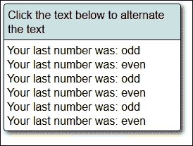
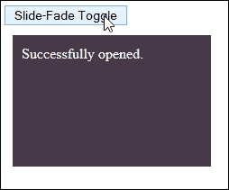
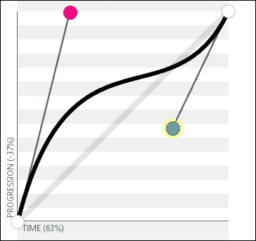
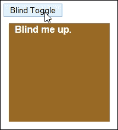
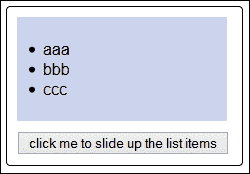

# 第八章：使用 jQuery 效果

在任何网站上添加事件处理程序是一个必要的步骤；毕竟，我们需要一些方式来响应我们代码中的合法事件。

另一方面，添加效果的反面是，如果做得好，它们可以带来巨大的回报，尽管其中一些新奇感可能会消失，特别是如果你已经过度使用了所有的核心效果！通过新的自定义效果使你的网站焕发活力 - 我们将在本章中看到如何做到这一点，以及如何管理生成的队列。在接下来的几页中，我们将涵盖以下主题：

+   重温基本效果

+   添加回调

+   构建自定义效果

+   创建和管理效果队列

感兴趣吗？让我们开始吧...

# 重温效果

一个问题 - 你多少次访问网站，看到内容平稳地向上滑动，或逐渐淡化至无？

我相信你当然会认出这些代码中提供的效果；这些可以是从简单的向上滑动到内容逐渐从一幅图像或元素淡入另一幅图像或元素的任何内容。

创建效果是任何网站的重要考虑因素。我们在本书的早些时候已经涉及了一些方法，在第六章中，*使用 jQuery 进行动画*。我相信我们都很熟悉淡入淡出或切换元素的基本代码。毫无疑问，在开发网站时，你会无数次地使用诸如`$("blockquote").fadeToggle(400);`或`$("div.hidden").show(1250);`这样的代码。

看起来很熟悉？在接下来的几页中，我们将介绍一些额外的技巧，可以帮助我们在添加效果时取得更好的效果，并考虑使用 jQuery 提供这些效果的一些影响。在此之前，有一个重要的问题需要澄清，那就是探索简单动画和向元素添加效果之间的关键区别。

## 探索动画和效果之间的差异

也许有些人会认为我们在第六章中讨论动画时已经涵盖了效果的提供，这是正确的，它们之间确实有一些重叠；快速查看 jQuery 效果的 API 列表将显示`.animate()`作为有效的效果方法。

然而，有一个重要的区别 - 我们已经讨论过的内容是关于*移动*元素的，而提供效果将专注于控制内容的*可见性*。不过，很棒的是，我们可以将这两者联系在一起。`.animate()`方法可以用来在代码中实现移动和效果。

现在这个小区别已经澄清了，让我们开始行动吧。我们将首先看一下如何向我们的效果添加自定义缓动函数。

# 创建自定义效果

如果你使用过`.animate()`或其快捷方法，比如`.fadeIn()`、`.show()`或`.slideUp()`对动画元素应用效果，那么你很可能都使用过它们。所有这些方法都遵循类似的格式，至少需要提供一个持续时间、缓动类型，还有可能需要提供一个回调函数，在动画完成时执行一个任务，或者在控制台中记录一些内容。

然而，我们在决定时往往会坚持使用标准值，比如`slow`、`fast`，或者可能是一个数值，比如`500`：

```js
$("button").click(function() {
  $("p").slideToggle("slow");
});
```

使用这种方法绝对没错，只是非常无聊，而且只能发挥出了很小一部分可能性。

在接下来的几页中，我们将探索一些技巧，用来拓宽我们在应用效果时的知识，了解到我们并不总是必须坚持已经验证过的方法。在我们探索这些技巧之前，不妨先了解一下这些效果在 Core jQuery 库中是如何处理的。

## 探索`animate()`方法作为效果的基础

如果你被要求使用预配置的效果，比如`hide()`或`slideToggle()`，那么你可能期望在 jQuery 内部使用一个命名函数。

### 注意

注意，本节中给出的行号适用于未压缩版本的 jQuery 2.1.3，可从[`code.jquery.com/jquery-2.1.3.js`](http://code.jquery.com/jquery-2.1.3.js)获取。

好吧，这是对的，但只是部分正确：jQuery 内部预配置的函数都是指向`animate()`的简写指针，就像在**6829**至**6840**行附近所示的那样。它们经过了两个阶段的处理：

+   第一阶段是向`genFX()`方法传递三个值，即`show`、`hide`或`toggle`。

+   这之后传递给`animate()`方法来产生最终效果，在**6708**至**6725**行。

代码中快速查看每个可用的值以及它们如何传递给`.animate()`：


我们在第六章 *使用 jQuery 进行动画* 中详细介绍了`animate()`的用法。以下是关于在我们的代码中使用`animate()`的几个关键要点：

+   只能支持取数值的属性，虽然有一些例外情况。一些值，比如`backgroundColor`，没有插件的情况下是无法进行动画的（jQuery Color – [`github.com/jquery/jquery-color`](https://github.com/jquery/jquery-color), 或 jQuery UI – [`www.jqueryui.com`](http://www.jqueryui.com)），还有一些属性可以取多个值，比如`background-position`。

+   可以通过使用适用的任何标准 CSS 单位来对 CSS 属性进行动画 – 完整列表可在[`www.w3schools.com/cssref/css_units.asp`](http://www.w3schools.com/cssref/css_units.asp)中查看。

+   元素可以使用相对值移动，这些相对值在属性值前加上`+=`或`-=`。如果设置了持续时间为`0`，则动画将立即将元素设置为它们的最终状态。

+   作为快捷方式，如果传递了`toggle`的值，动画将简单地从当前位置反转，并动画到目标位置。

+   通过单个`animate()`方法设置的所有 CSS 属性将同时进行动画处理。

现在我们已经看到了库中如何处理自定义效果，让我们探索创建一些新的效果，这些效果结合了库中已经可用的效果。

## 将自定义效果付诸实践

如果我们花费时间开发代码，限制在使用 jQuery 中可用的默认效果，我们很快就会超出它所能做的限制。

为了防止这种情况发生，值得花时间去研究我们真正想使用的效果，并看看我们是否可以从 jQuery 内部构建一些东西来复制它们。为了证明这一点，我们将深入一些示例；我们的第一个示例是基于点击选定元素产生一个切换效果。

### 创建一个 clickToggle 处理程序

我们三个示例中的第一个的灵感不来自在线评论，而是来自 jQuery 本身。核心库有一个可用的切换函数（如[`api.jquery.com/toggle-event/`](http://api.jquery.com/toggle-event/)所示），在版本 1.8 中已弃用，在 1.9 中已移除。

我们将探讨如何添加类似的功能，使用一个小型插件，想法是根据插件中设置的值的状态运行两个函数中的一个：



让我们看看需要什么：

1.  我们将从本书的代码下载中提取相关文件开始。对于此演示，我们需要`clicktoggle.css`、`jquery.min.js`和`clicktoggle.html`文件。将 CSS 文件放在`css`子文件夹中，jQuery 库放在`js`子文件夹中，并将标记文件放在项目区域的根目录下。

1.  在一个新文件中，我们需要创建我们的`clicktoggle()`事件处理程序，所以继续并添加以下代码，并将其保存为`clicktoggle.js`：

    ```js
    $.fn.clicktoggle = function(a, b) {
      return this.each(function() {
        var clicked = false;
        $(this).on("click", function() {
          if (clicked) {
            clicked = false;
            return b.apply(this, arguments);
          }
          clicked = true;
          return a.apply(this, arguments);
        });
      });
    };
    ```

    ### 注意

    `apply()`函数用于调用函数的上下文 - 更多细节，请参阅[`api.jquery.com/Types/#Context.2C_Call_and_Apply`](http://api.jquery.com/Types/#Context.2C_Call_and_Apply)。

1.  在`clicktoggle`事件处理程序的下方立即添加以下函数：

    ```js
    function odd() {
      $("#mydiv").append("Your last number was: odd<br>");
    }

    function even() {
      $("#mydiv").append("Your last number was: even<br>");
    }

    $(document).ready(function() {
      $("#mydiv").clicktoggle(even, odd);
    });  
    The first two look after adding the appropriate response on screen, with the third firing off the event handler when text has been clicked.
    ```

1.  如果一切顺利，我们应该看到与练习开始时显示的屏幕截图类似的东西，在那里我们可以看到文本已经被点击了几次。

    ### 注意

    许多人已经产生了类似版本的代码 - 请参阅[`gist.github.com/gerbenvandijk/7542958`](https://gist.github.com/gerbenvandijk/7542958)作为一个例子；这个版本使用了`data-`标签并将处理函数合并到一个调用中。

好的，让我们继续，看看另一个示例：在这个示例中，我们将创建一个滑动淡入淡出切换效果。这将使用与前面示例相似的原理，我们将检查元素的状态。这次，我们将使用 `:visible` 伪选择器来确认应该在屏幕上呈现哪个回调消息。

### 注意

作为一个想法，为什么不尝试将这个插件与 [Toggles 插件](http://simontabor.com/labs/toggles/)结合使用呢？这可以用来制作一些漂亮的开关按钮。我们然后可以触发由本例中创建的 `clickToggle` 插件处理的事件。

### 使用滑动淡入淡出切换内容

在我们之前的示例中，我们的效果在屏幕上出现得非常突然 - 要么是一个声明，要么是另一个声明，但没有中间状态！

从视觉效果来看，这并不总是理想的；如果我们能让过渡更平滑，那会给人留下更柔和的印象。这就是滑动淡入淡出切换插件的作用。让我们看看如何创建它：

1.  我们将像往常一样，从附带本书的代码下载中提取我们需要的相关文件。对于这个演示，我们将需要常见的 `jquery.min.js`，以及 `slidefade.css` 和 `slidefade.html`。JavaScript 文件需要放在 `js` 子文件夹中，样式表需要放在 `css` 子文件夹中，HTML 标记文件需要放在我们项目区域的根目录中。

1.  在一个新文件中，让我们继续创建 `slideFadeToggle` 效果。将以下行添加到文件中，将其保存为 `slidefade.js`，并将其放在 `js` 子文件夹中：

    ```js
    jQuery.fn.slideFadeToggle = function(speed, easing, callback) {
      return this.animate({opacity: 'toggle', height: 'toggle'}, speed, easing, callback);
    };

    $(document).ready(function() {
      $("#sfbutton").on("click", function() {
        $(this).next().slideFadeToggle('slow', function() {
          var $this = $(this);
          if ($this.is(':visible')) {
            $this.text('Successfully opened.');
          } else {
            $this.text('Successfully closed.');
          }
        });
      });
    });
    ```

1.  如果一切顺利，那么当我们在浏览器中预览结果时，我们应该看到黑灰色的方块在我们单击按钮后淡出，这在以下图片中显示：

代码创建了一个漂亮的警告效果 - 它可以用来在您的网站内向访问者显示适当的消息，因为它滑入视图。我们的插件是基于在两个状态之间切换。如果您的首选是仅仅使用 `fadeIn()` 或 `fadeOut()` 状态的等效值，那么我们可以根据需要轻松地使用其中任何一个函数：

```js
$.fn.slideFadeIn  = function(speed, easing, callback) {
  return this.animate({opacity: 'show', height: 'show'}, speed, easing, callback);
};

$.fn.slideFadeOut  = function(speed, easing, callback) {
  return this.animate({opacity: 'hide', height: 'hide'}, speed, easing, callback);
};
```

好的，让我们继续。我们已经创建了一些自定义效果，但感觉还是缺了点什么。啊，是的 - 我知道了：从一个状态到另一个状态的缓动怎么样？（是的，绝对是双关语！）

我们可以添加一个缓动功能，不仅可以简单地设置慢速、快速、正常速度甚至是数字值来控制效果的持续时间，还可以增加一个缓动功能，使效果更具动感。让我们深入了解一下涉及到的内容。

# 对效果应用自定义缓动函数

如果有人对你提到 "缓动" 这个词，我敢打赌会发生两件事中的一件：

+   你很可能会认为你需要使用 jQuery UI，这可能会向页面添加相当大的代码块

+   你可能会逃跑，一想到要解决一些可怕的数学问题！

不过，这里的讽刺是，对于两者的答案可能是肯定的也可能是否定的（至少对于第二个评论的前半部分而言）。等等，怎么回事？

之所以如此，是因为你绝对不需要 jQuery UI 提供特殊的缓动函数。当然，如果你已经在使用它，那么使用其中包含的效果是有道理的。虽然你可能需要计算一些数学问题，但这只有在你真正想要深入研究复杂的公式时才是必要的。感兴趣吗？让我解释一下。

将缓动添加到代码中不必超过一个简单的函数，该函数使用下表中的五个不同值之一，如下表所示：

| 值 | 目的 |
| --- | --- |
| `x` | `null`请注意，虽然始终包含 `x`，但几乎总是设置为 null 值。 |
| `t` | 经过的时间。 |
| `b` | 初始值 |
| `c` | 变化的量 |
| `d` | 持续时间 |

在正确的组合中，它们可以用来产生一个缓动效果，例如 jQuery UI 中可用的 `easeOutCirc` 效果：

```js
$.easing.easeOutCirc= function (x, t, b, c, d) {
  return c * Math.sqrt(1 - (t=t/d-1)*t) + b;
}
```

进一步说，我们总是可以计算出自己的自定义缓动函数。一个很好的例子在 [`tumblr.ximi.io/post/9587655506/custom-easing-function-in-jquery`](http://tumblr.ximi.io/post/9587655506/custom-easing-function-in-jquery) 中概述，其中包括使其在 jQuery 中运行所需的评论。作为替代方案，你也可以尝试 [`gizma.com/easing/`](http://gizma.com/easing/)，其中列出了几个类似效果的例子。

我认为现在是我们实践的时候了。让我们深入其中，利用这些值来创建自己的缓动函数。我们将从为我们之前的示例添加一个预定义的缓动开始，然后将其剥离并替换为自定义创建。

## 添加自定义缓动到我们的效果中

当然，我们可以使用像 Easing 插件这样的工具，可以从 [`gsgd.co.uk/sandbox/jquery/easing/`](http://gsgd.co.uk/sandbox/jquery/easing/) 下载，或者甚至使用 jQuery UI 本身。但其实并不需要。添加基本的缓动效果只需要几行代码。

尽管涉及的数学可能不容易，但添加特定的缓动值却很容易。让我们看一些例子：

1.  对于这个演示，我们将从本书附带的代码下载中提取相关文件。我们需要 `slidefade.html`、`slidefade.js`、`jquery.min.js` 和 `slidefade.css` 文件。这些文件需要保存到我们项目区域的相应文件夹中。

1.  在 `slidefade.js` 的副本中，我们需要添加我们的缓动效果。在 `slideFadeToggle()` 函数之前，立即在文件开始处添加以下代码：

    ```js
    $.easing.easeOutCirc= function (x, t, b, c, d) {
      return c * Math.sqrt(1 - (t=t/d-1)*t) + b;
    }
    ```

1.  尽管我们已经添加了缓动效果，但我们仍然需要告诉我们的事件处理程序去使用它。为此，我们需要修改代码如下所示：

    ```js
    $(document).ready(function() {
      $("#sfbutton").on("click", function() {
        $(this).next().slideFadeToggle(1000, 'easeOutCirc');
      });
    });
    ```

1.  将文件保存为`slidefadeeasing.html`、`slidefadeeasing.css`和`slidefadeeasing.js`，然后在浏览器中预览结果。如果一切正常，我们应该注意到`<div>`元素在收缩和渐隐过程中有所不同。

在这个阶段，我们已经有了创建自定义缓动函数的完美基础。为了测试这一点，请尝试以下操作：

1.  浏览到位于[`www.madeinflex.com/img/entries/2007/05/customeasingexplorer.html`](http://www.madeinflex.com/img/entries/2007/05/customeasingexplorer.html)的自定义缓动函数资源管理器网站，然后使用滑块设置以下值：

    +   `Offset: 420`

    +   `P1: 900`

    +   `P2: -144`

    +   `P3: 660`

    +   `P4: 686`

    +   `P5: 868`

1.  这将生成以下方程函数：

    ```js
    function(t:Number, b:Number, c:Number, d:Number):Number {
      var ts:Number=(t/=d)*t;
      var tc:Number=ts*t;
      return b+c*(21.33482142857142*tc*ts +  - 66.94196428571428*ts*ts + 75.26785714285714*tc +  - 34.01785714285714*ts + 5.357142857142857*t);
    }
    ```

1.  就目前而言，我们的方程在代码中使用时不会起作用；我们需要编辑它。删除所有`:Number`的实例，然后在参数中的`t`之前添加一个`x`。当编辑后，代码将如下所示 – 我给它赋了一个缓动名称：

    ```js
    $.easing.alexCustom = function(x, t, b, c, d) {
      var ts=(t/=d)*t;
      var tc=ts*t;
      return b+c*(21.33482142857142*tc*ts +  - 66.94196428571428*ts*ts + 75.26785714285714*tc +  - 34.01785714285714*ts + 5.357142857142857*t);
    }
    ```

1.  将其放入`slidefade.js`，然后修改`document.ready()`块中使用的缓动名称，并运行代码。如果一切正常，我们将在动画`<div>`元素时使用新的自定义缓动。

这开启了许多可能性。手动编写我们刚生成的函数是可行的，但需要大量的努力。最好的结果是使用缓动函数生成器为我们生成结果。

现在，我们可以继续使用像我们在这里检查的两个函数一样的函数，但这似乎是一个很难解决的难题，每次我们想要为动画元素提供一些变化时！我们也可以懒惰一些，简单地从 jQuery UI 中导入效果，但这也会带来很多不必要的负担；jQuery 应该是提供轻量级方法的！

相反，我们可以使用一种更简单的选项。虽然许多人最初可能会害怕使用贝塞尔曲线，但有些善良的人已经为我们完成了大部分繁重的工作，这使得在创建效果时使用起来非常轻松。

## 在效果中使用贝塞尔曲线

一个问题 – 请举手，如果您能猜出雷诺和雪铁龙除了是两个竞争对手汽车制造商之外，还有什么共同之处？答案是我们下一个话题的主题 – 贝塞尔曲线！

是的，也许很难相信，但贝塞尔曲线曾在 1962 年用于雷诺的汽车设计中，尽管在此之前雪铁龙就已经使用了，早在 1959 年。

但是，我岔开了话题 – 我们在这里是来看如何在 jQuery 中使用贝塞尔曲线的，例如下一个示例：



### 提示

您可以在[`cubic-bezier.com/#.25,.99,.73,.44`](http://cubic-bezier.com/#.25,.99,.73,.44)查看此示例。

这些默认不受支持；尝试过将其支持整合进去，但没有成功。相反，包含它们最简单的方法是使用 Bez 插件，可从[`github.com/rdallasgray/bez`](https://github.com/rdallasgray/bez)获取。为了看到它的易用性，让我们看看它的实际效果。

### 添加贝塞尔曲线支持

有许多在线网站展示了缓动函数的示例；我的个人喜爱是[`easings.net/`](http://easings.net/)和[`www.cubic-bezier.com`](http://www.cubic-bezier.com)。

前者是 Andrey Sitnik 创建的，我们在第六章*使用 jQuery 进行动画*中介绍过。其中提供了 jQuery 可用的所有缓动函数的工作示例。如果我们点击其中一个，可以看到它们可以被创造或在 jQuery 中以不同方式使用的各种方法。

提供支持的最简单方法是使用前面提到的 Bez 插件。现在是进行一个简短演示的时候了：

1.  对于这个演示，我们将从随本书附带的代码下载中提取相关文件。我们需要`blindtoggle.html`、`jquery.min.css`、`blindtoggle.css`和`jquery.bez.min.js`文件。这些文件需要存储在项目区域的相应子文件夹中。

1.  在一个新文件中，让我们继续创建 jQuery 效果。在这种情况下，将以下内容添加到一个新文件中，并将其保存为`blindtoggle.js`，放置在项目区域的`js`子文件夹中：

    ```js
    jQuery.fn.blindToggle = function(speed, easing, callback) {
      var h = this.height() + parseInt(this.css('paddingTop')) +
        parseInt(this.css('paddingBottom'));
      return this.animate({
        marginTop: parseInt(this.css('marginTop')) <0 ? 0 : -h}, 
        speed, easing, callback
      );
    };

    $(document).ready(function() {
      var $box = $('#box').wrap('<div id="box-outer"></div>');
      $('#blind').click(function() {
        $box.blindToggle('slow', $.bez([.25,.99,.73,.44]));
      });
    });
    ```

1.  如果我们在浏览器中预览结果，可以看到文本首先向上滚动，然后很快出现棕色背景，如下图所示：

这似乎是相当多的代码，但这个演示的真正关键在于以下一行：

```js
$box.blindToggle('slow', $.bez([.25,.99,.73,.44]));
```

我们正在使用`$.bez`插件从 cubic-bezier 值创建我们的缓动函数。这样做的主要原因是避免同时提供基于 CSS3 和基于 jQuery 的 cubic-bezier 函数的需求；这两者不是相互兼容的。插件通过允许我们提供缓动函数作为 cubic-bezier 值来解决这个问题，以匹配可以在样式表中使用的值。

在我们的代码中添加 cubic-bezier 支持打开了无限的可能性。以下是一些启发的链接，让你开始：

+   想要替换标准的 jQuery 效果，比如`easeOutCubic`吗？没问题 - [`rapiddg.com/blog/css3-transiton-extras-jquery-easing-custom-bezier-curves`](http://rapiddg.com/blog/css3-transiton-extras-jquery-easing-custom-bezier-curves)提供了一组 cubic-bezier 值，可以使用 CSS 提供等效功能。

+   如果你使用诸如 Less 之类的 CSS 预处理器，那么 Kirk Strobeck 为 Less 提供了一组缓动函数列表，可在[`github.com/kirkstrobeck/bootstrap/blob/master/less/easing.less`](https://github.com/kirkstrobeck/bootstrap/blob/master/less/easing.less)找到。

+   我们简要讨论了位于[`www.cubic-bezier.com`](http://www.cubic-bezier.com)的工具，用于计算坐标值。你可以阅读这个令人敬畏的工具的灵感来源，创作者 Lea Verou 的文章，网址是[`lea.verou.me/2011/09/a-better-tool-for-cubic-bezier-easing/`](http://lea.verou.me/2011/09/a-better-tool-for-cubic-bezier-easing/)。还有另一个工具可供选择，位于[`matthewlein.com/ceaser/`](http://matthewlein.com/ceaser/)，虽然这个工具不太容易使用，而且更倾向于 CSS 值。

值得花时间熟悉使用 cubic-bezier 值。提供它们非常简单，所以现在轮到你创建一些真正酷炫的效果了！

## 使用纯 CSS 作为替代方案

在使用 jQuery 进行开发时，很容易陷入认为效果必须由 jQuery 提供的陷阱中。这是一个完全可以理解的错误。

成为一个更全面的开发者的关键是了解使用 jQuery 提供这样一个效果的影响。

在旧版浏览器上，我们可能没有选择。然而，在新版浏览器上，我们有选择。不要仅仅使用诸如`slideDown()`这样的效果，考虑是否可以使用 CSS 来实现相同（或非常相似）的效果。例如，作为`slideDown()`的替代方案，可以尝试以下操作：

```js
.slider {transition: height 2s linear; height: 100px;
background: red;( )}
.slider.down { height: 500px; }
```

然后，我们可以将重点放在简单地更改分配的 CSS 类上，如下所示：

```js
$('.toggler').click(function(){ 
  $('.slider').toggleClass('down');
});
```

啊，但是——这是一本关于精通 jQuery 的书，对吧？我们为什么要避免使用 jQuery 代码呢？嗯——引用莎士比亚《哈姆雷特》中的波洛尼斯——“……虽然这有点疯狂，但其中确有方法。”或者，换句话说，遵循这一原则有一个非常明智的理由。

jQuery 是一个本质上较重的库，对于默认的版本 2.1.3 的最小化副本来说，它的体积为 82 KB。当然，正在做一些工作来移除冗余功能，是的，我们总是可以移除我们不需要的元素。

但是，jQuery 资源消耗大，这给你的站点增加了不必要的负担。相反，更明智的做法是使用诸如`toggleClass()`这样的功能，就像我们在这里做的一样，来切换类。然后我们可以通过将 CSS 类存储在样式表中来保持分离。

这一切都取决于你的需求。例如，如果你只需要产生一些效果，那么将 jQuery 引入此任务中就没有太多意义。相反，我们可以使用 CSS 来创建这些效果，并将 jQuery 留给在站点本身提供大部分价值的地方。

### 注意

为了证明一点，在伴随本书的代码下载中查看`replacejquery.html`演示。你还需要提取`replacejquery.css`文件，以使其正常工作。这段代码创建了一个非常基本但功能齐全的滑块效果。仔细观察，你应该看不到任何 jQuery 的影子……！

现在，别误会。可能有一些情况下必须使用 jQuery（例如支持旧版本浏览器），或者情况要求使用该库能提供一个更整洁的选择（我们不能在纯 CSS 中进行链式操作）。在这些情况下，我们必须接受额外的负担。

为了证明这应该是例外而不是规则，以下是一些吸引你的例子：

+   看一看 Dan Eden 创作的著名库 `animate.css`（在[`daneden.github.io/animate.css/`](http://daneden.github.io/animate.css/)可用）。其中包含许多仅使用 CSS 的动画可以导入到你的代码中。如果确实需要使用 jQuery，那么 Animo jQuery 插件在[`labs.bigroomstudios.com/libraries/animo-js`](http://labs.bigroomstudios.com/libraries/animo-js)也值得一看——它使用了 `animate.css` 库。

+   看一看[`rapiddg.com/blog/css3-transiton-extras-jquery-easing-custom-bezier-curves`](http://rapiddg.com/blog/css3-transiton-extras-jquery-easing-custom-bezier-curves)。在表格的中间位置左右，有一个关于大部分（如果不是全部的话）使用 jQuery 时可用的缓动效果的贝塞尔曲线等价列表。这里的诀窍是不使用我们在之前例子中创建的额外函数，而是简单地使用 `animate()` 和 Bez 插件。后者将被缓存，有助于减少服务器的负载！

+   使用 CSS3 提供简单图像淡入的一个简单而有效的例子可以在[`cssnerd.com/2012/04/03/jquery-like-pure-css3-image-fade-in/`](http://cssnerd.com/2012/04/03/jquery-like-pure-css3-image-fade-in/)找到。淡入过渡可能需要稍长的时间，但它展示了效果。

这里的关键信息是并不总是需要使用 jQuery —— 成为更好的开发者的一部分是要弄清楚何时应该以及何时不应该使用大锤来解决问题！

好了，该继续了（抱歉，开了个玩笑）。让我们快速看看如何添加回调，以及如何改变思维方式，用一个更好的替代方案来替换它，使其更容易在 jQuery 中使用。

# 在我们的效果中添加回调

好的，我们已经创建了我们的效果，并设置了运行方式。如果我们希望在完成时或者失败时得到提醒呢？很简单！只要我们提供一个回调函数（带参数或不带参数都可以）。然后我们可以要求 jQuery 在效果完成后执行一个动作，就像下面的例子所示：

```js
  $(document).ready(function() {
    $("#myButton").on("click", function () {
      $('#section').hide(2000, 'swing', function() {
 $(this).html("Animation Completed");
 });
    });
  });
```

这是一个完全可行的通知方式，而且实现起来非常轻松。但它并不是没有缺点。其中两个主要缺点是无法控制回调何时以及如何执行，以及只能运行一个回调。

庆幸的是，我们不必使用标准的回调函数，因为 jQuery 的 Deferreds 来拯救我们了。我们在第五章 *集成 AJAX*中曾提及过它的使用。Deferreds 和 Promises 的美妙之处在于它们可以应用于任何 jQuery 功能；事件特别适用于此目的。让我们看看在效果的上下文中我们如何利用这个功能。

# 用 jQuery 的 Promises 控制内容

Promises，promises - 我想我已经听到这个短语多少次了。

与现实生活不同，承诺经常被违背，我们可以保证 jQuery 中的 Promises 最终会得到满足。当然，答案可能并不总是积极的，但是，是的，至少会有对 Promise 的响应。

不过，我听到你在问一个问题 - 如果大多数事件已经内置了回调选项，那么为什么我们需要使用 jQuery 的 `.promises()`？

简单的答案是，我们可以更好地控制构建和读取 Promises。例如，我们可以设置一个单一的回调，可以应用于多个 Promises；我们甚至可以设置一个 Promise 只在需要时触发一次！但美妙之处在于使用 Promises 更容易阅读代码，并链接多个方法在一起：

```js
var myEvent = function(){
  return $(selector).fadeIn('fast').promise();
};
$.when( myEvent()).done( function(){
  console.log( 'Task completed.' );
});
```

我们甚至可以将主要效果分离到一个单独的函数中，然后将该函数链接到 Promise 中，以确定在我们的代码中如何处理它。

为了看到如何简单地结合两者，让我们花点时间考虑下面的简单示例，它使用 jQuery 中的 `slideUp()` 效果：



1.  我们将从 `promises.html`、`promises.css` 和 `jquery.min.js` 文件中提取出来。继续将它们存储在我们项目区域的相关文件夹中。

1.  在一个新文件中，添加以下代码—这包含了一个点击处理程序，用于我们标记文件中的按钮，当完成时首先滑动 `<li>` 项，然后在屏幕上显示通知。

    ```js
    $(document).ready(function() {
      $('#btn').on("click", function() {
        $.when($('li').slideUp(500)).then(function() {
          $("p").text("Finished!");
        });
      });
    });
    ```

1.  尝试在浏览器中运行演示。如果一切顺利，当点击屏幕上的按钮时，我们应该看到三个列表项被卷起，就像本节开头的截图中所示。

这个简单的演示完美地说明了我们如何使用 Promises 使我们的代码更易读。如果你期望更多的话，很抱歉让你失望了！但这里的关键并不一定是提供回调的 *技术能力*，而是使用 Promises 带来的 *灵活性* 和 *可读性*。

### 注意

值得注意的是，在这个示例中，我们使用了 jQuery 对象的 `promise()` 方法 - 在这种情况下，我们最好使用不同的对象作为 Promise 的基础。

要真正了解 Promises 如何使用，请查看 [`jsfiddle.net/6sKRC/`](http://jsfiddle.net/6sKRC/)，该链接显示了在 JSFiddle 中的一个工作示例。一旦动画完成，此示例将扩展`slideUp()`方法以完全删除元素。

应该注意，虽然这显示了扩展此效果的一个很好的方法，但代码本身可以从一些调整中受益，以使其更易读。例如，`this. slideUp(duration).promise()`可以轻松地分解成一个变量，这将使该行更短，更易读！

### 注意

如果您想了解更多关于使用 jQuery 的 Promises 和 Deferreds 的信息，则在线上有许多关于这两个主题的文章。两篇可能感兴趣的文章可以在 [`code.tutsplus.com/tutorials/wrangle-async-tasks-with-jquery-promises--net-24135`](http://code.tutsplus.com/tutorials/wrangle-async-tasks-with-jquery-promises--net-24135) 和 [`tutorials.jenkov.com/jquery/deferred-objects.html`](http://tutorials.jenkov.com/jquery/deferred-objects.html) 找到。如果您以前没有使用过`promises()`，那么花点时间来理解这个主题肯定是值得的！

我们接近本章的结束，但在总结之前，还有一个重要的主题要讨论。我们已经考虑了以某种形式使用 CSS 而不只是依赖 jQuery 的好处。如果情况要求必须使用后者，那么我们至少应该考虑管理队列以最大程度地从使用效果中获益。让我们花点时间更详细地探讨一下这个问题。

# 创建和管理效果队列

排队，排队 - 谁喜欢排队呢，我想知道？

尽管我们中并不是所有人都喜欢排队，比如排队买午餐或去银行，但排队对于成功运行动画至关重要。无论我们使用`.slideUp()`、`.animate()`甚至`.hide()`，都无关紧要 - 如果我们链接太多动画，就会达到动画无法运行的点。

要释放动画，我们需要明确调用`.dequeue()`，因为方法是成对出现的。请考虑一下来自[`cdmckay.org/blog/2010/06/22/how-to-use-custom-jquery-animation-queues/`](http://cdmckay.org/blog/2010/06/22/how-to-use-custom-jquery-animation-queues/)的以下示例：

想象一下，你正在制作一款游戏，你希望一个对象从`top:100px`开始，然后在 2000 毫秒内向上浮动。此外，你希望该对象在完全透明 1000 毫秒之前保持完全不透明，在剩余的 1000 毫秒内逐渐变得完全透明：

| 时间（毫秒） | 顶部 | 不透明度 |
| --- | --- | --- |
| 0 | 100px | 1.0 |
| 500 | 90px | 1.0 |
| 1000 | 80px | 1.0 |
| 1500 | 70px | 0.5 |
| 2000 | 60px | 0.0 |

乍一看，似乎`animate`命令可以处理这个问题，如下面的代码所示：

```js
$("#object").animate({opacity: 0, top: "-=40"}, {duration: 2000});
```

不幸的是，这段代码将使对象在 2000 毫秒内淡出，而不是等待 1000 毫秒，然后在剩余的 1000 毫秒内淡出。延迟也无济于事，因为它也会延迟上升浮动。此时，我们可以要么纠结于超时，要么，你猜对了，使用队列。

考虑到这一点，下面是修改后使用`.queue()`和`.dequeue()`的代码：

```js
$("#object")
  .delay(1000, "fader")
  .queue("fader", function(next) {
    $(this).animate({opacity: 0},
      {duration: 1000, queue: false});
      next();
  })
 .dequeue("fader")
 .animate({top: "-=40"}, {duration: 2000})
```

在这个例子中，我们有两个队列：`fx`队列和`fader`队列。首先，我们设置了`fader`队列。由于我们想要在淡化前等待`1000`毫秒，我们使用了带有`1000`毫秒延迟命令。

接下来，我们排队进行一个动画，在`1000`毫秒内将对象淡出。请特别注意我们在动画命令中设置的`queue: false`选项。这是为了确保动画不使用默认的`fx`队列。最后，我们使用`dequeue`释放队列，并立即使用`animate`调用在顶部对象上移`40`像素的常规`fx`队列。

我们甚至可以将对`.queue()`和`.dequeue()`的使用转化为插件。鉴于两者都需要使用，将其转化为在代码中更易于阅读的形式是有意义的。考虑下一个例子：

```js
$.fn.pause = function( delay ) {
  return this.queue(function() {
    var elem = this;
    setTimeout(function() {
      return $( elem ).dequeue();
    }, delay );
  });
};
$(".box").animate({height: 20}, "slow" ).pause( 1000 ).slideUp();
```

在上一个例子中，我们首先对`.box`的高度进行动画变化，然后暂停，然后上滑`.box`元素。

需要注意的关键点是，`queue()`和`dequeue()`都是基于 jQuery 中的`fx`对象的。由于这已经在默认情况下设置，因此在我们的插件中没有必要指定它。

### 提示

如果您对`queue()`和`dequeue()`的用途感到不确定，那么不妨看一看[`learn.jquery.com/effects/uses-of-queue-and-dequeue/`](http://learn.jquery.com/effects/uses-of-queue-and-dequeue/)，其中概述了一些有用的案例示例。

使用`.queue()`及其对应的`.dequeue()`提供了一种优雅的动画控制方式。它的使用可能更适合于多个、复杂的动画，特别是需要实现动画时间轴的情况。但如果我们只是使用了少量的简单动画，那么附加插件的重量可能就是不必要的。相反，我们可以简单地增加`.stop()`来提供类似的效果。参考以下内容：

```js
$(selector).stop(true,true).animate({...}, function(){...});
```

使用`.stop()`可能不太优雅，但确实改善了动画的外观！

# 总结

哇，我们在过去的几页中涵盖了很多内容。肯定是紧张的！让我们来喘口气，回顾一下我们学到的内容。

我们首先回顾了 jQuery 的基本效果，以回顾我们可以在 jQuery 中使用的内容，然后探讨了标准动画和特效之间的关键区别。接着我们转向创建自定义效果，了解了所有效果的基础，然后在代码中创建了两个自定义效果的例子。

然后，我们把焦点转向了添加自定义缓动效果，并探讨了我们在本书前面看到的那些效果如何同样适用于 jQuery 效果。我们通过一个例子来说明，即添加基于贝塞尔曲线的缓动支持，然后探讨如何仅使用 CSS 就可以实现类似的效果。我们随后简要介绍了向我们的效果添加回调，然后探讨了如何通过使用 jQuery 的 Deferreds / Promises 选项来更好地控制回调，作为标准回调的替代方案。

我们接着以管理效果队列的方式结束了本章。这是一个很好的机会来探讨仔细管理队列的好处，这样我们在使用 jQuery 时就可以避免任何混乱或意外的结果。

然后，我们迅速进入了一些真正有趣的内容！在接下来的几章中，我们将探讨两个你可能不会立即与 jQuery 关联起来的主题；我们将从探索页面可见性 API 开始，你会发现编写大量复杂代码并不一定是件好事。
