# 第九章：使用 Web 性能 API

您有多少次打开了带有多个选项卡的浏览器会话？作为开发人员，我希望那几乎是正常情况，对吗？

现在，如果当您切换选项卡时，内容仍然在原始选项卡上播放会怎样？真的很烦人，对吧？当然，我们可以停止它，但是嘿，我们是忙碌的人，有更重要的事情要做...！

幸运的是，这不再是问题 - 在移动时代，资源的保护变得更加重要，我们可以采用一些技巧来帮助节省资源的使用。本章将介绍如何使用页面可见性 API，并向您展示如何通过一些简单的更改，可以显著减少您的站点使用的资源。接下来的几页中，我们将涵盖以下主题：

+   介绍页面可见性和 requestAnimationFrame API

+   检测并添加支持，使用 jQuery

+   使用 API 控制活动

+   将支持合并到实际应用中

准备好开始了吗？很好！让我们开始吧...

# 页面可见性 API 简介

请暂时考虑一下这种情景：

您正在 iPad 上浏览一个内容丰富的网站，该网站已设置为预渲染内容。这开始大量使用设备上的资源，导致电池电量迅速耗尽。你能做些什么？好吧，在那个站点上，可能不行 - 但如果是您拥有的站点，那么是的。欢迎使用**页面可见性 API**。

页面可见性 API 是一个巧妙的小 API，用于检测浏览器选项卡中的内容是否可见（即正在查看）或隐藏。为什么这很重要？简单 - 如果浏览器选项卡隐藏，那么在站点上播放媒体或频繁轮询服务就没有意义了，对吧？

使用此 API 的净影响旨在减少资源使用（因此）节省电力。毕竟，如果您的访问者因访问媒体密集型站点而耗尽电池电量，他们是不会感谢您的！

在接下来的几页中，我们将详细了解这个库，并看看如何与 jQuery 结合使用它。让我们从查看 API 的浏览器支持开始。

# 支持 API

与其他 API 不同，所有主要浏览器对此库的支持非常好。与许多 API 一样，页面可见性经历了通常的过程，需要供应商前缀，然后在 2013 年 10 月底达到推荐阶段。目前，最新的浏览器（IE8 之后）都不需要供应商前缀才能运行。

使用纯 JavaScript 时，使用页面可见性 API 的典型代码片段如下所示：

```js
var hidden, state, visibilityChange;
if (typeof document.hidden !== "undefined") {
  hidden = "hidden", 
  visibilityChange = "visibilitychange",
  state = "visibilityState";
}
```

我们稍后会研究在本章中使用 jQuery。

在代码中实现它是微不足道的，所以没有理由不这样做。为了证明这一点，让我们看看演示的效果。

# 实现页面可见性 API

到目前为止，我们已经介绍了页面可见性 API，并介绍了在内容不可见时使用它暂停内容的好处。 值得花一点时间看看我们如何在代码中实现它，以及这样一个简单的改变如何带来巨大的好处。

我们将先从普通 JavaScript 开始，然后在本章稍后再看看如何使用 jQuery：

1.  让我们从附带本书的代码下载中提取我们需要的标记文件。 对于此演示，我们将需要 `basicuse.html` 和 `basicuse.css`。 将文件分别保存到我们项目区域的根目录和 `css` 子文件夹中。

1.  接下来，在一个新文件中添加以下代码：

    ```js
    function log(msg){
      var output = document.getElementById("output");
      output.innerHTML += "<li>" + msg + "</li>";
    }

    window.onload = function() {
      var hidden, visibilityState, visibilityChange;
      if (typeof document.hidden !== "undefined") {
        visibilityChange = "visibilitychange";
      }
      document.addEventListener(visibilityChange, function() {
        log(document.visibilityState]);
      });
    };
    ```

1.  这是我们演示的关键，使用页面可见性 API 来确定选项卡是可见还是隐藏的。 将其保存在我们项目区域的 `js` 子文件夹中，命名为 `basicuse.js`。

1.  如果一切顺利，那么当我们在浏览器中预览结果时，我们应该看到类似于以下截图的内容 - 这显示了切换到新选项卡然后再切换回来后的结果：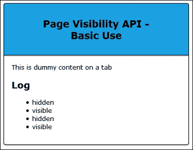

## 拆解 API

快速查看前一个演示中的代码应该会发现两个值得注意的属性 - 它们是 `document.visibilityState` 和 `document.hidden`。

这些构成了页面可见性 API。 如果我们首先更详细地查看 `document.visibilityState`，它可以返回以下四个不同的值之一：

+   `hidden`：页面在任何屏幕上都不可见

+   `prerender`：页面已加载到屏幕外，准备供访问者查看

+   `visible`：页面可见

+   `unloaded`：页面即将卸载（用户正在从当前页面导航离开）

我们还使用 `document.hidden` 属性 - 它是一个简单的布尔属性，如果页面可见，则设置为 `false`，如果页面隐藏，则设置为 `true`。

结合 `visibilitychange` 事件，我们可以很容易地在页面可见性更改时收到通知。 我们将使用类似于以下代码的内容：

```js
document.addEventListener('visibilitychange', function(event) {
  if (!document.hidden) {
    // The page is visible.
  } else {
   // The page is hidden.
  }
});
```

这将适用于大多数浏览器，但并非所有。 尽管它只是少数，但我们仍然必须允许它。 要了解我的意思，请尝试在 IE8 或更低版本中运行演示 - 它不会显示任何内容。 显示空白不是一个选项； 相反，我们可以提供一个优雅降级的路径。 因此，让我们看看如何避免代码崩溃成一堆。 

# 检测对页面可见性 API 的支持

尽管 API 在大多数现代浏览器中都可以很好地工作，但在有限的几个浏览器中会失败； IE8 就是一个很好的例子。 为了解决这个问题，我们需要提供一个根本性的方式来优雅地降级，或者使用一个回退机制； 这个过程的第一步是首先弄清楚我们的浏览器是否支持该 API。

这样做的方法有很多种。我们可以使用 Modernizr 的`Modernizr.addTest`选项（来自[`www.modernizr.com`](http://www.modernizr.com)）。相反，我们将使用 Matthias Bynens 的一个插件，其中包含了对旧浏览器的支持检查。原始版本可以从[`github.com/mathiasbynens/jquery-visibility`](https://github.com/mathiasbynens/jquery-visibility)获取。代码下载中包含的版本是一个简化版，删除了对旧浏览器的支持。

### 注意

代码下载中包含使用 Modernizr 的此演示版本。提取并运行`usemodernizr.html`文件，查看其运行方式。

现在我们已经看到了页面可见性如何被整合到我们的代码中，我们将切换到使用 jQuery 进行这个演示。

让我们开始：

1.  我们需要从附带本书的代码下载中下载标记和样式文件。继续并提取以下副本：`usingjquery.html`，`usingjquery.css`，`jquery.min.js`和`jquery-visibility.js`。将 CSS 文件保存到`css`子文件夹，将 JS 文件保存到`js`子文件夹，将 HTML 文件保存到我们项目文件夹的根目录。

1.  在一个新文件中，添加以下代码 - 这包含了检查可见性和确认浏览器是否支持 API 所需的代码：

    ```js
    $(document).ready(function() {
      var $pre = $('pre');
      var $p = $('p')
      var supported = 'The Page Visibility API is natively 
      supported in this browser.'
      var notsupported = 'The Page Visibility API is not 
      natively supported in this browser.'
      $('p').first().html(
        $.support.pageVisibility ? log($p, supported) : log($p, 
        notsupported)
      );
      function log(obj, text) { obj.append(text + '<br>'); }
      $(document).on({
        'show.visibility': function() {
        log($pre, 'The page gained visibility; the 
        <code>show</code> event was triggered.');
      },
      'hide.visibility': function() {
        log($pre, 'The page lost visibility; the 
        <code>hide</code> event was triggered.');
      }
      });
    });
    ```

1.  将文件保存为`usingjquery.js`，放在项目区域的`js`子文件夹中。如果我们在 IE9 或更高版本上运行演示，我们将看到它在我们在标签之间切换时呈现出变化。参考以下图片：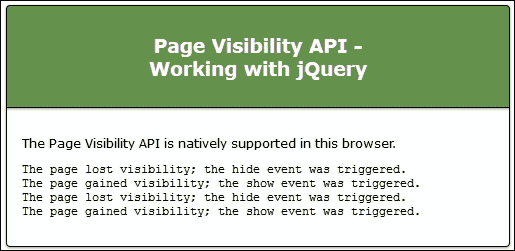

1.  尝试将浏览器更改为 IE8 - 可以使用 IE 开发者工具栏，或切换到浏览器的本地副本。我们还需要更改所使用的 jQuery 版本，因为我们的演示是面向更新的浏览器的。将 jQuery 链接更改为以下内容：

    ```js
    <script src="img/jquery-1.11.2.min.js"> </script>
    ```

1.  现在尝试刷新浏览器窗口。它会显示它不支持页面可见性 API，但也不会因意外错误而崩溃。参考下一张图片：

有了备用选项，我们现在有两个选择：

+   当浏览器不被支持时，我们可以提供一条优雅降级的路径。这是完全可以接受的，但首先应该考虑一下。

+   我们还可以提供备用支持，以允许旧浏览器仍然可以使用。

假设我们使用后一种方式。我们可以使用许多插件中的任何一种; 我们将使用 Andrey Sitnik 创建的`visibility.js`插件，为此目的。

## 提供备用支持

为任何应用程序提供备用支持是任何开发者的噩梦。我失去了对我想开发一些打破新领域的东西而不断出错的次数的计数。我必须为那些简单无法兼容新技术的旧浏览器提供支持！

幸运的是，这不是 Page Visibility API 的问题 – 浏览器覆盖非常好，尽管少数浏览器版本仍需要一些回退支持。有许多插件可用于此目的 – 也许最著名的是 Mathias Bynens 制作的，可在 [`github.com/mathiasbynens/jquery-visibility`](https://github.com/mathiasbynens/jquery-visibility) 获取。我们在上一个演示中看到了如何使用定制版本。

对于此演示，我们将使用 Andrey Sitnik 的类似插件，可从 [`github.com/ai/visibilityjs`](https://github.com/ai/visibilityjs) 获取。这包含额外的功能，包括一个定时器，用于显示页面可见的时间；我们将在以下演示中使用它。

## 安装 visibility.js

在我们开始演示之前，值得注意的是 `visibility.js` 插件可以通过几种方式引用：

+   我们可以从 GitHub 链接 [`github.com/ai/visibilityjs`](https://github.com/ai/visibilityjs) 下载原始文件

+   它可通过 Bower 获取。要做到这一点，您需要安装 Node 和 Bower。完成后，运行以下命令下载并安装插件：

    ```js
     bower install --save visibilityjs

    ```

+   它甚至可以通过 CDN 链接引用，目前是 [`cdnjs.cloudflare.com/ajax/libs/visibility.js/1.2.1/visibility.min.js`](http://cdnjs.cloudflare.com/ajax/libs/visibility.js/1.2.1/visibility.min.js)。

为了这个演示的目的，我假设您正在使用 CDN 版本（其中包含额外的定时器功能），但保存为本地副本。

### 注意

注意 – 如果您不使用此方法，则需要下载所有四个可见性 JavaScript 文件，网址为 [`github.com/ai/visibilityjstree/master/lib`](https://github.com/ai/visibilityjstree/master/lib)，因为这些文件提供了压缩 CDN 版本中可用的回退和定时器功能。

## 构建演示

好的，现在我们已经安装了插件，接下来是我们将演示的屏幕截图：

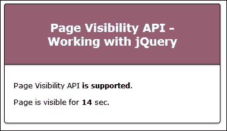

让我们开始吧：

1.  从附带本书的代码下载中提取相关的标记文件。在这个练习中，我们需要 [fallback.html](http://fallback.html) 和 [fallback.css](http://fallback.css) 文件。将它们存储在项目区域的根目录和 `css` 文件夹中。

1.  我们还需要 `visibility.min.js` 插件文件 – 它们都在代码下载文件中。将其提取并保存到我们项目区域的 `js` 子文件夹中。

1.  接下来，将以下内容添加到一个新文件中，将其保存为项目区域的 `js` 子文件夹中的 `fallback.js`：

    ```js
    $(document).ready(function() {
      if ( Visibility.isSupported() ) {
        $("#APIsupported").html('is supported');
      } else {
        $("#APIsupport").html('isn't supported');
      }

      document.title = Visibility.state();
      Visibility.change(function (e, state) {
        document.title = state;
      });

      var sec = 0;
      Visibility.every(1000, function () {
        $("#APIcounter").html(sec++);
      });
    });
    ```

1.  此代码包含我们演示所需的魔法。

1.  保存文件。如果我们在浏览器中预览结果，可以期望看到类似练习开始时的屏幕截图。如果我们切换到不同的选项卡，如下一个屏幕截图所示，则计时器计数将暂停，并相应地更新原始选项卡的标题：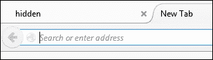

那么，发生了什么？这是一个非常简单的演示，但我们首先启动了一个检查，以确保我们的浏览器能够支持这个 API。在大多数情况下，这不是问题，除了 IE8 或更低版本。

我们随后在窗口的标题区域显示了窗口的初始状态；每次从演示切换到不同的标签页然后再切换回来时，都会更新这一状态。作为额外奖励，我们利用了主插件附带的`visibility.timer.js`插件，显示了窗口可见时间的计数。当然，每次我们切换到不同的浏览器窗口然后再切换回来时，这个计时就会停止！

不过，与之前的演示不同的是，这个插件即使我们使用 IE8 或更低版本仍然可以工作；我们可能需要修改演示中的代码以确保其样式正确，但这只是一个小问题。

让我们继续。既然我们已经了解了如何使用页面可见性 API 的基础知识，我相信你一定会问：我们如何在实际场景中使用它？没问题 - 让我们看一些可能的用例。

# 在实际场景中使用 API

这个 API 可以在各种不同的上下文中使用。经典的用法通常是帮助控制视频或音频的播放，尽管它也可以与其他 API 一起使用，比如电池 API，以防止在电量过低时显示内容。

让我们花点时间深入研究一些实际示例，这样我们就可以看到实现 API 有多么简单。

## 暂停视频或音频

API 最常见的用途之一是控制音频或视频等媒体的播放。在我们的第一个示例中，我们将使用 API 在切换标签时播放或暂停视频。让我们深入了解一下。

对于这个演示，我们将使用一些额外的内容 - 动态网站图标库，可以从[`softwareas.com/dynamic-favicons/`](http://softwareas.com/dynamic-favicons/)获取。虽然这个库已经有几年了，但仍然可以与当前版本的 jQuery 正常工作。视频来自大黄蜂项目网站，网址为[`peach.blender.org`](https://peach.blender.org)。

### 注意

这个演示的视频来自 Blender 基金会，版权为 2008 年，Blender 基金会/ [www.bigbuckbunny.org](http://www.bigbuckbunny.org)。

好了！让我们开始吧：

1.  像往常一样，我们需要从某个地方开始。对于这个演示，继续从本书附带的代码下载中提取`pausevideo`演示文件夹。

1.  打开`pausevideo.js`文件。其中包含使用`jquery-visibility`插件播放或暂停视频的代码。参考以下代码：

    ```js
    var $video = $('#videoElement');

    $(document).on('show.visibility', function() {
      console.log('Page visible');
      favicon.change("img/playing.png");
      $video[0].play();
    });

    $(document).on('hide.visibility', function() {
      console.log('Page hidden');
      favicon.change("img/paused.png");
      $video[0].pause();
    });
    ```

1.  这个插件非常简单。它公开了两种方法，即`show.visibility`和`hide.visibility`。现在试运行演示。如果一切正常，我们应该看到大黄蜂视频播放；当我们切换标签时，它会暂停。以下是视频的截图：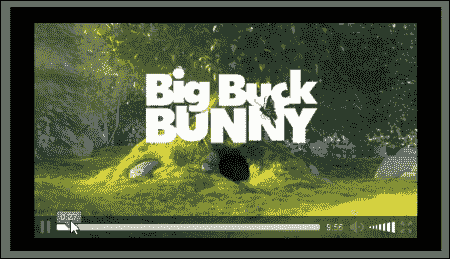

1.  另外，使用`favicon.js`库更新窗口标题。当我们切换选项卡时，它显示一个暂停符号，如下图所示：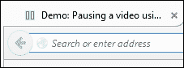

那很容易，对吧？这就是 API 的美妙之处。它非常简单，但可以与各种不同的工具一起使用。让我们通过将 API 的支持纳入**内容管理系统**（**CMS**）（如 WordPress）来证明这一点。

## 为 CMS 添加支持

到目前为止，我们已经看到了在静态页面站点中支持标准是多么容易 - 那么对于 CMS 系统，例如 WordPress，我听到你在问什么？

好了，API 也可以在这里轻松使用。与其谈论它，不如看看我们如何添加它。对于这个演示，我将使用 WordPress，尽管原理同样适用于其他 CMS 系统，如 Joomla。我将使用的插件是我自己创建的。

应该注意，您应该有一个可用的 WordPress 安装，可以是在线的，也可以是自托管版本，并且您对安装插件有一些了解。

### 注意

请注意 - `jquery-pva.php`插件仅用于*开发目的*；在将其用于生产环境之前，还需要进一步的工作。

好的，让我们开始：

1.  我们需要对主题中的`functions.php`文件进行更改。为此，我将假设您正在使用 Twenty Fourteen 主题。打开`functions.php`，然后添加以下代码：

    ```js
    function pausevideos() {
      wp_register_script('pausevideo', plugins_url( '/jquery- pva/pausevideo.js'), array('jquery'),'1.1', true);
      wp_enqueue_script('pausevideo');
    }

    add_action( 'wp_enqueue_scripts', 'pausevideos' );
    ```

1.  从附带本书的代码下载中，找到并提取`jquery-pva`文件夹，然后将其复制到您的 WordPress 安装中；它需要放在`plugins`文件夹中。返回您的 WordPress 安装，然后以通常的方式激活插件。

1.  接下来，登录您的 WordPress 管理区域，然后点击**Settings** | **PVA Options**，输入您想使用的 jQuery 版本号。我将假设已选择 2.1.3。点击**Save Changes**以生效。参考以下图片：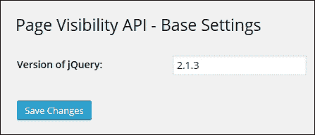

此时，我们可以开始使用库了。如果我们上传一个视频并将其添加到帖子中，当我们开始播放时，它将显示已经过的时间；当我们切换选项卡时，它将暂停：

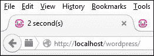

要确认它是否工作正常，值得查看源代码，使用 DOM 检查器。如果一切正常，我们应该会看到以下链接。第一个链接将确认引用了 Page Visibility 库，如下所示：

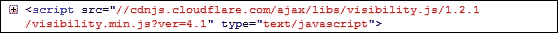

第二个链接将确认我们的脚本被调用了，如下图所示：

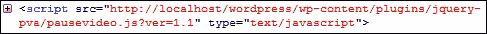

如我们所见，API 确实有其用处！在本章中，我尽量使代码相对简单，以便容易理解。现在轮到你来实验和进一步探索了 - 也许我可以给你一些启发？

## 探索示例的想法

页面可见性 API 的基本原理很容易实现，因此我们所能做到的复杂程度仅受想象力的限制。在我的研究中，我找到了一些灵感的想法——希望以下内容能让你了解可能的一些情况：

+   动画！有时，如果标签页没有活动，我们可能会遇到同步动画的问题。[`greensock.com/forums/topic/9059-cross-browser-to-detect-tab-or-window-is-active-so-animations-stay-in-sync-using-html5-visibility-api/`](http://greensock.com/forums/topic/9059-cross-browser-to-detect-tab-or-window-is-active-so-animations-stay-in-sync-using-html5-visibility-api/) 探讨了一些可用的提示，以帮助解决其中一些问题。

+   接下来这个可能会让你吓一跳，或者只是单纯地让人烦躁——看一下[`blog.frankmtaylor.com/2014/03/07/page-visibility-and-speech-synthesis-how-to-make-web-pages-sound-needy/`](http://blog.frankmtaylor.com/2014/03/07/page-visibility-and-speech-synthesis-how-to-make-web-pages-sound-needy/)，作者混合了页面可见性和语音合成 API。请注意——他警告不要混合使用这两个 API；让我们只说这很可能会更让人反感！（它仅出于技术原因被包含在这里——并不是因为我们应该这样做。）

+   一种更有用的技术是使用页面可见性 API 来减少对新邮件或新闻源的检查次数。该 API 将检查标签页是否隐藏，并减少请求更新的频率，直到标签页再次活动起来。开发者 Raymond Camden 探索了执行此操作所需的基本知识，请前往他的网站了解更多信息，网址为[`www.raymondcamden.com/2013/05/28/Using-the-Page-Visibility-API`](http://www.raymondcamden.com/2013/05/28/Using-the-Page-Visibility-API)。

+   为了真正混合一些东西，我们可以同时使用页面可见性、Web 通知和震动 API 来启动一些有用的通知。在[`www.binpress.com/tutorial/building-useful-notifications-with-html5-apis/163`](http://www.binpress.com/tutorial/building-useful-notifications-with-html5-apis/163)中，您可以了解如何在站点或应用程序中混合这三个 API 的想法。

好的，我认为现在是改变的时候了。让我们继续并看看另一个与页面可见性 API 大约在同一时间创建的 API，它使用类似的原理来帮助减少资源需求。

我当然是指 requestAnimationFrame API。让我们深入探讨一下，看看它是什么，是什么原因让它运行起来，以及为什么这样一个简单的 API 对我们开发者来说会是一个真正的福音。

# 介绍 requestAnimationFrame API

过去几年转向在线工作导致了对性能浏览器的巨大需求增加，同时减少了资源消耗和电池功耗。

有了这个想法，浏览器厂商和微软联合创建了三个新的 API。我们已经探讨了其中一个，以页面可见性 API 的形式；我们要看的另一个是**requestAnimationFrame**。三者（第三个是**setImmediate**）都是为了提高性能和增加功耗效率而设计的。

## 探索概念

那么，requestAnimationFrame 是什么？简单——如果你花了一些时间使用 jQuery 创建动画，你肯定使用过`setInterval`方法（甚至是`clearInterval`），对吧？requestAnimationFrame（和 clearAnimationFrame）分别被设计为替代它们。

我们为什么要使用它？在下一节中，我们将探讨使用 requestAnimationFrame 的好处，但首先让我们了解它的本质。

大多数动画在绘制动画时都使用小于 16.7 毫秒的基于 JavaScript 的定时器，即使显示器只能以 16.7 毫秒（或 60Hz 频率）显示，如下图所示：

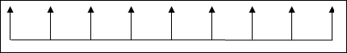

这为什么重要？关键在于，典型的`setInterval`或`setTimeout`频率通常约为 10 毫秒。这意味着每第三次监视器的绘制不会被观看者看到，因为在显示刷新之前会发生另一次绘制。请参考下一个图表：

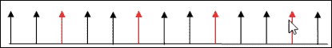

这会导致显示不连贯，因为会丢帧。电池寿命可能会降低高达 25％，这是一个显著的损失！

浏览器厂商意识到了这一点，因此提出了 requestAnimationFrame API。这告诉应用程序浏览器何时需要更新屏幕，以及浏览器何时需要刷新。这导致资源使用减少，丢帧较少，因为帧速率与代码相比更一致。

### 注意

开发者 Paul Irish 在他的博客[`www.paulirish.com/2011/requestanimationframe-for-smart-animating/`](http://www.paulirish.com/2011/requestanimationframe-for-smart-animating/)中对此做了完美的总结，他指出这使得浏览器能够“将并行动画优化到单个回流和重绘周期中，从而实现更高保真度的动画。”

## 查看 API 的实际效果

几乎总是这样，看到实际效果要比阅读有用得多。对我来说，移动演示有助于深化概念！

为了帮助理解，本书附带的代码下载中有两个演示——`requestAnimationFrame.html`和`cancelAnimationFrame.html`文件。它们包含了两个 API 的简单示例。我们将在本章末尾探讨 API 的更多实际用途。

## 使用 requestAnimationFrame API

虽然从上一节末尾引用的简单演示中可能并不立即明显，但使用 requestAnimationFrame 有一些明显的好处，下面列出了这些值得注意的好处：

+   requestAnimationFrame 与浏览器合作，在重绘转换期间将动画组合到单个重绘中，使用屏幕刷新率来决定何时应该发生这些操作。

+   如果浏览器标签处于非活动或隐藏状态，动画会被暂停，这会减少刷新屏幕的请求，从而降低移动设备的内存消耗和电池使用。

+   浏览器通过优化动画，而不是通过代码 - 较低的帧刷新率会导致更平滑、更一致的外观，因为较少的帧将被丢弃。

+   该 API 在大多数移动设备上都受支持。目前唯一不支持的平台是 Opera Mini 8.0。CanIUse 网站（[`www.caniuse.com`](http://www.caniuse.com)）显示全球使用率仅为 3%，因此这不太可能造成太大问题。

值得注意的是，cancelAnimationFrame（作为 requestAnimationFrame 的姐妹 API）可用于暂停动画。如果电池电量太低，我们可以潜在地将其与诸如 Battery API 等东西一起使用，以阻止动画（或媒体，如视频）的启动。

### 提示

要查看 requestAnimationFrame 与 setTimeout 之间的区别，请访问 [`jsfiddle.net/calpo/H7EEE/`](http://jsfiddle.net/calpo/H7EEE/)。尽管演示非常简单，但您可以清楚地看到两者之间的区别！

需要注意的一个关键点是，有些情况下，requestAnimationFrame 并不总是比使用 jQuery 更好。David Bushell 在 [`dbushell.com/2013/01/15/re-jquery-animation-vs-css/`](http://dbushell.com/2013/01/15/re-jquery-animation-vs-css/) 上有一篇有用的文章，概述了这个问题，并指出 requestAnimationFrame 最适合用于基于 `<canvas>` 的动画。

基于 requestAnimationFrame（以及 cancelAnimationFrame）创建动画非常简单。开发者 Matt West 在 CodePen 上创建了一个 JavaScript/jQuery 示例，可在 [`codepen.io/matt-west/full/bGdEC`](http://codepen.io/matt-west/full/bGdEC) 查看。他还编写了一篇配套教程，可在 Team Treehouse 的博客上查看，链接为 [`blog.teamtreehouse.com/efficient-animations-with-requestanimationframe`](http://blog.teamtreehouse.com/efficient-animations-with-requestanimationframe)。

这让我们顺利过渡到下一个主题。现在我们已经看到如何使用 JavaScript 操纵 API，让我们看看如何使用类似技术的 jQuery。

## 向 jQuery 进行的更改改造

到目前为止，我们已经介绍了如何使用 requestAnimationFrame 及其姐妹 API cancelAnimationFrame 的基础知识；我们已经看到如何使用纯 JavaScript 实现它。

但值得注意的是，jQuery 目前不包含原生支持。在 1.8 版本之前尝试将其添加到 jQuery 中，但由于主要浏览器供应商的支持问题而将其删除。

幸运的是，供应商支持现在比以前好得多；并且计划在 jQuery 2.2 或 1.12 中添加`requestAnimationFrame`支持。您可以按如下方式查看需要进行的更改，以及历史记录：

+   提交：[`gitcandy.com/Repository/Commit/jQuery/72119e0023dcc0d9807caf6d988598b74abdc937`](https://gitcandy.com/Repository/Commit/jQuery/72119e0023dcc0d9807caf6d988598b74abdc937)

+   可从[`github.com/jquery/jquery/blob/master/src/effects.js`](https://github.com/jquery/jquery/blob/master/src/effects.js)引用的`effect.js`中的更改。

+   包含`requestAnimationFrame`在 jQuery 核心中的一些历史：[`github.com/jquery/jquery/pull/1578`](https://github.com/jquery/jquery/pull/1578)；[`bugs.jquery.com/ticket/15147`](http://bugs.jquery.com/ticket/15147)

作为临时措施（如果您仍然需要支持 jQuery 的早期版本），您可以尝试使用 Corey Frang 的插件，[`github.com/gnarf/jquery-requestAnimationFrame`](https://github.com/gnarf/jquery-requestAnimationFrame)，该插件为 1.8 版本后的 jQuery 版本添加了支持。

但是，如果您感到更有冒险精神，那么直接将`requestAnimationFrame`支持添加到使用它的库中就很容易。让我们花点时间看看涉及转换的内容。

### 更新现有代码

进行更改相对直接。关键在于使更改模块化，这样一旦 jQuery 支持`requestAnimationFrame`，就可以轻松地将其替换回来。

如果您使用的库中存在对`setInterval`或`clearInterval`的代码引用，可以进行更改。例如，考虑以下代码摘录：

```js
var interval = setInterval(doSomething, 10)
var progress = 0
function doSomething() {
  if (progress != 100){
  // do something here
  }
  else {
  clearInterval(interval)
  }
}
```

它将被更新为以下代码摘录，将对`setInterval`的引用替换为`requestAnimationFrame`（并添加`clearInterval`的等效替换）：

```js
var requestAnimationFrame = window.requestAnimationFrame;
var cancelAnimationFrame = window.cancelAnimationFrame;

// your code here

var progress = 0;

function doSomething() {
  if (progress != 100) {
    // do something here
 var myAnimation = requestAnimationFrame(doSomething);
  } else {
    cancelAnimationFrame(myAnimation);
  }
}
```

在前面的代码示例中，粗体突出显示的代码指示了更新代码所需的更改类型。我们将在本章稍后使用此技术，为现有库添加支持。这将是我们将探讨的两个演示之一，它们使用`requestAnimationFrame`。

# 一些使用`requestAnimationFrame`的示例

到目前为止，我们已经了解了使用`requestAnimationFrame`的理论，并覆盖了我们可能需要对现有代码进行的典型更改。

这是一个很好的起点，但不一定易于理解概念；在实际操作中更容易理解！考虑到这一点，我们将查看一些利用 API 的演示。第一个将为现有支持添加支持，而第二个已经在代码中包含了支持。

## 创建可滚动效果

对于我们的第一个演示，我们将来看看更新经典的可滚动 UI 元素的示例。我们将使用来自[`github.com/StarPlugins/thumbelina`](https://github.com/StarPlugins/thumbelina)的 Thumbelina 插件。虽然已经有几年了，但它仍然可以完美运行，即使使用最新版本的 jQuery！

在这个演示中，我们将在插件中替换`setInterval`调用，改用`requestAnimationFrame`。让我们开始：

1.  让我们从这本书附带的代码下载中提取`thumbelina`演示文件夹的副本。如果我们运行`scrollable.html`文件，我们应该会看到一个具有兰花图片的可滚动内容，如下图所示：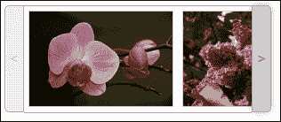

1.  Thumbelina 插件目前使用`setInterval`来管理动画之间的时间间隔。我们将修改它，改为使用新的`requestAnimationFrame`。

1.  打开 thumbelina.js，然后在`$.fn.Thumbelina = function(settings) {`下面立即添加以下代码，该行在第 16 行处：

    ```js
      var start = new Date().getTime(),
      handle = new Object();
      function loop() {
        var current = new Date().getTime(),
        delta = current - start;
        if(delta >= delay) {
          fn.call();
          start = new Date().getTime();
        }
        handle.value = 
        window.requestAnimationFrame(loop);
      };
      handle.value = window.requestAnimationFrame(loop);
      return handle;
    }
    ```

1.  向下滚动到以下行，该行将在第 121 行左右：

    ```js
    setInterval(function(){
    ```

1.  按照下面的修改，使它使用我们刚刚添加的新的`requestInterval()`函数：

    ```js
    requestInterval(function() {
      animate();
      },1000/60);
    };
    ```

1.  保存该文件。如果我们运行演示，应该不会看到任何视觉上的差异；真正的差异发生在后台。

### 提示

尝试在 Google Chrome 中运行演示，然后在时间轴中查看结果。如果你进行前后对比，应该会看到显著的差异！如果你不确定如何对演示进行分析，那就前往[`developer.chrome.com/devtools/docs/timeline`](https://developer.chrome.com/devtools/docs/timeline)获取完整详情。

## 动画化谷歌地图标记

本章的最终演示将使用众所周知的 Google Maps 服务，以动画化地图上指示特定位置的标记：

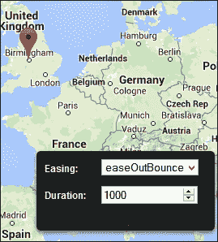

在这个例子中，我们将使用 Robert Gerlach 创建的演示，该演示可从[`robsite.net/google-maps-animated-marker-move/`](http://robsite.net/google-maps-animated-marker-move/) 获取。我已经调整了他的`markerAnimate.js`插件文件中的代码，以去掉厂商前缀，因为这些不再需要。

他创造了一个漂亮的效果，为看似十分枯燥的内容增添了些活力。尽管如此，它仍然需要相当数量的代码！由于空间限制，我们无法在印刷品中探索所有内容，但我们可以探讨一些更重要的概念：

1.  让我们从这本书附带的代码下载中提取`googlemap`演示文件夹。这包含了我们演示的样式、JavaScript 库和标记。

1.  在浏览器中运行`googlemap.html`。如果一切正常，我们应该会看到指针位于英国伯明翰，那里是 Packt Publishing 的英国办公室所在地。

尝试在地图的其他位置单击 - 注意它是如何移动的？它利用了 jQuery Easing 插件中提供的一些缓动效果，我们在 第六章 中使用过的，*jQuery 动画*。

我们可以通过简单地更改右下角下拉框中显示的值来选择要使用的缓动效果。这甚至可以包括我们自己制作的自定义动画，以 第六章 中给出的示例为基础。只要将自定义动画函数包含在我们的代码中，并在下拉框中添加适当的名称，我们就可以使用它。

实际上要注意的重点在于 `markeranimate.js` 文件。如果我们打开它并滚动到第 **64** - **71** 行，我们可以看到 `requestAnimationFrame` 的使用方法。如果浏览器支持该 API，则使用它，否则使用 `setTimeout`，如下面的截图所示：

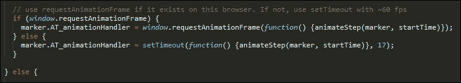

结合使用缓动效果和调用 `requestAnimationFrame` 会产生一个很酷的效果，同时也减少了对资源的需求 - 如果您的网站有很多动画效果，那就很棒！

### 提示

要更容易地替换`setInterval`、`clearInterval`（以及`setTimeout` / `clearTimeout`），请使用 Joe Lambert 的替换函数，可在 [`gist.github.com/joelambert/1002116`](https://gist.github.com/joelambert/1002116) 获取。

## 探索灵感来源

在过去的几页中我们已经涵盖了很多内容 - 完全理解 requestAnimationFrame（以及其姊妹函数 clearAnimationFrame）的工作原理可能需要一些时间，但随着 jQuery 的即将更改，值得花时间熟悉这些 API 及其为我们开发带来的好处。

在我们结束本章之前，下面列出了一些可能对你有用的灵感来源：

+   requestAnimationFrame 绝不仅限于播放视频、音乐或类似的用途。甚至可以用于开发在线游戏！看看 [`www.somethinghitme.com/2013/01/09/creating-a-canvas-platformer-tutorial-part-one/`](http://www.somethinghitme.com/2013/01/09/creating-a-canvas-platformer-tutorial-part-one/) - 希望你能认出一些经典作品！

+   更严肃的话题，对于那些使用视差滚动效果的网站，实现可能还有改进的空间。Krister Kari 写了一篇详细的博客文章，通过一个典型的例子来讨论，并概述了可以用于修复问题的一些技术。你可以在 [`kristerkari.github.io/adventures-in-webkit-land/blog/2013/08/30/fixing-a-parallax-scrolling-website-to-run-in-60-fps/`](http://kristerkari.github.io/adventures-in-webkit-land/blog/2013/08/30/fixing-a-parallax-scrolling-website-to-run-in-60-fps/) 上阅读。

还有很多其他资源可用 - 接下来就看你的想象力带你去哪里！

# 总结

探索新的 API 总是很有趣的。即使它们可能在本质上很简单（例如，查看振动 API），它们也可以证明是任何人工具箱中真正有用的补充。在本章节中，我们详细探讨了其中的两个。让我们花点时间回顾一下我们所涵盖的内容。

我们以介绍页面可见性 API 开始。我们查看了 API 的浏览器支持情况，然后实施了一个基本示例。我们进一步讨论了如何检测并提供备用支持，然后查看了一些实际示例。

接下来我们来看一下 requestAnimationFrame API，我们了解了一些与页面可见性 API 的相似之处。我们探讨了它的基本原理，然后看了一些实际用途以及如何添加支持到 jQuery 本身。然后我们用两个例子总结了这一章节；一个是基于使用 API 进行转换的，而另一个则是从零开始构建的。

进入下一章节，我们将探讨网站的另一个关键元素，即图片。我们将探讨如何使用 jQuery 操纵图片，以产生一些非常有趣的效果。
