# 第十一章：编写高级插件

在整本书中，一个共同的主题是使用插件——现在是创建一个插件的时候了！

可供使用的插件数量之多简直令人难以置信，从只有几行代码的插件到数百行的插件不等。我非常相信“有志者，事竟成”这句话——可以说插件满足了这种意愿，并为用户提供了解决需求或问题的途径。

在接下来的几页中，我们将从头到尾看一下如何开发一个高级插件。我们不仅关注构建本身，还将探讨一些技巧和窍门，以帮助我们在使用插件时进一步提高开发技能。我们将涵盖最佳实践，并查看一些可以提高当前编码技能的领域。在接下来的几页中，我们将涵盖以下主题：

+   最佳实践和原则

+   检测插件开发不佳的迹象

+   为 jQuery 插件创建设计模式

+   设计一个高级插件并使其可供使用

准备好了吗？

# 检测插件开发不佳的迹象

想象一下场景，如果你愿意——你花几周时间开发一个复杂的插件，它几乎包含了所有功能，让所有看到的人都惊叹不已。

听起来像是完美的理想境界，不是吗？你把它发布到 GitHub 上，创建一个很棒的网站，等待用户踊跃下载你的最新作品。你等待着……等待着……但最后一位用户也没有。好吧……怎么回事？

正如我经常说的，任何人都可以编写代码。成为更好的 jQuery 插件开发者的关键是理解什么是好的插件，以及如何将其付诸实践。为了帮助理解，让我们花点时间看一下一些指标，可以用来判断一个插件是否可能失败：

+   你没有在做一个插件！通行的做法是使用少数几种插件模式之一。如果你没有使用其中一种模式（如下所示的模式），那么你的插件被接受的可能性很低。

    ```js
    (function($, window, undefined) {
      $.fn.myPlugin = function(opts) {
        var defaults = {
        // setting your default values for options
      }
      // extend the options from defaults with user's options
      var options = $.extend(defaults, opts || {});
      return this.each(function(){ // jQuery chainability
        // do plugin stuff
      });
    })(jQuery, window);
    ```

+   虽然我们在参数中定义了`undefined`，但我们只在自调用函数中使用了 `$` 和 `window`。这可以防止恶意传递`undefined`的值到插件中，因为它在插件内部将保持为`undefined`。

+   你花时间编写代码，但忽略了其中一个关键元素——准备文档！我一次又一次地看到插件的文档非常少或根本不存在。这使得理解插件的构成和如何充分利用它变得困难。关于文档编写没有硬性规定，但普遍认为，文档越多越好，而且应该是内联和外部的（以 readme 或 wiki 的形式）。

+   在缺乏合适文档主题上继续进行，开发人员会因为插件具有硬编码的样式或者过于不灵活而感到不满。我们应该考虑所有可能的需求，但要确定我们是否会为特定需求提供解决方案。应用于插件的任何样式都应该通过插件选项提供，或者作为样式表中的特定类或选择器 ID – 将其放在行内被认为是不良实践。

+   如果你的插件需要太多配置，那么这很可能会让人们失去兴趣。虽然一个更大、更复杂的插件应该明确地为最终用户提供更多的选项，但提供的内容也是有限度的。相反，每个插件至少应该设置一个不带参数的默认行为；用户不会喜欢为了使插件工作而设置多个值！

+   对最终用户来说，插件不提供任何形式的示例是很让人失望的。至少应该提供一个基本的“hello world”类型的示例，其中定义了最小配置。提供更多涉及的示例，甚至与其他插件一起工作的示例，可能会吸引更多的人。

+   一些插件失败的原因很基础。这些包括：没有提供变更日志或使用版本控制，不能在多个浏览器中工作，使用过时的 jQuery 版本或在实际上不需要时包含它（依赖性太低），或者没有提供插件的缩小版本。使用 Grunt 就没有借口了！我们可以自动化大部分开发人员所期望的基本管理任务，如测试、缩小插件或维护版本控制。

+   最后，插件可能因为两个简单的原因而失败：要么它们太聪明，试图实现太多（使得调试困难），要么太简单，jQuery 作为库的依赖性不足以保证包含它。

很多事情需要考虑！虽然我们无法预测插件是否会成功，或者使用情况会不会低，但我们至少可以尝试通过将这些提示中的一些（或全部）纳入我们的代码和开发工作流程中来最小化失败的风险。

从更实际的角度来看，我们可以选择遵循许多设计模式中的任何一种，以帮助我们的插件给予结构和一致性。我们在第三章中提到过这一点，*组织您的代码*。美妙之处在于我们可以自由地在 jQuery 插件中使用类似的原则！让我们在使用其中一个来开发一个简单插件之前，花一点时间考虑一些可能的例子。

# 介绍设计模式

如果你在 jQuery 中开发代码花费了任何时间，那么很可能你创建了一个或多个插件；从技术上讲，这些插件可以只有几行代码，也可以更加实质性。

随着时间的推移，修改插件中的代码可能会导致内容变得笨重且难以调试。解决这个问题的一种方法是使用设计模式。我们在第三章中介绍了这一点，*组织您的代码*。许多相同的原则同样适用于插件，尽管模式本身当然会有所不同。让我们考虑一些例子。

最基本的模式是**轻量级起步**，适合那些以前开发过插件但对遵循特定模式的概念尚不熟悉的人。这种特定模式基于常见的最佳实践，例如在调用函数之前使用分号；它会传递标准参数，如`window`、`document`和`undefined`。它包含一个基本的默认对象，我们可以扩展它，并在构造函数周围添加一个包装器以防止多个安装引起的问题。

相反，我们也可以尝试使用**完整小部件工厂**。尽管它被用作 jQuery UI 的基础，但它也可以用来创建标准的 jQuery 插件。这种模式非常适合创建复杂的、基于状态的插件。它包含了所有使用的方法的注释，以确保逻辑符合你的插件。

我们还介绍了命名空间的概念，即添加特定名称以避免与全局命名空间中的其他对象或变量发生冲突。虽然我们可能在代码中使用命名空间，但我们也可以同样将其应用于插件。这种模式的好处在于我们可以检查其现有实例；如果名称不存在，则我们可以自由添加它，否则我们可以使用相同命名空间扩展现有插件。

这些是可供使用的三种插件模式之一；但我确信会有一个问题，那就是使用哪一个？和许多事情一样，没有对错答案；这将取决于具体情况。

### 注意

最常见的插件设计模式列表可在[`github.com/jquery-boilerplate/jquery-patterns`](https://github.com/jquery-boilerplate/jquery-patterns)找到。

## 创建或使用模式

如果你是第一次使用插件设计模式，那么**轻量级起步**是开始的最佳位置。使用任何插件模式或设计自己的插件模式有三个关键方面：

+   **架构**：这定义了组件之间应如何交互的规则。

+   **可维护性**：任何编写的代码都应易于扩展和改进。它不应从一开始就被锁定。

+   **可重用性**：你现有的代码可以多频繁地重用？它可以多频繁地重用，节省的时间就越多，维护起来也会更容易。

使用模式的重要之处在于没有一个单一的正确答案。关键在于哪种模式最符合你的需求。最好的方法是尝试它们。随着时间的推移，经验将为您提供一个明确的指示，哪种模式对于特定情景效果最佳。

### 提示

关于使用特定插件模式的利弊的讨论，请移步到 Smashing Magazine 的文章[`www.smashingmagazine.com/2011/10/11/essential-jquery-plugin-patterns/`](http://www.smashingmagazine.com/2011/10/11/essential-jquery-plugin-patterns/)。虽然已经有几年了，但其中许多观点仍然具有价值。

无论如何，让我们回到现在吧! 没有比现在更好的时间来获得经验了，所以让我们看一看 jQuery 轻量级样板模式。这实现了 Singleton/Module 设计模式。它帮助开发人员编写封装代码，可以远离污染全局命名空间。

在接下来的几页中，我们将开发一个提示框插件。我们将从一个不使用任何模式的典型构建开始，然后修改它以使用轻量级样板格式。然后我们将深入探讨一些小贴士和技巧，这将帮助我们考虑更大的画面，并希望使我们成为更好的开发者。

# 设计一个高级插件

好了——不要再闲聊了! 让我们深入研究一些代码吧! 在接下来的几页中，我们将花一些时间开发一个在页面上显示简单提示框的插件。

好吧，在你们都喊叫说“不要再一个提示框插件了……!”之前，选择这个功能有一个很好的理由。一旦我们开发了插件的第一个版本，一切都会变得清晰。让我们开始吧——我们将从简要介绍创建我们的插件开始:

1.  对于这个演示，我们将需要这本书附带的代码下载中这一章的整个代码文件夹。继续并提取它，保存到我们的项目区域。

1.  在文件夹中，运行`tooltipv1.html`文件，其中包含一个由六幅图像组成的网格，以及一些虚拟文本。依次将鼠标悬停在图像上。如果一切正常，它会显示一个提示框: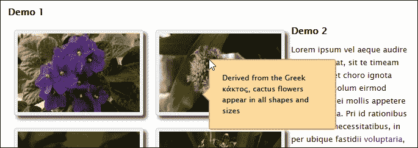

此刻你可能在想所有代码是如何串联在一起的。这是一个合理的问题……但我们将打破传统，不去审视它。相反，我想专注于重新设计代码，使用样板格式，这将有助于使其更易于阅读、调试和扩展。让我们考虑一下这对我们的插件意味着什么。

## 使用样板重建我们的插件

如果您对样板编制还不熟悉，请举手？有可能您已经遇到了一些例子，如 Bootstrap（[`www.getbootstrap.com`](http://www.getbootstrap.com)），或者甚至 HTML5 Boilerplate（[`html5boilerplate.com/`](https://html5boilerplate.com/)）。为了帮助您熟悉这个术语，它基于一个简单的想法：使用模板来帮助构建代码结构。这并不意味着它会为我们编写代码（可惜——我们可以因此无所作为而赚取数百万，哈哈！），但它通过重用框架来快速开发代码，比如完整的网站或者甚至 jQuery 插件，有助于节省时间。

对于我们的下一个演示，我们将使用来自[`github.com/jquery-boilerplate/jquery-patterns`](https://github.com/jquery-boilerplate/jquery-patterns)的 jQuery Boilerplate 模板重新设计我们的插件。与互联网一样，某种善良的灵魂已经创建了一个使用这种技术的良好的工具提示示例，因此我们将根据我们的需要进行调整。

### 提示

如果您对学习更多关于 jQuery Boilerplate 插件模式的内容感兴趣，您可能会喜欢查看 Jonathan Fielding 的《*Instant jQuery Boilerplate for Plugins*》，该书由 Packt Publishing 出版。

我们将使用的插件示例是由法国网页开发者 Julien G 提供的。原始版本可通过 JSFiddle 在[`jsfiddle.net/molokoloco/DzYdE/`](http://jsfiddle.net/molokoloco/DzYdE/)上找到。

1.  让我们开始（像往常一样），从代码下载中提取本章的代码文件夹的副本。如果您已经从上一个练习中拥有它，那么我们可以使用它。

1.  导航至`version 2`文件夹，然后在浏览器中预览`tooltipv2.html`。如果一切顺利，我们应该看到与前一个示例中相同的一组图像，并且工具提示应用了相同的样式。

乍看之下，似乎什么也没有改变——这本身实际上是成功的一个很好的指标！真正的变化在于`tooltipv2.js`中，在`version 2`文件夹下的`js`子文件夹中。让我们逐步进行，从声明变量开始：

1.  我们首先声明了 jQuery、`document`、`window`和`undefined`的属性。你可能会问为什么我们要传入`undefined`——这是一个很好的问题：这个属性是可变的（意味着它可以被更改）。虽然在 ECMAScript 5 中它被设置为不可写，但在我们的代码中不使用它意味着它可以保持未定义并防止恶意代码的尝试。传递剩下的三个属性可以使我们在代码中更快地引用它们：

    ```js
    (function($, window, document, undefined) {
      var pluginName = 'tooltip', debug = false;
    ```

1.  下一步是内部方法。我们将它们创建为`internal`对象中的方法；第一个负责将工具提示定位在屏幕上，而`show`和`hide`控制工具提示的可见性：

    ```js
    var internal = {
      reposition: function(event) {
        var mousex = event.pageX, mousey = event.pageY;

        $(this)
        .data(pluginName)['tooltip']
        .css({top: mousey + 'px', left: mousex + 'px'});
      },

      show: function(event) {
        if (debug) console.log(pluginName + '.show()');
        var $this  = $(this), data = $this.data(pluginName);

        data['tooltip'].stop(true, true).fadeIn(600);
        $this.on('mousemove.' + pluginName, internal.reposition);
      },

      hide: function(event) {
        if (debug) console.log(pluginName + '.hide()');
        var $this = $(this), data  = $this.data(pluginName);
        $this.off('mousemove.' + pluginName, internal.reposition);
        data['tooltip'].stop(true, true).fadeOut(400);
      }
    };
    ```

1.  我们继续外部方法。首先在`external`对象内部，`init`函数首先出现，用于初始化我们的插件并在屏幕上呈现它。然后在移动到带有`.tooltip`类实例的元素时，我们调用`internal.show`和`internal.hide`内部方法：

    ```js
    var external = {
      init: function(options) {
        if (debug) console.log(pluginName + '.init()');

        options = $.extend(
          true, {},
          $.fn[pluginName].defaults,
          typeof options == 'object' &&  options
        );

        return this.each(function() {
          var $this = $(this), data = $this.data(pluginName);
          if (data) return;

          var title = $this.attr('title');
          if (!title) return;
          var $tooltip = $('<div />', {
            class: options.class,
            text:  title
          }).appendTo('body').hide();

          var data = {
            tooltip:   $tooltip,
            options:   options,
            title:     title
          };

          $this.data(pluginName, data)
            .attr('title', '')
            .on('mouseenter.' + pluginName, internal.show)
            .on('mouseleave.' + pluginName, internal.hide);
          });
        },
    ```

1.  第二个外部方法处理了更新提示文本，使用`.data()`方法：

    ```js
        update: function(content) {
          if (debug) console.log(pluginName + '.update(content)', content);
          return this.each(function() {
            var $this = $(this), data  = $this.data(pluginName);
            if (!data) return;
            data['tooltip'].html(content);
          });
        },
    ```

1.  我们将我们的插件中可用的方法圆满地结束了，包括`destroy()`处理程序。这样可以阻止所选提示显示，并将元素从代码中删除：

    ```js
        destroy: function() {
          if (debug) console.log(pluginName + '.destroy()');

          return this.each(function() {
            var $this = $(this), data  = $this.data(pluginName);
            if (!data) return;

            $this.attr('title', data['title']).off('.' + pluginName)
              .removeData(pluginName);
              data['tooltip'].remove();
          });
        }
      };
    ```

1.  最后，但同样重要的是我们的插件启动器。这个函数简单地将方法名映射到我们插件中的有效函数，或者在它们不存在时进行优雅降级：

    ```js
    $.fn[pluginName] = function(method) {
      if (external[method]) return external[method]
      apply(this, Array.prototype.slice.call(arguments, 1));
      else if ($.type(method) === 'object' || !method) 
      return external.init.apply(this, arguments);
      else $.error('Method ' + method + ' does not exist on
      jQuery.' + pluginName + '.js');
    };
      $.fn[pluginName].defaults = {
      class: pluginName + 'Element'
      };
    })(window.jQuery);
    ```

不过，从这个演示中最重要的要点不是我们可以使用的具体功能，而是用于生成我们的插件的格式。

任何人都可以写代码，但使用像我们在这里使用的样板模式将有助于提高可读性，使调试更容易，并在以后的扩展或升级功能时增加机会。记住，如果你编写了一个插件，并且在一段时间内没有回顾它（比如说 6 个月）；那么酸测试是你能从良好结构化的代码中解决多少问题，而不需要大量文档。如果你做不到这一点，那么你需要重新审视你的编码！

让我们继续。还记得我提到选择使用提示插件作为我们例子基础的一个很好的原因吗？现在是时候揭示为什么了...

# 自动将动画转换为使用 CSS3

我们建立了一个提示插件，它在悬停在标记有`.tooltip`类的元素上时使用一点动画淡入淡出。那没错 - 代码完全正常运行，是一种可以接受的显示内容的方式...对吗？错！正如你现在应该知道的，我们绝对可以做得更好。这就是为什么我选择了提示作为我们的例子的原因。

还记得我在第六章中提到过的，在 jQuery 中进行动画，我们应该考虑使用 CSS3 样式来控制我们的动画吗？好吧，这里有一个完美的例子：我们可以轻松地改变我们的代码，强制 jQuery 尽可能使用 CSS3，或者在旧版本的浏览器中回退到使用库。

其中的诀窍在于一行代码：

```js
<script src="img/jquery.animate-enhanced.min.js"></script>
```

要看看有多简单，请按照以下步骤操作：

1.  在`tooltipv2.html`的副本中，按照提示添加这行：

    ```js
      <script src="img/jquery.min.js"></script>
     <script src="img/jquery.animate-enhanced.min.js"></script>
      <script src="img/jquery-ui.min.js"></script>
      <script src="img/jquery.quicktipv2.js"></script>
      <script src="img/tooltipv2.js"></script>
    ```

1.  在浏览器中预览结果。如果一切顺利，我们应该看到提示反应方式稍有改变。然而，当在像 Firebug 这样的 DOM 检查器中查看提示代码时，真正的改变就显而易见了：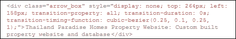

如果我们在 Firebug 的计算样式一半查看，我们可以看到样式被分配给提示元素：

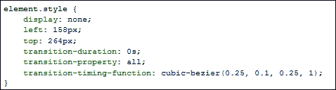

这是一个简单的变化，但希望我们能看到在性能上有显著改进。在这种情况下，我们使用一个插件来强制 jQuery 使用 CSS3 样式代替标准的 jQuery 基础动画。

但在这里的关键信息是，作为开发人员，我们不应感到受限于使用 jQuery 来提供我们的动画。尽管对于管理复杂动作可能是一种必要之恶，但我们仍应考虑在那些不太华丽的情况下使用它。

## 使用基于 CSS 的动画

嗯 - 此时脑海中浮现一个问题：如果我们使用现代浏览器，为什么还需要依赖基于 jQuery 的动画呢？

答案很简单 - 简而言之，这取决于具体情况。但长话短说，对于现代浏览器，我们不需要依赖使用 jQuery 来提供我们的动画。只有在我们被迫为旧版浏览器版本（如 IE6）提供支持时，我们才需要使用 jQuery。

但是可能性应该很低。如果有必要的话，我们真的应该问自己我们是否在做正确的事情，或者是否应该逐渐降低支持，使用类似 Modernizr 这样的工具。

尽管如此 - 让我们通过以下步骤来理解我们需要做什么才能使用 CSS3 代替基于 jQuery 的动画：

1.  在 `tooltipv2.css` 的副本中，在文件底部添加以下 CSS 样式 - 这将是我们的工具提示的过渡效果：

    ```js
    div.arrow_box { transition-property: all; transition- duration: 2s; transition-timing-function: cubic-bezier(0.23, 1, 0.32, 1); }
    ```

1.  打开 `jquery.quicktipv2.js` 的副本，然后首先注释掉以下行：

    ```js
    data['tooltip'].stop(true, true).fadeIn(600);
    ```

    在原位添加以下行：

    ```js
    data['tooltip'].css('display', 'block');
    ```

1.  重复相同的过程，但这次是针对以下行：

    ```js
    data['tooltip'].stop(true, true).fadeOut(400);
    ```

    将下一行作为替换添加：

    ```js
    data['tooltip'].css('display', 'none');
    ```

1.  保存文件。如果我们在浏览器中预览变化的结果，应该看到工具提示滑动并悬停在所选图像上。

效果看起来非常流畅。虽然它不会淡入淡出，但仍然为工具提示的出现方式带来了有趣的变化。这确实引发了一个有趣的问题 - 我们应该使用什么效果？让我们暂停一下，考虑一下进行这种变化的影响。

## 考虑变化的影响

在我们的示例中使用 CSS3 样式提出了一个重要的问题 - 哪种效果效果最好？我们可以选择经典的线性或摆动效果，但这些已经被用得厌了。我们可以轻松地用更原创的东西替换它。在我们的示例中，我们使用了 `cubic-bezier(0.23, 1, 0.32, 1)`，这是 `easeOutQuint` 函数的 CSS3 等效函数。

解决这些效果可能会耗费时间。相反，我们可以使用 Lea Verou 创建的一个很棒的工具，它可以在 [`www.cubic-bezier.com`](http://www.cubic-bezier.com) 上使用。

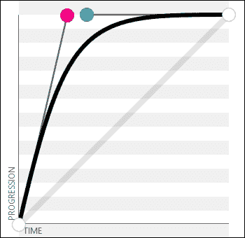

要查看我们选择的效果在实际中的样子，前往 [`cubic-bezier.com/#.23,1,.32,1`](http://cubic-bezier.com/#.23,1,.32,1)。 该网站有一个我们可以运行的示例，以查看效果如何工作。 该网站的好处在于我们可以使用图表来微调我们的效果，这会自动转换为我们可以转移到我们的代码中的相关值。

这打开了进一步的可能性——我们提到了来自 [`github.com/rdallasgray/bez`](http://github.com/rdallasgray/bez) 的 Bez 插件的使用；这很容易在这里代替标准的 `.css()` 方法，来提供我们的动画。

### 提示

对于众所周知的缓动函数（如 `easeInQuint`），其 CSS 等效函数都列在 [`gist.github.com/tzachyrm/cf83adf77246ec938d1b`](https://gist.github.com/tzachyrm/cf83adf77246ec938d1b) 上；我们可以在 [`www.easings.net`](http://www.easings.net) 上看到它们的效果。

不过，重要的是，当在 DOM Inspector 中查看 CSS 时，我们可以看到的变化是：

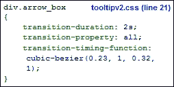

与其内联应用（如 *自动将动画转换为使用 CSS3* 部分所示），我们可以保持关注点分离原则，将 CSS 样式保留在样式表中，将 HTML 用于组织我们的网页内容。

## 回退到 jQuery 动画

到目前为止，我们使用 CSS 样式来创建我们的动画效果。 这引发了一个问题，即我们是否应该将此技术用于我们所有的动画需求，还是应该使用 jQuery 效果。

一切都归结为两个关键点——动画有多复杂，以及你是否需要支持旧版浏览器？ 如果答案是肯定的（或两者都是肯定的），那么 jQuery 很可能会胜出。 但是，如果你只有一个简单的动画，或者你不需要支持旧版浏览器，那么使用 CSS 应该值得认真考虑。

到目前为止，我们使用的动画的一个很棒的地方是，我们可以使用两种方法提供相同的效果——即 CSS 和 jQuery。 jQuery 中缓动函数的一个很好的来源是 [`github.com/gdsmith/jquery.easing`](https://github.com/gdsmith/jquery.easing) - 这里列出了所有标准的、在诸如 jQuery UI 等库中可用的众所周知的缓动函数。 为了证明我们可以实现相同的效果，让我们继续对我们的代码进行快速更改，使用已经使用过的动画的 jQuery 等效方法。 按照以下步骤进行：

1.  我们首先要编辑 `quickTip` 插件文件的副本。 继续找到 `jquery.quicktipv2.js` 的副本，然后在变量声明之后立即添加以下代码块：

    ```js
    $.extend($.easing, {
      easeInQuint: function (x, t, b, c, d) {
        return c*(t/=d)*t*t*t*t + b;
      },

      easeOutQuint: function (x, t, b, c, d) {
        return c*((t=t/d-1)*t*t*t*t + 1) + b;
      }
    });
    ```

1.  现在我们需要调整我们的动画以利用缓动函数，所以继续修改 `fadeIn` 方法，如下所示的代码行：

    ```js
    data['tooltip'].stop(true, true).fadeIn(600, 
      'easeInQuint');
      $this.on('mousemove.' + pluginName, internal.reposition);
    },
    ```

1.  没有 `fadeIn` 就不能有其姐妹 `fadeOut()`，因此我们也需要更改这个调用，如下所示：

    ```js
    $this.off('mousemove.' + pluginName, internal.reposition);
      data['tooltip'].stop(true, true).fadeOut(400, 
      'easeInQuint');
    }
    ```

1.  将文件保存为`jquery.quicktipv2.easing.js`。不要忘记在`tooltipv2.html`中修改原始插件引用！我们还需要在`tooltipv2.css`文件中取消`div.arrow_box`的过渡样式，因此请继续并注释掉这段代码。

在这一点上，我们已经使用 jQuery 实现了一个可行的解决方案。如果我们在浏览器中预览结果，工具提示将显示为应该显示的样子。不过，缺点是我们失去了所使用的样式的可见性，并且（如果 JavaScript 在浏览器中被禁用的话）动画就不会播放了。

还有一个重要的观点是 jQuery 动画已经消耗了更多资源，我们在第六章中也提到过，*在 jQuery 中进行动画*。那么，在这些情况下，为什么我们要求在这里使用 jQuery 动画，而不是 CSS？再一次，这是成为更好的开发者的一部分 - 容易诉诸于使用 jQuery; 在考虑所有替代方案之前考虑这一点是正确的！

### 提示

如果您设计了自定义缓动，并希望使用 CSS 等效-添加我们之前使用的 jQuery 动画增强插件的链接。这将使用贝塞尔曲线值提供 CSS 等效。然后我们可以使用之前的 Bez 插件，或者甚至使用来自[`github.com/gre/bezier-easing`](https://github.com/gre/bezier-easing)的 bezier-easing 将其添加回作为基于贝塞尔曲线的动画。

现在让我们转移重点并继续前进。到目前为止，我们的插件中提供了有限的选项；如果我们想要扩展它怎么办？我们可以尝试深入代码并进行调整；尽管在某些情况下，这可能对我们的需求来说有些过度。一个更好的选择可能是将其简单地封装为一个新插件的实例。让我们来看看涉及到什么。

# 扩展我们的插件

使用插件时常见的问题是找到完全符合我们要求的插件；发生这种情况的可能性可能比中彩票还要小！

为了解决这个问题，我们可以扩展我们的插件，以在不影响现有方法的情况下加入额外的功能。这样做的好处是，我们可以覆盖现有的方法或合并额外的功能，帮助使插件更接近我们的需求。要了解这在实际应用中是如何工作的，我们将向我们现有的插件添加一个方法和额外的变量。有许多方法可以实现这一点，但我使用的方法也很有效。让我们按照以下步骤进行：

1.  我们将从编辑`tooltipv2.js`的副本开始。在`#getValue`点击处理程序的下面，继续添加以下代码：

    ```js
      (function($) {
        var extensionMethods = {
          fadeInValue: 600,
          showDebug: function(event) {
            console.log("This is a test");
          }
        }
        $.extend($.fn.quicktip, extensionMethods);
      })(jQuery);
    ```

1.  保存文件。如果我们在浏览器中预览`tooltipsv2.html`，然后通过 DOM 检查器深入渲染的代码，我们应该会看到类似于以下截图的内容：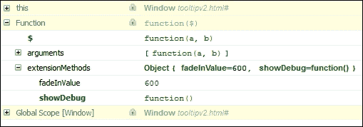

在这个例子中，我们添加了一个并不真正执行很多功能的方法；关键不是它做了什么，而是*我们如何添加它*。在这里，我们将其作为现有对象的附加方法提供。将以下内容添加到 `tooltipsv2.js` 的末尾：

```js
  $('#img-list li a.tooltips').on("mouseover", function() {
    $('#img-list li a.tooltips').quicktip.showDebug();
  })
```

如果现在刷新浏览器会话，我们可以在浏览器的 **控制台** 区域看到它的运行情况，如下一个截图所示：

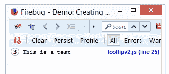

我们可以做更多的事情，值得花时间在线研究。扩展的关键是确保您了解 `$.fn.extend` 和 `$.extend` 之间的区别。它们看起来可能相同，但请相信我 - 它们的作用是不同的！

# 使用 Bower 打包我们的插件

好了 - 在这个说明下，我们现在有一个可工作的插件，它已准备好使用。

此时，我们可以直接发布它，但明智的选择是将其打包以供像 Bower 或 NPM 这样的管理器使用。这样做的优点是下载并安装所有所需的包，而无需浏览到各个站点并手动下载每个版本。

### 提示

我们甚至可以进一步自动化我们的开发工作流程，使用诸如 Gulp 和 Grunt 这样的构建工具 - 有关如何的示例，请访问 [`www.codementor.io/bower/tutorial/beginner-tutorial-getting-started-bower-package-manager`](https://www.codementor.io/bower/tutorial/beginner-tutorial-getting-started-bower-package-manager)。

现在，让我们快速看一下自动创建 Bower 包的步骤：

1.  为了进行这个演示，我们需要安装 NodeJS。所以请访问 [`nodejs.org/`](http://nodejs.org/)，下载适当的二进制或包，并安装，接受所有默认设置。

1.  接下来，我们需要安装 Bower。启动已安装的 NodeJS 命令提示符，并在命令行输入以下内容：

    ```js
    npm install –g bower

    ```

1.  Bower 将通过一系列问题提示我们有关插件的信息，然后显示它将为我们创建的 `bower.json` 文件。在这个例子中，我使用了工具提示插件作为我们示例的基础。对于您创建并想要使用 Bower 分发的任何插件，相同的问题都将适用，如下图所示：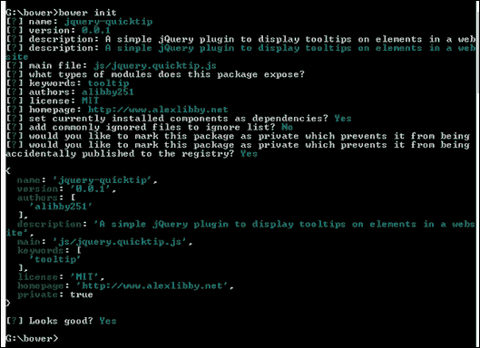

1.  最后一步，确认我们对所创建的 `bower.json` 文件没有问题，就是在 Bower 中注册插件。在命令提示符下，运行以下命令：

    ```js
    bower register <name of plugin>

    ```

1.  Bower 将在最终确认插件可通过 Bower 使用之前经历多个阶段。

此时，我们将可提供插件供任何人下载。因为它必须链接到有效的 GitHub 帐户，我们现在可以将插件上传到这样的帐户，并通过 Bower 使其对任何人都可下载。作为奖励，我们现在可以利用 NodeJS 和 Grunt 来帮助自动化整个过程。不妨看看 grunt-bump（[`github.com/vojtajina/grunt-bump`](https://github.com/vojtajina/grunt-bump)），作为一个起点？

### 小贴士

Bower 还有很多我们无法在这里覆盖到的功能。为了获得灵感，不妨阅读[`bower.io/`](http://bower.io/)上的文档。

# 自动化文档的提供

发展我们的插件技能的最后阶段是提供文档。任何编码人员都可以生成文档，但更好的开发人员的标志是可以产生高质量的文档，而不必花费大量时间。

进入 JSDoc！它可从[`github.com/jsdoc3/jsdoc`](https://github.com/jsdoc3/jsdoc)获取。如果您尚未熟悉它，这是创建不仅外观良好而且可以轻松使用 Node 自动化的文档的好方法。让我们花点时间安装它，并看看它如何工作。需要执行以下步骤：

1.  这次我们将从使用 NodeJS 安装 JSDoc 开始。为此，我们需要打开一个 NodeJS 命令提示符；如果您使用 Windows 8，则可以在**程序**菜单中找到其图标，或者从**开始**页面找到。

1.  在命令提示符下，将位置更改到您的项目文件夹，然后输入以下命令：

    ```js
    npm install –g jsdoc

    ```

1.  在确认完成该过程之前，Node 将运行安装过程。

要生成文档，需要在我们的代码中输入注释，例如：

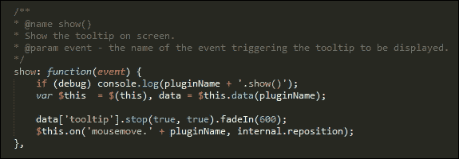

添加后，可以通过在插件文件夹中运行以下命令来编译文档：

```js
jsdoc <name of plugin>

```

我们会看到一个名为 out 的文件夹出现；里面包含了我们可以逐步建立的文档。如果我们对内联注释进行了更改，我们需要重新运行编译过程。这可以通过 Node 的`grunt-contrib-watch`插件来自动化。如果我们在 out 文件夹中看一下，就会看到文档出现。它会看起来类似于以下截图提取：

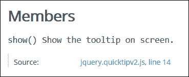

还有很多内容可以进行覆盖，以了解可以用来指导文档如何呈现的某些参数的感觉，不妨阅读[`usejsdoc.org/about-getting-started.html`](http://usejsdoc.org/about-getting-started.html)上的广泛文档。有很多可能性可供选择！

# 从我们的插件返回值

创建插件的关键部分是 - 我们能从插件中得到什么信息？有时我们无法从中获取信息，但这可能仅是我们试图通过插件实现的目标的局限性。在我们的情况下，我们应该能够获取内容。让我们看看如何使用我们的快速提示插件来实现这一点。

在深入代码之前，我们先来看一下我们要创建的东西：

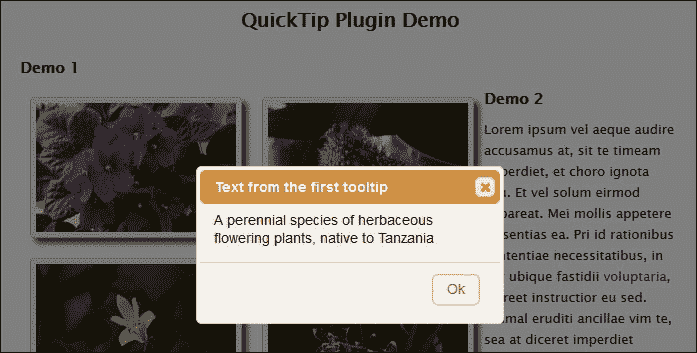

1.  我们需要从某个地方开始，所以最好的地方就是标记。在`tooltipv2.html`的副本中，在关闭`<div>`标签之前添加以下突出显示的代码：

    ```js
     <input type="submit" id="getValue" value="Get text from first tooltip" />
     <div id="dialog" title="Basic dialog">
      </div>
    ```

1.  在`tooltipv2.js`的副本中，我们需要暴露我们在标记中实现的`data-`标签。继续添加`tiptag`的配置选项，如下所示：

    ```js
    $(document).ready(function() {
      $('#img-list li a.tooltips').quicktip({
        class: 'arrow_box', tiptag: "title"
      });
    });
    ```

1.  这部分的最后一步是修改我们的标记。我们将使用`data-`标签替换标准的`title=""`标签，以提供更多的灵活性。在`tooltipv2.html`的副本中，搜索所有`title`的实例，然后用`data-title`替换它们。

1.  接下来，我们需要添加一个链接到 jQuery UI CSS 样式表中。这纯粹是为了创建一个对话框，显示我们从其中一个工具提示中获取文本的结果：

    ```js
    <link rel="stylesheet" type="text/css" 
    href="http://code.jquery.com/ui/1.10.4/themes/humanity/jquery-ui.css">
    <link rel="stylesheet" type="text/css" href="css/tooltipv2.css">
    ```

1.  要使 jQuery UI CSS 起作用，我们需要添加对 jQuery UI 库的引用。所以继续添加一个。为了方便起见，我们将使用 CDN 链接，但是在生产环境中，我们将考虑生成一个定制的缩小版本：

    ```js
    <script src="img/jquery-ui.js"> </script>
    <script src="img/jquery.quicktipv2.data.js"></script>
    ```

1.  在`tooltip.js`的副本中，删除其中的所有代码，并用以下代码替换：

    ```js
    $(document).ready(function() {
      $('#img-list li a.tooltips').quicktip({ 
        class: 'arrow_box', 
        tiptag: "title"
      });

      $('#getValue').on("click", function(event){
        var tipText = $('a.tooltips').eq(0).data().title;
        $("#dialog").text(tipText);
        $("#dialog").dialog({
          title: "Text from the first tooltip",
          modal: true,
          buttons: {
            Ok: function() { $(this).dialog("close"); }
          }
        });
      });
    });
    ```

1.  保存所有文件。如果我们切换到像 Firebug 这样的 DOM 检查器，我们可以看到通过输入第 6 步中突出显示的代码行返回的文本：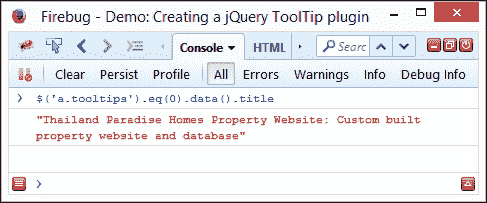

1.  在同一个浏览器会话中，单击**从第一个工具提示获取文本**按钮。如果一切正常，我们应该看到一个温和的覆盖效果出现，然后是一个对话框，显示在本练习开始时显示的文本。

诚然，我们的示例有点牵强，我们应该尽量不将获取文本的依赖硬编码在内，而是通过选择我们想要的任何工具提示中的文本来实现。关键在于，我们可以同样轻松地自定义用于文本的标签，并使用`.data()`方法检索该内容。

# 探索最佳实践和原则

在过去的几页中，我们已经涵盖了一些概念和技巧，可以帮助我们进一步发展插件技能。还有一些值得考虑的额外因素，我们还没有涵盖。值得花几分钟来探索这些因素：

+   **质量和代码风格**：你有考虑通过 JSHint ([`www.jshint.com`](http://www.jshint.com)) 或 JSLint ([`www.jslint.com`](http://www.jslint.com)) 对插件代码进行 linting 吗？遵循写 jQuery 最佳实践是确保成功的一种方式，比如遵循一致的代码风格或者在 [`contribute.jquery.org/style-guide/js/`](http://contribute.jquery.org/style-guide/js/) 上发布的指南？如果没有，那你的代码有多清理和可读？

+   **兼容性**：你的插件与哪个版本的 jQuery 兼容？这个库多年来已经进行了重大更改。你是打算提供对旧浏览器的支持（需要使用 1.x 分支的 jQuery），还是保持与更现代的浏览器兼容（使用库的 2.x 版本）？

+   **可靠性**：你应该考虑提供一组单元测试。这些测试可以帮助证明插件的工作情况，并且很容易产生。如果你想了解如何在 QUnit 中执行这些测试，可以看看 Dmitry Sheiko 编著的 *Instant Testing with QUnit*，这本书由 Packt Publishing 出版。

+   **性能**：一个运行速度慢的插件会让潜在用户望而却步。考虑使用 [JSPerf.com](http://JSPerf.com) ([`www.jsperf.com`](http://www.jsperf.com)) 作为测试段的基准，评估插件的工作情况以及是否需要进一步优化任何部分。

+   **文档**：给你的插件文档是必须的。文档的程度通常会决定插件的成功与失败。插件是否包含开发者需要了解的任何怪癖？它支持哪些方法和选项？如果代码有内联注释，那也会有帮助，虽然最好为生产使用提供一个压缩版本。如果开发人员可以很好地导航你的代码库来使用或改进它，那么你已经完成了一份不错的工作。

+   **维护**：如果我们发布一个东西到公众面前，就必须考虑支持机制。我们需要提供多少时间进行维护和支持？提前清楚地说明对问题的回答、解决问题和持续改进代码的期望是至关重要的。

哎呀 – 需要考虑的事情还真不少！创建一个插件可能会是一次有益的经历。希望这些建议能帮助你提高技能，使你成为更全面的开发者。记住，任何人都可以编写代码，就像我经常说的那样。成为更好的开发者的关键在于理解什么是一个好的插件，并知道如何付诸实践。

### 注意

Learn jQuery 网站有一些额外的提示值得探索，地址是 [`learn.jquery.com/plugins/advanced-plugin-concepts/`](http://learn.jquery.com/plugins/advanced-plugin-concepts/)。

# 摘要

如果有人问你学习 jQuery 的一个关键主题的名称，很可能插件会在答案中占据重要地位！为了帮助写作，我们在本章中涵盖了许多技巧和窍门。让我们花五分钟回顾一下我们学到的内容。

我们的起点是讨论如何检测开发不良的插件的迹象，作为学习如何通过使用插件模式来改进我们的开发的先导。然后，我们开始设计和构建一个高级插件，首先创建基本版本，然后重新排序以使用样板模板。

接下来我们详细研究了转换到使用 CSS3 动画，在书中早些时候我们讨论的一些论点，考虑到使用 CSS3 来更好地管理动画，而不是诉诸于 jQuery。

然后，我们开始研究如何在我们的插件中扩展功能，然后学习如何通过 Bower 打包它以便通过 GitHub 使用。然后我们涵盖了自动提供文档的功能，以及如何从我们的插件中返回值，最后总结了一些我们可以在开发中采用的最佳实践和原则。

好的 - 我们继续前进！在下一章中，我们将混合使用 jQuery（包括一些插件），HTML5 标记和 CSS，并制作一个网站。好的，没有什么特别的 - 那是非常正常的。但是，这里有一个转折：怎么样在*离线*状态下运行整个网站？是的，你没听错……离线……而且，看不到 USB 键或 DVD……
