# 第十二章：使用 jQuery 与 Node-WebKit 项目

在这个现代化的时代，响应式设计是最新的热门词汇，使用 jQuery 构建的网站可以在任何设备或平台上正确工作。尽管如此，这需要一个互联网连接——如果我们可以开发一个同样的应用的离线版本呢？

进入 Node-WebKit（或现在称为 NW.js）。在本章中，我们将暂停探索 jQuery 并探索使用该库的较少知名的方式之一。你将看到如何利用 jQuery、HTML5 和桌面的强大功能，将它们混合在一起，以在任何桌面或笔记本环境中离线运行您站点的副本。我们将使用它来通过使用 jQuery 开发一个简单的文件大小查看器来进行一些有趣的开发，这可以轻松地开发成可以根据需要在线或离线运行的更复杂的内容。

在本章中，我们将涵盖以下主题：

+   介绍 Node-WebKit

+   构建一个简单的站点

+   打包和部署您的应用程序

+   深入了解

准备好探索 Node-WebKit 的世界了吗？让我们开始吧...

### 注意

你可能会在网上看到对 NW.js 的引用——这是自 2015 年 1 月以来 Node-WebKit 的新名称；在本章中，你可能会看到两个名称都被使用。

# 设置情景

想象一下情景，如果你愿意，客户要求你制作一个基于网络的应用程序；他们概述了一组特定的要求，如下所示：

+   它必须具有简单的 GUI

+   不应该有重复的内容——必须是一个适用于所有平台的版本

+   解决方案必须易于安装和运行

+   它需要是可移动的，以便在更换计算机时可以传输

如果你认为一个网站就足够了，请举手？现在，如果你没有仔细阅读需求，请举手...！

在这种情况下，一个网站是不够的；一个桌面应用程序将处理重复的要求，但可能不易使用，并且肯定不会跨平台。那么，我们从这里该怎么办呢？

# 介绍 Node-WebKit

Node-WebKit（或现在称为 NW.js）最初由英特尔创建，但在 2011 年开源，并可在 [`nwjs.io/`](http://nwjs.io/) 获取；该项目试图将 SPA 开发的优势与离线环境结合起来（在那里托管 Web 服务器并不实际）。

Node-WebKit 基于 Chromium，一个基于 WebKit 的浏览器进行了扩展，以便让你控制通常对 Web 开发人员不可用的用户界面元素。安全模型已经放宽（基于我们运行的代码是受信任的）并且它集成了 NodeJS；这打开了一系列的可能性，超出了 HTML5 API 的正常范围。

起初，这可能看起来像是一种复杂的混合。然而，请不要害怕，因为大多数最终解决方案仅由普通的 HTML、CSS 和 JavaScript 构建，最后加上一些图像来完成。

正如我们在本章中将要看到的，基本原理是生成一个普通的站点，然后将 HTML、CSS 和所有相关资源文件压缩成一个 ZIP 文件。我们只需将其重新命名为`.nw`扩展名，然后运行主要的`nw.exe`应用程序。只要我们已经设置了一个必需的`package.json`文件，它就会自动获取我们的应用程序并在屏幕上显示出来，如下所示：

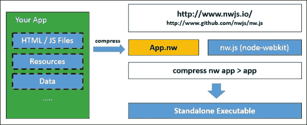

不过，这本书是关于 jQuery 的，对吗？是的，绝对是；这里就是最棒的部分：Node-WebKit 允许你运行标准的 JavaScript 和 jQuery，以及任何 Node 的第三方模块！这打开了各种机会；我们可以使用主要库或任何大量基于 jQuery 的附加库，比如 Three.js、AngularJS 或 Ember。

### 注意

我们真正需要记住的唯一关键部分是，使用 NW.js 有一些怪癖，比如使用文件夹对话框浏览和选择本地文件夹；我们稍后将在本章中更详细地介绍这一点。

此时，我相信你一定会问自己一个问题：为什么我要使用 nw.js（或 Node-WebKit）？这是一个非常合理的问题；我们以桌面应用程序的形式运行基于 Web 的站点可能看起来很不合逻辑！在这种明显的疯狂中，有一些合理的原因让我们这样做，所以让我们现在看一下它们，看看为什么将站点作为桌面应用程序运行是有意义的。

## 在桌面上运行 HTML 应用程序

作为开发人员，我们面临的最大头疼之一是确保用户在访问我们的站点时在所有需要支持的浏览器上拥有相同的体验。现在，我应该明确一点：在同样的体验方面，可能存在一些情况，这根本不可能实现，所以我们至少必须为那些不支持特定功能的浏览器提供一个优雅的退出路径。

幸运的是，这个问题正在逐渐减少。Node-WebKit 的好处在于，我们只需要支持 Chrome（因为 Node-WebKit 就是基于 Chrome 的）。

在大多数情况下，我们可以简单地重用为 Chrome 创建的代码；这使我们能够轻松地使用我们已经了解或使用的前端框架（包括 jQuery！）和 Node 模块推出跨平台应用程序。除此之外，还有几个原因可以让你使用 Node-WebKit 来帮助制作跨平台应用程序，如下所示：

+   访问 Blink 中提供的最新 Web 技术，Blink 是 Google Chrome 后面的渲染引擎。

+   NW.js 支持 *一次构建，到处运行* 的概念——这可能不适用于所有应用程序，但许多应用程序可以从在桌面、Web 和移动环境之间共享代码中受益。

+   如果你想让你的应用程序以特定大小运行或者在弹出窗口中做一些更高级的事情，你可以在桌面上获得这种控制。大多数解决方案还提供了一种访问文件系统并允许其他更高级控件的方式，这些是常规 Web 应用程序所不能提供的。

不想显得消极，但有一些需要注意的事项；主要关注的是可执行文件的大小。

使用原生 UI 库（如 jQuery）创建的站点或应用程序可能只有几千字节大小。使用 Node-WebKit 构建的等效版本会显著更大，因为它包含了一个精简版的 Node 和 Chromium。因此，你需要注意文件大小——你可以使用 第二章 *Customizing jQuery* 中的一些技巧来减小 jQuery 的大小。还有一些其他需要注意的问题；它们包括以下内容：

+   与原生应用程序相比，桌面 Web 应用程序通常需要更大量的 RAM 和 CPU 力量来运行和渲染。

+   在外观方面，如果你想要让你的应用程序在你计划部署的平台上看起来好看，那么你需要使用 CSS 重新创建常见的 UI 元素，或者创建一个全新的 UI，包括为每个操作系统提供的 UI 元素（如标题栏、菜单栏和上下文菜单）创建新的设计。

+   虽然 Node-WebKit 放宽了一些在使用浏览器应用程序时发现的安全问题（如同源策略），但你仍然只能访问 Node-WebKit 上下文；而且在某些情况下，你必须使用 WebKit 特定的标签，比如在创建选择目录对话框时使用 `nwdirectory`。最终效果是代码增加，如果你想要创建一个同时支持 Web 和桌面环境的文件。你可以缓解这个问题的影响：[`videlais.com/2014/08/23/lessons-learned-from-detecting-node-webkit/`](http://videlais.com/2014/08/23/lessons-learned-from-detecting-node-webkit/) 提供了一个有用的技巧来确定你所处的环境，并允许你引用该环境所需的适当文件。

### 注意

有关一些安全考虑的更多信息，请查看 NW.js Wiki 上的安全页面，网址为 [`github.com/nwjs/nw.js/wiki/Security`](https://github.com/nwjs/nw.js/wiki/Security)。

现在我们已经相互介绍了，让我们深入探讨并开始安装 Node，在我们开始构建基于 jQuery 的应用程序之前。值得注意的是，本章的重点将主要基于 Windows，因为这是作者使用的平台；对于使用 Linux 或 Mac 平台的人来说，需要进行一些更改。

# 准备我们的开发环境

在接下来的几页中，我们将构建一个简单的应用程序，该应用程序在主窗口中显示任何拖放的文件的文件大小，或者通过文件对话框选择。实际上，我们不会单独使用该应用程序，而是作为上传图像进行处理的基础，或者可能作为压缩应用程序的离线版本。我们有很多方法可以进一步开发它——我们将在本章后面的 *深入探讨* 部分中涉及一些想法。

与此同时，让我们开始安装 NW.js。在这之前，我们需要利用以下工具：

+   需要一个压缩程序；在 Windows 平台上，您可以使用内置功能或类似于 7-Zip ([`www.7-zip.org`](http://www.7-zip.org)) 的东西，如果更喜欢的话。

+   我们需要一个文本编辑器；在本章的过程中，我们将使用 Sublime 2 或 3，但如果您已经有个人偏爱，任何好的文本编辑器都应该足够。Sublime Text 可以从 [`www.sublimetext.com`](http://www.sublimetext.com) 下载，适用于 Mac、Linux 和 Windows 平台。

+   我们将利用 Node 和 Grunt 来安装额外的包。Node 可以在 [`www.nodejs.org`](http://www.nodejs.org) 上获得，所以请继续安装适合您平台的版本。安装完成后，请从 NodeJS 命令提示符中运行以下命令以安装 Grunt：

    ```js
    npm install -g grunt-cli

    ```

+   最后，但绝不是最不重要的，我们需要 Node-WebKit 库（当然），所以请访问 [`nwjs.io/`](http://nwjs.io/) 并下载适合您平台的版本。如果您展开文件夹，您应该会看到类似于此截图所示的内容：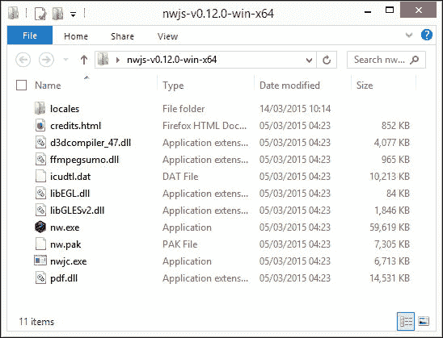

顺便说一下，Node-WebKit 可以很容易地集成到现有的 Grunt 文件中，这意味着我们可以利用诸如`cssmin`之类的包来缩小我们为应用程序创建的 CSS 样式表。随着您对 Node-WebKit 的了解越来越深入，这绝对值得探索。

废话少说；是时候开始开发了！与其他事物一样，我们需要从某个地方开始。在我们看如何使用 jQuery 之前，让我们试试创建一个简单的 "Hello World" 示例。

# 安装和构建我们的第一个应用程序

我在想：你有多少次读过关于编程语言的书籍或在线文章，它们对无处不在的 "Hello World" 示例都提供了自己的见解？我敢打赌，这些年来肯定有不少次……是的，在你问之前，我们也不打算打破传统！在提供 "Hello World" 示例的任何人的脚步之后，这是我们自己的见解。

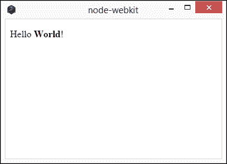

要构建这个，我们需要做以下事情：

1.  浏览到[`nwjs.io/`](http://nwjs.io/)并下载适用于您平台的软件包；我们暂时假设使用 Windows，但也有 Mac 和 Linux 平台的软件包可用。

1.  提取`node-webkit-vX.XX.XX-win-x64`文件夹（其中`XX`是版本号），将其重命名为`nodewebkit`，并将其复制到主 PC 驱动器——Linux 或 Mac 用户可以将此文件夹复制到他们的用户区域。完成后，在`nodewebkit`文件夹中创建一个名为`development`的新文件夹。

1.  接下来，我们需要安装 NodeJS。为此，请前往[`nodejs.org/download/`](http://nodejs.org/download/)以下载并安装适合您平台的版本，接受所有默认值。

Node-WebKit 可以使用任何可用的标准 Node 软件包。作为示例，我们将安装`markdown`包，该包将合适标记的纯文本转换为有效的 HTML。让我们继续安装它并看看它是如何工作的：

1.  在 NodeJS 命令提示符中，切换到`helloworld`文件夹，然后输入以下代码并按*Enter*：

    ```js
    npm install markdown

    ```

    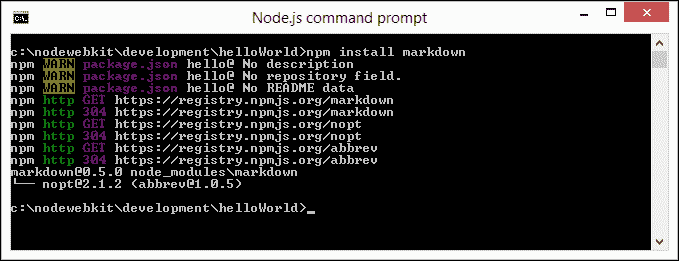

1.  关闭窗口，因为你不需要它。接下来，从附带本书的代码下载中的`helloWorld`文件夹中提取`index.html`和`package.json`文件的副本；将它们保存在项目区域中的`helloWorld`文件夹中。

1.  创建一个名为`helloWorld.zip`的新 ZIP 文件夹，然后将这两个文件添加到其中；将`helloWorld.zip`重命名为`helloWorld.nw`。

现在我们可以运行我们的应用程序了；有三种方式可以使用 Node-WebKit 来执行此操作：

+   在 NodeJS 命令提示符中，切换到`nodewebkit`文件夹，然后运行以下命令：

    ```js
    nw C:\nodewebkit\development\helloWorld.nw

    ```

+   双击`nw.exe`应用程序；这将拾取`package.json`文件并自动运行`helloworld.nw`文件

+   将`helloworld.nw`文件拖放到`nw.exe`上即可运行该应用程序

无论您喜欢使用哪种方式，运行它都会显示在本练习开始时显示的**Hello World**窗口。这是一个简单的、不带花哨的 Node-WebKit 使用示例——尽管它不会赢得任何奖项，但它展示了如何从现有 HTML 页面创建一个功能性应用程序是多么简单。

## 解析`package.json`文件

我们的应用程序的核心是`package.json`文件。这个清单文件告诉 Node-WebKit 如何打开应用程序，并控制浏览器的行为方式：


值得详细了解这个文件；它包含了项目的所有元数据，并遵循所有基于 Node 的软件包的标准格式。如果您不熟悉清单文件，您可以在[`browsenpm.org/package.json`](http://browsenpm.org/package.json)看到一个详细的示例，其中包含每个部分的交互式解释；Node-WebKit 的版本使用方式类似。

### 注意

关于 Node-WebKit 清单文件及其组成部分的更深入详细信息，请访问主 NW.js 站点上的文档 ([`github.com/nwjs/nw.js/wiki/manifest-format`](https://github.com/nwjs/nw.js/wiki/manifest-format))。

好的，现在是时候开始构建我们的示例应用程序了！

# 构建我们的简单应用程序

在接下来的几页中，我们将构建一个简单的应用程序，允许我们将文件拖放到拖放区域以渲染文件大小。它基于 Martin Angelov 的教程，可在 [`tutorialzine.com/2013/05/mini-ajax-file-upload-form/`](http://tutorialzine.com/2013/05/mini-ajax-file-upload-form/) 上获得；我们将专注于前端 UI 界面，并不考虑后端上传功能，以供我们的演示使用：

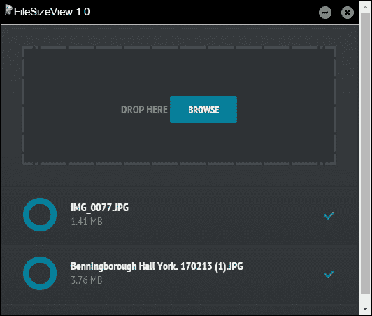

即使只是在前端用户界面上工作，仍然需要相当数量的代码；我们的重点将主要放在 jQuery 代码上，因此在更详细地探索之前，让我们先看一下演示的实际操作。要做到这一点，请执行以下步骤：

1.  在我们的演示中，我们使用了一小部分 PHP 代码，因此我们首先需要设置 Web 服务器空间，如 WAMP（适用于 PC—[`www.wampserver.de/en`](http://www.wampserver.de/en)）或 XAMPP（或 MAMP 适用于 Mac—[`www.mamp.info/en`](http://www.mamp.info/en)）。Linux 用户将在其发行版中获得某种可用内容。我们将在此演示中使用 WAMP—如果您的情况不同，请相应调整位置；在安装时使用默认设置。如果您喜欢跨浏览器解决方案，则 XAMPP 是一个不错的选择—它可在 [`www.apachefriends.org/index.html`](https://www.apachefriends.org/index.html) 上获得。

1.  接下来，我们需要从附带本书的代码下载中提取一个`FileSizeView`文件夹的副本。这包含了我们应用程序所需的标记。将文件夹保存在`C:\wamp\www`中。

1.  我们需要一个 Node-WebKit 的副本来运行我们的应用程序，所以请复制代码下载中的`nwjs`文件夹的内容到`FileSizeView`文件夹中。如果一切正常，您应该看到如下所示的文件：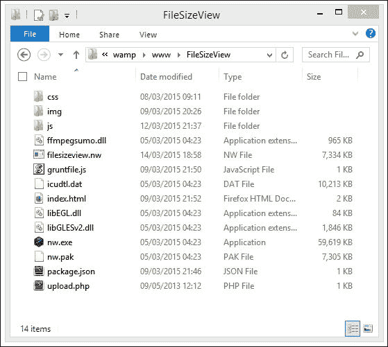

1.  在此阶段，如果我们双击`nw.exe`，我们应该可以看到我们的应用程序运行。另外，您将看到在本练习开始时显示的窗口。

好的，它显示了窗口；“它是如何工作的”，我听到你在问？嗯，从这个练习中有一些关键点需要注意，所以让我们花些时间更详细地讨论一下。

## 进一步探索我们的演示

如果您仔细查看`FileSizeView`文件夹，您会发现大部分内容围绕着`index.html`和`upload.php`文件展开，还有为使演示工作所需的相关 CSS、图像和 JavaScript 文件。此外，我们还有一些来自 Node-WebKit 文件夹的文件，这些文件提供了 Node 和 Chromium 的精简版本，用于托管我们的文件：

+   `nw.exe` 和 `nw.pak`：这是主要的 Node-WebKit 可执行文件和 JavaScript 库文件，分别运行我们的代码。

+   `package.json`：这是一个清单文件，在本章早些时候的*安装和构建我们的第一个应用程序*部分中就使用过；它向 Node-WebKit 提供了如何显示我们应用程序的指示。

+   `ffmpegsumo.dll`：用于提供视频和音频支持；对于我们的演示来说并不是必需的，但可以用于将来使用。

+   `filesizeview.nw`：这是我们打包的应用程序；这是 Node-WebKit 在检查`package.json`以验证应如何显示后运行的文件。

+   `gruntfile.js`：这是用于`grunt-node-webkit-builder`的 Grunt 文件，我们稍后会在*自动化流程*中使用它将我们的文件编译成一个应用程序。

+   `icudtl.dll`：这是 Node-WebKit 所需的网络库。

+   `libEGL.dll`和`libGLESv2.dll`：这些文件用于**Web 图形库**（**WebGL**）和 GPU 加速。

在一些可在线使用的 Node-WebKit 应用程序中，您可能会看到`D3DCompiler_43.dll`和`d3dx9_43.dll`文件。这些来自 DirectX 可再发行包，用于提供增强的 WebGL 支持。

## 解剖我们的内容文件

好的，那么我们有我们的主要 Node-WebKit 文件；我们还使用了什么呢？除了标准的 HTML 标记、图像和样式外，我们还使用了许多基于 jQuery 的插件和一些自定义的 jQuery 代码进行连接。

使用的主要插件文件是 jQuery、jQuery UI、jQuery Knob 和 BlueImp 文件上传插件。我们还使用一些自定义代码将它们组合在一起——它们位于`window.js`和`script.js`中。让我们更详细地查看这些，从`window.js`开始。

### 探究`window.js`

在`window.js`中，我们首先调用`nw.gui`，这是 Node-WebKit 的本机 UI 库，使用了`require()`；这是调用任何模块（如内部模块或外部第三方模块）的标准格式。然后我们将这分配给`gui`变量，然后使用它来获取我们应用程序窗口的句柄：

```js
var gui = require('nw.gui'), win = gui.Window.get();
```

需要注意的是，由于我们只能访问 Node-WebKit 上下文，我们必须使用专用库；我们无法通过标准的 JavaScript 调用访问窗口。

### 提示

要获取有关访问模块的更多信息，请查看位于[`github.com/nwjs/nw.js/wiki/Using-Node-modules`](https://github.com/nwjs/nw.js/wiki/Using-Node-modules)上的文档。

接下来，我们设置了两个委托文档处理程序，一个用于处理窗口的最小化，另一个用于完全关闭它：

```js
$(document).on('click', '#minimize', function () {
  win.minimize();
});

$(document).on('click', '#close', function () {
  win.close();
});
```

这只是我们可以做的一小部分；还有很多。前往[`github.com/nwjs/nw.js/wiki/Window`](https://github.com/nwjs/nw.js/wiki/Window)了解我们可以实现的可能性。

### 解析 BlueImp 插件配置

我们站点的主要功能是在`script.js`中托管的。它包含 BlueImp 文件上传插件的主配置对象以及一些额外的辅助函数。让我们更详细地看一下。

我们从常规的文档准备调用开始，然后将`#upload li`列表项的引用分配给一个变量，如下所示：

```js
$(function(){
  var ul = $('#upload ul');

  $('#drop a').click(function(){
    // Simulate a click on the file input button
    // to show the file browser dialog
    $(this).parent().find('input').click();
  });
```

接下来，我们配置文件上传插件。首先，我们将初始拖放区域设置为`#drop`选择器：

```js
  // Initialize the jQuery File Upload plugin
  $('#upload').fileupload({

    // This element will accept file drag/drop uploading
    dropZone: $('#drop'),
```

然后，我们设置`add`回调函数。这个函数负责显示已添加到列表中的每个列表项，无论是通过拖放还是通过浏览文件。我们首先创建一个模板，然后将其缓存在`tpl`变量中：

```js
  add: function (e, data) {
    var tpl = $('<li class="working"><input type="text" value="0" data-width="48" data-height="48"'+ ' data-fgColor="#0788a5" data-readOnly="1" data- bgColor="#3e4043"/><p></p><span></span></li>');
```

我们接着找到刚刚添加的文件名，然后计算并附加`filesize`函数到列表中：

```js
    tpl.find('p').text(data.files[0].name).append('<i>' + formatFileSize(data.files[0].size) + '</i>');

    // Add the HTML to the UL element
    data.context = tpl.appendTo(ul);
```

接下来，我们初始化 jQuery Knob 插件。虽然现在它还没有运行，但它将产生一个良好的圆形状态表，显示上传任何文件到远程位置的进度：

```js
    // Initialize the knob plugin
    tpl.find('input').knob();
```

目前，我们没有使用取消图标。这将是我们需要使用的事件处理程序，以确定是否在某个项目正在进行时取消上传：

```js
    tpl.find('span').click(function(){

      if(tpl.hasClass('working')){
        jqXHR.abort();
      }

      tpl.fadeOut(function(){
        tpl.remove();
      });
    });

    // Automatically upload the file once it is added to the queue
    var jqXHR = data.submit();
  },
```

这是`fileupload`对象内的关键方法处理程序。它负责在触发更改更新 jQuery Knob 插件之前，计算文件上传进度的百分比值，如下所示：

```js
  progress: function(e, data){
    var progress = parseInt(data.loaded / data.total * 100, 10);
    data.context.find('input').val(progress).change();
    if(progress == 100){
      data.context.removeClass('working');
    }
  },
```

如果文件上传失败，我们将设置一个`.error`类，这在附带的样式表中有适当的样式：

```js
  fail:function(e, data){
    // Something has gone wrong!
    data.context.addClass('error');
  }
});
```

除了主要的`fileupload`配置对象之外，我们还设置了一些辅助函数。第一个辅助函数阻止了正常操作，如果我们拖动任何内容到文档对象上，将尝试在浏览器窗口中显示它：

```js
$(document).on('drop dragover', function (e) {
  e.preventDefault();
});
```

第二个辅助函数处理文件大小从字节值转换为其对应的千字节、兆字节或千兆字节，然后返回用于在屏幕上渲染的值：

```js
function formatFileSize(bytes) {
  if (typeof bytes !== 'number') {
    return '';
  }

  if (bytes >= 1000000000) {
    return (bytes / 1000000000).toFixed(2) + ' GB';
  }

  if (bytes >= 1000000) {
    return (bytes / 1000000).toFixed(2) + ' MB';
  }

  return (bytes / 1000).toFixed(2) + ' KB';
  }
});
```

目前，我们的项目肯定有改进的空间：它可以在普通浏览器窗口中正常工作，但需要修改以使其在 Node-WebKit 环境中 100%正常运行。我们稍后将在*进一步探讨*部分讨论一些改进代码的想法，但现在，在我们考虑调试应用程序之前，有一个重要的提示需要说明。

### 自动创建我们的项目

我在本书中试图保持的一个关键主题是我们如何更聪明地做事；任何人都可以编写代码，但更聪明的开发者知道何时是时候自动化一些更乏味的任务，并将他们的时间用在能够带来更多价值的任务上。

我们可以改进创建和构建项目的方法之一是自动化生成我们的骨架项目。幸运的是，我们可以使用 Yeoman generator for node-webkit 应用程序（可在 [`github.com/Dica-Developer/generator-node-webkit`](https://github.com/Dica-Developer/generator-node-webkit) 找到），我们可以使用以下命令安装：

```js
npm install -yeoman

```

前面的命令后面是这样的：

```js
npm install –g generator-node-webkit

```

这显示了以下屏幕截图，显示了为测试项目输入详细信息的过程：

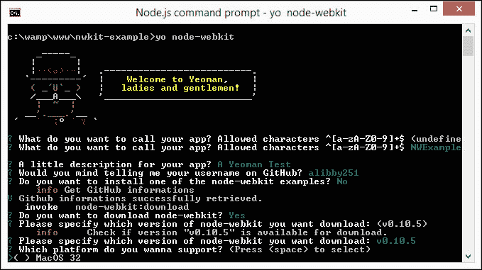

如果一切顺利，你应该看到预定义的文件夹结构已经就位，可以供你使用，如下图所示：

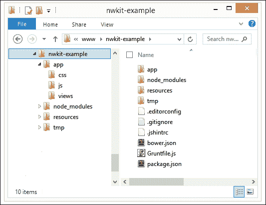

这样做会更容易创建所需的文件夹结构并在项目中保持一致性。

## 调试你的应用程序

此时，你应该有一个可以部署的工作应用程序。虽然必须说我们的应用程序在发布前还需要更多的工作，但是部署背后的原理是相同的，不论应用程序如何！在我们看部署之前，有一件小事我想讲一下。

还记得我在本章中提到 Sublime Text 将被广泛使用吗？这是有充分理由的：它非常适合构建应用程序，以至于我们可以运行和调试应用程序。为此，我们需要为 Sublime Text 创建一个新的构建系统文件（例如以下所述的 Windows）：

```js
{
  "cmd": ["nw.exe", "--enable-logging", "${project_path:${file_path}}"],
  "working_dir": "${project_path:${file_path}}",
  "path": "C:/Tools/nwjs/",
  "shell": true
}
```

为 Sublime 添加新的构建文件的过程很快—具体细节，请访问 [`github.com/nwjs/nw.js/wiki/Debugging-with-Sublime-Text-2-and-3`](https://github.com/nwjs/nw.js/wiki/Debugging-with-Sublime-Text-2-and-3)。在开发应用程序时使用这个技巧是很有用的，因为手动构建过程可能会变得非常乏味！

# 打包和部署你的应用程序

好了，我们有一个可以打包和部署的工作应用程序；我们如何将其转化为可以提供下载的内容？

打包 Node-WebKit 应用程序出奇的简单。有一些注意事项，但主要过程是将所有的 Node-WebKit 可分发文件和我们的内容一起放入一个文件夹中，然后将其作为重命名的压缩文件发布。

有几种不同的方法可以打包我们的文件，这取决于所使用的平台。让我们看看在 Windows 平台上使用一些选项的情况，首先是手动编译。

### 注意

对于那些使用苹果 Mac 或 Linux 的人，有关如何打包应用程序的详细信息，请访问[`github.com/rogerwang/node-webkit/wiki/How-to-package-and-distribute-your-apps`](https://github.com/rogerwang/node-webkit/wiki/How-to-package-and-distribute-your-apps)。

## 手动创建软件包

假设我们已经准备好部署我们的应用程序，这些是手动创建软件包时要遵循的基本步骤——对于此示例，我们将使用*构建我们的简单应用程序*部分中早期创建的文件：

1.  创建一个新的空 ZIP 文件，并添加`package.json`、`ffmpegsumo.dll`、`icudtl.dat`、`libEGL.dll`、`libGLESv2.dll`和`nw.pak`文件——这些文件是在 Chromium 和 Node 的精简版本中托管站点所需的。

1.  将`css`、`img`和`js`文件夹以及`index.html`添加到 ZIP 文件中。

1.  将 ZIP 文件重命名为`.nw`文件，然后运行`nw.exe`——这将使用`package.json`文件来确定应该运行什么。

### 注意

请注意，Node-WebKit 软件包不保护、混淆、数字签名或使软件包安全；这意味着，将您的软件包开源是一个更好的选择，即使只是为了避免任何与许可证相关的问题！

## 自动化过程

等等，创建一个软件包是一个手动过程，如果我们要添加很多更改，那么这个过程会变得很乏味，对吗？

绝对，智能的前进方式是自动化这个过程；然后，我们可以将其与 Grunt 软件包结合起来，例如`grunt-contrib-watch`（来自[`github.com/gruntjs/grunt-contrib-watch`](https://github.com/gruntjs/grunt-contrib-watch)），以便在进行任何更改后立即构建我们的软件包。有几种自动化的方法——我个人最喜欢使用`grunt-node-webkit-builder`，来自[`github.com/mllrsohn/grunt-node-webkit-builder`](https://github.com/mllrsohn/grunt-node-webkit-builder)。

### 注意

node-webkit-builder 插件由与 grunt-node-webkit-builder 背后的开发人员相同的开发人员创建；唯一的区别是，后者对与 Grunt 一起使用的额外支持。如果您想切换到使用 Grunt，您可以安装一个补充包，`grunt-node-webkit-builder-for-nw-updater`，可在[`www.npmjs.com/package/grunt-node-webkit-builder-for-nw-updater`](https://www.npmjs.com/package/grunt-node-webkit-builder-for-nw-updater)上找到。

让我们看看插件的运行情况——在继续演示之前，假设您已经安装了 NodeJS：

1.  在项目文件夹中的一个新文件中，添加以下代码并将其保存为`gruntfile.js`：

    ```js
    module.exports = function(grunt) {

      grunt.initConfig({
        nodewebkit: {
          options: {
            platforms: ['win'],
            buildDir: './builds',
            winIco: './img/filesize.ico'
          },
          src: ['./css/*.css', './img/*.*', './js/*.js', '*.html', '*.php', '*.json', '*.ico']
        }
      })

      grunt.loadNpmTasks('grunt-node-webkit-builder');
      grunt.registerTask('default', ['nodewebkit']);
    };
    ```

1.  接下来，我们需要安装 grunt-node-webkit-builder；因此，请启动 NodeJS 命令提示符的一个实例，然后导航到我们之前在*构建我们的简单应用程序*部分中使用过的项目文件夹。

1.  输入此命令，然后按*Enter*，等待其完成：

    ```js
    Npm install grunt-node-webkit-builder --save-dev

    ```

1.  在`package.json`文件中，您会看到已添加了以下行，如下所示：

    ```js
      "icon": "img/filesize.png"
      },
     "devDependencies": {
     "grunt": "~0.4.5",
     "grunt-node-webkit-builder": "~1.0.2"
     }
    }
    ```

    ### 提示

    如果您需要查看 `package.json` 将会是什么样子，请转到 [`github.com/3dd13/sample-nw`](https://github.com/3dd13/sample-nw)。有一个样本文件位于 [`github.com/3dd13/sample-nw/blob/master/package.json`](https://github.com/3dd13/sample-nw/blob/master/package.json)，显示了我们刚刚输入到我们自己版本文件中的代码的内容。

1.  在此阶段，我们现在准备构建我们的包。在提示符处，键入 `grunt`，然后等待它完成；您应该看到它构建了包，如下面的截图所示：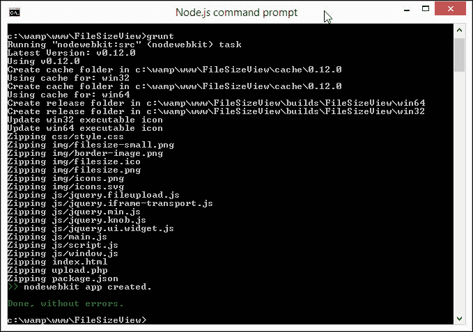

1.  如果您回到我们的文件存储的文件夹，现在应该可以看到一个名为 `builds` 的文件夹已经出现了；在其中导航将会显示类似于此截图的内容，在其中显示了 `win64` 构建文件夹的内容：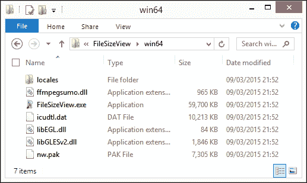

    在此阶段，我们可以双击 `FileSizeView.exe` 应用程序来启动该程序。这将以所有荣耀展示我们的应用程序，准备好使用。完美！我们现在可以部署文件了，对吧？

## 部署您的应用程序

嗯…慢点；你现在应该知道，我们总是可以做得更好！

绝对可以；在这种情况下，更好的方式是创建一个设置安装程序，这样我们只需要分发一个单个文件。这样更容易处理！它还有额外的好处，可以进一步压缩文件；在我们的示例中，使用开源的 Inno Setup 软件包，结果从大约 80 MB 降低到约 30 MB。让我们看看为在 Windows 平台上生成安装文件所需的内容：

1.  我们首先需要下载并安装 Inno Setup。前往 [`www.jrsoftware.org/isinfo.php`](http://www.jrsoftware.org/isinfo.php)，然后点击 **下载 Inno Setup**；`setup.exe` 文件可以从页面中部的表格中下载。

1.  双击 `setup.exe` 文件并完成流程，接受所有默认设置。

1.  在我们的项目文件夹中，我们需要创建一个名为 `setup` 的新文件夹。这将存储用于 Inno Setup 的源脚本和最终构建的文件。

1.  从代码下载中，继续提取 `filesizeview-1.0.iss` 并将其存储在 `setup` 文件夹中。

1.  双击文件以启动它，然后点击下面的高亮图标，如下面的截图所示，编译构建文件：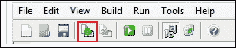

1.  完成后，Inno Setup 将自动启动新创建的安装程序，如此处所示：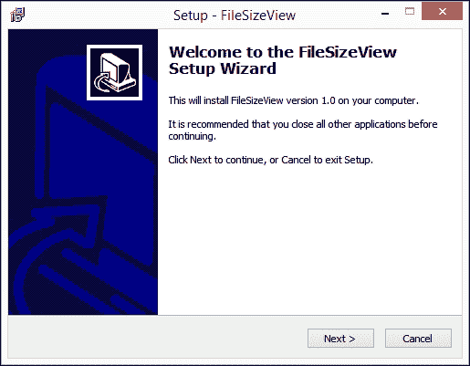

现在我们可以跟随安装过程直至完成，在愤怒中使用该应用程序之前。 Inno Setup 还通过包含一个 `unins000.exe` 文件来处理卸载过程，如果我们需要从系统中移除应用程序，我们可以使用它。

对于那些使用 Mac 的人，可能会有类似的软件包可用。作为起点，请尝试[`www.codepool.biz/tech-frontier/mac/make-pkg-installer-on-mac-os-x.html`](http://www.codepool.biz/tech-frontier/mac/make-pkg-installer-on-mac-os-x.html)中列出的说明。您还可以尝试在 Linux 上使用 Wine 使用 Inno Setup，说明列在[`derekstavis.github.io/posts/creating-a-installer-using-inno-setup-on-linux-and-mac-os-x/`](http://derekstavis.github.io/posts/creating-a-installer-using-inno-setup-on-linux-and-mac-os-x/)，尽管它们不适合初学者！

# 接下来的事情

哎呀！在过去的几页中，我们确实覆盖了很多内容！

但是，在生活的大计划中，我们只是触及了表面。我们可以在我们的应用程序中做更多的事情，甚至可以探索它来帮助我们在使用 Node-WebKit 和 jQuery 时提高技能。为了让你开始，这里有一些想法：

+   该应用程序是调整图像大小甚至压缩它们的理想基础；我们可以在线完成这些操作，但有一些影响，主要是关于保密性和图像大小的问题。

+   上传功能只有部分可用。我们使用 BlueImp 文件上传插件，但它实际上并没有做任何事情。在我们的应用程序中让它正常工作怎么样？

+   如何显示文件类型的图标，甚至是如果我们上传的是图像的小缩略图？

+   没有办法在不重新启动应用程序的情况下清除列表——修复这个问题应该很容易……

+   我们故意没有包括任何错误检查，以保持事情简单；现在加入一些如何？

+   我认为界面在某种程度上有些受限制：如果我们上传一个文件名非常长的文件，那么它就会被截断；截断有点混乱！

+   我们还没有添加任何菜单控件。虽然 Node-WebKit 非常适合速度不是问题的应用程序，但一旦我们添加了更多功能，能够进行导航仍然是很好的。要了解如何添加这样的菜单的示例，请参阅[`www.4elements.com/blog/2013/12`](http://www.4elements.com/blog/2013/12)。

希望在这里你能找到一些启发你进一步学习的想法。一旦掌握了基础知识，并允许我们必须使用 Node 特定标签的场合，就没有限制了！相当多的人已经制作了各种复杂性的应用程序并将它们发布在网上——一定要在网上进行一些研究，看看有什么可用的。以下是一些想法：

+   爱尔兰开发人员 Shane Gavin 创建了一个有用的基于视频的教程，介绍了使用 Node-WebKit 的方法。这探讨了在创建 Node-WebKit 应用程序时可以使用的一些技术，我们在我们的示例中使用了其中一些技术。教程可在[`nodehead.co`](http://www.nodehead.co)找到。

+   我相信我们都听说过或以某种形式玩过*乒乓球*或*打砖块*等游戏。我们可以使用 Phaser 游戏库在[`phaser.io`](http://phaser.io)上制作一些经典游戏（以及其他游戏）。看一看在[`github.com/kandran/pong`](https://github.com/kandran/pong)上展示的示例，该示例使用 Node-WebKit 创建了*乒乓球*。

+   David Neumann 写了一篇关于如何将免费教育游戏*Caterpillar Count*重新打包以在 Node-WebKit 中运行的博客文章；撇开游戏的性质不谈，这篇文章强调了一些关于转移过程的有用提示和技巧（[`blog.leapmotion.com/building-applications-for-simultaneous-deployment-on-web-and-native-platforms-or-how-i-learned-to-stop-worrying-and-love-node-webkit/`](http://blog.leapmotion.com/building-applications-for-simultaneous-deployment-on-web-and-native-platforms-or-how-i-learned-to-stop-worrying-and-love-node-webkit/)）。

+   对使用 HTML5 和 Node-WebKit 尝试你的网络摄像头感兴趣吗？去[`webcamtoy.com/`](http://webcamtoy.com/)吧——将标准代码调整为从 Node-WebKit 工作应该相对容易，因为它支持`getUserMedia`。

+   如果我们要处理视频或网络摄像头，我们可以考虑截图。有一个可用于 Node-WebKit 的包来帮助实现这一点（[`www.npmjs.com/package/node-webkit-screenshot`](https://www.npmjs.com/package/node-webkit-screenshot)）；它可以很容易地成为一个有用的小应用程序的基础。

+   我们之前讨论过使用其他 JavaScript 库，例如 Ember 或 Angular，这些库可以轻松与 Node-WebKit 和 jQuery 一起使用——有两个例子，你可以访问[`www.sitepoint.com/building-chat-app-node-webkit-firebase-angularjs/`](http://www.sitepoint.com/building-chat-app-node-webkit-firebase-angularjs/)和[`sammctaggart.com/build-a-markdown-editor-with-node-webkit-and-ember/`](http://sammctaggart.com/build-a-markdown-editor-with-node-webkit-and-ember/)。

现在网上的内容越来越多。图书馆最近进行了一些名称更改（如前所述），所以如果你想了解更多关于使用 Node-WebKit 的信息，那么值得搜索 Node-WebKit 和 NW.js 两个词以确保全面覆盖。

# 总结

近年来，在线和离线应用之间的分界线变得模糊，许多人使用移动设备访问互联网来代替正常的桌面浏览器。随着 Node-WebKit 的出现，这进一步扩大了许多融合这些界限的机会——让我们回顾一下我们在过去几页学到的东西。

我们以似乎是一个典型简单请求开始，大多数开发人员将自动考虑设计一个网站。然而，随着 Node-WebKit 的引入，我们可以探索创建我们的应用程序或网站的离线版本。我们稍微探讨了一下库的工作原理，以及从桌面运行这种应用程序的利弊。

接着，我们开始准备开发环境，然后简要介绍了安装 Node-WebKit 并使用它创建我们的第一个应用程序。我们深入研究了 `package.json` 文件，这对于运行我们的应用程序至关重要，然后开始构建我们的文件大小查看器应用程序。接下来更深入地看了应用程序背后使用的代码；我们还介绍了如何使用 Yeoman Node-WebKit 生成器创建应用程序的基本框架。

接着，我们看了一个快速调试 Node-WebKit 应用程序的小窍门，然后继续研究如何手动打包和部署应用程序，或者使用 Grunt 自动化部署它们。我们旅程的最后阶段涵盖了应用程序的部署。我们研究了使用 Inno Setup 生成 `setup.exe` 文件以供部署使用。然后我们在章节结束时看了一些在使用 Node-WebKit 开发时可以进一步发展的想法。

哎呀！我们确实涵盖了很多内容，但正如他们常说的那样，恶人永无休息之日。在下一章中，我们将重点研究 jQuery 使用中最重要的部分之一：优化和提高项目性能。
