# 第十三章：第 13 章：在 jQuery 中增强性能

到目前为止，我们在书中涵盖了一系列不同的主题：从定制 jQuery 到使用动画，甚至是在 Node-WebKit 中使用 jQuery。

但是，有一个关键的主题我们还没有涉及。虽然使用 jQuery 可能非常令人满意，但我们必须注意在实际情况下优化我们的代码，以确保用户体验良好。许多开发人员可能只是目测代码，但这是耗时的。在本章中，我们将探讨优化 jQuery 代码的方法，介绍可以补充现有工作流程并帮助实际反馈你的更改的工具。我们将在本章中涵盖一些主题，其中将包括：

+   了解为什么性能很重要

+   添加元素时监视性能

+   监视 jQuery 的速度

+   自动化性能监控

+   使用 Node 自动清理我们的代码

+   实施增强性能的最佳实践

+   考虑使用 jQuery 的情况

准备好开始了吗？

### 注意

在本章中，我们将集中讨论使用 jQuery——你会发现很多给出的建议也可以应用于纯 JavaScript，在你的代码中更多地使用它（正如我们稍后在本章中将讨论的那样）。

# 了解为什么性能至关重要

想象一下情景——你的团队使用最新技术创建了一个杀手级的基于 Web 的应用程序，可以做任何事情，你准备坐下来享受成功的荣誉。除了一个小但相当关键的事情……

没有人购买。你的应用程序没有一个副本被售出——原因是什么？简单——它非常缓慢，而且没有经过适当的优化。在这个移动设备时代，一个慢速的应用程序将会让用户失去兴趣，无论你怎么推销。

我们应该关注应用程序的性能吗？绝对是！有很多理由要对我们应用程序的性能持批评态度；让我们来看几个：

+   移动设备的出现以及与之相关的上网成本意味着我们的内容必须经过优化，以确保网站在连接超时之前快速显示

+   将注意力集中在开发上而不是解决跨浏览器问题是非常容易的——每个怪癖本身可能并不多，但累积起来的影响很快就会显现出来。

+   一旦你开始编写经过深思熟虑的代码，那么它很快就会成为第二天性

当然，必须说的是，存在过早优化的风险，即我们花费大量时间为小收益优化代码，甚至在以后删除后可能会给自己带来问题的代码！

好吧，假设我们有优化代码的余地，我们应该怎么做呢？嗯，我们可以使用一些技巧；虽然我们可能渴望不辞劳苦地优化我们的代码，但并不总是值得这样做。更明智的方法是始终考虑整体情况，确保通过糟糕的样式表或大图像而失去了优化脚本的好处，例如！

让我们花一点时间考虑一下我们可用的一些选项——它们包括：

+   构建自定义版本的 jQuery

+   对我们的脚本进行最小化处理

+   调整选择器的使用

+   在事件冒泡中谨慎行事

+   持续使用适当的工具来检查我们的代码

+   最小化 DOM 操作

这些是我们可用的一些选项。不过，我们首先要做的是对我们的代码进行基准测试，以了解在进行任何更改之前它的性能如何。这个过程的第一步是对我们的脚本运行性能检查。让我们花一点时间来看看涉及到什么以及这是如何运作的。

# 使用 Firebug 监控 jQuery 速度

我们可以大谈性能的重要性，但没有什么比亲眼看到它并弄清楚我们如何改进代码以获得额外优势更好。手动确定何处进行更改是耗时且低效的。相反，我们可以利用一些工具来更清晰地指示我们代码中的问题所在。

有数十种工具可用于帮助我们对页面性能进行基准测试，其中包括与 jQuery 或基于 jQuery 的脚本和插件的交互。在接下来的几页中，我们将介绍一系列不同的方法。让我们从一个简单的可视检查开始，使用 Firebug，从 [`www.getfirebug.com`](http://www.getfirebug.com)。安装完成后，单击 **Net** | **JavaScript**，然后加载您的页面以获取有关加载到页面上的每个插件或脚本的统计信息。

在下面的图像中，我们可以看到来自 Packt Publishing 网站的结果：

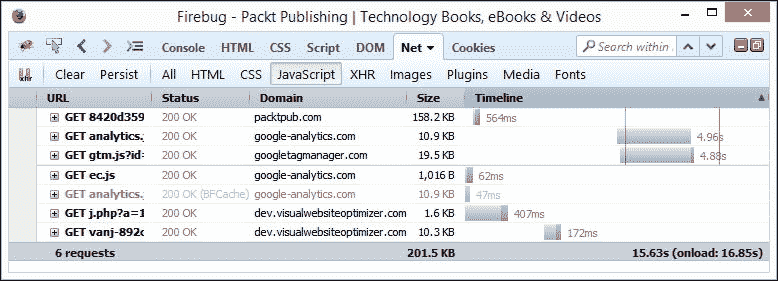

相比之下，以下是从 [`www.jquery.com`](http://www.jquery.com) 显示的结果的图像：

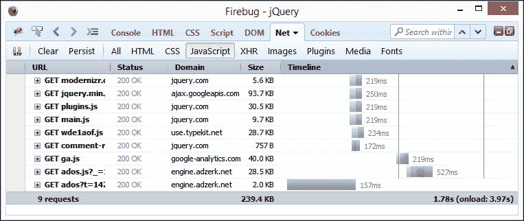

### 提示

在加载页面之前，清除缓存以避免结果出现偏差。

从 Firebug 返回的统计信息为我们提供了一个良好的开端，但要更好地了解瓶颈在哪里，我们需要对我们的代码进行分析。幸运的是，使用控制台来优化代码非常简单。让我们看看如何使用控制台来优化代码，使用我们在第十一章中创建的 `tooltipv2.html` 演示的副本为例，*Authoring Advanced Plugins*。为了这个小演示的目的，我们将从本地 Web 服务器（如 WAMP）运行它：

1.  从代码下载中提取一个 tooltip 演示文件夹的副本，并将其存储在 WAMP 的 `www` 文件夹中。

1.  在`tooltipv2.js`中，按照下面的示例修改前几行代码 - 这样可以添加调用以分析我们的代码：

    ```js
    $(document).ready(function() {
      console.profile();
      $('#img-list li a.tooltips').quicktip({
    ```

1.  我们需要告诉浏览器何时停止分析，所以请继续按照下面的代码进行修改：

    ```js
      })
      console.profileEnd();
    });
    ```

1.  在浏览器中加载`tooltipv2.html`，然后打开 Firebug。如果一切顺利，我们应该会看到类似以下屏幕截图的内容，在其中我们看到了简要的配置文件报告的前几行：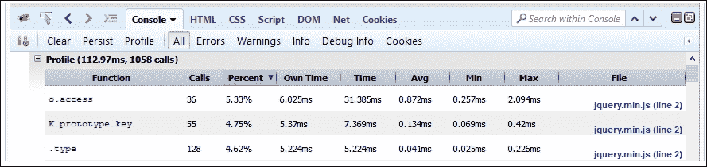

使用诸如 Firebug 这样的工具分析我们的网站可能会非常有启发性。想象一下，如果我们添加了更多的选择器会怎样，其中一些数字可能会比现在高得多。

### 提示

如果你只想关注花费的时间，与其使用`console .profile()`，不如改用`console.time()`和`console.timeEnd()`。

有许多工具可用于分析我们的网站。并非所有工具都专用于 jQuery，但它们仍然可以用于了解我们的脚本执行情况。以下是一些你可以尝试的示例，除了经典网站如[JSPerf.com](http://JSPerf.com) ([`www.jsperf.com`](http://www.jsperf.com))之外：

+   JSLitmus，来自[`code.google.com/p/jslitmus/`](http://code.google.com/p/jslitmus/)

+   BenchmarkJS，位于[`benchmarkjs.com/`](http://benchmarkjs.com/)，或者从 NPM 站点 [`www.npmjs.com/package/benchmark`](https://www.npmjs.com/package/benchmark)获取 - 一个如何使用它的示例可在[`gist.github.com/brianjlandau/245674`](https://gist.github.com/brianjlandau/245674)找到

+   在线服务，例如 SpeedCurve ([`www.speedcurve.com`](http://www.speedcurve.com)) 或 Calibreapp ([`calibreapp.com/`](https://calibreapp.com/))

+   FireQuery Reloaded，来自[`github.com/firebug/firequery/wiki`](https://github.com/firebug/firequery/wiki)，即将推出；请注意，写作时仍处于测试版阶段

+   DeviceTiming，来自[`github.com/etsy/DeviceTiming`](https://github.com/etsy/DeviceTiming)

绝对有大量选择可供使用 - 并非所有选择都适合每个人的需求；关键是要了解你正在测试什么，并学会如何解释它。

jQuery 核心团队成员 Dave Methin 写了一篇精彩的文章，概述了在没有正确解释来自诸如 JSPerf 使用结果的情况下盲目尝试优化代码的危险。开发者 Fionn Kelleher 在他指出，你的代码应该是一种艺术品 - 没有必要为了做而优化所有东西；更重要的是代码应该是可读的并且运行良好。

好吧 - 是时候继续了。我们已经介绍了监控的基础知识，但这是以手动方式为代价的。一个更好的选择是自动化。我们可以使用许多工具来实现这一点，与我们的老朋友 Grunt 一起，所以让我们深入了解一下，看看自动化监控涉及哪些内容。

# 自动化性能监控

举手之劳，作为一名开发者，有多少人使用过 YSlow？很好——相当多；不过，你有没有考虑过自动化这些检查呢？

没错！我们总是可以手动检查以了解性能瓶颈出现的位置；然而，更聪明的方法是使用我们的好朋友 Grunt 自动化这些检查。开发者 Andy Shora 创建了一个模块，专门用于此目的；我们可以从[`github.com/andyshora/grunt-yslow`](https://github.com/andyshora/grunt-yslow)获取它的源代码。让我们花点时间来让它运行起来，看看它是如何工作的：

1.  让我们开始创建一个用于存放文件的项目文件夹。为了本练习的目的，我假设它叫做`chapter13`（是的，我知道——非常原创）；如果你的名称不同，请更改。

1.  对于本练习，我们需要使用 NodeJS。我假设你已经从之前的练习中安装了它；如果没有，请访问[`www.nodejs.org`](http://www.nodejs.org)下载并安装适合你平台的版本。

1.  接下来，将以下内容添加到一个空文件中，并将其保存为我们项目文件夹内的`gruntfile.js`——你会注意到我们的测试将针对 jQuery 的网站进行（如下所示）：

    ```js
    'use strict';

    module.exports = function (grunt) {
      grunt.initConfig({
        yslow: {
          pages: {
            files: [{
              src: 'http://www.jquery.com',
            }],
            options: {
              thresholds: {
                weight: 500,
                speed: 5000,
                score: 90,
                requests: 15
              }
            }
          }
        }
      });

      grunt.loadNpmTasks('grunt-yslow');
      grunt.registerTask('default', ['yslow']);
    };
    ```

1.  在 NodeJS 命令提示符窗口中，输入以下命令以安装`grunt-yslow`包：

    ```js
    npm install –g grunt-yslow

    ```

1.  Node 将进行安装。完成后，在命令提示符处输入以下命令以执行测试：

    ```js
    grunt yslow

    ```

1.  如果一切正常，Node 将显示类似于以下截图的内容，其中显示了一个失败：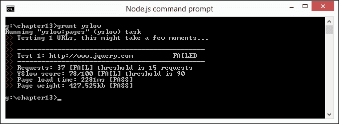

命令提示符窗口中显示的结果有点基本。为了更好地了解问题所在，我们可以安装 YSlow 插件。现在让我们来做这个：

### 提示

在撰写本文时，使用 Firefox 运行 YSlow 存在持续问题；请改用 Chrome 查看结果。如果你是 Mac 用户，那么你可以尝试从[`yslow.org/safari/`](http://yslow.org/safari/)获取 YSlow 插件。

1.  浏览至[`www.yslow.org`](http://www.yslow.org)，然后在**可用性**下点击 **Chrome**，然后点击 **添加** 将插件添加到 Chrome：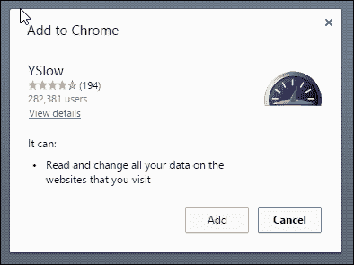

1.  安装完成后，我们可以在 YSlow 中运行报告。如果我们对主要的 jQuery 网站进行测试，那么我们将得到类似于以下截图中所见的结果：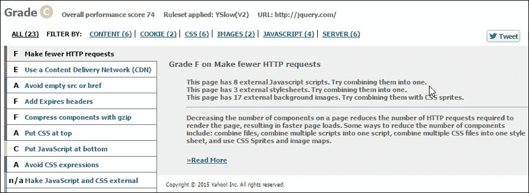

    如果我们浏览各个给定的等级，我们可以清楚地看到还有改进的空间。专注于脚本，检查将显示至少有五个脚本应移至页面底部，因为在这些脚本完成之前，浏览器无法开始任何其他下载。

1.  若要查看这将产生什么影响，请在 Firebug 中查看相同页面。单击 **Net** | **JavaScript**，然后刷新页面以查看从页面调用的所有脚本。将鼠标悬停在 jQuery 链接上 - 这证明了文件越大，加载时间越长：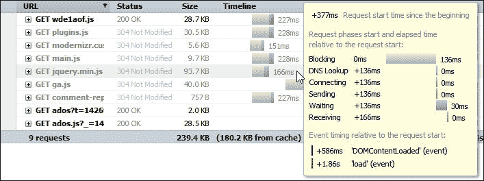

在前面的截图中，我们可以清楚地看到许多脚本，所有这些脚本都显示出长时间。在这种情况下，缩小那些尚未压缩的脚本将改善这些时间。

我们可以花时间尝试优化 jQuery，但这应该放在更大的背景下来考虑；如果我们的代码中仍然加载大型脚本，那么我们清楚地失去了优化 jQuery 的任何好处。

### 注意

值得注意的是，在 `gruntfile.js` 中的阈值已设置得比平常要高。在移动设备时代，确保页面内容可以快速下载非常重要；在这两个示例中，我们都会看到肯定有改进的空间！

让我们看看第二个示例，看看它与之前的有什么区别。在这种情况下，我们将使用 Packt Publishing 网站，网址为 [`www.packtpub.com`](http://www.packtpub.com)：

1.  让我们回到我们在本节开头创建的 `gruntfile.js` 文件。我们需要修改以下行：

    ```js
    files: [{
      src: 'http://www.packtpub.com',
    }],
    options: {
    ```

1.  保存文件，然后切换到 NodeJS 命令提示符，并输入以下命令：

    ```js
    grunt yslow

    ```

1.  如果一切顺利，Node 将显示我们对 `http://www.packtpub.com` 评估的结果，我们会看到另一个失败，如下面的截图所示：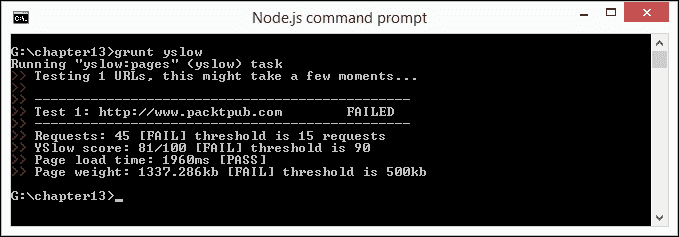

如果我们像之前那样使用 YSlow 来查看，那么我们可以看到提出了一些建议，这些建议将改善性能。对我们来说，关键的建议是将六个脚本压缩为更少的文件（并对其进行缩小）。参考以下截图：

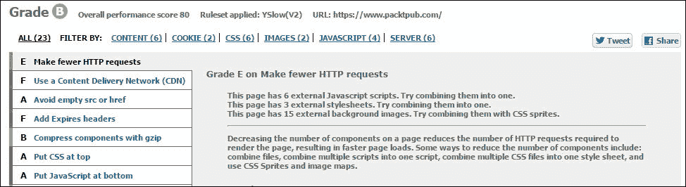

在之前的截图中，我们看到 YSlow 提到了类似的问题，尽管数字没有在 jQuery 网站上那么高。当我们检查由主页面调用的脚本的加载时间时，真正的问题就出现了：

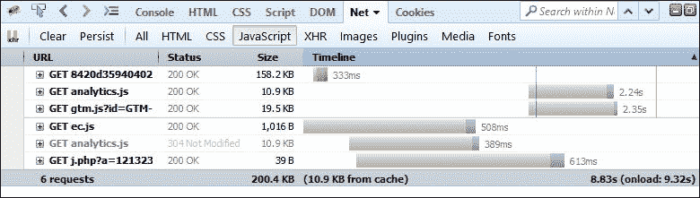

尽管我们发出的请求较少，这是好事，但只有一个脚本被缩小了。这将抵消缩小的好处。我们可以通过缩小代码在一定程度上纠正这个问题。我们将在本章稍后的部分看看如何自动化此过程，在 *使用 NodeJS 缩小代码* 中会详细介绍。

## 使用 Google PageSpeed 获取见解

到目前为止，我们已经看到了如何监控页面，但是在非常技术性的层面上。我们的检查集中在从我们的页面调用的脚本的大小和返回时间上。

更好的选择是运行一个测试，比如 Google PageSpeed，使用 Grunt 包，可以从[`github.com/jrcryer/grunt-pagespeed`](https://github.com/jrcryer/grunt-pagespeed)获取；我们可以在这个截图中看到结果：

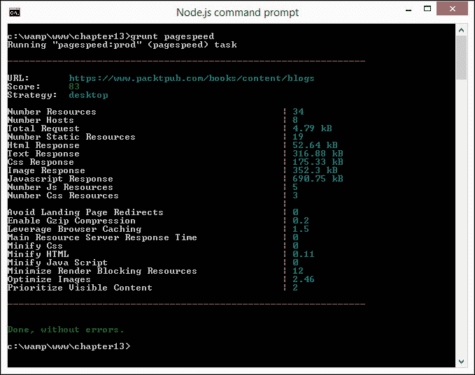

它不会查看页面上的特定脚本或元素，但会给出我认为更真实的页面性能视图。

### 注意

这个演示需要使用 Node 和 Grunt，所以在继续之前确保你已经安装了它们两个。

现在让我们看看它在 Packt Publishing 网站上的实际应用：

1.  我们将首先启动一个 NodeJS 命令提示符，然后切换到我们的项目文件夹区域。

1.  输入以下内容以安装`grunt-pagespeed`包：

    ```js
    npm install grunt-pagespeed --save-dev

    ```

1.  在一个新文件中，添加以下内容，并将其保存为`gruntfile.js`，保存在相同的文件夹中 - 在代码下载中有一个此文件的副本；提取并将`gruntfile-pagespeed.js`重命名为`gruntfile.js`：

    ```js
    Gruntfile.js:
    'use strict';

    module.exports = function (grunt) {
      grunt.initConfig({
        pagespeed: {
          options: {
            nokey: true,
            url: "https://www.packtpub.com"
          },
          prod: {
            options: {
              url: "https://www.packtpub.com/books/content/blogs",
              locale: "en_GB",
              strategy: "desktop",
              threshold: 80
            }
          }
        }
      });

      grunt.loadNpmTasks('grunt-pagespeed');
      grunt.registerTask('default', 'pagespeed');
    };
    ```

1.  在 NodeJS 命令提示符下，输入以下命令以生成报告：

    ```js
    grunt-pagespeed

    ```

1.  如果一切正常，我们应该会看到一个类似于我们练习开始时显示的报告。

`grunt-pagespeed`插件只是使用 Grunt 运行的几个示例中的一个。还有其他可用的基准任务，我们可以集成到持续监视我们网站的过程中。这些包括以下内容：

+   `grunt-topcoat-telemetry`: 从遥测中获取流畅性、加载时间和其他统计数据作为 CI 的一部分。这可以帮助您设置一个性能基准仪表板，类似于 Topcoat 使用的仪表板（[`bench.topcoat.io`](http://bench.topcoat.io)）。

+   `grunt-wpt`: 用于测量 WebPageTest 分数的 Grunt 插件。

+   `grunt-phantomas`: 请求的响应时间，响应的响应时间，首个`image`/`CSS`/`JS`的时间，在`DOM Ready`上等等。

### 注意

如果你更喜欢使用 Gulp，那么之前的 Grunt 插件可以使用`gulp-grunt`来运行，可以从[`npmjs.org/package/gulp-grunt`](https://npmjs.org/package/gulp-grunt)获取。

现在我们知道了我们的基准，是时候探索如何优化我们的代码了；大多数开发者要么手动查看代码，要么可能使用网站如[www.jshint.com](http://www.jshint.com)（甚至[jslint.com](http://jslint.com)）。这种方法没有错。但是，这不是最好的方法，因为这是对我们时间的低效使用，有可能错过改进我们代码的机会。

对代码进行代码检查的更聪明的方法是自动化这个过程 - 虽然它可能不会警告你需要进行重大更改，但它至少会确保我们的代码不会由于错误而无法优化。当然，它还会为我们提供一个坚实的基础，以便我们可以进一步进行优化。我们将在本章后面更多地介绍这个。

是时候进行演示了！让我们花一点时间设置使用 NodeJS 进行自动检查。

# 自动对 jQuery 代码进行代码检查

对代码进行清理，或者检查它是否存在错误，是 jQuery 开发的一个重要部分。它不仅有助于消除错误，还有助于识别脚本中未使用的代码。

不要忘记 - 优化不仅仅是调整选择器，甚至用 CSS 等效替换 jQuery 代码（正如我们在第六章中看到的那样，*用 jQuery 进行动画*）。我们首先需要确保有一个坚实的基础来工作 - 我们始终可以手动完成这个过程，但更明智的选择是使用像 Grunt 这样的任务运行器来自动化该过程。

让我们花点时间看看这是如何运作的 - 请注意，这假设你之前的练习中仍然安装了 NodeJS。这一次，我们将用它来安装`grunt-contrib-jshint`包，可从[`github.com/gruntjs/grunt-contrib-jshint`](https://github.com/gruntjs/grunt-contrib-jshint)获取：

1.  设置自动检查非常容易。首先，我们需要下载并安装`grunt-contrib-jshint`。打开 NodeJS 命令提示符，并在项目文件夹区域内输入以下内容：

    ```js
    npm install grunt-contrib-watch

    ```

1.  安装完成后，继续在新文件中添加以下内容，并将其保存为`gruntfile.js`，保存在项目文件夹中：

    ```js
    'use strict';

    module.exports = function (grunt) {
      // load jshint plugin
      grunt.loadNpmTasks('grunt-contrib-jshint');

      grunt.initConfig({
        jshint: {
          options: { jshintrc: '.jshintrc' },
          all: [ 'js/script.js' ]
        }
      });

      grunt.loadNpmTasks('grunt-contrib-jshint');
      grunt.registerTask('default', ['jshint']);
    };
    ```

1.  从代码下载中，我们需要提取我们的目标 JavaScript 文件。继续并在我们的项目区域的`js`子文件夹中保存`script.js`的副本。

1.  回到 NodeJS 命令提示符，并输入以下命令，对我们的代码运行`jshint`检查：

    ```js
    grunt jshint

    ```

1.  如果一切顺利，我们应该会看到它弹出三个需要修复的错误，如下一张截图所示：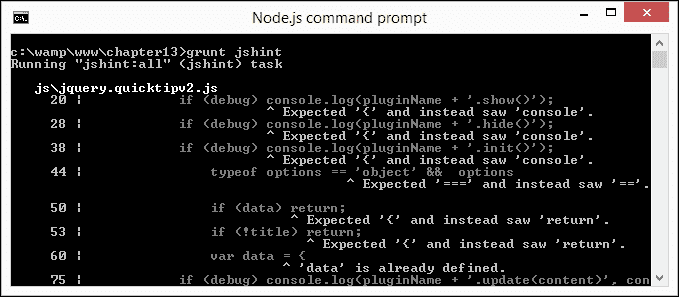

### 注意

你们中注意力集中的人可能会注意到，这是我们在第十一章中创建的快速提示插件的代码，*编写高级插件*。

我们可以更进一步！我们可以让 Grunt 在代码更新时自动运行检查，而不是手动运行检查。为实现这一点，我们需要安装`grunt-contrib-watch`包，并相应地更改 Grunt 文件。现在就来做吧：

1.  打开`gruntfile.js`的副本，然后在`grunt.initConfig`对象的结束`});`之前立即添加以下代码：

    ```js
        },
        watch: {
          scripts: {
            files: ['js/script.js'],
            tasks: ['jshint'],
            options: { spawn: false }
          }
        }
    ```

1.  在文件末尾添加以下行，以注册额外的任务：

    ```js
    grunt.loadNpmTasks('grunt-contrib-jshint');
    ```

1.  我们需要修改`registerTask`调用以使 Grunt 意识到我们的新任务。继续按照下面的修改：

    ```js
    grunt.registerTask('default', ['watch', 'hint']);
    ```

1.  切换回命令提示符窗口，然后在命令行中输入以下内容：

    ```js
    grunt watch

    ```

1.  切换回`script.js`，并在代码中的某处进行更改。如果一切顺利，Node 将启动并重新检查我们的代码。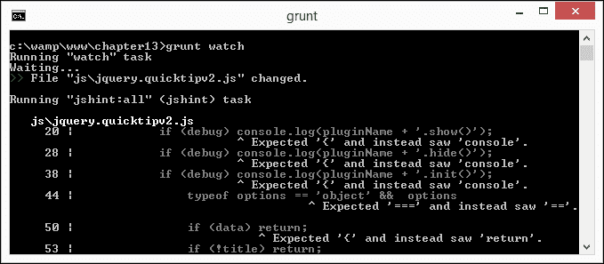

运行代码清楚地显示我们有一些问题需要解决。在这个阶段，我们会花时间来解决它们。一旦更改完成，Node 将启动并显示更新后的错误列表（或通过！）。

假设我们的代码适合用途，我们可以真正开始优化它。一个简单的方法是压缩代码，以帮助保持文件大小的低水平。当然，我们可以手动压缩它，但那是老掉牙的做法；是时候再次挖掘 Node 了！

# 使用 NodeJS 压缩代码

开发者工作流程中的关键部分应该是一个用于压缩站点中使用的脚本的过程。这样做有助于减少页面下载内容的大小。

当然，我们也可以手动执行此操作，但这是一个耗时的过程，几乎没有什么好处；一个更聪明的方法是让 NodeJS 为我们处理这个问题。这样做的美妙之处在于，我们可以配置 Node 以运行一个诸如`grunt-contrib-watch`之类的包；我们所做的任何更改都将自动被压缩。甚至可能会有一些情况，我们决定不生成一个压缩文件；如果我们不确定我们正在编写的代码是否会起作用。在这种时候，我们可以从我们的文本编辑器中启动 Grunt，如果我们正在使用 Sublime Text 等包。

### 提示

如果你想在 Sublime Text 中实现这种级别的控制，请查看`sublime-grunt`，可以从[`github.com/tvooo/sublime-grunt`](https://github.com/tvooo/sublime-grunt)获取。

好的，让我们开始设置我们的压缩过程。为此，我们将使用著名的包，UglifyJS（来自[`github.com/mishoo/UglifyJS2`](https://github.com/mishoo/UglifyJS2)），并让 Node 自动检查：

1.  对于这个演示，我们将使用 NodeJS，所以如果你还没有这样做，可以从[`www.nodejs.org`](http://www.nodejs.org)下载适合你平台的相应版本，接受所有默认值。

1.  对于这个演示，我们需要安装两个包。UglifyJS 提供了对源映射的支持，所以我们首先需要安装它。从 NodeJS 命令提示符，切换到项目文件夹，输入以下命令，然后按*Enter*：

    ```js
    npm install source-map

    ```

1.  接下来，输入以下命令，然后按*Enter*：

    ```js
    npm install uglify-js

    ```

1.  安装完成后，我们可以运行 UglifyJS。在命令提示符处，小心输入以下命令：

    ```js
    uglifyjs js/jquery.quicktipv2.js --output js/jquery.quicktipv2.min.js --compress dead_code=true,conditionals=true,booleans=true,unused=true,if_return=true,join_vars=true,drop_console=true --mangle --source-map js/jquery.quicktipv2.map

    ```

1.  如果一切正常，Node 将按照这个下一个屏幕截图所示的过程进行：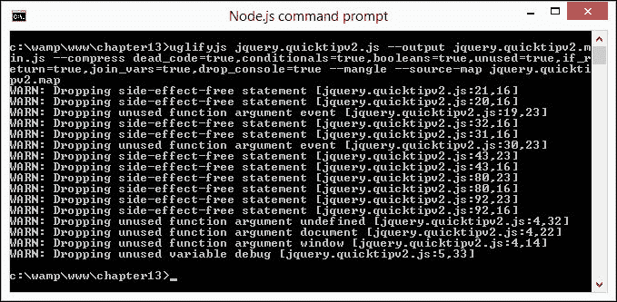

1.  最后，在我们的项目区域中应该有三个文件，如下面的屏幕截图所示：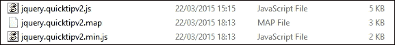

我们现在可以在生产环境中自由使用我们代码的压缩版本。虽然在这个例子中我们没有节省太多，但你可以想象如果我们扩大这些数字来覆盖更大的脚本时的结果！

## 探索一些值得注意的点

压缩脚本的过程应该成为任何开发人员工作流程的一部分。NodeJS 使添加它变得容易，尽管有一些提示可以帮助使压缩文件更容易和更高效：

+   UglifyJS 的默认配置将只生成显示很少压缩的文件。要获得更好的结果，需要仔细阅读所有可用的选项，了解哪个选项可能适合您的需求，并且可能会产生最佳结果。

+   我们在压缩过程中包含了源映射选项。我们可以使用它来将出现的问题与原始源代码关联起来。启用源映射支持在不同的浏览器中会有所不同（对于支持它的浏览器）；例如，在 Firefox 中，按下 *F12* 键显示开发者工具栏，然后点击齿轮图标并选择 **显示原始源代码**：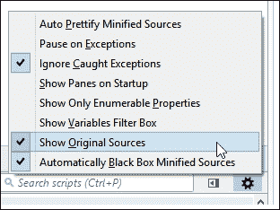

+   值得检查一下，您的项目中是否已经存在所使用文件的最小化版本。例如，您的项目是否使用了提供了最小化版本的插件？如果是这样的话，我们所需要做的就是将它们连接到一个文件中；再次对它们进行最小化可能会导致问题，并且破坏文件中的功能。

对文件进行最小化并不是一门黑魔法，但也不是一门精确的科学。在压缩文件之前，很难知道在文件大小方面会得到多大的改进。你可能会得到一些意想不到的结果。现在就值得探索一个这样的例子。

## 通过一个真实的示例来理解

在为这本书研究材料时，我尝试将 Packt Publishing 网站上使用的 Drupal 文件之一进行最小化，作为一个测试。原始文件大小为 590 KB；使用与我们演示中相同配置选项的压缩版本，生成了一个文件大小为 492 KB 的文件。

这告诉我们什么？嗯，有几点需要注意：

+   保持合理的期望是很重要的。压缩文件是我们使用的一种有用的技巧，但它并不总能产生我们需要的结果。

+   我们使用了 UglifyJS（版本 2）。这个工具非常易于使用，但在原始压缩能力方面存在一些折衷。在某些情况下，它可能不适合我们的需求，但这并不意味着它有缺陷。目前有几十种压缩工具可供选择；我们只需选择另一种替代方案即可！

+   要真正实现显著的大小减小，可能需要使用`gzip`来压缩文件，并配置服务器以动态解压缩。这将增加处理页面的开销，需要将其纳入我们的优化工作中。

相反，逐个检查每个脚本以确定哪些正在使用、哪些可以安全地删除可能是更好的选择。当然，我们可以手动执行此操作，但是嘿——您现在已经认识我了：为什么自己做当您可以将其推迟到其他事情去做呢（错误引用一个短语）？进入 Node！让我们来看看`unusedjs`，它可以帮助我们了解我们的脚本中有多少额外的代码。

### 提示

我们已经集中在压缩一个文件上，但是通过使用通配符条目，自动压缩任何文件的配置变得非常简单。

# 找出未使用的 JavaScript

到目前为止，我们已经看到了如何轻松地压缩代码而不需要任何努力——但是如果仅仅压缩还不够，我们需要删除多余的代码怎么办呢？

好吧，我们可以手动检查代码——这没什么错。这是一种完全可以接受的工作方式，但关键是这是一个手动过程，需要大量时间和精力——更不用说频繁尝试查找可以删除的代码而不会破坏其他代码了！

更明智的做法是设置 Node 为我们解决哪些代码正在使用以及哪些可以安全丢弃。网页性能专家 Gaël Métais 创建了 unused JS 来帮助解决此问题。它与 Node 一起工作，并且可以在 [`www.npmjs.com/package/unusedjs`](https://www.npmjs.com/package/unusedjs) 上获得。这是一个正在进行中的工作，但只要它被用作指南，它就可以为我们提供一个有用的基础，让我们知道在哪里可以进行更改。

让我们花点时间深入了解它是如何工作的。对于此演示，我们将使用我们在 第十二章 中创建的 Tooltip 插件演示，*使用 jQuery 与 Node-WebKit 项目*。


在使用此功能时，有几件事情需要记住：

+   在撰写时，此插件的状态仍然处于非常初期阶段——使用 alpha 版软件的常见风险仍然存在！它并不完美；它应该只作为指南使用，并且需自担风险。它不能很好地处理长脚本（比如 jQuery UI 库），但可以处理大约 2,500-3000 行。

+   您需要清除浏览历史记录，因此不要在对浏览历史记录至关重要的浏览器中使用它。

+   该插件使用 Node。如果您没有安装它，请转到 Node 网站 [`www.nodejs.org`](http://www.nodejs.org) 下载并安装适合您平台的版本。

+   我们还需要使用本地 Web 服务器，如 WAMP（用于 PC - [`www.wampserver.com/de`](http://www.wampserver.com/de) 或 [`www.wampserver.com/en/`](http://www.wampserver.com/en/)），或 MAMP（用于 Mac - [`www.mamp.info`](http://www.mamp.info)）进行演示。确保您已经设置和配置了某些内容以供使用。

假设我们已经安装并配置了 Node 和本地 Web 服务器供使用，让我们从设置 `unusedjs` 脚本开始。我们将使用 Firefox 运行演示，如果你更喜欢使用其他浏览器，请相应调整。让我们开始：

1.  我们需要从某个地方开始。第一步是安装 `unusedjs.`，在 NodeJS 提示符下运行以下命令：

    ```js
    npm install unusedjs -g

    ```

1.  通过在控制台中输入以下内容启动服务器：

    ```js
    unused-js-proxy

    ```

1.  点击三条杠图标，然后点击 **选项**，以显示选项对话框。确保以下条目设置如下图所示：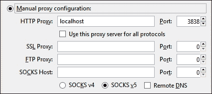

1.  确保 **No Proxy** 字段为空。然后点击 **OK** 确认设置。

1.  接下来，我们需要清除浏览器会话中的缓存。这一点至关重要，如果不清除缓存，我们可能会得到扭曲的结果。

1.  在这个阶段，从随书代码下载中打开 `tooltipv2.html` 的副本，并等待页面完全加载。

1.  按下 *F12* 显示 Firefox 的控制台，并在提示符处输入以下内容：

    ```js
    _unusedjs.report()

    ```

1.  如果一切正常，当查看控制台结果时，我们应该看到类似以下截图的内容：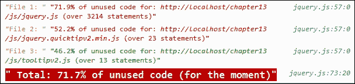

尝试在控制台中输入 `_unusedjs.file(2)`。这个函数会显示代码的副本，并用红色突出显示未使用的部分，如下截图所示：

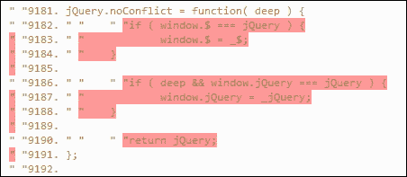

现在我们可以集中精力在突出显示的部分上，从我们自己的脚本中删除冗余代码。当然，这将取决于我们自己的要求，以及冗余代码是否将作为即将到来的工作的一部分而被使用。

### 提示

毫无疑问，我们不能简单地从诸如 jQuery 这样的库中删除代码。我们需要构建 jQuery 的自定义版本——我们在第一章中详细讨论了这一点，*安装 jQuery*。

现在我们已经建立了基准，并确定了我们的脚本中是否包含未使用的代码，现在是时候来优化它了。让我们看看我们的代码中可以使用的一些技巧和窍门；作为将最佳实践嵌入到我们的正常开发工作流程的基础。

# 实施最佳实践

想象一下情景——我们已经编写了我们的代码，并检查了以确保所有文件在可能的情况下都被最小化，而且我们没有包含大量冗余代码。此时，有些人可能会认为我们已经准备好发布代码，并将我们的努力提供给公众使用，对吗？

错误！在这个阶段发布代码而不检查我们的代码的速度和效率，是不负责任的。谷歌的联合创始人兼首席执行官拉里·佩奇在他说到这一点时表达得很完美：

|   | *"作为产品经理，你应该知道速度是产品功能的第一要素。"* |   |
| --- | --- | --- |
|   | --*Google 联合创始人兼首席执行官拉里·佩奇* |

速度绝对是王道！我们已经在满足 Larry 的评论方面有了一些进展，但我们可以做得更多。到目前为止，我们已经看过了将我们的代码最小化和生成自定义版本的 jQuery。我们可以通过评估我们编写的代码来进一步确保它被有效执行。每个人的需求自然会有所不同，所以我们需要使用一些技巧的组合来确保有效的执行。让我们看看其中的一些：

1.  毫无疑问，我们应该只在绝对必要时针对 DOM 执行任务。对 DOM 的每次命中可能对资源是昂贵的，使您的应用程序变慢。例如，考虑以下代码：

    ```js
    <script src="img/jquery-2.1.3.min.js"></script>
    <script type="text/javascript">
      $("document").ready(function() {
        console.log("READY EVENT (B) => " + (newDate().
    getTime() - performance.timing.navigationStart) + 'ms');
      });
      console.log("END OF HEAD TAG (A) => " + (new Date()
    .getTime() - performance.timing.navigationStart) + 'ms');
    </script>
    ```

1.  在空的`<body>`标签上，加载 jQuery 库并使其可用所花费的时间相对较少；一旦我们在页面上添加元素，这个值就会增加。为了看到差异，我使用了这段代码运行了一个小演示。在下面的图像中，加载空的`<body>`标签上的 jQuery 的结果在左侧，而在之前演示中使用`tooltipv2.html`的结果在右侧：

1.  如果使用的是 jQuery 的 1.11 版本，那么由于包含了支持旧版浏览器的代码，其效果甚至更加明显。要亲自看到效果，请尝试运行`test loading jquery.html`，然后切换到您的浏览器的开发者工具栏中的**Console**来查看测试结果。将 jQuery 版本更改为`1.11`以真正看到差异！

    为了保持性能，DOM 元素应该被缓存在变量中，然后在被操作后才添加：

    ```js
    // append() is called 100 times
    for (var i = 0; i < 100; i++) {
      $("#list").append(i + ", ");
    };

    // append() is called once
    var html = "";
    for (var i = 0; i < 100; i++) {
      html += i + ", ";
    }
    $("#list").append(html);
    ```

    ### 提示

    您可以通过在 JSPerf 上运行测试来查看结果的实际情况，网址为[`jsperf.com/append-on-loop/2`](http://jsperf.com/append-on-loop/2)。

1.  另一方面，如果我们需要修改与单个元素相关的几个属性，则使用对象会使操作变得更容易，但同时也会撤销我们的所有努力！

1.  检查选择器非常重要。jQuery 是从右向左读取它们的。尽可能使用 ID，因为它们比标准类选择器更快。还要确保您没有使用诸如`.myClass1 #container`之类的规则，其中 ID 跟在类选择器后面。这是低效的 - 我们失去了指定只能是单个值的好处，因为不断地迭代代码以确保我们已经涵盖了我们在代码中使用的类的所有实例。

    毫无疑问，所使用的任何选择器都应该被缓存。当引用多级深度的选择器时，最佳实践规定我们应该在左侧尽可能具体（即`.data`），在右侧尽可能不太具体：

    ```js
    // Unoptimized:
    $( ".data .gonzalez" );

    // Optimized:
    $( "div.data td.gonzalez" );
    ```

1.  最重要的是，避免使用`*`或类型等形式的通用选择器，例如`:radio`，除非您使您的选择器引用尽可能明确 - 这两者都非常慢！

1.  尽管这本书是关于 jQuery 的，但在性能不够时，可能需要使用经典 JavaScript 方法。例如，`for`循环比 jQuery 的`.each()`方法更有效，使用`querySelector` API 比使用 jQuery 选择器更好。

1.  如果您正在加载多个脚本，请考虑在页面末尾加载它们，一旦在页面上方（或在页面向下滚动之前显示的内容）加载了所有内容。jQuery 应始终用于逐步增强页面，而不是运行一段代码，如果禁用 jQuery，则会破坏页面。感知力可能起很大作用 - 您的页面可能没有做很多事情，但仍然被感知为慢。重新排序脚本（和内容）可以帮助改变这种感知。

1.  有些开发者可能仍然使用 jQuery 的 AJAX 对象来处理异步 HTTP 请求。虽然它能够运行，但不是处理此类请求的最干净的方式：

    ```js
    $.ajax({
      url: "/firstAction",
      success: function() {
        //whatever
        secondAction();
        return false;
      },
      error: error()
    });

    var secondAction = function() {
      $.ajax({
        url: "/secondAction",
        success: function() {
          // whatever
        },
        error: error()
      });
    };
    ```

    更明智的选择是使用 jQuery `promises()`，在那里我们可以将代码延迟到更容易阅读和调试的函数中。代码存储在何处并不重要；`promises()`将允许我们在代码的适当位置调用它：

    ```js
    $.when($.ajax( { url: "/firstAction" } ))

    // do second thing
    .then(
      // success callback
      function( data, textStatus, jqXHR ) {},
      // fail callback
      function(jqXHR, textStatus, errorThrown) {}
    )

    // do last thing
    .then(function() {});
    ```

1.  如果我们正在调用整个脚本，则探索使用条件加载器是有意义的，比如 RequireJS（使用纯 JavaScript），或`grunt-requirejs`（如果我们更喜欢使用 Node）。

    ### 提示

    毫无疑问，懒加载我们的代码的同样原则也适用于页面上的元素，例如图像；`jquery-lazy`是一个完美的 Node 模块示例，可以帮助实现这一点。它可在[`www.npmjs.com/package/jquery-lazy`](https://www.npmjs.com/package/jquery-lazy)找到。

1.  先前提到使用`promises()`的提示展示了一个完美的例子，说明我们仍然可以做出改进。有些开发者赞美代码链的优点，这样做似乎可以缩短代码。然而，这使得代码更难阅读，因此也更难调试；由此产生的代码混乱将导致错误和浪费时间，最终需要部分或完全重构代码。先前提示中的例子还突显了需要确保使用良好的命名约定，因为当链式命令时，我们无法具体指定回调函数的名称。

1.  这个下一个提示可能看起来有点矛盾，因为我们在本书中始终在谈论 jQuery，但是要使用更少的 JavaScript - 可以转移到 HTML 或 CSS 的任何内容都会对我们的性能产生积极影响。虽然使用 jQuery 很有趣，但它是基于 JavaScript 的，而 JavaScript 是 Web 堆栈中最脆弱的层，会影响性能。这的经典例子是创建动画。查看[`css-tricks.com/myth-busting-css-animations-vs-javascript/`](https://css-tricks.com/myth-busting-css-animations-vs-javascript/)，了解为什么在不必要时使用 jQuery（或 JavaScript）来驱动我们的动画是愚蠢的。

1.  考虑削减芥末，或者为能力较弱的浏览器放弃功能。当在能力较弱或移动浏览器上使用基于 jQuery 的站点时，这将带来更好的体验。在一些具有许多 polyfill 运行以支持功能（例如 CSS3 样式）的站点上，放弃这些 polyfill 的影响可能很大！

1.  要了解加载和解析 jQuery 所需时间的差异，请查看开发人员 Tim Kadlec 在[`timkadlec.com/2014/09/js-parse-and-execution-time/`](http://timkadlec.com/2014/09/js-parse-and-execution-time/)进行的测试。

我们可以在我们的代码中使用许多更多的技巧和诀窍。有关更多灵感来源，请参考以下链接作为起点：

+   [`www.slideshare.net/MatthewLancaster/automated-perf-optimization-jquery-conference`](http://www.slideshare.net/MatthewLancaster/automated-perf-optimization-jquery-conference)：由开发人员 Matthew Lancaster 于 2014 年在 jQuery 会议上演讲，这涵盖了一些有用的技巧；他特别强调我们可以在不费吹灰之力的情况下取得一些严重的收益，尽管我们应该始终警惕过度优化我们的代码！

+   [`crowdfavorite.com/blog/2014/07/javascript-profiling-and-optimization/`](http://crowdfavorite.com/blog/2014/07/javascript-profiling-and-optimization/)：本文介绍了作者用来帮助优化性能的过程；这给出了所涉及的味道。

+   [`chrisbailey.blogs.ilrt.org/2013/08/30/improving-jquery-performance-on-element-heavy-pages/`](http://chrisbailey.blogs.ilrt.org/2013/08/30/improving-jquery-performance-on-element-heavy-pages/)：这篇文章有点老，但仍然包含了一些优化我们代码的有用指针。

+   [`joeydehnert.com/2014/04/06/9-development-practices-that-helped-me-write-more-manageable-and-efficient-javascript-and-jquery/`](http://joeydehnert.com/2014/04/06/9-development-practices-that-helped-me-write-more-manageable-and-efficient-javascript-and-jquery/)：这里包含了一些非常有用的优化 jQuery 的技巧，有些与我们在本章中介绍的类似。

通过所有这些的关键点是，性能优化永远不应被视为一次性的活动；我们必须将其视为代码生命周期中的持续过程。为了帮助实现这一点，我们可以设计一个策略来掌握优化。让我们以这些提示作为我们需要考虑的策略的基础。

## 设计一个性能策略

到目前为止，我们集中在可以用来改善性能的技巧和窍门上。采取一种反应式的方法是可行的，但需要额外的时间来投入，而我们可以在编写代码时就将这些技巧和窍门融入其中。

考虑到这一点，制定一项策略来鼓励这种思维方式将是有益的。让我们来看看可以形成这样一项策略基础的几个关键点：

+   始终使用最新版本的 jQuery - 您将从代码改进、速度和已知问题的错误修复中受益。

+   在可能的情况下，合并和压缩脚本，以减少带宽使用。

+   使用原生函数而不是 jQuery 的等效函数 - 一个完美的例子是使用`for()`而不是`.each()`。

+   使用 ID 而不是类 - ID 只能分配一次，而 jQuery 将多次命中 DOM 以查找每个类，即使只有一个实例存在也是如此。

+   给选择器一个上下文。参考以下代码，简单指定一个类：

    ```js
    $('.class').css ('color' '#123456');
    ```

    相反，更明智的做法是使用上下文化的选择器，形式为`$(expression, context)`，从而产生：

    ```js
    $('.class', '#class-container').css ('color', '#123456');
    ```

    第二个选项运行速度更快，因为它只需要遍历#class-container 元素而不是整个 DOM。

+   在可能的情况下，缓存值，以避免直接操作 DOM。

+   使用`join()`而不是`concat()`来连接较长的字符串。

+   在使用`#`作为源链接的链接的点击事件上始终添加`return false`，或者使用`e.preventDefault()` - 如果不添加，将会跳转到页面顶部，在长页面上会很烦人。

+   在页面重量、请求和渲染时间方面为自己设定预算 - 请参阅[`timkadlec.com/2014/11/performance-budget-metrics/`](http://timkadlec.com/2014/11/performance-budget-metrics/)。这给优化提供了目的，并鼓励更长期的性能监控精神。

+   使用诸如 SpeedCurve 之类的性能监控服务来帮助监视您的网站，并在出现问题时提醒您。

+   在办公室展示性能 - 这有助于鼓励团队精神。如果团队中的某人提出的更改对性能产生了积极影响，则表彰他们并让其余团队成员知晓；这将有助于激励团队之间的健康竞争意识。

+   但是，如果一个改变破坏了性能，那么不要惩罚罪犯；这将使他们不愿参与。相反，试着培养解决问题的文化，然后学会如何防止它再次发生。如何运行像 PhantomJS 这样的测试来帮助检查和减少问题出现的风险呢？

+   自动化一切。有服务可以压缩图像或缩小脚本，但投入时间开发类似的内部流程可以节省时间和金钱。关键在于，手动执行诸如优化图像或压缩脚本的任务是没有意义的；你需要自己找出最适合你需求的方法。

+   是否决定使用 Grunt 或 Gulp 是一个关键考虑因素——它们是否提供了有用的附加功能，还是只是一个可以通过谨慎使用 NPM 来减少或消除的额外负担？开发者 Keith Cirkel 在[`blog.keithcirkel.co.uk/why-we-should-stop-using-grunt/`](http://blog.keithcirkel.co.uk/why-we-should-stop-using-grunt/)提出了一个有力的理由，认为只使用 NPM 就足够了；这是一个发人深省的观点！

+   花时间影响你的同事和那些更高层的人——他们通常可能不知道你在某个问题上可能遇到的困难，但实际上可能有能力帮助你解决问题！

+   花时间学习。我们往往花太多时间在客户工作上，而没有为自我发展留出足够的时间；花一些时间来纠正这一点。如果这意味着需要调整价格来弥补由于未花时间在客户工作上而导致的收入损失，那么这是需要考虑的事情。这一切都关乎于建立工作/娱乐/学习的平衡，这将在长期内得到回报。

这里有很多值得深思的东西——并不是每个技巧都适用。在某些情况下，一个或多个技巧的融合会产生你需要的结果。然而，花费时间在这上面是值得的，因为长期来看会得到丰厚的回报，并且有望在你的团队现有的工作文化中获得融入。

让我们继续。我们快要完成本章了，但在我们结束之前，让我们来看看如何为 jQuery 进行测试，我想问一个简单的问题：我们真的需要使用 jQuery 吗，如果需要，为什么？

# 关于使用 jQuery

在这一点上，如果你认为我完全失去了理智，那是可以理解的，特别是当我们刚刚在考虑优化代码的方法时，却建议完全将其从我们的代码中删除。你可能会问，为什么我会考虑放弃 jQuery 呢？

嗯，有几个充分的理由。任何人都可以编写 jQuery 代码，但聪明的开发者应该始终考虑他们是否应该使用 jQuery 来解决问题：

+   jQuery 是一个抽象库，它需要 JavaScript，并且是在开发当时的浏览器可能是一个真正的挑战的时候构建的。需要抽象掉浏览器的不一致性正在变得越来越少。重要的是要记住，我们应该使用 jQuery 来逐步增强普通的 JavaScript；jQuery 首先是为了让编写 JavaScript 更容易而设计的，并不是一种独立的语言。

+   浏览器在功能上比以往任何时候都更接近。随着 Firefox 放弃了大部分厂商前缀，库几乎不再需要消除不一致性。如果某个功能在 IE10 或最新版本的 Firefox 中可行，那么很可能在 Google Chrome 或 Opera 中也适用。当然，会有一些差异，但这实际上仅适用于一些尚未被广泛使用的更为深奥的 CSS3 样式。那么 - 如果浏览器如此接近，为什么还要使用 jQuery？

+   使用纯 JavaScript 总是比使用 jQuery 快，无论我们如何努力 - 这还有一个额外的好处，即 JavaScript 代码将产生比等效 JavaScript 代码（不包括库本身）更小的文件。如果我们只使用少量 JavaScript 代码，那么为什么要引用一个完整的库呢？当然，我们总是可以尝试构建 jQuery 的自定义版本，就像我们在 第一章 中看到的那样，*安装 jQuery* - 但无论我们如何尝试修剪库中的不必要代码，我们仍然会引入比我们需要的更多的代码！当然，我们当然可以使用 `gzip` 进一步压缩 jQuery 代码，但它仍然会比纯 JavaScript 多。

+   编写 jQuery 实在太容易了 - 它拥有庞大的社区，学习曲线很低。这为编写大量低质量的代码创造了完美的条件，我们只使用了 jQuery 中提供的一小部分功能。从长远来看，学习如何有效地使用纯 JavaScript，然后使用 jQuery 为其提供象征性的锦上添花将会更好。

但这里的关键点是我们不应完全放弃 jQuery - 现在是时候真正考虑是否需要使用它了。

当然 - 如果我们使用了大量在纯 JavaScript 中要么很难实现，要么根本无法实现的功能，那么就必须使用 jQuery。然而，我给你留下一个挑战，用拍照作为类比。像平常一样构图。然后停下来，闭上眼睛十秒钟，深吸几口气。现在问问自己，你是否还准备拍同样的照片。很可能你会改变主意。同样的道理也适用于使用 jQuery。如果你停下来认真考虑了自己的代码，我想你们中有多少人仍然决定继续使用它呢？

就个人而言，我认为 jQuery 仍将发挥作用，但我们已经到了一个不应该盲目或出于习惯使用它的时候，而是要在何时何地使用它代替纯 JavaScript 做出有意识的决定的时候。

要了解如何从 jQuery 切换到 JavaScript 来满足简单的需求，请参阅 Todd Motto 的文章 [`toddmotto.com/is-it-time-to-drop-jquery-essentials-to-learning-javascript-from-a-jquery-background/`](http://toddmotto.com/is-it-time-to-drop-jquery-essentials-to-learning-javascript-from-a-jquery-background/)。

# 摘要

维护高性能的网站是开发的关键部分。除了优化代码之外，还有更多内容，让我们花点时间回顾一下本章学到的东西。

我们首先了解了为何理解性能的重要性，并通过各种监视性能的方式，从在 Firebug 中查看统计数据到使用 Grunt 自动化我们的检查，进行了深入研究。

然后，我们继续了解如何自动地对我们的代码进行代码检查，作为优化代码的众多方式之一，然后对其进行缩小以供生产使用。然后，我们深入研究了如何判断我们的代码是否包含任何未使用的代码，这些代码可以安全地删除，以简化我们的代码。

然后，我们通过实施最佳实践来结束本章。这里的重点不是提供具体的例子，而是分享一些可应用于任何网站的技巧和窍门。然后，我们以此为基础设计了一种策略，帮助维护高性能的网站。

我们即将完成精通 jQuery 的旅程，但在结束之前，我们需要快速看一下如何测试我们的代码。开发者可能会使用 QUnit，因为它是 jQuery 家族项目的一部分；我们将在下一章中进一步探讨如何更深入地使用它。
