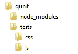
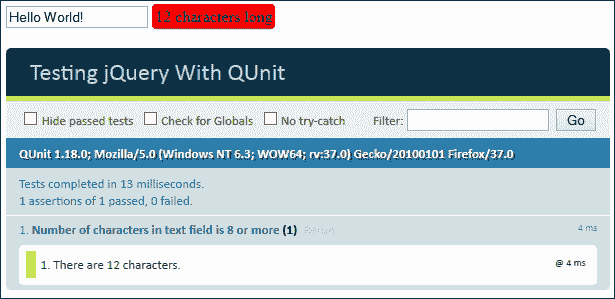
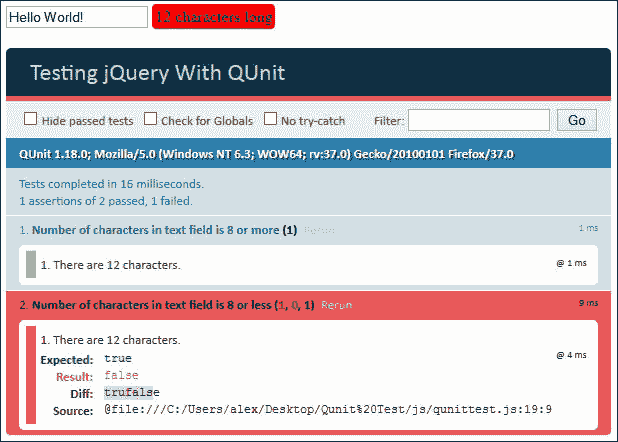
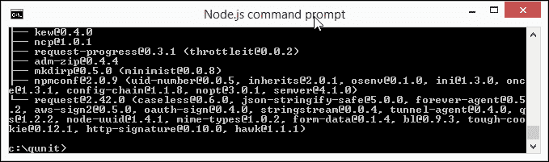
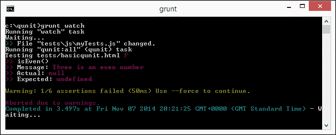

# 第十四章：测试 jQuery

要测试还是不要测试，这是个问题…

为了用这位世界著名的侦探的话来说，对于这个问题的答案应该是很简单的！

如果你花了一些时间学习 jQuery，你肯定知道它的单元测试的重要性，而且最流行的方法就是使用它的测试库 QUnit。在本章中，我们将回顾如何使用它，然后看一些我们应该使用的最佳实践，以及探讨如何真正减少我们的工作流程，通过自动化我们对代码的测试。

在本章中，我们将涵盖以下主题：

+   重新审视 QUnit

+   使用 NodeJS 和 RequireJS 进行自动化测试

+   使用 QUnit 时的最佳实践

准备好了吗？让我们开始吧…

# 重新审视 QUnit

对任何代码进行测试对于成功构建任何在线应用程序或站点至关重要；毕竟，我们不希望在最终结果中出现错误，对吧？

测试可以手动进行，但存在人为因素的增加风险，我们无法始终确定测试是否完全相同。为了减少（甚至消除）这种风险，我们可以使用 jQuery 的单元测试套件 QUnit 来自动化测试。当然，我们可以手动运行 QUnit 测试，但 QUnit 的美妙之处在于它可以完全自动化，我们将在本章后面看到。

现在，让我们花一点时间回顾一下如何安装 QUnit 并运行一些基本测试的基础知识。

## 安装 QUnit

安装 QUnit 有三种方式。我们可以简单地在代码中包含两个链接，使用 [`qunitjs.com`](https://qunitjs.com) 提供的 JavaScript 和 CSS 文件。这些文件可以直接引用，因为它们是托管在由 MaxCDN 提供的 QUnit 的 CDN 链接上。

另一种方法是使用 NodeJS。为此，我们可以浏览到 NodeJS 网站 [`www.nodejs.org`](http://www.nodejs.org)，下载适合我们平台的版本，然后在 NodeJS 命令提示符上运行以下命令：

```js
npm install --save-dev qunitjs

```

我们甚至可以使用 Bower 来安装 QUnit；要做到这一点，我们首先需要安装 NodeJS，然后运行以下命令来安装 Bower：

```js
npm install -g bower

```

一旦安装了 Bower，就可以用这个命令安装 QUnit：

```js
bower install --save-dev qunit

```

在这个阶段，我们准备开始用 QUnit 创建我们的自动化测试。

### 注意

如果你想要真正地深入了解，你可以测试最新提交的 QUnit 版本——链接在 [`code.jquery.com/qunit/`](http://code.jquery.com/qunit/)；需要注意的是这不适用于生产环境！

## 创建一个简单的演示

现在我们已经安装了 QUnit，我们准备运行一个简单的测试。为了证明它的工作原理，我们将修改一个简单的演示，以便测试文本框中的字母数，并指示它是否超过或低于给定的限制，如下所示：

1.  我们将首先从附带本书的代码下载中提取我们演示所需的代码副本；请提取 `qunit.html` 文件以及 `css` 和 `js` 文件夹，并将它们存储在项目区域中：

    ### 提示

    不必担心 `node_modules` 文件夹的存在；在后面的章节中，当安装 Node 时，我们将创建它。

1.  现在，我们需要修改我们的测试标记，所以请打开 `qunit.html`，然后按照指示进行修改：

    ```js
    <!DOCTYPE html>
    <html>
      <head>
        <title>Testing jQuery With QUnit</title>
        <meta charset="utf-8">
        <link rel="stylesheet" href="css/qunit.css" />
     <link rel="stylesheet" href="css/qunittest.css" />
     <script src="img/jquery.min.js"></script>
     <script src="img/qunit.js"></script>
     <script src="img/qunittest.js"></script>
      </head>
      <body>
        <form id="form1">
          <input type="text" id="textLength">
          <span id="results"></span>
     <div id="qunit"></div>
     <div id="qunit-fixture"></div>
        </form>
      </body>
    </html>
    ```

1.  接下来，打开你喜欢的文本编辑器，添加以下代码，并将其保存为 `js` 文件夹中的 `qunittest.js`。第一个代码块对文本字段的长度进行检查，并显示计数；如果超过了规定的八个字符的长度，则将该计数的背景设置为红色：

    ```js
    $(document).ready(function() {
      var txt = $("input[id$=textLength]");
      var span = $("#results");
      $(txt).keyup(function() {
        var length = $(txt).val().length;
        $(span).text(length + " characters long");
        $(span).css("background-color", length >= 8 ? "#FF0000" : "#00FF00");
      });
    ```

1.  在上一个代码块的下方立即添加以下代码行；这将调用 QUnit 来测试我们的文本字段的长度，并在字母计数下方显示结果：

    ```js
      $(txt).val("Hello World!");
      QUnit.test("Number of characters in text field is 8 or more", function(assert) {
        $(txt).trigger("keyup");
        assert.ok($(txt).val().length >= 8, "There are " + $(txt).val().length + " characters.");
      });
    });
    ```

1.  文件已就绪，我们可以运行测试了；请在浏览器中运行 `qunit.html`。如果一切顺利，我们应该看到我们测试的结果，这种情况下将显示一个通过：

1.  在现实生活中，我们进行的并非每次测试都会成功；如果我们没有提供正确的数值或执行了给出意外结果的计算，就会出现测试失败的情况。要查看在 QUnit 中的效果，请按照以下步骤将这些代码添加到 `qunittest.js` 文件中，如下所示：

    ```js
      assert.ok($(txt).val().length >= 8, "There are " + $(txt).val().length + " characters.");
    });

     $(txt).val("Hello World!");
     QUnit.test("Number of characters in text field is 8 or less", function(assert) {
     $(txt).trigger("keyup");
     assert.ok($(txt).val().length <= 8, "There are " + $(txt).val().length + " characters.");
      });
    ```

1.  现在，刷新你的浏览器窗口；这一次，你应该看到测试已完成，但有一个失败，如下图所示：

### 注意

在代码下载的 `completed version` 文件夹中有这个示例的已完成版本，它探讨了测试的结果。

尽管这被设计为一个简单的演示，但它仍然突出了创建简单测试并给出适当响应的简易性；让我们暂停片刻，考虑一下我们在这个练习中涵盖了什么。

每个测试的关键在于使用 `assert.ok()` 函数—它执行一个简单的布尔检查。在我们的例子中，我们检查文本长度是否为 8 个字符或更少，或者为 8 个字符或更多，并根据结果显示通过或失败。此外，我们可以要求 QUnit 显示标准文本，或者用个性化消息进行覆盖。这种方法应该足以开始对代码进行单元测试；随着时间的推移，如果需要，我们总是可以进一步开发测试。

这个库的美妙之处在于我们可以用它来使用 jQuery 或 JavaScript；本章中的示例基于使用前者，但 QUnit 足够灵活，可以用于后者，如果我们决定将来不再使用 jQuery。QUnit 是 jQuery 产品系列的一部分；与其他简单的测试库（如[Junit](http://junit.org/)）类似。

当我们利用 QUnit 的力量时，我们可以做大量事情——我们在这里看到的只是可能实现的表面一角。

### 注意

如果您想了解更多关于 QUnit 基础知识，那么我建议您参考*Dmitry Sheiko*的《Instant Testing with QUnit》，该书由 Packt Publishing 出版。也有很多在线教程可供参考；您可以从这个链接开始：[`code.tutsplus.com/tutorials/how-to-test-your-javascript-code-with-QUnit--net-9077`](http://code.tutsplus.com/tutorials/how-to-test-your-javascript-code-with-QUnit--net-9077)。

作为可能性的一个示例，我们将专注于一个特定功能，这将帮助您进一步提高您的 jQuery 开发技能：不要每次都手动运行测试，而是完全自动化它们，让它们自动运行。

# 使用 QUnit 进行自动化测试

慢着，QUnit 不是已经为我们自动运行了这些测试吗？

答案是肯定和否定。QUnit 自动化了测试，但只到一定程度；我们每次都需要手动运行一组测试。虽然这很有用，但你知道吗？我有点懒，也没有时间或意愿一直手动运行测试，我相信您也是如此。我们可以做得更好；可以使用 NodeJS/Grunt 和 PhantomJS 自动化我们的测试。

当然，设置需要一些努力，但当任何已识别的内容发生变化时，自动运行测试的节省时间是值得的。


让我们来看看自动化我们测试所涉及的内容：

1.  我们将从安装 NodeJS 开始。要做到这一点，请浏览至[`nodejs.org/`](http://nodejs.org/)，并下载适合您系统的二进制文件；它适用于 Windows、Mac OS 和 Linux。

1.  安装完成后，打开 NodeJS 命令提示符，然后切换到我们在*创建一个简单演示*中创建的`qunit`文件夹。

1.  在命令提示符下，输入以下命令：

    ```js
    npm install –g grunt-cli

    ```

    NodeJS 需要创建两个文件才能正确运行；它们是`package.json`和`gruntfile.js`。让我们现在就去创建它们。

1.  切换到您选择的普通文本编辑器，然后在一个新文件中添加以下代码，将其保存为`package.json`：

    ```js
    {
      "name": "projectName",
      "version": "1.0.0",
      "devDependencies": {
        "grunt": "~0.4.1",
        "grunt-contrib-QUnit": ">=0.2.1",
        "grunt-contrib-watch": ">=0.3.1"
      }
    }
    ```

1.  切换到 NodeJS 命令提示符，然后输入以下内容：

    ```js
    npm install

    ```

1.  在一个单独的文件中，添加以下代码并将其保存为`gruntfile.js`：

    ```js
    module.exports = function(grunt) {
      grunt.initConfig({
        pkg: grunt.file.readJSON('package.json'),

        QUnit: {
          all: ['tests/*.html']
        },
        watch: {
          files: ['tests/js/*.js', 'tests/*.html'],
          tasks: ['QUnit']
        }
      });

      grunt.loadNpmTasks('grunt-contrib-watch');
      grunt.loadNpmTasks('grunt-contrib-QUnit');
      grunt.registerTask('default', ['QUnit, watch']);
    };
    ```

1.  再次切换到 NodeJS 命令提示符，然后输入以下内容：

    ```js
    npm install –g phantomjs

    ```

1.  如果一切顺利，我们应该看到类似以下截图的内容出现：

1.  现在让我们启动 Grunt 并设置它监视代码的任何更改；要做到这一点，请在 NodeJS 命令提示符中运行以下命令：

    ```js
    grunt watch

    ```

1.  打开我们在本章前面创建的 `qunittest.js` 的副本，然后保存文件 —— 我知道这听起来有点疯狂，但这是触发 Grunt 进程所必需的。

1.  如果一切顺利，我们应该在 NodeJS 窗口中看到这个结果出现：

1.  回滚到 `qunittest.js`，然后按照这里所示更改此行：

    ```js
    assert.ok($(txt).val().length <= 8, "There are " + $(txt).val().length + " characters.");
    ```

1.  保存文件，然后观察 Grunt 窗口，现在应该指示测试失败：

让我们转变方向，继续前进；尽管我们没有深入讨论过如何使用 QUnit，但在使用 QUnit 时，尽可能遵循最佳实践仍然很重要。让我们花一点时间考虑一些这些最佳实践，以便了解它们如何提高我们的编码技能。

# 探索使用 QUnit 时的最佳实践

任何开发者的目标应该是在可能的情况下遵循最佳实践；但实际情况并非总是如此，因此在必要时学会在什么情况下妥协是很重要的。假设这种情况不会经常发生，那么在使用 QUnit 时，我们可以尝试遵循一些最佳实践指南：

+   **使每个测试相互独立**：我们运行的每个测试都应该只测试一个特定的行为；如果我们在多个测试中测试相同的行为，那么如果行为需要更改，我们就必须更改所有的测试。

+   **不要做不必要的断言**：问问自己这个问题，“我们要测试什么行为？” 单元测试应该是对某个行为应该如何工作的设计草图，而不是详细描述代码发生的每件事情。尽可能地在每个测试中保持一个断言；如果我们的代码中已经在其他地方测试过某个断言，那么运行测试就没有意义了。

+   **一次只测试一个代码单元**：您的代码的架构设计必须支持独立测试单元（即类或非常小的类组），而不是将它们链接在一起。如果不这样做，您就会面临大量重叠的风险，这将导致代码的其他地方发生故障。如果您的应用程序或站点的设计不允许这样做，那么您的代码质量将会受到影响；可能需要使用**控制反转**（**IoC**）来测试您的工作。

    ### 注

    通常的做法是让自定义代码调用通用的、可重用的库（例如 QUnit）；IoC 将这个过程反转，以便在这种情况下，测试由 QUnit 调用我们的自定义代码执行。

+   **模拟所有外部服务和状态数据**: 单元测试的关键部分是尽可能减少外部服务对你的代码的影响——这些服务的行为可能会与你的测试重叠，并影响结果。

+   **避免模拟太多的对象或状态数据**: 如果你有任何控制应用程序或站点状态的数据，请尝试将任何模拟数据保持在低于 5%的水平；任何更高的数值都会使你的测试不太可靠。在运行连续测试之前，将它们重置回一个已知的值也是明智的，因为不同的测试可能会影响其他测试的这些值。如果你发现你必须按特定顺序运行测试，或者你对活动数据库或网络连接有依赖，那么你的设计或代码就不正确，你应该重新审视两者，理解为什么以及如何去除这些依赖关系。

+   **避免不必要的前提条件**: 避免在许多不相关的测试的开头运行常见的设置代码。这会使你的测试变得混乱，因为不清楚你的测试依赖于哪些假设，并且表明你并不只是在测试单个单元。关键是创造正确的条件，即使这可能很困难——诀窍在于尽可能简单地保持它们。

+   **不要对配置设置进行单元测试**: 在运行单元测试时检查你的配置设置没有任何好处；这可能会导致重复的代码，这是没有必要的。

+   **不要指定你的实现方式 - 而是指定结果**: 单元测试旨在专注于结果，而不是实现方式——你的函数是否产生了你期望的结果？以以下代码片段为例：

    ```js
    test("adds user in memory", function()  {
      var userMgr — makeUserMgr();
      userMgr.addUser("user", 'pass");
      equal (userMgr. —internalUsersCØ) . name , "user")
      equal (userMgr. —internalUsersCØ) . pass , "pass")
    });
    ```

    这看起来完全合理，对吧？如果不是因为它专注于*代码是如何实现的*，而不是结果，那就是完全有效的。

    测试代码的更好方式是使用这种方法：

    ```js
    test( "adds user in memory", function() var userMgr = makeUserMgr(); userMgr.addUser("user", "pass"); ok(userMgr. loginUser("user" , "pass"));
    });
    ```

    在这个例子中，我们不关注获得结果的路线，而是关注结果本身；它是否产生了我们需要看到的内容？

+   **清晰且一致地命名你的单元测试**: 一个成功的单元测试将清晰地表明其目的；一个有用的命名测试的方法是使用我称之为**SSR**原则，即**主题、场景和结果**。这意味着我们可以确定正在测试什么，测试应该何时运行，以及预期结果是什么。如果我们仅仅用主题来命名它，那么如果我们不知道我们试图维护什么，它就会变得难以维护！

这些提示只是浅尝辄止，作为良好实践应该遵循的内容；要进行更深入的讨论，值得阅读亚当·科拉瓦关于应用单元测试的文章，该文章位于[`www.parasoft.com/wp-content/uploads/pdf/unittestting.pdf`](http://www.parasoft.com/wp-content/uploads/pdf/unittestting.pdf)。但要记住的关键点是要保持简单、逻辑，并且不要试图过度复杂化你的测试，否则它们将变得毫无意义！

# 总结

我们现在已经到了本章的结尾；虽然篇幅不长，但涵盖了一些关于单元测试实践的有用观点，以及我们如何通过自动化测试来节省时间和精力。让我们快速回顾一下我们学到的内容。

我们开始时简要回顾了 QUnit 的原则以及如何安装它；我们简要介绍了最流行的方法，但也介绍了如何使用 CDN 和 Bower 在我们的代码中使用库。

接下来我们来看一些基本的测试示例；虽然这些示例非常简单，但它们突显了我们在单元测试中应该遵循的原则。这些原则在使用 QUnit 进行单元测试时进一步探讨。

我们现在已经到了本书的结尾。希望你喜欢我们在*掌握 jQuery*中的旅程，并且发现这不仅仅是关于编写代码，还涉及一些更加软性的话题，这些话题将有助于提高你作为 jQuery 开发者的技能。
