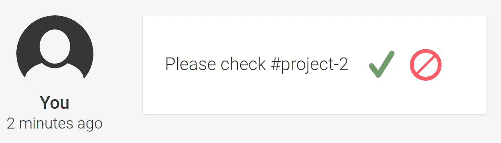
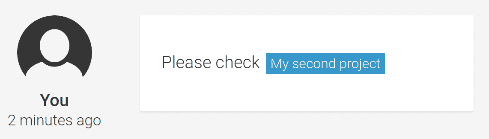
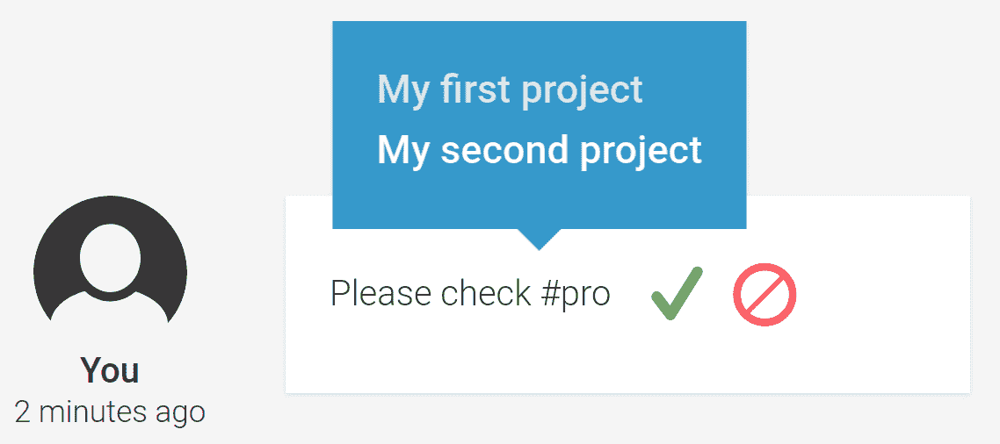
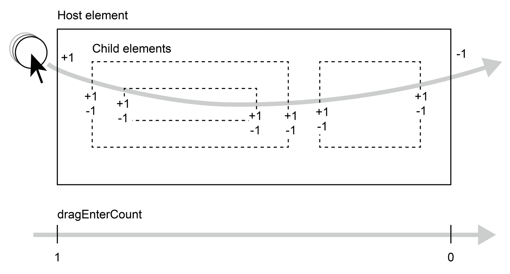

# 第七章：用户体验组件

对于今天构建应用程序的开发者来说，用户体验应该是一个核心关注点。我们不再生活在一个用户对仅仅能工作的应用程序就感到满意的世界里。现在的期望要高得多。一个应用程序需要高度可用，并且应该提供高效的流程；用户甚至期望它在执行任务时能给他们带来愉悦。

在本章中，我们将探讨构建一些组件，这些组件将提高我们任务管理系统的整体可用性。这些特性将丰富当前的功能并提供更高效的流程。

我们将开发以下两个技术特性，并将它们嵌入到我们当前的应用程序中， wherever applicable：

+   **标签管理**：我们将启用在生成内容（如评论、活动和其他可能有用的地方）中使用标签的功能。标签将帮助用户在内容和导航快捷方式之间建立链接。

+   **拖放**：我们将构建通用的组件，使使用拖放功能变得轻而易举。通过启用拖放功能，我们将允许用户以更高的效率完成某些任务。

在本章中，我们将涵盖以下主题：

+   创建一个标签管理系统以输入和显示标签

+   使用服务渲染标签创建一个有状态的管道

+   创建一个组件，在用户输入时自动完成标签

+   使用`ViewChild`装饰器上的`read`属性来查询指令实例

+   掌握 HTML5 拖放 API 的基础

+   为可拖动元素和拖放目标创建指令

+   使用`dataTransfer`对象和自定义属性来启用选择性拖放目标

# 标签管理

经典的标签形式允许你在系统中建立分类法。它帮助你组织内容。它允许你有一个可以快速管理的多对多关联，你可以在以后用它来过滤相关信息。

在我们的任务管理系统里，我们将使用一个略有不同的标签版本。我们的目标是提供一个在应用程序内允许语义快捷方式的方法。借助标签，用户应该能够在不同部分的数据之间交叉引用信息，提供所引用实体的摘要以及导航快捷方式。

例如，我们可以在用户评论中包含一个项目标签。用户可以通过简单地输入项目 ID 来输入标签。当评论显示时，我们将看到项目的标题，当我们点击标签时，我们可以直接导航到任务所在的项目详情页面。

在本节中，我们将开发所需的组件系统，以提供一种使用项目标签在评论中交叉引用其他项目的方法。我们还将使用标签管理，这是我们在上一章“跟上活动”中创建的。

# 我们标签的模型

让我们从表示我们系统中标签的标签模型开始。打开位于`src/app/model.ts`的模型模块文件，并添加以下接口：

```js
export interface Tag {
  type: string;
  hashTag: string;
  title: string;
  link: string;
}
```

此接口表示标签；每次我们存储标签信息时，我们都会使用此接口。让我们看看各个字段并详细说明它们的使用：

+   `hashTag`：这是标签的文本表示。我们需要使用此文本表示来唯一标识所有标签。我们可以将标签的文本表示定义为如下：

    +   标签符号始终以井号符号（`#`）开头。

    +   标签符号只包含字母字符或减号符号（`-`）。

    +   标签的所有其他细节，由`title`、`link`和`type`属性定义，都可以从`hashTag`属性中推导出来。因此，标签符号可以被认为是一个唯一的标识符。

+   `title`：这是标签的比较长的文本表示。它应该包含尽可能多的关于主题的细节。在项目标签的情况下，这可能意味着项目标题、开放标签计数、分配者和其他重要信息。由于这是如果标签呈现给用户时将被渲染的字段，因此保持内容相对紧凑将是有益的。

+   `link`：一个有效的 URL，当标签被渲染时将使用它。此 URL 将使链接可点击并启用快捷导航。在我们将要创建的项目标签的情况下，这将是一个链接到给定项目视图的 URL。

+   `type`：用于区分不同的标签，并为我们提供一种在更高粒度级别组织标签的方法。

到目前为止，一切顺利。我们现在有一个数据模型，我们可以用它来传输关于标签的信息。

# 创建标签服务

实现我们的标签系统的下一步是编写标签服务。该服务将负责收集我们应用程序中所有可能存在的标签。然后，可以在我们的编辑器组件中向用户展示可用的标签列表。这样，用户就可以在我们的应用程序中添加标签到评论和其他可编辑字段。标签服务还应用于将包含简单标签符号的文本转换为 HTML。这样，标签可以渲染为链接，允许我们在应用程序中导航到详细视图。我们的标签服务的责任可以分为两大主要领域。让我们详细看看这些责任：

+   **提供标签列表**：目前，我们只想在我们的标签系统中启用项目。因此，我们的标签服务需要为我们的项目服务中的每个项目创建一个项目标签。这个系统将是可扩展的，其他标签来源可以轻松实现。

+   **解析和渲染标签**：标签服务的解析功能负责在输入字符串中查找哈希标签。在解析输入字符串时，服务将检查匹配的标签，然后使用标签对象的 `title` 和 `link` 字段来渲染它们的 HTML 表示。

让我们使用 Angular CLI 工具来创建我们新服务的占位符：

```js
ng generate service --spec false tags/tags
```

现在，让我们添加以下代码作为我们服务的起点：

```js
import {Injectable} from '@angular/core';
import {ProjectService} from '../project/project.service';
import {Project, Tag} from '../model';
import {Observable} from 'rxjs';
import {map} from 'rxjs/operators';
import {limitWithEllipsis} from '../utilities/string-utilities';

@Injectable()
export class TagsService {
  tags: Observable<Tag[]>;

  constructor(private projectService: ProjectService) {
    this.tags = this.projectService.getProjects().pipe(
      map((projects: Project[]) => projects.map(project => ({
        type: 'project',
        hashTag: `#project-${project.id}`,
        title: limitWithEllipsis(project.title, 20),
        link: `/projects/${project.id}/tasks`
      })))
    );
  }
}
```

我们标签服务类的 `tags` 成员是一个可观察对象，具有泛型类型 `Tag[]`。这个可观察对象将始终发出我们应用程序中可用的最新标签列表。在我们的构造函数中，我们使用项目服务中的项目列表可观察对象作为基础，将所有项目转换为项目标签。

在项目的情况下，我们将我们的标签对象的类型设置为 `'project'`。在我们项目的后期阶段，我们也可以使用除项目之外的其他来源来生成标签，但就目前而言，我们只关注项目。

对于 `hashTag` 属性，我们使用前缀 `'#project-'` 并附加项目的 ID。这样，我们的标签可以被识别为项目标签，并且通过附加的 ID，我们还可以确定引用的是哪个具体项目。对于 `title` 字段，我们使用了一个辅助函数 `limitWithEllipsis`，该函数会截断超过 20 个字符的项目标题。对于标签对象的 `link` 字段，我们指定了将导航到项目详情视图的 URL。

# 渲染标签

现在我们有一个使用响应式方法从可用项目中生成标签的服务。这已经解决了我们服务的第一个问题。让我们看看它的其他责任，即解析文本内容以查找标签并渲染 HTML。

在我们开始在标签服务中编写 `parse` 方法之前，我们需要创建一个用于字符串替换的小型实用函数。打开文件 `src/app/utilities/string-utilities.ts`，其中我们已经创建了 `limitWithEllipsis` 函数，并添加以下代码：

```js
export function replaceAll(
  target: string,
  search: string,
  replacement: string): string {
  return target.split(search).join(replacement);
}
```

前面的方法使用了一个小的 JavaScript 技巧来替换字符串中所有出现的字符串。不幸的是，这不可能使用字符串的默认 `replace` 函数。

让我们继续我们的标签服务。渲染标签并不是什么大问题，因为我们已经以一种干净的方式抽象了标签的数据模型。由于标签有指向位置的 URL，我们将使用锚点 HTML 元素来表示我们的标签。这些元素还具有帮助我们以不同于常规内容的样式来样式化标签的类。让我们在标签服务中创建另一个方法，该方法可以用于解析文本，识别文本内容中的标签，并将它们渲染成 HTML。打开位于 `src/app/tags/tags.service.ts` 的标签服务文件，并应用以下更改：

```js
import {Injectable} from '@angular/core';
import {ProjectService} from '../project/project.service';
import {Project, Tag} from '../model';
import {Observable, of} from 'rxjs';
import {map} from 'rxjs/operators';
import {limitWithEllipsis, replaceAll} from '../utilities/string-utilities';

@Injectable()
export class TagsService {
  tags: Observable<Tag[]>;

  constructor(private projectService: ProjectService) {
    this.tags = this.projectService.getProjects().pipe(
      map((projects: Project[]) => projects.map(project => ({
        type: 'project',
        hashTag: `#project-${project.id}`,
        title: limitWithEllipsis(project.title, 20),
        link: `/projects/${project.id}/tasks`
      })))
    );
  }

  parse(textContent: string): Observable<string> {
 const hashTags: string[] = textContent.match(/#[\w\/-]+/g);
 if (!hashTags) {
 return of(textContent);
 }

 return this.tags.pipe(
 map((tags: Tag[]) => {
 hashTags.forEach(hashTag => {
 const tag = tags.find(t => t.hashTag === hashTag);
 if (tag) {
 textContent = replaceAll(
 textContent,
 hashTag,
 `<a class="tag tag-${tag.type}" 
              href="${tag.link}">${tag.title}</a>`
 );
 }
 });
 return textContent;
 })
 );
 }
}
```

让我们快速回顾前面的更改，并逐步查看 `parse` 方法：

1.  首先，我们在传递给 `parse` 方法的文本内容中搜索标签，并将发现的标签列表存储在一个名为 `hashTags` 的变量中。

1.  如果没有发现任何标签，我们立即返回一个包含传递给方法的原文本内容的新可观察流。我们使用 RxJS 的 `of` 辅助函数来完成这个操作。

1.  下一步是在我们的服务中渲染所有发现的标签与相应的标签对象。我们不会直接在我们的服务中存储标签，而是使用一个可观察的流将不同的来源转换为标签。我们使用 `map` 操作符来获取标签列表，然后将所有发现的标签渲染到 HTML 中。

1.  我们使用 `Array.prototype.forEach` 来遍历初始文本内容中的所有发现的标签。然后我们尝试在可用项目标签列表中找到一个匹配的标签对象。我们通过简单地比较文本中找到的标签与我们的标签对象上的 `hashTag` 属性来完成这个操作。

1.  如果找到了匹配的标签，我们使用我们新创建的 `replaceAll` 辅助函数来替换所有给定标签的所有出现，并用该标签的渲染 HTML 版本来替换。我们使用标签对象的 `type`、`link` 和 `title` 字段来渲染一个锚点 HTML 元素。

1.  在所有标签都被替换为这些标签的 HTML 版本之后，我们从可观察的映射函数中返回渲染的 HTML 内容。

这就是我们的标签服务的全部内容。作为下一步，我们将创建一个管道，该管道将使用我们的服务直接在组件视图中渲染标签。

# 使用管道集成标签

我们的任务服务的所有问题现在都已经得到解决，并且它已经开始为可用的项目存储标签。现在我们可以继续将我们的服务集成到应用程序中。

由于我们的标签服务将带有简单标签的文本转换为带有链接的 HTML，因此管道将是一个完美的辅助工具，用于在组件中集成该功能。

让我们使用 Angular CLI 工具创建一个新的管道：

```js
ng generate pipe --spec false pipes/tags
```

打开位于 `src/app/pipes/tags.pipe.ts` 的生成文件，并添加以下代码：

```js
import {Pipe, PipeTransform} from '@angular/core';
import {TagsService} from '../tags/tags.service';
import {DomSanitizer} from '@angular/platform-browser';
import {map} from 'rxjs/operators';

@Pipe({
  name: 'tags',
  pure: false
})
export class TagsPipe implements PipeTransform {
  constructor(private tagsService: TagsService,
              private sanitizer: DomSanitizer) {}

  transform(value) {
    if (typeof value !== 'string') {
      return value;
    }
    return this.tagsService.parse(value).pipe(
      map(parsed => this.sanitizer.bypassSecurityTrustHtml(parsed))
    );
  }
}
```

我们已经创建了一些管道。然而，这个管道有点不同，因为它不是一个纯管道。如果管道的 `transform` 函数总是对给定的输入返回相同的输出，则认为管道是纯的。这意味着 `transform` 函数不应依赖于任何其他可能影响转换结果的外部来源，唯一的依赖是输入值。但我们的标签管道并不符合这一点。它依赖于标签服务来转换输入，并且可以在任何时间将新标签存储在标签服务中。连续的转换可以成功渲染刚刚还不存在的标签。

通过告诉 Angular 我们的管道不是纯的，我们可以禁用它在纯管道上执行的性能优化。这也意味着 Angular 需要在每次变更检测时重新验证管道的输出。这可能导致性能问题；因此，纯标志应该谨慎使用。

在我们的管道中，我们注入了标签服务，这有助于我们将简单文本转换为渲染的 HTML。然而，Angular 有一些安全机制阻止我们直接在模板中使用这个 HTML 字符串。为了确保 Angular 我们知道我们在做什么，我们可以使用 DOM 清理器实例来创建可信的 HTML，然后我们可以在`innerHTML`绑定中渲染它。通过在清理器上调用`bypassSecurityTrustHtml`，传递我们的生成的 HTML 字符串，我们可以告诉 Angular 对这个实例忽略任何安全担忧，然后我们可以在视图中渲染 HTML。

好的；就标签的渲染而言，我们已经准备好了。让我们将我们的标签功能集成到我们的编辑组件中，这样我们就可以在注释系统中使用它们。

我们真正需要做的只是在我们编辑组件模板中包含标签管道。让我们打开位于 `src/app/ui/editor/editor.component.html` 的编辑器模板，并应用以下更改：

```js
<div #editableContentElement
     class="editable-content"
     contenteditable="true"></div>
<div class="output" [innerHTML]="content ? (content | tags | async) : '-'"></div>
<div *ngIf="showControls && !editMode"
     class="controls">
  <button (click)="beginEdit()" class="icon-edit"></button>
</div>
<div *ngIf="showControls && editMode"
     class="controls">
  <button (click)="saveEdit()" class="icon-save"></button>
  <button (click)="cancelEdit()" class="icon-cancel"></button>
</div>

```

我们在模板中做的唯一更改是我们显示编辑器内容的地方。我们正在使用属性绑定到我们的编辑器输出 HTML 元素的`innerHTML`属性。这允许我们渲染由我们的标签服务生成的 HTML 内容。由于标签管道返回一个可观察对象，我们需要链式连接一个异步管道。

恭喜！您的标签系统已经完成了一半！我们已经创建了一个标签服务，它收集应用程序中的可用标签，并且与我们的新创建的管道一起，在编辑组件中渲染标签。在浏览器中预览您的更改，并尝试在项目的注释标签页上添加一些注释的标签。目前，在我们的应用程序中只有两个项目。尝试将以下标签添加到注释中——`#project-2`——并在编辑器中保存更改。现在您应该能够在注释中看到渲染的标签。如果您再次编辑注释，您将看到标签的文本表示。

让我们暂时偏离一下主题。我们已经创建了一个标签系统，并且我们刚刚通过使用标签管道将其集成到我们的编辑组件中。如果用户在任何注释中写入项目标签，它们现在将由标签服务渲染。这太棒了！用户现在可以在注释中建立与其他项目的交叉链接，这些链接将自动渲染为链接并显示截断的项目标题。用户需要做的只是将项目标签的文本表示添加到注释中。

以下两个截图展示了注释系统的示例。第一个截图是编辑模式下编辑器的示例，在注释系统中输入了一个文本标签：



输入文本标签的一个示例

第二个截图是使用我们的编辑器集成在评论系统中启用渲染标签的一个示例：



通过编辑器集成渲染标签的一个示例

在本节中，我们探讨了以下概念：

+   我们构建了一个标签服务，它可以生成、缓存和渲染标签

+   我们使用`pure`标志构建了一个有状态的管道

+   我们使用了`[innerHTML]`属性绑定来将 HTML 内容渲染到元素中

+   我们使用了 DOM 清理器来绕过使用`innerHTML`绑定时的安全检查

我们还没有完成标签输入的工作。我们不能期望我们的用户知道系统中所有可用的标签，然后手动在评论中输入它们。让我们看看在下一节中我们如何改进这一点。

# 支持标签输入

在这里，我们将构建一个组件（及其支持结构），以使用户输入标签的过程变得顺畅。到目前为止，他们可以编写项目标签，但这需要他们知道项目 ID，这使得我们的标签管理变得毫无用处。我们希望提供一些选择，当用户准备编写标签时。理想情况下，我们将显示可用的标签，一旦他们开始通过输入哈希符号（`#`）编写标签。

起初听起来很简单的事情实际上是一个相当棘手的问题。我们的标签输入需要处理以下挑战：

+   处理输入事件以监控标签创建。我们需要知道用户何时开始编写标签，以及当使用无效的标签字符时，输入的标签名称何时被更新或取消。

+   计算用户输入光标的位置。是的，我知道这听起来很简单，但实际上并不是。计算用户输入光标的视口偏移位置需要使用浏览器的 Selection API，这是一个相当底层的 API，需要一些抽象。

为了应对这些挑战，我们将引入一个实用指令，我们可以使用它来处理那些相当复杂的底层用户输入事件。

# 创建一个标签输入指令

由于在用户输入中识别标签并不是一个简单的任务，我们将创建一个指令来帮助我们完成这个任务。这实际上是我们共同创建的第一个指令！如果你还记得第一章中的*组件化用户界面*，指令是用来创建自定义行为而不需要自己视图的。我们的标签输入指令将收集并识别用户输入中的标签，但它实际上并不渲染自己的视图。

让我们在`src/app/model.ts`中的模型文件中添加两个更多接口，以帮助我们与标签用户输入进行通信：

```js
export interface InputPosition {
  top: number;
  left: number;
  caretOffset: number;
}

export interface HashTagInput {
  hashTag: string;
  position: InputPosition;
}
```

对于我们指令识别为 hashtag 输入的每个用户输入，我们将使用 hashtag 输入对象进行通信。除了 hashtag 的实际文本内容外，我们还发送一个由以下属性组成的输入位置：

+   `top` 和 `left`: 表示光标位置的实际输入发生的屏幕顶部和左侧，以像素为单位。

+   `caretOffset`: 描述了在可编辑元素的文本内容中，hashtag 的字符偏移量。当我们要在可编辑元素中替换 hashtag 并实现自动完成的感觉时，这将非常有用。

从`InputPosition`接口的`top`和`left`属性中，你可以看到我们想要计算实际用户输入发生的坐标。这听起来非常简单，但实际上并非如此。为了帮助我们进行这个计算，我们将引入一个新的辅助函数，我们将在一个新文件中创建这个函数，路径为`src/app/utilities/dom-utilities.ts`。创建这个新文件并添加以下内容：

```js
import {InputPosition} from '../model';

export function getRangeBoundingClientRect(): InputPosition | null {
  if (window.getSelection) {
    const selection = window.getSelection();
    if (!selection.rangeCount) {
      return null;
    }

    const range = selection.getRangeAt(0);
    const rect = range.getBoundingClientRect();

    if (!range.collapsed) {
      return {
        top: rect.top,
        left: rect.left,
        caretOffset: range.startOffset
      };
    }

    const dummy = document.createElement('span');
    range.insertNode(dummy);
    const pos: InputPosition = {
      top: rect.top,
      left: rect.left,
      caretOffset: range.startOffset
    };
    dummy.parentNode.removeChild(dummy);
    return pos;
  }

  if (document['selection']) {
    return document['selection']
      .createRange()
      .getBoundingClientRect();
  }
}
```

在这里我们就不深入细节了。这段代码基本上是尝试找到描述光标位置相对于视口的`top`、`right`、`bottom`和`left`偏移量的`DOMRect`对象，即边界框。问题是，Selection API 不允许我们直接获取光标的位置；它只允许我们获取当前选择的位置。如果光标放置不正确，我们需要在光标位置插入一个虚拟元素，并返回虚拟元素的边界框`DOMRect`对象。当然，在返回`DOMRect`对象之前，我们需要再次移除虚拟元素。

因此，这就是我们需要编写的标签输入指令的所有内容。让我们使用 Angular CLI 创建我们的第一个指令。创建指令的命令与创建组件的命令非常相似：

```js
ng generate directive --spec false tags/tags-input
```

这生成了我们新指令的存根。让我们打开文件`src/app/tags/tags-input.directive.ts`，并添加以下代码：

```js
import {Directive, HostListener} from '@angular/core';
import {getRangeBoundingClientRect} from '../utilities/dom-utilities';
import {HashTagInput} from '../model';
import {BehaviorSubject} from 'rxjs';

@Directive({
  selector: '[macTagsInput]'
})
export class TagsInputDirective {
  private hashTagInput: HashTagInput | null = null;
  private hashTagSubject = new BehaviorSubject<HashTagInput>(this.hashTagInput);
  hashTagChange = this.hashTagSubject.asObservable();
}
```

私有`hashTagInput`属性是一个内部状态，用于存储当前的 hashtag 输入信息。`hashTagSubject`成员是一个行为主题，我们内部使用它来发布 hashtag 输入更改。我们使用主题上的`asObservable`方法来公开一个可观察的流，该流在每次更改时都会发出 hashtag 输入对象。我们将这个派生可观察流存储在具有公共可见性的`hashTagChange`成员中。其他组件可以访问这个属性并订阅，以便在 hashtag 输入事件发生时得到通知。

现在，让我们逐步添加更多到我们的指令中。首先，让我们添加一个重置方法，当 hashtag 输入应该被重置时我们可以调用这个方法。这个方法将在内部使用，当输入被取消时，也可以从外部，从另一个组件中调用，以取消标签输入：

```js
reset() {
  this.hashTagInput = null;
  this.hashTagSubject.next(this.hashTagInput);
}
```

下一个方法用于根据用户输入更新内部 hashtag 输入对象：

```js
  private updateHashTag(hashTag, position = this.hashTagInput.position) {
    this.hashTagInput = {hashTag, position};
    this.hashTagSubject.next(this.hashTagInput);
  }
```

现在，让我们向我们的标签输入指令添加两个主要方法，以收集用户输入。我们使用 `HostListener` 装饰器在宿主元素上创建 `keydown` 和 `keypress` 事件的绑定：

```js
updateTextTag(textTag, position = this.position) { 
  this.textTag = textTag; 
  this.position = position; 
} 
```

`keyDown` 方法将由宿主事件绑定调用 `keydown` 事件。我们关注的是退格键，它应该也会移除当前输入的标签的最后字符。如果我们能检测到退格键（字符代码 `8`），我们将调用我们的 `updateHashTag` 方法，并使用 `Array.prototype.slice` 函数更新当前哈希标签，移除最后一个字符：

```js
@HostListener('keydown', ['$event'])
keyDown(event: KeyboardEvent) {
  if (this.hashTagInput && event.which === 8) {
    this.updateHashTag(this.hashTagInput.hashTag.slice(0, -1));
  }
}
```

`keyPress` 方法是在 `keypress` 事件上从宿主元素的事件绑定中调用的。这就是这个支持指令的主要逻辑所在。在这里，我们处理两种不同的情况：

+   如果按下的键是哈希符号，我们将从头开始一个新的标签

+   如果按下的键不是有效的单词字符或哈希符号，我们将将其重置为其初始状态，这将取消标签输入

+   任何其他有效字符，我们将添加到当前的文本标签字符串中

将以下代码添加到标签输入指令中：

```js
@HostListener('keypress', ['$event'])
keyPress(event: KeyboardEvent) {
  const char = String.fromCharCode(event.which);
  if (char === '#') {
    this.updateHashTag('#', getRangeBoundingClientRect());
  } else if (!/[\w-]/i.test(char)) {
    this.reset();
  } else if (this.hashTagInput) {
    this.updateHashTag(this.hashTagInput.hashTag + char);
  }
}
```

当输入一个新的哈希标签（如果用户插入哈希符号）时，我们将更新内部哈希标签输入对象，并使用我们的实用函数 `getRangeBoundingClientRect` 将输入对象的位置设置为当前光标位置。

好的；现在我们有了处理标签输入所需的所有支持。然而，我们仍然需要一个方法来向用户展示标签服务中的可用标签。为此，我们将创建一个新的标签选择组件。它将向用户展示可用标签的列表，并利用我们支持指令发出的标签输入变化来过滤和定位列表。

# 创建一个标签选择组件

为了帮助用户找到正确的标签，我们将提供一个包含可用标签的下拉菜单。为此，我们需要使用我们标签输入指令发出的标签输入对象。让我们简要地看看这个组件的要求：

+   它应该在工具提示/呼出框中显示从我们的标签服务中收集到的可用标签

+   它应该支持显示标签的限制

+   它应该接收一个带标签输入对象，用于过滤可用标签并使用标签输入对象上的位置数据定位自身

+   它应该在用户点击列表中的标签时发出一个事件

+   如果过滤器无效，或者没有元素匹配过滤器，组件应该隐藏：



完成标签选择组件，通过用户输入过滤

让我们先更新我们的应用程序模型，位于 `src/app/model.ts`，以包括一个用于通信标签选择的新接口。将以下代码添加到文件中：

```js
export interface TagSelection {
  tag: Tag;
  hashTagInput: HashTagInput;
}
```

如果一个标签被选中，我们想知道被选中的是哪个标签对象，同时，相应的标签输入对象也应该传递。这些数据是必要的，以便我们能够正确地响应选中的标签并正确更新可编辑元素。

让我们继续我们的组件，并创建组件类。首先，让我们使用 Angular CLI 构建一个新的组件：

```js
ng generate component --spec false -cd onpush tags/tags-select
```

这将生成一个新的组件，我们将打开位于`src/app/tags/tags-select/tags-select.component.ts`的组件类文件，并添加以下代码：

```js
import {ChangeDetectionStrategy, Component, EventEmitter, HostBinding, Input, OnChanges, Output} from '@angular/core';
import {HashTagInput, Tag, TagSelection} from '../../model';

const tagListLimit = 4;

@Component({
  selector: 'mac-tags-select',
  templateUrl: './tags-select.component.html',
  styleUrls: ['./tags-select.component.css'],
  changeDetection: ChangeDetectionStrategy.OnPush
})
export class TagsSelectComponent implements OnChanges {
  @Input() tags: Tag[];
  @Input() hashTagInput: HashTagInput | null;
  @Output() outSelectTag = new EventEmitter<TagSelection>();

  filteredTags: Tag[];

  filterTags() {
    const filter = this.hashTagInput.hashTag.slice(1).toLowerCase();
    this.filteredTags = this.tags
      .filter(tag =>
        tag.hashTag.toLowerCase().includes(filter) ||
        tag.title.toLowerCase().includes(filter)
      )
      .slice(0, tagListLimit);
  }

  selectTag(tag: Tag) {
    this.outSelectTag.next({
      tag,
      hashTagInput: this.hashTagInput
    });
  }

  ngOnChanges(changes) {
    if ((changes.hashTagInput || changes.tags) && this.hashTagInput) {
      this.filterTags();
    }
  }
}
```

我们的组件有两个输入元素。`tags`输入用于将所有可用的标签传递到标签选择组件中。这是当用户选择可用标签时将展示给用户的标签列表。`hashTagInput`输入是我们从之前创建的标签输入指令中获取的标签输入对象。我们将从该对象中提取当前用户输入以过滤显示的标签。我们还将使用该对象的位置数据将组件定位到用户开始编写标签输入的插入点屏幕坐标。

输出`outSelectTag`用于在用户从标签列表中选择标签时发出事件。`filteredTags`属性用于计算过滤后的标签列表。当`hashTagInput`或`tags`输入对象发生变化时，我们调用`filterTags`方法。在这里，我们使用当前标签输入数据过滤所有标签列表。由于这只是一个计算状态，我们的组件仍然是一个纯组件，我们仍然可以使用`OnPush`变更检测策略。

当用户从过滤后的标签列表中选择标签时，会从视图中调用`selectTag`方法。在那里，我们发出一个新的标签选择对象，该对象包含选中的标签以及标签输入对象。

让我们继续并添加一些访问器属性到我们的组件中，我们使用这些属性来创建宿主元素样式绑定。以下访问器属性`hasFilteredTags`绑定到宿主元素的显示样式属性。它将控制组件是显示还是隐藏。只有当过滤器有效且过滤后的标签至少包含一个标签时，我们才会显示组件：

```js
  @HostBinding('style.display')
  get hasFilteredTags() {
    return this.filteredTags && this.filteredTags.length > 0 ? 'block' : 'none';
  }
```

以下两个访问器属性使用宿主绑定来设置宿主元素的`top`和`left`样式，基于组件的`hashTagInput`输入：

```js
  @HostBinding('style.top')
  get topPosition() {
    return this.hashTagInput && this.hashTagInput.position ?
      `${this.hashTagInput.position.top}px` : 0;
  }

  @HostBinding('style.left')
  get leftPosition() {
    return this.hashTagInput && this.hashTagInput.position ?
      `${this.hashTagInput.position.left}px` : 0;
  }
```

我们的组件模板相当简单。让我们打开存储在`src/app/tags/tags-select/tags-select.component.html`中的视图模板，并应用以下更改：

```js
<ul class="list">
  <li *ngFor="let tag of filteredTags"
      (click)="selectTag(tag)"
      class="item">{{tag.title}}</li>
</ul>
```

我们使用了`NgFor`指令来遍历`filteredTags`成员中的所有标签。如果点击了一个标签，我们需要执行`selectTag`方法并传递当前迭代的标签。在列表中，我们只显示标签标题，这有助于用户识别他们想要使用的标签。

现在，我们已经构建了我们需要的所有组件，以实现用户平滑地输入标签。然而，我们仍然需要将所有这些组件连接起来。下一步是在我们的项目评论中启用标签选择。

# 在编辑器组件中集成标签选择

作为第一步，我们应该修改我们的编辑器组件，以便利用我们刚刚创建的标签选择组件与标签输入指令一起使用。

在我们开始更改编辑器之前，让我们看看一个新的字符串辅助函数`splice`，它允许我们传递文本中的特定位置，在那里我们想要用从所选标签对象中获取的最终标签替换用户输入的部分标签。

`splice`方法与`Array.prototype.splice`函数类似，允许我们在字符串中删除一定部分并添加新部分到该字符串的同一位置。这允许我们非常具体地替换字符串中的某些区域，这正是我们在这个情况下所需要的。让我们在我们的字符串实用模块`src/app/utilities/string-utilities.ts`中实现这个小小的辅助函数：

```js
…
export function splice(
  target: string,
  index: number,
  deleteCount: number,
  content: string): string {
  return target.slice(0, index) +
    content +
    target.slice(index + deleteCount);
}
```

让我们回到我们的编辑器组件，看看在`src/app/ui/editor/editor.component.html`中组件模板内的更改。模板中的有效更改以粗体标注：

```js
<div #editableContentElement
     class="editable-content"
     contenteditable="true"
 macTagsInput></div>
<mac-tags-select
 *ngIf="tags && tagsInput.hashTagChange | async"
 [hashTagInput]="tagsInput.hashTagChange | async"
 [tags]="tags"
 (outSelectTag)="selectTag($event)">
</mac-tags-select>
<div class="output" [innerHTML]="content ? (content | tags | async) : '-'"></div>
<div *ngIf="showControls && !editMode"
     class="controls">
  <button (click)="beginEdit()" class="icon-edit"></button>
</div>
<div *ngIf="showControls && editMode"
     class="controls">
  <button (click)="saveEdit()" class="icon-save"></button>
  <button (click)="cancelEdit()" class="icon-cancel"></button>
</div>
```

我们需要添加的第一件事是我们的标签输入指令，它将帮助我们收集用户在可编辑内容字段中输入的标签数据。

在可编辑内容元素下方，我们添加了新的标签选择组件。只有当将标签列表作为输入提供给编辑器组件时，我们才会渲染标签选择组件。我们使用从标签输入指令中提取的标签输入对象，并将其传递到标签选择的`hashTagInput`输入。如果标签选择组件发出`outSelectTag`事件，我们将调用一个新的`selectTag`方法，我们将在我们的编辑器组件中实现它。

现在，让我们将必要的更改应用到我们的组件类中，位于`src/app/ui/editor/editor.component.html`。省略号字符（`…`）表示未更改的代码部分。有效更改以粗体标注：

```js
…
import {TagsInputDirective} from '../../tags/tags-input.directive';
import {Tag, TagSelection} from '../../model';
import {splice} from '../../utilities/string-utilities';

@Component({
  selector: 'mac-editor',
  templateUrl: './editor.component.html',
  styleUrls: ['./editor.component.css'],
  encapsulation: ViewEncapsulation.None,
  changeDetection: ChangeDetectionStrategy.OnPush
})
export class EditorComponent implements OnChanges, AfterViewInit {
  @ViewChild('editableContentElement') editableContentElement: ElementRef;
  @ViewChild('editableContentElement', {
 read: TagsInputDirective
 }) tagsInput: TagsInputDirective;
  …

  saveEdit() {
    this.editMode = false;
    this.tagsInput.reset();
    this.outSaveEdit.emit(this.getEditableContent());
  }

  cancelEdit() {
    this.editMode = false;
 this.tagsInput.reset();
    this.setEditableContent(this.content);
    this.outCancelEdit.emit();
  }
  …

  selectTag(tagSelection: TagSelection) {
 this.setEditableContent(
 splice(
 this.getEditableContent(),
 tagSelection.hashTagInput.position.caretOffset,
 tagSelection.hashTagInput.hashTag.length,
 tagSelection.tag.hashTag
 ));
 this.tagsInput.reset();
 }
}
```

首先，我们为我们的可编辑内容元素添加了另一个视图查询，使用视图引用`editableContentElement`。然而，这次我们在视图查询装饰器中使用了额外的配置对象。视图查询选项中的`read`属性允许我们指定我们不想选择默认的`ElementRef`对象，而是选择一个在元素上存在的组件实例或指令实例的引用。在我们的例子中，我们想要获取到放置在可编辑内容元素上的标签输入指令的引用。

在我们的编辑器的`saveEdit`和`cancelEdit`方法中，我们现在可以额外调用我们的标签输入指令的 reset 方法。这将确保当用户保存或取消编辑时，我们不会持久化任何之前的标签条目。

最后，我们添加了一个新的方法：`selectTag`。这个方法是从编辑视图调用的，作为对来自标签选择组件的`outSelectTag`事件的响应。我们在这里所做的一切就是用标签选择对象中发出的标签替换掉用户输入的可编辑内容元素中的哈希标签部分。

太棒了！我们已经完成了对标签选择组件的工作，并将其与我们的标签输入指令集成到编辑组件中。

# 在项目评论中集成标签选择

由于编辑组件现在依赖于一个要作为输入传递的可用标签列表，我们需要对我们的项目评论组件应用一些更改。

让我们从项目评论容器组件开始，该组件位于`src/app/container/project-comments-container/project-comments-container.component.ts`。省略号字符隐藏了无关的代码部分，而有效的更改以粗体显示：

```js
…
import {Comment, CommentUpdate, Project, Tag, User} from '../../model';
…
import {TagsService} from '../../tags/tags.service';

@Component({
  …
})
export class ProjectCommentsContainerComponent {
  …
  tags: Observable<Tag[]>;

  constructor(private projectService: ProjectService,
              private userService: UserService,
              private route: ActivatedRoute,
              private activitiesService: ActivitiesService,
 private tagsService: TagsService) {
    …
    this.tags = this.tagsService.tags;
  }
  …
}
```

现在，让我们看看容器组件中的视图模板更改，该组件位于`src/app/container/project-comments-container/project-comments-container.component.ts`：

```js
<mac-comments [user]="user | async"
              [comments]="projectComments | async"
              [tags]="tags | async"
              (outCreateComment)="createComment($event)"
              (outUpdateComment)="updateComment($event)">
</mac-comments>
```

真的很简单！我们只是从我们的标签服务中获取了标签可观察对象，在视图中订阅，并将生成的标签列表传递到我们的评论组件中。

让我们将我们的评论组件更改为接受该标签列表作为输入。打开文件`src/app/comments/comments/comments.component.ts`，并添加以下更改：

```js
…
import {Comment, CommentUpdate, Tag, TagSelection, User} from '../../model';
import {TagsInputDirective} from '../../tags/tags-input.directive';
import {splice} from '../../utilities/string-utilities';

@Component({
  …
})
export class CommentsComponent {
  …
  @Input() tags: Tag[];
 @ViewChild('commentContentEditable', {
 read: TagsInputDirective
 }) tagsInput: TagsInputDirective;
  …

  selectTag(tagSelection: TagSelection) {
 this.commentContentEditable.nativeElement.textContent =
 splice(
 this.commentContentEditable.nativeElement.textContent,
 tagSelection.hashTagInput.position.caretOffset,
 tagSelection.hashTagInput.hashTag.length,
 tagSelection.tag.hashTag
 );
 this.tagsInput.reset();
 }
}
```

使用我们在编辑器中使用的相同机制，我们也在评论可编辑元素中启用了标签选择。让我们看看评论组件视图模板中的更改，该模板位于`src/app/comments/comments/comments.component.html`：

```js
<div class="title">Add new comment</div>
<div class="add-comment-section">
  <div #commentContentEditable
       class="add-comment-box"
       contenteditable="true"
       macTagsInput>
  </div>
 <mac-tags-select
 *ngIf="tags && tagsInput.hashTagChange | async"
 [hashTagInput]="tagsInput.hashTagChange | async"
 [tags]="tags"
 (outSelectTag)="selectTag($event)">
 </mac-tags-select>
  <button (click)="createComment()"
          class="button" >Add comment</button>
</div>

<ng-container *ngIf="comments.length > 0">
  <div class="title">All comments</div>
  <mac-comment *ngFor="let comment of comments; let index = index"
               [comment]="comment"
               [user]="user"
               [tags]="tags"
               (outUpdateComment)="updateComment(index, $event)">
  </mac-comment>
</ng-container>
```

除了为评论可编辑内容元素实现我们自己的标签选择外，我们还向下传递了从我们的父容器组件接收到的标签，作为每个评论组件的输入。

让我们继续并完成标签系统的集成。打开位于`src/app/comments/comment/comment.component.ts`的评论组件类，并应用以下更改：

```js
…
import {Comment, Tag, User} from '../../model';

@Component({
  …
})
export class CommentComponent {
  …
  @Input() tags: Tag[];
  …
}
```

我们需要添加一个额外的输入来接收我们的标签列表。让我们也将必要的更改反映到我们的评论组件视图模板中，该模板位于`src/app/comments/comment/comment.component.html`：

```js
…
<div class="main">
  <div class="content">
    <mac-editor [content]="comment.content"
                [showControls]="comment.user.id === user.id"
                [tags]="tags"
                (outSaveEdit)="updateComment($event)">
    </mac-editor>
  </div>
</div>
```

好的！为了集成，确实有很多更改，但它们都很简单，现在我们可以使用我们的标签系统了！

# 完成我们的标签系统

恭喜！你现在已经成功实现了三个可用性组件中的第一个。

在标签输入指令的帮助下，我们隐藏了用户输入的低级编程和用户光标位置的处理。然后，我们创建了一个组件来向用户显示可用的标签，并提供了他们可以通过点击来选择标签的方式。在我们的编辑器组件中，我们使用了标签输入指令以及标签选择组件，以在编辑注释时平滑地输入标签。

在本节中，我们涵盖了以下概念：

+   我们在指定的指令中处理了复杂的用户输入，以将逻辑从我们的组件中卸载

+   我们使用宿主绑定来设置位置样式属性

+   我们使用`ViewChild`装饰器上的`read`属性来查询指令实例

+   我们实现了完全响应式组件，这些组件依赖于可观察对象，并在变更检测期间不产生副作用

在下一节中，我们将探讨如何将拖放功能集成到我们的应用程序中。我们将构建 Angular 指令，这将帮助我们轻松地将拖放功能集成到任务管理应用程序的任何区域。

# 拖放

我们已经学会了高效地使用我们的计算机鼠标和键盘。使用键盘快捷键、不同的点击动作和上下文鼠标菜单，可以为我们执行任务提供支持。然而，在当前的移动和触摸设备热潮中，有一个模式最近受到了更多的关注。拖放动作是一种非常直观和逻辑的表达动作的方式，例如移动或复制项目。在用户界面执行的一个特定任务受益于拖放：在列表中对项目进行排序。如果我们需要通过动作菜单对项目进行排序，会变得非常混乱。逐步移动项目，使用上下按钮，效果很好，但需要花费很多时间。如果你可以拖动项目并将它们拖放到你希望它们重新排序的位置，你可以非常快速地对项目列表进行排序。

在本主题中，我们将构建启用应用程序内拖放所需的基本元素。我们将使用拖放功能来启用用户重新排序他们的任务列表。通过开发可重用的指令来提供此功能，我们可以在应用程序的任何位置启用该功能。

为了实现我们的指令，我们将利用 HTML5 拖放 API，该 API 在撰写本书时得到了所有主要浏览器的支持。

由于我们希望在多个组件上重用我们的拖放行为，我们将使用指令来实现。在本节中，我们将创建两个指令：

+   **可拖动指令**：此指令应附加到可以启用拖动的组件

+   **可拖动放置区域指令**：此指令应附加到将作为放置目标的组件

我们还将实现一个功能，可以让我们选择性地决定哪些内容可以被拖放到哪些位置。为此，我们将在我们的可拖动指令中使用类型属性，以及在目标区域中使用接受类型属性。

# 更新我们的任务排序模型

作为第一步，我们应该使我们的任务模型支持排序。通过在我们的任务对象中引入一个 `order` 字段，然后我们可以使用该字段相应地排序任务。让我们对我们的模型文件进行以下更改，该文件位于 `src/app/model.ts`：

```js
export interface Task {
  readonly id?: number;
  readonly projectId?: number;
  readonly title: string;
  readonly done: boolean;
  readonly order: number;
}
…

export type DraggableType = 'task';
```

我们还添加了一个新的类型别名，`DraggableType`，我们使用它来识别我们应用程序内可以拖动的对象。我们将使用此类型来确保我们只能将拖放操作到支持给定类型的区域。

由于我们已经更改了任务模型以包含 `order` 属性，我们需要对我们的现有应用程序状态管理进行一些更改，以便与 `order` 属性一起工作。

首先，让我们更改我们的内存数据库，并打开文件 `src/app/database.ts` 以应用以下更改：

```js
…

export class Database implements InMemoryDbService {
  createDb() {
    …

    const tasks: Task[] = [
      {id: 1, projectId: 1, title: 'Task 1', done: false, order: 1},
      {id: 2, projectId: 1, title: 'Task 2', done: false, order: 2},
      {id: 3, projectId: 1, title: 'Task 3', done: true, order: 3},
      {id: 4, projectId: 1, title: 'Task 4', done: false, order: 4}
    ];

    …
  }
}
```

现在，我们所有的初始任务都包含了一个 `order` 属性。现在，我们需要处理两件额外的事情：

+   当创建新任务时，我们需要计算下一个可用的顺序值并使用它来创建新任务

+   我们需要将任务列表更改为使用 `order` 属性进行排序

我们可以在任务列表容器组件中实现这两个更改。让我们打开文件 `src/app/container/task-list-container/task-list-container.component.ts`，并应用一些更改。不相关的代码部分使用省略号字符隐藏，而有效的更改以粗体显示：

```js
…

@Component({
  selector: 'mac-task-list-container',
  templateUrl: './task-list-container.component.html',
  encapsulation: ViewEncapsulation.None,
  changeDetection: ChangeDetectionStrategy.OnPush
})
export class TaskListContainerComponent {
  …

  constructor(private taskService: TaskService,
              private projectService: ProjectService,
              private route: ActivatedRoute,
              private activitiesService: ActivitiesService) {
    …

    this.tasks = this.selectedProject.pipe(
      switchMap((project) => this.taskService.getProjectTasks(project.id)),
 map(tasks => tasks.sort((a: Task, b: Task) => b.order - a.order))
    );

    …
  }

  …

  addTask(title: string) {
    combineLatest(this.selectedProject, this.tasks)
      .pipe(
        take(1)
      )
      .subscribe(([project, tasks]) => {
        const position = tasks.reduce(
 (max, t: Task) => t.order > max ? t.order : max, 0
 ) + 1;
        const task: Task = {
          projectId: project.id, title, done: false, order: position
        };
        this.taskService.addTask(task);
        this.activitiesService.logProjectActivity(
          project.id,
          'tasks',
          'A task was added',
          `A new task "${limitWithEllipsis(title, 30)}" was added to 
         #project-${project.id}.`
        );
      });
  }

  …
}
```

好了；目前就是这样。我们已经成功引入了一个新的 `order` 属性，现在它被用来排序我们的任务列表。当我们想要使用拖放功能来排序任务列表时，这个顺序变得非常重要。

# 实现可拖动指令

`draggable` 指令将被附加到我们希望启用拖放功能的元素上。让我们使用 Angular CLI 工具创建一个新的指令开始：

```js
ng generate directive --spec false draggable/draggable
```

让我们打开位于 `src/app/draggable/draggable.directive.ts` 的指令类文件，并添加以下代码：

```js
import {Directive, HostBinding, HostListener, Input} from '@angular/core';
import {DraggableType} from '../model';

@Directive({
  selector: '[macDraggable]'
})
export class DraggableDirective {
  @HostBinding('draggable') draggable = 'true';
  @Input() draggableData: any;
  @Input() draggableType: DraggableType;
  @HostBinding('class.dragging') dragging = false;
}
```

通过将 HTML 属性 `draggable` 设置为 `true`，使用宿主绑定，我们告诉浏览器我们正在考虑这个元素为可拖动元素。这个 HTML 属性已经是浏览器拖放 API 的一部分。

`draggableData` 输入用于指定表示可拖动元素的的数据。一旦拖动操作完成，这些数据将被序列化为 JSON 并传输到我们的目标区域。

通过使用我们引入到模型中的 `draggableType` 输入指定可拖动类型，当元素拖动到目标区域时，我们可以更加选择性地进行。在目标区域内，我们可以包括一个控制可接受的拖放类型的对应元素。

此外，我们可以使用主机绑定来设置一个名为`dragging`的类，这将应用一些特殊样式，使得识别出被拖动的元素变得容易。

现在，我们需要在我们的指令中处理两个事件，以实现可拖动元素的行为。以下 DOM 事件由拖放 DOM API 触发：

+   `dragstart`：这个事件在元素被抓住并在屏幕上移动时发出

+   `dragend`：如果之前启动的元素拖动因为成功的放置或释放到有效的放置目标之外而结束，这个 DOM 事件将被触发

让我们使用`HostListener`装饰器来实现`dragstart`事件的逻辑：

```js
import {Directive, HostBinding, HostListener, Input} from '@angular/core';
import {DraggableType} from '../model';

@Directive({
  selector: '[macDraggable]'
})
export class DraggableDirective {
  @HostBinding('draggable') draggable = 'true';
  @Input() draggableData: any;
  @Input() draggableType: DraggableType;
  @HostBinding('class.dragging') dragging = false;

 @HostListener('dragstart', ['$event'])
 dragStart(event) {
 event.dataTransfer.effectAllowed = 'move';
 event.dataTransfer.setData('application/json', JSON.stringify(this.draggableData));
 event.dataTransfer.setData(`draggable-type:${this.draggableType}`, '');
 this.dragging = true;
 }
}
```

现在，让我们讨论在实现我们的主机监听器时可以执行的不同操作。

我们需要在我们的主机监听器中访问 DOM 事件对象。如果我们要在模板中创建这个绑定，我们可能需要写一些类似这样的代码：`(dragstart)="dragStart($event)"`。在事件绑定中，我们可以利用合成变量`$event`，它是触发事件绑定的事件的引用。如果我们使用`HostListener`装饰器在我们的主机元素上创建事件绑定，我们需要通过装饰器的第二个参数来构造绑定的参数列表。

我们事件监听器的第一个操作是在数据传输对象上设置所需的`effectAllowed`属性。目前，我们只支持`move`效果，因为我们的主要关注点是使用拖放重新排序任务列表。拖放 API 非常特定于系统，但通常，如果用户在启动拖动时按住修饰键（如*Ctrl*或*Shift*），会有不同的拖放效果。在我们的`draggable`指令中，我们可以强制所有拖动操作都使用`move`效果。

在下一个代码片段中，我们设置了通过拖动应该传输的数据。理解拖放 API 的核心目的是非常重要的。它不仅提供了一种在 DOM 元素中实现拖放的方法，而且还支持将文件和其他对象拖入浏览器。正因为如此，API 存在一些限制，其中之一是使得除了简单的字符串值之外的数据传输变得不可能。为了使我们能够传输复杂对象，我们将使用`JSON.stringify`将`draggableData`输入的数据序列化。

由于 API 中的一些安全约束导致的另一个限制是，数据只能在成功释放后读取。这意味着如果用户只是悬停在元素上，我们无法检查数据。然而，当悬停在释放区域上时，我们需要了解一些关于数据的事实。我们需要知道当进入释放区域时，可拖动元素的类型。这样我们就可以控制某些可拖动元素只能被放置在特定的释放区域中。我们为此问题使用了一个小的解决方案。拖放 API 在拖动数据到释放目标上时隐藏数据。然而，它告诉我们数据的类型。了解这一事实后，我们可以使用`setData`函数来编码我们的可拖动类型。仅访问数据键被认为是安全的，因此可以在所有释放区域事件中执行。

最后，我们将拖动标志设置为`true`，这将导致类绑定重新验证并添加`dragging`类到元素上。

在处理完`dragstart`事件后，我们现在需要处理`dragend`事件，以完成我们的可拖动指令。在绑定到`dragend`事件的`dragEnd`方法中，我们唯一做的事情是将拖动成员设置为`false`。这将导致`dragging`类从宿主元素中移除：

```js
import {Directive, HostBinding, HostListener, Input} from '@angular/core';
import {DraggableType} from '../model';

@Directive({
  selector: '[macDraggable]'
})
export class DraggableDirective {
  …

 @HostListener('dragend')
 onDragEnd() {
 this.dragging = false;
 }
}

```

这就是我们的可拖动指令的行为。现在，我们需要创建其对应指令，以提供释放区域的行为。

# 实现释放目标指令

释放区域将作为容器，其中可拖动元素可以被放置。为此，我们将创建一个新的可拖动释放区域指令。让我们使用 Angular CLI 来创建指令：

```js
ng generate directive --spec false draggable/draggable-drop-zone
```

让我们打开位于`src/app/draggable/draggable-drop-zone.directive.ts`的指令文件，并添加以下代码：

```js
import {Directive, EventEmitter, HostBinding, HostListener, Input, Output} from '@angular/core';
import {DraggableType} from '../model';

@Directive({
  selector: '[macDraggableDropZone]'
})
export class DraggableDropZoneDirective {
  @Input() dropAcceptType: DraggableType;
  @Output() outDropDraggable = new EventEmitter<any>();
  @HostBinding('class.over') over = false;

  dragEnterCount = 0;
}
```

使用`dropAcceptType`输入，我们可以指定在这个释放区域中我们接受哪些类型的可拖动元素。这将帮助用户识别他们是否能够将可拖动元素放置在释放区域上。

在成功将项目拖放到释放区域后，我们需要发出一个事件，以便使用我们的拖放功能的组件可以相应地做出反应。为此，我们将使用`dropDraggable`输出属性。

`over`成员字段将存储如果被接受元素正在拖动到释放区域上时所处的状态。我们使用宿主绑定在宿主元素上设置类`over`。这样，当我们将项目拖放到释放区域上时，释放区域元素可以有不同的样式。

现在，让我们添加一个方法来检查我们的释放区域是否应该接受任何给定的拖放事件，通过检查我们的`dropAcceptType`成员。记得我们在创建可拖动指令时需要解决的那些安全问题吗？现在，我们正在实现其对应部分，从拖动事件中提取可拖动类型并检查拖动的项目是否被这个释放区域支持：

```js
import {Directive, EventEmitter, HostBinding, HostListener, Input, Output} from '@angular/core';
import {DraggableType} from '../model';

@Directive({
  selector: '[macDraggableDropZone]'
})
export class DraggableDropZoneDirective {
  @Input() dropAcceptType: DraggableType;
  @Output() outDropDraggable = new EventEmitter<any>();
  @HostBinding('class.over') over = false;

  dragEnterCount = 0;

 private typeIsAccepted(event: DragEvent) {
 const draggableType = Array.from(event.dataTransfer.types).find((key) =>
 key.indexOf('draggable-type') === 0);
 return draggableType && draggableType.split(':')[1] === this.dropAcceptType;
 }
}
```

我们只能读取拖动事件中数据传输对象内的键，其中数据本身在成功的`drop`事件发生之前是隐藏的。为了绕过这个安全限制，我们将可拖动类型信息编码到数据键本身中。由于我们可以通过使用数据传输对象的`types`字段安全地列出所有数据键，因此提取编码的可拖动类型信息并不太难。我们寻找一个以`'draggable-type'`开头的数据类型键，然后通过列字符进行分割。列字符后面的值是我们的类型信息，然后我们可以将其与`dropAcceptType`指令输入属性进行比较。

我们将使用两个事件来确定可拖动元素是否被移动到我们的拖放区域：

+   `dragenter`：当另一个元素被拖动到它上面时，该事件由一个元素触发

+   `dragleave`：当之前进入的元素再次离开时，该事件由一个元素触发

前面的事件有一个问题，就是它们实际上会冒泡，如果拖动的元素被移动到我们的拖放区域内的子元素中，我们将会收到一个`dragleave`事件。由于冒泡，我们还会从子元素那里收到`dragenter`和`dragleave`事件。在我们的情况下，这并不是我们想要的，我们需要构建一些功能来改善这种行为。我们使用一个计数成员字段`dragEnterCount`，它在所有`dragenter`事件上增加计数，在`dragleave`事件上减少计数。这样，我们现在可以说，只有在`dragleave`事件中，当计数器变为零时，用户的鼠标光标才会离开拖放区域。让我们看看以下图表，它说明了这个问题：



我们计算的重要变量和函数的可视化

让我们实现这个逻辑，以在我们的拖放区域内为`dragenter`和`dragleave`事件构建适当的行为：

```js
import {Directive, EventEmitter, HostBinding, HostListener, Input, Output} from '@angular/core';
import {DraggableType} from '../model';

@Directive({
  selector: '[macDraggableDropZone]'
})
export class DraggableDropZoneDirective {
  @Input() dropAcceptType: DraggableType;
  @Output() outDropDraggable = new EventEmitter<any>();
  @HostBinding('class.over') over = false;

  dragEnterCount = 0;

  private typeIsAccepted(event: DragEvent) {
    const draggableType = Array.from(event.dataTransfer.types).find((key) =>
      key.indexOf('draggable-type') === 0);
    return draggableType && draggableType.split(':')[1] === this.dropAcceptType;
  }

  @HostListener('dragenter', ['$event'])
 dragEnter(event: DragEvent) {
 if (this.typeIsAccepted(event)) {
 this.over = true;
 this.dragEnterCount++;
 }
 }

 @HostListener('dragleave', ['$event'])
 dragLeave(event: DragEvent) {
 if (this.typeIsAccepted(event) && --this.dragEnterCount === 0) {
 this.over = false;
 }
 }
}
```

在这两个事件中，我们首先检查事件是否携带数据传输对象，我们接受其类型。在通过我们的`typeIsAccepted`方法验证类型后，我们处理计数器，并在需要时设置`over`成员字段。

我们需要处理另一个事件，这对于拖放功能非常重要。`dragover`事件帮助我们设置当前拖动操作的接受`dropEffect`。这将告诉我们的浏览器，从我们的可拖动元素发起的拖动操作适合这个拖放区域。同样重要的是，我们需要防止默认的浏览器行为，这样就不会干扰我们自定义的拖放实现。让我们添加另一个主机监听器来覆盖这些关注点：

```js
import {Directive, EventEmitter, HostBinding, HostListener, Input, Output} from '@angular/core';
import {DraggableType} from '../model';

@Directive({
  selector: '[macDraggableDropZone]'
})
export class DraggableDropZoneDirective {
  …

 @HostListener('dragover', ['$event'])
 dragOver(event: DragEvent) {
 if (this.typeIsAccepted(event)) {
 event.preventDefault();
 event.dataTransfer.dropEffect = 'move';
 }
 }
}
```

最后，我们需要处理拖放区域中最重要的事件，即当用户将可拖动项拖入我们的拖放区域时触发的`drop`事件：

```js
import {Directive, EventEmitter, HostBinding, HostListener, Input, Output} from '@angular/core';
import {DraggableType} from '../model';

@Directive({
  selector: '[macDraggableDropZone]'
})
export class DraggableDropZoneDirective {
  …

  @HostListener('dragover', ['$event'])
  dragOver(event: DragEvent) {
    if (this.typeIsAccepted(event)) {
      event.preventDefault();
      event.dataTransfer.dropEffect = 'move';
    }
  }
  @HostListener('drop', ['$event'])
 drop(event: DragEvent) {
 if (this.typeIsAccepted(event)) {
 const data = JSON.parse(event.dataTransfer.getData('application/json'));
 this.over = false;
 this.dragEnterCount = 0;
 this.outDropDraggable.next(data);
 }
 }
}
```

在检查放下元素是否为接受类型之后，我们可以继续从事件中读取数据传输对象数据。这些数据之前由可拖动指令设置，需要使用 `JSON.parse` 进行反序列化。

由于放置成功，我们可以重置我们的 `dragEnterCount` 成员并将 `over` 标志设置为 `false`。

最后，我们将使用我们的 `outDropDraggable` 输出属性发出来自可拖动元素的已反序列化数据。

这就是我们构建高度可重用拖放行为所需的所有内容。现在，我们可以将可拖动和可拖动放置区域附加到我们应用程序中任何需要启用拖放的组件上。

在下一节中，我们将集成应用程序中的拖放功能。

# 集成拖放

现在，我们可以在任务列表组件中使用可拖动和可拖动放置区域指令，这样我们就可以通过拖放来启用任务的重新排序。

我们可以通过将这两个指令都附加到任务列表组件模板中的任务元素上来做到这一点。没错！我们希望使我们的任务组件可拖动，同时也是一个放置区域。这样，我们就可以将任务拖放到其他任务上，这为我们提供了重新排序的基础。我们将执行的操作是在放置时重新排序列表，以便放置的任务将挤入它被放置的任务之前的位置。

首先，让我们将拖放指令应用到任务列表组件模板中的任务宿主元素上。打开文件 `src/app/tasks/task-list/task-list.component.html`，并应用以下更改：

```js
<mac-toggle [buttonList]="taskFilterTypes"
            [activeButton]="activeTaskFilterType"
            (outActivate)="activateFilterType($event)">
</mac-toggle>
<mac-enter-task (outEnterTask)="addTask($event)"></mac-enter-task>
<div class="tasks">
  <mac-task *ngFor="let task of tasks"
            [task]="task"
            (outUpdateTask)="updateTask($event)"
            macDraggable
 draggableType="task"
 [draggableData]="task"
 macDraggableDropZone
 dropAcceptType="task"
 (outDropDraggable)="dropTask(task, $event)"></mac-task>
</div>
```

好的；使用前面的属性，我们使我们的任务不仅可拖动，同时也可以作为放置区域。通过将 `draggableType` 和 `dropAcceptType` 都指定为 `'task'` 字符串，我们告诉我们的拖放行为这些任务元素可以被拖放到其他任务元素中。我们的可拖动放置区域指令被设置为在有效可拖动元素被放下时发出一个 `outDropDraggable` 事件。在成功放置后，我们将在任务列表组件中调用一个新的方法 `dropTask`，我们将传递当前任务和放置区域事件对象。可拖动放置区域指令将发出之前使用可拖动指令的 `draggableData` 输入设置的任何数据。换句话说，`dropTask` 方法以目标任务作为第一个参数，源任务作为第二个参数被调用。

让我们在组件类中实现 `dropTask` 方法，该类位于 `src/app/tasks/task-list/task-list.component.ts`：

```js
…

@Component({
  selector: 'mac-task-list',
  templateUrl: './task-list.component.html',
  encapsulation: ViewEncapsulation.None,
  changeDetection: ChangeDetectionStrategy.OnPush
})
export class TaskListComponent {
  …

  dropTask(target: Task, source: Task) {
 if (target.id === source.id) {
 return;
 }

 this.outUpdateTask.emit({
 ...target,
 order: source.order
 });
 this.outUpdateTask.emit({
 ...source,
 order: target.order
 });
 }
}
```

让我们详细说明任务列表组件中的实现：

1.  如果你再次检查模板，你会看到我们使用以下表达式绑定到`dropTask`方法：`(outDropDraggable)="dropTask(task, $event)"`。由于拖放区域发出的事件包含使用可拖动输入属性`draggableData`绑定的反序列化数据，我们可以安全地假设我们将收到一个被拖放到拖放区域的任务的副本。作为我们绑定的第一个参数，我们添加了本地视图变量`task`，它实际上是作为拖放区域起作用的任务。因此，我们可以说我们的`dropTask`方法的第一个参数代表目标，而第二个参数代表源任务。

1.  在我们的方法中，我们首先比较源 ID 和目标 ID，如果它们匹配，我们可以假设任务被拖放到自身，我们不需要执行任何进一步的操作。

1.  现在，我们只需从我们的任务列表组件中发出两个更新任务事件，以重新排列源任务和目标任务。我们通过在源任务和目标任务之间切换顺序属性来实现这一点。这只是重新排列的一种方式，我们也可以以不同的方式实现。

这有多棒？我们已经成功地在任务列表中实现了拖放，为用户提供了一个非常有用的功能来重新排列任务。

# 拖放回顾

通过使用低级拖放 API，使用事件和数据传输对象，我们已经实现了两个指令，现在可以在我们的应用程序中执行平滑的拖放功能，无论我们希望在何处。

几乎没有花费任何力气，我们就已经在任务列表上实现了拖放行为，为用户提供了一个很好的功能来重新排列列表中的任务。除了连接指令之外，我们唯一需要做的事情是实现一个方法，我们可以根据可拖动拖放区域指令的输出信息重新排列任务。

在本节中，我们使用了以下概念：

+   我们学习了 HTML5 拖放 API 的基础知识

+   我们使用数据传输对象在拖放事件中安全地传输数据

+   我们使用指令构建了可重用的行为模式

+   我们通过提供我们自己的自定义选择机制，使用自定义数据类型来编码可拖动类型信息，丰富了标准的拖放 API

# 摘要

在本章中，我们构建了两个功能来增强我们应用程序的可用性。用户现在可以使用标签，轻松地使用可导航的项目注释注释，这些项目提供了主题的摘要。他们还可以使用拖放，在任务列表组件中重新排列任务。

用户体验是当今应用的关键资产，通过提供高度封装和可重用的组件来解决用户体验问题，我们可以在构建这些应用时使生活变得更加轻松。在处理用户体验时，从组件的角度思考是非常好的，这不仅有助于简化开发，还有助于建立一致性。一致性本身在使应用易于使用方面发挥着重要作用。

在下一章中，我们将创建一些巧妙的组件来管理任务管理系统中的时间。这还将包括一些新的用户输入组件，以实现简单的工时输入字段。
