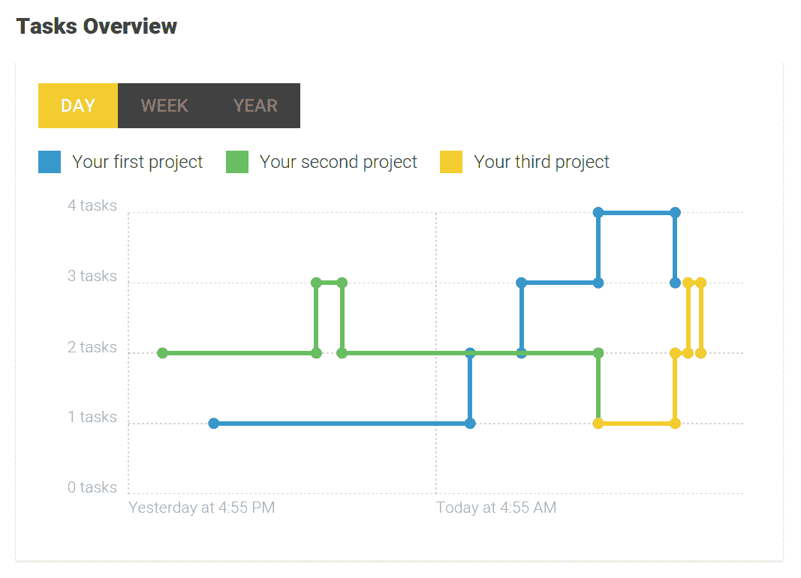
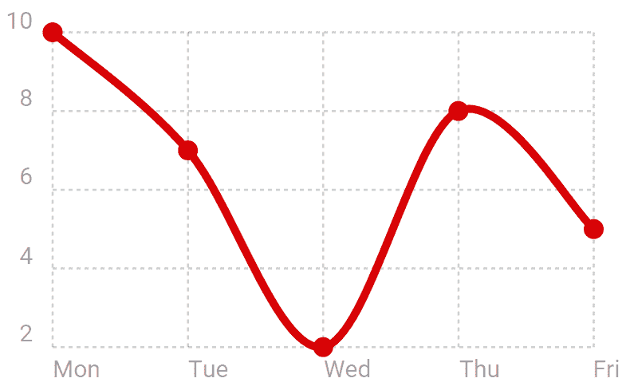
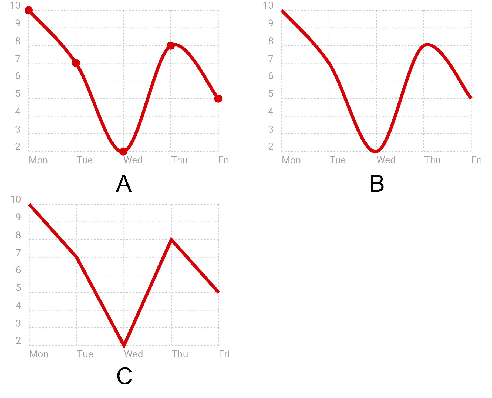
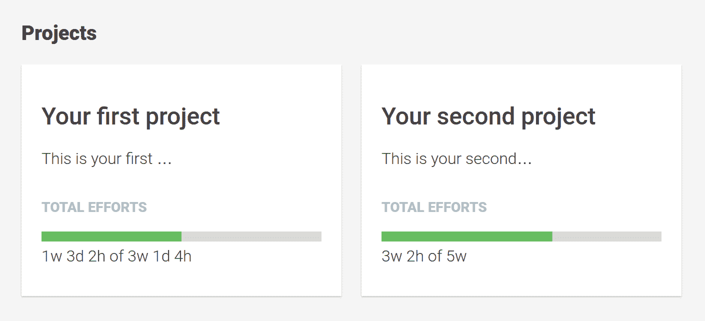
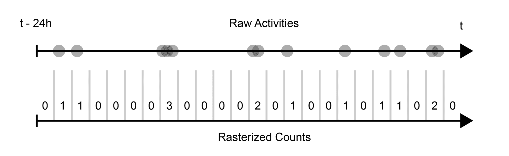
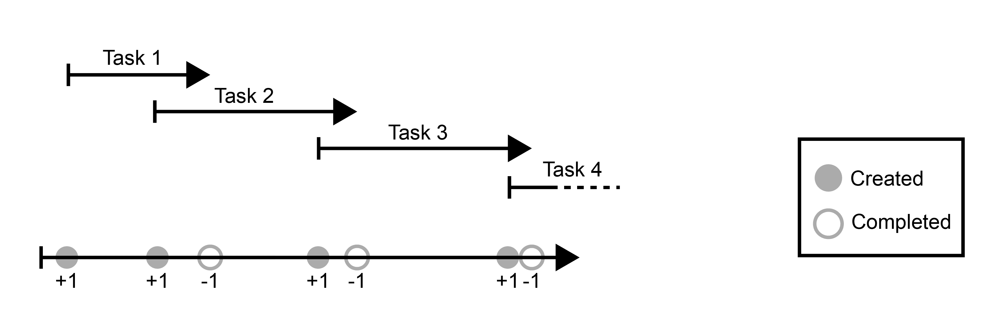
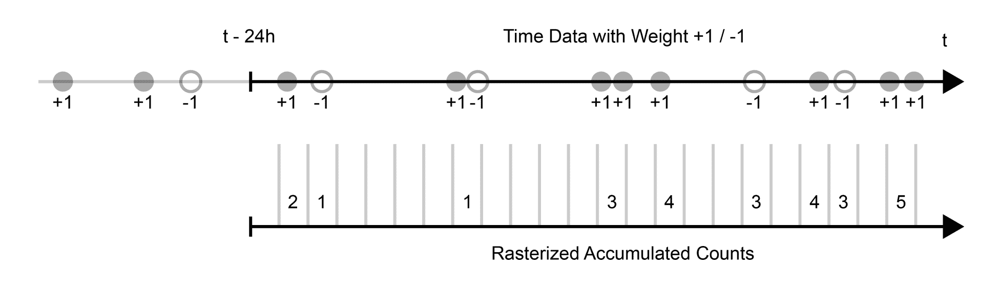
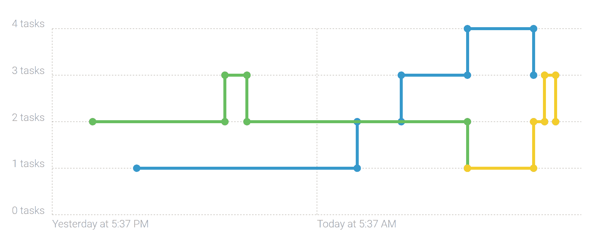
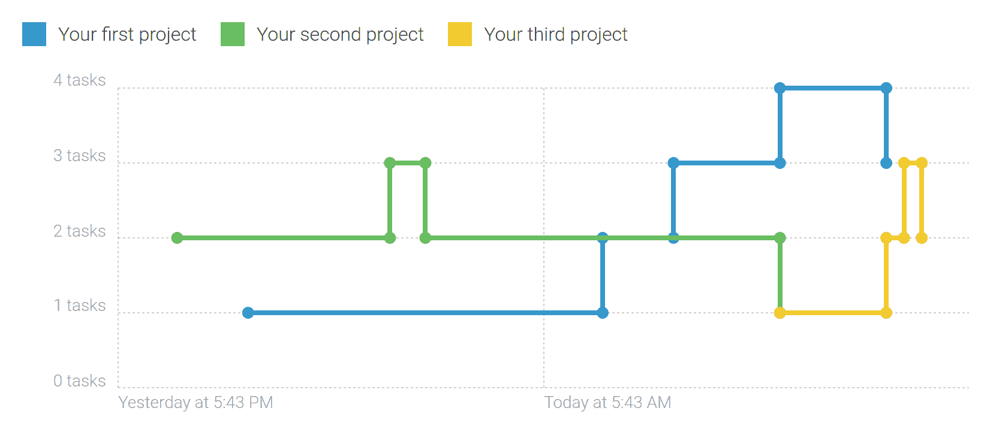

# 第九章：太空船仪表盘

当我还是个孩子的时候，我喜欢玩太空船飞行员。我把一些旧的纸箱堆起来，并装饰内部使其看起来像太空船驾驶舱。我用记号笔在箱子的内侧画了一个太空船仪表盘，我记得我在那里玩了好几个小时。

驾驶舱和太空船仪表盘的设计特别之处在于，它们需要在非常有限的空间内提供对整个太空船的概述和控制。我认为这同样适用于应用程序仪表盘。仪表盘应该为用户提供对整体状况的概述和感觉。

在本章中，我们将为我们的任务管理应用程序创建这样一个仪表盘。我们将利用开源图表库 Chartist 来创建外观美观、响应式的图表，并提供开放任务和项目状态的概述：



我们将在本章中构建的任务图表预览

在更高层次上，在本章中我们将创建以下组件：

+   **项目摘要**：这是提供对整体项目状态快速洞察的项目摘要。通过汇总项目中所有任务的投入，我们可以提供一个很好的整体投入状态，为此我们在上一章中创建了组件。

+   **项目活动图表**：没有标签或刻度，这个柱状图将快速传达过去 24 小时内项目活动的感觉。

+   **项目任务图表**：这个图表将提供项目任务进度的概述。我们将使用折线图显示一定时间内的开放任务数量。通过我们在第二章“准备，出发！”中创建的切换组件，我们将为用户提供一个简单的方法来切换图表上显示的时间范围。

# Chartist 简介

在本章中，我们将创建一些组件来渲染图表，并且我们应该寻求一些帮助来渲染它们。当然，我们可以采用与我们在第六章“跟上活动”中所使用的类似方法，当时我们绘制了活动时间线。然而，当涉及到更复杂的数据可视化时，最好依赖于库来完成繁重的工作。

我们将使用一个名为 Chartist 的库来填补这个空白，这并不令人惊讶，因为我几乎花了两年时间来编写它。作为 Chartist 的作者，我感到非常幸运，我们在这本书中找到了一个完美的位置来利用它。

在我们深入实现仪表盘组件之前，我想借此机会简要介绍一下 Chartist。

Chartist 声称提供简单的响应式图表。幸运的是，在存在三年之后，这仍然是事实。我可以告诉你，维护这个库最困难的工作可能是保护它免受功能膨胀的影响。开源社区中有许多伟大的运动、技术和想法，要抵制库范围的膨胀并始终专注于初始声明并不容易。

让我向您展示一个非常基础的例子，说明您如何在网站上包含 Chartist 脚本后创建简单的折线图：

```js
const chart = new Chartist.Line('#chart', { 
  labels: ['Mon', 'Tue', 'Wed', 'Thu', 'Fri'], 
  series: [ 
    [10, 7, 2, 8, 5] 
  ] 
}); 
```

为此示例所需的相应 HTML 标记如下所示：

```js
<body> 
<div id="chart" class="ct-golden-section"></div> 
</body> 
```

下图显示了 Chartist 生成的图表：



使用 Chartist 生成的简单折线图

我认为，通过说我们将坚持简单，我们并没有承诺太多。

让我们看看 Chartist 的第二个核心关注点，即完美响应。Chartist 尽可能地坚持清晰的关注点分离，这意味着它使用 CSS 来控制外观，SVG 来控制基本的图形结构，JavaScript 来控制任何行为。通过遵循这个原则，我们已经实现了很多响应性。我们可以使用 CSS 媒体查询在不同的媒体上为我们的图表应用不同的样式。

虽然 CSS 对于视觉样式来说很棒，但在渲染图表的过程中有很多元素，遗憾的是，这些元素无法通过 CSS 控制。毕竟，这就是我们使用 JavaScript 库来渲染图表的原因。

那么，如果我们无法在 CSS 中控制这一点，我们如何控制 Chartist 在不同媒体上渲染图表的方式呢？嗯，Chartist 提供了称为 **响应式配置覆盖** 的功能。使用浏览器的 `matchMedia` API，Chartist 能够提供一个配置机制，允许您指定仅在特定媒体（移动、桌面等）上使用的选项。

让我们看看如何使用移动优先的方法轻松实现响应式行为的一个简单例子：

```js
const chart = new Chartist.Line('#chart', { 
  labels: ['Mon', 'Tue', 'Wed', 'Thu', 'Fri'], 
  series: [ 
    [10, 7, 2, 8, 5]
  ]
}, {
  showPoint: true,
  showLine: true
}, [
  ['screen and (min-width: 400px)', {
    showPoint: false
  }],
  ['screen and (min-width: 800px)', {
    lineSmooth: false
  }]
]);
```

在这个例子中，`Chartist.Line` 构造函数的第二个参数设置初始选项；我们可以提供覆盖选项，以数组形式通过构造函数的第三个参数使用媒体查询进行注释。在这个例子中，我们将覆盖宽度大于 400 像素的任何媒体的 `showPoint` 选项。宽度大于 800 像素的媒体将同时接收 `showPoint` 覆盖和 `lineSmooth` 覆盖。

我们不仅可以通过指定真实的媒体查询来触发设置更改，还可以使用与 CSS 非常相似的覆盖机制。这样，我们可以实现各种方法，如范围或排他性媒体查询、移动优先或桌面优先。响应式选项机制可以用于 Chartist 中所有可用的选项：



在三种不同的媒体上显示前一个图表，从左到右，包括小于 400 像素的媒体（A）、小于 800 像素的媒体（B）和大于 800 像素的媒体（C）

如你所见，使用 Chartist 实现复杂的响应式行为非常简单。尽管我们的任务管理应用原本并不打算成为一个响应式网络应用，但我们仍然可以从中受益，以优化我们的内容。

关于 Chartist 的介绍就到这里，如果你想了解更多关于我的库的信息，我建议你查看项目的网站[`gionkunz.github.io/chartist-js`](http://gionkunz.github.io/chartist-js)。在网站上，你还可以访问实时示例页面[`gionkunz.github.io/chartist-js/examples.html`](http://gionkunz.github.io/chartist-js/examples.html)，在那里你可以直接在浏览器中修改一些图表。

# 项目仪表板

在本章中，我们将创建一个项目仪表板，它将包括以下组件：

+   **项目仪表板**：这是仪表板中的主要组件，代表了我们整个仪表板视图。它是其他组件的组合。

+   **项目摘要**：这是我们展示每个项目摘要的地方，我们将概述最重要的信息。我们的项目摘要组件还将包括一个活动图表组件，用于可视化项目活动。

+   **项目仪表板容器**：我们还需要创建一个新的容器组件，以便将我们的新组件树暴露给路由器，并将其连接到我们的数据库。

+   **任务图表**：这是我们提供开放任务随时间视觉概述的地方。所有项目将以折线图的形式表示，显示开放任务的进度。我们还将提供一些用户交互功能，以便用户可以选择不同的时间段。

+   **活动图表**：此组件在 24 小时的时间范围内以条形图的形式可视化活动。这将帮助我们的用户快速识别整体项目活动和峰值。

# 创建项目仪表板组件

让我们遵循我们确立的传统，首先建模我们将在组件中使用的数据。我们希望创建一个新的接口来总结项目。这包括项目数据、任务、活动和简短描述。

打开位于 `src/app/model.ts` 的模型文件，并添加以下接口：

```js
…

export interface ProjectSummary {
 project: Project;
 description: string;
 tasks: Task[];
 activities: ProjectActivity[];
}
```

使用此界面，我们可以将所有与项目相关的数据聚合到一个单一的对象中，这极大地简化了我们的开发工作。

让我们继续前进，创建我们的主要仪表板组件。项目仪表板组件负责组合主要仪表板布局，通过包含我们的仪表板子组件。它将我们项目仪表板中的所有部件组合在一起。

让我们使用 Angular CLI 工具创建我们的新项目仪表板组件：

```js
ng generate component --spec false -ve none -cd onpush projects-dashboard/projects-dashboard
```

打开位于路径`src/app/projects-dashboard/projects-dashboard/projects-dashboard.component.ts`的生成组件类，并用以下代码替换占位符代码：

```js
import {Component, ViewEncapsulation, ChangeDetectionStrategy, Input, EventEmitter, Output} from '@angular/core';
import {Project, ProjectSummary} from '../model';

@Component({
  selector: 'mac-projects-dashboard',
  templateUrl: './projects-dashboard.component.html',
  styleUrls: ['./projects-dashboard.component.css'],
  changeDetection: ChangeDetectionStrategy.OnPush,
  encapsulation: ViewEncapsulation.None
})
export class ProjectsDashboardComponent {
  @Input() projectSummaries: ProjectSummary[];
  @Output() outActivateProject = new EventEmitter<Project>();

  activateProject(project: Project) {
    this.outActivateProject.emit(project);
  }
}
```

我们的仪表板组件接受一个`projectSummaries`输入，这是一个符合我们刚刚在`TypeScript`模型文件中创建的`ProjectSummary`接口的项目摘要对象列表。

用户可以通过点击项目摘要组件来激活一个项目。我们的项目仪表板组件使用输出`outActivateProject`将事件委派给容器，这是我们稍后要创建的。

让我们看看组件的视图，并将文件`src/app/projects-dashboard/projects-dashboard/projects-dashboard.component.html`中的内容更改为以下内容：

```js
<header class="dashboard-header">
  <h2 class="dashboard-title">Dashboard</h2>
</header>
<div class="dashboard-main">
  <h3 class="dashboard-sub-title">Projects>h3>
 <ul class="dashboard-list">
    <li *ngFor="let projectSummary of projectSummaries"
        class="dashboard-list-item">
      <strong>projectSummary.project.title</strong>
      <p>projectSummary.description</p>
    </li>
  </ul>
</div>
```

目前，我们只显示了项目标题和我们将计算的项目摘要对象中的描述。在下一节中，我们将创建一个新的项目摘要组件，该组件将处理一些更复杂的渲染。

# 项目摘要组件

在本节中，我们将创建一个项目摘要组件，该组件将为项目提供一些概述信息。在我们的项目仪表板组件树中的容器组件中，我们将确保汇总所有必要的信息来总结项目。我们的项目摘要 UI 组件渲染项目摘要对象中提供的数据，以创建看起来很棒的项目概览卡片。

让我们使用 Angular CLI 工具开始构建我们的组件：

```js
ng generate component --spec false -ve none -cd onpush projects-dashboard/project-summary
```

让我们打开位于`src/app/projects-dashboard/project-summary/project-summary.component.ts`的组件类，并用以下代码替换其内容：

```js
import {ChangeDetectionStrategy, Component, Input, OnChanges, SimpleChanges, ViewEncapsulation} from '@angular/core';
import {ProjectSummary, TimeEfforts} from '../../model';

@Component({
  selector: 'mac-project-summary',
  templateUrl: './project-summary.component.html',
  styleUrls: ['./project-summary.component.css'],
  changeDetection: ChangeDetectionStrategy.OnPush,
  encapsulation: ViewEncapsulation.None
})
export class ProjectSummaryComponent implements OnChanges {
  @Input() projectSummary: ProjectSummary;

  totalEfforts: TimeEfforts;

  ngOnChanges(changes: SimpleChanges) {
    if (changes.projectSummary && this.projectSummary) {
      this.totalEfforts = this.projectSummary.tasks.reduce((totalEfforts, task) => {
        if (task.efforts) {
          totalEfforts.estimated += task.efforts.estimated || 0;
          totalEfforts.effective += task.efforts.effective || 0;
        }

        return totalEfforts;
      }, {
        estimated: 0,
        effective: 0
      });
    }
  }
}
```

`projectSummary`输入允许将项目摘要对象传递到我们的新 UI 组件中。在那里，我们有显示项目概览所需的所有必要信息。

如果您还记得上一章，第八章，《时间会证明》，我们已经使用 SVG 创建了一个不错的努力时间线组件。现在，在我们的项目摘要中，我们希望重用这个组件。然而，我们需要从我们项目的底层任务中计算总工作量。

我们需要做的是将所有任务工作量累积到一个总工作量中。使用`Array.prototype.reduce`函数，我们可以相对容易地累积所有任务工作量。我们依赖于项目摘要对象中存在的任务，该对象通过输入`projectSummary`传递给我们。由于我们希望在项目信息更改时重新计算总工作量，我们可以使用`OnChanges`生命周期钩子并实现`ngOnChanges`方法。

让我们创建组件的模板，看看我们将如何使用总工作量数据来显示我们的努力时间线组件。打开路径`src/app/projects-dashboard/project-summary/project-summary.component.ts`的文件，并添加以下内容：

```js
<div class="summary-title">{{projectSummary.project.title}}</div>
<div class="summary-description">
  {{projectSummary.description}}
</div>
<div class="summary-label">Total Efforts</div>
<mac-efforts-timeline [efforts]="totalEfforts">
</mac-efforts-timeline>
<p>{{totalEfforts | formatEfforts}}</p>
```

在显示项目标题和项目摘要的描述之后，我们包含了我们的努力时间线组件。我们只需将我们的计算出的 `totalEfforts` 传递到 `efforts` 输入中，努力时间线组件就会负责渲染。这个时间线现在将显示在给定项目的所有任务上记录的总努力量。

除了时间线之外，我们还渲染了格式化的努力文本，就像我们在上一章的努力组件中已经渲染的那样。为此，我们使用了 `formatEfforts` 管道。

现在，我们仍然需要将我们的项目摘要组件集成到项目仪表板组件中。

让我们打开位于 `src/app/projects-dashboard/projects-dashboard/projects-dashboard.component.html` 的项目仪表板模板，并修改模板以包含我们的项目摘要组件：

```js
<header class="dashboard-header">
 <h2 class="dashboard-title">Dashboard</h2>
</header>
<div class="dashboard-main">
  <h3 class="dashboard-sub-title">Projects</h3>
  <ul class="dashboard-list">
    <li *ngFor="let projectSummary of projectSummaries"
        class="dashboard-list-item">
 <mac-project-summary [projectSummary]="projectSummary"
 (click)="activateProject(projectSummary.project)">
 </mac-project-summary>
    </li>
  </ul>
</div>

```

我们可以直接将项目摘要对象转发到我们新创建的项目摘要组件。此外，我们在项目摘要组件上添加了一个点击事件绑定，这将触发项目仪表板组件上的 `activateProject` 方法。这将允许我们在容器组件内实现程序化导航，这是接下来要实现的功能：



一个显示两个项目摘要组件的项目仪表板，包含汇总的总努力量

好吧；到目前为止，一切顺利。我们创建了两个新的 UI 组件，并重用了我们的努力时间线组件来创建总任务努力的汇总视图。现在，是时候通过创建一个新的容器组件并配置应用程序的路由来集成我们的组件了。

# 集成项目仪表板

我们已经创建了初始的项目仪表板组件，并将开始将它们集成到我们的应用程序中。我们需要一个新的容器组件，我们也会在路由配置中公开它。我们还需要更新应用程序的导航组件，以便显示指向仪表板视图的新导航链接。

让我们从我们的新容器组件开始，并使用 Angular CLI 工具为其创建占位符：

```js
ng generate component --spec false -ve none -cd onpush container/projects-dashboard-container
```

打开位于 `src/app/container/projects-dashboard-container/projects-dashboard-container.component.ts` 的生成组件类，并用以下代码替换其内容：

```js
import {ChangeDetectionStrategy, Component, ViewEncapsulation} from '@angular/core';
import {ProjectService} from '../../project/project.service';
import {Observable, combineLatest} from 'rxjs';
import {Project, ProjectSummary} from '../../model';
import {map} from 'rxjs/operators';
import {Router} from '@angular/router';
import {ActivitiesService} from '../../activities/activities.service';
import {TaskService} from '../../tasks/task.service';
import {limitWithEllipsis} from '../../utilities/string-utilities';

@Component({
  selector: 'mac-projects-dashboard-container',
  templateUrl: './projects-dashboard-container.component.html',
  styleUrls: ['./projects-dashboard-container.component.css'],
  encapsulation: ViewEncapsulation.None,
  changeDetection: ChangeDetectionStrategy.OnPush
})
export class ProjectsDashboardContainerComponent {
  projectSummaries: Observable<ProjectSummary[]>;

  constructor(private projectService: ProjectService,
              private taskService: TaskService,
              private activitiesService: ActivitiesService,
              private router: Router) {
    this.projectSummaries = combineLatest(
      this.projectService.getProjects(),
      this.taskService.getTasks(),
      this.activitiesService.getActivities()
    ).pipe(
      map(([projects, tasks, activities]) =>
        projects
          .map(project => ({
            project,
            description: limitWithEllipsis(project.description, 100),
            tasks: tasks.filter(task => task.projectId === project.id),
            activities: activities.filter(activity => activity.projectId === project.id)
          }))
      )
    );
  }

  activateProject(project: Project) {
    this.router.navigate(['/projects', project.id]);
  }
}
```

我们新创建的容器负责收集创建项目摘要对象列表所需的所有信息。我们使用 RxJS 可观察对象创建一个反应性流的项目摘要对象。RxJS 工具 `combineLatests` 允许我们将项目、任务和活动合并到一个单一流中。在这个合并流中，我们使用 `map` 操作符为从项目服务中获取的每个项目创建一个项目摘要对象。

我们正在使用我们的`limitWithEllipsis`辅助函数将项目描述转换为（如果需要）截断版本，并将其直接添加到我们的项目摘要对象中。

我们还将在我们的容器组件中注入路由，并使用它来进行程序性导航到项目视图。我们已经实现了一个名为`activateProject`的方法，我们将从我们的视图中调用它。

让我们也更改容器组件的模板，其中我们想要渲染项目仪表板 UI 组件，并创建必要的绑定来将我们的项目摘要数据传递到 UI 组件树中。打开文件`src/app/container/projects-dashboard-container/projects-dashboard-container.component.html`，并用以下代码替换其内容：

```js
<mac-projects-dashboard
  [projectSummaries]="projectSummaries | async"
  (outActivateProject)="activateProject($event)">
</mac-projects-dashboard>
```

我们需要做的只是渲染我们的项目仪表板 UI 组件。我们将生成的项目摘要对象传递到组件输入中。由于我们使用可观察流实现了这一点，我们需要使用`async`管道。

当项目在项目仪表板 UI 组件中被激活时，我们收到一个`outActivateProject`输出事件，然后我们可以使用它来调用我们的`activateProject`方法。在那里，我们使用路由导航到指定的项目视图。

好的；现在，我们已经准备好了所有组件来渲染我们的项目仪表板。还有两件事要做。我们需要配置我们的路由来激活我们新创建的容器组件，并在我们的应用程序根组件中创建一个新的导航项。

让我们从路由配置开始。打开位于`src/app/routes.ts`的路由配置文件，并应用以下更改：

```js
…

import {ProjectsDashboardContainerComponent} from './container/projects-dashboard-container/projects-dashboard-container.component';

export const routes: Route[] = [{
 path: 'dashboard',
 component: ProjectsDashboardContainerComponent
}, {
  path: 'projects/:projectId',
  component: ProjectContainerComponent,
  canActivate: [ProjectContainerGuard],
  children: [{
    path: 'tasks',
    component: TaskListContainerComponent
  }, {
    path: 'tasks/:taskId',
    component: TaskDetailsContainerComponent
  }, {
    path: 'comments',
    component: ProjectCommentsContainerComponent
  }, {
    path: 'activities',
    component: ProjectActivitiesContainerComponent
  }, {
    path: '**',
    redirectTo: 'tasks'
  }]
}, {
  path: '',
  pathMatch: 'full',
  redirectTo: '/dashboard'
}];
```

我们添加了一个新的路由配置来激活我们的项目仪表板容器组件。此外，我们将默认的重定向 URL 更改为重定向到我们的仪表板，而不是第一个项目详情视图。

好的；让我们继续前进，并使用我们的新路由在我们的应用程序根组件中创建一个导航项。打开位于`src/app/app.component.html`的应用组件模板，并执行以下更改：

```js
<aside class="side-nav">
 <mac-user-area [user]="user | async"
                 [openTasksCount]="openTasksCount | async">
  </mac-user-area>
  <mac-navigation>
    <mac-navigation-section title="Main">
 <mac-navigation-item title="Dashboard"
 navId="dashboard"
 routerLinkActive="active"
 [routerLink]="['/dashboard']">
 </mac-navigation-item>
 </mac-navigation-section>
    <mac-navigation-section title="Projects">
      <mac-navigation-item *ngFor="let project of projects | async; trackBy: trackByProjectId"
                           [navId]="project.id"
                           [title]="project.title"
                           routerLinkActive="active"
                           [routerLink]="['/projects', project.id]">
      </mac-navigation-item>
    </mac-navigation-section>
  </mac-navigation>
</aside>
<main class="main">
  <router-outlet></router-outlet>
</main>
```

太棒了！你已经完成了集成我们第一套项目仪表板组件所需的所有步骤。你现在可以在浏览器中预览你的更改。在应用程序的主要导航中应该有一个新的导航项可用。另外，当你启动应用程序时，你应该自动被重定向到仪表板视图。

你现在可以尝试玩转努力聚合，并尝试修改项目的新的任务努力，看看摘要会如何受到影响。

在下一节中，我们将用漂亮的 Chartist 图表丰富我们的项目摘要组件。

# 创建你的第一个图表

在本节中，我们将使用 Chartist 创建我们的第一个图表，以提供过去 24 小时的项目活动概述。这个条形图将只提供一些关于项目活动的视觉线索，我们的目标不是提供详细的信息。因此，我们将配置它隐藏任何标签、刻度和网格线。唯一可见的部分应该是条形图的条形。

# 处理活动数据

在我们开始创建活动图本身之前，我们需要看看我们应该如何转换和准备我们的数据以供图表使用。

让我们看看我们系统中已有的数据。就活动而言，它们都在`time`字段中存储了一个时间戳。然而，对于我们的图表来说，一个时间戳列表是不够的。我们想要的是一个显示过去 24 小时内每小时一个条形的图表。每个小时的条形应该代表该时间段内的活动数量。

下面的插图显示了我们的源数据，基本上是活动事件的时序流。在下面的箭头上，我们可以看到我们需要为我们的图表结束的数据：



一幅显示活动作为时间流的插图，其中点代表活动。通过将事件光栅化到一小时的切片中，我们得到我们称之为光栅化计数的东西，如底部箭头所示。

首先，我们将在我们的应用程序模型中引入一个新的接口。我们希望在一个值列表中表示一个数据值，该值正在被光栅化。

我们使用“光栅化”这个术语来描述将底层数据采样到光栅上的过程。这与数字相机如何采样光线的光子并将它们累积在称为像素的光栅上非常相似。

由于我们不仅想为光栅化使用时间戳，而且根据情况不同，对数据值进行不同的加权，因此我们将引入以下接口到我们的模型中，位于`src/app/model.ts`：

```js
…

export interface RasterizationData {
  time: number;
  weight: number;
}
```

在前面的图中，我们计算了给定小时内所有的活动并将它们加起来。然而，我们需要一个更具体的解决方案，允许我们在计数时加入权重。这特别有用，如果你想使某些活动比其他活动更重要。通过在光栅化过程的数据输入上使用一个名为`weight`的属性，我们可以完成加权计数。实际上，我们不再在`timeframe`内计数数据值；我们正在将它们的权重加起来，以获得给定`timeframe`的总权重。这允许我们使用负权重，这将从总权重中减去。这对于我们将在稍后阶段创建的第二张图表将非常重要。

让我们实现执行概述数据转换的函数。我们将把这个函数添加到我们的时间实用模块中，位于`src/app/utilities/time-utilities.ts`：

```js
…

export function rasterize(
  timeData: RasterizationData[],
  timeFrame: number,
  quantity: number,
  now: number = +new Date(),
  fill: number = 0): number[] {

  now = Math.floor(now / timeFrame) * timeFrame;

  return timeData.reduce((rasterized: number[], data: RasterizationData) => {
    const index = Math.ceil((now - data.time) / timeFrame);
    if (index < quantity) {
      rasterized[index] = (rasterized[index] || 0) + data.weight;
    }
    return rasterized;
  }, <number[]>Array.from({length: quantity}).fill(fill)).reverse();
}
```

让我们简要地看看我们新创建的函数的输入参数：

+   `timeData`：此参数预期是一个包含一个`time`属性，设置为应计数的事件的戳记的光栅化数据对象数组。对象还应包含一个`weight`属性，用于计数。使用此属性，我们可以将一个事件计为两个，甚至可以计数负值以减少光栅化帧中的计数。

+   `timeFrame`：此参数指定每个光栅化帧的时间跨度，以毫秒为单位。如果我们想有 24 个光栅化帧，每个帧包含一小时，则此参数需要设置为 3,600,000（*1 小时=60 分钟=3,600 秒=3,600,000 毫秒*）。

+   `quantity`：此参数设置输出数组中应存在的光栅化帧的数量。在每小时 24 帧的情况下，此参数应设置为 24。

+   `now`：此参数应设置为光栅化过程开始的时间点。光栅化将始终向后移动时间，因此这个时间标记了我们的光栅化结束时间。`now`参数应是一个以毫秒为单位的时间戳。

+   `fill`：这是我们指定我们希望如何初始化我们的光栅化输出数组的方式。在我们的活动计数中，我们希望将其设置为零。

我们刚刚创建的函数对于创建活动图表是必要的。转换帮助我们为图表的输入数据准备项目活动。

# 创建活动图表

是时候使用 Chartist 创建我们的第一个图表组件了！然而，在我们进入组件之前，我们需要确保 Chartist 已安装在我们的项目中。让我们使用 npm 将 Chartist 作为依赖项安装：

```js
npm install chartist@0.11.0 @types/chartist@0.9.40 --save
```

Chartist 目前是用纯 JavaScript 编写的。幸运的是，社区为 Chartist 创建了一个非常复杂的类型定义，因此您可以在使用 TypeScript 与 Chartist 一起使用时受益于类型化接口。

好吧；这就是我们开始使用 Chartist 所需的所有内容。现在，让我们使用 Angular CLI 创建我们的活动图表：

```js
ng generate component --spec false -ve none -cd onpush projects-dashboard/activity-chart
```

让我们打开位于路径`src/app/projects-dashboard/activity-chart/activity-chart.component.html`上生成的模板，并用以下代码替换其内容：

```js
<div #chartContainer></div> 
```

由于我们将所有渲染工作都交给了 Chartist，这实际上是我们所需要的全部。Chartist 需要一个元素作为容器来创建图表。我们设置了一个`chartContainer`局部视图引用，这样我们就可以从我们的组件中引用它并将其传递给 Chartist。

让我们继续创建图表。打开位于`src/app/projects-dashboard/activity-chart/activity-chart.component.ts`的组件类，并添加以下代码：

```js
import {
  Component, ViewEncapsulation, ViewChild, ElementRef, Input, ChangeDetectionStrategy
} from '@angular/core';
import * as Chartist from 'chartist';
import {IChartistBarChart} from 'chartist';
import {Activity} from '../../model';

@Component({
  selector: 'mac-activity-chart',
  templateUrl: './activity-chart.component.html',
  styleUrls: ['./activity-chart.component.css'],
  changeDetection: ChangeDetectionStrategy.OnPush,
  encapsulation: ViewEncapsulation.None
})
export class ActivityChartComponent {
  @Input() activities: Activity[];
  @ViewChild('chartContainer') chartContainer: ElementRef;

  chart: IChartistBarChart;
}
```

除了从 Angular 核心模块导入之外，我们还导入了 Chartist 命名空间对象以及接口`IChartistBarChart`。

我们的组件接受一个活动列表作为输入，我们将使用我们新的光栅化函数对其进行转换。然后，使用 Chartist 可视化转换后的数据。我们使用一个成员，chart，来存储创建后的 Chartist 实例。

使用`ViewChild`装饰器，我们从组件视图中获取 DOM 元素，该元素将用作创建图表的容器。

让我们继续通过添加一个方法将活动列表转换为 Chartist 可以处理的内容。在同一个组件类文件中，追加以下方法：

```js
import {
  Component, ViewEncapsulation, ViewChild, ElementRef, Input, ChangeDetectionStrategy
} from '@angular/core';
import * as Chartist from 'chartist';
import {IChartistBarChart, IChartistData} from 'chartist';

import {rasterize, UNITS} from '../../utilities/time-utilities';
import {Activity, RasterizationData} from '../../model';

@Component({
  selector: 'mac-activity-chart',
  templateUrl: './activity-chart.component.html',
  styleUrls: ['./activity-chart.component.css'],
  changeDetection: ChangeDetectionStrategy.OnPush,
  encapsulation: ViewEncapsulation.None
})
export class ActivityChartComponent {
  @Input() activities: Activity[];
  @ViewChild('chartContainer') chartContainer: ElementRef;

  chart: IChartistBarChart;

 createChartData(): IChartistData {
 const timeData: RasterizationData[] = this.activities.map((activity) => {
 return {
 time: activity.time,
 weight: 1
 };
 });

 return {
 series: [
 rasterize(
 timeData,
 UNITS.find((unit) => unit.short === 'h').milliseconds,
 24,
 +new Date())
 ]
 };
 }
}
```

在`createChartData`方法中，我们首先从我们的组件输入提供的活动列表创建一个光栅化数据对象列表。我们可以使用活动时间作为时间戳，并且我们所有的活动目前计数相同，所以我们使用固定的权重`1`。

现在，我们希望提取过去 24 小时内每小时的活动数量。我们可以使用我们的`rasterize`函数，并带上必要的参数，将我们的活动转换为正好是那种格式的。`rasterize`函数将始终返回一个数字列表，表示在所需时间段内的活动数量。与光栅化数据一起，我们传递一个小时的毫秒数，总共 24 帧，以及当前时间作为时间起点。

我们的方法返回一个`IChartistData`类型的对象，其中包含我们想要使用 Chartist 可视化的数据。我们的`rasterize`函数的输出正好是表示 Chartist 中数据系列的正确格式。

让我们添加剩余的代码以完成我们的组件类。代码更改以粗体显示，而省略号字符表示无关的、隐藏的代码：

```js
import {
  Component, ViewEncapsulation, ViewChild, ElementRef, Input, ChangeDetectionStrategy,
  OnChanges, AfterViewInit
} from '@angular/core';
…

…
export class ActivityChartComponent implements OnChanges, AfterViewInit {
  @Input() activities: Activity[];
  @ViewChild('chartContainer') chartContainer: ElementRef;

  chart: IChartistBarChart;

  ngOnChanges() {
 this.createOrUpdateChart();
 }

 ngAfterViewInit() {
 this.createOrUpdateChart();
 }

  createOrUpdateChart() {
 if (!this.activities || !this.chartContainer) {
 return;
 }

 const data = this.createChartData();

 if (this.chart) {
 this.chart.update(data);
 } else {
 this.createChart(data);
 }
 }

  createChart(data: IChartistData) {
 this.chart = new Chartist.Bar(this.chartContainer.nativeElement, data, {
 width: '100%',
 height: 60,
 axisY: {
 onlyInteger: true,
 showGrid: false,
 showLabel: false,
 offset: 0
 },
 axisX: {
 showGrid: false,
 showLabel: false,
 offset: 0
 },
 chartPadding: {
 top: 0,
 right: 0,
 bottom: 0,
 left: 0
 }
 });

 this.chart.on('draw', (context) => {
 if (context.type === 'bar' && context.value.y === 0) {
 context.element.attr({
 y2: context.y2 - 1
 });
 }
 });
 }

  …
}
```

让我们更详细地查看代码，并逐步进行。

`createChart`方法使用传递给方法的数据创建一个新的图表实例。为了创建一个新的条形图，我们可以使用`Chartist.Bar`构造函数。作为第一个参数，我们传递容器视图子元素的 DOM 元素。Chartist 将在该容器元素中创建我们的图表。第二个参数是我们的数据，它来自我们的方法参数。在图表选项中，我们将设置一切以实现一个非常简单的图表外观，没有任何详细的信息。我们禁用网格，隐藏标签，并移除任何填充。

此外，我们使用 Chartist 的绘制事件来控制零值条形的绘制方式。默认情况下，Chartist 在条形的值为零时不会绘制条形。我们可以通过实现自己的自定义绘制事件逻辑来控制并更改此行为。

`createOrUpdateChart` 方法检查图表是否已经创建，并且只有在我们需要创建新的图表实例时才需要更新。这大大简化了我们的处理。由于我们从 `AfterViewInit` 和 `OnChanges` 生命周期钩子中被调用，我们需要确保在继续之前 `chartContainer` 视图子组件和 `activities` 输入都已就绪。

如果 `chart` 成员已经设置为之前创建的图表，我们可以使用 Chartist 实例上的 `update` 函数来使用新数据更新它。如果没有图表对象，我们需要创建一个新的图表。我们可以简单地调用我们的 `createChart` 方法。

这太棒了！我们已经使用 Chartist 创建了我们的第一个图表组件！现在，我们可以回到我们的项目摘要组件，并在其中集成活动图表，以提供活动概述。打开位于文件 `src/app/projects-dashboard/project-summary/project-summary.component.html` 的项目摘要组件模板，并应用以下更改：

```js
<div class="summary-title">{{projectSummary.project.title}}</div>
<div class="summary-description">
  {{projectSummary.description}}
</div>
<div class="summary-label">Total Efforts</div>
<mac-efforts-timeline [efforts]="totalEfforts">
</mac-efforts-timeline>
<p>{{totalEfforts | formatEfforts}}</p>
<div class="summary-label">Activity last 24 hours</div>
<mac-activity-chart [activities]="projectSummary.activities"></mac-activity-chart>
```

我们在现有模板的底部添加了我们的活动图表组件。我们还创建了必要的绑定，将我们已经在项目摘要对象上可用的活动传递到组件中。

恭喜！您已成功将 Chartist 库集成到您的项目中，并使用它在我们项目摘要组件中可视化项目活动。

在下一节中，我们将更深入地探讨 Chartist 的图表功能，并使用 Angular 提供一些交互性。

# 可视化开放任务

在本节中，我们将使用 Chartist 创建一个折线图组件，该组件将显示项目随时间推移的开放任务进度。为此，我们将使用具有特定插值的折线图，它提供量化步骤，而不是直接连接点的线条。

我们还将提供一些交互性，使用户能够通过切换按钮来切换显示的时间范围。这将允许我们重用我们在第二章，“准备，设置，出发！”中创建的切换 UI 组件。

# 准备任务数据

首先，让我们看看我们系统中关于项目任务可用的数据。`created` 属性设置为任务创建时的戳记。然而，如果一个任务被标记为已完成，我们目前并不保存那一刻的戳记。为了生成我们想要的图表，我们需要知道任务何时完成。

让我们在任务模型上引入一个新的属性来达到这个目的。打开位于 `src/app/model.ts` 的 `model` 文件，并应用以下更改：

```js
export interface Task {
  readonly id?: number;
  readonly projectId?: number;
  readonly title: string;
  readonly description?: string;
  readonly done: boolean;
  readonly order: number;
  readonly created: number;
 readonly completed?: number;
  readonly efforts?: TimeEfforts;
}

…
```

现在，我们需要确保在任务完成时在正确的时间设置`completed`属性。让我们打开位于`src/app/tasks/task/task.component.ts`的任务组件类，并应用以下更改。只修改以下代码摘录中突出显示的部分：

```js
…
export class TaskComponent {
  …

  updateTask(done: boolean) {
    this.outUpdateTask.emit({
      ...this.task,
      done,
 completed: done ? +new Date() : this.task.completed
    });
  }

  …
}
```

好的；为了完成这个练习，我们还想更新内存数据库中的初始数据，以反映一个更准确的场景。打开文件`src/app/database.ts`，并应用以下更改。同样，只更改突出显示的部分：

```js
import {InMemoryDbService} from 'angular-in-memory-web-api';
import {Activity, Project, Task, User} from './model';

export class Database implements InMemoryDbService {
  createDb() {
    …

    const hour = 3600000;
    const tasks: Task[] = [
      {id: 1, projectId: 1, title: 'Task 1', done: false, order: 1, created: +new Date() - hour * 8},
      {id: 2, projectId: 1, title: 'Task 2', done: false, order: 2, created: +new Date() - hour * 6},
      {id: 3, projectId: 1, title: 'Task 3', done: true, order: 3, created: +new Date() - hour * 12, completed: +new Date() - hour * 3},
      {id: 4, projectId: 1, title: 'Task 4', done: false, order: 4, created: +new Date() - hour * 20}
    ];

    …
  }
}
```

# 问题建模

首先，让我们思考一下如何显示随时间变化的打开任务数量的问题。因为我们只对任何给定时间的打开任务数量感兴趣，我们可以使用一个模型，其中我们将所有任务放在一个单独的时间线上，并且我们只关心任务创建或完成的事件。让我们通过以下插图来更好地理解这个问题：



一幅插图展示了我们如何使用创建和完成的事件来表示所有任务的时间线，其中创建的事件计为+1，而完成的事件计为-1。

下面的箭头表示时间线上创建和完成事件的全部任务。我们现在可以使用这些信息作为输入到我们的`rasterize`函数中，以获取我们图表所需的数据。因为用作函数输入的栅格化数据对象也支持`weight`属性，我们可以使用它来表示创建（`+1`）或完成（`-1`）的事件。

我们需要对我们的`rasterize`函数进行一些小的修改。到目前为止，`rasterize`函数只在帧中一起计算事件。然而，对于打开任务计数，我们将查看随时间的累积。如果任务计数发生变化，我们需要保持该值，直到它再次变化。在上一个章节中活动的转换中，我们没有使用这种相同的逻辑。在那里，我们只计算帧内的事件，但没有累积。

让我们通过以下插图来查看与我们在处理活动时应用的栅格化之间的差异：



一幅插图展示了我们如何随着时间的推移累积打开任务的数量。

我们可以随着时间的推移一起计算栅格化数据对象（事件）的每个`weight`属性。如果累积值发生变化，我们将当前累积值写入栅格化输出数组。

让我们将这个累积功能实现到我们的`rasterize`函数中。打开时间实用模块，路径为`src/app/utilities/time-utilities.ts`，并应用以下更改：

```js
export function rasterize(
  timeData: RasterizationData[],
  timeFrame: number,
  quantity: number,
  now: number = +new Date(),
  fill: number = 0,
 accumulate: boolean = false): number[] {

  now = Math.floor(now / timeFrame) * timeFrame;
  let accumulatedValue = 0;

  if (accumulate) {
 timeData = timeData.slice().sort((a, b) => a.time < b.time ? -1 : a.time > b.time ? 1 : 0);
 }

  return timeData.reduce((rasterized: number[], data: RasterizationData) => {
    accumulatedValue += data.weight;
    const index = Math.ceil((now - data.time) / timeFrame);
    if (index < quantity) {
      rasterized[index] = accumulate ? accumulatedValue : (rasterized[index] || 0) + data.weight;
    }
    return rasterized;
  }, <number[]>Array.from({length: quantity}).fill(fill)).reverse();
}
```

让我们回顾一下我们对`rasterize`函数所做的更改。

首先，我们向我们的函数中添加一个新的参数，命名为 `accumulate`。我们使用 ES6 默认参数来设置参数为 `false`，如果函数被调用时没有传入任何值。

我们定义一个新的 `accumulatedValue` 变量，并将其初始化为零。这个变量用于跟踪随时间累积的所有 `weight` 值的总和。

下面的代码片段非常重要。如果我们想要随时间累积所有 `weight` 值的总和，我们需要确保这些值按顺序到来。为了确保这一点，我们按 `timeData` 列表的 `time` 属性对它进行排序。

在 `reduce` 回调中，我们将 `accumulatedValue` 变量增加当前 `timeData` 对象的 `weight` 值。

如果 `timeData` 对象落入栅格化框架中，我们不会像之前那样增加这个框架的计数。在累积模式下，我们将框架计数设置为 `accumulatedValue` 中的当前值。这将导致所有更改的累积值都反映在栅格化输出数组中。

这就是我们创建开放任务图表所需的所有准备工作。我们能够重构我们的 `rasterize` 函数，现在它能够处理时间数据并生成适用于各种应用的栅格化数据系列。通过使用负 `weight` 属性，我们现在可以创建基于项目内开放任务的增加和减少的数据系列。

# 创建开放任务图表

让我们看看我们要创建的折线图：



使用我们的任务图表组件和 Chartist 的步进插值可视化开放任务

我们将利用前一个主题中重构的 `rasterize` 函数，并使用新的累积模式来跟踪随时间变化的开放任务数量。

让我们使用 Angular CLI 工具创建我们的新任务图表组件：

```js
ng generate component --spec false -ve none -cd onpush projects-dashboard/tasks-chart
```

让我们编辑组件类，在路径 `src/app/projects-dashboard/tasks-chart/tasks-chart.component.ts` 上，并将其内容更改为以下内容：

```js
import {
  AfterViewInit, ChangeDetectionStrategy, Component, ElementRef,
  Input, OnChanges, SimpleChanges, ViewChild, ViewEncapsulation
} from '@angular/core';
import * as Chartist from 'chartist';
import {IChartistData, IChartistLineChart} from 'chartist';
import * as moment from 'moment';

import {rasterize} from '../../utilities/time-utilities';
import {ProjectSummary, RasterizationData} from '../../model';

@Component({
  selector: 'mac-tasks-chart',
  templateUrl: './tasks-chart.component.html',
  styleUrls: ['./tasks-chart.component.css'],
  changeDetection: ChangeDetectionStrategy.OnPush,
  encapsulation: ViewEncapsulation.None
})
export class TasksChartComponent implements OnChanges, AfterViewInit {
  @Input() projectSummaries: ProjectSummary[];
  @ViewChild('chartContainer') chartContainer: ElementRef;

  chart: IChartistLineChart;

  ngOnChanges(changes: SimpleChanges) {
    this.createOrUpdateChart();
  }

  ngAfterViewInit() {
    this.createOrUpdateChart();
  }

  createOrUpdateChart() {
    if (!this.projectSummaries || !this.chartContainer) {
      return;
    }

    const data = this.createChartData();
    if (this.chart) {
      this.chart.update(data);
    } else {
      this.createChart(data);
    }
  }

  createChartData(): IChartistData {
    const now = +new Date();
    return {
      series: this.projectSummaries.map(projectSummary => {
        const tasks = projectSummary.tasks
          .filter(task => task.projectId === projectSummary.project.id);
        const timeData: RasterizationData[] = tasks.reduce((data, task) => {
          data.push({
            time: task.created,
            weight: 1
          });

          if (task.done) {
            data.push({
              time: task.completed,
              weight: -1
            });
          }
          return data;
        }, []);

        return rasterize(timeData, 600000, 144, now, null, true);
      }),
      labels: Array.from({
        length: 144
      }).map((e, index) => now - index * 600000).reverse()
    };
  }

  createChart(data: IChartistData) {
    this.chart = new Chartist.Line(this.chartContainer.nativeElement, data, {
      width: '100%',
      height: 300,
      lineSmooth: Chartist.Interpolation.step({
        fillHoles: true
      }),
      axisY: {
        onlyInteger: true,
        low: 0,
        offset: 70,
        labelInterpolationFnc: value => `${value} tasks`
      },
      axisX: {
        labelInterpolationFnc: (value, index) =>
          index % Math.floor(144 / 2) === 0 ?
            moment(value).calendar() : null,
        labelOffset: {
          y: 10
        }
      }
    }, [
      ['screen and (min-width: 1200px)', {
        axisX: {
          labelInterpolationFnc: (value, index) =>
            index % Math.floor(144 / 4) === 0 ?
              moment(value).calendar() : null
        }
      }], ['screen and (min-width: 1500px)', {
        axisX: {
          labelInterpolationFnc: (value, index) =>
            index % Math.floor(144 / 6) === 0 ?
              moment(value).calendar() : null
        }
      }]
    ]);
  }
}
```

上述代码的基本结构应该已经让你很熟悉了。我们使用与之前图表相同的结构。然而，我们现在要创建的折线图包含更多详细的信息。我们将渲染轴标签和一些刻度。我们图表的 *x* 轴将是一个时间线，我们将使用 Moment.js 库将时间戳格式化为可读格式。

让我们更仔细地看看 `createChartData` 和 `createChart` 方法。这里有很多代码！让我们一步一步地走一遍，以便更好地理解正在发生的事情。

我们使用 `projectSummaries` 输入作为数据可视化的基础。我们使用更新的 `rasterize` 函数转换任务数据，以便为我们的折线图准备数据。

首先，我们需要通过映射项目摘要列表来创建我们的转换后的系列数据。系列数组应该包括每个项目的数据数组。每个数据数组将包含随时间变化的开放项目任务。

由于`rasterize`函数期望一个光栅化数据对象的列表，我们首先需要将项目任务列表转换成这种格式。我们将利用`rasterize`函数的权重功能。我们可以简单地为每个创建的任务创建一个权重为`1`的光栅化数据对象。对于完成的任务，我们创建一个权重为`-1`的光栅化数据对象。这为我们`rasterize`函数提供了所需输入数据。

准备好数据后，我们可以调用`rasterize`函数，以创建一定数量的光栅化帧的开放任务列表。我们使用十分钟的时间框架（600,000 毫秒）和 144 帧进行光栅化。这总共是 24 小时。所以，这就是那些两个神奇数字的来源！然而，当我们引入图表的交互性时，此代码将略有变化。

除了系列数据外，我们还需要为我们的图表添加标签。我们创建一个新的数组，并使用 144 个时间戳初始化它，所有这些时间戳都设置为我们在图表上显示的 144 个光栅化帧的开始。

我们现在有了系列数据和标签，接下来要做的就是渲染我们的图表。在`createChart`方法中，我们使用`Chartist.Line`构造函数创建我们的折线图实例。

使用`lineSmooth`配置，我们可以为我们的折线图指定一种特殊的插值。步进插值不会直接连接我们折线图中的每个点，而是将我们的数据以离散的步骤绘制出来，从一个点到另一个点。这正是我们渲染随时间变化的开放任务计数所需要的效果。

在步骤插值中设置`fillHoles`选项为`true`非常重要。使用此设置，我们实际上可以告诉 Chartist 它应该关闭数据中的任何间隙（实际上是空值）并将线连接到下一个有效值。如果没有此设置，我们会在图表中看到数据数组中任务计数变化之间的间隙。

好的；目前我们组件类中需要的就是这些。让我们继续到任务图表组件相对简单的模板。打开位于路径`src/app/projects-dashboard/tasks-chart/tasks-chart.component.html`的文件，并更改其内容如下：

```js
<div #chartContainer class="chart-container"></div>
```

与活动图表组件类似，我们只创建一个简单的图表容器元素，我们已经在组件类中使用视图子装饰器引用了它。

我们的任务图表组件现在已准备好集成到我们的仪表板中。我们可以通过修改项目仪表板组件的模板来实现这一点。让我们打开位于路径`src/app/projects-dashboard/projects-dashboard/projects-dashboard.component.html`的文件，并应用以下更改：

```js
<header class="dashboard-header">
  <h2 class="dashboard-title">Dashboard</h2>
</header>
<div class="dashboard-main">
 <h3 class="dashboard-sub-title">Tasks Overview</h3>
 <div class="dashboard-tasks">
 <mac-tasks-chart [projectSummaries]="projectSummaries">
 </mac-tasks-chart>
 </div>
  <h3 class="dashboard-sub-title">Projects</h3>
 <ul class="dashboard-list">
    <li *ngFor="let projectSummary of projectSummaries"
        class="dashboard-list-item">
      <mac-project-summary [projectSummary]="projectSummary"
                           (click)="activateProject(projectSummary.project)">
      </mac-project-summary>
    </li>
  </ul>
</div>
```

很好！这基本上就是我们需要的，让我们的新创建的任务图表出现在我们的仪表板上。你已经创建了一个简单的折线图来可视化随时间推移的开放任务。

让我们进一步增强我们的图表，通过渲染图例并使图表对用户交互化。

# 创建图表图例

目前，我们无法确切知道图表上的哪一行代表哪个项目。我们可以看到每个项目有一条彩色线，但我们无法将这些颜色关联起来。我们需要的是一个简单的图例，帮助我们的用户将折线图的颜色与项目关联起来。

让我们看看实现图表图例所需的代码更改。打开位于路径 `src/app/projects-dashboard/tasks-chart/tasks-chart.component.ts` 的任务图表组件类，并应用以下更改。不相关的更改部分使用省略号字符隐藏，而有效的更改部分用粗体标出：

```js
…

export interface ChartLegendItem {
 title: string;
 class: string;
}

@Component({
  selector: 'mac-tasks-chart',
  templateUrl: './tasks-chart.component.html',
  styleUrls: ['./tasks-chart.component.css'],
  changeDetection: ChangeDetectionStrategy.OnPush,
  encapsulation: ViewEncapsulation.None
})
export class TasksChartComponent implements OnChanges, AfterViewInit {
  …

  legend: ChartLegendItem[];

  ngOnChanges(changes: SimpleChanges) {
    if (changes.projectSummaries && this.projectSummaries) {
 this.legend = this.projectSummaries.map((projectSummary, index) => ({
 title: projectSummary.project.title,
 class: `series-${index + 1}`
 }));
 }

    this.createOrUpdateChart();
  }

  …
}
```

我们在我们的组件模块中添加了一个本地接口来表示单个图例项。`title` 属性将在图例中的每个项中显示。`class` 属性用于设置适当的 CSS 类，以便以正确的颜色渲染每个图例项，以匹配图表中线条的颜色。

在 `OnChanges` 生命周期钩子中，我们简单地将项目摘要对象映射到一个图例对象列表。模板字符串 `` `series-${index + 1}` `` 将生成必要的类名，以便在我们的图例中渲染正确的颜色。

使用这个图例信息，我们现在可以继续实施必要的模板更改，以在我们的任务图表组件中渲染图例。打开位于路径 `src/app/projects-dashboard/tasks-chart/tasks-chart.component.html` 的模板，并应用以下更改：

```js
<ul class="series-list">
  <li *ngFor="let series of legend"
      class="series {{series.class}}">{{series.title}}</li>
</ul>
<div #chartContainer class="chart-container"></div>
```

嗯，这很简单，对吧？然而，结果证明了一切。我们仅用几分钟就为图表创建了一个漂亮的图例：



带有我们添加的图例的开放任务图表

在下一个主题中，我们将向我们的图表添加一些用户交互功能，并让我们的用户控制我们用来渲染数据的时段。

# 使任务图表交互化

目前，我们硬编码了开放任务图表的时段为 144 帧，每帧 10 分钟，总共显示给用户 24 小时。然而，也许我们的用户想要更改这个视图。

在这个主题中，我们将使用我们的切换组件创建一个简单的输入控制，这将允许我们的用户更改图表的时间段设置。

我们将提供以下视图作为选择选项：

+   **日**：此视图将转换为 144 帧，每帧 10 分钟，总共 24 小时

+   **周**：此视图将转换为 168 帧，每帧一小时，总共七天

+   **年**：此视图将转换为 360 帧，每帧代表一天

让我们从修改位于路径`src/app/projects-dashboard/tasks-chart/tasks-chart.component.ts`的任务图表组件的`TypeScript`文件开始实施：

```js
…

export interface ChartTimeFrame {
 name: string;
 timeFrame: number;
 amount: number;
}

@Component({
  selector: 'mac-tasks-chart',
  templateUrl: './tasks-chart.component.html',
  styleUrls: ['./tasks-chart.component.css'],
  changeDetection: ChangeDetectionStrategy.OnPush,
  encapsulation: ViewEncapsulation.None
})
export class TasksChartComponent implements OnChanges, AfterViewInit {
  …

 timeFrames: ChartTimeFrame[] = [{
 name: 'day',
 timeFrame: 600000,
 amount: 144
 }, {
 name: 'week',
 timeFrame: 3600000,
 amount: 168
 }, {
 name: 'year',
 timeFrame: 86400000,
 amount: 360
 }];
 timeFrameNames = this.timeFrames.map((timeFrame) => timeFrame.name);
 selectedTimeFrame = this.timeFrames[0];

  …

  selectTimeFrame(timeFrameName: string) {
 this.selectedTimeFrame = this.timeFrames.find((timeFrame) => timeFrame.name === timeFrameName);
 this.createOrUpdateChart();
 }

  createChartData(): IChartistData {
    const now = +new Date();
    return {
      series: this.projectSummaries.map(projectSummary => {
        …

       return rasterize(timeData, this.selectedTimeFrame.timeFrame, 
 this.selectedTimeFrame.amount, now, null, true);
      }),
      labels: Array.from({
        length: this.selectedTimeFrame.amount
      }).map((e, index) => now - index * this.selectedTimeFrame.timeFrame).reverse()
    };
  }

  …
}
```

让我们简要回顾这些更改。首先，我们添加了另一个本地接口来表示用户所看到的`timeframe`选择。`ChartTimeFrame`接口包含一个名称属性，我们将使用它来向用户展示。我们还为每个图表`timeframe`对象存储了`timeFrame`和`amount`属性。这两个属性分别代表每个帧的毫秒数和帧计数。

新的`timeFrames`成员被设置为`timeframe`对象数组。这些是我们将向用户展示的选择，它们反映了本节开头讨论的设置。`timeFrameNames`成员包含时间范围名称列表，这是直接从`timeFrames`列表派生出来的。最后，我们有一个`selectedTimeFrame`成员，它简单地指向第一个可用的时间范围对象以开始。

在`createOrUpdateChart`函数中，我们不再依赖于硬编码的值来进行任务栅格化，而是参考`selectedTimeFrame`对象中的数据。通过更改此对象引用并再次调用`createOrUpdateChart`函数，我们现在可以动态地切换底层数据的视图。

最后，我们添加了一个新的`selectTimeFrame`方法，我们将从组件视图中调用它以切换到不同的时间范围。

让我们看看启用时间范围切换所需的模板更改。我们使用我们在本书开头创建的`toggle` UI 组件：

```js
<mac-toggle [buttonList]="timeFrameNames"
 [activeButton]="selectedTimeFrame.name"
 (outActivate)="selectTimeFrame($event)"></mac-toggle>
<ul class="series-list">
  <li *ngFor="let series of legend"
      class="series {{series.class}}">{{series.title}}</li>
</ul>
<div #chartContainer class="chart-container"></div>
```

从对`toggle`组件的绑定中，你可以看出我们依赖于组件的`timeFrameNames`成员来表示所有可选择的时帧。我们还使用任务图表组件的`selectedTimeFrame`属性绑定到`toggle`组件的`activeButton`输入属性。当用户激活一个切换按钮时，我们调用`selectTimeFrame`函数，在那里时帧被切换，图表被更新。

这就是我们需要的所有内容，以启用在图表上切换时间范围。现在，用户可以在年、周和日视图之间进行选择。

优秀的成果！你通过重用`toggle` UI 组件为任务图表添加了交互性。让我们看看我们工作的最终结果：


最终的任务图表，现在在应用程序仪表板中渲染

# 摘要

在本章中，我们学习了 Chartist 及其如何与 Angular 结合使用来创建外观美观且功能齐全的图表。我们可以利用这两个世界的力量来创建可重用的图表组件，这些组件封装得很好。

就像在大多数实际案例中一样，我们总是有大量的数据可用。然而，将那些数据转换成正确的形状有时是有些棘手的。在这一章中，我们学习了如何将现有数据转换成适合视觉表示的优化形式。

在下一章中，我们将探讨如何在我们的应用程序中构建一个插件系统。这将使我们能够开发可移植的功能，并将其打包成插件。我们的插件系统将动态渲染新插件，我们将用它来开发一个简单的敏捷估算插件。
