# 第二章：<st c="0">1</st>

# <st c="2">使用 TDD 的第一步</st>

**<st c="34">测试驱动开发</st>** <st c="58">(**<st c="60">TDD</st>**) 是一种在 Angular 开发中广泛使用的软件开发流程，用于确保代码质量并减少调试时间。通过在编写生产代码之前编写自动化测试，开发者可以确保他们的代码符合预期的规范，并且随着时间的推移可以轻松修改和维护。

<st c="380">在本章中，我们将探讨 Angular 中 TDD 的早期阶段。</st> <st c="448">我们将首先讨论 TDD 在 Angular 开发中的作用以及它如何有助于提高代码质量。</st> <st c="567">然后，我们将设置开发环境，这包括安装必要的工具</st> <st c="661">和依赖项。</st>

<st c="678">接下来，我们将创建一个新的 Angular 项目，并探索与编写测试相关的各种文件，包括包含实际测试的 spec 文件，以及</st> `<st c="842">karma.conf.js</st>` <st c="855">文件，该文件用于配置</st> <st c="893">测试框架。</st>

<st c="911">在本章中，我将提供编写有效的 Angular 测试的示例和最佳实践，例如使用描述性的测试名称、测试所有代码路径以及使用模拟数据来模拟</st> <st c="1115">不同的场景。</st>

<st c="1135">在本章结束时，你将对 Angular 中 TDD 的基础知识有一个扎实的理解，并了解如何开始使用它。</st> <st c="1257">无论你是 TDD 的新手还是想提高你的技能，本章都将为你提供创建高质量 Angular 应用程序所需的知识和工具。</st>

<st c="1453">我们将涵盖以下主题：</st> <st c="1472">以下主题：</st>

+   <st c="1489">理解 TDD 及其在</st> <st c="1521">Angular 中的作用</st>

+   <st c="1531">设置</st> <st c="1547">开发环境</st>

+   <st c="1570">创建一个新的</st> <st c="1586">Angular 项目</st>

+   <st c="1601">探索与</st> <st c="1639">编写测试</st> 相关的不同文件

# <st c="1652">技术要求</st>

<st c="1675">为了跟随本章中的示例和练习，你需要对 Angular 和 TypeScript 有基本的了解，以及安装在你的</st> <st c="1879">计算机上</st> 的代码编辑器，例如 Visual Studio Code。

<st c="1892">本章的所有代码文件都可以在</st> <st c="1942">以下位置找到</st> [<st c="1945">https://github.com/PacktPublishing/Mastering-Angular-Test-Driven-Development/tree/main/Chapter%201</st>](https://github.com/PacktPublishing/Mastering-Angular-Test-Driven-Development/tree/main/Chapter%201)<st c="2043">。</st>

# <st c="2044">理解 TDD 及其在 Angular 中的作用</st>

<st c="2086">在本节中，我们将探讨</st> <st c="2119">TDD 的基础及其在 Angular 开发中的作用。</st> <st c="2181">我们将首先讨论使用 TDD 的一般好处，例如提高代码质量、加快开发周期和减少调试时间。</st> <st c="2250">然后，我们将探讨 TDD 如何融入 Angular 开发的整体流程，以及如何用它来创建可扩展和可维护的应用程序。</st>

## <st c="2481">什么是 Angular 和 TDD？</st>

<st c="2506">Angular 是一个流行的</st><st c="2525">开源</st> <st c="2529">JavaScript 框架，用于构建复杂网络应用程序。</st> <st c="2613">它由 Google 开发，并被世界各地的开发者广泛使用。</st> <st c="2684">Angular 提供了一套工具和功能，使得构建动态、响应和可扩展的网络应用程序变得容易。</st>

<st c="2814">Angular 是一个基于组件的框架，允许开发者构建可重用的 UI 组件。</st> <st c="2910">这些组件可以组合起来创建复杂用户界面，使得维护和扩展应用程序变得容易。</st> <st c="3033">Angular 还提供了内置的测试支持，使得编写和执行 Angular 应用程序的测试变得容易。</st>

<st c="3152">TDD 是一种软件开发动态方法，优先于在代码实现之前增量创建测试。</st> <st c="3270">TDD 流程围绕一个称为</st> **<st c="3351">红-绿-重构</st>** <st c="3369">循环的结构化序列，它包括以下阶段：</st>

+   **<st c="3416">编写失败的测试</st>**<st c="3439">：通过编写一个故意失败的测试来启动循环。</st> <st c="3506">这个测试作为所需功能的规范。</st>

+   **<st c="3572">禁止过于复杂的测试</st>**<st c="3605">：强调创建仅必要复杂的测试。</st> <st c="3681">避免不必要的复杂性确保测试始终专注于特定的功能，增强清晰度和可维护性。</st> <st c="3794">。

+   **<st c="3814">最小化代码实现</st>**<st c="3845">：编写通过失败测试所需的最少代码。</st> <st c="3906">这种极简方法确保代码专注于满足指定的要求。</st>

<st c="4003">TDD 的迭代性质如下：编写失败的测试，实现代码以通过测试，并重构代码以增强代码设计和可维护性。</st> <st c="4032">这个迭代循环持续到整个代码库</st> <st c="4241">完成。</st>

<st c="4253">TDD 在代码执行前编写测试的独特方法具有双重作用。</st> <st c="4338">首先，它通过符合预定义的测试要求来保证代码的正确性。</st> <st c="4423">其次，它促进了干净、可维护和可适应的代码的创建。</st> <st c="4499">鼓励开发者遵循最佳实践，从而产生易于理解、可修改和在整个软件开发生命周期中可扩展的代码。</st> <st c="4666">生命周期。</st>

<st c="4677">现在我们知道了 Angular 是什么，并了解了使用 TDD 方法的好处，让我们来理解红绿重构周期。</st> <st c="4786">红绿重构周期。</st>

## <st c="4811">红绿重构周期</st>

<st c="4840">红绿重构周期是 TDD 的一个基本概念。</st> <st c="4903">它在软件开发中充当一个强大且系统的方法论，为开发者提供了一个结构化的框架，以实现渐进式进步。</st> <st c="4955">这种方法旨在将开发过程分解为离散、可管理的</st> <st c="5137">步骤，保证代码正确性并符合预定义的测试要求。</st> <st c="5224">现在，让我们深入了解这个迭代过程中的每个阶段 – 红色、绿色和重构 – 的技术细节：</st>

+   **<st c="5341">红色 – 编写失败的测试</st>** **<st c="5358">：**</st>

    <st c="5372">红绿重构周期的第一步是编写一个失败的测试。</st> <st c="5447">测试应定义代码的预期行为，并且应该以它最初失败的方式来编写。</st> <st c="5559">这被称为“红色”步骤</st> <st c="5566">因为测试预期</st> <st c="5618">将失败。</st>

+   **<st c="5626">绿色 – 编写通过测试的代码</st>** **<st c="5656">：**</st>

    <st c="5666">第二步是编写使测试通过的代码。</st> <st c="5733">代码应该是最小的，并且只应该编写来使测试通过。</st> <st c="5814">这被称为“绿色”步骤</st> <st c="5846">因为测试预期</st> <st c="5875">将通过。</st>

+   **<st c="5883">重构 – 不改变功能的情况下改进代码</st>** **<st c="5918">：**</st>

    <st c="5942">一旦测试通过，开发者可以通过消除重复、简化代码和改进其可读性来重构代码，从而增强其设计、可读性和可维护性。</st> <st c="6141">关键是不要改变测试所覆盖的功能。</st>

<st c="6228">在下一节中，我们将探讨红绿重构周期的益处。</st>

## <st c="6318">红绿重构周期的益处</st>

<st c="6359">红绿重构周期有几个益处，包括以下内容：</st> <st c="6421">以下：</st>

+   **<st c="6435">增强代码质量</st>**<st c="6457">：红-绿-重构循环确保代码正确、可靠，并满足测试中预定义的要求</st> <st c="6574">的测试</st>

+   **<st c="6583">加速开发</st>**<st c="6607">：红-绿-重构循环允许开发者在开发过程中早期捕捉错误，这节省了时间并减少了修复错误的成本</st> <st c="6748">的修复错误</st>

+   **<st c="6759">更好的协作</st>**<st c="6780">：红-绿-重构循环鼓励开发人员、测试人员和其他利益相关者之间的协作，这改善了沟通并有助于确保每个人都处于</st> <st c="6963">同一页</st>

+   **<st c="6972">简化维护</st>**<st c="6995">：红-绿-重构循环生成的代码更容易维护和扩展，这减少了未来开发的成本和努力</st> <st c="7117">的未来开发</st>

<st c="7135">通过使用红-绿-重构</st> <st c="7167">循环，开发人员可以构建可靠、可维护和可扩展的</st> <st c="7233">软件应用</st>。

<st c="7255">接下来，我们将学习 TDD 在应用时是如何成为一个重要资产的。</st> <st c="7314">在应用时。</st>

## <st c="7321">TDD 在 Angular 开发中的作用</st>

<st c="7360">TDD 在 Angular 开发中扮演着关键角色。</st> <st c="7411">通过首先编写测试，开发人员可以确保代码正确并满足测试中定义的要求。</st> <st c="7531">这确保了应用是可靠的</st> <st c="7577">并减少了错误和缺陷的风险。</st> <st c="7618">TDD 还鼓励开发人员编写干净、易于维护的代码，易于修改和扩展，这使得随着时间的推移更容易维护和更新应用</st> <st c="7773">。</st>

<st c="7784">Angular 提供了内置的测试支持，使得编写和执行 Angular 应用的测试变得容易。</st> <st c="7900">Angular 测试框架提供了一套工具和功能，使得编写单元测试、集成测试和端到端测试变得容易。</st> <st c="8072">这些测试可以作为构建过程的一部分自动运行，确保应用始终得到测试并保持可靠。</st> <st c="8186">和可靠。</st>

<st c="8199">在下一节中，我们将设置开发环境，这涉及到准备开发</st> <st c="8330">项目所需的工具和资源</st>。

# <st c="8342">设置开发环境</st>

<st c="8381">在理论上理解 TDD 及其在 Angular 应用程序开发中的作用后，下一步是配置我们的开发环境，以便我们可以在 Angular 中应用 TDD 原则。</st> <st c="8577">为此，我们需要安装创建 Angular 项目的所需工具。</st> <st c="8657">通过遵循正确的步骤，我们可以创建一个促进使用 TDD 原则在 Angular 中进行有效和高效开发的开发环境</st> <st c="8798">。</st>

<st c="8809">设置 Angular 的开发环境可能比设置通用开发环境要复杂一些。</st> <st c="8936">然而，有了正确的指导，这可以是一个简单直接的过程。</st> <st c="9007">在这里，我们将介绍你需要采取的步骤来设置你的 Angular 开发环境。</st> <st c="9104">那么，让我们开始吧。</st>

## <st c="9126">在 Windows 或 macOS 上安装 Node.js</st>

<st c="9165">按照以下步骤</st> <st c="9184">在 Windows</st> <st c="9207">或 macOS 上安装 Node.js：</st>

1.  <st c="9224">访问官方 Node.js 网站（</st>[<st c="9261">https://nodejs.org/en/</st>](https://nodejs.org/en/)<st c="9284">），然后点击 LTS</st> <st c="9304">版本的**<st c="9312">下载</st>** <st c="9332">按钮。</st> <st c="9341">这将下载适用于 Windows</st> <st c="9370">或 macOS 的最新版本 Node.js：</st>

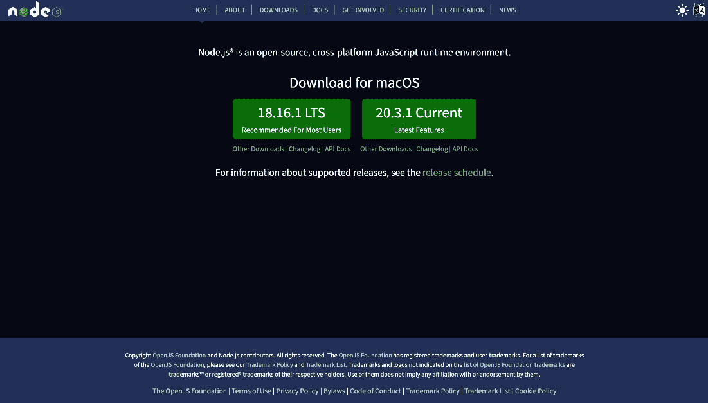

<st c="9542">图 1.1 – Node.js 首页</st>

<st c="9572">一旦安装程序下载完成，通过双击下载的文件来运行它。</st> <st c="9668">你应该会看到 Node.js</st> <st c="9695">设置向导：</st>

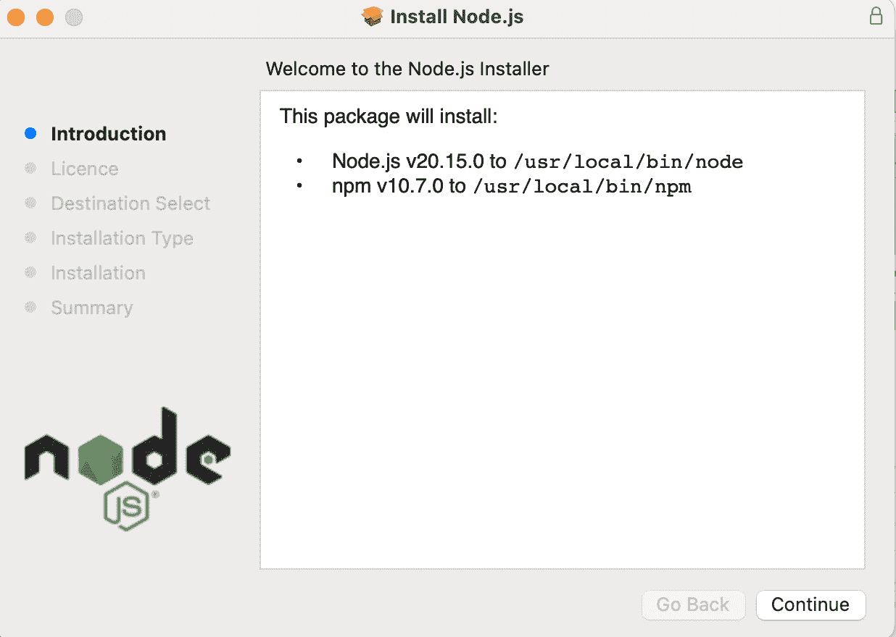

<st c="9889">图 1.2 – Node.js 安装 – 步骤 1</st>

1.  <st c="9931">阅读许可</st> <st c="9956">协议，如果你同意条款，请点击</st> **<st c="9981">同意</st>** <st c="9986">按钮：</st> <st c="10010">。</st>

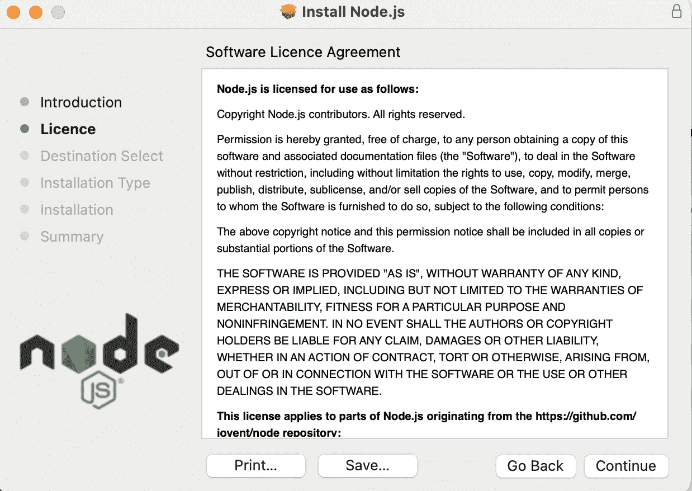

<st c="11349">图 1.3 – Node.js 安装 – 步骤 2</st>

1.  <st c="11391">接下来，选择</st> <st c="11404">你想要安装 Node.js 的位置。</st> <st c="11453">默认位置</st> <st c="11456">通常就很好，但如果你</st> <st c="11473">更喜欢的话，可以选择不同的位置：</st>

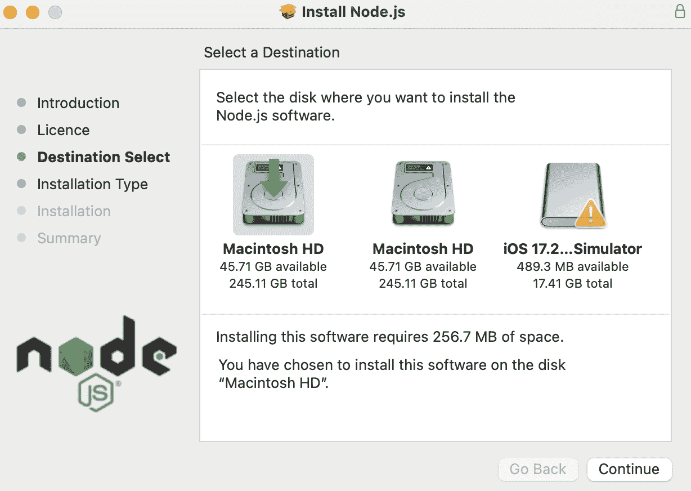

<st c="12028">图 1.4 – Node.js 安装 – 步骤 3</st>

1.  在下一屏幕上，您将被要求选择要安装的组件。

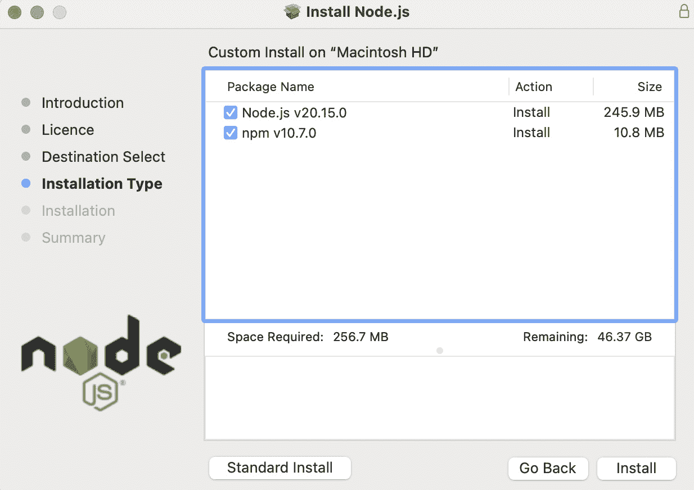

图 1.5 – Node.js 安装 – 步骤 4

1.  选择您想要创建 Node.js 开始菜单快捷方式的文件夹。

1.  点击**安装**按钮开始安装过程。

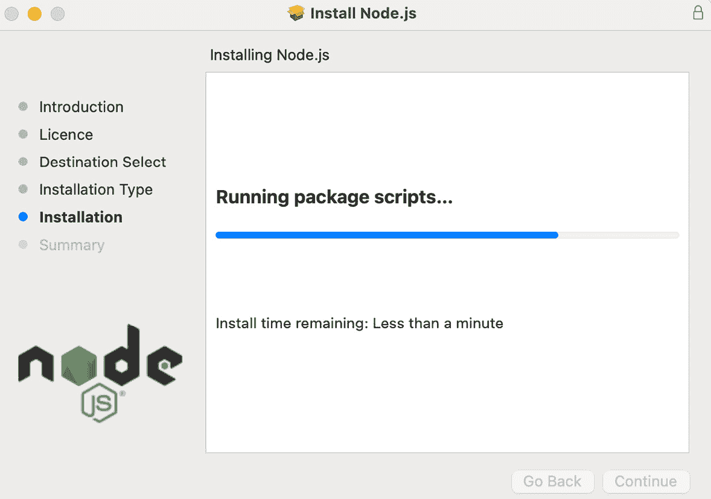

图 1.6 – Node.js 安装 – 步骤 5

1.  安装完成后，您应该会看到一个消息，表明 Node.js 已成功安装。

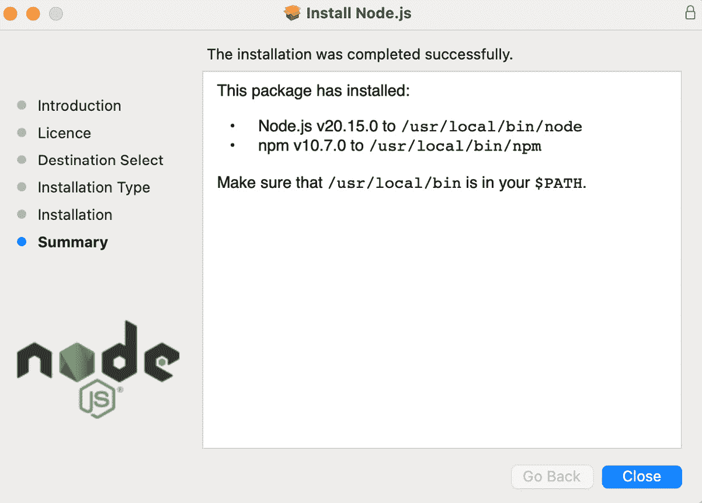

图 1.7 – Node.js 安装 – 步骤 6

1.  为了验证 Node.js 是否已正确安装，打开命令提示符并运行以下命令：

    ```js
    <st c="13704">$ node –v</st>
    ```

    这应该会显示您刚刚安装的 Node.js 的版本号：

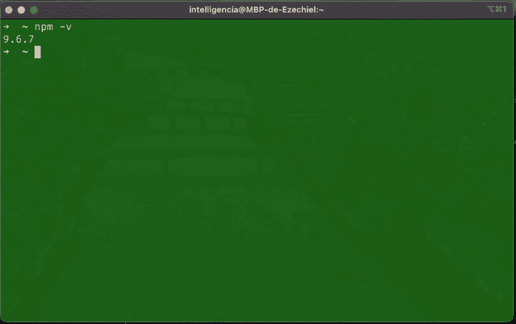

图 1.8 – 检查 npm 版本

在下一节中，我们将学习如何在 Linux 上安装 Node.js。

## 安装 Node.js 到 Linux

按照以下步骤在 Linux 上安装 Node.js：

1.  打开您的终端并运行以下命令以更新包管理器：

    ```js
    <st c="14050">$ sudo apt update</st>
    ```

    前面的命令将给出以下输出：

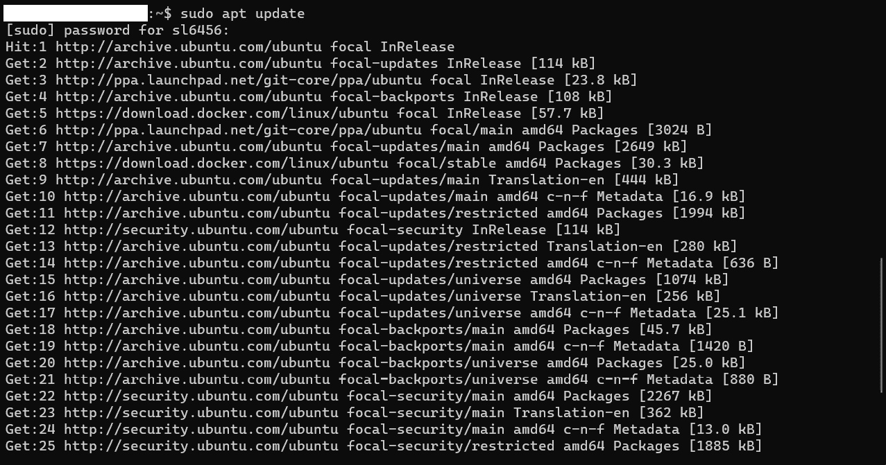

图 1.9 – 更新 Ubuntu 软件包

1.  运行以下命令以安装 Node.js：

    ```js
    <st c="16348">$ sudo apt install nodejs</st>
    ```

    前面的命令将给出以下输出：

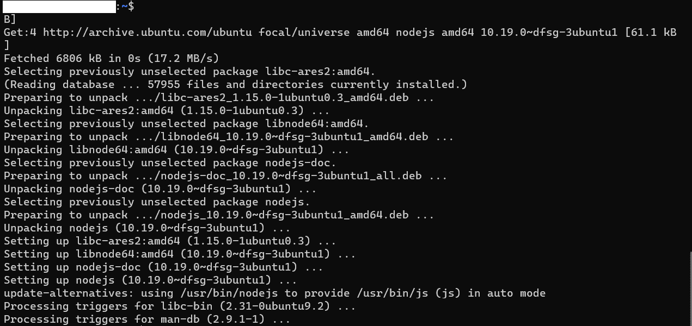

<st c="17692">图 1.10 – 在 Ubuntu 上安装 Node.js](img/B21146_01_10.jpg)

1.  <st c="17736">为了验证 Node.js 是否已正确安装，请运行以下命令：</st> <st c="17778">：</st> <st c="17798">：</st>

    ```js
    <st c="17816">$ node –v</st>
    ```

    <st c="17826">这应该显示你刚刚安装的 Node.js 的版本号：</st> <st c="17847">：</st> <st c="17858">：</st> <st c="17886">：</st>

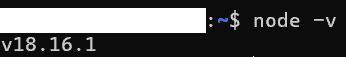

<st c="17921">图 1.11 – 在 Ubuntu 上安装 Node.js 后的版本</st>

1.  <st c="17980">npm 是 Node.js 的包管理器。</st> <st c="17999">如果你还没有与 Node.js 一起安装它，请运行以下命令：</st> <st c="18021">：</st> <st c="18093">：</st>

    ```js
    <st c="18111">$ sudo apt install npm</st>
    ```

    <st c="18134">这里是</st> <st c="18142">输出结果：</st>

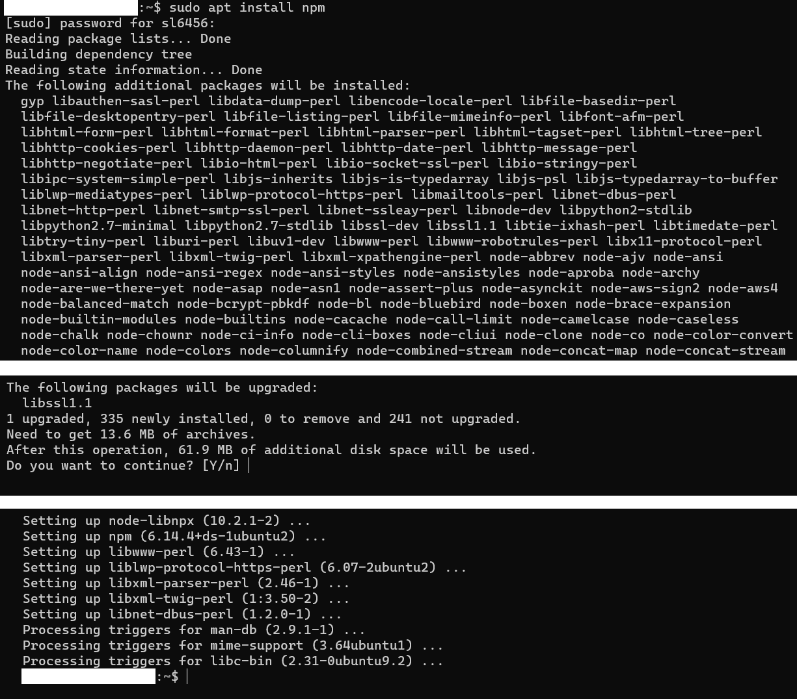

<st c="20579">图 1.12 – 在 Ubuntu 上安装 npm](img/B21146_01_12.jpg)

1.  <st c="20619">为了验证 npm 是否已正确安装，请运行以下命令：</st> <st c="20638">：</st> <st c="20658">：</st> <st c="20677">：</st> <st c="20687">：</st>

    ```js
    <st c="20695">$ npm –v</st>
    ```

    <st c="20704">你应该看到以下输出：</st> <st c="20724">：</st>

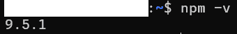

<st c="20762">图 1.13 – 安装 Node.js 后的 npm 版本</st>

<st c="20814">在下一节中，我们将创建一个新的</st> <st c="20850">Angular 项目。</st>

# <st c="20871">创建一个新的 Angular 项目</st>

<st c="20902">随着我们的开发环境设置完毕并准备就绪，我们可以创建我们的 Angular 项目。</st> <st c="20940">这涉及到使用 Angular CLI 生成我们项目的基结构，包括文件和文件夹。</st> <st c="20989">一旦创建，我们就可以使用框架提供的强大工具和功能开始构建我们的 Angular 应用程序。</st> <st c="21102">：</st>

<st c="21226">安装 Angular CLI 后，你可以在终端中运行以下命令来创建一个新的 Angular 项目：</st> <st c="21334">：</st>

```js
 $ ng new getting-started-angular-tdd --routing
```

<st c="21395">这将创建一个名为</st> `<st c="21442">getting-started-angular-tdd</st>` <st c="21469">的新 Angular 项目，位于当前目录中。</st>

<st c="21495">创建你的 Angular 项目后，你可以在终端中运行以下命令来提供服务：</st> <st c="21586">：</st>

```js
 $ cd getting-started-angular-tdd
$ ng serve --open
```

<st c="21651">这将启动开发服务器并在你的默认浏览器中打开你的应用程序。</st> <st c="21740">在这里，你可以修改你的代码，并在你的浏览器中实时看到更改。</st> <st c="21808">：</st>

<st c="21821">现在，是时候探索编写测试所涉及的不同文件了。</st> <st c="21880">：</st>

# <st c="21894">探索与编写测试相关的不同文件</st>

`<st c="21945">现在我们已经创建了 Angular 项目，我们将探索与在 Angular 中编写测试相关的不同文件。</st> `<st c="22063">我将提供它们的作用以及使用它们的最佳实践。</st> `<st c="22145">让我们开始吧。</st>`

## `<st c="22163">*.spec.ts</st>`

`<st c="22179">*.spec.ts</st>` <st c="22189">文件包含将要运行在你代码上的实际测试用例。</st> `<st c="22208">这些文件是 Angular 测试的骨架，因为它们定义了确保你的代码按预期工作的单个测试用例。</st> `<st c="22262">文件的名称应与被测试文件的名称匹配，并且它应位于与被测试文件相同的目录中。</st> `<st c="22543">这些文件中的测试被组织成测试套件，这些套件是通过使用</st> `<st c="22629">describe()</st>` <st c="22639">函数定义的。</st> `<st c="22651">每个测试用例都是通过使用</st> `<st c="22687">it()</st>` <st c="22691">函数定义的。</st> `<st c="22702">例如，如果你正在测试一个名为</st> `<st c="22753">MyComponent</st>`<st c="22764">》的组件，你将创建一个名为</st> `<st c="22796">my-component.spec.ts</st>` <st c="22816">的文件，并在该文件中定义该组件的测试用例。</st>

`<st c="22880">The</st>` `<st c="22885">describe()</st>` 函数用于将相关的测试用例组合在一起，它接受两个参数：一个描述测试套件的字符串和一个定义该套件内测试用例的函数。<st c="23046">The</st> `<st c="23085">it()</st>` 函数用于定义单个测试用例，它接受两个参数：一个描述测试用例的字符串和一个包含测试用例代码的函数。<st c="23264">在测试用例函数内部，你可以使用</st> `<st c="23311">expect()</st>` 函数来定义你代码的预期行为。</st> `<st c="23375">例如，你可能使用</st> `<st c="23402">expect(component.title).toEqual('My Title')</st>` <st c="23445">来测试组件的</st> `<st c="23463">title</st>` <st c="23468">属性是否具有预期的值。</st>

`<st c="23516">*.spec.ts</st>` <st c="23526">文件通常还会导入正在测试的组件或服务以及任何必要的依赖项。</st> `<st c="23633">例如，如果你正在测试一个使用了</st> `<st c="23692">HttpClient</st>` <st c="23702">服务的组件，你需要从</st> `<st c="23760">HttpClientTestingModule</st>` <st c="23783">导入组件和</st> `<st c="23789">@angular/common/http/testing</st>`<st c="23817">。</st>

## <st c="23818">karma.conf.js 文件</st>

<st c="23841">The</st> `<st c="23846">karma.conf.js</st>` <st c="23859">文件用于</st> <st c="23876">配置 Karma 测试运行器，该运行器用于运行您的测试用例。</st> <st c="23947">Karma 是 Angular 应用程序的一个流行的测试运行器，它提供了一种简单的方法在多种浏览器中运行您的测试。</st> <st c="23990">karma.conf.js</st> <st c="24077">文件指定了测试运行中应包含的文件，以及用于运行测试的浏览器。</st> <st c="24212">测试。</st>

<st c="24222">The</st> `<st c="24227">karma.conf.js</st>` <st c="24240">文件通常导出一个配置对象，该对象指定了这些设置。</st> <st c="24318">配置对象包含几个属性，例如框架、文件、报告器和浏览器。</st> <st c="24424">这些属性允许您配置测试运行的各个方面，例如使用哪个测试框架，包含哪些文件在测试运行中，使用哪些报告器来显示测试结果，以及使用哪些浏览器来运行</st> <st c="24658">测试。</st>

<st c="24668">例如，一个典型的</st> `<st c="24692">karma.conf.js</st>` <st c="24705">文件可能看起来</st> <st c="24722">像这样：</st>

```js
 module.exports = <st c="24750">function</st>(config) {
  config.set({
    frameworks: ['jasmine', '@angular/cli'],
    files: [
      { pattern: './src/test.ts', watched: false }
    ],
    reporters: ['progress', 'kjhtml'],
    browsers: ['Chrome']
  });
};
```

<st c="24943">给定的配置概述了使用</st> `<st c="25000">Jasmine</st>` <st c="25007">和</st> `<st c="25011">@angular/cli</st>` <st c="25024">框架，在测试运行期间包含</st> `<st c="25058">./src/test.ts</st>` <st c="25071">文件，实现</st> `<st c="25124">progress</st>` <st c="25132">和</st> `<st c="25137">kjhtml</st>` <st c="25143">报告器来展示测试结果，以及在</st> <st c="25218">Chrome 浏览器</st> <st c="25218">中执行测试。</st>

## <st c="25233">test.ts 文件</st>

<st c="25250">The</st> `<st c="25255">test.ts</st>` <st c="25262">文件是您的测试用例的</st> <st c="25290">入口点。</st> <st c="25308">它设置测试环境并加载测试运行所需的全部必要文件。</st> <st c="25398">此文件通常导入</st> <st c="25426">的</st> `<st c="25430">zone.js</st>` <st c="25437">库，该库用于处理测试中的异步操作。</st> <st c="25510">它还导入 Karma 测试运行器并开始</st> <st c="25563">测试运行。</st>

<st c="25572">The</st> `<st c="25577">test.ts</st>` <st c="25584">文件通常位于您的项目</st> `<st c="25618">src</st>` <st c="25621">目录中，并且通常在您创建一个新的 Angular 项目时自动生成。</st> <st c="25730">此文件设置测试环境并加载测试运行所需的必要文件。</st> <st c="25730">This file sets up the testing environment and loads the necessary files for the</st> <st c="25810">test run.</st>

<st c="25819">以下是一个</st> `<st c="25848">test.ts</st>` <st c="25855">文件可能</st> <st c="25867">看起来</st>的例子：

```js
 // This file is required by karma.conf.js and loads recursively all the .spec and framework files
import 'zone.js/dist/zone-testing';
import { getTestBed } from '@angular/core/testing';
import { BrowserDynamicTestingModule, platformBrowserDynamicTesting } from '@angular/platform-browser-dynamic/testing';
// First, initialize the Angular testing environment
getTestBed().initTestEnvironment(
  BrowserDynamicTestingModule,
  platformBrowserDynamicTesting()
);
// Then, load all the .spec files
const context = require.context('./', true, /\.spec\.ts$/);
context.keys().map(context);
```

<st c="26457">此文件使用</st> `<st c="26491">getTestBed().initTestEnvironment()</st>` <st c="26522">函数初始化 Angular 测试环境，该函数设置</st> `<st c="26581">TestBed</st>`<st c="26588">。它还</st> <st c="26597">加载所有</st> `<st c="26615">*.spec.ts</st>` <st c="26624">文件</st> <st c="26631">使用</st> `<st c="26637">require.context()</st>`<st c="26654">。</st>

## <st c="26655">tsconfig.spec.json 文件</st>

<st c="26683">`<st c="26688">tsconfig.spec.json</st>` <st c="26706">文件用于配置 TypeScript 编译器以处理您的测试用例。</st> <st c="26778">它指定了在编译测试文件时应使用的编译器选项。</st> <st c="26816">此文件通常扩展了项目的主</st> `<st c="26901">tsconfig.json</st>` <st c="26914">文件，但可能包含特定的测试设置。</st>

<st c="26993">以下是一个</st> `<st c="27022">tsconfig.spec.json</st>` <st c="27040">文件可能的样子：</st>

```js
 {
  "extends": "./tsconfig.json",
  "compilerOptions": {
    "outDir": "./out-tsc/spec",
    "module": "commonjs",
    "target": "es5",
    "baseUrl": "",
    "types": [
      "jasmine",
      "node"
    ]
  },
  "files": [
    "src/test.ts",
    "src/polyfills.ts"
  ],
  "include": [
    "**/*.spec.ts",
    "**/*.d.ts"
  ]
}
```

<st c="27324">此文件扩展了主</st> `<st c="27347">tsconfig.json</st>` <st c="27352">文件，并指定了应用于测试文件的编译器选项。</st> <st c="27442">它还包括</st> `<st c="27463">src/test.ts</st>` <st c="27474">和</st> `<st c="27479">src/polyfills.ts</st>` <st c="27495">文件在测试运行中。</st>

## <st c="27518">src/test.ts 文件</st>

<st c="27539">`<st c="27544">src/test.ts</st>` <st c="27555">文件用于配置 Angular 测试环境。</st> <st c="27615">它设置</st> `<st c="27626">TestBed</st>`<st c="27633">，用于创建</st> <st c="27658">组件和服务实例以进行测试。</st> <st c="27714">它还导入任何必要的测试实用工具，例如</st> `<st c="27771">TestBed</st>` <st c="27778">和</st> `<st c="27783">async</st>`<st c="27788">。</st>

<st c="27789">以下是一个</st> `<st c="27818">src/test.ts</st>` <st c="27829">文件可能的样子：</st>

```js
 import { TestBed } from '@angular/core/testing';
import { BrowserDynamicTestingModule,  platformBrowserDynamicTestingModule } from '@angular/platform-browser-dynamic/testing';
TestBed.initTestEnvironment(
  BrowserDynamicTestingModule,
  platformBrowserDynamicTestingModule()
);
```

<st c="28125">此文件设置</st> `<st c="28144">TestBed</st>` <st c="28151">使用</st> `<st c="28162">TestBed.initTestEnvironment()</st>` <st c="28191">函数。</st> <st c="28202">它指定了要使用的</st> <st c="28219">测试模块和平台模块</st> <st c="28254">，分别是</st> `<st c="28276">BrowserDynamicTestingModule</st>` <st c="28303">和</st> `<st c="28308">platformBrowserDynamicTestingModule</st>`<st c="28343">。</st>

# <st c="28358">摘要</st>

<st c="28366">本章介绍了 TDD 的基础知识及其在 Angular 中的作用。</st> <st c="28431">我们解释了 TDD 的好处以及它如何帮助开发者编写高质量的代码。</st> <st c="28520">然后，我们讨论了如何设置 Angular 的开发环境，并使用 Angular 编程接口创建了一个新的 Angular 项目。</st> <st c="28668">我们还探讨了与 Angular 中编写测试相关的各种文件，包括</st> `<st c="28750">*.spec.ts</st>`<st c="28759">,</st> `<st c="28761">karma.conf.js</st>`<st c="28774">,</st>`<st c="28775">tsconfig.spec.json</st>`<st c="28793">，以及</st> `<st c="28799">src/test.ts.</st>` <st c="28811">我们为每个文件及其在测试 Angular 应用程序中的作用提供了详细的解释。</st> <st c="28907">通过了解这些文件及其目的，开发者可以更有效地为他们的 Angular 应用程序编写和运行测试，并确保他们的代码表现</st> <st c="29074">如预期。</st>

在下一章中，我们将学习使用 Jasmine 编写和执行单元测试的过程，同时涵盖测试套件、测试规范<st c="29086">和匹配器</st> <st c="29252">等主题。</st>
