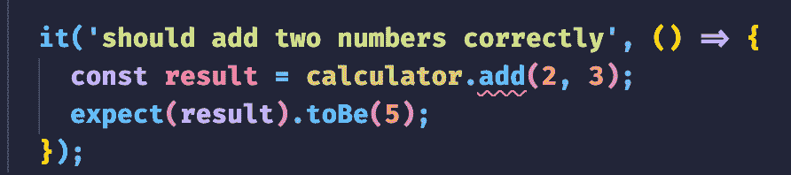
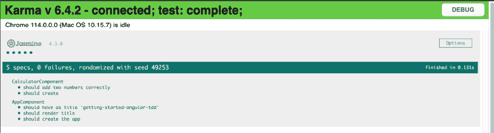
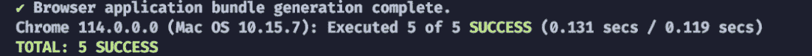
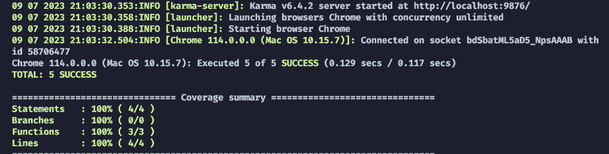
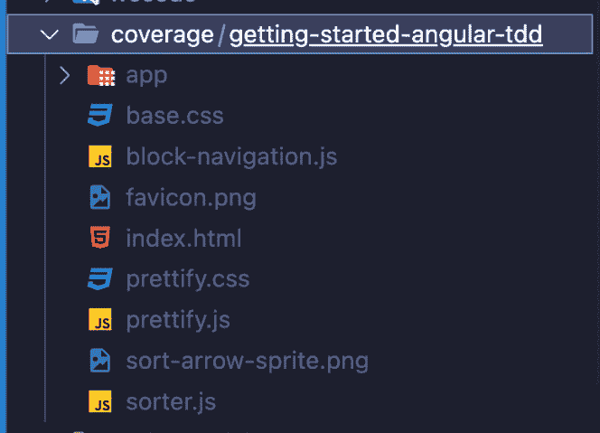
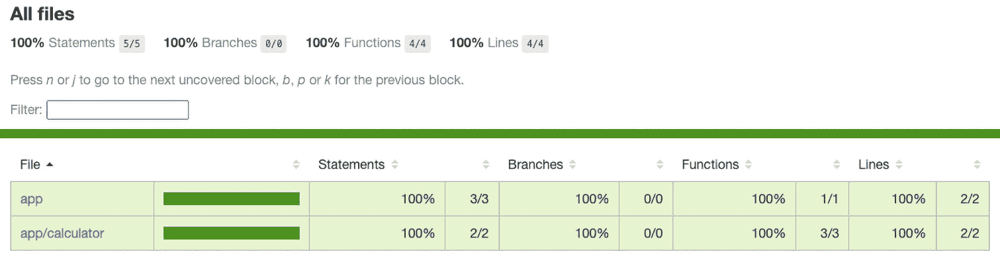
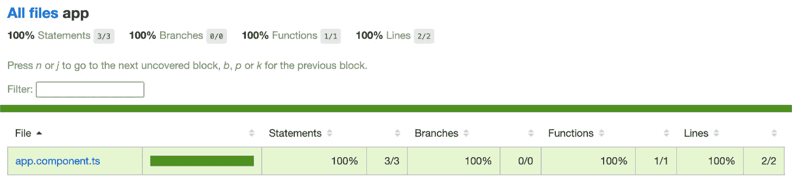
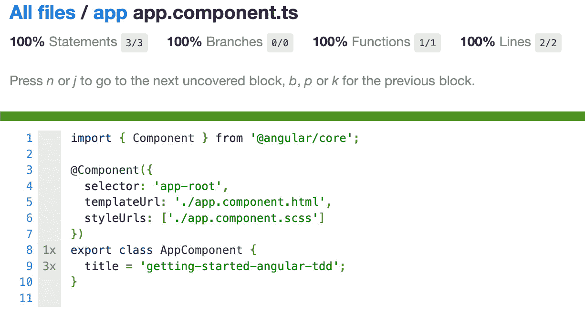
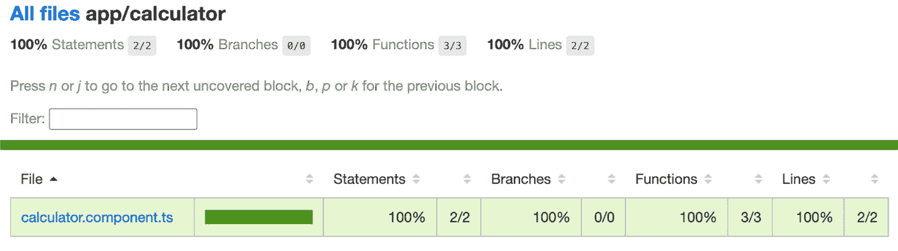
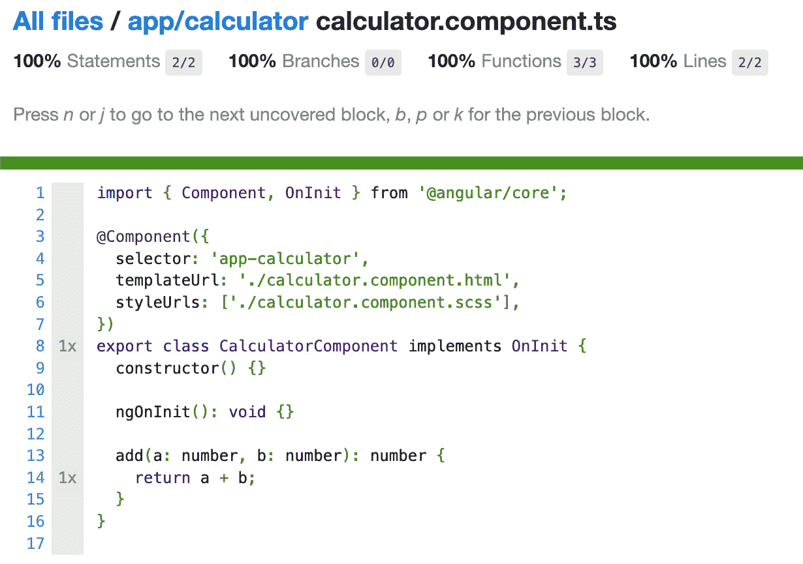

# 第三章：<st c="0">2</st>

# <st c="2">使用茉莉和卡玛测试 Angular 应用程序</st>

<st c="54">茉莉</st> <st c="62">和</st> <st c="72">卡玛</st> <st c="72">是开发者可以用来测试他们的 Angular 应用程序的两个强大工具。</st> <st c="156">测试是开发过程中的一个重要部分，因为它有助于确保应用程序按预期工作，并避免任何潜在的错误</st> <st c="300">或问题。</st>

<st c="310">茉莉是一个</st> **<st c="324">行为驱动开发</st>** <st c="351">(</st>**<st c="353">BDD</st>**<st c="356">) 框架</st> <st c="368">用于测试 JavaScript 代码。</st> <st c="398">它提供了一个简单易读的语法来编写测试，使得代码更容易理解和维护。</st> <st c="512">使用茉莉，开发者可以定义测试套件和测试用例，然后使用各种匹配器来检查代码的预期行为。</st>

<st c="651">另一方面，卡玛是一个允许开发者在其多个浏览器和环境中执行测试的测试运行器。</st> <st c="780">它提供了与茉莉的无缝集成，使得开发者可以轻松地在不同的浏览器中运行茉莉测试，并获得测试结果的实时反馈。</st> <st c="953">卡玛还提供了一些额外的功能，例如代码覆盖率报告和持续</st> <st c="1039">集成支持。</st>

<st c="1059">将茉莉和卡玛结合使用可以极大地增强 Angular 应用程序的测试过程。</st> <st c="1159">开发者可以使用茉莉的表达式语法编写全面的测试套件，然后使用卡玛在不同的浏览器中运行这些测试，确保跨不同环境的兼容性。</st> <st c="1354">这有助于在早期捕捉任何潜在的问题或错误，并促进更健壮和</st> <st c="1440">可靠的应用程序。</st>

<st c="1461">在本章中，我们将探讨使用茉莉和卡玛测试 Angular 应用程序的基础知识。</st> <st c="1569">我们将学习如何设置测试环境，使用茉莉编写单元测试，并配置卡玛在不同的浏览器中运行测试。</st>

<st c="1712">本章将涵盖以下主题：</st>

+   <st c="1766">掌握茉莉的单元</st> <st c="1792">测试技术</st>

+   <st c="1810">编写你的</st> <st c="1824">第一个与 Angular 相关的单元测试，关于</st> **<st c="1863">测试驱动开发</st>** **<st c="1875">（TDD）</st>** <st c="1886">(</st>**<st c="1888">TDD</st>**<st c="1891">)</st>

+   <st c="1893">利用卡玛的代码覆盖率和测试结果分析</st>

# <st c="1952">技术要求</st>

<st c="1975">为了跟随本章中的示例和练习，你需要对 Angular 和 TypeScript 有一个基本的了解，以及以下</st> <st c="2137">技术要求：</st>

+   <st c="2160">在您的计算机上安装了 Node.js LTS 和 npm LTS</st>

+   <st c="2211">安装了 Angular 17 或更高版本的 CLI</st> <st c="2236">全局</st>

+   <st c="2254">在</st> <st c="2311">您的计算机上安装了代码编辑器，例如 Visual Studio Code</st>

<st c="2324">本章的代码文件可以在</st> <st c="2369">以下位置找到</st> [<st c="2372">https://github.com/PacktPublishing/Mastering-Angular-Test-Driven-Development/tree/main/Chapter%202</st>](https://github.com/PacktPublishing/Mastering-Angular-Test-Driven-Development/tree/main/Chapter%202)<st c="2470">。</st>

# <st c="2471">掌握 Jasmine 的单元测试技术</st>

<st c="2515">在本节中，我们将通过编写描述性测试套件、使用匹配器、使用间谍进行函数测试以及测试异步代码来探索 Jasmine 框架。</st> <st c="2690">通过利用这些技术，您可以确保代码库的质量和可靠性。</st> <st c="2773">。</st>

## <st c="2783">什么是 Jasmine？</st>

<st c="2800">Jasmine</st> <st c="2808">是一个广泛使用的 JavaScript 测试框架，通常用于编写 Web 应用程序和 Node.js 项目的测试。</st> <st c="2945">凭借其简洁和表达性强的语法，Jasmine 允许开发者创建易于理解和维护的测试套件和案例。</st> <st c="3078">它提供了断言、测试间谍和异步测试的内置功能。</st> <st c="3167">Jasmine 与众多库和框架无缝集成，包括 AngularJS 和 React，使开发者能够编写全面可靠的 JavaScript 应用程序的测试。</st> <st c="3363">其流行源于其简单性、灵活性和促进创建健壮可靠 JavaScript 代码测试的能力。</st>

使用 Jasmine，开发者可以使用 BDD 风格来结构化他们的测试，这使得编写既描述性强又易于阅读的测试变得简单。<st c="3647">它提供了一套内置的断言函数，允许开发者验证他们代码的预期行为。</st> <st c="3773">这些断言涵盖了广泛的情况，使得编写验证被测试代码正确性的测试变得简单</st> <st c="3898">。</st>

<st c="3911">Jasmine 还包括测试间谍等特性，这使开发者能够跟踪函数调用和参数，以及</st> <st c="4036">模拟和存根函数行为。</st> <st c="4070">这有助于测试与其它组件或</st> <st c="4137">外部依赖项交互的代码。</st>

<st c="4159">此外，Jasmine 支持异步测试，这使得编写涉及异步操作（如 AJAX 请求或定时器）的代码的测试变得简单。</st> <st c="4322">它提供了处理异步任务和确保测试在断言之前等待完成的机制。</st>

<st c="4441">Jasmine 具有高度的扩展性，可以与各种库和框架一起使用，例如 AngularJS、Angular 和 React。</st> <st c="4580">它与这些生态系统无缝集成，允许开发者为其</st> <st c="4700">JavaScript 应用程序编写全面且可靠的测试。</st>

<st c="4724">总的来说，Jasmine 的简洁性、灵活性以及</st> <st c="4773">全面的功能集为其成为 JavaScript 测试框架的流行做出了贡献。</st> <st c="4873">它使开发者能够编写健壮且可靠的测试，最终导致代码质量更高和部署更加</st> <st c="4983">自信。</st>

## <st c="5005">编写描述性的测试套件</st>

<st c="5037">有效单元测试的一个基本原则是编写描述性测试套件。</st> <st c="5134">通过逻辑组织您的测试并使用描述性名称，您使自己和其他开发者更容易理解每个测试的目的和行为。</st> <st c="5304">在本节中，我们将探讨创建有意义的测试套件名称和在清晰简洁的语言中描述预期行为的策略。</st> <st c="5457">此外，我们还将讨论描述性测试套件如何作为未来参考的文档。</st>

<st c="5563">描述性测试套件是一组</st> <st c="5592">相关的测试用例，专注于代码的特定功能或组件。</st> <st c="5695">它作为文档工具，帮助开发者理解每个测试的目的和行为。</st> <st c="5800">描述性测试套件对于维护代码质量、促进团队成员之间的协作以及确保测试随着时间的推移保持相关性和更新至关重要。</st> <st c="5981">通过在创建描述性测试套件上投入时间，您可以提高测试代码的可维护性和可读性。</st>

<st c="6106">让我们考虑一个简单的场景，其中我们有一个名为</st> `<st c="6183">calculateTotal</st>` <st c="6197">的 JavaScript 函数，该函数计算购物车中商品的总价。</st> <st c="6259">我们想要编写一个测试来确保当给定的商品及其</st> <st c="6374">相应价格集合时，该函数返回正确的总价。</st>

## <st c="6392">选择有意义的名称</st>

<st c="6418">创建描述性测试套件的第一步是为您的测试套件和测试用例选择有意义的名称。</st> <st c="6445">使用清晰简洁的语言来描述正在测试的功能或行为。</st> <st c="6536">避免使用模糊或通用的名称，这些名称不足以提供足够的上下文。</st> <st c="6623">例如，不要将测试套件命名为“测试套件 1”，考虑将其命名为“用户身份验证测试”以传达测试的目的。</st> <st c="6691">有意义的名称使开发者更容易定位特定的测试并理解其目的，即使在长时间后重新访问代码库时也是如此。</st>

## <st c="6989">结构化测试套件</st>

<st c="7013">在 Jasmine 中创建描述性测试套件时，以逻辑和层次结构组织您的测试套件至关重要。</st> <st c="7029">一个结构良好的测试套件反映了您的代码库的结构，这使得定位和理解特定的测试变得更容易。</st> <st c="7142">将相关的测试组合在一起以提高可读性和可维护性。</st> <st c="7270">例如，如果您正在测试用户身份验证模块，为登录功能创建一个特定的测试套件，并为注册创建另一个。</st> <st c="7343">这种分离有助于您隔离并专注于特定的功能，使您更容易识别和解决问题。</st> <st c="7492">此外，考虑使用嵌套的 describe 块来进一步组织您的测试层次结构。</st> <st c="7607">以下是一个示例：</st> <st c="7713">示例：</st>

```js
 describe("User Authentication", () => {
  describe("Login", () => {
    // Login-related test cases
  });
  describe("Registration", () => {
    // Registration-related test cases
  });
});
```

## <st c="7898">编写清晰简洁的测试描述</st>

<st c="7942">在每个测试用例中，编写清晰简洁的描述，准确描述预期的行为。</st> <st c="7960">尽可能使用易于理解的语言，并避免使用技术术语。</st> <st c="8051">良好的测试描述应提供足够的信息，让您和其他人无需深入了解实现细节就能理解测试的目的。</st> <st c="8141">考虑使用“应该”格式来描述预期的行为——例如，“应该正确计算包含多个项目的购物车的总额。”通过使用描述性语言，未来的开发者可以快速理解测试的意图并识别任何与预期行为的偏差。</st>

<st c="8621">除了测试描述外，在测试代码中包含注释也有助于提供进一步的澄清或上下文，当需要时。</st> <st c="8777">这些注释可以解释某些断言背后的推理或提供有关测试场景的额外信息。</st> <st c="8903">然而，重要的是要找到平衡，避免过度注释，这可能会使测试代码变得杂乱。</st>

## <st c="9010">维护和更新描述性测试套件</st>

描述性的测试套件不是一次性的努力，但随着代码库的演变，需要持续维护和更新。定期审查和更新测试套件对于确保它们保持相关性和准确性至关重要。当对代码进行更改时，开发者还应更新相应的测试以反映更新的行为。此外，如果测试用例变得过时或冗余，应将其删除或重构。

当更新测试套件时，保持其描述性至关重要。如果测试用例需要重大更改，可能最好创建一个新的测试用例，并附上适当的描述，而不是修改现有的一个。这有助于保持测试套件的清晰性和透明度。

让我们考虑一个简单的场景，其中我们有一个名为 `<st c="9887">calculateTotal</st>` 的 JavaScript 函数，该函数计算购物车中商品的总价。我们想要编写一个测试来确保当给定一组具有相应价格的物品时，该函数返回正确的总额：

```js
 // Function under test
function calculateTotal(items) {
  let total = 0;
  items.forEach(item => {
    total += item.price;
  });
  return total;
}
// Test suite
describe("calculateTotal function", () => {
  // Test case 1: Calculate total for an empty cart
  it("should return 0 for an empty cart", () => {
    const cart = [];
    const result = calculateTotal(cart);
    expect(result).toBe(0);
  });
  // Test case 2: Calculate total for a cart with multiple items
  it("should correctly calculate the total for a cart with multiple items", () => {
    const cart = [
      { name: "Item 1", price: 10 },
      { name: "Item 2", price: 15 },
      { name: "Item 3", price: 20 }
    ];
    const result = calculateTotal(cart);
    expect(result).toBe(45);
  });
});
```

在前面的示例中，我们为 `<st c="10859">calculateTotal</st>` <st c="10873">函数</st> 创建了一个测试套件。在测试套件中，我们有两个测试用例，测试用例的描述清楚地说明了正在测试的行为：

+   第一个测试用例，*“对于空购物车应返回 0”，* <st c="11036">验证了函数正确处理空购物车并返回总额为 0</st>

+   第二个测试用例，*“应正确计算包含多个商品的购物车的总额”，* <st c="11258">测试了包含多个商品的购物车，并检查计算出的总额是否符合预期</st>

通过提供描述性的测试用例描述，其他开发者可以轻松理解每个测试的意图和行为。这些描述充当文档，使得在代码库演变时更容易维护和更新测试。

在下一节中，我们将探讨如何使用 TDD 原则编写我们的第一个单元测试。

# 在 Angular 项目中编写第一个单元测试

<st c="11751">单元测试</st> <st c="11764">是 Angular 开发的关键方面，它确保了代码质量、可靠性和可维护性。</st> <st c="11870">TDD（测试驱动开发）</st> <st c="11877">是一种软件开发方法，强调在实际代码实现之前编写测试。</st> <st c="11976">在本节中，您将学习如何在遵循 TDD 原则的同时，在 Angular 项目中编写您的第一个单元测试。</st> <st c="12102">通过利用 Jasmine 测试框架和 Angular 的测试工具，开发者可以创建有效且健壮的单元测试，以验证其代码的正确性。</st>

<st c="12275">我们将使用</st> <st c="12285">我们在</st> *<st c="12317">第一章</st>* <st c="12326">创建的项目</st> <st c="12340">进行练习。</st> <st c="12352">按照以下</st> <st c="12379">步骤编写您的第一个</st> <st c="12352">单元测试：</st>

1.  <st c="12389">通过运行以下命令创建一个名为</st> `<st c="12420">CalculatorComponent</st> <st c="12439">的新组件：</st>

    ```js
    <st c="12597">calculator.component.spec.ts</st> file will be created in the <st c="12654">src/ app/calculator</st> folder. When you open the file, you’ll see the following code by default:

    ```

    import { ComponentFixture, TestBed } from '@angular/core/testing';

    import { CalculatorComponent } from './calculator.component';

    describe('CalculatorComponent', () => {

    let calculator: CalculatorComponent;

    let fixture: ComponentFixture<CalculatorComponent>;

    beforeEach(async () => {

    await TestBed.configureTestingModule({

    declarations: [ CalculatorComponent ]

    })

    .compileComponents();

    fixture = TestBed.createComponent(CalculatorComponent);

    calculator = fixture.componentInstance;

    fixture.detectChanges();

    });

    it('should create', () => {

    expect(calculator).toBeTruthy();

    });

    });

    ```js

    <st c="13326">In the</st> <st c="13333">preceding generated code, we have a</st> <st c="13369">test suite where we have used the</st> `<st c="13404">describe</st>` <st c="13412">function, providing a descriptive name for the component under test.</st> <st c="13482">Within the test suite, we have a</st> `<st c="13515">beforeEach</st>` <st c="13525">block to set up the test environment.</st> <st c="13564">The</st> `<st c="13568">TestBed.configureTestingModule</st>` <st c="13598">method is used to configure the test module and provide the necessary dependencies.</st> <st c="13683">The</st> `<st c="13687">calculator</st>` <st c="13697">variable is then assigned to an instance of</st> `<st c="13742">CalculatorComponent</st>` <st c="13761">using the</st> `<st c="13772">TestBed.inject</st>` <st c="13786">method.</st><st c="13794">Our</st> `<st c="13799">CalculatorComponent</st>` <st c="13818">component will enable us to perform basic arithmetic operations.</st> <st c="13884">To write a unit test using TDD, we’ll start by creating a test case that verifies the component’s</st> <st c="13982">expected behavior.</st>
    ```

1.  <st c="14000">现在，我们将</st> <st c="14012">使用</st> `<st c="14049">it</st> <st c="14051">函数</st>` <st c="14062">编写实际的测试用例。</st> <st c="14065">在这种情况下，我们将通过传递两个数字来测试</st> `<st c="14091">add</st> <st c="14094">方法</st> <st c="14091">的</st> `<st c="14105">CalculatorComponent</st>` <st c="14124">，并期望结果为</st> `<st c="14182">5</st> <st c="14183">。`<st c="14189">expect</st> <st c="14195">函数用于定义期望的行为并检查实际结果。</st> <st c="14274">以下代码必须添加到测试套件中——即，在</st> `<st c="14347">describe</st> <st c="14355">函数</st>` <st c="14274">内部：</st>

    ```js
     it('should add two numbers correctly', () => {
        const result = calculator.add(2, 3);
        expect(result).toBe(5);
     });
    });
    ```

1.  <st c="14481">您将在代码编辑器中遇到一个错误，提示您</st> `<st c="14545">add</st> <st c="14548">函数</st> <st c="14558">不存在：</st>



<st c="14684">图 2.1 – 代码错误</st>

<st c="14707">这是正常的，因为它还没有被</st> <st c="14741">创建。</st>

<st c="14753">当我们返回到 Karma 服务器时，我们会看到</st> <st c="14758">我们的测试用例没有显示在</st> `<st c="14838">CalculatorComponent</st>` <st c="14857">中，并且在终端中，我们有一个与函数不存在相关的错误，以及一条消息表明没有测试</st> <st c="14984">成功。</st>

<st c="14998">别慌张 – 这是 TDD 的红色阶段！</st> <st c="15034">做得好！</st>

1.  <st c="15044">接下来，我们将实现</st> `<st c="15073">add</st>` <st c="15076">函数，在</st> `<st c="15089">calculator.component.ts</st>`<st c="15112">中。定义了我们的第一个测试用例后，我们可以继续实现</st> `<st c="15178">calculator.component.ts</st>` <st c="15201">以使测试通过。</st> <st c="15224">遵循 TDD 方法，编写通过测试所需的最少代码：</st>

    ```js
     add(a: number, b: number): number {
        return a + b;
      }
    ```

    <st c="15365">你将在你的</st> <st c="15406">Karma 服务器上看到以下结果：</st>



<st c="15665">图 2.2 – 测试成功</st>

<st c="15696">在你的终端中，你会收到以下消息：</st>



<st c="15890">图 2.3 – 测试执行成功</st>

<st c="15937">有了这些，我们就</st> <st c="15954">进入了 TDD 的绿色阶段，并编写了通过测试所需的最少代码。</st> <st c="15997">做得好！</st>

<st c="16059">一旦测试通过，你可以重构代码以改进其设计、可读性和可维护性。</st> <st c="16171">重构是 TDD 过程中的关键步骤，因为它有助于消除重复并改进代码结构和整体质量。</st> <st c="16306">确保重构后测试仍然运行是至关重要的。</st> <st c="16378">随着代码库的发展，定期审查和更新测试将有助于维护单元测试的完整性和可靠性。</st>

<st c="16505">在我们的例子中，我们不需要重构测试。</st> <st c="16558">别担心 – 我们将在</st> *<st c="16611">第三章</st>*<st c="16620">有机会这样做。</st>

<st c="16621">在下一节中，我们将探讨如何使用 Karma 的代码覆盖率和测试结果分析</st> <st c="16707">。</st>

# <st c="16718">利用 Karma 的代码覆盖率和测试结果分析</st>

<st c="16778">代码覆盖率</st> <st c="16793">和测试结果分析</st> <st c="16817">是软件开发过程中的关键方面。</st> <st c="16877">通过测量代码覆盖率，开发者可以评估单元测试的有效性，并识别需要额外测试的区域。</st> <st c="17017">Karma 是 JavaScript 生态系统中的一个流行测试框架，它提供了内置的代码覆盖率和测试结果分析支持。</st> <st c="17151">在本节中，我们将学习如何利用 Karma 来测量代码覆盖率，生成详细报告，并分析测试结果。</st> <st c="17281">通过利用这些功能，开发者可以确保全面测试，并提高代码的整体质量和可靠性。</st>

<st c="17416">在进一步操作之前，值得注意的一点是，我们将要查看的所有配置已经存在于我们的 Angular 项目中。</st> <st c="17553">当我们创建项目时，Angular 会负责所有</st> <st c="17607">配置。</st>

<st c="17625">以下是</st> <st c="17630">Angular 为我们执行的</st> <st c="17634">不同步骤：</st>

+   **<st c="17679">步骤 1 – 使用</st>** **<st c="17711">代码覆盖率</st>**<st c="17724">设置 Karma：</st>

    <st c="17726">为了</st> <st c="17729">使用 Karma 进行代码覆盖率分析，首先</st> <st c="17771">安装</st> <st c="17782">必要的依赖项：</st>

    ```js
    <st c="17946">karma.conf.js</st>) with the following changes:

    ```

    module.exports = function(config) {

    config.set({

        // ... reporters: ['progress', 'coverage'],

        coverageReporter: {

        dir: 'coverage/',

        reporters: [

            { type: 'html', subdir: 'report-html' },

            { type: 'lcov', subdir: 'report-lcov' }

        ]

        },

        // ... });

    };

    ```js

    <st c="18234">This configuration specifies the reporters to be used (</st>`<st c="18290">progress</st>` <st c="18299">for test progress and</st> `<st c="18322">coverage</st>` <st c="18330">for code coverage).</st> <st c="18351">The</st> `<st c="18355">coverageReporter</st>` <st c="18371">section defines the output directory and the types of reports to generate (HTML</st> <st c="18452">and LCOV).</st>
    ```

+   `<st c="18860">代码覆盖率</st>` <st c="18868">目录用于查看生成的报告。</st> <st c="18910">在网页浏览器中打开 HTML 报告（</st>`<st c="18932">coverage/report-html/index.html</st>`<st c="18964">）以可视化代码覆盖率细节。</st> <st c="19024">报告突出显示已覆盖行、未覆盖行和整体覆盖率百分比。</st> <st c="19112">此外，LCOV 报告（</st>`<st c="19143">coverage/report-lcov/lcov-report/index.html</st>`<st c="19187">）提供了代码覆盖率的更详细分解。</st>

+   `<st c="19682">mocha-reporter</st>` <st c="19696">显示</st> <st c="19705">关于测试失败的详细信息，包括堆栈跟踪和错误消息，而</st> `<st c="19799">junit-reporter</st>` <st c="19813">生成 JUnit 风格的 XML 报告，这些报告可以被 CI 工具用于</st> <st c="19885">进一步分析。</st>

    <st c="19902">要将 Karma 与 CI 工具集成，请在您的 Karma 配置文件中配置相应的插件或报告器。</st> <st c="20015">例如，要为 Jenkins 生成 JUnit 报告，添加</st> `<st c="20075">karma-junit-reporter</st>` <st c="20095">插件并相应配置。</st>

+   **<st c="20132">步骤 4 – 利用阈值和</st>** **<st c="20167">质量门</st>**<st c="20180">：</st>

    <st c="20182">Karma</st> <st c="20187">允许开发者定义代码覆盖率和测试结果</st> <st c="20226">的阈值和质量门。</st> <st c="20281">通过设置这些阈值，开发者</st> <st c="20321">可以建立代码覆盖率和测试成功率的最小要求。</st> <st c="20402">这确保了代码库保持一定的质量水平，并减少了发布未测试或测试覆盖率低代码的风险。</st>

    <st c="20536">为了设置代码覆盖率阈值，请更新您的 Karma 配置文件</st> <st c="20611">如下：</st>

    ```js
     module.exports = function(config) {
      config.set({
        // ... coverageReporter: {
          // ... check: {
            global: {
              statements: 80,
              branches: 80,
              functions: 80,
              lines: 80
            }
          }
        },
        // ... });
    };
    ```

    <st c="22003">在这个</st> <st c="20809">示例中，阈值已设置为 80%，用于语句、分支、函数和</st> <st c="20894">行。</st> <st c="20902">如果这些阈值中的任何一个未</st> <st c="20936">达到，Karma 将报告失败的</st> <st c="20969">测试结果。</st>

## <st c="20981">代码覆盖率可视化</st>

<st c="21009">在我们的项目中，我们首先在</st> <st c="21047">CalculatorComponent</st><st c="21076">上编写了测试。现在，我们可以使用 Karma 查看代码覆盖率。</st> <st c="21125">在我们的</st> <st c="21164">项目终端中运行以下命令：</st>

```js
<st c="21183">$ ng test –code-coverage</st>
```

<st c="21208">执行前面的命令后，我们将观察到以下</st> <st c="21276">三个要点：</st>

+   <st c="21289">如果一切顺利，在终端中我们将看到以下内容：</st>



<st c="21893">图 2.4 – 终端中的测试覆盖率</st>

+   <st c="21935">Karma 启动我们的浏览器，显示我们执行的各种测试：</st>


<st c="22376">图 2.5 – 成功的测试</st>

+   <st c="22406">在我们的</st> <st c="22409">项目结构</st> <st c="22417">中创建了一个</st> <st c="22424">覆盖率</st> <st c="22443">文件夹：</st>



<st c="22644">图 2.6 – 测试覆盖率文件夹</st>

<st c="22681">内部是一个</st> `<st c="22695">index.html</st>` <st c="22705">文件。</st> <st c="22712">当我们用浏览器打开这个文件时，我们会看到一个表格，总结所有测试过的文件，并且在每个文件中，我们会被告知给定代码片段的测试覆盖率。</st> <st c="22871">有多少已经被测试。</st>

<st c="22883">以下</st> <st c="22898">截图显示了</st> <st c="22915">测试覆盖率：</st>



<st c="23233">图 2.7 – 网页上的测试覆盖率可视化 – 第一部分</st>



<st c="23574">图 2.8 – 网页上的测试覆盖率可视化 – 第二部分</st>



<st c="24073">图 2.9 – 网页上的测试覆盖率可视化 – 第三部分</st>



<st c="24435">图 2.10 – 网页上的测试覆盖率可视化 – 第四部分</st>



<st c="25038">图 2.11 – 网页上的测试覆盖率可视化 – 第五部分</st>

通过使用代码覆盖率以及 Karma 的测试结果分析，开发者可以提升他们的测试实践并确保全面的代码覆盖率。<st c="25251">Karma 内置的代码覆盖率支持使得开发者能够衡量测试的有效性并识别需要额外关注的区域。</st> <st c="25411">此外，Karma 的测试报告和集成能力允许对测试结果进行更深入的分析，使开发者能够跟踪测试套件的健康状况并识别测试失败的模式。</st> <st c="25620">通过设置阈值和质量门，开发者可以建立代码覆盖率和测试成功率的最小要求，确保更高的代码质量和可靠性。</st> <st c="25789">和可靠性。</st>

# <st c="25805">总结</st>

<st c="25813">本章介绍了如何设置测试环境，使用 Jasmine 编写单元测试，并配置 Karma 在不同的浏览器中运行测试。</st> <st c="25965">Jasmine 和 Karma 是测试 Angular 应用程序的强大工具。</st> <st c="26036">Jasmine 是一个 BDD 框架，它为编写测试用例提供了直观的语法。</st> <st c="26121">另一方面，Karma 是一个测试运行器，允许你在各种环境中执行测试，并提供代码覆盖率和测试结果分析等功能。</st> <st c="26274">结果分析。</st>

<st c="26290">要使用 Jasmine 和 Karma 测试 Angular 应用程序，你需要通过安装必要的依赖项和配置 Karma 来设置测试环境。</st> <st c="26453">Jasmine 提供了一套丰富的匹配器和断言，用于验证 Angular 组件、服务和指令的行为。</st> <st c="26582">你可以创建测试套件和测试用例来覆盖不同的场景</st> <st c="26653">和期望。</st>

<st c="26670">Karma 允许你在真实浏览器或无头环境中运行测试，这使得模拟用户交互并测试应用程序在不同平台上的行为变得容易。</st> <st c="26853">它还提供了代码覆盖率支持，生成报告以帮助识别代码库中需要</st> <st c="26971">额外测试的区域。</st>

<st c="26990">通过结合使用 Jasmine 和 Karma，你可以为你的 Angular 应用程序编写完整的单元测试，并实践 TDD 的原则。</st>

<st c="27127">在下一章中，我们将学习如何为 Angular 组件、服务和指令编写有效的单元测试。</st>

# <st c="0">第二部分：编写有效的单元测试</st>

<st c="37">在本部分中，你将使用管道、表单和响应式编程编写组件、服务和指令的单元测试，同时遵循</st> <st c="180">TDD 原则。</st>

<st c="195">本部分包含以下章节：</st> <st c="214">以下章节：</st>

+   *<st c="233">第三章</st>*<st c="243">,</st> *<st c="245">为 Angular 组件、服务和指令编写有效的单元测试</st>*

+   *<st c="322">第四章</st>*<st c="332">,</st> *<st c="334">在 Angular 测试中模拟和存根依赖</st>*

+   *<st c="384">第五章</st>*<st c="394">,</st> *<st c="396">测试 Angular 管道、表单和响应式编程</st>*
