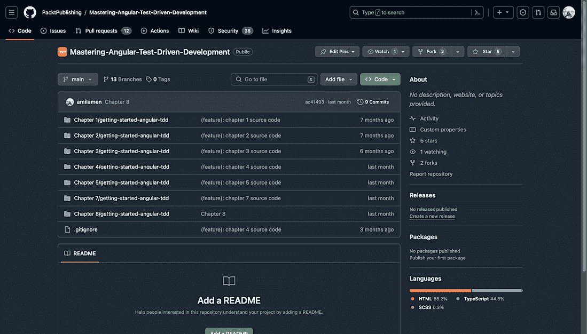
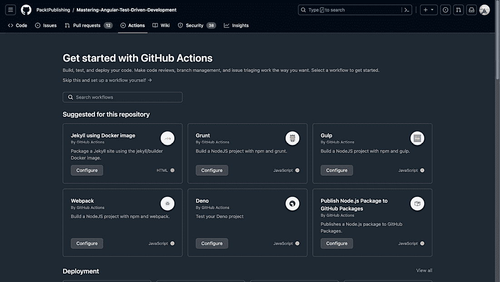
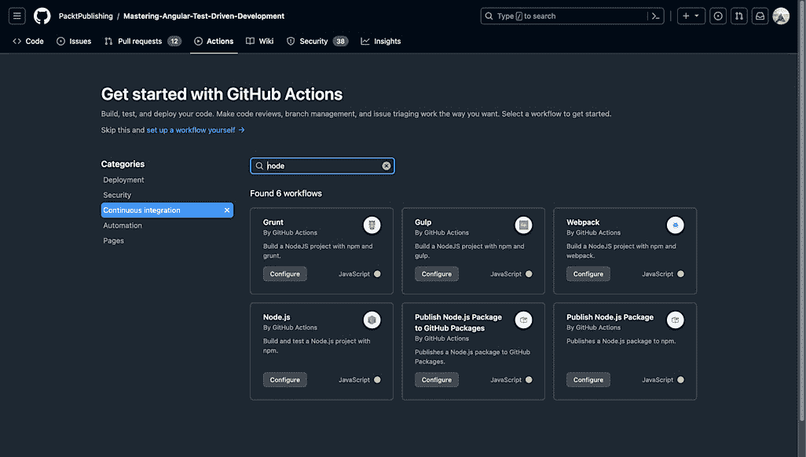
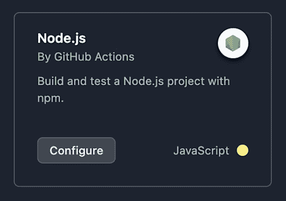
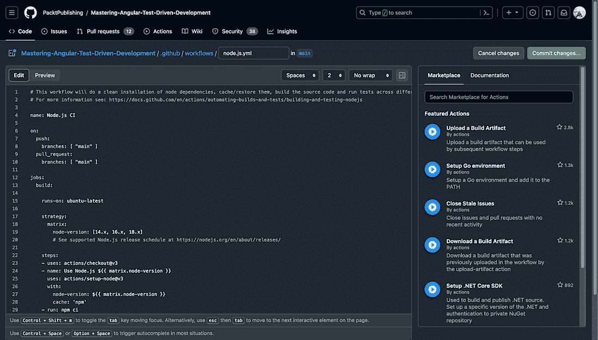
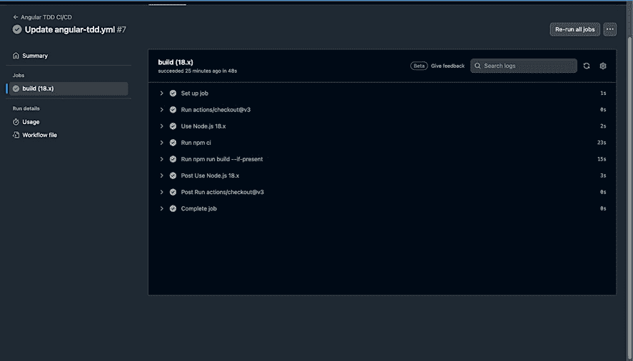
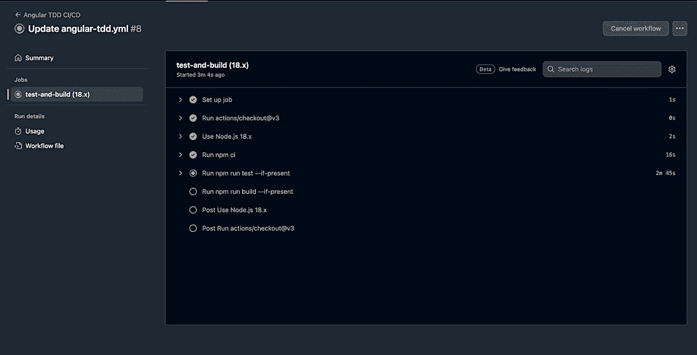
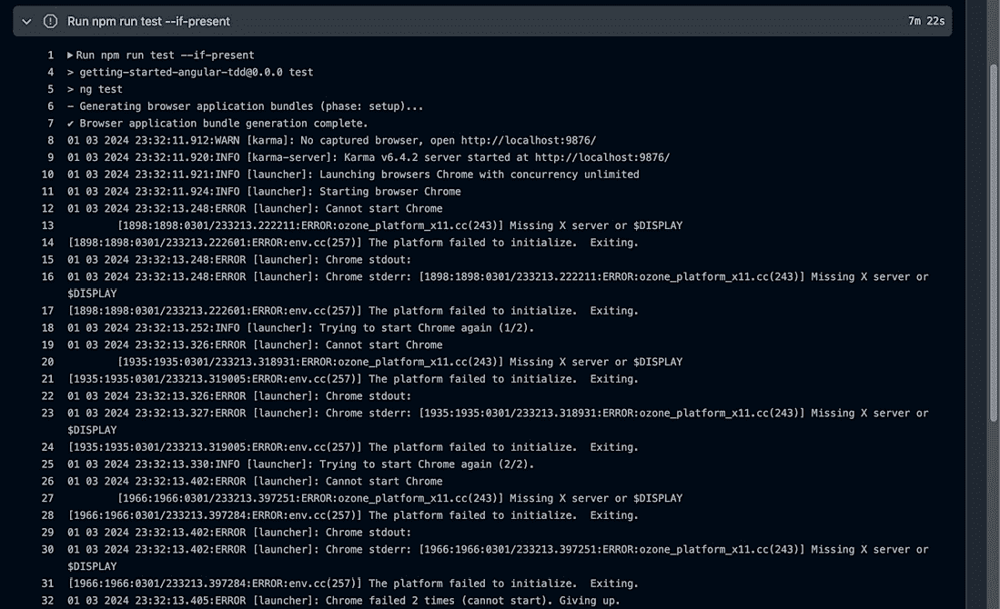
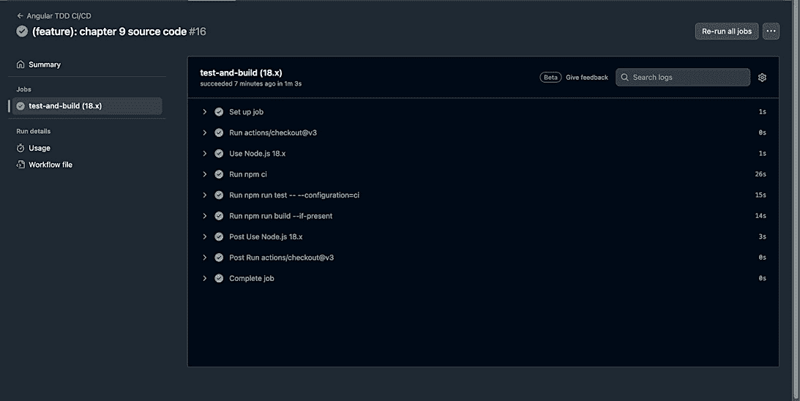

# 第十章：<st c="0">9</st>

# <st c="2">理解持续集成和持续部署（CI/CD）</st>

<st c="72">在软件开发中，**<st c="117">持续集成和部署</st>** <st c="154">(</st>**<st c="156">CI/CD</st>**<st c="161">)实践与**<st c="179">测试驱动开发</st>** <st c="202">(</st>**<st c="204">TDD</st>**<st c="207">)的结合已被证明是快速交付高质量软件的强大组合。</st> **<st c="304">持续集成</st>** <st c="326">(</st>**<st c="328">CI</st>**<st c="330">)和 TDD 协同工作，以自动化软件开发周期，促进测试文化，并使团队能够迭代和</st> <st c="489">有信心地构建和部署代码。</st>

<st c="505">CI/CD 涵盖了从开发者做出的代码更改到在生产中部署这些更改的一系列自动化步骤。</st> <st c="682">通过实施 CI/CD 实践，开发团队能够减少人为错误，提高团队成员之间的协作，加快交付速度，并提高整体</st> <st c="848">软件质量。</st>

<st c="865">在本章中，我们将探讨 CI/CD 的基本概念，探讨采用这些实践的好处，讨论 CI/CD 管道的关键组件，并提供组织如何</st> <st c="1078">成功实施 CI/CD 流程以简化其</st> **<st c="1138">软件开发生命周期</st>** **<st c="1164">周期</st>** <st c="1169">(</st>**<st c="1171">SDLC</st>**<st c="1175">).</st>

<st c="1178">总之，本章将涵盖以下主要主题：</st> <st c="1240">：</st>

+   <st c="1253">理解持续集成和</st> <st c="1295">持续部署</st>

+   <st c="1316">使用 GitHub Actions 设置 CI/CD 管道以自动化构建</st> <st c="1370"></st>

+   <st c="1384">使用 GitHub Actions 设置 CI/CD 管道以自动化测试</st> <st c="1438"></st>

+   <st c="1452">使用 GitHub Actions 设置 CI/CD 管道以自动化部署流程</st> <st c="1521"></st>

# <st c="1535">技术要求</st>

<st c="1558">为了跟随本章中的示例和练习，你需要对 Angular 和 TypeScript 有基本的了解，以及以下</st> <st c="1720">技术要求：</st>

+   <st c="1743">安装在你电脑上的 Node.js 和 npm</st>

+   <st c="1786">全局安装 Angular CLI</st> <st c="1799"></st>

+   <st c="1817">安装在你电脑上的代码编辑器，例如 Visual Studio Code</st>

<st c="1887">本章所需的代码文件可以在 GitHub</st> <st c="1952">上找到</st> [<st c="1955">https://github.com/PacktPublishing/Mastering-Angular-Test-Driven-Development/tree/main/Chapter%209</st>](https://github.com/PacktPublishing/Mastering-Angular-Test-Driven-Development/tree/main/Chapter%209)<st c="2053">。</st>

# <st c="2054">理解 CI 和 CD</st>

<st c="2078">CI 和 CD 已成为现代软件开发中的基本</st> <st c="2111">实践，使团队能够快速高效地交付高质量的代码。</st> <st c="2222">本全面</st> <st c="2241">指南涵盖了 CI/CD 的基本概念，探讨了它们的益处，讨论了最佳实践，并概述了成功的实施策略。</st> <st c="2391">从理解基础知识到优化 CI/CD 管道，本章旨在为读者提供他们需要利用 CI/CD 的力量并改变</st> <st c="2576">软件交付的知识和工具。</st>

<st c="2594">但在我们继续使用这些实践之前，让我们</st> <st c="2649">了解它们。</st>

# <st c="2665">什么是 CI？</st>

<st c="2677">CI 是一种 DevOps 软件开发实践，其中开发者定期将他们的代码更改合并到中央存储库中。</st> <st c="2805">每次合并后，都会运行自动构建和测试，以确保新代码无错误并符合项目的质量标准。</st> <st c="2944">这个过程对于快速识别和纠正错误、提高软件质量以及减少验证和发布新软件更新所需的时间至关重要。</st> <st c="3123">CI 鼓励频繁的代码集成，通常每天几次，以便在开发周期早期识别集成问题并更容易地纠正。</st> <st c="3296">它还鼓励文化上的转变，向更频繁的代码交付转变，这对于我们充分利用 CI 的自动化</st> <st c="3440">和效率至关重要。</st>

<st c="3455">持续集成（CI）是 CI/CD 管道的第一阶段，是更广泛的软件开发 DevOps 方法的一部分。</st> <st c="3562">它遵循敏捷软件开发方法，将工作分解成小而可管理的任务，这些任务可以频繁完成和集成。</st> <st c="3721">使用 CI 工具，如 GitHub Actions、Jenkins、Buildbot、Go、Travis CI 和 GitLab CI，简化了构建和测试过程的自动化，使开发者更容易将他们的更改与项目其他部分集成，并在开发早期阶段识别问题。</st> <st c="3992">开发过程中。</st>

<st c="4012">持续集成的好处包括</st> <st c="4039">提高开发者生产力、更快地交付更新以及更可预测的交付计划。</st> <st c="4143">它还改善了跨团队协作和系统集成，减少了测试错误，并提高了软件开发周期的效率。</st> <st c="4298">然而，持续集成的主要挑战主要涉及团队采用和 CI 工具的初始技术安装。</st> <st c="4409">克服这些挑战并有效地实施持续集成实践对于实现持续集成在改进软件开发过程</st> <st c="4574">和结果中的全部潜力至关重要。</st>

<st c="4587">在下一节中，我们将更深入地探讨持续集成（CI）对</st> <st c="4660">开发团队的好处。</st>

## <st c="4678">持续集成（CI）对开发团队的好处</st>

<st c="4715">持续集成（CI）对开发团队的好处是多方面的，包括效率、质量和客户满意度。</st> <st c="4750">以下是这些好处的详细概述：</st>

+   **<st c="4877">更快的迭代和问题解决</st>**<st c="4917">：持续集成使团队能够更频繁地集成代码更改，加快迭代速度并促进问题解决。</st> <st c="5040">小的代码更改更容易管理，从而减少了可能出现的复杂问题的复杂性。</st>

+   **<st c="5133">提高代码质量和减少错误</st>**<st c="5170">：通过频繁集成和测试代码，持续集成能够在开发周期早期识别并纠正错误。</st> <st c="5296">结果是代码质量更高，缺陷更少，从而改善了用户体验并</st> <st c="5384">减少了停机时间。</st>

+   **<st c="5402">提高效率和降低成本</st>**<st c="5441">：由持续集成驱动的自动化减少了手动任务，为开发者节省了时间。</st> <st c="5515">这不仅提高了效率，还降低了与手动测试和错误管理相关的成本。</st> <st c="5630">因此，工程师可以有更多时间投入到</st> <st c="5677">增值活动中。</st>

+   **<st c="5700">提高透明度和协作</st>**<st c="5740">：持续集成通过提供对代码质量和集成问题的持续</st> <st c="5791">反馈来促进透明度。</st> <st c="5841">它还通过确保代码更改定期集成和测试来促进更好的团队协作，从而在团队成员之间实现更好的协调。</st>

+   **<st c="6001">更快的上市时间</st>**<st c="6023">：通过自动化构建、测试和部署流程，持续集成（CI）使团队能够更快地将新特性和更新交付给最终用户。</st> <st c="6163">这种响应性使开发团队能够保持竞争力，并确保客户能够从</st> <st c="6266">最新的增强功能中受益。</st>

+   **<st c="6286">提高客户满意度</st>**<st c="6317">：更少的错误和缺陷最终进入生产，改善了用户体验。</st> <st c="6395">持续集成还使团队能够快速响应客户反馈，使团队能够更高效地进行调整和改进</st> <st c="6459">。</st>

+   **<st c="6518">缩短平均故障恢复时间（MTTR）</st>**<st c="6557">：持续集成使问题能够更快地被检测和解决，从而降低 MTTR。</st> <st c="6646">这确保了软件的稳定性和可靠性，</st> <st c="6706">最小化了停机时间。</st>

+   **<st c="6726">提高测试可靠性</st>**<st c="6753">：在持续集成框架内进行持续测试，通过允许执行更精确的测试来提高测试可靠性。</st> <st c="6875">这确保了软件经过彻底测试并准备好投入生产，提高了对</st> <st c="6976">软件质量}的信心。</st>

+   **<st c="6993">竞争优势</st>**<st c="7015">：采用</st> **<st c="7043">商业智能</st>** <st c="7064">(</st>**<st c="7066">BI</st>**<st c="7068">) 的组织具有竞争优势</st> <st c="7099">，因为它们可以更快地部署功能，从而节省资金。</st> <st c="7184">这种早期反馈和自动化有助于缩短交货期、部署频率和变更失败率，进而提高</st> <st c="7211">业务成果。</st>

+   **<st c="7336">团队内部提高透明度和问责制</st>**<st c="7394">：CI/CD 实践提高了团队内部的透明度和问责制，使问题能够迅速识别和解决，包括施工失败和架构挫折。</st> <st c="7588">这种持续反馈循环提高了整体</st> <st c="7635">产品质量。</st>

<st c="7651">总之，持续集成在效率、质量和客户满意度方面为开发团队提供了显著的好处。</st> <st c="7773">它简化了开发过程，降低了成本，并增强了</st> <st c="7840">协作，最终导致能够更快、更可靠地交付高质量的软件产品。</st> <st c="7952">在下一节中，我们将探讨持续集成实施的关键原则。</st>

## <st c="8029">持续集成（CI）实施的关键原则</st>

<st c="8065">持续集成实施的关键原则旨在提高软件开发效率、质量和速度。</st> <st c="8181">以下是</st> <st c="8193">关键原则：</st>

+   **<st c="8209">自动化一切</st>**<st c="8229">：持续集成关注自动化构建、测试和集成过程。</st> <st c="8301">自动化减少了人工工作量，最小化了错误，并加速了</st> <st c="8373">开发周期。</st>

+   **<st c="8391">频繁集成</st>**<st c="8412">：频繁地将代码更改集成到共享仓库中，理想情况下每天几次。</st> <st c="8504">这种做法可以使集成问题在开发周期的早期就被识别和解决。</st>

+   **<st c="8608">使构建过程快速</st>**<st c="8636">：构建过程应该尽可能快，以确保快速反馈。</st> <st c="8713">快速构建意味着问题可以更快地被发现和解决，从而促进</st> <st c="8808">持续改进。</st>

+   **<st c="8831">即时反馈</st>**<st c="8850">：持续集成依赖于自动化构建和测试的即时反馈。</st> <st c="8918">这种反馈对于在开发过程的早期识别和解决问题至关重要。</st>

+   **<st c="9017">从小处着手，逐步发展</st>**<st c="9038">：从简单的持续集成配置开始，根据需要逐步添加其他工具和实践。</st> <st c="9135">这种方法鼓励灵活性和实验，使团队能够在其</st> <st c="9241">特定环境中找到最佳方案。</st>

+   **<st c="9258">定义成功指标</st>**<st c="9284">：明确定义持续集成过程的成功指标，例如加速代码构建或降低错误和工作率。</st> <st c="9413">使用这些指标来衡量持续集成实践的有效性，并</st> <st c="9491">指导改进。</st>

+   **<st c="9510">文档</st>**<st c="9524">：记录持续集成过程和所有开发人员和利益相关者使用的工具。</st> <st c="9606">良好的文档确保每个人都了解如何</st> <st c="9665">为持续集成过程做出贡献并高效地解决</st> <st c="9705">问题。</st>

+   **<st c="9726">运维和开发之间的协作</st>**<st c="9775">：鼓励运维和开发紧密协作的文化。</st> <st c="9857">这种协作对于从两个角度理解软件可靠性和性能至关重要。</st>

+   **<st c="9969">可扩展性</st>**<st c="9981">：持续集成通过自动化代码集成和沟通，打破了增长障碍，使组织能够扩展其开发团队、代码库和</st> <st c="10136">基础设施。</st>

+   **<st c="10155">学习曲线的投资</st>**<st c="10188">：成功实施持续集成涉及在版本控制和自动化等领域学习新技能。</st> <st c="10298">然而，这些技能很容易获得，持续集成的益处超过了</st> <st c="10379">初始投资。</st>

<st c="10398">这些原则指导 CI 的实施，确保它成为软件开发过程的组成部分，提高生产力、质量和速度。</st> <st c="10571">在下一节中，我们将学习什么是</st> **<st c="10611">持续部署</st>** <st c="10632">(</st>**<st c="10634">CD</st>**<st c="10636">)。</st>

# <st c="10643">什么是 CD？</st>

<st c="10655">CD 是一种自动化软件</st> <st c="10683">发布实践，其中代码更改在通过预定义测试的不同阶段自动部署。</st> <st c="10801">CD 的目的是通过在部署过程中最小化人工干预来加速生产发布。</st> <st c="10934">这种方法是更广泛的 DevOps 实践的一部分，该实践旨在通过将自动化应用于 SDLC 的每个阶段来加速创新和价值创造</st> <st c="11082">。</st>

<st c="11091">软件设计需要在整个应用程序设计和开发过程中进行严格的测试、团队之间的紧密协作、先进工具和流程流程。</st> <st c="11277">当成功实施时，CD 使组织能够快速响应客户请求并快速交付软件更新，通常在验证代码更改后的几分钟内。</st> <st c="11460">此过程包括在单个</st> <st c="11533">工作流程中自动化构建、测试和部署，目的是在生产中自动化软件部署</st> <st c="11590">。</st>

<st c="11604">CD 的好处包括完全自动化的部署周期，使组织能够将更多时间花在软件创建上，而不是发布准备上。</st> <st c="11759">它还导致更频繁的增量部署，促进更快的产品开发和持续改进模型。</st> <st c="11891">此外，CD 为新功能、更新和代码更改提供快速反馈循环，使组织能够快速接收和整合</st> <st c="12037">用户反馈。</st>

<st c="12051">CD 比 CI 更进一步，它自动化了从部署本身之前的所有事情，需要人工干预来设置部署。</st> <st c="12194">CD 自动化了整个过程，包括软件本身的发布，如果管道设置得当并设计用于测试软件产品的所有元素，那么它就是 CD 的自然演变</st> <st c="12399">在发布之前。</st>

<st c="12414">持续交付（CD）管道通过自动构建、测试和将代码更改直接部署到生产环境中，简化了软件交付过程。</st> <st c="12546">它涉及在整个管道中进行自动化测试和监控，以检测潜在的错误、功能问题和缺陷，提供实时警报，防止问题到达主软件分支或生产环境。</st> <st c="12779">这种方法强调了 DevOps 的主要目标：为最终用户提供价值。</st> <st c="12853">最终用户。</st>

<st c="12863">在实践中，这意味着开发者对云应用程序所做的更改，只要通过自动化测试，就可以在编写后几分钟内投入生产。</st> <st c="13043">这使得接收和整合用户反馈变得更加容易。</st><st c="13125">。</st> <st c="13130">然而，交付价值在很大程度上取决于精心设计的测试自动化，这可能需要大量的初始投资。</st> <st c="13238">初始投资。</st>

<st c="13257">总的来说，持续交付（CD）是 DevOps 方法的一个基本方面，使组织能够快速、高效地发布软件更新，加速创新和价值创造。</st> <st c="13368">加速创新和价值创造</st> <st c="13436">为最终用户。</st>

## <st c="13450">持续交付（CD）对开发团队的好处</st>

<st c="13487">持续交付（CD）为开发团队提供了几个关键好处，促进了更高效、敏捷和响应的软件开发过程。</st> <st c="13624">以下是</st> <st c="13637">主要好处：</st>

+   **<st c="13651">完全自动化的部署周期</st>**<st c="13685">：持续交付（CD）使组织能够自动化整个</st> <st c="13735">部署过程，减少人工干预，并允许开发团队更多地专注于编码，而不是发布准备。</st> <st c="13873">这种自动化加快了新功能和更新的部署，使团队能够更快、更高效地交付软件。</st> <st c="13989">更高效地。</st>

+   **<st c="14006">更频繁、增量部署</st>**<st c="14044">：通过自动化部署，持续交付（CD）使得小规模的增量变更能够更频繁地发布。</st> <st c="14144">这种方法能够加速产品开发，并促进持续改进模型，在该模型中，团队可以根据用户反馈和市场需求快速迭代他们的软件。</st> <st c="14321">市场需求。</st>

+   **<st c="14336">对新功能快速反馈循环</st>**<st c="14373">：持续交付（CD）为新功能、更新和代码更改提供实时反馈。</st> <st c="14451">这种即时反馈循环对于使团队能够快速适应和改进他们的软件至关重要，确保最终产品符合用户的期望和要求。</st> <st c="14612">和需求。</st>

+   **<st c="14629">事件响应</st>**<st c="14644">：持续交付（CD）使团队能够快速响应生产中的系统错误、安全事件或开发中可能开发的新功能。</st> <st c="14814">将代码立即发布到生产环境使组织能够更快地解决和解决问题，MTTR 等指标使响应时间得以评估和随着时间的推移而改进</st> <st c="14998">over time.</st>

+   **<st c="15008">简化发布周期，加快上市时间</st>**<st c="15061">：通过自动化部署过程，持续交付（CD）使软件开发团队能够快速将新特性和错误修复提供给最终用户。</st> <st c="15200">这种自动化减少了人为错误的风险，并允许快速部署小型、频繁的更新，从而加快上市时间，为公司提供</st> <st c="15358">竞争优势。</st>

+   **通过自动化测试实现问题的早期发现**<st c="15375">：持续交付（CD）强调在整个软件开发过程中自动化测试的重要性。</st> <st c="15431">通过进行持续测试，开发者可以快速识别和解决任何潜在问题，从而保证软件的稳定性和可靠性。</st> <st c="15529">这种早期发现有助于减少生产中成本高昂的错误的可能性，并增强开发团队的信心。</st> <st c="15680">of the software.</st> <st c="15698">This early detection helps reduce the likelihood of costly errors in production and instills confidence in the</st> <st c="15809">development team.</st>

+   **<st c="15826">持续反馈循环以实现持续改进</st>**<st c="15878">：持续交付（CD）通过在开发者和最终用户之间建立反馈循环，培养了一种持续改进的文化。</st> <st c="15994">这个迭代过程使组织能够适应和响应不断变化的需求，确保其软件保持相关性和竞争力。</st> <st c="16130">and competitive.</st>

+   **<st c="16146">改进协作和沟通</st>**<st c="16187">：持续交付（CD）促进团队成员之间的协作和沟通，提高了开发过程的整体效率。</st> <st c="16317">通过自动化部署管道，开发者可以专注于他们的核心任务，促进不同团队之间的无缝集成，从而实现更快、更高效的</st> <st c="16502">软件发布。</st>

<st c="16520">简而言之，持续交付（CD）为开发团队提供了快速交付软件的能力，通过自动化测试确保高质量，并保持响应和敏捷的开发过程。</st> <st c="16703">这些好处共同促进了一个更高效、创新和以客户为中心的软件开发周期。</st> <st c="16805">development cycle.</st>

## <st c="16823">持续交付（CD）实施的关键原则</st>

<st c="16859">总的来说，持续交付（CD）是 DevOps 方法的一个基本方面，使组织能够快速高效地发布软件更新，加速创新和价值创造，为最终用户提供更多价值。</st> <st c="16901">持续交付（CD）实施的关键原则对于创建一个简化和自动化的软件发布流程至关重要。</st> <st c="17053">这些原则源于敏捷和最佳组织实践的组合，旨在尽可能快地将软件交付给最终用户，从他们的经验中学习，并将他们的反馈纳入下一次发布。</st> <st c="17173">以下是**<st c="17425">基本原则</st>**：</st>

+   **<st c="17448">构建质量</st>**<st c="17462">：这一原则强调从一开始就将质量构建到产品中，而不是依赖于检查来实现。</st> <st c="17564">它涉及创建和演变反馈循环，以便在问题被记录在版本控制系统之前尽早发现。</st> <st c="17591">应使用自动化测试在问题恶化之前检测缺陷。</st> <st c="17742">自动化测试应在问题恶化之前检测缺陷。</st> <st c="17812">随着时间的推移，应使用自动化测试来检测缺陷。</st>

+   **<st c="17822">小批量工作</st>**<st c="17844">：持续交付（CD）鼓励使用小而可管理的变更，而不是大而稀少的发布。</st> <st c="17940">这种方法减少了获取反馈所需的时间，促进了问题的识别和解决，并提高了效率和动力。</st> <st c="18090">目标是改变软件交付的经济性，使其能够在小批量中工作。</st>

+   **<st c="18201">计算机执行重复性任务，人类解决问题</st>**<st c="18254">：这一原则强调了自动化重复性任务，如回归测试的重要性，以便人类可以专注于解决问题。</st> <st c="18410">目标是创造一种平衡，其中计算机处理简单、重复的任务，而人类处理更复杂、更具创造性的任务。</st>

+   **<st c="18541">持续改进</st>**<st c="18564">：持续交付（CD）推崇持续改进的理念，或称为*<st c="18618">精益运动</st>**<st c="18624">中的*<st c="18618">kaizen</st>**，。</st> <st c="18658">这关乎将改进工作视为日常工作的重要组成部分，并不断努力使事物变得更好。</st> <st c="18779">这关乎不满足于现状，并始终寻找改进的机会。</st>

+   **<st c="18878">人人有责</st>**<st c="18902">：在成功的组织中，每个人都对其构建的软件的质量和稳定性负责。</st> <st c="19016">这一原则鼓励一种协作方法，其中开发人员、运营团队和其他利益相关者共同努力实现组织的目标，而不是优化他们自己团队的成功。</st> <st c="19235">它强调了基于客户反馈和组织影响的快速反馈循环的重要性。</st>

<st c="19341">实施这些原则需要在组织内部进行文化变革，培养一个鼓励每个人确保最终用户获得的产品是最高</st> <st c="19562">可能质量的协作环境。</st> <st c="19580">这意味着在早期处理过程中解决繁琐或易出错的任务，以避免加剧问题并优化资源的使用。</st> <st c="19628">在下一节中，我们将学习如何使用</st> <st c="19718">GitHub Actions 设置 CI/CD 管道以自动化构建。</st>

# <st c="19824">使用 GitHub Actions 设置 CI/CD 管道以自动化构建</st>

<st c="19892">使用 GitHub Actions 设置 CI/CD 管道涉及几个步骤，每个步骤对于自动化构建过程都至关重要。</st> <st c="19924">以下是一个逐步指南，帮助您开始。</st>

## <st c="20067">步骤 1 – 创建或选择一个仓库和项目</st>

<st c="20118">首先，在</st> <st c="20153">您希望设置 CI/CD 管道的</st> <st c="20200">仓库中选择一个。这可以是一个现有项目，或者您正在工作的一个新项目。</st> <st c="20264">在我们的例子中，它将是 GitHub 上的这个仓库：</st> <st c="20307">[<st c="20315">https://github.com/PacktPublishing/Mastering-Angular-Test-Driven-Development/tree/main</st>](https://github.com/PacktPublishing/Mastering-Angular-Test-Driven-Development/tree/main)<st c="20401">。</st>



<st c="20935">图 9.1 – 计算器仓库项目</st>

## <st c="20977">步骤 2 – 在您的项目仓库中打开 GitHub Actions</st>

<st c="21033">现在，转到您仓库顶部导航栏中的 GitHub Actions 选项卡。</st> <st c="21067">在这里，您将找到各种针对您项目技术栈定制的 CI/CD 自动化模板和工作流程。</st> <st c="21114">GitHub Actions 提供了广泛的预定义工作流程，并允许您从头开始创建自己的。</st> <st c="21231">GitHub Actions 提供了广泛的预定义工作流程，并允许您从头开始创建自己的。</st>



<st c="21839">图 9.2 – GitHub Actions 管道模板</st>

## <st c="21885">步骤 3 – 定义您的 CI/CD 工作流程</st>

<st c="21921">我们的项目是一个 Angular 项目，因此它运行在 Node.js 上。</st> <st c="21980">因此，我们将选择 GitHub Actions 模板</st> <st c="22030">专门针对 Node.js，我们将根据需要对其进行修改，以满足我们的需求。</st> <st c="22115">您需要在 GitHub Actions 模板搜索栏中使用</st> `<st c="22144">node</st>` <st c="22148">关键字进行搜索，并通过</st> **<st c="22217">持续集成</st>** **<st c="22228">类别</st>进行筛选：</st>



<st c="22564">图 9.3 – GitHub Actions 管道模板</st>

<st c="22610">如图</st> *<st c="22628">图 9</st>**<st c="22636">.4</st>*<st c="22638">所示，Node.js 在列表中：</st>



<st c="22758">图 9.4 – GitHub Actions 中的 Node.js</st>

<st c="22796">现在，我们可以点击</st> **<st c="22821">配置</st>** <st c="22830">按钮</st> <st c="22838">，然后将被重定向到如图</st> *<st c="22888">图 9</st>**<st c="22896">.5</st>*<st c="22898">所示的界面：</st>



<st c="23629">图 9.5 – Node.js 基本管道模板</st>

<st c="23673">现在，我们可以开始修改了。</st> <st c="23710">首先，我们将把文件顶部的名称改为</st> `<st c="23765">angular-tdd.yml</st>`<st c="23780">，如图</st> *<st c="23794">图 9</st>**<st c="23802">.6</st>*<st c="23804">所示：</st>


<st c="23897">图 9.6 – 工作流程名称</st>

<st c="23923">接下来，我们可以修改文件开头的</st><st c="23939">`name`</st> <st c="23962">值。</st> <st c="23993">而不是</st> `<st c="24004">Node.js CI</st>`<st c="24014">，我们将称之为</st> `<st c="24030">Angular</st>` `<st c="24038">TDD CI/CD</st>`<st c="24047">：</st>


<st c="24076">图 9.7 – 管道名称</st>

<st c="24102">接下来，我们可以将</st> `<st c="24127">–version: [14.x, 16.x, 18.x]</st>` <st c="24155">数组节点更改为</st> `<st c="24170">node-version: [18.x]</st>`<st c="24190">：</st>


<st c="24302">图 9.8 – 管道 Node.js</st> <st c="24332">版本</st>

<st c="24339">最后，我们将删除文件的最后一行（即</st> `<st c="24395">- run: npm test</st>`<st c="24410">），因为我们目前没有任何测试。</st> <st c="24460">这是文件的最终内容：</st> <st c="24489">：</st>

```js
 # This workflow will do a clean installation of node dependencies, cache/restore them, build the source code and run tests across different versions of node
# For more information see: https: //docs.github.com/en/actions/automating-builds-and-tests/building-and-testing-nodejs
name: Angular TDD CI/CD
on:
  push:
    branches: [ "main" ]
  pull_request:
    branches: [ "main" ]
jobs:
  build:
    runs-on: ubuntu-latest
    strategy:
      matrix:
        node-version: [18.x]
        # See supported Node.js release schedule at https: //nodejs.org/en/about/releases/
    steps:
    - uses: actions/checkout@v3
    - name: Use Node.js ${{ matrix.node-version }}
      uses: actions/setup-node@v3
      with:
        node-version: ${{ matrix.node-version }}
        cache: 'npm'
        cache-dependency-path: '**/package-lock.json'
    - run: npm ci
    - run: npm run build --if-present
```

<st c="25287">现在，我们可以通过点击</st> **<st c="25333">提交</st>** **<st c="25340">更改</st>** <st c="25347">按钮</st>来保存文件。</st>

<st c="25355">此工作流程旨在自动化安装 Node.js 依赖项的过程，缓存它们以加快未来的构建，并构建 Angular 项目。</st> <st c="25514">以下是工作流程关键组件</st> <st c="25568">及其功能的分解：</st>

+   `<st c="25663">构建</st>`<st c="25668">。此作业在 GitHub Actions 提供的最新 Ubuntu 虚拟机上运行。</st>

+   `<st c="25773">默认值</st>` <st c="25781">部分将构建作业的所有阶段的当前工作目录设置为</st> `<st c="25852">./</st>``<st c="25854">第九章</st>``<st c="25864">/getting-started-angular-tdd/</st>`<st c="25894">。这确保了命令在您的 Angular 项目</st> <st c="25987">所在的正确位置执行。</st>

+   `<st c="26020">策略</st>` <st c="26028">部分定义了一个矩阵，该矩阵多次运行作业，每次使用不同的 Node.js 版本。</st> <st c="26132">在此示例中，矩阵仅包含一个版本：</st> `<st c="26187">18.x</st>`<st c="26191">。您可以扩展它以包含更多版本，以进行更广泛的</st> <st c="26250">兼容性测试。</st>

+   `<st c="26300">uses: actions/checkout@v3</st>`<st c="26326">) 使用官方的 GitHub Actions</st> `<st c="26362">checkout</st>` <st c="26370">操作将存储库代码克隆到</st> <st c="26414">运行器上。</st>

+   `<st c="26460">uses: actions/setup-node@v3</st>`<st c="26488">) 使用官方的 GitHub Actions</st> `<st c="26524">setup-node</st>` <st c="26534">操作来安装和配置指定的 Node.js 版本 (</st>`<st c="26598">18.x</st>`<st c="26603">) 在</st> <st c="26609">运行器上。</st>

+   <st c="26620">缓存</st> `<st c="26625">参数</st>` <st c="26630">设置为</st> `<st c="26651">npm</st>` <st c="26654">以启用工作流程运行之间 Node.js 模块的缓存，可能加快后续执行。</st> `<st c="26762">cache-dependency-path</st>` <st c="26783">设置为</st> `<st c="26794">**/package-lock.json</st>` <st c="26814">以确保当</st> `<st c="26857">package-lock.json</st>` <st c="26874">文件更改（表示依赖项发生变化）时，缓存失效。</st>

+   `<st c="26966">run: npm ci</st>`<st c="26978">) 执行</st> `<st c="26990">npm ci</st>` <st c="26996">命令，从</st> `<st c="27052">package-lock.json</st>` <st c="27069">文件中安装项目的依赖项。</st> <st c="27076">这确保了在不同环境中保持依赖项状态的一致性。</st>

+   `<st c="27191">run: npm run build --if-present</st>`<st c="27223">) 条件性地运行</st> `<st c="27249">npm run build</st>` <st c="27262">命令，如果它在项目的</st> `<st c="27301">package.json</st>` <st c="27313">文件中存在。</st> <st c="27320">这为不同项目设置提供了灵活性，并不是所有项目都定义了</st> `<st c="27413">build</st>` <st c="27418">脚本。</st>

<st c="27434">然而，需要注意的是</st> <st c="27467">如果你从课程仓库克隆项目，必须在</st> `<st c="27564">runs-on: ubuntu-latest</st>`<st c="27586">: 之后添加以下内容：</st>

```js
 defaults:
      run:
        working-directory: "./Chapter 9/getting-started-angular-tdd"
```

<st c="27664">最终渲染是通过从</st> <st c="27730">书籍仓库</st> <st c="27664">克隆项目获得的：</st>

```js
 # This workflow will do a clean installation of node dependencies, cache/restore them, build the source code and run tests across different versions of node
# For more information see: https: //docs.github.com/en/actions/automating-builds-and-tests/building-and-testing-nodejs
name: Angular TDD CI/CD
on:
  push:
    branches: [ "main" ]
  pull_request:
    branches: [ "main" ]
jobs:
  build:
    runs-on: ubuntu-latest
    defaults:
      run:
        working-directory: "./Chapter 9/getting-started-angular-tdd"
    strategy:
      matrix:
        node-version: [18.x]
        # See supported Node.js release schedule at https: //nodejs.org/en/about/releases/
    steps:
    - uses: actions/checkout@v3
    - name: Use Node.js ${{ matrix.node-version }}
      uses: actions/setup-node@v3
      with:
        node-version: ${{ matrix.node-version }}
        cache: 'npm'
   cache-dependency-path: '**/package-lock.json'
    - run: npm ci
    - run: npm run build --if-present
```

<st c="28611">最后，如果过程顺利，这是你在 GitHub</st> <st c="28684">Actions 界面中会得到的结果：</st>



<st c="28804">图 9.9 – 管道成功完成</st>

<st c="28848">在下一节中，我们将学习</st> <st c="28883">如何使用 GitHub Actions 设置 CI/CD 管道来自动化测试。</st>

# <st c="28954">使用 GitHub Actions 设置 CI/CD 管道来自动化测试</st>

<st c="29022">在这个新部分，我们将更新我们之前用于运行测试的工作流程。</st> <st c="29061">逻辑上讲，测试应该在构建之前运行。</st> <st c="29098">以下是测试工作流程：</st>

```js
 test:
    runs-on: ubuntu-latest
    defaults:
      run:
        working-directory: './Chapter 9/getting-started-angular-tdd/'
    strategy:
      matrix:
        node-version: [18.x]
        # See supported Node.js release schedule at https: //nodejs.org/en/about/releases/
    steps:
    - uses: actions/checkout@v3
    - name: Use Node.js ${{ matrix.node-version }}
      uses: actions/setup-node@v3
      with:
        node-version: ${{ matrix.node-version }}
        cache: 'npm'
        cache-dependency-path: '**/package-lock.json'
    - run: npm ci
    - run: npm run test
```

<st c="29659">现在，让我们将两个</st> <st c="29687">工作流程，测试和构建，结合起来；以下是基本术语中的样子：</st>

```js
 name: Angular TDD CI/CD
on:
push:
    branches: [ "main" ]
pull_request:
    branches: [ "main" ]
jobs:
test:
    runs-on: ubuntu-latest
    defaults:
      run:
        working-directory: './Chapter 9/getting-started-angular-tdd/'
    strategy:
      matrix:
        node-version: [18.x]
        # See supported Node.js release schedule at https: //nodejs.org/en/about/releases/
    steps:
    - uses: actions/checkout@v3
    - name: Use Node.js ${{ matrix.node-version }}
      uses: actions/setup-node@v3
      with:
        node-version: ${{ matrix.node-version }}
        cache: 'npm'
        cache-dependency-path: '**/package-lock.json'
    - run: npm ci
    - run: npm run test
build:
    needs: test
    runs-on: ubuntu-latest
    defaults:
      run:
        working-directory: './Chapter 9/getting-started-angular-tdd/'
    strategy:
      matrix:
        node-version: [18.x]
        # See supported Node.js release schedule at https : //nodejs.org/en/about/releases/
    steps:
    - uses: actions/checkout@v3
    - name: Use Node.js ${{ matrix.node-version }}
      uses: actions/setup-node@v3
      with:
        node-version: ${{ matrix.node-version }}
        cache: 'npm'
        cache-dependency-path: '**/package-lock.json'
    - run: npm ci
    - run: npm run build --if-present
```

<st c="30829">如前述代码</st> <st c="30864">块中所述，测试工作流程在构建工作流程之前。</st> <st c="30928">然而，有一个方面立即引起了注意。</st> <st c="30986">那就是测试和构建中许多序列的重复。</st> <st c="31060">基于</st> `<st c="31191">test-and-build</st>`<st c="31205">原则，例如。</st> <st c="31220">以下是它的样子：</st>

```js
 # This workflow will do a clean installation of node dependencies, cache/restore them, build the source code and run tests across different versions of node
# For more information see: https: //docs.github.com/en/actions/automating-builds-and-tests/building-and-testing-nodejs
name: Angular TDD CI/CD
on:
  push:
    branches: [ "main" ]
  pull_request:
    branches: [ "main" ]
jobs:
  test-and-build:
    runs-on: ubuntu-latest
    defaults:
      run:
        working-directory: './Chapter 9/getting-started-angular-tdd/'
    strategy:
      matrix:
        node-version: [18.x]
        # See supported Node.js release schedule at https: //nodejs.org/en/about/releases/
    steps:
    - uses: actions/checkout@v3
    - name: Use Node.js ${{ matrix.node-version }}
      uses: actions/setup-node@v3
      with:
        node-version: ${{ matrix.node-version }}
        cache: 'npm'
        cache-dependency-path: '**/package-lock.json'
    - run: npm ci
    - run: npm run test --if-present
    - run: npm run build --if-present
```

<st c="32148">现在，当我们运行管道时，我们</st> <st c="32183">注意到</st> `<st c="32199">npm run test --if-present</st>` <st c="32224">任务在一个类似这样的</st> <st c="32246">块中运行：</st>



<st c="32400">图 9.10 – 管道运行中</st>

<st c="32430">实际上，我们遇到这个问题是很正常的，因为</st> `<st c="32498">npm run</st>` <st c="32505">test</st> 执行了 `<st c="32524">ng</st>` <st c="32526">test。</st> <st c="32533">由于我们处于 Angular 项目中，它试图在管道中启动 Chrome。</st> <st c="32611">不幸的是，它找不到它</st> <st c="32642">因为我们没有</st> **<st c="32667">图形用户界面</st>** <st c="32691">(</st>**<st c="32693">GUI</st>**<st c="32696">).</st> <st c="32700">因此，我们得到了</st> <st c="32718">以下错误：</st>



<st c="34516">图 9.11 – 管道失败</st>

<st c="34544">为了解决这个问题，我们将对项目进行一些修改，特别是对</st> `<st c="34629">angular.json</st>` <st c="34641">文件，通过添加一个测试配置的配置</st> <st c="34700">如下：</st>

```js
 "configurations": {
          "ci": {
              "watch": false,
              "progress": false,
              "browsers": "ChromeHeadlessCI"
        }
}
```

<st c="34808">这是完整的</st> <st c="34830">测试配置：</st>

```js
 "test": {
          "builder": "@angular-devkit/build-angular:karma",
          "options": {
            "polyfills": [
              "zone.js",
              "zone.js/testing"
            ],
            "tsConfig": "tsconfig.spec.json",
            "inlineStyleLanguage": "scss",
            "assets": [
              "src/favicon.ico",
              "src/assets"
            ],
            "styles": [
              "src/styles.scss"
            ],
            "scripts": []
          },
          "configurations": {
            "ci": {
              "watch": false,
              "progress": false,
              "browsers": "ChromeHeadlessCI"
            }
          }
        }
```

<st c="35231">之后，我们需要在我们的 Angular 项目的</st> `<st c="35290">src</st>` <st c="35293">文件夹中创建一个</st> `<st c="35264">karma.conf.js</st>` <st c="35277">文件，如果该文件</st> <st c="35337">尚未存在。</st> <st c="35360">在这个文件中，我们将放置与</st> <st c="35400">Karma 的配置</st> <st c="35411">相关的源代码：</st>

```js
 // Karma configuration file, see link for more information
// https: //karma-runner.github.io/1.0/config/configuration-file.html
process.env.CHROME_BIN = require("puppeteer").executablePath();
module.exports = function (config) {
  config.set({
    basePath: "",
    frameworks: ["jasmine", "@angular-devkit/build-angular"],
    plugins: [
      require("karma-jasmine"),
      require("karma-chrome-launcher"),
      require("karma-jasmine-html-reporter"),
      require("karma-coverage-istanbul-reporter"),
      require("@angular-devkit/build-angular/plugins/karma"),
    ],
    client: {
      clearContext: false, // leave Jasmine Spec Runner output visible in browser
    },
    coverageIstanbulReporter: {
      dir: require("path").join(__dirname, "../coverage"),
      reports: ["html", "lcovonly"],
      fixWebpackSourcePaths: true,
    },
    reporters: ["progress", "kjhtml"],
    port: 9876,
    colors: true,
    logLevel: config.LOG_INFO,
    autoWatch: true,
    browsers: ["Chrome"],
    customLaunchers: {
      ChromeHeadlessCI: {
        base: "ChromeHeadless",
        flags: ["--no-sandbox", "--disable-gpu"],
      },
    },
    singleRun: false,
  });
};
```

<st c="36459">接下来，我们需要在</st> <st c="36500">开发模式下安装两个包，即</st> `<st c="36518">puppeteer</st>` <st c="36527">和</st> `<st c="36532">karma-coverage-istanbul-reporter</st>`<st c="36564">，通过以下操作：</st>

```js
 $ npm i --save-dev puppeteer karma-coverage-istanbul-reporter
```

<st c="36651">最后，在我们的 GitHub Actions 管道中，我们将</st> `<st c="36704">npm run test –if-present</st>` <st c="36728">替换为</st> `<st c="36734">npm run test -- --configuration=ci</st>`<st c="36768">，以下是</st> <st c="36781">结果：</st>



<st c="37019">图 9.12 – 管道成功完成</st>

<st c="37064">做得好！</st> <st c="37076">在下面的内容中，你将</st> <st c="37100">找到迄今为止所有更改的流程总结，以及相关的</st> <st c="37193">源代码：</st>

```js
 # This workflow will do a clean installation of node dependencies, cache/restore them, build the source code and run tests across different versions of node
# For more information see: https: //docs.github.com/en/actions/automating-builds-and-tests/building-and-testing-nodejs
name: Angular TDD CI/CD
on:
  push:
    branches: [ "main" ]
  pull_request:
    branches: [ "main" ]
jobs:
  test-and-build:
    runs-on: ubuntu-latest
    defaults:
      run:
        working-directory: './Chapter 9/getting-started-angular-tdd/'
    strategy:
      matrix:
        node-version: [18.x]
        # See supported Node.js release schedule at https: //nodejs.org/en/about/releases/
    steps:
    - uses: actions/checkout@v3
    - name: Use Node.js ${{ matrix.node-version }}
      uses: actions/setup-node@v3
      with:
        node-version: ${{ matrix.node-version }}
        cache: 'npm'
        cache-dependency-path: '**/package-lock.json'
    - run: npm ci
    - run: npm run test -- --configuration=ci
    - run: npm run build --if-present
```

<st c="38122">在下一节中，我们将学习</st> <st c="38158">如何使用 GitHub Actions 设置 CI/CD 管道来自动化部署流程。</st>

# <st c="38244">使用 GitHub Actions 自动部署流程的 CI/CD 管道设置</st>

<st c="38329">CD 是一种实践，即在更改通过生产管道后自动部署到生产环境。</st> <st c="38366">这包括测试、构建和部署的自动化流程。</st> <st c="38459">GitHub Actions 支持 CD，使您能够高效地自动化这些</st> <st c="38534">流程。</st>

<st c="38615">我们不会在这个项目中这样做，但我们会看看我们如何能这样做。</st> <st c="38684">首先，这将像其他两个一样是一个测试和构建阶段。</st> <st c="38755">部署自然发生在开发结束时，因此工作流程也将适用。</st> <st c="38855">在我们的当前工作流程结束时，构建之后，我们将添加以下内容以在远程服务器上部署：</st> <st c="38952">远程服务器：</st>

```js
 - name: Upload build files to remote server
        uses: appleboy/scp-action@master
        with:
          host: ${{ secrets.SI_HOST }}
          username: ${{ secrets.SI_USERNAME }}
          password: ${{ secrets.SI_PASSWORD }}
          port: ${{ secrets.SI_PORT }}
          source: "[SORUCE_FOLDER]"
          target: "[DESTINATION_TARGET_ON_YOUR_SERVER]"
```

<st c="39253">提供的 GitHub Actions 工作流程片段旨在自动化将构建文件上传到远程服务器的过程。</st> <st c="39380">这是 CI/CD 管道中部署应用程序的常见步骤。</st> <st c="39450">以下是工作流程步骤的</st> <st c="39476">分解：</st>

+   `<st c="39490">appleboy/scp-action@master</st>`<st c="39517">: 这指定了</st> <st c="39540">此步骤使用</st> `<st c="39559">scp-action</st>` <st c="39569">动作来自</st> `<st c="39586">appleboy</st>` <st c="39594">GitHub 仓库。</st> <st c="39614">此动作旨在使用</st> `<st c="39755">@master</st>` <st c="39762">标签表示动作应使用存储库的 master 分支中的代码</st> <st c="39812">从</st> <st c="39839">存储库。</st>

+   `<st c="39854">主机</st>`<st c="39859">: 将上传文件到的远程服务器的地址。</st> <st c="39929">此值从名为</st> `<st c="39980">SI_HOST</st>`<st c="39987">.</st> 的 GitHub 机密中检索。</st>

+   `<st c="39988">用户名</st>`<st c="39997">: 用于与远程服务器进行身份验证的用户名。</st> <st c="40056">此值从名为</st> `<st c="40107">SI_USERNAME</st>`<st c="40118">.</st> 的 GitHub 机密中检索。</st>

+   `<st c="40119">密码</st>`<st c="40128">: 用于与远程服务器进行身份验证的密码。</st> <st c="40187">此值从名为</st> `<st c="40238">SI_PASSWORD</st>`<st c="40249">.</st> 的 GitHub 机密中检索。</st>

+   `<st c="40250">端口</st>`<st c="40255">: 连接到远程服务器的端口号。</st> <st c="40311">此值从名为</st> `<st c="40362">SI_PORT</st>`<st c="40369">.</st> 的 GitHub 机密中检索。</st>

+   `<st c="40370">源</st>`<st c="40377">: 将上传的文件路径。</st> <st c="40425">在这种情况下，它被设置为上传源</st> <st c="40482">构建目录中的所有文件。</st>

+   `<st c="40498">目标</st>`<st c="40505">: 文件将上传到的远程服务器上的目标路径。</st>

<st c="40583">对于其他面向云的平台，GitHub Actions 通过提供大多数这些平台的部署模板来简化任务。</st> <st c="40702">这些平台。</st>

# <st c="40718">摘要</st>

总结来说，本章涵盖了 SDLC 中 CI 和 CD 实践的基本概念，强调了它们的重要性及益处。<st c="40869">我们首先理解到 CI 是一个旨在自动化代码更改集成到共享存储库的过程，从而促进自动构建和测试，以便快速检测和纠正问题。</st c="41076">这种实践对于早期发现错误和缺陷至关重要，促进了更快的反馈循环，鼓励协作，并提高代码质量。</st c="41220">

然后，CD 被介绍为 CI 的扩展，专注于自动化部署过程，同时确保软件始终处于可发布状态。<st c="41391">这种实践使得在不同环境中快速可靠地发布软件成为可能，降低了部署错误的风险，并缩短了上市时间。</st c="41532">

本章还探讨了使用 GitHub Actions 设置 CI/CD 管道的实际方面，GitHub Actions 是一个流行的流程自动化工具。<st c="41693">它解释了如何自动化构建过程，包括安装依赖项、编译代码和运行测试，以及自动化部署过程。</st c="41837">

连续流程的关键概念和实践被考察，包括进行小而迭代的变更的重要性、采用主干开发、维护快速构建和测试阶段，以及将部署与生产发布解耦。<st c="42110">这些实践对于建立高效、可靠的连续流程至关重要，这些流程可以加速开发周期、提高软件质量，并更快地向客户交付价值。</st c="42291">

此外，本章讨论了测试在 CI/CD 流程中的作用，强调了不同类型测试的重要性，如冒烟测试、单元测试、集成测试、系统测试和验收测试。<st c="42527">这些测试对于保证软件质量和稳定性至关重要，它们可以快速提供代码库状态反馈，并帮助在开发过程中早期发现和纠正问题。</st c="42709">

在下一章中，我们将学习关于**测试驱动开发**的最佳实践和模式。<st c="42805">
