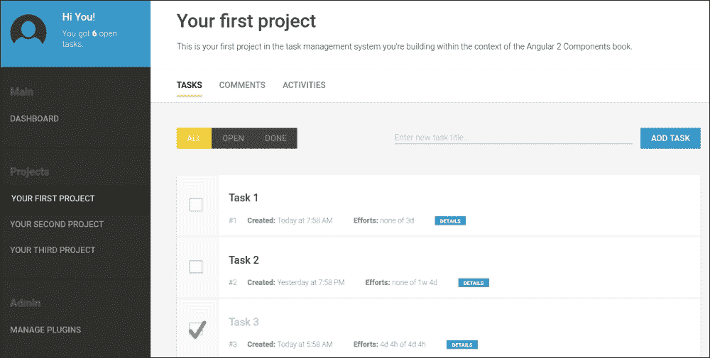
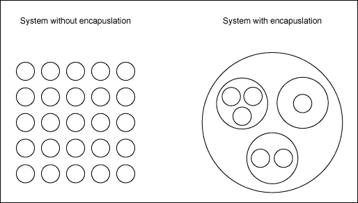
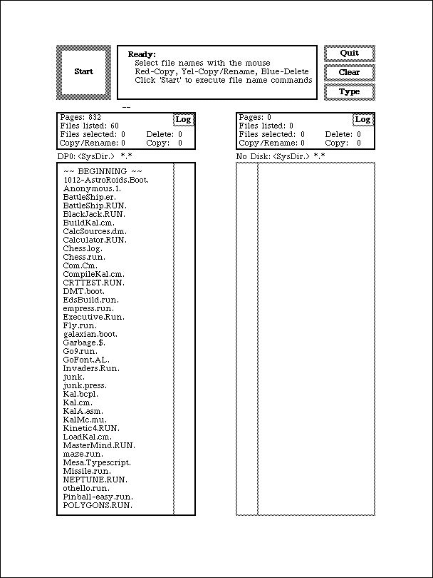
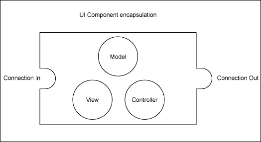
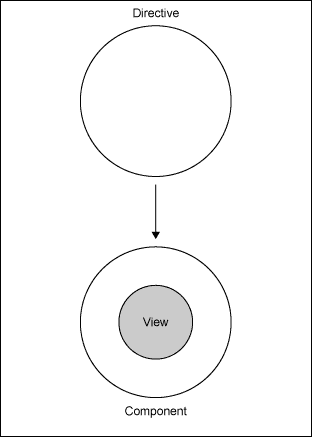
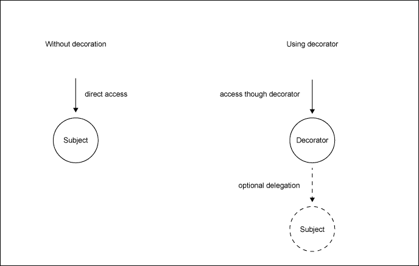

# 第一章. 基于组件的用户界面

尽管在这本书中我们将涵盖许多与 Angular 相关的主题，但重点将主要放在创建基于组件的用户界面。理解一个框架，比如 Angular 2，是一回事，但使用基于组件的架构建立有效的流程则是另一回事。在这本书中，我将尝试解释 Angular 2 组件背后的核心概念以及我们如何利用这种架构来创建现代、高效和可维护的用户界面。

除了学习 Angular 2 背后的所有必要概念，我们还将一起从头创建一个任务管理应用。这将使我们能够探索使用 Angular 2 提供的组件系统解决常见 UI 问题的不同方法。



我们将要构建的任务管理应用预览

在这一章中，我们将探讨基于组件的用户界面如何帮助我们构建更强大的应用。在这本书的整个过程中，我们将一起构建一个 Angular 2 应用，我们将充分利用基于组件的方法。本章还将介绍本书中使用的科技。本章我们将涵盖以下主题：

+   基于组件的用户界面简介

+   使用基于组件的用户界面进行封装和组合

+   UI 框架的演变

+   标准和 Web 组件

+   Angular 2 组件系统的简介

+   编写你的第一个 Angular 2 组件

+   ECMAScript 和 TypeScript 的概述和历史

+   ECMAScript 7 装饰器作为元注释

+   使用 JSPM 和 SystemJS 的 Node.js 工具简介

# 考虑有机体

今天的用户界面不仅仅是一堆拼凑到屏幕上的表单元素。现代用户体验设计和创新的内容交互视觉呈现比以往任何时候都更考验技术。

很遗憾，当我们为 Web 应用构思概念时，我们几乎总是倾向于按页面来思考，比如印刷书籍中的页面。嗯，这可能是传达此类内容和媒介信息最有效的方式。你可以逐页浏览，无需任何真正的体力劳动，逐段阅读，只需扫描那些你不感兴趣的部分。

过度思考页面的问题在于，这个从书籍中借用的概念并没有很好地转化为现实世界中的运作方式。世界是由形成有机体系统的有机体创造的。这个系统本身又形成了一个有机体，只是在更高的层面上。

以我们的身体为例。我们主要由独立的器官组成，这些器官通过电信号和化学信号相互交互。器官本身由蛋白质组成，这些蛋白质本身就像一台机器一样工作，形成一个系统。从分子、原子、质子和夸克来看，我们实际上无法真正判断哪里开始，哪里结束。我们可以肯定的是，这全部都是关于具有相互依赖性的生物系统，而不是关于页面。

我喜欢将用户界面视为生物系统。在它们被分配到页面、在哪里以及如何分配时，这些都是次要的。此外，它们应该能够独立工作，并且应该在相互依赖的水平上相互交互。

# 组件 – 用户界面的器官

|   | *"我们不是在设计页面，我们是在设计组件系统。"* |   |
| --- | --- | --- |
|   | --*Stephen Hay* |

这句话来自 Stephen Hay 在 2012 年奥兰多的 BDConf 上的发言，它指出了关键点。界面设计实际上根本不是关于页面。为了为用户以及维护它们的开发者创建高效的用户界面，我们需要从组件系统的角度思考。组件是独立的，但当它们组合在一起时，它们可以相互交互并创建更大的组件。我们需要从整体上看待用户界面，而使用组件使我们能够做到这一点。

在以下主题中，我们将探讨组件的一些基本方面。其中一些已经从其他概念中了解，例如**面向对象编程**（**OOP**），但在考虑组件时，它们呈现出略微不同的光景。

## 封装

封装在考虑系统维护时是一个非常重要的因素。拥有经典的 OOP 背景，我了解到封装意味着将逻辑和数据捆绑到一个隔离的容器中。这样，我们可以从外部操作容器，并把它当作一个封闭的系统。

在可维护性和可访问性方面，这种方法有许多积极方面。处理封闭系统对于我们的代码组织很重要。然而，这甚至更为重要，因为我们可以在编写代码的同时组织自己。



我有一个相当差的记忆力，对我来说，在编写代码时找到正确的关注水平非常重要。立即进行的记忆研究告诉我们，人类大脑平均一次可以记住大约七个项目。因此，对我们来说，以这种方式编写代码至关重要，这样我们就可以一次关注更少、更小的部分。

清晰的封装帮助我们组织代码。我们可能忘记了封闭系统的所有内部细节以及我们放入其中的逻辑和数据类型。我们可以只关注其表面，这使我们能够在一个更高的抽象级别上工作。类似于前面的图示，如果不使用封装组件的层次结构，我们的所有代码都会在同一级别上拼凑在一起。

封装鼓励我们将小型且简洁的组件隔离开来，并构建一个组件系统。在开发过程中，我们可以专注于一个组件的内部，而只需处理其他组件的接口。

有时候，我们会忘记我们实际进行的所有代码组织都是为了我们自己，而不是运行这些代码的计算机。如果是为计算机，那么我们可能都会重新开始用机器语言编写。强大的封装帮助我们轻松访问特定代码，专注于代码的一层，并信任胶囊中的底层实现。

以下 JavaScript 示例展示了如何使用封装来编写可维护的应用程序。假设我们在一个 T 恤工厂，我们需要一些代码来生产带有背景和前景颜色的 T 恤。此示例使用了 ECMAScript 6 的一些新特性。如果你不熟悉 ECMAScript 6 的语言特性，在这个阶段不必过于担心。我们将在本章后面学习这些内容：

```js
// This class implements data and logic to represent a colour
// which establishes clean encapsulation.
class Colour {
  constructor(red, green, blue) {
    Object.assign(this, {red, green, blue});
  }

  // Using this function we can convert the internal colour values
  // to a hex colour string like #ff0000 (red).
  getHex() {
    return '#' + Colour.getHexValue(this.red) + Colour.getHexValue(this.green) +
      Colour.getHexValue(this.blue);
  }

  // Static function on Colour class to convert a number from
  // 0 to 255 to a hexadecimal representation 00 to ff
  static getHexValue(number) {
    const hex = number.toString(16);
    return hex.length === 2 ? hex : '0' + hex;
  }
}

// Our TShirt class expects two colours to be passed during
// construction that will be used to render some HTML
class TShirt {
  constructor(backgroundColour, foregroundColour) {
    Object.assign(this, {backgroundColour, foregroundColour});
  }

  // Function that returns some markup which represents our 
  // T-Shirts
  getHtml() {
    return `
      <t-shirt style="background-color: ${this.backgroundColour.getHex()}">
        <t-shirt-text style="color: ${this.foregroundColour.getHex()}">
          Awesome Shirt!
        </t-shirt-text>
      </t-shirt>
    `;
  }
}

// Instantiate a blue colour
const blue = new Colour(0, 0, 255);
// Instantiate a red colour
const red = new Colour(255, 0, 0);
// Create a new shirt using the above colours
const awesomeShirt = new TShirt(blue, red);
// Adding the generated markup of our shirt to our document
document.body.innerHTML = awesomeShirt.getHtml();
```

使用干净的封装，我们现在可以处理 T 恤中的颜色抽象。我们不需要担心如何在 T 恤级别计算颜色的十六进制表示，因为这是由`Colour`类完成的。这使得你的应用程序易于维护，并且非常开放，便于更改。

如果您还没有这样做，我强烈建议您阅读有关 SOLID 原则的内容。正如其名称所暗示的，这个原则的集合是一个强大的工具，可以极大地改变您组织代码的方式。您可以在罗伯特·C·马丁的《敏捷原则、模式和实践》一书中了解更多关于 SOLID 原则的内容。

## 可组合性

组合是一种特殊的可重用性。你不是扩展现有的组件，而是通过将许多较小的组件组合在一起形成一个组件系统，从而创建一个新的更大的组件。

在面向对象编程语言中，组合通常被用来解决大多数面向对象编程语言都存在的多重继承问题。子类多态性一直很好，直到你达到你的设计不再符合项目最新要求的地步。让我们看看一个简单的例子，说明这个问题。

你有一个`Fisher`类和一个`Developer`类，它们都包含特定的行为。现在，你想要创建一个继承自`Fisher`和`Developer`的`FishingDeveloper`类。除非你使用支持多重继承的语言（例如 C++在一定程度上支持），否则你将无法通过继承重用此功能。没有方法告诉语言你的新类应该从这两个超类继承。使用组合，你可以轻松解决这个问题。你不需要使用继承，而是通过组合一个新的`FishingDeveloper`类，将所有行为委托给内部的`Developer`和`Fisher`实例：

```js
class Developer {
  code() {
    console.log(`${this.name} writes some code!`);
  }
}

class Fisher {
  fish() {
    console.log(`${this.name} catches a big fish!`);
  }
}

class FishingDeveloper {
  constructor(name) {
    this.name = name;
    this.developerStuff = new Developer();
    this.fisherStuff = new Fisher();
  }

  code() {
    this.developerStuff.code.bind(this)();
  }

  fish() {
    this.fisherStuff.fish.bind(this)();
  }
}

var bob = new FishingDeveloper('Bob');
bob.code();
bob.fish();
```

经验告诉我们，组合可能是重用代码最有效的方式。与继承、装饰和其他提高可重用性的方法相比，组合可能是最不侵入性和最灵活的。

一些语言的最新版本也支持一种称为特质的模式，即混合（mixins）。特质允许你以类似于多重继承的方式，从其他类中重用某些功能属性。

如果我们考虑组合的概念，它不过是设计生物体。我们有`Developer`和`Fisher`这两个生物体，我们将它们的行为统一到一个单一的`FishingDeveloper`生物体中。

## 自然创造的组件

组件、封装和组合是构建可维护应用程序的有效方式。由组件组成的应用程序对变化的负面影响具有很强的抵抗力，而变化是每个应用程序都会发生的事情。你的设计最终将受到变化效应的挑战，这只是时间问题；因此，编写能够尽可能平滑地处理变化的代码非常重要。

自然是最好的老师。几乎所有在技术发展中的成就都源于对自然界如何解决问题的观察。如果我们看看进化，它是对物质不断进行重新设计的过程，通过适应外部力量和约束。自然界通过突变和自然选择不断地进行变化来解决这一问题。

如果我们将进化的概念投射到开发应用程序上，我们可以说自然界实际上在每一刻都在重构其代码。这是每个产品经理的梦想——一个可以经历持续变化但不会失去任何效率的应用程序。

我认为有两个关键概念在自然界中起着重要作用，使得它能够在设计中不断应用变化而不损失太多效率。这使用了封装和组合。回到我们身体的例子，我们实际上可以告诉我们的器官使用了一种非常清晰的封装。它们使用膜来创建隔离，使用静脉来输送营养，使用突触来发送信息。此外，它们有相互依赖性，并且通过电化学信息进行交流。最明显的是，它们形成了更大的系统，这是组合的核心概念。

当然，还有许多其他因素，我并不是生物学的教授。然而，我认为看到我们学会了以与自然界组织物质非常相似的方式组织我们的代码，这是一件非常有趣的事情。

创建可重用 UI 组件的想法相当古老，并且在各种语言和框架中得到了实现。可能使用 UI 组件的最早系统之一是 20 世纪 70 年代的 Xerox Alto 系统。它使用了可重用的 UI 组件，允许开发者通过在用户可以与之交互的屏幕上组合它们来创建应用程序。



20 世纪 70 年代 Xerox Alto 系统上的文件管理器用户界面。

早期的前端 UI 框架，如 DHTMLX、Ext JS 或 jQuery UI，以更有限的方式实现了组件，这并没有提供很大的灵活性和可扩展性。这些框架中的大多数只是提供了小部件库。UI 小部件的问题在于它们大多数没有充分拥抱组合模式。你可以在页面上排列小部件，并且它们提供了封装，但大多数工具包中，你不能通过嵌套来创建更大的组件。一些工具包通过提供一种特殊类型的小部件来解决此问题，这通常被称为容器。然而，这并不等同于一个完整的组件树，它允许你在系统中创建系统。实际上，容器是为了提供一个视觉布局容器，而不是一个复合容器来形成一个更大的系统。

通常在我们应用页面上与小部件一起工作时，我们会有一个大控制器来控制所有这些小部件、用户输入和状态。然而，我们只剩下两层组合，我们无法更细致地结构化我们的代码。这里有页面和小部件。拥有大量 UI 小部件远远不够，我们几乎回到了创建贴满表单元素的页面的状态。

我已经使用 JavaServer Faces 多年了，尽管它存在许多问题，但拥有可重用自定义元素的概念是开创性的。使用 XHTML，可以编写所谓的复合组件，这些组件由其他复合组件或原生 HTML 元素组成。开发者可以通过组合获得极高的重用性。在我看来，这个技术的最大问题是它没有足够解决前端的问题，以至于无法真正用于复杂的用户交互。实际上，这样的框架应该完全存在于前端。

### 我的 UI 框架愿望清单

通常在比较 UI 框架时，它们会根据指标相互比较，例如小部件数量、主题功能和异步数据检索功能。每个框架都有其优势和劣势，但抛开所有额外功能，将其简化为 UI 框架的核心关注点，我只剩下几个想要评估的指标。当然，这些指标并不是今天 UI 开发中唯一重要的指标，但它们也是构建支持变化原则的清晰架构的主要因素：

+   我可以创建具有清晰界面的封装组件

+   我可以通过组合创建更大的组件

+   我可以让组件在其层次结构内相互交互

如果你正在寻找一个能够让你充分利用基于组件的 UI 开发的框架，你应该寻找这三个关键指标。

首先，我认为了解网络的主要目的及其如何演变非常重要。如果我们回想一下 1990 年代的网络早期，它可能只是关于超文本。有一些非常基本的语义可以用来结构化信息并向用户展示。HTML 的创建是为了持有结构和信息。对信息自定义视觉展示的需求导致了 CSS 在 HTML 开始广泛使用后不久的发展。

在 1990 年代中期，布兰登·艾奇发明了 JavaScript，并在 Netscape Navigator 中首次实现。通过提供实现行为和状态的方式，JavaScript 成为了全网页定制的最后一块缺失的拼图：

| 技术 | 关注点 |
| --- | --- |
| HTML | 结构和信息 |
| CSS | 展示 |
| JavaScript | 行为和状态 |

我们已经学会了尽可能地将这些关注点分开，以保持清晰的架构。尽管对此有不同的看法，并且一些最近的技术也开始偏离这个原则，但我相信，这些关注点的清晰分离对于创建可维护的应用程序非常重要。

把这个视图放在一边，面向对象编程中封装的标准定义只是关注逻辑和数据耦合与隔离。这可能很好地适用于经典的软件组件。然而，一旦我们把用户界面视为架构的一部分，就会增加一个新的维度。

经典的 MVC 框架以视图为中心，开发者根据页面组织代码。你可能会继续创建一个新的视图来表示一个页面。当然，你的视图需要一个控制器和模型，所以你也会创建它们。按页面组织的问题在于，几乎没有重用性的收益。一旦你创建了一个页面，你只想重用页面的一些部分，你需要一种方法来封装这个模型的具体部分——视图和控制器。

UI 组件很好地解决了这个问题。我喜欢把它们看作是 MVC 的模块化方法。尽管它们仍然采用 MVC 模式，但它们也建立了封装和可组合性。这样，视图本身就是一个组件，但它也由组件组成。通过组合组件的视图，可以最大限度地提高重用性：



UI 组件采用 MVC，但它们也支持在更低的级别上实现封装和组合

技术上，在用 Web 技术实现组件时有一些挑战。JavaScript 始终足够灵活，可以实现不同的模式和范式。与封装和组合一起工作根本不是问题，组件的控制部分和模型可以很容易地实现。例如，揭示模块模式、命名空间、原型或最近的 ECMAScript 6 模块等方法，都提供了从 JavaScript 方面需要的所有工具。

然而，对于我们的组件的视图部分，我们面临一些限制。尽管 HTML 在可组合性方面支持很大的灵活性，因为 DOM 树本质上就是一个大组合，但我们无法重用这些组合。我们只能创建一个大的组合，即页面本身。HTML 只是从服务器端交付的最终视图，这从来就不是真正的问题。今天的应用程序要求更高，我们需要在浏览器中运行一个完全封装的组件，它也包含部分视图。

我们在 CSS 上也面临同样的问题。在编写 CSS 时没有真正的模块化和封装，我们需要使用命名空间和前缀来隔离我们的 CSS 样式。尽管如此，CSS 的整个级联性质很容易破坏我们试图通过 CSS-structuring 模式引入的任何封装。

## 新标准的时机

在过去几年中，Web 标准发生了巨大的演变。有如此多的新标准，浏览器已经成为一个如此大的多媒体框架，以至于其他平台很难与之竞争。

我甚至可以说，Web 技术实际上将在未来取代其他框架，并且它可能将被重新命名为多媒体技术或类似的东西。我们没有理由需要使用不同的本地框架来创建用户界面和演示。Web 技术集成了许多功能，很难找到不使用它们进行任何类型应用的理由。只需看看 Firefox OS 或 Chrome OS，它们都是设计用来使用 Web 技术运行的。我认为这只是时间问题，直到更多操作系统和嵌入式设备开始利用 Web 技术来实现它们的软件。这就是为什么我相信在某个时刻，*Web 技术*这个术语是否仍然合适，或者我们是否应该用更通用的术语来替代它，将变得可疑。

虽然我们通常只看到浏览器中新功能的出现，但它们背后有一个非常开放且冗长的标准化过程。标准化功能非常重要，但这需要很多时间，尤其是在人们就解决问题的不同方法存在分歧时。

回到组件的概念，这是我们真正需要 Web 标准支持来突破当前限制的地方。幸运的是，W3C 也有同样的想法，一群开发者开始在名为*Web 组件*的伞形规范下制定规范。

以下主题将为您简要概述两个在 Angular 2 组件中也扮演角色的规范。Angular 2 的核心优势之一是它更像是一个 Web 标准的超集，而不是一个完全独立的框架。

### 模板元素

模板元素允许你在 HTML 中定义区域，这些区域不会被浏览器渲染。然后你可以使用 JavaScript 实例化这些文档片段，并将生成的 DOM 放置到你的文档中。

当浏览器实际上正在解析模板内容时，它只是为了验证 HTML。解析器通常执行的所有即时操作都不会被执行。在模板元素的内容中，图片不会加载，脚本也不会执行。只有当模板被实例化后，解析器才会采取必要的行动，如下所示：

```js
<body>
<template id="template">
 <h1>This is a template!</h1>
</template>
</body>
```

这个简单的 HTML 模板元素示例不会在你的页面上显示标题。因为标题位于模板元素中，我们首先需要实例化模板，然后将生成的 DOM 添加到我们的文档中：

```js
var template = document.querySelector('#template');
var instance = document.importNode(template.content, true);
document.body.appendChild(instance);
```

使用这三行 JavaScript 代码，我们可以实例化模板并将其附加到我们的文档中。

### 影子 DOM

这部分 Web 组件规范是创建适当的 DOM 封装和组合所缺失的部分。有了影子 DOM，我们可以创建受保护的 DOM 独立部分，防止外部常规 DOM 操作。此外，CSS 不会自动进入影子 DOM，我们可以在组件内部创建局部 CSS。

### 小贴士

如果你将一个`style`标签添加到阴影 DOM 内部，这些样式将仅限于阴影 DOM 的根元素，并且它们不会泄露到外部。这为 CSS 提供了一种非常强大的封装。

内容插入点使得从阴影 DOM 组件的外部控制内容变得容易，并且它提供了一种接口来传递内容。

在撰写这本书的时候，大多数浏览器都支持阴影 DOM，尽管在 Firefox 中仍然需要启用它。

# Angular 的组件架构

对我来说，Angular 第一个版本的指令概念改变了前端 UI 框架的游戏规则。这是我第一次感觉到有一个简单而强大的概念，允许创建可重用的 UI 组件。指令可以与 DOM 事件或消息服务进行通信。它们允许你遵循组合原则，你可以嵌套指令并创建仅由较小指令组合在一起的大指令。实际上，指令是浏览器中组件的一个非常好的实现。

在本节中，我们将探讨 Angular 2 的基于组件的架构以及我们关于组件所学的知识如何适应 Angular。

## 一切都是组件

作为 Angular 2 的早期采用者，在与其他人讨论它的时候，我经常被问及与第一个版本最大的区别是什么。我对这个问题的回答总是相同的。一切都是组件。



对我来说，这种范式转变是简化并丰富了框架的最相关变化。当然，Angular 2 还带来了许多其他变化。然而，作为一个基于组件的用户界面倡导者，我发现这个变化是最有趣的一个。当然，这个变化也伴随着许多架构上的变化。

Angular 2 支持从整体上查看用户界面的想法，并支持组件的组合。然而，与它的第一个版本相比，最大的区别是现在你的页面不再是全局视图，而是由其他组件组装的简单组件。如果你一直在跟随这一章节，你会注意到这正是整体用户界面方法所要求的。不再有页面，而是组件系统。

### 小贴士

Angular 2 仍然使用指令的概念，尽管现在的指令确实如其名称所暗示的那样。它们是浏览器将特定行为附加到元素上的命令。组件是一种特殊的指令，它带有视图。

# 您的第一个组件

沿袭传统，在我们开始一起构建真实的应用程序之前，我们应该使用 Angular 编写我们的第一个`hello world`组件：

```js
// Decorators allow us to separate declarative logic from our
// component implementation logic.
@Component({
  selector: 'hello-world',
  template: '<div>Hello {{name}}</div>'
})
class HelloWorld {
  constructor() {
    this.name = 'World';
  }
}
```

这已经是一个完全工作的 Angular 2 应用程序了。我们使用了 ECMAScript 6 类来创建组件所需的封装。你还可以看到一个用于声明性配置我们的组件的元注解。这个看起来像是一个以*at*符号为前缀的函数调用的语句，实际上来自 ECMAScript 7 装饰器提案。

### 注意

到本书写作时，ECMAScript 7 装饰器仍然非常实验性。对于本书中的代码，我们实际上使用了 TypeScript 编译器版本 1.5，它已经实现了装饰器，与原始规范略有不同。TypeScript 1.5 也被 Angular 2 团队用于开发 Angular 的核心。

重要的是要理解，一个元素只能绑定到一个单一组件。因为组件总是带有视图，所以我们无法将多个组件绑定到一个元素上。另一方面，一个元素可以绑定到多个指令，因为指令不带有视图，它们只附加行为。

在`Component`装饰器中，我们需要配置所有与描述我们的组件相关的信息，以便于 Angular。这当然也包括我们的视图模板。在前面的例子中，我们直接在 JavaScript 中以字符串的形式指定我们的模板。我们也可以使用`templateUrl`属性来指定模板应该从哪个 URL 加载。

现在，让我们稍微增强我们的例子，以便我们可以看到我们如何从更小的组件中组合我们的应用程序：

```js
// Using decorators we can declaratively define our component used
// to write bold text
@Component({
  selector: 'shout-out',
  template: '<strong>{{words}}</strong>'
})
class ShoutOut {
  @Input() words;
}

// This component will be our main application component that
// makes use of the above shout-out component (composition)
@Component({
  selector: 'hello-world'
  template: '<shout-out words="Hello, {{name}}!"></shout-out>',
  directives: [ShoutOut]
})
class HelloWorld {
  constructor() {
    this.name = 'World';
  }
}
```

你可以看到，我们现在已经创建了一个小组件，允许我们像我们喜欢的那样大声喊出词语。在我们的*Hello World*应用程序中，我们利用这个组件来大声喊出**Hello, World**！

### 提示

在组件视图模板内部使用的每个指令或组件都必须在视图注解的指令属性中显式声明。否则，编译器在遇到模板中的元素时将无法识别指令。

在这本书的整个过程中，以及我们在编写任务管理应用程序时，我们将学习更多关于组件的配置和实现。然而，在我们开始第二章之前，我们应该看看一些我们在这本书中会使用的工具和语言特性。

## 未来 JavaScript

不久前，有人问我我们是否真的应该使用 ECMAScript 5.1 的 bind 函数，因为这样我们可能会遇到浏览器兼容性问题。网络发展非常快，我们需要跟上节奏。我们不能编写不使用最新特性的代码，即使这会在旧浏览器中引起问题。

来自 TC39 的技术委员会的杰出人士，该委员会负责编写 ECMAScript 规范，他们已经出色地逐步增强了 JavaScript 语言。这一点，加上 JavaScript 的灵活性，使我们能够使用所谓的 polyfills 和 shims 来使我们的代码在旧浏览器上运行。

ECMAScript 6（也称为 ECMAScript 2015）于 2015 年 6 月发布，正好是其前身之后的四年。新增了大量的 API 以及许多新的语言特性。这些语言特性是语法糖，ECMAScript 6 可以被转换为其前一个版本，在旧浏览器上运行得很好。在撰写本书时，当前没有任何浏览器版本完全实现了 ECMAScript 6，但完全没有理由不将其用于生产应用。

### 小贴士

语法糖是一种设计方法，我们在不破坏向后兼容性的同时演进编程语言。这允许语言设计者提出新的语法，这丰富了开发者的体验，但不会破坏网络。每个新特性都需要转换成旧语法。这样，所谓的转换器就可以用来将代码转换为旧版本。

### 我说的是 JavaScript，请翻译！

当编译器将高级语言编译为低级语言时，转换器或转换编译器更像是一个转换器。它是一种源到源的编译器，可以将代码转换为在另一个解释器中运行。

最近，在将新语言转换为 JavaScript 并能在浏览器中运行的新语言之间，确实存在一场真正的战斗。我使用 Google Dart 有一段时间了，我必须承认，我真的很喜欢这门语言的特点。非标准化语言的问题在于它们严重依赖于社区采用和炒作。此外，它们几乎肯定永远不会在浏览器中本地运行。这也是我为什么更喜欢标准 JavaScript，以及未来的 JavaScript 使用转换器，这使我能够做到这一点。

有些人认为转换器引入的代码运行性能不佳，因此建议不要使用 ECMAScript 6 和转换器。我不赞同这一点，因为有很多原因。通常，这关乎微秒甚至纳秒级别的性能，而这对于大多数应用程序通常并不重要。

我并不是说性能不重要，但性能需要在一定的背景下进行讨论。如果你试图通过将处理时间从 10 微秒减少到五微秒来优化应用程序中的循环，而你永远不会迭代超过 100 个项目，那么你很可能是在做错事情。

另外，一个非常重要的是事实是，被转换的代码是由那些比我更了解微性能优化的人设计的，我确信他们的代码运行得比我快。除此之外，转换器可能也是你想要进行性能优化的正确地方，因为这段代码是自动生成的，你不会因为性能问题而失去代码的可维护性。

我想在这里引用唐纳德·克努特的话，并说过早优化是万恶之源。我真心推荐你阅读他关于这个主题的论文（唐纳德·克努特，1974 年 12 月，*使用 goto 语句的结构化编程*）。仅仅因为 goto 语句被从所有现代编程语言中禁止，并不意味着这就不值得一读。

在本章的后面部分，你将了解到一些工具，它们可以帮助你轻松地在项目中使用转换器，我们还将看看 Angular 在源代码中做出的决策和方向。

让我们看看 ECMAScript 6 带来的一些语言特性，它们让我们的生活变得更加容易。

### 类

类是 JavaScript 中最受欢迎的特性之一，我也是投票支持它的人之一。嗯，作为一个有面向对象编程背景的人，并且习惯于在类中组织一切，对我来说很难放手。然而，在一段时间使用现代 JavaScript 之后，你会将它们的使用减少到最低限度，并且只用于它们本应发挥的作用——继承。

ECMAScript 6 中的类为你提供了处理原型、构造函数、super 调用和对象属性定义的语法糖，让你产生一种错觉，认为 JavaScript 可以是一个基于类的面向对象编程语言：

```js
class Fruit {
  constructor(name) { this.name = name; }
}
const apple = new Fruit('Apple');
```

正如我们在关于转换器的上一个主题中学到的，ECMAScript 6 可以被转换为 ECMAScript 5。让我们看看一个转换器会从这个简单的例子中产生什么：

```js
function Fruit(name) { this.name = name; }
var apple = new Fruit('Apple');
```

这个简单的例子可以很容易地使用 ECMAScript 5 构建。然而，一旦我们使用基于类的面向对象语言的更复杂特性，去糖化过程就变得相当复杂了。

ECMAScript 6 类引入了简化的语法来编写类成员函数（静态函数）、使用 super 关键字，以及使用 extends 关键字进行继承。

如果你想要了解更多关于类和 ECMAScript 6 中的特性，我强烈推荐你阅读 Axel Rauschmayer 博士的文章（[`www.2ality.com/`](http://www.2ality.com/))。

### 模块

模块提供了一种封装你的代码并创建隐私的方法。在面向对象的语言中，我们通常使用类来做这件事。然而，我实际上认为这更像是一个反模式，而不是一个好的实践。类应该用于需要继承的地方，而不仅仅是用来结构化你的代码。

我相信你已经遇到了很多不同的 JavaScript 模块模式。其中最流行的一种，通过使用**立即执行函数表达式**（**IIFE**）的函数闭包来创建隐私，可能是揭示模块模式。如果你想了解更多关于这个以及其他一些优秀的模式，我推荐阅读 Addy Osmani 所著的《Learning JavaScript Design Patterns》这本书。

在 ECMAScript 6 中，我们现在可以使用模块来达到这个目的。我们只需为每个模块创建一个文件，然后使用 import 和 export 关键字将我们的模块连接起来。

在 ECMAScript 6 模块规范中，我们实际上可以从每个模块中导出我们喜欢的东西。然后我们可以从任何其他模块中导入这些命名的导出。每个模块可以有一个默认导出，这特别容易导入。默认导出不需要命名，导入时也不需要知道它们的名称：

```js
import SomeModule from './some-module.js';
var something = SomeModule.doSomething();
export default something;
```

有很多种使用模块的组合方式。在我们接下来的章节中，通过构建我们的任务管理应用，我们将一起发现其中的一些。如果你想看到更多关于如何使用模块的例子，我可以推荐 Mozilla 开发者网络上的文档（[`developer.mozilla.org`](https://developer.mozilla.org)）关于`import`和`export`关键字。

### 模板字符串

模板字符串非常简单，但它们是 JavaScript 语法的极其有用的补充。它们有三个主要用途：

+   编写多行字符串

+   字符串插值

+   标签模板字符串

在模板字符串之前，编写多行字符串相当冗长。你需要自己拼接字符串片段并添加换行符到行尾：

```js
const header = '<header>\n' +
  '  <h1>' + title + '</h1>\n' +
  '</header>';
```

使用模板字符串，我们可以大大简化这个例子。我们可以编写多行字符串，也可以使用我们之前用来连接的字符串插值功能来为我们的标题变量编写：

```js
const header = '
  <header>
    <h1>${title}</h1>
  </header>
`;
```

注意使用反引号而不是之前的单引号。模板字符串总是写在反引号之间，解析器会将它们之间的所有字符解释为结果字符串的一部分。这样，我们源文件中存在的换行符也会自动成为字符串的一部分。

你还可以看到我们使用了美元符号，后面跟着花括号来插值我们的字符串。这允许我们在字符串中写入任意 JavaScript 代码，这在构建 HTML 模板字符串时非常有帮助。

你可以在 Mozilla 开发者网络上了解更多关于模板字符串的信息。

### ECMAScript 或 TypeScript？

TypeScript 是由 Anders Hejlsberg 于 2012 年创建的，旨在实现 ECMAScript 6 的未来标准，同时也提供了一个包含但不限于语法和特性的超集。

TypeScript 作为 ECMAScript 6 标准的超集，有很多特性，包括但不限于以下内容：

+   可选的静态类型与类型注解

+   接口

+   枚举类型

+   泛型

重要的是要理解 TypeScript 提供的所有作为超集的功能都是可选的。你可以编写纯 ECMAScript 6 代码，而不必利用 TypeScript 提供的附加功能。TypeScript 编译器仍然会将纯 ECMAScript 6 代码无错误地转换为 ECMAScript 5。

### 注意

TypeScript 中看到的大多数功能实际上在其他语言中已经存在，例如 Java 和 C#。TypeScript 的一个目标是为大型应用程序提供支持工作流程和更好的可维护性的语言功能。

任何非标准语言的问题在于，没有人能说清楚这种语言将维持多久，未来的语言势头会多快。就支持而言，TypeScript，凭借其赞助商微软，实际上可能会拥有很长的一生。然而，仍然没有保证语言的势头和趋势将以合理的速度持续发展。显然，对于标准 ECMAScript 6 来说，这个问题并不存在，因为它是未来网络的基础，也是浏览器将原生支持的语言。

尽管如此，如果你想要解决以下明显超过项目未来不确定性的负面影响的担忧，使用 TypeScript 的扩展功能是有合理理由的：

+   经历了大量更改和重构的大型应用程序

+   在编写代码时需要严格治理的大型团队

在这本书中，我们将使用 TypeScript 编译器，但我们将使用标准 ECMAScript 6 代码，除了下一节关于装饰器的主题中提到的例外。

### 装饰器

装饰器不是 ECMAScript 6 规范的一部分，但它们被提议纳入 2016 年的 ECMAScript 7 标准。它们为我们提供了一种在设计时装饰类和属性的方法。这允许开发者在使用类时使用元注解，并声明性地将功能附加到类及其属性上。

装饰器是以最初在 Erich Gamma 和他的同事（也称为“四人帮”**GoF**）的书中描述的装饰器模式命名的，即《设计模式：可复用面向对象软件元素》。

装饰的原则是拦截现有的过程，装饰器有机会委托、提供替代过程，或者从两者中混合。



使用简单访问过程的示例在动态环境中可视化装饰

ECMAScript 7 中的装饰器可以用来注解类和类属性。请注意，这也包括类方法，因为类方法也是类原型对象的属性。装饰器被定义为常规函数，并且可以用 *at* 符号附加到类或类属性上。每次放置装饰器时，我们的装饰器函数将使用包含包含位置上下文信息作为第一个参数调用。我们的装饰器函数将使用上下文信息关于包含位置每次放置装饰器时被调用。

让我们看看一个简单的例子，它说明了装饰器的使用：

```js
function logAccess(obj, prop, descriptor) {
  const delegate = descriptor.value;
  descriptor.value = function() {
    console.log(`${prop} was called!`);
    return delegate.apply(this, arguments);
  };
}

class MoneySafe {
  @logAccess
  openSafe() {
    this.open = true;
  }
}

const safe = new MoneySafe();
safe.openSafe(); // openSafe was called!
```

我们创建了一个 `logAccess` 装饰器，它将记录所有带有装饰器的函数调用。如果我们查看 `MoneySafe` 类，我们可以看到我们已经用我们的 `logAccess` 装饰器装饰了 `openSafe` 方法。

`logAccess` 装饰器函数将为我们的代码中每个注解属性执行。这使我们能够拦截给定属性的属性定义。让我们看看我们的装饰器函数的签名。放置在类属性上的装饰器函数将使用属性定义的目标对象作为第一个参数调用。第二个参数是实际定义的属性名称，然后是最后一个参数，即应该应用于对象的描述符对象。

装饰器为我们提供了拦截属性定义的机会。在我们的例子中，我们使用这种能力来交换描述符值（即注解函数）与一个代理函数，该代理函数在调用原始函数之前记录函数调用（委托）。为了简化起见，我们实现了一个非常简单但又不完整的函数代理。对于现实世界的场景，建议使用更好的代理实现，例如 ECMAScript 6 代理对象。

装饰器是利用面向方面概念并声明式地在设计时向我们的代码添加行为的强大功能。

让我们来看第二个例子，我们将使用一种不同的方式来声明和使用装饰器。我们可以将装饰器视为函数表达式，其中我们的装饰器函数被重写为一个工厂函数。这种使用形式在需要将配置传递给装饰器时特别有用，装饰器工厂函数提供了这种配置：

```js
function delay(time) {
  return function(obj, prop, descriptor) {
    const delegate = descriptor.value;
    descriptor.value = function() {
      const context = this;
      const args = arguments;
      return new Promise(function(success) {
        setTimeout(function() {
          success(delegate.apply(context, arguments));
        }, time);
      });
    };
  };
}

class Doer {
  @delay(1000)
  doItLater() {
    console.log('I did it!');
  }
}

const doer = new Doer();
doer.doItLater(); // I did it! (after 1 second)
```

我们现在已经学会了如何使用 ECMAScript 7 装饰器来帮助我们编写具有面向方面特性的声明式代码。这大大简化了开发过程，因为我们现在可以在设计时考虑添加到我们类中的行为，当我们实际上将类作为一个整体来思考并编写类的初始框架时。

TypeScript 中的装饰器与 ECMAScript 7 中的装饰器略有不同。它们不仅限于类和类属性，还可以放置在类方法内的参数上。这允许你注解函数参数，这在某些情况下可能很有用：

```js
class TypeScriptClass {
  constructor(@ParameterDecorator() param) {}
}
```

Angular 使用这个特性来简化类构造函数上的依赖注入。由于所有指令、组件和服务类都是由 Angular 依赖注入而不是直接由我们实例化，这些注解帮助 Angular 找到正确的依赖。对于这个用例，函数参数装饰器实际上非常有意义。

### 注意

目前，类方法参数上装饰器的实现仍然存在问题，这也是为什么 ECMAScript 7 不支持它的原因。由于这个特性对于构建 Angular 2 应用程序至关重要，我们将使用 TypeScript 编译器来转译我们应用程序的代码。这是我们在这本书中将使用的唯一 TypeScript 特定功能。

# 工具

为了利用所有这些未来的技术，我们需要一些工具来支持我们。我们之前已经讨论了 ECMAScript 6 和装饰器，实际上我们更倾向于使用 TypeScript 装饰器，因为它们支持 Angular 2 使用的函数参数装饰器。尽管 ECMAScript 6 语法支持模块，我们仍然需要一个模块加载器来实际加载浏览器中所需的模块或帮助我们生成可执行包。

## Node.js 和 NPM

Node.js 是增强版的 JavaScript。最初，Node.js 是 Google Chrome 浏览器中 V8 JavaScript 引擎的一个分支，它被扩展了更多的功能，特别是为了使 JavaScript 在服务器端有用。文件处理、流、系统 API 以及庞大的用户生成包生态系统只是使这项技术成为您网络开发杰出伙伴的一些事实。

节点包管理器 NPM 是通往超过 200,000 个包和库的大门，这些包和库可以帮助您构建自己的应用程序或库。Node.js 的哲学与 UNIX 哲学非常相似，即包应该保持小巧而锋利，但它们应该使用组合来实现更高的目标。

为了构建我们的应用程序，我们将依赖 Node.js 作为我们将要使用的工具的主机。因此，我们应该确保在我们的机器上安装 Node.js，以便为下一章做准备，在那里我们将开始构建我们的任务管理应用程序。

### 注意

您可以从他们的网站[`nodejs.org`](https://nodejs.org)获取 Node.js，并且按照他们网站上的说明安装应该非常简单。

一旦安装了 Node.js，我们可以执行一个简单的测试来检查一切是否正常运行。打开终端控制台并执行以下命令：

```js
node -e "console.log('Hello World');" 

```

## SystemJS 和 JSPM

目前有许多模块格式和模块加载器，但在我看来，有一个是统治它们的。SystemJS 是基于一个 ES6 模块加载器 polyfill 构建的，因此非常接近即将到来的标准。我坚信标准化，因此更倾向于使用 SystemJS 而不是其他模块加载器，如 RequireJS、Browserify 或 webpack。我们应该尽可能停止使用库，并依赖 polyfills 使我们的浏览器能够运行未来的代码。

SystemJS 是一个通用的模块加载器，能够加载许多不同的模块格式，例如 AMD、CommonJS 和 ECMAScript 6，它还支持一个非常灵活的 shiming 机制来模块化全局 JavaScript。

SystemJS 还支持最流行的转译器，包括 ECMAScript 6 和 TypeScript。这意味着您实际上可以直接在浏览器中加载 ECMAScript 6 代码，由 SystemJS 在运行时进行转译。这在开发期间非常棒，尤其是因为您可以从任何位置加载模块，包括远程 HTTP 位置，如 GitHub 或 NPM 仓库。

### JSPM

JavaScript 包管理器不仅仅是一个 JavaScript 的包管理器。这基本上是一个中介和管理器，用于 SystemJS，它帮助您从包仓库（如 Bower 或 NPM）中查找包，并为 SystemJS 创建必要的配置。JSPM 用 Node.js 编写，不附带自己的远程包仓库。由于 SystemJS 需要 URLs 和模块映射来知道从哪里加载模块，因此 JSPM 是您创建这种必要配置并简化包安装的工具。

### 开始使用 JSPM

让我们一起来创建一个使用 JSPM 的简单应用程序。首先，我们需要使用 NPM 安装两个全局模块。除了 JSPM，我们还将安装一个名为 live-server 的工具，它将通过提供静态文件服务的 HTTP 服务器来帮助我们进行开发。它还内置了文件更改检测功能，一旦检测到文件更改，它将自动重新加载您的浏览器。这提供了一个非常短的反馈循环，使得开发过程变得非常快速：

1.  在命令行中运行以下命令：

    ```js
    npm install -g jspm live-server

    ```

    ### 小贴士

    注意，在类 UNIX 系统（如 Linux 或 Mac OS X）上，有时需要以超级用户身份运行 NPM。还建议您使用 **Node 版本管理器**（**NVM**）来解决这个问题（[`github.com/creationix/nvm`](https://github.com/creationix/nvm)）。

1.  在安装 JSPM 和 `live-server` 包之后，我们可以继续使用 JSPM 创建我们的第一个应用程序。

1.  为应用程序创建一个新的目录，并在该目录内打开一个终端控制台。

1.  您现在可以在终端控制台中执行以下命令来本地安装 JSPM 并初始化一个新的 JSPM 项目：

    ```js
    npm install jspm --save-dev
    jspm init 

    ```

1.  JSPM 将启动一个向导，引导您完成初始化步骤。您可以用默认答案（只需按*Enter*键）回答所有问题，除了关于您想使用哪种编译器的问题，您应该回答 TypeScript。

1.  在 JSPM 安装所有必要的包之后，我们可以继续创建我们的`index.html`文件。导航到您的项目文件夹，并在您最喜欢的编辑器中创建一个新的文件，`index.html`：

    ```js
    <!doctype html>
    <script src="img/system.js"></script>
    <script src="img/config.js"></script>
    <script>
      System.import('main.js');
    </script>
    ```

1.  这非常简约的 HTML 已经是我们的 JSPM Hello World 应用程序的基础。在包含`SystemJS`库和由 JSPM 生成的`config.js`文件之后，我们只需要通过告诉`SystemJS`要导入哪个文件来引导我们的应用程序。

1.  在我们创建主应用程序文件之前，我们将快速安装 jQuery 作为包，只是为了演示第三方库如何容易地使用`SystemJS`和 JSPM 进行安装和使用。

    ```js
    jspm install jquery

    ```

1.  在安装 jQuery 之后，我们可以在应用程序文件夹内创建我们的`main.js`文件：

    ```js
    import $ from 'jquery';

    class HelloWorld {
      constructor() {
        $(document.body).append('<h1>Hello World!</h1>');
      }
    }
    const helloWorld = new HelloWorld();
    ```

1.  为了在浏览器中运行此示例，我们现在可以在应用程序文件夹内执行以下命令来启动我们的实时服务器：

    ```js
    live-server

    ```

在遵循前面的步骤之后，您应该有一个使用 ECMAScript 6 和 SystemJS 以及 TypeScript 编译器的可工作示例。使用 LiveReload，您的浏览器应该会自动打开并显示我们的 Hello World 应用程序。您现在也可以尝试稍微修改一下代码，并更改写入 DOM 的句子。您会注意到，一旦您保存更改，浏览器将立即重新加载页面。

# 摘要

在本章中，我们探讨了基于组件的方法来构建用户界面，并讨论了其背景的必要方面，以便理解为什么我们要随着网络标准和框架，如 Angular，向这个方向发展。我们还确保了我们为本书后续章节中将要使用的所有技术都做好了准备。您使用 JSPM、SystemJS、ECMAScript 6 和 TypeScript 编译器创建了自己的第一个简单示例。现在，我们准备利用组件化架构的潜力来构建我们的任务管理系统。

在下一章中，我们将开始使用 Angular 2 组件构建我们的任务管理应用程序。我们将查看从头创建 Angular 2 应用程序所需的初始步骤，并详细说明前几个组件，以便构建任务列表。
