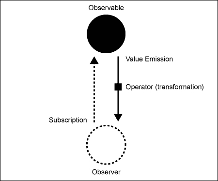
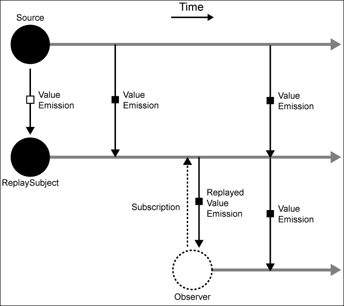
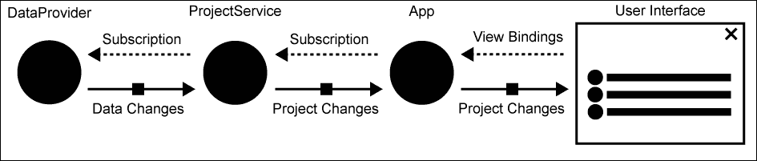
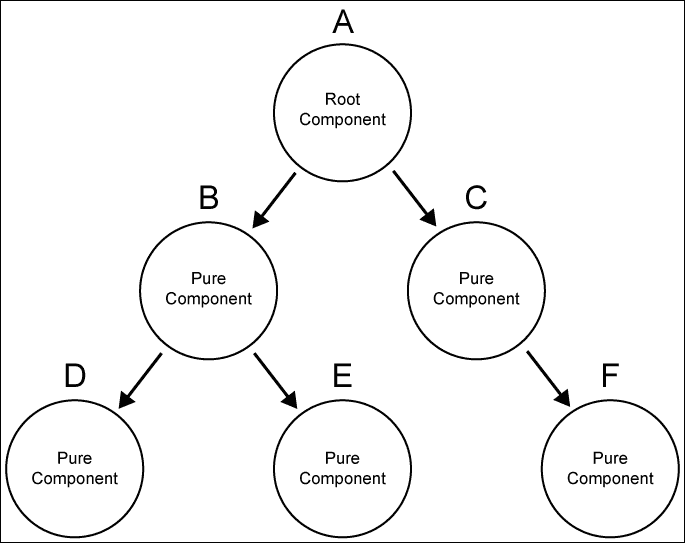
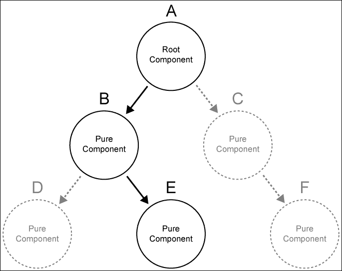
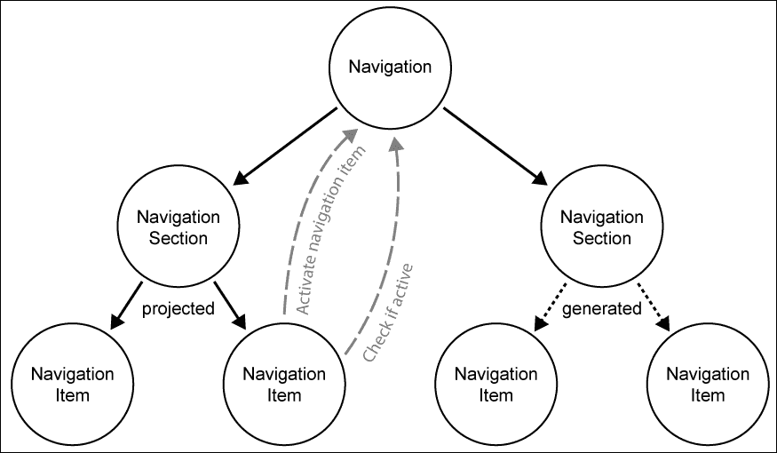
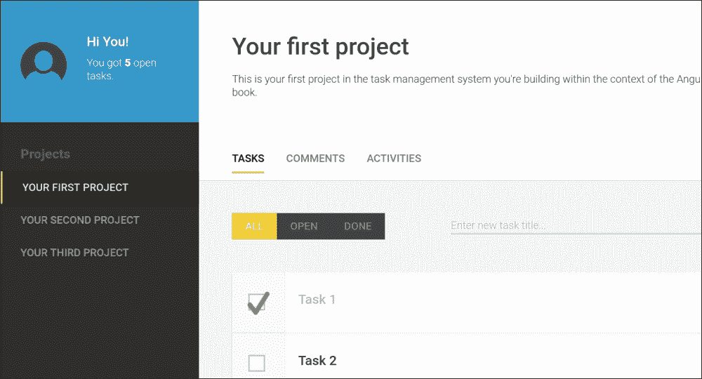

# 第三章。使用组件进行组合

在本章中，我们将进一步构建我们的应用程序结构，并处理作为我们任务管理系统基础的布局和架构。除了引入新组件和通过现有组件创建更大的组合外，我们还将探讨我们处理数据的方式。到目前为止，我们已经从上一章中创建的`TaskListService`同步获取了任务数据。然而，在现实世界的场景中，这种情况很少发生。在实际应用中，数据大多以异步形式检索。通常，我们通过 RESTful Web 服务获取数据，并使用`XMLHttpRequest`或最近标准化的 fetch API。然而，由于我们试图构建一个前沿的应用程序，我们将更进一步。在本章中，我们将探讨如何使用 RxJS 重构我们的应用程序以处理可观察数据结构——RxJS 是一个在 Angular 中使用的功能性和响应式编程库。

在本章中，我们将探讨以下主题：

+   重构我们的应用程序以处理可观察数据结构

+   RxJS 及其操作符的基本知识，以便构建响应式数据模型

+   在 Angular 中使用纯组件

+   为纯组件使用`ChangeDetectionStrategy.OnPush`

+   使用内容投影点和`@ContentChildren`创建`Tab`组件

+   创建一个简单的导航组件

+   注入父组件并建立直接组件通信

+   结合内部和外部内容以创建灵活的组件 API

# 数据 – 从伪造到真实

从本章开始，我们将切换到基于文档的数据库来存储我们的任务和项目数据。作为一个数据存储，我们使用 PouchDB 项目，这是一个设计用于与 IndexedDB 一起运行并在各种回退策略中运行的浏览器数据库。PouchDB 的设计类似于 Apache CouchDB，并且甚至可以与之同步。

为了在你构建应用程序的过程中为你提供优质体验，我们工作在真实生活条件下是非常重要的。这意味着我们应该在我们的组件中使用异步数据，而不是依赖于简单的 JavaScript 数据数组。为了使这个过程尽可能顺畅，整个数据层已经为你设置好了，你不需要过多地担心内部细节。当然，如果你仍然感兴趣，我不会阻止你探索位于`data-access`文件夹中的源代码。

# 使用可观察数据结构进行响应式编程

到目前为止，我们在创建的任务列表中使用了简单的数组数据结构。这并不是我们在现实世界场景中会遇到的。在实际应用中，我们必须处理异步数据和需要在用户之间同步的数据变化。现代应用程序的要求有时甚至更严格，还需要实时提供更改数据的视图更新。既然我们正在构建一个现代任务管理系统，我们应该努力跟上这些要求。

这两者，处理异步数据和处理实时数据更新，都需要对我们应用程序中的数据流进行重大重构。使用可观察数据结构，我们使我们的应用程序能够掌握异步数据的挑战，在这些数据中我们需要对变化做出反应。

在应用程序中处理数据的行为与流非常相似。你接收输入，转换它，组合它，合并它，最后将其写入输出。在类似这样的系统中，输入也很有可能是连续的，有时甚至是无限期的。以实时流为例；这类数据持续流动，数据也无限流动。函数式和响应式编程是帮助我们以更干净的方式处理这类数据的范式。



一个简单的可观察订阅，带有值发射和转换

Angular 2 在其核心是响应式的，整个变化检测和绑定都是使用响应式架构构建的。我们在上一章中学到的组件的输入和输出，不过是一个使用响应式事件驱动方法建立的数据流。Angular 使用 RxJS，一个用于 JavaScript 的函数式和响应式编程库，来实现这个数据流。实际上，我们用来从组件内部发送自定义事件的 `EventEmitter`，只是 RxJS 可观察对象的一个包装。

响应式和函数式编程正是我们为了处理异步数据和数据变化而重新设计应用程序所寻找的。因为我们已经从 Angular 的生产依赖中获得了 RxJS，所以让我们使用它来从我们的数据源到我们的应用程序建立一个连续的数据流。我们项目 `data-access` 文件夹中存在的 `DataProvider` 服务使用 RxJS 为我们的数据存储提供了一个很好的包装。由于我们将在整个应用程序中使用此服务，我们可以在 `bootstrap.js` 文件中直接将其提供给 `bootstrap`，如下所示：

```js
// Import Angular bootstrap function
import {bootstrap} from '@angular/platform-browser-dynamic';
import {DataProvider} from '../data-access/data-provider';
// Import our main app component
import {App} from './app';

bootstrap(App, [
 DataProvider
]);

```

作为 Angular 的 `bootstrap` 函数的第二个参数，我们可以提供应用级别的依赖项，这些依赖项将在所有组件和指令中可用。

现在我们使用 `DataProvider` 服务作为抽象来从 PouchDB 数据存储中获取数据，并创建一个新的服务，负责提供项目数据。

我们将在 `lib/project/project-service/project-service.js` 路径上创建一个新的 `ProjectService` 类，如下所示：

```js
import {Injectable, Inject} from '@angular/core';
import {ReplaySubject} from 'rxjs/Rx';
import {DataProvider} from '../../../data-access/data-provider';

@Injectable()
export class ProjectService {
  constructor(@Inject(DataProvider) dataProvider) {
    …
  }
}
```

查看我们新模块的导入部分，你可以看到我们从 Angular 核心模块中导入了必要的依赖项以进行依赖注入。我们的服务类使用 `@Injectable` 装饰器，这样我们就可以将其提供给组件的注入器。我们还将在新创建的服务构造函数中注入 `DataProvider` 服务。

我们从 RxJS 库中导入的 `ReplaySubject` 类用于使我们的服务变得响应式。在 RxJS 世界中，一个主题（subject）既是观察者（observer）也是可观察的（observable）。它可以观察某些变化，然后向所有订阅者发出进一步的通知。你可以将主题想象成一个代理，它位于变化源和一组观察者之间。每当源发出变化时，主题将通知所有订阅者这些变化。

现在，`ReplaySubject` 类是一种特殊的主题，它允许你在添加新订阅者时回放一个变化缓冲区。这在始终需要向订阅者提供一些初始数据时特别有用。想象一下我们的数据，我们希望将其传播到 UI 中。我们希望在订阅我们的服务时立即获取初始数据，然后继续，我们也希望得到关于变化的通知。使用仅缓冲一个变化的 `ReplaySubject` 类，可以完美地满足这种用例。

让我们看看以下图，它说明了 `ReplaySubject` 的行为：



使用 `ReplaySubject` 类连接到观察者的源，该类缓冲最新值并在订阅时发出

在前面的图中，你可以看到我们正在将一个 `ReplaySubject` 类连接到一个随时间发出值变化的源。在两次发出后，一个观察者订阅了我们的 `ReplaySubject` 类。然后 `ReplaySubject` 将所有缓冲的变化回放到新订阅者，就像这些事件刚刚发生一样。在这个例子中，我们使用了一个回放缓冲长度为 1。在随后的值发出时，这些值将直接重新发出到 `ReplaySubject` 类的订阅者。

让我们回到我们的 `ProjectService` 类，并在构造函数中添加一些逻辑，以便使用 `ReplaySubject` 类发出项目数据。

我们将开始一些成员字段的初始化，我们需要实现以下逻辑：

```js
this.dataProvider = dataProvider;
this.projects = [];
// We're exposing a replay subject that will emit events whenever 
// the projects list change
this.change = new ReplaySubject(1);

```

注意，我们创建了一个具有一个缓冲长度的 `ReplaySubject` 类，并将其分配给名为 `change` 的成员字段。

我们还将之前在构造函数参数中注入的 `DataProvider` 服务分配给 `dataProvider` 成员字段。

现在，是时候利用 `DataProvider` 服务来订阅数据存储中的任何变更了。这建立了一个对我们的 PouchDB 中存储的数据的响应式连接：

```js
// Setting up our functional reactive subscription to receive
// project changes from the database
this.projectsSubscription = this.dataProvider.getLiveChanges()
  // First convert the change records to actual documents
 .map((change) => change.doc)
  // Filter so that we only receive project documents
 .filter((document) => document.type === 'project')
  // Finally we subscribe to the change observer and deal with 
  // project changes in the function parameter
 .subscribe((changedProject) => {
    this.projects = this.projects.slice();
    // On every project change we need to update our projects list 
    const projectIndex = this.projects.findIndex(
      (project) => project._id === changedProject._id
    );
    if (projectIndex === -1) {
      this.projects.push(changedProject);
    } else {
      this.projects.splice(projectIndex, 1, changedProject);
    }
 // Emit an event on our replay subject
 this.change.next(this.projects);
  });
```

由 `getLiveChanges()` 函数返回的可观测量会以变更的形式在我们的数据存储中发出数据。除此之外，这还会在我们在收到初始数据之后对存储应用任何后续变更时发出这些变更。你可以想象一个持续连接到数据库的连接，每当数据库中的文档被更新时，我们的观察者都会接收到这个变更值。

可观测量提供了一大堆所谓的算子，这些算子允许你转换来自可观测量的数据流。你可能已经从 ECMAScript 5 数组扩展函数中了解到一些这些函数算子，例如 `map` 和 `filter`。使用算子，你可以模拟整个转换流程，直到你最终订阅数据。

当我们从数据存储中接收到变更对象时，我们首先需要将它们转换成文档对象。这相当简单，因为每个变更对象都包含一个 `doc` 属性，实际上它持有我们已接收更新的变更文档的全部数据。使用 `map` 函数，我们可以在将变更对象返回到数据流之前，将它们转换成项目对象：

```js
.map((change) => change.doc)

```

`DataProvider` 将为我们提供存储中所有文档的数据。由于我们目前只对项目数据感兴趣，我们还应用了一个过滤器，过滤掉所有不是 `project` 类型的文档：

```js
.filter((document) => document.type === 'project')

```

最后，我们可以订阅转换后的流，如下所示：

```js
.subscribe((changedProject) => {})

```

`subscribe` 算子是我们观察路径的终止点。这就像是我们坐下来观察的终点。在我们的 `subscribe` 函数内部，我们监听项目文档的更新，并将它们纳入 `App` 组件的 `projects` 成员属性中。这包括不仅添加到文档存储中的新项目，还包括更新现有项目。每个项目都包含一个可以通过 `_id` 属性访问的唯一标识符。这使我们能够轻松找到正确的操作。

在更新我们的项目实际视图并将项目列表存储在 `projects` 成员字段之后，我们可以使用我们的 `ReplaySubject` 类发出更新后的列表：

```js
this.change.next(this.projects);

```

我们的 `ProjectService` 类现在已准备好使用，需要获取项目数据的应用组件可以订阅暴露的 `ReplaySubject` 类，以便对这些数据变更做出反应。

让我们在 `lib/app.js` 中重构 `App` 组件，并移除我们迄今为止使用的假 `TaskListService`：

```js
import {Component, ViewEncapsulation, Inject} from '@angular/core';
import {ProjectService} from './project/project-service/project-service';
import template from './app.html!text';

@Component({
  selector: 'ngc-app',
  template,
  encapsulation: ViewEncapsulation.None,
  providers: [ProjectService]
})
export class App {
 constructor(@Inject(ProjectService) projectService) {
 this.projectService = projectService;
 this.projects = [];

    // Setting up our functional reactive subscription to receive 
    // project changes
 this.projectsSubscription = projectService.change
 // We subscribe to the change observer of our service
 .subscribe((projects) => {
 this.projects = projects;
 });
 }

  // If this component gets destroyed, we need to remember to 
  // clean up the project subscription
 ngOnDestroy() {
 this.projectsSubscription.unsubscribe();
 }
}
```

在我们的 `App` 组件中，我们现在通过 `ProjectService` 类上的变化可观察对象来获取项目列表。通过在服务上使用对 `ReplaySubject` 的响应式订阅，我们确保存储在 `App` 组件中的项目列表在发生任何更改后都会更新。

我们使用 `OnDestroy` 生命周期钩子来取消订阅 `ProjectService` 的变化可观察对象。如果你喜欢在应用程序中进行适当的清理，这是一个必要的手动步骤。根据来源，忘记取消订阅可能会导致内存泄漏。

通过前面的代码，我们已经为响应式数据架构奠定了基础。我们观察数据存储的变化，并且我们的用户界面会对其做出反应：



这张图展示了从我们的数据存储到视图的端到端响应式数据流。

# 不可变性

不可变性最初是函数式编程的核心概念。这个主题不会深入探讨不可变性，但它将解释核心概念，以便我们可以讨论如何将这个概念应用到 Angular 组件中。

不可变数据结构迫使你在修改数据之前必须创建数据的完整副本。你将永远不会直接操作数据，而是操作这个相同数据的副本。与标准可变数据相比，这有许多优点，最明显的大概是应用状态。当你总是操作数据的新副本时，你就不太可能破坏你实际上不想修改的数据。

让我们用一个简单的例子来说明对象引用可能引起的问题：

```js
const list = [1, 2, 3];
console.log(list === list.reverse()); // true
```

虽然一开始看起来有些奇怪，但实际上这个示例的输出为真是有道理的。`Array.reverse()` 是一个可变操作，它会修改数组的内部结构。实际的引用将保持不变，因为 JavaScript 不会创建数组的副本来反转它。虽然从技术上讲这很有道理，但当我们最初查看这段代码时，这并不是我们预期的。

我们可以轻松地将这个例子改为不可变过程，通过在反转之前创建数组的副本：

```js
const list = [1, 2, 3];
console.log(list === list.slice().reverse()); // false
```

引用的问题在于它们可以引起许多意外的副作用。此外，如果我们回到第一章中关于封装的讨论，即基于组件的用户界面，它们与封装的概念完全相反。尽管我们可能认为将复杂的数据类型传递到胶囊中是安全的，但实际上并不是这样。因为我们在这里处理的是引用，数据仍然可以从外部被修改，并且我们的胶囊将不会拥有完整的所有权。考虑以下示例：

```js
class Sum {
  constructor(data) {
 this.data = data;
 this.data.sum = data.a + data.b;
  }
  getSum() {
    return this.data.sum;
  }
}

const data = {a: 5, b: 8};
var sum = new Sum(data);
console.log(sum.getSum()); // 13
console.log(data.sum); // 13
```

即使我们在我们的 `Sum` 类中只想内部存储数据，我们也会创建一个不希望出现的副作用，即引用和修改实例之外的数据对象。多个 `sum` 实例也会共享外部相同的数据并引起更多的副作用。作为一个开发者，你已经学会了正确地处理对象引用，但它们仍然可以引起很多问题。

我们在不可变数据中没有这些问题，这可以通过 JavaScript 中的原始数据类型很容易地说明。原始数据类型不使用引用，并且它们的设计就是不可变的：

```js
let originalString = 'Hello there!';
let modifiedString = originalString.replace(/e/g, 3);
console.log(originalString); // Hello there!
console.log(modifiedString); // H3llo th3r3!
```

我们无法修改字符串的实例。我们对字符串进行的任何修改都会生成一个新的字符串，这防止了不希望出现的副作用。

那么，为什么我们仍然在编程语言中有对象引用，尽管它们会引起很多问题？为什么我们不执行所有这些操作在不可变数据上，而只是处理值而不是对象引用？

当然，命令式数据结构也带来了它们的好处，并且是否不可变数据带来价值总是取决于上下文。

人们经常用来反对不可变数据的主要原因是性能问题。当然，如果我们每次想要修改数据时都需要创建大量数据的副本，这会消耗一些性能。然而，有一些优秀的优化技术，可以完全消除我们通常从不可变数据结构中期望的性能问题。使用允许内部结构共享的树数据结构，数据副本将在内部共享。这允许非常高效的内存管理，在某些情况下，甚至可以超越可变数据结构。如果你想了解更多关于不可变数据结构中的性能信息，我强烈推荐阅读 Chris Okasaki 关于 *纯函数数据结构* 的论文。

### 小贴士

JavaScript 默认不支持不可变的数据结构。然而，你可以使用库，例如 Facebook 的 `Immutable.js`，它为你提供了一个简单的 API 来处理不可变数据。`Immutable.js` 甚至实现了结构共享，如果你决定在你的应用程序中构建不可变架构，它将是一个完美的强大工具。

与每个范式一样，都有优点和缺点，并且根据上下文，一个概念可能比另一个更适合。在我们的应用程序中，我们不会使用第三方库提供的不可变数据结构，但我们会通过以下不可变习惯用法借用一些从不可变数据中获得的好处：

+   **不可变数据更容易推理**：你总是可以知道你的数据为什么处于某种状态，因为你知道确切的转换路径。这可能听起来无关紧要，但在实践中，这对人类编写代码以及编译器和解释器优化代码都是一个巨大的好处。

+   **使用不可变对象使变化检测变得更快**：如果我们依赖于不可变模式来处理我们的数据，我们可以依赖于对象引用检查来检测变化。我们不再需要执行复杂的数据分析和比较来进行脏检查，而可以完全依赖于检查引用。我们有保证，对象属性不会在没有对象身份改变的情况下改变。这使得变化检测变得像 `oldObject === newObject` 一样简单。

# 纯组件

“纯”组件的想法是它的整个状态由其输入表示，其中所有输入都是不可变的。这实际上是一个无状态组件，但除此之外，所有输入都是不可变的。

我喜欢称这样的组件为“纯”，因为它们的行为可以与函数式编程中纯函数的概念相比较。纯函数是一个具有以下属性的函数：

+   它不依赖于函数作用域之外的状态

+   如果输入参数没有改变，它总是表现相同

+   它永远不会在函数作用域之外改变任何状态（副作用）

使用纯组件，我们有一个简单的保证。纯组件在其输入参数未被更改的情况下永远不会改变。在检测变化时，我们可以忽略组件及其子组件，直到其中一个组件的输入发生变化。坚持这种关于组件的想法给我们带来几个优点。

纯组件的推理非常简单，它们的行为可以很容易地预测。让我们看看一个使用纯组件的组件树简单示例：



具有不可变组件的组件树

如果我们保证我们的树中的每个组件在不可变输入属性改变之前都有一个稳定的状态，我们可以安全地忽略通常由 Angular 触发的变化检测。这种组件唯一可能改变的方式是如果组件的输入发生变化。比如说，有一个事件导致 **A** 根组件更改 **B** 组件的输入绑定值，这将改变 **E** 组件上的绑定值。这个事件和由此产生的程序将标记我们的组件树中的某个路径以供变化检测检查：



图中显示了带有“纯”组件的标记路径（黑色）用于变化检测。

尽管根组件的状态发生了变化，这也改变了两级子组件的输入属性，但我们只需要在考虑系统可能发生的变更时关注给定的路径。纯组件给我们一个承诺，即如果它们的输入不会改变，它们就不会改变。不可变性在这里起着重要作用。想象一下，你将一个可变对象绑定到组件 **B** 上，**A** 组件会改变这个对象的属性。由于我们使用对象引用和可变对象，**B** 组件的属性也会改变。然而，**B** 组件无法注意到这个变化，因为我们无法在组件树中跟踪谁知道我们的对象。基本上，我们可能需要再次回到整个树的常规脏检查。

通过知道所有我们的组件都是纯组件并且它们的输入是不可变的，我们可以告诉 Angular 在输入属性值改变之前禁用变更检测。这使得我们的组件树非常高效，Angular 可以有效地优化变更检测。当考虑大型组件树时，这可能会在惊人的快速应用和慢速应用之间产生差异。|

Angular 的变更检测非常灵活，每个组件都有自己的变更检测器。我们可以通过指定组件装饰器的 `changeDetection` 属性来配置组件的变更检测。

使用 `ChangeDetectionStrategy`，我们可以从适用于我们组件变更检测的策略列表中进行选择。为了告诉 Angular 只有在不可变输入被更改时我们的组件才应该被检查，我们可以使用 `OnPush` 策略，它正是为此目的而设计的。

让我们看看组件变更检测策略的不同配置可能性以及一些可能的用例：

| 变更检测策略 | 描述 |
| --- | --- |
| `CheckAlways` | 这个策略告诉 Angular 在每个变更检测周期中检查这个组件，这显然是最昂贵的策略。这是唯一保证在应用状态可能发生变化的每一个情况下都会检查组件变更的策略。如果我们不处理无状态或不可变组件，或者我们在应用中使用不一致的数据流，这仍然是最可靠的变更检测方法。变更检测将在运行在此组件作用域内的每个浏览器事件上执行。 |
| `Detached` | 这个策略告诉 Angular 完全从变更检测中分离一个组件子树。这个策略可以用来创建一个手动变更检测机制。 |

| `OnPush` | 这个策略告诉 Angular 给定的组件子树只有在以下条件之一成立时才会改变：

+   其中一个输入属性发生变化，需要不可变变更

+   组件子树内的一个事件绑定正在接收一个事件

|

| `默认` | 此策略简单地评估为 `CheckAlways` |
| --- | --- |

## 纯化我们的任务列表

在前面的主题中，我们将我们的主应用程序组件更改为使用 RxJS Observables 来通知我们数据存储中的数据变化。

我们还研究了使用不可变数据结构的基础知识，以及 Angular 可以被配置为假设组件变化仅发生在组件输入变化时（“纯”组件）。由于我们希望获得这种优化带来的性能优势，让我们重构我们的任务列表组件以利用这一点。

在上一章中，我们构建了我们的`TaskList`组件并将任务数据直接放置在组件中。然后我们重构了我们的代码，以便将任务数据放入服务中并使用注入来获取数据。

现在，我们正在重新构建我们的`TaskList`组件，使其“纯”并且仅依赖于其输入属性。由于我们将确保流入组件的数据始终是不可变的，我们可以在重构的组件上使用`OnPush`变更检测策略。这无疑会给我们的任务列表带来性能提升。

与性能同样重要的是，使用纯组件带来的结构化好处。一个“纯”组件不会直接更改任何数据，因为它不允许修改应用程序状态。相反，它使用输出属性来在数据变化时发出事件。这允许我们的父组件对这些事件做出反应，并执行必要的步骤来处理这些变化。因此，父组件可能会更改纯组件的输入属性。这将触发变更检测并有效地改变纯组件的状态。

起初可能听起来有些过于复杂，但实际上这对我们应用程序的结构带来了巨大的好处。这使得我们能够以高信心推理我们的组件。单向数据流以及无状态特性使得理解、检查和测试我们的组件变得容易。此外，输入和输出的松散性质使得我们的组件极其便携。我们可以决定父组件，我们希望传递给组件的数据，以及我们希望如何处理变化。

让我们来看看我们的`TaskList`组件以及我们如何将其更改为符合我们的“纯”组件概念：

```js
import {Component, ViewEncapsulation, Input, Output, EventEmitter, ChangeDetectionStrategy} from '@angular/core';
import template from './task-list.html!text';
import {Task} from './task/task';
import {EnterTask} from './enter-task/enter-task';
import {Toggle} from '../ui/toggle/toggle';

@Component({
  selector: 'ngc-task-list',
  host: {
    class: 'task-list'
  },
  template,
  encapsulation: ViewEncapsulation.None,
  directives: [Task, EnterTask, Toggle],
 changeDetection: ChangeDetectionStrategy.OnPush
})
export class TaskList {
 @Input() tasks;
 // Event emitter for emitting an event once the task list has 
 // been changed
 @Output() tasksUpdated = new EventEmitter();

  constructor() {
    this.taskFilterList = ['all', 'open', 'done'];
    this.selectedTaskFilter = 'all';
  }

  ngOnChanges(changes) {
    if (changes.tasks) {
      this.taskFilterChange(this.selectedTaskFilter);
    }
  }

  taskFilterChange(filter) {
    this.selectedTaskFilter = filter;
    this.filteredTasks = this.tasks ? this.tasks.filter((task) => {
        if (filter === 'all') {
          return true;
        } else if (filter === 'open') {
          return !task.done;
        } else {
          return task.done;
        }
      }) : [];
  }

  // Function to add a new task
  addTask(title) {
 const tasks = this.tasks.slice();
 tasks.push({ created: +new Date(), title, done: null });
 this.tasksUpdated.next(tasks);
  }
}
```

我们任务列表组件中的所有操作现在都是不可变的。我们从不直接修改作为输入传递的任务数据，而是创建新的任务数据数组以执行可变操作。

从上一节中学到的知识来看，这实际上使我们的组件成为一个“纯”组件。这个组件本身只依赖于其输入，这使得我们的组件非常容易推理。

你可能已经注意到，我们还配置了组件的变更检测策略。由于我们现在有一个“纯”组件，我们可以相应地配置我们的变更检测策略以节省一些性能：

```js
@Component({
  selector: 'ngc-task-list',
  …
 changeDetection: ChangeDetectionStrategy.OnPush
})
```

由于我们正在为任务列表中的每个数据记录渲染`Task`组件，我们也应该检查我们可以在那里进行哪些更改，以使这个功能更加完善。

让我们来看看我们的`Task`组件的变化：

```js
import {Component, Input, Output, EventEmitter, ViewEncapsulation, HostBinding, ChangeDetectionStrategy} from '@angular/core';
import template from './task.html!text';
import {Checkbox} from '../../ui/checkbox/checkbox';

@Component({
  selector: 'ngc-task',
  host: {
    class: 'task'
  },
  template,
  encapsulation: ViewEncapsulation.None,
  directives: [Checkbox],
 changeDetection: ChangeDetectionStrategy.OnPush
})
export class Task {
 @Input() task;
 // We are using an output to notify our parent about updates
 @Output() taskUpdated = new EventEmitter();

  @HostBinding('class.task--done')
  get done() {
    return this.task && this.task.done;
  }

 // We use this function to update the checked state of our task
 markDone(checked) {
 this.taskUpdated.next({
 title: this.task.title,
 done: checked ? +new Date() : null
 });
 }
}
```

我们还为我们 的`Task`组件使用了`OnPush`策略，我们可以这样做，因为我们也有一个纯组件。这个组件只依赖于其输入。两个输入都期望原生值（标题为`String`，完成状态为`Boolean`），这实际上使它们本质上不可变。任务的变化将通过`taskUpdated`输出属性进行通信。

现在，这是思考在应用程序中放置任务列表的好时机。因为我们正在编写一个允许用户在项目中管理任务的任务管理系统，我们需要有一个容器来封装项目的关注点。我们在路径`lib/project/project.js`上创建了一个新的`Project`组件，它将显示项目详情并将`TaskList`组件作为子组件渲染：

```js
import {Component, ViewEncapsulation, Input, Output, EventEmitter, ChangeDetectionStrategy} from '@angular/core';
import template from './project.html!text';
import {TaskList} from '../task-list/task-list';

@Component({
  selector: 'ngc-project',
  host: {
    class: 'project'
  },
  template,
  encapsulation: ViewEncapsulation.None,
 directives: [TaskList],
 changeDetection: ChangeDetectionStrategy.OnPush
})
export class Project {
 @Input() title;
 @Input() description;
 @Input() tasks;
 @Output() projectUpdated = new EventEmitter();

 // This function should be called if the task list of the 
 // project was updated
 updateTasks(tasks) {
 this.projectUpdated.next({
 title: this.title,
 description: this.description,
 tasks
 });
  } 
}
```

再次强调，我们使这个组件的状态仅依赖于其不可变输入，并使用`OnPush`策略以获得使用纯组件的积极性能影响。还重要的是要注意，`updateTasks`函数充当我们`TaskList`组件的某种代理。当我们更新`TaskList`组件内的任务时，我们在项目模板中捕获该事件并调用`updateTasks`函数，传入新的更新后的任务列表。从这里，我们只是在组件树中向上发出带有新任务列表的更新后的项目数据。

让我们快速看一下`Project`组件的模板，以了解这个组件背后的连接：

```js
<div class="project__l-header">
  <h2 class="project__title">{{title}}</h2>
  <p>{{description}}</p>
</div>
<ngc-task-list [tasks]="tasks"
 (tasksUpdated)="updateTasks($event)">
</ngc-task-list>
```

模板中的绑定逻辑告诉我们整个数据流以及我们的纯净组件是如何工作的。虽然`Project`组件本身接收任务列表作为输入，但它直接将此数据转发到`TaskList`组件的`tasks`输入。如果`TaskList`组件触发`tasksUpdated`事件，我们就在`Project`组件上调用`updateTasks`方法，这实际上只是再次发出一个`projectUpdated`事件。

## 概述

我们的任务列表重构现在已经完成，并且我们应用了关于不可变组件和可观察数据结构的知识，以在这个结构中获得一些性能提升。我们的`Task`组件将不再进行不必要的脏检查，因为我们切换到了`OnPush`变更检测策略。

我们还大大简化了`TaskList`和`Task`组件的复杂性，现在推理这些组件及其状态要容易得多。

这种重构的另一个好处是我们使用不可变输入达到了很高的封装级别。我们的`TaskList`组件不再依赖于任何任务容器作为项目。我们也可以给它传递一个包含所有项目的任务列表，并且它仍然可以按预期工作。

# 使用内容投影进行组合

在本节中，我们将为我们的`Project`组件创建一个标签界面，这将帮助我们进一步组织应用程序用户界面的结构。为了创建`Tabs`组件，我们将查看内容投影和内容子注入使用可观察查询列表。

输入和输出属性非常适合建立封装，这是适当组合的主要属性。然而，有时要求不仅仅是传递数据，还需要从组件外部传递内容到组件内部。在 Shadow DOM 中，这通过所谓的插槽来实现。在 Angular 组件中，我们可以使用`<ng-content>`元素来创建内容投影点。

让我们看看一个简单的内容投影示例，这有助于我们理解这有什么好处：

```js
@Component({
  selector: 'child',
  template: `
    <article>
      <header>
        <h1><ng-content select="[data-header]"></ng-content></h1>
      </header>
      <ng-content></ng-content>
    </article>
  `
})
export class Child {}

@Component({
  selector: 'app',
  template: `
 <child>
 <header data-header>Content projection is great</header>
 <p>Insert content in a controlled manner</p>
 </child>
  `,
  directives: [Child]
})
export class App {}
```

在这个示例中查看`App`组件，我们可以看到我们已经将元素放入了实际的`<child>`元素中。通常，这些内容会被 Angular 忽略并删除，在它使用模板渲染`Child`组件之前。

然而，在使用内容投影时，放置在我们组件 HTML 元素内的元素可能会被吸入`Child`组件。这正是内容投影的全部内容。实际上，内容投影与 Angular 1 中的 transclusion 概念非常相似。

为了在`Child`组件中启用内容投影，我们只需在其模板中放置一个`<ng-content>`元素。这样，我们指定了我们希望在组件模板中的哪些位置插入从父组件吸入的内容。

此外，我们可以在`<ng-content>`元素上使用 select 属性来设置类似于 CSS 的选择器。这个选择器将用于仅吸入与这个选择器匹配的特定元素。这样，你可以有多个插入点，覆盖不同的内容需求。

组件元素中的元素只能插入一次，内容投影通过按顺序遍历所有`<ng-content>`元素，通过项目匹配元素来实现。如果你在模板中有多个竞争内容投影点，它们对相同的元素感兴趣，那么第一个实际上会获胜。

# 创建标签界面组件

让我们在项目的`ui`文件夹中引入一个新的 UI 组件，它将为我们提供一个可用的标签界面，我们可以用它来进行组合。我们使用关于内容投影的知识来使这个组件可重用。

我们实际上将创建两个组件，一个用于`Tabs`，它本身包含单个`Tab`组件。

首先，让我们在新的`tabs/tab`文件夹中的`tab.js`文件内创建组件类：

```js
import {Component, Input, ViewEncapsulation, HostBinding} from '@angular/core';
import template from './tab.html!text';

@Component({
  selector: 'ngc-tab',
  host: {
    class: 'tabs__tab'
  },
  template,
  encapsulation: ViewEncapsulation.None
})
export class Tab {
 @Input() name;
 @HostBinding('class.tabs__tab--active') active = false;
}
```

我们在`Tab`组件中存储的唯一状态是标签是否处于活动状态。显示在标签上的名称将通过输入属性提供。

我们使用类属性绑定来使标签页可见，基于我们设置的激活标志类；如果没有这个，我们的标签页将是隐藏的。

让我们看看这个组件的`tab.html`模板文件：

```js
<ng-content></ng-content>

```

这就是全部了吗？实际上，是的！`Tab`组件只负责存储其名称和激活状态，以及将宿主元素内容插入到内容投影点。不需要额外的模板。

现在，我们将提升一个级别，创建一个负责将所有`Tab`组件分组的`Tabs`组件。由于我们不想在创建标签页界面时直接包含`Tab`组件，而是使用`Tabs`组件，因此需要将我们放入宿主元素的内容转发。让我们看看我们如何实现这一点。

在`tabs`文件夹中，我们将创建一个包含我们的`Tabs`组件代码的`tabs.js`文件，如下所示：

```js
import {Component, ViewEncapsulation, ContentChildren} from '@angular/core';
import template from './tabs.html!text';
// We rely on the Tab component
import {Tab} from './tab/tab';

@Component({
  selector: 'ngc-tabs',
  host: {
    class: 'tabs'
  },
  template,
  encapsulation: ViewEncapsulation.None,
 directives: [Tab]
})
export class Tabs {
 // This queries the content inside <ng-content> and stores a 
 // query list that will be updated if the content changes
 @ContentChildren(Tab) tabs;

  // The ngAfterContentInit lifecycle hook will be called once the 
  // content inside <ng-content> was initialized
 ngAfterContentInit() {
 this.activateTab(this.tabs.first);
 }

  activateTab(tab) {
    // To activate a tab we first convert the live list to an 
    // array and deactivate all tabs before we set the new 
    // tab active
 this.tabs.toArray().forEach((t) => t.active = false);
 tab.active = true;
  }
} 
```

让我们观察这里发生了什么。我们使用了一个新的`@ContentChildren`注解，以便查询我们插入的内容中与传递给装饰器的类型匹配的指令。`tabs`属性将包含一个`QueryList`类型的对象，它是一个可观察的列表类型，如果内容投影发生变化，它将更新。你需要记住内容投影是一个动态过程，因为宿主元素中的内容实际上可以改变，例如，使用`NgFor`或`NgIf`指令。

我们使用`AfterContentInit`生命周期钩子，我们已经在第二章的*自定义 UI 元素*部分简要讨论过，即第二章 *准备，出发！* 这个生命周期钩子在 Angular 完成组件的内容投影后被调用。只有在这种情况下，我们才能保证我们的`QueryList`对象已初始化，我们可以开始使用作为内容投影的子指令。

`activateTab`函数将设置`Tab`组件的激活标志，并关闭任何之前激活的标签页。由于可观察的`QueryList`对象不是一个原生数组，我们在开始处理它之前需要使用`toArray()`将其转换。

现在，让我们看看我们在`tabs`目录下名为`tabs.html`的文件中创建的`Tabs`组件的模板：

```js
<ul class="tabs__tab-list">
  <li *ngFor="let tab of tabs">
    <button class="tabs__tab-button"
 [class.tabs__tab-button--active]="tab.active"
 (click)="activateTab(tab)">{{tab.name}}</button>
  </li>
</ul>
<div class="tabs__l-container">
 <ng-content select="ngc-tab"></ng-content>
</div>
```

我们的`Tabs`组件的结构如下。

+   首先，我们在一个无序列表中渲染所有的`tab`按钮。

+   在无序列表之后，我们有一个`tabs`容器，它将包含所有通过内容投影和`<ng-content>`元素插入的`Tab`组件。请注意，我们使用的选择器实际上是我们为`Tab`组件使用的选择器。

+   未激活的标签页将不可见，因为我们通过 CSS 在`Tab`组件的类属性绑定中控制这一点（参考`Tab`组件代码）。

这就是我们创建一个灵活且封装良好的标签界面组件所需的所有内容。现在我们可以继续使用这个组件在我们的`Project`组件中，以提供项目详细信息的一个隔离。

目前我们将创建三个标签页，其中第一个将嵌入我们的任务列表。我们将在后续章节中处理其他两个标签页的内容。

让我们首先修改`project.html`文件中的`Project`组件模板。

我们现在不是直接包含`TaskList`组件，而是使用`Tabs`和`Tab`组件将任务列表嵌套到我们的标签界面中：

```js
<ngc-tabs>
 <ngc-tab name="Tasks">
    <ngc-task-list [tasks]="tasks"
                   (tasksUpdated)="updateTasks($event)">
    </ngc-task-list>
 </ngc-tab>
 <ngc-tab name="Comments"></ngc-tab>
 <ngc-tab name="Activities"></ngc-tab>
</ngc-tabs>

```

你现在应该已经注意到，我们实际上在这个模板代码中使用内容投影嵌套了两个组件，如下所示：

+   首先，`Tabs`组件使用内容投影来选择所有的`<ngc-tab>`元素。由于这些元素碰巧也是组件（我们的`Tab`组件将附加到具有此名称的元素上），一旦它们被插入，它们将在`Tabs`组件内部被识别为这样的组件。

+   然后，我们在`<ngc-tab>`元素中嵌套`TaskList`组件。如果我们回到我们的`Task`组件模板，它将附加到名为`ngc-tab`的元素上，我们将有一个通用的投影点，可以插入主机元素中存在的任何内容。我们的任务列表将有效地通过`Tabs`组件传递到`Tab`组件。

## 概述

在这个主题中，我们创建了一个非常实用的标签界面组件，我们可以使用它来隔离用户界面，并为用户提供一个专注的上下文。我们使用了内容投影点，即使用`<ng-content>`元素。我们还学习了如何使用`@ContentChildren`注解和`QueryList`类型来访问插入的组件。

# 混合投影内容和生成内容

我们的任务管理应用程序支持列出多个项目，用户可以管理任务。我们需要提供一个导航，使用户能够浏览现有项目。由于项目来自我们的数据存储，导航需要动态生成。然而，我们还想在导航中指定一些导航项，作为静态内容与纯模板。

在本节中，我们将创建一个简单的导航组件，它将使用内容投影，这样我们就可以添加静态导航项。同时，导航项可以从数据生成，并与基于静态内容的导航项混合。

让我们首先看看我们将要用来实现导航的架构设计和组成的说明图：



导航组件树和交互的说明

我们将在`Navigation`和`NavigationItem`组件之间使用一个中间组件。`NavigationSection`组件负责将多个项目划分为一个部分。导航部分还有一个标题，它将显示在项目列表的顶部。

插图显示了两个`NavigationSection`组件，其中左侧的一个使用纯内容投影来创建项目，正如我们在上一节中学到的。右侧的`NavigationSection`组件使用输入数据结构生成项目，这是一个导航项目模型的列表。

由于我们在`Navigation`和`NavigationItems`组件之间有中间组件（我们只能有一个选定的导航），因此我们也在它们之间建立了一条直接的通信路径。我们将使用祖先组件注入来实现这一点。

### 注意

这种导航的架构方法只是众多可能方法之一。我们选择这种方法是为了向您展示我们如何轻松地混合内容投影和生成内容。在这个例子中，我们不使用 Angular 路由来提供导航状态和路由映射。这将是后续章节的一部分。

让我们从底向上的`NavigationItem`组件开始，并在新创建的`navigation/navigation-section/navigation-item`路径下创建一个新的`navigation-item.js`文件：

```js
// We rely on the navigation component to know if we are active
import {Navigation} from '../../navigation';

@Component({
  selector: 'ngc-navigation-item'
})
export class NavigationItem {
  @Input() title;
  @Input() link;

  constructor(@Inject(Navigation) navigation) {
    this.navigation = navigation;
  }

  // Here, we are delegating to the navigation component to see if
  // we are active or not
  isActive() {
 return this.navigation.isItemActive(this);
  }

  // If this link is activated we need to tell the navigation component
  onActivate() {
 this.navigation.activateLink(this.link);
  }
}
```

从`NavigationItem`组件的代码中，我们可以看到我们正在直接与`Navigation`祖先组件进行通信。我们可以简单地注入`NavigationComponent`，因为它是组件的一个子组件。由于没有`Navigation`组件，`Navigation`项目将永远不会存在，所以我们应该对这种直接依赖感到满意。

让我们继续到`NavigationSection`组件，它是`Navigation`组件和项目之间的中间组件，负责将项目分组在一起。

我们将在`navigation/navigation-section`路径下创建一个名为`navigation-section.js`的文件：

```js
@Component({
  selector: 'ngc-navigation-section',
  directives: [NavigationItem]
})
export class NavigationSection {
  @Input() title;
 @Input() items;
}
```

等一下！这难道就是全部需要做的吗？我们不是说过，我们希望我们的`NavigationSection`组件不仅要提供插入内容的方式，还要接受数据以生成项目吗？嗯，这是真的。然而，这实际上是一种纯模板逻辑，并且可以在组件的模板文件中独立完成。我们需要的只是一个可选的输入，其中包含我们将用于生成`NavigationItem`组件的项目数据。

让我们在名为`navigation-section.html`的文件中为这个组件创建视图模板：

```js
<h2 class="navigation-section__title">{{title}}</h2>
<ul class="navigation-section__list">
 <ng-content select="ngc-navigation-item"></ng-content>
 <ngc-navigation-item *ngFor="let item of items"
 [title]="item.title"
 [link]="item.link"></ngc-navigation-item>
</ul>
```

嗯，这并不是什么火箭科学，对吧？然而，这展示了我们在 Angular 组件模板中拥有的巨大灵活性：

+   首先，我们创建一个内容投影点，它选择所有匹配名称 `ngc-navigation-item` 的宿主元素中的元素。这意味着 `NavigationItem` 组件可以以非常静态的方式放置在组件外部，例如创建静态链接。由于导航项的模型属性直接暴露为 `NavigationItem` 元素的可绑定属性，我们还可以将它们以静态方式放置到纯 HTML 模板中，使用常规 DOM 属性。

+   其次，我们可以使用 `NgFor` 指令在组件内部生成 `NavigationItem` 组件。在这里，我们只是遍历作为我们组件可选输入的导航项模型列表。我们在项目模型中使用绑定，这样我们甚至可以将更改传播到我们的导航项组件中。

作为最后一步，我们创建了一个使用内容投影点的 `Navigation` 组件，这样我们就可以从外部管理 `NavigationSection` 组件。我们创建一个名为 `navigation.js` 的文件来编写 `Navigation` 组件的代码：

```js
import {NavigationSection} from './navigation-section/navigation-section';

@Component({
  selector: 'ngc-navigation',
  directives: [NavigationSection]
})
export class Navigation {
 @Input() activeLink;

  // Checks if a given navigation item is currently active by its 
  // link. This function will be called by navigation item child 
  // components.
 isItemActive(item) {
 return item.link === this.activeLink;
 }

  // If a link wants to be activated within the navigation, this 
  // function needs to be called. This way child navigation item 
  // components can activate themselves.
 activateLink(link) {
 this.activeLink = link;
 this.activeLinkChange.next(this.activeLink);
 }
}
```

在 `Navigation` 组件中，我们存储了哪个导航项被激活的状态。这也作为输入提供给组件，以便我们可以通过外部输入绑定设置激活链接。`isItemActive` 和 `activateLink` 函数用于监控和更改导航中活动项的状态。这些函数直接在 `NavigationItem` 组件中使用，这些组件通过祖先组件注入使用导航。

现在，唯一缺少的部分是将我们的导航包含到主应用程序中。为此，我们将编辑组件的 `app.html` 模板：

```js
<div class="app">
  <div class="app__l-side">
 <ngc-navigation 
 [activeLink]="getSelectedProjectLink()"
 (activeLinkChange)="selectProjectByLink($event)">
 <ngc-navigation-section 
 title="Projects"
 [items]="getProjectNavigationItems()">
 </ngc-navigation-section>
 </ngc-na
vigation>
  </div>
  <div class="app__l-main">
    …
  </div>
</div>
```

在这里，我们只使用生成方法编写了一个 `NavigationSection` 组件，我们实际上将导航项模型列表传递给导航组件。这个列表是由我们的主应用程序组件上的 `getProjectNavigationItems` 函数生成的，它使用可观察数据结构中的可用项目：



新创建的项目导航截图

# 摘要

在本章中，我们学习了如何从诸如响应式编程、可观察数据结构和不可变对象等概念中获益，以使我们的应用程序性能更佳，最重要的是，简单且易于推理。

我们讨论了不同的变更检测策略，并学习了如何结合不可变数据使用 `OnPush` 策略来获得更好的性能。

我们构建了一个可重用的选项卡用户界面组件，并学习了内容投影的概念。我们还创建了一个简单的导航组件树，它结合了内容投影和生成。导航项还直接与它们的祖先 `Navigation` 组件通信，以便使用祖先组件注入来管理它们的状态。

随着我们转向在应用程序内以响应式方法管理数据，我想让你进行一个小实验。如果你已经下载了最后一章的代码，请打开两个指向任务管理应用的浏览器窗口。你会惊讶地发现，我们已经在实时同步方面实现了工作，这使得我们可以在两个浏览器窗口中工作，并且同时更新它们。这一切都得益于我们在组件中处理数据时所采用的响应式和函数式方式。
