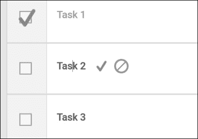
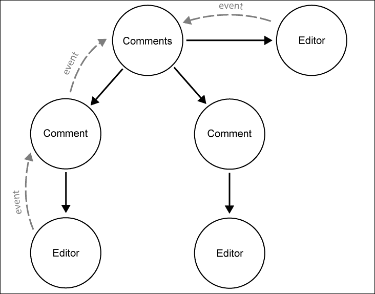
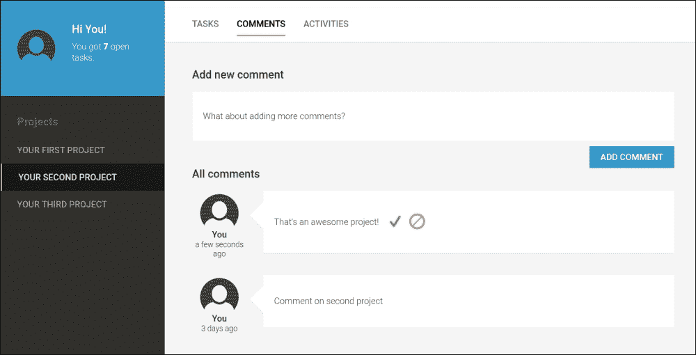

# 第四章。请不要评论！

在本章的整个过程中，我们将创建可重用组件，以使评论不仅限于项目，还可以用于我们应用程序中的任何其他实体。我们将以这种方式构建我们的评论系统，以便我们可以将其放置在我们希望用户放置评论的任何位置。为了为用户提供编辑现有评论的功能以及无缝的创作体验，我们将创建一个编辑器 UI 组件，可以用于使应用程序中的任意内容可编辑。

在本章讨论安全和适当用户管理还不在范围之内，但我们将创建一个模拟用户服务，这将帮助我们模拟已登录用户。此服务将由评论系统使用，并且我们将重构现有组件以利用它。

本章我们将涵盖以下主题：

+   使用`contenteditable`创建就地编辑器

+   使用`@HostBinding`和`@HostListener`将组件成员绑定到宿主元素属性和事件

+   使用`@ViewChild`注解直接与视图子元素通信

+   通过注入和使用`ElementRef`执行 DOM 操作

+   创建模拟用户服务并使用`@Injectable`注解作为依赖注入提供者

+   在组件输入更改上应用自定义操作，使用`OnChanges`生命周期钩子

+   创建一个简单的管道，使用`Moment.js`库格式化相对时间间隔

# 一个编辑器统治一切

由于我们将在应用程序中处理大量用户输入，因此为用户提供良好的创作体验至关重要。在本章即将创建的评论系统中，我们需要一种方式，让用户能够编辑现有评论，以及添加新评论。我们可以使用常规文本区域输入并使用对话框来编辑评论，但这对于我们要构建的现代用户界面来说似乎过于过时，并且并不真正提供良好的用户体验。我们所寻找的是一种就地编辑内容的方法。评论系统不仅将从这种就地编辑器中受益，而且它还将帮助我们以这种方式创建编辑器组件，以便我们可以将其用于我们希望使其可编辑的应用程序中的任何内容。

为了构建我们的就地编辑器，我们将使用`contenteditable` API，这将使用户能够直接在站点文档中的 HTML 元素内修改内容。

以下示例说明了我们如何使用`contenteditable`属性使 HTML 元素可编辑：

```js
<h1 contenteditable>I'm an editable title</h1>
<p>I can't be edited</p>
```

在空白 HTML 页面上运行前面的示例，并点击`h1`文本。你会看到该元素已变为可编辑状态，你可以键入以修改其内容。

通知关于可编辑元素内的更改相对容易。每个可编辑的 DOM 元素都会发出输入事件，这将使我们能够轻松地做出反应：

```js
const h1 = document.querySelector('h1');
h1.addEventListener('input',(event)=>console.log(h1.textContent);
```

通过这个示例，我们已经创建了一个简单的原地编辑器实现，我们可以监控用户应用的变化。在这个主题中，我们将使用这项标准技术来构建一个可重用的组件，我们可以在任何需要使内容可编辑的地方使用它。

## 创建编辑器组件

首先，让我们在我们的 `ui` 文件夹中创建一个名为 `editor` 的新文件夹。在这个文件夹中，我们将创建一个名为 `editor.js` 的新组件文件：

```js
import {Component, ViewChild, Input, Output, ViewEncapsulation, EventEmitter, HostBinding, HostListener} from '@angular/core';
import template from './editor.html!text';

@Component({
  selector: 'ngc-editor',
  host: {
    class: 'editor'
  },
  template,
  encapsulation: ViewEncapsulation.None
})
export class Editor {
  // Using view child reference with local view variable name
  @ViewChild('editableContentElement') editableContentElement;
  // Content that will be edited and displayed
  @Input() content;
  // Creating a host element class attribute binding from the 
  // editMode property
  @Input() @HostBinding('class.editor--edit-mode') editMode;
  @Input() showControls;
  @Output() editSaved = new EventEmitter();
  @Output() editableInput = new EventEmitter();

  // We need to make sure to reflect to our editable element if 
  // content gets updated from outside
  ngOnChanges() {
    if (this.editableContentElement && this.content) {
      this.setEditableContent(this.content);
    }
  }

  ngAfterViewInit() {
    this.setEditableContent(this.content);
  }

  // This returns the content of our content editable
  getEditableContent() {
    return this.editableContentElement.nativeElement.textContent;
  }

  // This sets the content of our content editable
  setEditableContent(content) {
    this.editableContentElement.nativeElement.textContent = 
      content;
  }

  // This annotation will create a click event listener on the 
  // host element that will invoke the underlying method
  @HostListener('click')
  focusEditableContent() {
    if (this.editMode) {
      this.editableContentElement.nativeElement.focus();
    }
  }

  // Method that will be invoked if our editable element is 
  // changed
  onInput() {
    // Emit a editableInput event with the edited content
    this.editableInput.next(this.getEditableContent());
  }

  // On save we reflect the content of the editable element into 
  // the content field and emit an event
  save() {
    this.editSaved.next(this.getEditableContent());
    this.setEditableContent(this.content);
    // Setting editMode to false to switch the editor back to 
    // viewing mode
    this.editMode = false;
  }

  // Canceling the edit will not reflect the edited content and 
  // switch back to viewing mode
  cancel() {
    this.setEditableContent(this.content);
    this.editableInput.next(this.getEditableContent());
    this.editMode = false;
  }

  // The edit method will initialize the editable element and set 
  // the component into edit mode
  edit() {
    this.editMode = true;
  }
}
```

好的，这有很多新的代码。让我们逐步分析 `Editor` 组件的不同部分。

在我们的 `Editor` 组件中，我们需要与可编辑的原生 DOM 元素进行交互。最简单也是最安全的方法是使用 `@ViewChild` 装饰器来检索具有本地视图引用的元素：

```js
@ViewChild('editableContentElement') editableContentElement;
```

在上一章中，我们学习了 `@ContentChildren` 注解，它帮助我们获取内容投影点内所有子组件的列表。如果我们想要对常规视图子组件做同样的事情，我们需要使用等效的 `@ViewChildren` 注解。虽然 `@ContentChildren` 在内容投影点内搜索组件，但 `@ViewChildren` 在组件的常规子树中寻找。

如果我们想要在组件子树中搜索单个组件，我们可以使用 `@ViewChild` 注解（请注意，`@ViewChild` 和 `@ViewChildren` 是不同的）。

| 查询注解 | 描述 |
| --- | --- |
| `@ViewChildren`(selector) | 将查询当前组件的视图中的指令或组件，并返回一个类型为 `QueryList` 的对象。如果视图是动态更新的，此列表也将相应更新。 |
| `@ViewChild`(selector) | 将仅查询第一个匹配的组件或指令，并返回其实例。 |

### 注意

选择器可以是指令或组件类型，或者是一个包含本地视图变量名称的字符串。如果提供了本地视图变量名称，Angular 将会搜索包含视图变量引用的元素。

如果你需要直接与视图子组件通信，使用 `@ViewChild` 和 `@ViewChildren` 注解应该是你的首选方式。

### 小贴士

有时候你需要在组件初始化后对视图子组件运行初始化代码。在这种情况下，你可以使用 `AfterViewInit` 生命周期钩子。虽然你的组件类中的视图子属性在你的组件构造函数中仍然是未定义的，但它们将在 `AfterViewInit` 生命周期回调之后填充和初始化。

`@ViewChild` 和 `@ViewChildren` 装饰器是直接与你的视图交互的出色工具。你想要与之交互的是 DOM 元素还是组件实例，这并不重要。这两个用例都得到了很好的覆盖，使用了这个声明式 API。

让我们回到我们的`Editor`组件代码。接下来我们要查看的是组件的输入函数：

```js
@Input() content;
@Input() @HostBinding('class.editor--edit-mode') editMode;
@Input() showControls;

```

`content`输入属性是外部与组件交互的主要接口。使用属性绑定，我们可以在编辑器组件中设置任何现有的文本内容。

`editMode`属性是一个布尔值，用于控制编辑器是否处于编辑或显示模式。我们的编辑器组件将依赖于这个标志来知道内容是否应该被编辑。这允许我们从只读模式切换到编辑模式，然后再切换回来，实现交互式操作。

尽管这是一个输入属性，但这个标志可以从组件外部进行控制。同时，它也可以用来为主元素创建属性绑定。具体来说，我们可以使用这个标志来创建一个类属性绑定，以添加或删除修饰类`editor--edit-mode`。这个类用于在编辑模式下控制编辑器视觉外观的一些差异。

我们编辑器组件中的三个输入属性中的最后一个，`showControls`，控制编辑器是否应该显示控制功能。当这个属性评估为真值时，将显示以下三个控制：

+   **编辑按钮**：当组件处于显示模式时将显示，它将使用`editMode`标志将组件切换到编辑模式。

+   **保存按钮**：只有在组件处于编辑模式时才会显示。这个控件将保存当前编辑模式中应用的所有更改，并将组件切换回显示模式。

+   **取消按钮**：这与保存按钮相同，并且仅在组件处于编辑模式时显示。如果激活，组件将切换回显示模式，撤销您可能做出的任何更改。

除了我们的输入属性之外，我们还需要一些输出属性来通知外部世界我们编辑器中的更改。以下代码片段帮助我们做到这一点：

```js
@Output() editSaved = new EventEmitter();
@Output() editableInput = new EventEmitter();

```

当使用保存按钮控件保存编辑内容时，将触发`editSaved`事件。此外，如果在我们可编辑内容元素中的每次输入更改时都发出事件，那就更好了。为此，我们使用了`editableInput`输出属性。

我们的编辑器组件以简单的方式工作。如果组件处于编辑模式，它会显示一个可编辑的元素。然而，一旦编辑器切换回显示模式，我们会看到一个不同的元素，这个元素不能被编辑。可见性是通过主机元素属性绑定到`editMode`标志的修饰类来控制的。

Angular 无法控制我们可编辑元素中的内容。我们通过使用原生 DOM 操作手动控制这个内容。让我们看看我们是如何做到这一点的。首先，我们需要使用代理来访问元素，因为我们很可能会改变我们如何读取和写入可编辑元素。我们使用了以下方法来实现这一点：

```js
getEditableContent() {
  return this.editableContentElement.nativeElement.textContent;
   }

setEditableContent(content) {
  this.editableContentElement.nativeElement.textContent = 
    content;
}
```

### 提示

注意，我们在`editableContentElement`字段上使用了`nativeElement`属性，该属性之前由`@ViewChild`装饰器设置。

Angular 并没有直接提供 DOM 元素引用，而是提供了一个类型为`ElementRef`的包装对象。它基本上是原生 DOM 元素的包装，包含与 Angular 相关的额外信息。

使用`nativeElement`访问器，我们可以获取底层 DOM 元素的引用。

### 注意

`ElementRef`包装器在 Angular 的平台无关架构中扮演着重要的角色。它允许你在不同的环境中运行 Angular（例如，原生移动设备、web workers 或其它）。它是组件及其视图之间的抽象层的一部分。

我们还需要一种方法来根据我们从内容输入属性接收到的输入来设置可编辑元素的内容。我们可以使用生命周期钩子`OnInit`，它将在组件初始化后检查输入属性之后被调用。然而，这个生命周期钩子只在初始化后触发一次，我们需要一种方法来帮助我们响应`content`属性的后续输入更改。请看以下代码片段：

```js
ngOnChanges() {
 if (this.editableContentElement && this.content) {
 this.setEditableContent(this.content);
 }
}

```

`OnChanges`生命周期钩子正是我们所需要的。有了它，一旦检测到内容输入属性的变化（这包括初始化后的第一次变化），我们就可以将更改的内容反映到我们的可编辑元素上。

现在我们已经实现了组件内容输入属性到可编辑字段的反射。但反过来怎么办？我们需要找到一种方法来将可编辑元素中的更改反映到我们的组件`content`属性上。这也与在编辑模式中使用可用控件对组件执行的操作密切相关，这些操作如下：

+   **在保存操作中**：在这里，我们将可编辑元素中的编辑内容反映回组件的`content`属性。

+   **在取消操作中**：在这里，我们忽略用户在可编辑元素中进行的编辑，并将其内容设置回组件`content`属性中的值：

让我们看看这两个操作的代码：

```js
save() {
 this.editSaved.next(this.getEditableContent());
 this.setEditableContent(this.content);
  this.editMode = false;
}

cancel() {
 this.setEditableContent(this.content);
 this.editableInput.next(this.getEditableContent());
  this.editMode = false;
}
```

除了显示组件`content`属性和可编辑元素之间反射的代码之外，我们还发出了一些事件，这些事件将帮助我们通知外部世界关于这些变化。在这两个操作中，我们在完成后将`editMode`标志设置为`false`。这确保了在任一操作完成后，我们的编辑器将切换到显示模式。

当组件处于显示模式时，`edit` 方法将从编辑控制按钮被调用。它所做的一切只是将组件切换回编辑模式：

```js
edit() {
 this.editMode = true;
}
```

到目前为止，我们关于代码的讨论已经足够我们设置一个完全功能性的组件。然而，代码的最后部分，我们还没有讨论，它关系到确保我们的编辑器有更好的可访问性。由于我们的编辑器组件比可编辑元素大一些，我们还想确保在编辑器组件内的任何地方点击都会使可编辑元素获得焦点。以下代码实现了这一点：

```js
@HostListener('click')
focusEditableContent() {
  if (this.editMode) {
 this.editableContentElement.nativeElement.focus();
  }
}
```

使用 `@HostListener` 装饰器，我们在组件元素上注册了一个事件绑定，该绑定调用 `focusEditableContent` 方法。在这个方法内部，我们使用了可编辑 DOM 元素的引用并触发了焦点。

让我们看看位于 `editor.html` 文件中的组件模板，以便了解我们如何与组件内的逻辑交互：

```js
<div (input)="onInput($event)"
     class="editor__editable-content"
     contenteditable="true"
 #editableContentElement></div>
<div class="editor__output">{{content}}</div>
<div *ngIf="showControls && !editMode" class="editor__controls">
  <button (click)="edit()" class="editor__icon-edit"></button>
</div>
<div *ngIf="showControls && editMode" class="editor__controls">
  <button (click)="save()" class="editor__icon-save"></button>
  <button (click)="cancel()" class="editor__icon-cancel"></button>
</div>
```

编辑器组件模板中的逻辑非常简单。如果您一直在关注组件代码，现在您将能够识别组成此组件视图的不同元素。

带有 `editor__editable-content` 类的第一个元素是我们具有 `contenteditable` 属性的可编辑元素。当编辑器处于编辑模式时，用户将能够在此元素中键入。重要的是要注意，我们已使用局部视图变量引用对其进行注释，`#editableContentElement`，我们在视图子查询中使用它。

带有 `editor__output` 类的第二元素仅用于显示编辑器内容，并且仅在编辑器处于显示模式时可见。这两个元素的可见性都使用 CSS 控制，基于 `editor--edit-mode` 修饰类，如果您还记得组件类代码，它是通过主机属性绑定根据 `editMode` 属性设置的。

三个控制按钮是通过 `NgIf` 指令条件性地显示的。`showControls` 输入属性需要设置为 `true`，并且根据 `editMode` 标志，屏幕将显示编辑按钮或保存和取消按钮：



我们编辑器组件在行动中的截图

## 概述

在这个构建块中，我们创建了一个原地编辑器小部件，我们可以使用它来获取应用程序中任何内容的用户输入。它允许我们向用户提供上下文编辑功能，这将带来极佳的用户体验。

我们还学习了以下主题：

1.  使用 `contenteditable` HTML5 属性来启用原地编辑。

1.  使用 `@ViewChild` 和 `@ViewChildren` 来查询视图子元素。

1.  使用 `ElementRef` 依赖项执行原生 DOM 操作。

1.  使用 `OnChange` 生命周期钩子实现逻辑，以反映 Angular 和不在 Angular 直接控制下的内容之间的数据。

# 构建评论系统

在上一主题中，我们创建了一个编辑器组件，该组件将支持用户在我们的应用程序中编辑内容。在这里，我们将创建一个评论系统，该系统将使用户能够在应用程序的各个区域撰写评论。评论系统将使用我们的编辑器组件使评论可编辑，从而帮助用户创建新的评论：



评论系统组件子树的示意图

以下图示展示了我们即将创建的评论系统中的组件树架构。

`Comments` 组件将负责列出所有现有评论，以及创建新的评论。

每条评论本身都被封装在一个 `Comment` 组件中。`Comment` 组件本身使用一个编辑器，允许用户在创建评论后编辑评论。

我们在上一主题中构建的 `Editor` 组件被 `Comment` 组件直接使用，以提供添加新评论的输入控制。这允许我们重用我们的编辑器组件的功能来捕获用户输入。

当使用编辑器的控制按钮保存可编辑内容时，`Editor` 组件会发出 `editSaved` 事件。在 `Comment` 组件中，我们将捕获这些事件并将新事件向上传播到 `Comments` 组件。在那里，我们将进行必要的更新，然后再发出一个新事件来通知我们的父组件。在组件组合中，每个组件都会对更改做出反应，并在必要时委托给父组件。

## 构建评论组件

让我们通过首先完善 `Comment` 组件来开始构建我们的评论系统。除了评论本身，我们还想显示评论用户的个人资料，当然，还有评论的时间。

为了显示时间，我们将使用相对时间格式，因为这会给我们的用户更好的时间感。相对时间格式以“5 分钟前”或“1 个月前”的格式显示时间戳，而不是像“25.12.2015 18:00”这样的绝对时间戳。我们将使用 `Moment.js` 库创建一个管道，我们可以在组件模板中使用它将时间戳和日期转换为相对时间间隔。

让我们在名为 `pipes` 的新文件夹内创建一个新的管道。该管道需要创建在 `pipes` 文件夹下的名为 `from-now.js` 的文件中：

```js
import {Pipe} from '@angular/core';
// We use the Moment.js library to convert dates to relative times
import Moment from 'moment';

@Pipe({
  // Specifying the name to be used within templates
 name: 'fromNow'
})
// Our pipe will transform dates and timestamps to relative times 
// using Moment.js
export class FromNowPipe {
  // The transform method will be called when the pipe is used 
  // within a template
  transform(value) {
 if (value && (value instanceof Date || 
 typeof value === 'number')) {
 return new Moment(value).fromNow();
 }
 }
}
```

现在，这个管道可以在组件的模板中使用，以将时间戳和日期格式化为相对时间间隔。

让我们使用这个管道和我们在上一主题中创建的 `Editor` 组件来创建我们的 `Comment` 组件。在名为 `comment.html` 的文件中，该文件位于 `comments` 文件夹下的新 `comment` 文件夹内，我们将创建 `Comment` 组件的模板：

```js
<div class="comment__l-meta">
  <div class="comment__user-picture">
    
  </div>
  <div class="comment__user-name">{{user.name}}</div>
  <div class="comment__time">
 {{time | fromNow}}
  </div>
</div>
<div class="comment__l-main">
  <div class="comment__message">
 <ngc-editor [content]="content"
 [showControls]="true"
 (editSaved)="onContentSaved($event)">
 </ngc-editor>
  </div>
</div>
```

从用户对象中，我们将获取用户的个人资料图片以及用户名。为了以相对格式显示评论的时间，我们将使用我们之前创建的 `fromNow` 管道。

最后，我们将使用内联编辑器组件来显示评论的内容，并使其可编辑。我们将评论内容属性绑定到编辑器的内容输入属性。同时，我们将监听编辑器的 `editSaved` 事件，并在我们的评论组件类上调用 `onContentSaved` 方法。如果你再次查看我们的组件代码，你会注意到我们在方法中重新发出事件，这样外界也会被通知评论的变化。

让我们看一下我们将在名为 `comment.js` 的文件中创建的组件类：

```js
import {Component, Input, Output, ViewEncapsulation, EventEmitter} from '@angular/core';
import {Editor} from '../../ui/editor/editor';
import template from './comment.html!text';
// We use our fromNow pipe that converts timestamps to relative 
// times
import {FromNowPipe} from '../../pipes/from-now';

@Component({
  selector: 'ngc-comment',
  host: {
    class: 'comment'
  },
  template,
  encapsulation: ViewEncapsulation.None,
 directives: [Editor],
 pipes: [FromNowPipe]
})
export class Comment {
  // The time of the comment as a timestamp
  @Input() time;
  // The user object of the user who created the comment
  @Input() user;
  // The comment content
  @Input() content;
  // If a comment was edited this event will be emitted
 @Output() commentEdited = new EventEmitter();

 onContentSaved(content) {
 this.commentEdited.next(content);
 }
}
```

组件代码相当简单。与其他我们迄今为止创建的组件相比，唯一明显的区别是组件注释中的 `pipes` 属性。在这里，我们指定我们想要使用我们刚刚创建的 `FromNowPipe` 类。管道始终需要在组件中声明；否则，它们不能在组件的模板中使用。

作为输入，我们期望一个用户对象，它通过 `user` 输入属性传递。`content` 输入属性应填充实际的评论作为字符串，而 `time` 输入属性应设置为反映评论实际时间的戳记。

我们还有一个名为 `commentEdited` 的输出属性，我们将使用它来通知评论的变化。`onEditSaved` 方法将由我们的 `Editor` 组件上的事件绑定调用，然后它将使用 `commentEdited` 输出属性发出一个事件。

## 构建 `Comments` 组件

现在我们已经准备好了所有组件，以便完成构建我们的评论系统。最后缺失的拼图是 `Comments` 组件，它将列出所有评论并提供一个编辑器来创建新的评论。

首先，让我们看一下我们将在名为 `comments` 的文件夹中创建的名为 `comments.html` 的文件中的 `Comments` 组件模板：

```js
<div class="comments__title">Add new comment</div>
<div class="comments__add-comment-section">
  <div class="comments__add-comment-box">
 <ngc-editor [editMode]="true"
 [showControls]= "false"></ngc-editor>
  </div>
  <button (click)="addNewComment()"
          class="button" >Add comment</button>
</div>

<div *ngIf="comments?.length > 0">
  <div class="comments__title">All comments</div>
  <ul class="comments__list">
    <li *ngFor="let comment of comments">
      <ngc-comment [content]="comment.content"
 [time]="comment.time"
 [user]="comment.user"
 (commentEdited)="onCommentEdited(comment, $event)">
 </ngc-comment>
    </li>
  </ul>
</div>
```

你可以在组件的模板中看到 `Editor` 组件的直接使用。我们使用这个内联编辑器来提供一个输入组件以创建新的评论。我们也可以在这里使用文本区域，但我们决定重用我们的 `Editor` 组件。我们将 `editMode` 属性设置为 true，以便它在编辑模式下初始化。我们还将 `showControls` 输入设置为 `false`，因为我们不希望编辑器变得自主。我们只会使用它的内联编辑功能，但将从我们的 `Comments` 组件中控制它。

要添加一条新评论，我们将使用一个具有点击事件绑定的按钮，该按钮调用我们的组件类上的 `addNewComment` 方法。

在用户可以添加新评论的部分下方，我们将创建另一个部分，用于列出所有现有的评论。如果没有评论存在，我们简单地不渲染该部分。借助`NgFor`指令，我们可以显示所有现有的评论，并为每个重复创建一个`Comment`组件。我们将所有评论数据属性绑定到我们的`Comment`组件，并添加一个事件绑定来处理更新的评论。

让我们在`comments`文件夹中创建一个新的名为`comments.js`的文件，以创建组件类：

```js
import {Component, Inject, Input, Output, ViewEncapsulation, ViewChild, EventEmitter} from '@angular/core';
import template from './comments.html!text';
import {Editor} from '../ui/editor/editor';
import {Comment} from './comment/comment';
import {UserService} from '../user/user-service/user-service';

@Component({
  selector: 'ngc-comments',
  host: {
    class: 'comments'
  },
  template,
  encapsulation: ViewEncapsulation.None,
 directives: [Comment, Editor]
})
export class Comments {
  // A list of comment objects
 @Input() comments;
  // Event when the list of comments have been updated
 @Output() commentsUpdated = new EventEmitter();
  // We are using an editor for adding new comments and control it 
  // directly using a reference
 @ViewChild(Editor) newCommentEditor;

  // We're using the user service to obtain the currently logged 
  // in user
  constructor(@Inject(UserService) userService) {
    this.userService = userService;
  }

  // We use input change tracking to prevent dealing with 
  // undefined comment list
 ngOnChanges(changes) {
 if (changes.comments && 
 changes.comments.currentValue === undefined) {
 this.comments = [];
 }
 }

  // Adding a new comment from the newCommentContent field that is 
  // bound to the editor content
  addNewComment() {
    const comments = this.comments.slice();
    comments.splice(0, 0, {
 user: this.userService.currentUser,
      time: +new Date(),
 content: this.newCommentEditor.getEditableContent()
    });
    // Emit event so the updated comment list can be persisted 
    // outside the component
 this.commentsUpdated.next(comments);
    // We reset the content of the editor
 this.newCommentEditor.setEditableContent('');
  }

  // This method deals with edited comments
  onCommentEdited(comment, content) {
    const comments = this.comments.slice();
    // If the comment was edited with e zero length content, we 
    // will delete the comment from the list
    if (content.length === 0) {
      comments.splice(comments.indexOf(comment), 1);
    } else {
      // Otherwise we're replacing the existing comment
      comments.splice(comments.indexOf(comment), 1, {
        user: comment.user,
        time: comment.time,
        content
      });
    }
    // Emit event so the updated comment list can be persisted 
    // outside the component
 this.commentsUpdated.next(comments);
  }
}
```

让我们再次逐个分析代码部分，并讨论每个部分的作用。首先，我们在组件类中声明了一个名为`comments`的输入属性：

```js
@Input() comments;

```

`comments`输入属性是一个包含所有与评论相关数据的评论对象列表。这包括撰写评论的用户、时间戳以及评论的内容。

我们还需要能够在添加评论或修改现有评论后发出一个事件。为此，我们使用了一个名为`commentsUpdates`的输出属性：

```js
@Output() commentsUpdated = new EventEmitter();

```

一旦添加了新的评论或修改了现有的评论，我们将从这个输出属性发出一个事件，并附带更新后的评论列表。

我们将要使用的`Editor`组件将没有自己的控制按钮。我们将使用`showControls`输入属性来禁用它们。相反，我们将直接从我们的`Comments`组件控制编辑器。因此，我们需要一种与组件类内部的`Editor`组件进行通信的方法。

我们再次使用了`@ViewChild`装饰器来达到这个目的。然而，这次我们没有引用一个包含本地视图变量引用的 DOM 元素，而是直接将我们的组件类型类传递给装饰器。Angular 将在评论视图中搜索任何`Editor`组件，并为我们提供对编辑器实例的引用。这在上面的代码行中有所体现：

```js
@ViewChild(Editor) newCommentEditor;

```

由于`Comments`组件直接在组件模板中托管一个编辑器，我们可以使用`@ViewChild`注解来获取对其的引用。使用这个引用，我们可以直接与子组件交互。这将允许我们从`Comments`组件直接控制编辑器。

让我们继续到代码的下一部分，即`Comments`组件构造函数。我们在这里所做的唯一一件事是注入一个用户服务，该服务将为我们提供一种获取当前登录用户信息的方式。目前，这个功能只是模拟的，我们将收到一个虚拟用户的信息。我们需要在`Comments`组件中获取这些信息，因为我们需要知道哪个用户实际上输入了新的评论：

```js
constructor(@Inject(UserService) userService) {
 this.userService = userService;
}

```

在代码的下一部分，我们控制了如何响应`comments`输入属性的变化。实际上，我们绝对不希望评论列表保持未定义状态。如果没有评论，它应该是一个空列表，但输入属性`comments`绝不能是未定义的。我们通过使用`OnChange`生命周期钩子并覆盖我们的`comments`属性来控制这一点，如果它从外部被设置为`undefined`：

```js
ngOnChanges(changes) {
  if (changes.comments && 
          changes.comments.currentValue === undefined) {
    this.comments = [];
  }
}
```

这个小小的改动使得我们内部处理评论数据的方式变得更加清晰。在处理数组转换函数时，我们不需要额外的检查，并且我们可以始终将`comments`属性视为一个数组。

由于`Comments`组件还负责处理与添加新评论过程相关的逻辑，我们需要一个方法来实现这一要求。与此相关，我们使用了我们在上一章中学到的一些不可变实践：

```js
addNewComment() {
  const comments = this.comments.slice();
  comments.splice(0, 0, {
 user: this.userService.currentUser,
    time: +new Date(),
 content: this.newCommentEditor.getEditableContent()
  });
 this.commentsUpdated.next(comments);
 this.newCommentEditor.setEditableContent('');
}
```

在这段代码中，有几个关键方面。当点击“添加评论”按钮时，这个方法将从我们的组件视图中被调用。这时，用户已经将一些文本输入到编辑器中，并且已经创建了一个新的评论。

首先，我们将使用在构造函数中注入的用户服务来获取与当前登录用户相关的信息。新创建的评论内容将直接从我们使用`@ViewChild`注解设置的`Editor`组件中获取。此外，`getEditableContent`方法将允许我们接收内联编辑器中可编辑元素的内容。

我们接下来想要做的是将评论列表的更新信息传达给外界。我们使用了`commentsUpdated`输出属性来发射一个包含更新后评论列表的事件。

最后，我们想要清除用于添加新评论的编辑器。由于`Comments`组件视图中的内联编辑器仅用于添加新评论，因此每次添加评论后我们都可以清除它。这将给用户一种他的评论已经从编辑器移动到评论列表中的印象。然后，我们再次可以直接使用我们的`newCommentEditor`属性访问`Editor`组件，并通过调用`setEditableContent`方法使用空字符串来清除编辑器。这正是我们在这里所做的事情。

我们的`Comments`组件将持有所有评论的列表，其视图将为列表中的每个评论创建一个`Comment`组件。每个`Comment`组件将使用`Editor`组件来提供其内容的就地编辑。这些编辑器独立工作，使用它们自己的控件，如果内容被更改或以任何方式修改，它们会发出事件。为了处理这一点，我们需要从`Comment`组件重新发出名为`commentEdited`的事件。现在我们只需要在我们的`Comments`组件中捕获此事件，以便用更改更新评论列表。这在下述代码部分中得到了说明：

```js
onCommentEdited(comment, content) {
  const comments = this.comments.slice();
  if (content.length === 0) {
    comments.splice(comments.indexOf(comment), 1);
  } else {
    comments.splice(comments.indexOf(comment), 1, {
      user: comment.user,
      time: comment.time,
      content
    });
  }
  this.commentsUpdated.next(comments);
}
```

这个方法将为使用`NgFor`指令重复的每个单独的`Comment`组件调用。从视图中，我们传递一个对相关评论对象的引用，以及我们从`Comment`组件事件接收到的编辑内容。

评论对象将仅用于确定更新评论在评论列表中的位置。如果新的评论内容为空，我们将从列表中删除该评论。否则，我们只需创建前一个评论对象的副本，用新的编辑内容更改内容，并用副本替换列表中的旧评论对象。

最后，由于我们想要传达评论列表的变化，我们使用`commentUpdated`输出属性发出了一个事件。

这样，我们就完成了评论系统，现在是时候利用它了。我们已经有了一个空白的标签页用于我们的项目评论，这将是我们将使用评论系统添加评论功能的地方。

首先，让我们修改我们的`Project`组件模板，`project/project.html`，以包含评论系统：

```js
...
<ngc-tabs>
  <ngc-tab name="Tasks">...</ngc-tab>
  <ngc-tab name="Comments">
 <ngc-comments [comments]="comments"
 (commentsUpdated)="updateComments($event)">
 </ngc-comments>
  </ngc-tab>
  <ngc-tab name="Activities"></ngc-tab>
</ngc-tabs>
```

这是最简单不过的事情了。由于我们关注的是干净的组件架构，因此我们的评论系统的加入就像微风一样顺畅。我们现在唯一需要确保的是，在我们的项目中提供一个包含评论列表的属性。我们还需要一种方式来响应评论在`Comments`组件内更新时的变化。为此，我们将创建一个`updateComments`方法。

让我们看看`project/project.js`文件中的组件类更改：

```js
export class Project {
  ...
 @Input() comments;
  ...
 updateComments(comments) {
 this.projectUpdated.next({
 comments
 });
 }
}
```

由于我们已经在一般方式上处理项目更新，并且我们的`Project`组件直接向我们的`App`组件发出，其中项目数据将被持久化，我们唯一需要实现的是额外的输入属性，以及处理评论更新的方法：



项目组件内集成的评论系统截图

## 概述

在这个主题中，我们成功创建了一个完整的评论系统，可以放置在我们应用程序的各个区域以启用评论功能。用户可以通过与就地编辑器交互来编辑评论中的内容，这为他们提供了很好的用户体验。

在编写我们的评论系统代码时，我们学习了以下主题：

1.  使用 `@Pipe` 注解和 `Moment.js` 库实现一个简单的管道，以提供相对时间格式化

1.  使用 `OnChanges` 生命周期钩子来防止输入属性中的不希望或不正确的值

1.  使用 `@ViewChild` 获取组件子树中组件的引用以建立直接通信

1.  在 `Comment` 组件中将 `Editor` 组件作为输入字段替代品以及作为独立的就地编辑器进行重用

# 摘要

在本章中，我们创建了一个简单的就地编辑器，我们可以用它来在我们的应用程序中使内容可编辑。从现在开始，我们可以在任何需要为用户使内容可编辑的地方使用 `Editor` 组件。他们不需要跳入讨厌的对话框或单独的配置页面，而是可以直接编辑，根据他们当前的环境。这对提升我们用户的用户体验是一个很好的工具。

除了我们闪亮的新 `Editor` 组件外，我们还创建了一个可以轻松包含在我们希望提供评论功能的应用程序区域的完整评论系统。现在，我们已经将评论系统包含在我们的 `Project` 组件中，用户现在可以通过导航到项目详情的 **评论** 选项卡来对项目进行评论。

在下一章中，我们将使用 Angular 的基于组件的路由器来使我们的应用程序可导航。
