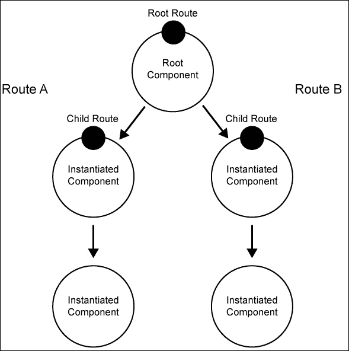
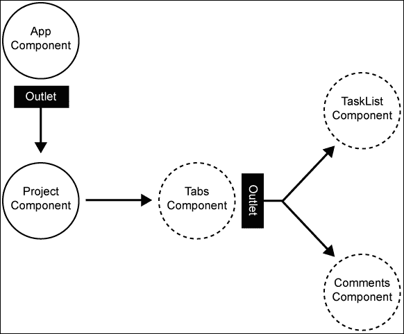
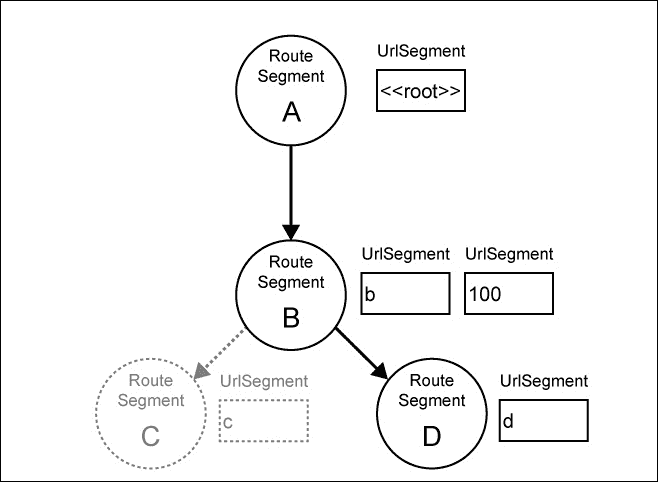
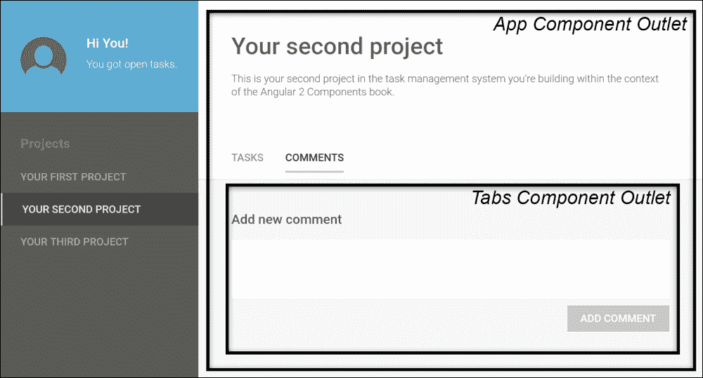

# 第五章. 组件式路由

路由是当今前端应用的一个核心部分。一般来说，路由器有两个主要用途：

+   使您的应用可导航，以便用户可以使用浏览器的后退按钮，并在应用内存储和分享链接

+   将应用组合的部分卸载，以便路由器根据路由和路由参数负责组合您的应用

随 Angular 一起提供的路由器支持许多不同的用例，并附带一个易于使用的 API。这支持类似于 Angular UI-Router 嵌套状态、Ember.js 嵌套路由或 Durandal 框架中的子路由的子路由。与组件树绑定，这也利用其自己的树结构来存储状态和解析请求的 URL。

在本章中，我们将重构我们的代码以使用 Angular 的基于组件的路由器。我们将探讨路由器的核心元素以及如何使用它们在我们的应用中启用路由。

本章将涵盖以下主题：

+   Angular 路由简介

+   对启用我们应用中路由的代码重构的概述

+   通过模板组合、通过路由组合，以及如何混合它们

+   使用`Routes`装饰器来配置路由和子路由

+   使用`OnActivate`路由生命周期钩子来获取路由参数

+   使用`RouterOutlet`指令来创建由路由器控制的插入点

+   使用`RouterLink`指令和路由 DSL 创建导航链接

+   使用`@ChildView`装饰器查询`RouterLink`指令以获取链接的激活状态

# Angular 路由简介

Angular 中的路由器与我们的组件树紧密耦合。Angular 路由器的设计基于这样的假设：组件树直接与我们的 URL 结构相关。这在大多数情况下都是正确的。如果我们看一个嵌套在组件**A**中的组件**B**，表示我们位置的 URL 很可能就是`/a/b`。

为了指定模板中我们希望启用路由器实例化组件的位置，我们可以使用所谓的出口。只需包含一个`<router-outlet>`元素，我们就可以利用`RouterOutlet`指令在我们的模板中标记路由插入点。

基于我们可以放置在我们组件上的某些路由配置，路由器随后决定哪些组件需要实例化并放置到路由出口中。路由也可以参数化，我们可以在实例化的组件中访问这些参数。

基于我们的组件树以及该树中组件的路由配置，我们可以构建一个分层路由，并将子路由与其父路由解耦。这种嵌套路由使得在组件树的多个层级上指定路由配置，并重用父组件为多个子路由成为可能。



通过组件树建立的路由层次结构

让我们更详细地看看路由器的元素：

+   **路由配置**：路由配置放置在组件级别，它包含组件树中此级别的不同路由。通过在组件树的不同组件上放置多个路由配置，我们可以轻松构建解耦的嵌套路由。

+   **路由出口**：出口是组件中将被路由器管理的位置。基于路由配置的实例化组件将被放置在这些出口中。

+   **路由链接**：这些是以 DSL 风格符号构建的链接，使开发者能够通过路由树构建复杂的链接。

# 通过路由进行组合

到目前为止，我们通过在组件模板中包含子组件来实现组合。然而，我们现在希望将控制权交给路由器，以决定哪个组件应该被包含以及在哪里。

以下插图概述了我们应用程序的组件架构，我们将启用它来进行路由：



显示路由组件（实线）和路由出口的组件树

现在的`Project`组件不再直接与我们的`App`组件一起包含。相反，我们在`App`组件的模板中使用路由出口。这样，我们可以将控制权交给路由器，让它决定哪个组件应该放入出口。`App`组件的路由配置将包含所有顶级路由。在当前应用程序中，我们只有`Project`组件作为二级组件，但在后续章节中这将会改变。

`Project`组件包含子路由配置，用于导航到任务和评论视图。然而，它并不直接包含路由出口。我们使用`Tabs`组件作为任何子视图的导航元素。因此，我们将路由出口放入`Tabs`组件，并在`Project`组件的模板中直接包含该组件。

## 路由与模板组合的比较

我们迄今为止处理的组合完全是基于模板包含的实例化。我们使用输入和输出属性来解耦和封装组件，并遵循了良好的可重用模式。

使用路由器，我们面临一个 Angular 尚未解决的问题，需要我们找到自己的解决方案。当我们把控制权交给路由器来实例化和将组件插入到我们的组件树中时，我们就无法控制实例化组件上的任何绑定。虽然我们之前依赖于使用输入和输出属性进行组件的清洁解耦，但我们不能再这样做。路由器为我们提供的唯一东西是可能设置在激活路由上的路由参数。

这使我们陷入了一个相当糟糕的情况。基本上，在编写组件时，我们需要在两种设计之间做出选择，如下所示：

+   我们纯粹在模板组合中使用给定的组件，因此依赖于输入和输出属性作为父组件之间的粘合剂

+   我们使用由路由器实例化的组件，并依赖于由输入提供的视图路由参数，并且不需要与父组件通信

嗯，上述两种设计方法都不是很好，对吧？在一个理想的世界里，当我们为路由启用组件时，我们不需要对组件本身进行任何更改。路由器应该只是使组件能够进行路由，但不应要求对组件本身进行任何更改。不幸的是，在撰写本书时，对于解决这个问题还没有达成共识。

由于我们不希望失去从`TaskList`和`Comments`组件依赖输入和输出所获得的所有组合能力，我们需要找到一个更好的解决方案来在我们的应用程序中启用路由。

+   以下解决方案使我们能够在不修改`TaskList`和`Comments`组件的情况下使用它们，同时它们仍然可以依赖于输入和输出属性。我们不会直接将它们暴露给路由器，而是将构建包装组件，并从我们的路由中引用这些包装组件。这些包装组件遵循一些机制来弥合路由器和我们的组件之间的差距。

+   `wrapper`组件处理任何可能已在激活的路由中设置的任何路由参数或路由数据。

+   它们的模板应仅包含包装的组件及其输入和输出绑定。

+   它们处理所需的数据和功能，以提供相关组件的输入和输出绑定

+   它们可能使用父组件注入来与父组件建立通信并传播由发出的事件所要求的任何动作。父组件注入应谨慎使用，因为它在一定程度上破坏了组件的解耦。

## 理解路由树

Angular 使用树形数据结构来表示路由状态。你可以想象，在你的应用程序中，每一次导航都会激活这棵树的一个分支。让我们来看以下示例。

我们有一个由四个可能的路由组成的应用程序：

+   `/`：这是应用程序的根路由，由一个名为**A**的组件处理。

+   `/b/:id`：这是我们可以访问`b`详细视图的路由，由一个名为**B**的组件处理。在 URL 中，我们可以传递一个`id`参数（即`/b/100`）。

+   `/b/:id/c`：这是`b`详细视图有另一个导航可能性的路由，揭示了更具体的细节，我们称之为`c`。这由一个名为**C**的组件处理。

+   `/b/:id/d`：这是我们可以导航到`b`详细视图中的`d`视图的路由。这由一个名为**D**的组件处理：



由激活的路由/b/100/d 的路由段组成的路由树

假设我们通过导航 URL `/b/100/d`激活我们的示例路由。在这种情况下，我们将激活一个反映前面图中所述状态的路由。请注意，路由段**B**实际上由两个 URL 段组成。这是因为我们指定了我们的路由**B**实际上由`b`标识符和`:id`路由参数组成。

使用这种树形数据结构，我们有一个完美的抽象来处理导航树。我们可以比较树，检查某些段是否存在于树中，并从解析的路由段中提取参数。

为了演示路由树的使用，让我们看看我们可以在我们的可导航组件上实现的`OnActivate`路由生命周期钩子：

```js
routerOnActivate(currentRouteSegment, 
                 previousRouteSegment,
                 currentTree,
                 previousTree)
```

当我们在组件上实现此生命周期钩子时，我们可以在路由激活后运行一些代码。`currentRouteSegment`参数将指向在组件上激活的`RouteSegment`实例。

让我们再次查看我们的示例，并假设我们想要访问我们**B**组件的`routerOnActivate`钩子中的`:id`参数：

```js
routerOnActivate(currentRouteSegment) {
 this.id = currentRouteSegment.getParam('id');
}
```

在`RouteSegment`实例上使用`getParam`函数，我们可以获取在给定段上解析的任何参数。在我们的示例中，这将返回一个`100`字符串。

让我们看看一个更复杂的例子。如果我们想从`d`详细视图的**D**组件中访问`:id`参数怎么办？在`OnActivate`生命周期钩子中，我们只会收到与**D**组件相关的路由段。这仅包括`d` URL 段，不包括父路由中的`:id`参数。我们现在可以利用`RouteTree`实例来找到父路由段并从那里获取参数：

```js
routerOnActivate(currentRouteSegment, 
                 previousRouteSegment, 
 currentTree) {
 this.id = currentTree.parent(currentRouteSegment).getParam('id');
}
```

使用当前的`RouteTree`实例，我们可以获取当前路由段的上层路由。结果，我们将收到前面图中所示的父路由段（`RouteSegment` **B**），从那里我们可以获取`:id`参数。

如您所见，路由 API 非常灵活，它允许我们以非常细粒度地检查路由活动。路由器中使用的树结构使得我们能够在应用中比较复杂的路由状态，而无需担心底层复杂性。

# 返回路由

好的，现在是我们为我们的应用程序实现路由的时候了！在以下主题中，我们将为我们的应用程序创建以下路由：

| 路由路径 | 描述 |
| --- | --- |
| `/projects/:projectId` | 此路由将在我们的主应用程序组件的出口处激活`Project`组件。这包括`projects` URL 段以及`:projectId` URL 段来指定项目 ID。 |
| `/projects/:projectId/tasks` | 此路由将激活`TaskList`组件。我们将创建一个`ProjectTaskList`包装组件，以便将我们的`TaskList`组件与路由解耦。我们将应用前一小节中描述的程序，即*路由与模板组合*。 |
| `/projects/:projectId/comments` | 此路由将激活`Comments`组件。我们将创建一个`ProjectComments`包装组件，以便将我们的`Comments`组件与路由解耦。我们将应用前一小节中描述的程序，即*路由与模板组合*。 |

为了使用 Angular 的路由器，我们首先需要做的事情是将路由提供者添加到我们的应用程序中。我们将在引导时这样做，以确保路由提供者只加载一次。让我们打开我们的`boostrap.js`文件并添加必要的依赖项：

```js
...
import {bootstrap} from '@angular/platform-browser-dynamic';
import {provide} from '@angular/core';
// Import router dependencies
import {HashLocationStrategy, LocationStrategy} from '@angular/common';
import {ROUTER_PROVIDERS} from '@angular/router'; 
...
bootstrap(App, [
  ...
  ROUTER_PROVIDERS,
 provide(LocationStrategy, {
 useClass: HashLocationStrategy
 })
]);
```

从路由模块中，我们导入包含需要作为提供者公开的模块列表的`ROUTER_PROVIDERS`常量。我们还从通用模块中导入需要手动提供的`LocationStrategy`和`HashLocationStrategy`类型。

使用`provide`函数，我们将`HashLocationStrategy`类作为对`LocationStrategy`抽象类的替代。这样，路由器将知道在解析 URL 时使用哪种策略。

目前存在以下两种策略：

+   **HashLocationStrategy**：当路由应使用 hash URL 时，例如`localhost:8080#/child/something`，可以使用此策略。如果由于浏览器或服务器限制而无法使用 HTML5 的 push state，则此位置策略是有意义的。整个导航状态将管理在 URL 的片段标识符中。

+   **PathLocationStrategy**：如果您想使用 HTML5 的 push state 来处理应用程序 URL，则可以使用此策略。这意味着您的应用程序导航成为 URL 的实际路径。使用前面基于 hash 的 URL 的示例，此策略将允许直接使用`localhost:8080/child/something`。由于初始请求将击中服务器，如果状态编码在 URL 的路径中，您需要启用服务器上的正确路由以使其正常工作。

在为我们的应用程序启用路由后，我们需要使我们的根组件可路由。我们可以通过在`App`组件上包含路由配置来实现这一点。让我们看看完成此操作所需的代码。我们编辑`lib`文件夹中的`app.js`文件：

```js
...
import {Project} from './project/project';
import {Routes, Route} from '@angular/router';

@Component({
  selector: 'ngc-app',
  ...
})
@Routes([
 new Route({path: 'projects/:projectId', component: Project})
])
export class App {
     ...
}
```

在前面的代码中，我们从路由模块中导入了`Routes`装饰器以及`Route`类型。

为了在我们的组件上配置路由，我们可以通过传递一个描述此组件上可能存在的子路由的`Route`对象数组来使用`@Routes`装饰器。

让我们看看我们可以传递给`Route`构造函数的可用选项：

| 路由属性 | 描述 |
| --- | --- |

| `path` | 这个属性是必需的。使用路径，我们可以使用路由匹配 DSL 描述浏览器中的导航 URL。这可以包含路由参数占位符。以下是一些示例：

+   当用户在浏览器中导航到 `/home` 时，以下路由会被激活：

    ```js
    path: '/home'
    ```

+   当用户导航到 `/child/something` URL 时，以下路由会被激活，其中 `something` 将作为名为 `id` 的路由参数可用：

```js
path: '/child/:id'
```

|

| `component` | 这个属性是必需的，它定义了路由器应该实例化哪个组件。正如在上一节中解释的，路由器不允许我们在这里指定任何绑定到实例化组件的绑定。 |
| --- | --- |

我们 `App` 组件上的路由配置涵盖了在 `projects/:projectId` 路径上实例化的 `Project` 组件。这意味着我们在子路由上使用 `projectId` 参数，它将可用于 `Project` 组件。

我们还需要修改我们的 `App` 组件模板，并从中移除直接包含的 `Project` 组件。我们现在将控制权交给路由器来决定显示哪个组件。为此，我们需要使用 `RouterOutlet` 指令在我们的模板中提供一个插槽，路由器将在其中实例化组件。

`RouterOutlet` 指令是路由模块导出的 `ROUTER_DIRECTIVES` 常量的一部分。让我们将其导入并添加到我们组件的指令列表中：

```js
...
import {Routes, Route, ROUTER_DIRECTIVES} from '@angular/router';
   ...
@Component({
  selector: 'ngc-app',
  ...
  directives: [..., ROUTER_DIRECTIVES],
  ...
})
...
export class App {
  ...
}
```

现在，我们可以在模板中使用 `RouterOutlet` 指令来指示路由器实例化组件的插入位置。让我们打开我们的 `App` 组件模板文件，`app.html`，并进行必要的修改：

```js
<div class="app">
  ...
  <div class="app__l-main">
    <router-outlet></router-outlet>
  </div>
</div>
```

下一步是将我们的 `Project` 组件重构，使其可用于路由。正如我们在上一节中概述的，路由在组件设计方面有一些限制。对于 `Project` 组件，我们决定以这种方式重新设计它，以便我们只能用它进行路由。在这里这并不是坏事，因为我们排除了它在我们的应用程序的其他地方被重用的可能性。

`Project` 组件的重设计包括以下步骤：

1.  移除组件的所有输入和输出属性。

1.  使用 `OnActivate` 路由生命周期钩子从 `App` 组件激活的路由段中获取 `projectId` 参数。

1.  使用 `projectId` 参数直接从数据存储中获取项目数据。

1.  直接在组件上处理项目数据的更新，而不是委托给 `App` 组件。

让我们修改位于 `lib/project/project.js` 中的 `Component` 类以实现前面的设计更改：

```js
import {Component, ViewEncapsulation, Inject} from '@angular/core';
import template from './project.html!text';
import {Tabs} from '../ui/tabs/tabs';
import {DataProvider} from '../../data-access/data-provider';
import {LiveDocument} from '../../data-access/live-document';

@Component({
  selector: 'ngc-project',
  host: {class: 'project'},
  template,
  encapsulation: ViewEncapsulation.None,
  directives: [Tabs]
})
export class Project {
  constructor(@Inject(DataProvider) dataProvider) {
 this.dataProvider = dataProvider;
    this.tabItems = [
      {title: 'Tasks', link: ['tasks']},
      {title: 'Comments', link: ['comments']}
    ];
  }

 routerOnActivate(currentRouteSegment) {
 this.id = currentRouteSegment.getParam('projectId');
 this.document = new LiveDocument(this.dataProvider, {
 type: 'project',
 _id: this.id
 });
 this.document.change.subscribe((data) => {
 this.title = data.title;
 this.description = data.description;
 this.tasks = data.tasks;
 this.comments = data.comments;
 });
 }

  updateTasks(tasks) {
 this.document.data.tasks = tasks;
 this.document.persist();
  }

  updateComments(comments) {
 this.document.data.comments = comments;
 this.document.persist();
  }

  ngOnDestroy() {
 this.document.unsubscribe();
  }
}
```

除了实现已经描述在重新设计步骤中的这些更改之外，我们还利用了从`data-access`文件夹导入的新`LiveDocument`实用类。这有助于我们在关注单个数据实体的变化时保持编程的响应性。使用`LiveDocument`类，我们可以查询数据库中的单个实体，而`LiveDocument`实例的变化属性是一个可观察对象，它会通知我们实体的变化。`LiveDocument`实例还通过`data`属性暴露实体的数据，可以直接访问。如果我们想对实体进行更新，我们可以在数据对象上添加、修改或删除属性，然后通过调用`persist()`来存储更改。

由于我们的`Project`组件现在由`App`组件中的路由激活，我们可以通过实现一个名为`routerOnActivate`的方法来使用`OnActivate`路由生命周期钩子。我们使用当前路由段上的`getParam`函数来获取路由的`:projectId`参数。

在我们的`LiveDocument`实例的变化可观察对象上的`subscribe`函数中，我们直接在`Project`组件上暴露项目数据。这简化了后续在视图中的使用。

在`OnDestroy`生命周期钩子中，我们确保我们取消订阅文档变化可观察对象。

现在，我们可以依赖`projectId`路由参数传递到我们的组件中，这使得`Project`组件依赖于路由。我们移除了所有输入属性，然后通过查询我们的数据存储使用项目 ID 来设置必要的数据。

现在，是时候构建我们之前提到的包装组件，以便路由到我们的`TaskList`和`Comments`组件。

让我们创建一个新的组件，称为`ProjectTaskList`，它将作为包装器来启用路由中的`TaskList`组件。我们将在`lib/project/project-task-list`路径下创建一个`project-task-list.js`文件，如下所示：

```js
import {Component, ViewEncapsulation, Inject, forwardRef} from '@angular/core';
import template from './project-task-list.html!text';
import {TaskList} from '../../task-list/task-list';
import {Project} from '../project';

@Component({
  selector: 'ngc-project-task-list',
  ...
  directives: [TaskList]
})
export class ProjectTaskList {
  constructor(@Inject(forwardRef(() => Project)) project) {
    this.project = project;
  }

  updateTasks(tasks) {
 this.project.updateTasks(tasks);
 }
}
```

让我们也看看`project-task-list.html`文件中的模板：

```js
<ngc-task-list [tasks]="project.tasks"
             (tasksUpdated)="updateTasks($event)"></ngc-task-list>
```

我们将`Project`父组件注入到我们的包装组件中。由于我们不能再依赖输出属性来发出事件，这是与父`Project`组件通信的唯一方式。我们在这里处理一个循环引用（`Project`依赖于`ProjectTaskList`，而`ProjectTaskList`依赖于`Project`），因此我们需要使用`forwardRef`辅助函数来防止`Project`类型评估为`undefined`。

如果我们在模板中接收到`tasksUpdated`事件，我们将在我们的包装组件上调用`updateTasks`方法。然后包装组件简单地委托调用到项目组件。

类似地，我们使用项目数据来获取任务列表并创建与`TaskList`组件的`tasks`输入属性的绑定。

使用这种包装方法进行路由，我们能够在启用路由时不对组件进行修改。这比仅使任务列表对路由可用要好得多。我们将会失去在项目上下文之外使用任务列表的自由，然后使用纯模板组合。

对于`Comments`组件，我们执行完全相同的任务，并在`lib/project/project-comments`路径上创建一个包装器。除了处理评论而不是任务之外，代码与`ProjectTaskList`包装组件完全相同。

在创建了两个包装组件之后，我们现在可以在我们的`Project`组件上创建路由配置。让我们修改`project/project.js`文件以启用路由：

```js
...
import {ProjectTaskList} from './project-task-list/project-task-list';
import {ProjectComments} from './project-comments/project-comments';
import {Routes, Route} from '@angular/router';
...
@Component({
  selector: 'ngc-project',
  ...
})
@Routes([
 new Route({ path: 'tasks', component: ProjectTaskList}),
 new Route({ path: 'comments', component: ProjectComments})
])
export class Project {
  ...
}
```

要启用任务列表并使用路由使评论可导航，我们只需创建一个路由配置来实例化我们的包装组件。我们还指定如果没有选择子路由，则任务路由应该是默认路由。

## 可路由标签页

好的，如果你已经阅读了这一章到目前为止的内容，你现在可能想知道路由将在哪里实例化子路由的组件。我们尚未在`Project`组件模板中包含路由出口，这样路由就知道在哪里实例化组件。

我们不会直接在`Project`组件中包含项目路由的出口。相反，我们将使用我们的`Tabs`组件来接管这个任务。不同于我们迄今为止在`Tabs`组件中使用的内容插入，我们现在使用一个路由出口来组合其内容。这将使我们的`Tabs`组件在非路由情况下不可用，但我们可以通过仅提供路由出口来建立良好的解耦。这样我们仍然可以在其他路由场景中重用`Tabs`组件：



App 组件直接包含一个路由出口；然而，Project 组件依赖于 Tabs 组件来提供路由出口。

在更高层次上，我们可以描述我们的`Tabs`组件的新设计，如下所示：

+   它根据路由链接和标题列表渲染所有标签按钮，以提供路由导航

+   它提供了一个路由出口，将被父组件用来实例化导航组件

让我们修改我们的`Tabs`组件在`lib/ui/tabs/tabs.js`中的实现这些更改：

```js
...
import {ROUTER_DIRECTIVES} from '@angular/router';

@Component({
  selector: 'ngc-tabs',
  ...
 directives: [ROUTER_DIRECTIVES]
})
export class Tabs {
 @Input() items;
}
```

路由模块中的`ROUTER_DIRECTIVES`常量包含`RouterOutlet`指令以及`RouterLink`指令。通过导入这个常量并将其提供给组件指令列表，我们使这两个路由指令可以在我们的模板中使用。

在`Tabs`组件的模板中使用`RouterOutlet`指令来指示路由的实例化点。

`RouterLink`指令可以用来从模板生成路由 URL，使用路由链接 DSL。这允许你在应用程序中生成导航链接，它既可以放在锚标签上，也可以放在其他元素上，点击时将触发导航。

`items`输入是一个包含标题和路由链接的链接项数组。在我们的父项目组件中，我们已经在构造函数中准备好了这些项。

让我们快速看一下`tabs.html`文件中我们组件的模板：

```js
<ul class="tabs__tab-list">
  <li *ngFor="let item of items">
    <a class="tabs__tab-button"
       [routerLink]="item.link">{{item.title}}</a>
  </li>
</ul>
<div class="tabs__l-container">
  <div class="tabs__tab tabs__tab--active">
    <router-outlet></router-outlet>
  </div>
</div>
```

当我们让路由器通过路由出口处理活动视图时，就不再需要使用多个可切换的活动标签组件了。我们始终只有一个活动标签，并让路由器处理内容。

让我们看看我们如何在`Project`组件中使用新的`Tabs`组件来使配置的路由可导航。首先，我们需要将以下代码添加到`Project`组件构造函数中，为`Tabs`组件提供必要的导航项：

```js
this.tabItems = [
  {title: 'Tasks', link: ['tasks']},
  {title: 'Comments', link: ['comments']}
];
```

在我们的导航项的链接属性中，我们使用路由链接 DSL 来指定应该导航到哪个路由。由于导航相对于父路由段，并且我们已经在`/projects/:projectId`路由中，所以我们的路由链接 DSL 中应该只包含到`tasks`和`comments`子路由的相对路径。

在我们的`Project`组件模板中，我们现在可以使用`tabItems`属性来创建与`Tabs`组件输入属性的绑定：

```js
<div class="project__l-header">
  <h2 class="project__title">{{title}}</h2>
  <p>{{description}}</p>
</div>
<ngc-tabs [items]="tabItems"></ngc-tabs>

```

# 重新整理导航

作为最后一步，我们还需要重新整理我们的导航组件，使其依赖于路由器。到目前为止，我们使用的是我们自己实现的复杂嵌套导航组件结构中的路由。我们可以使用 Angular 路由器大大简化这一点。

让我们从最小的组件开始，并编辑`lib/navigation/navigation-section/navigation-item/navigation-item.html`文件中的`NavigationItem`组件模板：

```js
<a class="navigation-section__link"
   [class.navigation-section__link--active]="isActive()"
   [routerLink]="link">{{title}}</a>
```

我们现在不再自己控制链接行为，而是使用`RouterLink`指令生成一个基于组件`link`输入属性的链接。为了在导航链接上设置活动类，我们仍然依赖于组件上的`isActive`方法，并且模板中不需要任何更改。

让我们看看`navigation-item.js`文件中`Component`类的更改：

```js
...
import {RouterLink} from '@angular/router/src/directives/router_link';

@Component({
  selector: 'ngc-navigation-item',
  ...
 directives: [RouterLink]
})
export class NavigationItem {
  @Input() title;
  @Input() link;
 @ViewChild(RouterLink) routerLink;

  isActive() {
 return this.routerLink ? 
 this.routerLink.isActive : false;
 }
}
```

我们现在不再依赖于`Navigation`组件来管理导航项的活动状态，而是依赖于`RouterLink`指令。每个`RouterLink`指令提供一个`accessor`属性，`isActive`，它告诉我们由路由链接指定的特定路由是否在浏览器的 URL 中当前激活。使用`@ViewChild`装饰器，我们可以在视图中查询`RouterLink`指令，然后查询`isActive`属性以确定当前导航项是否处于活动状态。

现在，我们只需确保在`App`组件中将必要的项目传递给`Navigation`组件，以便使我们的导航再次工作。

需要在`app.js`文件中的`App`组件构造函数中更改以下代码：

```js
this.projectsSubscription = projectService.change
  .subscribe((projects) => {
    this.projects = projects;
    // We create new navigation items for our projects
    this.projectNavigationItems = this.projects
      // We first filter for projects that are not deleted
      .filter((project) => !project.deleted)
      .map((project) => {
        return {
          title: project.title,
          link: ['/projects', project._id]
        };
      });
    });
```

通过过滤和映射可用的项目，我们可以创建一个包含`title`和`link`属性的导航项列表。`link`属性包含一个指向在`App`组件路由配置中配置的项目详情路由的路由链接 DSL。通过将对象字面量作为路由名称的兄弟节点传递，我们可以在路由中指定一些参数。在这里，我们只需将预期的`projectId`参数设置为项目列表中项目的 ID。

现在，我们的导航组件利用路由器来实现导航功能。我们在`Navigation`组件中移除了自定义路由功能，并使用路由链接 DSL 来创建导航项。

# 摘要

在本章中，我们学习了 Angular 中路由器的基本概念。我们探讨了如何使用现有的组件树在嵌套路由场景中配置子路由。通过使用嵌套子路由，我们实现了带有路由配置的组件的重用。

我们还探讨了路由器与模板组合的问题以及如何通过使用包装组件来缓解这个问题。通过这种方式，我们通过一个中间层来缩小路由器和底层组件之间的差距。

我们研究了路由配置的细节和路由链接 DSL 的基础知识。我们还涵盖了`RouteTree`和`RouteSegment`类的基础知识以及如何使用它们进行深入的路由分析。

在下一章中，我们将学习 SVG 以及如何在我们的 Angular 应用程序中使用这个网络标准来绘制图形。我们将使用 SVG 可视化我们的应用程序活动日志，并看到 Angular 如何通过启用组合性使这项技术更加出色。
