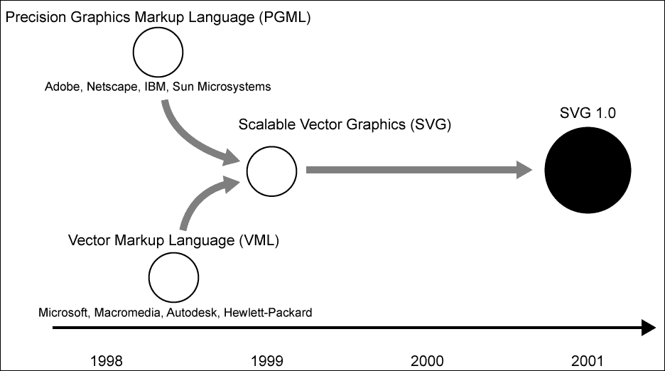
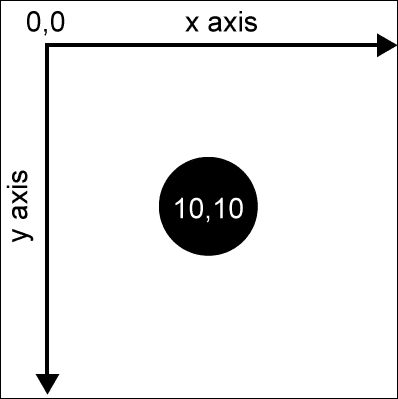
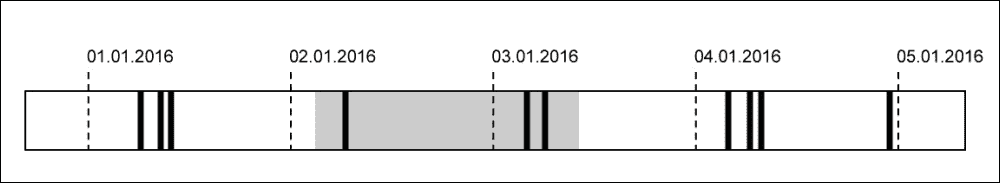
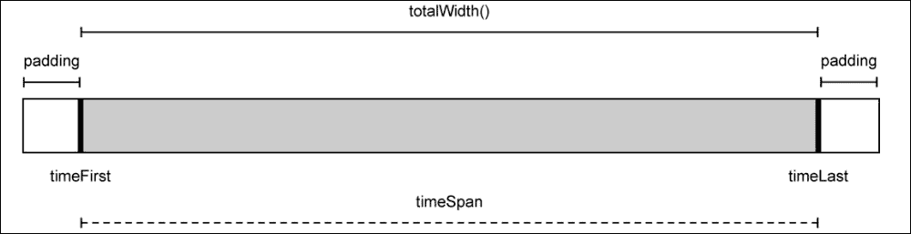
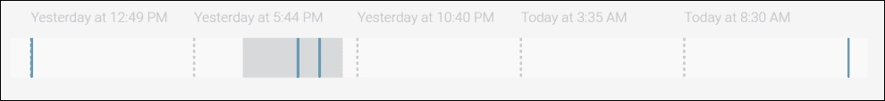
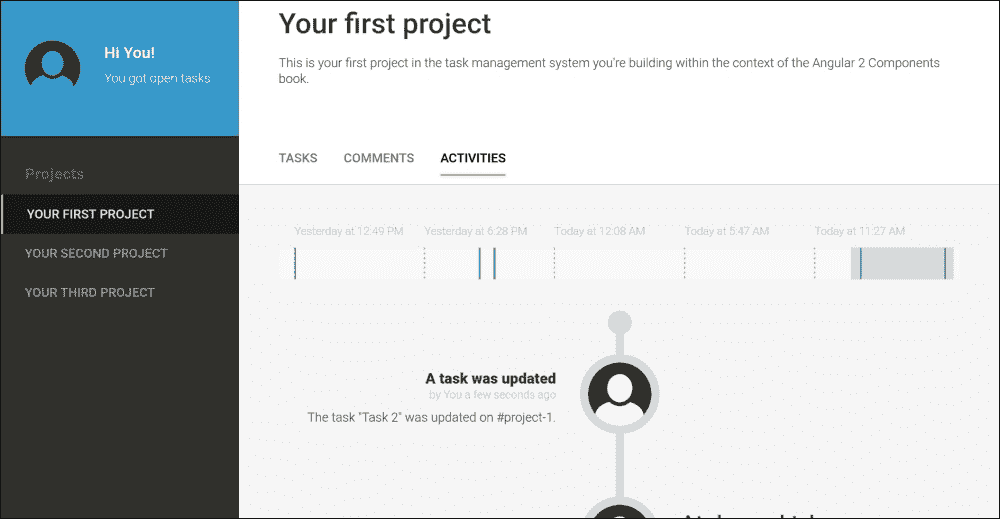

# 第六章。跟上活动

在本章中，我们将使用**可缩放矢量图形**（**SVG**）和 Angular 构建图形组件，在我们的任务管理系统中构建活动日志。SVG 是处理复杂图形内容的理想选择，通过使用 Angular 组件，我们可以构建封装良好且可重用的内容。

由于我们希望在应用程序中记录所有活动，例如添加评论或重命名任务，我们将创建一个中央存储库。然后我们可以显示这些活动，并使用 SVG 将它们渲染为活动时间线。

为了添加所有活动的概述并提供用户输入以缩小显示活动的范围，我们将创建一个交互式滑块组件。此组件将使用投影将时间戳以刻度和活动形式直接渲染到滑块的背景上。我们还将使用 SVG 在组件内部渲染元素。

本章我们将涵盖以下主题：

+   SVG 的基本介绍

+   使 SVG 与 Angular 组件可组合

+   在组件模板中使用命名空间

+   创建一个简单的管道，使用 Moment.js 格式化日历时间

+   使用`@HostListener`注解处理用户输入事件以创建交互式滑块元素

+   使用`ViewEncapsulation.Native`来利用 Shadow DOM 创建原生风格的封装

# 创建活动日志服务

本章的目标是提供一个方法来跟踪任务管理应用程序中的所有用户活动。为此，我们需要一个系统，允许我们在组件内记录活动并访问已记录的活动。

作为实体，活动应该是相当通用的，并应具有以下字段及其相应用途：

+   **主题**：此字段应用于引用活动的主题。这可以是任何标识符，用于识别外部实体。在项目上下文中，我们将在此字段中存储项目 ID。使用活动服务的服务和组件应使用此字段进一步筛选特定活动。

+   **类别**：此字段提供了一种额外的标记活动的方法。对于项目，我们目前将使用两个类别：*评论*和*任务*。

+   **标题**：这指的是活动的标题，将提供关于活动内容的简要总结。这可能像*新任务已添加*或*评论已删除*这样的内容。

+   **消息**：这是活动真正内容所在字段。它应包含足够的信息，以便在活动期间提供良好的可追溯性。

为了开发我们的系统，我们将在`lib`文件夹下的`activities/activity-service`路径下创建一个名为`activity-service.js`的新文件。在此文件中，我们将创建我们的活动服务类，通过使用`@Injectable`注解来启用依赖注入：

```js
@Injectable()
constructor(@Inject(DataProvider) dataProvider,
                   @Inject(UserService) userService) {
export class ActivityService {
    // We're exposing a replay subject that will emit events 
    // whenever the activities list change
 this.change = new ReplaySubject(1);
    this.dataProvider = dataProvider;
    this.userService = userService;
    this.activities = [];

    // We're creating a subscription to our datastore to get 
    // updates on activities
    this.activitiesSubscription = this.dataProvider.getLiveChanges()
      .map((change) => change.doc)
 .filter((document) => document.type === 'activity')
      .subscribe((changedActivity) => {
        this.activities = this.activities.slice();
        // Since activities can only be added we can assume that 
        // this change is a new activity
 this.activities.push(changedActivity);
        // Sorting the activities by time to make sure there's no 
        // sync issue messing with the ordering
        this.activities.sort((a, b) => 
          a.time > b.time ? -1 : a.time < b.time ? 1 : 0);
 this.change.next(this.activities);
      });
  }

  // This method is logging a new activity
  logActivity(subject, category, title, message) {
    // Using the DataProvider to create a new document in our
    // datastore
 this.dataProvider.createOrUpdateDocument({
 type: 'activity',
 user: this.userService.currentUser,
 time: new Date().getTime(),
 subject,
 category,
 title,
 message
 });
  }
}
```

在我们活动服务的构造函数中，我们订阅了数据存储的变化，并按类型过滤了任何传入的变化，这样我们只会收到活动更新。

由于活动不能被编辑或删除，我们只需要关注新添加的活动。我们在订阅中更新活动的内部数组，以包含任何添加的活动。这样，我们不仅会收到所有初始活动，还会收到直接从数据存储中添加的活动。其他服务和组件可以随后直接访问系统的活动列表。

为了让其他应用程序组件对活动列表的变化做出反应，我们在`change`成员字段上公开了一个`ReplaySubject`可观察对象。

在`logActivity`方法中，我们只是简单地将一个新的活动添加到数据存储中。`UserService`将为我们提供有关当前登录用户的信息，我们可以使用`DataProvider`将数据写入数据存储。

因此，我们创建了一个简单的平台，将帮助我们跟踪应用程序中的活动。由于我们希望在应用程序中只有一个`ActivityService`实例，让我们将其添加到根`App`组件的`providers`列表中。你可以在`lib`文件夹中的`app.js`文件中找到这个组件：

```js
@Component({
  selector: 'ngc-app',
  …
 providers: [ProjectService, UserService, ActivityService]
})
```

由于所有依赖注入器都将继承我们的`App`组件的依赖项，因此我们可以将其注入到我们应用程序的任何组件中。

## 记录活动

我们创建了一个很好的系统来记录活动。现在让我们继续在我们的组件中使用它，以记录所有活动。

首先，让我们使用`ActivityService`在`TaskList`组件中记录活动。以下代码摘录突出了我们对`lib`文件夹中的`task-list/task-list.js`文件内`TaskList`组件所做的更改：

```js
...
import {ActivityService} from '../activities/activity-service/activity-service';
import {limitWithEllipsis} from '../utilities/string-utilities';

@Component({
  selector: 'ngc-task-list',
  ...
})
export class TaskList {
  …
 // Subject for logging activities
 @Input() activitySubject;

  onTaskUpdated(task, updatedData) {
    ...
 // Creating an activity log for the updated task
 this.activityService.logActivity(
 this.activitySubject.id,
 'tasks',
 'A task was updated',
 'The task "${limitWithEllipsis(oldTask.title, 30)}" was updated on #${this.activitySubject.document.data._id}.'
 );
  }

  onTaskDeleted(task) {
    ...
 // Creating an activity log for the deleted task
 this.activityService.logActivity(
 this.activitySubject.id,
 'tasks',
 'A task was deleted',
 'The task "${limitWithEllipsis(removed.title, 30)}" was deleted from #${this.activitySubject.document.data._id}.'
 );
  }

  addTask(title) {
    ...
 // Creating an activity log for the added task
 this.activityService.logActivity(
 this.activitySubject.id,
 'tasks',
 'A task was added',
 'A new task "${limitWithEllipsis(title, 30)}" was added to #${this.activitySubject.document.data._id}.'
 );
  }
  ...
}
```

使用`ActivityService`的`logActivity`方法，我们可以轻松地将任何数量的活动记录到现有的`TaskList`方法中，以修改任务。

在我们活动的消息体中，我们使用了一个新的实用函数，`limitWithEllipsis`，该函数是从一个新模块导入的，即`string-utilities`。这个函数接受一个字符串和一个数字作为参数。返回的字符串是输入字符串的截断版本，在第二个参数指定的位置被截断。此外，字符串后面还附加了一个省略号字符（`...`）。我不会在这个辅助函数的相对简单的代码上打扰你。如果你想知道它是如何实现的，你可以在下载本章代码后查看实现。

如果你回到我们活动日志的规范，你会看到我们总是需要指定一个主题才能记录活动。我们通过引入一个新的输入参数`activitySubject`在我们的`TaskList`组件上实现了这一点。这里的假设是每个活动主体都包含存储在文档成员下的`LiveDocument`。从那里，我们可以从数据存储中获取 ID，并用于我们的活动消息。

如果我们回顾我们的`Project`组件，你会看到我们已经在遵循活动主体的先决条件。我们在`document`成员字段下存储了对底层`LiveDocument`实例的引用。

我们现在需要做的就是更改我们的`ProjectTaskList`包装组件的模板，以传递`TaskList`组件的`activitySubject`项目输入。让我们快速看一下`lib/project/project-task-list/project-task-list.html`文件中的更改：

```js
<ngc-task-list [tasks]="project.tasks"
 [activitySubject]="project"
             (tasksUpdated)="updateTasks($event)"></ngc-task-list>
```

你可能会想知道，如果我们可以直接传递一个项目硬引用并直接使用项目任务和项目 ID，为什么我们还要关心这种处理任务列表相当繁琐的方法。我们当前解决方案的美丽之处在于，我们没有任何对项目的依赖。我们也可以在不涉及项目上下文的情况下使用我们的`TaskList`组件。我们仍然可以向`tasks`输入传递任务列表，并为活动日志使用不同的活动主题。

我们还将在`Comments`组件中使用`ActivityService`来创建添加、编辑和删除评论的日志。由于涉及的步骤与我们刚刚为`TaskList`组件所做的工作非常相似，我们将跳过这一部分。你总是可以查看本章的最终代码库，为`Comments`组件添加活动日志。

# 利用 SVG 的力量

SVG 自 1999 年以来一直是开放网络平台标准的一部分，并于 2001 年在 SVG 1.0 标准下首次推荐。SVG 是两个独立 XML 矢量图像格式提案的整合。**精确图形标记语言**（**PGML**）——主要由 Adobe 和 Netscape 开发——以及**矢量标记语言**（**VML**）——主要由微软和 Macromedia 代表——都是服务于相同目的的不同 XML 格式。W3C 联盟拒绝了这两个提案，转而支持新开发的 SVG 标准，该标准将两者的优点统一为一个单一标准：



展示 SVG 标准发展历程的时间线

所有这三个标准都有一个共同的目标，即提供一个格式，让 Web 在浏览器中显示矢量图形。SVG 是一种声明性语言，使用 XML 元素和属性指定图形对象。

让我们看看如何使用 SVG 创建一个黑色圆圈的 SVG 图像的简单示例：

```js
<?xml version="1.0" encoding="utf-8"?>  
<svg version="1.1"  
     width="20px" height="20px">
  <circle cx="10" cy="10" r="10" fill="black" />
</svg>
```

这个相当简单的例子代表了一个 SVG 图像，其中有一个黑色圆圈，其中心位于*x = 10 px*和*y = 10 px*。圆圈的半径是 10 px，这使得这个圆圈宽度和高度都是 20 px。

SVG 的坐标系原点位于左上角，其中*y*轴朝南方向，*x*轴朝东：



SVG 内的坐标系

不仅使用原始形状，如圆圈、线条和矩形，还使用复杂的多边形，创建图形内容的可能性几乎是无限的。

SVG 不仅用于 Web，而且已成为不同应用程序之间交换矢量图形的重要中间格式。几乎任何支持矢量图形的应用程序都支持导入 SVG 文件。

当我们不将 SVG 文件作为 HTML 图像包含在内，而是直接在我们的 DOM 中包含 SVG 内容时，SVG 的真正力量才显现出来。由于 HTML5 直接支持 HTML 文档中的 SVG 命名空间，并将渲染我们在 HTML 中定义的图形，因此出现了一系列新的可能性。现在，我们可以使用 CSS 来样式化 SVG，使用 JavaScript 操作 DOM，并轻松使 SVG 交互式。

将我们之前的圆圈图像示例提升到下一个层次，我们可以通过点击来改变圆圈颜色，使其变得交互式。首先，让我们创建一个最小的 HTML 文档，并将我们的 SVG 元素直接包含在 DOM 中：

```js
<!doctype html>
<title>Minimalistic Circle</title>
<svg width="20px" height="20px">
  <circle id="circle" cx="10" cy="10" r="10" fill="black">
</svg>
<script>
  document
    .getElementById('circle')
    .addEventListener('click', function(event) {
      event.target.setAttribute('fill', 'red');
    });
</script>
```

如您所见，当我们直接在 HTML 文档的 DOM 中使用 SVG 时，我们可以去掉版本和 XML 命名空间声明。这里有趣的是，我们可以将 SVG 视为常规 HTML。我们可以为 SVG 元素分配 ID 和类，并从 JavaScript 中访问它们。

在我们 HTML 文档的`script`标签内，我们可以直接通过之前分配给它的 ID 访问我们的`circle`元素。我们可以像处理常规 HTML 元素一样添加事件监听器。在这个例子中，我们添加了一个`click`事件监听器，并将我们的圆圈颜色改为红色。

为了简化，我们在本例中使用了内联`script`标签。当然，使用一个单独的 JavaScript 文件来做脚本会更干净利落。

## SVG 的样式

在 Web 中关注点的分离方面，我是一个纯粹主义者。我仍然坚信结构（HTML）、外观（CSS）和行为（JavaScript）的分离，以及遵循此实践时产生最可维护的应用程序。

首先，在 HTML 中使用 SVG 似乎很奇怪，你可能会认为这打破了干净的分离契约。为什么只有外观相关的数据组成的图形内容，却坐在只应包含原始信息的 HTML 中？在处理了大量的 DOM 中的 SVG 之后，我得出结论，我们可以通过将外观责任分为以下两个子组来使用 SVG 建立干净的分离：

+   **图形结构**：这个子组处理的是定义你的图形内容基本结构的过程。这关乎形状和布局。

+   **视觉外观**：这个子组处理的是定义我们的图形结构的外观和感觉的过程，例如颜色、线宽、线型和文本对齐。

如果我们将 SVG 的关注点分离成这些组，我们实际上可以获得很好的可维护性。图形结构由 SVG 形状本身定义。它们直接写入我们的 HTML 中，但没有特定的外观和感觉。我们只将基本的结构信息存储在 HTML 中。

幸运的是，所有视觉外观属性，如颜色，不仅可以通过我们的 SVG 元素的属性来表示；然而，有一个相应的 CSS 属性允许我们将结构的外观和感觉相关方面卸载到 CSS 中。

回到我们画黑色圆圈的例子；我们将对其进行一些调整以满足我们对关注点分离的需求，以便我们可以区分图形结构和图形外观：

```js
<!doctype html>
<title>Minimalistic Circle</title>
<svg width="20px" height="20px">
  <circle class="circle" cx="10" cy="10" r="10">
</svg>
```

现在我们可以通过包含以下内容的样式表来使用 CSS 来样式化我们的图形结构：

```js
.circle {
  fill: black;
}
```

这真是太棒了，因为我们现在不仅可以重用一些图形结构，还可以使用 CSS 应用不同的视觉外观参数，类似于我们通过只更改一些 CSS 就成功重用了一些语义 HTML 的那些启发时刻。

让我们来看看我们可以用来样式化 SVG 形状的最重要的 CSS 属性：

+   `fill`：在处理实心 SVG 形状时，始终有形状填充和描边选项可用；`fill` 属性指定了形状填充的颜色。

+   `stroke`：此属性指定了 SVG 形状轮廓的颜色。

+   `stroke-width`：此属性指定了 SVG 形状轮廓的宽度，对于实心形状。对于非实心形状，例如线条，这可以被认为是线宽。

+   `stroke-dasharray`：这指定了描边的虚线模式。虚线模式是由空格分隔的值，定义了一个模式。

+   `stroke-dashoffset`：这指定了虚线模式的偏移量，该偏移量由 `stroke-dasharray` 属性指定。

+   `stroke-linecap`：此属性定义了线帽应该如何渲染。它们可以是方形、平头或圆角帽。

+   `stroke-linejoin`：此属性指定了路径内线条的连接方式。

+   `shape-rendering`：使用此属性，您可以覆盖形状渲染算法，正如其名，该算法用于渲染形状。如果您需要形状有清晰的边缘，这特别有用。

要查看所有可用的与外观相关的 SVG 属性的完整参考，请访问 Mozilla 开发者网站上的[`developer.mozilla.org/en-US/docs/Web/SVG/Attribute`](https://developer.mozilla.org/en-US/docs/Web/SVG/Attribute)。

希望这篇简短的介绍让您对 SVG 及其带来的强大功能有了更好的认识。在本章中，我们将利用其中的一些功能来创建漂亮的、交互式的图形组件。如果您想了解更多关于 SVG 的信息，我强烈建议您阅读 Sara Soueidan 的精彩文章。

## 构建 SVG 组件

当使用 SVG 模板构建 Angular 组件时，有一些事情我们需要注意。首先也是最明显的一点，是 XML 命名空间。现代浏览器在解析 HTML 时非常智能。除了可能是计算机科学历史上最容错的解析器之外，DOM 解析器在识别标记并决定如何处理它方面也非常聪明。它们将根据元素名称自动为我们决定正确的命名空间，因此我们编写 HTML 时不需要处理它们。

如果您对 DOM API 有过一些操作，您可能会认识到有两种方法用于创建新元素。例如，在文档对象中，有一个`createElement`函数，但还有一个`createElementNS`，它接受一个额外的命名空间 URI 参数。此外，每个创建的元素都有一个`namespaceURI`属性，它告诉您特定元素的命名空间。这很重要，因为 HTML5 是一个至少由三个命名空间组成的标准：

+   **HTML**：这是具有[`www.w3.org/1999/xhtml`](http://www.w3.org/1999/xhtml) URI 的标准 HTML 命名空间。

+   **SVG**：这包括所有 SVG 元素和属性，并使用[`www.w3.org/2000/svg`](http://www.w3.org/2000/svg) URI。您有时可以在`svg`元素的`xmlns`属性中看到此命名空间 URI。实际上，这并不是必需的，因为浏览器足够智能，可以自己决定正确的命名空间。

+   **MathML**：这是一个基于 XML 的格式，用于描述数学公式，并被大多数现代浏览器支持。它使用[`www.w3.org/1998/Math/MathML`](http://www.w3.org/1998/Math/MathML)命名空间 URI。

我们可以在单个文档中混合来自不同标准和命名空间的所有这些元素，当浏览器在 DOM 中创建元素时，它将自动确定正确的命名空间。

### 小贴士

如果您想了解更多关于命名空间的信息，我建议您阅读 Mozilla 开发者网络上的*命名空间快速入门*文章[`developer.mozilla.org/en/docs/Web/SVG/Namespaces_Crash_Course`](https://developer.mozilla.org/en/docs/Web/SVG/Namespaces_Crash_Course)。

由于 Angular 会为我们编译模板，并使用 DOM API 将元素渲染到 DOM 中，因此在进行这些操作时，它需要了解命名空间。类似于浏览器，Angular 在创建元素时提供了一些智能来决定正确的命名空间。然而，在某些情况下，你需要帮助 Angular 识别正确的命名空间。

为了说明一些这种行为，让我们将我们一直在工作的圆形示例转换成一个 Angular 组件：

```js
@Component({
  selector: 'awesome-circle',
  template: `
    <svg [attr.width]="size" [attr.height]="size">
      <circle [attr.cx]="size/2" [attr.cy]="size/2"
              [attr.r]="size/2" fill="black" />
    </svg>
  `
})
export class AwesomeCircle {
 @Input() size;
}
```

我们已经将我们的圆形 SVG 图形包装在一个简单的 Angular 组件中。`size` 输入参数通过控制 SVG 的 `width` 和 `height` 属性以及圆形的 `cx`、`cy` 和 `r` 属性来确定圆形的实际宽度和高度。

要使用我们的 `Circle` 组件，只需在另一个组件中使用以下模板：

```js
<awesome-circle [size]="20"></awesome-circle>
```

### 注意

需要注意的是，我们需要在 SVG 元素上使用属性绑定，而不能直接设置 DOM 元素的属性。这是由于 SVG 元素具有特殊的属性类型——例如，`SVGAnimatedLength`——可以使用**同步多媒体集成语言**（**SMIL**）进行动画。为了避免干扰这些相对复杂的元素属性，我们可以简单地使用属性绑定来设置 DOM 元素的属性值。

让我们回到我们的命名空间讨论。Angular 会知道它需要使用 SVG 命名空间来创建这个模板内的元素。它将以这种方式工作，仅仅因为我们在这个组件中使用 `svg` 元素作为根元素，并且它可以在模板解析器中自动为任何子元素切换命名空间。

然而，在某些情况下，我们需要帮助 Angular 确定我们想要创建的元素的正确命名空间。当我们创建不包含根 `svg` 元素的嵌套 SVG 组件时，我们会遇到这种情况：

```js
@Component({
  selector: '[awesomeCircle]',
  template: `
 <svg:circle [attr.cx]="size/2" [attr.cy]="size/2"
 [attr.r]="size/2" fill="black" />
  '
})
export class AwesomeCircle {
  @Input('awesomeCircle') size;
}

@Component({
  selector: 'app'
  template: `
   <svg width="20" height="20">
    <g [awesomeCircle]="20"></g>
   </svg>
  `,
  directives: [AwesomeCircle]
})
export class App {}
```

在这个例子中，我们嵌套了 SVG 组件，我们的 `AwesomeCircle` 组件没有 `svg` 根元素来告诉 Angular 切换命名空间。这就是为什么我们在 `App` 组件中创建了一个 `svg` 元素，然后在一个 SVG 组中包含了 `AwesomeCircle` 组件。

我们需要明确告诉 Angular 在我们的 `Circle` 组件中切换到 SVG 命名空间，我们可以通过在代码片段中高亮显示的部分中看到的那样，将命名空间名称作为冒号分隔的前缀来做到这一点。

如果你需要显式地在 SVG 命名空间中创建多个元素，你可以依赖 Angular 也会为子元素应用命名空间的事实，并且会使用 SVG 组元素将所有你的元素分组。所以，你只需要在组元素 `<svg:g> ... </svg:g>` 前加前缀，但不要包含任何 SVG 元素。

在处理 SVG 时，这已经足够了解 Angular 的内部机制了。让我们继续前进，创建一些真正的组件！

# 构建一个交互式活动滑块组件

在前面的主题中，我们已经介绍了使用 SVG 以及在 Angular 组件中处理 SVG 的基础知识。现在，是时候将我们的知识应用到任务管理应用中，并使用 SVG 创建一些组件了。

在这个背景下，我们将首先创建一个交互式滑块，允许用户选择他或她感兴趣检查的活动时间范围。显示一个简单的 HTML5 范围输入可能是一个解决方案，但既然我们已经获得了 SVG 超能力，我们可以做得更好！我们将使用 SVG 来渲染我们自己的滑块，它将在滑块上显示现有活动作为刻度。让我们看看我们将要创建的滑块组件的预览图：



活动滑块组件的预览图

我们的滑块组件实际上将有两个用途。它应该是一个用户控件，并提供一种选择时间范围以过滤活动的方法。然而，它还应该提供所有活动的概览，以便用户可以更直观地过滤范围。通过绘制代表活动的垂直条，我们已经在用户感兴趣的范围上给出了感觉。

首先，我们将在 `activities/activity-slider` 路径下创建一个新的文件，名为 `activity-slider.js`，并定义我们的组件类：

```js
import styles from './activity-slider.css!text';

@Component({
  selector: 'ngc-activity-slider',
  host: {
    class: 'activity-slider'
  },
 styles: [styles],
 encapsulation: ViewEncapsulation.Native,
  …
})
export class ActivitySlider {
  // The input expects a list of activities
 @Input() activities;
  // If the selection of date range changes within our slider 
  // component, we'll emit a change event
 @Output() selectionChange = new EventEmitter();

  constructor(@Inject(ElementRef) elementRef) {
    // We'll use the host element for measurement when drawing
    // the SVG
 this.sliderElement = elementRef.nativeElement;
    // The padding on each side of the slider
 this.padding = 20;
  }

  ngAfterViewInit() {
    // We'll need a reference to the overlay rectangle so we can 
    // update its position and width
 this.selectionOverlay = this.sliderElement
 .shadowRoot.querySelector('.selection-overlay');
  }
}
```

我们应该首先提到的是，这与我们迄今为止编写的所有其他组件都不同，我们正在为这个组件使用 `ViewEncapsulation.Native`。正如我们在第二章的 *创建我们的应用程序组件* 部分中学习的，当我们在组件封装中使用 `ViewEncapsulation.Native` 时，Angular 实际上使用 Shadow DOM 来创建组件。我们在第一章的 *组件化用户界面* 部分的 *Shadow DOM* 部分中也简要地讨论了这一点。

使用 Shadow DOM 为我们的组件将带来这个优势：我们的组件将从 CSS 方面完全封装。这不仅意味着没有任何全局 CSS 会泄漏到我们的组件中，而且这也意味着我们需要创建本地样式来为我们的组件进行样式设计。

到目前为止，我们使用了一种名为 BEM 的 CSS 命名约定，它为我们提供了一些必要的前缀，以避免 CSS 中的名称冲突，并建立干净简单的 CSS 特异性。然而，当使用 Shadow DOM 时，我们可以省略前缀以避免名称冲突，因为我们只在本组件内部应用样式。

由于我们在这个组件中使用 Shadow DOM，我们需要有一种方法来定义本地样式。Angular 通过组件注解的 `styles` 属性为我们提供了一个将样式传递到组件中的选项。

### 小贴士

Chrome 从版本 35 开始原生支持 Shadow DOM。在 Firefox 中，可以通过访问`about:config`页面并打开`dom.webcomponents.enabled`标志来启用 Shadow DOM。IE、Edge 和 Safari 根本不支持这个标准；然而，我们可以通过包含一个名为`webcomponents.js`的 polyfill 来设置它们以处理 Shadow DOM。你可以在[`github.com/webcomponents/webcomponentsjs`](https://github.com/webcomponents/webcomponentsjs)上找到有关此 polyfill 的更多信息。

使用 SystemJS 的文本插件，我们可以导入只包含我们组件本地样式的样式表，然后将它们传递给`styles`属性。通过在 CSS 文件的导入后添加一个`!text`后缀，我们告诉 SystemJS 将我们的 CSS 文件作为原始文本加载。请注意，`styles`属性期望一个数组，这就是为什么我们将导入的样式包装在一个数组字面量中。

如果你查看`ActivitySlider`组件的样式表，你可以立即看到我们不再在类名前加上组件名称：

```js
.slide {
  fill:#f9f9f9;
}

.activity {
  fill:#3699cb;
}

.time {
  fill:#bbb;
  font-size:14px;
}

.tick {
  stroke:#bbb;
  stroke-width:2px;
  stroke-dasharray:3px;
}

.selection-overlay {
  fill:#d9d9d9;
}
```

通常，这样的短类名可能会在我们的项目中导致名称冲突，但既然样式将仅限于我们组件的 Shadow DOM 中，我们就不需要担心名称冲突了。

作为输入参数，我们定义了将用于不仅确定滑动组件中的可用范围，还要在滑动组件的背景上渲染活动的活动列表。

一旦用户做出选择，我们的组件将使用`selectionChange`事件发射器来通知外部世界关于变化。

在构造函数中，我们留出组件 DOM 元素，以便进行一些测量，以便稍后绘制：

```js
this.sliderElement = elementRef.nativeElement;
```

通过将`ElementRef`实例注入构造函数，我们可以轻松访问我们组件的原生 DOM 元素。

## 时间的投影

我们的滑动组件需要能够将时间戳投影到 SVG 的坐标系中。此外，当用户点击时间线选择范围时，我们需要能够将坐标投影回时间戳。为此，我们需要在我们的组件中创建两个投影函数，这些函数将使用一些辅助函数和状态来计算值，从坐标到时间和反过来：



我们计算中重要变量和函数的可视化

虽然我们将使用百分比来定位滑动组件上的 SVG 元素，但两侧的填充需要以像素为单位指定。`totalWidth`函数将返回该区域的像素总宽度；这是我们将在其中绘制活动指示器的位置。`timeFirst`、`timeLast`和`timeSpan`变量也将被计算使用，并以毫秒为单位指定。

让我们在`activity-slider.js`文件中添加一些代码来处理我们在滑动组件上的活动投影：

```js
// Getting the total available width of the slider
totalWidth() {
 return this.sliderElement.clientWidth - this.padding * 2;
}

// Projects a time stamp into percentage for positioning
projectTime(time) {
 let position = this.padding +
 (time - this.timeFirst) / this.timeSpan * this.totalWidth();
 return position / this.sliderElement.clientWidth * 100;
}

// Projects a pixel value back to a time value. This is required 
// for calculating time stamps from user selection.
projectLength(length) {
 return this.timeFirst + (length - this.padding) / this.totalWidth() * this.timeSpan;
}

```

由于我们已经将根元素的引用作为`sliderElement`成员变量放置一旁，我们可以使用其`clientWidth`属性来获取组件的全宽并减去内边距。这将给我们想要绘制活动指示器的区域的全宽，以像素为单位。

在`projectTime`函数中，我们首先将时间戳通过一个简单的三段式规则转换为位置。因为我们可以访问第一个活动的时间戳以及总时间跨度，所以这将是一个非常简单的任务。一旦我们这样做，我们可以通过将其除以组件的总宽度然后乘以 100，将我们的位置值（以像素为单位）转换为百分比。

要将像素值投影回时间戳，我们可以做`projectTime`的相反操作，只不过这里我们不是处理百分比，而是假设`projectLength`函数的长度参数是以像素为单位。

我们在我们的投影代码中使用了一些成员变量——`timeFirst`、`timeLast`和`timeSpan`——但我们是如何设置这些成员变量的呢？因为我们有一个`activities`组件输入，它预期是一个相关活动的列表，我们可以观察输入以检测变化，并根据输入设置值。为了观察组件输入的变化，我们可以使用`ngOnChanges`生命周期钩子：

```js
ngOnChanges(changes) {
  // If the activities input changes we need to re-calculate and 
  // re-draw
  if (changes.activities && changes.activities.currentValue) {
    const activities = changes.activities.currentValue;
    // For later calculations we set aside the times of the 
    // first and the last activity
    if (activities.length === 1) {
      // If we only have one activity we use the same time for 
      // first and last
 this.timeFirst = this.timeLast = activities[0].time;
    } else if (activities.length > 1) {
      // Take first and last time
 this.timeFirst = activities[activities.length - 1].time;
 this.timeLast = activities[0].time;
    } else {
      // No activities yet, so we use the current time for both 
      // first and last
 this.timeFirst = this.timeLast = new Date().getTime();
    }

    // The time span is the time from the first activity to the 
    // last activity. We need to limit to lower 1 for not messing 
    // up later calculations.
 this.timeSpan = Math.max(1, this.timeLast - this.timeFirst);
  }
}
```

首先，我们需要检查更改是否包括对`activities`输入的更改，并且当前输入值是有效的。在检查输入值之后，我们可以确定我们的成员变量，即`timeFirst`、`timeLast`和`timeSpan`。我们将`timeSpan`变量限制至少为`1`，否则我们的投影计算将会出错。

上述代码将确保当`activities`输入发生变化时，我们总是会重新计算我们的成员变量，并且我们会使用最新的数据渲染活动。

## 渲染活动指示器

我们已经实现了组件的基本功能，并为将时间信息引入组件的坐标系奠定了基础。现在是时候使用我们的投影函数，并使用 SVG 在滑块上绘制我们的活动指示器了。

首先，让我们看看我们将在`activity-slider`目录下的`activity-slider.html`文件中创建的所需模板：

```js
<svg width="100%" height="70px">
  …
  <rect x="0" y="30" width="100%" height="40" 
        class="slide"></rect>
  <rect *ngFor="let activity of activities"
 [attr.x]="projectTime(activity.time) + '%'"
        height="40" width="2px" y="30" class="activity"></rect>
</svg>
```

由于我们需要为活动列表中的每个活动创建一个指示器，我们可以简单地使用`NgFor`指令重复表示活动指示器的矩形。

正如我们在前一个主题中构建`ActivityService`类时所知，活动总是包含一个带有活动时间戳的`time`字段。在我们的组件中，我们已创建了一个将时间转换为相对于组件宽度的百分比的投影函数。我们只需在`rect`元素的`x`属性绑定中使用`projectTime`函数，就可以将活动指示器定位在正确的位置。

通过仅使用 SVG 模板和我们的背景函数来投影时间，我们创建了一个小巧的图表，该图表在时间轴上显示活动指示器。

你可以想象，如果我们有很多活动，我们的滑块实际上看起来会很拥挤，很难感觉到这些活动可能发生的时间。我们需要有一种网格，可以帮助我们将图表与时间轴关联起来。

如我们在滑块组件的模拟中已展示的，我们现在将在滑块背景上引入一些刻度，将滑块分成几个部分。我们还将为每个刻度标注一个日历时间。这将使用户在查看滑块上的活动指示器时对时间有一个大致的感觉。

让我们看看`ActivitySlider`类中的代码更改，这将使我们能够渲染我们的刻度：

```js
ngOnChanges(changes) {
  // If the activities input changes we need to re-calculate and 
  // re-draw
  if (changes.activities && changes.activities.currentValue) {
    ...
    // Re-calculate the ticks that we display on top of the slider
 this.computeTicks();
  ...
}

// This function computes 5 ticks with their time and position on 
// the slider
computeTicks() {
 const count = 5;
 const timeSpanTick = this.timeSpan / count;
 this.ticks = Array.from({length: count}).map(
 (element, index) => {
 return this.timeFirst + timeSpanTick * index;
 });
}
...
```

首先，我们需要创建一个函数来计算一些刻度，这样我们就可以将它们放置到时间轴上。为此，我们需要创建`computeTicks`方法，该方法将整个时间轴分成五个相等的部分，并生成代表各个刻度时间位置的戳记。我们将这些刻度存储在一个新的`ticks`成员变量中。借助这些时间戳，我们可以在视图中轻松渲染刻度。

### 小贴士

我们使用 ES6 的`Array.from`函数创建一个具有所需长度的新数组，并使用函数式数组扩展函数`map`从该数组生成刻度模型对象。使用`Array.from`是一个创建给定长度的初始数组的不错技巧，这可以用来建立函数式风格。

让我们看看我们组件的模板以及我们如何使用我们的时间戳数组在滑块组件上渲染刻度。我们将修改`activity-slider.html`中的组件模板：

```js
...
<g *ngFor="let tick of ticks">
  <text [attr.x]="projectTime(tick) + '%'" y="14" class="time"> 
    {{tick | calendarTime}}</text>
  <line [attr.x1]="projectTime(tick) + '%'"
 [attr.x2]="projectTime(tick) + '%'"
        y1="30" y2="70" class="tick"></line>
</g>
...
```

为了渲染我们的刻度，我们使用了一个 SVG 组元素来放置我们的`NgFor`指令，该指令重复我们在`ticks`成员变量中存储的刻度时间戳。

对于每个刻度，我们需要放置一个标签以及一条跨越滑块背景的线。我们可以使用 SVG 文本元素来渲染带有时间戳的标签，并将其放置在滑块上方。在我们的`text`元素的`x`属性绑定中，我们使用了`projectTime`投影函数来接收从时间戳中得到的投影百分比值。我们的`text`元素的`y`坐标固定在一个位置，这样标签就会正好位于滑块上方。

SVG 线由四个坐标组成：`x1`、`x2`、`y1`和`y2`。它们共同定义了两个坐标点，一条线将从其中一个点绘制到另一个点。

现在，我们越来越接近我们在本主题开头所指定的最终滑块。最后缺失的拼图碎片是使我们的滑块交互式，以便用户可以选择一系列活动。

## 使其生动起来

到目前为止，我们已经涵盖了滑块背景的渲染以及活动指示器的渲染。我们还生成了刻度，并用网格线和标签显示它们，以显示每个刻度的日历时间。

嗯，这并不真正是一个滑块，对吧？当然，我们还需要处理用户输入并使滑块交互式，以便用户可以选择他们想要显示活动的时间范围。

要实现这一点，请将以下更改添加到组件类中：

```js
ngOnChanges(changes) {
  // If the activities input changes we need to re-calculate and 
  // re-draw
  if (changes.activities && changes.activities.currentValue) {
    ...
    // Setting the selection to the full range
 this.selection = {
 start: this.timeFirst,
 end: this.timeLast
 };
 // Selection changed so we need to emit event
 this.selectionChange.next(this.selection);
  }
}
```

当我们在`ngOnChanges`生命周期钩子中检测到`activities`输入属性的变化时，我们在滑块组件中初始化用户选择模型。它包含一个`start`和`end`属性，两者都包含表示活动滑块上选择范围的时间戳。

一旦我们设置了初始选择，我们需要使用`selectionChange`输出属性来触发一个事件。这样，我们可以让父组件知道滑块内的选择已更改。

为了显示选择范围，我们在模板中使用一个覆盖矩形，该矩形将放置在滑块背景上方。如果你再次查看滑块的模拟图像，你会注意到这个覆盖层被涂成灰色：

```js
  <rect *ngIf="selection"
 [attr.x]="projectTime(selection.start) + '%'"
 [attr.width]="projectTime(selection.end) - projectTime(selection.start) + '%'"
        y="30" height="40" class="selection-overlay"></rect>
```

这个矩形将放置在我们的滑块背景上方，并使用我们的投影函数来计算`x`和`width`属性。由于我们需要等待变化检测在`ngOnChanges`生命周期钩子中初始化我们的选择，我们将通过使用`NgIf`指令来检查一个有效的选择对象。

现在，我们需要开始在`ActivitySlider`组件中处理用户输入。存储状态和渲染选择的机制已经就位，因此我们可以实现所需的主监听器来处理用户输入：

```js
...
// If the component receives a mousedown event, we need to start a 
// new selection
@HostListener('mousedown', ['$event'])
onMouseDown(event) {
  // Starting a new selection by setting selection start and end 
  // to the projected time of the clicked position.
 this.selection.start = this.selection.end = 
 this.projectLength(event.offsetX);
  // Selection changed so we need to emit event an
 this.selectionChange.next(this.selection);
  // Setting a flag so we know that the user is currently moving 
  // the selection
 this.modifySelection = true;
}

// We also need to track mouse moves within our slider component
@HostListener('mousemove', ['$event'])
onMouseMove(event) {
  // We should only modify the selection if the component is in 
  // the correct mode
 if (this.modifySelection) {
 // Update the selection end with the projected time from the 
 // mouse coordinates
 this.selection.end = Math.max(this.selection.start, 
 this.projectLength(event.offsetX));
 // Selection changed so we need to emit event an
 this.selectionChange.next(this.selection);
    // To prevent side effects, we should stop propagation and 
    // prevent browser default
    event.stopPropagation();
    event.preventDefault();
  }
}

// If the user is releasing the mouse button, we should stop the 
// modify selection mode
@HostListener('mouseup')
onMouseUp() {
 this.modifySelection = false;
}

// If the user is leaving the component with the mouse, we should 
// stop the modify selection mode
@HostListener('mouseleave')
onMouseLeave() {
 this.modifySelection = false;
}
...
```

在前面的代码片段中，我们在滑块宿主元素上处理了总共四个事件：

+   `onMouseDown`：我们使用相同的值设置选择模型的`start`和`end`属性。由于我们使用时间戳作为这些属性，我们首先将鼠标位置投影到时间空间中。鼠标位置以像素为单位相对于滑块组件的起点。由于我们知道滑块的宽度和显示的总时间长度，我们可以轻松地将这转换为时间戳。我们使用`projectLength`方法来完成此目的。通过传递第二个参数到`@HostListener`装饰器，我们指定我们希望将 DOM 事件传递给我们的`onMouseDown`方法。我们还在组件中设置了一个状态标志`modifySelection`，以指示正在进行选择。

+   `onMouseMove`：如果组件处于选择模式（`modifySelection`标志为`true`），您可以调整`selection`对象的结束属性。在这里，我们还确保使用`Math.max`和限制选择的结束不小于开始，从而排除了创建负选择的可能性。

+   `onMouseUp`：当用户释放鼠标按钮时，组件退出选择模式。这可以通过将`modifySelection`标志设置为`false`来完成。

+   `onMouseLeave`：这与`onMouseUp`事件相同；区别在于这里组件将仅退出选择模式。

使用`@HostListener`装饰器，我们能够处理所有必要的用户输入，以完成我们的组件，并添加了交互元素。

## 概述

在这个主题中，我们学习了如何使用 SVG 在 Angular 中创建图形和交互式组件。通过在 SVG 元素上创建属性绑定，并使用`NgFor`和`NgIf`指令控制图形元素的实例化，我们构建了一个自定义滑块组件，它为我们提供了活动的好概述。同时，我们还学习了如何使用`@HostListener`装饰器处理用户输入，以使我们的组件具有交互性：



完成活动滑块组件的截图

总结一下，我们学习了以下概念：

+   使用`ViewEncapsulation.Native`封装组件视图并导入本地样式

+   将时间戳的基本投影到屏幕坐标上，以便与 SVG 元素一起使用

+   使用`@HostListener`装饰器处理用户输入并创建自定义选择机制

# 构建活动时间线

到目前为止，我们已经构建了一个记录活动和服务滑块组件以选择时间范围并提供活动指标概述的服务。由于我们需要在滑块组件内执行许多绘图任务，SVG 对于这种情况非常合适。为了完成我们的`Activities`组件树，我们仍然需要渲染使用`ActivitySlider`组件选择的各项活动。

让我们继续工作在我们的活动组件树。我们将创建一个新的组件，该组件将负责在活动时间轴内渲染单个活动。让我们从 `Activity` 组件的模板开始，我们将在新的 `activities/activity/activity.html` 文件中创建它：

```js

<div [class.activity__info--align-right]="isAlignedRight()"
     class="activity__info">
  <h3 class="activity__title">{{activity.title}}</h3>
  <p class="activity__author">
 by {{activity.user.name}} {{activity.time | fromNow}}
  </p>
  <p>{{activity.message}}</p>
</div>
```

每个活动将包括一个用户图像以及一个包含活动标题、消息和作者详细信息的信息框。

我们的活动将使用一个输入来确定其对齐方式。这使我们能够从组件外部对活动进行对齐。`isAlignedRight` 方法帮助我们为活动信息框设置一个额外的 CSS 类，`activity__info--align-right`。

我们还需要为我们的 `Activity` 组件创建一个组件类，我们将在新的 `activities/activity/activity.js` 文件下创建它：

```js
import {FromNowPipe} from '../../pipes/from-now';

@Component({
  selector: 'ngc-activity',
  …
  // We are using the FromNow pipe to display relative times 
  // within our template
 pipes: [FromNowPipe]
})
export class Activity {
 @Input() activity;
  // Input that should be a string 'left' or 'right' and will 
  // determine the activity alignment using CSS
 @Input() alignment;
 @Input() @HostBinding('class.activity--start-mark') startMark;
 @Input() @HostBinding('class.activity--end-mark') endMark;

  // Function with that will tell us if the activity should be 
  // aligned to the right. It's used for setting a modifier class 
  // on the info element.
 isAlignedRight() {
 return this.alignment === 'right';
 }
}
```

我们的 `Activity` 组件期望四个输入：

+   `activity`：这个属性接受需要用组件渲染的活动数据模型。这是我们使用 `ActivityService` 创建的活动。

+   `alignment`：这个输入属性应该设置为包含单词 `left` 或 `right` 的字符串。我们使用这个来确定我们是否需要在模板中添加一个额外的 CSS 类，以便将活动信息框对齐到右侧。

+   `startMark`：这个输入属性同时充当输入和主机绑定。如果这个输入设置为 `true`，活动将获得一个额外的 CSS 类，`activity--start-mark`，这将导致在时间轴顶部出现一个小标记，以指示时间轴的终止。

+   `endMark`：与 `startMark` 相同，这个输入使用主机绑定来设置一个额外的 CSS 类，`activity--end-mark`，这将导致在时间轴底部出现一个小标记，以指示时间轴的终止。

`isAlignedRight` 方法在模板中使用，以确定我们是否需要添加一个额外的 CSS 类到信息框，以便将其对齐到右侧。

我们使用在 第四章 中创建的 `FromNow` 管道格式化了活动的日期戳，即 *请勿评论！*。为了在模板中使用管道，我们需要导入它并将其添加到组件注解的 `pipes` 属性中。

我们现在几乎拥有了显示我们活动的所有组件。但仍然缺少一些东西，那就是将 `ActivitySlider` 与我们的 `Activity` 组件结合起来的粘合剂，并使我们的组件子树可导航。为此，我们将创建一个新的组件，称为 `Activities`。让我们创建一个 `activities/activities.js` 文件来编写我们的组件类：

```js
@Component({
  selector: 'ngc-activities',
  ...
 directives: [ActivitySlider, Activity]
})
export class Activities {
 @Input() activitySubject;

  constructor(@Inject(ActivityService) activityService) {
    this.activityService = activityService;
  }

  ngOnChanges(changes) {
    if (changes.activitySubject) {
      // If we have a subscription to the activities service 
      // already we need to unsubscribe first
      if (this.activitiesChangeSubscription) {
        this.activitiesChangeSubscription.unsubscribe();
      }

      // When the project data is updated we need to filter for 
      // activities again
      this.activitiesChangeSubscription = 
        this.activityService.change.subscribe((activities) => {
        // Filter for all activities that have the project ID as subject
 this.activities = activities
 .filter((activity) => activity.subject === this.activitySubject.document.data._id);
 this.onSelectionChange();
      });
    }
  }
```

首先，我们需要知道我们想在组件内显示哪些活动。为此，我们需要提供一个组件输入，即 `activitySubject`。一旦完成，我们就可以从父组件传递一个活动主题，并使用它来过滤我们感兴趣的活动。

由于我们已使用活动主语来记录活动，因此我们可以使用相同的主题来显示活动。在 `ngOnChanges` 生命周期钩子中，我们在 `ActivityService` 实例上设置了一个订阅来响应新创建的活动。因为活动服务会通过更新后的活动列表来通知我们，所以我们可以简单地使用 `Array.prototype.filter` 函数来过滤出相关项。我们已经利用了 `activitySubject` 输入来获取主题的 ID。

接下来，我们需要创建一个方法来对我们的活动应用日期范围过滤器。`onSelectionChange` 方法将从我们的 `activities` 模板中调用，我们在其中创建了一个与 `ActivitySlider` 组件的绑定：

```js
  // If the selection within the activity slider changes, we need 
  // to filter out activities again
 onSelectionChange(selection = this.selection) {
    this.selection = selection;
    // Store filtered activities that fall into the date range 
    // selection specified by the slider
 this.selectedActivities = this.selection ? this.activities.filter(
 (activity) => activity.time >= this.selection.start
 && activity.time <= this.selection.end
 );
 }

```

当用户在滑块中更新时间范围时，我们将用从 `ActivityService` 获取的新过滤版本的活动覆盖 `selectedActivities` 成员变量。过滤器将通过将活动时间与滑块组件的选择范围进行比较来缩小活动范围。

现在我们将设置一些辅助函数，以便在模板中使用：

```js
  // Get an alignment string based on the index. Activities with 
  // even index get aligned left while odds get aligned right.
 getAlignment(index) {
 return index % 2 === 0 ? 'left' : 'right';
 }

  // Function to determine if an activity index is first
 isFirst(index) {
 return index === 0;
 }

  // Function to determine if an activity index is last
 isLast(index) {
 return index === this.selectedActivities.length - 1;
 }

```

三个方法，即 `getAlignment`、`isFirst` 和 `isLast`，在模板中用作 `Activity` 组件的输入。如果你再次查看 `ActivityComponent` 的代码，你会看到我们需要提供一些输入来设置一些 CSS 类以设置外观。我们在这里创建的三个方法将用于此目的：

```js
  // If the component gets destroyed, we need to unsubscribe from 
  // the activities change observer
 ngOnDestroy() {
 this.activitiesChangeSubscription.unsubscribe();
 }
}
```

最后，我们添加了一个 `OnDestroy` 生命周期钩子，该钩子将取消订阅活动的更改可观察对象。

此组件的模板相当简单。我们唯一需要做的是渲染 `ActivitySlider` 组件，以及遍历所选活动并连接每个迭代的 `Activity` 组件：

```js
<ngc-activity-slider [activities]="activities"
 (selectionChange)="onSelectionChange($event)">
</ngc-activity-slider>
<div class="activities__l-container">
  <ngc-activity 
 *ngFor="let activity of selectedActivities, let index = index"
 [activity]="activity"
 [alignment]="getAlignment(index)"
 [startMark]="isLast(index)"
 [endMark]="isFirst(index)">
  </ngc-activity>
</div>
```

这里没有太多需要解释的。我们已经将 `activities` 和我们的 `onSelectionChange` 方法绑定到滑块组件上，并遍历所有选定的活动来渲染我们的 `Activity` 组件。我们创建了一个局部视图变量 `index`，我们将使用它作为 `Activity` 组件的外观输入。

这就是我们的活动页面！我们创建了三个组件，它们组合在一起并显示活动流，该流提供了一个滑块来过滤按日期的活动：



完成活动的截图

# 摘要

在本章中，我们使用 SVG 创建了一个交互式滑块组件。在这个过程中，我们了解了一些 SVG 基础知识和 SVG 在 DOM 中的强大功能。使用 Angular，我们能够使 SVG 可组合，这是它固有的特性。我们了解了命名空间，Angular 如何处理它们，以及我们如何告诉 Angular 我们希望显式使用命名空间。

除了在我们的滑块组件中使用 SVG，我们还学习了如何使用 Shadow DOM 来创建原生视图封装。因此，我们能够为我们的组件使用本地样式。当我们使用本地样式时，不再需要担心 CSS 命名冲突、特异性和全局 CSS 的副作用。

本章的全部代码可以在您从 Packt Publishing 网站下载的书籍资源 ZIP 文件中找到。

在下一章中，我们将增强到目前为止我们在各个章节中构建的内容。我们将创建一些组件来丰富我们应用程序内的用户体验。
