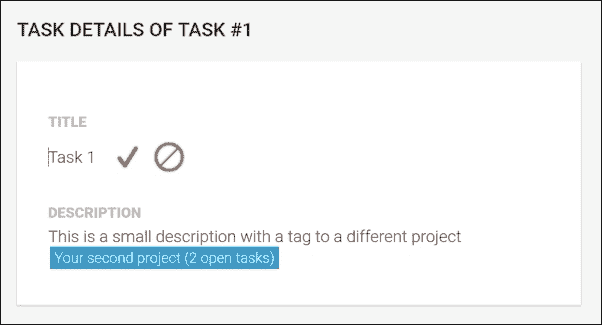
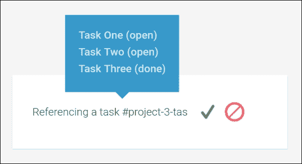
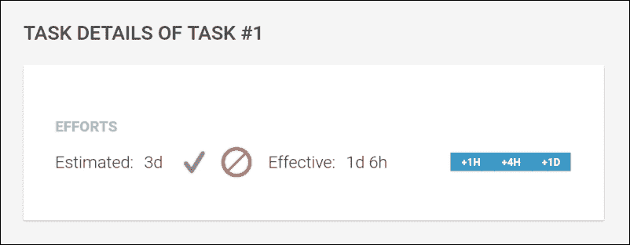
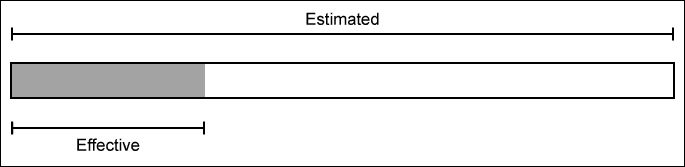
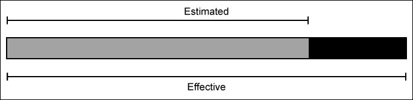
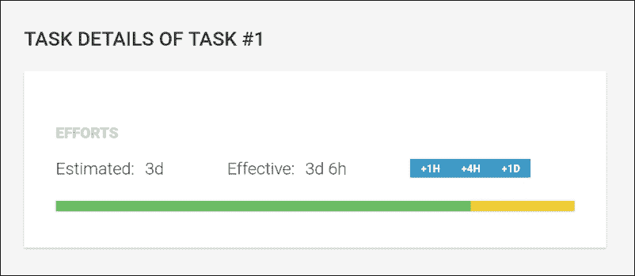
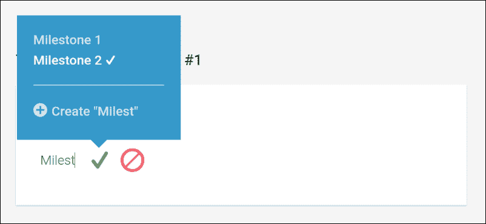

# 第八章. 时间会证明

我们的任务管理系统正在成形。然而，到目前为止，我们并未关注到管理项目的一个关键方面。时间在所有项目中都扮演着重要角色，这也是最复杂的管理事项之一。

在本章中，我们将向我们的任务管理系统添加一些功能，帮助用户更有效地管理时间。通过重用我们之前创建的一些组件，我们将能够提供一致的用户体验来管理时间。

在更高层次上，我们将开发以下功能以在我们的应用程序中实现时间管理：

+   **任务详情**：到目前为止，我们没有包括任务详情页面，因为所有关于任务的信息都可以在我们的项目页面上的任务列表中显示。虽然我们的时间管理将大大增加任务的复杂性，但我们将创建一个新的项目任务详情视图，它也将通过路由访问。

+   **努力管理**：我们将包括一些新的任务数据来管理任务上的努力。努力总是由估计的时间持续和实际花费的时间表示。我们将使努力的这两个属性都是可选的，以便它们可以独立存在。我们将创建新的组件，使用户能够轻松地提供时间持续时间输入。

+   **里程碑管理**：我们将包括一种管理项目里程碑的方法，并将它们映射到项目任务上。这将有助于我们后来对项目状态有一个全面的了解，并使用户能够将任务分组为更小的作业块。

本章将涵盖以下主题：

+   创建一个项目任务详情组件来编辑任务详情并启用新的路由

+   修改我们的标签管理系统以包含任务标签

+   创建新的管道来处理格式化时间持续时间

+   创建任务信息组件以在现有的任务组件上显示任务概述信息

+   创建一个时间持续时间输入组件，使用户能够轻松输入时间持续时间

+   创建一个 SVG 组件来显示任务进度

+   创建一个自动完成组件来管理任务上的里程碑

# 任务详情

到目前为止，我们的任务列表已经足够显示任务的所有详细信息。然而，随着我们在本章中为任务添加更多详细信息，是时候提供一个详情视图，让用户可以编辑任务了。

我们已经在本书的第五章，*组件化路由*中，使用路由器为项目导航奠定了基础。在项目中添加一个我们将使用的新可路由组件将变得轻而易举。

让我们在`project/project-task-details/project-task-details.js`路径下为我们的项目任务详情视图创建一个新的组件类：

```js
…
@Component({
  selector: 'ngc-project-task-details',
  …
})
export class ProjectTaskDetails {
  …
}
```

由于此组件在没有父`Project`组件的情况下将不存在，我们可以安全地依赖它来获取我们使用的数据。此组件在纯 UI 组合情况下不使用，因此不需要创建像我们在第五章“Component-Based Routing”中为其他组件创建的可路由包装组件。我们可以直接依赖路由参数，并从父`Project`组件中获取相关数据。

首先，我们使用依赖注入来获取父项目组件的引用：

```js
constructor(@Inject(forwardRef(() => Project)) project) {
 this.project = project; 
}
```

类似于我们的路由包装组件，我们利用父组件注入来获取父`Project`组件的引用。

现在，我们将再次使用路由器的`OnActivate`生命周期钩子来从活动路由段中获取任务编号：

```js
  routerOnActivate(currentRouteSegment) {
    const taskNr = currentRouteSegment.getParam('nr');
    this.projectChangeSubscription = this.project.document.change.subscribe((data) => {
      this.task = data.tasks.find((task) => task.nr === +taskNr);
      this.projectMilestones = data.milestones || [];
    });
  }
```

最后，我们将创建一个对`LiveDocument`项目的响应式订阅，这将提取我们关心的任务并将其存储到组件的`task`成员中。这样，我们确保当项目在当前任务详情视图之外更新时，我们的组件将始终接收到最新的任务数据。

如果我们的组件被销毁，我们需要确保我们取消订阅由`LiveDocument`项目提供的 RxJS `Observable`。让我们为此实现`ngOnDestroy`生命周期钩子：

```js
ngOnDestroy() {
 this.projectChangeSubscription.unsubscribe();
}
```

好的，现在让我们看看我们组件的模板，看看我们将如何处理任务数据以提供一个编辑详情的接口。我们将在新的`component`文件夹中创建一个`project-task-details.html`文件：

```js
<h3 class="task-details__title">
  Task Details of task #{{task?.nr}}
</h3>
<div class="task-details__content">
  <div class="task-details__label">Title</div>
  <ngc-editor [content]="task?.title"
 [showControls]="true"
 (editSaved)="onTitleSaved($event)"></ngc-editor>
  <div class="task-details__label">Description</div>
  <ngc-editor [content]="task?.description"
 [showControls]="true"
 [enableTags]="true"
 (editSaved)="onDescriptionSaved($event)">
  </ngc-editor>
</div>
```

重新使用我们在本书第四章“No Comments, Please!”中创建的`Editor`组件，我们可以依靠简单的 UI 组合来使我们的任务标题和描述可编辑。

由于我们将任务数据存储到我们的组件上的`task`成员变量中，我们可以引用`title`和`description`字段来创建一个绑定到我们的编辑组件的`content`输入属性。

虽然`title`应仅包含纯文本，但我们可以支持我们在第七章“Components for User Experience”中创建的标签功能，在任务的`description`字段上。为此，我们只需将描述`Editor`组件的`enableTags`输入属性设置为`true`。

`Editor`组件有一个`editSaved`输出属性，当用户保存其编辑时将发出更新后的内容。现在，我们只需要确保我们创建一个绑定到我们的组件，以持久化这些更改。让我们在我们的`Component`类上创建`onTitleSaved`和`onDescriptionSaved`方法来处理这些事件：

```js
onTitleSaved(title) {
 this.task.title = title;
 this.project.document.persist();
}

onDescriptionSaved(description) {
 this.task.description = description;
 this.project.document.persist();
}
```

任务成员只是对`Project`组件中的`LiveDocument`项目所给任务的参考。这简化了我们持久化任务上更改的数据的方式。在更新任务上的给定属性后，我们只需在`LiveDocument`项目上调用`persist`方法来将我们的更改存储在数据存储中。

到目前为止，一切顺利。我们创建了一个任务详情组件，使用我们的`Editor` UI 组件可以轻松编辑任务的标题和描述。我们唯一剩下要启用我们的组件的事情是在`Project`组件上创建一个子路由。让我们打开`lib/project/project.js`中的`Project`组件类，进行必要的修改：

```js
…
import {ProjectTaskDetails} from './project-task-details/project-task-details';

…
@Component({
  selector: 'ngc-project',
  …
})
@Routes([
 new Route({ path: 'task/:nr', component: ProjectTaskDetails}),
  …
])
export class Project {
  …
}
```

我们在`Project`组件上添加了一个新的子路由，该路由负责实例化我们的`ProjectTaskDetails`组件。通过在路由配置中包含一个`:nr`参数，我们可以将相关的任务编号传递给`ProjectTaskDetails`组件。

我们新创建的子路由现在可以在路由器中访问，我们可以使用`/projects/project-1/task/1`示例 URL 访问任务详情视图。

为了使我们的`TaskDetails`路由可导航，我们需要在我们的`Task`组件中添加一个导航链接，以便用户可以在项目任务列表中导航到它。

对于这个相对简单的任务，我们唯一需要做的事情是使用`RouterLink`指令在`Task`模板`lib/task-list/task/task.html`中创建一个新的链接：

```js
…
<div class="task__l-box-b">
  …
 <a [routerLink]="['../task', task?.nr]"
 class="button button--small">Details</a>
</div>
…
```

我们在这里使用相对路由 URL，因为我们已经在`/project/tasks`路由上。由于我们的`task/:nr`路由是项目路由的一部分，我们需要回退一级以访问`task`路由：



新创建的任务详情视图，具有可编辑的标题和描述

# 启用任务标签

到目前为止，我们在第七章中创建的标签管理系统，*用户体验组件*，仅支持项目标签。由于我们现在创建了一个任务详情视图，因此也直接在我们的标签系统中支持任务标签会很好。我们的标签系统非常灵活，我们可以以非常少的努力实现新的标签。在更高层次上，我们需要进行以下更改以在我们的系统中启用任务标签：

+   编辑`generate-tag.js`模块以支持从任务和项目数据生成任务标签

+   编辑`TagsService`以使用`generate-tag.js`模块和缓存初始化任务标签

让我们先修改`lib/tags/generate-tag.js`文件以启用任务标签生成：

```js
…
export const TAG_TYPE_TASK = 'task';

export function generateTag(subject) {
  if (subject.type === TAG_TYPE_PROJECT) {
    …
  } else if (subject.type === TAG_TYPE_TASK) {
    // If we're dealing with a task, we generate the according tag 
    // object
    return new Tag(
 `#${subject.project._id}-task-${subject.task.nr}`,
 `${limitWithEllipsis(subject.task.title, 20)} (${subject.task.done ? 'done' : 'open'})`,
 `#/projects/${subject.project._id}/task/${subject.task.nr}`,
 TAG_TYPE_TASK
 );
  }
}
```

由于我们需要同时引用项目数据和此项目的单个任务，我们期望`subject`参数看起来像以下对象：

```js
{task: …, project: …, type: TAG_TYPE_TASK}
```

从这个`subject`对象中，我们可以创建一个新的`Tag`对象。对于`textTag`字段，我们使用一个包含项目 ID 以及任务编号的结构。这样，我们可以使用简单的文本表示来唯一标识任务。

对于`link`字段，我们从项目以及任务编号构建一个 URL。这个字符串将解析为激活我们在上一节中配置的`TaskDetails`路由所需的 URL。

我们现在已准备好`generateTag`函数来创建任务标签。现在，我们系统中启用任务标签的唯一剩余操作是对`TagsService`类的修改。让我们打开`lib/tags/tags-service.js`文件并应用我们的更改：

```js
…
import {generateTag, TAG_TYPE_TASK} from './generate-tag';
…
@Injectable()
export class TagsService {
  …
  // This method is used internally to initialize all available 
  // tags
  initializeTags() {
    …
    // Let's also create task tags
    this.projects.forEach((project) => {
 this.tags = this.tags.concat(project.tasks.map((task) => {
 return {
 type: TAG_TYPE_TASK,
 project,
 task
 };
 }).map(generateTag));
 });
    …
  }
  …
}
```

在我们的`TagsService`类的`initializeTags`方法中，我们现在为项目中所有可用的任务添加任务`Tag`对象。首先，我们通过`generateTag`函数将每个项目任务映射到所需的`subject`对象。然后，我们可以简单地使用`generateTag`函数直接映射结果数组。结果是生成任务`Tag`对象的数组，然后我们将它们连接到`TagsService`类的`tags`列表中。

这并不太复杂，对吧？这个相对简单的更改为我们用户带来了巨大的改进。现在，他们可以在我们系统中任何我们启用了标签的地方引用单个任务：



显示新添加任务标签的编辑器组件

# 管理努力

在本节中，我们将创建一些组件，帮助我们跟踪努力。主要地，我们将使用这些组件来管理任务上的努力，但这可以应用于我们应用中的任何需要跟踪时间的部分。

在我们的语境中，努力总是由两个组成部分组成：

+   **预计持续时间**：这是对任务最初估计的持续时间

+   **有效持续时间**：这是在特定任务上花费的时间长度

对于时间长度，我们假设一些时间单位和规则，这将简化时间的处理并符合某些工作标准。这里的目的是不提供锐利的时管理，而是提供足够准确以带来价值的东西。为此，我们定义以下工作时间单位：

+   **分钟**：一分钟是标准的 60 秒

+   **小时**：一小时总是代表 60 分钟

+   **天**：一天代表一个标准的工作日，八小时

+   **周**：一周相当于五个工作日（5 * 8 小时）

## 时间持续时间输入

现在，我们可以开始编写一个复杂的用户界面组件，用户可以在不同的输入元素中输入单独的时间单位。然而，我相信用无 UI 方法处理时间持续时间输入会更方便。因此，我们不必构建复杂的用户界面，而可以简单地约定一个文本简写形式来编写持续时间，并让用户输入一些内容，例如`1.5d`或`5h 30m`，以提供输入。按照我们之前建立的约定，我们可以构建一个简单的解析器来处理这种输入。

这种方法有几个优点。除此之外，这也是输入时间持续的最有效方法之一，而且对我们来说也很容易实现。我们可以简单地重用我们的`Editor`组件来收集用户的文本输入。然后，我们使用一个转换过程来解析输入的时间持续时间。

让我们启动一个新的模块，帮助我们处理这些转换。我们在`lib/utilities/time-utilities.js`文件中创建一个新的模块。

首先，我们需要一个常量来定义我们需要的所有转换单位：

```js
export const UNITS = [{
  short: 'w',
  milliseconds: 5 * 8 * 60 * 60 * 1000
}, {
  short: 'd',
  milliseconds: 8 * 60 * 60 * 1000
}, {
  short: 'h',
  milliseconds: 60 * 60 * 1000
}, {
  short: 'm',
  milliseconds: 60 * 1000
}];
```

这是我们目前需要处理的全部单位。您可以看到在解释时计算的毫秒数。我们也可以将毫秒数写成常量，但这为我们提供了如何得到这些值的透明度，并且我们可以添加一些注释。

让我们看看我们的解析函数，我们可以用它将文本输入解析为时间持续时间：

```js
export function parseDuration(formattedDuration) {
  const pattern = /[\d\.]+\s*[wdhm]/g;
  let timeSpan = 0;
  let result;
  while (result = pattern.exec(formattedDuration)) {
    const chunk = result[0].replace(/\s/g, '');
    let amount = Number(chunk.slice(0, -1));
    let unitShortName = chunk.slice(-1);
    timeSpan += amount * UNITS.find(
      (unit) => unit.short === unitShortName
    ).milliseconds;
  }
  return +timeSpan || null;
}
```

让我们简要分析一下前面的代码，以解释我们在这里做了什么：

1.  首先，我们定义一个正则表达式，帮助我们分解持续时间文本表示。这个模式将提取文本输入中的重要部分，用于计算文本表示背后的持续时间。这些部分总是由一个数字后面跟着`w`、`d`、`h`或`m`组成。因此，文本`10w 3d 2h 30m`将被分割成`10w`、`3d`、`2h`和`30m`这些部分。

1.  我们将`timeSpan`变量初始化为`0`，这样我们就可以将发现的块中的所有毫秒数加在一起，然后返回这个总和。

1.  对于之前提取的每个部分，我们现在将数字组件提取到一个名为`amount`的变量中，将单位（`w`、`d`、`h`或`m`）提取到一个名为`unitShortName`的变量中。

1.  现在，我们可以查找`UNITS`常量中的数据，为我们将要处理的块的单位，将单位的毫秒数乘以我们从块中提取的量，然后将这个结果加到我们的`timeSpan`变量中。

好吧，这是我们构建的一个相当整洁的函数。它接受一个格式化的时间持续时间字符串，并将其转换为毫秒。这已经是我们需要处理文本表示的时间持续期的半部分了。第二部分是`parseDuration`函数的相反，将毫秒持续时间转换为格式化的持续时间字符串：

```js
export function formatDuration(timeSpan) {
  return UNITS.reduce((str, unit) => {
    const amount = timeSpan / unit.milliseconds;
    if (amount >= 1) {
      const fullUnits = Math.floor(amount);
      const formatted = `${str} ${fullUnits}${unit.short}`;
      timeSpan -= fullUnits * unit.milliseconds;
      return formatted;
    } else {
      return str;
    }
  }, '').trim();
}
```

让我们也简要解释一下`formatDuration`函数的作用：

+   我们使用`Array.prototype.reduce`函数来格式化包含所有时间单位和它们数量的字符串。我们从`UNITS`常量中的最大单位（周）开始，遍历所有可用的时间单位。

+   然后，我们将以毫秒为单位的`timeSpan`变量除以单位的毫秒数，得到给定单位的数量。

+   如果数量大于或等于 1，我们可以将给定的数量和单位简称添加到我们的格式化字符串中。

+   由于在数量的小数点后可能留下一些分数，我们需要将这些分数编码到更小的单位中，所以我们从`timeSpan`中减去我们数量的向下取整版本，然后再返回到`reduce`函数。

+   这个过程会为每个单位重复，其中每个单位只有在数量大于或等于 1 时才会提供格式化输出。

这就是我们需要的所有内容，可以将格式化时间长度和以毫秒表示的时间长度相互转换。

在我们创建实际的时间长度输入组件之前，我们还将做一件事。我们将创建一个简单的管道，它基本上只是包装我们的`formatTime`函数。为此，我们将创建一个新的`lib/pipes/format-duration.js`文件：

```js
import {Pipe, Inject} from '@angular/core';
import {formatDuration} from '../utilities/time-utilities';

@Pipe({
  name: 'formatDuration'
})
export class FormatDurationPipe {
  transform(value) {
    if (value == null || typeof value !== 'number') {
      return value;
    }

 return formatDuration(value);
  }
}
```

使用我们的`time-utilities`模块中的`formatTime`函数，我们现在可以直接在我们的模板中以毫秒为单位格式化持续时间。

## 管理努力的组件

好的，现在我们已经有了足够的时间数学知识。现在让我们使用我们创建的元素来构建一些组件，这些组件将帮助我们收集用户输入。

在本节中，我们将创建两个组件来管理努力：

+   `持续时间`: `持续时间`组件是一个简单的 UI 组件，它允许用户使用我们在前几节中处理过的格式化时间字符串输入时间长度。它使用`Editor`组件来启用用户输入，并使用`FormatTimePipe`管道以及`parseDuration`实用函数。

+   `努力`: `努力`组件只是两个`持续时间`组件的组合，这两个组件分别表示给定任务上的估计努力和实际花费的努力。遵循严格的组合规则，这个组件对我们来说很重要，这样我们就不需要重复自己，而是组合一个更大的组件。

让我们从`Duration`组件类开始，并创建一个新的`lib/ui/duration/duration.js`文件：

```js
…
import {FormatDurationPipe} from '../../pipes/format-duration';
import {Editor} from '../../ui/editor/editor';
import {parseDuration} from '../../utilities/time-utilities';

@Component({
  selector: 'ngc-duration',
  …
  directives: [Editor],
 pipes: [FormatDurationPipe]
})
export class Duration {
  @Input() duration;
 @Output() durationChange = new EventEmitter();

 onEditSaved(formattedDuration) {
 this.durationChange.next(formattedDuration ? 
 parseDuration(formattedDuration) : null);
 }
}
```

这个组件实际上并没有什么特别之处，因为我们已经创建了大部分逻辑，我们只是将一个高级组件组合在一起。

作为`duration`输入，我们期望一个以毫秒为单位的时间长度，而`durationChange`输出属性将在用户提供输入时发出事件。

`onEditSaved`方法用于将我们的组件与`编辑器`组件绑定。每当用户在`编辑器`组件上保存其编辑时，我们将获取此输入，使用`parseDuration`函数将格式化的时长转换为毫秒，并使用`durationChange`输出属性重新发出转换后的值。

让我们看看我们的组件模板，在`lib/ui/duration/duration.html`文件中：

```js
<ngc-editor [content]="duration | formatDuration"
            [showControls]="true"
            (editSaved)="onEditSaved($event)"></ngc-editor>
```

对我们的模板如此简单感到惊讶吗？好吧，这正是我们在建立了良好的基础组件之后，应该通过更高组件实现的目标。良好的组织结构极大地简化了我们的代码。我们在这里唯一处理的是我们那熟悉的`编辑器`组件。

我们将我们的`时长`组件的`duration`输入属性绑定到`编辑器`组件的内容输入属性。由于我们希望传递格式化的时长而不是毫秒数，我们在绑定表达式中使用`FormatDurationPipe`管道进行转换。

如果`编辑器`组件通知我们已保存的编辑，我们将在我们的`时长`组件上调用`onEditSaved`方法，该方法将解析输入的时长并重新发出结果值。

由于我们最初定义所有努力都包括估计时长和有效时长，我们现在想创建另一个组件，该组件结合这两个时长。

让我们在`lib/efforts/efforts.html`路径上创建一个新的`Efforts`组件，从一个新的模板开始：

```js
<div class="efforts__label">Estimated:</div>
<ngc-duration [duration]="estimated"
 (durationChange)="onEstimatedChange($event)">
</ngc-duration>
<div class="efforts__label">Effective:</div>
<ngc-duration [duration]="effective"
 (durationChange)="onEffectiveChange($event)">
</ngc-duration>
<button class="button button--small" 
        (click)="addEffectiveHours(1)">+1h</button>
<button class="button button--small" 
        (click)="addEffectiveHours(4)">+4h</button>
<button class="button button--small" 
        (click)="addEffectiveHours(8)">+1d</button>
```

首先，我们添加两个标记为`Duration`的组件，其中第一个用于收集估计时间的输入，而后者用于有效时间。

此外，我们还提供了三个小按钮，通过简单的点击来增加有效时长。这样，用户可以快速增加一或四小时（半个工作日）或完整的工作日（我们定义为八小时）。

看一下`Component`类，不应该有任何惊喜。让我们打开`lib/efforts/efforts.js`组件类文件：

```js
…
import {Duration} from '../ui/duration/duration'; 
import {UNITS} from '../utilities/time-utilities';

@Component({
  selector: 'ngc-efforts',
  …
 directives: [Duration]
})
export class Efforts {
  @Input() estimated;
 @Input() effective;
 @Output() effortsChange = new EventEmitter();

  onEstimatedChange(estimated) {
    this.effortsChange.next({
 estimated,
 effective: this.effective
 });
  }

  onEffectiveChange(effective) {
    this.effortsChange.next({
 effective,
 estimated: this.estimated
 });
  }

 addEffectiveHours(hours) {
 this.effortsChange.next({
 effective: (this.effective || 0) + 
 hours * UNITS.find((unit) => unit.short === 'h'),
 estimated: this.estimated
 });
 }
}
```

该组件提供了两个单独的输入，用于估计和有效时间时长（以毫秒为单位）。如果您再次查看组件模板，这些输入属性直接绑定到`时长`组件的输入属性。

`onEstimatedChange`和`onEffectiveChange`方法用于创建到`时长`组件的`durationChange`输出属性的绑定。我们在这里所做的一切就是发出一个包含有效时间和估计时间（以毫秒为单位）的聚合数据对象，使用`effortsChange`输出属性。

在`addEffectiveHours`方法中，我们简单地发出一个`effortsChange`事件，并通过计算出的毫秒数更新有效属性。我们使用来自`time-utilities`模块的`UNITS`常量来获取小时的毫秒数。

为了提供用户输入来管理任务上的努力，我们需要这些所有信息。为了完成这个主题，我们将把新创建的`Efforts`组件添加到`ProjectTaskDetail`组件中，以便管理任务上的努力。

让我们首先查看位于`lib/project/project-task-detail/project-task-detail.js`的`Component`类中的代码更改：

```js
…
import {Efforts} from '../../efforts/efforts';

@Component({
  selector: 'ngc-project-task-details',
  …
  directives: [Editor, Efforts]
})
export class ProjectTaskDetails {
  …
 onEffortsChange(efforts) {
 if (!efforts.estimated && !efforts.effective) {
 this.task.efforts = null;
 } else {
 this.task.efforts = efforts;
 }
 this.project.document.persist();
 }
  …
}
```

除了将`Efforts`组件添加到我们的`ProjectTaskDetail`组件的`directives`列表中，我们还添加了一个新的`onEffortsChange`方法来处理`Efforts`组件提供的输出。

如果既未设置估计和实际努力，或设置为`0`，我们将任务努力设置为`null`。否则，我们使用`Efforts`组件的输出数据并将其分配为我们新的任务努力。

在更改任务努力后，我们以与标题和描述更新相同的方式持久化项目的`LiveDocument`。

让我们检查位于`lib/project/project-task-detail/project-task-detail.html`的组件模板中的更改：

```js
…
<div class="task-details__content">
  …
  <div class="task-details__label">Efforts</div>
 <ngc-efforts [estimated]="task?.efforts?.estimated"
 [effective]="task?.efforts?.effective"
 (effortsChange)="onEffortsChange($event)">
 </ngc-efforts>
</div>
```

我们将`Efforts`组件的估计和实际输入属性绑定到`ProjectTaskDetail`组件的任务数据中。对于`effortsChange`输出属性，我们使用一个表达式来调用我们刚刚创建的`onEffortsChange`方法：



我们的新`Efforts`组件由两个持续时间输入组件组成

## 视觉上的努力时间线

尽管我们迄今为止创建的用于管理努力的组件提供了编辑和显示努力和时间持续的好方法，但我们仍然可以通过一些视觉指示来改进这一点。

在本节中，我们将使用 SVG 创建一个视觉上的努力时间线。此时间线应显示以下信息：

+   总估计持续时间作为一个灰色背景条

+   总实际持续时间作为一个绿色条，它覆盖在总估计持续时间条上

+   一个显示任何加班（如果实际持续时间大于估计持续时间）的黄色条

下面的两个图示说明了我们的努力时间线组件的不同视觉状态：



当估计持续时间大于实际持续时间时的视觉状态



当实际持续时间超过估计持续时间时的视觉状态（加班显示为黑色条）

让我们在`lib/efforts/efforts-timeline/efforts-timeline.js`路径上创建一个新的`EffortsTimeline`组件类，以具体化我们的组件：

```js
…
@Component({
  selector: 'ngc-efforts-timeline',
  …
})
export class EffortsTimeline {
 @Input() estimated;
 @Input() effective;
 @Input() height;

  ngOnChanges(changes) {
 this.done = 0;
 this.overtime = 0;

    if (!this.estimated && this.effective || 
        (this.estimated && this.estimated === this.effective)) {
      // If there's only effective time or if the estimated time 
      // is equal to the effective time we are 100% done
 this.done = 100;
    } else if (this.estimated < this.effective) {
      // If we have more effective time than estimated we need to 
      // calculate overtime and done in percentage
 this.done = this.estimated / this.effective * 100;
 this.overtime = 100 - this.done;
    } else {
      // The regular case where we have less effective time than 
      // estimated
 this.done = this.effective / this.estimated * 100;
    }  
  }
}
```

我们的组件有三个输入属性：

+   `estimated`：这是估计时间持续时间的毫秒数

+   `effective`：这是实际时间持续时间的毫秒数

+   `height`：这是努力时间线期望的高度，以像素为单位

在`OnChanges`生命周期钩子中，我们设置了两个基于估计和实际时间的组件成员字段：

+   `done`：这包含显示没有超过估算持续时间的有效持续时间的绿色条宽度百分比

+   `overtime`：这包含显示任何加班的黄色条宽度百分比，任何超过估算持续时间的持续时间

让我们看看`EffortsTimeline`组件的模板，看看我们如何现在使用`done`和`overtime`成员字段来绘制我们的时间线。

我们将创建一个新的`lib/efforts/efforts-timeline/efforts-timeline.html`文件：

```js
<svg width="100%" [attr.height]="height">
  <rect [attr.height]="height"
        x="0" y="0" width="100%"
        class="efforts-timeline__remaining"></rect>
  <rect *ngIf="done" x="0" y="0" 
        [attr.width]="done + '%'" [attr.height]="height"
        class="efforts-timeline__done"></rect>
  <rect *ngIf="overtime" [attr.x]="done + '%'" y="0"
 [attr.width]="overtime + '%'" [attr.height]="height"
        class="efforts-timeline__overtime"></rect>
</svg>
```

我们的模板是基于 SVG 的，它包含我们想要显示的每个条的三个矩形。如果有剩余的努力，将始终显示背景条形图。

在剩余的条形图上方，我们使用从我们的组件类计算出的宽度有条件地显示完成和加班条形图。

现在，我们可以继续在我们的`Efforts`组件中包含`EffortsTimeline`类。这样，当我们的用户编辑估算或实际持续时间时，他们将获得视觉反馈，这为他们提供了一个概览。

让我们看看`Efforts`组件的模板，看看我们如何集成时间线：

```js
…
<ngc-efforts-timeline height="10"
 [estimated]="estimated"
 [effective]="effective">
</ngc-efforts-timeline>
```

由于我们在`Efforts`组件中已经有了估算和实际持续时间，我们可以简单地创建一个绑定到`EffortsTimeline`组件输入属性：



显示我们新创建的努力时间线组件的`Efforts`组件（六小时的加班用黄色条可视化）

## 努力管理的总结

在本节中，我们将创建允许用户轻松管理努力并为我们任务添加简单但强大的时间跟踪的组件。我们已经做了以下事情来实现这一点：

+   我们实现了一些实用函数来处理时间数学，以便将毫秒时间段转换为格式化时间段，反之亦然

+   我们创建了一个管道，使用我们的实用函数格式化以毫秒为单位的时间段

+   我们创建了一个`Duration` UI 组件，它包装了一个`Editor`组件，并使用我们的时间实用工具提供了一个无 UI 类型的输入元素来输入持续时间

+   我们创建了一个`Efforts`组件，它作为两个`Duration`组件的组合，用于估算和实际时间，并提供额外的按钮来快速添加实际花费的时间

+   我们将`Efforts`组件集成到`ProjectTaskDetail`组件中，以便在任务上管理努力

+   我们使用 SVG 创建了一个可视的`EffortsTimeline`组件，它显示任务的总体进度

# 设置里程碑

跟踪时间很重要。我不知道你对时间的看法如何，但我在组织时间方面真的很差。尽管很多人问我如何做到这么多事情，但我相信我实际上在管理如何完成这些事情方面真的很差。如果我能成为一个更好的组织者，我可以用更少的精力完成事情。

总有一件事能帮助我组织自己，那就是将事情分解成更小的工作包。使用我们任务管理应用程序来组织自己的用户可以通过在项目中创建任务来实现这一点。虽然项目是整体目标，但我们可以创建更小的任务来实现这个目标。然而，有时我们只专注于任务时，往往会失去对整体目标的关注。

里程碑是项目和任务之间完美的粘合剂。它们确保我们将任务捆绑成更大的包。这将极大地帮助我们组织任务，并且我们可以查看项目的里程碑来了解项目的整体健康状况。然而，当我们以里程碑的上下文工作时，我们仍然可以专注于任务。

在本节中，我们将创建必要的组件，以便将基本里程碑功能添加到我们的应用程序中。

为了在我们的应用程序中实现里程碑功能，我们将坚持以下设计决策：

+   里程碑应存储在项目级别，并且任务可以包含对项目里程碑的可选引用。

+   为了保持简单，与里程碑的唯一交互点应该在任务级别。因此，里程碑的创建将在任务级别完成，尽管创建的里程碑将存储在项目级别。

+   目前里程碑仅包含一个名称。我们可以在系统中构建更多关于里程碑的内容，例如截止日期、依赖关系和其他美好的事物。然而，我们将坚持最基本的原则，即里程碑名称。

## 创建自动完成组件

为了保持里程碑管理的简单性，我们将创建一个新的用户界面组件来处理我们列出的设计问题。我们的新自动完成组件不仅会显示可供选择的可能值，而且还会允许我们创建新项目。然后我们可以简单地使用这个组件在我们的`ProjectTaskDetail`组件上，以便管理里程碑。

让我们来看看我们将在`lib/ui/auto-complete/auto-complete.js`文件中创建的新自动完成组件的`Component`类：

```js
…
import {Editor} from '../editor/editor';

@Component({
  selector: 'ngc-auto-complete',
  …
 directives: [Editor]
})
export class AutoComplete {
 @Input() items;
 @Input() selectedItem;
 @Output() selectedItemChange = new EventEmitter();
 @Output() itemCreated = new EventEmitter();
  …
}
```

再次强调，我们的`Editor`组件可以被重用来创建这个高级组件。我们很幸运地创建了一个如此好的组件，因为它在这个项目中节省了我们大量的时间。

让我们更详细地看看`AutoComplete`组件的输入和输出属性：

+   `items`：这是我们期望的字符串数组。这将是在编辑器中输入时用户可以选择的项目列表。

+   `selectedItem`：这是我们将选中的项目作为一个输入属性来使这个组件成为纯组件的时候，并且我们可以依赖父组件来设置这个属性。

+   `selectedItemChange`：这个输出属性会在选中的项目发生变化时触发事件。由于我们在这里创建了一个纯组件，我们需要以某种方式传播在自动完成列表中选中的项目的相关事件。

+   `itemCreated`：如果向自动完成列表添加了新项，此输出属性将发出事件。更新项目列表和更改组件`items`输入属性仍然是父组件的责任。

让我们在组件中添加更多代码。我们使用`Editor`组件作为主要输入源。当我们的用户在编辑器中键入时，我们使用编辑器的文本输入来过滤可用的项。让我们为此创建一个`filterItems`：

```js
filterItems(filter) {
 this.filter = filter || '';
 this.filteredItems = this.items
 .filter(
 (item) => item
 .toLowerCase()
 .indexOf(this.filter.toLowerCase().trim()) !== -1)
 .slice(0, 10);
  this.exactMatch = this.items.includes(this.filter);
}
```

`filterItems`方法有一个单一参数，即我们想要用于在列表中搜索相关项的文本。

让我们更详细地看看该方法的内容：

+   为了在模板中使用，我们将保存上一次调用此方法时使用的过滤查询。

+   在`filteredItems`成员变量中，我们将通过搜索过滤字符串的文本出现来存储项目列表的过滤版本。

+   作为最后一步，我们还存储了搜索查询是否导致我们的列表中某个项的精确匹配的信息

现在，我们需要确保如果`items`或`selectedItem`输入属性发生变化，我们也再次执行我们的过滤方法。为此，我们简单地实现了`ngOnChanges`生命周期钩子：

```js
ngOnChanges(changes) {
  if (this.items && this.selectedItem) {
 this.filterItems(this.selectedItem);
  }
}
```

现在我们来看看我们如何处理`Editor`组件提供的事件：

```js
onEditModeChange(editMode) {
  if (editMode) {
    this.showCallout = true;
 this.previousSelectedItem = this.selectedItem;
  } else {
 this.showCallout = false;
  }
}
```

如果编辑器切换到编辑模式，我们希望保存之前选中的项。如果用户决定取消他的编辑并切换回之前的项，我们将需要这样做。当然，这也是我们需要向用户显示自动完成列表的地方。

另一方面，如果将编辑模式切换回阅读模式，我们希望再次隐藏自动完成列表：

```js
onEditableInput(content) {
 this.filterItems(content);
}
```

`editableInput`事件在每次编辑器输入更改时由我们的编辑器触发。该事件为我们提供了用户输入的文本内容。如果发生此类事件，我们需要再次使用更新的过滤查询执行我们的过滤函数：

```js
onEditSaved(content) {
  if (content === '') {
 this.selectedItemChange.next(null);
  } else if (content !== this.selectedItem && 
             !this.items.includes(content)) {
 this.itemCreated.next(content);
  }
}
```

当我们的编辑器触发`editSaved`事件时，我们需要决定是否应该执行以下操作之一：

+   如果保存的内容是空字符串，则使用`selectedItemChange`输出属性发出事件，向父组件信号已删除选定的项。

+   如果提供了有效内容并且我们的列表中不包含具有该名称的项，则使用`itemCreated`输出属性发出事件，以信号项的创建：

    ```js
    onEditCanceled() {
     this.selectedItemChange.next(this.previousSelectedItem);
    }
    ```

在`Editor`组件的`editCanceled`事件上，我们希望切换回之前选中的项。为此，我们可以简单地使用`selectedItemChange`输出属性和我们在编辑器切换到编辑模式后留出的`previousSelectedItem`成员来发出一个事件。

这些是我们将用于连接我们的编辑器并将自动完成功能附加到其上的所有绑定函数。

在我们查看自动完成组件的模板之前，我们将创建两个更简单的其他方法：

```js
selectItem(item) {
 this.selectedItemChange.next(item);
}

createItem(item) {
 this.itemCreated.next(item);
}
```

我们将使用这两个用于模板中自动完成提示的点击操作。让我们看一下模板，以便你可以看到我们刚刚创建的所有代码的实际效果：

```js
<ngc-editor [content]="selectedItem"
            [showControls]="true"
            (editModeChange)="onEditModeChange($event)"
 (editableInput)="onEditableInput($event)"
 (editSaved)="onEditSaved($event)"
 (editCanceled)="onEditCanceled($event)"></ngc-editor>
```

首先，放置`Editor`组件，并将我们创建的`Component`类中的处理方法所需的所有绑定附加到它上。

现在，我们将创建一个自动完成列表，它将作为用户在编辑器输入区域旁边的提示显示：

```js
<ul *ngIf="showCallout" class="auto-complete__callout">
  <li *ngFor="let item of filteredItems"
      (click)="selectItem(item)"
      class="auto-complete__item"
      [class.auto-complete__item--selected]="item === selectedItem">{{item}}</li>
  <li *ngIf="filter && !exactMatch"
      (click)="createItem(filter)"
      class="auto-complete__item auto-complete__item--create">Create "{{filter}}"</li>
</ul>
```

我们依赖于`Component`类的`onEditModeChange`方法设置的`showCallout`成员变量，以表示是否应该显示自动完成列表。

然后，我们使用`NgFor`指令遍历所有过滤后的项目，并渲染每个项目的文本内容。如果点击了某个项目，我们将调用我们的`selectItem`方法，并将相关项目作为参数值。

作为最后一个列表元素，在重复的列表项之后，我们条件性地显示一个额外的列表元素，以创建一个不存在的里程碑。我们仅在存在有效的过滤器且过滤器与现有里程碑没有精确匹配时显示此按钮：



我们的里程碑组件与编辑器组件配合得很好，使用干净的组合方式。

现在我们已经完成了自动完成组件，为了管理项目里程碑，我们唯一需要做的就是将其用于`ProjectTaskDetails`组件中。

让我们打开位于`lib/project/project-task-details/project-task-details.js`中的`Component`类，并应用必要的修改：

```js
…
import {AutoComplete} from '../../ui/auto-complete/auto-complete';

@Component({
  selector: 'ngc-project-task-details',
  …
  directives: […, AutoComplete]
})
export class ProjectTaskDetails {
  constructor(@Inject(forwardRef(() => Project)) project, {
    …
    this.projectChangeSubscription = this.project.document.change.subscribe((data) => {
      …
 this.projectMilestones = data.milestones || [];
    });
  }
  …
 onMilestoneSelected(milestone) {
 this.task.milestone = milestone;
 this.project.document.persist();
 }

 onMilestoneCreated(milestone) {
 this.project.document.data.milestones = this.project.document.data.milestones || [];
 this.project.document.data.milestones.push(milestone);
 this.task.milestone = milestone;
 this.project.document.persist();
 }
  …
}
```

在项目更改的订阅中，我们现在还提取任何现有的项目里程碑，并将它们存储在`projectMilestones`成员变量中。这使得在模板中引用它们更容易。

`onMilestoneSelected`方法将被绑定到`AutoComplete`组件的`selectItemChange`输出属性上。我们使用`AutoComplete`组件发出的值来设置我们的任务里程碑，并使用其`persist`方法持久化`LiveDocument`项目。

`onMilestoneCreated`方法将被绑定到`AutoComplete`组件的`itemCreated`输出属性上。在这种情况下，我们将创建的里程碑添加到项目的里程碑列表中，并将当前任务分配给创建的里程碑。更新`LiveDocument`数据后，我们使用`persist`方法保存所有更改。

让我们查看`lib/project/project-task-details/project-task-details.html`，以查看模板中必要的更改：

```js
…
<div class="task-details__content">
  …
  <ngc-auto-complete [items]="projectMilestones"
 [selectedItem]="task?.milestone"
 (selectedItemChange)="onMilestoneSelected($event)"
 (itemCreated)="onMilestoneCreated($event)">
  </ngc-auto-complete>
</div>
```

除了你已经知道的输出属性绑定之外，我们还为`AutoComplete`组件的`items`和`selectedItem`输入属性创建了两个输入绑定。

这就是全部了。我们创建了一个新的 UI 组件，提供了自动完成功能，并使用该组件在我们的任务中实现了里程碑管理。

使用具有适当封装的组件实现新功能突然变得如此简单，这不是很好吗？面向组件的开发的好处在于，你为新的功能开发时间随着你已创建的可重用组件的数量而减少。

# 摘要

在本章中，我们实现了一些帮助用户跟踪时间的组件。现在，他们可以在任务上记录努力，并在项目上管理里程碑。我们创建了一个新的任务详情视图，可以通过任务列表上的导航链接访问。

再次，我们体验到了使用组件进行组合的力量，通过重用现有组件，我们能够轻松实现提供更复杂功能的高级组件。

在下一章中，我们将探讨如何使用图表库 Chartist 并创建一些包装组件，使我们能够构建可重用的图表。我们将为我们的任务管理系统构建一个仪表板，在那里我们将看到我们的图表组件的实际应用。
