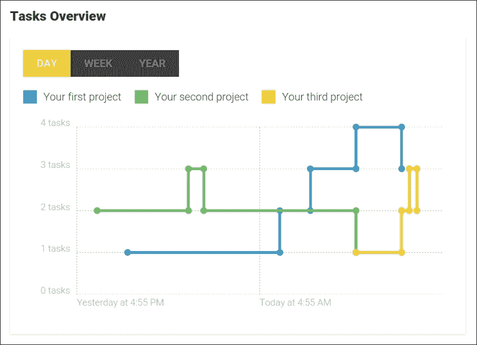
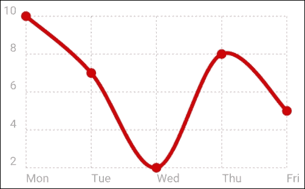
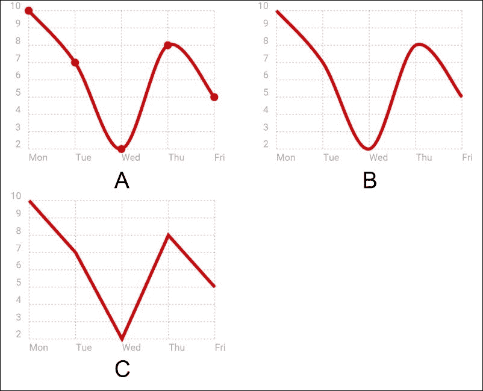
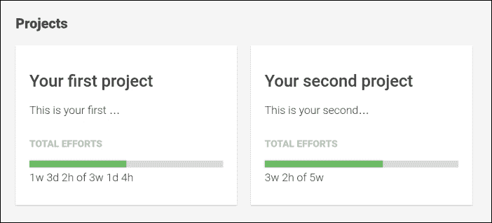
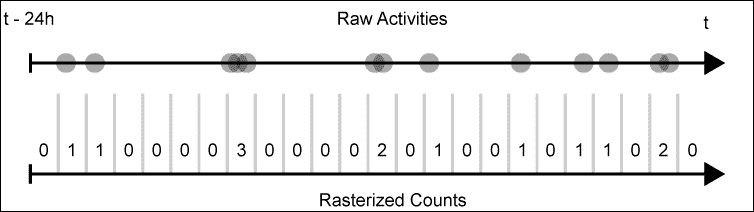
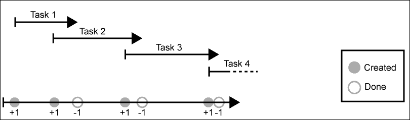
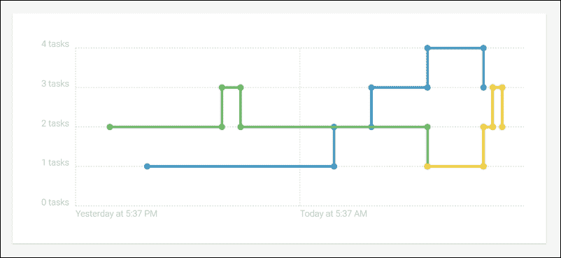
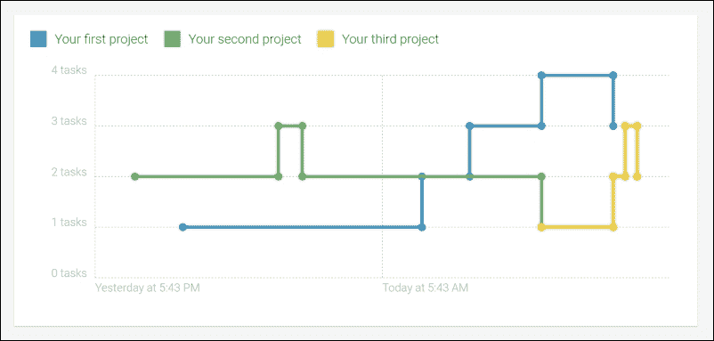

# 第九章。太空船仪表盘

当我还是个孩子的时候，我喜欢扮演太空船飞行员。我把一些旧的纸箱堆叠起来，并装饰内部使其看起来像太空船驾驶舱。我用记号笔在纸箱的内侧画了一个太空船仪表盘，我记得我在那里玩了好几个小时。

舰桥和太空船仪表盘的设计特别之处在于，它们需要在非常有限的空间内提供对整个太空船的概述和控制。我认为这同样适用于应用程序仪表盘。仪表盘应该为用户提供对正在发生的事情的整体概述和感知。

在本章中，我们将为我们的任务管理应用程序创建这样一个仪表盘。我们将利用开源图表库 Chartist 创建外观美观的响应式图表，并提供对开放任务和项目状况的概述：



我们将在本章的进程中预览将要构建的任务图表

在更高层次上，在本章中我们将创建以下组件：

+   **项目摘要**：这是提供对整体项目状况快速洞察的项目摘要。通过聚合所有包含任务的努力，我们可以提供一个很好的整体努力状态，为此我们在上一章中创建了组件。

+   **项目活动图表**：没有标签或刻度，这个条形图将只给出过去 24 小时内项目活动的快速感知。

+   **项目任务图表**：此图表提供了项目任务进度的概述。我们将使用折线图显示一定时间内的开放任务数量。利用我们在本书第二章中创建的 Toggle 组件，我们将为用户提供一种简单的方法来切换图表上显示的时间范围。

# Chartist 简介

在本章中，我们将创建一些可以渲染图表的组件，并且我们应该寻找一些帮助来渲染它们。当然，我们可以遵循我们在第六章中采取的类似方法，即*跟上活动*，当时我们绘制了我们的活动时间线。然而，当涉及到更复杂的数据可视化时，最好依赖于库来完成繁重的工作。

我们将使用 Chartist 来填补这个空缺并不令人惊讶，因为我几乎花了两年时间来编写它。作为 Chartist 的作者，我感到非常幸运，我们在这本书中找到了一个完美的位置来利用它。

在我们深入到仪表板组件的实现之前，我想借此机会简要地向您介绍 Chartist。

Chartist 的承诺很简单，即简单响应式图表，幸运的是，在存在了三年之后，这仍然是事实。我可以告诉你，维护这个库最困难的工作可能是保护它免受功能膨胀的影响。开源社区中有许多伟大的运动、技术和想法，抵制并始终专注于最初的承诺并不容易。

让我给你一个非常基本的例子，看看你如何在网站上包含 Chartist 脚本后创建一个简单的折线图：

```js
const chart = new Chartist.Line('#chart', {
labels: ['Mon', 'Tue', 'Wed', 'Thu', 'Fri'],
series: [
    [10, 7, 2, 8, 5]
  ]
});
```

为此示例所需的相应 HTML 标记看起来如下所示：

```js
<body>
<div id="chart" class="ct-golden-section"></div>
</body>
```

以下图表展示了由 Chartist 生成的结果图表：



使用 Chartist 生成的简单折线图

我认为，通过说我们一直在坚持我们的简单承诺，我们并没有承诺太多。

让我们来看看 Chartist 的第二个核心关注点，即完美响应。嗯，让我们从我在前端开发中最欣赏的一个原则开始，那就是关注点的分离。Chartist 尽可能地遵循这个原则，这意味着它使用 CSS 来控制外观，SVG 来构建基本的图形结构，以及 JavaScript 来实现任何行为。仅仅通过遵循这个原则，我们已经实现了很多响应性。我们可以使用 CSS 媒体查询来为不同媒体上的图表应用不同的样式。

虽然 CSS 对于视觉样式来说很棒，但在渲染图表的过程中有许多元素不能仅仅通过样式来控制。毕竟，这就是我们为什么使用 JavaScript 库来渲染图表的原因。

那么，如果我们没有在 CSS 中控制 Chartist 在不同媒体上渲染图表的方式，我们该如何控制呢？嗯，Chartist 提供了一种称为响应式配置覆盖的功能。通过使用浏览器的 `matchMedia` API，Chartist 能够提供一个配置机制，允许您指定在某些媒体上要覆盖的选项。

让我们看看如何通过移动优先的方法轻松实现响应性行为的一个简单示例：

```js
const chart = new Chartist.Line('#chart', {
labels: ['Mon', 'Tue', 'Wed', 'Thu', 'Fri'],
series: [
    [10, 7, 2, 8, 5]
  ]
}, {
showPoint: true,
showLine: true
}, [
 ['screen and (min-width: 400px)', {
showPoint: false
 }],
 ['screen and (min-width: 800px)', {
lineSmooth: false
 }]
]);
```

在这里，`Chartist.Line` 构造函数的第二个参数设置了初始选项；我们可以将带有媒体查询的覆盖选项作为构造函数的第三个参数提供一个数组。在这个例子中，我们将覆盖宽度大于 400 像素的任何媒体的 `showPoint` 选项。宽度大于 800 像素的媒体将接收到 `showPoint` 覆盖以及 `lineSmooth` 覆盖。

我们不仅可以通过指定真实的媒体查询来触发设置更改，还可以使用与 CSS 非常相似的覆盖机制。这样，我们可以实现各种方法，如范围或排他性媒体查询、移动优先或桌面优先。这个响应式选项机制可以用于 Chartist 中所有可用的选项。



从左到右，在三种不同的媒体上显示之前的图表，从小于 400 像素的媒体（A），小于 800 像素的媒体（B），到大于 800 像素的媒体（C）。

如你所见，使用 Chartist 实现复杂的响应式行为非常简单。尽管我们的任务管理应用原本并不打算成为一个响应式网络应用，但我们仍然可以从中受益，以优化我们的内容。

如果 Chartist 激发了你的想象力，我建议你查看该项目的网站 [`gionkunz.github.io/chartist-js`](http://gionkunz.github.io/chartist-js)。在网站上，你还可以访问实时示例页面 [`gionkunz.github.io/chartist-js/examples.html`](http://gionkunz.github.io/chartist-js/examples.html)，在那里你可以直接在浏览器中修改一些图表。

# 项目仪表板

在本章中，我们将创建一个项目仪表板，它将包括以下组件：

+   **任务图表**：我们将在这里提供关于随时间推移的开放任务的视觉概述。所有项目将以折线图的形式表示，显示开放任务的进度。我们还将提供一些用户交互，以便用户可以选择不同的时间段。

+   **活动图表**：该组件在 24 小时的时间范围内以柱状图的形式可视化活动。这将帮助我们的用户快速识别整体和峰值项目活动。

+   **项目摘要**：这是我们展示每个项目摘要的地方，其中概述了最重要的信息。我们的项目摘要组件还将包括一个活动图表组件，用于可视化项目活动。

+   **项目仪表板**：这个组件只是前两个组件的组合。这是我们仪表板中的主要组件。它代表我们的仪表板页面，并直接暴露给路由器。

## 创建项目仪表板组件

首先，我们将创建我们的主仪表板组件。`ProjectsDashboard` 组件只有两个职责：

+   获取用于创建仪表板的项目数据

+   通过包含我们的仪表板子组件来组合主仪表板布局

让我们直接进入并创建一个新的组件类，在路径 `lib/projects-dashboard/projects-dashboard.js` 上：

```js
import {Component, ViewEncapsulation, Inject} from '@angular/core';
import template from './projects-dashboard.html!text';
import {ProjectService} from '../project/project-service/project-service';

@Component({
selector: 'ngc-projects-dashboard',
host: {class: 'projects-dashboard'},
template,
encapsulation: ViewEncapsulation.None
})
export class ProjectsDashboard {
constructor(@Inject(ProjectService) projectService) {
this.projects = projectService.change;
  }
}
```

在我们的 `dashboard` 组件中，我们将直接使用 `ProjectService` 的变化可观察对象。这与我们通常处理可观察对象的方式不同。通常，我们会在组件中订阅可观察对象，并在数据流通过时更新我们的组件。然而，在我们的项目仪表板中，我们直接在我们的组件上存储 `ProjectService` 的变化可观察对象。

现在，我们可以使用 Angular 的一个异步核心管道来直接在我们的视图中订阅可观察对象。

直接在视图中暴露可观察对象并使用 `async` 管道来订阅可观察对象带来主要优势。

我们不需要在我们的组件中处理订阅和取消订阅，因为 `async` 管道将直接在视图中为我们完成这些操作。

当在可观察对象中发出新值时，`async` 管道将导致底层绑定被更新。此外，如果视图因任何原因被销毁，`async` 管道将自动取消订阅可观察对象。

### 小贴士

通过链式使用 RxJS 操作符，我们可以在不执行任何订阅的情况下将可观察流转换为所需的形状。然后，使用 `async` 管道，我们可以让视图来订阅和取消订阅转换后的可观察流。这鼓励我们编写纯净和无状态的组件，并且当正确使用时，这是一种很好的实践。

让我们看看在 `Component` 类所在的同一目录下的 `projects-dashboard.html` 文件中创建的组件视图：

```js
<div class="projects-dashboard__l-header">
<h2 class="projects-dashboard__title">Dashboard</h2>
</div>
<div class="projects-dashboard__l-main">
<h3 class="projects-dashboard__sub-title">Projects</h3>
<ul class="projects-dashboard__list">
<li *ngFor="let project of projects | async">
<div>{{project.title}}</div>
<div>{{project.description}}</div>
</li>
</ul>
</div>
```

你可以从模板中看到，我们使用 `async` 管道来订阅 `Component` 类的 `projects` 可观察对象。`async` 管道最初将返回 `null`，但在任何可观察对象的变化时，这将返回订阅的解析值。这意味着我们不需要担心订阅我们的项目列表可观察对象。我们可以简单地利用 `async` 管道来订阅并在视图中直接解析。

目前，我们只显示了项目标题和描述，但在下一节中，我们将创建一个新的项目摘要组件，该组件将处理一些更复杂的渲染。

## 项目摘要组件

在本节中，我们将创建一个 `project-summary` 组件，该组件将为项目提供一些概述信息。除了标题和描述外，这还将包括对项目任务总努力的概述。

让我们首先构建组件并做好必要的准备，以便我们可以显示项目底层任务的总努力。

我们将从 `lib/projects-dashboard/project-summary/project-summary.js` 路径上的 `Component` 类开始：

```js
...
import{FormatEffortsPipe} from '../../pipes/format-efforts';
import{EffortsTimeline} from '../../efforts/efforts-timeline/efforts-timeline';
import template from './project-summary.html!text';

@Component({
selector: 'ngc-project-summary',
host: { class: 'project-summary' },
template,
directives: [EffortsTimeline],
pipes: [FormatEffortsPipe],
encapsulation: ViewEncapsulation.None
})
export class ProjectSummary {
@Input() project;

ngOnChanges(changes) {
if (this.project) {
this.totalEfforts = this.project.tasks.reduce(
 (totalEfforts, task) => {
if (task.efforts) {
totalEfforts.estimated += task.efforts.estimated || 0;
totalEfforts.effective += task.efforts.effective || 0;
 }

returntotalEfforts;
 }, {
estimated: 0,
effective: 0
 });
       }
  }
}
```

如你可能已经猜到的，我们重用了在前一章中创建的 `EffortsTimeline` 组件。由于我们的项目摘要也将包括努力时间线，基于与总努力相同的语义，因此不需要为这个创建新的组件。

然而，我们需要做的是将所有任务努力累积到一个整体努力中。使用 `Array.prototype.reduce` 函数，我们可以相对容易地累积所有任务努力。

`reduce` 调用的结果对象需要符合预期的 `efforts` 对象的格式。作为初始值，我们将提供一个具有零估算时间和有效时间的 `efforts` 对象。然后，`reduce` 回调将添加项目中的任何任务努力值。

让我们来看看模板，看看我们将如何使用这些总努力数据来显示我们的 `EffortsTimeline` 组件：

```js
<div class="project-summary__title">{{project?.title}}</div>
<div class="project-summary__description">
{{project?.description}}
</div>
<div class="project-summary__label">Total Efforts</div>
<ngc-efforts-timeline [estimated]="totalEfforts?.estimated"
 [effective]="totalEfforts?.effective"
height="10"></ngc-efforts-timeline>
<p>{{totalEfforts | formatEfforts}}</p>

```

在显示项目的标题和描述后，我们包含了`EffortsTimeline`组件，并将其绑定到我们刚刚构建的`totalEfforts`成员。现在，这个时间线将显示在任务上记录的总聚合工作量。

除了时间线之外，我们还渲染了格式化的努力文本，就像我们在上一章的`Efforts`组件中已经渲染的那样。为此，我们使用了`FormatEffortsPipe`管道。

现在，我们还需要做什么呢？将我们的`ProjectSummary`组件集成到`ProjectsDashboard`组件中。

让我们看看`projects-dashboard.html`组件模板中的模板修改：

```js
...
<li *ngFor="let project of projects | async">
<ngc-project-summary 
 [project]="project"
 [routerLink]="['/projects', project._id]">
</ngc-project-summary>
</li>
...
```

您可以看到，我们将由`NgFor`指令与`async`管道一起创建的`project`局部视图变量绑定到`ProjectSummary`组件的`project`输入属性。

我们还使用了`RouterLink`指令来在用户点击其中一个摘要磁贴时导航到`ProjectDetails`视图。

`ProjectsDashboard`组件类中的修改微乎其微：

```js
...
import {ROUTER_DIRECTIVES} from '@angular/router';
import{ProjectSummary} from './project-summary/project-summary';
...
@Component({
selector: 'ngc-projects-dashboard',
directives: [ProjectSummary, ROUTER_DIRECTIVES],
  ...
})
export class ProjectsDashboard {
  ...
}
```

我们对`Component`类所做的唯一修改是将`ProjectSummary`组件和`ROUTER_DIRECTIVES`常量添加到组件的指令列表中。`ROUTER_DIRECTIVES`常量包括`RouterOutlet`和`RouterLink`指令，我们在模板中使用后者。



显示两个项目摘要组件和聚合总工作量的项目仪表板

好的，到目前为止一切顺利。我们创建了两个新的组件，并重用了我们的`EffortsTimeline`组件来创建任务工作量的聚合视图。在下一节中，我们将用漂亮的 Chartist 图表丰富我们的`ProjectSummary`组件。

# 创建你的第一个图表

在本节中，我们将使用 Chartist 创建我们的第一个图表，以在过去 24 小时内提供项目活动概览。这个柱状图将只提供一些关于项目活动的视觉线索，我们的目标不是让它提供详细信息。因此，我们将配置它隐藏任何标签、刻度和网格线。唯一可见的部分应该是柱状图的柱子。

在开始创建活动图表之前，我们需要看看我们需要如何转换和准备我们的数据以供图表使用。

让我们看看我们系统中已有的数据。就活动而言，它们都在`time`字段上有一个时间戳。然而，对于我们的图表，我们希望显示其他内容。我们正在寻找的是显示过去 24 小时内每个小时的图表，每个柱子代表该时间段的活动数量。

以下插图显示了我们的源数据，它基本上是一系列活动事件的时序流。在下面的箭头中，我们看到我们需要用于我们图表的数据：



一个显示活动作为时间流的插图，其中点代表活动。下方的箭头显示了过去 24 小时的按小时光栅化计数。

让我们实现一个执行图中概述的转换的函数。我们将把这个函数添加到我们的`time-utilities`模块上的`lib/utilities/time-utilities.js`路径：

```js
function rasterize(timeData, timeFrame, quantity, now, fill = 0) {
  // Floor to a given time frame
now = Math.floor(now / timeFrame) * timeFrame;
returntimeData.reduce((out, timeData) => {
    // Calculating the designated index in the rasterized output
const index = Math.ceil((now - timeData.time) / timeFrame);
    // If the index is larger or equal to the designed rasterized 
    // array length, we can skip the value
if (index < quantity) {
out[index] = (out[index] || 0) + timeData.weight;
 }
return out;
  }, Array.from({length: quantity}).fill(fill)).reverse();
}
```

让我们看看我们新创建的函数的输入参数：

+   `timeData`: 此参数预期是一个包含一个`time`属性的对象数组，该属性设置为应计数的事件的戳记。对象还应包含一个`weight`属性，用于计数。使用此属性，我们可以将一个事件计为两个，甚至可以计负值以减少光栅中的计数。

+   `timeFrame`: 此参数指定每个光栅的时间跨度（以毫秒为单位）。如果我们想有 24 个光栅化帧，每个帧包含一小时，则此参数需要设置为 3,600,000（1 小时=60 分钟=3,600 秒=3,600,000 毫秒）。

+   `quantity`: 此参数设置输出数组中应存在的光栅化帧的数量。在 24 帧一小时的案例中，此参数应设置为 24。

+   `now`: 这是我们函数在给定时间点向后光栅化时间的时候。`now`参数设置这个时间点。

+   `fill`: 这是我们指定如何初始化我们的光栅化输出数组的方式。在我们的活动计数的情况下，我们希望将其设置为`0`。

我们刚刚创建的函数对于创建活动图表是必要的。这个转换帮助我们为图表的输入数据准备项目活动。

是时候创建我们的第一个图表组件了！让我们从在`lib/projects-dashboard/project-summary/activity-chart/activity-chart.html`路径上创建的新模板开始：

```js
<div #chartContainer></div>
```

由于我们将所有渲染都交给 Chartist，这实际上已经是我们需要的一切。Chartist 需要一个元素作为容器来创建图表。我们设置一个`chartContainer`本地视图引用，以便我们可以从我们的组件中引用它，然后将其传递给 Chartist。

让我们继续创建图表，通过在模板相同的目录下创建`activity-chart.js`中的`Component`类来完善活动图表组件：

```js
...
import Chartist from 'chartist';
import {rasterize, UNITS} from '../../../utilities/time-utilities';

@Component({
selector: 'ngc-activity-chart',
  ...
})
export class ActivityChart {
@Input() activities;
@ViewChild('chartContainer') chartContainer;

ngOnChanges() {
this.createOrUpdateChart();
  }

ngAfterViewInit() {
this.createOrUpdateChart();
  }
  ...
}
```

### 注意

Chartist 适用于几乎所有包管理器，并且它还以**UMD**模块格式（**通用模块格式**）捆绑提供，实际上这是一个包装器，用于启用**AMD**（**异步模块定义**）、CommonJS 模块格式和全局导出。

使用 JSPM，我们可以在命令行上执行以下命令来简单地安装 Chartist：

```js
jspm install chartist

```

安装 Chartist 后，我们可以直接使用 ES6 模块语法导入它。

我们还导入了我们创建的光栅化函数，以便我们可以稍后使用它将我们的活动转换为图表预期的输入格式。

由于我们依赖于视图子元素作为容器元素来创建我们的图表，我们需要等待`AfterViewInit`生命周期钩子来构建图表。同时，如果输入的`activities`发生变化，我们还需要重新渲染图表。使用`OnChanges`生命周期钩子，我们可以对输入变化做出反应并更新我们的图表。

现在，让我们看看`createOrUpdateChart`函数，它确实如其名称所暗示的那样：

```js
createOrUpdateChart() {
if (!this.activities || !this.chartContainer) {
return;
 }

consttimeData = this.activities.map((activity) => {
return {
time: activity.time,
weight: 1
 };
 });

const series = [
rasterize(
timeData,
UNITS.find((unit) => unit.short === 'h').milliseconds,
 24, 
 +new Date())
 ];

if (this.chart) {
this.chart.update({ series });
  } else {
this.chart = new Chartist.Bar(this.chartContainer.nativeElement, {
series
 }, {
width: '100%',
height: 60,
axisY: {
onlyInteger: true,
showGrid: false,
showLabel: false,
offset: 0
 },
axisX: {
showGrid: false,
showLabel: false,
offset: 0
 },
chartPadding: 0
 });
  }
}
```

让我们更详细地查看代码，并一步一步地走一遍：

+   由于我们既从`AfterViewInit`又从`OnChanges`生命周期中被调用，我们需要确保在继续之前`chartContainer`和`activities`输入都已就绪。

+   现在，是我们将接收到的活动数据转换为所需的栅格化形式的时候了，这是我们想要创建的图表所需的。我们使用`Array.prototype.map`将我们的活动转换为`timeData`对象，这些对象是`rasterize`函数所需的。我们还传递必要的参数，以便函数将栅格化到 24 帧，每帧包含一小时。

+   如果`chart`成员已经设置为之前创建的图表，我们可以使用 Chartist 图表对象的`update`函数来仅用新数据更新。

+   如果还没有图表对象，我们需要创建一个新的图表。作为`Chartist.Bar`构造函数的第一个参数，我们将传递容器视图子元素的 DOM 元素引用。Chartist 将在该容器元素中创建我们的图表。第二个参数是我们的数据，我们将用刚刚生成的系列填充它。在图表选项中，我们将设置一切以实现一个非常简单的图表，没有任何详细信息。

这太棒了！我们使用 Chartist 创建了第一个图表组件！现在，我们可以回到我们的`ProjectSummary`组件，并在其中集成活动图表以提供活动概述：

```js
...
import {ActivityService} from '../../activities/activity-service/activity-service';
import {ActivityChart} from './activity-chart/activity-chart';

@Component({
selector: 'ngc-project-summary',
  ...
directives: [EffortsTimeline, ActivityChart],
  ...
})
export class ProjectSummary {
  ...
constructor(@Inject(ActivityService) activityService) {
this.activityService = activityService;
 }

ngOnChanges() {
if (this.project) {
      ...

this.activities = this.activityService.change
 .map((activities) => activities.filter((activity) => activity.subject === this.project._id));
    }
  }
}
```

这里的第一个变化是包含`ActivityService`，这样我们就可以提取所需的计划活动并将它们传递给`ActivityChart`组件。我们还需要导入`ActivityChart`组件，并在组件中将其声明为指令。

由于我们的组件依赖于作为输入提供的项目，该项目可能会发生变化，因此我们需要在组件的`OnChanges`生命周期钩子中实现提取活动的逻辑。

在我们将活动流传递之前，我们需要过滤通过流来的活动，以便我们只得到与当前项目相关的活动。我们还将使用`async`管道来订阅活动，这样就不需要在组件中使用`subscribe`形式。`activities`属性将直接设置为过滤后的`Observable`。

让我们看看`ProjectSummary`组件视图中的变化，以便启用我们的图表：

```js
...
<div class="project-summary__label">Activity last 24 hours</div>
<ngc-activity-chart [activities]="activities | async">
</ngc-activity-chart>

```

我们在现有模板的底部添加我们的`ActivityChart`组件。我们还创建了必要的绑定，将我们的活动传递到组件中。使用`async`管道，我们可以解析可观察的流并将过滤后的活动列表传递到`chart`组件中。

最后，我们的`ProjectSummary`组件看起来很棒，并立即通过显示聚合的努力时间线和漂亮的活动图表来提供项目洞察。在下一节中，我们将更深入地探讨 Chartist 的图表功能，并且我们还将使用 Angular 提供一些交互性。

# 可视化打开的任务

在本节中，我们将使用 Chartist 创建一个图表组件，该组件将显示项目随时间推移的打开任务进度。为此，我们将使用具有特定插值的折线图，该插值提供量化步骤而不是直接连接点的线条。

我们还提供了一些交互性，用户将能够使用切换按钮切换显示的时间范围。这允许我们重用我们在本书第二章“准备，出发，行动！”中创建的`Toggle`组件。

让我们先看看我们系统中有的数据以及我们如何将其转换成 Chartist 所需的数据。

我们可以依靠我们的任务的两个数据属性来将它们绘制到时间线上。`created`属性设置为任务创建时的戳记。如果任务被标记为完成，则`done`属性设置为那个时间的时间戳。

由于我们只对任何给定时间的打开任务数量感兴趣，我们可以安全地假设一个模型，其中我们将所有任务放在单个时间线上，并且我们只关心作为事件的`created`和`done`时间戳。让我们看看以下插图以更好地理解问题：



一个插图展示了我们如何使用创建和完成事件在单个时间线上表示所有任务的时间线。创建事件计为+1，而完成事件计为-1。

下箭头表示时间线上所有`created`和`done`事件的任务。现在我们可以使用这些信息作为输入到我们的`rasterize`函数中，以获取我们图表所需的数据。由于用作光栅化的输入的`timeData`对象也支持`weight`属性，我们可以使用它来表示`created (+1)`或`done (-1)`事件。

我们需要对我们的 rasterize 函数进行轻微的修改。到目前为止，rasterize 函数只按帧将事件一起计数。然而，对于打开的任务计数，我们查看时间上的累积。如果任务计数发生变化，我们需要保持该值直到它再次变化。在前面主题中活动转换时，我们没有使用这种相同的逻辑。在那里，我们只计算帧内的事件，但没有累积。

让我们看一下以下插图，以了解与我们在处理活动时应用的光栅化相比的差异：


一个说明我们如何随时间累积开放任务计数的插图

我们可以随时间一起计算`timeData`对象（事件）的每个`weight`属性。只有当累积值发生变化时，我们才会将当前的累积值写入光栅化输出数组。

让我们打开我们的`time-utilities`模块，并将更改应用到`rasterize`函数：

```js
export function rasterize(timeData, timeFrame, quantity, 
now = +new Date(), fill = 0, 
accumulate = false) {
  // Floor to a given time frame
now = Math.floor(now / timeFrame) * timeFrame;
 // Accumulation value used for accumulation mode to keep track 
 // of current value
let accumulatedValue = 0;

 // In accumulation mode we need to be sure that the time data 
 // is ordered
if (accumulate) {
timeData = timeData.slice().sort(
 (a, b) => a.time < b.time ? -1 : a.time > b.time ? 1 : 0);
 }

return timeData.reduce((rasterized, timeData) => {
 // Increase the accumulated value, in case we need it
accumulatedValue += timeData.weight;
    // Calculating the designated index in the rasterized output 
    // array
const index = Math.ceil((now - timeData.time) / timeFrame);
    // If the index is larger or equal to the designed rasterized 
    // array length, we can skip the value
if (index < quantity) {
rasterized[index] = accumulate ? 
accumulatedValue :
 (rasterized[index] || 0) + timeData.weight;
    }
return rasterized;
  }, Array.from({length: quantity}).fill(fill)).reverse();
}
```

让我们回顾一下我们对`rasterize`函数所做的更改，以允许累积框架：

+   首先，我们在函数中添加了一个名为`accumulate`的新参数。我们使用 ES6 默认参数来设置当函数被调用而没有传入值时参数为`false`。

+   我们现在定义了一个新的`accumulatedValue`变量，并将其初始化为`0`。这个变量将用于跟踪随时间所有`weight`值的总和。

+   下一段代码非常重要。如果我们想随时间累积所有`weight`值的总和，我们需要确保这些值按顺序到来。为了确保这一点，我们按`timeData`列表的`time`属性对它进行排序。

+   在`reduce`回调中，我们将当前`timeData`对象的`weight`值增加到`accumulatedValue`变量上。

+   如果`timeData`对象落入一个光栅化框架中，我们不会像之前那样增加这个框架的计数。在累积模式下，我们将框架计数设置为`accumulatedValue`中的当前值。这将导致所有变化的累积值都反映在光栅化输出数组中。

这是我们处理数据以渲染我们的开放任务图表所需的所有准备工作。让我们继续前进，创建我们新的`chart`组件的`Component`类。

## 创建开放任务图表

在以下组件中，我们将利用之前主题中重构的`rasterize`函数。使用新的累积函数，我们现在可以跟踪随时间变化的开放任务计数。

让我们从新文件`lib/projects-dashboard/tasks-chart/tasks-chart.js`中的`Component`类开始，以实现我们的`Component`类：

```js
...
import Chartist from 'chartist';
import Moment from 'moment';

import {rasterize} from '../../utilities/time-utilities';

@Component({
selector: 'ngc-tasks-chart',
  ...
})
export class TasksChart {
@Input() projects;
@ViewChild('chartContainer') chartContainer;

ngOnChanges() {
this.createOrUpdateChart();
  }

ngAfterViewInit() {
this.createOrUpdateChart();
  }
     ...
}
```

到目前为止，这看起来就像我们的第一个`chart`组件，我们在其中可视化了项目活动。我们也导入了 Chartist，因为我们将在不久后创建的`createOrUpdateChart`函数中使用它来渲染我们的图表。我们将创建的图表将包含更多详细的信息。我们将渲染轴标签和一些刻度。为了格式化基本上包含时间戳的标签，我们再次使用 Moment.js 库。

我们还使用`projects`输入数据，并通过修改后的`rasterize`实用函数对其进行转换，以便为我们的折线图准备所有数据。

让我们继续完善组件的`createOrUpdateChart`方法：

```js
createOrUpdateChart() {
if (!this.projects || !this.chartContainer) {
return;
  }

  // Create a series array that contains one data series for each 
  // project
const series = this.projects.map((project) => {
 // First we need to reduces all tasks into one timeData list
const timeData = project.tasks.reduce((timeData, task) => {
 // The created time of the task generates a timeData with 
 // weight 1
timeData.push({
time: task.created,
weight: 1
 });
 // If this task is done, we're also generating a timeData
 // object with weight -1
if (task.done) {
timeData.push({
time: task.done,
weight: -1
 });
 }
return timeData;
 }, []);

    // Using the rasterize function in accumulation mode, we can 
    // create the required data array that represents our series 
    // data
return rasterize(timeData, 600000, 144, +new Date(), 
null, true);
 });

const now = +new Date();
 // Creating labels for all the timeframes we're displaying
const labels = Array.from({
length: 144
 }).map((e, index) => now - index * 600000).reverse();

if (this.chart) {
    // If we already have a valid chart object, we can simply 
    // update the series data and labels
this.chart.update({
series,
labels
    });
  } else {
    // Creating a new line chart using the chartContainer element 
    // as container
this.chart = new Chartist.Line(this.chartContainer.nativeElement, {
series,
      labels
    }, {
      width: '100%',
height: 300,
      // Using step interpolation, we can cause the chart to 
      // render in steps instead of directly connected points
lineSmooth: Chartist.Interpolation.step({
 // The fill holes setting on the interpolation will cause 
 // null values to be skipped and makes our line to 
 // connect to the next valid value
fillHoles: true
 }),
axisY: {
onlyInteger: true,
low: 0,
offset: 70,
        // We're using the label interpolation function for 
        // formatting our open tasks count
labelInterpolationFnc: (value) => `${value} tasks`
      },
axisX: {
 // We're only displaying two x-axis labels and grid lines
labelInterpolationFnc: (value, index, array) => index % (144 / 4) === 0 ? Moment(value).calendar() : null
      }
    });
  }
}
```

好吧，这里有很多代码。让我们一步一步地走一遍，以便更好地理解正在发生的事情：

1.  首先，我们需要通过映射项目列表来创建我们的转换后的系列数据。系列数组应该包括每个项目的数据数组。每个数据数组将包含随时间变化的开放项目任务。

1.  由于`rasterize`函数期望一个`timeData`对象的列表，我们首先需要将项目任务列表转换成这种格式。通过减少任务列表，我们创建了一个包含单个`timeData`对象的列表。`reduce`函数回调将为每个任务生成一个具有`weight`值为 1 的`timeData`对象。此外，它将为标记为具有`weight`值-1 的每个任务生成一个`timeData`对象。这将产生所需的`timeData`数组，我们可以使用它来累积和光栅化。

1.  在准备完`timeData`列表后，我们可以调用`rasterize`函数来创建一定时间段内的开放任务列表。我们使用 10 分钟的时间段（600000 毫秒）并使用 144 帧进行光栅化。这总共是 24 小时。

1.  除了系列数据外，我们还需要为我们的图表提供标签。我们创建了一个新的数组，并用 144 个时间戳初始化这个数组，所有这些时间戳都设置为显示在图表上的 144 个光栅化帧的开始。

1.  现在，我们已经准备好了系列数据和标签，接下来要做的就是渲染我们的图表。

1.  使用`lineSmooth`配置，我们可以为我们的折线图指定一种特殊的插值。步进插值不会直接连接我们折线图中的每个点，而是会以离散的步骤从一个点到另一个点移动。这正是我们渲染开放任务随时间变化所需的方法。

1.  在步骤插值中将`fillHoles`选项设置为`true`非常重要。使用此设置，我们实际上可以告诉 Chartist 它应该关闭数据（实际上为 null 值）中的任何间隙，并将线条连接到下一个有效值。如果没有此设置，我们会在数据数组中的任务计数变化之间在图表上看到间隙。

1.  在我们的代码中，最后一项重要的事情是在*x*轴配置上设置的`labelInterpolationFnc`选项。此函数不仅可以用来格式化标签或插值可能伴随的任何表达式，而且还允许我们返回 null。从这个函数返回 null 将导致 Chartist 跳过给定的标签和相应的网格线。如果我们想通过值或标签的索引跳过某些标签，这将非常有用。在我们的代码中，我们确保只渲染所有 144 个生成的标签中的四个。

让我们来看看我们组件在`tasks-chart.html`文件中的相对简单的模板，这个文件与我们的`Component`类文件位于同一文件夹中：

```js
<div #chartContainer class="tasks-chart__container"></div>
```

与`ActivityChart`组件类似，我们只创建了一个简单的图表容器元素，这个元素我们已经在`Component`类中引用。

这基本上就是我们创建使用 Chartist 的开放任务图表所需做的所有事情。然而，这里还有一些改进的空间：



使用我们的任务图表组件和 Chartist 的步进插值可视化开放任务

## 创建图表图例

目前，我们无法确切知道哪条线代表哪个项目。我们能看到每个项目有一条彩色线，但我们无法将这些颜色关联起来。我们需要的是一个简单的图例，帮助我们的用户将折线图的颜色与项目关联起来。

让我们看看实现图例所需的代码更改。在我们的`TasksChart`组件的`Component`类中，我们需要执行以下修改：

```js
...
export class TasksChart {
  ...
ngOnChanges() {
if (this.projects) {
 // On changes of the projects input, we need to update the 
 // legend
this.legend = this.projects.map((project, index) => {
return {
name: project.title,
class: `tasks-chart__series--series-${index + 1}`
 };
 });
 }

this.createOrUpdateChart();
  }
  ...
}
```

在`OnChanges`生命周期钩子中，我们将项目输入映射到一个包含`name`和`class`属性的对象列表中，这将支持我们在图例中渲染简单的图例。模板字符串``tasks-chart__series--series-${index + 1}``将生成渲染图例中正确颜色的必要类名。

使用这个图例信息，我们现在可以继续实施必要的模板更改，以在我们的`chart`组件中渲染图例：

```js
<ul class="tasks-chart__series-list">
<li *ngFor="let series of legend"
class="tasks-chart__series {{series.class}}">
 {{series.name}}
</li>
</ul>
<div #chartContainer class="tasks-chart__container"></div>
```

嗯，这很简单，对吧？然而，结果证明了一切。我们仅用几分钟就为图表创建了一个漂亮的图例：



带有我们添加的图例的开放任务图表

## 使任务图表交互式

目前，我们硬编码了开放任务图表的时间范围为 144 帧，每帧 10 分钟，总共显示给用户 24 小时。然而，也许我们的用户想要改变这个视图。

在这个主题中，我们将使用我们的`Toggle`组件创建一个简单的输入控制，允许我们的用户更改图表的时间范围设置。

我们将提供以下视图作为选项：

+   **日：**这个视图将渲染 144 帧，每帧 10 分钟，总共 24 小时

+   **周：**这个视图将渲染 168 帧，每帧一小时，总共七天

+   **年：**这个视图将渲染 360 帧，每帧代表一整天

让我们从修改`TasksChart`组件的`Component`类代码开始，实现我们的时间范围切换功能：

```js
...
import {Toggle} from '../../ui/toggle/toggle';

@Component({
  ...
directives: [Toggle]
})
export class TasksChart {
  ...
constructor() {
    // Define the available time frames within the chart provided 
    // to the user for selection
this.timeFrames = [{
name: 'day',
timeFrame: 600000,
amount: 144
 }, {
name: 'week',
timeFrame: 3600000,
amount: 168
 }, {
name: 'year',
timeFrame: 86400000,
amount: 360
 }];
    // From the available time frames, we're generating a list of 
    // names for later use within the Toggle component
this.timeFrameNames
 = this.timeFrames.map((timeFrame) => timeFrame.name);
    // The currently selected timeframe is set to the first 
    // available one
this.selectedTimeFrame = this.timeFrames[0];
  }
  ...
createOrUpdateChart() {
    ...
const series = this.projects.map((project) => {
      ...
return rasterize(timeData, 
this.selectedTimeFrame.timeFrame, 
this.selectedTimeFrame.amount, 
                       +new Date(), null, true);
    });

const now = +new Date();
const labels = Array.from({
length: this.selectedTimeFrame.amount
    }).map((e, index) => now - index * this.selectedTimeFrame.timeFrame).reverse();
  ...
  }
  ...
  // Called from the Toggle component if a new timeframe was 
  // selected
onSelectedTimeFrameChange(timeFrameName) {
    // Set the selected time frame to the available timeframe with 
    // the name selected in the Toggle component
this.selectedTimeFrame = 
this.timeFrames.find((timeFrame) =>
timeFrame.name === timeFrameName);
this.createOrUpdateChart();
 }
}
```

让我们简要地回顾一下这些更改：

1.  首先，我们在`Component`类中添加了一个构造函数，在其中初始化了三个新的成员。`timeFrames`成员被设置为时间范围描述对象数组。它们包含`name`、`timeFrame`和`amount`属性，这些属性随后用于计算。`timeFrameNames`成员包含时间范围名称列表，该列表直接从`timeFrames`列表派生。最后，我们有一个`selectedTimeFrame`成员，它简单地指向第一个可用的时间范围对象。

1.  在`createOrUpdateChart`函数中，我们不再依赖于硬编码的任务计数光栅化值，而是引用`selectedTimeFrame`对象中的数据。通过更改此对象引用并再次调用`createOrUpdateChart`函数，我们现在可以动态地切换底层数据的视图。

1.  最后，我们添加了一个新的`onSelectedTimeFrameChange`方法，它作为对`Toggle`组件的绑定，并且将在用户选择不同的时间范围时被调用。

让我们看看必要的模板更改，以启用时间范围的切换：

```js
<ngc-toggle 
 [buttonList]="timeFrameNames"
 [selectedButton]="selectedTimeFrame.name"
 (selectedButtonChange)="onSelectedTimeFrameChange($event)">
</ngc-toggle>
...
<div #chartContainer class="tasks-chart__container"></div>
```

从绑定到`Toggle`组件，你可以看出我们依赖于组件上的`timeFrameNames`成员来表示所有可选的时间范围。我们还使用`selectedTimeFrame.name`属性绑定到`Toggle`组件的`selectedButton`输入属性。当`Toggle`组件中选定的按钮发生变化时，我们调用`onSelectedTimeFrameChange`函数，在那里时间范围被切换，图表被更新。

这是我们需要的一切，以启用在图表上切换时间范围。现在用户可以选择按年、周和日查看。

我们的`TasksChart`组件现在已准备好集成到我们的仪表板中。我们可以通过修改`ProjectsDashboard`组件的模板来实现这一点：

```js
...
<div class="projects-dashboard__l-main">
<h3 class="projects-dashboard__sub-title">Tasks Overview</h3>
<div class="projects-dashboard__tasks">
<ngc-tasks-chart [projects]="projects | async">
</ngc-tasks-chart>
</div>
  ...
</div>
```

这基本上是我们需要做的所有事情，在此更改之后，我们的仪表板包含了一个显示随时间推移的开放任务计数的漂亮图表。

在`TasksChart`项目输入属性的绑定中，我们再次使用`async`管道直接在视图中解析项目观察流。

# 摘要

在本章中，我们学习了 Chartist 及其如何与 Angular 结合使用来创建外观美观且功能齐全的图表。我们可以利用两个世界的力量，创建可重用的封装良好的图表组件。

就像在大多数实际案例中一样，我们总是有很多数据，但在特定情况下我们只需要其中一部分。我们学习了如何将现有数据转换成适合视觉表示的形式。

在下一章中，我们将探讨如何在应用程序中构建插件系统。这将允许我们开发打包成插件的便携式功能。我们的插件系统将动态加载新插件，我们将使用它来开发一个简单的敏捷估算插件。
