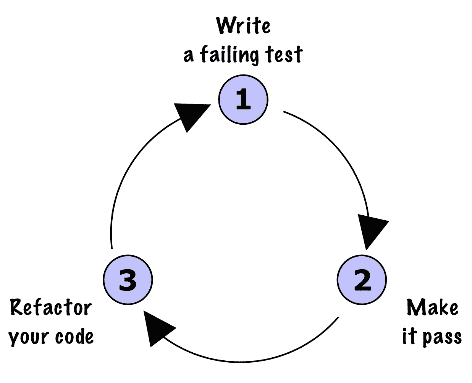
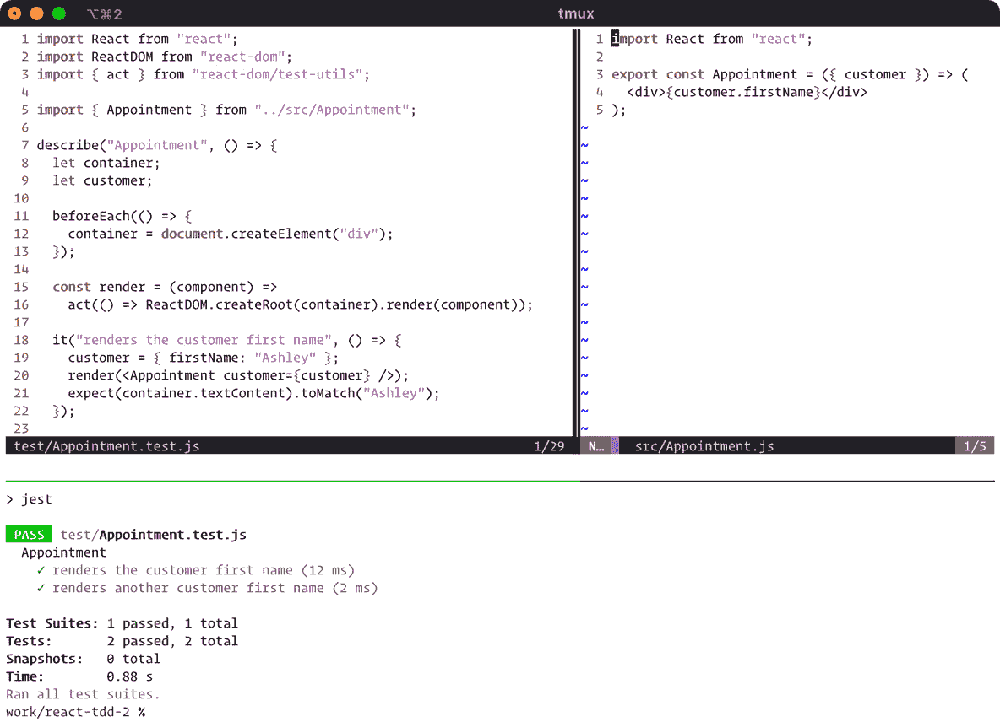

# 第一章：测试驱动开发的入门步骤

这本书通过测试驱动的方法一步步讲解如何构建 React 应用程序。我们将涉及 React 体验的许多不同方面，包括构建表单、组合界面和动画元素。也许更重要的是，我们将在学习一系列测试技术的同时完成这些任务。

你可能已经使用过 React 测试库，如 React Testing Library 或 Enzyme，但这本书不使用它们。相反，我们将从*基本原则*开始：根据我们的需求直接构建我们自己的测试函数集。这样，我们可以专注于构成所有优秀测试套件的关键成分。这些成分——如超级小测试、测试替身和工厂方法等想法——已有几十年历史，并适用于所有现代编程语言和运行时环境。这就是为什么这本书不使用测试库；实际上并没有必要。你将学到的知识无论你使用哪个测试库都将对你有用。

另一方面，**测试驱动开发**（**TDD**）是一种学习新框架和库的有效技术。这使得这本书非常适合 React 及其生态系统。这本书将让你以你可能从未体验过的方式探索 React，并利用 React Router 和 Redux 构建 GraphQL 接口。

如果你刚开始接触 TDD 流程，你可能会觉得它有点过于严格。这是一种细致和有纪律的软件开发风格。你会 wonder 为什么我们要付出如此巨大的努力来构建一个应用程序。对于那些掌握它的人来说，以这种方式指定我们的软件将获得巨大的价值，如下所示：

+   通过对产品规格的清晰描述，我们获得了在不担心变化的情况下调整代码的能力。

+   我们默认获得自动回归测试。

+   我们的测试充当了我们代码的注释，而这些注释在我们运行它们时是可验证的。

+   我们获得了一种与同事沟通我们的决策过程的方法。

你很快就会开始认识到你对正在工作的代码所拥有的更高层次的信任和信心。如果你和我们一样，你可能会对这种感觉上瘾，并发现没有它很难工作。

本书的第一部分和第二部分涉及为美发沙龙构建预约系统——没有什么太过革命性的，但作为示例应用程序来说，它提供了足够的范围。我们将在本章中开始这个项目。第三部分和第四部分使用一个完全不同的应用程序：一个标志解释器。构建它为探索 React 生态系统提供了有趣的方式。

本章将涵盖以下主题：

+   从头开始创建新的 React 项目

+   使用你的第一个测试显示数据

+   重构你的工作

+   编写优秀的测试

到本章结束时，您将很好地了解在构建简单的 React 组件时 TDD 流程的样子。您将看到如何编写测试、如何使其通过以及如何重构您的工作。

# 技术要求

在本章的后面部分，您将需要安装 **Node 包管理器**（**npm**）以及一系列的包。您需要确保您的机器能够运行 Node.js 环境。

您还需要访问终端。

此外，您还应该选择一个好的编辑器或 **集成开发环境**（**IDE**）来与您的代码一起工作。

本章的代码文件可以在以下链接中找到：[`github.com/PacktPublishing/Mastering-React-Test-Driven-Development-Second-Edition/tree/main/Chapter01`](https://github.com/PacktPublishing/Mastering-React-Test-Driven-Development-Second-Edition/tree/main/Chapter01).

# 从零开始创建新的 React 项目

在本节中，我们将组装您编写 TDD React 应用程序所需的所有必要组件。

您可能已经遇到了 `create-react-app` 包，许多人用它来创建初始的 React 项目，但我们将不会使用它。您将要学习的第一个 TDD 原则是 `create-react-app` 包添加了大量与我们所做无关的样板代码——例如 `favicon.ico` 文件、示例标志和 CSS 文件。虽然这些无疑是有用的，但 YAGNI 的基本思想是，如果它不符合所需的规范，那么它就不会被包含在内。

YAGNI 的思考方式是，任何不必要的都是简单的 *技术债务* —— 它们只是在那里闲置，未使用，阻碍了您。

一旦您看到从零开始启动 React 项目是多么容易，您就再也不会使用 `create-react-app` 了！

在以下小节中，我们将安装 NPM、Jest、React 和 Babel。

## 安装 npm

遵循 TDD 流程意味着频繁地运行测试——*非常* 频繁。测试是通过命令行使用 `npm test` 命令运行的。所以，让我们先安装 npm。

您可以通过打开终端窗口（如果您使用的是 Windows，则为命令提示符）并输入以下命令来检查您是否已经安装了它：

```js
npm -v
```

如果命令找不到，请访问 Node.js 网站 [`nodejs.org`](https://nodejs.org) 以获取安装说明。

如果您已经安装了 npm，我们建议您确保您使用的是最新版本。您可以在命令行中通过输入以下命令来完成此操作：

```js
npm install npm@latest -g
```

现在您已经准备好了。您可以使用 `npm` 命令来创建您的项目。

## 创建新的 Jest 项目

现在已经安装了 npm，我们可以通过以下步骤创建我们的项目：

1.  如果您正在跟随本书的 Git 仓库，请打开终端并导航到您已克隆的仓库目录。否则，只需导航到您通常存储工作项目的位置。

1.  使用 `mkdir appointments` 创建一个新的目录，然后使用 `cd appointments` 将其设置为当前目录。

1.  输入 `npm init` 命令。这将通过生成模板 `package.json` 文件来初始化一个新的 npm 项目。您将被提示输入有关项目的一些信息，但您只需接受所有默认设置 *除了* `test command` 问题，对于这个问题，您应该输入 `jest`。这将使您能够通过使用 `npm test` 快捷命令来运行测试。

手动编辑 package.json 文件

在按照说明操作时，如果错过了测试命令的提示，不要担心；您可以在之后通过将 `"test": "jest"` 添加到生成的 `package.json` 文件的 `scripts` 部分来设置它。

1.  现在继续使用 `npm install --save-dev jest` 安装 Jest。NPM 将然后下载并安装所有内容。完成后，您应该会看到如下消息：

    ```js
    added 325 packages, and audited 326 packages in 24s
    ```

Jest 的替代方案

本书将向您介绍的一些 TDD 实践将适用于各种测试运行器，而不仅仅是 Jest。一个例子是 Mocha 测试运行器。如果您对使用 Mocha 与本书结合感兴趣，请查看 [`reacttdd.com/migrating-from-jest-to-mocha`](https://reacttdd.com/migrating-from-jest-to-mocha) 的指南。

### 提交早且频繁

虽然我们刚刚开始，但现在是时候提交您所做的工作了。TDD 流程提供了自然的提交停止点——每次您看到一个新的测试通过时，您就可以提交。这样，您的仓库将充满许多小提交。您可能不习惯这样做——您可能更倾向于“每天一个提交”。这是一个尝试新事物的绝佳机会！

提交 *早且频繁* 可以简化提交信息。如果您在一个提交中只有一个测试，那么您可以使用测试描述作为您的提交信息。无需思考。此外，详细的提交历史记录有助于您在改变主意时回溯。

因此，当您有一个通过测试时，要习惯于输入 `git commit`。

当您接近一个功能开发的尾声时，您可以使用 `git rebase` 来压缩您的提交，这样您的 Git 历史记录就会保持整洁。

假设您正在使用 Git 来跟踪您的工作，请继续输入以下命令以 `commit` 您到目前为止所做的工作：

```js
git init
echo "node_modules" > .gitignore
git add .
git commit -m "Blank project with Jest dependency"
```

您现在已经“存入”了那个更改，您可以安全地将它放在一边，继续处理接下来的两个依赖项，即 React 和 Babel。

## 引入 React 和 Babel

让我们安装 React。这是两个可以使用此命令安装的包：

```js
npm install --save react react-dom
```

接下来，我们需要 Babel，它为我们转换了一些不同的事物：React 的 **JavaScript 语法扩展 (JSX**) 模板语法、模块模拟（我们将在 *第七章*，*测试 useEffect 和模拟组件*）以及我们将使用的各种草案 ECMAScript 构造。

重要提示

以下信息适用于 Babel 7。如果您使用的是后续版本，您可能需要相应地调整安装说明。

现在，Jest 已经包含了 Babel——用于上述模块模拟——所以我们只需要按照以下方式安装预设和插件：

```js
npm install --save-dev @babel/preset-env @babel/preset-react
npm install --save-dev @babel/plugin-transform-runtime
npm install --save @babel/runtime
```

Babel 预设是一组插件。每个插件都启用 ECMAScript 标准或预处理器（如 JSX）的特定功能。

配置 Babel

通常，`env`预设应该配置为目标执行环境。对于本书的目的来说，这不是必要的。有关更多信息，请参阅本章末尾的*进一步阅读*部分。

我们需要启用我们刚刚安装的包。创建一个新的文件，`.babelrc`，并添加以下代码：

```js
{
  "presets": ["@babel/env", "@babel/react"],
  "plugins": ["@babel/transform-runtime"]
}
```

现在，Babel 和 React 都准备好了可以使用。

小贴士

在这个阶段，您可能希望将源代码提交到 Git。

在本节中，您已安装 NPM，初始化了新的 Git 仓库，并安装了构建 React 应用程序所需的包依赖项。您已经准备好编写一些测试了。

# 在您的第一个测试中显示数据

现在，我们将第一次使用**TDD 周期**，您将在我们通过周期每个步骤的过程中了解它。

我们将开始构建一个预约视图，以显示预约的详细信息。这是一个名为`Appointment`的 React 组件，它将传递一个表示美发沙龙预约的数据结构。我们可以想象它看起来有点像以下示例：

```js
{
  customer: {
    firstName: "Ashley",
    lastName: "Jones",
    phoneNumber: "(123) 555-0123"
  },
  stylist: "Jay Speares",
  startsAt: "2019-02-02 09:30",
  service: "Cut",
  notes: ""
}
```

我们无法在完成本章之前显示所有这些信息；事实上，我们只会显示客户的`firstName`，并使用`startsAt`时间戳来排序今天的预约列表。

在接下来的几个小节中，您将编写第一个 Jest 测试，并完成所有必要的步骤使其通过。

## 编写失败的测试

测试究竟*是什么？为了回答这个问题，让我们写一个。执行以下步骤：

1.  在您的项目目录中，键入以下命令：

    ```js
    mkdir test
    touch test/Appointment.test.js
    ```

1.  在您喜欢的编辑器或 IDE 中打开`test/Appointment.test.js`文件，并输入以下代码：

    ```js
    describe("Appointment", () => {
    });
    ```

`describe`函数定义了一个*测试套件*，它只是一个具有给定名称的测试集合。第一个参数是您正在测试的单元的名称。它可以是 React 组件、函数或模块。第二个参数是一个函数，在其中您定义您的测试。`describe`函数的目的是描述这个命名“事物”的工作方式——无论这个“事物”是什么。

全局 Jest 函数

当您运行`npm test`命令时，所有的 Jest 函数（如`describe`）都已经作为全局命名空间中的必需和可用函数。您不需要导入任何内容。

对于 React 组件，给`describe`块取与组件本身相同的名称是一个好习惯。

您应该在何处放置您的测试？

如果你尝试使用 `create-react-app` 模板，你会注意到它包含一个单独的单元测试文件，`App.test.js`，它位于源文件 `App.js` 相同的目录中。

我们更喜欢将测试文件与应用程序源文件分开。测试文件放在名为 `test` 的目录中，源文件放在名为 `src` 的目录中。这两种方法实际上并没有真正的客观优势。然而，请注意，你可能不会在生产文件和测试文件之间有一个一对一的映射。你可以选择以不同于组织源文件的方式组织你的测试文件。

让我们用 Jest 运行这个测试。你可能会认为现在运行测试是没有意义的，因为我们还没有写测试，但这样做会给我们关于下一步做什么的有价值信息。在使用 TDD 时，在每一个机会运行测试运行器是正常的。

在命令行中再次运行 npm test 命令。你会看到以下输出：

```js
No tests found, exiting with code 1
Run with `--passWithNoTests` to exit with code 0
```

这是有道理的——我们还没有编写任何测试，只是写了一个 `describe` 块来存放它们。至少我们还没有任何语法错误！

小贴士

如果你看到了以下内容：

`> echo "Error: no test specified" && exit 1`

你需要在你的 `package.json` 文件中将 Jest 设置为测试命令的值。参见上面 *创建一个新的 Jest 项目* 中的 *步骤 3*。

### 编写你的第一个期望

将你的 `describe` 调用更改为以下内容：

```js
describe("Appointment", () => {
  it("renders the customer first name", () => {
  });
});
```

`it` 函数定义了一个单独的测试。第一个参数是测试的描述，并且总是以现在时态动词开头，以便用普通英语阅读。函数名中的 `it` 指的是你用来命名测试套件的名词（在这个例子中，是 `Appointment`）。实际上，如果你现在运行测试，使用 `npm test`，下面的输出（如下所示）将很有意义：

```js
PASS test/Appointment.test.js
  Appointment
    ✓ renders the customer first name (1ms)
```

你可以将 `describe` 和 `it` 描述一起读作一个句子：*Appointment 渲染客户的首字母*。你应该努力使所有测试都能以这种方式阅读。

随着我们添加更多的测试，Jest 将会显示一个通过测试的小清单。

Jest 的测试函数

你可能已经使用了 Jest 的 `test` 函数，它与 `it` 等效。我们更喜欢 `it`，因为它读起来更好，并作为如何简洁描述我们的测试的有用指南。

你可能也看到人们从 “*应该…*” 开始他们的测试描述。我并不认为这有什么意义，它只是我们不得不输入的一个额外单词。不如直接使用一个精心挑选的动词来跟随 “it”。

空测试，就像我们刚才写的，总是通过。现在让我们添加一个 *期望* 到我们的测试中，如下所示：

```js
it("renders the customer first name", () => {
  expect(document.body.textContent).toContain("Ashley");
});
```

这个 `expect` 调用是一个流畅 API 的例子。像测试描述一样，它读起来像普通英语。你可以这样读：

*我期望* `document.body.textContent` `包含` *字符串* `Ashley`。

每个期望都有一个 `Ashley`，接收到的值是存储在 `document.body.textContent` 中的任何内容。换句话说，如果 `document.body.textContent` 中包含 `Ashley` 这个词，则期望通过。

`toContain` 函数被称为 `matcher`，有许多不同的 `matcher` 以不同的方式工作。你可以（并且应该）编写自己的 `matcher`。你将在 *第三章*，*重构测试套件* 中发现如何做到这一点。为你的项目编写特定的 `matcher` 是编写清晰、简洁测试的重要部分。

在我们运行这个测试之前，花一分钟时间思考一下代码。你可能已经猜到测试会失败。问题是，它会以什么方式失败？

运行 `npm test` 命令并找出：

```js
FAIL  test/Appointment.test.js
  Appointment
    ✕ renders the customer first name (1 ms)
  ● Appointment › renders the customer first name
    The error below may be caused by using the wrong test environment, see https://jestjs.io/docs/configuration#testenvironment-string.
    Consider using the "jsdom" test environment.
    ReferenceError: document is not defined
      1 | describe("Appointment", () => {
      2 |   it("renders the customer first name", () => {
    > 3 |     expect(document.body.textContent).toContain("Ashley");
        |            ^
      4 |   });
      5 | })
      6 |
      at Object.<anonymous> (test/Appointment.test.js:3:12)
```

我们遇到了第一个失败！

这可能不是你预期的失败。结果证明，我们还有一些设置要处理。Jest 有助于告诉我们它认为我们需要什么，它是正确的；我们需要指定一个 `jsdom` 测试环境。

一个 `jsdom` 测试环境，它实例化一个新的 `JSDOM` 对象并设置全局和文档对象，将 Node.js 转换成了一个类似浏览器的环境。

**jsdom** 是一个包含在 Node.js 上运行的、无头实现 **文档对象模型 (DOM)** 的包。实际上，它将 Node.js 转换成了一个类似浏览器的环境，该环境响应通常的 DOM API，例如我们在这次测试中试图访问的文档 API。

Jest 提供了一个预包装的 `jsdom` 测试环境，这将确保我们的测试在具有这些 DOM API 准备好的情况下运行。我们只需要安装它并指导 Jest 使用它。

在你的命令提示符中运行以下命令：

```js
npm install --save-dev jest-environment-jsdom
```

现在，我们需要打开 `package.json` 并在底部添加以下部分：

```js
{
  ...,
  "jest": {
    "testEnvironment": "jsdom"
  }
}
```

然后，我们再次运行 `npm test`，得到以下输出：

```js
FAIL test/Appointment.test.js
  Appointment
    ✕ renders the customer first name (10ms)
  ● Appointment › renders the customer first name
    expect(received).toContain(expected)
    Expected substring: "Ashley"
    Received string:    ""
      1 | describe("Appointment", () => {
      2 |   it("renders the customer first name", () => {
    > 3 |     expect(document.body.textContent).toContain("Ashley");
        |                                       ^
      4 |   });
      5 | });
      6 |
      at Object.toContain (test/Appointment.test.js:3:39)
```

测试输出中有四个部分对我们来说是相关的：

+   失败测试的名称

+   预期的答案

+   实际的答案

+   错误发生的源代码位置

所有这些都有助于我们确定测试失败的原因：`document.body.textContent` 是空的。鉴于我们还没有编写任何 React 代码，这并不奇怪。

### 在测试中从内部渲染 React 组件

为了让这个测试通过，我们将在期望之上编写一些代码，这些代码将调用我们的生产代码。

让我们从那个期望开始逆向工作。我们知道我们想要构建一个 React 组件来渲染这个文本（这就是我们之前指定的 `Appointment` 组件）。如果我们想象我们已经定义了那个组件，我们将如何让 React 在我们的测试中从内部渲染它？

我们只是做我们自己在应用程序入口点会做的事情。我们以这种方式渲染我们的根组件：

```js
ReactDOM.createRoot(container).render(component);
```

前面的函数用 React 渲染我们的 `component` 构造的新元素替换 DOM `container` 元素，在我们的例子中，这个 `component` 将被称为 `Appointment`。

createRoot 函数

`createRoot` 函数是 React 18 中的新功能。将其与 `render` 的调用链式调用对于大多数测试来说就足够了，但在 *第七章**，测试 useEffect 和组件模拟*，你将对其进行一些调整以支持单个测试中的重新渲染。

为了在我们的测试中调用它，我们需要定义 `component` 和 `container`。然后测试将具有以下形状：

```js
it("renders the customer first name", () => {
  const component = ???
  const container = ???
  ReactDOM.createRoot(container).render(component);
  expect(document.body.textContent).toContain("Ashley");
});
```

`component` 的值很容易确定；它将是一个 `Appointment` 的实例，即我们要测试的组件。我们指定它接受一个客户作为属性，所以现在让我们写出它可能的样子。这是一个接受 `customer` 作为属性的 JSX 片段：

```js
 const customer = { firstName: "Ashley" };
 const component = <Appointment customer={customer} />;
```

如果你之前从未做过任何 TDD，这可能会显得有些奇怪。为什么我们要为尚未构建的组件编写测试代码？嗯，这部分的目的是 TDD 的一个要点——我们让测试驱动我们的设计。在本节的开始，我们提出了关于 `Appointment` 组件将要做什么的口头规范。现在，我们有一个具体的、书面的规范，可以通过运行测试自动验证。

简化测试数据

在我们考虑设计的时候，我们为我们的预约制定了一个完整的对象格式。你可能会认为这里客户的定义非常稀疏，因为它只包含一个名字，但我们不需要其他任何东西来进行关于客户名字的测试。

我们已经确定了 `component`。那么，关于 `container` 呢？我们可以使用 DOM 创建一个 `container` 元素，如下所示：

```js
const container = document.createElement("div");
```

`document.createElement` 的调用给我们提供了一个新的 HTML 元素，我们将用它作为我们的渲染根。然而，我们还需要将其附加到当前文档的 body 上。这是因为某些 DOM 事件只有在我们的元素是文档树的一部分时才会注册。因此，我们还需要使用以下代码行：

```js
document.body.appendChild(container);
```

现在我们的期望应该能够捕获我们渲染的任何内容，因为它被渲染为 `document.body` 的一部分。

警告

我们不会长时间使用 `appendChild`；在本章的后面部分，我们将用更合适的东西替换它。我们不推荐在自己的测试套件中使用 `appendChild`，原因将在后面变得清楚！

让我们把所有这些放在一起：

1.  将 `test/Appointments.test.js` 中的测试更改如下：

    ```js
    it("renders the customer first name", () => {
      const customer = { firstName: "Ashley" };
      const component = (
        <Appointment customer={customer} />
      );
      const container = document.createElement("div");
      document.body.appendChild(container);
      ReactDOM.createRoot(container).render(component);
      expect(document.body.textContent).toContain(
        "Ashley"
      );
    });
    ```

1.  由于我们同时使用 `ReactDOM` 命名空间和 JSX，我们需要在测试文件的顶部包含这两个标准的 React 导入，以便它能够正常工作，如下所示：

    ```js
    import React from "react";
    import ReactDOM from "react-dom/client";
    ```

1.  好吧，运行测试；它会失败。在输出中，你会看到以下代码：

    ```js
    ReferenceError: Appointment is not defined
        5 |   it("renders the customer first name", () => {
        6 |     const customer = { firstName: "Ashley" };
     >  7 |     const component = (
        8 |       <Appointment customer={customer} />               
          |        ^
        9 |     );
    ```

这与之前看到的测试失败略有不同。这是一个运行时异常，而不是期望失败。幸运的是，这个异常告诉我们确切需要做什么，就像测试期望一样。现在是时候构建 `Appointment` 了。

## 让它通过

我们现在准备好让失败的测试通过。执行以下步骤：

1.  在 `test/Appointment.test.js` 中，在两个 React 导入下方添加一个新的 `import` 语句，如下所示：

    ```js
    import { Appointment } from "../src/Appointment";
    ```

1.  使用 `npm test` 运行测试。这次您会得到一个不同的错误，关键信息如下：

    ```js
    Cannot find module '../src/Appointment' from 'Appointment.test.js'
    ```

默认导出

虽然 `Appointment` 被定义为导出，但它没有被定义为**默认**导出。这意味着我们必须使用花括号形式的导入（`import { ... }`）来导入它。我们倾向于避免使用默认导出，因为这样做可以保持组件名称及其使用的一致性。如果我们更改组件的名称，那么所有导入它的地方都会中断，直到我们也更改它们。默认导出不是这种情况。一旦您的名称不一致，跟踪组件的使用就变得更加困难——您不能简单地使用文本搜索来找到它们。

1.  让我们创建那个模块。在您的命令提示符中输入以下代码：

    ```js
    mkdir src
    touch src/Appointment.js
    ```

1.  在您的编辑器中，将以下内容添加到 `src/Appointment.js` 文件中：

    ```js
    export const Appointment = () => {};
    ```

为什么我们创建了一个没有实际创建实现的 `Appointment` 壳？这看起来可能有些无意义，但 TDD 的另一个核心原则是**总是做最简单的事情来通过测试**。我们可以将这句话重新表述为**总是做最简单的事情来修复你正在工作的错误**。

记得我们提到我们仔细倾听测试运行器告诉我们的话吗？在这种情况下，测试运行器说“无法”找到模块 `Appointment`，所以需要创建那个模块，我们已经创建了，然后立即停止。在我们做任何其他事情之前，我们需要运行我们的测试，以了解下一步要做什么。

再次运行 `npm test`，你应该得到以下测试失败：

```js
● Appointment › renders the customer first name
   expect(received).toContain(expected)
   Expected substring: "Ashley"
   Received string:    ""
     12 |     ReactDOM.createRoot(...).render(component);
     13 |
   > 14 |     expect(document.body.textContent).toContain(
        |                                       ^
     15 |       "Ashley"
     16 |     );
     17 |   });
     at Object.<anonymous> (test/Appointment.test.js:14:39)
```

为了修复测试，让我们将 `Appointment` 定义更改为以下内容：

```js
export const Appointment = () => "Ashley";
```

你可能正在想，“那不是一个组件！没有 JSX。” 正确。 “而且它甚至没有使用 customer 属性！” 也正确。但 React 仍然会渲染它，理论上，它应该使测试通过；所以，在实践中，这至少是一个足够好的实现，至少目前是这样。

我们总是编写最少的代码，以确保测试通过。

但它是否通过了？再次运行 `npm test` 并查看输出：

```js
● Appointment › renders the customer first name
    expect(received).toContain(expected)
    Expected substring: "Ashley"
    Received string:    ""
      12 |     ReactDOM.createRoot(...).render(component);
      13 |
    > 14 |     expect(document.body.textContent).toContain(
      15 |                                       ^
      16 |       "Ashley"
      17 |     );
         |   });
```

不，它没有通过。这有点令人困惑。我们**确实**定义了一个有效的 React 组件。我们也告诉 React 在我们的容器中渲染它。发生了什么？

## 利用 act 测试助手

在这种类似 React 测试的情况下，答案通常与运行时环境的异步特性有关。从 React 18 开始，渲染函数是**异步的**：函数调用会在 React 修改 DOM 之前返回。因此，期望会在 DOM 修改之前运行。

React 为我们的测试提供了一个辅助函数，该函数会在异步渲染完成后暂停。它被称为 `act`，您只需将其包装在任意的 React API 调用周围。要使用 `act`，请执行以下步骤：

1.  前往 `test/Appointment.test.js` 的顶部并添加以下代码行：

    ```js
    import { act } from "react-dom/test-utils";
    ```

1.  然后，将包含 `render` 调用的行更改为以下内容：

    ```js
    act(() => 
    ReactDOM.createRoot(container).render(component)
    );
    ```

1.  现在再次运行您的测试，您应该会看到一个通过测试，但上面会打印出一个奇怪的警告，如下所示：

    ```js
    > jest
      console.error
        Warning: The current testing environment is not configured to support act(...)
          at printWarning (node_modules/react-dom/cjs/react-dom.development.js:86:30)
    ```

React 希望我们在使用`act`时明确。这是因为有一些情况下`act`是没有意义的——但对于单元测试，我们几乎肯定想要使用它。

理解`act`函数

虽然我们在这里使用它，但`act`函数对于测试 React 不是必需的。关于此函数的详细讨论以及如何使用它，请访问[`reacttdd.com/understanding-act`](https://reacttdd.com/understanding-act)。

1.  让我们继续启用`act`函数。打开`package.json`并修改您的`jest`属性，使其如下所示：

    ```js
    {
      ...,
      "jest": {
        "testEnvironment": "jsdom",
        "globals": {
          "IS_REACT_ACT_ENVIRONMENT": true
        }
      }
    }
    ```

1.  现在再次运行您的测试，使用`npm test`，您应该会看到如下的输出：

    ```js
    > jest
     PASS  test/Appointment.test.js
      Appointment
    ✓ renders the customer first name (13 ms)
    Test Suites: 1 passed, 1 total
    Tests:       1 passed, 1 total
    Snapshots:   0 total
    Time:        1.355 s
    Ran all test suites.
    ```

*最后*，您的测试通过了，没有任何警告！

在下一节中，您将了解到如何移除通过添加第二个测试而引入的硬编码字符串值。

## 通过三角定位移除硬编码

现在我们已经克服了这个小障碍，让我们再次思考测试中的问题。我们做了一系列奇怪的杂技动作，只是为了让这个测试通过。其中一件奇怪的事情是在 React 组件中使用硬编码的`Ashley`值，尽管我们已经费尽心思在我们的测试中定义了一个客户属性并将其传递进去。

我们这样做是因为我们想要坚持我们的规则，只做能让测试通过的最简单的事情。为了到达真正的实现，我们需要添加更多的测试。

这个过程被称为**三角定位**。我们添加更多的测试来构建更真实的实现。我们的测试越具体，我们的生产代码就需要越泛化。

乒乓编程

这就是为什么使用 TDD 进行结对编程可以如此有趣的原因之一。结对可以玩*乒乓*。有时，你的搭档会写一个你可以轻易解决的测试，可能通过硬编码，然后你通过三角定位强迫他们做两个测试的艰难工作。他们需要移除硬编码并添加泛化。

让我们通过以下步骤进行三角定位：

1.  将您的第一个测试复制一份，粘贴在第一个测试的下面，并更改测试描述以及`Ashley`的名字为`Jordan`，如下所示：

    ```js
    it("renders another customer first name", () => {
      const customer = { firstName: "Jordan" };
      const component = (
        <Appointment customer={customer} />
      );
      const container = document.createElement("div");
      document.body.appendChild(container);
      act(() => 
        ReactDOM.createRoot(container).render(component)
      );
      expect(document.body.textContent).toContain(
        "Jordan"
      );
    });
    ```

1.  使用`npm test`运行测试。我们预计这个测试会失败，并且它确实失败了。但仔细检查代码。这是您期望看到的吗？看看以下代码中的`Received string`的值：

    ```js
    FAIL test/Appointment.test.js
      Appointment
    ✓ renders the customer first name (18ms)
    ✕ renders another customer first name (8ms)
    ● Appointment › renders another customer first name
        expect(received).toContain(expected)
        Expected substring: "Jordan"
        Received string:    "AshleyAshley"
    ```

文档体中包含文本`AshleyAshley`。这种重复的文本是表明我们的测试不是彼此*独立*的。组件被渲染了两次，一次对应每个测试。这是正确的，但文档在每次测试运行之间并没有被清除。

这是一个问题。当涉及到单元测试时，我们希望所有测试都是相互独立的。如果它们不是，一个测试的输出可能会影响后续测试的功能。一个测试可能因为上一个测试的动作而通过，导致假阳性。即使测试确实失败了，由于初始状态未知，你将花费时间来确定问题是由于测试的初始状态引起的，而不是测试场景本身。

我们需要改变方向并修复这个问题，以免我们陷入麻烦。

测试独立性

单元测试应该相互独立。实现这一点的最简单方法是在测试之间不共享任何状态。每个测试应该只使用它自己创建的变量。

## 退回原点

我们知道`document`。这是由`jsdom`环境提供的单个全局`document`对象，这与正常网页浏览器的操作方式一致：有一个单一的`document`对象。但不幸的是，我们的两个测试使用`appendChild`将内容添加到它们之间共享的单个文档中。它们各自没有得到自己的单独实例。

一个简单的解决方案是将`appendChild`替换为`replaceChildren`，如下所示：

```js
document.body.replaceChildren(container);
```

这将在执行追加之前清除`document.body`中的所有内容。

但存在问题。我们正在进行一个**红色**测试。在我们处于红色状态时，我们绝不应该重构、重做或以其他方式改变方向。

虽然这全部都是高度人为的——我们本可以从一开始就使用`replaceChildren`。但我们不仅证明了`replaceChildren`的必要性，我们还将发现处理这类场景的重要技术。

我们必须跳过这个正在工作的测试，修复之前的测试，然后重新启用跳过的测试。现在让我们通过执行以下步骤来完成：

1.  在你刚刚编写的第一个测试中，将`it`更改为`it.skip`。现在按照以下方式对第二个测试做同样的操作：

    ```js
    it.skip("renders another customer first name", () => {
      ...
    });
    ```

1.  运行测试。你会看到 Jest 忽略了第二个测试，而第一个测试仍然通过，如下所示：

    ```js
    PASS test/Appointment.test.js
      Appointment
    ✓ renders the customer first name (19ms)
    ○ skipped 1 test
    Test Suites: 1 passed, 1 total
    Tests: 1 skipped, 1 passed, 2 total
    ```

1.  在第一个测试中，按照以下方式将`appendChild`更改为`replaceChildren`：

    ```js
    it("renders the customer first name", () => {
      const customer = { firstName: "Ashley" };
      const component = (
        <Appointment customer={customer} />
      );
      const container = document.createElement("div");
      document.body.replaceChildren(container);
      ReactDOM.createRoot(container).render(component);
      expect(document.body.textContent).toContain(
        "Ashley"
      );
    });
    ```

1.  使用`npm test`重新运行测试。它应该仍然通过。

是时候通过从函数名中移除`.skip`来将跳过的测试重新引入了。

1.  在这个测试中执行与第一个测试相同的更新：将`appendChild`更改为`replaceChildren`，如下所示：

    ```js
    it("renders another customer first name", () => {
      const customer = { firstName: "Jordan" };
      const component = (
        <Appointment customer={customer} />
      );
      const container = document.createElement("div");
      document.body.replaceChildren(container);
      act(() => 
        ReactDOM.createRoot(container).render(component)
      );
      expect(document.body.textContent).toContain(
        "Jordan"
      );
    });
    ```

1.  现在运行测试应该会给我们原本预期的错误。不再有重复的文本内容，如下所示：

    ```js
    FAIL test/Appointment.test.js
      Appointment
    ✓ renders the customer first name (18ms)
    ✕ renders another customer first name (8ms)
    ● Appointment › renders another customer first name
        expect(received).toContain(expected)
        Expected substring: "Jordan"
        Received string:    "Ashley"
    ```

1.  为了使测试通过，我们需要引入属性并在我们的组件中使用它。将`Appointment`的定义更改为如下，解构函数参数以提取客户属性：

    ```js
    export const Appointment = ({ customer }) => (
      <div>{customer.firstName}</div>
    );
    ```

1.  运行测试。我们预计这个测试现在会通过：

    ```js
    PASS test/Appointment.test.js
     Appointment
    ✓ renders the customer first name (21ms)
    ✓ renders another customer first name (2ms)
    ```

干得好！我们的通过测试已经完成，并且我们已经成功定位并移除了硬编码。

在本节中，你编写了两个测试，在这个过程中，你发现了并克服了我们编写 React 组件自动化测试时面临的一些挑战。

现在我们已经让测试工作正常，我们可以更仔细地查看我们编写的代码。

# 重构你的工作

现在你已经得到了一个绿色的测试，是时候重构你的工作了。重构是调整代码结构而不改变其功能的过程。这对于保持代码库处于良好、可维护的状态至关重要。

很遗憾，重构步骤总是被遗忘的步骤。冲动是直接进入下一个功能。我们无法强调花时间简单地停下来 *凝视* 代码并思考改进方法的重要性。练习你的重构技能是成为开发者提升水平的一个可靠方法。

俗语“欲速则不达”在编程中就像在生活中一样适用。如果你养成了跳过重构阶段的习惯，你的代码质量可能会随着时间的推移而下降，这使得它更难工作，因此构建新功能的速度会变慢。

TDD 循环帮助你建立良好的个人纪律和习惯，例如持续重构。这可能需要前期更多的努力，但你会收获一个随着时间推移仍然可维护的代码库的回报。

不要重复自己

测试代码需要与生产代码一样多的关注和照顾。当你重构测试时，你将依赖的第一大原则是**不要重复自己**（**DRY**）。“干燥测试”是所有 TDD 实践者经常重复的一个短语。

关键点是你希望你的测试尽可能简洁。当你看到存在于多个测试中的重复代码时，这是一个很好的迹象，表明你可以将这段重复代码提取出来。有几种不同的方法可以做到这一点，我们将在本章中介绍其中的一些。

你将在 *第三章*“重构测试套件”中看到进一步干燥测试的技术。

## 在测试之间共享设置代码

当测试包含相同的设置说明时，我们可以将这些说明提升为共享的 `beforeEach` 块。此块中的代码在每个测试之前执行。

我们的两个测试都使用了相同的两个变量：`container` 和 `customer`。其中第一个，`container`，在每个测试中都是相同初始化的。这使得它成为 `beforeEach` 块的良好候选者。

执行以下步骤以引入你的第一个 `beforeEach` 块：

1.  由于 `container` 需要在 `beforeEach` 块和每个测试中访问，我们必须在外部的 `describe` 范围内声明它。由于我们将在 `beforeEach` 块中设置其值，这也意味着我们需要使用 `let` 而不是 `const`。在第一个测试上方添加以下代码行：

    ```js
    let container;
    ```

1.  在以下声明下方添加以下代码：

    ```js
    beforeEach(() => {
      container = document.createElement("div");
      document.body.replaceChildren(container);
    });
    ```

1.  从你的两个测试中各自删除相应的两行。注意，由于我们在 `describe` 块的作用域中定义了 `container`，因此在 `beforeEach` 块中设置的值将在测试执行时对测试可用。

使用 let 而不是 const

当你在 `describe` 范围内使用 `let` 定义时，要小心。这些变量在每次测试执行之间默认不会被清除，并且共享的状态将影响每个测试的结果。一个很好的经验法则是，你应在 `describe` 范围内声明的任何变量都应在相应的 `beforeEach` 块中分配新值，或者在每个测试的第一部分，就像我们在这里所做的那样。

要更详细地了解在测试套件中使用 `let` 的方法，请访问 [`reacttdd.com/use-of-let`](https://reacttdd.com/use-of-let)。

在*第三章**，重构测试套件*中，我们将探讨一种在多个测试套件之间共享此设置代码的方法。

## 提取方法

两个测试中的 `render` 调用相同。考虑到它被 `act` 调用所包裹，它的长度也相当长。因此，提取整个操作并给它一个更有意义的名称是有意义的。

而不是直接提取出来，我们可以创建一个新的函数，该函数将 `Appointment` 组件作为其参数。为什么这样做有用的解释将在之后给出，但现在让我们执行以下步骤：

1.  在第一个测试上方写下以下定义。注意，它仍然需要位于 `describe` 块内，因为它使用了 `container` 变量：

    ```js
    const render = component =>
      act(() => 
        ReactDOM.createRoot(container).render(component)
      );
    ```

1.  现在，将每个测试中的 `render` 调用替换为以下代码行：

    ```js
    render(<Appointment customer={customer} />);
    ```

1.  在前面的步骤中，我们*内联*了 JSX，直接将其传递给 `render`。这意味着你现在可以删除以 `const component` 开头的行。例如，你的第一个测试应该看起来像以下示例：

    ```js
    it("renders the customer first name", () => {
      const customer = { firstName: "Ashley" };
      render(<Appointment customer={customer} />);
      expect(document.body.textContent).toContain(
        "Ashley"
      );
    });
    ```

1.  重新运行你的测试并验证它们是否仍然通过。

在你的测试中突出差异

你想要突出的测试部分是不同测试之间的差异部分。通常，一些代码保持不变（例如 `container` 和渲染组件所需的步骤），而一些代码则不同（例如本例中的 `customer`）。尽你所能隐藏相同的部分，突出不同的部分。这样，就可以清楚地知道测试具体在测试什么。

本节介绍了几种重构代码的简单方法。随着本书的进展，我们将探讨许多不同的方法，这些方法可以重构生产源代码和测试代码。

# 编写优秀的测试

现在你已经编写了一些测试，让我们暂时离开键盘，讨论一下你迄今为止所看到的内容。

你的第一个测试看起来像以下示例：

```js
it("renders the customer first name", () => {
  const customer = { firstName: "Ashley" };
  render(<Appointment customer={customer} />);
  expect(document.body.textContent).toContain("Ashley");
});
```

这份文档简洁且易于阅读。

一个*好的*测试有三个明显的部分：

+   **安排**：设置测试依赖项

+   **执行操作**：在测试中执行生产代码

+   **断言**：检查期望是否得到满足

这一点理解得如此透彻，以至于被称为**安排、行动、断言（AAA）**模式，本书中的所有测试都遵循此模式。

一个**优秀的**测试不仅很好，而且还有以下特点：

+   简短

+   描述性

+   与其他测试独立

+   没有副作用

在本节的剩余部分，我们将讨论你已使用的 TDD 周期，以及如何设置你的开发环境以方便进行 TDD。

## 红色、绿色、重构

TDD 的核心是我们在前面看到的红色、绿色、重构周期。



图 1.1 – TDD 周期

TDD 周期的步骤是：

1.  **编写失败的测试**：编写一个简短的测试来描述你想要的功能。执行你的测试并观察它失败。如果它没有失败，那么它是一个不必要的测试；删除它并编写另一个。

1.  **使其通过**：通过编写最简单的能工作的生产代码来使测试通过。不用担心寻找整洁的代码结构；你可以稍后整理它。

1.  **重构你的代码**：停下来，放慢速度，抵制继续进行下一个功能的冲动。努力使你的代码——无论是生产代码还是测试代码——尽可能干净。

这就是全部内容。你已经在前面两个部分中看到了这个周期的实际应用，我们将在本书的其余部分继续使用它。

## 简化你的测试过程

想想你到目前为止在这本书上投入的努力。你做了哪些最多的动作？它们如下：

+   在`src/Appointment.js`和`test/Appointment.test.js`之间切换

+   运行`npm test`并分析输出

确保你可以快速执行这些操作。

首先，你应该在你的编辑器中使用分屏功能。如果你还没有这样做，利用这个机会学习如何操作。在一侧加载你的生产模块，在另一侧加载相应的单元测试文件。

这是我们设置的一个图片；我们使用`nvim`和`tmux`：



图 1.2 – 在终端中运行 tmux 和 vim 的典型 TDD 设置

你可以看到我们还在底部有一个小测试窗口来显示测试输出。

Jest 也可以监视你的文件，并在它们更改时自动运行测试。要启用此功能，将`package.json`中的`test`命令更改为`jest --watchAll`。这将在检测到任何更改时重新运行所有测试。

监视文件变化

Jest 的监视模式有一个选项，可以只运行已更改文件中的测试，但由于你的 React 应用将由许多不同的文件组成，每个文件都相互关联，因此最好运行所有内容，因为许多模块可能会出现故障。

# 摘要

测试就像我们学习中的安全带；我们可以在理解的基础上构建小块知识，层层叠加，不断向上，无需担心跌落。

在本章中，你已经学到了很多关于 TDD 体验的知识。

首先，你从头开始设置一个 React 项目，只引入运行所需的最小依赖。你已经使用 Jest 的`describe`、`it`和`beforeEach`函数编写了两个测试。你发现了`act`辅助函数，它确保在测试期望执行之前，所有的 React 渲染都已经完成。

你还看到了很多测试想法。最重要的是，你已经练习了 TDD 的“红-绿-重构”循环。你还使用了三角测量法，并学习了**安排、执行、断言**模式。

此外，我们还加入了一些设计原则，以供参考：DRY（不要重复自己）和 YAGNI（你不需要它，直到你需要它）。

虽然这是一个很好的开始，但旅程才刚刚开始。在接下来的章节中，我们将测试一个更复杂的组件。

# 进一步阅读

查看 Babel 网页，了解如何正确配置 Babel 的`env`预设。这对于实际应用非常重要，但我们在这章中跳过了它。你可以通过以下链接找到它：

[`babeljs.io/docs/en/babel-preset-env`](https://babeljs.io/docs/en/babel-preset-env)。

React 的`act`函数是在 React 17 中引入的，并在 React 18 中进行了更新。它表面上看似复杂。有关此函数如何使用的更多讨论，请参阅以下链接中的博客文章：[`reacttdd.com/understanding-act`](https://reacttdd.com/understanding-act)。

这本书并没有充分利用 Jest 的`watch`功能。在 Jest 的最近版本中，这个功能进行了一些有趣的更新，例如可以选择要监视的文件。如果你发现重新运行测试很困难，你可能想尝试一下。更多信息请参阅以下链接：[`jestjs.io/docs/en/cli#watch`](https://jestjs.io/docs/en/cli#watch)。
