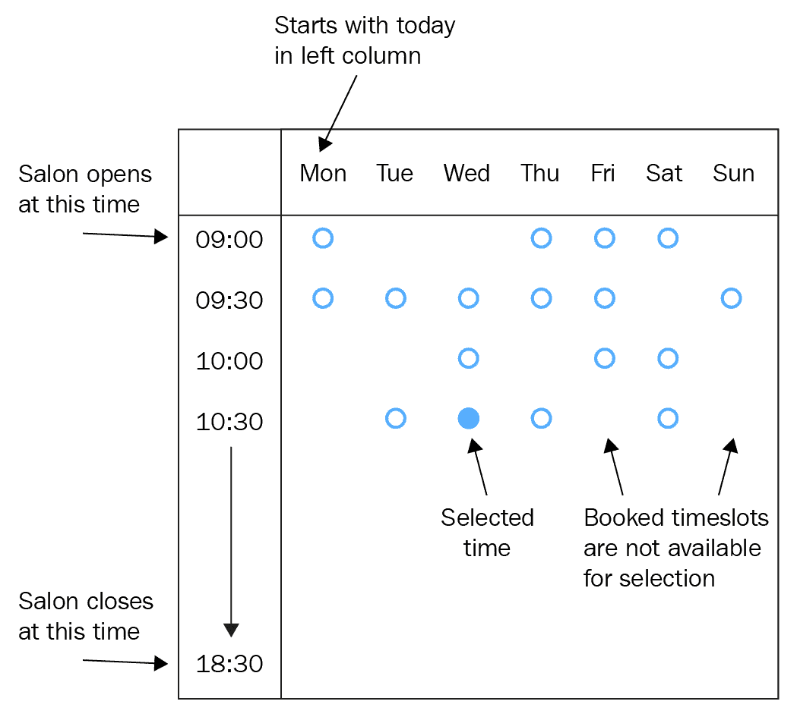

# 第五章：添加复杂表单交互

是时候将你所学应用到更复杂的 HTML 设置中了。在本章中，我们将测试一个新的组件：`AppointmentForm`。它包含一个下拉框，用于选择所需的服务，以及一组单选按钮，形成一个用于选择预约时间的日历视图。

结合布局和表单输入，本章中的代码展示了 TDD 如何为你提供一个工作结构，使复杂场景变得简单易懂：你将使用测试来扩展组件成为组件层次结构，随着组件开始增长，将功能从主组件中分离出来。

在本章中，我们将涵盖以下主题：

+   从下拉框中选择一个值

+   构建日历视图

+   测试单选按钮组

+   减少构建组件时的努力

到本章结束时，你将学会如何将测试驱动开发应用于复杂用户输入场景。这些技术对所有类型的表单组件都很有用，而不仅仅是下拉框和单选按钮。

# 技术要求

本章的代码文件可以在以下位置找到：[`github.com/PacktPublishing/Mastering-React-Test-Driven-Development-Second-Edition/tree/main/Chapter05`](https://github.com/PacktPublishing/Mastering-React-Test-Driven-Development-Second-Edition/tree/main/Chapter05)。

# 从下拉框中选择一个值

让我们从创建一个名为`AppointmentForm`的组件来预订新预约开始。

第一字段是一个下拉框，用于选择客户所需的服务：剪发、染色、吹干等。让我们现在创建它：

1.  创建一个新文件，`test/AppointmentForm.test.js`，包含以下测试和设置：

    ```js
    import React from "react";
    import {
      initializeReactContainer,
      render,
      field,
      form,
    } from "./reactTestExtensions";
    import { AppointmentForm } from "../src/AppointmentForm";
    describe("AppointmentForm", () => {
      beforeEach(() => {
        initializeReactContainer();
      });
      it("renders a form", () => {
        render(<AppointmentForm />);
        expect(form()).not.toBeNull();
      });
    });
    ```

1.  通过实现并创建一个新文件，`src/AppointmentForm.js`，如下所示，使这个测试通过：

    ```js
    import React from "react";
    export const AppointmentForm = () => <form />;
    ```

1.  为服务字段创建一个嵌套的`describe`块。我们将立即跳到这一点，因为我们知道这个表单将包含多个字段：

    ```js
    describe("service field", () => {
    });
    ```

1.  将以下测试添加到`describe`块中：

    ```js
    it("renders as a select box", () => {
      render(<AppointmentForm />);
      expect(field("service").not.toBeNull();
      expect(field("service").tagName).toEqual("SELECT");
    });
    ```

1.  要使这个测试通过，修改`AppointmentForm`组件，如下所示：

    ```js
    export const AppointmentForm = () => (
      <form
        <select name="service" />
      </form>
    );
    ```

1.  运行测试并确保它们全部通过。

通过这样，我们已经为新下拉框字段完成了基本的脚手架，使其准备好填充`option`元素。

## 提供下拉框选项

我们的沙龙提供一系列沙龙服务。我们应该确保它们都在应用程序中列出。我们可以从定义我们的期望开始测试，如下所示：

```js
it("lists all salon services", () => {
  const selectableServices = [
    "Cut",
    "Blow-dry",
    "Cut & color",
    "Beard trim",
    "Cut & beard trim",
    "Extensions"
  ];
  ...
});
```

如果我们这样做，我们最终会在测试代码和生产代码中重复相同的数组服务。我们可以通过将单元测试集中在下拉框的*行为*上而不是填充它的静态数据来避免这种重复：下拉框应该*做什么*？

结果表明，我们只需要在数组中指定两个项目就可以指定我们的选择框的功能。保持数组简短还有另一个很好的原因，那就是这有助于我们集中测试的重点：行为，而不是数据。

这就留下了一个问题，当我们需要六个项目用于生产代码时，我们如何在测试中只使用两个项目？

我们将通过向`AppointmentForm`引入一个新的属性`selectableServices`来实现这一点。我们的测试可以选择指定一个值，如果需要的话。在我们的生产代码中，我们可以为组件的`defaultProps`指定一个值。

`defaultProps`是 React 提供的一种巧妙机制，用于设置当所需的属性未明确提供时将使用的默认属性值。

对于那些不关心选择框值的测试，我们可以避免传递属性并在测试中完全忽略它。对于那些确实关心的测试，我们可以为测试提供一个简短的两个项目数组。

我们如何验证实际的选择框值？

测试静态数据确实会发生，但不是在我们的单元测试中。这种测试可以在验收测试中进行，我们将在第四部分*使用 Cucumber 的行为驱动开发*中探讨。

我们将从确保第一个值是一个空白条目开始测试。这是当用户创建新的预约时最初选择的值：没有选择任何选项。让我们现在编写这个测试：

1.  在`AppointmentForm`测试套件的末尾添加以下测试。它指定选择框中的第一个项目是空白，这意味着用户不会自动从我们的服务列表中分配一个选择：

    ```js
    it("has a blank value as the first value", () => {
      render(<AppointmentForm />);
      const firstOption = field("service").childNodes[0];
      expect(firstOption.value).toEqual("");
    });
    ```

1.  通过向现有的`select`元素添加一个空白的`option`元素来使这个测试通过：

    ```js
    export const AppointmentForm = () => (
      <form
        <select name="service">
          <option />
        </select>
      </form>
    );
    ```

1.  在你的测试中，在`beforeEach`块之后添加这个新的辅助函数。我们将在下一个测试中使用它来构建选择框选项的所有标签的数组：

    ```js
    const labelsOfAllOptions = (element) =>
      Array.from(
        element.childNodes,
        (node) => node.textContent
      );
    ```

1.  添加以下测试。这使用了新的属性`selectableServices`，它简单地是可用选项的数组：

    ```js
    it("lists all salon services", () => {
      const services = ["Cut", "Blow-dry"];

      render(
        <AppointmentForm selectableServices={services} />
      );

      expect(
        labelsOfAllOptions(field("service"))
      ).toEqual(expect.arrayContaining(services));
    });
    ```

选择测试数据

我已经为预期的服务使用了“真实”数据：`Cut`和`Blow-dry`。使用非真实名称，如`Service A`和`Service B`也是可以的。通常，这可以提供更详细的描述。这两种方法都是有效的。

1.  让我们使这个测试通过。更改组件定义，如下所示：

    ```js
    export const AppointmentForm = ({
      selectableServices
    }) => (
      <form>
        <select name="service">
          <option />
          {selectableServices.map(s => (
            <option key={s}>{s}</option>
          ))}
        </select>
      </form>
    );
    ```

1.  检查最新的测试现在是否通过。然而，你会看到我们之前的测试因为引入了新的属性而失败了。

1.  我们可以使用`defaultProps`使这些测试再次通过。在`src/AppointmentForm.js`中`AppointmentForm`函数定义下方，添加以下内容：

    ```js
    AppointmentForm.defaultProps = {
      selectableServices: [
        "Cut",
        "Blow-dry",
        "Cut & color",
        "Beard trim",
        "Cut & beard trim",
        "Extensions",
      ]
    };
    ```

1.  运行你的测试并验证它们是否通过。

这就是全部内容。通过这样，我们学习了如何使用简短的两个项目数组来定义我们组件的行为，并将真实数据保存为`defaultProps`。

## 预选一个值

让我们确保如果我们在编辑现有的预约，我们的组件会预选已经保存的值：

1.  在 `describe` 块的顶部定义一个 `findOption` 箭头函数。这个函数在 DOM 树中搜索特定的文本节点：

    ```js
    const findOption = (selectBox, textContent) => {
      const options = Array.from(selectBox.childNodes);
      return options.find(
        option => option.textContent === textContent
      );
    };
    ```

1.  在我们的下一个测试中，我们可以找到这个节点，然后检查它是否被选中：

    ```js
    it("pre-selects the existing value", () => {
      const services = ["Cut", "Blow-dry"];
      const appointment = { service: "Blow-dry" };
      render(
        <AppointmentForm
          selectableServices={services}
          original={appointment}
        />
      );
      const option = findOption(
        field("service"),
        "Blow-dry"
      );
      expect(option.selected).toBe(true);
    });
    ```

1.  要使这个通过，请设置根 `select` 标签的值属性：

    ```js
    <select
      name="service"
      value={original.service}
      readOnly>
    ```

可访问的富互联网应用程序（ARIA）标签

如果你有过构建 React 应用程序的经验，你可能期望在 `select` 元素上设置 `aria-label` 属性。然而，本章的*练习*之一是为这个 `select` 框添加一个标签元素，这将确保浏览器隐式设置 ARIA 标签。

1.  你需要更改你的组件属性，使其包括新的 `service` 属性：

    ```js
    export const AppointmentForm = ({
      original,
      selectableServices
    }) =>
    ```

1.  运行你的测试。尽管这个测试现在通过了，但你将发现之前的测试失败了，因为原始属性尚未设置。要修复它们，首先，定义一个新的常量 `blankAppointment`，就在你的 `beforeEach` 块之上。我们将在每个失败的测试中使用它：

    ```js
    const blankAppointment = {
      service: "",
    };
    ```

1.  更新你的先前测试，以便它们使用这个新常量作为 `original` 属性的值。例如，`AppointmentForm` 的第一个测试将如下所示：

    ```js
    it("renders a form", () => {
      render(
        <AppointmentForm original={blankAppointment} />
      );
      expect(form()).not.toBeNull();
    });
    ```

1.  再次使用 `npm test` 运行测试；所有测试应该都通过。（如果它们没有通过，请返回并检查每个测试是否都有一个 `original` 属性值。）

1.  让我们以一小部分重构来结束。你的最后两个测试都有相同的服务定义。将其从每个测试中提取出来，放在 `blankAppointment` 定义之上。确保你从两个测试中删除该行：

    ```js
    describe("AppointmentForm", () => {
      const blankAppointment = {
        service: "",
      };
    const services = ["Cut", "Blow-dry"]; 
      ...
    });
    ```

这完成了这个测试，但如果我们要有一个完全功能的下拉框，还需要添加更多功能。完成这些测试被留作本章末尾的*练习*之一。它们的工作方式与 `CustomerForm` 中的文本框测试相同。

如果你比较我们的下拉框测试和文本框测试，你会看到它们是相似的，但有一些额外的技术：我们使用了 `defaultProps` 来分离生产数据定义和测试行为，并定义了几个本地化助手方法，`labelsOfAllOptions` 和 `findOption`，以帮助缩短我们的测试。

让我们继续到我们表单的下一个项目：预约的时间。

# 构建日历视图

在本节中，我们将学习如何使用我们现有的助手，例如 `element` 和 `elements`，结合 CSS 选择器，来选择我们 HTML 布局中感兴趣的具体元素。

但首先，让我们做一些规划。

我们希望 `AppointmentForm` 能够以网格的形式显示未来 7 天的可用时间段，列代表天数，行代表 30 分钟的时间段，就像标准的日历视图一样。用户将能够快速找到一个适合他们的时间段，然后在提交表单之前选择正确的单选按钮：



图 5.1 – 我们日历视图的视觉设计

这是我们试图构建的 HTML 结构示例。我们可以将其用作我们编写 React 组件时的指南：

```js
<table id="time-slots">
  <thead>
    <tr>
      <th></th>
      <th>Oct 11</th>
      <th>Oct 12</th>
      <th>Oct 13</th>
    </tr>
  </thead>
  <tbody>
    <tr>
      <th>9:00</th>
      <td>
        <input type="option" name="timeSlot" value="..." />
      </td>
    </tr>
    <!-- ... two more cells ... -->
  </tbody>
</table>
```

在接下来的几节中，我们将对`table`元素本身进行测试驱动，然后为一天中的时间添加一个标题列，然后为一周中的日子添加一个标题。

## 添加表格

让我们从构建`table`本身开始：

1.  在`test/AppointmentForm.test.js`的底部创建一个嵌套的`describe`块，并添加一个新的测试：

    ```js
    describe("time slot table", () => {
      it("renders a table for time slots with an id", () => {
        render(
          <AppointmentForm original={blankAppointment} />
        );
        expect(
          element("table#time-slots")
        ).not.toBeNull();
      });
    });
    ```

1.  你需要将`element`辅助函数拉入你的导入中：

    ```js
    import {
      initializeReactContainer,
      render,
      field,
      form,
      element,
    } from "./reactTestExtensions";
    ```

1.  为了使这个测试通过，转到`src/AppointmentForm.js`并定义一个新的`TimeSlotTable`组件，在`AppointmentForm`定义之上。我们不需要将其标记为导出，因为它只将被`AppointmentForm`引用：

    ```js
    const TimeSlotTable = () => <table id="time-slots" />;
    ```

为什么添加一个 ID？

ID 很重要，因为这是应用程序的 CSS 用来查找`table`元素的方式。尽管这在本章中没有涉及，如果你使用 CSS 并且它基于元素 ID 定义选择器，那么你应该将这些 ID 视为一种技术规范，你的代码必须满足。这就是为什么我们为它们编写单元测试的原因。

1.  将此组件添加到你的`AppointmentForm` JSX 中，正好在`select`标签下方：

    ```js
    <form>
      ...
      <TimeSlotTable />
    </form>;
    ```

运行测试并验证它们是否全部通过。

这就是`table`元素的全部内容。现在，让我们将一些数据放入第一列。

## 添加标题列

对于下一个测试，我们将测试显示时间列表的左侧标题列。我们将引入两个新的属性`salonOpensAt`和`salonClosesAt`，它们会通知组件每天显示哪个时间。按照以下步骤操作：

1.  添加以下测试：

    ```js
    it("renders a time slot for every half an hour between open and close times", () => {
      render(
        <AppointmentForm
          original={blankAppointment}
          salonOpensAt={9}
          salonClosesAt={11}
        />
      );
      const timesOfDayHeadings = elements("tbody >* th");
      expect(timesOfDayHeadings[0]).toContainText(
        "09:00"
      );
      expect(timesOfDayHeadings[1]).toContainText(
        "09:30"
      );
      expect(timesOfDayHeadings[3]).toContainText(
        "10:30"
      );
    });
    ```

断言数组模式

在这个例子中，我们正在检查数组中的三个条目的`textContent`，尽管数组中有四个条目。

对于所有数组条目都相同的属性，只需要在其中一个条目上测试。对于每个条目都不同的属性，例如`textContent`，需要根据需要测试的模式数量在两个或三个条目上测试。

对于这个测试，我想测试它是否在正确的时间开始和结束，并且每个时间槽增加 30 分钟。我可以通过对数组条目 0、1 和 3 的断言来实现这一点。

这个测试“违反”了我们每个测试只有一个预期的规则。然而，在这种情况下，我认为这是可以接受的。另一种方法可能是使用`textOf`辅助函数。

1.  你需要将`elements`辅助函数拉入你的导入中：

    ```js
    import {
      initializeReactContainer,
      render,
      field,
      form,
      element,
      elements,
    } from "./reactTestExtensions";
    ```

1.  为了使这个测试通过，在`TimeSlotTable`组件之上添加以下函数。它们计算每日时间槽的列表：

    ```js
    const timeIncrements = (
      numTimes,
      startTime,
      increment
    ) =>
      Array(numTimes)
        .fill([startTime])
        .reduce((acc, _, i) =>
          acc.concat([startTime + i * increment])
        );
    const dailyTimeSlots = (
      salonOpensAt,
      salonClosesAt
    ) => {
      const totalSlots =
        (salonClosesAt – salonOpensAt) * 2;
      const startTime = new Date()
        .setHours(salonOpensAt, 0, 0, 0);
      const increment = 30 * 60 * 1000;
      return timeIncrements(
        totalSlots,
        startTime,
        increment
      );
    };
    ```

1.  定义`toTimeValue`函数，如下所示：

    ```js
    const toTimeValue = timestamp =>
      new Date(timestamp).toTimeString().substring(0, 5);
    ```

1.  现在，你可以使用这两个函数。更新`TimeSlotTable`，使其如下所示：

    ```js
    const TimeSlotTable = ({
      salonOpensAt,
      salonClosesAt
    }) => {
      const timeSlots = dailyTimeSlots(
        salonOpensAt,
        salonClosesAt);
      return (
        <table id="time-slots">
          <tbody>
            {timeSlots.map(timeSlot => (
              <tr key={timeSlot}>
                <th>{toTimeValue(timeSlot)}</th>
              </tr>
            ))}
          </tbody>
        </table>
      );
    };
    ```

1.  在`AppointmentForm`的 JSX 中，将`salonOpensAt`和`salonClosesAt`属性传递给`TimeSlotTable`：

    ```js
    export const AppointmentForm = ({
      original,
      selectableServices,
      service, 
      salonOpensAt,
      salonClosesAt
    }) => (
      <form>
        ...
        <TimeSlotTable
          salonOpensAt={salonOpensAt}
          salonClosesAt={salonClosesAt} />
      </form>
    );
    ```

1.  为`salonOpensAt`和`salonsCloseAt`填充`defaultProps`：

    ```js
    AppointmentForm.defaultProps = {
      salonOpensAt: 9,
      salonClosesAt: 19,
      selectableServices: [ ... ]
    };
    ```

1.  运行测试并确保一切通过。

这就是添加左侧标题列的全部内容。

## 添加标题行

那么，列标题怎么办？在本节中，我们将创建一个新的顶部行，包含这些单元格，并确保在左上角留出一个空单元格，因为左列包含时间标题而不是数据。按照以下步骤操作：

1.  添加以下测试：

    ```js
    it("renders an empty cell at the start of the header row", () => 
      render(
        <AppointmentForm original={blankAppointment} />
      );
      const headerRow = element("thead > tr");
      expect(headerRow.firstChild).toContainText("");
    });
    ```

1.  修改表格 JSX，使其包含一个新的表格行：

    ```js
    <table id="time-slots">
      <thead>
        <tr>
          <th />
        </tr>
      </thead>
      <tbody>
        ...
      </tbody>
    </table>
    ```

1.  对于标题行的其余部分，我们将从今天开始显示 7 天。`AppointmentForm`需要接受一个新的属性`today`，这是表格中要显示的第一天。分配给该属性的值存储在一个名为`specificDate`的变量中。这个名字被选择用来强调这个选定的日期会影响渲染的日期输出，例如，`"Sat 01"`：

    ```js
    it("renders a week of available dates", () => {
      const specificDate = new Date(2018, 11, 1);
      render(
        <AppointmentForm
          original={blankAppointment}
          today={specificDate}
        />
      );
      const dates = elements(
        "thead >* th:not(:first-child)"
      );
      expect(dates).toHaveLength(7);
      expect(dates[0]).toContainText("Sat 01");
      expect(dates[1]).toContainText("Sun 02");
      expect(dates[6]).toContainText("Fri 07");
    });
    ```

为什么要将日期传递给组件？

当你在测试处理日期和时间的组件时，你几乎总是想要一种方式来控制组件将看到的日期和时间值，就像我们在这次测试中所做的那样。你很少想只使用现实世界的时间，因为这可能会在未来导致间歇性故障。例如，你的测试可能假设一年中至少有 30 天，这只有在 12 个月中的 11 个月是正确的。将月份固定在特定月份比在二月到来时出现意外故障要好。

关于这个话题的深入讨论，请查看[`reacttdd.com/controlling-time`](https://reacttdd.com/controlling-time-within-unit-tests/)。

1.  要实现这个过渡，首先，创建一个函数来列出我们想要的 7 天，就像我们处理时间段时做的那样。你可以把这个函数放在`toTimeValue`函数之后：

    ```js
    const weeklyDateValues = (startDate) => {
      const midnight = startDate.setHours(0, 0, 0, 0);
      const increment = 24 * 60 * 60 * 1000;
      return timeIncrements(7, midnight, increment);
    };
    ```

1.  定义`toShortDate`函数，将我们的日期格式化为短字符串：

    ```js
    const toShortDate = (timestamp) => {
      const [day, , dayOfMonth] = new Date(timestamp)
        .toDateString()
        .split(" ");
      return `${day} ${dayOfMonth}`;
    };
    ```

1.  修改`TimeSlotTable`，使其接受新的`today`属性并使用这两个新函数：

    ```js
    const TimeSlotTable = ({
      salonOpensAt,
      salonClosesAt,
      today
    }) => {
      const dates = weeklyDateValues(today);
      ...
      return (
        <table id="time-slots">
          <thead>
            <tr>
              <th />
              {dates.map(d => (
                <th key={d}>{toShortDate(d)}</th>
              ))}
            </tr>
          </thead>
          ...
        </table>
      )
    };
    ```

1.  在`AppointmentForm`内部，将`today`属性从`AppointmentForm`传递给`TimeSlotTable`：

    ```js
    export const AppointmentForm = ({
      original,
      selectableServices,
      service,
      salonOpensAt,
      salonClosesAt,
      today
    }) => {
      ...
      return <form>
        <TimeSlotTable
          ...
          salonOpensAt={salonOpensAt}
          salonClosesAt={salonClosesAt}
          today={today}
        />
      </form>;
    };
    ```

1.  最后，为`today`添加一个`defaultProp`。通过调用`Date`构造函数将其设置为当前日期：

    ```js
    AppointmentForm.defaultProps = {
      today: new Date(),
      ...
    }
    ```

1.  运行测试。它们应该都是绿色的。

这样，我们就完成了表格布局。你已经看到了如何编写指定表格结构本身的测试，并填写了标题列和标题行。在下一节中，我们将用单选按钮填充表格单元格。

# 测试驱动单选按钮组

现在我们已经放置了带有标题的表格，是时候给每个表格单元格添加单选按钮了。并不是所有单元格都会有单选按钮——只有代表可用时间段单元格才会有单选按钮。

这意味着我们需要向`AppointmentForm`传递另一个新的属性，这将帮助我们确定要显示哪些时间段。这个属性是`availableTimeSlots`，它是一个对象数组，列出了仍然可用的时段。按照以下步骤操作：

1.  添加以下测试，它为`availableTimeSlots`属性设置一个值，然后检查是否为每个时间段渲染了单选按钮：

    ```js
    it("renders radio buttons in the correct table cell positions", () => {
      const oneDayInMs = 24 * 60 * 60 * 1000;
      const today = new Date();
      const tomorrow = new Date(
        today.getTime() + oneDayInMs
      );
      const availableTimeSlots = [
        { startsAt: today.setHours(9, 0, 0, 0) },
        { startsAt: today.setHours(9, 30, 0, 0) },
        { startsAt: tomorrow.setHours(9, 30, 0, 0) },
      ];
      render(
        <AppointmentForm
          original={blankAppointment}
          availableTimeSlots={availableTimeSlots}
          today={today}
        />
      );
      expect(cellsWithRadioButtons()).toEqual([0, 7, 8]);
    });
    ```

1.  注意，此测试使用了一个`cellsWithRadioButtons`辅助函数，我们现在需要定义它。你可以将它放在测试上方；没有必要将其移动到扩展模块中，因为它只针对这个组件：

    ```js
    const cellsWithRadioButtons = () =>
      elements("input[type=radio]").map((el) =>
        elements("td").indexOf(el.parentNode)
      );
    ```

1.  此测试检查今天前两个时间段内是否有单选按钮。这些按钮将位于单元格 0 和 7，因为`elements`按页面顺序返回匹配的元素。我们可以通过在`AppointmentForm`的渲染方法中添加以下内容来非常简单地使此测试通过，就在每个`tr`中的`th`下面：

    ```js
    {timeSlots.map(timeSlot =>
      <tr key={timeSlot}>
        <th>{toTimeValue(timeSlot)}</th>
        {dates.map(date => (
          <td key={date}>
            <input type="radio" />
          </td>
        ))}
      </tr>
    )}
    ```

到目前为止，你的测试将通过。

尽管我们的测试需要它，但我们不需要在产品代码中使用`availableTimeSlots`！相反，我们只是在*每个*单元格中放了一个单选按钮！这显然是“错误的”。然而，如果你回想起我们只实现使测试通过的最简单规则，那么这就有意义了。我们现在需要另一个测试来证明相反的情况——在`availableTimeSlots`给定的情况下，某些单选按钮*不存在*。

## 隐藏输入控件

我们如何得到正确的实现？我们可以通过测试没有可用的时间段将不会渲染任何单选按钮来实现：

1.  添加以下测试：

    ```js
    it("does not render radio buttons for unavailable time slots", () => {
      render(
        <AppointmentForm
          original={blankAppointment}
          availableTimeSlots={[]}
        />
      );
      expect(
        elements("input[type=radio]")
      ).toHaveLength(0);
    });
    ```

1.  要使它通过，首先，转到`src/AppointmentForm.js`并在`TimeSlotTable`组件上方定义`mergeDateAndTime`函数。这个函数从列标题中获取日期，以及从行标题中获取时间，并将它们转换成我们可以用来与`availableTimeSlots`中的`startsAt`字段进行比较的时间戳：

    ```js
    const mergeDateAndTime = (date, timeSlot) => {
      const time = new Date(timeSlot);
      return new Date(date).setHours(
        time.getHours(),
        time.getMinutes(),
        time.getSeconds(),
        time.getMilliseconds()
      );
    };
    ```

1.  更新`TimeSlotTable`使其接受新的`availableTimeSlots`属性：

    ```js
    const TimeSlotTable = ({
      salonOpensAt,
      salonClosesAt,
      today,
      availableTimeSlots
    }) => {
      ...
    };
    ```

1.  用 JSX 条件替换`TimeSlotTable`中现有的单选按钮元素：

    ```js
    {dates.map(date =>
      <td key={date}>
        {availableTimeSlots.some(availableTimeSlot =>
          availableTimeSlot.startsAt === mergeDateAndTime(date, timeSlot)
        )
    ? <input type="radio" />
         : null
        }
      </td>
    )}
    ```

1.  此外，更新`AppointmentForm`使其接受新的属性，并将其传递给`TimeSlotTable`：

    ```js
    export const AppointmentForm = ({
      original,
      selectableServices,
      service,
      salonOpensAt,
      salonClosesAt,
      today,
      availableTimeSlots
    }) => {
      ...
      return (
        <form>
          ...
          <TimeSlotTable
            salonOpensAt={salonOpensAt}
            salonClosesAt={salonClosesAt}
            today={today}
            availableTimeSlots={availableTimeSlots} />
        </form>
      );
    };
    ```

1.  虽然你的测试现在将通过，但其余的将失败：它们需要一个`availableTimeSlots`属性的值。为此，首先，在`AppointmentForm`的顶部添加以下定义：

    ```js
    describe("AppointmentForm", () => {
      const today = new Date();
      const availableTimeSlots = [
        { startsAt: today.setHours(9, 0, 0, 0) },
        { startsAt: today.setHours(9, 30, 0, 0) },
      ];
    ```

1.  遍历每个测试并更新每个渲染调用，以指定一个值为`availableTimeSlots`的`availableTimeSlots`属性。例如，第一个测试应该有以下的渲染调用：

    ```js
    render(
      <AppointmentForm
        original={blankAppointment}
        availableTimeSlots={availableTimeSlots}
      />
    );
    ```

处理属性的合理默认值

在每个测试中为新的属性添加默认值并不是什么有趣的事情。在本章的后面，你将学习如何通过引入一个`testProps`对象来分组合理的默认属性值，以避免在测试中出现属性爆炸。

1.  让我们继续下一个测试。我们必须确保每个单选按钮都有正确的值。我们将使用每个单选按钮的`startsAt`值。单选按钮的值是字符串，但预约对象的属性`startsAt`是数字。我们将使用标准库函数`parseInt`将按钮值转换回可用的数字：

    ```js
    it("sets radio button values to the startsAt value of the corresponding appointment", () => {
      render(
        <AppointmentForm
          original={blankAppointment}
          availableTimeSlots={availableTimeSlots}
          today={today}
        />
      );
      const allRadioValues = elements(
        "input[type=radio]"
      ).map(({ value }) => parseInt(value));
      const allSlotTimes = availableTimeSlots.map(
        ({ startsAt }) => startsAt
      );
      expect(allRadioValues).toEqual(allSlotTimes);
    });
    ```

在测试中定义常量

有时候，在测试中保留常量而不是将它们作为辅助函数提取出来更可取。在这种情况下，这些辅助函数仅由这个测试使用，并且它们所做的事情非常具体。将它们保留在行内可以帮助你理解函数在做什么，而无需在文件中搜索函数定义。

1.  在你的生产代码中，将包含原始`mergeDateAndTime`调用的三元表达式提取到一个新的组件中。注意向`input`元素添加新的`name`和`value`属性：

    ```js
    const RadioButtonIfAvailable = ({
      availableTimeSlots,
      date,
      timeSlot,
    }) => {
      const startsAt = mergeDateAndTime(date, timeSlot);
      if (
        availableTimeSlots.some(
          (timeSlot) => timeSlot.startsAt === startsAt
        )
      ) {
        return (
          <input
            name="startsAt"
            type="radio"
            value={startsAt}
          />
        );
      }
      return null;
    };
    ```

名称属性

具有相同`name`属性的无线电按钮属于同一组。点击一个单选按钮将选中该按钮并取消选中组中的所有其他按钮。

1.  你现在可以在`TimeSlotTable`中使用这个组件，用这个功能组件的实例替换现有的三元表达式。在此之后，你的测试应该通过：

    ```js
    {dates.map(date =>
      <td key={date}>
        <RadioButtonIfAvailable
          availableTimeSlots={availableTimeSlots}
          date={date}
          timeSlot={timeSlot}
        />
      </td>
    )}
    ```

现在你已经正确显示了单选按钮，是时候给它们添加一些行为。

## 在一组中选择单选按钮

让我们看看如何使用输入元素上的`checked`属性来确保为我们的单选按钮设置正确的初始值。

为了做到这一点，我们将使用一个名为`startsAtField`的辅助函数，它接受一个索引并返回该位置的单选按钮。为了做到这一点，所有单选按钮都必须具有相同的名称。这意味着单选按钮被组合成一个组，这意味着一次只能选择一个。按照以下步骤操作：

1.  首先，在时间表表的`describe`块顶部添加`startsAtField`辅助函数：

    ```js
    const startsAtField = (index) =>
      elements("input[name=startsAt]")[index];
    ```

1.  添加以下测试。它传递了一个现有的预约，其`startsAt`值设置为`availableTimeSlots`列表中的第二个项目。选择第二个项目而不是第一个项目并不是严格必要的（因为默认情况下，所有单选按钮都将被取消选中），但它可以帮助未来的维护者突出显示已经选择并正在检查的特定值：

    ```js
    it("pre-selects the existing value", () => {
      const appointment = {
        startsAt: availableTimeSlots[1].startsAt,
      };
      render(
        <AppointmentForm
          original={appointment}
          availableTimeSlots={availableTimeSlots}
          today={today}
        />
      );
      expect(startsAtField(1).checked).toEqual(true);
    });
    ```

1.  要实现这个传递，首先，向`TimeSlotTable`添加一个新的`checkedTimeSlot`属性，其值为原始的`startsAt`值：

    ```js
    <TimeSlotTable
      salonOpensAt={salonOpensAt}
      salonClosesAt={salonClosesAt}
      today={today
      availableTimeSlots={availableTimeSlots}
      checkedTimeSlot={appointment.startsAt}
    />
    ```

1.  更新`TimeSlotTable`，使其利用这个新属性，将其传递给`RadioButtonIfAvailable`：

    ```js
    const TimeSlotTable = ({
      ...,
      checkedTimeSlot,
    }) => {
      ...
        <RadioButtonIfAvailable
          availableTimeSlots={availableTimeSlots}
          date={date}
          timeSlot={timeSlot}
          checkedTimeSlot={checkedTimeSlot}
        />
      ...
    };
    ```

1.  现在，你可以在`RadioButtonIfAvailable`中使用它，在输入元素上设置`isChecked`属性，如这里所示。在此更改之后，你的测试应该通过：

    ```js
    const RadioButtonIfAvailable = ({
      ...,
      checkedTimeSlot,
    }) => {
      const startsAt = mergeDateAndTime(date, timeSlot);
      if (
        availableTimeSlots.some(
          (a) => a.startsAt === startsAt
        )
      ) {
        const isChecked = startsAt === checkedTimeSlot;
        return (
          <input
            name="startsAt"
            type="radio"
            value={startsAt}
            checked={isChecked}
          />
        );
      }
      return null;
    };
    ```

设置初始值的操作就到这里。接下来，我们将组件与`onChange`行为连接起来。

## 通过组件层次结构处理字段更改

在本章中，我们逐渐构建了一个组件层次结构：`AppointmentForm`渲染一个`TimeSlotTable`组件，该组件渲染了一堆`RadioButtonIfAvailable`组件，这些组件可能会（也可能不会）渲染单选按钮输入元素。

最后的挑战是如何从输入元素获取`onChange`事件并将其传递回`AppointmentForm`，这将控制预约对象。

本节中的代码将使用`useCallback`钩子。这是一种性能优化的形式：我们无法编写测试来指定这种行为。一个很好的经验法则是，如果你正在将函数作为属性传递，那么你应该考虑使用`useCallback`。

`useCallback`钩子

`useCallback`钩子返回的`TimeSlotTable`会在父组件每次重新渲染时重新渲染，因为不同的引用会导致它认为需要重新渲染。

`input`元素上的事件处理器不需要使用`useCallback`，因为事件处理器属性是集中处理的；这些属性的更改不需要重新渲染。

`useCallback`的第二个参数是`useCallback`更新的依赖项集合。在这种情况下，它是`[]`，一个空数组，因为它不依赖于任何可能会改变的属性或其他函数。函数的参数，如`target`不计，而`setAppointment`是一个保证在重新渲染中保持恒定的函数。

在本章末尾的*进一步阅读*部分查看有关`useCallback`的更多信息链接。

由于我们还没有对提交`AppointmentForm`进行任何工作，我们需要从这里开始。让我们为表单的提交按钮添加一个测试：

1.  将以下测试添加到你的`AppointmentForm`测试套件中，该测试用于检查提交按钮的存在。这可以放在测试套件的顶部，就在`renders a form`测试下面：

    ```js
    it("renders a submit button", () => {
      render(
        <AppointmentForm original={blankAppointment} />
      );
      expect(submitButton()).not.toBeNull();
    });
    ```

1.  你还需要将`submitButton`辅助函数导入到你的测试中：

    ```js
    import {
      initializeReactContainer,
      render,
      field,
      form,
      element,
      elements,
      submitButton,
    } from "./reactTestExtensions";
    ```

1.  为了使这一步通过，请在你的`AppointmentForm`底部添加按钮：

    ```js
    <form>
      ...
      <input type="submit" value="Add" />  
    </form>
    ```

1.  对于下一个测试，让我们提交表单并检查我们是否得到了提交的原始`startsAt`值。我们将使用我们在上一章中看到的相同`expect.hasAssertions`技术。测试验证`onSubmit`属性是否以原始的、未更改的`startsAt`值被调用：

    ```js
    it("saves existing value when submitted", () => {
      expect.hasAssertions();
      const appointment = {
        startsAt: availableTimeSlots[1].startsAt,
      };
      render(
        <AppointmentForm
          original={appointment}
          availableTimeSlots={availableTimeSlots}
          today={today}
          onSubmit={({ startsAt }) =>
            expect(startsAt).toEqual(
              availableTimeSlots[1].startsAt
            )
          }
        />
      );
      click(submitButton());
    });
    ```

1.  由于这个测试使用了`click`辅助函数，你需要导入它：

    ```js
    import {
      initializeReactContainer,
      render,
      field,
      form,
      element,
      elements,
      submitButton,
      click,
    } from "./reactTestExtensions";
    ```

1.  对于这个测试，我们只需要将表单的`onSubmit`事件处理器设置好。在这个阶段，它将简单地提交没有任何注册更改的`original`对象。更新`AppointmentForm`组件，如下所示：

    ```js
    export const AppointmentForm = ({
      ...,
      onSubmit,
    }) => {
      const handleSubmit = (event) => {
        event.preventDefault();
        onSubmit(original);
      };
      return (
        <form onSubmit={handleSubmit}>
          ...
        </form>
      );
    };
    ```

1.  那个测试通过后，让我们添加最后的测试。这个测试使用的是`click`动作而不是`change`，我们之前用于文本框和选择框。我们将点击所需的单选按钮，就像用户一样：

    ```js
    it("saves new value when submitted", () => {
      expect.hasAssertions();
      const appointment = {
        startsAt: availableTimeSlots[0].startsAt,
      };
      render(
        <AppointmentForm
          original={appointment}
          availableTimeSlots={availableTimeSlots}
          today={today}
          onSubmit={({ startsAt }) =>
            expect(startsAt).toEqual(
              availableTimeSlots[1].startsAt
            )
          }
        />
      );
      click(startsAtField(1));
      click(submitButton());
    });
    ```

1.  现在，有趣的部分开始了。从上到下工作：我们首先定义一个新的`appointment`状态对象，然后使用一个新的事件处理器，当点击单选按钮时修改当前预约。移动到`src/AppointmentForm.js`并更新你的 React 导入，使其如下所示：

    ```js
    import React, { useState, useCallback } from "react";
    ```

1.  引入一个新的`appointment`状态对象，并将你的`checkedTimeSlot`属性更新为使用此对象，而不是使用`original`属性值：

    ```js
    export const AppointmentForm = ({
      ...
    }) => {
    const [appointment, setAppointment] = 
        useState(original);
      ...
      return (
        <form>
          ...
          <TimeSlotTable
            ...
            checkedTimeSlot={appointment.startsAt}
         />
          ...
        </form>
      );
    };
    ```

1.  更新`handleSubmit`函数，使其使用`appointment`而不是`original`：

    ```js
    const handleSubmit = (event) => {
      event.preventDefault();
      onSubmit(appointment);
    };
    ```

阻止默认行为的调用

我避免编写 `preventDefault` 的测试，因为我们之前已经讨论过。在实际应用中，我几乎肯定会再次添加这个测试。

1.  现在，是时候为新的事件处理程序了。这是利用 `useCallback` 来安全地将其传递给 `TimeSlotTable` 及其超集的函数。在之前步骤中添加的 `useState` 调用下方添加以下定义。处理程序使用 `parseInt` 在我们的单选按钮的字符串值和我们将存储的数字时间戳值之间进行转换：

    ```js
    const handleStartsAtChange = useCallback(
      ({ target: { value } }) =>
        setAppointment((appointment) => ({
          ...appointment,
          startsAt: parseInt(value),
        })),
      []
    );
    ```

1.  我们需要将事件处理程序编织到 `input` 元素中，就像我们处理 `checkedTimeSlot` 一样。首先，将它传递给 `TimeSlotTable`：

    ```js
    <TimeSlotTable
      salonOpensAt={salonOpensAt}
      salonClosesAt={salonClosesAt}
      today={today}
      availableTimeSlots={availableTimeSlots}
      checkedTimeSlot={appointment.startsAt}
      handleChange={handleStartsAtChange}
    />
    ```

1.  然后，更新 `TimeSlotTable`，将那个属性传递给 `RadioButtonIfAvailable`：

    ```js
    const TimeSlotTable = ({
      ...,
      handleChange,
    }) => {
       ...,
      <RadioButtonIfAvailable
        availableTimeSlots={availableTimeSlots}
        date={date}
        timeSlot={timeSlot}
        checkedTimeSlot={checkedTimeSlot}
        handleChange={handleChange}
      />
      ...
    };
    ```

1.  最后，在 `RadioButtonIfAvailable` 中，从输入字段中移除 `readOnly` 属性，并设置 `onChange` 代替它：

    ```js
    const RadioButtonIfAvailable = ({
      availableTimeSlots,
      date,
      timeSlot,
      checkedTimeSlot,
      handleChange
    }) => {
      ...
      return (
        <input
          name="startsAt"
          type="radio"
          value={startsAt}
          checked={isChecked}
          onChange={handleChange}
        />
      );
      ...
    };
    ```

到目前为止，你的测试应该通过，你的时间段表应该完全可用。

本节涵盖了大量的代码：条件渲染 `input` 元素，以及单选按钮元素的细节，例如为组提供 `name` 并使用 `onChecked` 属性，然后通过组件层次结构传递其 `onChange` 事件。

这是个手动测试你构建内容的好时机。你需要更新 `src/index.js`，使其加载 `AppointmentForm` 以及示例数据。这些更改包含在 `Chapter05/Complete` 目录中：


图 5.2 – 显示的 AppointmentForm

你现在已经完成了构建单选按钮表所需的工作。现在是时候进行重构了。

# 构建组件时的效率提升

让我们看看几种简单的方法来减少我们刚刚构建的测试套件所需的时间和代码量：首先，提取构建函数，其次，提取对象以存储我们组件属性的有意义默认值。

## 提取时间和日期函数的测试数据构建器

你已经看到我们可以如何将可重用的函数提取到它们自己的命名空间中，例如 `render`、`click` 和 `element` DOM 函数。这是一个特殊情况，即 **builder** 函数，它构建你在测试的 **安排** 和 **行动** 阶段将使用的对象。

这些函数的目的不仅仅是去除重复，还包括简化并帮助理解。

我们已经在测试套件中有一个候选者，如下代码所示：

```js
const today = new Date();
today.setHours(9, 0, 0, 0);
```

我们将更新我们的测试套件，使其使用一个名为 `todayAt` 的构建函数，这将节省一些输入：

```js
todayAt(9);
```

我们还将提取 `today` 值作为常量，因为我们也会使用它。

领域对象的构建器

通常，您会为代码库中的域对象创建构建函数。在我们的例子中，那将是`customer`或`appointment`对象，甚至是具有单个`startsAt`字段的时段对象。我们的代码库还没有发展到需要这一点，所以我们将从我们使用的`Date`对象的构建函数开始。我们将在本书的后面写更多的构建函数。

让我们开始吧：

1.  创建一个新目录，`test/builders`。这是我们所有`builder`函数将存放的地方。

1.  创建一个新文件，`test/builders/time.js`。这是我们放置所有与时间相关内容的地方。

1.  在您的新文件中添加以下常量：

    ```js
    export const today = new Date();
    ```

1.  在`test/AppointmentForm.test.js`中，在您的其他导入下面添加以下导入：

    ```js
    import { today } from "./builders/time";
    ```

1.  从测试套件中删除`today`常量的定义。

1.  在`test/builders/time.js`中，添加以下`todayAt`的定义。请注意，这确实允许我们指定小时、分钟、秒和毫秒，如果我们选择的话，但它为每个未指定的默认值为`0`。我们将在一个测试中使用这种完整形式。我们还必须通过调用`date`构造函数来复制`today`常量。这确保了我们不会意外地修改任何调用此函数的`today`常量：

    ```js
    export const todayAt = (
      hours,
      minutes = 0,
      seconds = 0,
      milliseconds = 0
    ) =>
      new Date(today).setHours(
        hours,
        minutes,
        seconds,
        milliseconds
      );
    ```

构建函数的不变性

如果您的命名空间使用共享的常量值，就像我们在这里使用`today`一样，请确保您的函数不会意外地修改它们。

1.  在`test/AppointmentForm.test.js`中，更新您的导入，使其包括新函数：

    ```js
    import { today, todayAt } from "./builders/time";
    ```

1.  是时候进行搜索和替换了！找到以下所有出现：

    ```js
    today.setHours(9, 0, 0, 0)
    ```

用以下内容替换它：

```js
todayAt(9)
```

1.  找到以下所有出现：

    ```js
    today.setHours(9, 30, 0, 0)
    ```

用以下内容替换它：

```js
todayAt(9, 30)
```

1.  确保您的测试仍然可以通过。

1.  将这些行从测试套件移动到`test/builders/time.js`中：

    ```js
    const oneDayInMs = 24 * 60 * 60 * 1000;
    const tomorrow = new Date(
      today.getTime() + oneDayInMs
    );
    ```

1.  而不是直接使用`tomorrow`常量，让我们为它编写一个`tomorrowAt`辅助函数：

    ```js
    export const tomorrowAt = (
      hours,
      minutes = 0,
      seconds = 0,
      milliseconds = 0
    ) =>
      new Date(tomorrow).setHours(
        hours,
        minutes,
        seconds,
        milliseconds
      );
    ```

1.  更新您的导入，使其包括新函数：

    ```js
    import {
      today,
      todayAt,
      tomorrowAt
    } from "./builders/time";
    ```

1.  从测试套件中删除`oneDayInMs`和`tomorrow`的定义。

1.  找到以下表达式：

    ```js
    tomorrow.setHours(9, 30, 0, 0)
    ```

用以下代码替换它：

```js
tomorrowAt(9, 30)
```

1.  再次运行测试；它们应该可以通过。

我们将在*第七章*中再次使用这些辅助工具，*测试 useEffect 和模拟组件*。然而，在我们完成这一章之前，我们还可以进行一次提取。

## 提取测试属性对象

测试属性对象是一个设置合理默认值的对象，您可以使用它来减少您的`render`语句的大小。例如，看看以下渲染调用：

```js
render(
  <AppointmentForm
    original={blankAppointment}
    availableTimeSlots={availableTimeSlots}
    today={today}
  />
);
```

根据测试的不同，这些属性中的一些（或全部）可能对测试不相关。`original`属性是必要的，这样我们的渲染函数在渲染现有字段值时不会崩溃。但如果我们测试的是显示页面上的标签，我们就不关心这一点——这也是我们创建`blankAppointment`常量的一个原因。同样，`availableTimeSlots`和`today`属性可能对测试不相关。

不仅如此，通常，我们的组件最终可能需要大量属性，这些属性对于测试功能是必要的。这可能导致你的测试非常冗长。

属性太多？

你即将看到的技巧是处理许多必需属性的一种方法。但是，拥有很多属性（比如说，超过四五个）可能意味着你的组件设计可以改进。这些属性能否合并成一个复杂类型？或者应该将组件拆分成两个或更多组件？

这是另一个倾听你的测试的例子。如果测试难以编写，退一步看看你的组件设计。

我们可以在`describe`块顶部定义一个名为`testProps`的对象：

```js
const testProps = {
  original: { ... },
  availableTimeSlots: [ ... ],
  today: ...
}
```

这样就可以在`render`调用中使用它，如下所示：

```js
render(<AppointmentForm {...testProps} />);
```

如果测试依赖于一个属性，比如如果其期望提到了`props`值的一部分，那么你不应该依赖于`testProps`对象中隐藏的值。这些值是合理的默认值。你的测试中的值应该突出显示，就像这个例子一样：

```js
const appointment = {
  ...blankAppointment,
  service: "Blow-dry"
};
render(
  <AppointmentForm {...testProps} original={appointment} />
);
const option = findOption(field("service"), "Blow-dry");
expect(option.selected).toBe(true);
```

注意，在`testProps`之后，`original`属性仍然包含在`render`调用中。

有时候，你可能会明确地包含一个属性，即使其值与`testProps`值相同。这是为了在测试中突出其使用。我们将在本节中看到一个例子。

何时使用显式属性

作为一条经验法则，如果属性用于你的测试断言，或者如果属性值对于测试所测试的场景至关重要，那么即使其值与在`testProps`中定义的值相同，也应该在`render`调用中明确包含该属性。

让我们更新`AppointmentForm`测试套件，使其使用一个`testProps`对象：

1.  在你的测试套件中找到`services`、`availableTimeSlots`和`blankAppointment`的定义。这些定义应该接近顶部。

1.  在其他定义之后添加以下`testProps`定义：

    ```js
    const testProps = {
      today,
      selectableServices: services,
      availableTimeSlots,
      original: blankAppointment,
    };
    ```

1.  套件中的第一个测试看起来是这样的：

    ```js
    it("renders a form", () => {
      render(
        <AppointmentForm
          original={blankAppointment}
          availableTimeSlots={availableTimeSlots}
        />
      );
      expect(form()).not.toBeNull();
    });
    ```

这可以更新为如下所示：

```js
it("renders a form", () => {
  render(<AppointmentForm {...testProps} />);
  expect(form()).not.toBeNull();
});
```

1.  接下来的两个测试，`渲染提交按钮`和`渲染为选择框`，可以使用相同的更改。现在就去做吧。

1.  接下来，我们有以下测试：

    ```js
    it("has a blank value as the first value", () => {
      render(
        <AppointmentForm
          original={blankAppointment}
          availableTimeSlots={availableTimeSlots}
        />
      );
      const firstOption = field("service").childNodes[0];
      expect(firstOption.value).toEqual("");
    });
    ```

由于这个测试依赖于为`service`字段传递一个空白值，所以让我们保留原始属性：

```js
it("has a blank value as the first value", () => {
  render(
    <AppointmentForm
      {...testProps}
      original={blankAppointment}
    />
  );
  const firstOption = field("service").childNodes[0];
  expect(firstOption.value).toEqual("");
});
```

我们有效地隐藏了`availableTimeSlots`属性，这在之前是噪音。

1.  接下来，我们有一个使用`selectableServices`的测试：

    ```js
    it("lists all salon services", () => {
      const services = ["Cut", "Blow-dry"];
      render(
        <AppointmentForm
          original={blankAppointment}
          selectableServices={services}
          availableTimeSlots={availableTimeSlots}
        />
      );
      expect(
        labelsOfAllOptions(field("service"))
      ).toEqual(expect.arrayContaining(services));
    });
    ```

此测试在其期望中使用`services`常量，因此这是一个迹象表明我们需要将其作为一个显式的 prop。将其更改为以下内容：

```js
it("lists all salon services", () => {
  const services = ["Cut", "Blow-dry"];
  render(
    <AppointmentForm
      {...testProps}
      selectableServices={services}
    />
  );
  expect(
    labelsOfAllOptions(field("service"))
  ).toEqual(expect.arrayContaining(services));
});
```

1.  在下一个测试中，我们只需要去掉`availableTimeSlots`，因为`services`和`appointments`都在测试本身中定义：

    ```js
    it("pre-selects the existing value", () => {
      const services = ["Cut", "Blow-dry"];
      const appointment = { service: "Blow-dry" };
      render(
        <AppointmentForm
          {...testProps}
          original={appointment}
          selectableServices={services}
        />
      );
      const option = findOption(
        field("service"),
        "Blow-dry"
      );
      expect(option.selected).toBe(true);
    });
    ```

此测试套件中剩余的测试位于嵌套的`describe`块中的时间槽表中。更新这一点留作练习。

你现在已经学习了更多清理测试套件的方法：提取测试数据构建器和提取`testProps`对象。记住，使用`testProps`对象并不总是正确的事情；可能更好的做法是重构你的组件，使其接受更少的 props。

# 摘要

在本章中，你学习了如何使用两种类型的 HTML 表单元素：选择框和单选按钮。

我们构建的组件具有一定的复杂性，主要由于用于显示日历视图的组件层次结构，但也因为我们需要的一些日期和时间函数来帮助显示该视图。

这就是它的复杂程度：编写 React 组件测试不应该比本章中更困难。

仔细审查我们的测试，最大的问题是使用`expect.hasAssertions`和异常的**安排-断言-行动**顺序。在*第六章* *探索测试替身* 中，我们将发现如何简化这些测试并将它们恢复到**安排-行动-断言**顺序。

# 练习

以下是一些供你尝试的练习：

1.  在`renders as a select box`测试中替换两个期望，添加一个`toBeElementWithTag`匹配器。它应该像这样使用：

    ```js
    expect(field("service")).toBeElementWithTag("select");
    ```

1.  完成对`AppointmentForm`选择框剩余测试的补充：

    +   渲染一个标签

    +   分配一个与标签 ID 匹配的 ID

    +   提交时保存现有值

    +   提交时保存新值

这些测试实际上与`CustomerForm`的测试相同，包括使用`change`辅助函数。如果你想要挑战，你可以尝试将这些表单测试辅助函数提取到一个自己的模块中，该模块在`CustomerForm`和`AppointmentForm`之间共享。

1.  更新时间槽表测试，使其使用`testProps`对象。

1.  更新`AppointmentsDayView`组件，使其在适当的情况下使用`todayAt`构建器。

1.  在选择时间槽之前添加选择风格的能力。这应该是一个基于所需服务进行筛选的选择框，因为并非所有造型师都具备提供所有服务的能力。你需要决定一个合适的数据结构来存储这些数据。修改`availableTimeSlots`，使其列出每个时间可用的造型师，并更新表格以反映所选造型师及其在一周内的可用性。

# 进一步阅读

`useCallback` 钩子在您通过组件层次结构传递事件处理程序时非常有用。请查看 React 文档以获取有关确保正确使用方法的提示：https://reactjs.org/docs/hooks-reference.xhtml#usecallback.
