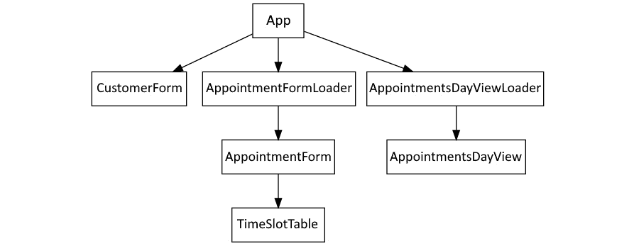
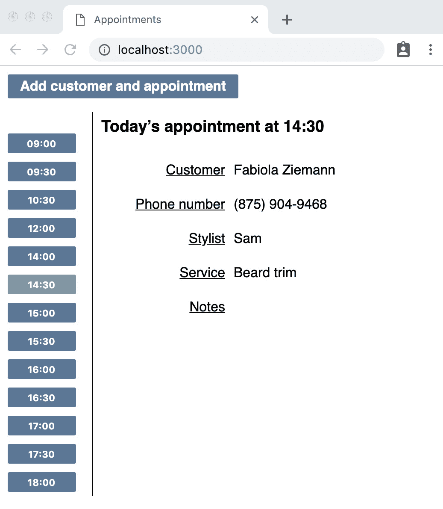

# 第八章：构建应用程序组件

您迄今为止构建的组件都是独立构建的：它们不能很好地结合在一起，用户在加载应用程序时没有遵循的工作流程。到目前为止，我们通过在`src/index.js`文件中替换组件来手动测试我们的组件。

在本章中，我们将通过创建一个根应用程序组件`App`，将所有这些组件整合到一个功能系统中，该组件将依次显示这些组件。

您现在已经看到了几乎所有的测试驱动开发（TDD）技术，这些技术对于测试驱动 React 应用程序都是必需的。本章将介绍最后一个技术：测试回调属性。

本章将涵盖以下主题：

+   制定计划

+   使用状态来控制活动视图

+   测试驱动回调属性

+   利用回调值

到本章结束时，您将学会如何使用模拟来测试应用程序的根组件，并且您将拥有一个将本书*第一部分*中您所工作的所有组件连接在一起的工作应用程序。

# 技术要求

本章的代码文件可以在以下位置找到：[`github.com/PacktPublishing/Mastering-React-Test-Driven-Development-Second-Edition/tree/main/Chapter08`](https://github.com/PacktPublishing/Mastering-React-Test-Driven-Development-Second-Edition/tree/main/Chapter08)

# 制定计划

在我们深入到`App`组件的代码之前，让我们先进行一点前期设计，以便我们知道我们要构建什么。

以下图显示了您所构建的所有组件以及`App`如何将它们连接起来：



图 8.1 – 组件层次结构

这就是它的工作方式：

1.  当用户首次加载应用程序时，他们将使用`AppointmentsDayView`组件看到今天的预约列表，该组件的预约数据将由其容器`AppointmentsDayViewLoader`组件填充。

1.  在屏幕顶部，用户将看到一个标签为`AppointmentsDayView`的按钮消失，并出现`CustomerForm`。

1.  当表单填写完毕并点击提交按钮时，用户将看到`AppointmentForm`，并可以为该客户添加一个新的预约。

1.  一旦他们添加了预约，他们将被带回到`AppointmentsDayView`。

第一步如下截图所示。在这里，您可以看到右上角的新按钮。`App`组件将渲染此按钮，然后协调此工作流程：



图 8.2 – 显示在右上角的新按钮的应用程序

这是一个非常简单的流程，仅支持单一用例：同时添加新客户和预约。在本书的后面部分，我们将添加对为现有客户创建预约的支持。

到此为止，我们已经准备好构建新的`App`组件。

# 使用状态来控制活动视图

在本节中，我们将以通常的方式开始构建一个新的`App`组件。首先，我们将显示`AppointmentsDayViewLoader`组件。因为这个子组件在挂载时进行网络请求，所以我们将模拟它。然后，我们将在页面的顶部添加一个按钮，位于`menu`元素内。当这个按钮被点击时，我们将用`CustomerForm`组件替换`AppointmentsDayViewLoader`组件。

我们将引入一个名为`view`的状态变量，它定义了当前显示哪个组件。最初，它将设置为`dayView`。当按钮被点击时，它将更改为`addCustomer`。

JSX 构建将最初使用三元运算符在这两个视图之间切换。稍后，我们将添加一个名为`addAppointment`的第三个值。当我们这样做时，我们将“升级”我们的三元表达式为`switch`语句。

要开始，请按照以下步骤操作：

1.  创建一个新文件`test/App.test.js`，为新`App`组件添加以下导入：

    ```js
    import React from "react";
    import {
      initializeReactContainer,
      render,
    } from "./reactTestExtensions";
    import { App } from "../src/App";
    ```

1.  接下来，导入`AppointmentsDayViewLoader`并模拟其实现：

    ```js
    import {
      AppointmentsDayViewLoader
    } from "../src/AppointmentsDayViewLoader";
    jest.mock("../src/AppointmentsDayViewLoader", () => ({
      AppointmentsDayViewLoader: jest.fn(() => (
        <div id="AppointmentsDayViewLoader" />
      )),
    }));
    ```

1.  现在，让我们添加我们的第一个测试，该测试检查`AppointmentsDayViewLoader`是否已渲染：

    ```js
    describe("App", () => {
      beforeEach(() => {
        initializeReactContainer();
      });
      it("initially shows the AppointmentDayViewLoader", () => {
        render(<App />);
        expect(AppointmentsDayViewLoader).toBeRendered();
      });
    });
    ```

1.  通过向新文件`src/App.js`中添加以下代码来使该测试通过：

    ```js
    import React from "react";
    import ReactDOM from "react-dom";
    import {
      AppointmentsDayViewLoader
    } from "./AppointmentsDayViewLoader";
    export const App = () => (
      <AppointmentsDayViewLoader />
    );
    ```

1.  对于第二个测试，我们将在页面的顶部添加一个菜单。为此，我们需要元素匹配器，所以将其添加到测试套件的导入中：

    ```js
    import {
      initializeReactContainer,
      render,
      element,
    } from "./reactTestExtensions";
    ```

1.  添加第二个测试：

    ```js
    it("has a menu bar", () => {
      render(<App />);
      expect(element("menu")).not.toBeNull();
    });
    ```

1.  要使该测试通过，将`App`组件更改为包括位于加载组件之上的`menu`元素：

    ```js
    export const App = () => (
      <>
        <menu />
        <AppointmentsDayViewLoader />
      </>
    )
    ```

1.  接下来，我们希望在菜单中显示一个按钮，点击后可以切换到`CustomerForm`。添加以下测试，它断言按钮出现在页面上，使用 CSS 选择器找到渲染的按钮元素。这使用了`:first-of-type`伪类来确保我们找到第一个按钮（在本书的后面部分，我们将向菜单中添加第二个按钮）：

    ```js
    it("has a button to initiate add customer and appointment action", () => {
      render(<App />);
      const firstButton = element(
        "menu > li > button:first-of-type"
      );
      expect(firstButton).toContainText(
        "Add customer and appointment"
      );
    }); 
    ```

1.  要使该测试通过，将`App`组件中的菜单更改为以下内容：

    ```js
    <menu>
      <li>
        <button type="button">
          Add customer and appointment
        </button>
      <li>
    </menu>
    ```

1.  对于下一个测试，我们必须检查点击按钮是否渲染`CustomerForm`。我们必须模拟此组件。为此，我们需要已导入到测试套件中的组件。将以下行添加到`test/App.test.js`中：

    ```js
    import { CustomerForm } from "../src/CustomerForm";
    ```

1.  在此代码下方，添加以下模拟定义，这是我们的标准模拟定义：

    ```js
    jest.mock("../src/CustomerForm", () => ({
      CustomerForm: jest.fn(() => (
        <div id="CustomerForm" />
      )),
    }));
    ```

为什么要模拟一个在挂载时没有影响的组件？

此组件已经有一个测试套件，这样我们就可以使用测试替身并验证正确的属性，以避免重新测试我们在其他地方已经测试过的功能。例如，`CustomerForm`测试套件有一个测试来检查提交按钮是否调用`onSave`属性并传递保存的客户对象。因此，而不是扩展`App`的测试范围以包括该提交功能，我们可以模拟该组件并直接调用`onSave`。我们将在下一节中这样做。

1.  要点击按钮，我们需要我们的点击助手。现在将其引入：

    ```js
    import {
      initializeReactContainer,
      render,
      element,
      click,
    } from "./reactTestExtensions";
    ```

1.  现在，添加测试。这引入了一个辅助函数 `beginAddingCustomerAndAppointment`，它找到按钮并点击它。我们现在将其提取出来，因为我们将在大多数剩余的测试中使用它：

    ```js
    const beginAddingCustomerAndAppointment = () =>
      click(element("menu > li > button:first-of-type"));
    it("displays the CustomerForm when button is clicked", async () => {
      render(<App />);
      beginAddingCustomerAndAppointment();
      expect(element("#CustomerForm")).not.toBeNull();
    });
    ```

1.  使其通过需要添加一个组件状态来跟踪我们是否点击了按钮。在 `src/App.js` 中，导入我们需要的两个钩子 `useState` 和 `useCallback`，以及导入 `CustomerForm`：

    ```js
    import React, { useState, useCallback } from "react";
    import { CustomerForm } from "./CustomerForm";
    ```

1.  在 `App` 组件中，定义新的视图状态变量并将其初始化为 `dayView` 字符串，我们将用它来表示 `AppointmentsDayViewLoader`：

    ```js
    const [view, setView] = useState("dayView");
    ```

1.  在那下面，添加一个新的回调函数 `transitionToAddCustomer`，我们将在下一步将其附加到按钮的 `onClick` 处理程序。这个回调更新视图状态变量，使其指向第二页，我们将称之为 `addCustomer`：

    ```js
    const transitionToAddCustomer = useCallback(
      () => setView("addCustomer"),
      []
    );
    ```

1.  将其连接到按钮的 `onClick` 属性：

    ```js
    <button
      type="button"
      onClick={transitionToAddCustomer}>
      Add customer and appointment
    </button>
    ```

1.  现在，我们只剩下修改我们的 JSX，以确保当 `view` 状态变量设置为 `addCustomer` 时，`CustomerForm` 组件会被渲染。注意，测试并没有强迫我们隐藏 `AppointmentsDayViewLoader`。这一点将在后续的测试中体现。目前，我们只需要最简单的代码来使测试通过。按照以下所示更新你的 JSX：

    ```js
    return (
      <>
        <menu>
          ...
        </menu>
        {view === "addCustomer" ? <CustomerForm /> : null}
      </>
    );
    ```

测试新组件的存在

严格来说，这**不是**使测试通过的最简单方法。我们可以通过**总是**渲染一个 `CustomerForm` 组件来使测试通过，无论 `view` 的值如何。然后，我们需要通过第二个测试来三角定位，以证明组件最初并没有被渲染。我跳过这一步以节省篇幅，但如果你愿意，可以添加它。

1.  我们需要确保向 `CustomerForm` 传递一个 `original` 属性。在这个工作流程中，我们正在创建一个新的客户，以便我们可以给它一个空白客户对象，就像我们在 `CustomerForm` 测试套件中使用的那样。在下面添加以下测试。我们将在下一步定义 `blankCustomer`：

    ```js
    it("passes a blank original customer object to CustomerForm", async () => {
      render(<App />);
      beginAddingCustomerAndAppointment();
      expect(CustomerForm).toBeRenderedWithProps(
        expect.objectContaining({
          original: blankCustomer
        })
      );
    });
    ```

1.  创建一个新的文件，`test/builders/customer.js`，并添加 `blankCustomer` 的定义：

    ```js
    export const blankCustomer = {
      firstName: "",
      lastName: "",
      phoneNumber: "",
    };
    ```

1.  将这个新定义导入到你的 `App` 测试套件中：

    ```js
    import { blankCustomer } from "./builders/customer";
    ```

值构建函数与函数构建函数

我们将 `blankCustomer` 定义为一个常量值，而不是一个函数。我们可以这样做，因为我们编写的所有代码都将变量视为不可变对象。如果不是这样，我们可能更喜欢使用一个函数 `blankCustomer()`，它在每次被调用时都会生成新的值。这样，我们可以确保一个测试不会意外地修改后续测试的设置。

1.  让我们使那个测试通过。首先，在 `src/App.js` 的顶部定义 `blankCustomer`：

    ```js
    const blankCustomer = {
      firstName: "",
      lastName: "",
      phoneNumber: "",
    };
    ```

在生产代码和测试代码中使用构建函数

现在，你的生产代码和测试代码中都有相同的 `blankCustomer` 定义。这种重复通常是可行的，特别是考虑到这个对象如此简单。但对于非平凡的构建函数，你应该考虑先进行测试驱动实现，然后在测试套件中充分利用它。

1.  然后，只需通过将其设置为 `CustomerForm` 的 `original` 属性来引用该值。进行此更改后，您的测试应该会通过：

    ```js
    {view === "addCustomer" ? (
        <CustomerForm original={blankCustomer} />
    ) : null}
    ```

1.  接下来，添加以下测试以在添加客户时隐藏 `AppointmentsDayViewLoader`：

    ```js
    it("hides the AppointmentsDayViewLoader when button is clicked", async () => {
      render(<App />);
      beginAddingCustomerAndAppointment();
      expect(
        element("#AppointmentsDayViewLoader")
      ).toBeNull();
    });
    ```

1.  为了使测试通过，我们需要将 `AppointmentsDayViewLoader` 移动到三元表达式中，以替换 null：

    ```js
    { view === "addCustomer" ? (
     <CustomerForm original={blankCustomer} />
    ) : (
     <AppointmentsDayViewLoader />
    )}
    ```

1.  让我们也将按钮栏隐藏：

    ```js
    it("hides the button bar when CustomerForm is being displayed", async () => {
      render(<App />);
      beginAddingCustomerAndAppointment();
      expect(element("menu")).toBeNull();
    });
    ```

1.  为了解决这个问题，我们需要将三元表达式从 JSX 中完全提取出来，如下面的代码所示。这很混乱，但我们在下一节中会改进其实现：

    ```js
    return view === "addCustomer" ? (
      <CustomerForm original={blankCustomer} />
    ) : (
      <>
        <menu>
          ...
        </menu>
        <AppointmentsDayViewLoader />
      </>
    );
    ```

这样，您已经实现了工作流程中的第一步——即将屏幕从 `AppointmentsDayViewLoader` 组件更改为 `CustomerForm` 组件。您通过将 `view` 状态变量从 `dayView` 更改为 `addCustomer` 来完成此操作。对于下一步，我们将使用 `CustomerForm` 的 `onSave` 属性来提醒我们何时将 `view` 更新为 `addAppointment`。

# 测试驱动回调属性

在本节中，我们将介绍一个新的扩展函数 `propsOf`，它深入模拟的子组件并返回传递给它的属性。我们将使用它来获取 `onSave` 回调属性值，并在测试中调用它，模拟如果真实的 `CustomerForm` 已被提交会发生的情况。

值得重新审视我们为什么想这样做。直接深入组件并调用属性似乎很复杂。然而，替代方案更复杂，也更脆弱。

我们接下来要编写的测试是断言在 `CustomerForm` 提交并保存新客户后，`AppointmentFormLoader` 组件被显示：

```js
it("displays the AppointmentFormLoader after the CustomerForm is submitted", async () => {
  // ...
});
```

现在，假设我们想在没有模拟的 `CustomerForm` 的情况下测试这个功能。我们需要填写真实的 `CustomerForm` 表单字段并点击提交按钮。这可能看起来很合理，但我们会增加 `App` 测试套件的表面积，包括 `CustomerForm` 组件。任何对 `CustomerForm` 组件的更改不仅需要更新 `CustomerForm` 测试，现在还需要更新 `App` 测试。这正是我们将在 *第九章* 中看到的场景，*表单验证*，当我们更新 `CustomerForm` 以包括字段验证时。

通过模拟子组件，我们可以减少表面积并降低子组件更改时破坏测试的可能性。

模拟组件需要小心处理

即使是模拟组件，我们的父组件测试套件仍然可能受到子组件更改的影响。这可能发生在属性的含义发生变化时。例如，如果我们更新了 `CustomerForm` 上的 `onSave` 属性以返回不同的值，我们需要更新 `App` 测试以反映这一点。

这是我们需要做的事情。首先，我们必须在我们的扩展模块中定义一个`propsOf`函数。然后，我们必须编写模拟提交`CustomerForm`组件并将用户转移到`AppointmentFormLoader`组件的测试。我们将通过为视图状态变量引入一个新的`addAppointment`值来实现这一点。按照以下步骤操作：

1.  在`test/reactTestExtensions.js`中，添加以下`propsOf`的定义。它查找对模拟组件的最后调用，并返回其属性：

    ```js
    export const propsOf = (mockComponent) => {
      const lastCall = mockComponent.mock.calls[
        mockComponent.mock.calls.length – 1
      ];
      return lastCall[0];
    };
    ```

1.  在`test/App.test.js`中，更新扩展导入，使其包括`propsOf`：

    ```js
    import {
      initializeReactContainer,
      render,
      element,
      click,
      propsOf,
    } from "./reactTestExtensions";
    ```

1.  你还需要从 React 的测试工具中导入`act`函数。我们的测试将包装对回调属性的调用，以确保在调用返回之前运行任何设置器：

    ```js
    import { act } from "react-dom/test-utils";
    ```

1.  还有一个导入需要添加——`AppointmentFormLoader`的导入：

    ```js
    import {
      AppointmentFormLoader
    } from "../src/AppointmentFormLoader";
    ```

1.  在那下面，使用标准的组件模拟定义定义它的模拟：

    ```js
    jest.mock("../src/AppointmentFormLoader", () => ({
      AppointmentFormLoader: jest.fn(() => (
        <div id="AppointmentFormLoader" />
      )),
    }));
    ```

1.  我们几乎准备好进行测试了。不过，首先让我们定义一个辅助函数`saveCustomer`。这是代码中调用属性的关键部分。注意，这设置了默认客户对象`exampleCustomer`。我们将使用这个默认值来避免在每个测试中指定客户，因为那里的值并不重要：

    ```js
    const exampleCustomer = { id: 123 };
    const saveCustomer = (customer = exampleCustomer) =>
      act(() => propsOf(CustomerForm).onSave(customer));
    ```

在测试套件中使用 act

这是我们第一次自愿在我们的测试套件中留下对 act 的引用。在其他所有用例中，我们设法在我们的扩展模块中隐藏了对`act`的调用。不幸的是，这在这里是不可能的——至少，按照我们编写`propsOf`的方式是不可能的。另一种方法是将一个名为`invokeProp`的扩展函数写出来，它接受属性的名称并为我们调用它：

`invokeProp(CustomerForm, "onSave", customer);`

这种方法的缺点是，你现在已经将`onSave`从对象属性降级为字符串。所以，我们现在将忽略这种方法，并忍受在我们的测试套件中使用`act`。

1.  让我们编写我们的测试。我们想要断言，一旦`CustomerForm`被提交，`AppointmentsFormLoader`就会显示一次：

    ```js
    it("displays the AppointmentFormLoader after the CustomerForm is submitted", async () => {
      render(<App />);
      beginAddingCustomerAndAppointment();
      saveCustomer();
      expect(
        element("#AppointmentFormLoader")
      ).not.toBeNull();
    });
    ```

1.  使这个通过将涉及向视图状态变量`addAppointment`添加一个新值。有了这个第三个值，三元表达式就不再适合用途，因为它只能处理视图的两个可能值。所以，在我们继续使这个通过之前，让我们重构那个三元表达式，使其使用`switch`语句。跳过你刚刚编写的测试，使用`it.skip`。

1.  用以下代码替换组件的返回语句：

    ```js
    switch (view) {
      case "addCustomer":
        return (
          <CustomerForm original={blankCustomer} />
        );
      default:
        return (
          <>
            <menu>
              <li>
                <button
                  type="button"
                  onClick={transitionToAddCustomer}>
                  Add customer and appointment
                </button>
              </li>
            </menu>
            <AppointmentsDayViewLoader />
          </>
        );
    }
    ```

1.  一旦你验证了你的测试仍然通过，将你最新的测试从`it.skip`改回`it`。

1.  当`CustomerForm`的`onSave`属性被调用时，组件应该更新视图到`addAppointment`。让我们用一个新的回调处理程序来实现这一点。在`transitionToAddCustomer`定义下面添加以下代码：

    ```js
    const transitionToAddAppointment = useCallback(
      () => {
      setView("addAppointment")
    }, []);
    ```

1.  修改`CustomerForm`渲染表达式，使其接受这个作为属性：

    ```js
    <CustomerForm
      original={blankCustomer}
      onSave={transitionToAddAppointment}
    />
    ```

1.  通过添加以下 `case` 语句将新的 `addAppointment` 值连接起来。在做出这个更改后，你的测试应该会通过：

    ```js
    case "addAppointment":
      return (
        <AppointmentFormLoader />
      );
    ```

1.  对于下一个测试，我们需要为 `original` 属性传递一个值，这次是传递给 `AppointmentFormLoader`。注意 `expect.objectContaining` 的双重使用。这是必要的，因为我们的预约不会是一个简单的空白预约对象。这次，预约将传递一个客户 ID。这个客户 ID 是我们刚刚添加的客户 ID - 我们将在下一个测试中为它编写测试：

    ```js
    it("passes a blank original appointment object to CustomerForm", async () => {
      render(<App />);
      beginAddingCustomerAndAppointment();
      saveCustomer();
      expect(AppointmentFormLoader).toBeRenderedWithProps(
        expect.objectContaining({
          original: 
            expect.objectContaining(blankAppointment),
        })
      );
    });
    ```

1.  我们需要一个构建函数，就像 `blankCustomer` 一样。创建一个新的文件，`test/builders/appointment.js`，并添加以下定义：

    ```js
    export const blankAppointment = {
      service: "",
      stylist: "",
      startsAt: null,
    };
    ```

1.  更新测试代码以导入它：

    ```js
    import {
      blankAppointment
    } from "./builders/appointment";
    ```

1.  然后，在 `src/App.js` 中创建相同的内容：

    ```js
    const blankAppointment = {
      service: "",
      stylist: "",
      startsAt: null,
    };
    ```

1.  最后，你可以通过设置 `original` 属性来使测试通过，如下所示：

    ```js
    <AppointmentFormLoader original={blankAppointment} />
    ```

我们几乎完成了 `AppointmentFormLoader` 的显示，但还不完全：我们仍然需要从 `onSave` 回调中接收客户 ID，并通过 `original` 属性值传递给它，这样 `AppointmentForm` 就知道我们正在为哪个客户创建预约。

# 利用回调值

在本节中，我们将介绍一个新的状态变量 `customer`，它将在 `CustomerForm` 接收到 `onSave` 回调时设置。之后，我们将在我们的工作流程中进行最后的转换，从 `addAppointment` 返回到 `dayView`。

按照以下步骤操作：

1.  这次，我们将检查新的客户 ID 是否传递给了 `AppointmentFormLoader`。记得在上一节中我们如何给 `saveCustomer` 提供一个客户参数？我们将在本测试中使用它：

    ```js
    it("passes the customer to the AppointmentForm", async () => {
      const customer = { id: 123 };
      render(<App />);
      beginAddingCustomerAndAppointment();
      saveCustomer(customer);
      expect(AppointmentFormLoader).toBeRenderedWithProps(
        expect.objectContaining({
          original: expect.objectContaining({
            customer: customer.id,
          }),
        })
      );
    });
    ```

1.  为了实现这一点，我们需要为客户添加一个状态变量。在 `App` 组件的顶部添加以下内容：

    ```js
    const [customer, setCustomer] = useState();
    ```

1.  当我们在 *第六章* 中构建 `CustomerForm` 的 `onSave` 属性时，*探索测试替身*，我们传递了更新后的客户对象。更新 `transitiontoAddAppointment` 处理程序，使其接受此参数值并使用 `setCustomer` 设置器保存它：

    ```js
    const transitionToAddAppointment = useCallback(
      (customer) => {
      setCustomer(customer);
      setView("addAppointment")
    }, []);
    ```

1.  通过创建一个新的 `original` 对象值，将客户 ID 合并到 `blankAppointment` 中，将其传递给 `AppointmentFormLoader`：

    ```js
    case "addAppointment":
      return (
        <AppointmentFormLoader
          original={{
            ...blankAppointment,
            customer: customer.id,
          }}
        />
    );
    ```

1.  是时候对这个组件进行最后的测试了。我们通过断言一旦预约保存，视图就会更新回 `dayView` 来完成用户工作流程：

    ```js
    const saveAppointment = () =>
      act(() => propsOf(AppointmentFormLoader).onSave());
    it("renders AppointmentDayViewLoader after AppointmentForm is submitted", async () => {
      render(<App />);
      beginAddingCustomerAndAppointment();
      saveCustomer();
      saveAppointment();
      expect(AppointmentsDayViewLoader).toBeRendered();
    });
    ```

1.  定义一个新的函数来将状态重置回 `dayView`：

    ```js
    const transitionToDayView = useCallback(
      () => setView("dayView"),
      []
    );
    ```

1.  将此函数传递给 `AppointmentsFormLoader` 以确保在预约保存时调用它。在此之后，你的测试应该完成并通过：

    ```js
    case "addAppointment":
      return (
        <AppointmentFormLoader
          original={{
            ...blankAppointment,
            customer: customer.id,
          }}
          onSave={transitionToDayView}
        />
      );
    ```

我们完成了！

现在，剩下的就是更新 `src/index.js` 以渲染 `App` 组件。然后，你可以手动测试以检查你的成果：

```js
import React from "react";
import ReactDOM from "react-dom";
import { App } from "./App";
ReactDOM
  .createRoot(document.getElementById("root"))
  .render(<App />);
```

要运行应用程序，请使用`npm run serve`命令。有关更多信息，请参阅*第六章**，探索测试替身*部分中的*技术要求*部分，或查阅存储库中的`README.md`文件。

# 摘要

本章介绍了你将要学习的最终 TDD 技术——模拟组件回调属性。你学习了如何使用`propsOf`扩展获取组件回调的引用，以及如何使用状态变量来管理工作流程不同部分之间的转换。

你会注意到`App`中的所有子组件都被模拟了。这种情况通常发生在顶级组件中，其中每个子组件都是一个相对复杂、自包含的单元。

在本书的下一部分，我们将把所学的一切应用到更复杂的场景中。我们将首先将字段验证引入到我们的`CustomerForm`组件中。

# 练习

以下是一些供你尝试的练习：

1.  更新你的`CustomerForm`和`AppointmentForm`测试，以使用你创建的新构建器。

1.  向`AppointmentForm`添加一个测试，确保在表单提交时提交客户 ID。

# 第二部分 – 构建应用程序功能

这一部分基于你在*第一部分*中学到的基本技术，通过将它们应用于你在工作中会遇到的真实世界问题来应用它们，并介绍了许多 React 开发者使用的库：React Router、Redux 和 Relay（GraphQL）。目标是向你展示 TDD 工作流程甚至可以用于大型应用程序。

本部分包括以下章节：

+   *第九章*，*表单验证*

+   *第十章*，*过滤和搜索数据*

+   *第十一章*，*测试驱动 React Router*

+   *第十二章*，*测试驱动 Redux*

+   *第十三章*，*测试驱动 GraphQL*
