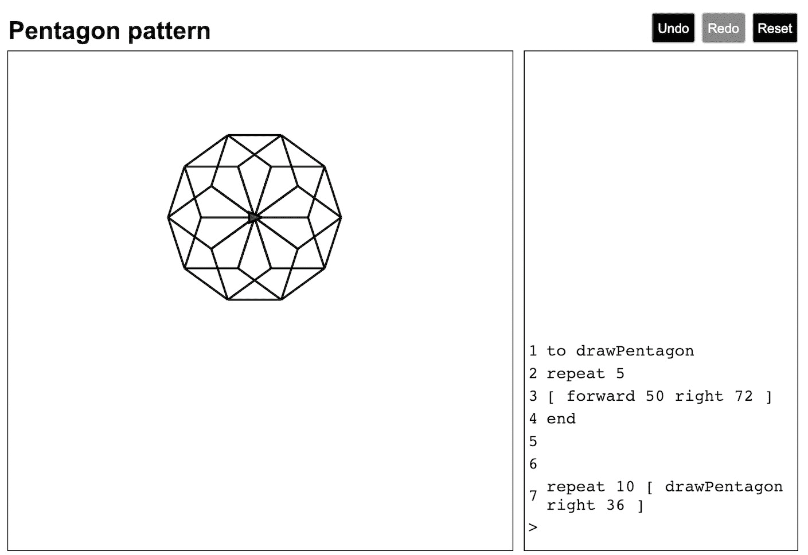
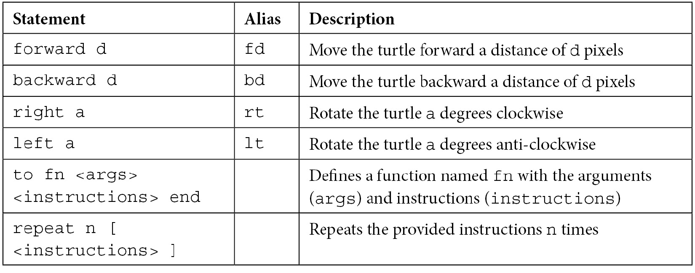

# 第十四章：构建 Logo 解释器

Logo 是在 20 世纪 60 年代创建的一个编程环境。在许多十年里，它是教授孩子们如何编码的一种流行方式——我对高中时编写 Logo 程序的记忆犹新。其核心，它是一种通过命令式指令构建图形的方法。

在本书的这一部分，我们将构建一个名为**Spec Logo**的应用程序。起点是一个已经可以工作的解释器和基本的 UI。在接下来的章节中，我们将向这个代码库添加更多功能。

本章提供了第二次测试 Redux 的机会。它涵盖了以下主题：

+   研究 Spec Logo 用户界面

+   在 Redux 中撤销和重做用户操作

+   通过 Redux 中间件将数据保存到本地存储

+   更改键盘焦点

到本章结束时，你将学会如何测试驱动复杂的 Redux reducer 和中间件。

# 技术要求

本章的代码文件可以在以下位置找到：

[`github.com/PacktPublishing/Mastering-React-Test-Driven-Development-Second-Edition/tree/main/Chapter14`](https://github.com/PacktPublishing/Mastering-React-Test-Driven-Development-Second-Edition/tree/main/Chapter14)

# 研究 Spec Logo 用户界面

界面有两个面板：左侧面板是绘图面板，这是 Logo 脚本输出出现的地方。右侧是一个提示框，用户可以在此编辑指令：



图 14.1：Spec Logo 界面

看一下截图。你可以看到以下内容：

+   左上角的**脚本名称**。这是一个用户可以点击以更改当前脚本名称的文本字段。

+   **显示区域**，它显示脚本输出在页面左侧。你可以看到这里绘制了一个形状，这是在提示框中输入的 Logo 语句的结果。

+   屏幕中间的**海龟**。这是一个标记绘图命令起点的绿色三角形。海龟有一个*x*和*y*位置，起始位置为*0,0*，这是屏幕的中间。可见的绘图大小为 600x600，海龟可以在这个区域内移动。海龟还有一个角度，初始为零，指向正右方。

+   右下角的**提示框**，标记为**>**符号。这是你输入语句的地方，可以是多行的。按下*Enter*键将当前提示文本发送到解释器。如果它是一个完整的语句，它将被执行，并且提示框将被清除，以便输入下一个语句。

+   上方提示框中的**语句历史**。它列出了所有之前执行过的语句。每个语句都有一个编号，这样你可以回溯到相应的语句。

+   右上角的**菜单栏**，包含**撤销**、**重做**和**重置**按钮。我们将在本章中构建这个菜单栏。

尽管我们本章不会编写任何 Logo 代码，但花些时间在解释器上玩耍并制作自己的绘图是值得的。以下是一份您可以使用的指令列表：



值得一看的是代码库。`src/parser.js` 文件和 `src/language` 目录包含 Logo 解释器。测试目录中也有相应的测试文件。我们不会修改这些文件，但您可能对查看此功能是如何被测试的感兴趣。

在 `src/reducers/script.js` 中有一个单独的 Redux reducer。它的 `defaultState` 定义巧妙地封装了表示 Logo 程序执行所需的一切。几乎所有的 React 组件都以某种方式使用这个状态。

在本章中，我们将向该目录添加两个额外的 reducer：一个用于撤销/重做，另一个用于提示焦点。我们还将对三个 React 组件进行修改：`MenuButtons`、`Prompt` 和 `ScriptName`。

让我们从构建一个新的 reducer 开始，命名为 `withUndoRedo`。

# 在 Redux 中撤销和重做用户操作

在本节中，我们将在页面顶部添加撤销和重做按钮，允许用户撤销和重做他们之前运行的语句。它们的工作方式如下：

1.  初始时，两个按钮都将被禁用。

1.  一旦用户执行了一个语句，**撤销**按钮将变为可用。

1.  当用户点击**撤销**按钮时，最后一个语句将被撤销。

1.  在这一点上，**重做**按钮变为可用，用户可以选择重做最后一个语句。

1.  可以按顺序撤销和重做多个操作。

1.  如果用户在**重做**可用时执行新的操作，重做序列将被清除，**重做**按钮再次不可用。

除了添加按钮元素外，这里的工作涉及构建一个新的 reducer，名为 `withUndoRedo`，它将**装饰**脚本 reducer。这个 reducer 将返回与脚本 reducer 相同的状态，但有两个额外的属性：`canUndo` 和 `canRedo`。此外，reducer 在其中存储 `past` 和 `future` 数组，记录过去和未来的状态。这些将不会被返回给用户，只是存储，如果用户选择撤销或重做，将替换当前状态。

## 构建 reducer

这个 reducer 将是一个高阶函数，当与现有的 reducer 一起调用时，返回一个新的 reducer，该 reducer 返回我们期望的状态。在我们的生产代码中，我们将用以下 store 代码替换它：

```js
combineReducers({
  script: scriptReducer
})
```

我们将用这个装饰过的 reducer 来替换它，这个 reducer 完全相同的 reducer，并用我们将在本节中构建的 `withUndoRedo` reducer 包装：

```js
combineReducers({
  script: withUndoRedo(scriptReducer)
})
```

为了测试这个，我们需要使用一个间谍来代替脚本 reducer，我们将称之为 `decoratedReducerSpy`。

### 设置初始状态

让我们从构建 reducer 本身开始，然后再添加按钮来练习新功能：

1.  创建一个名为 `test/reducers/withUndoRedo.test.js` 的新文件，并添加以下设置和测试，该测试指定了当我们向 reducer 传递一个未定义的状态时应该发生什么。这相当于我们开始测试其他 reducer 的方式，但在这个情况下，我们将调用传递给装饰 reducer。测试将一个 `undefined` 状态传递给 reducer，这是初始化 reducer 所需机制：

    ```js
    import {
      withUndoRedo
    } from "../../src/reducers/withUndoRedo";
    describe("withUndoRedo", () => {
      let decoratedReducerSpy;
      let reducer;
      beforeEach(() => {
        decoratedReducerSpy = jest.fn();
        reducer = withUndoRedo(decoratedReducerSpy);
      });
      describe("when initializing state", () => {
        it("calls the decorated reducer with undefined state and an action", () => {
          const action = { type: "UNKNOWN" };
          reducer(undefined, action);
          expect(decoratedReducerSpy).toBeCalledWith(
            undefined,
            action);
        });
      });
    });
    ```

1.  创建一个名为 `src/reducers/withUndoRedo.js` 的新文件，并使用以下代码使测试通过：

    ```js
    export const withUndoRedo = (reducer) => {
      return (state, action) => {
        reducer(state, action);
      };
    };
    ```

1.  按照以下所示将下一个测试添加到 `describe` 块中。这使用了我们在 *第六章* 中首次遇到的 `toMatchObject` 匹配器，*探索测试替身*：

    ```js
    it("returns a value of what the inner reducer returns", () => {
      decoratedReducerSpy.mockReturnValue({ a: 123 });
      expect(reducer(undefined)).toMatchObject(
        { a : 123 }
      );
    });
    ```

1.  通过添加 `return` 关键字来使测试通过：

    ```js
    export const withUndoRedo = (reducer) => {
      return (state, action) => {
    return reducer(state, action);
      };
    }
    ```

1.  初始时，`canUndo` 和 `canRedo` 都应该是 `false`，因为没有可以移动到的前一个或未来状态。让我们将这两个测试作为一对添加，仍然在同一 `describe` 块中：

    ```js
    it("cannot undo", () => {
      expect(reducer(undefined)).toMatchObject({
        canUndo: false
      });
    });
    it("cannot redo", () => {
      expect(reducer(undefined)).toMatchObject({
        canRedo: false
      });
    });
    ```

1.  为了使这些测试通过，我们需要创建一个新的对象，并添加以下属性：

    ```js
    export const withUndoRedo = (reducer) => {
      return (state, action) => {
        return {
          canUndo: false,
          canRedo: false,
          ...reducer(state, action)
        };
      };
    }
    ```

1.  让我们继续到 reducer 的核心部分。在执行一个动作之后，我们希望能够执行 `present` 和 `future` 常量来表示那些状态：

    ```js
    describe("performing an action", () => {
      const innerAction = { type: "INNER" };
      const present = { a: 123 };
      const future = { b: 234 };
      beforeEach(() => {
        decoratedReducerSpy.mockReturnValue(future);
      });
      it("can undo after a new present has been provided", () => {
        const result = reducer(
          { canUndo: false, present },
          innerAction
        );
        expect(result.canUndo).toBeTruthy();
      });
    });
    ```

1.  使用以下代码使测试通过。由于我们不再处理未定义的状态，这是我们需要将现有代码包裹在条件块中的时刻：

    ```js
    export const withUndoRedo = (reducer) => {
      return (state, action) => {
        if (state === undefined)
          return {
            canUndo: false,
            canRedo: false,
            ...reducer(state, action)
          };
        return {
          canUndo: true
        };
      };
    };
    ```

1.  接下来，我们确保再次调用 reducer，因为对于这个新块，它不会发生。编写以下测试：

    ```js
    it("forwards action to the inner reducer", () => {
      reducer(present, innerAction);
      expect(decoratedReducerSpy).toBeCalledWith(
        present,
        innerAction
      );
    });
    ```

1.  为了使测试通过，只需在 `return` 值之前调用 reducer：

    ```js
    if (state === undefined)
      ...
    reducer(state, action);
    return {
      canUndo: true
    };
    ```

1.  下一个测试显示这个对象还需要返回新的状态：

    ```js
    it("returns the result of the inner reducer", () => {
      const result = reducer(present, innerAction);
      expect(result).toMatchObject(future);
    });
    ```

1.  通过将 reducer 值保存在名为 `newPresent` 的变量中，并将其作为返回对象的一部分返回来使测试通过：

    ```js
    const newPresent = reducer(state, action);
    return {
      ...newPresent,
      canUndo: true
    };
    ```

1.  脚本 reducer 持有一个名为 `nextInstructionId` 的特殊值。我们可以使用这个值来确定脚本指令是否被处理，或者是否发生了错误。当一条语句有效时，它将被执行，`nextInstructionId` 将递增。但是当一条语句无法被处理时，`nextInstructionId` 保持不变。我们可以使用这个事实来避免在语句包含错误时保存历史记录。为此，修改 `present` 和 `future` 常量以包含此参数，并添加新的测试，如下所示：

    ```js
    const present = { a: 123, nextInstructionId: 0 };
    const future = { b: 234, nextInstructionId: 1 };
    ...
    it("returns the previous state if nextInstructionId does not increment", () => {
      decoratedReducerSpy.mockReturnValue({
        nextInstructionId: 0
      });
      const result = reducer(present, innerAction);
      expect(result).toBe(present);
    });
    ```

1.  通过将我们的新 `return` 块包裹在条件语句中，并在条件不满足时返回旧状态来使测试通过：

    ```js
    const newPresent = reducer(state, action);
    if (
      newPresent.nextInstructionId !=
      state.nextInstructionId
    ) {
      return {
        ...newPresent,
        canUndo: true 
      };
    }
    return state;
    ```

这涵盖了执行任何动作的所有功能，除了**撤销**和**重做**。下一节将介绍**撤销**。

### 处理撤销动作

我们将创建一个新的 Redux 动作，类型为 `UNDO`，这将导致我们将当前状态推入一个新的数组 `past` 中：

1.  对于这个测试，我们可以重用 `present` 和 `innerAction` 属性，所以现在将它们推送到外部的 `describe` 块中。同时，定义一个新的 `undoAction` Redux 动作。我们将在第一个测试中使用它：

    ```js
    describe("withUndoRedo", () => {
      const undoAction = { type: "UNDO" };
      const innerAction = { type: "INNER" };
      const present = { a: 123, nextInstructionId: 0 };
      const future = { b: 234, nextInstructionId: 1 };
      ...
    });
    ```

1.  添加一个新的嵌套`describe`块，包含以下测试和设置。`beforeEach`块设置了一个场景，其中我们已经执行了一个将存储先前状态的行动。然后我们就可以在测试中撤销它：

    ```js
    describe("undo", () => {
     let newState;
      beforeEach(() => {
        decoratedReducerSpy.mockReturnValue(future);
        newState = reducer(present, innerAction);
      });
      it("sets present to the latest past entry", () => {
        const updated = reducer(newState, undoAction);
        expect(updated).toMatchObject(present);
      });
    });
    ```

在`beforeEach`块内执行操作

注意`beforeEach`设置中对`reducer`函数的调用。这个函数是我们要测试的函数，因此可以认为它是`reducer`测试设置的一部分，因为所有这些测试都依赖于至少执行了一个可以撤销的操作。这样，我们可以将这个`reducer`调用视为**断言**阶段的一部分。

1.  通过以下方式修改函数以使测试通过。我们使用一个`past`变量来存储先前状态。如果我们收到一个`UNDO`操作，我们返回该值。我们还使用`switch`语句，因为我们稍后会添加一个`REDO`的情况：

    ```js
    export const withUndoRedo = (reducer) => {
      let past;
      return (state, action) => {
        if (state === undefined)
          ...
        switch(action.type) {
          case "UNDO":
    return past; 
          default:
            const newPresent = reducer(state, action);
            if (
              newPresent.nextInstructionId !=
              state.nextInstructionId
            ) {
              past = state;
              return {
                ...newPresent,
                canUndo: true
              };
            }
            return state;
        }
      };
    };
    ```

1.  接下来，让我们调整它，以便我们可以撤销任意深度的操作。添加下一个测试：

    ```js
    it("can undo multiple levels", () => {
      const futureFuture = {
        c: 345, nextInstructionId: 3
      };
      decoratedReducerSpy.mockReturnValue(futureFuture);
      newState = reducer(newState, innerAction);
      const updated = reducer(
        reducer(newState, undoAction),
        undoAction
      );

      expect(updated).toMatchObject(present);
    });
    ```

1.  对于这一点，我们需要将`past`升级为一个数组：

    ```js
    export const withUndoRedo = (reducer) => {
      let past = [];
      return (state, action) => {
        if (state === undefined)
          ... 
        switch(action.type) {
          case "UNDO":
            const lastEntry = past[past.length - 1];
            past = past.slice(0, -1);
            return lastEntry;
          default:
            const newPresent = reducer(state, action);
            if (
              newPresent.nextInstructionId !=
              state.nextInstructionId
            ) {
              past = [ ...past, state ];
              return {
                ...newPresent,
                canUndo: true
              };
            }
            return state;
        }
      };
    };
    ```

1.  我们还需要进行一个最后的测试。我们需要检查在撤销之后，我们也可以重做：

    ```js
    it("sets canRedo to true after undoing", () => {
      const updated = reducer(newState, undoAction);
      expect(updated.canRedo).toBeTruthy();
    });
    ```

1.  为了使这个测试通过，返回一个由`lastEntry`和新的`canRedo`属性组成的新对象：

    ```js
    case "UNDO":
      const lastEntry = past[past.length - 1];
      past = past.slice(0, -1);
      return {
        ...lastEntry,
        canRedo: true
      };
    ```

这就是`UNDO`操作的全部内容。接下来，让我们添加`REDO`操作。

### 处理重做操作

重做与撤销非常相似，只是顺序相反：

1.  首先，在顶级`describe`块中添加一个 Redux 操作类型`REDO`的新定义：

    ```js
    describe("withUndoRedo", () => {
      const undoAction = { type: "UNDO" };
      const redoAction = { type: "REDO" };
      ...
    });
    ```

1.  在撤销`describe`块下方，添加以下重做`describe`块和第一个测试。注意间谍的设置；这里的调用是`mockReturnValueOnce`，而不是`mockReturnValue`。测试需要确保它从存储的`redo`状态中获取其值：

    ```js
    describe("redo", () => {
      let newState;
      beforeEach(() => {
        decoratedReducerSpy.mockReturnValueOnce(future);
        newState = reducer(present, innerAction);
        newState = reducer(newState, undoAction);
      });
      it("sets the present to the latest future entry", () => {
        const updated = reducer(newState, redoAction);
        expect(updated).toMatchObject(future);
      });
    });
    ```

1.  为了使这个测试通过，在你的生产代码中，声明一个`future`变量，紧挨着`past`的声明：

    ```js
    let past = [], future;
    ```

1.  在`UNDO`操作中设置此值：

    ```js
      case "UNDO":
        const lastEntry = past[past.length - 1];
        past = past.slice(0, -1);
        future = state;
    ```

1.  现在它已经保存，我们可以处理`REDO`操作。在`UNDO`子句和`default`子句之间添加以下`case`语句：

    ```js
    case "UNDO":
      ...
    case "REDO":
      return future;
    default:
      ...
    ```

1.  下一个测试是针对多级重做的。这比`undo`块中的相同情况稍微复杂一些——我们需要修改`beforeEach`块，使其回退两次。首先，从撤销测试中提取`futureFuture`值并将其带入外部作用域，紧挨着其他值，位于`future`下方：

    ```js
    const future = { b: 234, nextInstructionId: 1 };
    const futureFuture = { c: 345, nextInstructionId: 3 };
    ```

1.  现在，更新`beforeEach`以向前移动两步然后后退两步：

    ```js
    beforeEach(() => {
      decoratedReducerSpy.mockReturnValueOnce(future);
      decoratedReducerSpy.mockReturnValueOnce(
        futureFuture
      );
      newState = reducer(present, innerAction);
      newState = reducer(newState, innerAction);
      newState = reducer(newState, undoAction);
      newState = reducer(newState, undoAction);
    });
    ```

1.  最后，添加以下测试：

    ```js
    it("can redo multiple levels", () => {
      const updated = reducer(
        reducer(newState, redoAction),
        redoAction
      );
      expect(updated).toMatchObject(futureFuture);
    });
    ```

1.  为了使这个测试通过，首先初始化`future`变量为一个空数组：

    ```js
    let past = [], future = [];
    ```

1.  更新`UNDO`子句以将当前值推入其中：

    ```js
    case "UNDO":
      const lastEntry = past[past.length - 1];
      past = past.slice(0, -1);
      future = [ ...future, state ];
    ```

1.  更新`REDO`子句以提取我们刚刚推入的值。在此更改之后，测试应该通过：

    ```js
    case "REDO":
      const nextEntry = future[future.length - 1];
      future = future.slice(0, -1);
      return nextEntry;
    ```

1.  对于我们的基础实现，我们需要编写一个最后的测试，该测试检查重做操作后跟一个撤销操作能否带我们回到原始状态：

    ```js
    it("returns to previous state when followed by an undo", () => {
      const updated = reducer(
        reducer(newState, redoAction),
        undoAction
      );
      expect(updated).toMatchObject(present);
    });
    ```

1.  通过设置`REDO`情况中的`past`属性来使测试通过：

    ```js
    case "REDO":
      const nextEntry = future[future.length - 1];
      past = [ ...past, state ];
      future = future.slice(0, -1);
      return nextEntry;
    ```

1.  这完成了我们的 reducer。然而，我们的实现存在内存泄漏！当我们生成新状态时，我们从未清除`future`数组。如果用户反复点击`future`但变得不可访问，这是由于最新状态中的`canRedo`为`false`。

为了测试这个场景，你可以模拟序列并检查你期望返回`undefined`。这个测试并不*很好*，因为我们实际上不应该在`canRedo`返回`false`时发送`REDO`动作，但我们的测试最终就是这样做的：

```js
it("return undefined when attempting a do, undo, do, redo sequence", () => {
  decoratedReducerSpy.mockReturnValue(future);
  let newState = reducer(present, innerAction);
  newState = reducer(newState, undoAction);
  newState = reducer(newState, innerAction);
  newState = reducer(newState, redoAction);
  expect(newState).not.toBeDefined();
});
```

1.  为了完成这个操作，只需在设置新状态时清除`future`，如下所示：

    ```js
    if (
      newPresent.nextInstructionId !=
      state.nextInstructionId
    ) {
      past = [ ...past, state ];
      future = [];
      return {
        ...newPresent,
        canUndo: true
      };
    }
    ```

1.  我们现在已经完成了 reducer。为了完成这个任务，将其连接到我们的 Redux 存储。打开`src/store.js`并做出以下更改：

    ```js
    import {
      withUndoRedo
    } from "./reducers/withUndoRedo";
    export const configureStore = (
      storeEnhancers = [],
      initialState = {}
    ) => {
      return createStore(
        combineReducers({
          script: withUndoRedo(scriptReducer)
        }),
        initialState,
        compose(...storeEnhancers)
      );
    };
    ```

您的所有测试都应该通过，并且应用程序仍然可以运行。

然而，撤销和重做功能仍然不可访问。为此，我们需要在菜单栏中添加一些按钮。

## 构建按钮

这个谜题的最后一部分是添加按钮来触发新的行为，通过在菜单栏中添加**撤销**和**重做**按钮：

1.  打开`test/MenuButtons.test.js`并在文件的底部添加以下`describe`块，嵌套在`MenuButtons` `describe`块内部。它使用了一些已经通过`renderWithStore`文件和按钮定义的辅助函数：

    ```js
    describe("undo button", () => {
      it("renders", () => {
        renderWithStore(<MenuButtons />);
        expect(buttonWithLabel("Undo")).not.toBeNull();
      });
    });
    ```

1.  通过修改`src/MenuButtons.js`文件中的`MenuButtons`实现来执行这个操作，如下所示：

    ```js
    export const MenuButtons = () => {
      ...
      return (
        <>
          <button>Undo</button>
          <button
            onClick={() => dispatch(reset())}
            disabled={!canReset}
          >
            Reset
          </button>
        </>
      );
    };
    ```

1.  添加下一个测试，该测试检查按钮最初是禁用的：

    ```js
    it("is disabled if there is no history", () => {
      renderWithStore(<MenuButtons />);
      expect(
        buttonWithLabel("Undo").hasAttribute("disabled")
      ).toBeTruthy();
    });
    ```

1.  通过添加硬编码的`disabled`属性来执行这个操作，如下所示：

    ```js
    <button disabled={true}>Undo</button>
    ```

1.  现在，我们添加代码，这将需要我们连接到 Redux：

    ```js
    it("is enabled if an action occurs", () => {
      renderWithStore(<MenuButtons />);
      dispatchToStore({
        type: "SUBMIT_EDIT_LINE",
        text: "forward 10\n"
      });
      expect(
        buttonWithLabel("Undo").hasAttribute("disabled")
      ).toBeFalsy();
    });
    ```

1.  修改`MenuButtons`以从存储中提取`canUndo`。它已经使用`script`状态来处理**重置**按钮的行为，因此在这种情况下，我们只需要进一步解构它：

    ```js
    export const MenuButtons = () => {
      const {
        canUndo, nextInstructionId
      } = useSelector(({ script }) => script);
      ...
      const canReset = nextInstructionId !== 0;
      return (
        <>
          <button disabled={!canUndo}>Undo</button>
          <button
            onClick={() => dispatch(reset())}
            disabled={!canReset}
          >
            Reset
          </button>
        </>
      );
      }
    );
    ```

1.  当点击`UNDO`动作时的最终测试：

    ```js
    it("dispatches an action of UNDO when clicked", () => {
      renderWithStore(<MenuButtons />);
      dispatchToStore({
        type: "SUBMIT_EDIT_LINE",
        text: "forward 10\n"
      });
      click(buttonWithLabel("Undo"));
      return expectRedux(store)
        .toDispatchAnAction()
        .matching({ type: "UNDO" });
    });
    ```

1.  通过添加下面突出显示的行来完成这个操作。我们添加了新的`undo`动作辅助函数，然后使用它来调用`dispatch`：

    ```js
    const reset = () => ({ type: "RESET" });
    const undo = () => ({ type: "UNDO" });
    export const MenuButtons = () => {
      ...
      return (
        <>
          <button
            onClick={() => dispatch(undo())}
            disabled={!canUndo}
          >
            Undo
          </button>
          ...
        </>
      );
    };
    ```

1.  从*步骤 2*到*步骤 8*重复`canRedo`属性从脚本状态。

需要做的最后一个更改。撤销和重做功能现在已完成。

接下来，我们将从构建 Redux reducer 转移到构建 Redux 中间件。

# 通过 Redux 中间件将数据保存到本地存储

在本节中，我们将更新我们的应用程序，将当前状态保存到*本地存储*，这是一个由用户的网络浏览器管理的持久数据存储。我们将通过 Redux 中间件来实现这一点。

每当在`LocalStorage` API 中执行一个语句时。当用户下次打开应用程序时，这些令牌将被读取并通过解析器重新播放。

`parseTokens`函数

提醒一下，解析器（在`src/parser.js`中）有一个`parseTokens`函数。这是我们将在中间件内部调用的函数，在本节中，我们将构建测试来断言我们已调用此函数。

我们将为这个任务编写一个新的 Redux 中间件。该中间件将提取脚本状态中的两个部分：`name` 和 `parsedTokens`。

在我们开始之前，让我们回顾一下浏览器的 `LocalStorage` API：

+   `window.localStorage.getItem(key)` 返回本地存储中一个项的值。存储的值是一个字符串，因此如果它是一个序列化对象，那么我们需要调用 `JSON.parse` 来反序列化它。如果给定键没有值，函数返回 `null`。

+   `window.localStorage.setItem(key, value)` 设置一个项的值。该值被序列化为字符串，因此我们需要确保在传递之前对任何对象调用 `JSON.stringify`。

## 构建中间件

让我们测试驱动我们的中间件：

1.  创建 `src/middleware` 和 `test/middleware` 目录，然后打开 `test/middleware/localStorage.test.js` 文件。为了开始，定义两个间谍函数，`getItemSpy` 和 `setItemSpy`，它们将组成新的对象。我们必须使用 `Object.defineProperty` 来设置这些间谍函数，因为 `window.localStorage` 属性是只写的：

    ```js
    import {
      save
    } from "../../src/middleware/localStorage";
    describe("localStorage", () => {
      const data = { a: 123 };
      let getItemSpy = jest.fn();
      let setItemSpy = jest.fn();
      beforeEach(() => {
        Object.defineProperty(window, "localStorage", {
          value: {
            getItem: getItemSpy,
            setItem: setItemSpy
          }});
      });
    });
    ```

1.  让我们为中间件编写第一个测试。这个测试简单地断言中间件做了所有中间件都应该做的事情，即调用 `next(action)`。Redux 中间件函数具有复杂的语义，是返回函数的函数，但我们的测试将轻松处理这一点：

    ```js
    describe("save middleware", () => {
      const name = "script name";
      const parsedTokens = ["forward 10"];
      const state = { script: { name, parsedTokens } };
      const action = { type: "ANYTHING" };
      const store = { getState: () => state };
      let next;
      beforeEach(() => {
        next = jest.fn();
      });
      const callMiddleware = () =>
        save(store)(next)(action);
      it("calls next with the action", () => {
        callMiddleware();
        expect(next).toBeCalledWith(action);
      });
    });
    ```

1.  为了使其通过，创建 `src/middleware/localStorage.js` 文件并添加以下定义：

    ```js
    export const save = store => next => action => {
      next(action);
    };
    ```

1.  下一个测试检查我们是否返回该值：

    ```js
    it("returns the result of next action", () => {
      next.mockReturnValue({ a : 123 });
      expect(callMiddleware()).toEqual({ a: 123 });
    });
    ```

1.  更新 `save` 函数以返回该值：

    ```js
    export const save = store => next => action => {
    return next(action);
    };
    ```

1.  现在，检查我们是否将字符串化的值添加到本地存储中：

    ```js
    it("saves the current state of the store in localStorage", () => {
      callMiddleware();
      expect(setItemSpy).toBeCalledWith("name", name);
      expect(setItemSpy).toBeCalledWith(
        "parsedTokens",
        JSON.stringify(parsedTokens)
      );
    });
    ```

1.  为了使其通过，完成 `save` 中间件的实现：

    ```js
    export const save = store => next => action => {
      const result = next(action);
      const {
        script: { name, parsedTokens }
      } = store.getState();
      localStorage.setItem("name", name);
      localStorage.setItem(
        "parsedTokens",
        JSON.stringify(parsedTokens)
      );
      return result;
    };
    ```

1.  让我们继续到 `load` 函数，它不是中间件，但将其放在同一文件中并无害。创建一个新的 `describe` 块，包含以下测试，并确保更新 `import`：

    ```js
    import {
    load, save
    } from "../../src/middleware/localStorage";
    ...
    describe("load", () => {
      describe("with saved data", () => {
        beforeEach(() => {
          getItemSpy.mockReturnValueOnce("script name");
          getItemSpy.mockReturnValueOnce(
            JSON.stringify([ { a: 123 } ])
          );
        });
        it("retrieves state from localStorage", () => {
          load();
          expect(getItemSpy).toBeCalledWith("name");
          expect(getItemSpy).toHaveBeenLastCalledWith(
            "parsedTokens"
          );
        });
      });
    });
    ```

1.  通过在 `save` 的定义下方添加 `load` 函数来使该操作通过，在生成代码中定义一个新的函数：

    ```js
    export const load = () => {
      localStorage.getItem("name");
      localStorage.getItem("parsedTokens");
    };
    ```

1.  现在要将这些数据发送到解析器。为此，我们需要一个 `parserSpy` 间谍函数，我们使用它来监视解析器的 `parseTokens` 函数：

    ```js
    describe("load", () => {
      let parserSpy;
      describe("with saved data", () => {
        beforeEach(() => {
          parserSpy = jest.fn();
          parser.parseTokens = parserSpy;
          ...
        });
        it("calls to parsedTokens to retrieve data", () => {
          load();
          expect(parserSpy).toBeCalledWith(
            [ { a: 123 } ],
            parser.emptyState
          );
        });
      });
    });
    ```

1.  添加以下生成代码以使其通过：

    ```js
    import * as parser from "../parser";
    export const load = () => {
      localStorage.getItem("name");
      const parsedTokens = JSON.parse(
        localStorage.getItem("parsedTokens")
      );
      parser.parseTokens(parsedTokens, parser.emptyState);
    };
    ```

1.  下一个测试确保数据以正确的格式返回：

    ```js
    it("returns re-parsed draw commands", () => {
      parserSpy.mockReturnValue({ drawCommands: [] });
      expect(
        load().script
      ).toHaveProperty("drawCommands", []);
    });
    ```

1.  通过返回一个包含解析响应的对象来使其通过：

    ```js
    export const load = () => {
      localStorage.getItem("name");
      const parsedTokens = JSON.parse(
        localStorage.getItem("parsedTokens")
      );
      return {
        script: parser.parseTokens(
          parsedTokens, parser.emptyState
        )
      };
    };
    ```

1.  接下来，让我们将名称添加到该数据结构中：

    ```js
    it("returns name", () => {
      expect(load().script).toHaveProperty(
        "name",
        "script name"
      );
    });
    ```

1.  为了使其通过，首先，我们需要保存从本地存储返回的名称，然后将其插入到 `present` 对象中：

    ```js
    export const load = () => {
      const name = localStorage.getItem("name");
      const parsedTokens = JSON.parse(
        localStorage.getItem("parsedTokens")
      );
      return {
        script: {
          ...parser.parseTokens(
            parsedTokens, parser.initialState
          ),
          name
        }
      };
    };
    ```

1.  最后，我们需要处理尚未保存任何状态的情况。在这种情况下，`LocalStorage` API 返回 `null`，但我们希望返回 `undefined`，这将触发 Redux 使用默认状态。将此测试添加到外部的 `describe` 块中，这样它就不会拾取额外的 `getItemSpy` 模拟值：

    ```js
    it("returns undefined if there is no state saved", () => {
      getItemSpy.mockReturnValue(null);
      expect(load()).not.toBeDefined();
    });
    ```

1.  通过将 `return` 语句包裹在 `if` 语句中来使其通过：

    ```js
    if (parsedTokens && parsedTokens !== null) {
      return {
        ...
      };
    }
    ```

1.  打开`src/store.js`并修改它以包含新的中间件。我正在定义一个新的函数`configureStoreWithLocalStorage`，这样我们的测试就可以继续使用`configureStore`而不与本地存储交互：

    ```js
    ...
    import {
      save, load
    } from "./middleware/localStorage";
    export const configureStore = (
      storeEnhancers = [],
      initialState = {}
    ) => {
      return createStore(
        combineReducers({
          script: withUndoRedo(scriptReducer)
        }),
        initialState,
        compose(
          ...[
            applyMiddleware(save),
            ...storeEnhancers
          ]
        )
      );
    };
    export const configureStoreWithLocalStorage = () =>
      configureStore(undefined, load());
    ```

1.  打开`src/index.js`并将对`configureStore`的调用替换为对`configureStoreWithLocalStorage`的调用。你还需要更新`import`以使用这个新函数：

    ```js
    import {
      configureStoreWithLocalStorage
    } from "./store";
    ReactDOM.createRoot(
      document.getElementById("root")
    ).render(
      <Provider store={configureStoreWithLocalStorage()}>
        <App />
      </Provider>
    );
    ```

就这样。如果你愿意的话，这是一个运行手动测试和尝试应用的好时机。打开浏览器窗口，输入几个命令，然后试试看！

如果你不知道要运行手动测试的命令，可以使用以下命令：

```js
forward 100
right 90
to drawSquare
  repeat 4 [ forward 100 right 90 ]
end
drawSquare
```

这些命令在解释器和显示中的大多数功能都会得到锻炼。当你在*第十五章*“添加动画”中进行手动测试时，它们会很有用。

你已经学会了如何测试驱动 Redux 中间件。对于本章的最后一部分，我们将编写另一个 reducer，这次是一个帮助我们操作浏览器键盘焦点的 reducer。

# 改变键盘焦点

我们应用程序的用户，大多数时候，会在屏幕右下角的提示框中输入。为了帮助他们，当应用启动时，我们将键盘焦点移动到提示框。当另一个元素——例如名称文本框或菜单按钮——被使用并完成其工作后，我们也应该这样做。然后，焦点应该回到提示框，准备接收下一个指令。

React 不支持设置焦点，因此我们需要在我们的组件上使用一个**React ref**，然后将其放入 DOM API 中。

我们将通过 Redux reducer 来实现这一点。它将有两个动作：`PROMPT_FOCUS_REQUEST`和`PROMPT_HAS_FOCUSED`。我们应用程序中的任何 React 组件都可以发出第一个动作。`Prompt`组件将监听它，并在它聚焦后发出第二个动作。

## 编写 reducer

我们将像往常一样，从 reducer 开始：

1.  创建一个名为`test/reducers/environment.test.js`的新文件，并添加以下`describe`块。这涵盖了 reducer 在接收到`undefined`时需要返回默认状态的基本情况：

    ```js
    import {
      environmentReducer as reducer
    } from "../../src/reducers/environment";
    describe("environmentReducer", () => {
      it("returns default state when existing state is undefined", () => {
        expect(reducer(undefined, {})).toEqual({
          promptFocusRequest: false
        });
      });
    });
    ```

1.  使用以下代码使测试通过，在一个名为`src/reducers/environment.js`的文件中。由于我们之前已经构建过 reducer，我们知道这次的目标在哪里：

    ```js
    const defaultState = {
      promptFocusRequest: false
    };
    export const environmentReducer = (
      state = defaultState,
      action) => {
      return state;
    };
    ```

1.  添加下一个测试，该测试检查我们是否设置了`promptFocusRequest`值：

    ```js
    it("sets promptFocusRequest to true when receiving a PROMPT_FOCUS_REQUEST action", () => {
      expect(
        reducer(
          { promptFocusRequest: false},
          { type: "PROMPT_FOCUS_REQUEST" }
        )
      ).toEqual({
        promptFocusRequest: true
      });
    });
    ```

1.  通过添加一个`switch`语句使其通过，如下所示：

    ```js
    export const environmentReducer = (
      state = defaultState,
      action
    ) => {
      switch (action.type) {
        case "PROMPT_FOCUS_REQUEST":
          return { promptFocusRequest: true };
      }
      return state;
    };
    ```

1.  为这个 reducer 添加最后的测试：

    ```js
    it("sets promptFocusRequest to false when receiving a PROMPT_HAS_FOCUSED action", () => {
      expect(
        reducer(
          { promptFocusRequest: true},
          { type: "PROMPT_HAS_FOCUSED" }
        )
      ).toEqual({
        promptFocusRequest: false
      });
    });
    ```

1.  最后，通过添加另一个`case`语句使其通过：

    ```js
    export const environmentReducer = (...) => {
      switch (action.type) {
        ...,
        case "PROMPT_HAS_FOCUSED":
          return { promptFocusRequest: false };
      }
      ...
    }
    ```

1.  在我们可以在测试中使用新的 reducer 之前，我们需要将其添加到存储中。打开`src/store.js`并按以下方式修改：

    ```js
    ...
    import {
      environmentReducer
    } from "./reducers/environment";
    export const configureStore = (
      storeEnhancers = [],
      initialState = {}
    ) => {
      return createStore(
        combineReducers({
          script: withUndoRedo(logoReducer),
          environment: environmentReducer
        }),
        ...
      );
    };
    ```

这为我们提供了一个新的 reducer，它已经连接到 Redux 存储。现在，让我们利用它。

## 焦点提示

让我们继续到这部分最困难的部分：聚焦实际的提示。为此，我们需要引入一个 React ref：

1.  打开 `test/Prompt.test.js` 并在 `Prompt` `describe` 块底部添加以下 `describe` 块。测试使用 `document.activeElement` 属性，它是当前具有焦点的元素。它还使用 `renderInTableWithStore` 函数，它与您已经看到的 `renderWithStore` 辅助函数相同，只是组件首先被包裹在一个表格中：

    ```js
    describe("prompt focus", () => {
      it("sets focus when component first renders", () => {
        renderInTableWithStore(<Prompt />);
        expect(
          document.activeElement
        ).toEqual(textArea());
      });
    });
    ```

1.  让我们通过这个。我们使用 `useRef` 钩子定义一个新的引用，并添加一个 `useEffect` 钩子以在组件挂载时聚焦。确保从 React 常量中提取新的常量，该常量位于文件顶部：

    ```js
    import
      React, { useEffect, useRef, useState }
    from "react";
    export const Prompt = () => {
      ...
      const inputRef = useRef();
      useEffect(() => {
        inputRef.current.focus();
      }, [inputRef]);
      return (
        ...
        <textarea
          ref={inputRef}
        />
        ...
      );
    };
    ```

1.  对于下一个测试，我们将向 Redux 存储发送一个动作。由于这个测试套件还没有发送动作的测试，我们需要添加所有管道。首先，将 `dispatchToStore` 函数导入到测试套件中：

    ```js
    import {
      ...,
      dispatchToStore,
    } from "./reactTestExtensions";
    ```

1.  现在，我们需要一个新的辅助函数来清除焦点。因为焦点将在组件挂载时立即设置，我们需要再次取消设置，以便我们可以验证我们的焦点请求的行为。一旦我们有了这个辅助函数，我们就可以添加下一个测试：

    ```js
    const jsdomClearFocus = () => {
      const node = document.createElement("input");
      document.body.appendChild(node);
      node.focus();
      node.remove();
    }
    it("calls focus on the underlying DOM element if promptFocusRequest is true", async () => {
      renderInTableWithStore(<Prompt />);
      jsdomClearFocus();
      dispatchToStore({ type: "PROMPT_FOCUS_REQUEST" });
      expect(document.activeElement).toEqual(textArea());
    });
    ```

1.  为了通过这个测试，首先，创建一个新的 `useSelector` 调用来从存储中提取 `promptFocusRequest` 值：

    ```js
    export const Prompt = () => {
      const nextInstructionId = ...
      const promptFocusRequest = useSelector(
        ({ environment: { promptFocusRequest } }) =>
          promptFocusRequest
      );
      ...
    };
    ```

1.  然后，添加一个当 `promptFocusRequest` 发生变化时运行的新效果。这使用引用来调用 DOM 的 `focus` 方法在 HTML 元素上：

    ```js
    useEffect(() => {
      inputRef.current.focus();
    }, [promptFocusRequest]);
    ```

1.  对于下一个测试，当焦点发生时发送一个动作：

    ```js
    it("dispatches an action notifying that the prompt has focused", () => {
      renderWithStore(<Prompt />);
      dispatchToStore({ type: "PROMPT_FOCUS_REQUEST" });
      return expectRedux(store)
        .toDispatchAnAction()
        .matching({ type: "PROMPT_HAS_FOCUSED" });
    });
    ```

1.  为了通过这个测试，首先添加一个新的动作辅助函数，我们可以在 `Prompt` 组件中调用它：

    ```js
    const submitEditLine = ...
    const promptHasFocused = () => (
      { type: "PROMPT_HAS_FOCUSED" }
    );
    ```

1.  最后，在 `useEffect` 钩子中调用 `promptHasFocused`：

    ```js
    useEffect(() => {
      inputRef.current.focus();
      dispatch(promptHasFocused());
    }, [promptFocusRequest]);
    ```

最后一个代码片段有一个小问题。发送的 `PROMPT_HAS_FOCUSED` 动作会将 `promptFocusRequest` 设置回 `false`。这会导致 `useEffect` 钩子再次运行，组件重新渲染。这显然不是预期的，也不是必要的。然而，由于它对用户没有可识别的影响，我们可以暂时跳过修复它。

这完成了 `Prompt` 组件，现在每当 `promptFocusRequest` 变量值发生变化时，它都会夺取焦点。

## 在其他组件中请求焦点

剩下的只是当需要时调用请求动作。我们将为 `ScriptName` 做这件事，但你也可以为菜单栏中的按钮做这件事：

1.  打开 `test/ScriptName.test.js`，找到名为 `when the user hits Enter` 的 `describe` 块，并添加以下测试：

    ```js
    it("dispatches a prompt focus request", () => {
       return expectRedux(store)
         .toDispatchAnAction()
         .matching({ type: "PROMPT_FOCUS_REQUEST" });
    });
    ```

1.  在 `src/ScriptName.js` 中，修改组件以定义一个名为 `promptFocusRequest` 的动作辅助器：

    ```js
    const submitScriptName = ...
    const promptFocusRequest = () => ({
      type: "PROMPT_FOCUS_REQUEST",
    });
    ```

1.  在编辑完成处理程序中调用它：

    ```js
    const completeEditingScriptName = () => {
      if (editingScriptName) {
        toggleEditingScriptName();
        dispatch(submitScriptName(updatedScriptName));
        dispatch(promptFocusRequest());
      }
    };
    ```

就这样！如果你现在构建并运行，你会看到焦点是如何自动赋予 `prompt` 文本框的，如果你编辑脚本名称（通过点击它，输入一些内容，然后按 *Enter*），你会看到焦点返回到提示。

# 摘要

你现在应该对测试驱动复杂的 Redux 红 ucer 和中间件有一个很好的理解。

首先，我们通过 Redux 装饰器 reducer 添加了撤销/重做功能。然后，我们构建了 Redux 中间件，通过浏览器的`LocalStorage` API 保存和加载现有状态。最后，我们探讨了如何测试驱动改变浏览器的焦点。

在下一章中，我们将探讨如何测试驱动更复杂的动画。

# 进一步阅读

关于 Logo 编程语言的维基百科条目：

[`en.wikipedia.org/wiki/Logo_(programming_language)`](https://en.wikipedia.org/wiki/Logo_(programming_language))
