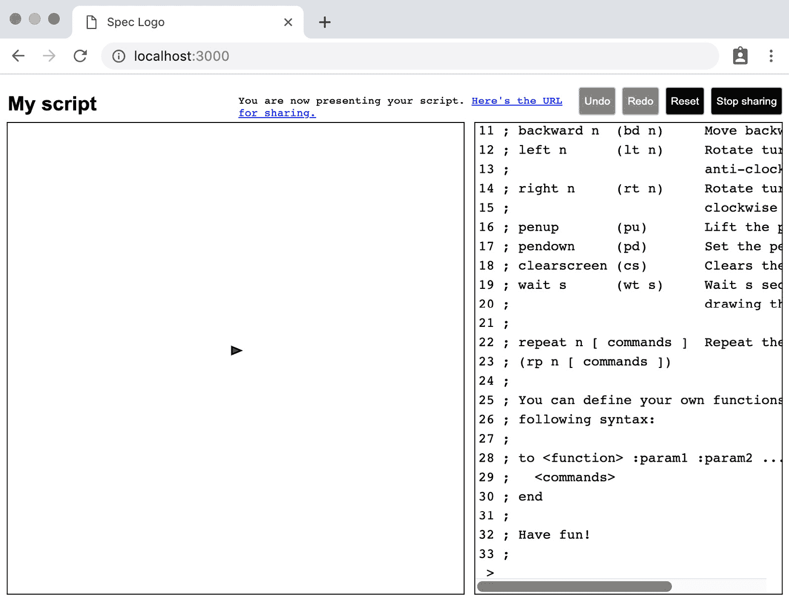

# 第十六章：与 WebSocket 一起工作

在本章中，我们将探讨如何在我们的 React 应用程序中测试驱动 WebSocket API。我们将使用它来构建一种教学机制，其中一个人可以共享他们的屏幕，其他人可以观看他们输入命令。

WebSocket API 并不简单。它使用了许多不同的回调，并要求以特定的顺序调用函数。为了使事情更复杂，我们将在 Redux saga 中这样做：这意味着我们需要做一些工作来将回调 API 转换为可以与生成器函数一起工作的 API。

因为这是最后一章介绍单元测试技术，所以它做了一些不同的处理。它不遵循严格的 TDD 过程。本章的起点是我们已经完成的功能框架。你需要完善这些功能，专注于学习 WebSocket 连接的测试驱动技术。

本章涵盖了以下主题：

+   设计 WebSocket 交互

+   测试 WebSocket 连接

+   使用 redux-saga 进行流式事件

+   更新应用程序

到本章结束时，你将学会 WebSocket API 是如何工作的，以及它的单元测试机制。

# 技术要求

本章的代码文件可以在以下位置找到：

[`github.com/PacktPublishing/Mastering-React-Test-Driven-Development-Second-Edition/tree/main/Chapter16`](https://github.com/PacktPublishing/Mastering-React-Test-Driven-Development-Second-Edition/tree/main/Chapter16)

# 设计 WebSocket 交互

在本节中，我们将首先描述共享工作流程，然后我们将查看支持此工作流程的新 UI 元素，最后我们将介绍你在本章中将进行的代码更改。

## 共享工作流程

一个共享会话由一个演示者和零个或多个观察者组成。这意味着应用程序可以处于两种模式之一：**演示**或**观看**。

当应用程序处于演示模式时，所有观看者都将收到你的 Spec Logo 指令的副本。所有指令都通过 WebSocket 发送到服务器。

当你的应用程序处于观看模式时，WebSocket 从服务器接收指令并立即将它们输出到你的屏幕上。

发送到和从服务器发送的消息是简单的 JSON 格式数据结构。

*图 16.1*显示了界面在演示模式下的外观。



图 16.1 – 演示模式下的 Spec Logo

那么，它是如何工作的？

1.  演示者点击**开始共享**按钮。服务器收到以下消息：

    ```js
    { type: "START_SHARING" }
    ```

1.  服务器随后响应会话的 ID：

    ```js
    { status: "STARTED", id: 123 }
    ```

1.  这个 ID 用于构建一个 URL，该 URL 以观看模式打开应用程序，例如：

    ```js
    http://localhost:3000/index.xhtml?watching=123
    ```

1.  URL 可以在任何地方共享和打开。当应用程序以这种模式打开时，应用程序立即向服务器打开一个 WebSocket 并发送此消息：

    ```js
    { type: "START_WATCHING", id: 123 }
    ```

1.  可以有任意数量的连接的监视器。在初始连接时，演示者已经发送给服务器的任何命令都将被重新播放。这些命令是演示者发送给任何类型为 `SUBMIT_EDIT_LINE` 的 Redux 动作的命令，并且像这样通过 WebSocket 发送到服务器：

    ```js
    {
      type: "NEW_ACTION",
      innerAction: {
        type: "SUBMIT_EDIT_LINE",
        text: "forward 10\n"
      }
    }
    ```

1.  当服务器接收到演示者的 WebSocket 动作时，它会立即将动作转发给每个订阅者：

    ```js
    { type: "SUBMIT_EDIT_LINE", text: "forward 10\n" } }
    ```

1.  服务器还将接收到的动作存储在历史记录中，因此新加入者可以重新播放这些动作。

1.  当监视器完成时，他们只需关闭浏览器窗口，他们的 WebSocket 将关闭。

1.  当演示者完成演示后，他们可以关闭浏览器窗口或点击**停止共享**按钮。这将关闭连接，服务器清除其内部状态。

## 新的 UI 元素

这就是您将在 UI 中找到的内容；所有这些都已经为您构建好了：

+   一个新的菜单按钮来切换共享的开关。它被命名为**开始共享**，但一旦开始共享，名称将切换到**停止共享**。

+   当 Spec Logo 处于共享模式时，菜单按钮栏中会出现一条新消息。它包含一个消息，告诉用户他们是正在演示还是观看。如果他们正在演示，它还包含一个他们可以复制并与他人分享的 URL。

+   您现在可以通过在 Spec Logo URL 的末尾添加搜索参数 `?watching=<id>` 来以观看模式启动应用程序。

接下来，让我们看看您将要填充的 Redux saga 的框架。

## 分离 saga

在文件 `src/middleware/sharingSagas.js` 中存在一个新的 Redux 中间件。这个文件包含两部分。首先，有一个名为 `duplicateForSharing` 的中间件函数。这是一个过滤器，为我们提供了所有希望广播的动作：

```js
export const duplicateForSharing =
  store => next => action => {
    if (action.type === "SUBMIT_EDIT_LINE") {
      store.dispatch({
        type: "SHARE_NEW_ACTION",
        innerAction: action,
      });
    }
    return next(action);
  };
```

其次，还有根 saga 本身。它分为四个更小的函数，这些是我们将在本章中填充的函数，使用测试驱动的方法：

```js
export function* sharingSaga() {
  yield takeLatest("TRY_START_WATCHING", startWatching);
  yield takeLatest("START_SHARING", startSharing);
  yield takeLatest("STOP_SHARING", stopSharing);
  yield takeLatest("SHARE_NEW_ACTION", shareNewAction);
}
```

在设计完成足够多的部分后，让我们开始实施。

# 测试驱动 WebSocket 连接

我们首先填充那个第一个函数，`startSharing`。当接收到 `START_SHARING` 动作时，将调用此函数。该动作是在用户点击**开始共享**按钮时触发的：

1.  打开 `test/middleware/sharingSagas.test.js` 文件，并在顶部添加以下导入：

    ```js
    import { storeSpy, expectRedux } from "expect-redux";
    import { act } from "react-dom/test-utils";
    import { configureStore } from "../../src/store";
    ```

1.  在文件底部，添加一个新的 `describe` 块及其设置。我们将将其分为几个步骤：首先，设置 Redux 存储和 WebSocket 间谍。因为 `window.WebSocket` 是一个构造函数，我们使用 `mockImplementation` 来模拟它：

    ```js
    describe("sharingSaga", () => {
      let store;
      let socketSpyFactory;
      beforeEach(() => {
        store = configureStore([storeSpy]);
        socketSpyFactory = spyOn(window, "WebSocket");
        socketSpyFactory.mockImplementation(() => {
          return {};
        });
      });
    });
    ```

理解 WebSocket API

WebSocket 构造函数返回一个具有`send`和`close`方法的对象，以及`onopen`、`onmessage`、`onclose`和`onerror`事件处理程序。在我们构建测试套件时，我们将实现这些中的大多数。如果你想了解更多关于 WebSocket API 的信息，请查看本章末尾的*进一步阅读*部分。

1.  接下来，因为我们还关心窗口位置，所以我们还需要模拟`window.location`对象。由于在 JSDOM 环境中这是一个只读对象，我们需要使用`Object.defineProperty`函数来覆盖它。这有点笨拙，所以你可能更喜欢将其提取到自己的函数中，并给它一个好名字。将以下内容添加到相同的`beforeEach`块中：

    ```js
    beforeEach(() => {
      ...
      Object.defineProperty(window, "location", {
        writable: true,
          value: {
            protocol: "http:",
            host: "test:1234",
            pathname: "/index.xhtml",
          },
      });
    });
    ```

1.  在嵌套的`describe`块中添加第一个测试。这检查我们是否使用正确的 URL 建立 WebSocket 连接：

    ```js
    describe("START_SHARING", () => {
      it("opens a websocket when starting to share", () => {
        store.dispatch({ type: "START_SHARING" });
        expect(socketSpyFactory).toBeCalledWith(
          "ws://test:1234/share"
        );
      });
    });
    ```

1.  通过在文件`src/middleware/sharingSagas.js`中填充`startSharing`生成器函数来使测试通过（记住，已经为你创建了骨架）。这段代码构建了一个带有正确主机的新 URL：

    ```js
    function* startSharing() {
      const { host } = window.location;
      new WebSocket(`ws://${host}/share`);
    }
    ```

1.  在测试套件中，修改 WebSocket 模拟实现以添加一个内部间谍，`sendSpy`，当用户在 WebSocket 上调用`send`函数时会被调用。我们还需要存储创建的`socketSpy`函数的引用，以便我们可以调用用户附加到其事件处理程序（如`onopen`和`onmessage`）的回调。这将在我们编写下一个测试时变得有意义：

    ```js
    let sendSpy;
    let socketSpy;
    beforeEach(() => {
      sendSpy = jest.fn();
      socketSpyFactory = spyOn(window, "WebSocket");
      socketSpyFactory.mockImplementation(() => {
        socketSpy = {
          send: sendSpy,
        };
        return socketSpy;
      });
    ...
    }
    ```

1.  当使用回调驱动的 API 进行测试驱动开发时，例如 WebSocket API，模拟每个回调的确切行为非常重要。我们将从`onopen`回调开始。下一个测试将触发它，就像服务器发送消息一样。因为我们期望在接收到`onopen`时发生一系列异步操作，所以我们可以使用`async act`等待操作完成。因此，在下一个测试之前，定义以下函数，该函数触发`onopen`回调：

    ```js
    const notifySocketOpened = async () => {
      await act(async () => {
        socketSpy.onopen();
      });
    };
    ```

使用 act 与非 React 代码

`async act`函数即使在处理 React 组件时也能帮助我们，因为它在返回之前会等待 promise 执行。

1.  然后，我们可以在下一个测试中使用`notifySocketOpened`函数，该函数检查当客户端接收到`START_SHARING`动作时，它会立即将其转发到服务器：

    ```js
    it("dispatches a START_SHARING action to the socket", async () => {
      store.dispatch({ type: "START_SHARING" });
      await notifySocketOpened();
      expect(sendSpy).toBeCalledWith(
        JSON.stringify({ type: "START_SHARING" })
     );
    });
    ```

1.  要使测试通过，首先将`startSharing`函数中的现有代码提取到一个名为`openWebsocket`的新函数中。然后，添加代码来调用一个`Promise`对象，当在套接字上接收到`onopen`消息时，它会解析。这段代码相当困难——我们正在构建一个`Promise`对象，专门用于将基于回调的 API 转换为可以使用生成器`yield`关键字的东西：

    ```js
    const openWebSocket = () => {
      const { host } = window.location;
      const socket = new WebSocket(`ws://${host}/share`);
      return new Promise(resolve => {
        socket.onopen = () => {
          resolve(socket)
        };
      });
    };
    ```

1.  现在，你可以在`startSharing`中使用那个`openWebSocket`函数。之后，你的测试应该会通过：

    ```js
    function* startSharing() {
      const presenterSocket = yield openWebSocket();
      presenterSocket.send(
        JSON.stringify({ type: "START_SHARING" })
      );
    }
    ```

1.  下一个测试将从服务器通过套接字向应用发送消息。为此，我们需要一个辅助函数来模拟发送消息并等待清空当前任务队列。将此辅助函数添加到`test/middleware/sharingSagas.test.js`中，在`notifySocketOpened`下方：

    ```js
    const sendSocketMessage = async message => {
      await act(async () => {
        socketSpy.onmessage({
         data: JSON.stringify(message)
        });
      });
    };
    ```

1.  添加下一个测试，使用你刚刚定义的函数：

    ```js
    it("dispatches an action of STARTED_SHARING with a URL containing the id that is returned from the server",   async () => {
      store.dispatch({ type: "START_SHARING" });
      await notifySocketOpened();
      await sendSocketMessage({
        type: "UNKNOWN",
        id: 123,
      });
      return expectRedux(store)
        .toDispatchAnAction()
        .matching({
          type: "STARTED_SHARING",
          url: "http://test:1234/index.xhtml?watching=123",
        });
    });
    ```

1.  为了使这个通过，我们将从套接字读取消息。一旦完成，我们可以将检索到的信息传递回 Redux 存储。首先在`src/middleware/sharingSagas.js`顶部添加以下新函数：

    ```js
    const receiveMessage = (socket) =>
      new Promise(resolve => {
        socket.onmessage = evt => {
          resolve(evt.data)
        };
      });
    const buildUrl = (id) => {
      const {
        protocol, host, pathname
      } = window.location;
      return (
        `${protocol}//${host}${pathname}?watching=${id}`
      );
    };
    ```

1.  现在，你可以使用这些函数来完成`startSharing`的实现：

    ```js
    function* startSharing() {
      const presenterSocket = yield openWebSocket();
      presenterSocket.send(
        JSON.stringify({ type: "START_SHARING" })
      );
      const message = yield receiveMessage(
        presenterSocket
      );
      const presenterSessionId = JSON.parse(message).id;
      yield put({
        type: "STARTED_SHARING",
        url: buildUrl(presenterSessionId),
      });
    }
    ```

开始共享的过程到此结束。现在让我们处理用户点击**停止共享**按钮时会发生什么：

1.  在`describe`块内部创建一个名为`sharingSaga`的辅助函数，如下所示。这个函数将系统状态更改为`STARTED_SHARING`：

    ```js
    const startSharing = async () => {
      store.dispatch({ type: "START_SHARING" });
      await notifySocketOpened();
      await sendSocketMessage({
        type: "UNKNOWN",
        id: 123,
      });
    };
    ```

1.  更新间谍以包括一个`closeSpy`变量，我们以与`sendSpy`相同的方式设置它：

    ```js
    let closeSpy;
    beforeEach(() => {
      sendSpy = jest.fn();
      closeSpy = jest.fn();
      socketSpyFactory = spyOn(window, "WebSocket");
      socketSpyFactory.mockImplementation(() => {
        socketSpy = {
          send: sendSpy,
          close: closeSpy,
        };
        return socketSpy;
      });
      ...
    });
    ```

1.  在新的嵌套上下文中添加第一个测试。它首先开始共享，然后分发`STOP_SHARING`动作：

    ```js
    describe("STOP_SHARING", () => {
      it("calls close on the open socket", async () => {
        await startSharing();
        store.dispatch({ type: "STOP_SHARING" });
        expect(closeSpy).toBeCalled();
      });
    });
    ```

1.  为了使这个通过，我们需要填写`stopSharing`生成器函数。首先，然而，我们需要获取在`startSharing`函数中创建的套接字。将这个变量提取到顶级命名空间中：

    ```js
    let presenterSocket;
    function* startSharing() {
      presenterSocket = yield openWebSocket();
      ...
    }
    ```

1.  然后，在`stopSharing`函数中添加以下定义。然后你可以运行你的测试，一切应该通过；然而，如果你正在运行整个测试套件（使用`npm test`），你会看到几个控制台错误出现。这些错误来自`MenuButtons`测试套件中的一个测试——我们将在稍后的*更新应用*部分修复这个问题：

    ```js
    function* stopSharing() {
      presenterSocket.close();
    }
    ```

仅在一个测试套件中运行测试

为了避免看到控制台错误，请记住你可以选择仅使用命令`npm test test/middleware/sharingSagas.test.js`为此测试套件运行测试。

1.  接下来进行下一个测试，我们想要更新 Redux 存储以包含新的`stopped`状态。这将允许我们移除用户开始共享时出现的消息：

    ```js
    it("dispatches an action of STOPPED_SHARING", async () => {
      await startSharing();
      store.dispatch({ type: "STOP_SHARING" });
      return expectRedux(store)
        .toDispatchAnAction()
        .matching({ type: "STOPPED_SHARING" });
    });
    ```

1.  这是一个简单的单行代码来使其通过：

    ```js
    function* stopSharing() {
      presenterSocket.close();
      yield put({ type: "STOPPED_SHARING" });
    }
    ```

接下来是向服务器广播从演示者发出的动作：

1.  创建一个新的嵌套`describe`块，包含以下测试：

    ```js
    describe("SHARE_NEW_ACTION", () => {
      it("forwards the same action on to the socket", async () => {
        const innerAction = { a: 123 };
        await startSharing(123);
        store.dispatch({
          type: "SHARE_NEW_ACTION",
          innerAction,
        });
        expect(sendSpy).toHaveBeenLastCalledWith(
          JSON.stringify({
            type: "NEW_ACTION",
            innerAction,
          })
        );
      });
    });
    ```

1.  通过填写以下内容来使`shareNewAction`函数通过：

    ```js
    const shareNewAction = ({ innerAction }) => {
      presenterSocket.send(
        JSON.stringify({
          type: "NEW_ACTION",
          innerAction,
        })
      );
    }
    ```

1.  添加下一个测试，该测试检查如果用户没有演示，则不会发送任何动作：

    ```js
    it("does not forward if the socket is not set yet", () => {
      store.dispatch({ type: "SHARE_NEW_ACTION" });
      expect(sendSpy).not.toBeCalled();
    });
    ```

在异步环境中使用 not.toBeCalled

这个测试有一个微妙的问题。尽管它将帮助你添加到软件的设计中，但它作为回归测试的实用性略低，因为它*可能*会导致假阳性。这个测试保证测试的开始和结束之间没有发生任何事情，但它对*之后*发生的事情没有任何保证。这就是异步环境的本质。

1.  使这个测试通过只是简单地添加一段代码的判断条件：

    ```js
    function* shareNewAction({ innerAction } ) {
      if (presenterSocket) {
        presenterSocket.send(
          JSON.stringify({
            type: "NEW_ACTION",
            innerAction,
          })
        );
      }
    }
    ```

1.  我们也不希望当用户停止共享时共享动作——所以让我们添加这个功能：

    ```js
    it("does not forward if the socket has been closed", async () => {
      await startSharing();
      socketSpy.readyState = WebSocket.CLOSED;
      store.dispatch({ type: "SHARE_NEW_ACTION" });
      expect(sendSpy.mock.calls).toHaveLength(1);
    });
    ```

WebSocket 规范

前一个测试中的常量`WebSocket.CLOSED`和以下代码中的常量`WebSocket.OPEN`在 WebSocket 规范中定义。

1.  将测试文件顶部移动，并定义以下两个常量，在导入下面。这是因为当我们监视 WebSocket 构造函数时，我们会覆盖这些值。因此，我们需要将它们重新添加。首先保存真实值：

    ```js
    const WEB_SOCKET_OPEN = WebSocket.OPEN;
    const WEB_SOCKET_CLOSED = WebSocket.CLOSED;
    ```

1.  更新您的监视器，在`WebSocket`被模拟后设置这些常量。当我们在这里时，让我们也将套接字的默认`readyState`设置为`WebSocket.OPEN`，这样其他测试就不会失败：

    ```js
    socketSpyFactory = jest.spyOn(window, "WebSocket");
    Object.defineProperty(socketSpyFactory, "OPEN", {
      value: WEB_SOCKET_OPEN
    });
    Object.defineProperty(socketSpyFactory, "CLOSED", {
      value: WEB_SOCKET_CLOSED
    });
    socketSpyFactory.mockImplementation(() => {
      socketSpy = {
        send: sendSpy,
        close: closeSpy,
        readyState: WebSocket.OPEN,
      };
      return socketSpy;
    });
    ```

1.  最后，回到生产代码中，通过检查`readyState`是否为`WebSocket.OPEN`来使测试通过，这并不完全符合测试的指定，但足够好，可以使它通过：

    ```js
    const shareNewAction = ({ innerAction }) => {
      if (
        presenterSocket &&
        presenterSocket.readyState === WebSocket.OPEN
      ) {
        presenterSocket.send(
          JSON.stringify({
            type: "NEW_ACTION",
            innerAction,
          })
        );
      }
    }
    ```

这就是演示者的行为：我们已经通过测试驱动了`onopen`、`onclose`和`onmessage`回调。在实际应用中，您会希望对`onerror`回调执行相同的流程。

现在，让我们看看监视器的行为。

# 使用 redux-saga 进行事件流

在本节中，我们将重复很多相同的技巧。有两个新概念：首先，提取监视器 ID 的`search`参数，其次，使用`eventChannel`订阅`onmessage`回调。这用于从 WebSocket 持续地将消息流到 Redux 存储。

让我们从指定新的 URL 行为开始：

1.  在`test/middleware/sharingSagas.test.js`的底部写一个新的`describe`块，但仍然嵌套在主`describe`块中：

    ```js
    describe("watching", () => {
      beforeEach(() => {
        Object.defineProperty(window, "location", {
          writable: true,
          value: {
            host: "test:1234",
            pathname: "/index.xhtml",
            search: "?watching=234"
          }
        });
      });
      it("opens a socket when the page loads", () => {
        store.dispatch({ type: "TRY_START_WATCHING" });
        expect(socketSpyFactory).toBeCalledWith(
          "ws://test:1234/share"
        );
      });
    });
    ```

1.  通过在您的生产代码中填写`startWatching`函数来使其通过。您可以使用现有的`openWebSocket`函数：

    ```js
    function* startWatching() {
      yield openWebSocket();
    }
    ```

1.  在下一个测试中，我们将开始使用`search`参数：

    ```js
    it("does not open socket if the watching field is not set", () => {
      window.location.search = "?";
      store.dispatch({ type: "TRY_START_WATCHING" });
      expect(socketSpyFactory).not.toBeCalled();
    });
    ```

1.  通过使用`URLSearchParams`对象提取`search`参数来使其通过：

    ```js
    function* startWatching() {
      const sessionId = new URLSearchParams(
        window.location.search.substring(1)
      ).get("watching");
      if (sessionId) {
        yield openWebSocket();
      }
    }
    ```

1.  在我们编写下一个测试之前，添加以下辅助函数，该函数模拟真实 WebSocket 上将要发生的动作，确保`onopen`被调用：

    ```js
    const startWatching = async () => {
      await act(async () => {
        store.dispatch({ type: "TRY_START_WATCHING" });
        socketSpy.onopen();
      });
    };
    ```

1.  当一个新的观察会话开始时，我们需要重置用户的输出，使其为空：

    ```js
    it("dispatches a RESET action", async () => {
      await startWatching();
      return expectRedux(store)
        .toDispatchAnAction()
        .matching({ type: "RESET" });
    });
    ```

1.  通过添加一个`put`函数调用使其通过：

    ```js
    function* startWatching() {
      const sessionId = new URLSearchParams(
        location.search.substring(1)
      ).get("watching");
      if (sessionId) {
        yield openWebSocket();
        yield put({ type: "RESET" });
      }
    }
    ```

1.  接下来，我们需要向服务器发送一条消息，包括我们希望观察的会话 ID：

    ```js
    it("sends the session id to the socket with an action type of START_WATCHING", async () => {
      await startWatching();
      expect(sendSpy).toBeCalledWith(
        JSON.stringify({
          type: "START_WATCHING",
          id: "234",
        })
      );
    });
    ```

1.  我们已经从上一节中设置了监视器，所以这是一个快速修复：

    ```js
    function* startWatching() {
      const sessionId = new URLSearchParams(
        window.location.search.substring(1)
      ).get("watching");
      if (sessionId) {
        const watcherSocket = yield openWebSocket();
        yield put({ type: "RESET" });
        watcherSocket.send(
          JSON.stringify({
            type: "START_WATCHING",
            id: sessionId,
          })
    );
      }
    }
    ```

1.  下一个测试告诉 Redux 存储我们已经开始观察。这样，React UI 就可以向用户显示一条消息，告诉他们他们已经连接：

    ```js
    it("dispatches a STARTED_WATCHING action", async () => {
      await startWatching();
      return expectRedux(store)
        .toDispatchAnAction()
        .matching({ type: "STARTED_WATCHING" });
    });
    ```

1.  通过添加一个新的`put`调用使其通过，如下所示：

    ```js
    function* startWatching() {
      ...
      if (sessionId) {
        ...
        yield put({ type: "STARTED_WATCHING" });
      }
    }
    ```

1.  现在是最大的一个。我们需要添加允许我们从服务器接收多条消息并读取它们的行为：

    ```js
    it("relays multiple actions from the websocket", async () => {
      const message1 = { type: "ABC" };
      const message2 = { type: "BCD" };
      const message3 = { type: "CDE" };
      await startWatching();
      await sendSocketMessage(message1);
      await sendSocketMessage(message2);
      await sendSocketMessage(message3);
      await expectRedux(store)
        .toDispatchAnAction()
        .matching(message1);
      await expectRedux(store)
        .toDispatchAnAction()
        .matching(message2);
      await expectRedux(store)
        .toDispatchAnAction()
        .matching(message3);
      socketSpy.onclose();
    });
    ```

长测试

你可能会认为有一个只处理一条消息的小测试会很有帮助。然而，对于多条消息来说，这并不能帮助我们，因为我们需要为多条消息使用一个完全不同的实现，正如你将在下一步看到的那样。

1.  我们将使用 `eventChannel` 函数来完成这个任务。它的用法与之前将回调转换为可以使用 `yield` 等待的操作的 `Promise` 对象用法相似。在使用 `Promise` 对象时，我们在回调收到时调用 `resolve`。在使用 `eventChannel` 时，当回调收到时，我们调用 `emitter(END)`。这一点的意义将在下一步变得明显：

    ```js
    import { eventChannel, END } from "redux-saga";
    const webSocketListener = socket =>
      eventChannel(emitter => {
        socket.onmessage = emitter;
        socket.onclose = () => emitter(END);
        return () => {
          socket.onmessage = undefined;
          socket.onclose = undefined;
        };
      });
    ```

理解 eventChannel 函数

来自 `redux-saga` 的 `eventChannel` 函数是一个用于消费发生在 Redux 之外的事件流的机制。在上一个例子中，WebSocket 提供了事件流。当被调用时，`eventChannel` 会调用提供的函数来初始化通道，然后每次收到事件时都必须调用提供的 `emmitter` 函数。在我们的情况下，我们直接将消息传递给 `emmitter` 函数而不做任何修改。当 WebSocket 关闭时，我们传递特殊的 `END` 事件来通知 `redux-saga` 将不再接收更多事件，从而允许它关闭通道。

1.  现在，你可以使用 `websocketListener` 函数创建一个通道，我们可以通过循环反复从该通道获取事件。这个循环需要被 `try` 语句包围。当达到 `emitter(END)` 指令时，将调用 `finally` 块。创建一个新的生成器函数来完成这个任务，如下所示：

    ```js
    function* watchUntilStopRequest(chan) {
      try {
        while (true) {
          let evt = yield take(chan);
          yield put(JSON.parse(evt.data));
        }
      } finally {
      }
    };
    ```

1.  通过在 `startWatching` 中调用这两个函数来将 `webSocketListener` 函数和 `watchUntilStopRequest` 生成器函数链接起来。完成这一步后，你的测试应该通过：

    ```js
    function* startWatching() {
      ...
      if (sessionId) {
        ...
        yield put({ type: "STARTED_WATCHING" });
        const channel = yield call(
          webSocketListener, watcherSocket
        );
        yield call(watchUntilStopRequest(channel);
      }
    }
    ```

1.  最后的测试是向 Redux 存储器发出警报，表明我们已经停止了监听，这样它就可以从 React UI 中删除出现的消息：

    ```js
    it("dispatches a STOPPED_WATCHING action when the connection is closed", async () => {
      await startWatching();
      socketSpy.onclose();
      return expectRedux(store)
        .toDispatchAnAction()
        .matching({ type: "STOPPED_WATCHING" });
    });
    ```

1.  通过在 `watchUntilStopRequest` 中的 `finally` 块中添加这一行代码来实现这一点：

    ```js
    try {
      ...
    } finally {
      yield put({ type: "STOPPED_WATCHING" });
    }
    ```

你现在已经完成了整个故事：你的应用程序现在正在接收事件，你也看到了如何使用 `eventChannel` 函数来监听消息流。

剩下的工作就是将这个功能整合到我们的 React 组件中。

# 更新应用程序

我们已经完成了构建 sagas 的工作，但我们在应用程序的其余部分只需要做一些调整。

`MenuButtons` 组件已经功能完整，但我们需要更新测试以正确地测试中间件，有两种方式：首先，我们必须模拟 WebSocket 构造函数，其次，我们需要在应用程序启动时立即触发一个 `TRY_START_WATCHING` 动作：

1.  打开 `test/MenuButtons.test.js` 并首先导入 `act` 函数。我们需要这个函数来等待我们的 socket saga 动作：

    ```js
    import { act } from "react-dom/test-utils";
    ```

1.  接下来，找到名为 `sharing button` 的 `describe` 块，并插入以下 `beforeEach` 块，它与你在 saga 测试中使用的模拟构造函数类似：

    ```js
    describe("sharing button", () => {
      let socketSpyFactory;
      let socketSpy;
      beforeEach(() => {
        socketSpyFactory = jest.spyOn(
          window,
          "WebSocket"
        );
        socketSpyFactory.mockImplementation(() => {
          socketSpy = {
            close: () => {},
            send: () => {},
          };
          return socketSpy;
        });
      });
    });
    ```

1.  接下来，在相同的 `describe` 块中，添加以下 `notifySocketOpened` 实现方式。这与 saga 测试中的 `notifySocketOpened` 实现方式不同，因为它同时调用了 `onopen` 和 `onmessage`，并附带一个示例消息。所有这些对于 `startSharing` saga 正确运行都是必要的：它模拟了 WebSocket 的打开，然后服务器发送第一条消息，这将导致发送 `STARTED_SHARING` 消息：

    ```js
    const notifySocketOpened = async () => {
      const data = JSON.stringify({ id: 1 });
      await act(async () => {
        socketSpy.onopen();
        socketSpy.onmessage({ data });
      });
    };
    ```

1.  我们现在可以使用这个来更新导致控制台错误的测试。这个测试的描述是 `当点击停止共享时，触发 STOP_SHARING 动作`。为了避免错误，我们必须调整几行。首先，我们发送一个 `START_SHARING` 消息，而不是 `STARTED_SHARING` 消息。然后，我们使用 `notifySocketOpened` 来模拟服务器对套接字打开的响应。这将触发 saga 发送 `STARTED_SHARING` 事件，导致 `MenuButtons` 改变为名为 `STOP_SHARING` 的事件被发送：

    ```js
    it("dispatches an action of STOP_SHARING when stop sharing is clicked", async () => {
      renderWithStore(<MenuButtons />);
      dispatchToStore({ type: "START_SHARING" });
      await notifySocketOpened();
      click(buttonWithLabel("Stop sharing"));
      return expectRedux(store)
        .toDispatchAnAction()
        .matching({ type: "STOP_SHARING" });
    });
    ```

1.  测试通过后，更新 `src/index.js` 以在应用首次加载时调用 `TRY_START_WATCHING` 动作：

    ```js
    const store = configureStoreWithLocalStorage();
    store.dispatch({ type: "TRY_START_WATCHING" });
    ReactDOM
      .createRoot(document.getElementById("root"))
      .render(
        <Provider store={store}>
          <App />
        </Provider);
    ```

你现在可以运行应用并尝试它。以下是一个你可以尝试的手动测试：

1.  在浏览器窗口中打开一个会话并点击 **开始共享**。

1.  右键单击出现的链接，并选择在新窗口中打开它。

1.  将你的两个窗口移动到并排的位置。

1.  在原始窗口中输入一些命令，例如 `forward 100` 和 `right 90`。你应该看到命令已更新。

1.  现在，在原始窗口中点击 **停止共享**。你应该看到共享消息从两个屏幕上消失。

这就涵盖了测试驱动 WebSocket 的内容。

# 摘要

在本章中，我们介绍了如何针对 WebSocket API 进行测试。

你已经看到了如何模拟 WebSocket 构造函数，以及如何测试其 `onopen`、`onclose` 和 `onmessage` 回调。

你还看到了如何使用 `Promise` 对象将回调转换为可以在生成器函数中产生的对象，以及如何使用 `eventChannel` 将事件流发送到 Redux 存储。

在下一章中，我们将探讨如何使用 Cucumber 测试来推动共享功能的改进。

# 练习

你可以添加哪些测试来确保套接字错误能够优雅地处理？

# 进一步阅读

WebSocket 规范：

[`www.w3.org/TR/websockets/`](https://www.w3.org/TR/websockets/)

# 第四部分 – 使用 Cucumber 进行行为驱动开发

这一部分是关于使用 Cucumber 测试进行 **行为驱动开发**（**BDD**）。前三个部分侧重于在组件级别构建 Jest 单元测试，而这一部分则关注在 *系统* 级别编写测试——你也可以将这些视为端到端测试。目标是展示 TDD 工作流程如何应用于单元测试之外，并且可以被整个团队使用，而不仅仅是开发者。

最后，我们以讨论 TDD 如何在更广泛的测试领域中适用以及如何继续您的 TDD 之旅的建议来结束本书。

本部分包括以下章节：

+   *第十七章*, *编写您的第一个 Cucumber 测试*

+   *第十八章*, *由 Cucumber 测试引导添加功能*

+   *第十九章*, *在更广泛的测试领域中理解 TDD*
