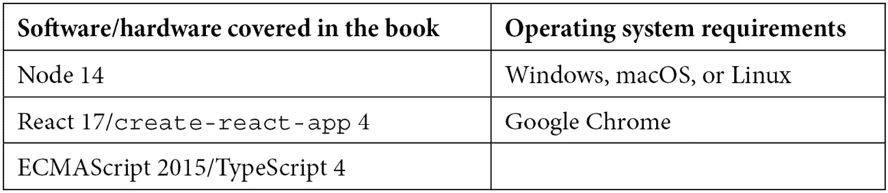

# 前言

*状态管理是 React 中最复杂的概念之一。传统上，开发者们使用单一的状态管理解决方案。多亏了 React Hooks，微状态管理是一种针对将应用程序从单体迁移到微服务而调整的解决方案。*

*本书提供了一种实用的微状态管理实现方法，让您能够迅速上手并高效工作。您将学习 React 中状态管理的基本模式，并了解如何在需要使状态全局时克服遇到的挑战。后续章节将展示如何将状态分割成片段是克服限制的方法。使用 hooks，您将看到如何轻松重用逻辑，并为特定领域提供多种解决方案，例如表单状态和服务器缓存状态。最后，您将探索如何使用 Zustand、Jotai 和 Valtio 等库来组织状态并高效地管理开发。*

*在本 React 书籍结束时，您将学会如何为您的应用程序需求选择正确的全局状态管理解决方案。*

# 本书面向对象

*如果您是处理复杂全局状态管理解决方案的 React 开发者，并想了解如何根据您的需求选择最佳替代方案，这本书适合您。假设您具备 JavaScript、React Hooks 和 TypeScript 的基本知识。*

# 本书涵盖的内容

*第一章*, *React Hooks 中的微状态管理是什么？*，解释了 React Hooks 如何帮助处理状态。这使我们能够拥有更多目的特定的解决方案。

*第二章*, *使用局部和全局状态*，讨论了两种状态类型。局部状态经常被使用且更受欢迎。全局状态用于在多个组件之间共享状态。

*第三章*, *使用上下文共享组件状态*，描述了上下文是处理全局状态的主要方法，以及它是如何在 React 生命周期内工作的。我们需要一些模式来避免额外的重新渲染。

*第四章*, *使用订阅共享模块状态*，解释了模块状态是全局状态的另一种方法。它工作在 React 生命周期之外。我们需要将模块状态连接到 React 组件，但订阅模块状态使得优化重新渲染变得更加容易。

*第五章*, *使用上下文和订阅共享组件状态*，展示了通过使用上下文和订阅来使用全局状态的另一种方法。它适用于 React 的生命周期内，并避免了额外的重新渲染。

*第六章*, *介绍全局状态库*，介绍了用于解决全局状态中常见问题的各种方法的库。

*第七章*，*用例场景 1 – Zustand*，讨论了一个名为 Zustand 的库，用于创建可以在 React 中使用的模块状态。

*第八章*，*用例场景 2 – Jotai*，介绍了一个基于 Context 和原子数据模型的库 Jotai。它也可以优化重新渲染。

*第九章*，*用例场景 3 – Valtio*，讨论了一个名为 Valtio 的库，用于可变模块状态。它自动优化重新渲染。

*第十章*，*用例场景 4 – React Tracked*，讨论了一个名为 React Tracked 的库，用于为某些其他库（如 Context、Zustand 和 React-Redux）启用自动渲染优化。

*第十一章*，*三个全局状态库之间的相似之处和不同之处*，比较了三个全局状态库——Zustand、Jotai 和 Valtio。

# 为了充分利用本书

*您需要在计算机上安装 Node.js 的版本——v14 或更高版本，以及* `create-react-app` *包。*



*或者，可以使用在线代码编辑器，如 CodeSandbox。*

**如果您正在使用本书的数字版，我们建议您亲自输入代码或从本书的 GitHub 仓库（下一节中提供链接）获取代码。这样做将有助于您避免与代码复制和粘贴相关的任何潜在错误。**

*强烈建议您基于本书所学内容创建一个小型应用程序。*

# 下载示例代码文件

您可以从 GitHub（[`github.com/PacktPublishing/Micro-State-Management-with-React-Hooks`](https://github.com/PacktPublishing/Micro-State-Management-with-React-Hooks)）下载本书的示例代码文件。如果代码有更新，它将在 GitHub 仓库中更新。

我们还有其他丰富的图书和视频的代码包，可在[`github.com/PacktPublishing/`](https://github.com/PacktPublishing/)找到。查看它们！

# 使用的约定

本书使用了多种文本约定。

`文本中的代码`：表示文本中的代码词汇、数据库表名、文件夹名、文件名、文件扩展名、路径名、虚拟 URL、用户输入和 Twitter 昵称。以下是一个示例：“最好重用`Counter`组件来为不同的存储提供支持。”

代码块设置如下：

```js
const ThemeContext = createContext('light');
const Component = () => {
  const theme = useContext(ThemeContext);
  return <div>Theme: {theme}</div>
};
```

**粗体**：表示新术语、重要词汇或屏幕上看到的词汇。例如，菜单或对话框中的词汇以**粗体**显示。以下是一个示例：“如果你点击**+1**按钮，在**使用默认存储**中，你会看到**使用默认存储**中的两个计数器一起更新。”

小贴士或重要提示

看起来像这样。

# 联系我们

欢迎读者反馈。

**一般反馈**：如果您对这本书的任何方面有疑问，请通过 mailto:customercare@packtpub.com 给我们发邮件，并在邮件主题中提及书名。

**勘误**：尽管我们已经尽最大努力确保内容的准确性，但错误仍然可能发生。如果您在这本书中发现了错误，我们将非常感激您能向我们报告。请访问[www.packtpub.com/support/errata](https://www.packtpub.com/support/errata)并填写表格。

**盗版**：如果您在互联网上发现我们作品的任何形式的非法副本，如果您能提供位置地址或网站名称，我们将不胜感激。请通过 mailto:copyright@packt.com 与我们联系，并附上材料的链接。

**如果您有兴趣成为作者**：如果您在某个领域有专业知识，并且对撰写或参与一本书籍感兴趣，请访问[authors.packtpub.com](https://authors.packtpub.com)。
